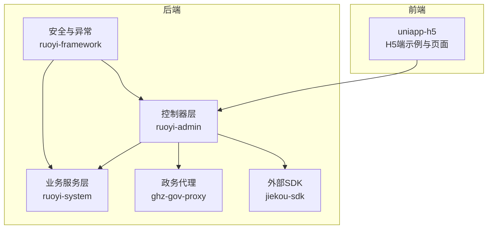
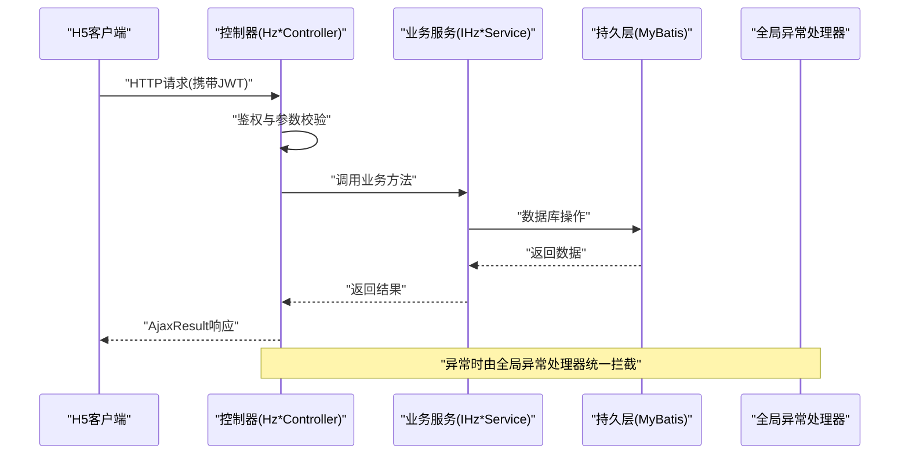
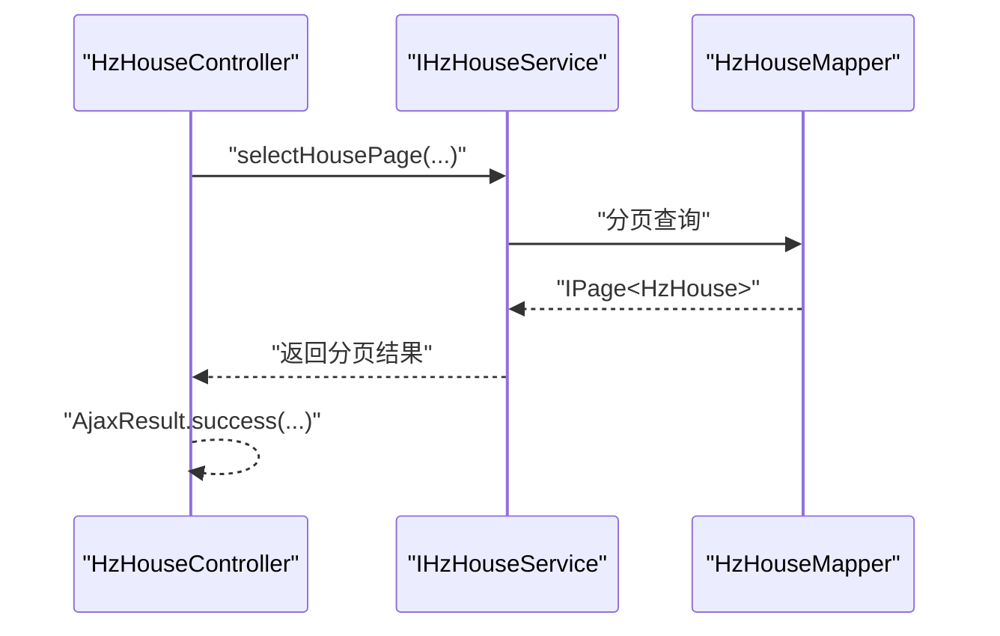
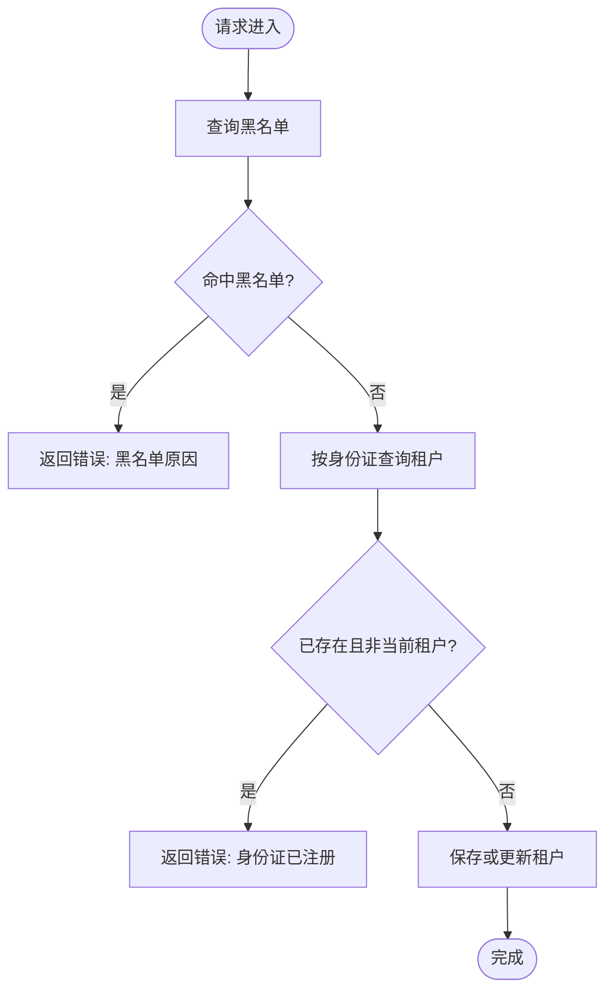
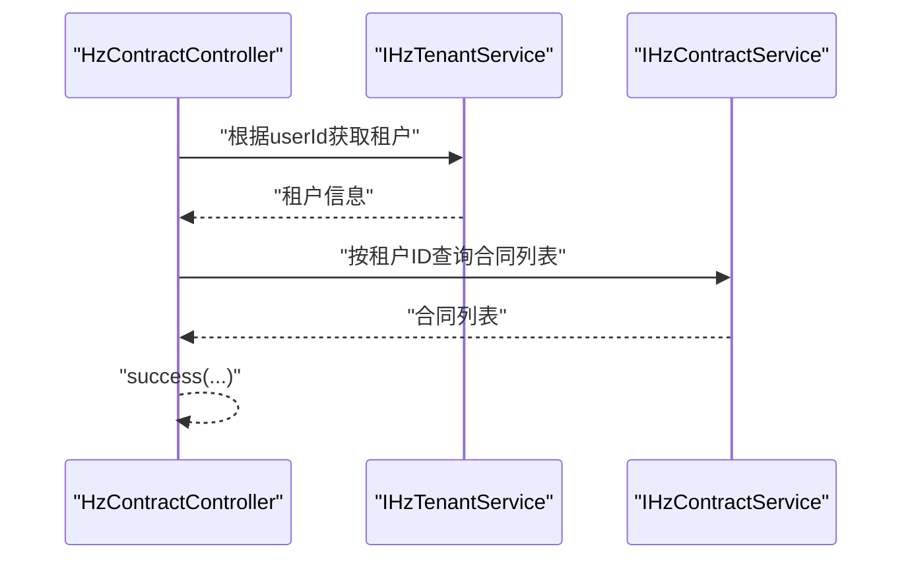
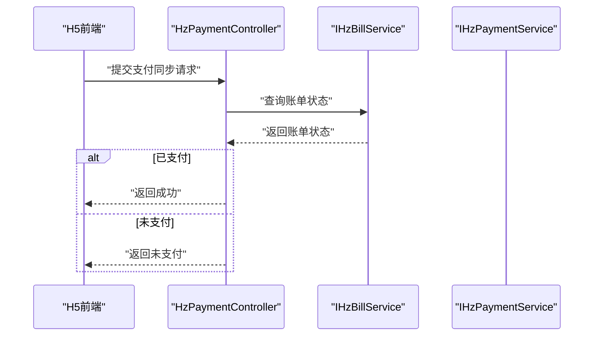
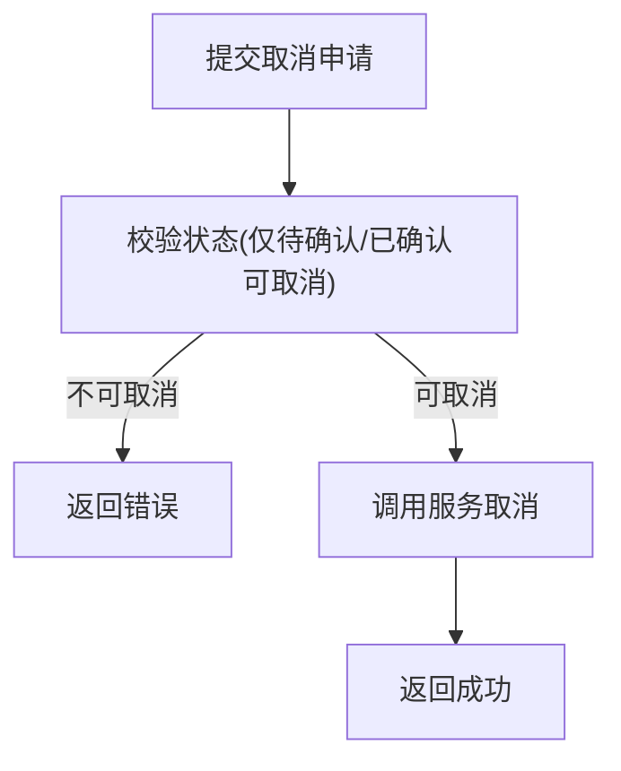
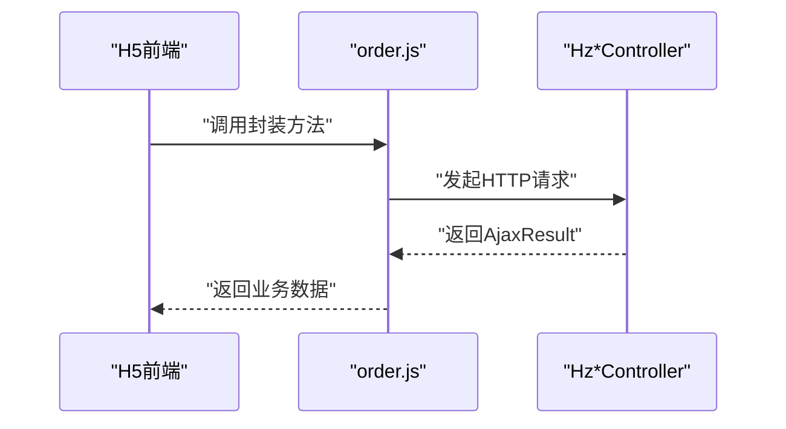
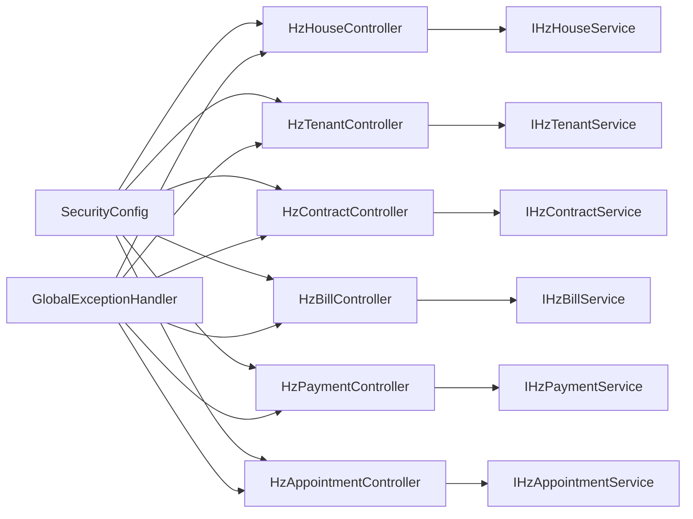

# API接口文档

<cite>
**本文引用的文件**
- [application.yml](file://ruoyi-admin/src/main/resources/application.yml)
- [SecurityConfig.java](file://ruoyi-framework/src/main/java/com/ruoyi/framework/config/SecurityConfig.java)
- [GlobalExceptionHandler.java](file://ruoyi-framework/src/main/java/com/ruoyi/framework/web/exception/GlobalExceptionHandler.java)
- [HzHouseController.java](file://ruoyi-admin/src/main/java/com/ruoyi/web/controller/h5/HzHouseController.java)
- [HzTenantController.java](file://ruoyi-admin/src/main/java/com/ruoyi/web/controller/h5/HzTenantController.java)
- [HzContractController.java](file://ruoyi-admin/src/main/java/com/ruoyi/web/controller/h5/HzContractController.java)
- [HzBillController.java](file://ruoyi-admin/src/main/java/com/ruoyi/web/controller/h5/HzBillController.java)
- [HzPaymentController.java](file://ruoyi-admin/src/main/java/com/ruoyi/web/controller/h5/HzPaymentController.java)
- [HzContractAppController.java](file://ruoyi-admin/src/main/java/com/ruoyi/web/controller/h5/HzContractAppController.java)
- [HzAppointmentController.java](file://ruoyi-admin/src/main/java/com/ruoyi/web/controller/h5/HzAppointmentController.java)
- [HzPayment.java](file://ruoyi-system/src/main/java/com/ruoyi/system/domain/HzPayment.java)
- [HzBill.java](file://ruoyi-system/src/main/java/com/ruoyi/system/domain/HzBill.java)
- [HzBillVO.java](file://ruoyi-system/src/main/java/com/ruoyi/system/domain/HzBillVO.java)
- [HzAppointment.java](file://ruoyi-system/src/main/java/com/ruoyi/system/domain/HzAppointment.java)
- [IHzAppointmentService.java](file://ruoyi-system/src/main/java/com/ruoyi/system/service/IHzAppointmentService.java)
- [order.js](file://uniapp-h5/api/order.js)
- [bill.vue](file://uniapp-h5/subpkg/affairs/bill.vue)
- [GovProxyConfig.java](file://ghz-gov-proxy/src/main/java/com/ghz/gov/config/GovProxyConfig.java)
- [GovApiController.java](file://ghz-gov-proxy/src/main/java/com/ghz/gov/controller/GovApiController.java)
- [SdkEstateApp.java](file://jiekou-sdk/java/RELEASE/ShieldAsyncApp_获取访问令牌_87BD3A66EA7749EC970C966E3DAAEE41.java)
- [ShieldSyncApp_授权_省民政_婚姻实时信息V2接口_67E20E7BE2B14F8CB716D965D5ECF0FA.java](file://jiekou-sdk/java-2/RELEASE/ShieldSyncApp_授权_省民政_婚姻实时信息V2接口_67E20E7BE2B14F8CB716D965D5ECF0FA.java)
- [ShieldSyncApp_授权_不动产登记信息V1_4D90543CC15F4933A0614AE2B9B2935B.java](file://jiekou-sdk/java-3/RELEASE/ShieldSyncApp_授权_不动产登记信息V1_4D90543CC15F4933A0614AE2B9B2935B.java)
- [ShieldSyncApp_授权省人社_参保单位社会保险缴费信息V7_548E6780B5974C92B3CE92274AC14375.java](file://jiekou-sdk/java-4/RELEASE/ShieldSyncApp_授权省人社_参保单位社会保险缴费信息V7_548E6780B5974C92B3CE92274AC14375.java)
- [ShieldSyncApp_公租房申请人信息查询V1_12842C37F2F542E18E76279B0DCD3415.java](file://jiekou-sdk/java-5/RELEASE/ShieldSyncApp_公租房申请人信息查询V1_12842C37F2F542E18E76279B0DCD3415.java)
- [ShieldSyncApp_省人社参保人员社会保险缴费信息v7_D411ED5DBBF14AB1BE46CE5AE152131E.java](file://jiekou-sdk/java6/RELEASE/ShieldSyncApp_省人社参保人员社会保险缴费信息v7_D411ED5DBBF14AB1BE46CE5AE152131E.java)
</cite>

## 目录
1. [简介](#简介)
2. [项目结构](#项目结构)
3. [核心组件](#核心组件)
4. [架构总览](#架构总览)
5. [详细组件分析](#详细组件分析)
6. [依赖分析](#依赖分析)
7. [性能考虑](#性能考虑)
8. [故障排查指南](#故障排查指南)
9. [结论](#结论)
10. [附录](#附录)

## 简介
本文件为“港好住信息系统”的API接口完整参考文档，面向前后端开发者与集成方，系统性梳理公开RESTful接口，覆盖房源管理、租户管理、合同管理、账单与支付、预约看房、业务流程等模块。文档同时说明认证与权限、参数校验、错误处理、版本治理、测试资源与调用示例，帮助快速、准确地完成对接与集成。

## 项目结构
后端基于Spring Boot + Spring Security + SpringDoc OpenAPI，采用分层架构：
- 控制层：位于 ruoyi-admin 模块，按业务域划分 H5 端与系统管理端控制器
- 业务层：位于 ruoyi-system 模块，包含领域模型与服务接口
- 安全与异常：位于 ruoyi-framework 模块，统一鉴权、跨域、异常处理
- 前端示例：uniapp-h5 提供H5端调用示例与页面交互
- 政务数据代理：ghz-gov-proxy 提供外部政务接口代理能力
- SDK：jiekou-sdk 提供多套外部接口SDK封装

**图表来源**
- [HzHouseController.java:17-84](file://ruoyi-admin/src/main/java/com/ruoyi/web/controller/h5/HzHouseController.java#L17-L84)
- [HzTenantController.java:17-90](file://ruoyi-admin/src/main/java/com/ruoyi/web/controller/h5/HzTenantController.java#L17-L90)
- [HzContractController.java:19-66](file://ruoyi-admin/src/main/java/com/ruoyi/web/controller/h5/HzContractController.java#L19-L66)
- [HzBillController.java:19-95](file://ruoyi-admin/src/main/java/com/ruoyi/web/controller/h5/HzBillController.java#L19-L95)
- [HzPaymentController.java:131-166](file://ruoyi-admin/src/main/java/com/ruoyi/web/controller/h5/HzPaymentController.java#L131-L166)
- [SecurityConfig.java:85-124](file://ruoyi-framework/src/main/java/com/ruoyi/framework/config/SecurityConfig.java#L85-L124)
- [GlobalExceptionHandler.java:27-146](file://ruoyi-framework/src/main/java/com/ruoyi/framework/web/exception/GlobalExceptionHandler.java#L27-L146)
- [GovProxyConfig.java](file://ghz-gov-proxy/src/main/java/com/ghz/gov/config/GovProxyConfig.java)
- [SdkEstateApp.java](file://jiekou-sdk/java/RELEASE/ShieldAsyncApp_获取访问令牌_87BD3A66EA7749EC970C966E3DAAEE41.java)

**章节来源**
- [application.yml:1-238](file://ruoyi-admin/src/main/resources/application.yml#L1-L238)
- [SecurityConfig.java:85-124](file://ruoyi-framework/src/main/java/com/ruoyi/framework/config/SecurityConfig.java#L85-L124)

## 核心组件
- 认证与权限
  - 基于JWT的无状态认证，启用CORS，开放部分匿名接口（登录、H5、Swagger、静态资源等），其余接口均需鉴权
  - 支持方法级权限注解（如系统管理端的@PreAuthorize）
- 统一响应与异常
  - 统一AjaxResult响应体；全局异常处理器捕获各类异常并返回标准错误码与提示
- 接口文档
  - 通过SpringDoc在/v3/api-docs与/swagger-ui.html暴露OpenAPI文档

**章节来源**
- [SecurityConfig.java:85-124](file://ruoyi-framework/src/main/java/com/ruoyi/framework/config/SecurityConfig.java#L85-L124)
- [GlobalExceptionHandler.java:27-146](file://ruoyi-framework/src/main/java/com/ruoyi/framework/web/exception/GlobalExceptionHandler.java#L27-L146)
- [application.yml:135-147](file://ruoyi-admin/src/main/resources/application.yml#L135-L147)

## 架构总览
以下序列图展示H5端用户通过控制器访问业务服务的一般流程，并体现鉴权与异常处理：

**图表来源**
- [HzHouseController.java:27-50](file://ruoyi-admin/src/main/java/com/ruoyi/web/controller/h5/HzHouseController.java#L27-L50)
- [HzTenantController.java:30-69](file://ruoyi-admin/src/main/java/com/ruoyi/web/controller/h5/HzTenantController.java#L30-L69)
- [GlobalExceptionHandler.java:27-146](file://ruoyi-framework/src/main/java/com/ruoyi/framework/web/exception/GlobalExceptionHandler.java#L27-L146)

## 详细组件分析

### 认证与权限规则
- 认证方式
  - Header携带Authorization头，值为Bearer Token
  - Token密钥与过期时间在配置中定义
- 匿名接口
  - 登录、注册、验证码、H5端/app/**、/h5/**、通用上传、静态资源、Swagger等
- 鉴权与权限
  - 其余接口需登录态；系统管理端使用@PreAuthorize进行细粒度权限控制
- CORS与安全
  - 启用CORS过滤器；禁用CSRF；会话策略STATELESS

**章节来源**
- [application.yml:95-103](file://ruoyi-admin/src/main/resources/application.yml#L95-L103)
- [SecurityConfig.java:85-124](file://ruoyi-framework/src/main/java/com/ruoyi/framework/config/SecurityConfig.java#L85-L124)

### 错误处理与统一响应
- 统一响应体
  - AjaxResult作为统一返回载体
- 异常分类
  - 权限不足、请求方法不支持、业务异常、参数类型不匹配、未知异常、演示模式等
- 返回码
  - 使用HttpStatus常量与业务异常码组合

**章节来源**
- [GlobalExceptionHandler.java:27-146](file://ruoyi-framework/src/main/java/com/ruoyi/framework/web/exception/GlobalExceptionHandler.java#L27-L146)

### 房源管理接口
- H5端分页查询房源列表
  - 方法与路径：GET /h5/house/page
  - 请求参数：pageNum、pageSize、HzHouse筛选条件
  - 响应：分页数据
- 获取房源详情
  - 方法与路径：GET /h5/house/{houseId}
  - 响应：房源详情（含浏览次数递增）
- 按项目查询房源
  - 方法与路径：GET /h5/house/listByProject/{projectId}
  - 请求参数：pageNum、pageSize
- 精选房源
  - 方法与路径：GET /h5/house/featured
  - 请求参数：pageNum、pageSize

**图表来源**
- [HzHouseController.java:27-82](file://ruoyi-admin/src/main/java/com/ruoyi/web/controller/h5/HzHouseController.java#L27-L82)

**章节来源**
- [HzHouseController.java:17-84](file://ruoyi-admin/src/main/java/com/ruoyi/web/controller/h5/HzHouseController.java#L17-L84)

### 租户管理接口
- 获取当前用户租户信息
  - 方法与路径：GET /h5/tenant/info
  - 响应：租户信息
- 新增或更新租户信息
  - 方法与路径：POST /h5/tenant/save
  - 请求体：HzTenant
  - 校验：黑名单与身份证重复
  - 响应：操作结果
- 校验身份证是否已注册且不在黑名单
  - 方法与路径：GET /h5/tenant/checkIdCard/{idCard}

**图表来源**
- [HzTenantController.java:41-69](file://ruoyi-admin/src/main/java/com/ruoyi/web/controller/h5/HzTenantController.java#L41-L69)

**章节来源**
- [HzTenantController.java:17-90](file://ruoyi-admin/src/main/java/com/ruoyi/web/controller/h5/HzTenantController.java#L17-L90)

### 合同管理接口
- H5端合同列表
  - 方法与路径：GET /h5/contract/list
  - 依赖：先获取租户信息，再按租户ID查询合同
- 合同详情
  - 方法与路径：GET /h5/contract/{contractId}
- 合同PDF
  - 方法与路径：GET /h5/contract/pdf/{contractId}
  - 响应：合同文件URL

**图表来源**
- [HzContractController.java:30-43](file://ruoyi-admin/src/main/java/com/ruoyi/web/controller/h5/HzContractController.java#L30-L43)

**章节来源**
- [HzContractController.java:19-66](file://ruoyi-admin/src/main/java/com/ruoyi/web/controller/h5/HzContractController.java#L19-L66)

### 账单与支付接口
- H5端账单列表
  - 方法与路径：GET /h5/bill/list
- 账单详情
  - 方法与路径：GET /h5/bill/{billId}
- 待支付账单
  - 方法与路径：GET /h5/bill/unpaid
- 逾期账单
  - 方法与路径：GET /h5/bill/overdue
- 按合同ID查询账单
  - 方法与路径：GET /h5/bill/contract/{contractId}
- 支付记录列表
  - 方法与路径：GET /h5/pay/list/{billId}
- 支付记录详情
  - 方法与路径：GET /h5/pay/{paymentId}
- 微信支付同步
  - 方法与路径：POST /h5/pay/wechat/sync/{billNo}
  - 前端轮询策略：最多重试5次，间隔2秒

**图表来源**
- [HzBillController.java:30-93](file://ruoyi-admin/src/main/java/com/ruoyi/web/controller/h5/HzBillController.java#L30-L93)
- [HzPaymentController.java:131-166](file://ruoyi-admin/src/main/java/com/ruoyi/web/controller/h5/HzPaymentController.java#L131-L166)
- [bill.vue:408-428](file://uniapp-h5/subpkg/affairs/bill.vue#L408-L428)

**章节来源**
- [HzBillController.java:19-95](file://ruoyi-admin/src/main/java/com/ruoyi/web/controller/h5/HzBillController.java#L19-L95)
- [HzPaymentController.java:131-166](file://ruoyi-admin/src/main/java/com/ruoyi/web/controller/h5/HzPaymentController.java#L131-L166)
- [HzPayment.java:18-202](file://ruoyi-system/src/main/java/com/ruoyi/system/domain/HzPayment.java#L18-L202)
- [HzBill.java:19-56](file://ruoyi-system/src/main/java/com/ruoyi/system/domain/HzBill.java#L19-L56)
- [HzBillVO.java:10-63](file://ruoyi-system/src/main/java/com/ruoyi/system/domain/HzBillVO.java#L10-L63)
- [bill.vue:408-428](file://uniapp-h5/subpkg/affairs/bill.vue#L408-L428)

### 预约看房接口
- 取消预约
  - 方法与路径：POST /h5/appointment/cancel
  - 参数：appointmentId、cancelReason
- 用户确认看房
  - 方法与路径：POST /h5/appointment/confirmViewing
  - 参数：appointmentId
- 检查时间段是否可预约
  - 方法与路径：GET /h5/appointment/checkTimeSlot
  - 参数：houseId、appointmentDate、timeSlot
- 预约看房列表（系统端）
  - 方法与路径：GET /system/appointment/list
  - 参数：HzAppointment筛选条件、分页

**图表来源**
- [HzAppointmentController.java:121-131](file://ruoyi-admin/src/main/java/com/ruoyi/web/controller/h5/HzAppointmentController.java#L121-L131)

**章节来源**
- [HzAppointmentController.java:121-163](file://ruoyi-admin/src/main/java/com/ruoyi/web/controller/h5/HzAppointmentController.java#L121-L163)
- [IHzAppointmentService.java:57-114](file://ruoyi-system/src/main/java/com/ruoyi/system/service/IHzAppointmentService.java#L57-L114)
- [HzAppointment.java:108-174](file://ruoyi-system/src/main/java/com/ruoyi/system/domain/HzAppointment.java#L108-L174)

### 业务流程接口（H5端）
- 创建选房预订单
  - 方法与路径：POST /h5/order/create
  - 参数：tenantId、houseId
- 查询订单状态及剩余时间
  - 方法与路径：GET /h5/order/status/{orderNo}
- 取消预订单
  - 方法与路径：POST /h5/order/cancel
  - 参数：orderNo、tenantId
- 获取待上传资料的订单列表
  - 方法与路径：GET /h5/order/pending-upload/{tenantId}
- 入住前置检查
  - 方法与路径：GET /h5/order/checkin-check/{tenantId}

**图表来源**
- [order.js:1-27](file://uniapp-h5/api/order.js#L1-L27)

**章节来源**
- [order.js:1-27](file://uniapp-h5/api/order.js#L1-L27)

### 政务数据接口代理
- 代理服务基础配置
  - 基础URL与API Key通过配置注入
- 代理控制器
  - 提供统一入口转发外部政务接口请求

**章节来源**
- [application.yml:220-230](file://ruoyi-admin/src/main/resources/application.yml#L220-L230)
- [GovProxyConfig.java](file://ghz-gov-proxy/src/main/java/com/ghz/gov/config/GovProxyConfig.java)
- [GovApiController.java](file://ghz-gov-proxy/src/main/java/com/ghz/gov/controller/GovApiController.java)

### 外部接口SDK
- 提供多套外部接口SDK封装，涵盖婚姻、不动产、社保等
- SDK包含同步、异步、WebSocket三种调用形态

**章节来源**
- [SdkEstateApp.java](file://jiekou-sdk/java/RELEASE/ShieldAsyncApp_获取访问令牌_87BD3A66EA7749EC970C966E3DAAEE41.java)
- [ShieldSyncApp_授权_省民政_婚姻实时信息V2接口_67E20E7BE2B14F8CB716D965D5ECF0FA.java](file://jiekou-sdk/java-2/RELEASE/ShieldSyncApp_授权_省民政_婚姻实时信息V2接口_67E20E7BE2B14F8CB716D965D5ECF0FA.java)
- [ShieldSyncApp_授权_不动产登记信息V1_4D90543CC15F4933A0614AE2B9B2935B.java](file://jiekou-sdk/java-3/RELEASE/ShieldSyncApp_授权_不动产登记信息V1_4D90543CC15F4933A0614AE2B9B2935B.java)
- [ShieldSyncApp_授权省人社_参保单位社会保险缴费信息V7_548E6780B5974C92B3CE92274AC14375.java](file://jiekou-sdk/java-4/RELEASE/ShieldSyncApp_授权省人社_参保单位社会保险缴费信息V7_548E6780B5974C92B3CE92274AC14375.java)
- [ShieldSyncApp_公租房申请人信息查询V1_12842C37F2F542E18E76279B0DCD3415.java](file://jiekou-sdk/java-5/RELEASE/ShieldSyncApp_公租房申请人信息查询V1_12842C37F2F542E18E76279B0DCD3415.java)
- [ShieldSyncApp_省人社参保人员社会保险缴费信息v7_D411ED5DBBF14AB1BE46CE5AE152131E.java](file://jiekou-sdk/java6/RELEASE/ShieldSyncApp_省人社参保人员社会保险缴费信息v7_D411ED5DBBF14AB1BE46CE5AE152131E.java)

## 依赖分析
- 控制器依赖业务服务接口，业务服务依赖Mapper与领域模型
- 安全配置对匿名接口与受保护接口进行分流
- 异常处理器对控制器与服务层异常进行统一收敛

**图表来源**
- [HzHouseController.java:17-84](file://ruoyi-admin/src/main/java/com/ruoyi/web/controller/h5/HzHouseController.java#L17-L84)
- [HzTenantController.java:17-90](file://ruoyi-admin/src/main/java/com/ruoyi/web/controller/h5/HzTenantController.java#L17-L90)
- [HzContractController.java:19-66](file://ruoyi-admin/src/main/java/com/ruoyi/web/controller/h5/HzContractController.java#L19-L66)
- [HzBillController.java:19-95](file://ruoyi-admin/src/main/java/com/ruoyi/web/controller/h5/HzBillController.java#L19-L95)
- [HzPaymentController.java:131-166](file://ruoyi-admin/src/main/java/com/ruoyi/web/controller/h5/HzPaymentController.java#L131-L166)
- [HzAppointmentController.java:121-163](file://ruoyi-admin/src/main/java/com/ruoyi/web/controller/h5/HzAppointmentController.java#L121-L163)
- [SecurityConfig.java:85-124](file://ruoyi-framework/src/main/java/com/ruoyi/framework/config/SecurityConfig.java#L85-L124)
- [GlobalExceptionHandler.java:27-146](file://ruoyi-framework/src/main/java/com/ruoyi/framework/web/exception/GlobalExceptionHandler.java#L27-L146)

**章节来源**
- [SecurityConfig.java:85-124](file://ruoyi-framework/src/main/java/com/ruoyi/framework/config/SecurityConfig.java#L85-L124)
- [GlobalExceptionHandler.java:27-146](file://ruoyi-framework/src/main/java/com/ruoyi/framework/web/exception/GlobalExceptionHandler.java#L27-L146)

## 性能考虑
- 文件上传
  - 单文件与总上传大小配置较高，适合VR全景图与大图场景
- 线程与连接
  - Tomcat线程池与连接数配置较高，满足并发访问
- 缓存与日志
  - MyBatis缓存关闭，日志实现类明确，便于定位问题

**章节来源**
- [application.yml:20-94](file://ruoyi-admin/src/main/resources/application.yml#L20-L94)

## 故障排查指南
- 403权限不足
  - 检查是否携带有效Token；确认权限是否满足@PreAuthorize要求
- 405方法不支持
  - 检查HTTP方法是否正确（GET/POST/PUT/DELETE）
- 参数类型不匹配
  - 检查请求参数类型与接口定义是否一致
- 业务异常
  - 查看服务层抛出的业务异常码与提示
- 支付状态不同步
  - H5端轮询同步接口，若超时仍需刷新列表

**章节来源**
- [GlobalExceptionHandler.java:35-135](file://ruoyi-framework/src/main/java/com/ruoyi/framework/web/exception/GlobalExceptionHandler.java#L35-L135)
- [bill.vue:408-428](file://uniapp-h5/subpkg/affairs/bill.vue#L408-L428)

## 结论
本API文档系统性梳理了港好住信息系统的核心REST接口，明确了认证与权限、参数与响应、异常处理与测试示例。建议在集成过程中：
- 严格遵循鉴权Header与匿名接口范围
- 使用统一的参数校验与错误码约定
- 对支付与预约等关键流程做好幂等与重试策略
- 利用OpenAPI文档与SDK提升对接效率

## 附录
- 接口测试与Mock
  - Swagger UI：/swagger-ui.html
  - OpenAPI文档：/v3/api-docs
- 前端调用示例
  - H5端订单相关API见uniapp-h5/api/order.js
  - 支付轮询与状态同步见uniapp-h5/subpkg/affairs/bill.vue
- 政务数据代理
  - 通过配置注入代理基础URL与API Key，控制器提供统一转发入口
- 外部SDK
  - 提供多套外部接口SDK，包含同步、异步、WebSocket形态

**章节来源**
- [application.yml:135-147](file://ruoyi-admin/src/main/resources/application.yml#L135-L147)
- [order.js:1-27](file://uniapp-h5/api/order.js#L1-L27)
- [bill.vue:408-428](file://uniapp-h5/subpkg/affairs/bill.vue#L408-L428)
- [application.yml:220-230](file://ruoyi-admin/src/main/resources/application.yml#L220-L230)
- [SdkEstateApp.java](file://jiekou-sdk/java/RELEASE/ShieldAsyncApp_获取访问令牌_87BD3A66EA7749EC970C966E3DAAEE41.java)