# PC管理后台接口

<cite>
**本文引用的文件**
- [RuoYiApplication.java](file://ruoyi-admin/src/main/java/com/ruoyi/RuoYiApplication.java)
- [pom.xml](file://ruoyi-system/pom.xml)
- [HzHouseTypeController.java](file://ruoyi-system/src/main/java/com/ruoyi/system/controller/HzHouseTypeController.java)
- [HzHouseTypeFacilityController.java](file://ruoyi-system/src/main/java/com/ruoyi/system/controller/HzHouseTypeFacilityController.java)
- [HzHouseFacilityController.java](file://ruoyi-system/src/main/java/com/ruoyi/system/controller/HzHouseFacilityController.java)
- [HzFacilityItemController.java](file://ruoyi-system/src/main/java/com/ruoyi/system/controller/HzFacilityItemController.java)
- [HzTenantController.java](file://ruoyi-admin/src/main/java/com/ruoyi/web/controller/system/HzTenantController.java)
- [HzContractController.java](file://ruoyi-admin/src/main/java/com/ruoyi/web/controller/system/HzContractController.java)
- [HzBillController.java](file://ruoyi-admin/src/main/java/com/ruoyi/web/controller/system/HzBillController.java)
- [HzCheckInController.java](file://ruoyi-admin/src/main/java/com/ruoyi/web/controller/system/HzCheckInController.java)
- [HzEnterpriseController.java](file://ruoyi-admin/src/main/java/com/ruoyi/web/controller/system/HzEnterpriseController.java)
- [HzCleanOrderController.java](file://ruoyi-admin/src/main/java/com/ruoyi/web/controller/system/HzCleanOrderController.java)
- [HzMoveOrderController.java](file://ruoyi-admin/src/main/java/com/ruoyi/web/controller/system/HzMoveOrderController.java)
- [HzServiceCompanyController.java](file://ruoyi-admin/src/main/java/com/ruoyi/web/controller/system/HzServiceCompanyController.java)
- [HzCheckOutController.java](file://ruoyi-admin/src/main/java/com/ruoyi/web/controller/system/HzCheckOutController.java)
- [HzRefundController.java](file://ruoyi-admin/src/main/java/com/ruoyi/web/controller/system/HzRefundController.java)
- [HzUserController.java](file://ruoyi-admin/src/main/java/com/ruoyi/web/controller/system/HzUserController.java)
- [HzUser.java](file://ruoyi-system/src/main/java/com/ruoyi/system/domain/HzUser.java)
- [HzUserMapper.xml](file://ruoyi-system/src/main/resources/mapper/system/HzUserMapper.xml)
- [HzUserServiceImpl.java](file://ruoyi-system/src/main/java/com/ruoyi/system/service/impl/HzUserServiceImpl.java)
- [index.vue](file://ruoyi-ui/src/views/gangzhu/user/index.vue)
- [user.js](file://ruoyi-ui/src/api/gangzhu/user.js)
- [checkout.js](file://ruoyi-ui/src/api/gangzhu/checkout.js)
- [HzCheckoutApply.java](file://ruoyi-system/src/main/java/com/ruoyi/system/domain/HzCheckoutApply.java)
- [HzRefundApplyVO.java](file://ruoyi-system/src/main/java/com/ruoyi/system/domain/HzRefundApplyVO.java)
- [HzCheckoutApplyMapper.java](file://ruoyi-system/src/main/java/com/ruoyi/system/mapper/HzCheckoutApplyMapper.java)
- [HzRefundServiceImpl.java](file://ruoyi-system/src/main/java/com/ruoyi/system/service/impl/HzRefundServiceImpl.java)
- [HzServiceOrder.java](file://ruoyi-system/src/main/java/com/ruoyi/system/domain/HzServiceOrder.java)
- [HzServiceCompany.java](file://ruoyi-system/src/main/java/com/ruoyi/system/domain/HzServiceCompany.java)
- [IHzServiceOrderService.java](file://ruoyi-system/src/main/java/com/ruoyi/system/service/IHzServiceOrderService.java)
- [IHzServiceCompanyService.java](file://ruoyi-system/src/main/java/com/ruoyi/system/service/IHzServiceCompanyService.java)
- [HzServiceOrderServiceImpl.java](file://ruoyi-system/src/main/java/com/ruoyi/system/service/impl/HzServiceOrderServiceImpl.java)
- [HzServiceCompanyServiceImpl.java](file://ruoyi-system/src/main/java/com/ruoyi/system/service/impl/HzServiceCompanyServiceImpl.java)
- [HzCheckoutServiceImpl.java](file://ruoyi-system/src/main/java/com/ruoyi/system/service/impl/HzCheckoutServiceImpl.java)
- [contract/index.vue](file://ruoyi-ui/src/views/gangzhu/contract/index.vue)
</cite>

## 更新摘要
**变更内容**
- 新增管理员强制退租权限：在PC管理后台接口中新增gangzhu:checkout:forceCheckout权限相关的接口说明
- 新增管理员直接退租接口：POST /system/checkout/adminForceCheckout，支持管理员直接执行退租操作
- 新增前端强制退租功能：在合同管理页面新增管理员直接退租对话框和相关交互
- 新增强制退租业务逻辑：服务层实现adminForceCheckout方法，支持一步完成合同终止+房源释放

## 目录
1. [简介](#简介)
2. [项目结构](#项目结构)
3. [核心组件](#核心组件)
4. [架构总览](#架构总览)
5. [详细组件分析](#详细组件分析)
6. [依赖分析](#依赖分析)
7. [性能考量](#性能考量)
8. [故障排查指南](#故障排查指南)
9. [结论](#结论)
10. [附录](#附录)

## 简介
本文件面向系统管理员与后端/前端开发者，提供港好住PC管理后台的RESTful API接口完整文档。内容覆盖房源管理、租户管理、合同管理、账单与财务、入住管理、企业客户、**清洁订单管理**、**搬家订单管理**、**服务公司管理**以及**用户管理**等后台管理功能，并对权限控制、批量操作、报表导出、电子签PDF查看、业务流程校验等设计特性进行深入说明。

**重要更新**：本次更新新增了管理员强制退租权限功能，允许管理员在特定情况下直接执行退租操作，无需经过正常的用户确认流程。该功能通过gangzhu:checkout:forceCheckout权限控制，提供了一种紧急处理机制。

## 项目结构
后端采用Spring Boot工程，管理后台接口主要位于ruoyi-admin模块的system子包下，业务实体与服务位于ruoyi-system模块。系统通过注解驱动的权限控制与统一响应封装，提供标准的CRUD与扩展业务接口。

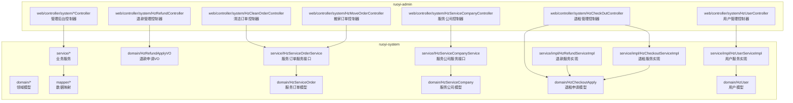

**图表来源**
- [RuoYiApplication.java:12-20](file://ruoyi-admin/src/main/java/com/ruoyi/RuoYiApplication.java#L12-L20)
- [pom.xml:18-58](file://ruoyi-system/pom.xml#L18-L58)
- [HzUserController.java:26-105](file://ruoyi-admin/src/main/java/com/ruoyi/web/controller/system/HzUserController.java#L26-L105)
- [HzUser.java:14-375](file://ruoyi-system/src/main/java/com/ruoyi/system/domain/HzUser.java#L14-L375)
- [HzCheckOutController.java:181-193](file://ruoyi-admin/src/main/java/com/ruoyi/web/controller/system/HzCheckOutController.java#L181-L193)
- [HzCheckoutServiceImpl.java:1103-1165](file://ruoyi-system/src/main/java/com/ruoyi/system/service/impl/HzCheckoutServiceImpl.java#L1103-L1165)

**章节来源**
- [RuoYiApplication.java:12-20](file://ruoyi-admin/src/main/java/com/ruoyi/RuoYiApplication.java#L12-L20)
- [pom.xml:18-58](file://ruoyi-system/pom.xml#L18-L58)

## 核心组件
- 控制器层：以@RestController暴露REST接口，统一使用权限注解@PreAuthorize进行RBAC控制。
- 服务层：I*Service接口与实现类负责业务逻辑编排。
- 数据层：MyBatis-Plus Mapper负责数据库访问。
- 统一响应：AjaxResult/ TableDataInfo封装标准响应结构。
- 权限与审计：@Log注解配合业务类型记录操作日志；@PreAuthorize基于权限表达式校验。

**章节来源**
- [HzTenantController.java:36-84](file://ruoyi-admin/src/main/java/com/ruoyi/web/controller/system/HzTenantController.java#L36-L84)
- [HzContractController.java:55-139](file://ruoyi-admin/src/main/java/com/ruoyi/web/controller/system/HzContractController.java#L55-L139)
- [HzBillController.java:35-105](file://ruoyi-admin/src/main/java/com/ruoyi/web/controller/system/HzBillController.java#L35-L105)
- [HzCheckInController.java:51-135](file://ruoyi-admin/src/main/java/com/ruoyi/web/controller/system/HzCheckInController.java#L51-L135)
- [HzEnterpriseController.java:37-99](file://ruoyi-admin/src/main/java/com/ruoyi/web/controller/system/HzEnterpriseController.java#L37-L99)
- [HzCleanOrderController.java:38-106](file://ruoyi-admin/src/main/java/com/ruoyi/web/controller/system/HzCleanOrderController.java#L38-L106)
- [HzMoveOrderController.java:38-100](file://ruoyi-admin/src/main/java/com/ruoyi/web/controller/system/HzMoveOrderController.java#L38-L100)
- [HzServiceCompanyController.java:37-118](file://ruoyi-admin/src/main/java/com/ruoyi/web/controller/system/HzServiceCompanyController.java#L37-L118)
- [HzCheckOutController.java:39-193](file://ruoyi-admin/src/main/java/com/ruoyi/web/controller/system/HzCheckOutController.java#L39-L193)
- [HzRefundController.java:58-322](file://ruoyi-admin/src/main/java/com/ruoyi/web/controller/system/HzRefundController.java#L58-L322)
- [HzUserController.java:33-103](file://ruoyi-admin/src/main/java/com/ruoyi/web/controller/system/HzUserController.java#L33-L103)

## 架构总览
管理后台接口遵循"控制器-服务-数据映射"三层架构，控制器负责HTTP协议与参数解析，服务层编排业务规则，数据层持久化。权限控制通过Spring Security与自定义权限表达式实现，审计日志通过注解切面记录。

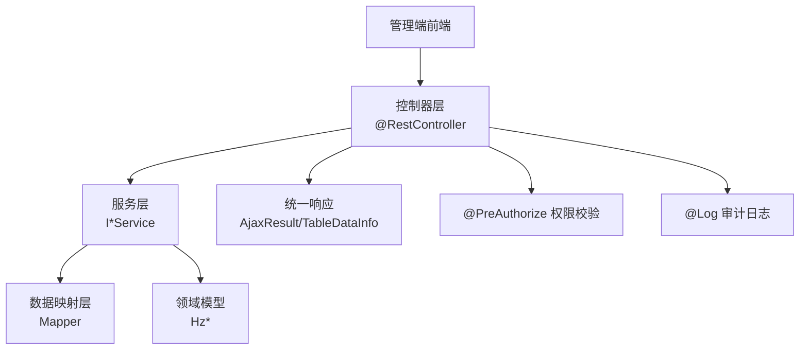

**图表来源**
- [HzHouseTypeController.java:39-116](file://ruoyi-system/src/main/java/com/ruoyi/system/controller/HzHouseTypeController.java#L39-L116)
- [HzTenantController.java:36-84](file://ruoyi-admin/src/main/java/com/ruoyi/web/controller/system/HzTenantController.java#L36-L84)
- [HzContractController.java:55-139](file://ruoyi-admin/src/main/java/com/ruoyi/web/controller/system/HzContractController.java#L55-L139)
- [HzBillController.java:35-105](file://ruoyi-admin/src/main/java/com/ruoyi/web/controller/system/HzBillController.java#L35-L105)
- [HzCheckInController.java:51-135](file://ruoyi-admin/src/main/java/com/ruoyi/web/controller/system/HzCheckInController.java#L51-L135)
- [HzEnterpriseController.java:37-99](file://ruoyi-admin/src/main/java/com/ruoyi/web/controller/system/HzEnterpriseController.java#L37-L99)
- [HzCleanOrderController.java:38-106](file://ruoyi-admin/src/main/java/com/ruoyi/web/controller/system/HzCleanOrderController.java#L38-L106)
- [HzMoveOrderController.java:38-100](file://ruoyi-admin/src/main/java/com/ruoyi/web/controller/system/HzMoveOrderController.java#L38-L100)
- [HzServiceCompanyController.java:37-118](file://ruoyi-admin/src/main/java/com/ruoyi/web/controller/system/HzServiceCompanyController.java#L37-L118)
- [HzCheckOutController.java:39-193](file://ruoyi-admin/src/main/java/com/ruoyi/web/controller/system/HzCheckOutController.java#L39-L193)
- [HzRefundController.java:58-322](file://ruoyi-admin/src/main/java/com/ruoyi/web/controller/system/HzRefundController.java#L58-L322)
- [HzUserController.java:33-103](file://ruoyi-admin/src/main/java/com/ruoyi/web/controller/system/HzUserController.java#L33-L103)

## 详细组件分析

### 房源管理（户型、设施、图片）
- 接口概览
  - 户型管理：列表查询、导出、详情、新增、修改、删除、下拉列表、图片查询、批量保存图片、删除图片、一键下发图片与VR至该户型下所有房源。
  - 户型设施配置：按户型查询设施配置、批量保存。
  - 房源设施：按房源查询设施（多级回退）、批量保存、从户型拉取设施到房源。
  - 设施物品：设施物品列表查询。

- 关键点
  - 分页与导出：统一使用PageUtils与ExcelUtil。
  - 权限表达式：如"gangzhu:houseType:*"、"gangzhu:facilityItem:list"等。
  - 业务回退：房源设施查询支持从房源设施表→户型设施表→旧字段的三级回退策略。
  - 批量操作：批量保存图片、批量保存设施、批量删除。

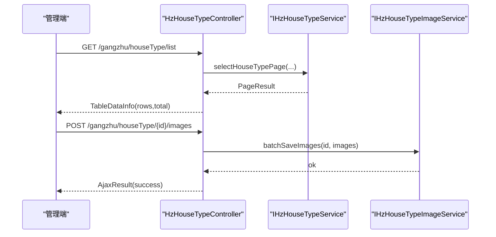

**图表来源**
- [HzHouseTypeController.java:42-55](file://ruoyi-system/src/main/java/com/ruoyi/system/controller/HzHouseTypeController.java#L42-L55)
- [HzHouseTypeController.java:177-184](file://ruoyi-system/src/main/java/com/ruoyi/system/controller/HzHouseTypeController.java#L177-L184)

**章节来源**
- [HzHouseTypeController.java:39-208](file://ruoyi-system/src/main/java/com/ruoyi/system/controller/HzHouseTypeController.java#L39-L208)
- [HzHouseTypeFacilityController.java:28-49](file://ruoyi-system/src/main/java/com/ruoyi/system/controller/HzHouseTypeFacilityController.java#L28-L49)
- [HzHouseFacilityController.java:38-104](file://ruoyi-system/src/main/java/com/ruoyi/system/controller/HzHouseFacilityController.java#L38-L104)
- [HzFacilityItemController.java:27-37](file://ruoyi-system/src/main/java/com/ruoyi/system/controller/HzFacilityItemController.java#L27-L37)

### 租户管理
- 接口概览
  - 列表查询、导出、详情、修改。
- 关键点
  - 分页查询通过TableSupport与PageDomain构建。
  - 权限表达式："gangzhu:tenant:*"。

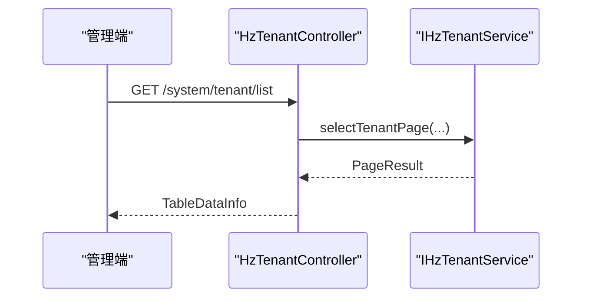

**图表来源**
- [HzTenantController.java:36-49](file://ruoyi-admin/src/main/java/com/ruoyi/web/controller/system/HzTenantController.java#L36-L49)

**章节来源**
- [HzTenantController.java:36-84](file://ruoyi-admin/src/main/java/com/ruoyi/web/controller/system/HzTenantController.java#L36-L84)

### 合同管理
- 接口概览
  - 列表查询、导出、详情、新增、修改、删除、审核、合同账单明细、合同文档列表、电子PDF查看链接。
- 关键点
  - 审核流程：仅草稿状态可审核，通过时更新状态为"已签署"，并可更新合同附件与备注。
  - 业务校验：合同详情扩展接口中，账单与缴费记录按账单类型与日期排序返回。
  - 电子签：提供模板控件定义查询与PDF链接刷新能力。

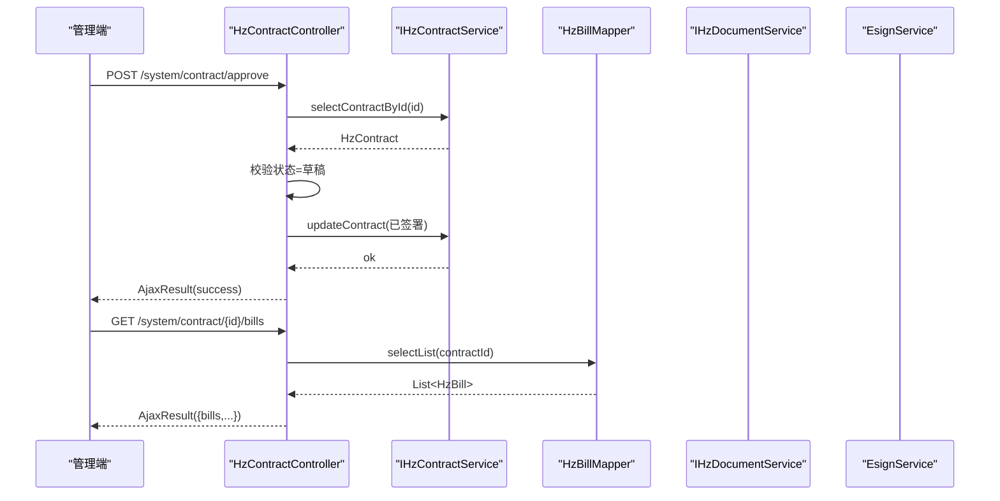

**图表来源**
- [HzContractController.java:144-175](file://ruoyi-admin/src/main/java/com/ruoyi/web/controller/system/HzContractController.java#L144-L175)
- [HzContractController.java:195-234](file://ruoyi-admin/src/main/java/com/ruoyi/web/controller/system/HzContractController.java#L195-L234)

**章节来源**
- [HzContractController.java:55-299](file://ruoyi-admin/src/main/java/com/ruoyi/web/controller/system/HzContractController.java#L55-L299)

### 财务与账单管理
- 接口概览
  - 列表查询、导出、详情、新增、修改、删除（支持批量删除）。
- 关键点
  - VO分页：账单查询使用HzBillVO分页返回，便于聚合展示。
  - 权限表达式："gangzhu:bill:*"。

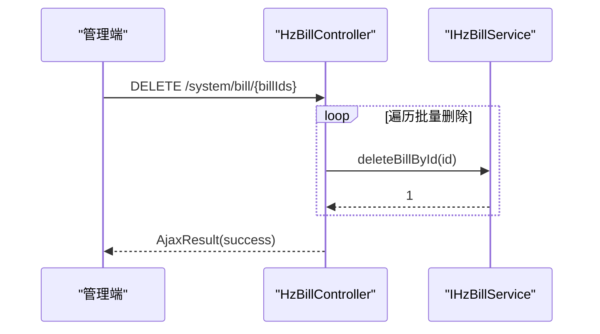

**图表来源**
- [HzBillController.java:96-105](file://ruoyi-admin/src/main/java/com/ruoyi/web/controller/system/HzBillController.java#L96-L105)

**章节来源**
- [HzBillController.java:35-106](file://ruoyi-admin/src/main/java/com/ruoyi/web/controller/system/HzBillController.java#L35-L106)

### 入住管理
- 接口概览
  - 列表查询、导出、详情、新增、修改、删除、审核。
- 关键点
  - 审核前置校验：合同状态必须为"已签署/履行中"，押金与首期租金账单需全部结清，实际入住日期需在合同签署当日起3天内。
  - 审核通过后更新审核人、时间与备注。

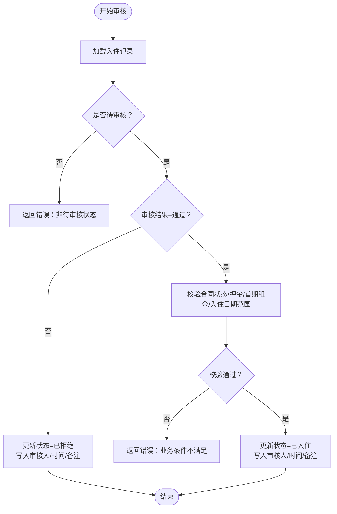

**图表来源**
- [HzCheckInController.java:139-179](file://ruoyi-admin/src/main/java/com/ruoyi/web/controller/system/HzCheckInController.java#L139-L179)
- [HzCheckInController.java:189-231](file://ruoyi-admin/src/main/java/com/ruoyi/web/controller/system/HzCheckInController.java#L189-L231)

**章节来源**
- [HzCheckInController.java:51-262](file://ruoyi-admin/src/main/java/com/ruoyi/web/controller/system/HzCheckInController.java#L51-L262)

### 企业客户管理
- 接口概览
  - 列表查询、导出、详情、新增、修改、删除（支持批量删除）。
- 关键点
  - 分页查询通过PageUtils构建。
  - 权限表达式："gangzhu:enterprise:*"。

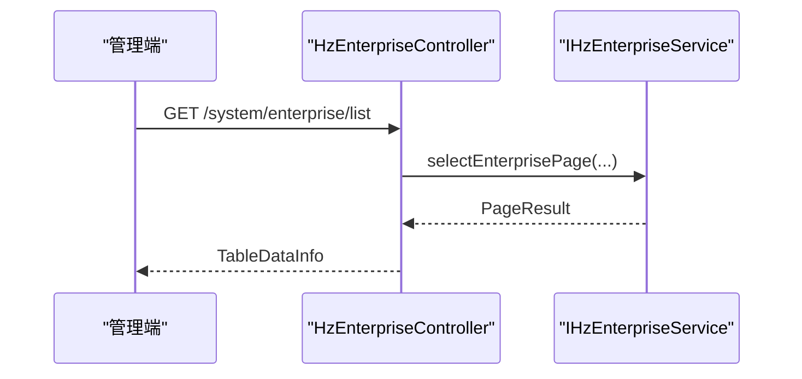

**图表来源**
- [HzEnterpriseController.java:37-48](file://ruoyi-admin/src/main/java/com/ruoyi/web/controller/system/HzEnterpriseController.java#L37-L48)

**章节来源**
- [HzEnterpriseController.java:37-100](file://ruoyi-admin/src/main/java/com/ruoyi/web/controller/system/HzEnterpriseController.java#L37-L100)

### 用户管理
- 接口概览
  - 列表查询、导出、详情、修改、删除。
- 关键点
  - 分页查询通过PageUtils构建，支持手机号、真实姓名、来源类型、状态、注册时间等筛选条件。
  - 新增个人信息展示能力：年龄计算、身份证号脱敏、教育水平、身份类型、工作单位、单位性质、实名认证状态等列。
  - 权限表达式："gangzhu:user:*"。

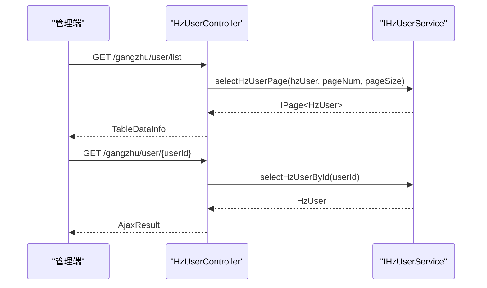

**图表来源**
- [HzUserController.java:36-49](file://ruoyi-admin/src/main/java/com/ruoyi/web/controller/system/HzUserController.java#L36-L49)
- [HzUserController.java:66-70](file://ruoyi-admin/src/main/java/com/ruoyi/web/controller/system/HzUserController.java#L66-L70)

**章节来源**
- [HzUserController.java:33-103](file://ruoyi-admin/src/main/java/com/ruoyi/web/controller/system/HzUserController.java#L33-L103)

### 退租管理
- 接口概览
  - 退租申请列表查询、导出、详情、新增、修改、删除、审批、费用计算、退租记录查询、合同账单查询、按日精算退租租金。
  - **新增** 管理员直接退租：POST /system/checkout/adminForceCheckout，支持管理员直接执行退租操作。
- 关键点
  - **新增** 租户姓名搜索：退租申请列表查询支持tenantName参数，通过合同表的tenant_name快照进行模糊匹配。
  - 审批流程：支持审批中、待确认、审批驳回、已取消、已确认等状态流转。
  - 费用计算：支持水费、电费、燃气费、暖气费、物业费、损坏扣款、违约金等费用明细。
  - 退款拆分：支持押金与租金的双笔退款拆分，按账单维度溯源。
  - **新增** 强制退租权限：需要gangzhu:checkout:forceCheckout权限才能调用管理员直接退租接口。
  - **新增** 强制退租业务逻辑：服务层adminForceCheckout方法支持一步完成合同终止+房源释放。

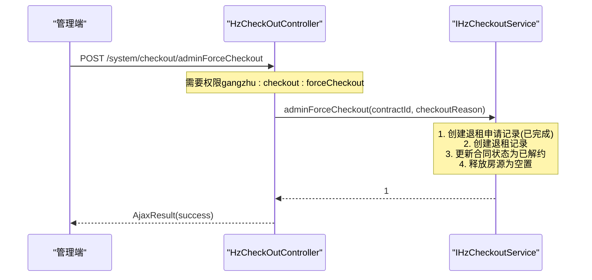

**图表来源**
- [HzCheckOutController.java:181-193](file://ruoyi-admin/src/main/java/com/ruoyi/web/controller/system/HzCheckOutController.java#L181-L193)
- [HzCheckoutServiceImpl.java:1103-1165](file://ruoyi-system/src/main/java/com/ruoyi/system/service/impl/HzCheckoutServiceImpl.java#L1103-L1165)

**章节来源**
- [HzCheckOutController.java:39-193](file://ruoyi-admin/src/main/java/com/ruoyi/web/controller/system/HzCheckOutController.java#L39-L193)

### 退款管理
- 接口概览
  - 退款申请列表查询、导出、详情、审核、删除、微信原路退款、提交付款信息。
- 关键点
  - **新增** 租户姓名搜索：退款申请列表查询支持tenantName参数，通过合同表的tenant_name快照进行模糊匹配。
  - 退款类型：支持退租退款与入住超时自动退款两种类型。
  - 微信原路退款：支持押金与已付租金的双笔退款，按账单维度原路退回。
  - 退款拆分：根据押金账单与租金账单的transaction_no进行退款拆分。

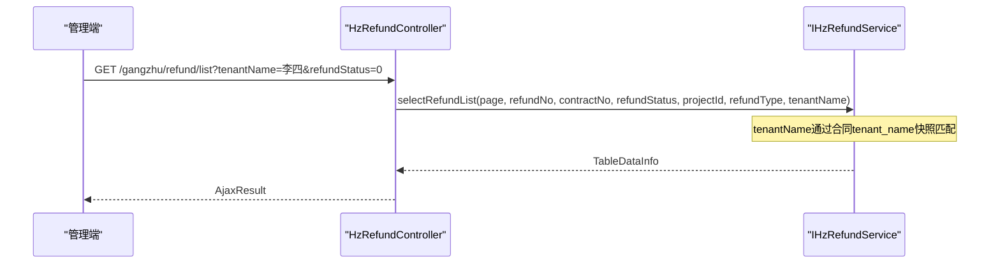

**图表来源**
- [HzRefundController.java:58-70](file://ruoyi-admin/src/main/java/com/ruoyi/web/controller/system/HzRefundController.java#L58-L70)
- [HzRefundController.java:122-298](file://ruoyi-admin/src/main/java/com/ruoyi/web/controller/system/HzRefundController.java#L122-L298)

**章节来源**
- [HzRefundController.java:58-322](file://ruoyi-admin/src/main/java/com/ruoyi/web/controller/system/HzRefundController.java#L58-L322)

### 清洁订单管理
- 接口概览
  - 列表查询、导出、详情、分配服务公司、标记完成、删除。
- 关键点
  - 订单类型：通过order_type="1"标识为清洁订单。
  - 分配逻辑：支持将订单分配给指定服务公司，自动校验公司类型匹配性。
  - 状态管理：支持从待处理→已分配→服务中→已完成的完整流程。
  - 权限表达式："gangzhu:cleanOrder:*"。

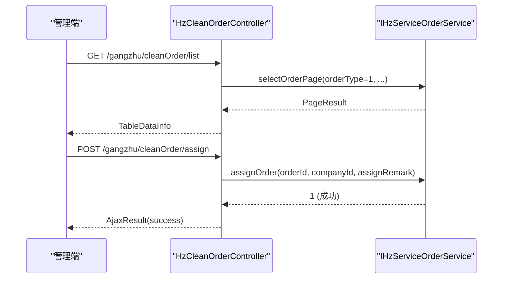

**图表来源**
- [HzCleanOrderController.java:38-52](file://ruoyi-admin/src/main/java/com/ruoyi/web/controller/system/HzCleanOrderController.java#L38-L52)
- [HzCleanOrderController.java:76-86](file://ruoyi-admin/src/main/java/com/ruoyi/web/controller/system/HzCleanOrderController.java#L76-L86)

**章节来源**
- [HzCleanOrderController.java:38-106](file://ruoyi-admin/src/main/java/com/ruoyi/web/controller/system/HzCleanOrderController.java#L38-L106)

### 搬家订单管理
- 接口概览
  - 列表查询、导出、详情、分配服务公司、标记完成、删除。
- 关键点
  - 订单类型：通过order_type="2"标识为搬家订单。
  - 分配逻辑：支持将订单分配给指定服务公司，自动校验公司类型匹配性。
  - 状态管理：支持从待处理→已分配→服务中→已完成的完整流程。
  - 权限表达式："gangzhu:moveOrder:*"。

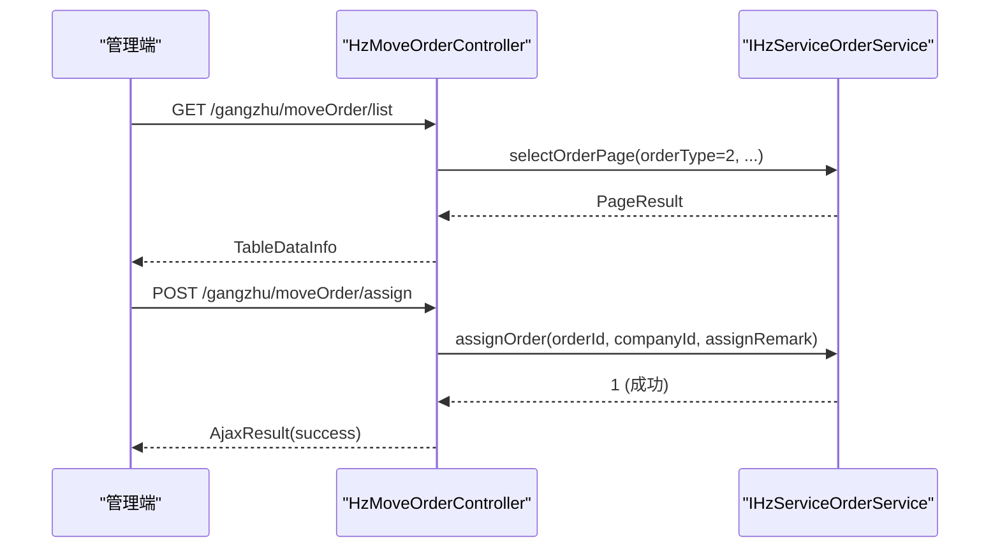

**图表来源**
- [HzMoveOrderController.java:38-52](file://ruoyi-admin/src/main/java/com/ruoyi/web/controller/system/HzMoveOrderController.java#L38-L52)
- [HzMoveOrderController.java:72-82](file://ruoyi-admin/src/main/java/com/ruoyi/web/controller/system/HzMoveOrderController.java#L72-L82)

**章节来源**
- [HzMoveOrderController.java:38-100](file://ruoyi-admin/src/main/java/com/ruoyi/web/controller/system/HzMoveOrderController.java#L38-L100)

### 服务公司管理
- 接口概览
  - 列表查询、导出、详情、新增、修改、删除。
- 关键点
  - 公司类型：1=保洁、2=搬家、3=综合。
  - 启用状态：0=启用、1=停用。
  - 下拉选择：支持按订单类型查询启用中的服务公司。
  - 权限表达式："gangzhu:serviceCompany:*"。

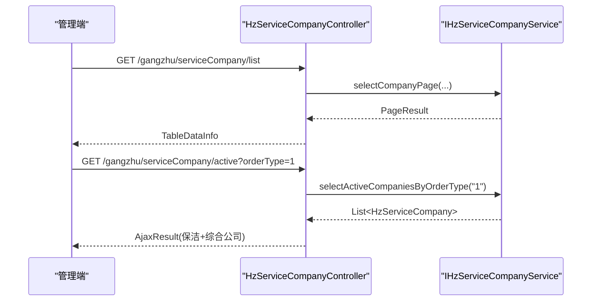

**图表来源**
- [HzServiceCompanyController.java:37-50](file://ruoyi-admin/src/main/java/com/ruoyi/web/controller/system/HzServiceCompanyController.java#L37-L50)
- [HzServiceCompanyController.java:55-61](file://ruoyi-admin/src/main/java/com/ruoyi/web/controller/system/HzServiceCompanyController.java#L55-L61)

**章节来源**
- [HzServiceCompanyController.java:37-118](file://ruoyi-admin/src/main/java/com/ruoyi/web/controller/system/HzServiceCompanyController.java#L37-L118)

## 依赖分析
- 模块依赖
  - ruoyi-system模块引入通用工具、MyBatis-Plus、微信支付SDK与e签宝相关依赖，支撑业务服务与外部集成。
- 控制器与服务耦合
  - 控制器通过@Autowired注入服务，服务再调用Mapper与领域模型，保持清晰职责分离。
- 外部集成
  - 电子签服务：合同PDF链接刷新与模板控件查询。
  - 导出：ExcelUtil统一导出格式。
- **新增** 用户管理模块增强个人信息展示能力，包括年龄计算、身份证号脱敏、教育水平、身份类型、工作单位、单位性质、实名认证状态等列的添加。
- **新增** 服务订单与服务公司共享同一业务逻辑实现，通过订单类型参数区分不同业务场景。
- **新增** 退租与退款服务通过合同表的tenant_name快照进行租户姓名搜索，确保搜索结果的准确性。
- **新增** 强制退租功能依赖gangzhu:checkout:forceCheckout权限，通过@PreAuthorize注解进行权限控制。
- **新增** 强制退租业务逻辑通过HzCheckoutServiceImpl.adminForceCheckout方法实现，支持一步完成合同终止+房源释放。

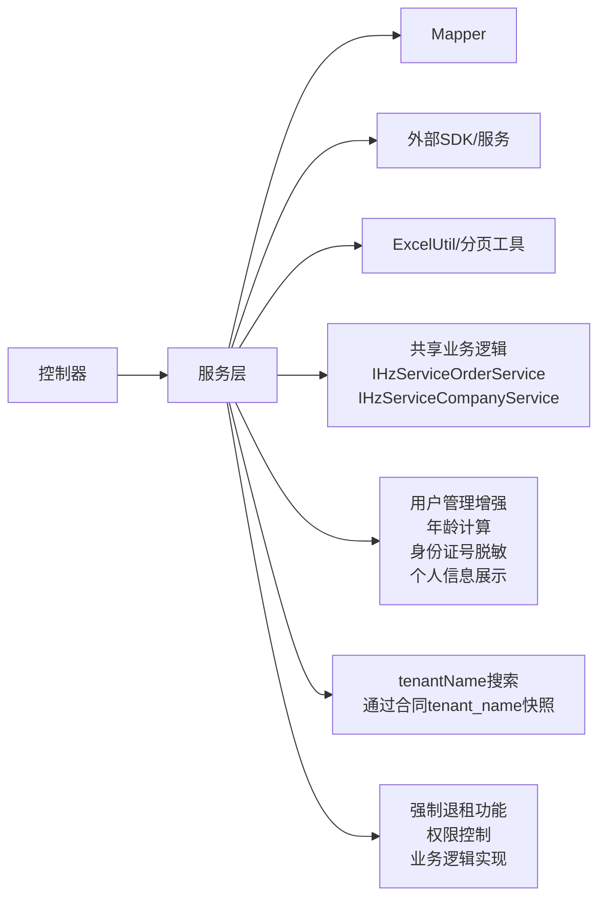

**图表来源**
- [pom.xml:26-56](file://ruoyi-system/pom.xml#L26-L56)
- [HzContractController.java:182-190](file://ruoyi-admin/src/main/java/com/ruoyi/web/controller/system/HzContractController.java#L182-L190)
- [HzHouseTypeController.java:63-68](file://ruoyi-system/src/main/java/com/ruoyi/system/controller/HzHouseTypeController.java#L63-68)
- [HzUserController.java:36-36](file://ruoyi-admin/src/main/java/com/ruoyi/web/controller/system/HzUserController.java#L36-L36)
- [HzCleanOrderController.java:36-36](file://ruoyi-admin/src/main/java/com/ruoyi/web/controller/system/HzCleanOrderController.java#L36-L36)
- [HzMoveOrderController.java:36-36](file://ruoyi-admin/src/main/java/com/ruoyi/web/controller/system/HzMoveOrderController.java#L36-L36)
- [HzServiceCompanyController.java:32-32](file://ruoyi-admin/src/main/java/com/ruoyi/web/controller/system/HzServiceCompanyController.java#L32-L32)
- [HzRefundServiceImpl.java:86-96](file://ruoyi-system/src/main/java/com/ruoyi/system/service/impl/HzRefundServiceImpl.java#L86-L96)
- [HzCheckOutController.java:184-184](file://ruoyi-admin/src/main/java/com/ruoyi/web/controller/system/HzCheckOutController.java#L184-184)
- [HzCheckoutServiceImpl.java:1105-1105](file://ruoyi-system/src/main/java/com/ruoyi/system/service/impl/HzCheckoutServiceImpl.java#L1105-L1105)

**章节来源**
- [pom.xml:18-58](file://ruoyi-system/pom.xml#L18-L58)

## 性能考量
- 分页与导出
  - 列表查询统一使用分页工具，避免一次性加载大量数据；导出采用ExcelUtil批量写出，注意大表导出的内存与超时设置。
- 批量操作
  - 批量删除账单与企业客户时，建议限制单次批量数量，避免长事务与锁竞争。
- 缓存与异步
  - 对高频查询（如设施物品列表）可结合缓存策略；对耗时操作（如批量下发图片/VR）建议异步化并提供进度反馈。
- 数据一致性
  - 审核流程中的多条件校验应在同一事务边界内完成，防止并发导致的状态不一致。
- **新增** 用户管理性能优化
  - 年龄计算与身份证号脱敏在前端进行，减少后端计算压力。
  - 用户查询接口支持多条件筛选，通过HzUserMapper.xml的SQL优化查询性能。
  - 退租与退款服务通过合同表tenant_name快照进行模糊匹配，避免跨表JOIN的性能问题。
- **新增** 租户姓名搜索优化
  - 通过合同表tenant_name快照进行模糊匹配，避免跨表JOIN的性能问题。
  - 在退款管理中，先通过tenantName查询匹配的contractId集合，再进行applyId过滤，提高查询效率。
- **新增** 订单分配与状态转换
  - 订单分配时的公司类型匹配校验应避免重复查询，可通过缓存优化。
  - 批量订单处理时应注意事务边界，确保状态转换的一致性。
- **新增** 强制退租性能考量
  - 强制退租操作涉及多个表的更新（退租申请、退租记录、合同状态、房源状态），建议在事务中一次性完成。
  - 强制退租权限检查应在进入业务逻辑前完成，避免不必要的数据库查询。

## 故障排查指南
- 权限不足
  - 现象：返回403或无权限提示。
  - 排查：确认用户角色是否具备"gangzhu:*"相关权限表达式；检查@PreAuthorize注解是否正确。
  - **新增** 强制退租权限排查：确认用户是否具备"gangzhu:checkout:forceCheckout"权限。
- 参数校验失败
  - 现象：请求被拦截或返回参数错误。
  - 排查：检查请求体与路径参数是否符合接口定义；必要时增加参数校验与异常捕获。
- 审核不通过
  - 现象：入住审核返回业务条件不满足。
  - 排查：核对合同状态、押金与首期租金账单是否全部结清、实际入住日期是否在允许范围内。
- 导出异常
  - 现象：导出失败或文件损坏。
  - 排查：确认ExcelUtil导出参数与响应头设置；检查数据量过大导致的内存溢出。
- 电子签PDF链接失效
  - 现象：获取PDF链接报错。
  - 排查：确认合同是否存在有效的flowId；若为空，检查历史数据是否为URL；必要时重新发起电子签流程。
- **新增** 用户管理界面显示异常
  - 现象：年龄显示为"-"或身份证号未脱敏。
  - 排查：确认HzUser实体中idCard字段是否正确，检查前端calcAge与maskIdCard方法是否正常执行。
  - 排查：检查HzUserMapper.xml中的SQL查询是否包含education、identityType、workUnit、unitNature等字段。
- **新增** 用户姓名搜索无结果
  - 现象：退租申请或退款申请列表搜索租户姓名返回空结果。
  - 排查：确认租户姓名是否正确，检查合同表中的tenant_name快照是否准确；注意搜索为模糊匹配，大小写敏感。
- **新增** 退款微信原路退款失败
  - 现象：微信退款申请成功但实际未到账。
  - 排查：检查押金账单与租金账单的transaction_no是否正确；确认账单状态为已支付且金额充足；查看paymentRemark中的失败明细。
- **新增** 订单分配失败
  - 现象：分配服务公司时报错"该公司不承接保洁/搬家服务"。
  - 排查：确认服务公司类型与订单类型匹配，综合公司可承接多种服务。
- **新增** 订单状态异常
  - 现象：标记完成时报错"仅已分配/服务中的订单可标记完成"。
  - 排查：确认订单当前状态，检查是否已被其他用户修改过状态。
- **新增** 强制退租操作失败
  - 现象：管理员直接退租接口返回错误。
  - 排查：确认合同状态为"已签署"(2)或"履行中"(3)，检查合同是否存在；确认强制退租原因是否填写；查看服务层异常日志。

**章节来源**
- [HzCheckInController.java:164-179](file://ruoyi-admin/src/main/java/com/ruoyi/web/controller/system/HzCheckInController.java#L164-L179)
- [HzContractController.java:282-298](file://ruoyi-admin/src/main/java/com/ruoyi/web/controller/system/HzContractController.java#L282-L298)
- [HzServiceOrderServiceImpl.java:153-161](file://ruoyi-system/src/main/java/com/ruoyi/system/service/impl/HzServiceOrderServiceImpl.java#L153-L161)
- [HzServiceOrderServiceImpl.java:182-186](file://ruoyi-system/src/main/java/com/ruoyi/system/service/impl/HzServiceOrderServiceImpl.java#L182-L186)
- [HzRefundServiceImpl.java:86-96](file://ruoyi-system/src/main/java/com/ruoyi/system/service/impl/HzRefundServiceImpl.java#L86-L96)
- [index.vue:495-515](file://ruoyi-ui/src/views/gangzhu/user/index.vue#L495-L515)
- [HzCheckOutController.java:184-184](file://ruoyi-admin/src/main/java/com/ruoyi/web/controller/system/HzCheckOutController.java#L184-184)
- [HzCheckoutServiceImpl.java:1111-1114](file://ruoyi-system/src/main/java/com/ruoyi/system/service/impl/HzCheckoutServiceImpl.java#L1111-L1114)

## 结论
本管理后台接口体系以清晰的权限控制、统一的响应格式与完善的审计日志为基础，覆盖房源、租户、合同、账单、入住、企业客户、**清洁订单管理**、**搬家订单管理**、**服务公司管理**与**用户管理**等核心后台管理场景。通过分页、导出、批量操作与业务校验等设计，既保证了管理效率，也兼顾了数据一致性与安全性。

**重要更新**：用户管理界面的增强显著提升了个人信息展示能力。新增的年龄计算功能通过前端JavaScript实现，基于18位身份证号的出生日期计算年龄，提供了直观的用户画像信息。身份证号脱敏功能在前端进行，保留前3位和后1位，中间显示星号，既保护了用户隐私又便于识别。教育水平、身份类型、工作单位、单位性质、实名认证状态等字段的添加，为用户管理提供了更完整的背景信息，有助于提升管理效率和服务质量。

**新增** 强制退租功能为管理后台提供了紧急处理能力。通过gangzhu:checkout:forceCheckout权限控制，管理员可以在特定情况下直接执行退租操作，无需经过正常的用户确认流程。该功能支持一步完成合同终止和房源释放，适用于紧急情况下的快速处理需求。服务层实现了完整的业务逻辑，包括退租申请记录创建、退租记录生成、合同状态更新和房源状态释放等步骤。

新增的服务订单与服务公司管理模块采用统一的业务逻辑实现，通过订单类型参数区分不同业务场景，体现了良好的代码复用性。建议在生产环境中结合缓存、异步与限流等手段进一步优化性能与稳定性。

## 附录

### 接口清单与规范（摘要）
- 户型管理
  - GET /gangzhu/houseType/list：分页查询
  - POST /gangzhu/houseType/export：导出
  - GET /gangzhu/houseType/{id}：详情
  - POST /gangzhu/houseType：新增
  - PUT /gangzhu/houseType：修改
  - DELETE /gangzhu/houseType/{ids}：删除
  - GET /gangzhu/houseType/listAll：下拉列表
  - GET /gangzhu/houseType/{id}/images：图片列表
  - POST /gangzhu/houseType/{id}/images：批量保存图片
  - DELETE /gangzhu/houseType/images/{imageId}：删除图片
  - POST /gangzhu/houseType/{id}/pushToHouses：一键下发图片与VR至该户型下所有房源
- 户型设施配置
  - GET /gangzhu/houseTypeFacility/list/{houseTypeId}：按户型查询设施配置
  - POST /gangzhu/houseTypeFacility/batchSave：批量保存
- 房源设施
  - GET /gangzhu/houseFacility/list/{houseId}：按房源查询设施（三级回退）
  - POST /gangzhu/houseFacility/batchSave：批量保存
  - POST /gangzhu/houseFacility/pullFromType：从户型拉取设施到房源
- 设施物品
  - GET /gangzhu/facilityItem/list：设施物品列表
- 租户管理
  - GET /system/tenant/list：分页查询
  - POST /system/tenant/export：导出
  - GET /system/tenant/{tenantId}：详情
  - PUT /system/tenant：修改
- 合同管理
  - GET /system/contract/list：分页查询
  - POST /system/contract/export：导出
  - GET /system/contract/{contractId}：详情
  - POST /system/contract：新增
  - PUT /system/contract：修改
  - DELETE /system/contract/{contractIds}：删除
  - POST /system/contract/approve：审核
  - GET /system/contract/{id}/bills：合同账单明细
  - GET /system/contract/{id}/documents：合同文档列表
  - GET /system/contract/{id}/pdf-url：电子PDF链接
- 账单管理
  - GET /system/bill/list：分页查询
  - POST /system/bill/export：导出
  - GET /system/bill/{billId}：详情
  - POST /system/bill：新增
  - PUT /system/bill：修改
  - DELETE /system/bill/{billIds}：删除（支持批量）
- 入住管理
  - GET /system/checkin/list：分页查询
  - POST /system/checkin/export：导出
  - GET /system/checkin/{recordId}：详情
  - POST /system/checkin：新增
  - PUT /system/checkin：修改
  - DELETE /system/checkin/{recordIds}：删除（支持批量）
  - PUT /system/checkin/audit：审核
- 企业客户管理
  - GET /system/enterprise/list：分页查询
  - POST /system/enterprise/export：导出
  - GET /system/enterprise/{enterpriseId}：详情
  - POST /system/enterprise：新增
  - PUT /system/enterprise：修改
  - DELETE /system/enterprise/{enterpriseIds}：删除（支持批量）
- **新增** 用户管理
  - GET /gangzhu/user/list：分页查询（支持手机号、真实姓名、来源类型、状态、注册时间筛选）
  - POST /gangzhu/user/export：导出
  - GET /gangzhu/user/{userId}：详情
  - PUT /gangzhu/user/changeStatus：修改用户状态
  - PUT /gangzhu/user：修改用户信息
  - DELETE /gangzhu/user/{userIds}：删除用户
- **新增** 退租管理
  - GET /system/checkout/list：分页查询（支持tenantName参数）
  - POST /system/checkout/export：导出
  - GET /system/checkout/{applyId}：详情
  - POST /system/checkout：新增
  - PUT /system/checkout：修改
  - DELETE /system/checkout/{applyIds}：删除（支持批量）
  - POST /system/checkout/approve：审批
  - POST /system/checkout/calculate：保存费用计算
  - GET /system/checkout/record/{recordId}：退租记录详情
  - GET /system/checkout/record/byApply/{applyId}：根据申请ID获取退租记录
  - GET /system/checkout/bills/{contractId}：获取合同账单列表
  - GET /system/checkout/calculateRentRefund：按日精算退租租金
  - **新增** POST /system/checkout/adminForceCheckout：管理员直接退租（需要gangzhu:checkout:forceCheckout权限）
- **新增** 退款管理
  - GET /gangzhu/refund/list：分页查询（支持tenantName参数）
  - GET /gangzhu/refund/{refundId}：详情
  - POST /gangzhu/refund/audit：审核
  - DELETE /gangzhu/refund/{refundId}：删除
  - POST /gangzhu/refund/wechat/{refundId}：微信原路退款
  - POST /gangzhu/refund/payment：提交付款信息
- **新增** 清洁订单管理
  - GET /gangzhu/cleanOrder/list：分页查询（order_type=1）
  - POST /gangzhu/cleanOrder/export：导出
  - GET /gangzhu/cleanOrder/{orderId}：详情
  - POST /gangzhu/cleanOrder/assign：分配服务公司（body: {orderId, companyId, assignRemark}）
  - PUT /gangzhu/cleanOrder/finish/{orderId}：标记完成
  - DELETE /gangzhu/cleanOrder/{orderIds}：删除
- **新增** 搬家订单管理
  - GET /gangzhu/moveOrder/list：分页查询（order_type=2）
  - POST /gangzhu/moveOrder/export：导出
  - GET /gangzhu/moveOrder/{orderId}：详情
  - POST /gangzhu/moveOrder/assign：分配服务公司（body: {orderId, companyId, assignRemark}）
  - PUT /gangzhu/moveOrder/finish/{orderId}：标记完成
  - DELETE /gangzhu/moveOrder/{orderIds}：删除
- **新增** 服务公司管理
  - GET /gangzhu/serviceCompany/list：分页查询
  - POST /gangzhu/serviceCompany/export：导出
  - GET /gangzhu/serviceCompany/{companyId}：详情
  - POST /gangzhu/serviceCompany：新增
  - PUT /gangzhu/serviceCompany：修改
  - DELETE /gangzhu/serviceCompany/{companyIds}：删除
  - GET /gangzhu/serviceCompany/active：查询启用中的服务公司（可选orderType参数）

**章节来源**
- [HzHouseTypeController.java:42-208](file://ruoyi-system/src/main/java/com/ruoyi/system/controller/HzHouseTypeController.java#L42-L208)
- [HzHouseTypeFacilityController.java:31-49](file://ruoyi-system/src/main/java/com/ruoyi/system/controller/HzHouseTypeFacilityController.java#L31-L49)
- [HzHouseFacilityController.java:40-104](file://ruoyi-system/src/main/java/com/ruoyi/system/controller/HzHouseFacilityController.java#L40-L104)
- [HzFacilityItemController.java:30-37](file://ruoyi-system/src/main/java/com/ruoyi/system/controller/HzFacilityItemController.java#L30-L37)
- [HzTenantController.java:36-84](file://ruoyi-admin/src/main/java/com/ruoyi/web/controller/system/HzTenantController.java#L36-L84)
- [HzContractController.java:55-299](file://ruoyi-admin/src/main/java/com/ruoyi/web/controller/system/HzContractController.java#L55-L299)
- [HzBillController.java:35-106](file://ruoyi-admin/src/main/java/com/ruoyi/web/controller/system/HzBillController.java#L35-L106)
- [HzCheckInController.java:51-262](file://ruoyi-admin/src/main/java/com/ruoyi/web/controller/system/HzCheckInController.java#L51-L262)
- [HzEnterpriseController.java:37-100](file://ruoyi-admin/src/main/java/com/ruoyi/web/controller/system/HzEnterpriseController.java#L37-L100)
- [HzUserController.java:33-103](file://ruoyi-admin/src/main/java/com/ruoyi/web/controller/system/HzUserController.java#L33-L103)
- [HzCheckOutController.java:39-193](file://ruoyi-admin/src/main/java/com/ruoyi/web/controller/system/HzCheckOutController.java#L39-L193)
- [HzRefundController.java:58-322](file://ruoyi-admin/src/main/java/com/ruoyi/web/controller/system/HzRefundController.java#L58-L322)
- [HzCleanOrderController.java:38-106](file://ruoyi-admin/src/main/java/com/ruoyi/web/controller/system/HzCleanOrderController.java#L38-L106)
- [HzMoveOrderController.java:38-100](file://ruoyi-admin/src/main/java/com/ruoyi/web/controller/system/HzMoveOrderController.java#L38-L100)
- [HzServiceCompanyController.java:37-118](file://ruoyi-admin/src/main/java/com/ruoyi/web/controller/system/HzServiceCompanyController.java#L37-L118)

### 业务逻辑说明

#### 用户管理增强功能
- **个人信息展示增强**
  - 年龄计算：前端通过calcAge方法根据18位身份证号计算年龄，支持实时显示用户年龄信息
  - 身份证号脱敏：前端通过maskIdCard方法对身份证号进行脱敏处理，保护用户隐私
  - 教育水平：支持学历信息展示，使用字典类型"hz_education_type"进行枚举显示
  - 身份类型：支持在职人员、应届毕业生等身份类型的分类展示
  - 工作单位：展示用户的当前工作单位信息
  - 单位性质：展示单位性质，支持机关事业单位、国有企业、私营企业等分类
  - 实名认证状态：展示用户实名认证的不同阶段状态
- **查询接口增强**
  - 支持教育水平、身份类型、单位性质等字段的精确查询
  - 支持注册时间范围的精确查询
  - 通过HzUserMapper.xml的SQL实现多条件组合查询
- **数据模型扩展**
  - HzUser实体新增education、identityType、workUnit、unitContact、unitNature等字段
  - HzUserMapper.xml的SQL查询语句包含所有新增字段
  - HzUserServiceImpl的分页查询逻辑支持新增字段的筛选条件

#### 租户姓名搜索机制
- **搜索原理**
  - 退租申请列表查询：通过HzCheckoutApply的tenantName参数，使用合同表的tenant_name快照进行模糊匹配
  - 退款申请列表查询：通过HzRefundApplyVO的tenantName参数，同样使用合同表的tenant_name快照进行模糊匹配
- **性能优化**
  - 使用tenant_name快照而非实时JOIN，避免跨表查询的性能问题
  - 先通过tenantName查询匹配的contractId集合，再进行applyId过滤
- **数据一致性**
  - tenant_name来源于合同签约时的快照，不会因租户后续改名而失效
  - 确保搜索结果的准确性与稳定性

#### 订单类型与状态管理
- **订单类型**
  - 1：清洁订单（保洁服务）
  - 2：搬家订单（搬家公司服务）
- **订单状态**
  - 0：待处理
  - 1：已分配
  - 2：服务中
  - 3：已完成
  - 4：已取消

#### 服务公司类型匹配规则
- 清洁订单只能分配给：
  - 保洁专营公司（company_type=1）
  - 综合公司（company_type=3）
- 搬家订单只能分配给：
  - 搬家专营公司（company_type=2）
  - 综合公司（company_type=3）

#### 订单分配流程
1. 校验订单状态（不能为已完成或已取消）
2. 校验服务公司存在性与启用状态
3. 校验公司类型与订单类型匹配性
4. 更新订单状态为"已分配"
5. 记录分配人、分配时间与备注信息

#### **新增** 强制退租功能
- **权限控制**
  - 需要gangzhu:checkout:forceCheckout权限才能调用管理员直接退租接口
  - 通过@PreAuthorize("@ss.hasPermi('gangzhu:checkout:forceCheckout')")注解实现
- **业务逻辑**
  - 仅允许合同状态为"已签署"(2)或"履行中"(3)的合同执行强制退租
  - 自动创建已完成的退租申请记录和退租记录
  - 将合同状态更新为"已解约"(5)
  - 将房源状态从"已预订"(1)或"已出租"(2)释放为空置(0)
- **前端实现**
  - 在合同管理页面新增强制退租对话框
  - 支持输入退租原因并进行表单验证
  - 调用adminForceCheckout API执行强制退租操作
  - 提供确认提示，防止误操作

**章节来源**
- [HzUser.java:67-85](file://ruoyi-system/src/main/java/com/ruoyi/system/domain/HzUser.java#L67-L85)
- [HzUserMapper.xml:39-81](file://ruoyi-system/src/main/resources/mapper/system/HzUserMapper.xml#L39-L81)
- [HzUserServiceImpl.java:48-80](file://ruoyi-system/src/main/java/com/ruoyi/system/service/impl/HzUserServiceImpl.java#L48-L80)
- [index.vue:82-124](file://ruoyi-ui/src/views/gangzhu/user/index.vue#L82-L124)
- [index.vue:495-515](file://ruoyi-ui/src/views/gangzhu/user/index.vue#L495-L515)
- [user.js:1-57](file://ruoyi-ui/src/api/gangzhu/user.js#L1-L57)
- [HzCheckoutApply.java:153-158](file://ruoyi-system/src/main/java/com/ruoyi/system/domain/HzCheckoutApply.java#L153-L158)
- [HzRefundApplyVO.java:37-38](file://ruoyi-system/src/main/java/com/ruoyi/system/domain/HzRefundApplyVO.java#L37-L38)
- [HzRefundServiceImpl.java:86-96](file://ruoyi-system/src/main/java/com/ruoyi/system/service/impl/HzRefundServiceImpl.java#L86-L96)
- [HzServiceOrder.java:31-72](file://ruoyi-system/src/main/java/com/ruoyi/system/domain/HzServiceOrder.java#L31-L72)
- [HzServiceCompany.java:27-30](file://ruoyi-system/src/main/java/com/ruoyi/system/domain/HzServiceCompany.java#L27-L30)
- [HzServiceOrderServiceImpl.java:141-174](file://ruoyi-system/src/main/java/com/ruoyi/system/service/impl/HzServiceOrderServiceImpl.java#L141-L174)
- [HzServiceCompanyServiceImpl.java:42-60](file://ruoyi-system/src/main/java/com/ruoyi/system/service/impl/HzServiceCompanyServiceImpl.java#L42-L60)
- [HzCheckOutController.java:181-193](file://ruoyi-admin/src/main/java/com/ruoyi/web/controller/system/HzCheckOutController.java#L181-L193)
- [HzCheckoutServiceImpl.java:1103-1165](file://ruoyi-system/src/main/java/com/ruoyi/system/service/impl/HzCheckoutServiceImpl.java#L1103-L1165)
- [checkout.js:80-87](file://ruoyi-ui/src/api/gangzhu/checkout.js#L80-L87)
- [contract/index.vue:476-493](file://ruoyi-ui/src/views/gangzhu/contract/index.vue#L476-L493)
- [contract/index.vue:703-727](file://ruoyi-ui/src/views/gangzhu/contract/index.vue#L703-L727)