# 业务流程接口

<cite>
**本文引用的文件**
- [ruoyi-admin/src/main/java/com/ruoyi/web/controller/h5/HzCheckInController.java](file://ruoyi-admin/src/main/java/com/ruoyi/web/controller/h5/HzCheckInController.java)
- [ruoyi-admin/src/main/java/com/ruoyi/web/controller/h5/HzCheckOutController.java](file://ruoyi-admin/src/main/java/com/ruoyi/web/controller/h5/HzCheckOutController.java)
- [ruoyi-admin/src/main/java/com/ruoyi/web/controller/h5/HzCheckOutAppController.java](file://ruoyi-admin/src/main/java/com/ruoyi/web/controller/h5/HzCheckOutAppController.java)
- [ruoyi-admin/src/main/java/com/ruoyi/web/controller/h5/HzRepairAppController.java](file://ruoyi-admin/src/main/java/com/ruoyi/web/controller/h5/HzRepairAppController.java)
- [ruoyi-admin/src/main/java/com/ruoyi/web/controller/h5/HzComplaintAppController.java](file://ruoyi-admin/src/main/java/com/ruoyi/web/controller/h5/HzComplaintAppController.java)
- [ruoyi-admin/src/main/java/com/ruoyi/web/controller/h5/HzHouseOrderController.java](file://ruoyi-admin/src/main/java/com/ruoyi/web/controller/h5/HzHouseOrderController.java)
- [ruoyi-system/src/main/java/com/ruoyi/system/service/impl/HzCheckInServiceImpl.java](file://ruoyi-system/src/main/java/com/ruoyi/system/service/impl/HzCheckInServiceImpl.java)
- [ruoyi-system/src/main/java/com/ruoyi/system/service/impl/HzCheckoutServiceImpl.java](file://ruoyi-system/src/main/java/com/ruoyi/system/service/impl/HzCheckoutServiceImpl.java)
- [ruoyi-system/src/main/java/com/ruoyi/system/service/IHzHouseOrderService.java](file://ruoyi-system/src/main/java/com/ruoyi/system/service/IHzHouseOrderService.java)
- [ruoyi-system/src/main/java/com/ruoyi/system/service/IHzHouseExchangeService.java](file://ruoyi-system/src/main/java/com/ruoyi/system/service/IHzHouseExchangeService.java)
- [ruoyi-system/src/main/java/com/ruoyi/system/service/impl/HzHouseExchangeServiceImpl.java](file://ruoyi-system/src/main/java/com/ruoyi/system/service/impl/HzHouseExchangeServiceImpl.java)
- [ruoyi-system/src/main/java/com/ruoyi/system/domain/HzRepair.java](file://ruoyi-system/src/main/java/com/ruoyi/system/domain/HzRepair.java)
- [ruoyi-system/src/main/java/com/ruoyi/system/domain/HzComplaint.java](file://ruoyi-system/src/main/java/com/ruoyi/system/domain/HzComplaint.java)
- [ruoyi-system/src/main/java/com/ruoyi/system/mapper/HzCheckInMapper.java](file://ruoyi-system/src/main/java/com/ruoyi/system/mapper/HzCheckInMapper.java)
- [ruoyi-system/src/main/java/com/ruoyi/system/domain/HzHouseOrder.java](file://ruoyi-system/src/main/java/com/ruoyi/system/domain/HzHouseOrder.java)
- [ruoyi-system/src/main/java/com/ruoyi/system/service/impl/HzHouseOrderServiceImpl.java](file://ruoyi-system/src/main/java/com/ruoyi/system/service/impl/HzHouseOrderServiceImpl.java)
- [ruoyi-system/src/main/java/com/ruoyi/system/mapper/HzHouseOrderMapper.java](file://ruoyi-system/src/main/java/com/ruoyi/system/mapper/HzHouseOrderMapper.java)
- [ruoyi-system/src/main/java/com/ruoyi/system/domain/vo/BatchPreferenceVo.java](file://ruoyi-system/src/main/java/com/ruoyi/system/domain/vo/BatchPreferenceVo.java)
- [ruoyi-system/src/main/java/com/ruoyi/system/resources/mapper/system/HzHouseOrderMapper.xml](file://ruoyi-system/src/main/java/com/ruoyi/system/resources/mapper/system/HzHouseOrderMapper.xml)
- [ruoyi-admin/src/main/java/com/ruoyi/web/controller/system/HzReportController.java](file://ruoyi-admin/src/main/java/com/ruoyi/web/controller/system/HzReportController.java)
- [ruoyi-system/src/main/java/com/ruoyi/system/domain/HzBatchTenant.java](file://ruoyi-system/src/main/java/com/ruoyi/system/domain/HzBatchTenant.java)
- [ruoyi-system/src/main/java/com/ruoyi/system/domain/HzBatchAllocation.java](file://ruoyi-system/src/main/java/com/ruoyi/system/domain/HzBatchAllocation.java)
- [ruoyi-system/src/main/java/com/ruoyi/system/domain/HzBatchHouse.java](file://ruoyi-system/src/main/java/com/ruoyi/system/domain/HzBatchHouse.java)
- [ruoyi-system/src/main/java/com/ruoyi/system/service/impl/HzBatchAllocationServiceImpl.java](file://ruoyi-system/src/main/java/com/ruoyi/system/service/impl/HzBatchAllocationServiceImpl.java)
- [ruoyi-admin/src/main/java/com/ruoyi/web/controller/system/HzBatchAllocationController.java](file://ruoyi-admin/src/main/java/com/ruoyi/web/controller/system/HzBatchAllocationController.java)
- [ruoyi-system/src/main/java/com/ruoyi/system/mapper/HzBatchTenantMapper.java](file://ruoyi-system/src/main/java/com/ruoyi/system/mapper/HzBatchTenantMapper.java)
- [ruoyi-system/src/main/java/com/ruoyi/system/mapper/HzBatchHouseMapper.java](file://ruoyi-system/src/main/java/com/ruoyi/system/mapper/HzBatchHouseMapper.java)
- [ruoyi-system/src/main/java/com/ruoyi/system/mapper/HzHouseOrderMapper.java](file://ruoyi-system/src/main/java/com/ruoyi/system/mapper/HzHouseOrderMapper.java)
- [ruoyi-quartz/src/main/java/com/ruoyi/quartz/task/HouseOrderExpireTask.java](file://ruoyi-quartz/src/main/java/com/ruoyi/quartz/task/HouseOrderExpireTask.java)
- [ruoyi-quartz/src/main/java/com/ruoyi/quartz/task/ContractExpireTask.java](file://ruoyi-quartz/src/main/java/com/ruoyi/quartz/task/ContractExpireTask.java)
- [ruoyi-system/src/main/java/com/ruoyi/system/domain/HzContract.java](file://ruoyi-system/src/main/java/com/ruoyi/system/domain/HzContract.java)
- [ruoyi-system/src/main/java/com/ruoyi/system/service/impl/EsignServiceImpl.java](file://ruoyi-system/src/main/java/com/ruoyi/system/service/impl/EsignServiceImpl.java)
- [ruoyi-admin/src/main/java/com/ruoyi/web/controller/h5/WechatPayController.java](file://ruoyi-admin/src/main/java/com/ruoyi/web/controller/h5/WechatPayController.java)
- [ruoyi-admin/src/main/java/com/ruoyi/web/controller/h5/HzCheckInAppController.java](file://ruoyi-admin/src/main/java/com/ruoyi/web/controller/h5/HzCheckInAppController.java)
- [ruoyi-admin/src/main/java/com/ruoyi/web/controller/h5/HzContractAppController.java](file://ruoyi-admin/src/main/java/com/ruoyi/web/controller/h5/HzContractAppController.java)
- [技术方案.html](file://技术方案.html)
- [港好住系统架构图.html](file://港好住系统架构图.html)
</cite>

## 更新摘要
**所做更改**
- 新增房屋订单状态与合同状态同步机制章节，详细说明合同推进到履行中时自动更新房屋状态的流程
- 更新房屋订单管理接口章节，反映合同状态推进触发房屋状态同步的完整流程
- 新增合同状态推进与房屋状态同步的技术实现细节
- 更新批量租户订单处理流程，增加合同状态推进触发房屋状态同步的说明

## 目录
1. [简介](#简介)
2. [项目结构](#项目结构)
3. [核心组件](#核心组件)
4. [架构总览](#架构总览)
5. [详细组件分析](#详细组件分析)
6. [房屋订单状态与合同状态同步机制](#房屋订单状态与合同状态同步机制)
7. [批量租户订单处理流程](#批量租户订单处理流程)
8. [依赖分析](#依赖分析)
9. [性能考虑](#性能考虑)
10. [故障排查指南](#故障排查指南)
11. [结论](#结论)
12. [附录](#附录)

## 简介
本文件面向业务流程管理接口，围绕"入住管理""退租管理""房屋订单管理""房屋置换""维修报修""投诉建议""批量租户订单处理"以及"业务流程统计与监控"进行系统化说明。文档基于实际代码与技术方案，提供接口定义、流程图、数据模型与最佳实践，帮助开发者与产品人员快速理解与落地。

**更新** 新增房屋订单状态与合同状态同步机制，确保合同推进到履行中时自动将房屋状态从空置或已预订更新为已出租，维护数据一致性。

## 项目结构
后端采用多模块结构，业务流程相关能力主要分布在 ruoyi-admin（控制器）、ruoyi-system（领域模型与服务）、ruoyi-ui（前端页面）与 uniapp-h5（移动端页面）。H5端业务流程接口集中在 ruoyi-admin 的 h5 包下，通过控制器暴露 REST 接口，服务层负责业务编排与状态流转，持久层通过 MyBatis-Plus Mapper 访问数据库。

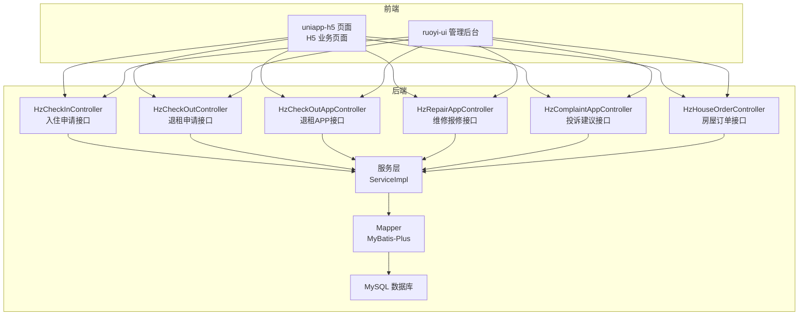

**图表来源**
- [ruoyi-admin/src/main/java/com/ruoyi/web/controller/h5/HzCheckInController.java:1-165](file://ruoyi-admin/src/main/java/com/ruoyi/web/controller/h5/HzCheckInController.java#L1-L165)
- [ruoyi-admin/src/main/java/com/ruoyi/web/controller/h5/HzCheckOutController.java:1-169](file://ruoyi-admin/src/main/java/com/ruoyi/web/controller/h5/HzCheckOutController.java#L1-L169)
- [ruoyi-admin/src/main/java/com/ruoyi/web/controller/h5/HzCheckOutAppController.java:1-36](file://ruoyi-admin/src/main/java/com/ruoyi/web/controller/h5/HzCheckOutAppController.java#L1-L36)
- [ruoyi-admin/src/main/java/com/ruoyi/web/controller/h5/HzRepairAppController.java:1-133](file://ruoyi-admin/src/main/java/com/ruoyi/web/controller/h5/HzRepairAppController.java#L1-L133)
- [ruoyi-admin/src/main/java/com/ruoyi/web/controller/h5/HzComplaintAppController.java:1-156](file://ruoyi-admin/src/main/java/com/ruoyi/web/controller/h5/HzComplaintAppController.java#L1-L156)
- [ruoyi-admin/src/main/java/com/ruoyi/web/controller/h5/HzHouseOrderController.java:1-200](file://ruoyi-admin/src/main/java/com/ruoyi/web/controller/h5/HzHouseOrderController.java#L1-L200)

**章节来源**
- [ruoyi-admin/src/main/java/com/ruoyi/web/controller/h5/HzCheckInController.java:1-165](file://ruoyi-admin/src/main/java/com/ruoyi/web/controller/h5/HzCheckInController.java#L1-L165)
- [ruoyi-admin/src/main/java/com/ruoyi/web/controller/h5/HzCheckOutController.java:1-169](file://ruoyi-admin/src/main/java/com/ruoyi/web/controller/h5/HzCheckOutController.java#L1-L169)
- [ruoyi-admin/src/main/java/com/ruoyi/web/controller/h5/HzCheckOutAppController.java:1-36](file://ruoyi-admin/src/main/java/com/ruoyi/web/controller/h5/HzCheckOutAppController.java#L1-L36)
- [ruoyi-admin/src/main/java/com/ruoyi/web/controller/h5/HzRepairAppController.java:1-133](file://ruoyi-admin/src/main/java/com/ruoyi/web/controller/h5/HzRepairAppController.java#L1-L133)
- [ruoyi-admin/src/main/java/com/ruoyi/web/controller/h5/HzComplaintAppController.java:1-156](file://ruoyi-admin/src/main/java/com/ruoyi/web/controller/h5/HzComplaintAppController.java#L1-L156)
- [ruoyi-admin/src/main/java/com/ruoyi/web/controller/h5/HzHouseOrderController.java:1-200](file://ruoyi-admin/src/main/java/com/ruoyi/web/controller/h5/HzHouseOrderController.java#L1-L200)

## 核心组件
- 控制器层：提供 H5 与管理端统一的业务入口，封装鉴权、参数校验、状态控制与返回结构。
- 服务层：封装业务规则、状态机推进、跨表关联查询与事务控制。
- 持久层：基于 MyBatis-Plus 的 Mapper，提供分页、关联查询与复杂统计。
- 前端：H5 页面与管理后台页面调用控制器接口，完成业务闭环。

**章节来源**
- [ruoyi-system/src/main/java/com/ruoyi/system/service/impl/HzCheckInServiceImpl.java:1-112](file://ruoyi-system/src/main/java/com/ruoyi/system/service/impl/HzCheckInServiceImpl.java#L1-L112)
- [ruoyi-system/src/main/java/com/ruoyi/system/service/impl/HzCheckoutServiceImpl.java:1-827](file://ruoyi-system/src/main/java/com/ruoyi/system/service/impl/HzCheckoutServiceImpl.java#L1-L827)

## 架构总览
系统采用前后端分离架构，H5 与管理后台通过 REST 接口与后端交互。业务流程以"状态机"为核心，控制器负责入口与鉴权，服务层负责状态推进与数据一致性，持久层提供稳定的数据访问。

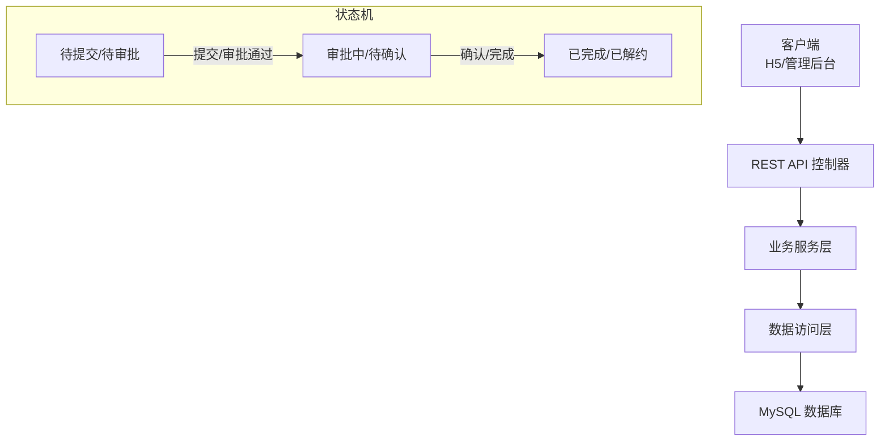

**图表来源**
- [ruoyi-admin/src/main/java/com/ruoyi/web/controller/h5/HzCheckInController.java:34-99](file://ruoyi-admin/src/main/java/com/ruoyi/web/controller/h5/HzCheckInController.java#L34-L99)
- [ruoyi-admin/src/main/java/com/ruoyi/web/controller/h5/HzCheckOutController.java:59-103](file://ruoyi-admin/src/main/java/com/ruoyi/web/controller/h5/HzCheckOutController.java#L59-L103)
- [ruoyi-system/src/main/java/com/ruoyi/system/service/impl/HzCheckoutServiceImpl.java:440-458](file://ruoyi-system/src/main/java/com/ruoyi/system/service/impl/HzCheckoutServiceImpl.java#L440-L458)

## 详细组件分析

### 入住管理接口
- 功能范围：入住申请、入住审批、入住确认、入住记录查询。
- 关键接口
  - 提交入住申请：POST /h5/checkin/apply
  - 修改入住申请：PUT /h5/checkin/update
  - 取消入住申请：DELETE /h5/checkin/{checkInId}
  - 查询申请列表：GET /h5/checkin/list
  - 查询申请详情：GET /h5/checkin/{checkInId}

- 流程要点
  - 申请提交需绑定有效合同且合同状态为"已签署/履行中"，并确保同一合同仅能提交一次入住申请。
  - 服务层默认状态为"待办理"，支持删除标记软删除。
  - 支持分页查询与关联信息查询（合同、用户、房源）。

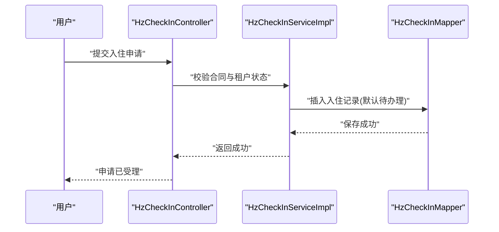

**图表来源**
- [ruoyi-admin/src/main/java/com/ruoyi/web/controller/h5/HzCheckInController.java:62-99](file://ruoyi-admin/src/main/java/com/ruoyi/web/controller/h5/HzCheckInController.java#L62-L99)
- [ruoyi-system/src/main/java/com/ruoyi/system/service/impl/HzCheckInServiceImpl.java:70-84](file://ruoyi-system/src/main/java/com/ruoyi/system/service/impl/HzCheckInServiceImpl.java#L70-L84)
- [ruoyi-system/src/main/java/com/ruoyi/system/mapper/HzCheckInMapper.java:46-102](file://ruoyi-system/src/main/java/com/ruoyi/system/mapper/HzCheckInMapper.java#L46-L102)

**章节来源**
- [ruoyi-admin/src/main/java/com/ruoyi/web/controller/h5/HzCheckInController.java:34-163](file://ruoyi-admin/src/main/java/com/ruoyi/web/controller/h5/HzCheckInController.java#L34-L163)
- [ruoyi-system/src/main/java/com/ruoyi/system/service/impl/HzCheckInServiceImpl.java:25-112](file://ruoyi-system/src/main/java/com/ruoyi/system/service/impl/HzCheckInServiceImpl.java#L25-L112)
- [ruoyi-system/src/main/java/com/ruoyi/system/mapper/HzCheckInMapper.java:46-102](file://ruoyi-system/src/main/java/com/ruoyi/system/mapper/HzCheckInMapper.java#L46-L102)

### 退租管理接口
- 功能范围：退租申请、退租审批、退租结算、退租记录查询。
- 关键接口
  - 提交退租申请：POST /h5/checkout/apply
  - 修改退租申请：PUT /h5/checkout/update
  - 取消退租申请：DELETE /h5/checkout/{applyId}
  - 查询申请列表：GET /h5/checkout/list
  - 查询申请详情：GET /h5/checkout/{applyId}
  - APP 端退租确认：POST /h5/app/checkout/confirm

- 流程要点
  - 仅"履行中"的合同可提交退租申请，且同一合同不可重复提交。
  - 服务层支持审批状态推进、费用计算、退租记录生成与合同状态更新为"已解约"。
  - 退租完成后自动生成退款申请，供管理端审核。

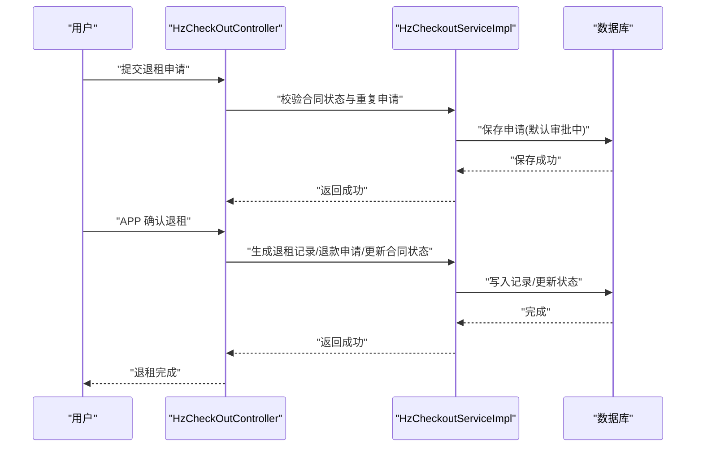

**图表来源**
- [ruoyi-admin/src/main/java/com/ruoyi/web/controller/h5/HzCheckOutController.java:59-103](file://ruoyi-admin/src/main/java/com/ruoyi/web/controller/h5/HzCheckOutController.java#L59-L103)
- [ruoyi-admin/src/main/java/com/ruoyi/web/controller/h5/HzCheckOutAppController.java:1-36](file://ruoyi-admin/src/main/java/com/ruoyi/web/controller/h5/HzCheckOutAppController.java#L1-L36)
- [ruoyi-system/src/main/java/com/ruoyi/system/service/impl/HzCheckoutServiceImpl.java:406-458](file://ruoyi-system/src/main/java/com/ruoyi/system/service/impl/HzCheckoutServiceImpl.java#L406-L458)

**章节来源**
- [ruoyi-admin/src/main/java/com/ruoyi/web/controller/h5/HzCheckOutController.java:34-167](file://ruoyi-admin/src/main/java/com/ruoyi/web/controller/h5/HzCheckOutController.java#L34-L167)
- [ruoyi-admin/src/main/java/com/ruoyi/web/controller/h5/HzCheckOutAppController.java:25-36](file://ruoyi-admin/src/main/java/com/ruoyi/web/controller/h5/HzCheckOutAppController.java#L25-L36)
- [ruoyi-system/src/main/java/com/ruoyi/system/service/impl/HzCheckoutServiceImpl.java:406-614](file://ruoyi-system/src/main/java/com/ruoyi/system/service/impl/HzCheckoutServiceImpl.java#L406-L614)

### 房屋订单管理接口
- 功能范围：订单创建、订单状态跟踪、订单取消。
- 关键接口与能力
  - 创建订单：原子锁定房源，返回订单号与到期时间、押金金额。
  - 查询订单状态：返回订单状态与剩余时间。
  - 用户取消订单：校验租户权限。
  - 待上传资料订单列表：支持倒计时展示。
  - 入住前置检查：校验是否存在未完成的待上传资料订单。
  - 押金/租金支付回调后推进合同状态至"履行中"。
  - 定时任务：处理过期订单并释放房源。

**更新** 房屋订单创建流程经过内部重构，新增动态锁定过期时间计算功能，基于批次偏好配置的入驻结束日期自动计算订单有效期。

**更新** 新增合同状态推进触发房屋状态同步机制，确保数据一致性。

#### 合同状态推进与房屋状态同步流程
当合同状态从"已签署"(2)推进到"履行中"(3)时，系统自动触发房屋状态同步：

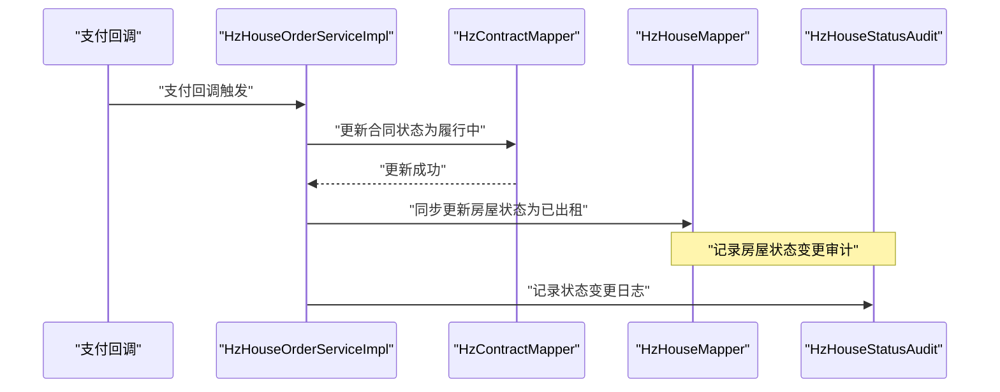

**图表来源**
- [ruoyi-system/src/main/java/com/ruoyi/system/service/impl/HzHouseOrderServiceImpl.java:394-408](file://ruoyi-system/src/main/java/com/ruoyi/system/service/impl/HzHouseOrderServiceImpl.java#L394-L408)

#### 动态锁定过期时间计算机制
系统根据租户类型采用不同的锁定过期时间计算策略：

- **普通用户**：锁定时间为当前时间加10分钟
- **批次配租用户**：锁定时间为批次偏好配置中的入驻结束日期23:59:59

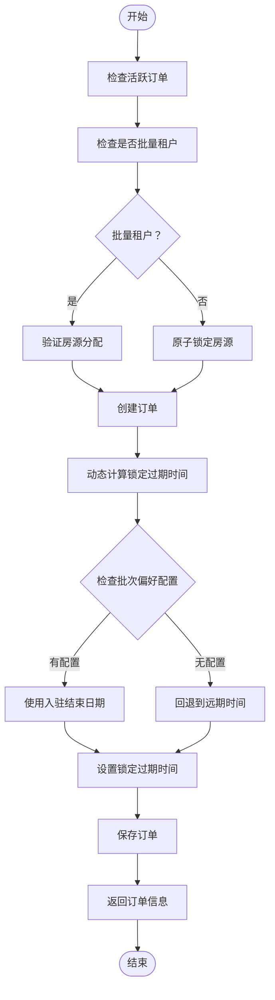

**图表来源**
- [ruoyi-system/src/main/java/com/ruoyi/system/service/impl/HzHouseOrderServiceImpl.java:122-142](file://ruoyi-system/src/main/java/com/ruoyi/system/service/impl/HzHouseOrderServiceImpl.java#L122-L142)

**章节来源**
- [ruoyi-system/src/main/java/com/ruoyi/system/service/IHzHouseOrderService.java:1-91](file://ruoyi-system/src/main/java/com/ruoyi/system/service/IHzHouseOrderService.java#L1-L91)
- [ruoyi-system/src/main/java/com/ruoyi/system/service/impl/HzHouseOrderServiceImpl.java:74-153](file://ruoyi-system/src/main/java/com/ruoyi/system/service/impl/HzHouseOrderServiceImpl.java#L74-L153)

## 房屋订单状态与合同状态同步机制

### 同步机制概述
系统实现了房屋订单状态与合同状态的双向同步机制，确保业务数据的一致性。当合同状态发生推进时，系统会自动更新关联的房屋状态，反之亦然。

### 合同状态推进触发房屋状态同步
当房屋订单完成支付流程后，系统会尝试将合同状态从"已签署"(2)推进到"履行中"(3)。一旦合同状态成功推进，系统会自动同步更新房屋状态：

#### 技术实现细节
- **触发条件**：合同状态为"已签署"(2)或"待生效"(1)且押金和首期租金均已付清
- **同步范围**：仅对状态为"空置"(0)或"已预订"(1)的房屋进行更新
- **目标状态**：房屋状态更新为"已出租"(2)
- **事务保证**：使用数据库事务确保合同状态更新和房屋状态更新的原子性

#### 同步流程图
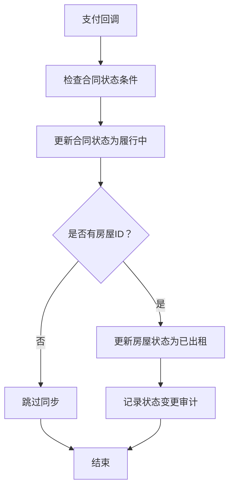

**图表来源**
- [ruoyi-system/src/main/java/com/ruoyi/system/service/impl/HzHouseOrderServiceImpl.java:394-408](file://ruoyi-system/src/main/java/com/ruoyi/system/service/impl/HzHouseOrderServiceImpl.java#L394-L408)

### 合同状态推进的触发条件
合同状态推进到"履行中"需要满足以下条件：

#### 支付回调触发
- **押金支付**：押金金额已全额支付
- **首期租金**：首期租金金额已全额支付
- **双条件满足**：押金和首期租金均已完成支付

#### 电子合同签署触发
- **续租/换房合同**：直接推进到"履行中"(3)
- **新签合同**：推进到"已签署"(2)，待支付完成后自动推进到"履行中"(3)

**章节来源**
- [ruoyi-system/src/main/java/com/ruoyi/system/service/impl/HzHouseOrderServiceImpl.java:394-408](file://ruoyi-system/src/main/java/com/ruoyi/system/service/impl/HzHouseOrderServiceImpl.java#L394-L408)
- [ruoyi-system/src/main/java/com/ruoyi/system/service/impl/EsignServiceImpl.java:909-919](file://ruoyi-system/src/main/java/com/ruoyi/system/service/impl/EsignServiceImpl.java#L909-L919)
- [ruoyi-admin/src/main/java/com/ruoyi/web/controller/h5/WechatPayController.java:304](file://ruoyi-admin/src/main/java/com/ruoyi/web/controller/h5/WechatPayController.java#L304)
- [ruoyi-admin/src/main/java/com/ruoyi/web/controller/h5/WechatPayController.java:415](file://ruoyi-admin/src/main/java/com/ruoyi/web/controller/h5/WechatPayController.java#L415)

### 房屋状态变更审计
每次房屋状态变更都会记录详细的审计信息，包括：

#### 审计字段
- **变更前状态**：房屋变更前的状态
- **变更后状态**：房屋变更后的状态
- **操作人**：执行状态变更的用户或系统
- **变更时间**：状态变更的具体时间
- **关联合同**：触发状态变更的合同编号
- **变更原因**：状态变更的具体原因

#### 审计流程
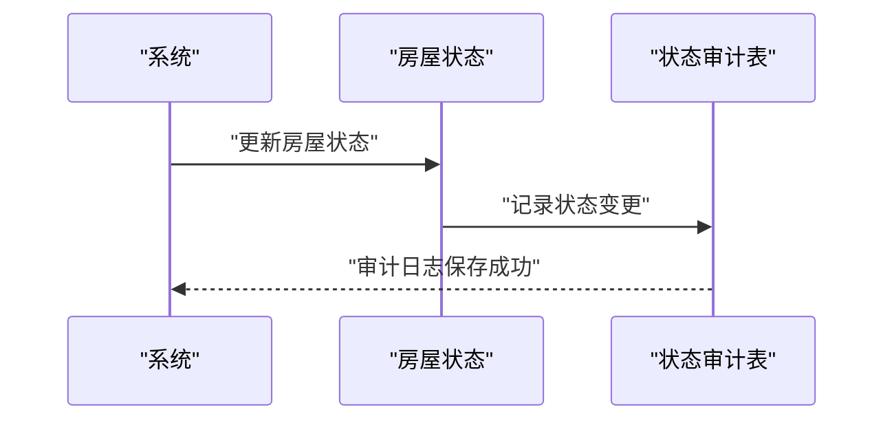

**图表来源**
- [ruoyi-system/src/main/java/com/ruoyi/system/domain/HzHouseStatusAudit.java](file://ruoyi-system/src/main/java/com/ruoyi/system/domain/HzHouseStatusAudit.java)

**章节来源**
- [ruoyi-system/src/main/java/com/ruoyi/system/domain/HzHouseStatusAudit.java](file://ruoyi-system/src/main/java/com/ruoyi/system/domain/HzHouseStatusAudit.java)

## 批量租户订单处理流程

### 批量租户订单概述
批量租户订单处理是针对企业批量租户的特殊订单处理流程。当检测到订单对应的租户为企业批量租户时，系统会自动设置订单的isBatchAlloc标志，并采用特殊的业务处理逻辑。

### 订单创建时的批量租户检测
在房屋订单创建过程中，系统会自动检测租户是否属于批量租户：

- **批量租户检测机制**：通过HzBatchTenantMapper查询租户是否存在于批量租户表中
- **isBatchAlloc标志设置**：检测到批量租户时，将订单的isBatchAlloc字段设置为"1"
- **特殊处理逻辑**：批量租户订单不受标准锁定机制限制

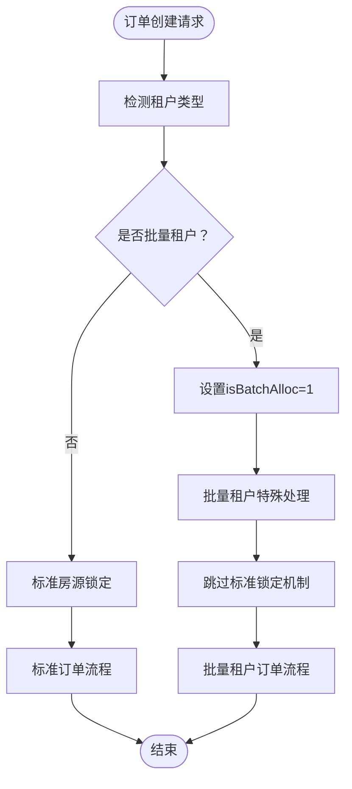

**图表来源**
- [ruoyi-system/src/main/java/com/ruoyi/system/service/impl/HzHouseOrderServiceImpl.java:90-106](file://ruoyi-system/src/main/java/com/ruoyi/system/service/impl/HzHouseOrderServiceImpl.java#L90-L106)
- [ruoyi-system/src/main/java/com/ruoyi/system/domain/HzHouseOrder.java:129](file://ruoyi-system/src/main/java/com/ruoyi/system/domain/HzHouseOrder.java#L129)

### 动态锁定过期时间计算增强
**更新** 系统对批量租户和普通用户的锁定时间计算进行了重构，新增基于批次偏好配置的动态计算功能：

#### 普通用户锁定时间计算
- **作用域**：仅在非批量租户情况下执行
- **计算逻辑**：普通用户锁定时间为当前时间加10分钟
- **目的**：为普通用户提供10分钟的锁定时间用于完成签约流程

#### 批量租户锁定时间计算增强
- **作用域**：仅在批量租户情况下执行  
- **计算逻辑**：基于批次偏好配置的入驻结束日期自动计算
- **优先级机制**：
  1. 首先查询批次偏好配置中的entryEndDate
  2. 将日期设置为当天23:59:59
  3. 如果查询不到批次信息，则回退到2099-12-31 23:59:59
- **目的**：确保批量租户订单的锁定时间与批次配租的有效期保持一致

#### 批次偏好配置数据模型
BatchPreferenceVo类提供了批次偏好的完整配置信息：

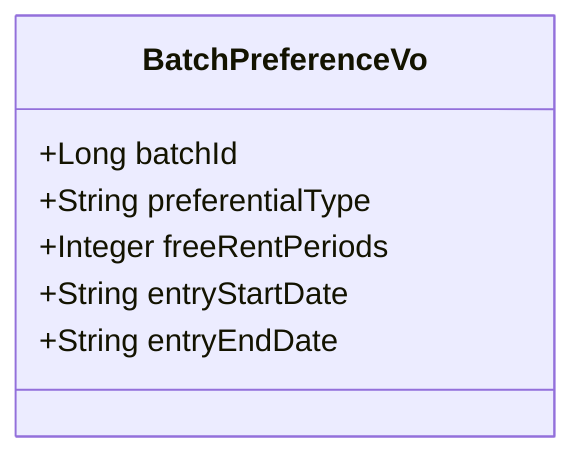

**图表来源**
- [ruoyi-system/src/main/java/com/ruoyi/system/domain/vo/BatchPreferenceVo.java:1-75](file://ruoyi-system/src/main/java/com/ruoyi/system/domain/vo/BatchPreferenceVo.java#L1-L75)

### 锁定时间计算的改进
**更新** 系统对批量租户和普通用户的锁定时间计算进行了重构，修复了作用域问题，使代码逻辑更加一致和正确：

#### 普通用户锁定时间计算
- **作用域**：仅在非批量租户情况下执行
- **计算逻辑**：普通用户锁定时间为当前时间加10分钟
- **目的**：为普通用户提供10分钟的锁定时间用于完成签约流程

#### 批量租户锁定时间计算增强
- **作用域**：仅在批量租户情况下执行  
- **计算逻辑**：基于批次偏好配置的入驻结束日期自动计算
- **异常处理**：查询异常时回退到远期时间2099-12-31 23:59:59
- **目的**：满足数据库NOT NULL约束，确保订单有效期与批次配租周期一致

#### 作用域修复说明
之前的代码可能存在作用域判断不一致的问题，重构后的代码确保：
- 普通用户分支和批量租户分支的逻辑更加清晰
- 锁定时间计算的作用域更加明确
- 代码逻辑的一致性和正确性得到提升

### 增强的批量租户验证逻辑
系统新增了双重验证路径机制，确保批量租户订单的安全性和准确性：

#### 主要验证机制
1. **基础验证路径**
   - 通过用户身份证号码在批量租户表中查找匹配记录
   - 验证租户记录未被删除的状态
   
2. **增强验证路径**
   - 通过hz_user.id_card → hz_batch_tenant.id → hz_batch_house.tenant_id + house_id 三表匹配
   - 确保房源确实分配给该批量租户用户

#### 验证流程图
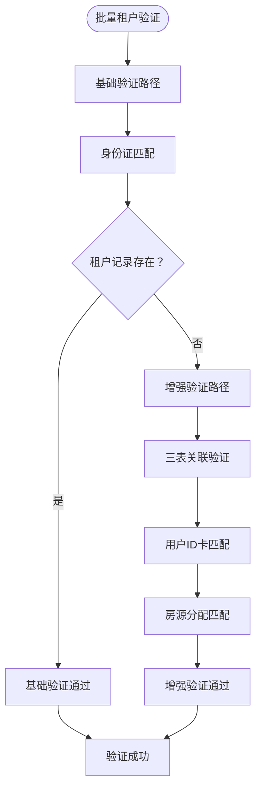

**图表来源**
- [ruoyi-system/src/main/java/com/ruoyi/system/service/impl/HzHouseOrderServiceImpl.java:431-455](file://ruoyi-system/src/main/java/com/ruoyi/system/service/impl/HzHouseOrderServiceImpl.java#L431-L455)

### 批量租户订单的特殊处理逻辑
批量租户订单具有以下特殊处理特性：

- **不受标准锁定机制限制**：批量租户订单不需要进行标准的房源锁定检查
- **特殊业务流程**：采用专门的批量租户订单处理逻辑
- **配租批次管理**：与批量配租批次管理系统集成
- **批量租户标识**：通过isBatchAlloc标志区分批量租户订单

### 批量租户订单的关键接口
- **批量租户订单创建**：POST /h5/order/create（自动检测批量租户）
- **批量租户订单查询**：GET /h5/order/batchList（查询批量租户订单）
- **批量租户订单状态**：GET /h5/order/batchStatus（查询批量租户订单状态）

### 批量租户订单数据模型
批量租户订单在HzHouseOrder模型中增加了isBatchAlloc字段：

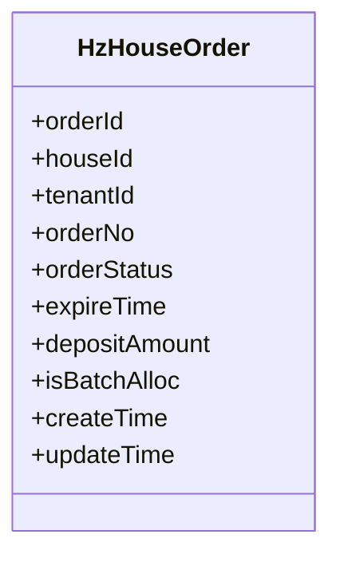

**图表来源**
- [ruoyi-system/src/main/java/com/ruoyi/system/domain/HzHouseOrder.java:129](file://ruoyi-system/src/main/java/com/ruoyi/system/domain/HzHouseOrder.java#L129)

**章节来源**
- [ruoyi-system/src/main/java/com/ruoyi/system/service/impl/HzHouseOrderServiceImpl.java:90-153](file://ruoyi-system/src/main/java/com/ruoyi/system/service/impl/HzHouseOrderServiceImpl.java#L90-L153)
- [ruoyi-system/src/main/java/com/ruoyi/system/domain/HzHouseOrder.java:129](file://ruoyi-system/src/main/java/com/ruoyi/system/domain/HzHouseOrder.java#L129)
- [ruoyi-system/src/main/java/com/ruoyi/system/domain/vo/BatchPreferenceVo.java:1-75](file://ruoyi-system/src/main/java/com/ruoyi/system/domain/vo/BatchPreferenceVo.java#L1-L75)

## 房屋置换接口
- 功能范围：置换申请、置换审批、置换完成。
- 关键接口与能力
  - 新增/修改/删除置换申请。
  - 分页查询置换申请列表。
  - 审核置换申请（通过/拒绝）。
  - 项目/楼栋/单元/可用房间查询。
  - 分配目标房源并保存到交换记录。
  - 确认换房（完整换房逻辑，含新合同生成与起止日期计算）。

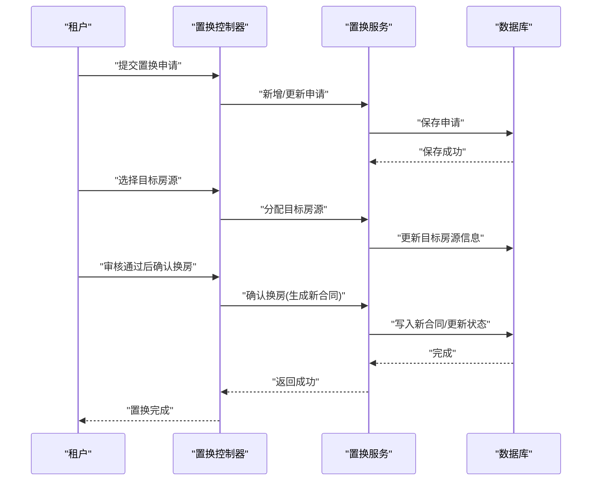

**图表来源**
- [ruoyi-system/src/main/java/com/ruoyi/system/service/IHzHouseExchangeService.java:50-131](file://ruoyi-system/src/main/java/com/ruoyi/system/service/IHzHouseExchangeService.java#L50-L131)
- [ruoyi-system/src/main/java/com/ruoyi/system/service/impl/HzHouseExchangeServiceImpl.java:200-221](file://ruoyi-system/src/main/java/com/ruoyi/system/service/impl/HzHouseExchangeServiceImpl.java#L200-L221)

**章节来源**
- [ruoyi-system/src/main/java/com/ruoyi/system/service/IHzHouseExchangeService.java:1-133](file://ruoyi-system/src/main/java/com/ruoyi/system/service/IHzHouseExchangeService.java#L1-L133)
- [ruoyi-system/src/main/java/com/ruoyi/system/service/impl/HzHouseExchangeServiceImpl.java:200-221](file://ruoyi-system/src/main/java/com/ruoyi/system/service/impl/HzHouseExchangeServiceImpl.java#L200-L221)

### 维修报修接口
- 功能范围：提交报修、查询我的报修、查看详情、取消报修。
- 关键接口
  - 提交报修：POST /h5/app/repair/submit
  - 查询我的报修：GET /h5/app/repair/myList
  - 查看详情：GET /h5/app/repair/{repairId}
  - 取消报修：PUT /h5/app/repair/cancel/{repairId}

- 数据模型要点
  - 状态：0-待处理，1-已完成，2-已取消。
  - 支持位置、房间号、期望维修时间、图片、处理结果、处理人等字段。

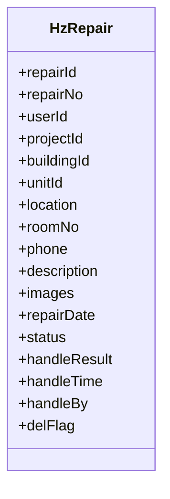

**图表来源**
- [ruoyi-system/src/main/java/com/ruoyi/system/domain/HzRepair.java:1-278](file://ruoyi-system/src/main/java/com/ruoyi/system/domain/HzRepair.java#L1-L278)

**章节来源**
- [ruoyi-admin/src/main/java/com/ruoyi/web/controller/h5/HzRepairAppController.java:30-105](file://ruoyi-admin/src/main/java/com/ruoyi/web/controller/h5/HzRepairAppController.java#L30-L105)
- [ruoyi-system/src/main/java/com/ruoyi/system/domain/HzRepair.java:60-82](file://ruoyi-system/src/main/java/com/ruoyi/system/domain/HzRepair.java#L60-L82)

### 投诉建议接口
- 功能范围：提交投诉、查询我的投诉、查看详情、催办、取消。
- 关键接口
  - 提交投诉：POST /h5/app/complaint/submit
  - 查询我的投诉：GET /h5/app/complaint/myList
  - 查看详情：GET /h5/app/complaint/{complaintId}
  - 催办：PUT /h5/app/complaint/urge/{complaintId}
  - 取消投诉：PUT /h5/app/complaint/cancel/{complaintId}

- 数据模型要点
  - 状态：0-待处理，1-已处理。
  - 支持联系信息、图片、催办次数、处理结果、处理人等字段.

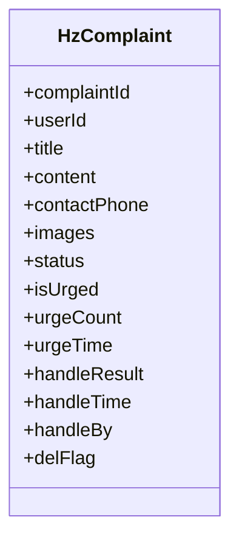

**图表来源**
- [ruoyi-system/src/main/java/com/ruoyi/system/domain/HzComplaint.java:1-233](file://ruoyi-system/src/main/java/com/ruoyi/system/domain/HzComplaint.java#L1-L233)

**章节来源**
- [ruoyi-admin/src/main/java/com/ruoyi/web/controller/h5/HzComplaintAppController.java:30-128](file://ruoyi-admin/src/main/java/com/ruoyi/web/controller/h5/HzComplaintAppController.java#L30-L128)
- [ruoyi-system/src/main/java/com/ruoyi/system/domain/HzComplaint.java:40-70](file://ruoyi-system/src/main/java/com/ruoyi/system/domain/HzComplaint.java#L40-L70)

### 业务流程统计分析与流程监控
- 统计分析接口
  - 支持按项目、月份、账单类型等维度聚合应收/实收/逾期等指标。
  - 支持多指标组合与图表渲染。
- 流程监控
  - 关键指标：数据实体、业务服务、管理页面、H5 页面、API 模块、Maven 模块等。
  - 建议结合日志与审计字段（创建/更新时间、操作人）进行流程追踪。

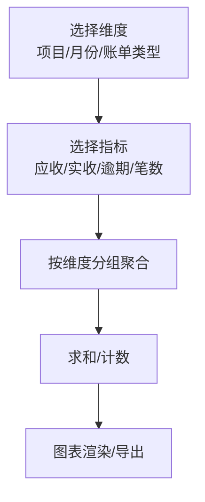

**图表来源**
- [ruoyi-admin/src/main/java/com/ruoyi/web/controller/system/HzReportController.java:478-573](file://ruoyi-admin/src/main/java/com/ruoyi/web/controller/system/HzReportController.java#L478-L573)
- [港好住系统架构图.html:355-366](file://港好住系统架构图.html#L355-L366)

**章节来源**
- [ruoyi-admin/src/main/java/com/ruoyi/web/controller/system/HzReportController.java:478-573](file://ruoyi-admin/src/main/java/com/ruoyi/web/controller/system/HzReportController.java#L478-L573)
- [港好住系统架构图.html:355-366](file://港好住系统架构图.html#L355-L366)

## 依赖分析
- 控制器依赖服务层，服务层依赖 Mapper 与领域模型。
- 退租流程涉及合同、账单、房源、用户、退款申请等多表联动。
- 入住流程涉及合同、用户、房源、入住记录等关联查询。
- **批量租户订单处理**：房屋订单服务依赖批量租户映射器进行租户类型检测。
- **动态锁定过期时间计算**：批量租户订单依赖批次偏好配置和批次房屋映射器进行入驻结束日期查询。
- **合同状态推进与房屋状态同步**：房屋订单服务依赖合同映射器和房屋映射器实现状态同步。

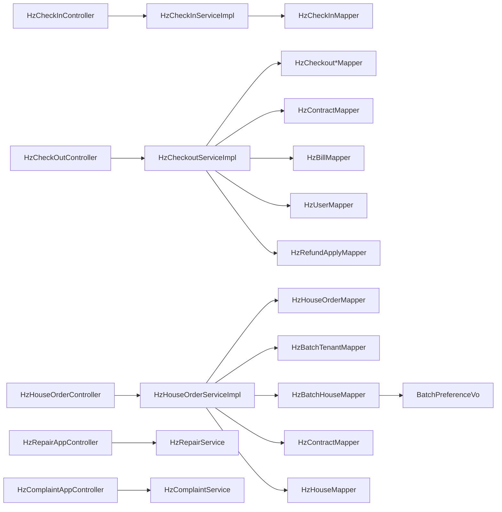

**图表来源**
- [ruoyi-admin/src/main/java/com/ruoyi/web/controller/h5/HzCheckInController.java:25-32](file://ruoyi-admin/src/main/java/com/ruoyi/web/controller/h5/HzCheckInController.java#L25-L32)
- [ruoyi-admin/src/main/java/com/ruoyi/web/controller/h5/HzCheckOutController.java:25-32](file://ruoyi-admin/src/main/java/com/ruoyi/web/controller/h5/HzCheckOutController.java#L25-L32)
- [ruoyi-system/src/main/java/com/ruoyi/system/service/impl/HzCheckoutServiceImpl.java:57-88](file://ruoyi-system/src/main/java/com/ruoyi/system/service/impl/HzCheckoutServiceImpl.java#L57-L88)
- [ruoyi-system/src/main/java/com/ruoyi/system/service/impl/HzHouseOrderServiceImpl.java:74](file://ruoyi-system/src/main/java/com/ruoyi/system/service/impl/HzHouseOrderServiceImpl.java#L74)

**章节来源**
- [ruoyi-system/src/main/java/com/ruoyi/system/service/impl/HzCheckoutServiceImpl.java:57-88](file://ruoyi-system/src/main/java/com/ruoyi/system/service/impl/HzCheckoutServiceImpl.java#L57-L88)

## 性能考虑
- 分页查询：所有列表查询均支持分页，建议前端传入合理页码与大小，避免一次性拉取大量数据。
- 关联查询：入住/退租详情涉及多表关联，建议按需查询字段，减少不必要的 JOIN。
- 缓存策略：对高频只读数据（如字典、项目/楼栋/单元列表）可引入缓存。
- 并发控制：订单创建采用原子锁定，避免超卖；退租结算使用事务保证一致性。
- **批量租户订单性能**：批量租户订单跳过标准锁定机制，提高处理效率。
- **批量租户验证性能**：双重验证路径机制在保证安全性的同时，通过索引优化和三表关联查询提升验证效率。
- **动态锁定过期时间计算性能**：重构后的锁定时间计算逻辑更加简洁高效，减少了不必要的条件判断。
- **批次偏好配置缓存**：建议对常用的批次偏好配置进行缓存，减少数据库查询开销。
- **定时任务优化**：HouseOrderExpireTask定时任务应合理设置执行频率，避免频繁扫描数据库。
- **合同状态同步性能**：房屋状态同步操作采用批量更新策略，减少数据库往返次数。
- **状态审计性能**：房屋状态变更审计采用异步记录方式，避免影响主业务流程性能。
- 日志与监控：结合审计字段与操作日志，定位慢查询与异常流程。

## 故障排查指南
- 入住申请
  - 症状：提交失败或重复申请。
  - 排查：确认合同状态、租户归属、是否已存在未完成的入住申请。
- 退租申请
  - 症状：无法提交或状态异常。
  - 排查：确认合同处于"履行中"，同一合同不可重复申请；检查审批状态与费用计算。
- **批量租户订单**
  - 症状：批量租户订单创建失败或锁定异常。
  - 排查：确认租户是否正确注册为批量租户；检查isBatchAlloc标志设置；验证批量配租批次状态。
  - **新增**：检查双重验证路径是否正常工作，确认三表关联查询是否返回预期结果；验证批次偏好配置是否正确设置；检查动态锁定过期时间计算逻辑是否正确执行。
- **动态锁定过期时间计算**
  - 症状：批量租户订单锁定时间异常。
  - 排查：确认批次偏好配置中的entryEndDate格式正确；检查批次房屋映射关系；验证日期解析和时区转换逻辑。
- **合同状态推进与房屋状态同步**
  - 症状：合同状态已推进但房屋状态未更新。
  - 排查：确认合同状态推进条件是否满足；检查房屋ID是否正确；验证房屋状态是否为可更新状态；查看状态同步日志。
  - **新增**：检查合同状态推进触发器是否正常工作；验证房屋状态同步事务是否提交成功；确认状态审计记录是否正确生成。
- 报修/投诉
  - 症状：无法取消或越权查看。
  - 排查：确认当前用户与记录所属用户一致；仅"待处理"状态允许取消。
- 统计报表
  - 症状：指标不准确或为空。
  - 排查：确认维度与指标选择、时间范围、数据是否已归档或删除。

**章节来源**
- [ruoyi-admin/src/main/java/com/ruoyi/web/controller/h5/HzCheckInController.java:71-91](file://ruoyi-admin/src/main/java/com/ruoyi/web/controller/h5/HzCheckInController.java#L71-L91)
- [ruoyi-admin/src/main/java/com/ruoyi/web/controller/h5/HzCheckOutController.java:71-99](file://ruoyi-admin/src/main/java/com/ruoyi/web/controller/h5/HzCheckOutController.java#L71-L99)
- [ruoyi-system/src/main/java/com/ruoyi/system/service/impl/HzHouseOrderServiceImpl.java:90-153](file://ruoyi-system/src/main/java/com/ruoyi/system/service/impl/HzHouseOrderServiceImpl.java#L90-L153)
- [ruoyi-system/src/main/java/com/ruoyi/system/domain/vo/BatchPreferenceVo.java:1-75](file://ruoyi-system/src/main/java/com/ruoyi/system/domain/vo/BatchPreferenceVo.java#L1-L75)
- [ruoyi-admin/src/main/java/com/ruoyi/web/controller/h5/HzRepairAppController.java:90-105](file://ruoyi-admin/src/main/java/com/ruoyi/web/controller/h5/HzRepairAppController.java#L90-L105)
- [ruoyi-admin/src/main/java/com/ruoyi/web/controller/h5/HzComplaintAppController.java:90-128](file://ruoyi-admin/src/main/java/com/ruoyi/web/controller/h5/HzComplaintAppController.java#L90-L128)

## 结论
本文档梳理了入住、退租、订单、置换、维修报修、投诉建议等核心业务流程接口，明确了控制器职责、服务层状态机与数据模型，并提供了流程图与依赖关系图。**新增的批量租户订单处理流程**为大规模企业租户提供了高效的订单处理能力，通过跳过标准锁定机制和特殊的业务逻辑，显著提升了批量租户的订单处理效率。**增强的双重验证路径机制**进一步确保了批量租户订单的安全性，通过基础验证和增强验证的双重保障，有效防止了批量租户订单的滥用风险。**重构后的动态锁定过期时间计算功能**新增了基于批次偏好配置的智能计算机制，使批量租户订单的有效期与批次配租周期精确匹配，提升了系统的智能化水平和用户体验。**增强的锁定时间计算逻辑**修复了批量分配用户和普通用户锁定时间计算的作用域问题，使代码逻辑更加一致和正确，提升了系统的可靠性和维护性。**新增的房屋订单状态与合同状态同步机制**确保了业务数据的一致性，通过合同状态推进自动更新房屋状态，维护了系统数据的完整性。建议在生产环境中结合分页、缓存、事务与监控机制，持续优化性能与稳定性。

## 附录
- 技术方案与流程图参考：技术方案与系统架构图中包含更详细的流程说明与系统关键指标，可作为扩展阅读。
- **批次偏好配置说明**：BatchPreferenceVo类提供了完整的批次偏好配置信息，包括入驻开始/结束日期、免租期数等关键参数。
- **合同状态枚举**：HzContract类定义了完整的合同状态枚举，包括草稿(0)、待签署(1)、已签署(2)、履行中(3)、已到期(4)、已解约(5)。
- **房屋状态枚举**：系统中房屋状态包括空置(0)、已预订(1)、已出租(2)、维修中(3)、停用(4)等状态。

**章节来源**
- [技术方案.html:1523-1564](file://技术方案.html#L1523-L1564)
- [港好住系统架构图.html:355-366](file://港好住系统架构图.html#L355-L366)
- [ruoyi-system/src/main/java/com/ruoyi/system/domain/vo/BatchPreferenceVo.java:1-75](file://ruoyi-system/src/main/java/com/ruoyi/system/domain/vo/BatchPreferenceVo.java#L1-L75)
- [ruoyi-system/src/main/java/com/ruoyi/system/domain/HzContract.java:138-142](file://ruoyi-system/src/main/java/com/ruoyi/system/domain/HzContract.java#L138-L142)