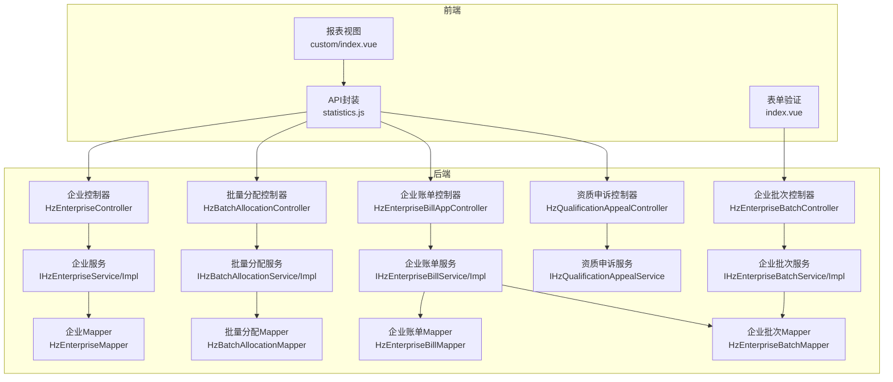
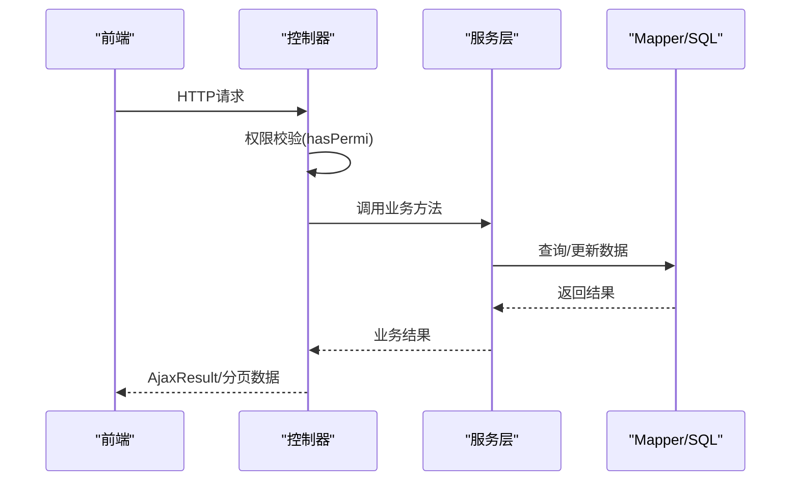
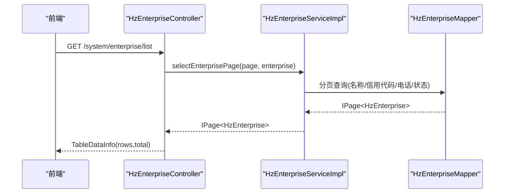
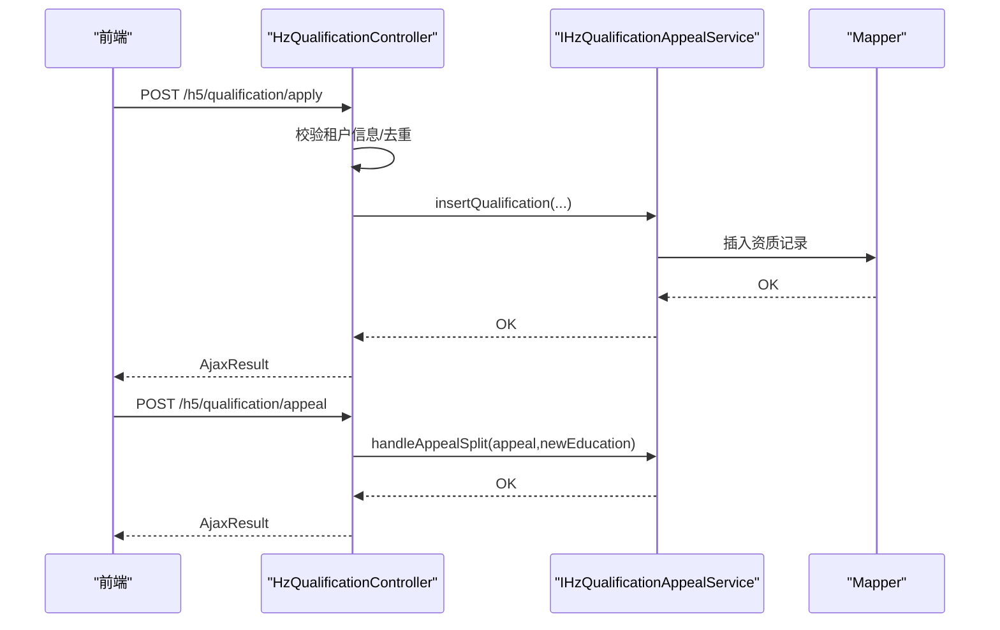
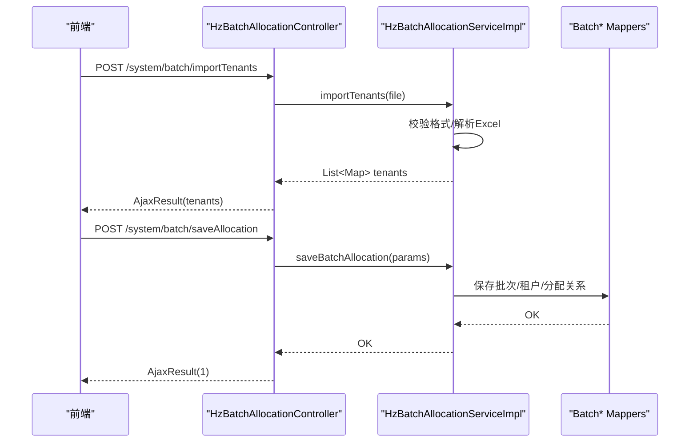
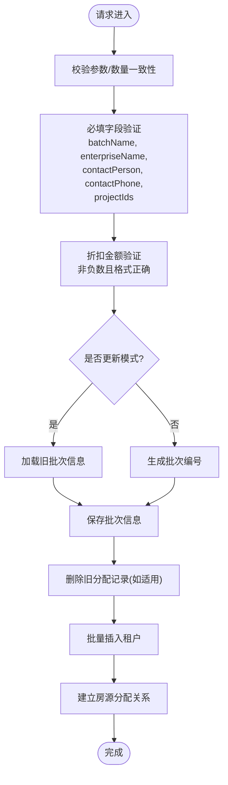
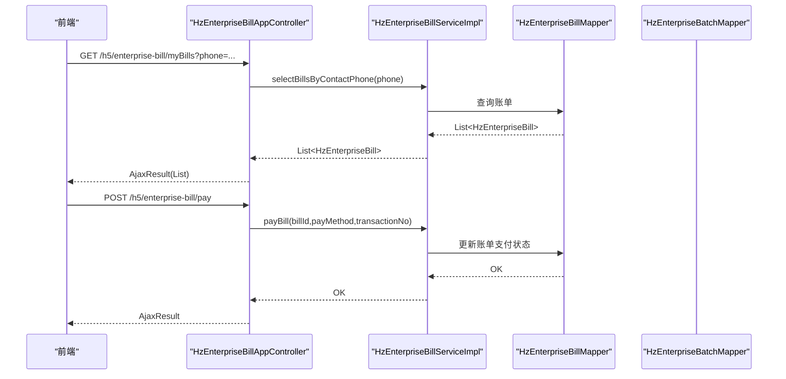
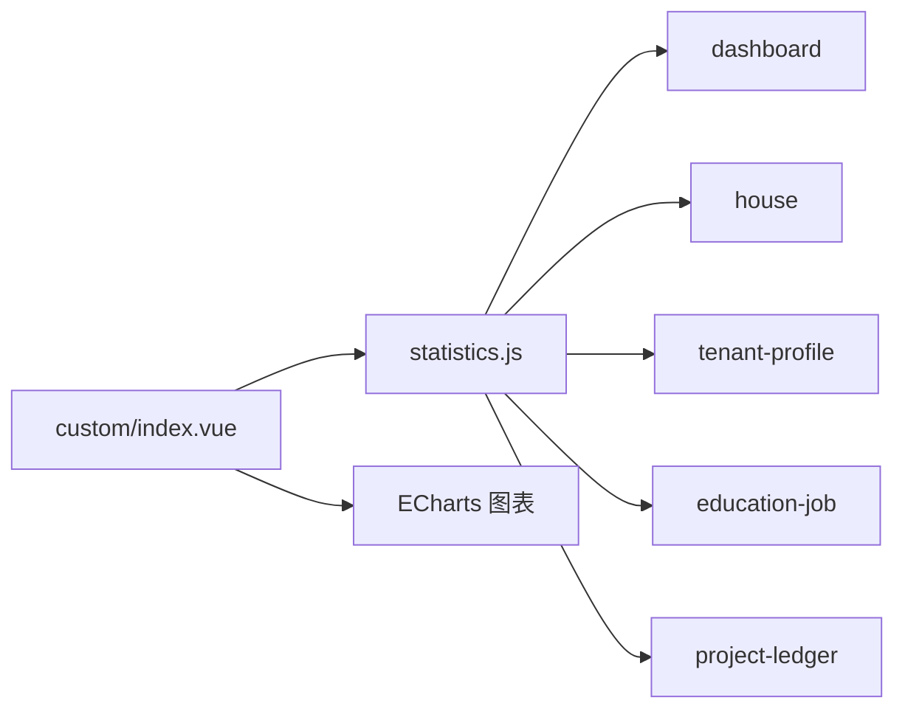
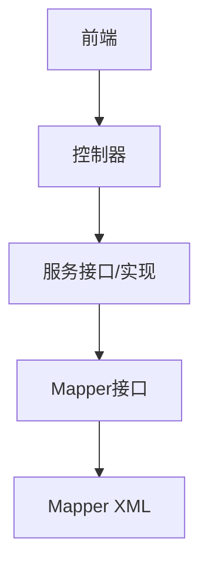

# 企业管理接口

<cite>
**本文档引用的文件**
- [HzEnterpriseController.java](file://ruoyi-admin/src/main/java/com/ruoyi/web/controller/system/HzEnterpriseController.java)
- [IHzEnterpriseService.java](file://ruoyi-system/src/main/java/com/ruoyi/system/service/IHzEnterpriseService.java)
- [HzEnterpriseServiceImpl.java](file://ruoyi-system/src/main/java/com/ruoyi/system/service/impl/HzEnterpriseServiceImpl.java)
- [HzEnterprise.java](file://ruoyi-system/src/main/java/com/ruoyi/system/domain/HzEnterprise.java)
- [11-企业管理.md](file://docs/数据字典/11-企业管理.md)
- [HzBatchAllocationController.java](file://ruoyi-admin/src/main/java/com/ruoyi/web/controller/system/HzBatchAllocationController.java)
- [IHzBatchAllocationService.java](file://ruoyi-system/src/main/java/com/ruoyi/system/service/IHzBatchAllocationService.java)
- [HzBatchAllocationServiceImpl.java](file://ruoyi-system/src/main/java/com/ruoyi/system/service/impl/HzBatchAllocationServiceImpl.java)
- [10-批量分配.md](file://docs/数据字典/10-批量分配.md)
- [HzEnterpriseBatchController.java](file://ruoyi-admin/src/main/java/com/ruoyi/web/controller/system/HzEnterpriseBatchController.java)
- [HzEnterpriseBatchMapper.java](file://ruoyi-system/src/main/java/com/ruoyi/system/mapper/HzEnterpriseBatchMapper.java)
- [HzEnterpriseBatchMapper.xml](file://ruoyi-system/src/main/resources/mapper/system/HzEnterpriseBatchMapper.xml)
- [HzEnterpriseBatchServiceImpl.java](file://ruoyi-system/src/main/java/com/ruoyi/system/service/impl/HzEnterpriseBatchServiceImpl.java)
- [IHzEnterpriseBatchService.java](file://ruoyi-system/src/main/java/com/ruoyi/system/service/IHzEnterpriseBatchService.java)
- [HzEnterpriseBatch.java](file://ruoyi-system/src/main/java/com/ruoyi/system/domain/HzEnterpriseBatch.java)
- [HzEnterpriseBillAppController.java](file://ruoyi-admin/src/main/java/com/ruoyi/web/controller/h5/HzEnterpriseBillAppController.java)
- [IHzEnterpriseBillService.java](file://ruoyi-system/src/main/java/com/ruoyi/system/service/IHzEnterpriseBillService.java)
- [HzEnterpriseBillServiceImpl.java](file://ruoyi-system/src/main/java/com/ruoyi/system/service/impl/HzEnterpriseBillServiceImpl.java)
- [HzQualificationAppealController.java](file://ruoyi-admin/src/main/java/com/ruoyi/web/controller/system/HzQualificationAppealController.java)
- [IHzQualificationAppealService.java](file://ruoyi-system/src/main/java/com/ruoyi/system/service/IHzQualificationAppealService.java)
- [HzQualificationController.java](file://ruoyi-admin/src/main/java/com/ruoyi/web/controller/h5/HzQualificationController.java)
- [statistics.js](file://ruoyi-ui/src/api/gangzhu/statistics.js)
- [index.vue](file://ruoyi-ui/src/views/gangzhu/report/custom/index.vue)
- [index.vue](file://ruoyi-ui/src/views/gangzhu/house/enterprise/index.vue)
</cite>

## 更新摘要
**变更内容**
- 新增企业批次管理输入验证机制章节，详细说明折扣金额非负验证和必填字段验证
- 更新企业批次管理接口，增加输入验证流程和数据完整性保证
- 新增前端表单验证规则，包括必填字段和格式验证
- 完善企业批次管理的业务规则和数据校验逻辑

## 目录
1. [简介](#简介)
2. [项目结构](#项目结构)
3. [核心组件](#核心组件)
4. [架构总览](#架构总览)
5. [详细组件分析](#详细组件分析)
6. [依赖分析](#依赖分析)
7. [性能考虑](#性能考虑)
8. [故障排除指南](#故障排除指南)
9. [结论](#结论)
10. [附录](#附录)

## 简介
本文件面向企业管理接口的使用者与维护者，系统性梳理企业用户管理、企业资质审核、企业状态控制、批量分配管理、企业批次管理、企业服务接口（合同、账单、结算）、企业统计分析与报表接口以及权限控制与业务规则。文档以代码为依据，结合数据字典与前端调用示例，提供可操作的接口说明与最佳实践。

## 项目结构
企业管理相关能力主要分布在以下层次：
- 控制器层：负责HTTP请求接入与权限校验
- 服务层：封装业务逻辑与事务控制
- 数据访问层：MyBatis映射与SQL组织
- 数据模型：领域对象与状态枚举
- 前端接口：API封装与报表视图

**图表来源**
- [HzEnterpriseController.java:27-101](file://ruoyi-admin/src/main/java/com/ruoyi/web/controller/system/HzEnterpriseController.java#L27-L101)
- [HzBatchAllocationController.java:29-180](file://ruoyi-admin/src/main/java/com/ruoyi/web/controller/system/HzBatchAllocationController.java#L29-L180)
- [HzEnterpriseBillAppController.java:36-249](file://ruoyi-admin/src/main/java/com/ruoyi/web/controller/h5/HzEnterpriseBillAppController.java#L36-L249)
- [HzQualificationAppealController.java:57-90](file://ruoyi-admin/src/main/java/com/ruoyi/web/controller/system/HzQualificationAppealController.java#L57-L90)
- [HzEnterpriseBatchController.java:34-261](file://ruoyi-admin/src/main/java/com/ruoyi/web/controller/system/HzEnterpriseBatchController.java#L34-L261)

**章节来源**
- [HzEnterpriseController.java:27-101](file://ruoyi-admin/src/main/java/com/ruoyi/web/controller/system/HzEnterpriseController.java#L27-L101)
- [HzBatchAllocationController.java:29-180](file://ruoyi-admin/src/main/java/com/ruoyi/web/controller/system/HzBatchAllocationController.java#L29-L180)
- [HzEnterpriseBillAppController.java:36-249](file://ruoyi-admin/src/main/java/com/ruoyi/web/controller/h5/HzEnterpriseBillAppController.java#L36-L249)
- [HzQualificationAppealController.java:57-90](file://ruoyi-admin/src/main/java/com/ruoyi/web/controller/system/HzQualificationAppealController.java#L57-L90)
- [HzEnterpriseBatchController.java:34-261](file://ruoyi-admin/src/main/java/com/ruoyi/web/controller/system/HzEnterpriseBatchController.java#L34-L261)

## 核心组件
- 企业用户管理：提供企业信息的增删改查、导出、分页查询与状态控制
- 企业资质审核：支持企业资质申请、申诉与双材料独立审核
- 批量分配管理：批次申请、审批、导入人员、保存分配、查询房源与人员
- 企业批次管理：批次创建、状态管理、分页查询与导出，包含增强的输入验证机制
- 企业服务接口：账单查询、支付、审核、结算联动
- 统计分析与报表：多维指标与筛选，支持按月度聚合与汇总

**章节来源**
- [IHzEnterpriseService.java:15-74](file://ruoyi-system/src/main/java/com/ruoyi/system/service/IHzEnterpriseService.java#L15-L74)
- [IHzBatchAllocationService.java:18-139](file://ruoyi-system/src/main/java/com/ruoyi/system/service/IHzBatchAllocationService.java#L18-L139)
- [IHzEnterpriseBillService.java:16-116](file://ruoyi-system/src/main/java/com/ruoyi/system/service/IHzEnterpriseBillService.java#L16-L116)
- [IHzQualificationAppealService.java:83-118](file://ruoyi-system/src/main/java/com/ruoyi/system/service/IHzQualificationAppealService.java#L83-L118)
- [IHzEnterpriseBatchService.java:15-87](file://ruoyi-system/src/main/java/com/ruoyi/system/service/IHzEnterpriseBatchService.java#L15-L87)

## 架构总览
后端采用标准的三层架构：控制器接收请求并进行权限校验，服务层编排业务逻辑与事务，数据访问层通过MyBatis执行SQL。前端通过API封装统一调用，报表页面动态渲染。

**图表来源**
- [HzEnterpriseController.java:37-48](file://ruoyi-admin/src/main/java/com/ruoyi/web/controller/system/HzEnterpriseController.java#L37-L48)
- [HzBatchAllocationController.java:39-50](file://ruoyi-admin/src/main/java/com/ruoyi/web/controller/system/HzBatchAllocationController.java#L39-L50)
- [HzEnterpriseBillAppController.java:54-61](file://ruoyi-admin/src/main/java/com/ruoyi/web/controller/h5/HzEnterpriseBillAppController.java#L54-L61)

## 详细组件分析

### 企业用户管理接口
- 接口概览
  - 列表查询：支持按企业名称、统一社会信用代码、联系电话、状态过滤，分页返回
  - 导出：导出符合条件的企业列表
  - 详情：按企业ID查询
  - 新增/修改/删除：支持单个与批量删除
- 关键点
  - 默认状态为"正常"，员工数与已租房源数默认为0
  - 删除采用逻辑删除，更新del_flag字段
  - 权限注解：列表、导出、查询、新增、修改、删除分别受控

**图表来源**
- [HzEnterpriseController.java:37-48](file://ruoyi-admin/src/main/java/com/ruoyi/web/controller/system/HzEnterpriseController.java#L37-L48)
- [IHzEnterpriseService.java:66-73](file://ruoyi-system/src/main/java/com/ruoyi/system/service/IHzEnterpriseService.java#L66-L73)
- [HzEnterpriseServiceImpl.java:81-94](file://ruoyi-system/src/main/java/com/ruoyi/system/service/impl/HzEnterpriseServiceImpl.java#L81-L94)

**章节来源**
- [HzEnterpriseController.java:34-100](file://ruoyi-admin/src/main/java/com/ruoyi/web/controller/system/HzEnterpriseController.java#L34-L100)
- [IHzEnterpriseService.java:15-74](file://ruoyi-system/src/main/java/com/ruoyi/system/service/IHzEnterpriseService.java#L15-L74)
- [HzEnterpriseServiceImpl.java:24-96](file://ruoyi-system/src/main/java/com/ruoyi/system/service/impl/HzEnterpriseServiceImpl.java#L24-L96)
- [HzEnterprise.java:161-200](file://ruoyi-system/src/main/java/com/ruoyi/system/domain/HzEnterprise.java#L161-L200)
- [11-企业管理.md:1-27](file://docs/数据字典/11-企业管理.md#L1-L27)

### 企业资质审核接口
- 企业资质申请
  - 用户提交申请，按类型去重校验，避免重复提交未完成的同类型申请
- 资质申诉（双材料独立审核）
  - 支持学历与社保两通道独立审核，任一侧状态为null表示本次不变更该侧
  - 审核通过时可选择将学历信息回写到用户表
- 审核流程
  - 管理员在后台进行"双材料独立审核"，并可删除申诉记录

**图表来源**
- [HzQualificationController.java:176-195](file://ruoyi-admin/src/main/java/com/ruoyi/web/controller/h5/HzQualificationController.java#L176-L195)
- [HzQualificationController.java:200-206](file://ruoyi-admin/src/main/java/com/ruoyi/web/controller/h5/HzQualificationController.java#L200-L206)
- [HzQualificationAppealController.java:68-76](file://ruoyi-admin/src/main/java/com/ruoyi/web/controller/system/HzQualificationAppealController.java#L68-L76)
- [IHzQualificationAppealService.java:83-118](file://ruoyi-system/src/main/java/com/ruoyi/system/service/IHzQualificationAppealService.java#L83-L118)

**章节来源**
- [HzQualificationController.java:130-206](file://ruoyi-admin/src/main/java/com/ruoyi/web/controller/h5/HzQualificationController.java#L130-L206)
- [HzQualificationAppealController.java:57-90](file://ruoyi-admin/src/main/java/com/ruoyi/web/controller/system/HzQualificationAppealController.java#L57-L90)
- [IHzQualificationAppealService.java:83-118](file://ruoyi-system/src/main/java/com/ruoyi/system/service/IHzQualificationAppealService.java#L83-L118)

### 批量分配管理接口
- 批次申请与审批
  - 新增批次：自动生成批次编号，状态默认"待审批/进行中"
  - 审批：支持通过/拒绝，通过时将批次内房源状态置为"已预定"，并同步已分配数量
  - 作废：将批次状态置为"已作废"
- 人员导入与保存分配
  - 下载模板：提供人员导入模板
  - 导入校验：校验姓名、身份证、手机号格式
  - 保存分配：校验房源与人员一一对应，批量插入租户与分配关系
- 查询接口
  - 批次房源列表、批次人员列表

**图表来源**
- [HzBatchAllocationController.java:146-160](file://ruoyi-admin/src/main/java/com/ruoyi/web/controller/system/HzBatchAllocationController.java#L146-L160)
- [IHzBatchAllocationService.java:102-117](file://ruoyi-system/src/main/java/com/ruoyi/system/service/IHzBatchAllocationService.java#L102-L117)
- [HzBatchAllocationServiceImpl.java:302-348](file://ruoyi-system/src/main/java/com/ruoyi/system/service/impl/HzBatchAllocationServiceImpl.java#L302-L348)
- [HzBatchAllocationServiceImpl.java:350-490](file://ruoyi-system/src/main/java/com/ruoyi/system/service/impl/HzBatchAllocationServiceImpl.java#L350-L490)

**章节来源**
- [HzBatchAllocationController.java:36-180](file://ruoyi-admin/src/main/java/com/ruoyi/web/controller/system/HzBatchAllocationController.java#L36-L180)
- [IHzBatchAllocationService.java:68-139](file://ruoyi-system/src/main/java/com/ruoyi/system/service/IHzBatchAllocationService.java#L68-L139)
- [HzBatchAllocationServiceImpl.java:68-198](file://ruoyi-system/src/main/java/com/ruoyi/system/service/impl/HzBatchAllocationServiceImpl.java#L68-L198)
- [10-批量分配.md:1-77](file://docs/数据字典/10-批量分配.md#L1-L77)

### 企业批次管理接口
- 批次创建与编辑
  - 支持新增/修改批次，包含批次名称、人才类型、项目集合、优惠方式、入驻时间等
- 批次状态管理
  - 审批通过后，批次状态进入"进行中"，并同步房源状态为"已预定"
- 批次统计与导出
  - 支持按批次名称、企业名称过滤，分页查询与导出
- **新增** 输入验证机制
  - 必填字段验证：批次名称、企业名称、联系人、联系电话、项目集合
  - 折扣金额验证：必须为非负数，格式正确
  - 数据完整性保证：防止无效数据进入系统

**图表来源**
- [HzEnterpriseBatchController.java:118-250](file://ruoyi-admin/src/main/java/com/ruoyi/web/controller/system/HzEnterpriseBatchController.java#L118-L250)
- [HzBatchAllocationServiceImpl.java:350-490](file://ruoyi-system/src/main/java/com/ruoyi/system/service/impl/HzBatchAllocationServiceImpl.java#L350-L490)
- [HzEnterpriseBatchController.java:41-109](file://ruoyi-admin/src/main/java/com/ruoyi/web/controller/system/HzEnterpriseBatchController.java#L41-L109)
- [HzEnterpriseBatchMapper.java:16-40](file://ruoyi-system/src/main/java/com/ruoyi/system/mapper/HzEnterpriseBatchMapper.java#L16-L40)
- [HzEnterpriseBatchMapper.xml:71-86](file://ruoyi-system/src/main/resources/mapper/system/HzEnterpriseBatchMapper.xml#L71-L86)

**章节来源**
- [HzEnterpriseBatchController.java:118-250](file://ruoyi-admin/src/main/java/com/ruoyi/web/controller/system/HzEnterpriseBatchController.java#L118-L250)
- [HzEnterpriseBatchController.java:41-109](file://ruoyi-admin/src/main/java/com/ruoyi/web/controller/system/HzEnterpriseBatchController.java#L41-L109)
- [HzEnterpriseBatchMapper.java:16-40](file://ruoyi-system/src/main/java/com/ruoyi/system/mapper/HzEnterpriseBatchMapper.java#L16-L40)
- [HzEnterpriseBatchMapper.xml:71-86](file://ruoyi-system/src/main/resources/mapper/system/HzEnterpriseBatchMapper.xml#L71-L86)

### 企业服务接口（合同、账单、结算）
- 账单查询与支付
  - 用户端：按联系方式查询账单列表
  - 管理端：审核账单、线下支付
- 账单审核与状态联动
  - 审核通过：账单状态置为"已审核"，并同步批次状态为"已完成"
  - 审核拒绝：批次状态置为"已驳回"

**图表来源**
- [HzEnterpriseBillAppController.java:52-61](file://ruoyi-admin/src/main/java/com/ruoyi/web/controller/h5/HzEnterpriseBillAppController.java#L52-L61)
- [HzEnterpriseBillAppController.java:218-237](file://ruoyi-admin/src/main/java/com/ruoyi/web/controller/h5/HzEnterpriseBillAppController.java#L218-L237)
- [IHzEnterpriseBillService.java:67-116](file://ruoyi-system/src/main/java/com/ruoyi/system/service/IHzEnterpriseBillService.java#L67-L116)
- [HzEnterpriseBillServiceImpl.java:105-219](file://ruoyi-system/src/main/java/com/ruoyi/system/service/impl/HzEnterpriseBillServiceImpl.java#L105-L219)

**章节来源**
- [HzEnterpriseBillAppController.java:52-249](file://ruoyi-admin/src/main/java/com/ruoyi/web/controller/h5/HzEnterpriseBillAppController.java#L52-L249)
- [IHzEnterpriseBillService.java:16-116](file://ruoyi-system/src/main/java/com/ruoyi/system/service/IHzEnterpriseBillService.java#L16-L116)
- [HzEnterpriseBillServiceImpl.java:105-219](file://ruoyi-system/src/main/java/com/ruoyi/system/service/impl/HzEnterpriseBillServiceImpl.java#L105-L219)

### 企业统计分析与报表接口
- 前端统计API
  - 首页统计、房源统计、租户画像、学历职业、项目台账等
- 自定义报表视图
  - 支持选择统计时间范围、数据维度（行分组）、统计指标（列数据）、项目筛选
  - 支持图表展示与汇总行

**图表来源**
- [statistics.js:1-43](file://ruoyi-ui/src/api/gangzhu/statistics.js#L1-L43)
- [index.vue:19-279](file://ruoyi-ui/src/views/gangzhu/report/custom/index.vue#L19-L279)

**章节来源**
- [statistics.js:1-43](file://ruoyi-ui/src/api/gangzhu/statistics.js#L1-L43)
- [index.vue:19-279](file://ruoyi-ui/src/views/gangzhu/report/custom/index.vue#L19-L279)

## 依赖分析
- 控制器与服务
  - 控制器通过注解进行权限控制，调用对应服务接口
  - 服务层封装事务与复杂逻辑，必要时跨表更新
- Mapper与SQL
  - Mapper负责数据持久化，XML中定义分页查询与条件过滤
- 前后端交互
  - 前端通过API封装统一调用，控制器返回AjaxResult或分页数据

**图表来源**
- [HzEnterpriseController.java:37-48](file://ruoyi-admin/src/main/java/com/ruoyi/web/controller/system/HzEnterpriseController.java#L37-L48)
- [HzBatchAllocationController.java:39-50](file://ruoyi-admin/src/main/java/com/ruoyi/web/controller/system/HzBatchAllocationController.java#L39-L50)
- [HzEnterpriseBatchMapper.xml:71-86](file://ruoyi-system/src/main/resources/mapper/system/HzEnterpriseBatchMapper.xml#L71-L86)

**章节来源**
- [HzEnterpriseController.java:34-100](file://ruoyi-admin/src/main/java/com/ruoyi/web/controller/system/HzEnterpriseController.java#L34-L100)
- [HzBatchAllocationController.java:36-180](file://ruoyi-admin/src/main/java/com/ruoyi/web/controller/system/HzBatchAllocationController.java#L36-L180)
- [HzEnterpriseBatchMapper.xml:71-86](file://ruoyi-system/src/main/resources/mapper/system/HzEnterpriseBatchMapper.xml#L71-L86)

## 性能考虑
- 分页查询：列表接口均支持分页，建议前端传入合理页码与大小，避免一次性拉取大量数据
- 导出优化：导出接口建议在服务端分批处理，避免内存溢出
- 批量操作：批量删除/分配时注意事务边界，确保原子性
- 缓存策略：对高频只读数据（如项目、楼栋、单元名称）可在服务层缓存，减少重复查询
- **新增** 输入验证性能：前端表单验证与后端参数验证相结合，减少无效请求

## 故障排除指南
- 权限不足
  - 现象：接口返回无权限
  - 处理：确认用户角色是否具备对应hasPermi权限
- 参数校验失败
  - 现象：导入人员时提示格式错误
  - 处理：检查Excel格式与必填字段，确保身份证与手机号格式正确
- **新增** 输入验证错误
  - 现象：保存批次时提示必填字段为空或折扣金额格式错误
  - 处理：检查必填字段是否填写完整，折扣金额必须为非负数且格式正确
- 业务状态异常
  - 现象：无法修改已审批通过的批次
  - 处理：仅允许"待审批"或"已驳回"的批次进行修改
- 账单审核联动
  - 现象：审核后批次状态未更新
  - 处理：确认审核流程是否正确触发批次状态同步

**章节来源**
- [HzBatchAllocationController.java:106-125](file://ruoyi-admin/src/main/java/com/ruoyi/web/controller/system/HzBatchAllocationController.java#L106-L125)
- [HzBatchAllocationServiceImpl.java:107-113](file://ruoyi-system/src/main/java/com/ruoyi/system/service/impl/HzBatchAllocationServiceImpl.java#L107-L113)
- [HzEnterpriseBatchController.java:125-133](file://ruoyi-admin/src/main/java/com/ruoyi/web/controller/system/HzEnterpriseBatchController.java#L125-133)
- [HzEnterpriseBatchController.java:197-208](file://ruoyi-admin/src/main/java/com/ruoyi/web/controller/system/HzEnterpriseBatchController.java#L197-L208)
- [HzEnterpriseBillServiceImpl.java:185-219](file://ruoyi-system/src/main/java/com/ruoyi/system/service/impl/HzEnterpriseBillServiceImpl.java#L185-L219)

## 结论
本企业管理接口体系覆盖了企业信息管理、资质审核、批量分配、批次管理、账单结算与统计分析的全链路能力。通过清晰的权限控制与严谨的业务流程，保障了企业侧业务的稳定运行。**新增的输入验证机制**进一步提升了数据完整性保证，包括必填字段验证和折扣金额非负验证，有效防止了无效数据进入系统。建议在生产环境中配合缓存、分页与异步导出等手段进一步提升性能与用户体验。

## 附录
- 权限控制要点
  - 企业：列表、导出、查询、新增、修改、删除
  - 批次：列表、导出、查询、新增、修改、删除、审批、作废
  - 账单：查询、支付、审核、线下支付
  - 资质申诉：编辑、删除
- 业务规则摘要
  - 企业状态：0正常/1停用
  - 批次状态：0待分配/1分配中/2已完成
  - 审批状态：0待审批/1已通过/2已驳回
  - 房源状态：0空置/1已预定
- **新增** 输入验证规则
  - 必填字段：batchName、enterpriseName、contactPerson、contactPhone、projectIds
  - 折扣金额：必须为非负数，格式正确
  - 前端验证：手机号格式验证，项目选择必选
  - 后端验证：参数完整性检查，数值格式验证