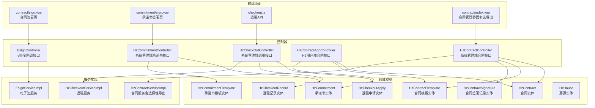
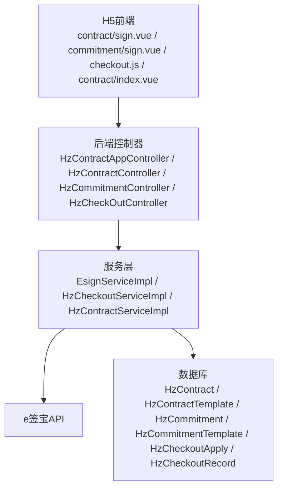
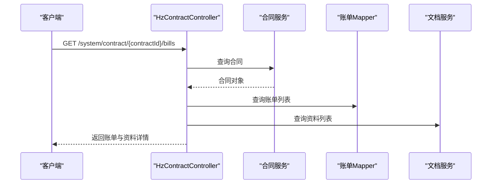
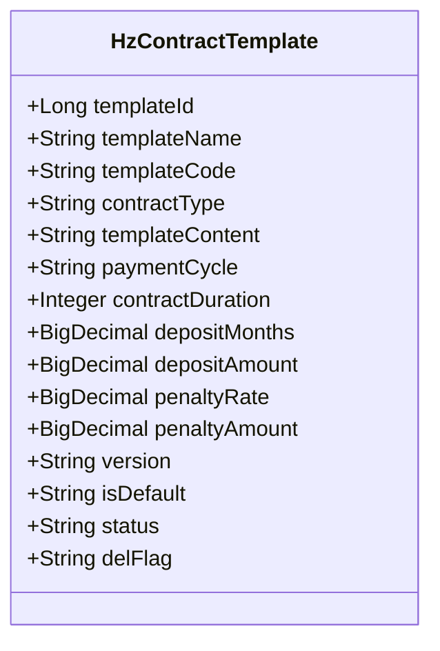
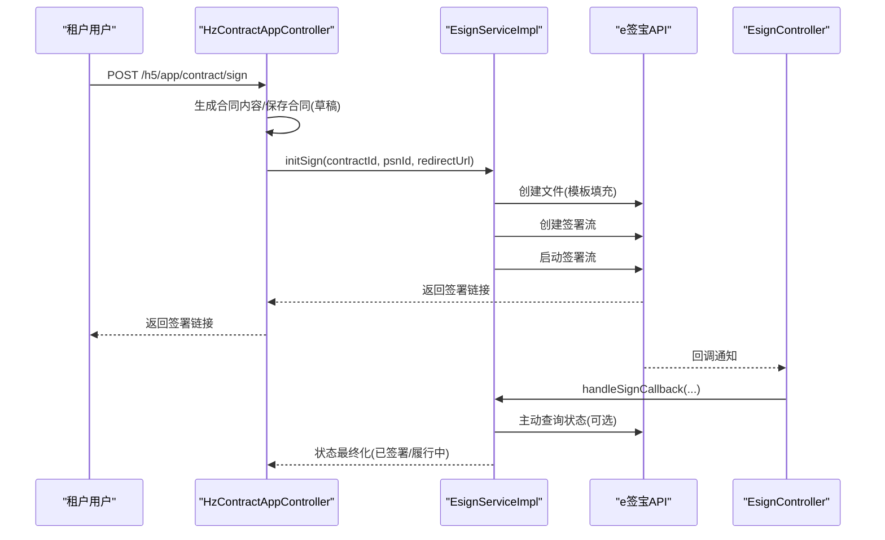
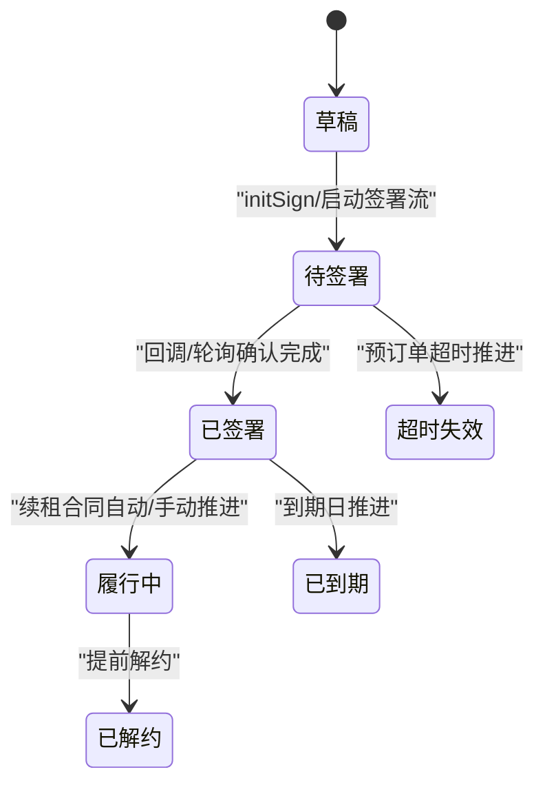
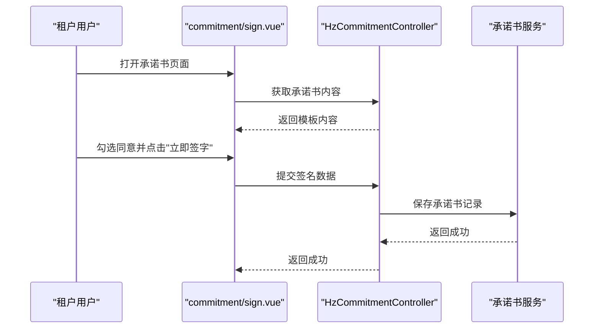
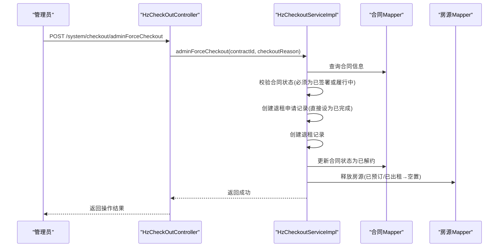
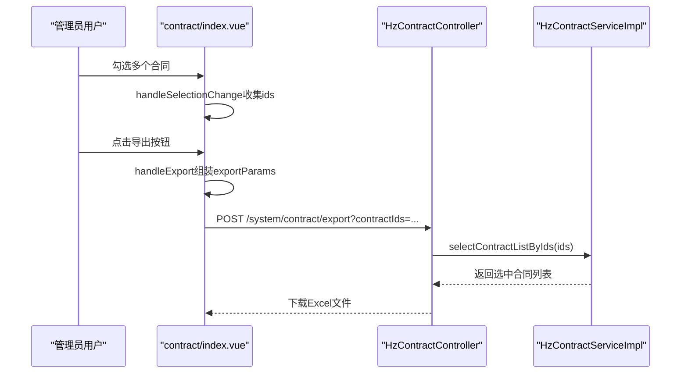
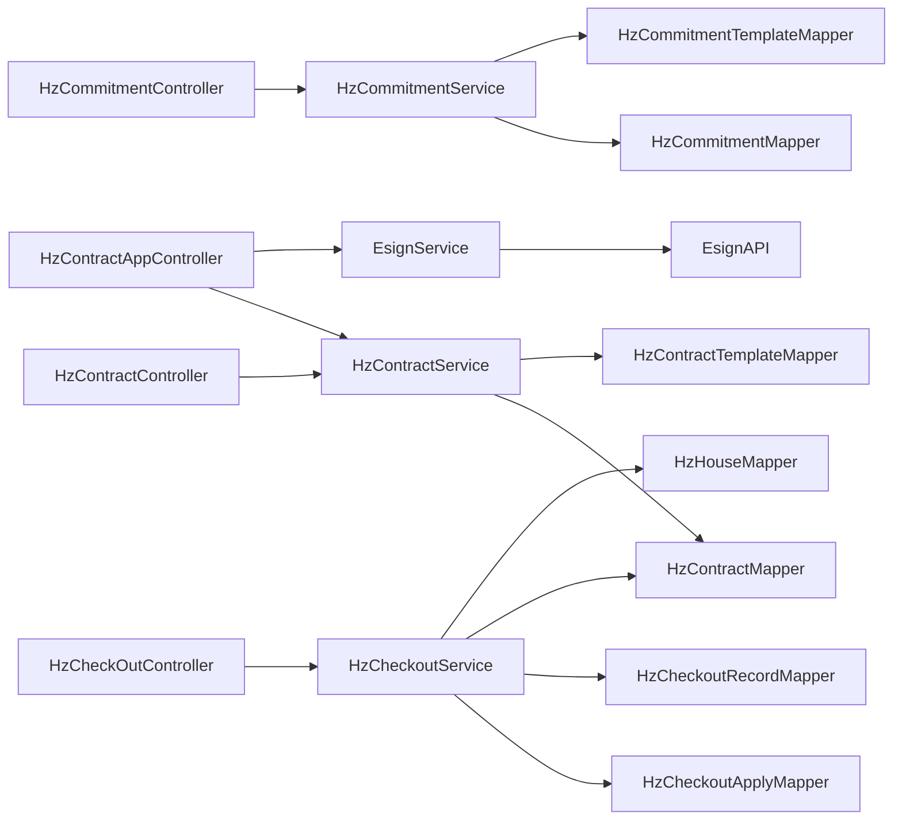

# 合同管理接口

<cite>
**本文档引用的文件**
- [HzContract.java](file://ruoyi-system/src/main/java/com/ruoyi/system/domain/HzContract.java)
- [HzContractTemplate.java](file://ruoyi-system/src/main/java/com/ruoyi/system/domain/HzContractTemplate.java)
- [HzContractSignature.java](file://ruoyi-system/src/main/java/com/ruoyi/system/domain/HzContractSignature.java)
- [HzCommitment.java](file://ruoyi-system/src/main/java/com/ruoyi/system/domain/HzCommitment.java)
- [HzCommitmentTemplate.java](file://ruoyi-system/src/main/java/com/ruoyi/system/domain/HzCommitmentTemplate.java)
- [HzContractController.java](file://ruoyi-admin/src/main/java/com/ruoyi/web/controller/system/HzContractController.java)
- [HzCommitmentController.java](file://ruoyi-admin/src/main/java/com/ruoyi/web/controller/system/HzCommitmentController.java)
- [HzContractAppController.java](file://ruoyi-admin/src/main/java/com/ruoyi/web/controller/h5/HzContractAppController.java)
- [HzCheckOutController.java](file://ruoyi-admin/src/main/java/com/ruoyi/web/controller/system/HzCheckOutController.java)
- [HzCheckoutApply.java](file://ruoyi-system/src/main/java/com/ruoyi/system/domain/HzCheckoutApply.java)
- [HzCheckoutRecord.java](file://ruoyi-system/src/main/java/com/ruoyi/system/domain/HzCheckoutRecord.java)
- [HzHouse.java](file://ruoyi-system/src/main/java/com/ruoyi/system/domain/HzHouse.java)
- [EsignServiceImpl.java](file://ruoyi-system/src/main/java/com/ruoyi/system/service/impl/EsignServiceImpl.java)
- [EsignController.java](file://ruoyi-admin/src/main/java/com/ruoyi/web/controller/h5/EsignController.java)
- [IHzCheckoutService.java](file://ruoyi-system/src/main/java/com/ruoyi/system/service/IHzCheckoutService.java)
- [HzCheckoutServiceImpl.java](file://ruoyi-system/src/main/java/com/ruoyi/system/service/impl/HzCheckoutServiceImpl.java)
- [checkout.js](file://ruoyi-ui/src/api/gangzhu/checkout.js)
- [sign.vue（合同）](file://uniapp-h5/pages/contract/sign.vue)
- [sign.vue（承诺书）](file://uniapp-h5/pages/commitment/sign.vue)
- [index.vue（合同管理界面）](file://ruoyi-ui/src/views/gangzhu/contract/index.vue)
- [HzContractServiceImpl.java](file://ruoyi-system/src/main/java/com/ruoyi/system/service/impl/HzContractServiceImpl.java)
- [数据迁移问题清单.txt](file://数据迁移问题清单.txt)
</cite>

## 更新摘要
**变更内容**
- 新增选择性导出功能：在原有全量导出基础上，新增了按合同ID选择导出的能力
- 支持两种导出模式：勾选导出（按选中的合同ID导出）和全量导出（按搜索条件导出）
- 前端界面新增多选框支持，用户可勾选多个合同进行批量导出
- 后端接口增强，支持接收contractIds参数进行精确导出

## 目录
1. [简介](#简介)
2. [项目结构](#项目结构)
3. [核心组件](#核心组件)
4. [架构总览](#架构总览)
5. [详细组件分析](#详细组件分析)
6. [依赖分析](#依赖分析)
7. [性能考虑](#性能考虑)
8. [故障排除指南](#故障排除指南)
9. [结论](#结论)
10. [附录](#附录)

## 简介
本文件面向港好住合同管理系统，系统性梳理电子合同管理与承诺书管理的接口设计与实现，覆盖合同模板管理、合同签署、合同查询、合同状态跟踪、承诺书模板与签署、承诺书查询、合同生命周期管理、统计分析与批量操作等能力。文档同时给出接口调用序列图、数据模型图与流程图，帮助开发者快速理解与集成。

**更新** 新增管理员强制退租接口，提供管理员直接退租功能，支持通过API调用实现合同终止和房源释放。**新增** 选择性导出功能，支持勾选导出和全量导出两种模式，提升导出效率和灵活性。

## 项目结构
合同管理相关代码主要分布在以下模块：
- 领域模型：合同、合同模板、合同签署记录、承诺书、承诺书模板、退租申请、退租记录
- 控制器：系统管理端合同接口、系统管理端承诺书接口、系统管理端退租接口、H5用户端合同接口
- 服务实现：电子签（e签宝）集成服务、退租服务、合同服务（含选择性导出）
- 前端页面：H5端合同签署页、承诺书签署页、退租相关API、合同管理界面（含多选导出）

**图表来源**
- [HzContract.java:1-606](file://ruoyi-system/src/main/java/com/ruoyi/system/domain/HzContract.java#L1-L606)
- [HzContractTemplate.java:1-228](file://ruoyi-system/src/main/java/com/ruoyi/system/domain/HzContractTemplate.java#L1-L228)
- [HzContractSignature.java:52-118](file://ruoyi-system/src/main/java/com/ruoyi/system/domain/HzContractSignature.java#L52-L118)
- [HzCommitment.java:52-173](file://ruoyi-system/src/main/java/com/ruoyi/system/domain/HzCommitment.java#L52-L173)
- [HzCommitmentTemplate.java:1-148](file://ruoyi-system/src/main/java/com/ruoyi/system/domain/HzCommitmentTemplate.java#L1-L148)
- [HzCheckoutApply.java:1-277](file://ruoyi-system/src/main/java/com/ruoyi/system/domain/HzCheckoutApply.java#L1-L277)
- [HzCheckoutRecord.java:1-364](file://ruoyi-system/src/main/java/com/ruoyi/system/domain/HzCheckoutRecord.java#L1-L364)
- [HzHouse.java:120-319](file://ruoyi-system/src/main/java/com/ruoyi/system/domain/HzHouse.java#L120-L319)
- [HzContractController.java:1-300](file://ruoyi-admin/src/main/java/com/ruoyi/web/controller/system/HzContractController.java#L1-L300)
- [HzCommitmentController.java:1-95](file://ruoyi-admin/src/main/java/com/ruoyi/web/controller/system/HzCommitmentController.java#L1-L95)
- [HzCheckOutController.java:180-194](file://ruoyi-admin/src/main/java/com/ruoyi/web/controller/system/HzCheckOutController.java#L180-L194)
- [HzContractAppController.java:1-800](file://ruoyi-admin/src/main/java/com/ruoyi/web/controller/h5/HzContractAppController.java#L1-L800)
- [EsignServiceImpl.java:1-200](file://ruoyi-system/src/main/java/com/ruoyi/system/service/impl/EsignServiceImpl.java#L1-L200)
- [EsignController.java:191-231](file://ruoyi-admin/src/main/java/com/ruoyi/web/controller/h5/EsignController.java#L191-L231)
- [IHzCheckoutService.java:195-216](file://ruoyi-system/src/main/java/com/ruoyi/system/service/IHzCheckoutService.java#L195-L216)
- [HzCheckoutServiceImpl.java:1100-1165](file://ruoyi-system/src/main/java/com/ruoyi/system/service/impl/HzCheckoutServiceImpl.java#L1100-L1165)
- [checkout.js:80-104](file://ruoyi-ui/src/api/gangzhu/checkout.js#L80-L104)
- [sign.vue（合同）:596-630](file://uniapp-h5/pages/contract/sign.vue#L596-L630)
- [sign.vue（承诺书）:1-156](file://uniapp-h5/pages/commitment/sign.vue#L1-L156)
- [index.vue（合同管理界面）:687-705](file://ruoyi-ui/src/views/gangzhu/contract/index.vue#L687-L705)

**章节来源**
- [HzContractController.java:1-300](file://ruoyi-admin/src/main/java/com/ruoyi/web/controller/system/HzContractController.java#L1-L300)
- [HzCommitmentController.java:1-95](file://ruoyi-admin/src/main/java/com/ruoyi/web/controller/system/HzCommitmentController.java#L1-L95)
- [HzCheckOutController.java:180-194](file://ruoyi-admin/src/main/java/com/ruoyi/web/controller/system/HzCheckOutController.java#L180-L194)
- [HzContractAppController.java:1-800](file://ruoyi-admin/src/main/java/com/ruoyi/web/controller/h5/HzContractAppController.java#L1-L800)
- [EsignServiceImpl.java:1-200](file://ruoyi-system/src/main/java/com/ruoyi/system/service/impl/EsignServiceImpl.java#L1-L200)

## 核心组件
- 合同实体：承载合同基本信息、状态、签署信息、模板关联等字段，支持分页查询与导出。
- 合同模板实体：定义合同模板的名称、编码、类型、支付周期、期限、押金、违约金、版本与状态。
- 合同签署记录实体：记录签署人、签名图像、设备信息、签署时间与状态。
- 承诺书实体：记录承诺书类型、内容、签署时间、签名图像与状态。
- 承诺书模板实体：定义承诺书模板的名称、编码、类型、HTML内容、版本与状态。
- 退租申请实体：记录退租申请的详细信息，包括合同ID、租户ID、房源ID、申请时间、计划退租日期、退租原因、申请状态等。
- 退租记录实体：记录退租完成后的详细信息，包括退租日期、退租时间、退款状态、损坏扣款、水电费等。
- 系统管理端控制器：提供合同与承诺书的CRUD、导出、详情扩展、e签宝模板查询、账单与资料查询、PDF链接获取等接口，以及管理员强制退租接口。
- H5用户端控制器：提供合同列表、详情、合同生成、签署、续租、人才公寓租金预估等接口。
- 电子签服务：封装e签宝API，负责模板填充、签署流创建、签署链接获取、回调处理、状态轮询与最终化、PDF链接获取等。
- 退租服务：提供退租申请处理、退租计算、管理员强制退租等服务。
- **更新** 合同服务：增强导出功能，支持按合同ID选择导出和全量导出两种模式。

**章节来源**
- [HzContract.java:1-606](file://ruoyi-system/src/main/java/com/ruoyi/system/domain/HzContract.java#L1-L606)
- [HzContractTemplate.java:1-228](file://ruoyi-system/src/main/java/com/ruoyi/system/domain/HzContractTemplate.java#L1-L228)
- [HzContractSignature.java:52-118](file://ruoyi-system/src/main/java/com/ruoyi/system/domain/HzContractSignature.java#L52-L118)
- [HzCommitment.java:52-173](file://ruoyi-system/src/main/java/com/ruoyi/system/domain/HzCommitment.java#L52-L173)
- [HzCommitmentTemplate.java:1-148](file://ruoyi-system/src/main/java/com/ruoyi/system/domain/HzCommitmentTemplate.java#L1-L148)
- [HzCheckoutApply.java:1-277](file://ruoyi-system/src/main/java/com/ruoyi/system/domain/HzCheckoutApply.java#L1-L277)
- [HzCheckoutRecord.java:1-364](file://ruoyi-system/src/main/java/com/ruoyi/system/domain/HzCheckoutRecord.java#L1-L364)
- [HzContractController.java:1-300](file://ruoyi-admin/src/main/java/com/ruoyi/web/controller/system/HzContractController.java#L1-L300)
- [HzContractAppController.java:1-800](file://ruoyi-admin/src/main/java/com/ruoyi/web/controller/h5/HzContractAppController.java#L1-L800)
- [EsignServiceImpl.java:1-200](file://ruoyi-system/src/main/java/com/ruoyi/system/service/impl/EsignServiceImpl.java#L1-L200)
- [IHzCheckoutService.java:195-216](file://ruoyi-system/src/main/java/com/ruoyi/system/service/IHzCheckoutService.java#L195-L216)
- [HzCheckoutServiceImpl.java:1100-1165](file://ruoyi-system/src/main/java/com/ruoyi/system/service/impl/HzCheckoutServiceImpl.java#L1100-L1165)

## 架构总览
系统采用前后端分离架构，H5前端通过REST接口与后端交互，后端控制器调用服务层，服务层对接e签宝SDK完成电子合同签署与状态管理。合同与承诺书数据通过MyBatis Plus持久化。

**图表来源**
- [HzContractAppController.java:1-800](file://ruoyi-admin/src/main/java/com/ruoyi/web/controller/h5/HzContractAppController.java#L1-L800)
- [HzContractController.java:1-300](file://ruoyi-admin/src/main/java/com/ruoyi/web/controller/system/HzContractController.java#L1-L300)
- [HzCommitmentController.java:1-95](file://ruoyi-admin/src/main/java/com/ruoyi/web/controller/system/HzCommitmentController.java#L1-L95)
- [HzCheckOutController.java:180-194](file://ruoyi-admin/src/main/java/com/ruoyi/web/controller/system/HzCheckOutController.java#L180-L194)
- [EsignServiceImpl.java:1-200](file://ruoyi-system/src/main/java/com/ruoyi/system/service/impl/EsignServiceImpl.java#L1-L200)
- [IHzCheckoutService.java:195-216](file://ruoyi-system/src/main/java/com/ruoyi/system/service/IHzCheckoutService.java#L195-L216)

## 详细组件分析

### 合同管理接口
- 列表查询与导出：支持分页查询合同列表、导出Excel。
- 详情查询：获取合同详情，扩展查询账单与资料列表。
- 新增/修改/删除：支持合同的CRUD操作。
- 审核：仅允许对草稿状态合同进行审核，更新为已签署并可保存合同附件。
- e签宝模板查询：调试用途，核对模板控件定义。
- PDF链接获取：实时刷新e签宝电子PDF链接，兼容旧数据直接存放URL的情况。

**图表来源**
- [HzContractController.java:195-234](file://ruoyi-admin/src/main/java/com/ruoyi/web/controller/system/HzContractController.java#L195-L234)

**章节来源**
- [HzContractController.java:55-298](file://ruoyi-admin/src/main/java/com/ruoyi/web/controller/system/HzContractController.java#L55-L298)

### 合同模板管理接口
- 模板实体包含模板名称、编码、类型、内容、支付周期、期限、押金、违约金、版本、默认状态与状态字段。
- 系统管理端提供模板的CRUD与导出能力，配合合同生成时选择模板。

**图表来源**
- [HzContractTemplate.java:1-228](file://ruoyi-system/src/main/java/com/ruoyi/system/domain/HzContractTemplate.java#L1-L228)

**章节来源**
- [HzContractTemplate.java:1-228](file://ruoyi-system/src/main/java/com/ruoyi/system/domain/HzContractTemplate.java#L1-L228)

### 合同签署流程接口
- H5用户端合同生成：根据房源、项目、租户信息生成合同内容，替换模板变量。
- 合同保存：保存合同对象，设置草稿状态，支持带预订单号的快速落单。
- e签宝集成：模板填充、创建签署流、启动签署流、获取签署链接、回调处理、状态轮询与最终化、PDF链接刷新。
- 前端手动刷新：轮询查询签署状态，完成后跳转到账单页面。

**图表来源**
- [HzContractAppController.java:511-738](file://ruoyi-admin/src/main/java/com/ruoyi/web/controller/h5/HzContractAppController.java#L511-L738)
- [EsignServiceImpl.java:224-288](file://ruoyi-system/src/main/java/com/ruoyi/system/service/impl/EsignServiceImpl.java#L224-L288)
- [EsignController.java:191-231](file://ruoyi-admin/src/main/java/com/ruoyi/web/controller/h5/EsignController.java#L191-L231)

**章节来源**
- [HzContractAppController.java:357-738](file://ruoyi-admin/src/main/java/com/ruoyi/web/controller/h5/HzContractAppController.java#L357-L738)
- [EsignServiceImpl.java:224-758](file://ruoyi-system/src/main/java/com/ruoyi/system/service/impl/EsignServiceImpl.java#L224-L758)
- [EsignController.java:191-231](file://ruoyi-admin/src/main/java/com/ruoyi/web/controller/h5/EsignController.java#L191-L231)

### 合同状态跟踪与生命周期
- 合同状态枚举：草稿、待签署、已签署、履行中、已到期、已解约、超时失效。
- 生命周期关键节点：草稿→待签署→已签署→履行中；待签署超时推进为超时失效；已签署自动推进为履行中（续租合同）。
- 状态推进规则：仅允许从"待签署"或"已签署"推进，避免回退；超时订单推进到合同状态为"超时失效"。

**图表来源**
- [HzContract.java:139-142](file://ruoyi-system/src/main/java/com/ruoyi/system/domain/HzContract.java#L139-L142)
- [EsignServiceImpl.java:718-758](file://ruoyi-system/src/main/java/com/ruoyi/system/service/impl/EsignServiceImpl.java#L718-L758)
- [HzHouseOrderServiceImpl.java:290-309](file://ruoyi-system/src/main/java/com/ruoyi/system/service/impl/HzHouseOrderServiceImpl.java#L290-L309)

**章节来源**
- [HzContract.java:139-142](file://ruoyi-system/src/main/java/com/ruoyi/system/domain/HzContract.java#L139-L142)
- [EsignServiceImpl.java:718-758](file://ruoyi-system/src/main/java/com/ruoyi/system/service/impl/EsignServiceImpl.java#L718-L758)
- [HzHouseOrderServiceImpl.java:290-309](file://ruoyi-system/src/main/java/com/ruoyi/system/service/impl/HzHouseOrderServiceImpl.java#L290-L309)

### 承诺书管理接口
- 承诺书模板：定义承诺书类型、HTML内容、版本与状态。
- 承诺书记录：记录承诺书类型、内容、签署时间、签名图像与状态。
- H5承诺书签署流程：加载模板内容、用户勾选同意、跳转签名页、提交签名数据并自动提交承诺书。

**图表来源**
- [sign.vue（承诺书）:1-156](file://uniapp-h5/pages/commitment/sign.vue#L1-L156)
- [HzCommitmentController.java:35-93](file://ruoyi-admin/src/main/java/com/ruoyi/web/controller/system/HzCommitmentController.java#L35-L93)

**章节来源**
- [HzCommitment.java:52-173](file://ruoyi-system/src/main/java/com/ruoyi/system/domain/HzCommitment.java#L52-L173)
- [HzCommitmentTemplate.java:1-148](file://ruoyi-system/src/main/java/com/ruoyi/system/domain/HzCommitmentTemplate.java#L1-L148)
- [sign.vue（承诺书）:1-156](file://uniapp-h5/pages/commitment/sign.vue#L1-L156)
- [HzCommitmentController.java:35-93](file://ruoyi-admin/src/main/java/com/ruoyi/web/controller/system/HzCommitmentController.java#L35-L93)

### 管理员强制退租接口
- 接口功能：管理员直接退租，无需用户确认，一步完成合同终止+房源释放。
- 接口路径：POST /system/checkout/adminForceCheckout
- 参数说明：contractId（合同ID）、checkoutReason（退租原因，可选）
- 权限要求：gangzhu:checkout:forceCheckout
- 业务流程：校验合同状态→创建退租申请记录→创建退租记录→更新合同状态为已解约→释放房源状态为空置。

**图表来源**
- [HzCheckOutController.java:180-194](file://ruoyi-admin/src/main/java/com/ruoyi/web/controller/system/HzCheckOutController.java#L180-L194)
- [HzCheckoutServiceImpl.java:1100-1165](file://ruoyi-system/src/main/java/com/ruoyi/system/service/impl/HzCheckoutServiceImpl.java#L1100-L1165)
- [IHzCheckoutService.java:207-215](file://ruoyi-system/src/main/java/com/ruoyi/system/service/IHzCheckoutService.java#L207-L215)

**章节来源**
- [HzCheckOutController.java:180-194](file://ruoyi-admin/src/main/java/com/ruoyi/web/controller/system/HzCheckOutController.java#L180-L194)
- [HzCheckoutServiceImpl.java:1100-1165](file://ruoyi-system/src/main/java/com/ruoyi/system/service/impl/HzCheckoutServiceImpl.java#L1100-L1165)
- [IHzCheckoutService.java:207-215](file://ruoyi-system/src/main/java/com/ruoyi/system/service/IHzCheckoutService.java#L207-L215)
- [checkout.js:80-104](file://ruoyi-ui/src/api/gangzhu/checkout.js#L80-L104)

### 合同导出功能（新增）
- **更新** 选择性导出：支持按合同ID选择导出，用户可在合同管理界面勾选多个合同进行批量导出。
- 全量导出：按搜索条件查询并导出所有匹配的合同。
- 勾选导出：仅导出用户勾选的合同ID列表。
- 前端界面：合同管理界面新增多选框，支持全选、反选和勾选导出。
- 后端接口：增强导出方法，支持接收contractIds参数。

**图表来源**
- [index.vue（合同管理界面）:687-705](file://ruoyi-ui/src/views/gangzhu/contract/index.vue#L687-L705)
- [HzContractController.java:87-101](file://ruoyi-admin/src/main/java/com/ruoyi/web/controller/system/HzContractController.java#L87-L101)
- [HzContractServiceImpl.java:219-252](file://ruoyi-system/src/main/java/com/ruoyi/system/service/impl/HzContractServiceImpl.java#L219-L252)

**章节来源**
- [HzContractController.java:87-101](file://ruoyi-admin/src/main/java/com/ruoyi/web/controller/system/HzContractController.java#L87-L101)
- [HzContractServiceImpl.java:219-252](file://ruoyi-system/src/main/java/com/ruoyi/system/service/impl/HzContractServiceImpl.java#L219-L252)
- [index.vue（合同管理界面）:687-705](file://ruoyi-ui/src/views/gangzhu/contract/index.vue#L687-L705)

### 合同统计分析与批量操作
- 管理端合同列表：支持分页、筛选与导出，便于统计分析。
- 承诺书记录列表：支持分页、筛选与导出，便于审计与统计。
- 批量操作：管理端支持批量删除承诺书记录，便于批量清理或维护。
- **更新** 批量导出：支持勾选多个合同进行批量导出，提升导出效率。

**章节来源**
- [HzContractController.java:55-93](file://ruoyi-admin/src/main/java/com/ruoyi/web/controller/system/HzContractController.java#L55-L93)
- [HzCommitmentController.java:35-93](file://ruoyi-admin/src/main/java/com/ruoyi/web/controller/system/HzCommitmentController.java#L35-L93)

## 依赖分析
- 控制器依赖服务层，服务层依赖Mapper与第三方SDK（e签宝）。
- 前端页面通过API与控制器交互，H5页面与管理端控制器分别承担不同业务场景。
- 数据模型之间通过外键关联（如合同与模板、承诺书与模板、退租申请与合同），查询时通过Mapper进行联表或聚合。

**图表来源**
- [HzContractController.java:1-300](file://ruoyi-admin/src/main/java/com/ruoyi/web/controller/system/HzContractController.java#L1-L300)
- [HzCommitmentController.java:1-95](file://ruoyi-admin/src/main/java/com/ruoyi/web/controller/system/HzCommitmentController.java#L1-L95)
- [HzCheckOutController.java:180-194](file://ruoyi-admin/src/main/java/com/ruoyi/web/controller/system/HzCheckOutController.java#L180-L194)
- [HzContractAppController.java:1-800](file://ruoyi-admin/src/main/java/com/ruoyi/web/controller/h5/HzContractAppController.java#L1-L800)
- [EsignServiceImpl.java:1-200](file://ruoyi-system/src/main/java/com/ruoyi/system/service/impl/EsignServiceImpl.java#L1-L200)
- [IHzCheckoutService.java:195-216](file://ruoyi-system/src/main/java/com/ruoyi/system/service/IHzCheckoutService.java#L195-L216)

**章节来源**
- [HzContractController.java:1-300](file://ruoyi-admin/src/main/java/com/ruoyi/web/controller/system/HzContractController.java#L1-L300)
- [HzCommitmentController.java:1-95](file://ruoyi-admin/src/main/java/com/ruoyi/web/controller/system/HzCommitmentController.java#L1-L95)
- [HzCheckOutController.java:180-194](file://ruoyi-admin/src/main/java/com/ruoyi/web/controller/system/HzCheckOutController.java#L180-L194)
- [HzContractAppController.java:1-800](file://ruoyi-admin/src/main/java/com/ruoyi/web/controller/h5/HzContractAppController.java#L1-L800)
- [EsignServiceImpl.java:1-200](file://ruoyi-system/src/main/java/com/ruoyi/system/service/impl/EsignServiceImpl.java#L1-L200)
- [IHzCheckoutService.java:195-216](file://ruoyi-system/src/main/java/com/ruoyi/system/service/IHzCheckoutService.java#L195-L216)

## 性能考虑
- 模板填充与文件生成：模板填充与文件生成过程包含轮询等待文件就绪，注意控制轮询次数与间隔，避免阻塞线程。
- 签署状态轮询：前端轮询查询签署状态时，建议设置合理的轮询间隔与最大次数，避免频繁请求。
- 大数据量导出：导出Excel时注意分批处理与内存占用，避免OOM。
- 状态推进与并发：状态推进逻辑需保证幂等与一致性，避免并发导致的状态错乱。
- 强制退租操作：管理员强制退租涉及多个数据库操作，建议在事务中执行，确保数据一致性。
- **更新** 选择性导出优化：勾选导出时，contractIds参数会限制查询范围，减少数据库压力；全量导出时应合理设置查询条件，避免返回过多数据。

## 故障排除指南
- e签宝回调处理失败：检查回调参数签名与请求体，确保回调URL正确配置。
- 签署状态查询失败：检查合同是否存在、签署流ID是否为空、e签宝API响应码。
- 模板填充失败：检查模板控件ID与传参是否一致，查看详细日志定位具体控件。
- 数据迁移问题：关注历史合同状态修正过度的问题，必要时增加原始状态字段或历史快照表。
- 强制退租失败：检查合同状态是否为已签署或履行中，确认合同ID是否存在，查看事务执行日志。
- **更新** 导出功能故障：检查contractIds参数格式是否正确（Long[]数组），确认勾选的合同ID是否存在且状态正常；全量导出时检查查询条件是否过于宽泛导致数据量过大。

**章节来源**
- [EsignController.java:191-231](file://ruoyi-admin/src/main/java/com/ruoyi/web/controller/h5/EsignController.java#L191-L231)
- [EsignServiceImpl.java:180-221](file://ruoyi-system/src/main/java/com/ruoyi/system/service/impl/EsignServiceImpl.java#L180-L221)
- [数据迁移问题清单.txt:83-108](file://数据迁移问题清单.txt#L83-L108)
- [HzCheckoutServiceImpl.java:1100-1165](file://ruoyi-system/src/main/java/com/ruoyi/system/service/impl/HzCheckoutServiceImpl.java#L1100-L1165)

## 结论
本系统通过清晰的接口分层与完善的电子签服务集成，实现了从合同模板管理、合同签署、状态跟踪到承诺书管理的全链路能力。新增的管理员强制退租接口进一步完善了合同生命周期管理，支持管理员直接终止合同并释放房源，提高了运营效率。**新增** 的选择性导出功能显著提升了导出效率，支持用户通过勾选多个合同进行批量导出，同时保持原有的全量导出能力，满足不同场景下的导出需求。结合管理端与H5端的差异化接口设计，既满足了运营侧的统计与审计需求，也提升了租户侧的签署体验。建议在生产环境中加强状态推进的幂等性与并发控制，并完善异常监控与日志追踪。

## 附录
- 合同状态枚举：草稿、待签署、已签署、履行中、已到期、已解约、超时失效。
- 承诺书状态枚举：有效、失效。
- 退租申请状态枚举：审批中、审批通过、审批驳回、已取消、待确认。
- 退租记录退款状态枚举：待退还、已退还。
- **更新** 导出模式：全量导出（按查询条件）和勾选导出（按合同ID列表）。
- 关键接口路径示例：
  - 管理端合同列表：GET /system/contract/list
  - 管理端合同详情扩展（账单与资料）：GET /system/contract/{contractId}/bills
  - **更新** 管理端合同导出：POST /system/contract/export（支持contractIds参数）
  - H5合同生成：POST /h5/app/contract/generate
  - H5合同签署：POST /h5/app/contract/sign
  - H5手动查询签署状态：GET /h5/app/contract/check-sign/{contractId}
  - 管理员强制退租：POST /system/checkout/adminForceCheckout
  - 退租费用精算：GET /system/checkout/calculateRentRefund