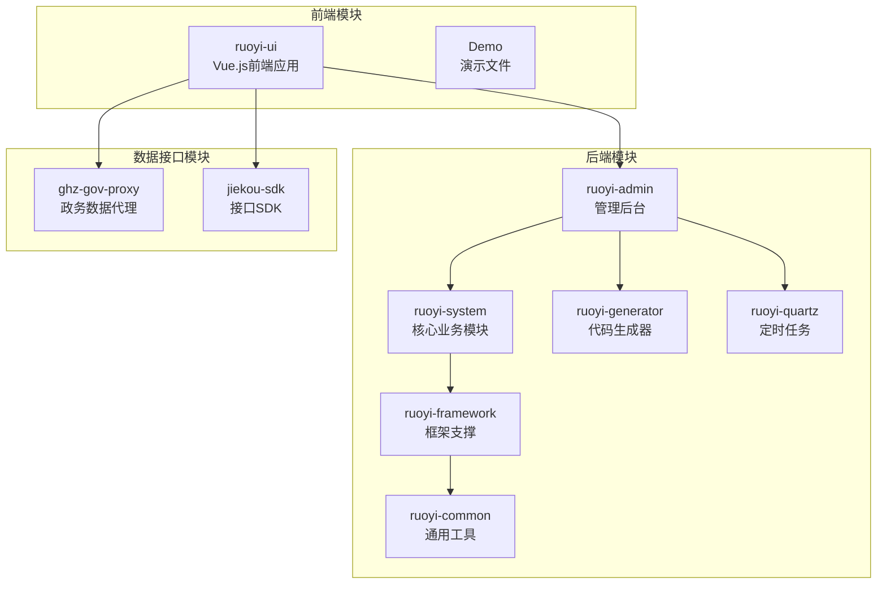
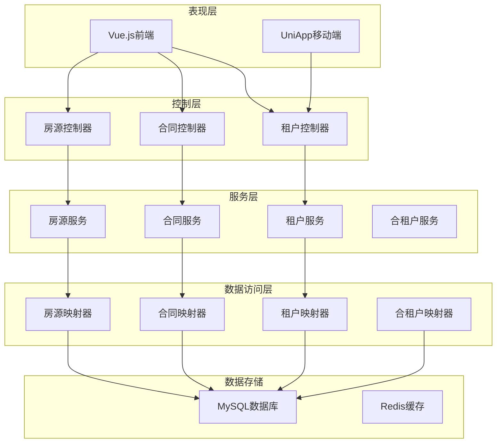
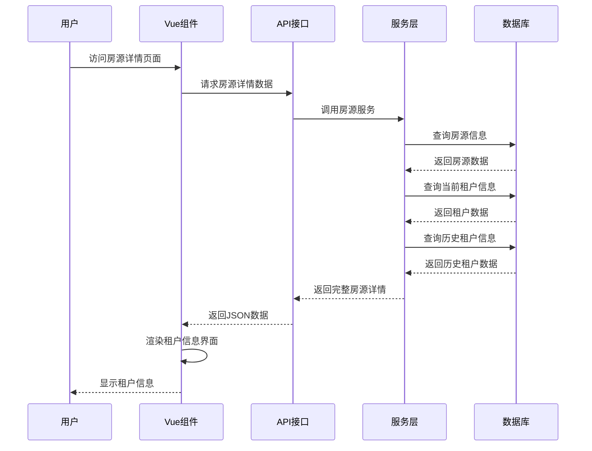
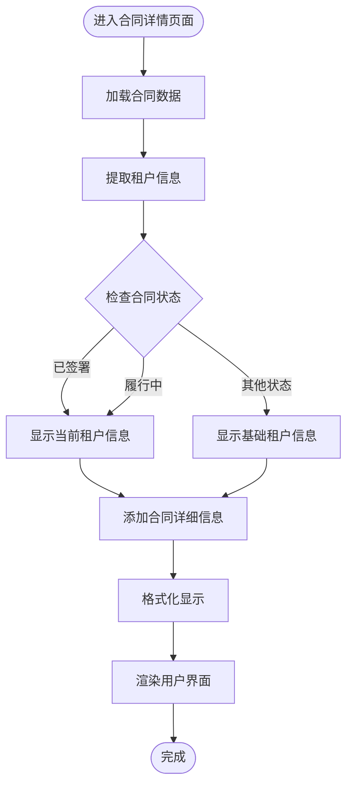
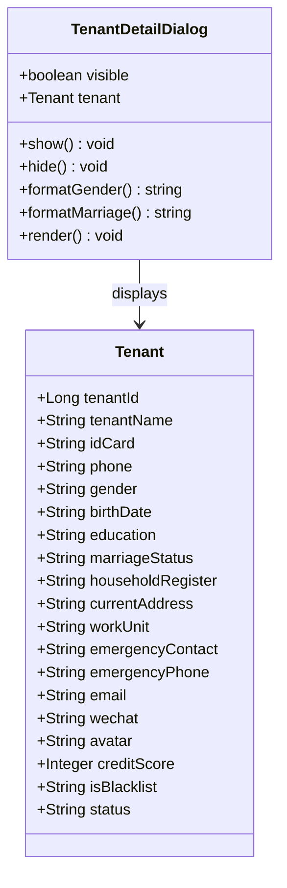
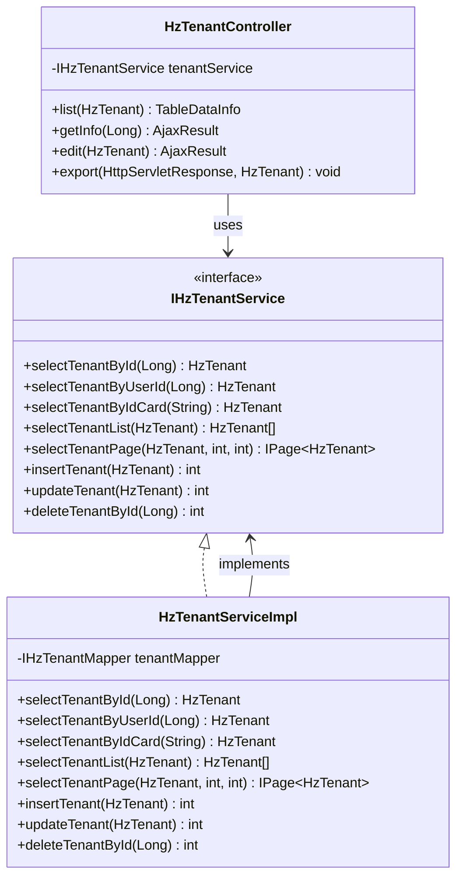
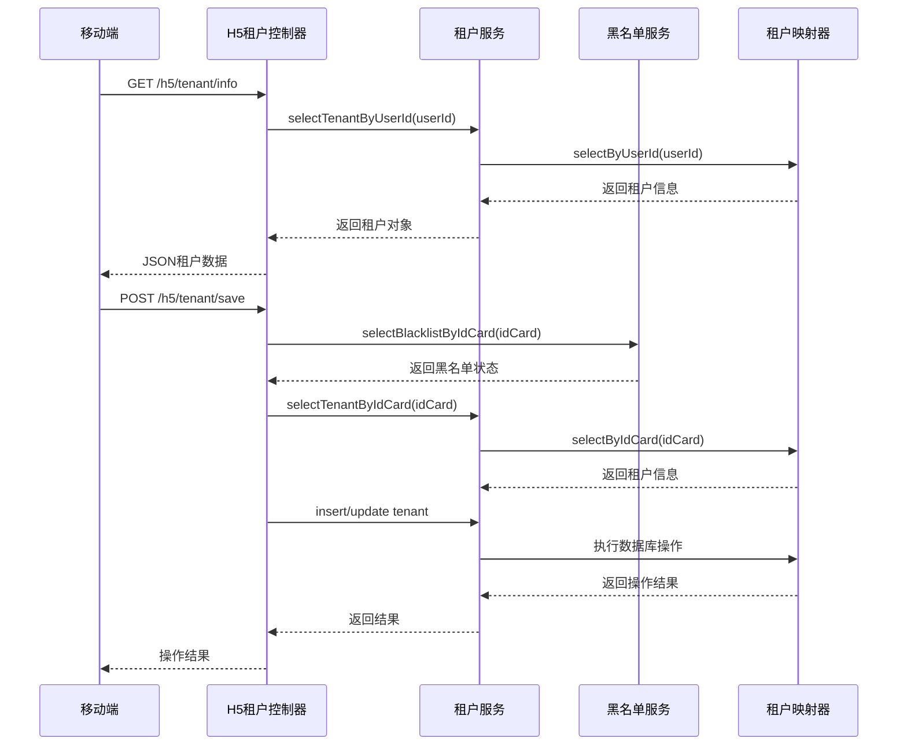
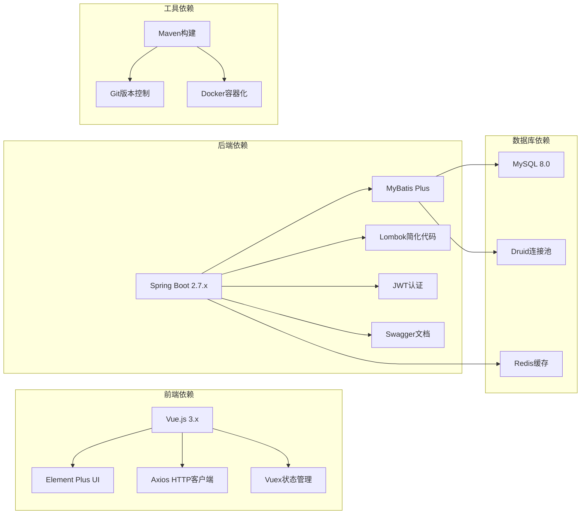

# 房屋租户信息显示增强

<cite>
**本文档引用的文件**
- [ruoyi-ui/src/views/gangzhu/house/index.vue](file://ruoyi-ui/src/views/gangzhu/house/index.vue)
- [ruoyi-ui/src/views/gangzhu/contract/index.vue](file://ruoyi-ui/src/views/gangzhu/contract/index.vue)
- [ruoyi-ui/src/views/gangzhu/tenant/index.vue](file://ruoyi-ui/src/views/gangzhu/tenant/index.vue)
- [ruoyi-ui/src/api/gangzhu/tenant.js](file://ruoyi-ui/src/api/gangzhu/tenant.js)
- [ruoyi-admin/src/main/java/com/ruoyi/web/controller/system/HzTenantController.java](file://ruoyi-admin/src/main/java/com/ruoyi/web/controller/system/HzTenantController.java)
- [ruoyi-admin/src/main/java/com/ruoyi/web/controller/h5/HzTenantController.java](file://ruoyi-admin/src/main/java/com/ruoyi/web/controller/h5/HzTenantController.java)
- [ruoyi-system/src/main/java/com/ruoyi/system/domain/HzTenant.java](file://ruoyi-system/src/main/java/com/ruoyi/system/domain/HzTenant.java)
- [ruoyi-system/src/main/java/com/ruoyi/system/domain/HzContract.java](file://ruoyi-system/src/main/java/com/ruoyi/system/domain/HzContract.java)
- [ruoyi-system/src/main/java/com/ruoyi/system/domain/HzCoTenant.java](file://ruoyi-system/src/main/java/com/ruoyi/system/domain/HzCoTenant.java)
- [ruoyi-system/src/main/java/com/ruoyi/system/service/IHzTenantService.java](file://ruoyi-system/src/main/java/com/ruoyi/system/service/IHzTenantService.java)
- [ruoyi-system/src/main/java/com/ruoyi/system/service/impl/HzTenantServiceImpl.java](file://ruoyi-system/src/main/java/com/ruoyi/system/service/impl/HzTenantServiceImpl.java)
- [docs/数据字典/02-租户管理.md](file://docs/数据字典/02-租户管理.md)
- [docs/数据字典/03-合同管理.md](file://docs/数据字典/03-合同管理.md)
</cite>

## 目录
1. [项目概述](#项目概述)
2. [项目结构](#项目结构)
3. [核心组件](#核心组件)
4. [架构概览](#架构概览)
5. [详细组件分析](#详细组件分析)
6. [依赖关系分析](#依赖关系分析)
7. [性能考虑](#性能考虑)
8. [故障排除指南](#故障排除指南)
9. [结论](#结论)

## 项目概述

房屋租户信息显示增强项目是一个基于Vue.js和Spring Boot的企业级房屋租赁管理系统。该项目专注于提升房屋租户信息的展示能力和用户体验，通过增强前端界面显示、优化数据结构设计和改进业务逻辑处理，为用户提供更加直观、完整的租户信息查看体验。

系统采用前后端分离架构，后端使用Java Spring Boot框架，前端使用Vue.js技术栈，数据库采用MySQL，支持多租户管理和合同生命周期管理。

## 项目结构

项目采用标准的Maven多模块结构，主要包含以下核心模块：

**图表来源**
- [pom.xml](file://pom.xml)
- [ruoyi-ui/package.json](file://ruoyi-ui/package.json)

**章节来源**
- [pom.xml](file://pom.xml)
- [ruoyi-ui/package.json](file://ruoyi-ui/package.json)

## 核心组件

### 租户信息管理模块

租户信息管理模块是整个系统的核心功能之一，负责管理房屋租赁过程中的所有租户相关信息。该模块包含完整的CRUD操作、数据验证、权限控制等功能。

#### 主要功能特性

- **租户信息展示**：提供详细的租户个人信息展示界面
- **合同关联显示**：自动关联并显示租户的所有合同信息
- **历史记录追踪**：记录租户的历史变更和合同状态变化
- **数据完整性验证**：确保租户信息的准确性和完整性

#### 数据模型设计

```mermaid
erDiagram
HZ_TENANT {
bigint tenant_id PK
bigint user_id
varchar tenant_name
varchar id_card
varchar phone
char gender
date birth_date
varchar education
varchar marriage_status
varchar household_register
varchar current_address
varchar work_unit
varchar emergency_contact
varchar emergency_phone
varchar email
varchar wechat
varchar avatar
int credit_score
char is_blacklist
char status
char del_flag
varchar esign_psn_id
}
HZ_CONTRACT {
bigint contract_id PK
varchar contract_no
char contract_type
bigint template_id
bigint tenant_id FK
varchar tenant_name
varchar tenant_id_card
varchar tenant_phone
bigint project_id
bigint house_id
varchar house_code
varchar house_address
decimal rent_price
decimal deposit
date start_date
date end_date
int rent_months
char payment_cycle
int payment_day
varchar contract_content
varchar contract_file
varchar tenant_signature
varchar landlord_signature
datetime sign_time
char contract_status
char is_renewed
bigint renewed_contract_id
char del_flag
varchar esign_flow_id
}
HZ_CO_TENANT {
bigint co_tenant_id PK
bigint contract_id FK
varchar tenant_name
varchar id_card
varchar phone
varchar relationship
char status
char del_flag
}
HZ_TENANT ||--o{ HZ_CONTRACT : "has"
HZ_CONTRACT ||--o{ HZ_CO_TENANT : "includes"
```

**图表来源**
- [docs/数据字典/02-租户管理.md](file://docs/数据字典/02-租户管理.md)
- [docs/数据字典/03-合同管理.md](file://docs/数据字典/03-合同管理.md)

**章节来源**
- [docs/数据字典/02-租户管理.md](file://docs/数据字典/02-租户管理.md)
- [docs/数据字典/03-合同管理.md](file://docs/数据字典/03-合同管理.md)

## 架构概览

系统采用分层架构设计，确保各层职责清晰、耦合度低、可维护性强。

**图表来源**
- [ruoyi-ui/src/views/gangzhu/house/index.vue](file://ruoyi-ui/src/views/gangzhu/house/index.vue)
- [ruoyi-system/src/main/java/com/ruoyi/system/service/IHzTenantService.java](file://ruoyi-system/src/main/java/com/ruoyi/system/service/IHzTenantService.java)

## 详细组件分析

### 前端租户信息展示组件

前端采用Vue.js框架构建，提供了丰富的用户交互界面和数据展示功能。

#### 房源详情页面的租户信息展示

**图表来源**
- [ruoyi-ui/src/views/gangzhu/house/index.vue](file://ruoyi-ui/src/views/gangzhu/house/index.vue)
- [ruoyi-ui/src/api/gangzhu/tenant.js](file://ruoyi-ui/src/api/gangzhu/tenant.js)

#### 合同详情页面的租户信息展示

合同详情页面提供了更加详细的租户信息展示，包括合同状态、租期等关键信息。

**图表来源**
- [ruoyi-ui/src/views/gangzhu/contract/index.vue](file://ruoyi-ui/src/views/gangzhu/contract/index.vue)

#### 租户详情对话框

**图表来源**
- [ruoyi-ui/src/views/gangzhu/tenant/index.vue](file://ruoyi-ui/src/views/gangzhu/tenant/index.vue)

**章节来源**
- [ruoyi-ui/src/views/gangzhu/house/index.vue](file://ruoyi-ui/src/views/gangzhu/house/index.vue)
- [ruoyi-ui/src/views/gangzhu/contract/index.vue](file://ruoyi-ui/src/views/gangzhu/contract/index.vue)
- [ruoyi-ui/src/views/gangzhu/tenant/index.vue](file://ruoyi-ui/src/views/gangzhu/tenant/index.vue)

### 后端服务层组件

后端采用Spring Boot框架，提供了完整的租户信息管理服务。

#### 租户服务接口设计

**图表来源**
- [ruoyi-system/src/main/java/com/ruoyi/system/service/IHzTenantService.java](file://ruoyi-system/src/main/java/com/ruoyi/system/service/IHzTenantService.java)
- [ruoyi-system/src/main/java/com/ruoyi/system/service/impl/HzTenantServiceImpl.java](file://ruoyi-system/src/main/java/com/ruoyi/system/service/impl/HzTenantServiceImpl.java)
- [ruoyi-admin/src/main/java/com/ruoyi/web/controller/system/HzTenantController.java](file://ruoyi-admin/src/main/java/com/ruoyi/web/controller/system/HzTenantController.java)

#### H5端租户管理服务

**图表来源**
- [ruoyi-admin/src/main/java/com/ruoyi/web/controller/h5/HzTenantController.java](file://ruoyi-admin/src/main/java/com/ruoyi/web/controller/h5/HzTenantController.java)

**章节来源**
- [ruoyi-system/src/main/java/com/ruoyi/system/service/IHzTenantService.java](file://ruoyi-system/src/main/java/com/ruoyi/system/service/IHzTenantService.java)
- [ruoyi-system/src/main/java/com/ruoyi/system/service/impl/HzTenantServiceImpl.java](file://ruoyi-system/src/main/java/com/ruoyi/system/service/impl/HzTenantServiceImpl.java)
- [ruoyi-admin/src/main/java/com/ruoyi/web/controller/system/HzTenantController.java](file://ruoyi-admin/src/main/java/com/ruoyi/web/controller/system/HzTenantController.java)
- [ruoyi-admin/src/main/java/com/ruoyi/web/controller/h5/HzTenantController.java](file://ruoyi-admin/src/main/java/com/ruoyi/web/controller/h5/HzTenantController.java)

### 数据模型组件

系统采用MyBatis Plus框架进行数据持久化，提供了完整的数据模型定义和映射关系。

#### 租户实体类设计

```mermaid
classDiagram
class HzTenant {
+Long tenantId
+Long userId
+String tenantName
+String idCard
+String phone
+String gender
+String birthDate
+String education
+String marriageStatus
+String householdRegister
+String currentAddress
+String workUnit
+String emergencyContact
+String emergencyPhone
+String email
+String wechat
+String avatar
+Integer creditScore
+String isBlacklist
+String status
+String delFlag
+String esignPsnId
+setTenantId(Long) void
+getTenantId() Long
+setUserId(Long) void
+getUserId() Long
+setIdCard(String) void
+getIdCard() String
+setPhone(String) void
+getPhone() String
+setGender(String) void
+getGender() String
+setBirthDate(String) void
+getBirthDate() String
+setEducation(String) void
+getEducation() String
+setMarriageStatus(String) void
+getMarriageStatus() String
+setHouseholdRegister(String) void
+getHouseholdRegister() String
+setCurrentAddress(String) void
+getCurrentAddress() String
+setWorkUnit(String) void
+getWorkUnit() String
+setEmergencyContact(String) void
+getEmergencyContact() String
+setEmergencyPhone(String) void
+getEmergencyPhone() String
+setEmail(String) void
+getEmail() String
+setWechat(String) void
+getWechat() String
+setAvatar(String) void
+getAvatar() String
+setCreditScore(Integer) void
+getCreditScore() Integer
+setIsBlacklist(String) void
+getIsBlacklist() String
+setStatus(String) void
+getStatus() String
+setDelFlag(String) void
+getDelFlag() String
+setEsignPsnId(String) void
+getEsignPsnId() String
}
class HzContract {
+Long contractId
+String contractNo
+String contractType
+Long templateId
+Long tenantId
+String tenantName
+String tenantIdCard
+String tenantPhone
+Long projectId
+Long houseId
+String houseCode
+String houseAddress
+BigDecimal rentPrice
+BigDecimal deposit
+String startDate
+String endDate
+Integer rentMonths
+String paymentCycle
+Integer paymentDay
+String contractContent
+String contractFile
+String tenantSignature
+String landlordSignature
+String signTime
+String contractStatus
+String isRenewed
+Long renewedContractId
+String delFlag
+String esignFlowId
+String projectName
+Long buildingId
+String buildingName
+Long unitId
+String unitName
+String houseNo
+Integer floor
+String houseTypeName
+BigDecimal area
+String orientation
+String decoration
+String facilities
+String allocationType
}
HzTenant --> HzContract : "关联"
```

**图表来源**
- [ruoyi-system/src/main/java/com/ruoyi/system/domain/HzTenant.java](file://ruoyi-system/src/main/java/com/ruoyi/system/domain/HzTenant.java)
- [ruoyi-system/src/main/java/com/ruoyi/system/domain/HzContract.java](file://ruoyi-system/src/main/java/com/ruoyi/system/domain/HzContract.java)

**章节来源**
- [ruoyi-system/src/main/java/com/ruoyi/system/domain/HzTenant.java](file://ruoyi-system/src/main/java/com/ruoyi/system/domain/HzTenant.java)
- [ruoyi-system/src/main/java/com/ruoyi/system/domain/HzContract.java](file://ruoyi-system/src/main/java/com/ruoyi/system/domain/HzContract.java)

## 依赖关系分析

系统采用模块化设计，各模块之间通过清晰的接口进行通信，确保系统的可维护性和扩展性。

**图表来源**
- [ruoyi-ui/package.json](file://ruoyi-ui/package.json)
- [ruoyi-system/pom.xml](file://ruoyi-system/pom.xml)

**章节来源**
- [ruoyi-ui/package.json](file://ruoyi-ui/package.json)
- [ruoyi-system/pom.xml](file://ruoyi-system/pom.xml)

## 性能考虑

系统在设计时充分考虑了性能优化，采用了多种技术和策略来提升系统的响应速度和并发处理能力。

### 数据库性能优化

- **索引优化**：为常用查询字段建立合适的数据库索引，如租户ID、身份证号、手机号等
- **查询优化**：使用MyBatis Plus的分页查询和条件查询，避免N+1查询问题
- **连接池配置**：使用Druid连接池，合理配置最大连接数和超时时间

### 缓存策略

- **Redis缓存**：对频繁访问的数据进行缓存，如租户基本信息、合同状态等
- **本地缓存**：对静态数据和配置信息进行本地缓存
- **缓存更新策略**：采用写后失效策略，确保数据一致性

### 前端性能优化

- **组件懒加载**：对大型组件采用懒加载策略，减少初始加载时间
- **图片优化**：使用适当的图片格式和压缩算法
- **CDN加速**：静态资源通过CDN进行分发

## 故障排除指南

### 常见问题及解决方案

#### 租户信息显示异常

**问题描述**：租户信息在页面上显示为空或显示错误

**可能原因**：
1. 数据库连接异常
2. 租户ID参数传递错误
3. 权限不足导致数据过滤

**解决步骤**：
1. 检查数据库连接配置
2. 验证租户ID参数的有效性
3. 确认用户权限设置
4. 查看后端日志获取详细错误信息

#### 合同状态显示不正确

**问题描述**：合同状态标签显示与实际状态不符

**可能原因**：
1. 合同状态枚举值映射错误
2. 前端状态判断逻辑问题
3. 数据库状态字段值异常

**解决步骤**：
1. 检查合同状态枚举定义
2. 验证前端状态映射逻辑
3. 核实数据库状态字段值
4. 更新状态映射配置

#### API接口调用失败

**问题描述**：前端无法调用后端API接口

**可能原因**：
1. CORS跨域配置问题
2. 权限认证失败
3. 接口路径配置错误

**解决步骤**：
1. 检查CORS配置
2. 验证JWT令牌有效性
3. 确认接口URL路径
4. 查看网络请求响应

**章节来源**
- [ruoyi-system/src/main/java/com/ruoyi/system/domain/HzTenant.java](file://ruoyi-system/src/main/java/com/ruoyi/system/domain/HzTenant.java)
- [ruoyi-system/src/main/java/com/ruoyi/system/domain/HzContract.java](file://ruoyi-system/src/main/java/com/ruoyi/system/domain/HzContract.java)

## 结论

房屋租户信息显示增强项目通过系统化的架构设计和完善的组件实现，成功提升了房屋租赁管理系统的用户体验和数据展示效果。项目采用现代化的技术栈和最佳实践，具有良好的可维护性、可扩展性和性能表现。

### 主要成就

1. **完整的租户信息管理体系**：实现了从基本信息到合同关联的全方位租户信息管理
2. **友好的用户界面设计**：提供了直观、易用的租户信息展示界面
3. **强大的数据处理能力**：支持大量租户数据的高效查询和管理
4. **可靠的系统架构**：采用分层架构设计，确保系统的稳定性和可维护性

### 技术亮点

- **前后端分离架构**：采用Vue.js和Spring Boot技术栈，提升开发效率和用户体验
- **模块化设计**：清晰的模块划分和接口定义，便于功能扩展和维护
- **性能优化策略**：综合运用数据库优化、缓存策略和前端优化技术
- **安全防护机制**：完善的权限控制和数据安全保护措施

该项目为房屋租赁管理提供了坚实的技术基础，可以作为类似物业管理系统的参考和借鉴，具有较高的实用价值和推广意义。