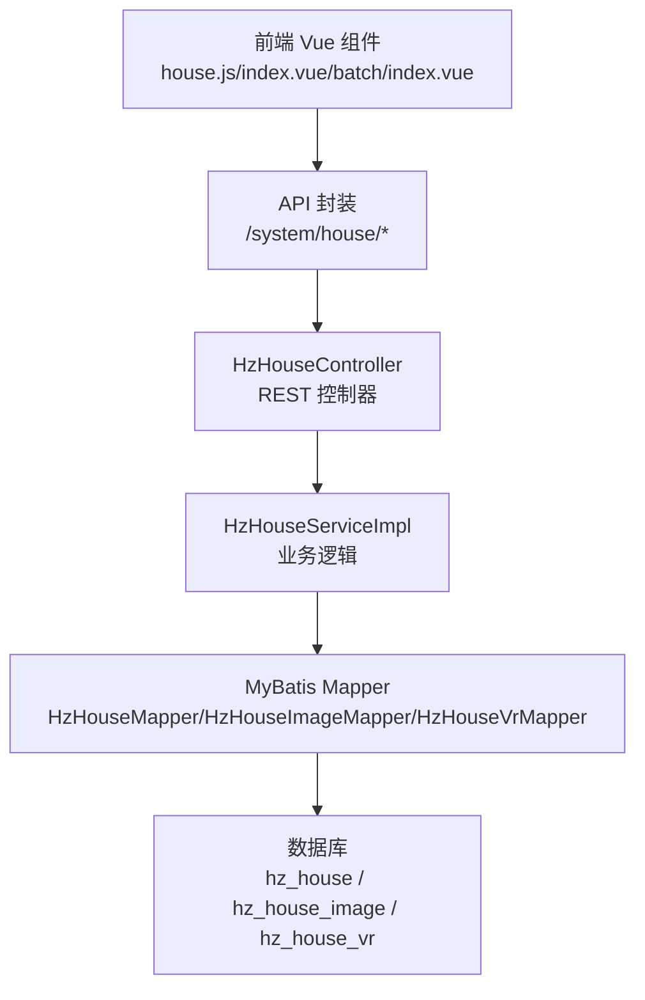
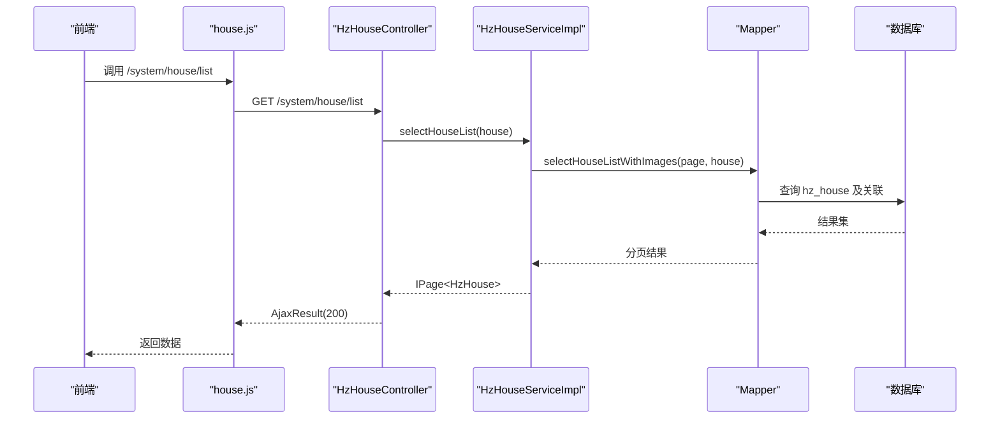
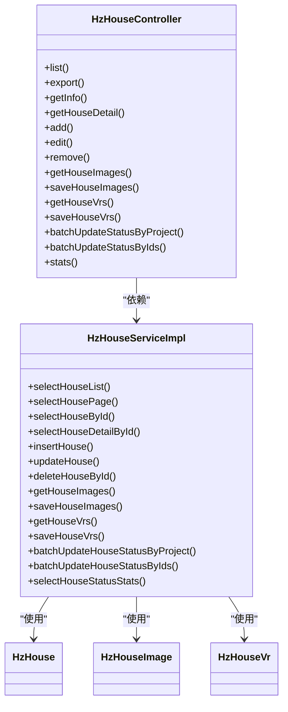

# 房源管理接口

<cite>
**本文引用的文件**
- [HzHouseController.java](file://ruoyi-admin/src/main/java/com/ruoyi/web/controller/system/HzHouseController.java)
- [HzHouseServiceImpl.java](file://ruoyi-system/src/main/java/com/ruoyi/system/service/impl/HzHouseServiceImpl.java)
- [IHzHouseService.java](file://ruoyi-system/src/main/java/com/ruoyi/system/service/IHzHouseService.java)
- [HzHouse.java](file://ruoyi-system/src/main/java/com/ruoyi/system/domain/HzHouse.java)
- [HzHouseImage.java](file://ruoyi-system/src/main/java/com/ruoyi/system/domain/HzHouseImage.java)
- [HzHouseVr.java](file://ruoyi-system/src/main/java/com/ruoyi/system/domain/HzHouseVr.java)
- [house.js](file://ruoyi-ui/src/api/gangzhu/house.js)
- [index.vue](file://ruoyi-ui/src/views/gangzhu/house/index.vue)
- [batch/index.vue](file://ruoyi-ui/src/views/gangzhu/house/batch/index.vue)
- [01-房源管理.md](file://docs/数据字典/01-房源管理.md)
</cite>

## 更新摘要
**所做更改**
- 更新了设施分类标准化章节，反映前端设施分类数组从'电器类、门窗类、灯类、卫浴区、家具类、洗菜池、其他'更新为'电气类、灯具类、卫浴类、厨房类、墙地面类、门窗类、家具类'
- 补充了设施分类一致性验证机制说明
- 更新了相关接口的设施分类参数说明

## 目录
1. [简介](#简介)
2. [项目结构](#项目结构)
3. [核心组件](#核心组件)
4. [架构总览](#架构总览)
5. [详细组件分析](#详细组件分析)
6. [依赖分析](#依赖分析)
7. [性能考虑](#性能考虑)
8. [故障排查指南](#故障排查指南)
9. [结论](#结论)
10. [附录](#附录)

## 简介
本文件面向"房源管理接口"的使用与维护，覆盖以下能力：
- 房源基本信息管理：查询、新增、修改、删除、导入导出
- 房源图片与VR全景图管理：上传、分类、批量操作、状态管理
- 房源状态控制：批量状态更新、状态转换规则与限制
- **设施分类标准化**：统一前后端设施分类体系，确保数据一致性
- 权限控制与业务规则：基于角色的权限、状态白名单限制
- 统计看板与项目级批量操作：按条件统计、项目维度批量改状态

## 项目结构
后端采用标准的三层架构：Web 控制器层、服务层、数据访问层；前端通过统一的 API 封装调用后端接口。

**图表来源**
- [HzHouseController.java:21-252](file://ruoyi-admin/src/main/java/com/ruoyi/web/controller/system/HzHouseController.java#L21-L252)
- [house.js:1-122](file://ruoyi-ui/src/api/gangzhu/house.js#L1-L122)

**章节来源**
- [HzHouseController.java:21-252](file://ruoyi-admin/src/main/java/com/ruoyi/web/controller/system/HzHouseController.java#L21-L252)
- [house.js:1-122](file://ruoyi-ui/src/api/gangzhu/house.js#L1-L122)

## 核心组件
- 控制器层：HzHouseController 提供房源管理的 REST 接口，包含 CRUD、导入导出、图片/VR 管理、批量状态更新、统计看板等。
- 服务层：HzHouseServiceImpl 实现业务逻辑，包括分页查询、详情聚合、图片/VR 读写、批量状态更新、统计汇总。
- 数据模型：HzHouse、HzHouseImage、HzHouseVr 对应数据库表，承载字段与校验。
- 前端封装：house.js 提供统一的 Axios 请求封装；index.vue 与 batch/index.vue 调用后端接口实现页面交互。

**章节来源**
- [HzHouseController.java:21-252](file://ruoyi-admin/src/main/java/com/ruoyi/web/controller/system/HzHouseController.java#L21-L252)
- [HzHouseServiceImpl.java:1-200](file://ruoyi-system/src/main/java/com/ruoyi/system/service/impl/HzHouseServiceImpl.java#L1-L200)
- [HzHouse.java:14-441](file://ruoyi-system/src/main/java/com/ruoyi/system/domain/HzHouse.java#L14-L441)
- [HzHouseImage.java:11-137](file://ruoyi-system/src/main/java/com/ruoyi/system/domain/HzHouseImage.java#L11-L137)
- [HzHouseVr.java:11-123](file://ruoyi-system/src/main/java/com/ruoyi/system/domain/HzHouseVr.java#L11-L123)
- [house.js:1-122](file://ruoyi-ui/src/api/gangzhu/house.js#L1-L122)

## 架构总览
后端接口遵循 REST 规范，使用 Spring Security 注解进行权限控制，结合 MyBatis Plus 实现数据持久化。

**图表来源**
- [HzHouseController.java:36-50](file://ruoyi-admin/src/main/java/com/ruoyi/web/controller/system/HzHouseController.java#L36-L50)
- [HzHouseServiceImpl.java:71-78](file://ruoyi-system/src/main/java/com/ruoyi/system/service/impl/HzHouseServiceImpl.java#L71-L78)

## 详细组件分析

### 1) 房源基本信息管理接口
- 查询列表
  - 方法：GET /system/house/list
  - 权限：@PreAuthorize("hasPermi('gangzhu:house:list')")，返回 TableDataInfo
  - 参数：支持项目/楼栋/单元/状态/是否精选等过滤
- 分页查询（H5）
  - 方法：GET /h5/house/page
  - 用途：H5 端分页展示，自动设置状态为正常
- 获取详情
  - 方法：GET /system/house/{houseId}
  - 方法：GET /system/house/detail/{houseId}（含项目/楼栋/单元/户型/图片/VR）
- 新增
  - 方法：POST /system/house
  - 返回：新增后的 houseId
- 修改
  - 方法：PUT /system/house
- 删除
  - 方法：DELETE /system/house/{houseIds}
- 导出
  - 方法：POST /system/house/export
- 导入模板下载
  - 方法：POST /system/house/importTemplate
- 导入
  - 方法：POST /system/house/importData
  - 参数：file, updateSupport

请求与响应要点
- 请求体：JSON；分页参数由服务层解析
- 响应体：AjaxResult(code/msg/data)；列表页返回 TableDataInfo(rows/total)

**章节来源**
- [HzHouseController.java:36-252](file://ruoyi-admin/src/main/java/com/ruoyi/web/controller/system/HzHouseController.java#L36-L252)
- [HzHouseController.java:132-151](file://ruoyi-admin/src/main/java/com/ruoyi/web/controller/system/HzHouseController.java#L132-L151)
- [HzHouseServiceImpl.java:136-188](file://ruoyi-system/src/main/java/com/ruoyi/system/service/impl/HzHouseServiceImpl.java#L136-L188)

### 2) 房源图片管理接口
- 获取图片列表（按分类）
  - 方法：GET /system/house/{houseId}/images
  - 返回：按类型分类的图片数组（主图、户型图、卧室、卫生间、室内、室外）
- 保存图片
  - 方法：POST /system/house/images
  - 请求体：{ houseId, images: [{ imageType, imageUrl, isCover, sortOrder }] }

前端集成
- 页面在新增/编辑时分别调用保存图片接口，并根据分类映射到表单字段
- 图片类型枚举：1=主图、2=户型图、3=卧室、4=卫生间、5=室内、6=室外

**章节来源**
- [HzHouseController.java:155-176](file://ruoyi-admin/src/main/java/com/ruoyi/web/controller/system/HzHouseController.java#L155-L176)
- [index.vue:1403-1452](file://ruoyi-ui/src/views/gangzhu/house/index.vue#L1403-L1452)
- [house.js:71-86](file://ruoyi-ui/src/api/gangzhu/house.js#L71-L86)

### 3) 房源VR全景图管理接口
- 获取VR列表
  - 方法：GET /system/house/{houseId}/vrs
- 保存VR
  - 方法：POST /system/house/vrs
  - 请求体：{ houseId, vrs: [{ vrName, vrUrl, sortOrder }] }

前端集成
- 页面在新增/编辑时分别调用保存VR接口，并将列表回显到表单

**章节来源**
- [HzHouseController.java:178-201](file://ruoyi-admin/src/main/java/com/ruoyi/web/controller/system/HzHouseController.java#L178-L201)
- [index.vue:1403-1452](file://ruoyi-ui/src/views/gangzhu/house/index.vue#L1403-L1452)
- [house.js:88-103](file://ruoyi-ui/src/api/gangzhu/house.js#L88-L103)

### 4) 房源状态控制机制
- 项目级批量改状态
  - 方法：POST /system/house/project/{projectId}/batchUpdateStatus
  - 请求体：{ targetStatus }
  - 规则：仅对源状态为 0/3/4 的房源更新，跳过 1/2（避免与订单/合同冲突）
- ID 列表批量改状态
  - 方法：POST /system/house/batchUpdateStatusByIds
  - 请求体：{ houseIds[], targetStatus }
  - 规则：同上，且目标状态仅允许 0/3/4
- 统计看板
  - 方法：GET /system/house/stats
  - 返回：按当前查询条件统计的各状态数量（total/vacant/booked/rented/maintain/offline）

状态转换白名单
- 允许在 0/3/4 之间互转
- 跳过 1/2（已预订/已出租），防止与订单/合同联动冲突

**章节来源**
- [IHzHouseService.java:127-158](file://ruoyi-system/src/main/java/com/ruoyi/system/service/IHzHouseService.java#L127-L158)
- [HzHouseServiceImpl.java:480-540](file://ruoyi-system/src/main/java/com/ruoyi/system/service/impl/HzHouseServiceImpl.java#L480-L540)
- [HzHouseController.java:204-252](file://ruoyi-admin/src/main/java/com/ruoyi/web/controller/system/HzHouseController.java#L204-L252)

### 5) 设施分类标准化机制

**更新** 设施分类已标准化为统一的七类分类体系，确保前后端一致性

设施分类标准化体系
- 电气类：包含各类电器设备，如空调、冰箱、洗衣机、热水器等
- 灯具类：包含照明设备，如主灯、台灯、壁灯、筒灯等
- 卫浴类：包含卫浴设施，如马桶、洗手台、淋浴设备等
- 厨房类：包含厨房设备，如燃气灶、抽油烟机、洗菜池等
- 墙地面类：包含装饰材料，如瓷砖、地板、墙纸等
- 门窗类：包含门窗设施，如入户门、窗户、窗帘等
- 家具类：包含家具设备，如床、沙发、餐桌椅等

前端设施分类数组
- 统一使用：['电气类', '灯具类', '卫浴类', '厨房类', '墙地面类', '门窗类', '家具类']
- 该数组在多个前端组件中使用，包括房源管理、项目管理、入住退租确认等页面

后端设施分类处理
- 设施分类字段：facilityCategory
- 支持的分类值：与前端保持完全一致
- 默认分类：墙地面类（用于兼容旧数据）

**章节来源**
- [index.vue:970-985](file://ruoyi-ui/src/views/gangzhu/house/index.vue#L970-L985)
- [index.vue:1403-1452](file://ruoyi-ui/src/views/gangzhu/house/index.vue#L1403-L1452)
- [HzHouseFacility.java:150-165](file://ruoyi-system/src/main/java/com/ruoyi/system/domain/HzHouseFacility.java#L150-L165)
- [HzHouseTypeFacility.java:150-165](file://ruoyi-system/src/main/java/com/ruoyi/system/domain/HzHouseTypeFacility.java#L150-L165)

### 6) 权限控制与业务规则
- 权限注解
  - @PreAuthorize("@ss.hasPermi('gangzhu:house:list')")：列表查询
  - @PreAuthorize("@ss.hasPermi('gangzhu:house:export')")：导出
  - @PreAuthorize("@ss.hasPermi('gangzhu:house:query')")：详情查询
  - @PreAuthorize("@ss.hasPermi('gangzhu:house:add/edit/remove')")：新增/修改/删除
- 业务规则
  - 批量改状态仅对白名单状态生效
  - 导入模板字段与数据字典一致，支持增量更新
  - 图片/VR 保存时按排序字段维护展示顺序
  - **设施分类必须符合标准化分类体系**

**章节来源**
- [HzHouseController.java:36-127](file://ruoyi-admin/src/main/java/com/ruoyi/web/controller/system/HzHouseController.java#L36-L127)
- [01-房源管理.md:82-154](file://docs/数据字典/01-房源管理.md#L82-L154)

### 7) 接口调用示例与参数说明

- 查询列表
  - 请求：GET /system/house/list?projectId=&buildingId=&unitId=&houseCode=&houseNo=&houseStatus=&isFeatured=&status=
  - 响应：rows(total rows)
- 新增/修改
  - 请求体字段（节选）：project_id, building_id, unit_id, house_code, house_no, floor, house_type_id, house_type_name, area, rent_price, deposit, orientation, decoration, facilities, house_status, is_featured, allocation_type, is_fresh_graduate, manager_phone, status
  - **设施字段**：facilities（包含设施名称和分类，如 { facilityName: "空调", facilityCategory: "电气类" }）
  - 响应：新增返回 houseId；修改返回受影响行数
- 图片/VR 保存
  - 请求体：{ houseId, images/vrs: [...] }
  - images/vrs 子项字段：imageType/imageUrl/isCover/sortOrder 或 vrName/vrUrl/sortOrder
- 批量改状态
  - 请求体：{ houseIds: [long,...], targetStatus: "0|3|4" }
  - 响应：{ total, affected, skippedBooked, skippedRented }
- 统计看板
  - 请求：GET /system/house/stats?projectId=&houseStatus=&...
  - 响应：{ total, vacant, booked, rented, maintain, offline }

**章节来源**
- [house.js:3-121](file://ruoyi-ui/src/api/gangzhu/house.js#L3-L121)
- [HzHouseController.java:36-252](file://ruoyi-admin/src/main/java/com/ruoyi/web/controller/system/HzHouseController.java#L36-L252)
- [HzHouse.java:56-146](file://ruoyi-system/src/main/java/com/ruoyi/system/domain/HzHouse.java#L56-L146)
- [HzHouseImage.java:26-48](file://ruoyi-system/src/main/java/com/ruoyi/system/domain/HzHouseImage.java#L26-L48)
- [HzHouseVr.java:26-44](file://ruoyi-system/src/main/java/com/ruoyi/system/domain/HzHouseVr.java#L26-L44)

### 8) 错误处理机制
- 参数校验
  - 批量改状态：当 houseIds 为空或 targetStatus 非法时抛出 ServiceException
  - **设施分类校验**：当设施分类不在标准化分类列表中时抛出参数错误
- 权限不足
  - 未携带有效权限注解将被拦截，返回 403
- 导入异常
  - 导入模板/数据解析异常会返回错误提示

**章节来源**
- [HzHouseServiceImpl.java:531-540](file://ruoyi-system/src/main/java/com/ruoyi/system/service/impl/HzHouseServiceImpl.java#L531-L540)
- [HzHouseController.java:142-151](file://ruoyi-admin/src/main/java/com/ruoyi/web/controller/system/HzHouseController.java#L142-L151)

## 依赖分析

**图表来源**
- [HzHouseController.java:21-252](file://ruoyi-admin/src/main/java/com/ruoyi/web/controller/system/HzHouseController.java#L21-L252)
- [HzHouseServiceImpl.java:44-200](file://ruoyi-system/src/main/java/com/ruoyi/system/service/impl/HzHouseServiceImpl.java#L44-L200)
- [HzHouse.java:14-441](file://ruoyi-system/src/main/java/com/ruoyi/system/domain/HzHouse.java#L14-L441)
- [HzHouseImage.java:11-137](file://ruoyi-system/src/main/java/com/ruoyi/system/domain/HzHouseImage.java#L11-L137)
- [HzHouseVr.java:11-123](file://ruoyi-system/src/main/java/com/ruoyi/system/domain/HzHouseVr.java#L11-L123)

## 性能考虑
- 分页查询：服务层统一从 PageUtils 获取分页参数，避免重复解析
- 关联查询：详情接口聚合项目/楼栋/单元/户型/图片/VR，建议在前端按需加载
- 批量改状态：服务层使用条件更新，减少逐条更新开销
- 图片/VR 排序：按 sort_order 排序，前端渲染时注意懒加载与缓存
- **设施分类校验**：在服务层进行分类有效性检查，避免无效数据进入数据库

## 故障排查指南
- 403 权限不足
  - 检查用户是否具备相应菜单权限（如 'gangzhu:house:*'）
- 批量改状态无效
  - 确认源状态是否在 0/3/4，目标状态是否为 0/3/4；1/2 状态会被跳过
- 导入失败
  - 检查模板字段与数据字典一致；updateSupport 参数决定是否更新已有记录
- 图片/VR 未显示
  - 检查图片类型与排序字段；确认 houseId 正确且未被删除
- **设施分类错误**
  - 检查设施分类是否在标准化列表中：['电气类', '灯具类', '卫浴类', '厨房类', '墙地面类', '门窗类', '家具类']
  - 确认设施分类大小写和拼写正确

**章节来源**
- [HzHouseController.java:36-127](file://ruoyi-admin/src/main/java/com/ruoyi/web/controller/system/HzHouseController.java#L36-L127)
- [HzHouseServiceImpl.java:480-540](file://ruoyi-system/src/main/java/com/ruoyi/system/service/impl/HzHouseServiceImpl.java#L480-L540)
- [01-房源管理.md:82-154](file://docs/数据字典/01-房源管理.md#L82-L154)

## 结论
本接口体系以清晰的 REST 设计与严格的权限控制为基础，覆盖房源全生命周期管理与图片/VR 管理，并通过状态白名单机制保障业务一致性。**设施分类标准化**确保了前后端数据的一致性，避免了分类不统一导致的数据混乱。建议在前端按需加载详情与媒体资源，后端保持幂等与事务一致性，确保大规模数据场景下的稳定性与性能。

## 附录

### A. 数据模型与字段对照
- 房源表（hz_house）
  - 关键字段：house_id, project_id, building_id, unit_id, house_code, house_no, floor, house_type_id, house_type_name, area, rent_price, deposit, orientation, decoration, facilities, house_status, is_featured, allocation_type, is_fresh_graduate, manager_phone, status
- 房源图片表（hz_house_image）
  - 关键字段：image_id, house_id, image_url, image_type, is_cover, sort_order, del_flag
- 房源VR表（hz_house_vr）
  - 关键字段：vr_id, house_id, vr_name, vr_url, sort_order, del_flag

**章节来源**
- [01-房源管理.md:82-154](file://docs/数据字典/01-房源管理.md#L82-L154)

### B. 设施分类标准化对照表

**标准化设施分类列表**
- 电气类：空调、冰箱、洗衣机、热水器、微波炉、电磁炉等
- 灯具类：主灯、台灯、壁灯、筒灯、感应灯等
- 卫浴类：马桶、洗手台、淋浴设备、浴缸、毛巾架等
- 厨房类：燃气灶、抽油烟机、洗菜池、消毒柜、垃圾处理器等
- 墙地面类：瓷砖、地板、墙纸、乳胶漆、踢脚线等
- 门窗类：入户门、防盗门、窗户、窗帘、百叶窗等
- 家具类：床、沙发、餐桌椅、衣柜、书桌、茶几等

**前端默认分类**
- 当设施分类缺失时，默认使用"墙地面类"

**章节来源**
- [index.vue:970-985](file://ruoyi-ui/src/views/gangzhu/house/index.vue#L970-L985)
- [HzHouseFacility.java:150-165](file://ruoyi-system/src/main/java/com/ruoyi/system/domain/HzHouseFacility.java#L150-L165)
- [HzHouseTypeFacility.java:150-165](file://ruoyi-system/src/main/java/com/ruoyi/system/domain/HzHouseTypeFacility.java#L150-L165)