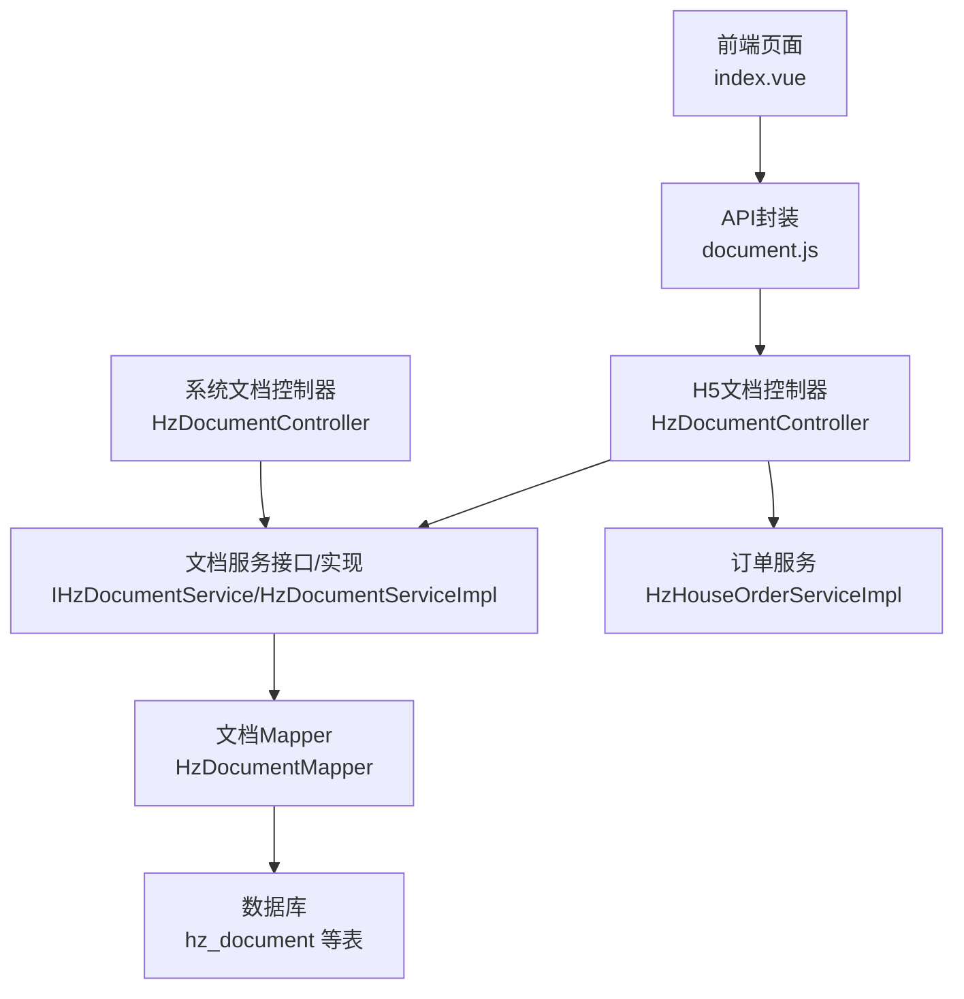
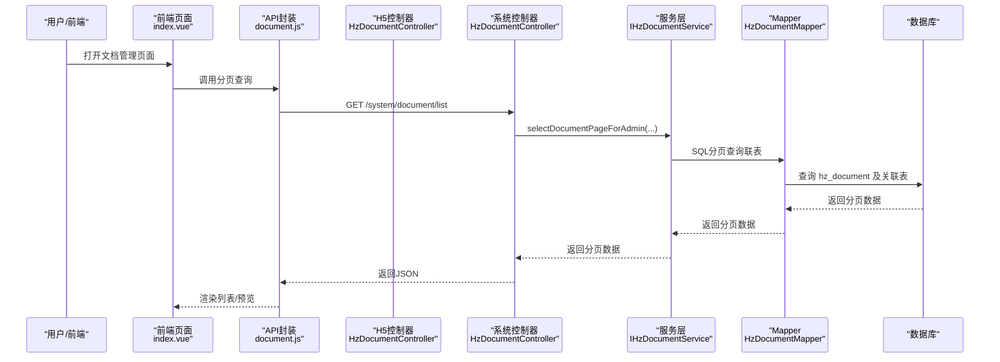
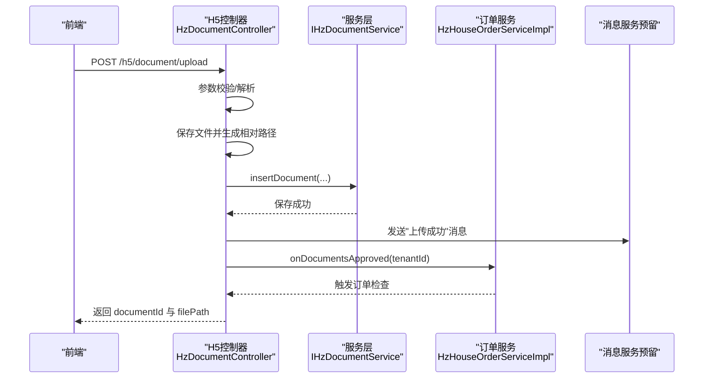
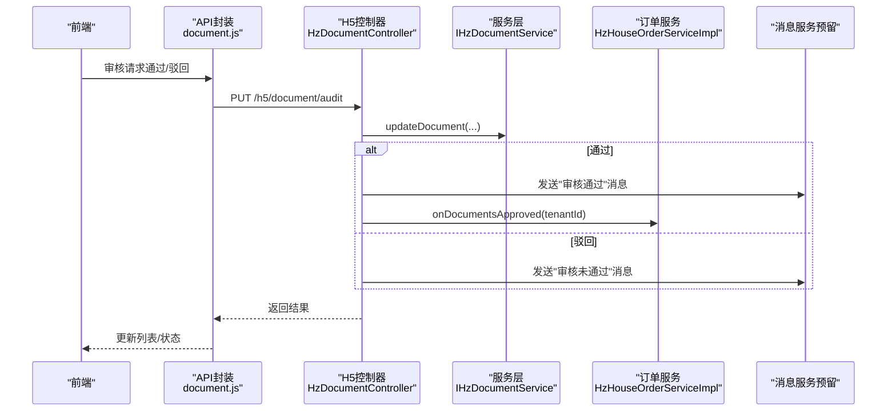
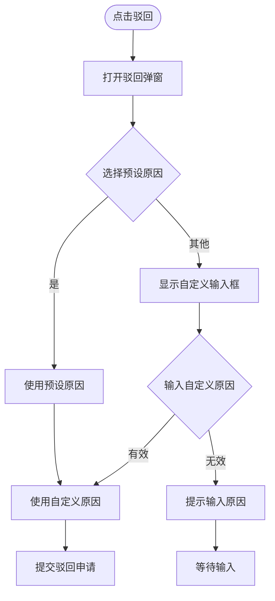
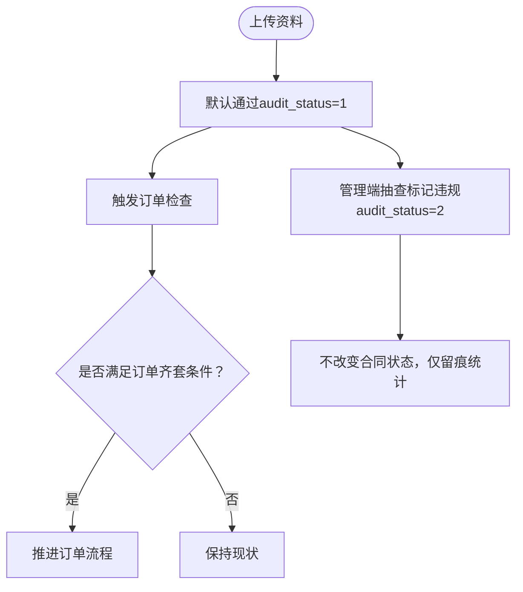
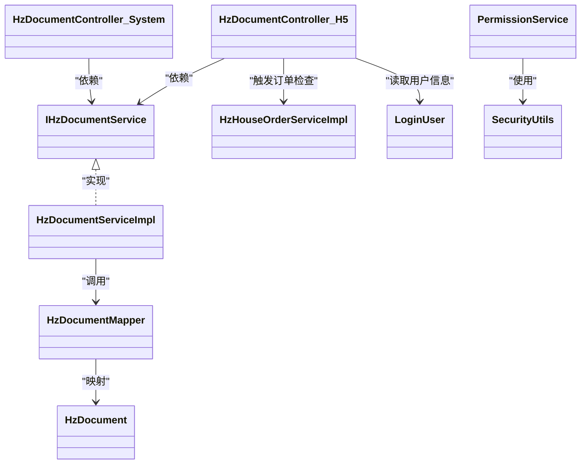

# 文档管理接口

<cite>
**本文引用的文件**
- [HzDocumentController.java](file://ruoyi-admin/src/main/java/com/ruoyi/web/controller/h5/HzDocumentController.java)
- [HzDocumentController.java](file://ruoyi-admin/src/main/java/com/ruoyi/web/controller/system/HzDocumentController.java)
- [IHzDocumentService.java](file://ruoyi-system/src/main/java/com/ruoyi/system/service/IHzDocumentService.java)
- [HzDocumentServiceImpl.java](file://ruoyi-system/src/main/java/com/ruoyi/system/service/impl/HzDocumentServiceImpl.java)
- [HzDocumentMapper.java](file://ruoyi-system/src/main/java/com/ruoyi/system/mapper/HzDocumentMapper.java)
- [HzDocument.java](file://ruoyi-system/src/main/java/com/ruoyi/system/domain/HzDocument.java)
- [document.js](file://ruoyi-ui/src/api/gangzhu/document.js)
- [index.vue](file://ruoyi-ui/src/views/gangzhu/application/document/index.vue)
- [PermissionService.java](file://ruoyi-framework/src/main/java/com/ruoyi/framework/web/service/PermissionService.java)
- [PermissionContextHolder.java](file://ruoyi-framework/src/main/java/com/ruoyi/framework/security/context/PermissionContextHolder.java)
- [SecurityUtils.java](file://ruoyi-common/src/main/java/com/ruoyi/common/utils/SecurityUtils.java)
- [LoginUser.java](file://ruoyi-common/src/main/java/com/ruoyi/common/core/domain/model/LoginUser.java)
- [HzHouseOrderServiceImpl.java](file://ruoyi-system/src/main/java/com/ruoyi/system/service/impl/HzHouseOrderServiceImpl.java)
- [HzHouseOrder.java](file://ruoyi-system/src/main/java/com/ruoyi/system/domain/HzHouseOrder.java)
</cite>

## 更新摘要
**变更内容**
- 增强了文档审批系统的驳回功能，新增"其他"选项支持自定义驳回原因
- 更新了前端驳回弹窗界面，支持动态输入自定义原因
- 完善了驳回原因处理逻辑，确保自定义原因的有效性验证

## 目录
1. [简介](#简介)
2. [项目结构](#项目结构)
3. [核心组件](#核心组件)
4. [架构总览](#架构总览)
5. [详细组件分析](#详细组件分析)
6. [依赖分析](#依赖分析)
7. [性能考虑](#性能考虑)
8. [故障排查指南](#故障排查指南)
9. [结论](#结论)
10. [附录](#附录)

## 简介
本文件系统性梳理"文档管理接口"的设计与实现，覆盖文档上传、下载、查询、删除、审核、重新上传、违规标记等能力，并说明文档类型管理、文档与业务流程（订单、合同）的关联关系，以及安全机制与权限控制、文档格式支持与预览功能。同时提供面向前端的使用指南与常见问题排查方法。

**更新** 本次更新增强了文档审批系统的灵活性，通过新增"其他"选项支持管理员输入自定义驳回原因，提供更灵活的审批流程管理。

## 项目结构
围绕文档管理的关键模块分布如下：
- 控制层：H5端文档控制器，负责对外HTTP接口、参数校验、调用服务层与消息服务。
- 管理端控制器：系统文档控制器，提供管理端分页查询与审核功能。
- 服务层：文档服务接口与实现，封装分页查询、新增、更新、删除等业务逻辑。
- 数据访问层：MyBatis Mapper，提供管理端分页查询（联表用户/合同/项目/房源）。
- 前端：API封装与管理端页面，提供列表查询、审核、详情预览、违规标记等交互。
- 安全与权限：基于Spring Security的权限上下文与校验工具。

**图表来源**
- [HzDocumentController.java:1-371](file://ruoyi-admin/src/main/java/com/ruoyi/web/controller/h5/HzDocumentController.java#L1-L371)
- [HzDocumentController.java:1-77](file://ruoyi-admin/src/main/java/com/ruoyi/web/controller/system/HzDocumentController.java#L1-L77)
- [IHzDocumentService.java:1-93](file://ruoyi-system/src/main/java/com/ruoyi/system/service/IHzDocumentService.java#L1-L93)
- [HzDocumentServiceImpl.java:82-98](file://ruoyi-system/src/main/java/com/ruoyi/system/service/impl/HzDocumentServiceImpl.java#L82-L98)
- [HzDocumentMapper.java:1-76](file://ruoyi-system/src/main/java/com/ruoyi/system/mapper/HzDocumentMapper.java#L1-L76)
- [document.js:1-31](file://ruoyi-ui/src/api/gangzhu/document.js#L1-L31)
- [index.vue:1-324](file://ruoyi-ui/src/views/gangzhu/application/document/index.vue#L1-L324)

**章节来源**
- [HzDocumentController.java:1-371](file://ruoyi-admin/src/main/java/com/ruoyi/web/controller/h5/HzDocumentController.java#L1-L371)
- [HzDocumentController.java:1-77](file://ruoyi-admin/src/main/java/com/ruoyi/web/controller/system/HzDocumentController.java#L1-L77)
- [IHzDocumentService.java:1-93](file://ruoyi-system/src/main/java/com/ruoyi/system/service/IHzDocumentService.java#L1-L93)
- [HzDocumentMapper.java:1-76](file://ruoyi-system/src/main/java/com/ruoyi/system/mapper/HzDocumentMapper.java#L1-L76)
- [document.js:1-31](file://ruoyi-ui/src/api/gangzhu/document.js#L1-L31)
- [index.vue:1-324](file://ruoyi-ui/src/views/gangzhu/application/document/index.vue#L1-L324)

## 核心组件
- 文档实体模型：描述文档字段（类型、路径、大小、格式、审核状态、关联合同/租户等）。
- H5文档控制器：提供H5端文档相关接口（上传、删除、查询、审核、重新上传、违规标记）。
- 系统文档控制器：提供管理端文档分页查询与审核功能。
- 服务层：封装查询、新增、更新、删除与管理端分页查询。
- Mapper：管理端分页查询（联表用户/合同/项目/房源），支持多维筛选。
- 前端API与页面：封装管理端列表查询、审核、详情预览、违规标记。
- 权限与安全：基于Spring Security的权限校验与上下文传递。

**章节来源**
- [HzDocument.java:1-199](file://ruoyi-system/src/main/java/com/ruoyi/system/domain/HzDocument.java#L1-L199)
- [HzDocumentController.java:1-371](file://ruoyi-admin/src/main/java/com/ruoyi/web/controller/h5/HzDocumentController.java#L1-L371)
- [HzDocumentController.java:1-77](file://ruoyi-admin/src/main/java/com/ruoyi/web/controller/system/HzDocumentController.java#L1-L77)
- [IHzDocumentService.java:1-93](file://ruoyi-system/src/main/java/com/ruoyi/system/service/IHzDocumentService.java#L1-L93)
- [HzDocumentMapper.java:1-76](file://ruoyi-system/src/main/java/com/ruoyi/system/mapper/HzDocumentMapper.java#L1-L76)
- [document.js:1-31](file://ruoyi-ui/src/api/gangzhu/document.js#L1-L31)
- [index.vue:1-324](file://ruoyi-ui/src/views/gangzhu/application/document/index.vue#L1-L324)

## 架构总览
文档管理采用前后端分离架构，前端通过API封装调用后端控制器，控制器协调服务层与数据访问层，最终持久化到数据库。审核流程与业务流程（订单）联动，违规标记仅做数据留痕不影响合同状态。

**图表来源**
- [index.vue:223-235](file://ruoyi-ui/src/views/gangzhu/application/document/index.vue#L223-L235)
- [document.js:4-10](file://ruoyi-ui/src/api/gangzhu/document.js#L4-L10)
- [HzDocumentController.java:82-98](file://ruoyi-admin/src/main/java/com/ruoyi/web/controller/h5/HzDocumentController.java#L82-L98)
- [HzDocumentController.java:37-75](file://ruoyi-admin/src/main/java/com/ruoyi/web/controller/system/HzDocumentController.java#L37-L75)
- [IHzDocumentService.java:83-92](file://ruoyi-system/src/main/java/com/ruoyi/system/service/IHzDocumentService.java#L83-L92)
- [HzDocumentMapper.java:27-75](file://ruoyi-system/src/main/java/com/ruoyi/system/mapper/HzDocumentMapper.java#L27-L75)

## 详细组件分析

### 文档上传接口
- 接口路径：POST /h5/document/upload
- 功能：接收文件与租户ID、合同ID、文档类型，保存文件并写入文档记录；默认审核通过；发送消息通知；触发订单检查。
- 关键点：
  - 文件上传使用统一工具类，返回相对路径。
  - 审核状态默认"通过"，1个月内由管理员异步复核与抽查。
  - 成功后返回文档ID与文件路径，便于前端预览与后续操作。

**图表来源**
- [HzDocumentController.java:97-157](file://ruoyi-admin/src/main/java/com/ruoyi/web/controller/h5/HzDocumentController.java#L97-L157)
- [HzHouseOrderServiceImpl.java:145-173](file://ruoyi-system/src/main/java/com/ruoyi/system/service/impl/HzHouseOrderServiceImpl.java#L145-L173)

**章节来源**
- [HzDocumentController.java:97-157](file://ruoyi-admin/src/main/java/com/ruoyi/web/controller/h5/HzDocumentController.java#L97-L157)

### 文档删除接口
- 接口路径：DELETE /h5/document/{documentId}
- 功能：校验资料存在性、归属与状态（仅待审核可删），执行删除。
- 关键点：
  - 仅允许租户本人操作。
  - 仅待审核状态可删除。

**章节来源**
- [HzDocumentController.java:162-189](file://ruoyi-admin/src/main/java/com/ruoyi/web/controller/h5/HzDocumentController.java#L162-L189)

### 文档查询接口
- H5端列表：GET /h5/document/list
- H5端按类型：GET /h5/document/type/{documentType}
- H5端详情：GET /h5/document/{documentId}
- 管理端分页：GET /system/document/list（前端封装为 listDocument）

**章节来源**
- [HzDocumentController.java:52-98](file://ruoyi-admin/src/main/java/com/ruoyi/web/controller/h5/HzDocumentController.java#L52-L98)
- [document.js:4-10](file://ruoyi-ui/src/api/gangzhu/document.js#L4-L10)
- [index.vue:223-235](file://ruoyi-ui/src/views/gangzhu/application/document/index.vue#L223-L235)

### 文档审核与重新上传
- 审核接口：PUT /h5/document/audit
  - 仅管理端可操作，支持通过/驳回。
  - 通过时发送消息并触发订单检查。
  - 驳回时发送消息并保留记录。
- 重新上传：POST /h5/document/reupload
  - 仅针对"已驳回"记录，覆盖原文件并重置为待审核。

**图表来源**
- [HzDocumentController.java:230-265](file://ruoyi-admin/src/main/java/com/ruoyi/web/controller/h5/HzDocumentController.java#L230-L265)
- [HzHouseOrderServiceImpl.java:145-173](file://ruoyi-system/src/main/java/com/ruoyi/system/service/impl/HzHouseOrderServiceImpl.java#L145-L173)

**章节来源**
- [HzDocumentController.java:230-265](file://ruoyi-admin/src/main/java/com/ruoyi/web/controller/h5/HzDocumentController.java#L230-L265)
- [HzDocumentController.java:275-317](file://ruoyi-admin/src/main/java/com/ruoyi/web/controller/h5/HzDocumentController.java#L275-L317)

### 增强的驳回功能
**更新** 新增了灵活的驳回原因选择机制，支持管理员输入自定义原因。

- 驳回弹窗：管理端点击"驳回"按钮时弹出对话框
- 预设原因：包含"请重新上传工作证明"、"经审核，您不符合郑州航空港区人才公寓申请政策，请于3个工作日内退房"等固定选项
- 自定义原因：选择"其他"选项时，显示文本域供管理员输入具体原因
- 原因验证：当选择"其他"时，必须输入有效的原因内容
- 最终处理：将选择的原因或自定义原因作为最终驳回意见保存

**图表来源**
- [index.vue:133-160](file://ruoyi-ui/src/views/gangzhu/application/document/index.vue#L133-L160)
- [index.vue:277-306](file://ruoyi-ui/src/views/gangzhu/application/document/index.vue#L277-L306)

**章节来源**
- [index.vue:133-160](file://ruoyi-ui/src/views/gangzhu/application/document/index.vue#L133-L160)
- [index.vue:277-306](file://ruoyi-ui/src/views/gangzhu/application/document/index.vue#L277-L306)

### 违规标记接口（管理端抽查）
- 接口：PUT /h5/document/violation
- 功能：将审核状态置为"已拒绝"，写入违规原因，不触发生产业务，仅留痕统计。
- 使用场景：上传即默认通过机制下的事后抽查。

**章节来源**
- [HzDocumentController.java:327-354](file://ruoyi-admin/src/main/java/com/ruoyi/web/controller/h5/HzDocumentController.java#L327-L354)

### 文档类型管理与状态
- 文档类型：1=身份证、2=学历证明、3=工作证明、4=收入证明、5=人才证书、6=其他。
- 审核状态：0=待审核、1=已通过、2=已拒绝。
- 类型映射与标签展示由前端与控制器共同维护。

**章节来源**
- [HzDocument.java:32-54](file://ruoyi-system/src/main/java/com/ruoyi/system/domain/HzDocument.java#L32-L54)
- [HzDocumentController.java:359-370](file://ruoyi-admin/src/main/java/com/ruoyi/web/controller/h5/HzDocumentController.java#L359-L370)
- [index.vue:307-314](file://ruoyi-ui/src/views/gangzhu/application/document/index.vue#L307-L314)

### 文档与业务流程的关联
- 上传即默认通过：触发订单检查，若满足条件（如工作证明与学历证明均通过）则推进订单流程。
- 合同关联：文档可关联合同ID，管理端分页查询时联表显示合同编号与项目/房源信息。
- 违规标记不影响合同状态，仅做数据留痕以便统计与运营处理。

**图表来源**
- [HzDocumentController.java:140-146](file://ruoyi-admin/src/main/java/com/ruoyi/web/controller/h5/HzDocumentController.java#L140-L146)
- [HzDocumentController.java:327-354](file://ruoyi-admin/src/main/java/com/ruoyi/web/controller/h5/HzDocumentController.java#L327-L354)
- [HzHouseOrderServiceImpl.java:145-173](file://ruoyi-system/src/main/java/com/ruoyi/system/service/impl/HzHouseOrderServiceImpl.java#L145-L173)

**章节来源**
- [HzDocumentController.java:140-146](file://ruoyi-admin/src/main/java/com/ruoyi/web/controller/h5/HzDocumentController.java#L140-L146)
- [HzDocumentController.java:327-354](file://ruoyi-admin/src/main/java/com/ruoyi/web/controller/h5/HzDocumentController.java#L327-L354)
- [HzHouseOrderServiceImpl.java:145-173](file://ruoyi-system/src/main/java/com/ruoyi/system/service/impl/HzHouseOrderServiceImpl.java#L145-L173)

### 文档统计分析与批量操作
- 统计分析：管理端分页查询支持按审核状态、文档类型、用户姓名、合同编号、上传时间范围筛选，可用于统计分析。
- 批量操作：当前接口未提供批量删除或批量审核接口，如需批量操作可在前端聚合请求或扩展后端接口。

**章节来源**
- [HzDocumentMapper.java:27-75](file://ruoyi-system/src/main/java/com/ruoyi/system/mapper/HzDocumentMapper.java#L27-L75)
- [index.vue:223-235](file://ruoyi-ui/src/views/gangzhu/application/document/index.vue#L223-L235)

### 安全机制与权限控制
- 权限注解：管理端操作按钮受指令 v-hasPermi 控制，对应权限标识 ['gangzhu:document:audit', 'gangzhu:document:query']。
- 权限校验：PermissionService 提供 hasPermi/hasAnyPermi 等方法，结合 Spring Security 上下文进行校验。
- 登录态：SecurityUtils 提供获取当前用户信息的能力，控制器中对用户ID/租户ID的读取依赖登录态。

**章节来源**
- [index.vue:108-120](file://ruoyi-ui/src/views/gangzhu/application/document/index.vue#L108-L120)
- [PermissionService.java:1-80](file://ruoyi-framework/src/main/java/com/ruoyi/framework/web/service/PermissionService.java#L1-L80)
- [PermissionContextHolder.java:1-27](file://ruoyi-framework/src/main/java/com/ruoyi/framework/security/context/PermissionContextHolder.java#L1-L27)
- [SecurityUtils.java:1-52](file://ruoyi-common/src/main/java/com/ruoyi/common/utils/SecurityUtils.java#L1-L52)
- [LoginUser.java:236-266](file://ruoyi-common/src/main/java/com/ruoyi/common/core/domain/model/LoginUser.java#L236-L266)

### 文档格式支持与预览
- 文件格式字段：HzDocument 提供 file_format 字段，用于记录文件格式。
- 预览方式：前端通过 el-image 组件加载文件路径，支持缩略图与大图预览；resolveUrl 统一拼接基础地址。
- 下载：当前接口未提供独立下载接口，通常通过文件路径直接访问或由网关/静态资源服务提供下载。

**章节来源**
- [HzDocument.java:48-50](file://ruoyi-system/src/main/java/com/ruoyi/system/domain/HzDocument.java#L48-L50)
- [index.vue:77-88](file://ruoyi-ui/src/views/gangzhu/application/document/index.vue#L77-L88)
- [index.vue:174-182](file://ruoyi-ui/src/views/gangzhu/application/document/index.vue#L174-L182)
- [index.vue:315-320](file://ruoyi-ui/src/views/gangzhu/application/document/index.vue#L315-L320)

## 依赖分析
- H5控制器依赖服务层与消息服务（预留），服务层依赖Mapper与实体模型。
- 系统控制器提供管理端分页查询功能，调用相同的服务层接口。
- Mapper 通过 MyBatis 实现管理端分页查询，联表 hz_user/hz_contract/hz_project/hz_house/hz_building/hz_unit。
- 前端通过 API 封装调用控制器，页面渲染与权限指令控制操作按钮可见性。

**图表来源**
- [HzDocumentController.java:1-371](file://ruoyi-admin/src/main/java/com/ruoyi/web/controller/h5/HzDocumentController.java#L1-L371)
- [HzDocumentController.java:1-77](file://ruoyi-admin/src/main/java/com/ruoyi/web/controller/system/HzDocumentController.java#L1-L77)
- [IHzDocumentService.java:1-93](file://ruoyi-system/src/main/java/com/ruoyi/system/service/IHzDocumentService.java#L1-L93)
- [HzDocumentServiceImpl.java:82-98](file://ruoyi-system/src/main/java/com/ruoyi/system/service/impl/HzDocumentServiceImpl.java#L82-L98)
- [HzDocumentMapper.java:1-76](file://ruoyi-system/src/main/java/com/ruoyi/system/mapper/HzDocumentMapper.java#L1-L76)
- [HzDocument.java:1-199](file://ruoyi-system/src/main/java/com/ruoyi/system/domain/HzDocument.java#L1-L199)
- [HzHouseOrderServiceImpl.java:145-173](file://ruoyi-system/src/main/java/com/ruoyi/system/service/impl/HzHouseOrderServiceImpl.java#L145-L173)
- [LoginUser.java:236-266](file://ruoyi-common/src/main/java/com/ruoyi/common/core/domain/model/LoginUser.java#L236-L266)
- [PermissionService.java:1-80](file://ruoyi-framework/src/main/java/com/ruoyi/framework/web/service/PermissionService.java#L1-L80)
- [SecurityUtils.java:1-52](file://ruoyi-common/src/main/java/com/ruoyi/common/utils/SecurityUtils.java#L1-L52)

**章节来源**
- [HzDocumentController.java:1-371](file://ruoyi-admin/src/main/java/com/ruoyi/web/controller/h5/HzDocumentController.java#L1-L371)
- [HzDocumentController.java:1-77](file://ruoyi-admin/src/main/java/com/ruoyi/web/controller/system/HzDocumentController.java#L1-L77)
- [IHzDocumentService.java:1-93](file://ruoyi-system/src/main/java/com/ruoyi/system/service/IHzDocumentService.java#L1-L93)
- [HzDocumentMapper.java:1-76](file://ruoyi-system/src/main/java/com/ruoyi/system/mapper/HzDocumentMapper.java#L1-L76)

## 性能考虑
- 分页查询：管理端分页查询支持多维筛选，建议合理设置每页大小与索引优化。
- 文件存储：上传文件路径为相对路径，建议配合CDN或对象存储提升访问性能。
- 审核触发：默认通过后触发订单检查，建议在高并发场景下评估订单检查的耗时与锁竞争。
- 前端预览：图片预览使用 el-image，建议对大图进行压缩或懒加载策略。
- 驳回处理：新增的自定义原因输入需要考虑前端验证性能和用户体验。

## 故障排查指南
- 上传失败
  - 检查文件为空、用户未登录、保存失败等错误提示。
  - 查看日志定位异常堆栈。
- 删除失败
  - 确认资料存在、归属正确且状态为"待审核"。
- 审核失败
  - 确认参数完整、资料存在、状态允许。
  - 检查消息发送与订单检查是否抛出异常。
- 驳回失败
  - 确认选择了预设原因或输入了有效的自定义原因。
  - 检查"其他"选项的自定义输入是否为空。
- 权限不足
  - 确认当前用户具备 ['gangzhu:document:audit', 'gangzhu:document:query'] 权限。
  - 检查 v-hasPermi 指令与后端权限校验逻辑。

**章节来源**
- [HzDocumentController.java:103-156](file://ruoyi-admin/src/main/java/com/ruoyi/web/controller/h5/HzDocumentController.java#L103-L156)
- [HzDocumentController.java:171-189](file://ruoyi-admin/src/main/java/com/ruoyi/web/controller/h5/HzDocumentController.java#L171-L189)
- [HzDocumentController.java:231-265](file://ruoyi-admin/src/main/java/com/ruoyi/web/controller/h5/HzDocumentController.java#L231-L265)
- [index.vue:108-120](file://ruoyi-ui/src/views/gangzhu/application/document/index.vue#L108-L120)
- [index.vue:282-306](file://ruoyi-ui/src/views/gangzhu/application/document/index.vue#L282-L306)

## 结论
文档管理接口围绕"上传—审核—关联—统计—预览—权限控制"形成闭环，支持H5端资料提交与管理端审核、违规标记、预览与分页查询。通过默认通过+事后抽查机制平衡效率与合规，结合订单检查推动业务流程自动化。

**更新** 本次增强显著提升了审批系统的灵活性，新增的"其他"选项允许管理员根据具体情况输入自定义驳回原因，为复杂的审批场景提供了更好的支持。建议后续扩展批量操作与独立下载接口，并持续优化文件存储与预览体验。

## 附录
- 接口一览（示例）
  - H5端
    - GET /h5/document/list：查询当前用户资料列表
    - GET /h5/document/type/{documentType}：按类型查询
    - GET /h5/document/{documentId}：获取详情
    - POST /h5/document/upload：上传资料（multipart/form-data）
    - DELETE /h5/document/{documentId}：删除资料
    - PUT /h5/document/audit：审核资料
    - POST /h5/document/reupload：重新上传被驳回资料
    - PUT /h5/document/violation：标记违规
  - 管理端
    - GET /system/document/list：分页查询（前端封装为 listDocument）
    - PUT /h5/document/audit：审核资料（支持通过/驳回，含自定义原因）

**章节来源**
- [HzDocumentController.java:52-370](file://ruoyi-admin/src/main/java/com/ruoyi/web/controller/h5/HzDocumentController.java#L52-L370)
- [HzDocumentController.java:20-75](file://ruoyi-admin/src/main/java/com/ruoyi/web/controller/system/HzDocumentController.java#L20-L75)
- [document.js:4-30](file://ruoyi-ui/src/api/gangzhu/document.js#L4-L30)
- [index.vue:133-160](file://ruoyi-ui/src/views/gangzhu/application/document/index.vue#L133-L160)
- [index.vue:277-306](file://ruoyi-ui/src/views/gangzhu/application/document/index.vue#L277-L306)