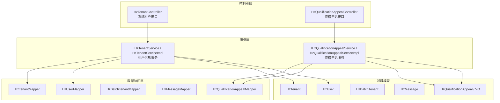
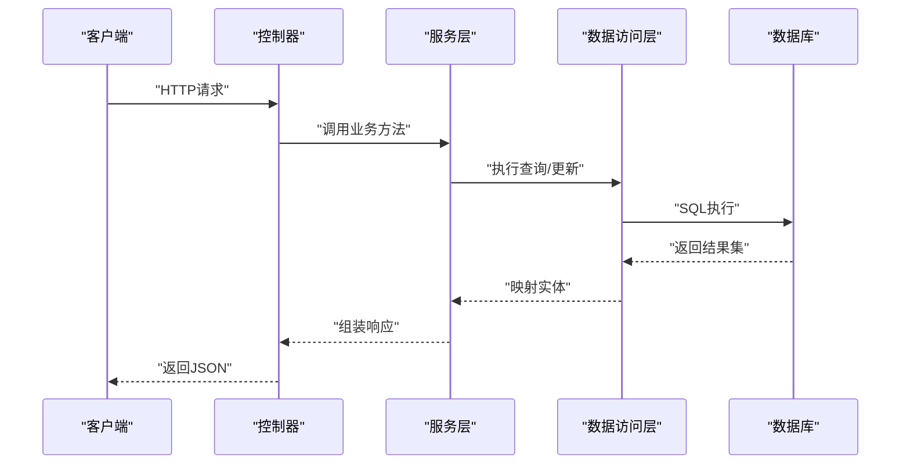
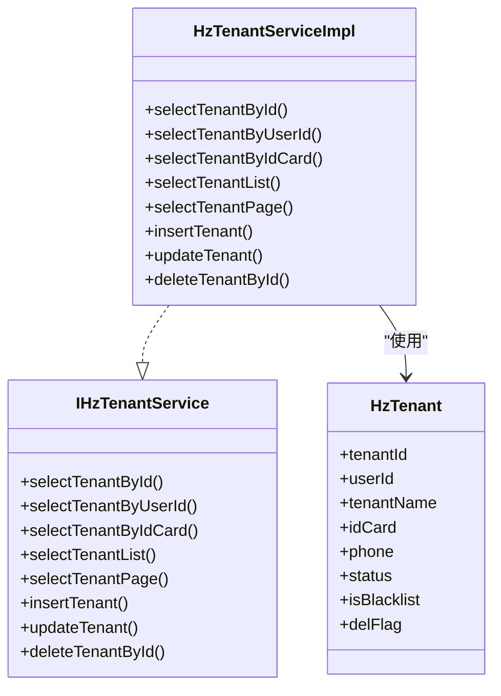
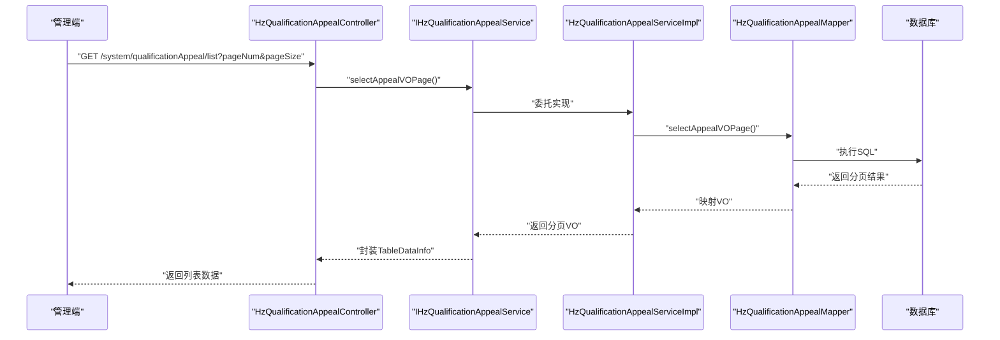
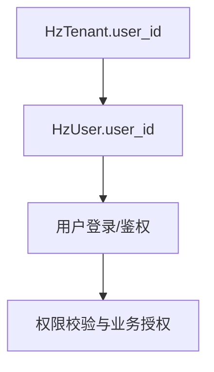
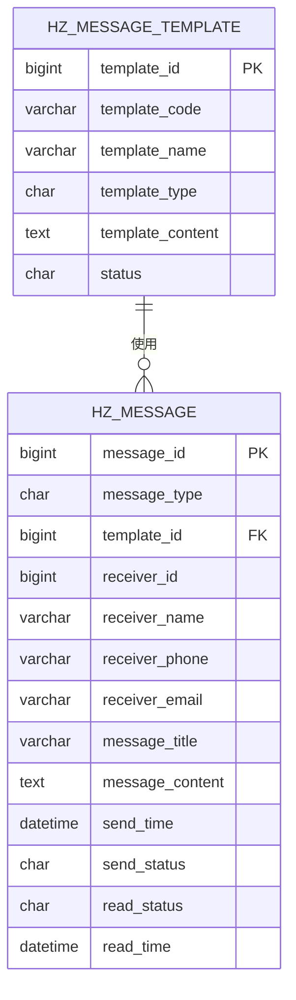
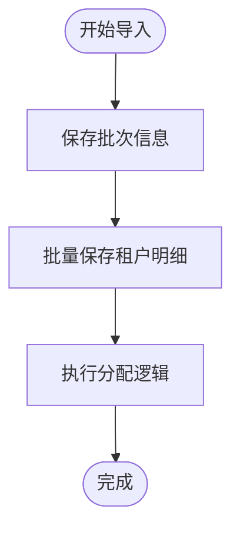
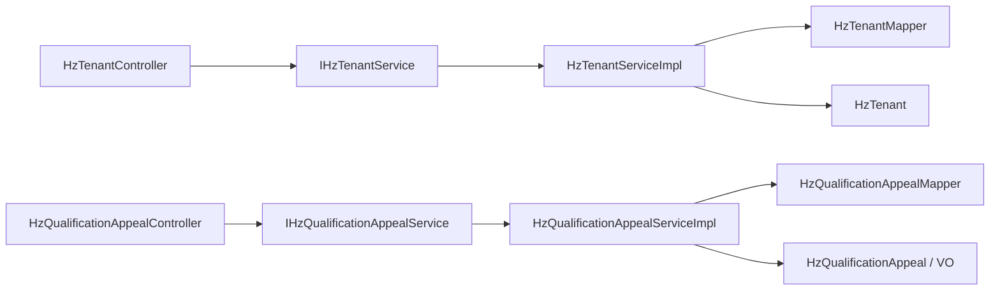

# 租户管理接口

<cite>
**本文引用的文件**
- [ruoyi-admin/src/main/java/com/ruoyi/web/controller/system/HzTenantController.java](file://ruoyi-admin/src/main/java/com/ruoyi/web/controller/system/HzTenantController.java)
- [ruoyi-system/src/main/java/com/ruoyi/system/service/IHzTenantService.java](file://ruoyi-system/src/main/java/com/ruoyi/system/service/IHzTenantService.java)
- [ruoyi-system/src/main/java/com/ruoyi/system/service/impl/HzTenantServiceImpl.java](file://ruoyi-system/src/main/java/com/ruoyi/system/service/impl/HzTenantServiceImpl.java)
- [ruoyi-system/src/main/java/com/ruoyi/system/domain/HzTenant.java](file://ruoyi-system/src/main/java/com/ruoyi/system/domain/HzTenant.java)
- [ruoyi-system/src/main/java/com/ruoyi/system/mapper/HzTenantMapper.java](file://ruoyi-system/src/main/java/com/ruoyi/system/mapper/HzTenantMapper.java)
- [ruoyi-admin/src/main/java/com/ruoyi/web/controller/system/HzQualificationAppealController.java](file://ruoyi-admin/src/main/java/com/ruoyi/web/controller/system/HzQualificationAppealController.java)
- [ruoyi-system/src/main/java/com/ruoyi/system/service/IHzQualificationAppealService.java](file://ruoyi-system/src/main/java/com/ruoyi/system/service/IHzQualificationAppealService.java)
- [ruoyi-system/src/main/java/com/ruoyi/system/service/impl/HzQualificationAppealServiceImpl.java](file://ruoyi-system/src/main/java/com/ruoyi/system/service/impl/HzQualificationAppealServiceImpl.java)
- [ruoyi-system/src/main/java/com/ruoyi/system/domain/HzQualificationAppeal.java](file://ruoyi-system/src/main/java/com/ruoyi/system/domain/HzQualificationAppeal.java)
- [ruoyi-system/src/main/java/com/ruoyi/system/mapper/HzQualificationAppealMapper.java](file://ruoyi-system/src/main/java/com/ruoyi/system/mapper/HzQualificationAppealMapper.java)
- [ruoyi-system/src/main/java/com/ruoyi/system/domain/HzQualificationAppealVO.java](file://ruoyi-system/src/main/java/com/ruoyi/system/domain/HzQualificationAppealVO.java)
- [ruoyi-system/src/main/java/com/ruoyi/system/service/impl/HzBatchAllocationServiceImpl.java](file://ruoyi-system/src/main/java/com/ruoyi/system/service/impl/HzBatchAllocationServiceImpl.java)
- [ruoyi-system/src/main/java/com/ruoyi/system/mapper/HzBatchTenantMapper.java](file://ruoyi-system/src/main/java/com/ruoyi/system/mapper/HzBatchTenantMapper.java)
- [ruoyi-system/src/main/java/com/ruoyi/system/domain/HzBatchTenant.java](file://ruoyi-system/src/main/java/com/ruoyi/system/domain/HzBatchTenant.java)
- [ruoyi-system/src/main/java/com/ruoyi/system/domain/HzContract.java](file://ruoyi-system/src/main/java/com/ruoyi/system/domain/HzContract.java)
- [ruoyi-system/src/main/java/com/ruoyi/system/domain/HzUser.java](file://ruoyi-system/src/main/java/com/ruoyi/system/domain/HzUser.java)
- [ruoyi-system/src/main/java/com/ruoyi/system/mapper/HzUserMapper.java](file://ruoyi-system/src/main/java/com/ruoyi/system/mapper/HzUserMapper.java)
- [ruoyi-system/src/main/java/com/ruoyi/system/domain/HzMessage.java](file://ruoyi-system/src/main/java/com/ruoyi/system/domain/HzMessage.java)
- [ruoyi-system/src/main/java/com/ruoyi/system/mapper/HzMessageMapper.java](file://ruoyi-system/src/main/java/com/ruoyi/system/mapper/HzMessageMapper.java)
- [docs/数据字典/02-租户管理.md](file://docs/数据字典/02-租户管理.md)
- [docs/数据字典/09-消息通知.md](file://docs/数据字典/09-消息通知.md)
- [migrate_data.py](file://migrate_data.py)
</cite>

## 目录
1. [简介](#简介)
2. [项目结构](#项目结构)
3. [核心组件](#核心组件)
4. [架构总览](#架构总览)
5. [详细组件分析](#详细组件分析)
6. [依赖分析](#依赖分析)
7. [性能考虑](#性能考虑)
8. [故障排查指南](#故障排查指南)
9. [结论](#结论)
10. [附录](#附录)

## 简介
本文件面向“租户管理接口”的使用者与维护者，系统性梳理租户信息管理、资格管理、消息推送、统计分析与批量操作等能力，明确接口定义、数据模型、业务规则与权限控制机制。文档同时解释租户与用户系统的关联关系，以及与合同、黑名单、承诺书等模块的交互。

## 项目结构
围绕租户管理的核心代码位于后端工程的系统模块与控制器层，采用典型的分层架构：
- 控制器层：对外暴露REST接口，负责参数接收、鉴权与响应封装
- 服务层：封装业务逻辑，协调数据访问与跨模块协作
- 数据访问层：MyBatis映射器，负责SQL执行与结果映射
- 领域模型：实体类与视图对象，承载数据结构与业务语义

图表来源
- [ruoyi-admin/src/main/java/com/ruoyi/web/controller/system/HzTenantController.java:26-84](file://ruoyi-admin/src/main/java/com/ruoyi/web/controller/system/HzTenantController.java#L26-L84)
- [ruoyi-admin/src/main/java/com/ruoyi/web/controller/system/HzQualificationAppealController.java:21-55](file://ruoyi-admin/src/main/java/com/ruoyi/web/controller/system/HzQualificationAppealController.java#L21-L55)
- [ruoyi-system/src/main/java/com/ruoyi/system/service/IHzTenantService.java:13-79](file://ruoyi-system/src/main/java/com/ruoyi/system/service/IHzTenantService.java#L13-L79)
- [ruoyi-system/src/main/java/com/ruoyi/system/service/impl/HzTenantServiceImpl.java:20-85](file://ruoyi-system/src/main/java/com/ruoyi/system/service/impl/HzTenantServiceImpl.java#L20-L85)
- [ruoyi-system/src/main/java/com/ruoyi/system/service/IHzQualificationAppealService.java:14-118](file://ruoyi-system/src/main/java/com/ruoyi/system/service/IHzQualificationAppealService.java#L14-L118)
- [ruoyi-system/src/main/java/com/ruoyi/system/service/impl/HzQualificationAppealServiceImpl.java](file://ruoyi-system/src/main/java/com/ruoyi/system/service/impl/HzQualificationAppealServiceImpl.java)
- [ruoyi-system/src/main/java/com/ruoyi/system/mapper/HzTenantMapper.java](file://ruoyi-system/src/main/java/com/ruoyi/system/mapper/HzTenantMapper.java)
- [ruoyi-system/src/main/java/com/ruoyi/system/mapper/HzQualificationAppealMapper.java:19-45](file://ruoyi-system/src/main/java/com/ruoyi/system/mapper/HzQualificationAppealMapper.java#L19-L45)
- [ruoyi-system/src/main/java/com/ruoyi/system/mapper/HzBatchTenantMapper.java:12-15](file://ruoyi-system/src/main/java/com/ruoyi/system/mapper/HzBatchTenantMapper.java#L12-L15)
- [ruoyi-system/src/main/java/com/ruoyi/system/mapper/HzMessageMapper.java](file://ruoyi-system/src/main/java/com/ruoyi/system/mapper/HzMessageMapper.java)
- [ruoyi-system/src/main/java/com/ruoyi/system/mapper/HzUserMapper.java](file://ruoyi-system/src/main/java/com/ruoyi/system/mapper/HzUserMapper.java)

章节来源
- [ruoyi-admin/src/main/java/com/ruoyi/web/controller/system/HzTenantController.java:26-84](file://ruoyi-admin/src/main/java/com/ruoyi/web/controller/system/HzTenantController.java#L26-L84)
- [ruoyi-admin/src/main/java/com/ruoyi/web/controller/system/HzQualificationAppealController.java:21-55](file://ruoyi-admin/src/main/java/com/ruoyi/web/controller/system/HzQualificationAppealController.java#L21-L55)

## 核心组件
- 租户信息管理接口
  - 查询列表、导出、详情、修改
  - 基于分页工具与MyBatis Plus实现
- 资格管理接口
  - 资格审核、黑名单管理、资格申诉
  - 支持管理端与H5端不同维度的查询与处理
- 消息推送接口
  - 消息模板、消息记录、发送与状态查看
- 批量操作接口
  - 批次导入与租户分配
- 统计分析接口
  - 可基于现有数据模型扩展，结合报表与聚合查询实现
- 权限控制
  - 使用注解进行接口级权限校验

章节来源
- [ruoyi-admin/src/main/java/com/ruoyi/web/controller/system/HzTenantController.java:36-83](file://ruoyi-admin/src/main/java/com/ruoyi/web/controller/system/HzTenantController.java#L36-L83)
- [ruoyi-system/src/main/java/com/ruoyi/system/service/IHzTenantService.java:13-79](file://ruoyi-system/src/main/java/com/ruoyi/system/service/IHzTenantService.java#L13-L79)
- [ruoyi-system/src/main/java/com/ruoyi/system/service/impl/HzTenantServiceImpl.java:22-84](file://ruoyi-system/src/main/java/com/ruoyi/system/service/impl/HzTenantServiceImpl.java#L22-L84)
- [ruoyi-admin/src/main/java/com/ruoyi/web/controller/system/HzQualificationAppealController.java:31-55](file://ruoyi-admin/src/main/java/com/ruoyi/web/controller/system/HzQualificationAppealController.java#L31-L55)
- [ruoyi-system/src/main/java/com/ruoyi/system/service/IHzQualificationAppealService.java:14-118](file://ruoyi-system/src/main/java/com/ruoyi/system/service/IHzQualificationAppealService.java#L14-L118)
- [docs/数据字典/02-租户管理.md:1-144](file://docs/数据字典/02-租户管理.md#L1-L144)
- [docs/数据字典/09-消息通知.md:1-51](file://docs/数据字典/09-消息通知.md#L1-L51)

## 架构总览
下图展示租户管理相关接口在系统中的调用路径与数据流：

图表来源
- [ruoyi-admin/src/main/java/com/ruoyi/web/controller/system/HzTenantController.java:36-83](file://ruoyi-admin/src/main/java/com/ruoyi/web/controller/system/HzTenantController.java#L36-L83)
- [ruoyi-system/src/main/java/com/ruoyi/system/service/IHzTenantService.java:13-79](file://ruoyi-system/src/main/java/com/ruoyi/system/service/IHzTenantService.java#L13-L79)
- [ruoyi-system/src/main/java/com/ruoyi/system/mapper/HzTenantMapper.java](file://ruoyi-system/src/main/java/com/ruoyi/system/mapper/HzTenantMapper.java)
- [ruoyi-system/src/main/java/com/ruoyi/system/service/impl/HzTenantServiceImpl.java:22-84](file://ruoyi-system/src/main/java/com/ruoyi/system/service/impl/HzTenantServiceImpl.java#L22-L84)

## 详细组件分析

### 租户信息管理接口
- 接口概览
  - 列表查询：支持按姓名、身份证、手机号、状态筛选，分页返回
  - 导出功能：将符合条件的租户数据导出为Excel
  - 详情查询：按租户ID获取租户信息
  - 修改租户：接收租户对象，更新数据库记录
- 权限控制
  - 列表、导出、查询、编辑均使用注解进行权限校验
- 数据模型
  - 实体类包含基础字段、用户关联、黑名单标记、状态与删除标志等
- 业务规则
  - 删除标志统一使用“0正常/2删除”，避免物理删除
  - 黑名单字段用于限制后续资格与业务操作
  - 租户与用户存在一对一关联（用户ID字段）

图表来源
- [ruoyi-system/src/main/java/com/ruoyi/system/domain/HzTenant.java:16-314](file://ruoyi-system/src/main/java/com/ruoyi/system/domain/HzTenant.java#L16-L314)
- [ruoyi-system/src/main/java/com/ruoyi/system/service/IHzTenantService.java:13-79](file://ruoyi-system/src/main/java/com/ruoyi/system/service/IHzTenantService.java#L13-L79)
- [ruoyi-system/src/main/java/com/ruoyi/system/service/impl/HzTenantServiceImpl.java:20-85](file://ruoyi-system/src/main/java/com/ruoyi/system/service/impl/HzTenantServiceImpl.java#L20-L85)

章节来源
- [ruoyi-admin/src/main/java/com/ruoyi/web/controller/system/HzTenantController.java:36-83](file://ruoyi-admin/src/main/java/com/ruoyi/web/controller/system/HzTenantController.java#L36-L83)
- [ruoyi-system/src/main/java/com/ruoyi/system/service/IHzTenantService.java:13-79](file://ruoyi-system/src/main/java/com/ruoyi/system/service/IHzTenantService.java#L13-L79)
- [ruoyi-system/src/main/java/com/ruoyi/system/service/impl/HzTenantServiceImpl.java:22-84](file://ruoyi-system/src/main/java/com/ruoyi/system/service/impl/HzTenantServiceImpl.java#L22-L84)
- [ruoyi-system/src/main/java/com/ruoyi/system/domain/HzTenant.java:16-314](file://ruoyi-system/src/main/java/com/ruoyi/system/domain/HzTenant.java#L16-L314)

### 资格管理接口
- 资质审核
  - 包含自动审核与人工审核字段，最终结果由两者共同决定
  - 审核状态涵盖“待审核/审核中/已审核”等阶段
- 黑名单管理
  - 黑名单表记录列入/移除原因与时间，状态字段区分生效中与已移除
- 资格申诉
  - 支持管理端与H5端两种视角：管理端包含用户信息，H5端按用户维度查询
  - 支持双材料独立审核（学历与社保），并兼容历史字段
  - 提供分页查询、详情查询、新增与更新接口

图表来源
- [ruoyi-admin/src/main/java/com/ruoyi/web/controller/system/HzQualificationAppealController.java:31-46](file://ruoyi-admin/src/main/java/com/ruoyi/web/controller/system/HzQualificationAppealController.java#L31-L46)
- [ruoyi-system/src/main/java/com/ruoyi/system/service/IHzQualificationAppealService.java:54-65](file://ruoyi-system/src/main/java/com/ruoyi/system/service/IHzQualificationAppealService.java#L54-L65)
- [ruoyi-system/src/main/java/com/ruoyi/system/mapper/HzQualificationAppealMapper.java:29-37](file://ruoyi-system/src/main/java/com/ruoyi/system/mapper/HzQualificationAppealMapper.java#L29-L37)

章节来源
- [ruoyi-admin/src/main/java/com/ruoyi/web/controller/system/HzQualificationAppealController.java:31-55](file://ruoyi-admin/src/main/java/com/ruoyi/web/controller/system/HzQualificationAppealController.java#L31-L55)
- [ruoyi-system/src/main/java/com/ruoyi/system/service/IHzQualificationAppealService.java:14-118](file://ruoyi-system/src/main/java/com/ruoyi/system/service/IHzQualificationAppealService.java#L14-L118)
- [ruoyi-system/src/main/java/com/ruoyi/system/mapper/HzQualificationAppealMapper.java:19-45](file://ruoyi-system/src/main/java/com/ruoyi/system/mapper/HzQualificationAppealMapper.java#L19-L45)
- [docs/数据字典/02-租户管理.md:38-98](file://docs/数据字典/02-租户管理.md#L38-L98)

### 租户与用户系统的关联关系
- 关联方式
  - 租户实体包含用户ID字段，形成租户与用户的一对一关联
  - 迁移脚本中明确从租户表创建用户表并建立映射
- 用户信息同步
  - 通过服务层按用户ID查询租户，用于用户侧展示与业务判断
- 角色分配
  - 用户系统提供角色与权限服务，租户作为用户身份载体参与权限体系

图表来源
- [ruoyi-system/src/main/java/com/ruoyi/system/domain/HzTenant.java:24-26](file://ruoyi-system/src/main/java/com/ruoyi/system/domain/HzTenant.java#L24-L26)
- [ruoyi-system/src/main/java/com/ruoyi/system/domain/HzUser.java](file://ruoyi-system/src/main/java/com/ruoyi/system/domain/HzUser.java)
- [migrate_data.py:748-752](file://migrate_data.py#L748-L752)

章节来源
- [ruoyi-system/src/main/java/com/ruoyi/system/domain/HzTenant.java:24-26](file://ruoyi-system/src/main/java/com/ruoyi/system/domain/HzTenant.java#L24-L26)
- [migrate_data.py:748-752](file://migrate_data.py#L748-L752)

### 租户消息推送接口
- 消息模板
  - 模板表支持系统通知、短信、邮件三类模板，含启用/停用状态
- 消息记录
  - 记录消息类型、接收人、标题、内容、发送与阅读状态
- 推送流程
  - 通过消息模板生成内容，写入消息记录，触发发送任务或异步队列
  - 支持按用户维度查询消息列表与状态

图表来源
- [docs/数据字典/09-消息通知.md:5-21](file://docs/数据字典/09-消息通知.md#L5-L21)
- [docs/数据字典/09-消息通知.md:26-48](file://docs/数据字典/09-消息通知.md#L26-L48)

章节来源
- [docs/数据字典/09-消息通知.md:1-51](file://docs/数据字典/09-消息通知.md#L1-L51)

### 批量操作接口
- 批次导入
  - 将租户信息批量写入批次租户表，初始分配状态为“未分配”
- 分配流程
  - 服务层保存批次与租户明细，随后进行分配与落库
- 数据一致性
  - 批次与租户明细通过批次ID关联，便于追踪与重试

图表来源
- [ruoyi-system/src/main/java/com/ruoyi/system/service/impl/HzBatchAllocationServiceImpl.java:430-462](file://ruoyi-system/src/main/java/com/ruoyi/system/service/impl/HzBatchAllocationServiceImpl.java#L430-L462)
- [ruoyi-system/src/main/java/com/ruoyi/system/mapper/HzBatchTenantMapper.java:12-15](file://ruoyi-system/src/main/java/com/ruoyi/system/mapper/HzBatchTenantMapper.java#L12-L15)
- [ruoyi-system/src/main/java/com/ruoyi/system/domain/HzBatchTenant.java](file://ruoyi-system/src/main/java/com/ruoyi/system/domain/HzBatchTenant.java)

章节来源
- [ruoyi-system/src/main/java/com/ruoyi/system/service/impl/HzBatchAllocationServiceImpl.java:430-462](file://ruoyi-system/src/main/java/com/ruoyi/system/service/impl/HzBatchAllocationServiceImpl.java#L430-L462)
- [ruoyi-system/src/main/java/com/ruoyi/system/mapper/HzBatchTenantMapper.java:12-15](file://ruoyi-system/src/main/java/com/ruoyi/system/mapper/HzBatchTenantMapper.java#L12-L15)
- [ruoyi-system/src/main/java/com/ruoyi/system/domain/HzBatchTenant.java](file://ruoyi-system/src/main/java/com/ruoyi/system/domain/HzBatchTenant.java)

### 统计分析接口
- 现状
  - 仓库未提供专门的统计分析控制器或服务
- 建议
  - 可基于现有数据模型（租户、消息、合同、资格）扩展统计接口，如：
    - 租户分布与状态统计
    - 消息发送与阅读率统计
    - 资格审核通过率与驳回原因统计
  - 使用聚合查询与分组统计，结合分页与缓存提升性能

[本节为通用建议，不直接分析具体文件，故不列出章节来源]

## 依赖分析
- 控制器与服务
  - 控制器依赖服务接口，服务实现依赖映射器与实体类
- 数据模型
  - 租户与用户存在一对一关联，资格申诉与租户/用户存在多对一关联
- 外部依赖
  - MyBatis Plus、分页工具、权限注解等

图表来源
- [ruoyi-admin/src/main/java/com/ruoyi/web/controller/system/HzTenantController.java:26-84](file://ruoyi-admin/src/main/java/com/ruoyi/web/controller/system/HzTenantController.java#L26-L84)
- [ruoyi-system/src/main/java/com/ruoyi/system/service/IHzTenantService.java:13-79](file://ruoyi-system/src/main/java/com/ruoyi/system/service/IHzTenantService.java#L13-L79)
- [ruoyi-system/src/main/java/com/ruoyi/system/service/impl/HzTenantServiceImpl.java:20-85](file://ruoyi-system/src/main/java/com/ruoyi/system/service/impl/HzTenantServiceImpl.java#L20-L85)
- [ruoyi-system/src/main/java/com/ruoyi/system/mapper/HzTenantMapper.java](file://ruoyi-system/src/main/java/com/ruoyi/system/mapper/HzTenantMapper.java)
- [ruoyi-admin/src/main/java/com/ruoyi/web/controller/system/HzQualificationAppealController.java:21-55](file://ruoyi-admin/src/main/java/com/ruoyi/web/controller/system/HzQualificationAppealController.java#L21-L55)
- [ruoyi-system/src/main/java/com/ruoyi/system/service/IHzQualificationAppealService.java:14-118](file://ruoyi-system/src/main/java/com/ruoyi/system/service/IHzQualificationAppealService.java#L14-L118)
- [ruoyi-system/src/main/java/com/ruoyi/system/service/impl/HzQualificationAppealServiceImpl.java](file://ruoyi-system/src/main/java/com/ruoyi/system/service/impl/HzQualificationAppealServiceImpl.java)
- [ruoyi-system/src/main/java/com/ruoyi/system/mapper/HzQualificationAppealMapper.java:19-45](file://ruoyi-system/src/main/java/com/ruoyi/system/mapper/HzQualificationAppealMapper.java#L19-L45)

章节来源
- [ruoyi-admin/src/main/java/com/ruoyi/web/controller/system/HzTenantController.java:26-84](file://ruoyi-admin/src/main/java/com/ruoyi/web/controller/system/HzTenantController.java#L26-L84)
- [ruoyi-admin/src/main/java/com/ruoyi/web/controller/system/HzQualificationAppealController.java:21-55](file://ruoyi-admin/src/main/java/com/ruoyi/web/controller/system/HzQualificationAppealController.java#L21-L55)

## 性能考虑
- 分页查询
  - 使用分页工具与数据库索引优化，避免一次性加载大量数据
- 缓存策略
  - 对高频查询（如租户详情、用户关联）可引入缓存，降低数据库压力
- 批量操作
  - 批次导入采用批量插入，减少事务次数与网络往返
- SQL优化
  - 在条件过滤较多时，确保相关字段建立索引（如手机号、身份证、状态）

[本节提供通用指导，不直接分析具体文件，故不列出章节来源]

## 故障排查指南
- 权限不足
  - 现象：接口返回无权限
  - 排查：确认用户角色是否具备对应权限标识
- 参数错误
  - 现象：分页参数或查询条件导致查询异常
  - 排查：检查分页页码与大小、查询字段非空性
- 数据不一致
  - 现象：租户与用户关联异常
  - 排查：核对用户ID字段与迁移脚本映射逻辑
- 批量导入失败
  - 现象：批次保存成功但租户明细缺失
  - 排查：检查批次ID生成与租户明细保存逻辑

章节来源
- [ruoyi-admin/src/main/java/com/ruoyi/web/controller/system/HzTenantController.java:36-83](file://ruoyi-admin/src/main/java/com/ruoyi/web/controller/system/HzTenantController.java#L36-L83)
- [ruoyi-system/src/main/java/com/ruoyi/system/service/impl/HzBatchAllocationServiceImpl.java:430-462](file://ruoyi-system/src/main/java/com/ruoyi/system/service/impl/HzBatchAllocationServiceImpl.java#L430-L462)
- [migrate_data.py:748-752](file://migrate_data.py#L748-L752)

## 结论
本项目提供了完善的租户信息管理与资格管理能力，配合消息推送与批量操作接口，能够满足日常运营与管理需求。通过清晰的分层设计与权限控制，系统具备良好的可维护性与扩展性。建议后续补充统计分析接口与缓存策略，以进一步提升用户体验与系统性能。

## 附录
- 数据字典
  - 租户管理：包含租户表、资格审核表、资格申诉表、承诺书表、黑名单表
  - 消息通知：包含消息模板表与消息记录表
- 迁移脚本
  - 明确从租户表创建用户表并建立映射关系

章节来源
- [docs/数据字典/02-租户管理.md:1-144](file://docs/数据字典/02-租户管理.md#L1-L144)
- [docs/数据字典/09-消息通知.md:1-51](file://docs/数据字典/09-消息通知.md#L1-L51)
- [migrate_data.py:748-752](file://migrate_data.py#L748-L752)