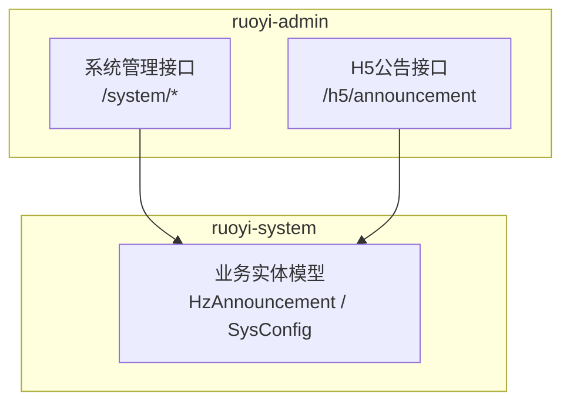
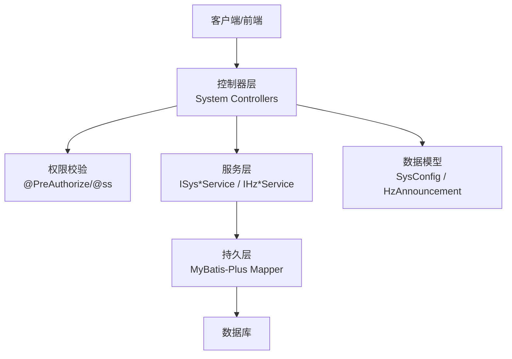
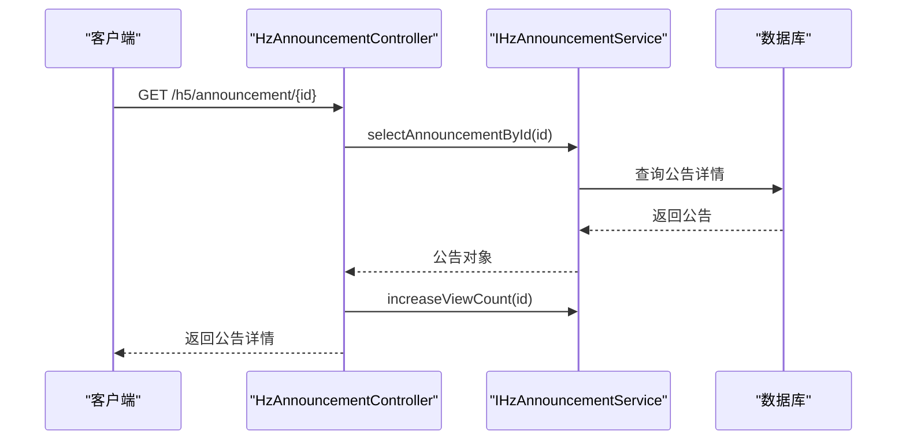
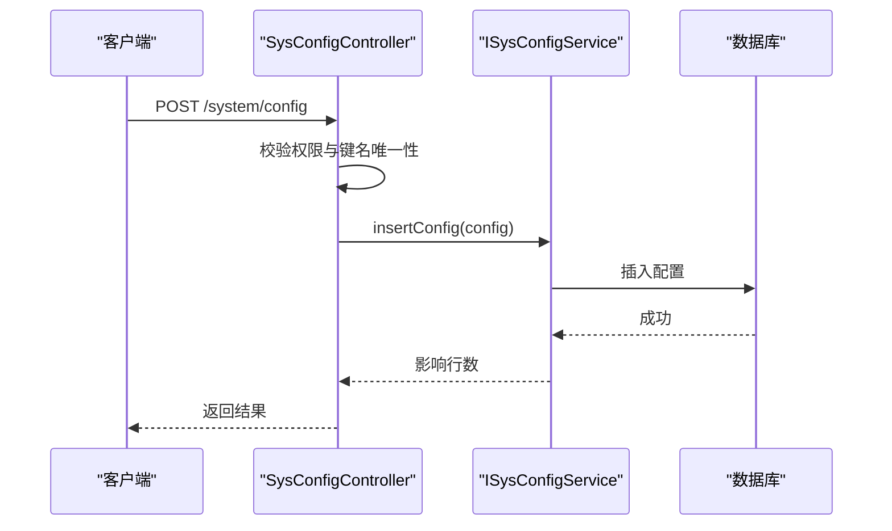
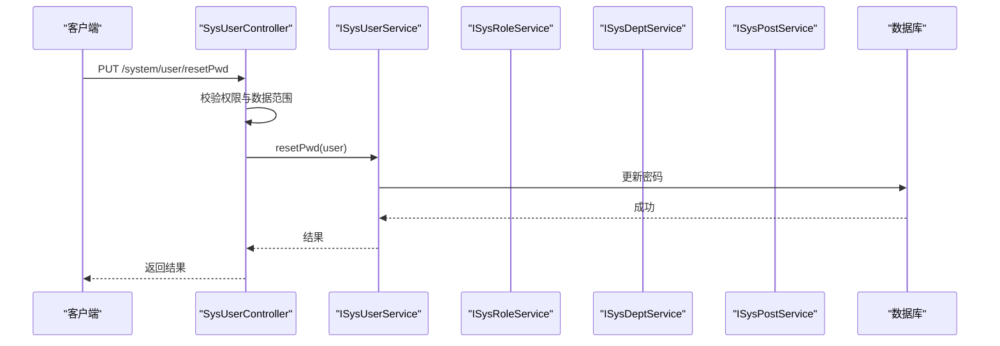
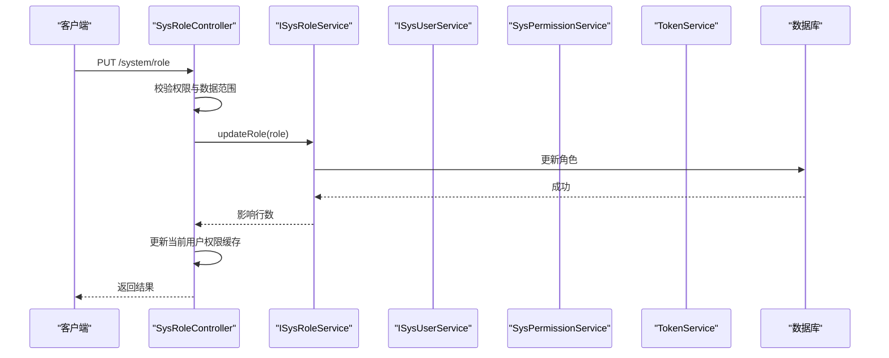
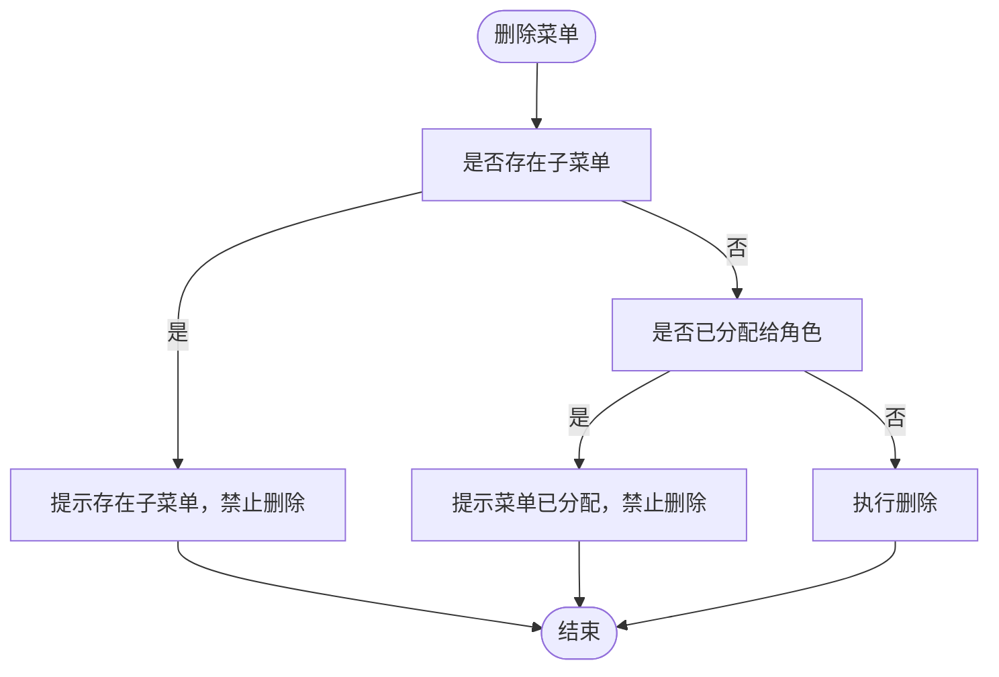
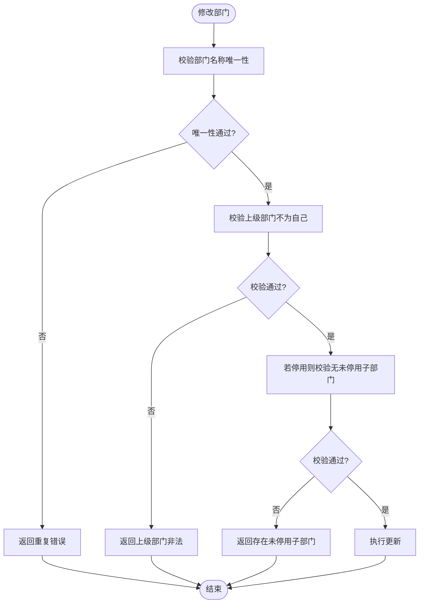
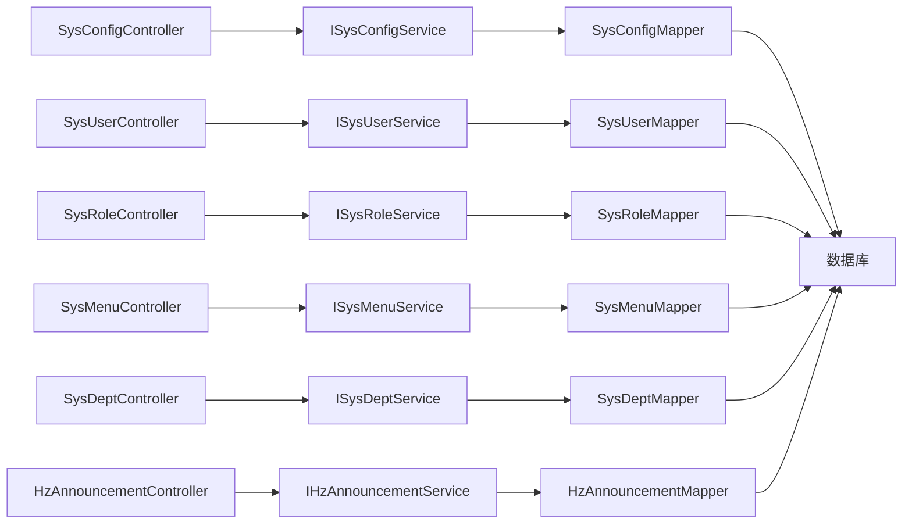

# 系统管理接口

<cite>
**本文档引用的文件**
- [HzAnnouncementController.java](file://ruoyi-admin/src/main/java/com/ruoyi/web/controller/h5/HzAnnouncementController.java)
- [SysConfigController.java](file://ruoyi-admin/src/main/java/com/ruoyi/web/controller/system/SysConfigController.java)
- [SysUserController.java](file://ruoyi-admin/src/main/java/com/ruoyi/web/controller/system/SysUserController.java)
- [SysRoleController.java](file://ruoyi-admin/src/main/java/com/ruoyi/web/controller/system/SysRoleController.java)
- [SysMenuController.java](file://ruoyi-admin/src/main/java/com/ruoyi/web/controller/system/SysMenuController.java)
- [SysDeptController.java](file://ruoyi-admin/src/main/java/com/ruoyi/web/controller/system/SysDeptController.java)
- [HzAnnouncement.java](file://ruoyi-system/src/main/java/com/ruoyi/system/domain/HzAnnouncement.java)
- [SysConfig.java](file://ruoyi-system/src/main/java/com/ruoyi/system/domain/SysConfig.java)
</cite>

## 目录
1. [简介](#简介)
2. [项目结构](#项目结构)
3. [核心组件](#核心组件)
4. [架构总览](#架构总览)
5. [详细组件分析](#详细组件分析)
6. [依赖分析](#依赖分析)
7. [性能考虑](#性能考虑)
8. [故障排查指南](#故障排查指南)
9. [结论](#结论)
10. [附录](#附录)

## 简介
本文件面向系统管理接口的使用者与维护者，系统性梳理公告管理、政策管理、运营配置管理以及用户/角色/菜单/部门等系统基础能力的接口定义与使用方法。文档同时覆盖权限控制与安全机制，帮助读者快速理解并正确使用这些接口。

## 项目结构
系统管理相关接口主要分布在 ruoyi-admin 模块的 system 包与 h5 包中，分别负责后台管理系统接口与 H5 端展示接口；数据模型位于 ruoyi-system 模块中，统一承载业务实体。

**图表来源**
- [SysConfigController.java:34-142](file://ruoyi-admin/src/main/java/com/ruoyi/web/controller/system/SysConfigController.java#L34-L142)
- [HzAnnouncementController.java:17-60](file://ruoyi-admin/src/main/java/com/ruoyi/web/controller/h5/HzAnnouncementController.java#L17-L60)
- [HzAnnouncement.java:14-176](file://ruoyi-system/src/main/java/com/ruoyi/system/domain/HzAnnouncement.java#L14-L176)
- [SysConfig.java:16-112](file://ruoyi-system/src/main/java/com/ruoyi/system/domain/SysConfig.java#L16-L112)

**章节来源**
- [SysConfigController.java:34-142](file://ruoyi-admin/src/main/java/com/ruoyi/web/controller/system/SysConfigController.java#L34-L142)
- [HzAnnouncementController.java:17-60](file://ruoyi-admin/src/main/java/com/ruoyi/web/controller/h5/HzAnnouncementController.java#L17-L60)
- [HzAnnouncement.java:14-176](file://ruoyi-system/src/main/java/com/ruoyi/system/domain/HzAnnouncement.java#L14-L176)
- [SysConfig.java:16-112](file://ruoyi-system/src/main/java/com/ruoyi/system/domain/SysConfig.java#L16-L112)

## 核心组件
- 公告管理接口：提供 H5 端公告列表查询、按类型筛选、详情获取及浏览量统计等能力。
- 运营配置管理接口：提供系统参数配置的增删改查、导出、按键名查询、缓存刷新等能力。
- 用户/角色/菜单/部门管理接口：提供用户、角色、菜单、部门的增删改查、导入导出、状态变更、授权等能力。
- 权限与安全：基于注解进行权限校验，结合登录态与数据范围控制，确保接口调用安全。

**章节来源**
- [HzAnnouncementController.java:17-60](file://ruoyi-admin/src/main/java/com/ruoyi/web/controller/h5/HzAnnouncementController.java#L17-L60)
- [SysConfigController.java:34-142](file://ruoyi-admin/src/main/java/com/ruoyi/web/controller/system/SysConfigController.java#L34-L142)
- [SysUserController.java:44-266](file://ruoyi-admin/src/main/java/com/ruoyi/web/controller/system/SysUserController.java#L44-L266)
- [SysRoleController.java:43-282](file://ruoyi-admin/src/main/java/com/ruoyi/web/controller/system/SysRoleController.java#L43-L282)
- [SysMenuController.java:29-142](file://ruoyi-admin/src/main/java/com/ruoyi/web/controller/system/SysMenuController.java#L29-L142)
- [SysDeptController.java:30-133](file://ruoyi-admin/src/main/java/com/ruoyi/web/controller/system/SysDeptController.java#L30-L133)

## 架构总览
系统管理接口采用标准的前后端分离架构，控制器层负责接收请求、鉴权与参数校验，服务层负责业务逻辑，持久层通过 MyBatis-Plus 访问数据库。权限控制通过 Spring Security 注解实现，支持基于角色的细粒度权限控制。

**图表来源**
- [SysConfigController.java:44-141](file://ruoyi-admin/src/main/java/com/ruoyi/web/controller/system/SysConfigController.java#L44-L141)
- [SysUserController.java:63-225](file://ruoyi-admin/src/main/java/com/ruoyi/web/controller/system/SysUserController.java#L63-L225)
- [SysRoleController.java:62-178](file://ruoyi-admin/src/main/java/com/ruoyi/web/controller/system/SysRoleController.java#L62-L178)
- [SysMenuController.java:39-141](file://ruoyi-admin/src/main/java/com/ruoyi/web/controller/system/SysMenuController.java#L39-L141)
- [SysDeptController.java:40-131](file://ruoyi-admin/src/main/java/com/ruoyi/web/controller/system/SysDeptController.java#L40-L131)
- [HzAnnouncementController.java:27-59](file://ruoyi-admin/src/main/java/com/ruoyi/web/controller/h5/HzAnnouncementController.java#L27-L59)
- [SysConfig.java:16-112](file://ruoyi-system/src/main/java/com/ruoyi/system/domain/SysConfig.java#L16-L112)
- [HzAnnouncement.java:14-176](file://ruoyi-system/src/main/java/com/ruoyi/system/domain/HzAnnouncement.java#L14-L176)

## 详细组件分析

### 公告管理接口
- 接口概览
  - H5 端公告列表查询：GET /h5/announcement/list
  - 按类型查询公告：GET /h5/announcement/type/{announcementType}
  - 获取公告详情：GET /h5/announcement/{announcementId}
- 关键行为
  - 列表查询仅返回已发布的公告。
  - 详情查询时增加浏览次数。
- 数据模型
  - HzAnnouncement：包含公告标题、类型、内容、封面、置顶标识、发布时间、浏览数、状态等字段。

**图表来源**
- [HzAnnouncementController.java:47-59](file://ruoyi-admin/src/main/java/com/ruoyi/web/controller/h5/HzAnnouncementController.java#L47-L59)
- [HzAnnouncement.java:14-176](file://ruoyi-system/src/main/java/com/ruoyi/system/domain/HzAnnouncement.java#L14-L176)

**章节来源**
- [HzAnnouncementController.java:27-59](file://ruoyi-admin/src/main/java/com/ruoyi/web/controller/h5/HzAnnouncementController.java#L27-L59)
- [HzAnnouncement.java:14-176](file://ruoyi-system/src/main/java/com/ruoyi/system/domain/HzAnnouncement.java#L14-L176)

### 运营配置管理接口
- 接口概览
  - 分页查询配置列表：GET /system/config/list
  - 导出配置数据：POST /system/config/export
  - 获取配置详情：GET /system/config/{configId}
  - 按键名查询配置值：GET /system/config/configKey/{configKey}
  - 新增配置：POST /system/config
  - 修改配置：PUT /system/config
  - 删除配置：DELETE /system/config/{configIds}
  - 刷新配置缓存：DELETE /system/config/refreshCache
- 关键行为
  - 所有写操作均需具备相应权限注解。
  - 新增/修改前会校验键名唯一性。
  - 支持导出为 Excel。
- 数据模型
  - SysConfig：包含参数名称、键名、键值、是否内置等字段。

**图表来源**
- [SysConfigController.java:90-117](file://ruoyi-admin/src/main/java/com/ruoyi/web/controller/system/SysConfigController.java#L90-L117)
- [SysConfig.java:16-112](file://ruoyi-system/src/main/java/com/ruoyi/system/domain/SysConfig.java#L16-L112)

**章节来源**
- [SysConfigController.java:44-141](file://ruoyi-admin/src/main/java/com/ruoyi/web/controller/system/SysConfigController.java#L44-L141)
- [SysConfig.java:16-112](file://ruoyi-system/src/main/java/com/ruoyi/system/domain/SysConfig.java#L16-L112)

### 用户管理接口
- 接口概览
  - 分页查询用户列表：GET /system/user/list
  - 导出用户数据：POST /system/user/export
  - 导入用户模板：POST /system/user/importTemplate
  - 导入用户数据：POST /system/user/importData
  - 获取用户详情与角色/岗位信息：GET /system/user 或 GET /system/user/{userId}
  - 新增用户：POST /system/user
  - 修改用户：PUT /system/user
  - 删除用户：DELETE /system/user/{userIds}
  - 重置密码：PUT /system/user/resetPwd
  - 修改状态：PUT /system/user/changeStatus
  - 获取用户授权角色：GET /system/user/authRole/{userId}
  - 授权角色：PUT /system/user/authRole
  - 获取部门树：GET /system/user/deptTree
- 关键行为
  - 写操作均进行权限校验与数据范围校验。
  - 新增/修改时对用户名、手机号、邮箱进行唯一性校验。
  - 支持批量导入与导出。

**图表来源**
- [SysUserController.java:201-211](file://ruoyi-admin/src/main/java/com/ruoyi/web/controller/system/SysUserController.java#L201-L211)

**章节来源**
- [SysUserController.java:63-265](file://ruoyi-admin/src/main/java/com/ruoyi/web/controller/system/SysUserController.java#L63-L265)

### 角色管理接口
- 接口概览
  - 分页查询角色列表：GET /system/role/list
  - 导出角色数据：POST /system/role/export
  - 获取角色详情：GET /system/role/{roleId}
  - 新增角色：POST /system/role
  - 修改角色：PUT /system/role
  - 修改数据权限：PUT /system/role/dataScope
  - 修改状态：PUT /system/role/changeStatus
  - 删除角色：DELETE /system/role/{roleIds}
  - 获取角色选择框列表：GET /system/role/optionselect
  - 已分配/未分配用户查询：GET /system/role/authUser/*
  - 取消/批量取消授权用户：PUT /system/role/authUser/cancel*
  - 批量选择用户授权：PUT /system/role/authUser/selectAll
  - 获取角色部门树：GET /system/role/deptTree/{roleId}
- 关键行为
  - 写操作进行角色名称与权限键唯一性校验。
  - 修改角色后可更新当前用户的权限缓存。
  - 支持按角色维度进行用户授权与数据范围授权。

**图表来源**
- [SysRoleController.java:121-151](file://ruoyi-admin/src/main/java/com/ruoyi/web/controller/system/SysRoleController.java#L121-L151)

**章节来源**
- [SysRoleController.java:62-281](file://ruoyi-admin/src/main/java/com/ruoyi/web/controller/system/SysRoleController.java#L62-L281)

### 菜单管理接口
- 接口概览
  - 获取菜单列表：GET /system/menu/list
  - 获取菜单详情：GET /system/menu/{menuId}
  - 获取菜单下拉树：GET /system/menu/treeselect
  - 加载角色菜单树：GET /system/menu/roleMenuTreeselect/{roleId}
  - 新增菜单：POST /system/menu
  - 修改菜单：PUT /system/menu
  - 删除菜单：DELETE /system/menu/{menuId}
- 关键行为
  - 新增/修改时校验菜单名称唯一性与外链地址格式。
  - 不允许删除存在子菜单或已分配的角色菜单。

**图表来源**
- [SysMenuController.java:124-141](file://ruoyi-admin/src/main/java/com/ruoyi/web/controller/system/SysMenuController.java#L124-L141)

**章节来源**
- [SysMenuController.java:39-141](file://ruoyi-admin/src/main/java/com/ruoyi/web/controller/system/SysMenuController.java#L39-L141)

### 部门管理接口
- 接口概览
  - 获取部门列表：GET /system/dept/list
  - 排除指定节点查询部门列表：GET /system/dept/list/exclude/{deptId}
  - 获取部门详情：GET /system/dept/{deptId}
  - 新增部门：POST /system/dept
  - 修改部门：PUT /system/dept
  - 删除部门：DELETE /system/dept/{deptId}
- 关键行为
  - 新增/修改时校验部门名称唯一性。
  - 不允许删除存在下级部门或关联用户的部门。
  - 修改时禁止上级部门为自身，并在停用时校验子部门状态。

**图表来源**
- [SysDeptController.java:90-111](file://ruoyi-admin/src/main/java/com/ruoyi/web/controller/system/SysDeptController.java#L90-L111)

**章节来源**
- [SysDeptController.java:40-131](file://ruoyi-admin/src/main/java/com/ruoyi/web/controller/system/SysDeptController.java#L40-L131)

## 依赖分析
- 控制器到服务层：各控制器通过@Autowired注入对应服务接口，遵循单一职责与依赖倒置原则。
- 服务层到持久层：服务层通过 MyBatis-Plus 的 Mapper 接口访问数据库，支持分页与条件查询。
- 权限控制：基于 Spring Security 的 @PreAuthorize 注解与自定义权限上下文，实现基于角色的细粒度权限控制。
- 数据模型：SysConfig 与 HzAnnouncement 统一继承 BaseEntity，具备通用的审计字段与序列化能力。

**图表来源**
- [SysConfigController.java:38-39](file://ruoyi-admin/src/main/java/com/ruoyi/web/controller/system/SysConfigController.java#L38-L39)
- [SysUserController.java:48-58](file://ruoyi-admin/src/main/java/com/ruoyi/web/controller/system/SysUserController.java#L48-L58)
- [SysRoleController.java:47-57](file://ruoyi-admin/src/main/java/com/ruoyi/web/controller/system/SysRoleController.java#L47-L57)
- [SysMenuController.java:33-34](file://ruoyi-admin/src/main/java/com/ruoyi/web/controller/system/SysMenuController.java#L33-L34)
- [SysDeptController.java:34-35](file://ruoyi-admin/src/main/java/com/ruoyi/web/controller/system/SysDeptController.java#L34-L35)
- [HzAnnouncementController.java:21-22](file://ruoyi-admin/src/main/java/com/ruoyi/web/controller/h5/HzAnnouncementController.java#L21-L22)

**章节来源**
- [SysConfigController.java:38-39](file://ruoyi-admin/src/main/java/com/ruoyi/web/controller/system/SysConfigController.java#L38-L39)
- [SysUserController.java:48-58](file://ruoyi-admin/src/main/java/com/ruoyi/web/controller/system/SysUserController.java#L48-L58)
- [SysRoleController.java:47-57](file://ruoyi-admin/src/main/java/com/ruoyi/web/controller/system/SysRoleController.java#L47-L57)
- [SysMenuController.java:33-34](file://ruoyi-admin/src/main/java/com/ruoyi/web/controller/system/SysMenuController.java#L33-L34)
- [SysDeptController.java:34-35](file://ruoyi-admin/src/main/java/com/ruoyi/web/controller/system/SysDeptController.java#L34-L35)
- [HzAnnouncementController.java:21-22](file://ruoyi-admin/src/main/java/com/ruoyi/web/controller/h5/HzAnnouncementController.java#L21-L22)

## 性能考虑
- 分页查询：所有列表接口均采用分页组件 PageUtils 与 IPage，建议合理设置每页大小，避免一次性返回大量数据。
- 缓存策略：配置管理支持刷新缓存，建议在批量修改配置后及时刷新，保证读取一致性。
- 幂等与防抖：导入/导出等耗时操作建议前端做防重复提交处理，后端做好幂等校验。
- 数据范围：用户/角色/部门等接口均包含数据范围校验，避免越权访问造成额外查询压力。

## 故障排查指南
- 权限不足
  - 现象：返回无权限或被拒绝访问。
  - 处理：确认当前用户是否具备 system:* 对应权限，检查角色与数据范围。
- 唯一性冲突
  - 现象：新增/修改返回键名/名称已存在。
  - 处理：调整键名或名称，确保唯一性。
- 外链地址格式错误
  - 现象：新增/修改菜单返回地址必须以 http(s):// 开头。
  - 处理：修正路径格式。
- 存在子菜单/已分配
  - 现象：删除菜单被拒绝。
  - 处理：先删除子菜单或解除角色分配后再删除。
- 存在下级部门/关联用户
  - 现象：删除部门被拒绝。
  - 处理：先迁移/删除下级部门或移除关联用户后再删除。

**章节来源**
- [SysMenuController.java:124-141](file://ruoyi-admin/src/main/java/com/ruoyi/web/controller/system/SysMenuController.java#L124-L141)
- [SysDeptController.java:116-131](file://ruoyi-admin/src/main/java/com/ruoyi/web/controller/system/SysDeptController.java#L116-L131)
- [SysConfigController.java:90-117](file://ruoyi-admin/src/main/java/com/ruoyi/web/controller/system/SysConfigController.java#L90-L117)

## 结论
系统管理接口围绕“公告管理、运营配置、用户/角色/菜单/部门”四大领域构建，具备完善的权限控制与数据校验机制。通过清晰的分层设计与注解式权限控制，既保证了易用性，也确保了安全性与可维护性。建议在实际使用中严格遵循权限与数据范围约束，并结合分页与缓存策略提升性能。

## 附录
- 接口命名规范
  - 列表：GET /{module}/{resource}/list
  - 详情：GET /{module}/{resource}/{id}
  - 新增：POST /{module}/{resource}
  - 修改：PUT /{module}/{resource}
  - 删除：DELETE /{module}/{resource}/{ids}
  - 导出：POST /{module}/{resource}/export
  - 刷新缓存：DELETE /{module}/{resource}/refreshCache
- 安全建议
  - 所有写操作均需登录且具备相应权限。
  - 对外暴露的 H5 接口仅返回已发布数据，避免泄露草稿内容。
  - 定期审查权限配置与数据范围，防止越权访问。