# 财务管理接口

<cite>
**本文档引用的文件**
- [HzBillController.java](file://ruoyi-admin/src/main/java/com/ruoyi/web/controller/system/HzBillController.java)
- [HzEnterpriseBillController.java](file://ruoyi-admin/src/main/java/com/ruoyi/web/controller/system/HzEnterpriseBillController.java)
- [HzInvoiceController.java](file://ruoyi-admin/src/main/java/com/ruoyi/web/controller/system/HzInvoiceController.java)
- [HzBillAppController.java](file://ruoyi-admin/src/main/java/com/ruoyi/web/controller/h5/HzBillAppController.java)
- [HzEnterpriseBillAppController.java](file://ruoyi-admin/src/main/java/com/ruoyi/web/controller/h5/HzEnterpriseBillAppController.java)
- [HzPaymentController.java](file://ruoyi-admin/src/main/java/com/ruoyi/web/controller/h5/HzPaymentController.java)
- [IHzBillService.java](file://ruoyi-system/src/main/java/com/ruoyi/system/service/IHzBillService.java)
- [IHzEnterpriseBillService.java](file://ruoyi-system/src/main/java/com/ruoyi/system/service/IHzEnterpriseBillService.java)
- [IHzInvoiceService.java](file://ruoyi-system/src/main/java/com/ruoyi/system/service/IHzInvoiceService.java)
- [IHzPaymentService.java](file://ruoyi-system/src/main/java/com/ruoyi/system/service/IHzPaymentService.java)
- [HzBillServiceImpl.java](file://ruoyi-system/src/main/java/com/ruoyi/system/service/impl/HzBillServiceImpl.java)
- [HzEnterpriseBillServiceImpl.java](file://ruoyi-system/src/main/java/com/ruoyi/system/service/impl/HzEnterpriseBillServiceImpl.java)
- [HzInvoiceServiceImpl.java](file://ruoyi-system/src/main/java/com/ruoyi/system/service/impl/HzInvoiceServiceImpl.java)
- [HzPaymentServiceImpl.java](file://ruoyi-system/src/main/java/com/ruoyi/system/service/impl/HzPaymentServiceImpl.java)
- [HzBill.java](file://ruoyi-system/src/main/java/com/ruoyi/system/domain/HzBill.java)
- [HzEnterpriseBill.java](file://ruoyi-system/src/main/java/com/ruoyi/system/domain/HzEnterpriseBill.java)
- [HzInvoice.java](file://ruoyi-system/src/main/java/com/ruoyi/system/domain/HzInvoice.java)
- [HzPayment.java](file://ruoyi-system/src/main/java/com/ruoyi/system/domain/HzPayment.java)
- [bill.js](file://ruoyi-ui/src/api/gangzhu/bill.js)
- [uniapp-h5/api/bill.js](file://uniapp-h5/api/bill.js)
- [uniapp-h5/subpkg/service/enterprise.vue](file://uniapp-h5/subpkg/service/enterprise.vue)
- [WechatPayService.java](file://ruoyi-system/src/main/java/com/ruoyi/system/service/WechatPayService.java)
- [HzBillMapper.java](file://ruoyi-system/src/main/java/com/ruoyi/system/mapper/HzBillMapper.java)
- [HzBillMapper.xml](file://ruoyi-system/src/main/resources/mapper/system/HzBillMapper.xml)
</cite>

## 更新摘要
**变更内容**
- 新增HzBillController手动同步微信支付对账端点
- 添加last_out_trade_no字段的优先查询机制
- 增强账单状态管理的异常处理能力
- 完善支付对账的业务流程说明

## 目录
1. [简介](#简介)
2. [项目结构](#项目结构)
3. [核心组件](#核心组件)
4. [架构概览](#架构概览)
5. [详细组件分析](#详细组件分析)
6. [依赖关系分析](#依赖关系分析)
7. [性能考虑](#性能考虑)
8. [故障排除指南](#故障排除指南)
9. [结论](#结论)

## 简介

本项目是一个完整的财务管理接口系统，涵盖了账单管理、支付管理、发票管理和企业财务接口的全方位功能。系统采用前后端分离架构，提供了RESTful API接口，支持Web管理端和移动端应用。

主要功能特性包括：
- 账单全生命周期管理（生成、查询、状态更新、统计分析）
- 支付流程管理（支付记录、状态跟踪、退款处理）
- 发票申请与开具管理
- 企业账单批量管理
- 财务统计分析和报表导出
- 完整的权限控制和业务规则验证
- **新增**：手动微信支付对账同步功能，支持管理员手动触发WeChat支付对账

## 项目结构

财务管理系统采用典型的三层架构设计：

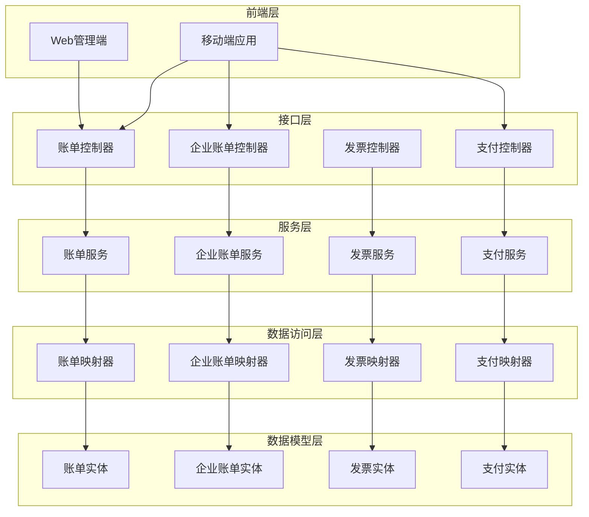

**图表来源**
- [HzBillController.java:25-107](file://ruoyi-admin/src/main/java/com/ruoyi/web/controller/system/HzBillController.java#L25-L107)
- [HzEnterpriseBillController.java:27-141](file://ruoyi-admin/src/main/java/com/ruoyi/web/controller/system/HzEnterpriseBillController.java#L27-L141)
- [HzInvoiceController.java:37-235](file://ruoyi-admin/src/main/java/com/ruoyi/web/controller/system/HzInvoiceController.java#L37-L235)

**章节来源**
- [HzBillController.java:1-107](file://ruoyi-admin/src/main/java/com/ruoyi/web/controller/system/HzBillController.java#L1-L107)
- [HzEnterpriseBillController.java:1-141](file://ruoyi-admin/src/main/java/com/ruoyi/web/controller/system/HzEnterpriseBillController.java#L1-L141)
- [HzInvoiceController.java:1-235](file://ruoyi-admin/src/main/java/com/ruoyi/web/controller/system/HzInvoiceController.java#L1-L235)

## 核心组件

### 账单管理组件

账单管理是整个财务系统的核心组件，负责处理各类账单的全生命周期管理。

**主要功能**：
- 账单生成和编号规则
- 账单状态管理和更新
- 账单查询和筛选
- 逾期账单自动检测
- 账单统计和分析
- **新增**：手动微信支付对账同步

**数据模型**：
- 账单类型：押金、租金、水费、电费、燃气费、物业费、其他
- 账单状态：待支付、已支付、部分支付、已逾期、已关闭
- 逾期处理：滞纳金计算、逾期天数统计
- **新增**：last_out_trade_no字段用于微信支付对账

### 支付管理组件

支付管理组件提供完整的支付流程处理能力。

**主要功能**：
- 支付记录创建和管理
- 支付状态跟踪
- 支付方式支持（支付宝、微信、银行转账、现金）
- 退款处理流程
- 支付凭证管理
- **新增**：微信支付对账同步机制

**数据模型**：
- 支付状态：待支付、支付中、支付成功、支付失败、已退款
- 支付方式：多种第三方支付平台集成
- 交易流水号生成
- **新增**：微信支付交易号管理

### 发票管理组件

发票管理组件处理发票申请、开具和管理的完整流程。

**主要功能**：
- 发票申请管理
- 发票开具和上传
- 发票状态跟踪
- 发票查询和统计
- 发票状态变更

**数据模型**：
- 发票类型：增值税普通发票、增值税专用发票
- 发票状态：已开具、已作废、已红冲
- 发票文件管理

### 企业财务组件

企业财务组件专门处理企业用户的批量账单管理。

**主要功能**：
- 企业账单批量生成
- 企业账单审批流程
- 企业支付处理
- 企业结算管理
- 企业人员名单管理

**章节来源**
- [IHzBillService.java:1-151](file://ruoyi-system/src/main/java/com/ruoyi/system/service/IHzBillService.java#L1-L151)
- [IHzPaymentService.java:1-89](file://ruoyi-system/src/main/java/com/ruoyi/system/service/IHzPaymentService.java#L1-L89)
- [IHzInvoiceService.java:1-62](file://ruoyi-system/src/main/java/com/ruoyi/system/service/IHzInvoiceService.java#L1-L62)
- [IHzEnterpriseBillService.java:1-142](file://ruoyi-system/src/main/java/com/ruoyi/system/service/IHzEnterpriseBillService.java#L1-L142)

## 架构概览

系统采用分层架构设计，确保各层职责清晰、耦合度低。

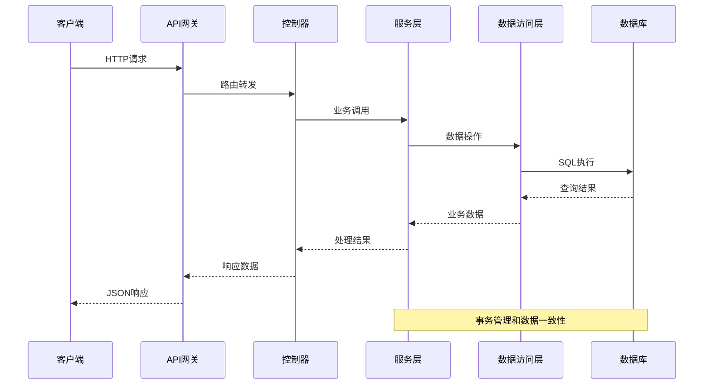

**图表来源**
- [HzBillController.java:35-67](file://ruoyi-admin/src/main/java/com/ruoyi/web/controller/system/HzBillController.java#L35-L67)
- [HzBillServiceImpl.java:35-38](file://ruoyi-system/src/main/java/com/ruoyi/system/service/impl/HzBillServiceImpl.java#L35-L38)

### 权限控制机制

系统实现了基于角色的权限控制（RBAC），确保接口访问的安全性。

**权限注解**：
- `@PreAuthorize("@ss.hasPermi('system:bill:list')")` - 列表查询权限
- `@PreAuthorize("@ss.hasPermi('system:bill:add')")` - 新增权限
- `@PreAuthorize("@ss.hasPermi('system:bill:edit')")` - 编辑权限
- `@PreAuthorize("@ss.hasPermi('system:bill:remove')")` - 删除权限
- `@PreAuthorize("@ss.hasPermi('gangzhu:bill:export')")` - 导出权限
- `@PreAuthorize("@ss.hasPermi('gangzhu:bill:edit')")` - 手动同步权限

**权限范围**：
- 管理员权限：完整CRUD操作，包括手动同步功能
- 普通用户：只读查询权限
- 企业用户：特定的企业账单操作权限

**章节来源**
- [HzBillController.java:35-105](file://ruoyi-admin/src/main/java/com/ruoyi/web/controller/system/HzBillController.java#L35-L105)
- [HzEnterpriseBillController.java:102-140](file://ruoyi-admin/src/main/java/com/ruoyi/web/controller/system/HzEnterpriseBillController.java#L102-L140)

## 详细组件分析

### 账单管理接口

#### 账单查询接口

账单查询接口提供了灵活的查询能力，支持多种筛选条件。

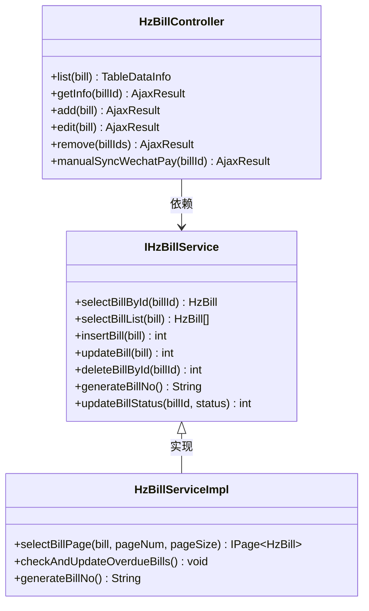

**图表来源**
- [HzBillController.java:35-105](file://ruoyi-admin/src/main/java/com/ruoyi/web/controller/system/HzBillController.java#L35-L105)
- [IHzBillService.java:14-151](file://ruoyi-system/src/main/java/com/ruoyi/system/service/IHzBillService.java#L14-L151)
- [HzBillServiceImpl.java:35-216](file://ruoyi-system/src/main/java/com/ruoyi/system/service/impl/HzBillServiceImpl.java#L35-L216)

**接口规范**：
- GET `/system/bill/list` - 查询账单列表
- GET `/system/bill/{billId}` - 获取账单详情
- POST `/system/bill` - 新增账单
- PUT `/system/bill` - 修改账单
- DELETE `/system/bill/{billIds}` - 删除账单
- **新增**：POST `/system/bill/manualSyncWechatPay/{billId}` - 手动同步微信支付对账

#### 账单状态管理

系统实现了完整的账单状态管理机制，包括自动状态更新和手动状态调整。

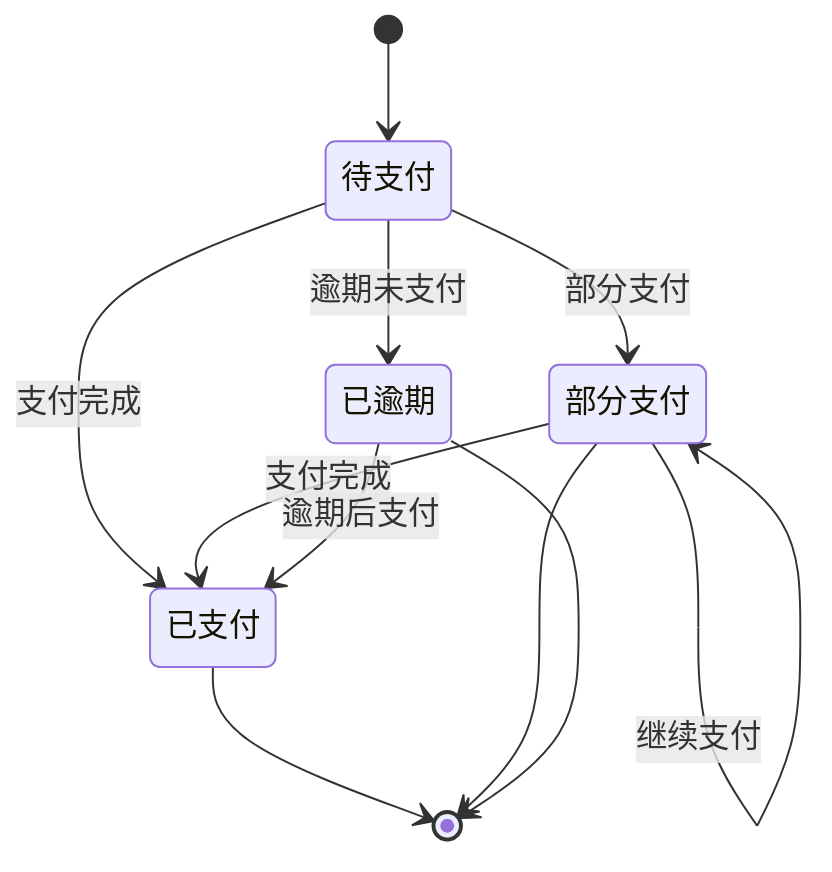

**图表来源**
- [HzBill.java:96-99](file://ruoyi-system/src/main/java/com/ruoyi/system/domain/HzBill.java#L96-L99)
- [HzBillServiceImpl.java:154-162](file://ruoyi-system/src/main/java/com/ruoyi/system/service/impl/HzBillServiceImpl.java#L154-L162)

#### 账单统计分析

系统提供了丰富的统计分析功能，支持多维度的数据统计。

**统计指标**：
- 按状态分类的账单数量统计
- 按账单类型的金额分布
- 逾期账单统计分析
- 收款进度统计

**章节来源**
- [HzBillController.java:35-57](file://ruoyi-admin/src/main/java/com/ruoyi/web/controller/system/HzBillController.java#L35-L57)
- [IHzBillService.java:56-104](file://ruoyi-system/src/main/java/com/ruoyi/system/service/IHzBillService.java#L56-L104)

### 支付管理接口

#### 支付流程处理

支付管理接口提供了完整的支付流程处理能力，支持多种支付方式。

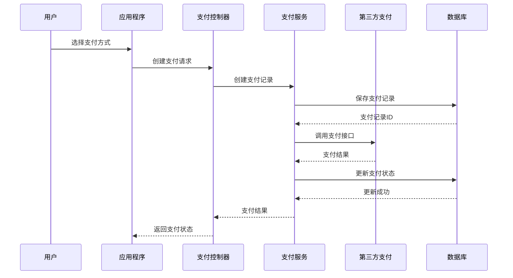

**图表来源**
- [HzPaymentController.java](file://ruoyi-admin/src/main/java/com/ruoyi/web/controller/h5/HzPaymentController.java)
- [IHzPaymentService.java:13-89](file://ruoyi-system/src/main/java/com/ruoyi/system/service/IHzPaymentService.java#L13-L89)

**接口规范**：
- GET `/h5/app/payment/list` - 查询支付记录列表
- GET `/h5/app/payment/{paymentId}` - 获取支付记录详情
- POST `/h5/app/payment` - 创建支付记录
- PUT `/h5/app/payment/status` - 更新支付状态

#### 支付状态跟踪

系统实现了实时的支付状态跟踪机制，确保支付状态的准确性。

**支付状态流转**：
- 待支付 → 支付中 → 支付成功
- 待支付 → 支付失败
- 支付成功 → 已退款

**章节来源**
- [HzPayment.java:42-44](file://ruoyi-system/src/main/java/com/ruoyi/system/domain/HzPayment.java#L42-L44)
- [HzPaymentServiceImpl.java:87-95](file://ruoyi-system/src/main/java/com/ruoyi/system/service/impl/HzPaymentServiceImpl.java#L87-L95)

### 发票管理接口

#### 发票申请流程

发票管理接口提供了完整的发票申请和开具流程。

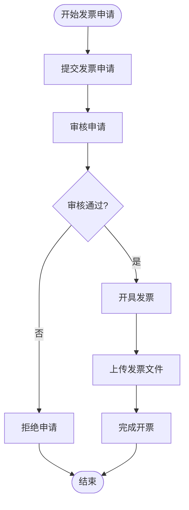

**图表来源**
- [HzInvoiceController.java:140-204](file://ruoyi-admin/src/main/java/com/ruoyi/web/controller/system/HzInvoiceController.java#L140-L204)

**接口规范**：
- GET `/gangzhu/invoice/list` - 查询发票申请列表
- GET `/gangzhu/invoice/{applyId}` - 获取发票申请详情
- POST `/gangzhu/invoice/complete` - 完成发票开具
- DELETE `/gangzhu/invoice/{applyIds}` - 删除发票申请

#### 发票状态管理

系统实现了发票状态的完整生命周期管理。

**发票状态**：
- 申请状态：待审核、审核通过、审核拒绝
- 发票状态：已开具、已作废、已红冲

**章节来源**
- [HzInvoice.java:65-67](file://ruoyi-system/src/main/java/com/ruoyi/system/domain/HzInvoice.java#L65-L67)
- [HzInvoiceController.java:140-204](file://ruoyi-admin/src/main/java/com/ruoyi/web/controller/system/HzInvoiceController.java#L140-L204)

### 企业财务接口

#### 企业账单管理

企业财务接口专门处理企业用户的批量账单管理需求。

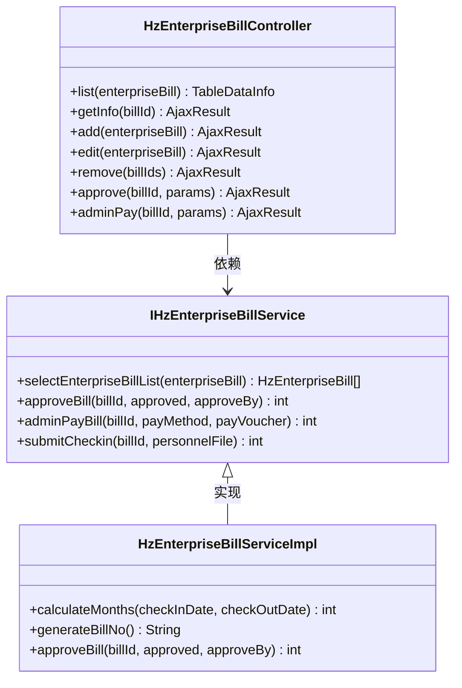

**图表来源**
- [HzEnterpriseBillController.java:27-141](file://ruoyi-admin/src/main/java/com/ruoyi/web/controller/system/HzEnterpriseBillController.java#L27-L141)
- [IHzEnterpriseBillService.java:16-142](file://ruoyi-system/src/main/java/com/ruoyi/system/service/IHzEnterpriseBillService.java#L16-L142)
- [HzEnterpriseBillServiceImpl.java:30-80](file://ruoyi-system/src/main/java/com/ruoyi/system/service/impl/HzEnterpriseBillServiceImpl.java#L30-L80)

**接口规范**：
- GET `/system/enterpriseBill/list` - 查询企业账单列表
- GET `/system/enterpriseBill/{billId}` - 获取企业账单详情
- POST `/system/enterpriseBill` - 新增企业账单
- PUT `/system/enterpriseBill` - 修改企业账单
- DELETE `/system/enterpriseBill/{billIds}` - 删除企业账单
- PUT `/system/enterpriseBill/approve/{billId}` - 审核企业账单
- POST `/system/enterpriseBill/pay/{billId}` - 管理端线下支付

#### 企业结算功能

系统提供了企业用户的批量结算和支付功能。

**结算流程**：
1. 企业用户发起结算申请
2. 管理员审核结算申请
3. 系统生成企业账单
4. 企业用户完成支付
5. 系统更新结算状态

**章节来源**
- [HzEnterpriseBill.java:95-131](file://ruoyi-system/src/main/java/com/ruoyi/system/domain/HzEnterpriseBill.java#L95-L131)
- [HzEnterpriseBillController.java:109-141](file://ruoyi-admin/src/main/java/com/ruoyi/web/controller/system/HzEnterpriseBillController.java#L109-L141)

### 财务统计分析接口

#### 统计报表功能

系统提供了丰富的财务统计分析功能，支持多种报表格式。

**统计维度**：
- 时间维度：日、周、月、季度、年
- 业务维度：账单类型、支付方式、发票类型
- 用户维度：租户、企业用户、地区

**报表类型**：
- 收支统计报表
- 逾期账单统计
- 支付方式分析
- 发票开具统计

**章节来源**
- [HzBillController.java:48-57](file://ruoyi-admin/src/main/java/com/ruoyi/web/controller/system/HzBillController.java#L48-L57)
- [HzInvoiceController.java:76-93](file://ruoyi-admin/src/main/java/com/ruoyi/web/controller/system/HzInvoiceController.java#L76-L93)

### 手动微信支付对账同步功能

**新增功能**：系统提供了管理员手动触发微信支付对账的功能，用于处理回调丢失或定时任务未及时补回的情况。

#### 功能概述

当微信支付后台显示账单已支付，但本地系统仍为未支付状态时，管理员可以通过手动同步功能进行对账补单。

**使用场景**：
- 微信支付回调丢失
- 定时任务未及时补回
- 支付状态不一致

#### 查询优先级机制

系统采用智能的查询优先级机制，确保准确找到正确的支付记录：

1. **优先使用**：`last_out_trade_no`（实际下到微信的out_trade_no，可能带-R-后缀）
2. **备选方案**：`bill_no`（老账单兼容）

#### 对账流程

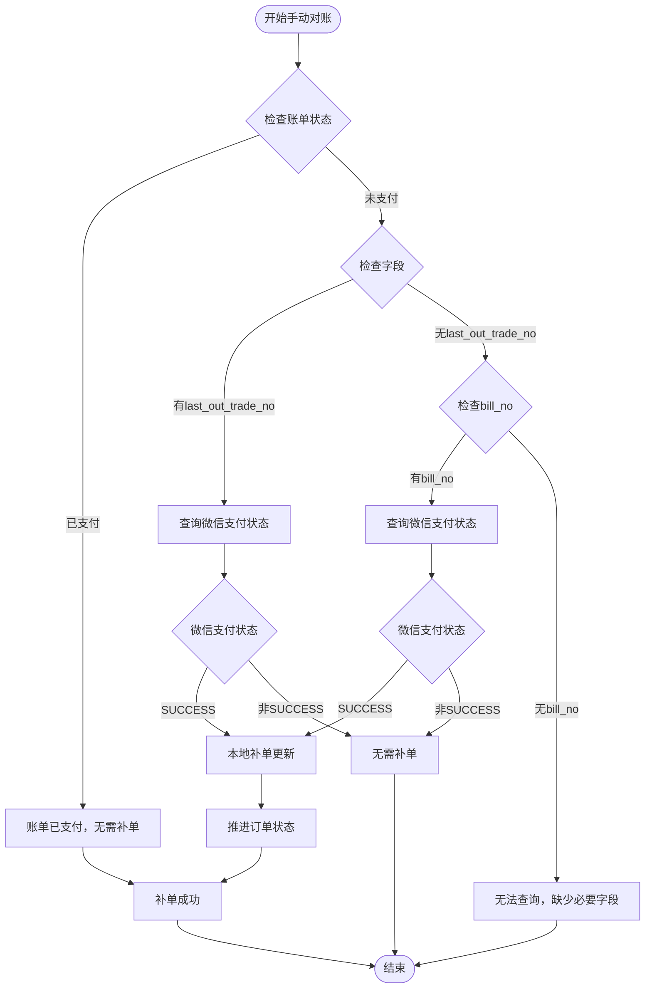

**图表来源**
- [HzBillController.java:123-207](file://ruoyi-admin/src/main/java/com/ruoyi/web/controller/system/HzBillController.java#L123-L207)

#### 对账同步接口

**接口规范**：
- POST `/system/bill/manualSyncWechatPay/{billId}` - 手动同步微信支付对账

**请求参数**：
- `billId`：账单ID（路径参数）

**响应数据**：
- `queriedOutTradeNo`：实际查询使用的out_trade_no
- `tradeState`：微信支付状态
- `transactionId`：微信交易号
- `paid`：是否已支付
- `billStatus`：更新后的账单状态
- `message`：操作结果描述

**业务逻辑**：
1. 验证账单存在性和有效性
2. 检查账单是否已支付
3. 选择查询优先级的out_trade_no
4. 调用微信支付查询接口
5. 根据查询结果决定是否补单
6. 更新账单状态和支付信息
7. 推进相关订单状态

**异常处理**：
- 账单不存在：返回错误信息
- 账单已支付：返回已支付状态
- 查询失败：记录错误日志并返回失败信息
- 补单成功：记录成功日志并返回成功信息

**章节来源**
- [HzBillController.java:123-207](file://ruoyi-admin/src/main/java/com/ruoyi/web/controller/system/HzBillController.java#L123-L207)
- [WechatPayService.java:25-28](file://ruoyi-system/src/main/java/com/ruoyi/system/service/WechatPayService.java#L25-L28)
- [HzBill.java:132-139](file://ruoyi-system/src/main/java/com/ruoyi/system/domain/HzBill.java#L132-L139)

## 依赖关系分析

系统采用了清晰的依赖层次结构，确保模块间的松耦合。

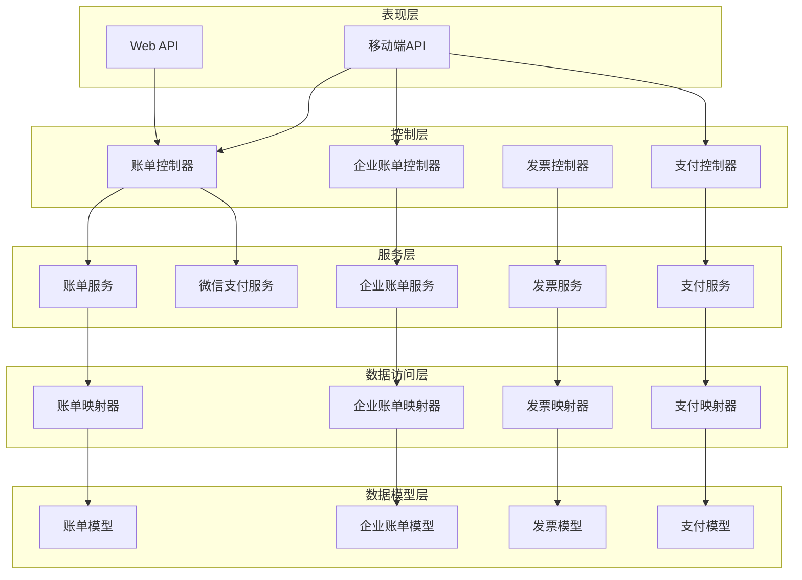

**图表来源**
- [HzBillController.java:25-107](file://ruoyi-admin/src/main/java/com/ruoyi/web/controller/system/HzBillController.java#L25-L107)
- [IHzBillService.java:14-151](file://ruoyi-system/src/main/java/com/ruoyi/system/service/IHzBillService.java#L14-L151)

### 数据模型关系

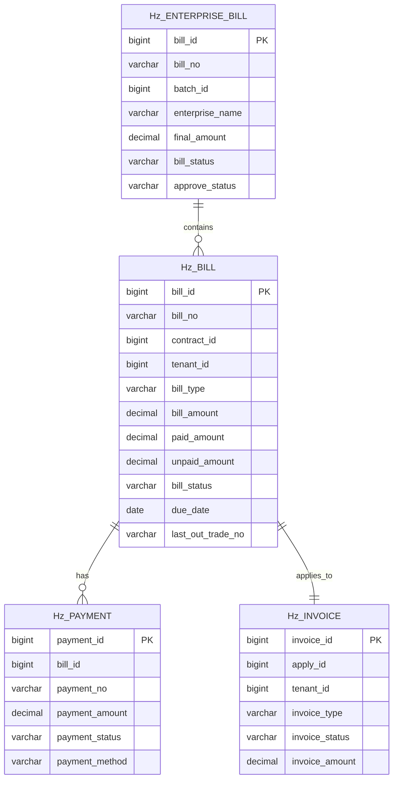

**图表来源**
- [HzBill.java:20-354](file://ruoyi-system/src/main/java/com/ruoyi/system/domain/HzBill.java#L20-L354)
- [HzEnterpriseBill.java:20-378](file://ruoyi-system/src/main/java/com/ruoyi/system/domain/HzEnterpriseBill.java#L20-L378)
- [HzInvoice.java:16-223](file://ruoyi-system/src/main/java/com/ruoyi/system/domain/HzInvoice.java#L16-L223)
- [HzPayment.java:18-202](file://ruoyi-system/src/main/java/com/ruoyi/system/domain/HzPayment.java#L18-L202)

**章节来源**
- [HzBill.java:1-354](file://ruoyi-system/src/main/java/com/ruoyi/system/domain/HzBill.java#L1-L354)
- [HzEnterpriseBill.java:1-378](file://ruoyi-system/src/main/java/com/ruoyi/system/domain/HzEnterpriseBill.java#L1-L378)
- [HzInvoice.java:1-223](file://ruoyi-system/src/main/java/com/ruoyi/system/domain/HzInvoice.java#L1-L223)
- [HzPayment.java:1-202](file://ruoyi-system/src/main/java/com/ruoyi/system/domain/HzPayment.java#L1-L202)

## 性能考虑

### 查询优化

系统在查询性能方面采用了多项优化策略：

1. **索引优化**：对常用查询字段建立数据库索引
2. **分页查询**：大数据量场景下强制使用分页查询
3. **缓存策略**：对热点数据进行缓存处理
4. **批量操作**：支持批量删除和批量更新操作
5. ****新增**：微信支付查询优化，优先使用last_out_trade_no字段

### 并发控制

系统实现了完善的并发控制机制：

1. **乐观锁**：使用版本号防止并发更新冲突
2. **事务管理**：确保数据一致性
3. **接口限流**：防止接口被恶意刷量
4. **幂等性设计**：确保重复请求的安全性
5. ****新增**：手动对账的幂等性处理

### 缓存策略

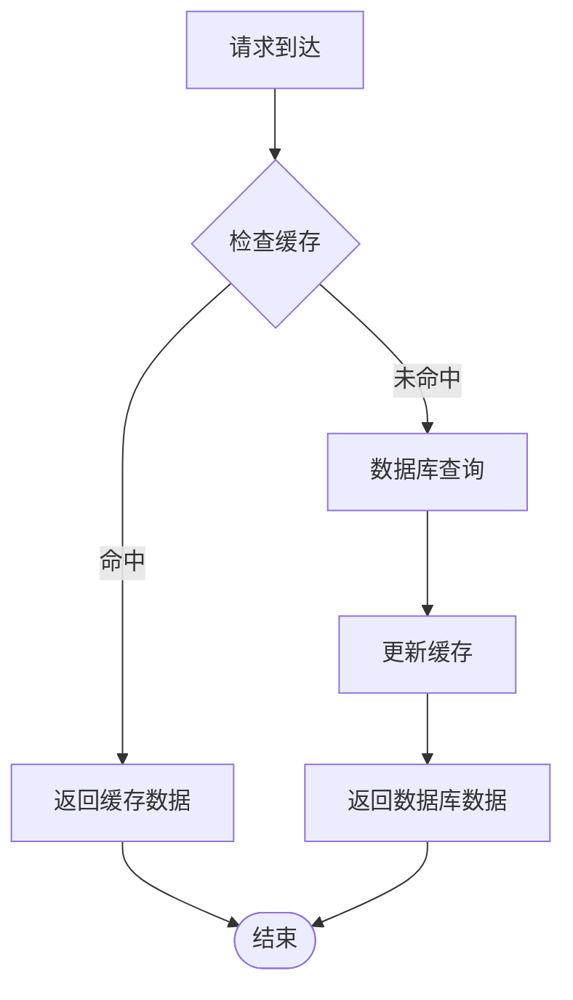

## 故障排除指南

### 常见问题诊断

**账单状态异常**：
- 检查逾期检测定时任务是否正常运行
- 验证账单状态更新逻辑
- 确认滞纳金计算规则
- **新增**：使用手动对账功能进行状态修复

**支付失败排查**：
- 检查第三方支付接口连接
- 验证支付回调处理逻辑
- 确认支付状态同步机制
- **新增**：通过手动对账功能验证微信支付状态

**发票开具问题**：
- 验证发票文件格式
- 检查发票状态流转
- 确认账单开票状态更新

**微信支付对账问题**：
- **新增**：检查last_out_trade_no字段是否正确
- 验证微信支付查询接口可用性
- 确认手动对账权限配置
- 查看对账日志和错误信息

### 日志监控

系统提供了完整的日志监控机制：

1. **操作日志**：记录所有重要操作
2. **异常日志**：捕获系统异常信息
3. **性能日志**：监控接口响应时间
4. **审计日志**：记录数据变更历史
5. ****新增**：手动对账操作日志记录

### 错误码定义

| 错误码 | 含义 | 处理建议 |
|--------|------|----------|
| 200 | 成功 | 正常响应 |
| 400 | 参数错误 | 检查请求参数 |
| 401 | 未授权 | 检查权限认证 |
| 403 | 禁止访问 | 检查用户权限 |
| 500 | 服务器错误 | 查看服务器日志 |
| **新增** | **手动对账错误** | **检查微信支付配置和账单状态** |

**章节来源**
- [HzBillController.java:35-105](file://ruoyi-admin/src/main/java/com/ruoyi/web/controller/system/HzBillController.java#L35-L105)
- [HzInvoiceController.java:140-204](file://ruoyi-admin/src/main/java/com/ruoyi/web/controller/system/HzInvoiceController.java#L140-L204)

## 结论

本财务管理系统提供了完整的财务管理解决方案，具有以下特点：

1. **功能完整性**：覆盖了财务管理的所有核心环节
2. **架构合理性**：采用分层架构，职责清晰
3. **扩展性强**：模块化设计便于功能扩展
4. **安全性高**：完善的权限控制和数据保护机制
5. **性能优良**：优化的查询和缓存策略
6. ****新增**：强大的异常处理和对账能力，确保财务数据准确性**

系统适用于各种规模的物业管理场景，能够有效提升财务管理效率和准确性。通过标准化的接口设计和完善的业务流程，为企业用户提供了一站式的财务管理服务。

**新增功能的价值**：
- **提高数据准确性**：通过手动对账功能及时发现和纠正支付状态不一致问题
- **增强系统可靠性**：减少因回调丢失导致的财务数据差异
- **提升用户体验**：管理员可以快速处理支付异常情况
- **降低运营风险**：完善的对账机制确保财务数据的完整性和准确性