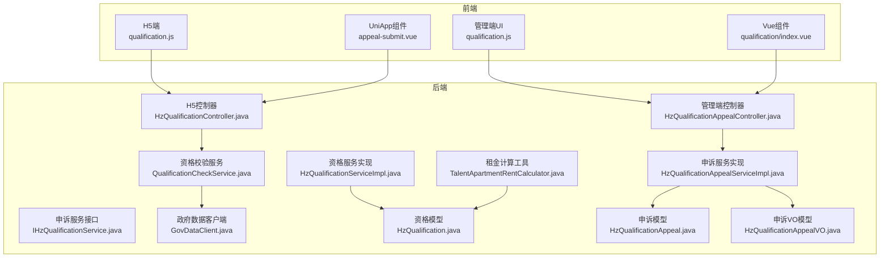
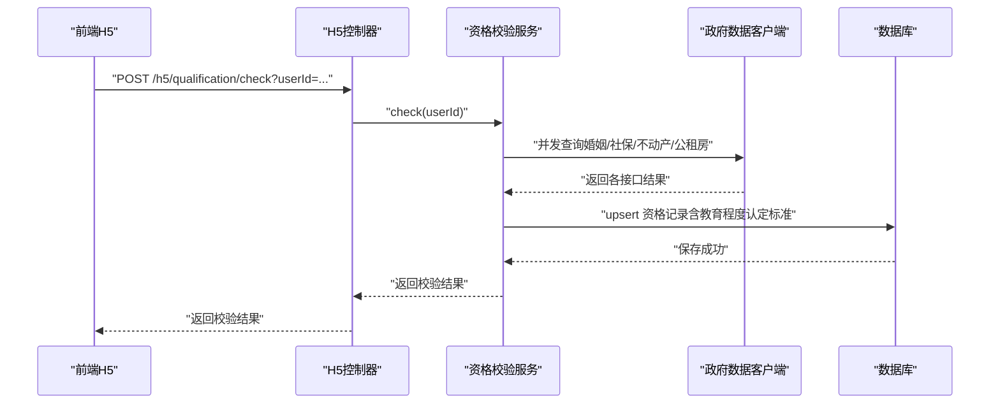
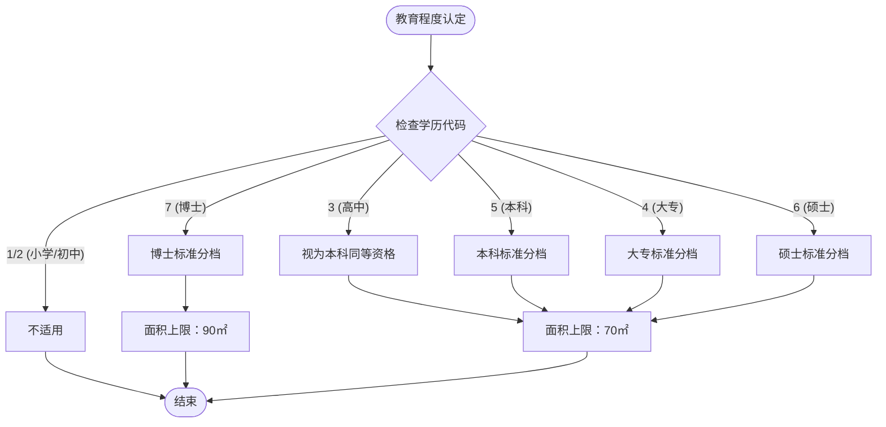
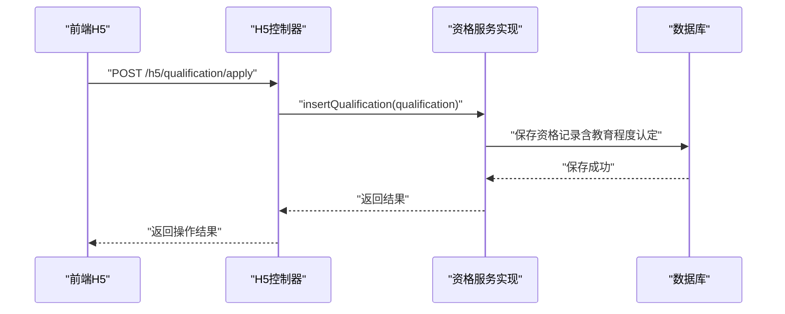
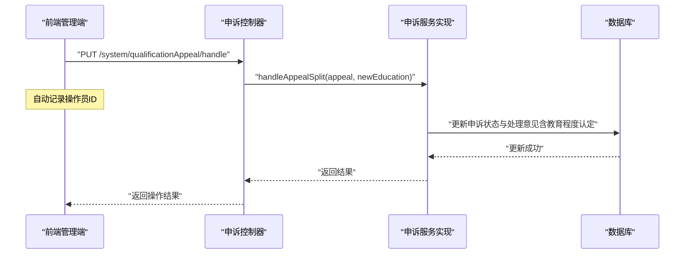
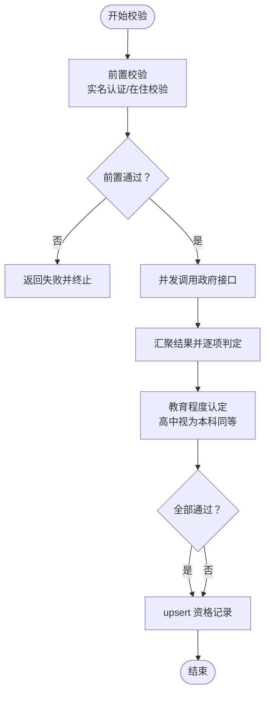
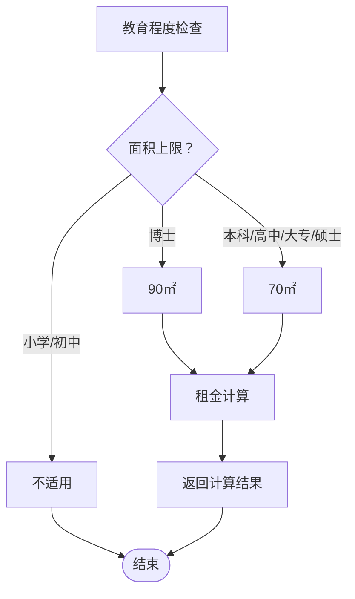
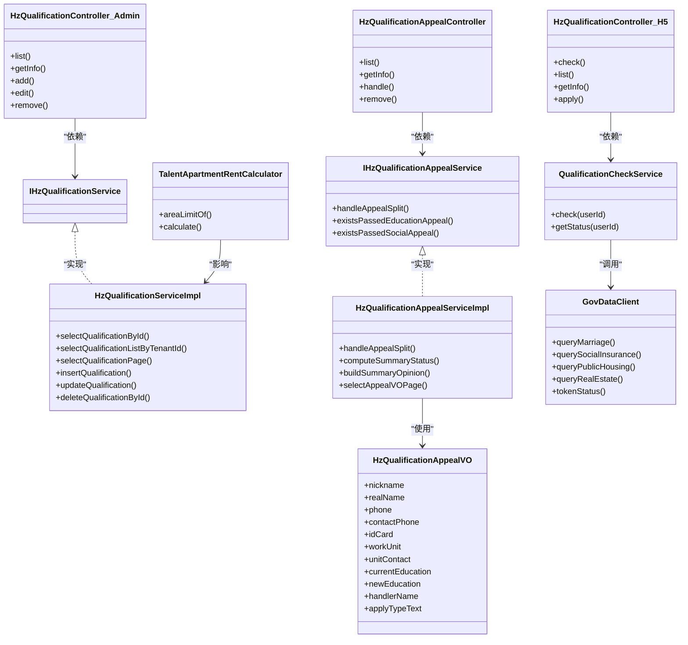

# 资格管理系统接口

<cite>
**本文档引用的文件**
- [HzQualificationController.java](file://ruoyi-admin/src/main/java/com/ruoyi/web/controller/system/HzQualificationController.java)
- [HzQualificationController.java](file://ruoyi-admin/src/main/java/com/ruoyi/web/controller/h5/HzQualificationController.java)
- [HzQualificationAppealController.java](file://ruoyi-admin/src/main/java/com/ruoyi/web/controller/system/HzQualificationAppealController.java)
- [HzQualificationServiceImpl.java](file://ruoyi-system/src/main/java/com/ruoyi/system/service/impl/HzQualificationServiceImpl.java)
- [IHzQualificationService.java](file://ruoyi-system/src/main/java/com/ruoyi/system/service/IHzQualificationService.java)
- [IHzQualificationAppealService.java](file://ruoyi-system/src/main/java/com/ruoyi/system/service/IHzQualificationAppealService.java)
- [HzQualification.java](file://ruoyi-system/src/main/java/com/ruoyi/system/domain/HzQualification.java)
- [HzQualificationAppeal.java](file://ruoyi-system/src/main/java/com/ruoyi/system/domain/HzQualificationAppeal.java)
- [HzQualificationAppealServiceImpl.java](file://ruoyi-system/src/main/java/com/ruoyi/system/service/impl/HzQualificationAppealServiceImpl.java)
- [HzQualificationAppealVO.java](file://ruoyi-system/src/main/java/com/ruoyi/system/domain/HzQualificationAppealVO.java)
- [QualificationCheckService.java](file://ruoyi-system/src/main/java/com/ruoyi/system/gov/service/QualificationCheckService.java)
- [GovDataClient.java](file://ruoyi-system/src/main/java/com/ruoyi/system/gov/client/GovDataClient.java)
- [QualificationCheckResult.java](file://ruoyi-system/src/main/java/com/ruoyi/system/gov/dto/QualificationCheckResult.java)
- [GovDataConfig.java](file://ruoyi-system/src/main/java/com/ruoyi/system/gov/config/GovDataConfig.java)
- [TalentApartmentRentCalculator.java](file://ruoyi-system/src/main/java/com/ruoyi/system/util/TalentApartmentRentCalculator.java)
- [qualification.js](file://ruoyi-ui/src/api/gangzhu/qualification.js)
- [appeal.js](file://ruoyi-ui/src/api/gangzhu/appeal.js)
- [qualification.js](file://uniapp-h5/api/qualification.js)
- [appeal.js](file://uniapp-h5/api/appeal.js)
- [qualification/index.vue](file://ruoyi-ui/src/views/gangzhu/qualification/index.vue)
- [appeal-submit.vue](file://uniapp-h5/subpkg/affairs/appeal-submit.vue)
- [migrate_data.py](file://migrate_data.py)
</cite>

## 更新摘要
**所做更改**
- 新增了教育程度认定标准调整章节，详细说明高中毕业生被视为具备本科同等资格的政策变化
- 更新了资格申诉管理接口章节，反映新的教育程度认定标准对申诉审核流程的影响
- 完善了资格校验与政府数据对接章节，说明新标准下的校验逻辑调整
- 新增了教育程度认定标准对租金计算的影响说明
- 更新了前端界面章节，包含新的教育程度选项和审核流程

## 目录
1. [简介](#简介)
2. [项目结构](#项目结构)
3. [核心组件](#核心组件)
4. [架构总览](#架构总览)
5. [详细组件分析](#详细组件分析)
6. [依赖关系分析](#依赖关系分析)
7. [性能考虑](#性能考虑)
8. [故障排除指南](#故障排除指南)
9. [结论](#结论)
10. [附录](#附录)

## 简介
本文件面向资格管理系统接口的使用者与维护者，系统性梳理资格管理、资格申诉、资格校验与政府数据对接、统计与报表、批量操作等能力。文档涵盖接口定义、数据模型、业务流程、错误处理与性能优化建议，帮助读者快速理解并正确使用系统。

**更新** 本版本新增了教育程度认定标准的重要调整：高中毕业生现在被视为具备本科同等资格，这一变化影响了资格审核流程和标准认定。系统已相应更新了教育程度认定逻辑、申诉审核流程、租金计算规则以及前端界面选项，确保符合最新的政策要求。

## 项目结构
系统采用前后端分离架构，主要涉及以下模块：
- 管理端控制器与前端API封装：提供资格审核与申诉的管理端接口及前端调用封装
- 资质校验服务与政府代理：负责并发调用政府数据接口进行资格校验
- 数据模型与服务实现：承载资格与申诉的数据结构与业务逻辑
- 前端H5与管理端UI：分别提供移动端校验流程与管理端审核界面
- 意见预设系统：为教育和社保审核提供预设的审核意见模板
- 租金计算工具：根据教育程度计算人才公寓面积上限和租金

**图表来源**
- [HzQualificationController.java:1-37](file://ruoyi-admin/src/main/java/com/ruoyi/web/controller/h5/HzQualificationController.java#L1-L37)
- [HzQualificationAppealController.java:1-23](file://ruoyi-admin/src/main/java/com/ruoyi/web/controller/system/HzQualificationAppealController.java#L1-L23)
- [HzQualificationServiceImpl.java:1-22](file://ruoyi-system/src/main/java/com/ruoyi/system/service/impl/HzQualificationServiceImpl.java#L1-L22)
- [HzQualificationAppealServiceImpl.java:1-29](file://ruoyi-system/src/main/java/com/ruoyi/system/service/impl/HzQualificationAppealServiceImpl.java#L1-L29)
- [QualificationCheckService.java:1-46](file://ruoyi-system/src/main/java/com/ruoyi/system/gov/service/QualificationCheckService.java#L1-L46)
- [TalentApartmentRentCalculator.java:1-183](file://ruoyi-system/src/main/java/com/ruoyi/system/util/TalentApartmentRentCalculator.java#L1-L183)

**章节来源**
- [HzQualificationController.java:1-37](file://ruoyi-admin/src/main/java/com/ruoyi/web/controller/h5/HzQualificationController.java#L1-L37)
- [HzQualificationAppealController.java:1-23](file://ruoyi-admin/src/main/java/com/ruoyi/web/controller/system/HzQualificationAppealController.java#L1-L23)

## 核心组件
- 资格模型：承载资格申请、自动/人工审核、最终结果、状态与政府数据校验扩展字段
- 申诉模型：承载申诉原因、材料、审核状态与处理意见，支持教育和社保双独立审核
- 申诉VO模型：扩展用户信息字段，支持模糊搜索和详细展示
- 资格服务：提供分页查询、新增、修改、删除与按租户查询
- 申诉服务：提供申诉VO分页、详情、审核（双材料独立审核）、存在性判断
- 资格校验服务：并发调用政府数据接口，构建校验结果并落库
- 政府数据客户端：封装代理服务调用，统一响应格式与超时配置
- 意见预设系统：为教育和社保审核提供预设的审核意见模板，支持快速填充
- 租金计算工具：根据教育程度计算人才公寓面积上限和租金，支持高中毕业生按本科标准分档

**章节来源**
- [HzQualification.java:11-157](file://ruoyi-system/src/main/java/com/ruoyi/system/domain/HzQualification.java#L11-L157)
- [HzQualificationAppeal.java:11-286](file://ruoyi-system/src/main/java/com/ruoyi/system/domain/HzQualificationAppeal.java#L11-L286)
- [HzQualificationAppealVO.java:8-131](file://ruoyi-system/src/main/java/com/ruoyi/system/domain/HzQualificationAppealVO.java#L8-L131)
- [HzQualificationServiceImpl.java:24-91](file://ruoyi-system/src/main/java/com/ruoyi/system/service/impl/HzQualificationServiceImpl.java#L24-L91)
- [IHzQualificationAppealService.java:14-118](file://ruoyi-system/src/main/java/com/ruoyi/system/service/IHzQualificationAppealService.java#L14-L118)
- [HzQualificationAppealServiceImpl.java:120-202](file://ruoyi-system/src/main/java/com/ruoyi/system/service/impl/HzQualificationAppealServiceImpl.java#L120-L202)
- [TalentApartmentRentCalculator.java:29-48](file://ruoyi-system/src/main/java/com/ruoyi/system/util/TalentApartmentRentCalculator.java#L29-L48)

## 架构总览
系统通过H5控制器与管理端控制器分别暴露REST接口，前端通过API封装调用；资格校验服务通过政府数据客户端并发调用代理服务，最终将校验结果落库并返回给前端。申诉审核流程支持双独立审核和意见预设功能。新的教育程度认定标准已集成到整个系统架构中，影响资格审核、申诉处理和租金计算等各个环节。

**图表来源**
- [HzQualificationController.java:130-146](file://ruoyi-admin/src/main/java/com/ruoyi/web/controller/h5/HzQualificationController.java#L130-L146)
- [QualificationCheckService.java:154-279](file://ruoyi-system/src/main/java/com/ruoyi/system/gov/service/QualificationCheckService.java#L154-L279)

## 详细组件分析

### 教育程度认定标准调整

**更新** 系统已实施重要的教育程度认定标准调整：高中毕业生现在被视为具备本科同等资格。这一变化已在多个系统组件中得到体现。

#### 新的教育程度认定逻辑
根据最新的政策要求，系统对教育程度认定标准进行了如下调整：

- **高中毕业生认定**：高中（代码"3"）现在被视为具备本科同等资格
- **面积上限标准**：高中毕业生按照70㎡的本科标准分档
- **学历分类映射**：
  - 博士：90㎡
  - 本科、高中、大专、硕士：70㎡
  - 小学、初中：不适用

**图表来源**
- [TalentApartmentRentCalculator.java:35-48](file://ruoyi-system/src/main/java/com/ruoyi/system/util/TalentApartmentRentCalculator.java#L35-L48)

**章节来源**
- [TalentApartmentRentCalculator.java:35-48](file://ruoyi-system/src/main/java/com/ruoyi/system/util/TalentApartmentRentCalculator.java#L35-L48)

### 资格管理接口
- 管理端接口
  - 列表查询：GET /system/qualification/list（分页，支持按租户、申请类型、最终结果、状态过滤）
  - 详情查询：GET /system/qualification/{qualificationId}
  - 新增：POST /system/qualification（默认状态为"待审核"，自动/人工结果初始为"未通过"）
  - 修改：PUT /system/qualification
  - 删除：DELETE /system/qualification/{qualificationIds}
- H5端接口
  - 触发校验：POST /h5/qualification/check（同步，返回校验结果）
  - 查询状态：GET /h5/qualification/status（返回是否已校验、是否通过、各项明细与失败原因）
  - 申请列表：GET /h5/qualification/list（按租户查询资格申请列表）
  - 申请详情：GET /h5/qualification/{qualificationId}
  - 提交申请：POST /h5/qualification/apply（校验是否已存在待审核申请）

**图表来源**
- [HzQualificationController.java:173-195](file://ruoyi-admin/src/main/java/com/ruoyi/web/controller/h5/HzQualificationController.java#L173-L195)
- [HzQualificationServiceImpl.java:75-80](file://ruoyi-system/src/main/java/com/ruoyi/system/service/impl/HzQualificationServiceImpl.java#L75-L80)

**章节来源**
- [HzQualificationController.java:27-109](file://ruoyi-admin/src/main/java/com/ruoyi/web/controller/system/HzQualificationController.java#L27-L109)
- [HzQualificationController.java:130-171](file://ruoyi-admin/src/main/java/com/ruoyi/web/controller/h5/HzQualificationController.java#L130-L171)
- [HzQualificationServiceImpl.java:24-91](file://ruoyi-system/src/main/java/com/ruoyi/system/service/impl/HzQualificationServiceImpl.java#L24-L91)
- [qualification.js:1-44](file://ruoyi-ui/src/api/gangzhu/qualification.js#L1-L44)
- [qualification.js:1-36](file://uniapp-h5/api/qualification.js#L1-L36)

### 资格申诉管理接口

**更新** 新增了多项重大功能增强：'done'状态过滤逻辑、自动处理操作员记录、详细的审计跟踪字段、前端界面重大改进，以及教育程度认定标准调整的影响

#### 'done'状态过滤逻辑
系统新增了'done'状态过滤逻辑，支持同时查询已批准和已拒绝的申诉：
- 当查询参数handleResult为'done'时，系统会同时查询handle_result为'1'（已通过）和'2'（已拒绝）的记录
- 其他值按精确匹配方式查询
- 支持与用户昵称、手机号等条件组合查询

**章节来源**
- [HzQualificationAppealServiceImpl.java:68-75](file://ruoyi-system/src/main/java/com/ruoyi/system/service/impl/HzQualificationAppealServiceImpl.java#L68-L75)
- [HzQualificationAppealController.java:31-46](file://ruoyi-admin/src/main/java/com/ruoyi/web/controller/system/HzQualificationAppealController.java#L31-L46)

#### 自动处理操作员记录功能
系统实现了自动处理操作员记录功能，记录当前登录管理员ID：
- 审核完成后自动记录处理人ID（handleBy字段）
- 通过SecurityUtils.getUserId()获取当前登录用户ID
- 支持非Web上下文调用的异常处理
- 详情页通过LEFT JOIN sys_user显示处理人昵称

**章节来源**
- [HzQualificationAppealServiceImpl.java:171-179](file://ruoyi-system/src/main/java/com/ruoyi/system/service/impl/HzQualificationAppealServiceImpl.java#L171-L179)
- [qualification/index.vue:84-89](file://ruoyi-ui/src/views/gangzhu/qualification/index.vue#L84-L89)

#### 详细的审计跟踪字段
系统提供了详细的审计跟踪字段，包含教育和社保审核状态与意见：
- 教育审核状态：educationAuditStatus（0:待审核 1:通过 2:驳回 NULL:未提交）
- 教育审核意见：educationAuditOpinion
- 社保审核状态：socialAuditStatus（0:待审核 1:通过 2:驳回 NULL:未提交）
- 社保审核意见：socialAuditOpinion
- 处理时间：handleTime
- 处理人：handleBy（关联sys_user表显示昵称）

**章节来源**
- [HzQualificationAppeal.java:64-86](file://ruoyi-system/src/main/java/com/ruoyi/system/domain/HzQualificationAppeal.java#L64-L86)
- [HzQualificationAppealServiceImpl.java:165-179](file://ruoyi-system/src/main/java/com/ruoyi/system/service/impl/HzQualificationAppealServiceImpl.java#L165-L179)

#### 前端界面重大改进
前端界面进行了多项重大改进：
- 简化处理状态选择：新增"已处理"选项，值为'done'，可同时查询已通过和已拒绝记录
- 增强审计意见显示：支持学历和社保审核状态的详细展示
- 自动操作员记录：审核完成后自动显示处理人信息
- 意见预设功能：支持教育和社保审核的预设意见模板
- **教育程度选项更新**：前端UniApp组件中移除了"高中及以下"选项，新增"高中"选项作为独立的学历类别

**图表来源**
- [HzQualificationAppealController.java:57-76](file://ruoyi-admin/src/main/java/com/ruoyi/web/controller/system/HzQualificationAppealController.java#L57-L76)
- [HzQualificationAppealServiceImpl.java:171-179](file://ruoyi-system/src/main/java/com/ruoyi/system/service/impl/HzQualificationAppealServiceImpl.java#L171-L179)
- [qualification/index.vue:576-583](file://ruoyi-ui/src/views/gangzhu/qualification/index.vue#L576-L583)

**章节来源**
- [HzQualificationAppealController.java:28-90](file://ruoyi-admin/src/main/java/com/ruoyi/web/controller/system/HzQualificationAppealController.java#L28-L90)
- [HzQualificationAppealServiceImpl.java:120-202](file://ruoyi-system/src/main/java/com/ruoyi/system/service/impl/HzQualificationAppealServiceImpl.java#L120-L202)
- [qualification/index.vue:20-25](file://ruoyi-ui/src/views/gangzhu/qualification/index.vue#L20-L25)
- [qualification/index.vue:576-583](file://ruoyi-ui/src/views/gangzhu/qualification/index.vue#L576-L583)
- [appeal-submit.vue:161-166](file://uniapp-h5/subpkg/affairs/appeal-submit.vue#L161-L166)

#### 用户学历回写功能
当学历审核通过时，系统会自动回写用户学历信息：
- 学历审核状态为'1'且newEducation不为空时触发
- 通过userMapper.updateById()更新hz_user表的education字段
- 用于后续资格校验时的豁免处理
- **教育程度认定影响**：高中毕业生审核通过后，系统将其学历回写为"本科"（代码"5"），享受相应的资格待遇

**章节来源**
- [HzQualificationAppealServiceImpl.java:190-199](file://ruoyi-system/src/main/java/com/ruoyi/system/service/impl/HzQualificationAppealServiceImpl.java#L190-L199)

#### 社会安全审核意见预设文本改进
**更新** 系统对社会安全审核意见预设文本进行了重要改进，从原有的描述性反馈升级为更直接、可操作的指导性文本：

- **改进目标**：帮助用户理解审核不通过的原因并采取相应行动
- **预设文本优化**：
  - 学历审核预设文本：国内学历、国外学历、博士、高层次人才等具体类别
  - 社保审核预设文本：提供具体的补救措施指导，如"请上传个人社保参保明细，或提供您为在港就业创业相关证明资料"
- **交互体验提升**：
  - 支持一键快速填入预设文本
  - 文本覆盖式填充，用户可在此基础上进一步编辑
  - 清晰的标签样式和悬停效果，提升用户体验

**章节来源**
- [qualification/index.vue:378-389](file://ruoyi-ui/src/views/gangzhu/qualification/index.vue#L378-L389)
- [qualification/index.vue:202-214](file://ruoyi-ui/src/views/gangzhu/qualification/index.vue#L202-L214)
- [qualification/index.vue:247-259](file://ruoyi-ui/src/views/gangzhu/qualification/index.vue#L247-L259)
- [qualification/index.vue:576-583](file://ruoyi-ui/src/views/gangzhu/qualification/index.vue#L576-L583)

### 资格校验与政府数据对接
- 并发策略：首轮并发婚姻、社保、本人不动产、本人公租房；已婚情况下再并发配偶不动产与配偶公租房
- 校验规则：社保（近3个月连续、港区单位、与用户填写单位一致）、本人/配偶不动产（航空港区无房产）、本人/配偶公租房（无享受记录）、婚姻信息（展示用，不判定）
- 结果落库：将校验结果upsert至资格表，记录最后校验时间与各项指标
- 代理服务：统一响应格式{"code":200,"message":"success","data":{...}}，通过X-Api-Key认证
- **教育程度认定集成**：在校验过程中，系统会检查用户的学历信息，高中毕业生将被视为具备本科同等资格，影响后续的资格认定和优惠政策享受

**图表来源**
- [QualificationCheckService.java:154-279](file://ruoyi-system/src/main/java/com/ruoyi/system/gov/service/QualificationCheckService.java#L154-L279)
- [QualificationCheckService.java:283-366](file://ruoyi-system/src/main/java/com/ruoyi/system/gov/service/QualificationCheckService.java#L283-L366)

**章节来源**
- [QualificationCheckService.java:45-98](file://ruoyi-system/src/main/java/com/ruoyi/system/gov/service/QualificationCheckService.java#L45-L98)
- [GovDataClient.java:118-200](file://ruoyi-system/src/main/java/com/ruoyi/system/gov/client/GovDataClient.java#L118-L200)
- [QualificationCheckResult.java:42-73](file://ruoyi-system/src/main/java/com/ruoyi/system/gov/dto/QualificationCheckResult.java#L42-L73)
- [GovDataConfig.java:11-35](file://ruoyi-system/src/main/java/com/ruoyi/system/gov/config/GovDataConfig.java#L11-L35)

### 租金计算与教育程度认定

**更新** 新的教育程度认定标准对租金计算产生了直接影响，系统已相应调整了租金计算逻辑。

#### 人才公寓租金计算规则
根据新的教育程度认定标准，系统对人才公寓的租金计算进行了如下调整：

- **面积上限标准**：
  - 博士：90㎡
  - 本科、高中、大专、硕士：70㎡
  - 小学、初中：不适用
- **计算逻辑**：超出面积上限部分按标准价计算，未超出部分按7折优惠价计算
- **优惠政策**：高中毕业生享受与本科生同等的面积上限和优惠政策

**图表来源**
- [TalentApartmentRentCalculator.java:35-48](file://ruoyi-system/src/main/java/com/ruoyi/system/util/TalentApartmentRentCalculator.java#L35-L48)
- [TalentApartmentRentCalculator.java:59-117](file://ruoyi-system/src/main/java/com/ruoyi/system/util/TalentApartmentRentCalculator.java#L59-L117)

**章节来源**
- [TalentApartmentRentCalculator.java:29-48](file://ruoyi-system/src/main/java/com/ruoyi/system/util/TalentApartmentRentCalculator.java#L29-L48)
- [TalentApartmentRentCalculator.java:59-117](file://ruoyi-system/src/main/java/com/ruoyi/system/util/TalentApartmentRentCalculator.java#L59-L117)

### 统计分析与批量操作
- 统计分析：系统提供申诉VO分页查询接口，便于管理端统计与报表生成
- 批量操作：管理端支持批量删除资格与申诉记录
- 数据导入：提供Python脚本导入历史资格数据至hz_qualification表
- **教育程度统计**：系统支持按新的教育程度分类进行统计分析，包括高中毕业生的占比和优惠政策享受情况

**章节来源**
- [HzQualificationAppealController.java:31-46](file://ruoyi-admin/src/main/java/com/ruoyi/web/controller/system/HzQualificationAppealController.java#L31-L46)
- [HzQualificationController.java:99-109](file://ruoyi-admin/src/main/java/com/ruoyi/web/controller/system/HzQualificationController.java#L99-L109)
- [migrate_data.py:876-928](file://migrate_data.py#L876-L928)

## 依赖关系分析
- 控制器依赖服务接口，服务实现依赖MyBatis Plus进行数据持久化
- 资格校验服务依赖政府数据客户端与用户/合同/项目等服务
- 前端通过API封装调用后端控制器，H5端与管理端分别使用不同的API文件
- 申诉服务实现依赖用户Mapper进行学历字段的回写操作
- **教育程度认定**：租金计算工具依赖教育程度认定逻辑，影响资格审核和优惠政策

**图表来源**
- [HzQualificationController.java:27-109](file://ruoyi-admin/src/main/java/com/ruoyi/web/controller/system/HzQualificationController.java#L27-L109)
- [HzQualificationController.java:1-37](file://ruoyi-admin/src/main/java/com/ruoyi/web/controller/h5/HzQualificationController.java#L1-L37)
- [HzQualificationAppealController.java:28-90](file://ruoyi-admin/src/main/java/com/ruoyi/web/controller/system/HzQualificationAppealController.java#L28-L90)
- [HzQualificationServiceImpl.java:21-91](file://ruoyi-system/src/main/java/com/ruoyi/system/service/impl/HzQualificationServiceImpl.java#L21-L91)
- [HzQualificationAppealServiceImpl.java:120-202](file://ruoyi-system/src/main/java/com/ruoyi/system/service/impl/HzQualificationAppealServiceImpl.java#L120-L202)
- [QualificationCheckService.java:45-98](file://ruoyi-system/src/main/java/com/ruoyi/system/gov/service/QualificationCheckService.java#L45-L98)
- [GovDataClient.java:31-57](file://ruoyi-system/src/main/java/com/ruoyi/system/gov/client/GovDataClient.java#L31-L57)
- [TalentApartmentRentCalculator.java:19-183](file://ruoyi-system/src/main/java/com/ruoyi/system/util/TalentApartmentRentCalculator.java#L19-L183)

**章节来源**
- [HzQualificationController.java:27-109](file://ruoyi-admin/src/main/java/com/ruoyi/web/controller/system/HzQualificationController.java#L27-L109)
- [HzQualificationController.java:1-37](file://ruoyi-admin/src/main/java/com/ruoyi/web/controller/h5/HzQualificationController.java#L1-L37)
- [HzQualificationAppealController.java:28-90](file://ruoyi-admin/src/main/java/com/ruoyi/web/controller/system/HzQualificationAppealController.java#L28-L90)
- [HzQualificationServiceImpl.java:21-91](file://ruoyi-system/src/main/java/com/ruoyi/system/service/impl/HzQualificationServiceImpl.java#L21-L91)
- [HzQualificationAppealServiceImpl.java:120-202](file://ruoyi-system/src/main/java/com/ruoyi/system/service/impl/HzQualificationAppealServiceImpl.java#L120-L202)
- [QualificationCheckService.java:45-98](file://ruoyi-system/src/main/java/com/ruoyi/system/gov/service/QualificationCheckService.java#L45-L98)
- [GovDataClient.java:31-57](file://ruoyi-system/src/main/java/com/ruoyi/system/gov/client/GovDataClient.java#L31-L57)
- [TalentApartmentRentCalculator.java:19-183](file://ruoyi-system/src/main/java/com/ruoyi/system/util/TalentApartmentRentCalculator.java#L19-L183)

## 性能考虑
- 并发调用：资格校验服务对政府接口采用并发策略，减少整体等待时间
- 线程池：使用守护线程的固定大小线程池，避免阻塞主线程
- 缓存与时效：同一自然日内缓存校验结果，避免重复调用
- 超时控制：代理客户端配置连接与读取超时，提升稳定性
- 意见预设：前端预设模板减少重复输入，提高审核效率
- 状态过滤优化：'done'状态过滤逻辑避免多次查询，提升查询效率
- **教育程度认定优化**：系统缓存教育程度认定结果，避免重复计算
- **租金计算优化**：教育程度认定标准简化了租金计算逻辑，提升计算效率

**章节来源**
- [QualificationCheckService.java:71-79](file://ruoyi-system/src/main/java/com/ruoyi/system/gov/service/QualificationCheckService.java#L71-L79)
- [QualificationCheckService.java:101-138](file://ruoyi-system/src/main/java/com/ruoyi/system/gov/service/QualificationCheckService.java#L101-L138)
- [GovDataClient.java:42-57](file://ruoyi-system/src/main/java/com/ruoyi/system/gov/client/GovDataClient.java#L42-L57)
- [qualification/index.vue:652-678](file://ruoyi-ui/src/views/gangzhu/qualification/index.vue#L652-L678)
- [HzQualificationAppealServiceImpl.java:68-75](file://ruoyi-system/src/main/java/com/ruoyi/system/service/impl/HzQualificationAppealServiceImpl.java#L68-L75)
- [TalentApartmentRentCalculator.java:35-48](file://ruoyi-system/src/main/java/com/ruoyi/system/util/TalentApartmentRentCalculator.java#L35-L48)

## 故障排除指南
- 政务接口异常：政府数据客户端统一捕获异常并返回错误信息，前端可根据返回内容提示用户稍后重试
- 实名认证失败：若用户未完成实名认证或信息缺失，校验直接返回失败
- 在住拦截：若用户当前正在住人才公寓，校验直接返回失败
- Token状态：可通过代理服务的token状态接口检查鉴权状态
- 意见预设失效：检查Vue组件中的预设数组是否正确配置，确保前端能够正确渲染预设标签
- 操作员记录失败：检查SecurityUtils.getUserId()是否可用，非Web上下文调用会忽略操作员记录
- 学历回写失败：检查userMapper.updateById()执行结果，确保用户ID有效且权限充足
- **教育程度认定错误**：检查TalentApartmentRentCalculator中的教育程度认定逻辑，确保高中毕业生被正确识别为"3"代码
- **租金计算异常**：验证教育程度认定结果是否正确传递到租金计算工具，确保面积上限计算准确

**章节来源**
- [QualificationCheckService.java:154-176](file://ruoyi-system/src/main/java/com/ruoyi/system/gov/service/QualificationCheckService.java#L154-L176)
- [GovDataClient.java:118-200](file://ruoyi-system/src/main/java/com/ruoyi/system/gov/client/GovDataClient.java#L118-L200)
- [qualification/index.vue:365-376](file://ruoyi-ui/src/views/gangzhu/qualification/index.vue#L365-L376)
- [HzQualificationAppealServiceImpl.java:171-179](file://ruoyi-system/src/main/java/com/ruoyi/system/service/impl/HzQualificationAppealServiceImpl.java#L171-L179)
- [HzQualificationAppealServiceImpl.java:190-199](file://ruoyi-system/src/main/java/com/ruoyi/system/service/impl/HzQualificationAppealServiceImpl.java#L190-L199)
- [TalentApartmentRentCalculator.java:35-48](file://ruoyi-system/src/main/java/com/ruoyi/system/util/TalentApartmentRentCalculator.java#L35-L48)

## 结论
本系统围绕"资格申请—资格审核—资格申诉—资格校验"的完整闭环设计，结合政府数据代理服务实现自动化校验，并通过管理端与H5端分别满足运营与用户侧需求。接口设计清晰、职责明确，具备良好的扩展性与可维护性。

**更新** 新增的功能增强了系统的实用性和管理效率：'done'状态过滤逻辑简化了查询操作，自动处理操作员记录功能完善了审计追踪，详细的审计跟踪字段提供了完整的审核过程记录，前端界面的重大改进提升了用户体验和审核效率。**特别新增的社会安全审核意见预设文本改进，显著提升了用户理解和操作的便利性。** 最重要的更新是教育程度认定标准的调整，高中毕业生现在被视为具备本科同等资格，这一变化已全面集成到系统的各个组件中，包括资格审核、申诉处理、租金计算和优惠政策享受等各个环节。

## 附录
- 前端调用封装
  - 管理端：ruoyi-ui/src/api/gangzhu/qualification.js、ruoyi-ui/src/api/gangzhu/appeal.js
  - H5端：uniapp-h5/api/qualification.js、uniapp-h5/api/appeal.js
- 数据模型
  - 资格：HzQualification.java
  - 申诉：HzQualificationAppeal.java
  - 申诉VO：HzQualificationAppealVO.java
- 校验结果模型：QualificationCheckResult.java
- 政府代理配置：GovDataConfig.java
- 租金计算工具：TalentApartmentRentCalculator.java
- Vue组件：qualification/index.vue（包含意见预设功能实现）
- UniApp组件：appeal-submit.vue（包含更新的教育程度选项）

**章节来源**
- [qualification.js:1-44](file://ruoyi-ui/src/api/gangzhu/qualification.js#L1-L44)
- [appeal.js:1-36](file://ruoyi-ui/src/api/gangzhu/appeal.js#L1-L36)
- [qualification.js:1-36](file://uniapp-h5/api/qualification.js#L1-L36)
- [appeal.js:1-21](file://uniapp-h5/api/appeal.js#L1-L21)
- [HzQualification.java:11-157](file://ruoyi-system/src/main/java/com/ruoyi/system/domain/HzQualification.java#L11-L157)
- [HzQualificationAppeal.java:11-286](file://ruoyi-system/src/main/java/com/ruoyi/system/domain/HzQualificationAppeal.java#L11-L286)
- [HzQualificationAppealVO.java:8-131](file://ruoyi-system/src/main/java/com/ruoyi/system/domain/HzQualificationAppealVO.java#L8-L131)
- [QualificationCheckResult.java:42-73](file://ruoyi-system/src/main/java/com/ruoyi/system/gov/dto/QualificationCheckResult.java#L42-L73)
- [GovDataConfig.java:11-35](file://ruoyi-system/src/main/java/com/ruoyi/system/gov/config/GovDataConfig.java#L11-L35)
- [TalentApartmentRentCalculator.java:19-183](file://ruoyi-system/src/main/java/com/ruoyi/system/util/TalentApartmentRentCalculator.java#L19-L183)
- [qualification/index.vue:365-376](file://ruoyi-ui/src/views/gangzhu/qualification/index.vue#L365-L376)
- [appeal-submit.vue:161-166](file://uniapp-h5/subpkg/affairs/appeal-submit.vue#L161-L166)