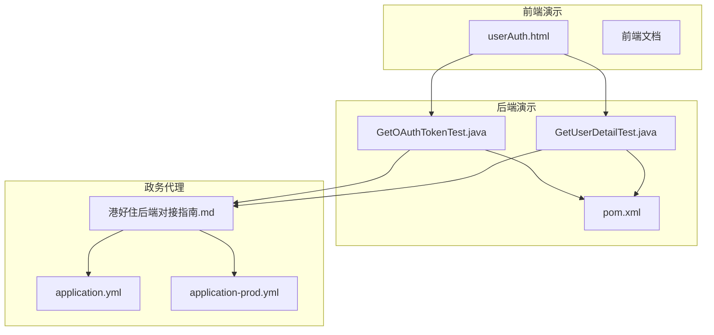
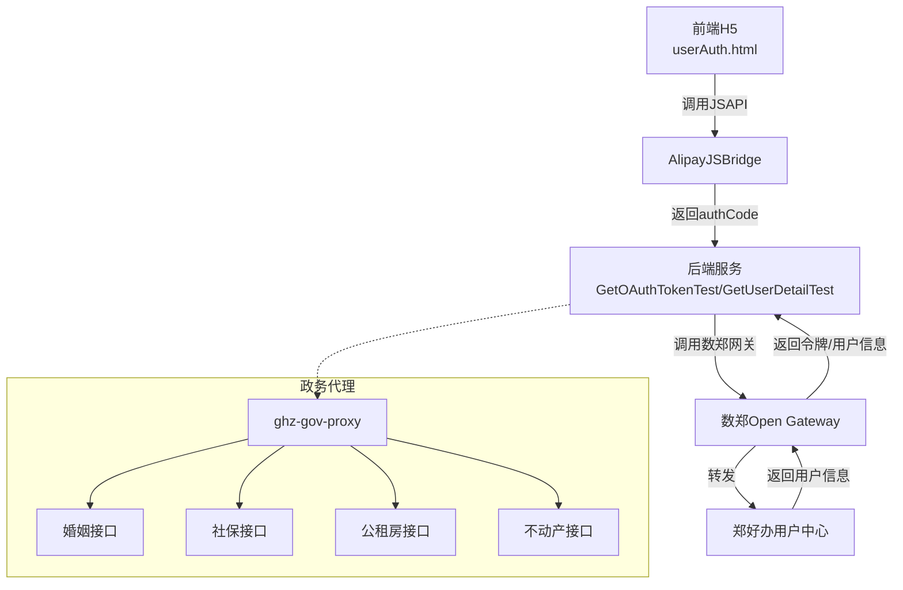
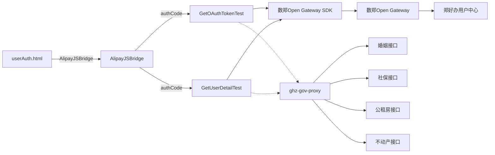

# 演示测试接口

<cite>
**本文引用的文件**
- [Demo/前端Demo/userAuth.html](file://Demo/前端Demo/userAuth.html)
- [Demo/前端文档/readme.md](file://Demo/前端文档/readme.md)
- [Demo/后端Demo/szzz-open-gateway-demo/szzz-open-gateway-demo/src/main/java/com/digital/cnzz/gateway/demo/application/GetOAuthTokenTest.java](file://Demo/后端Demo/szzz-open-gateway-demo/szzz-open-gateway-demo/src/main/java/com/digital/cnzz/gateway/demo/application/GetOAuthTokenTest.java)
- [Demo/后端Demo/szzz-open-gateway-demo/szzz-open-gateway-demo/src/main/java/com/digital/cnzz/gateway/demo/application/GetUserDetailTest.java](file://Demo/后端Demo/szzz-open-gateway-demo/szzz-open-gateway-demo/src/main/java/com/digital/cnzz/gateway/demo/application/GetUserDetailTest.java)
- [Demo/后端Demo/szzz-open-gateway-demo/szzz-open-gateway-demo/pom.xml](file://Demo/后端Demo/szzz-open-gateway-demo/szzz-open-gateway-demo/pom.xml)
- [Demo/后端文档/readme.md](file://Demo/后端文档/readme.md)
- [ghz-gov-proxy/deploy/港好住后端对接指南.md](file://ghz-gov-proxy/deploy/港好住后端对接指南.md)
- [ghz-gov-proxy/deploy/application-prod.yml](file://ghz-gov-proxy/deploy/application-prod.yml)
- [ghz-gov-proxy/src/main/resources/application.yml](file://ghz-gov-proxy/src/main/resources/application.yml)
</cite>

## 目录
1. [简介](#简介)
2. [项目结构](#项目结构)
3. [核心组件](#核心组件)
4. [架构总览](#架构总览)
5. [详细组件分析](#详细组件分析)
6. [依赖关系分析](#依赖关系分析)
7. [性能考量](#性能考量)
8. [故障排查指南](#故障排查指南)
9. [结论](#结论)
10. [附录](#附录)

## 简介
本文件面向港好住系统开发者，提供一套完整的演示测试接口资源与使用指南，涵盖：
- 前端认证演示页面（H5 + JSAPI）
- 后端OAuth令牌获取测试
- 用户详情查询测试
- 政务数据代理接口对接指南（婚姻/社保/公租房/不动产）

目标是帮助开发者快速验证接口功能、调试接口问题、学习接口使用，并给出最佳实践、自动化测试建议与性能测试方法。

## 项目结构
演示测试资源主要分布在 Demo 目录与 ghz-gov-proxy 目录中：
- 前端演示：Demo/前端Demo/userAuth.html 以及前端文档
- 后端演示：Demo/后端Demo/szzz-open-gateway-demo 中的 Java 示例
- 政务代理：ghz-gov-proxy 提供跨网架构与接口规范

图表来源
- [Demo/前端Demo/userAuth.html:1-65](file://Demo/前端Demo/userAuth.html#L1-L65)
- [Demo/前端文档/readme.md:1-231](file://Demo/前端文档/readme.md#L1-L231)
- [Demo/后端Demo/szzz-open-gateway-demo/szzz-open-gateway-demo/src/main/java/com/digital/cnzz/gateway/demo/application/GetOAuthTokenTest.java:1-67](file://Demo/后端Demo/szzz-open-gateway-demo/szzz-open-gateway-demo/src/main/java/com/digital/cnzz/gateway/demo/application/GetOAuthTokenTest.java#L1-L67)
- [Demo/后端Demo/szzz-open-gateway-demo/szzz-open-gateway-demo/src/main/java/com/digital/cnzz/gateway/demo/application/GetUserDetailTest.java:1-66](file://Demo/后端Demo/szzz-open-gateway-demo/szzz-open-gateway-demo/src/main/java/com/digital/cnzz/gateway/demo/application/GetUserDetailTest.java#L1-L66)
- [Demo/后端Demo/szzz-open-gateway-demo/szzz-open-gateway-demo/pom.xml:1-63](file://Demo/后端Demo/szzz-open-gateway-demo/szzz-open-gateway-demo/pom.xml#L1-L63)
- [ghz-gov-proxy/deploy/港好住后端对接指南.md:1-679](file://ghz-gov-proxy/deploy/港好住后端对接指南.md#L1-L679)
- [ghz-gov-proxy/src/main/resources/application.yml:1-13](file://ghz-gov-proxy/src/main/resources/application.yml#L1-L13)
- [ghz-gov-proxy/deploy/application-prod.yml:1-26](file://ghz-gov-proxy/deploy/application-prod.yml#L1-L26)

章节来源
- [Demo/前端Demo/userAuth.html:1-65](file://Demo/前端Demo/userAuth.html#L1-L65)
- [Demo/后端Demo/szzz-open-gateway-demo/szzz-open-gateway-demo/pom.xml:1-63](file://Demo/后端Demo/szzz-open-gateway-demo/szzz-open-gateway-demo/pom.xml#L1-L63)
- [ghz-gov-proxy/deploy/港好住后端对接指南.md:1-679](file://ghz-gov-proxy/deploy/港好住后端对接指南.md#L1-L679)

## 核心组件
- 前端认证演示页面：基于 AlipayJSBridge 的 userAuth JSAPI，演示授权码获取与 WebView 关闭。
- 后端OAuth令牌获取测试：通过网关 SDK 调用 szzz.uc.api.oauth.token，完成签名验证与 AES 解密。
- 用户详情查询测试：通过网关 SDK 调用 szzz.uc.api.userdetail.get 或 szzz.uc.api.userinfo.get。
- 政务代理接口：提供婚姻、社保、公租房、不动产四类接口的统一代理与安全跨网访问。

章节来源
- [Demo/前端Demo/userAuth.html:12-45](file://Demo/前端Demo/userAuth.html#L12-L45)
- [Demo/后端Demo/szzz-open-gateway-demo/szzz-open-gateway-demo/src/main/java/com/digital/cnzz/gateway/demo/application/GetOAuthTokenTest.java:22-66](file://Demo/后端Demo/szzz-open-gateway-demo/szzz-open-gateway-demo/src/main/java/com/digital/cnzz/gateway/demo/application/GetOAuthTokenTest.java#L22-L66)
- [Demo/后端Demo/szzz-open-gateway-demo/szzz-open-gateway-demo/src/main/java/com/digital/cnzz/gateway/demo/application/GetUserDetailTest.java:22-65](file://Demo/后端Demo/szzz-open-gateway-demo/szzz-open-gateway-demo/src/main/java/com/digital/cnzz/gateway/demo/application/GetUserDetailTest.java#L22-L65)
- [ghz-gov-proxy/deploy/港好住后端对接指南.md:44-51](file://ghz-gov-proxy/deploy/港好住后端对接指南.md#L44-L51)

## 架构总览
演示测试接口采用“前端 JSAPI + 后端网关 + 政务代理”的分层设计，确保在不暴露政务外网的前提下完成跨网数据查询与用户信息授权。

图表来源
- [Demo/前端Demo/userAuth.html:22-45](file://Demo/前端Demo/userAuth.html#L22-L45)
- [Demo/后端Demo/szzz-open-gateway-demo/szzz-open-gateway-demo/src/main/java/com/digital/cnzz/gateway/demo/application/GetOAuthTokenTest.java:22-66](file://Demo/后端Demo/szzz-open-gateway-demo/szzz-open-gateway-demo/src/main/java/com/digital/cnzz/gateway/demo/application/GetOAuthTokenTest.java#L22-L66)
- [Demo/后端Demo/szzz-open-gateway-demo/szzz-open-gateway-demo/src/main/java/com/digital/cnzz/gateway/demo/application/GetUserDetailTest.java:22-65](file://Demo/后端Demo/szzz-open-gateway-demo/szzz-open-gateway-demo/src/main/java/com/digital/cnzz/gateway/demo/application/GetUserDetailTest.java#L22-L65)
- [ghz-gov-proxy/deploy/港好住后端对接指南.md:24-51](file://ghz-gov-proxy/deploy/港好住后端对接指南.md#L24-L51)

## 详细组件分析

### 前端认证演示页面（userAuth.html）
- 设计目的：演示在 H5 中通过 AlipayJSBridge 调用 userAuth 获取授权码，以及 popWindow 关闭 WebView。
- 使用场景：快速验证前端 JSAPI 能力、联调授权流程、调试授权失败与取消授权的交互。
- 关键点：
  - 初始化：等待 AlipayJSBridgeReady 后方可调用。
  - 授权：传入 moduleId 与 scope（userInfo/userDetail），获取一次性 authCode。
  - 取消：授权失败或取消时调用 popWindow 关闭 WebView。
- 测试步骤：
  1) 在郑好办 V9.9.9 中打开页面，点击“用户授权”。
  2) 观察回调结果，记录 authCode。
  3) 若失败，点击“退出webView”清理界面。
- 预期结果：
  - 成功：返回 code=0，data.authCode 有效（仅一次、10 分钟有效期）。
  - 失败：返回相应错误码（如用户取消、参数错误等）。
- 常见问题：
  - 本地联调需使用 V9.9.9；白名单仅允许特定出口 IP。
  - authCode 仅一次有效，不可复用。

章节来源
- [Demo/前端Demo/userAuth.html:12-45](file://Demo/前端Demo/userAuth.html#L12-L45)
- [Demo/前端文档/readme.md:171-178](file://Demo/前端文档/readme.md#L171-L178)
- [Demo/前端文档/readme.md:185-191](file://Demo/前端文档/readme.md#L185-L191)
- [Demo/前端文档/readme.md:221-224](file://Demo/前端文档/readme.md#L221-L224)

### 后端OAuth令牌获取测试（GetOAuthTokenTest）
- 设计目的：演示后端通过网关 SDK 调用 szzz.uc.api.oauth.token，换取 oauthToken，并进行签名验证与 AES 解密。
- 使用场景：验证网关通信、参数签名、数据解密流程。
- 关键点：
  - method：szzz.uc.api.oauth.token
  - 业务参数：moduleId、grantType（authorization_code）、authCode
  - 网关必传参数：appId、ivStr、keyStr、secretKey
  - 返回校验：验证签名一致性，解密 data 得到明文 JSON
- 测试步骤：
  1) 在前端获取 authCode。
  2) 在后端构造业务参数与网关参数。
  3) 调用 GatewaySender.send，检查 response.code 是否为 200。
  4) 验证签名 expectSign == factSign。
  5) 使用 AesUtil 解密 data 得到明文。
- 预期结果：
  - 网关返回 code=0，data 包含 oauthToken、expiresIn、reOauthToken、zid。
- 常见问题：
  - authCode 无效或已过期（仅一次、10 分钟）。
  - appId/ivStr/keyStr/secretKey 与前端 scope/moduleId 不匹配。
  - 时间戳与服务器时间偏差过大导致 500。

章节来源
- [Demo/后端Demo/szzz-open-gateway-demo/szzz-open-gateway-demo/src/main/java/com/digital/cnzz/gateway/demo/application/GetOAuthTokenTest.java:22-66](file://Demo/后端Demo/szzz-open-gateway-demo/szzz-open-gateway-demo/src/main/java/com/digital/cnzz/gateway/demo/application/GetOAuthTokenTest.java#L22-L66)
- [Demo/后端文档/readme.md:214-237](file://Demo/后端文档/readme.md#L214-L237)
- [Demo/后端文档/readme.md:408-447](file://Demo/后端文档/readme.md#L408-L447)

### 用户详情查询测试（GetUserDetailTest）
- 设计目的：演示后端通过网关 SDK 调用用户信息接口（userInfo 或 userDetail），并进行签名验证与 AES 解密。
- 使用场景：验证用户信息接口权限、scope 与 method 的一致性。
- 关键点：
  - method：szzz.uc.api.userdetail.get 或 szzz.uc.api.userinfo.get
  - 业务参数：moduleId、oauthToken
  - 返回校验：签名验证、AES 解密 data
- 测试步骤：
  1) 先调用 OAuthToken 接口获取 oauthToken。
  2) 在后端构造业务参数与网关参数。
  3) 调用 GatewaySender.send，检查 response.code 是否为 200。
  4) 验证签名，解密 data 得到明文。
- 预期结果：
  - userInfo：返回 zid、phone、avatarUrl、gender、displayName 等。
  - userDetail：在 userInfo 基础上返回 idCode、realName 等。
- 常见问题：
  - 前后端 scope 与 method 不一致。
  - 未开通对应接口权限。
  - oauthToken 过期或无效。

章节来源
- [Demo/后端Demo/szzz-open-gateway-demo/szzz-open-gateway-demo/src/main/java/com/digital/cnzz/gateway/demo/application/GetUserDetailTest.java:22-65](file://Demo/后端Demo/szzz-open-gateway-demo/szzz-open-gateway-demo/src/main/java/com/digital/cnzz/gateway/demo/application/GetUserDetailTest.java#L22-L65)
- [Demo/后端文档/readme.md:301-332](file://Demo/后端文档/readme.md#L301-L332)
- [Demo/后端文档/readme.md:408-447](file://Demo/后端文档/readme.md#L408-L447)

### 政务代理接口（婚姻/社保/公租房/不动产）
- 设计目的：提供统一代理入口，跨互联网区与政务外网，安全地调用婚姻、社保、公租房、不动产接口。
- 使用场景：在港好住系统中进行用户资格校验与数据查询。
- 关键点：
  - Base URL：http://42.228.16.25:8088
  - Header：X-Api-Key: lWo1XjpwMfxpPqq52bCztCP-olV-dRaL
  - 请求体：{"idCard":"...","name":"..."}
  - 响应体：{"code":200,"message":"success","data":{"hasRecord":true,"records":[...],"raw":{...}}}
- 测试步骤：
  1) 准备测试数据（18 位身份证号与姓名）。
  2) 选择接口路径（婚姻/社保/公租房/不动产）。
  3) 设置 Content-Type 与 X-Api-Key。
  4) 发送 POST 请求，解析 data.hasRecord 与 data.records。
- 预期结果：
  - code=200 表示成功；hasRecord=true 表示存在记录；records 为结构化数据。
- 常见问题：
  - 401：API Key 错误或缺失。
  - 400：缺少必填参数。
  - 500：下游政务平台异常。
  - 不动产接口较慢，需设置较长读取超时。

章节来源
- [ghz-gov-proxy/deploy/港好住后端对接指南.md:132-186](file://ghz-gov-proxy/deploy/港好住后端对接指南.md#L132-L186)
- [ghz-gov-proxy/deploy/港好住后端对接指南.md:189-230](file://ghz-gov-proxy/deploy/港好住后端对接指南.md#L189-L230)
- [ghz-gov-proxy/deploy/港好住后端对接指南.md:246-357](file://ghz-gov-proxy/deploy/港好住后端对接指南.md#L246-L357)
- [ghz-gov-proxy/deploy/港好住后端对接指南.md:486-526](file://ghz-gov-proxy/deploy/港好住后端对接指南.md#L486-L526)

## 依赖关系分析
- 前端依赖：AlipayJSBridge（系统注入，无需额外引入）。
- 后端依赖：数郑 Open Gateway SDK（GatewaySender、AesUtil、SignUtil）、Fastjson、SLF4J、Spring Core、Apache Commons 等。
- 政务代理依赖：Nginx 反向代理、Spring Boot 应用、政务 SDK（OAuth2 Token 管理与 RSA2 加解密）。

图表来源
- [Demo/前端Demo/userAuth.html:12-45](file://Demo/前端Demo/userAuth.html#L12-L45)
- [Demo/后端Demo/szzz-open-gateway-demo/szzz-open-gateway-demo/src/main/java/com/digital/cnzz/gateway/demo/application/GetOAuthTokenTest.java:22-66](file://Demo/后端Demo/szzz-open-gateway-demo/szzz-open-gateway-demo/src/main/java/com/digital/cnzz/gateway/demo/application/GetOAuthTokenTest.java#L22-L66)
- [Demo/后端Demo/szzz-open-gateway-demo/szzz-open-gateway-demo/src/main/java/com/digital/cnzz/gateway/demo/application/GetUserDetailTest.java:22-65](file://Demo/后端Demo/szzz-open-gateway-demo/szzz-open-gateway-demo/src/main/java/com/digital/cnzz/gateway/demo/application/GetUserDetailTest.java#L22-L65)
- [ghz-gov-proxy/deploy/港好住后端对接指南.md:24-51](file://ghz-gov-proxy/deploy/港好住后端对接指南.md#L24-L51)

章节来源
- [Demo/后端Demo/szzz-open-gateway-demo/szzz-open-gateway-demo/pom.xml:24-60](file://Demo/后端Demo/szzz-open-gateway-demo/szzz-open-gateway-demo/pom.xml#L24-L60)

## 性能考量
- 前端 JSAPI：调用 userAuth 为轻量交互，主要耗时在客户端授权流程。
- 后端网关：网络延迟与签名/解密开销较小，建议在生产环境开启连接池与合理的超时配置。
- 政务代理：
  - 婚姻/社保/公租房：响应时间约 0.3~1s。
  - 不动产：响应时间约 3~8s，建议读取超时 ≥ 30s。
  - 建议对高频查询做本地缓存（Redis），降低调用频次与下游压力。
- 并发控制：建议单 Pod 并发 ≤ 10，全系统并发 ≤ 50，避免触发下游限流。

章节来源
- [ghz-gov-proxy/deploy/港好住后端对接指南.md:540-584](file://ghz-gov-proxy/deploy/港好住后端对接指南.md#L540-L584)

## 故障排查指南
- 前端：
  - 本地联调需使用 V9.9.9；白名单仅允许 36.133.39.148/.49。
  - authCode 仅一次有效且 10 分钟过期，不可复用。
- 后端：
  - 401 未登录：authCode 无效或已过期。
  - 无权限：前后端 moduleId/scope/method 不一致或未开通权限。
  - 令牌已过期：时间戳与服务器时间偏差过大。
- 政务代理：
  - 401：API Key 错误或缺失。
  - 400：缺少必填参数。
  - 500：下游政务平台异常，可重试 1 次。
  - 不动产接口慢：适当增大读取超时，必要时做重试与缓存。

章节来源
- [Demo/前端文档/readme.md:171-178](file://Demo/前端文档/readme.md#L171-L178)
- [Demo/后端文档/readme.md:408-447](file://Demo/后端文档/readme.md#L408-L447)
- [ghz-gov-proxy/deploy/港好住后端对接指南.md:486-526](file://ghz-gov-proxy/deploy/港好住后端对接指南.md#L486-L526)

## 结论
通过本演示测试接口资源，开发者可以：
- 快速验证前端 JSAPI 与后端网关的用户授权与信息查询流程；
- 熟悉政务代理接口的统一调用方式与错误处理；
- 建立自动化测试与性能优化策略，确保接口稳定性与可用性。

建议在开发过程中结合本文档的测试步骤、预期结果与故障排查指南，逐步完善测试用例与监控告警。

## 附录

### 测试步骤总览（用户授权与信息查询）
- 前端：
  1) 打开 userAuth.html，等待 AlipayJSBridgeReady。
  2) 点击“用户授权”，记录回调中的 authCode。
  3) 如失败，点击“退出webView”清理界面。
- 后端：
  1) 在 GetOAuthTokenTest 中填入 moduleId、grantType=authorization_code、authCode。
  2) 调用 GatewaySender.send，验证签名与解密。
  3) 在 GetUserDetailTest 中填入 moduleId、oauthToken，调用对应 method。
- 政务代理：
  1) 准备 idCard 与 name。
  2) 选择接口路径（婚姻/社保/公租房/不动产）。
  3) 设置 Header 与 Body，发送请求，解析 data.hasRecord 与 data.records。

章节来源
- [Demo/前端Demo/userAuth.html:12-45](file://Demo/前端Demo/userAuth.html#L12-L45)
- [Demo/后端Demo/szzz-open-gateway-demo/szzz-open-gateway-demo/src/main/java/com/digital/cnzz/gateway/demo/application/GetOAuthTokenTest.java:22-66](file://Demo/后端Demo/szzz-open-gateway-demo/szzz-open-gateway-demo/src/main/java/com/digital/cnzz/gateway/demo/application/GetOAuthTokenTest.java#L22-L66)
- [Demo/后端Demo/szzz-open-gateway-demo/szzz-open-gateway-demo/src/main/java/com/digital/cnzz/gateway/demo/application/GetUserDetailTest.java:22-65](file://Demo/后端Demo/szzz-open-gateway-demo/szzz-open-gateway-demo/src/main/java/com/digital/cnzz/gateway/demo/application/GetUserDetailTest.java#L22-L65)
- [ghz-gov-proxy/deploy/港好住后端对接指南.md:132-186](file://ghz-gov-proxy/deploy/港好住后端对接指南.md#L132-L186)

### 最佳实践与自动化测试建议
- 参数管理：将 appId、ivStr、keyStr、secretKey、API Key 等敏感参数放入配置中心（如 Nacos），避免硬编码与日志泄露。
- 幂等与重试：对网络超时与下游偶发异常进行有限重试，避免对政务平台造成压力。
- 缓存策略：对低频变更数据（婚姻/不动产/公租房）做本地缓存，减少重复调用。
- 监控与审计：记录每次调用的耗时、结果摘要与操作人，便于溯源与问题定位。
- 超时与并发：根据接口特性设置合理超时与并发上限，避免触发限流。

章节来源
- [ghz-gov-proxy/deploy/港好住后端对接指南.md:563-584](file://ghz-gov-proxy/deploy/港好住后端对接指南.md#L563-L584)