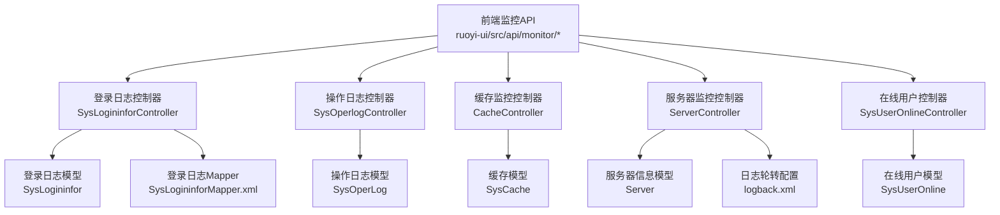
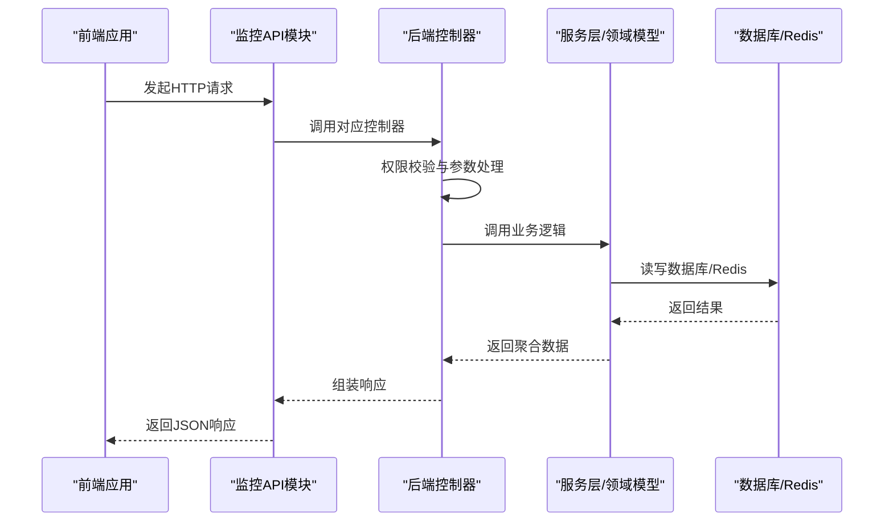
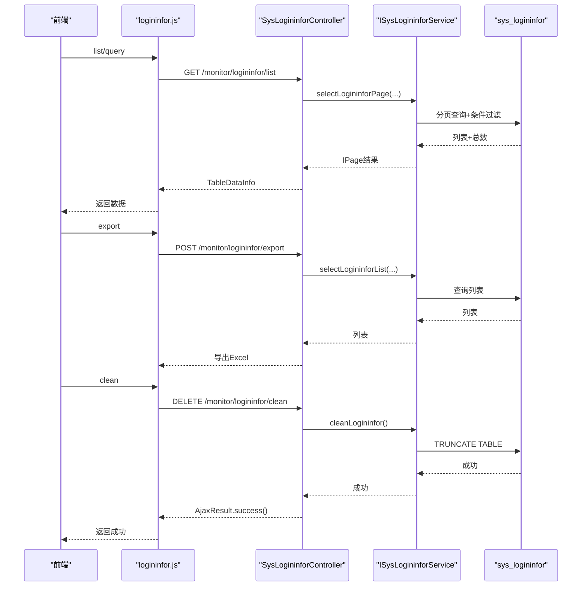
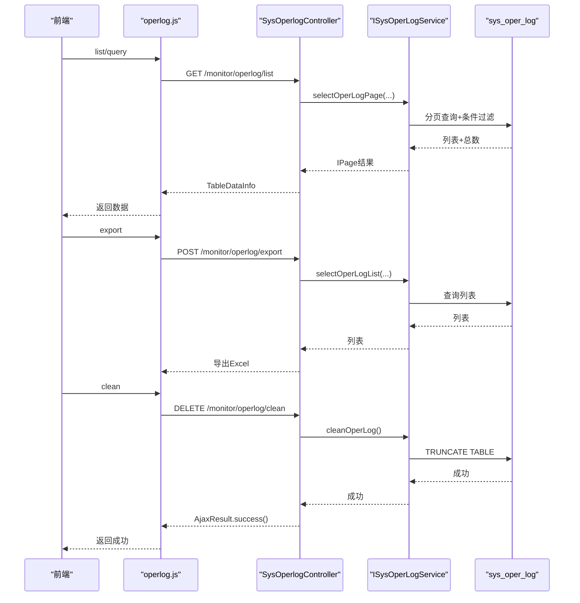
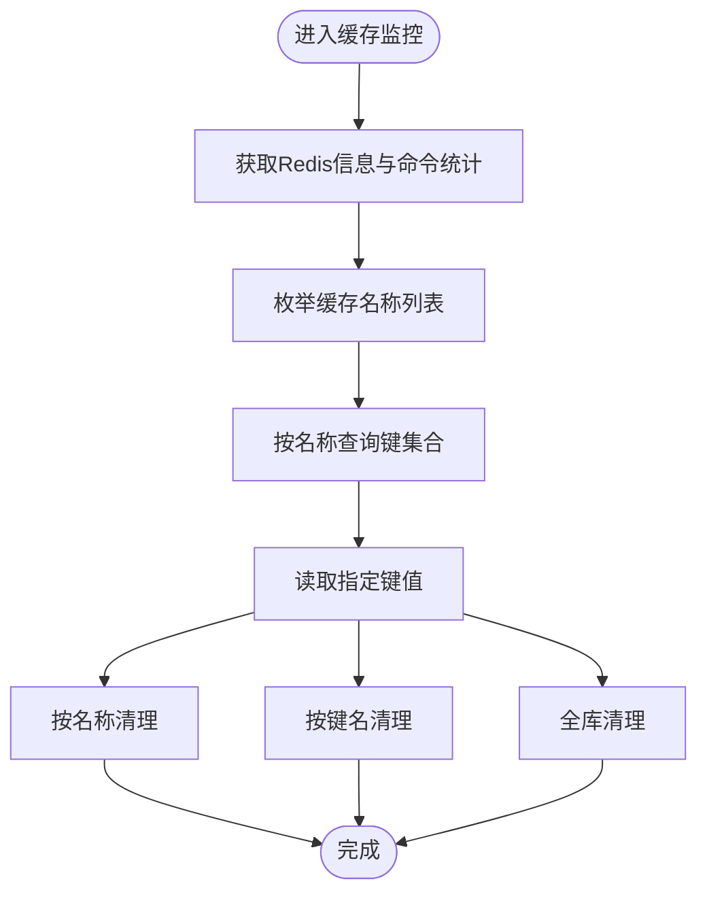
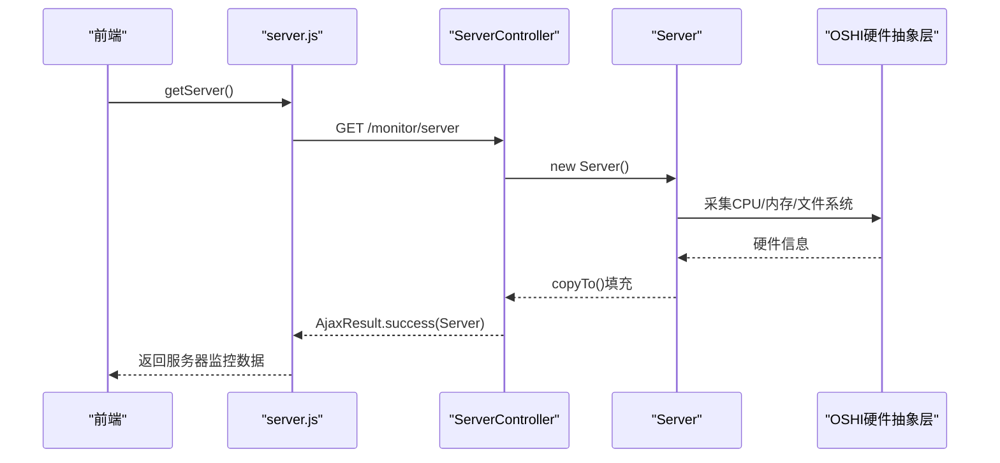
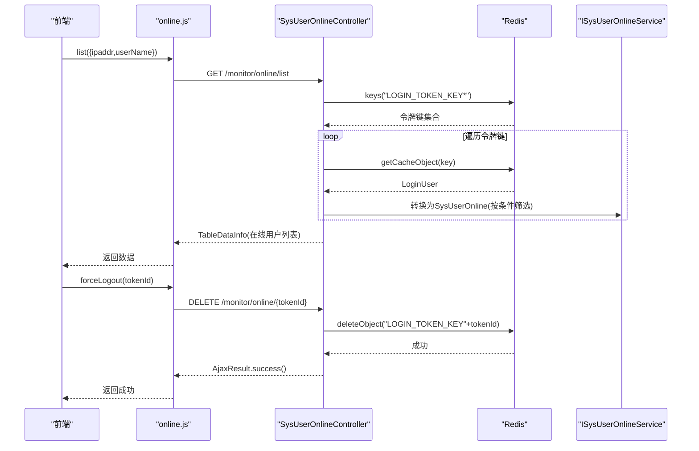
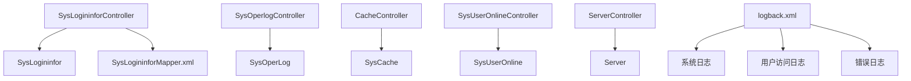

# 监控运维接口

<cite>
**本文引用的文件**
- [ruoyi-admin/src/main/java/com/ruoyi/web/controller/monitor/SysLogininforController.java](file://ruoyi-admin/src/main/java/com/ruoyi/web/controller/monitor/SysLogininforController.java)
- [ruoyi-admin/src/main/java/com/ruoyi/web/controller/monitor/SysOperlogController.java](file://ruoyi-admin/src/main/java/com/ruoyi/web/controller/monitor/SysOperlogController.java)
- [ruoyi-admin/src/main/java/com/ruoyi/web/controller/monitor/CacheController.java](file://ruoyi-admin/src/main/java/com/ruoyi/web/controller/monitor/CacheController.java)
- [ruoyi-admin/src/main/java/com/ruoyi/web/controller/monitor/ServerController.java](file://ruoyi-admin/src/main/java/com/ruoyi/web/controller/monitor/ServerController.java)
- [ruoyi-admin/src/main/java/com/ruoyi/web/controller/monitor/SysUserOnlineController.java](file://ruoyi-admin/src/main/java/com/ruoyi/web/controller/monitor/SysUserOnlineController.java)
- [ruoyi-system/src/main/java/com/ruoyi/system/domain/SysLogininfor.java](file://ruoyi-system/src/main/java/com/ruoyi/system/domain/SysLogininfor.java)
- [ruoyi-system/src/main/java/com/ruoyi/system/domain/SysOperLog.java](file://ruoyi-system/src/main/java/com/ruoyi/system/domain/SysOperLog.java)
- [ruoyi-system/src/main/java/com/ruoyi/system/domain/SysCache.java](file://ruoyi-system/src/main/java/com/ruoyi/system/domain/SysCache.java)
- [ruoyi-system/src/main/java/com/ruoyi/system/domain/SysUserOnline.java](file://ruoyi-system/src/main/java/com/ruoyi/system/domain/SysUserOnline.java)
- [ruoyi-framework/src/main/java/com/ruoyi/framework/web/domain/Server.java](file://ruoyi-framework/src/main/java/com/ruoyi/framework/web/domain/Server.java)
- [ruoyi-system/src/main/resources/mapper/system/SysLogininforMapper.xml](file://ruoyi-system/src/main/resources/mapper/system/SysLogininforMapper.xml)
- [ruoyi-admin/src/main/resources/logback.xml](file://ruoyi-admin/src/main/resources/logback.xml)
- [ruoyi-ui/src/api/monitor/logininfor.js](file://ruoyi-ui/src/api/monitor/logininfor.js)
- [ruoyi-ui/src/api/monitor/operlog.js](file://ruoyi-ui/src/api/monitor/operlog.js)
- [ruoyi-ui/src/api/monitor/cache.js](file://ruoyi-ui/src/api/monitor/cache.js)
- [ruoyi-ui/src/api/monitor/server.js](file://ruoyi-ui/src/api/monitor/server.js)
- [ruoyi-ui/src/api/monitor/online.js](file://ruoyi-ui/src/api/monitor/online.js)
</cite>

## 目录
1. [简介](#简介)
2. [项目结构](#项目结构)
3. [核心组件](#核心组件)
4. [架构总览](#架构总览)
5. [详细组件分析](#详细组件分析)
6. [依赖分析](#依赖分析)
7. [性能考量](#性能考量)
8. [故障排查指南](#故障排查指南)
9. [结论](#结论)
10. [附录](#附录)

## 简介
本文件面向运维与平台工程团队，系统化梳理港好住系统的监控运维接口能力，覆盖登录日志、操作日志、缓存管理、服务器监控、用户在线状态等关键运维场景。文档从接口定义、技术实现、数据模型、调用示例、配置方法、故障排查与性能优化等方面进行深入说明，帮助运维人员高效监控与管理系统的运行状态。

## 项目结构
监控运维相关能力主要分布在以下层次：
- 前端API层：封装各监控接口的HTTP调用，统一在 ruoyi-ui 的 monitor 目录下。
- 后端控制器层：提供REST接口，位于 ruoyi-admin 的 monitor 包中。
- 领域模型与持久层：登录日志、操作日志、缓存、在线用户等模型与SQL映射位于 ruoyi-system。
- 服务器监控：通过 ruoyi-framework 的 Server 组件采集主机与JVM信息。
- 日志配置：ruoyi-admin 的 logback.xml 定义了系统日志轮转策略。

图表来源
- [ruoyi-ui/src/api/monitor/logininfor.js:1-35](file://ruoyi-ui/src/api/monitor/logininfor.js#L1-L35)
- [ruoyi-ui/src/api/monitor/operlog.js:1-27](file://ruoyi-ui/src/api/monitor/operlog.js#L1-L27)
- [ruoyi-ui/src/api/monitor/cache.js:1-58](file://ruoyi-ui/src/api/monitor/cache.js#L1-L58)
- [ruoyi-ui/src/api/monitor/server.js:1-9](file://ruoyi-ui/src/api/monitor/server.js#L1-L9)
- [ruoyi-ui/src/api/monitor/online.js:1-19](file://ruoyi-ui/src/api/monitor/online.js#L1-L19)
- [ruoyi-admin/src/main/java/com/ruoyi/web/controller/monitor/SysLogininforController.java:1-88](file://ruoyi-admin/src/main/java/com/ruoyi/web/controller/monitor/SysLogininforController.java#L1-L88)
- [ruoyi-admin/src/main/java/com/ruoyi/web/controller/monitor/SysOperlogController.java:1-75](file://ruoyi-admin/src/main/java/com/ruoyi/web/controller/monitor/SysOperlogController.java#L1-L75)
- [ruoyi-admin/src/main/java/com/ruoyi/web/controller/monitor/CacheController.java:1-123](file://ruoyi-admin/src/main/java/com/ruoyi/web/controller/monitor/CacheController.java#L1-L123)
- [ruoyi-admin/src/main/java/com/ruoyi/web/controller/monitor/ServerController.java:1-27](file://ruoyi-admin/src/main/java/com/ruoyi/web/controller/monitor/ServerController.java#L1-L27)
- [ruoyi-admin/src/main/java/com/ruoyi/web/controller/monitor/SysUserOnlineController.java:1-83](file://ruoyi-admin/src/main/java/com/ruoyi/web/controller/monitor/SysUserOnlineController.java#L1-L83)
- [ruoyi-system/src/main/java/com/ruoyi/system/domain/SysLogininfor.java:1-145](file://ruoyi-system/src/main/java/com/ruoyi/system/domain/SysLogininfor.java#L1-L145)
- [ruoyi-system/src/main/java/com/ruoyi/system/domain/SysOperLog.java:1-270](file://ruoyi-system/src/main/java/com/ruoyi/system/domain/SysOperLog.java#L1-L270)
- [ruoyi-system/src/main/java/com/ruoyi/system/domain/SysCache.java:1-82](file://ruoyi-system/src/main/java/com/ruoyi/system/domain/SysCache.java#L1-L82)
- [ruoyi-system/src/main/java/com/ruoyi/system/domain/SysUserOnline.java:1-114](file://ruoyi-system/src/main/java/com/ruoyi/system/domain/SysUserOnline.java#L1-L114)
- [ruoyi-framework/src/main/java/com/ruoyi/framework/web/domain/Server.java:1-241](file://ruoyi-framework/src/main/java/com/ruoyi/framework/web/domain/Server.java#L1-L241)
- [ruoyi-system/src/main/resources/mapper/system/SysLogininforMapper.xml:19-55](file://ruoyi-system/src/main/resources/mapper/system/SysLogininforMapper.xml#L19-L55)
- [ruoyi-admin/src/main/resources/logback.xml:1-77](file://ruoyi-admin/src/main/resources/logback.xml#L1-L77)

章节来源
- [ruoyi-ui/src/api/monitor/logininfor.js:1-35](file://ruoyi-ui/src/api/monitor/logininfor.js#L1-L35)
- [ruoyi-ui/src/api/monitor/operlog.js:1-27](file://ruoyi-ui/src/api/monitor/operlog.js#L1-L27)
- [ruoyi-ui/src/api/monitor/cache.js:1-58](file://ruoyi-ui/src/api/monitor/cache.js#L1-L58)
- [ruoyi-ui/src/api/monitor/server.js:1-9](file://ruoyi-ui/src/api/monitor/server.js#L1-L9)
- [ruoyi-ui/src/api/monitor/online.js:1-19](file://ruoyi-ui/src/api/monitor/online.js#L1-L19)

## 核心组件
- 登录日志接口：支持分页查询、导出、删除、清空、账户解锁。
- 操作日志接口：支持分页查询、导出、删除、清空。
- 缓存监控接口：支持Redis基础信息、命令统计、键名枚举、键值读取、按名称/键名/全量清理。
- 服务器监控接口：采集CPU、内存、JVM、系统与磁盘信息。
- 在线用户接口：支持在线用户列表筛选与强制下线。

章节来源
- [ruoyi-admin/src/main/java/com/ruoyi/web/controller/monitor/SysLogininforController.java:1-88](file://ruoyi-admin/src/main/java/com/ruoyi/web/controller/monitor/SysLogininforController.java#L1-L88)
- [ruoyi-admin/src/main/java/com/ruoyi/web/controller/monitor/SysOperlogController.java:1-75](file://ruoyi-admin/src/main/java/com/ruoyi/web/controller/monitor/SysOperlogController.java#L1-L75)
- [ruoyi-admin/src/main/java/com/ruoyi/web/controller/monitor/CacheController.java:1-123](file://ruoyi-admin/src/main/java/com/ruoyi/web/controller/monitor/CacheController.java#L1-L123)
- [ruoyi-admin/src/main/java/com/ruoyi/web/controller/monitor/ServerController.java:1-27](file://ruoyi-admin/src/main/java/com/ruoyi/web/controller/monitor/ServerController.java#L1-L27)
- [ruoyi-admin/src/main/java/com/ruoyi/web/controller/monitor/SysUserOnlineController.java:1-83](file://ruoyi-admin/src/main/java/com/ruoyi/web/controller/monitor/SysUserOnlineController.java#L1-L83)

## 架构总览
监控运维接口采用前后端分离架构，前端通过API模块发起HTTP请求，后端控制器负责权限校验、参数解析、调用服务层或直接访问底层存储/中间件，最终返回标准响应体。

图表来源
- [ruoyi-ui/src/api/monitor/logininfor.js:1-35](file://ruoyi-ui/src/api/monitor/logininfor.js#L1-L35)
- [ruoyi-ui/src/api/monitor/operlog.js:1-27](file://ruoyi-ui/src/api/monitor/operlog.js#L1-L27)
- [ruoyi-ui/src/api/monitor/cache.js:1-58](file://ruoyi-ui/src/api/monitor/cache.js#L1-L58)
- [ruoyi-ui/src/api/monitor/server.js:1-9](file://ruoyi-ui/src/api/monitor/server.js#L1-L9)
- [ruoyi-ui/src/api/monitor/online.js:1-19](file://ruoyi-ui/src/api/monitor/online.js#L1-L19)
- [ruoyi-admin/src/main/java/com/ruoyi/web/controller/monitor/SysLogininforController.java:1-88](file://ruoyi-admin/src/main/java/com/ruoyi/web/controller/monitor/SysLogininforController.java#L1-L88)
- [ruoyi-admin/src/main/java/com/ruoyi/web/controller/monitor/SysOperlogController.java:1-75](file://ruoyi-admin/src/main/java/com/ruoyi/web/controller/monitor/SysOperlogController.java#L1-L75)
- [ruoyi-admin/src/main/java/com/ruoyi/web/controller/monitor/CacheController.java:1-123](file://ruoyi-admin/src/main/java/com/ruoyi/web/controller/monitor/CacheController.java#L1-L123)
- [ruoyi-admin/src/main/java/com/ruoyi/web/controller/monitor/ServerController.java:1-27](file://ruoyi-admin/src/main/java/com/ruoyi/web/controller/monitor/ServerController.java#L1-L27)
- [ruoyi-admin/src/main/java/com/ruoyi/web/controller/monitor/SysUserOnlineController.java:1-83](file://ruoyi-admin/src/main/java/com/ruoyi/web/controller/monitor/SysUserOnlineController.java#L1-L83)

## 详细组件分析

### 登录日志接口
- 接口目标：记录并管理用户登录行为，支持查询、导出、删除、清空、账户解锁。
- 关键点：
  - 分页查询：基于MyBatis Plus分页插件，支持按IP、状态、用户名、时间范围过滤。
  - 导出：使用Excel工具类导出为表格。
  - 清空：清空表数据。
  - 账户解锁：清除登录失败计数缓存，允许重新登录。
- 数据模型字段要点：用户账号、登录状态、IP地址、登录地点、浏览器、操作系统、提示消息、登录时间等。
- 前端调用示例：查询列表、删除单条、清空、解锁。

图表来源
- [ruoyi-ui/src/api/monitor/logininfor.js:1-35](file://ruoyi-ui/src/api/monitor/logininfor.js#L1-L35)
- [ruoyi-admin/src/main/java/com/ruoyi/web/controller/monitor/SysLogininforController.java:1-88](file://ruoyi-admin/src/main/java/com/ruoyi/web/controller/monitor/SysLogininforController.java#L1-L88)
- [ruoyi-system/src/main/resources/mapper/system/SysLogininforMapper.xml:19-55](file://ruoyi-system/src/main/resources/mapper/system/SysLogininforMapper.xml#L19-L55)
- [ruoyi-system/src/main/java/com/ruoyi/system/domain/SysLogininfor.java:1-145](file://ruoyi-system/src/main/java/com/ruoyi/system/domain/SysLogininfor.java#L1-L145)

章节来源
- [ruoyi-admin/src/main/java/com/ruoyi/web/controller/monitor/SysLogininforController.java:1-88](file://ruoyi-admin/src/main/java/com/ruoyi/web/controller/monitor/SysLogininforController.java#L1-L88)
- [ruoyi-system/src/main/java/com/ruoyi/system/domain/SysLogininfor.java:1-145](file://ruoyi-system/src/main/java/com/ruoyi/system/domain/SysLogininfor.java#L1-L145)
- [ruoyi-system/src/main/resources/mapper/system/SysLogininforMapper.xml:19-55](file://ruoyi-system/src/main/resources/mapper/system/SysLogininforMapper.xml#L19-L55)
- [ruoyi-ui/src/api/monitor/logininfor.js:1-35](file://ruoyi-ui/src/api/monitor/logininfor.js#L1-L35)

### 操作日志接口
- 接口目标：记录用户操作轨迹，支持分页查询、导出、删除、清空。
- 关键点：
  - 分页查询：支持按模块、业务类型、请求方法、操作人、时间范围等过滤。
  - 导出：导出为Excel。
  - 清空：清空表数据。
- 数据模型字段要点：模块、业务类型、方法、请求方式、操作类别、操作人员、部门、URL、IP、地点、请求参数、返回结果、状态、错误消息、操作时间、耗时等。

图表来源
- [ruoyi-ui/src/api/monitor/operlog.js:1-27](file://ruoyi-ui/src/api/monitor/operlog.js#L1-L27)
- [ruoyi-admin/src/main/java/com/ruoyi/web/controller/monitor/SysOperlogController.java:1-75](file://ruoyi-admin/src/main/java/com/ruoyi/web/controller/monitor/SysOperlogController.java#L1-L75)
- [ruoyi-system/src/main/java/com/ruoyi/system/domain/SysOperLog.java:1-270](file://ruoyi-system/src/main/java/com/ruoyi/system/domain/SysOperLog.java#L1-L270)

章节来源
- [ruoyi-admin/src/main/java/com/ruoyi/web/controller/monitor/SysOperlogController.java:1-75](file://ruoyi-admin/src/main/java/com/ruoyi/web/controller/monitor/SysOperlogController.java#L1-L75)
- [ruoyi-system/src/main/java/com/ruoyi/system/domain/SysOperLog.java:1-270](file://ruoyi-system/src/main/java/com/ruoyi/system/domain/SysOperLog.java#L1-L270)
- [ruoyi-ui/src/api/monitor/operlog.js:1-27](file://ruoyi-ui/src/api/monitor/operlog.js#L1-L27)

### 缓存监控接口
- 接口目标：监控Redis运行状态、命令统计、键名枚举与键值读取，并支持按名称/键名/全量清理。
- 关键点：
  - Redis基础信息与命令统计：通过RedisTemplate执行info与info("commandstats")，聚合命令调用次数用于饼图展示。
  - 键名枚举：根据缓存命名空间前缀通配符查询。
  - 键值读取：读取指定键值，封装为SysCache对象。
  - 清理策略：支持按名称前缀清理、按键名清理、全库清理。
- 设计考虑：通过常量前缀统一管理常用缓存键，便于运维快速定位与清理。

图表来源
- [ruoyi-admin/src/main/java/com/ruoyi/web/controller/monitor/CacheController.java:1-123](file://ruoyi-admin/src/main/java/com/ruoyi/web/controller/monitor/CacheController.java#L1-L123)
- [ruoyi-system/src/main/java/com/ruoyi/system/domain/SysCache.java:1-82](file://ruoyi-system/src/main/java/com/ruoyi/system/domain/SysCache.java#L1-L82)

章节来源
- [ruoyi-admin/src/main/java/com/ruoyi/web/controller/monitor/CacheController.java:1-123](file://ruoyi-admin/src/main/java/com/ruoyi/web/controller/monitor/CacheController.java#L1-L123)
- [ruoyi-system/src/main/java/com/ruoyi/system/domain/SysCache.java:1-82](file://ruoyi-system/src/main/java/com/ruoyi/system/domain/SysCache.java#L1-L82)
- [ruoyi-ui/src/api/monitor/cache.js:1-58](file://ruoyi-ui/src/api/monitor/cache.js#L1-L58)

### 服务器监控接口
- 接口目标：采集并返回服务器硬件、内存、JVM、系统与磁盘使用情况。
- 关键点：
  - 使用OSHI库采集CPU、内存、文件系统等信息。
  - 将采集到的数据复制到Server模型，供前端展示。
  - 前端通过GET /monitor/server获取完整信息。
- 性能与稳定性：采集过程包含等待与计算，建议在低频调用或缓存展示结果。

图表来源
- [ruoyi-ui/src/api/monitor/server.js:1-9](file://ruoyi-ui/src/api/monitor/server.js#L1-L9)
- [ruoyi-admin/src/main/java/com/ruoyi/web/controller/monitor/ServerController.java:1-27](file://ruoyi-admin/src/main/java/com/ruoyi/web/controller/monitor/ServerController.java#L1-L27)
- [ruoyi-framework/src/main/java/com/ruoyi/framework/web/domain/Server.java:1-241](file://ruoyi-framework/src/main/java/com/ruoyi/framework/web/domain/Server.java#L1-L241)

章节来源
- [ruoyi-admin/src/main/java/com/ruoyi/web/controller/monitor/ServerController.java:1-27](file://ruoyi-admin/src/main/java/com/ruoyi/web/controller/monitor/ServerController.java#L1-L27)
- [ruoyi-framework/src/main/java/com/ruoyi/framework/web/domain/Server.java:1-241](file://ruoyi-framework/src/main/java/com/ruoyi/framework/web/domain/Server.java#L1-L241)
- [ruoyi-ui/src/api/monitor/server.js:1-9](file://ruoyi-ui/src/api/monitor/server.js#L1-L9)

### 在线用户接口
- 接口目标：查询当前在线用户，支持按IP、用户名筛选；支持强制下线。
- 关键点：
  - 通过Redis键前缀扫描所有登录令牌，反序列化为登录用户对象，转换为在线用户视图。
  - 强制下线：删除对应令牌键，立即使该会话失效。
- 设计考虑：利用Redis键空间与统一令牌前缀，实现高并发下的在线用户查询与踢人。

图表来源
- [ruoyi-ui/src/api/monitor/online.js:1-19](file://ruoyi-ui/src/api/monitor/online.js#L1-L19)
- [ruoyi-admin/src/main/java/com/ruoyi/web/controller/monitor/SysUserOnlineController.java:1-83](file://ruoyi-admin/src/main/java/com/ruoyi/web/controller/monitor/SysUserOnlineController.java#L1-L83)
- [ruoyi-system/src/main/java/com/ruoyi/system/domain/SysUserOnline.java:1-114](file://ruoyi-system/src/main/java/com/ruoyi/system/domain/SysUserOnline.java#L1-L114)

章节来源
- [ruoyi-admin/src/main/java/com/ruoyi/web/controller/monitor/SysUserOnlineController.java:1-83](file://ruoyi-admin/src/main/java/com/ruoyi/web/controller/monitor/SysUserOnlineController.java#L1-L83)
- [ruoyi-system/src/main/java/com/ruoyi/system/domain/SysUserOnline.java:1-114](file://ruoyi-system/src/main/java/com/ruoyi/system/domain/SysUserOnline.java#L1-L114)
- [ruoyi-ui/src/api/monitor/online.js:1-19](file://ruoyi-ui/src/api/monitor/online.js#L1-L19)

## 依赖分析
- 控制器与模型：
  - 登录日志控制器依赖登录日志模型与Mapper。
  - 操作日志控制器依赖操作日志模型。
  - 缓存控制器依赖SysCache模型。
  - 在线用户控制器依赖在线用户模型与Redis。
  - 服务器控制器依赖Server模型。
- 前端API与控制器一一对应，职责清晰，便于扩展与维护。
- 日志配置：logback.xml定义了系统日志、用户访问日志与错误日志的滚动策略，便于长期留存与审计。

图表来源
- [ruoyi-admin/src/main/java/com/ruoyi/web/controller/monitor/SysLogininforController.java:1-88](file://ruoyi-admin/src/main/java/com/ruoyi/web/controller/monitor/SysLogininforController.java#L1-L88)
- [ruoyi-admin/src/main/java/com/ruoyi/web/controller/monitor/SysOperlogController.java:1-75](file://ruoyi-admin/src/main/java/com/ruoyi/web/controller/monitor/SysOperlogController.java#L1-L75)
- [ruoyi-admin/src/main/java/com/ruoyi/web/controller/monitor/CacheController.java:1-123](file://ruoyi-admin/src/main/java/com/ruoyi/web/controller/monitor/CacheController.java#L1-L123)
- [ruoyi-admin/src/main/java/com/ruoyi/web/controller/monitor/SysUserOnlineController.java:1-83](file://ruoyi-admin/src/main/java/com/ruoyi/web/controller/monitor/SysUserOnlineController.java#L1-L83)
- [ruoyi-admin/src/main/java/com/ruoyi/web/controller/monitor/ServerController.java:1-27](file://ruoyi-admin/src/main/java/com/ruoyi/web/controller/monitor/ServerController.java#L1-L27)
- [ruoyi-system/src/main/java/com/ruoyi/system/domain/SysLogininfor.java:1-145](file://ruoyi-system/src/main/java/com/ruoyi/system/domain/SysLogininfor.java#L1-L145)
- [ruoyi-system/src/main/java/com/ruoyi/system/domain/SysOperLog.java:1-270](file://ruoyi-system/src/main/java/com/ruoyi/system/domain/SysOperLog.java#L1-L270)
- [ruoyi-system/src/main/java/com/ruoyi/system/domain/SysCache.java:1-82](file://ruoyi-system/src/main/java/com/ruoyi/system/domain/SysCache.java#L1-L82)
- [ruoyi-system/src/main/java/com/ruoyi/system/domain/SysUserOnline.java:1-114](file://ruoyi-system/src/main/java/com/ruoyi/system/domain/SysUserOnline.java#L1-L114)
- [ruoyi-framework/src/main/java/com/ruoyi/framework/web/domain/Server.java:1-241](file://ruoyi-framework/src/main/java/com/ruoyi/framework/web/domain/Server.java#L1-L241)
- [ruoyi-system/src/main/resources/mapper/system/SysLogininforMapper.xml:19-55](file://ruoyi-system/src/main/resources/mapper/system/SysLogininforMapper.xml#L19-L55)
- [ruoyi-admin/src/main/resources/logback.xml:1-77](file://ruoyi-admin/src/main/resources/logback.xml#L1-L77)

章节来源
- [ruoyi-admin/src/main/resources/logback.xml:1-77](file://ruoyi-admin/src/main/resources/logback.xml#L1-L77)

## 性能考量
- 缓存监控：
  - 命令统计解析涉及字符串处理，建议在低频调用或前端缓存展示结果。
  - 键名枚举与读取应避免对生产环境造成压力，建议限制前缀与数量。
- 服务器监控：
  - OSHI采集包含等待与计算，建议控制调用频率，避免阻塞。
- 登录/操作日志：
  - 分页查询与导出应结合索引与条件过滤，避免全表扫描。
  - 清空操作需谨慎，建议在业务低峰期执行并做好备份。

## 故障排查指南
- 登录日志无法导出/清空：
  - 检查导出权限与业务类型是否正确。
  - 确认Mapper SQL条件与时间范围参数。
- 缓存清理无效：
  - 确认缓存键前缀是否匹配，清理范围是否正确。
  - 检查Redis连接与权限。
- 在线用户查询为空：
  - 检查Redis中是否存在对应令牌键。
  - 确认令牌键前缀与过期策略。
- 服务器监控数据异常：
  - 检查OSHI依赖与系统权限。
  - 确认采集间隔与系统负载。
- 日志未滚动/过大：
  - 检查logback.xml配置与日志目录权限。
  - 确认最大保留天数与文件大小阈值。

章节来源
- [ruoyi-admin/src/main/resources/logback.xml:1-77](file://ruoyi-admin/src/main/resources/logback.xml#L1-L77)

## 结论
港好住系统的监控运维接口以清晰的分层设计与标准化的数据模型支撑了登录日志、操作日志、缓存管理、服务器监控与在线用户管理等关键运维场景。通过权限控制、分页查询、导出与清理等能力，运维人员可高效地进行日常巡检、问题定位与应急处置。建议在生产环境中合理设置调用频率与清理策略，并完善日志轮转与告警机制，持续提升系统可观测性与稳定性。

## 附录
- 接口调用示例（路径参考）
  - 登录日志：GET /monitor/logininfor/list、POST /monitor/logininfor/export、DELETE /monitor/logininfor/{infoIds}、DELETE /monitor/logininfor/clean、GET /monitor/logininfor/unlock/{userName}
  - 操作日志：GET /monitor/operlog/list、POST /monitor/operlog/export、DELETE /monitor/operlog/{operIds}、DELETE /monitor/operlog/clean
  - 缓存监控：GET /monitor/cache、GET /monitor/cache/getNames、GET /monitor/cache/getKeys/{cacheName}、GET /monitor/cache/getValue/{cacheName}/{cacheKey}、DELETE /monitor/cache/clearCacheName/{cacheName}、DELETE /monitor/cache/clearCacheKey/{cacheKey}、DELETE /monitor/cache/clearCacheAll
  - 服务器监控：GET /monitor/server
  - 在线用户：GET /monitor/online/list、DELETE /monitor/online/{tokenId}

章节来源
- [ruoyi-ui/src/api/monitor/logininfor.js:1-35](file://ruoyi-ui/src/api/monitor/logininfor.js#L1-L35)
- [ruoyi-ui/src/api/monitor/operlog.js:1-27](file://ruoyi-ui/src/api/monitor/operlog.js#L1-L27)
- [ruoyi-ui/src/api/monitor/cache.js:1-58](file://ruoyi-ui/src/api/monitor/cache.js#L1-L58)
- [ruoyi-ui/src/api/monitor/server.js:1-9](file://ruoyi-ui/src/api/monitor/server.js#L1-L9)
- [ruoyi-ui/src/api/monitor/online.js:1-19](file://ruoyi-ui/src/api/monitor/online.js#L1-L19)