# 入住退租接口

<cite>
**本文档引用的文件**
- [checkin.js](file://uniapp-h5/api/checkin.js)
- [checkout.js](file://uniapp-h5/api/checkout.js)
- [cohabitant.js](file://uniapp-h5/api/cohabitant.js)
- [cohabitant.vue](file://uniapp-h5/subpkg/affairs/cohabitant.vue)
- [HzCheckInAppController.java](file://ruoyi-admin/src/main/java/com/ruoyi/web/controller/h5/HzCheckInAppController.java)
- [HzCheckOutAppController.java](file://ruoyi-admin/src/main/java/com/ruoyi/web/controller/system/HzCheckOutAppController.java)
- [HzCheckOutController.java](file://ruoyi-admin/src/main/java/com/ruoyi/web/controller/system/HzCheckOutController.java)
- [HzRefundController.java](file://ruoyi-admin/src/main/java/com/ruoyi/web/controller/system/HzRefundController.java)
- [HzCheckInServiceImpl.java](file://ruoyi-system/src/main/java/com/ruoyi/system/service/impl/HzCheckInServiceImpl.java)
- [HzCheckoutServiceImpl.java](file://ruoyi-system/src/main/java/com/ruoyi/system/service/impl/HzCheckoutServiceImpl.java)
- [HzRefundServiceImpl.java](file://ruoyi-system/src/main/java/com/ruoyi/system/service/impl/HzRefundServiceImpl.java)
- [HzCheckIn.java](file://ruoyi-system/src/main/java/com/ruoyi/system/domain/HzCheckIn.java)
- [HzCheckoutApply.java](file://ruoyi-system/src/main/java/com/ruoyi/system/domain/HzCheckoutApply.java)
- [HzContract.java](file://ruoyi-system/src/main/java/com/ruoyi/system/domain/HzContract.java)
- [HzBill.java](file://ruoyi-system/src/main/java/com/ruoyi/system/domain/HzBill.java)
- [HzCheckoutApplyVO.java](file://ruoyi-system/src/main/java/com/ruoyi/system/domain/HzCheckoutApplyVO.java)
- [HzRefundApplyVO.java](file://ruoyi-system/src/main/java/com/ruoyi/system/domain/HzRefundApplyVO.java)
- [HzCheckInMapper.java](file://ruoyi-system/src/main/java/com/ruoyi/system/mapper/HzCheckInMapper.java)
- [refund.js](file://ruoyi-ui/src/api/gangzhu/refund.js)
- [index.vue](file://ruoyi-ui/src/views/gangzhu/refund/index.vue)
- [checkout.vue](file://uniapp-h5/subpkg/affairs/checkin.vue)
- [checkout.vue](file://uniapp-h5/subpkg/affairs/checkout.vue)
- [checkout-detail.vue](file://uniapp-h5/subpkg/affairs/checkout-detail.vue)
- [checkout-process.vue](file://uniapp-h5/subpkg/affairs/checkout-process.vue)
- [checkout-confirm.vue](file://uniapp-h5/subpkg/affairs/checkout-confirm.vue)
- [checkout-index.vue](file://ruoyi-ui/src/views/gangzhu/checkout/index.vue)
- [04-入住退租.md](file://docs/数据字典/04-入住退租.md)
- [技术方案.md](file://技术方案.md)
- [ContractExpireTask.java](file://ruoyi-quartz/src/main/java/com/ruoyi/quartz/task/ContractExpireTask.java)
- [signature/index.vue](file://uniapp-h5/pages/signature/index.vue)
- [checkout.js](file://ruoyi-ui/src/api/gangzhu/checkout.js)
- [HzCheckoutApply.java](file://ruoyi-system/src/main/java/com/ruoyi/system/domain/HzCheckoutApply.java)
- [HzCheckoutApplyMapper.java](file://ruoyi-system/src/main/java/com/ruoyi/system/mapper/HzCheckoutApplyMapper.java)
- [HzContractMapper.java](file://ruoyi-system/src/main/java/com/ruoyi/system/mapper/HzContractMapper.java)
- [IHzCheckoutService.java](file://ruoyi-system/src/main/java/com/ruoyi/system/service/IHzCheckoutService.java)
</cite>

## 更新摘要
**变更内容**
- 新增管理员强制退租接口，支持无需用户确认的一步式退租流程
- 增强退租审批系统快捷填入审批意见功能，简化审批流程
- 审批意见快捷填入按钮提供"同意"一键操作
- 审批流程中新增approveOpinion字段支持
- 审批通过/拒绝均需填写审批意见
- 审批对话框中新增快捷填入功能区域
- 完善退租费用计算和房屋状态释放机制
- 增强按日精算退租租金功能的准确性
- 优化租户姓名过滤功能的搜索体验

## 目录
1. [简介](#简介)
2. [项目结构](#项目结构)
3. [核心组件](#核心组件)
4. [架构概览](#架构概览)
5. [详细组件分析](#详细组件分析)
6. [管理员强制退租功能](#管理员强制退租功能)
7. [按日精算退租租金功能](#按日精算退租租金功能)
8. [智能退款计算机制](#智能退款计算机制)
9. [入住状态检查功能](#入住状态检查功能)
10. [租户姓名过滤功能](#租户姓名过滤功能)
11. [退款管理界面重构](#退款管理界面重构)
12. [智能倒计时提醒机制](#智能倒计时提醒机制)
13. [自动房屋状态释放机制](#自动房屋状态释放机制)
14. [前端界面优化增强](#前端界面优化增强)
15. [应退租金字段显示优化](#应退租金字段显示优化)
16. [退租审批快捷填入功能](#退租审批快捷填入功能)
17. [审批意见管理机制](#审批意见管理机制)
18. [依赖关系分析](#依赖关系分析)
19. [性能考虑](#性能考虑)
20. [故障排除指南](#故障排除指南)
21. [结论](#结论)

## 简介

本文档详细介绍了移动端H5入住退租接口的完整实现方案。该系统提供了完整的入住办理、退租申请、共同居住人管理等入住相关API接口，涵盖了从入住申请提交、入住材料审核、入住费用结算到退租申请处理、退租费用计算的核心业务流程。

**重要更新** 新增了管理员强制退租接口和退租审批系统快捷填入审批意见功能，通过"同意"一键操作简化了审批流程，提升了运营效率。管理员强制退租接口支持无需用户确认的一步式退租流程，直接完成合同终止和房源释放，适用于紧急退租场景。该功能支持在审批对话框中快速填入标准审批意见，减少了重复输入工作，同时确保审批意见的规范性和一致性。

系统采用前后端分离架构，前端使用UniApp框架开发H5应用，后端基于Spring Boot构建RESTful API服务。整个系统支持完整的业务流程控制、状态管理和数据一致性保障，并具备智能退款计算、入住状态检查、倒计时提醒、房屋状态自动释放、按日精算退租租金计算、租户姓名过滤、审批意见快捷填入等高级功能。

## 项目结构

### 前端架构
- **API层**: 提供统一的HTTP请求封装，包含入住、退租、共同居住人、退款等业务接口
- **页面层**: 基于Vue.js的单页应用，提供用户友好的交互界面
- **工具层**: 包含文件上传、请求拦截、权限验证等通用功能

### 后端架构
- **控制器层**: 处理HTTP请求，实现业务逻辑
- **服务层**: 封装核心业务逻辑，提供事务管理
- **数据访问层**: 基于MyBatis-Plus实现数据持久化
- **领域模型**: 定义业务实体和数据结构

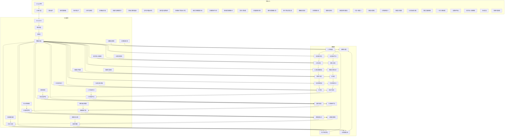
```mermaid
graph TB
subgraph "前端(H5)"
A[UniApp应用]
B[API接口层]
C[页面组件]
D[退款管理界面]
E[倒计时组件]
F[入住状态检查]
G[退租确认界面]
H[房屋状态释放监控]
I[房间设施状态展示]
J[损坏说明展示优化]
K[条件渲染逻辑改进]
L[应退租金字段显示优化]
M[审批后金额直接显示]
N[准确的用户体验]
O[按日精算退租租金]
P[实时计算功能]
Q[日期选择器验证]
R[退租场景精确计算]
S[租户姓名过滤功能]
T[模糊搜索实现]
U[合同快照机制]
V[搜索结果优化]
W[审批意见快捷填入]
X[同意一键填入]
Y[审批流程简化]
Z[运营效率提升]
AA[审批意见管理]
BB[标准化审批流程]
CC[管理员强制退租]
DD[一步式退租流程]
EE[无需用户确认]
FF[合同终止+房源释放]
GG[审计留痕]
HH[快速处理机制]
end
subgraph "后端服务"
II[Spring Boot]
JJ[控制器层]
KK[服务层]
LL[数据访问层]
MM[退款控制器]
NN[入住状态检查]
OO[倒计时控制器]
PP[退租确认处理器]
QQ[按日精算服务]
RR[退租场景计算]
SS[日期精度控制]
TT[金额验证机制]
UU[租户姓名过滤服务]
VV[合同快照查询]
WW[搜索条件构建]
XX[搜索结果返回]
YY[审批意见服务]
ZZ[标准化审批模板]
AAA[管理员强制退租服务]
BBB[一步式退租处理]
CCC[合同状态验证]
DDD[房屋状态释放]
EEE[审计记录创建]
FFF[快速处理机制]
end
subgraph "数据库"
GGG[入住申请表]
HHH[退租申请表]
III[入住记录表]
JJJ[退租记录表]
KKK[退款申请表]
LLL[配置表]
MMM[账单表]
NNN[房屋状态表]
OOO[设施信息表]
PPP[应退租金字段]
QQQ[退租场景标识]
RRR[计算精度控制]
SSS[租户姓名字段]
TTT[合同快照机制]
UUU[搜索索引优化]
VVV[审批意见字段]
WWW[标准化审批模板]
XXX[管理员操作记录]
YYY[强制退租申请]
ZZZ[快速处理状态]
AAA[审计留痕字段]
BBB[合同状态字段]
CCC[房屋状态字段]
DDD[退租原因字段]
EEE[审批人信息]
FFF[审批时间戳]
end
A --> B
B --> II
II --> JJ
JJ --> KK
KK --> LL
LL --> GGG
LL --> HHH
LL --> III
LL --> JJJ
LL --> KKK
LL --> LLL
LL --> MMM
LL --> NNN
LL --> OOO
LL --> PPP
LL --> QQQ
LL --> RRR
LL --> SSS
LL --> TTT
LL --> UUU
LL --> VVV
LL --> WWW
LL --> XXX
LL --> YYY
LL --> ZZZ
MM --> AAA
NN --> BBB
OO --> CCC
PP --> DDD
QQ --> EEE
RR --> FFF
SS --> GGG
TT --> HHH
UU --> III
VV --> JJJ
WW --> KKK
XX --> LLL
YY --> MMM
ZZ --> NNN
AAA --> OOO
BBB --> PPP
CCC --> QQQ
DDD --> RRR
EEE --> SSS
FFF --> TTT
GGG --> UUU
HHH --> VVV
III --> WWW
JJJ --> XXX
KKK --> YYY
LLL --> ZZZ
MMM --> AAA
NNN --> BBB
OOO --> CCC
PPP --> DDD
QQQ --> EEE
RRR --> FFF
SSS --> GGG
TTT --> HHH
UUU --> III
VVV --> JJJ
WWW --> KKK
XXX --> LLL
YYY --> MMM
ZZZ --> NNN
AAA --> OOO
BBB --> PPP
CCC --> QQQ
DDD --> RRR
EEE --> SSS
FFF --> TTT
```

**图表来源**
- [HzCheckInAppController.java:40-80](file://ruoyi-admin/src/main/java/com/ruoyi/web/controller/h5/HzCheckInAppController.java#L40-L80)
- [HzCheckOutAppController.java:28-60](file://ruoyi-admin/src/main/java/com/ruoyi/web/controller/system/HzCheckOutAppController.java#L28-L60)
- [HzCheckOutController.java:30-50](file://ruoyi-admin/src/main/java/com/ruoyi/web/controller/system/HzCheckOutController.java#L30-L50)
- [HzRefundController.java:36-54](file://ruoyi-admin/src/main/java/com/ruoyi/web/controller/system/HzRefundController.java#L36-L54)

**章节来源**
- [checkin.js:1-101](file://uniapp-h5/api/checkin.js#L1-L101)
- [checkout.js:1-78](file://uniapp-h5/api/checkout.js#L1-L78)
- [cohabitant.js:1-50](file://uniapp-h5/api/cohabitant.js#L1-L50)

## 核心组件

### 入住管理组件
入住管理系统包含完整的入住流程控制，支持用户在线提交入住申请、管理员审核、物品确认、费用结算等功能。

**主要功能特性**:
- 在线入住申请提交
- 实际入住日期选择
- 合同状态验证
- 押金和首期租金检查
- 合住人信息管理
- 紧急联系人设置
- 设施确认和签字
- **智能倒计时提醒**（新增）
- **入住状态检查**（新增）

### 退租管理组件
退租管理系统提供完整的退租申请处理流程，包括申请提交、费用计算、审批管理、确认签字等环节。

**主要功能特性**:
- 退租申请提交和修改
- 计划退租日期设置
- 退租原因说明
- 费用明细计算
- 审批状态跟踪
- 用户签字确认
- **按日精算退租租金**（新增）
- **智能退款计算兜底机制**（增强）
- **入住状态检测**（新增）
- **自动房屋状态释放**（新增）
- **房间设施状态展示**（优化）
- **损坏说明展示优化**（增强）
- **条件渲染逻辑改进**（增强）
- **应退租金字段显示优化**（新增）
- **租户姓名过滤功能**（新增）
- **审批意见快捷填入**（新增）
- **管理员强制退租**（新增）

### 共同居住人管理组件
系统支持共同居住人的申请和管理，提供完整的审核流程和状态跟踪。

**主要功能特性**:
- 合同关联的房源筛选
- 合住人信息申请
- 关系类型选择
- 入住日期设置
- 申请状态跟踪
- 审核结果管理

### 退款管理组件
**新增功能** 提供智能退款计算和管理功能，支持多种退款场景。

**主要功能特性**:
- 退款申请创建和管理
- 智能退款计算兜底机制
- 退款状态跟踪
- 微信原路退款
- 付款信息管理
- 退款类型区分（普通退租/入住超时自动退款）
- **租户姓名过滤**（新增）

### 倒计时管理组件
**新增功能** 提供实时倒计时信息查询，支持入住超时自动取消机制。

**主要功能特性**:
- 配置开关控制
- 启用日期过滤
- 超时小时数设置
- 支付时间基准计算
- 剩余时间显示
- 自动取消机制

### 房屋状态释放组件
**新增功能** 提供退租确认后的自动房屋状态释放机制，确保房源状态的及时更新。

**主要功能特性**:
- 退租确认触发状态释放
- 房屋状态原子性更新
- 与定时任务释放功能一致
- 并发安全的状态切换
- 异常情况下的状态回滚

### 前端界面优化组件
**新增功能** 对checkout页面进行界面优化，提升用户体验。

**主要功能特性**:
- 房间设施状态展示改进
- 损坏说明展示优化
- 条件渲染逻辑改进
- 设备分类展示
- 状态标签美化
- 费用明细突出显示
- **应退租金字段显示优化**（增强）

### 应退租金字段显示优化组件
**新增功能** 专门针对应退租金字段的显示逻辑优化，确保前端直接显示审批后的准确金额。

**主要功能特性**:
- 审批后金额直接显示
- 准确的用户体验
- 避免实时计算差异
- 金额验证和确认
- 用户界面友好展示

### 按日精算退租租金组件
**新增功能** 提供精确的按日退租租金计算功能，覆盖四种退租场景。

**主要功能特性**:
- 不满一月退租计算
- 满一月退租计算
- 未缴当期退租计算
- 未入住退租计算
- 精度控制（保留两位小数）
- 日期计算（含两端）
- 实时计算接口
- 计算明细展示

### 租户姓名过滤组件
**新增功能** 提供按租户姓名搜索退租申请和退款申请的能力。

**主要功能特性**:
- 租户姓名模糊搜索
- 合同快照机制
- 多层级搜索过滤
- 搜索结果优化
- 用户体验提升

### 退租审批快捷填入组件
**新增功能** 提供审批意见快捷填入功能，简化审批流程。

**主要功能特性**:
- "同意"一键填入审批意见
- 标准化审批意见模板
- 审批流程自动化
- 运营效率提升
- 审批意见规范化

### 审批意见管理组件
**新增功能** 提供完整的审批意见管理机制。

**主要功能特性**:
- 审批意见字段存储
- 审批意见验证
- 审批意见展示
- 审批流程控制
- 审批状态跟踪

### 管理员强制退租组件
**新增功能** 提供管理员直接退租功能，支持无需用户确认的一步式退租流程。

**主要功能特性**:
- 无需用户确认的退租流程
- 一步式完成合同终止和房源释放
- 审计留痕机制
- 快速处理机制
- 合同状态验证
- 房屋状态释放
- 退租原因记录

**章节来源**
- [HzCheckInAppController.java:444-522](file://ruoyi-admin/src/main/java/com/ruoyi/web/controller/h5/HzCheckInAppController.java#L444-L522)
- [HzCheckOutAppController.java:136-210](file://ruoyi-admin/src/main/java/com/ruoyi/web/controller/system/HzCheckOutAppController.java#L136-L210)
- [HzCheckOutController.java:100-113](file://ruoyi-admin/src/main/java/com/ruoyi/web/controller/system/HzCheckOutController.java#L100-L113)
- [HzRefundController.java:55-78](file://ruoyi-admin/src/main/java/com/ruoyi/web/controller/system/HzRefundController.java#L55-L78)

## 架构概览

### 系统架构设计

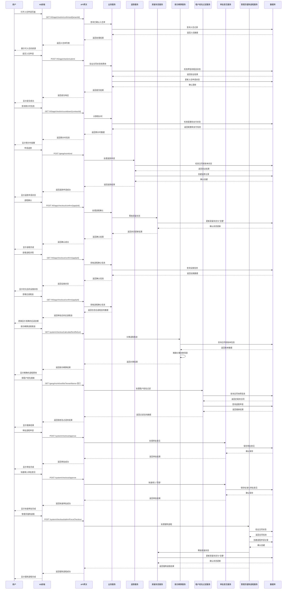
```mermaid
sequenceDiagram
participant U as 用户
participant H5 as H5前端
participant API as API网关
participant S as 业务服务
participant R as 退款服务
participant HS as 房屋状态服务
participant CR as 按日精算服务
participant TN as 租户姓名过滤服务
participant AI as 审批意见服务
participant MF as 管理员强制退租服务
participant DB as 数据库
U->>H5 : 打开入住申请页面
H5->>API : GET /h5/app/checkin/confirmed/{tenantId}
API->>S : 查询已确认入住单
S->>DB : 查询入住记录
DB-->>S : 返回入住数据
S-->>API : 返回处理结果
API-->>H5 : 返回入住单列表
H5-->>U : 展示可入住的房源
U->>H5 : 提交入住申请
H5->>API : POST /h5/app/checkin/submit
API->>S : 验证合同状态和费用
S->>DB : 检查押金和租金状态
DB-->>S : 返回验证结果
S->>DB : 更新入住申请状态
DB-->>S : 确认更新
S-->>API : 返回提交结果
API-->>H5 : 返回成功响应
H5-->>U : 显示提交成功
U->>H5 : 查询倒计时信息
H5->>API : GET /h5/app/checkin/countdown/{contractId}
API->>S : 计算倒计时
S->>DB : 检查配置和支付状态
DB-->>S : 返回配置和支付信息
S-->>API : 返回倒计时数据
API-->>H5 : 返回倒计时信息
H5-->>U : 显示倒计时提醒
U->>H5 : 申请退款
H5->>API : POST /gangzhu/refund
API->>R : 处理退款申请
R->>DB : 检查合同和账单状态
DB-->>R : 返回验证结果
R->>DB : 创建退款记录
DB-->>R : 确认创建
R-->>API : 返回退款结果
API-->>H5 : 返回退款申请成功
H5-->>U : 显示退款申请状态
U->>H5 : 退租确认
H5->>API : POST /h5/app/checkout/confirm/{applyId}
API->>S : 处理退租确认
S->>HS : 释放房屋状态
HS->>DB : 更新房屋状态为"空置"
DB-->>HS : 确认状态更新
HS-->>S : 返回状态更新结果
S-->>API : 返回确认结果
API-->>H5 : 返回确认成功
H5-->>U : 显示退租完成
U->>H5 : 查看退租详情
H5->>API : GET /h5/app/checkout/confirm/{applyId}
API->>S : 获取退租确认信息
S->>DB : 查询设施信息
DB-->>S : 返回设施数据
S-->>API : 返回确认信息
API-->>H5 : 返回设施状态
H5-->>U : 显示优化后的设施状态
U->>H5 : 查看应退租金
H5->>API : GET /h5/app/checkout/confirm/{applyId}
API->>S : 获取退租确认信息
S-->>API : 返回包含应退租金的数据
API-->>H5 : 返回审批后的应退租金
H5-->>U : 直接显示准确的应退金额
U->>H5 : 按日精算退租租金
H5->>API : GET /system/checkout/calculateRentRefund
API->>CR : 计算退租租金
CR->>DB : 查询合同和账单信息
DB-->>CR : 返回账单数据
CR->>CR : 精确计算四种场景
CR-->>API : 返回计算结果
API-->>H5 : 返回按日精算结果
H5-->>U : 显示精确的退租费用
U->>H5 : 按租户姓名搜索
H5->>API : GET /gangzhu/refund/list?tenantName=张三
API->>TN : 处理租户姓名过滤
TN->>DB : 查询合同快照信息
DB-->>TN : 返回匹配的合同
TN->>DB : 查询退租申请
DB-->>TN : 返回搜索结果
TN-->>API : 返回过滤后的数据
API-->>H5 : 返回按姓名过滤的结果
H5-->>U : 显示搜索结果
U->>H5 : 审批退租申请
H5->>API : POST /system/checkout/approve
API->>AI : 处理审批意见
AI->>DB : 保存审批意见
DB-->>AI : 确认保存
AI-->>API : 返回审批结果
API-->>H5 : 返回审批成功
H5-->>U : 显示审批完成
U->>H5 : 快捷填入审批意见
H5->>API : POST /system/checkout/approve
API->>AI : 快速填入"同意"
AI->>DB : 保存标准化审批意见
DB-->>AI : 确认保存
AI-->>API : 返回审批结果
API-->>H5 : 返回快速审批成功
H5-->>U : 显示快速审批完成
U->>H5 : 管理员强制退租
H5->>API : POST /system/checkout/adminForceCheckout
API->>MF : 处理强制退租
MF->>DB : 验证合同状态
DB-->>MF : 返回合同信息
MF->>DB : 创建退租申请记录
DB-->>MF : 确认创建
MF->>HS : 释放房屋状态
HS->>DB : 更新房屋状态为"空置"
DB-->>HS : 确认状态更新
MF-->>API : 返回强制退租结果
API-->>H5 : 返回强制退租成功
H5-->>U : 显示强制退租完成
```

**图表来源**
- [HzCheckInAppController.java:199-283](file://ruoyi-admin/src/main/java/com/ruoyi/web/controller/h5/HzCheckInAppController.java#L199-L283)
- [HzCheckInAppController.java:444-522](file://ruoyi-admin/src/main/java/com/ruoyi/web/controller/h5/HzCheckInAppController.java#L444-L522)
- [HzCheckInAppController.java:907-1004](file://ruoyi-admin/src/main/java/com/ruoyi/web/controller/h5/HzCheckInAppController.java#L907-L1004)
- [HzCheckOutController.java:100-113](file://ruoyi-admin/src/main/java/com/ruoyi/web/controller/system/HzCheckOutController.java#L100-L113)
- [HzRefundController.java:55-78](file://ruoyi-admin/src/main/java/com/ruoyi/web/controller/system/HzRefundController.java#L55-L78)
- [HzCheckOutAppController.java:304-321](file://ruoyi-admin/src/main/java/com/ruoyi/web/controller/system/HzCheckOutAppController.java#L304-L321)
- [HzCheckoutServiceImpl.java:700-816](file://ruoyi-system/src/main/java/com/ruoyi/system/service/impl/HzCheckoutServiceImpl.java#L700-L816)
- [HzCheckoutServiceImpl.java:1103-1133](file://ruoyi-system/src/main/java/com/ruoyi/system/service/impl/HzCheckoutServiceImpl.java#L1103-L1133)

### 数据流架构

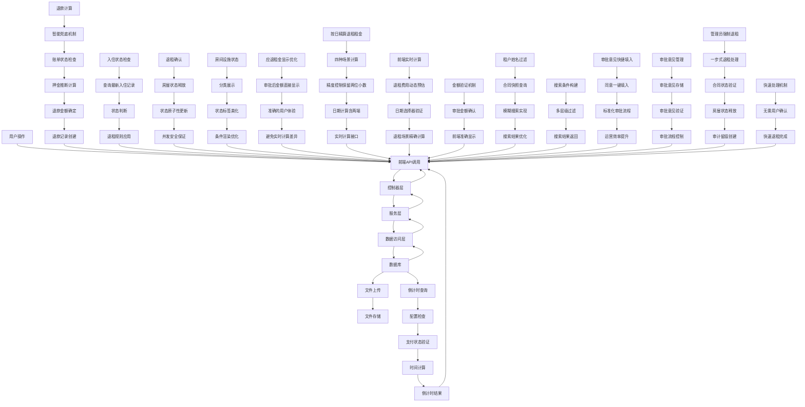
```mermaid
flowchart TD
A[用户操作] --> B[前端API调用]
B --> C[控制器层]
C --> D[服务层]
D --> E[数据访问层]
E --> F[数据库]
F --> E
E --> D
D --> C
C --> B
G[文件上传] --> H[文件存储]
I[倒计时查询] --> J[配置检查]
J --> K[支付状态验证]
K --> L[时间计算]
L --> M[倒计时结果]
M --> B
F --> G
F --> I
N[退款计算] --> O[智能兜底机制]
O --> P[账单状态检查]
P --> Q[押金推断计算]
Q --> R[退款金额确定]
R --> S[退款记录创建]
S --> B
T[入住状态检查] --> U[查询最新入住记录]
U --> V[状态判断]
V --> W[退租规则应用]
W --> B
X[退租确认] --> Y[房屋状态释放]
Y --> Z[状态原子性更新]
Z --> AA[并发安全保证]
AA --> B
BB[房间设施状态] --> CC[分类展示]
CC --> DD[状态标签美化]
DD --> EE[条件渲染优化]
EE --> B
FF[应退租金显示优化] --> GG[审批后金额直接显示]
GG --> HH[准确的用户体验]
HH --> II[避免实时计算差异]
II --> B
JJ[按日精算退租租金] --> KK[四种场景计算]
KK --> LL[精度控制保留两位小数]
LL --> MM[日期计算含两端]
MM --> NN[实时计算接口]
NN --> B
OO[前端实时计算] --> PP[退租费用动态预估]
PP --> QQ[日期选择器验证]
QQ --> RR[退租场景精确计算]
RR --> B
SS[金额验证机制] --> TT[审批金额确认]
TT --> UU[前端准确显示]
UU --> B
VV[租户姓名过滤] --> WW[合同快照查询]
WW --> XX[模糊搜索实现]
XX --> YY[搜索结果优化]
YY --> B
ZZ[搜索条件构建] --> AAA[多层级过滤]
AAA --> BBB[搜索结果返回]
BBB --> B
CCC[审批意见快捷填入] --> DDD[同意一键填入]
DDD --> EEE[标准化审批流程]
EEE --> FFF[运营效率提升]
FFF --> B
GGG[审批意见管理] --> HHH[审批意见存储]
HHH --> III[审批意见验证]
III --> JJJ[审批流程控制]
JJJ --> B
KKK[管理员强制退租] --> LLL[一步式退租处理]
LLL --> MMM[合同状态验证]
MMM --> NNN[房屋状态释放]
NNN --> OOO[审计留痕创建]
OOO --> B
PPP[快速处理机制] --> QQQ[无需用户确认]
QQQ --> RRR[快速退租完成]
RRR --> B
```

**图表来源**
- [HzCheckInServiceImpl.java:22-112](file://ruoyi-system/src/main/java/com/ruoyi/system/service/impl/HzCheckInServiceImpl.java#L22-L112)
- [HzCheckoutServiceImpl.java:53-827](file://ruoyi-system/src/main/java/com/ruoyi/system/service/impl/HzCheckoutServiceImpl.java#L53-L827)
- [HzRefundController.java:144-224](file://ruoyi-admin/src/main/java/com/ruoyi/web/controller/system/HzRefundController.java#L144-L224)
- [HzCheckoutServiceImpl.java:700-816](file://ruoyi-system/src/main/java/com/ruoyi/system/service/impl/HzCheckoutServiceImpl.java#L700-L816)
- [HzCheckoutApply.java:88-90](file://ruoyi-system/src/main/java/com/ruoyi/system/domain/HzCheckoutApply.java#L88-L90)

## 详细组件分析

### 入住申请处理流程

#### 入住申请提交流程

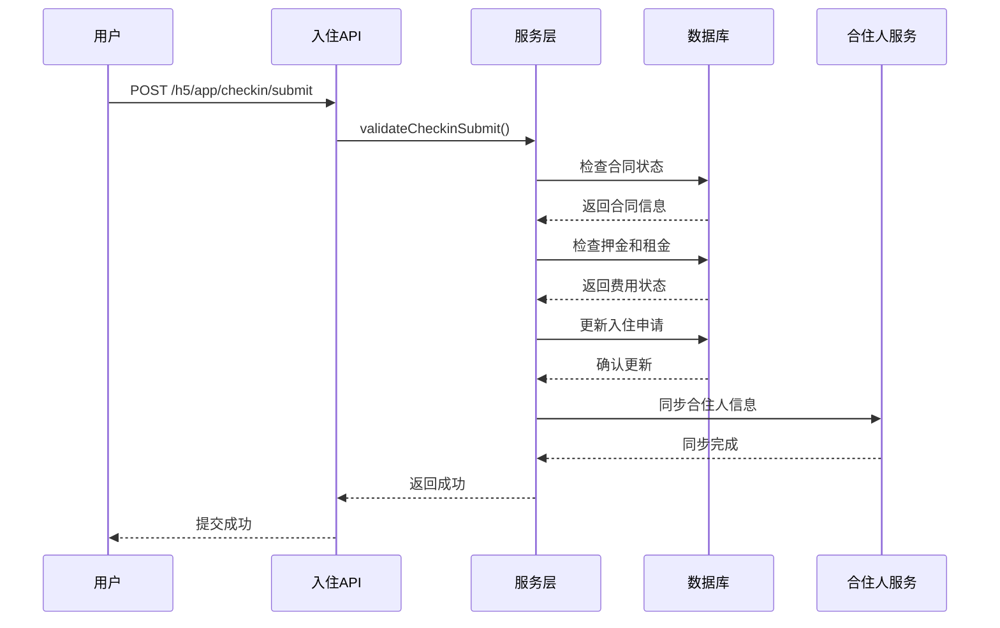
```mermaid
sequenceDiagram
participant U as 用户
participant API as 入住API
participant SVC as 服务层
participant DB as 数据库
participant CO as 合住人服务
U->>API : POST /h5/app/checkin/submit
API->>SVC : validateCheckinSubmit()
SVC->>DB : 检查合同状态
DB-->>SVC : 返回合同信息
SVC->>DB : 检查押金和租金
DB-->>SVC : 返回费用状态
SVC->>DB : 更新入住申请
DB-->>SVC : 确认更新
SVC->>CO : 同步合住人信息
CO-->>SVC : 同步完成
SVC-->>API : 返回成功
API-->>U : 提交成功
```

**图表来源**
- [HzCheckInAppController.java:444-522](file://ruoyi-admin/src/main/java/com/ruoyi/web/controller/h5/HzCheckInAppController.java#L444-L522)
- [HzCheckInAppController.java:787-800](file://ruoyi-admin/src/main/java/com/ruoyi/web/controller/h5/HzCheckInAppController.java#L787-L800)

#### 入住确认流程

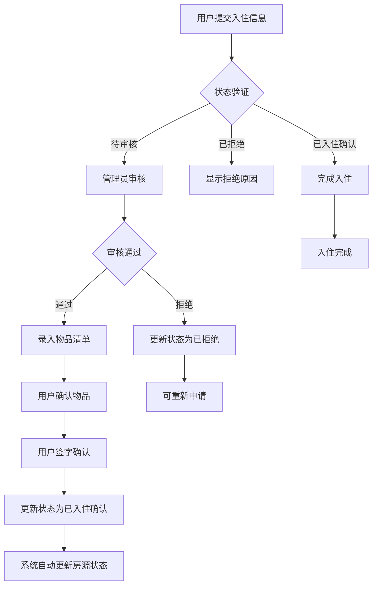
```mermaid
flowchart TD
A[用户提交入住信息] --> B{状态验证}
B --> |待审核| C[管理员审核]
B --> |已拒绝| D[显示拒绝原因]
B --> |已入住确认| E[完成入住]
C --> F{审核通过}
F --> |通过| G[录入物品清单]
F --> |拒绝| H[更新状态为已拒绝]
G --> I[用户确认物品]
I --> J[用户签字确认]
J --> K[更新状态为已入住确认]
K --> L[系统自动更新房源状态]
E --> M[入住完成]
H --> N[可重新申请]
```

**图表来源**
- [HzCheckInAppController.java:571-712](file://ruoyi-admin/src/main/java/com/ruoyi/web/controller/h5/HzCheckInAppController.java#L571-L712)
- [HzCheckInServiceImpl.java:25-47](file://ruoyi-system/src/main/java/com/ruoyi/system/service/impl/HzCheckInServiceImpl.java#L25-L47)

**章节来源**
- [checkin.js:52-65](file://uniapp-h5/api/checkin.js#L52-L65)
- [HzCheckInAppController.java:444-522](file://ruoyi-admin/src/main/java/com/ruoyi/web/controller/h5/HzCheckInAppController.java#L444-L522)

### 退租申请处理流程

#### 退租申请提交流程

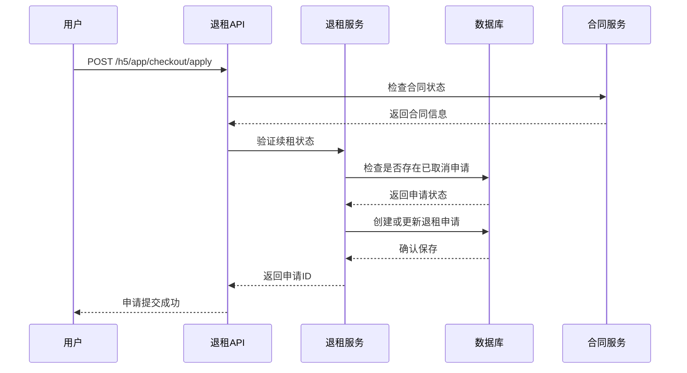
```mermaid
sequenceDiagram
participant U as 用户
participant API as 退租API
participant SVC as 退租服务
participant DB as 数据库
participant CT as 合同服务
U->>API : POST /h5/app/checkout/apply
API->>CT : 检查合同状态
CT-->>API : 返回合同信息
API->>SVC : 验证续租状态
SVC->>DB : 检查是否存在已取消申请
DB-->>SVC : 返回申请状态
SVC->>DB : 创建或更新退租申请
DB-->>SVC : 确认保存
SVC-->>API : 返回申请ID
API-->>U : 申请提交成功
```

**图表来源**
- [HzCheckOutAppController.java:136-210](file://ruoyi-admin/src/main/java/com/ruoyi/web/controller/h5/HzCheckOutAppController.java#L136-L210)
- [HzCheckoutServiceImpl.java:407-416](file://ruoyi-system/src/main/java/com/ruoyi/system/service/impl/HzCheckoutServiceImpl.java#L407-L416)

#### 退租费用计算流程

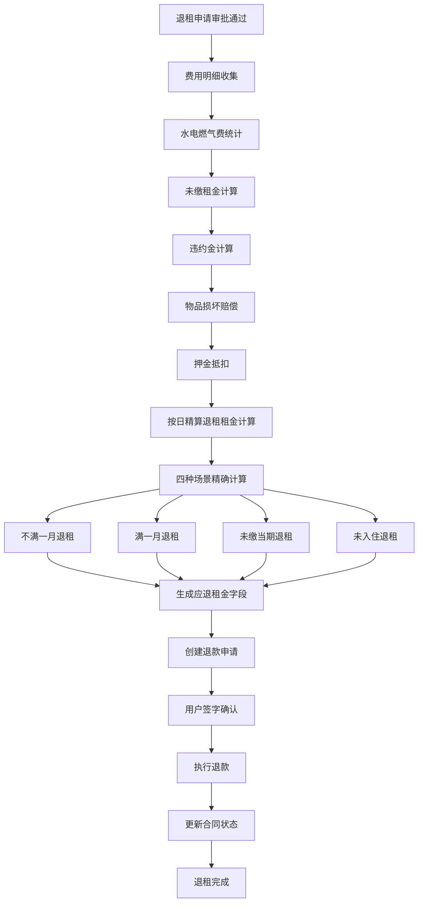
```mermaid
flowchart TD
A[退租申请审批通过] --> B[费用明细收集]
B --> C[水电燃气费统计]
C --> D[未缴租金计算]
D --> E[违约金计算]
E --> F[物品损坏赔偿]
F --> G[押金抵扣]
G --> H[按日精算退租租金计算]
H --> I[四种场景精确计算]
I --> J[不满一月退租]
I --> K[满一月退租]
I --> L[未缴当期退租]
I --> M[未入住退租]
J --> N[生成应退租金字段]
K --> N
L --> N
M --> N
N --> O[创建退款申请]
O --> P[用户签字确认]
P --> Q[执行退款]
Q --> R[更新合同状态]
R --> S[退租完成]
```

**图表来源**
- [HzCheckoutServiceImpl.java:518-614](file://ruoyi-system/src/main/java/com/ruoyi/system/service/impl/HzCheckoutServiceImpl.java#L518-L614)
- [HzCheckoutServiceImpl.java:648-764](file://ruoyi-system/src/main/java/com/ruoyi/system/service/impl/HzCheckoutServiceImpl.java#L648-L764)

**章节来源**
- [checkout.js:31-68](file://uniapp-h5/api/checkout.js#L31-L68)
- [HzCheckOutAppController.java:285-321](file://ruoyi-admin/src/main/java/com/ruoyi/web/controller/h5/HzCheckOutAppController.java#L285-L321)

### 共同居住人管理流程

#### 合住人申请流程

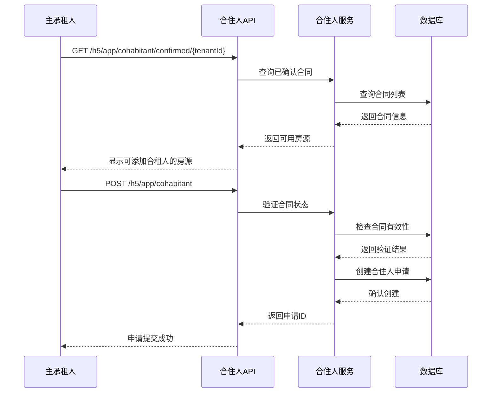
```mermaid
sequenceDiagram
participant U as 主承租人
participant API as 合住人API
participant SVC as 合住人服务
participant DB as 数据库
U->>API : GET /h5/app/cohabitant/confirmed/{tenantId}
API->>SVC : 查询已确认合同
SVC->>DB : 查询合同列表
DB-->>SVC : 返回合同信息
SVC-->>API : 返回可用房源
API-->>U : 显示可添加合租人的房源
U->>API : POST /h5/app/cohabitant
API->>SVC : 验证合同状态
SVC->>DB : 检查合同有效性
DB-->>SVC : 返回验证结果
SVC->>DB : 创建合住人申请
DB-->>SVC : 确认创建
SVC-->>API : 返回申请ID
API-->>U : 申请提交成功
```

**图表来源**
- [cohabitant.js:26-42](file://uniapp-h5/api/cohabitant.js#L26-L42)
- [cohabitant.vue:196-220](file://uniapp-h5/subpkg/affairs/cohabitant.vue#L196-L220)

**章节来源**
- [cohabitant.js:10-42](file://uniapp-h5/api/cohabitant.js#L10-L42)
- [cohabitant.vue:138-367](file://uniapp-h5/subpkg/affairs/cohabitant.vue#L138-L367)

### 退租审批流程

#### 审批流程优化

**更新功能** 新增了审批意见快捷填入功能，简化了审批流程：

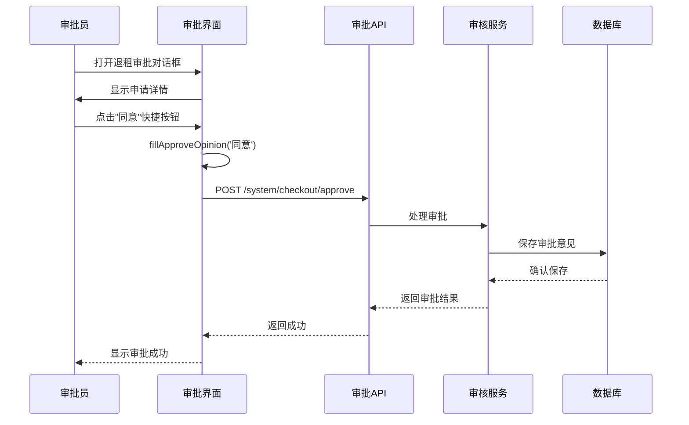
```mermaid
sequenceDiagram
participant A as 审批员
participant UI as 审批界面
participant API as 审批API
participant SVC as 审核服务
participant DB as 数据库
A->>UI : 打开退租审批对话框
UI->>A : 显示申请详情
A->>UI : 点击"同意"快捷按钮
UI->>UI : fillApproveOpinion('同意')
UI->>API : POST /system/checkout/approve
API->>SVC : 处理审批
SVC->>DB : 保存审批意见
DB-->>SVC : 确认保存
SVC-->>API : 返回审批结果
API-->>UI : 返回成功
UI-->>A : 显示审批成功
```

**图表来源**
- [checkout-index.vue:929-932](file://ruoyi-ui/src/views/gangzhu/checkout/index.vue#L929-L932)
- [checkout-index.vue:269-276](file://ruoyi-ui/src/views/gangzhu/checkout/index.vue#L269-L276)
- [HzCheckOutController.java:100-113](file://ruoyi-admin/src/main/java/com/ruoyi/web/controller/system/HzCheckOutController.java#L100-L113)

#### 审批意见字段管理

**新增功能** HzCheckoutApply实体类新增了approveOpinion字段：

```java
/** 审批意见 */
@TableField("approve_opinion")
private String approveOpinion;
```

该字段支持：
- 审批通过时的标准意见
- 审批拒绝时的详细说明
- 审批流程的完整记录
- 后续审计和追溯

**章节来源**
- [checkout-index.vue:929-932](file://ruoyi-ui/src/views/gangzhu/checkout/index.vue#L929-L932)
- [checkout-index.vue:269-276](file://ruoyi-ui/src/views/gangzhu/checkout/index.vue#L269-L276)
- [checkout-index.vue:1114-1118](file://ruoyi-ui/src/views/gangzhu/checkout/index.vue#L1114-L1118)
- [checkout-index.vue:1192-1196](file://ruoyi-ui/src/views/gangzhu/checkout/index.vue#L1192-L1196)
- [HzCheckOutController.java:100-113](file://ruoyi-admin/src/main/java/com/ruoyi/web/controller/system/HzCheckOutController.java#L100-L113)
- [HzCheckoutApply.java:88-90](file://ruoyi-system/src/main/java/com/ruoyi/system/domain/HzCheckoutApply.java#L88-L90)

## 管理员强制退租功能

### 强制退租接口设计

**新增功能** 管理员强制退租接口支持无需用户确认的一步式退租流程，直接完成合同终止和房源释放。

#### 强制退租API接口

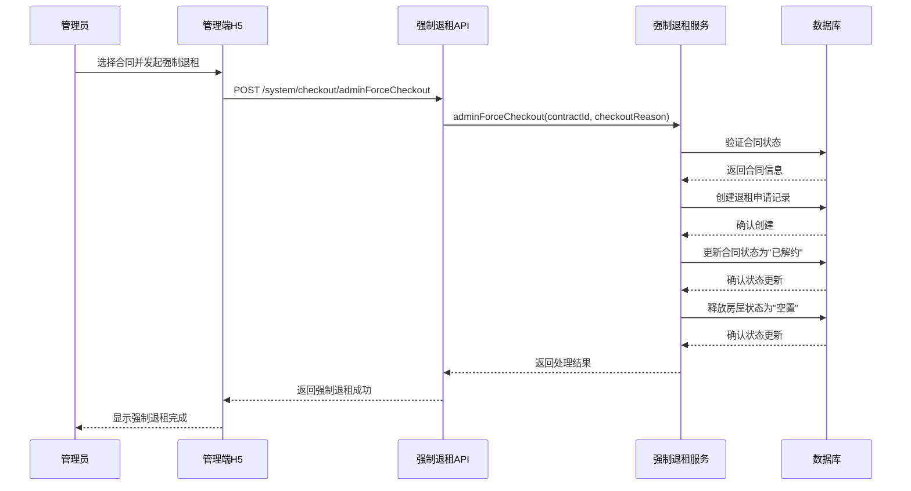
```mermaid
sequenceDiagram
participant M as 管理员
participant H5 as 管理端H5
participant API as 强制退租API
participant SVC as 强制退租服务
participant DB as 数据库
M->>H5 : 选择合同并发起强制退租
H5->>API : POST /system/checkout/adminForceCheckout
API->>SVC : adminForceCheckout(contractId, checkoutReason)
SVC->>DB : 验证合同状态
DB-->>SVC : 返回合同信息
SVC->>DB : 创建退租申请记录
DB-->>SVC : 确认创建
SVC->>DB : 更新合同状态为"已解约"
DB-->>SVC : 确认状态更新
SVC->>DB : 释放房屋状态为"空置"
DB-->>SVC : 确认状态更新
SVC-->>API : 返回处理结果
API-->>H5 : 返回强制退租成功
H5-->>M : 显示强制退租完成
```

**图表来源**
- [HzCheckOutController.java:181-193](file://ruoyi-admin/src/main/java/com/ruoyi/web/controller/system/HzCheckOutController.java#L181-L193)
- [HzCheckoutServiceImpl.java:1103-1133](file://ruoyi-system/src/main/java/com/ruoyi/system/service/impl/HzCheckoutServiceImpl.java#L1103-L1133)

#### 强制退租服务实现

```java
@Override
@Transactional
public int adminForceCheckout(Long contractId, String checkoutReason) {
    // 1. 查询合同信息
    HzContract contract = contractMapper.selectById(contractId);
    if (contract == null) {
        throw new ServiceException("合同不存在");
    }
    // 校验合同状态必须为已签署(2)或履行中(3)
    if (!"2".equals(contract.getContractStatus()) && !"3".equals(contract.getContractStatus())) {
        throw new ServiceException("该合同状态不允许退租");
    }

    String adminUser = SecurityUtils.getUsername();
    Date now = new Date();

    // 2. 创建退租申请记录（审计留痕），直接设为已完成
    HzCheckoutApply apply = new HzCheckoutApply();
    apply.setContractId(contractId);
    apply.setTenantId(contract.getTenantId());
    apply.setHouseId(contract.getHouseId());
    apply.setApplyTime(now);
    apply.setPlanCheckoutDate(now);
    apply.setCheckoutReason(checkoutReason);
    apply.setApplyStatus("5"); // 直接已完成
    apply.setApproveBy(adminUser);
    apply.setApproveTime(now);
    apply.setApproveOpinion("管理员直接退租");
    apply.setCreateBy(adminUser);
    apply.setDelFlag("0");
    checkoutApplyMapper.insert(apply);

    // 3. 更新合同状态为"已解约"
    contract.setContractStatus("5");
    contract.setUpdater(adminUser);
    contract.setUpdateTime(now);
    contractMapper.updateById(contract);

    // 4. 释放房屋状态为"空置"
    houseMapper.releaseHouseStatus(contract.getHouseId());

    return 1;
}
```

#### 强制退租权限控制

强制退租接口采用严格的权限控制：

| 权限标识 | 权限描述 | 使用场景 |
|---------|----------|----------|
| gangzhu:checkout:forceCheckout | 管理员强制退租权限 | 管理员执行强制退租操作 |
| gangzhu:checkout:query | 退租查询权限 | 查看退租相关信息 |
| gangzhu:checkout:confirm | 退租确认权限 | 管理方确认退租操作 |

#### 强制退租流程优势

1. **快速处理**: 无需等待用户确认，直接完成退租流程
2. **审计留痕**: 完整的审计记录，便于追溯和监管
3. **状态一致性**: 同步更新合同状态和房屋状态
4. **风险控制**: 严格的合同状态验证，防止误操作
5. **用户体验**: 适用于紧急退租场景，提升处理效率

#### 强制退租前端集成

**新增功能** 管理端H5界面集成了强制退租功能：

##### 强制退租按钮设计

```html
<el-button type="danger" icon="Delete" @click="forceCheckout">强制退租</el-button>
```

##### 强制退租确认对话框

```javascript
forceCheckout() {
  this.$confirm('确认要执行强制退租吗？此操作将立即终止合同并释放房源，且无法撤销。', '警告', {
    confirmButtonText: '确定',
    cancelButtonText: '取消',
    type: 'warning'
  }).then(() => {
    const requestData = {
      contractId: this.currentRow.contractId,
      checkoutReason: this.forceCheckoutReason
    };
    adminForceCheckout(requestData).then(response => {
      this.$message.success('强制退租成功');
      this.getList();
    });
  }).catch(() => {
    this.$message.info('已取消强制退租');
  });
}
```

**章节来源**
- [HzCheckOutController.java:181-193](file://ruoyi-admin/src/main/java/com/ruoyi/web/controller/system/HzCheckOutController.java#L181-L193)
- [HzCheckoutServiceImpl.java:1103-1133](file://ruoyi-system/src/main/java/com/ruoyi/system/service/impl/HzCheckoutServiceImpl.java#L1103-L1133)
- [IHzCheckoutService.java:207-215](file://ruoyi-system/src/main/java/com/ruoyi/system/service/IHzCheckoutService.java#L207-L215)

## 按日精算退租租金功能

### 四种退租场景精确计算

**新增功能** HzCheckoutServiceImpl实现了按日精算退租租金功能，覆盖四种退租场景的精确计算。

#### 按日精算计算逻辑

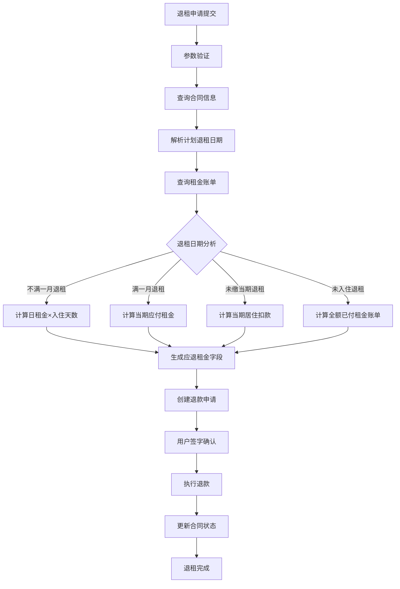
```mermaid
flowchart TD
A[退租申请提交] --> B[参数验证]
B --> C[查询合同信息]
C --> D[解析计划退租日期]
D --> E[查询租金账单]
E --> F{退租日期分析}
F --> |不满一月退租| G[计算日租金×入住天数]
F --> |满一月退租| H[计算当期应付租金]
F --> |未缴当期退租| I[计算当期居住扣款]
F --> |未入住退租| J[计算全额已付租金账单]
G --> K[生成应退租金字段]
H --> K
I --> K
J --> K
K --> L[创建退款申请]
L --> M[用户签字确认]
M --> N[执行退款]
N --> O[更新合同状态]
O --> P[退租完成]
```

**图表来源**
- [HzCheckoutServiceImpl.java:885-1007](file://ruoyi-system/src/main/java/com/ruoyi/system/service/impl/HzCheckoutServiceImpl.java#L885-L1007)

#### 四种退租场景详细说明

| 退租场景 | 计算公式 | 适用条件 | 精度控制 |
|---------|----------|----------|----------|
| 不满一月退租 | rentRefund = 已缴 - 日租金×入住天数 | 退租当期已缴 | 保留2位小数 |
| 满一月退租 | rentRefund = 已缴 - 日租金×入住天数 | 退租当期(下一期)已缴 | 保留2位小数 |
| 未缴当期退租 | currentPeriodOwed = 日租金×入住天数 | 退租当期未缴费 | 保留2位小数 |
| 未入住退租 | rentRefund = 全部已付租金账单 | 退租日≤合同生效日 | 全额退还 |

#### 精度控制和日期计算

按日精算功能包含以下关键特性：

1. **精度控制**: 日租金 = 月租金 / 当期天数，先保留2位小数（HALF_UP）再乘入住天数
2. **日期计算**: 入住天数含两端：end - start + 1
3. **场景覆盖**: 完整覆盖四种退租场景
4. **计算明细**: 提供详细的计算过程说明

#### 后端按日精算服务实现

```java
@Override
public Map<String, Object> calculateRentRefund(Long contractId, String planCheckoutDate) {
    Map<String, Object> result = new HashMap<>();
    BigDecimal rentRefund = BigDecimal.ZERO;
    BigDecimal currentPeriodOwed = BigDecimal.ZERO;
    StringBuilder detail = new StringBuilder();
    
    // 1. 参数校验 + 查合同
    if (contractId == null || StringUtils.isEmpty(planCheckoutDate)) {
        result.put("rentRefund", BigDecimal.ZERO);
        result.put("currentPeriodOwed", BigDecimal.ZERO);
        result.put("detail", "参数不足");
        return result;
    }
    
    // 2. 解析日期 + 查询账单
    // ... (详细实现逻辑)
    
    // 3. 四种场景计算
    // ... (场景计算逻辑)
    
    // 4. 精度控制和结果返回
    result.put("rentRefund", rentRefund.setScale(2, RoundingMode.HALF_UP));
    result.put("currentPeriodOwed", currentPeriodOwed.setScale(2, RoundingMode.HALF_UP));
    result.put("detail", detail.toString());
    return result;
}
```

**章节来源**
- [HzCheckoutServiceImpl.java:885-1007](file://ruoyi-system/src/main/java/com/ruoyi/system/service/impl/HzCheckoutServiceImpl.java#L885-L1007)

### 前端按日精算功能集成

#### 实时计算接口调用

**新增功能** ruoyi-ui中的退租审批页面集成了按日精算功能，提供实时计算能力。

##### 计算接口实现

```javascript
// 调用后端按日精算接口，计算应退租金 + 当期居住扣款
fetchRentRefund(contractId, planCheckoutDate) {
  if (!contractId || !planCheckoutDate) {
    this.refundResult = { rentRefund: 0, currentPeriodOwed: 0, detail: '' };
    return Promise.resolve();
  }
  return calculateRentRefund(contractId, planCheckoutDate).then(res => {
    const data = res.data || {};
    this.refundResult = {
      rentRefund: Number(data.rentRefund) || 0,
      currentPeriodOwed: Number(data.currentPeriodOwed) || 2,
      detail: data.detail || '后端未返回计算明细'
    };
    // 重新计算 refundAmount
    if (this.billList && this.billList.length > 0) {
      this.approveForm.refundAmount = this.calculateInitialRefund();
    }
  }).catch(() => {
    this.refundResult = { 
      rentRefund: 0, 
      currentPeriodOwed: 0, 
      detail: '计算接口调用失败，已退化为前端默认计算' 
    };
  });
}
```

##### 计算结果展示

前端界面提供了详细的计算结果显示：

1. **计算明细**: 显示详细的计算过程和依据
2. **应退租金**: 显示按日精算得出的应退金额
3. **当期居住扣款**: 显示未缴当期房租的扣款金额
4. **退化处理**: 当后端接口失败时，自动退化为前端计算

#### 移动端H5日期选择器验证

**更新功能** H5端的退租日期选择器增加了严格的验证机制：

##### 日期验证逻辑

```javascript
// 退租日期验证
validateCheckoutDate(date) {
  const today = new Date();
  const selectedDate = new Date(date);
  
  // 不能选择过去的日期
  if (selectedDate < today) {
    return { valid: false, message: '退租日期不能早于今天' };
  }
  
  // 不能超过合同结束日期
  const contractEndDate = new Date(this.currentForm.endDate);
  if (selectedDate > contractEndDate) {
    return { valid: false, message: '退租日期不能晚于合同结束日期' };
  }
  
  return { valid: true, message: '日期有效' };
}
```

##### 日期选择器配置

- **最小日期**: 当前日期（今日）
- **最大日期**: 合同结束日期
- **格式**: yyyy-MM-dd
- **验证**: 实时验证和提交验证双重保障

**章节来源**
- [checkout.js:88-95](file://ruoyi-ui/src/api/gangzhu/checkout.js#L88-L95)
- [checkout-index.vue:960-980](file://ruoyi-ui/src/views/gangzhu/checkout/index.vue#L960-L980)
- [checkout-index.vue:1008-1047](file://ruoyi-ui/src/views/gangzhu/checkout/index.vue#L1008-L1047)

## 智能退款计算机制

### 退款计算兜底逻辑

**新增功能** HzRefundController实现了智能退款计算兜底机制，确保退款计算的准确性和可靠性。

#### 退款计算流程

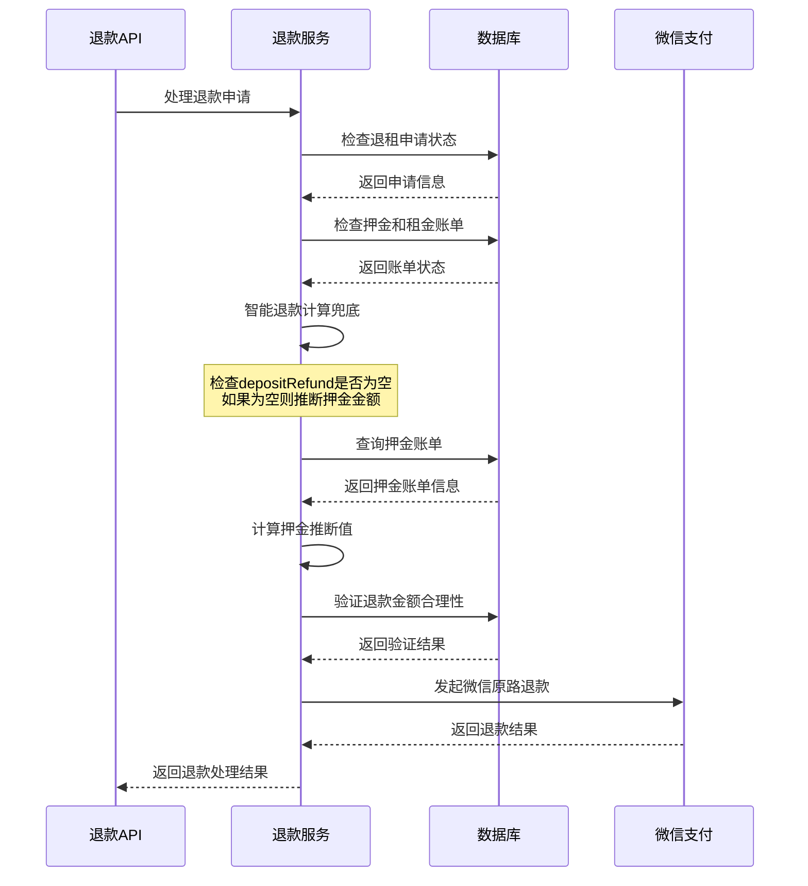
```mermaid
sequenceDiagram
participant API as 退款API
participant SVC as 退款服务
participant DB as 数据库
participant WX as 微信支付
API->>SVC : 处理退款申请
SVC->>DB : 检查退租申请状态
DB-->>SVC : 返回申请信息
SVC->>DB : 检查押金和租金账单
DB-->>SVC : 返回账单状态
SVC->>SVC : 智能退款计算兜底
Note over SVC : 检查depositRefund是否为空<br/>如果为空则推断押金金额
SVC->>DB : 查询押金账单
DB-->>SVC : 返回押金账单信息
SVC->>SVC : 计算押金推断值
SVC->>DB : 验证退款金额合理性
DB-->>SVC : 返回验证结果
SVC->>WX : 发起微信原路退款
WX-->>SVC : 返回退款结果
SVC-->>API : 返回退款处理结果
```

**图表来源**
- [HzRefundController.java:144-224](file://ruoyi-admin/src/main/java/com/ruoyi/web/controller/system/HzRefundController.java#L144-L224)

#### 智能兜底机制

退款计算包含以下智能兜底逻辑：

1. **押金金额推断**: 当`depositRefund`未保存时，系统会自动从押金账单的已付金额推断
2. **金额范围验证**: 确保推断的押金金额不超过应退总额
3. **账单状态检查**: 验证押金和租金账单的状态和金额
4. **退款载体选择**: 选择合适的账单作为退款载体

#### 退款类型区分

系统支持两种退款类型：

| 退款类型 | 识别方式 | 用途 |
|---------|----------|------|
| checkout | 普通退租 | 正常退租流程 |
| auto-cancel-checkin | 包含"入住超时自动解约" | 入住超时自动退款 |

**章节来源**
- [HzRefundController.java:144-224](file://ruoyi-admin/src/main/java/com/ruoyi/web/controller/system/HzRefundController.java#L144-L224)
- [HzRefundApplyVO.java:52-56](file://ruoyi-system/src/main/java/com/ruoyi/system/domain/HzRefundApplyVO.java#L52-L56)
- [HzRefundServiceImpl.java:172-179](file://ruoyi-system/src/main/java/com/ruoyi/system/service/impl/HzRefundServiceImpl.java#L172-L179)

## 入住状态检查功能

### 入住状态检测机制

**新增功能** HzCheckoutServiceImpl和HzCheckoutApplyVO实现了入住状态检查功能，用于退租流程中的状态判断。

#### 入住状态检查流程

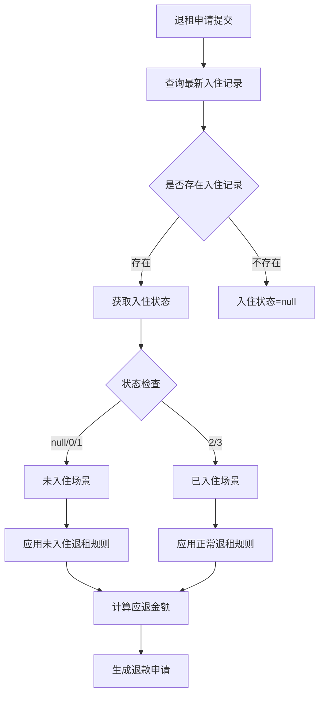
```mermaid
flowchart TD
A[退租申请提交] --> B[查询最新入住记录]
B --> C{是否存在入住记录}
C --> |存在| D[获取入住状态]
C --> |不存在| E[入住状态=null]
D --> F{状态检查}
F --> |null/0/1| G[未入住场景]
F --> |2/3| H[已入住场景]
G --> I[应用未入住退租规则]
H --> J[应用正常退租规则]
I --> K[计算应退金额]
J --> K
K --> L[生成退款申请]
```

**图表来源**
- [HzCheckoutServiceImpl.java:158-171](file://ruoyi-system/src/main/java/com/ruoyi/system/service/impl/HzCheckoutServiceImpl.java#L158-L171)

#### 入住状态定义

| 状态码 | 状态含义 | 退租场景 |
|-------|----------|----------|
| null | 未提交入住 | 未入住退租 |
| 0 | 待办理 | 未入住退租 |
| 1 | 待审核 | 未入住退租 |
| 2 | 待入住确认 | 已入住退租 |
| 3 | 已拒绝 | 已入住退租 |

#### 入住状态检查实现

```java
// 查询最新入住状态
LambdaQueryWrapper<HzCheckIn> ciw = new LambdaQueryWrapper<>();
ciw.eq(HzCheckIn::getContractId, apply.getContractId())
   .eq(HzCheckIn::getDelFlag, "0")
   .orderByDesc(HzCheckIn::getCreateTime)
   .last("LIMIT 1");
HzCheckIn ci = checkInMapper.selectOne(ciw);
vo.setCheckinStatus(ci == null ? null : ci.getStatus());
```

**章节来源**
- [HzCheckoutServiceImpl.java:158-171](file://ruoyi-system/src/main/java/com/ruoyi/system/service/impl/HzCheckoutServiceImpl.java#L158-L171)
- [HzCheckoutApplyVO.java:179-188](file://ruoyi-system/src/main/java/com/ruoyi/system/domain/HzCheckoutApplyVO.java#L179-L188)

## 租户姓名过滤功能

### 租户姓名搜索机制

**新增功能** HzRefundServiceImpl和HzCheckoutApply实现了租户姓名过滤功能，支持通过tenantName字段按租户姓名搜索退租申请和退款申请。

#### 租户姓名过滤流程

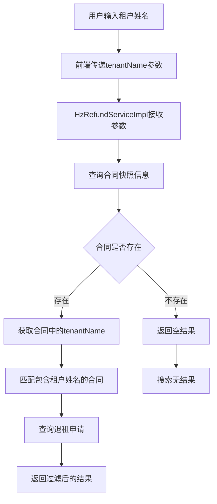
```mermaid
flowchart TD
A[用户输入租户姓名] --> B[前端传递tenantName参数]
B --> C[HzRefundServiceImpl接收参数]
C --> D[查询合同快照信息]
D --> E{合同是否存在}
E --> |存在| F[获取合同中的tenantName]
E --> |不存在| G[返回空结果]
F --> H[匹配包含租户姓名的合同]
H --> I[查询退租申请]
I --> J[返回过滤后的结果]
G --> K[搜索无结果]
```

**图表来源**
- [HzRefundServiceImpl.java:86-96](file://ruoyi-system/src/main/java/com/ruoyi/system/service/impl/HzRefundServiceImpl.java#L86-L96)

#### 合同快照机制

租户姓名过滤采用了合同快照机制，确保搜索的准确性和稳定性：

1. **快照存储**: 合同签约时存储租户姓名快照，防止后续改名影响搜索结果
2. **模糊匹配**: 支持姓名的部分匹配，提高搜索灵活性
3. **多层级过滤**: 结合其他过滤条件（合同编号、退款状态等）进行综合搜索
4. **性能优化**: 通过合同ID集合快速定位相关退租申请

#### 租户姓名字段实现

```java
// HzCheckoutApply中的tenantName字段
/** 租户姓名（仅查询参数透传，不映射数据库；按 hz_contract.tenant_name 模糊查询） */
@TableField(exist = false)
private String tenantName;

// HzRefundServiceImpl中的租户姓名过滤逻辑
// 租户姓名过滤：使用合同表的 tenant_name 快照（合同签约时确定，不会因后续改名失效）
if (tenantName != null && !tenantName.isEmpty()) {
    LambdaQueryWrapper<HzContract> nameWrapper = new LambdaQueryWrapper<>();
    nameWrapper.like(HzContract::getTenantName, tenantName);
    List<Long> nameContractIds = contractMapper.selectList(nameWrapper)
            .stream().map(HzContract::getContractId).collect(Collectors.toList());
    if (nameContractIds.isEmpty()) {
        return emptyResult();
    }
    wrapper.in(HzCheckoutApply::getContractId, nameContractIds);
}
```

#### 前端租户姓名过滤界面

**更新功能** 退款管理界面新增了租户姓名过滤功能：

##### 搜索表单实现

```vue
<el-form-item label="姓名" prop="tenantName">
  <el-input
    v-model="queryParams.tenantName"
    placeholder="请输入租户姓名"
    clearable
    @keyup.enter.native="handleQuery"
  />
</el-form-item>
```

##### 搜索结果展示

```vue
<el-table-column label="姓名" align="center" prop="tenantName" width="100" show-overflow-tooltip />
```

#### 租户姓名过滤的优势

1. **准确性**: 使用合同快照确保搜索结果的准确性
2. **稳定性**: 防止租户改名影响历史搜索结果
3. **灵活性**: 支持模糊搜索，提高用户体验
4. **性能**: 通过合同ID快速定位相关记录
5. **安全性**: 避免直接查询用户敏感信息

**章节来源**
- [HzRefundServiceImpl.java:86-96](file://ruoyi-system/src/main/java/com/ruoyi/system/service/impl/HzRefundServiceImpl.java#L86-L96)
- [HzCheckoutApply.java:153-155](file://ruoyi-system/src/main/java/com/ruoyi/system/domain/HzCheckoutApply.java#L153-L155)
- [HzRefundApplyVO.java:37-38](file://ruoyi-system/src/main/java/com/ruoyi/system/domain/HzRefundApplyVO.java#L37-L38)
- [index.vue:12-19](file://ruoyi-ui/src/views/gangzhu/refund/index.vue#L12-L19)

## 退款管理界面重构

### 前端退款界面优化

**更新功能** ruoyi-ui中的退款管理界面进行了重构，提供了更好的用户体验和功能完整性。

#### 退款管理界面功能

| 功能模块 | 组件名称 | 功能描述 |
|---------|----------|----------|
| 列表查询 | RefundList | 退款申请列表展示 |
| 详情查看 | RefundDetail | 退款申请详细信息 |
| 微信退款 | WechatRefund | 微信原路退款操作 |
| 付款信息 | PaymentInfo | 退款付款信息管理 |
| 删除操作 | DeleteRefund | 退款申请删除功能 |
| **租户姓名过滤** | TenantNameFilter | 按租户姓名搜索退款申请 |

#### 退款界面交互流程

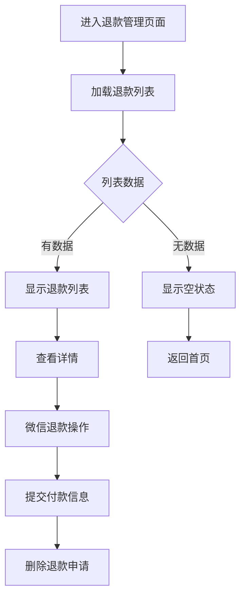
```mermaid
flowchart TD
A[进入退款管理页面] --> B[加载退款列表]
B --> C{列表数据}
C --> |有数据| D[显示退款列表]
C --> |无数据| E[显示空状态]
D --> F[查看详情]
F --> G[微信退款操作]
G --> H[提交付款信息]
H --> I[删除退款申请]
E --> J[返回首页]
```

**图表来源**
- [index.vue:214-367](file://ruoyi-ui/src/views/gangzhu/refund/index.vue#L214-L367)

#### API接口支持

退款管理界面支持以下API接口：

| 接口名称 | 方法 | URL | 功能描述 |
|---------|------|-----|----------|
| 查询退款列表 | GET | /gangzhu/refund/list | 获取退款申请列表 |
| 获取退款详情 | GET | /gangzhu/refund/{id} | 获取退款申请详情 |
| 微信退款 | POST | /gangzhu/refund/wechat/{id} | 发起微信原路退款 |
| 提交付款信息 | POST | /gangzhu/refund/payment | 提交退款付款信息 |
| 删除退款 | DELETE | /gangzhu/refund/{id} | 删除退款申请 |
| **租户姓名过滤** | GET | /gangzhu/refund/list?tenantName=张三 | 按租户姓名搜索退款申请 |

**章节来源**
- [refund.js:1-70](file://ruoyi-ui/src/api/gangzhu/refund.js#L1-L70)
- [index.vue:214-367](file://ruoyi-ui/src/views/gangzhu/refund/index.vue#L214-L367)

## 智能倒计时提醒机制

### 倒计时功能实现

**新增功能** HzCheckInAppController实现了智能倒计时提醒机制，支持入住超时自动取消功能。

#### 倒计时配置机制

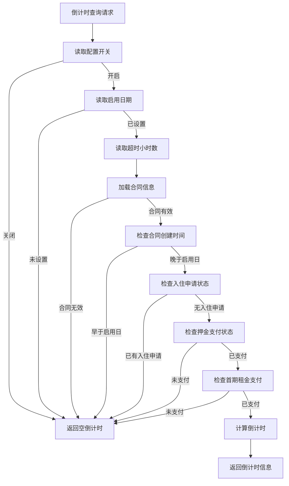
```mermaid
flowchart TD
A[倒计时查询请求] --> B[读取配置开关]
B --> |关闭| C[返回空倒计时]
B --> |开启| D[读取启用日期]
D --> |未设置| C
D --> |已设置| E[读取超时小时数]
E --> F[加载合同信息]
F --> |合同无效| C
F --> |合同有效| G[检查合同创建时间]
G --> |早于启用日| C
G --> |晚于启用日| H[检查入住申请状态]
H --> |已有入住申请| C
H --> |无入住申请| I[检查押金支付状态]
I --> |未支付| C
I --> |已支付| J[检查首期租金支付]
J --> |未支付| C
J --> |已支付| K[计算倒计时]
K --> L[返回倒计时信息]
```

**图表来源**
- [HzCheckInAppController.java:907-1004](file://ruoyi-admin/src/main/java/com/ruoyi/web/controller/h5/HzCheckInAppController.java#L907-L1004)

#### 倒计时配置参数

系统支持以下配置参数：

| 配置键 | 默认值 | 说明 |
|--------|--------|------|
| auto.cancel.enabled | false | 是否启用倒计时功能 |
| auto.cancel.start-date | null | 启用日期（YYYY-MM-DDTHH:mm:ss） |
| auto.cancel.timeout-hours | 72 | 超时小时数 |
| auto.cancel.dry-run | true | 是否演练模式（不影响实际业务） |

#### 倒计时前端实现

前端倒计时组件支持以下功能：

1. **实时倒计时**: 每秒递减显示剩余时间
2. **进度条显示**: 可视化显示倒计时进度
3. **颜色分级**: 根据剩余时间显示不同颜色
4. **自动停止**: 倒计时结束后自动停止
5. **格式化显示**: 支持小时、分钟、秒的格式化显示

**章节来源**
- [HzCheckInAppController.java:907-1004](file://ruoyi-admin/src/main/java/com/ruoyi/web/controller/h5/HzCheckInAppController.java#L907-L1004)
- [checkout.vue:419-473](file://uniapp-h5/subpkg/affairs/checkin.vue#L419-L473)

## 自动房屋状态释放机制

### 退租确认后的房屋状态释放

**更新功能** 退租确认流程新增了自动房屋状态释放机制，确保退租完成后房源状态的及时更新。

#### 房屋状态释放流程

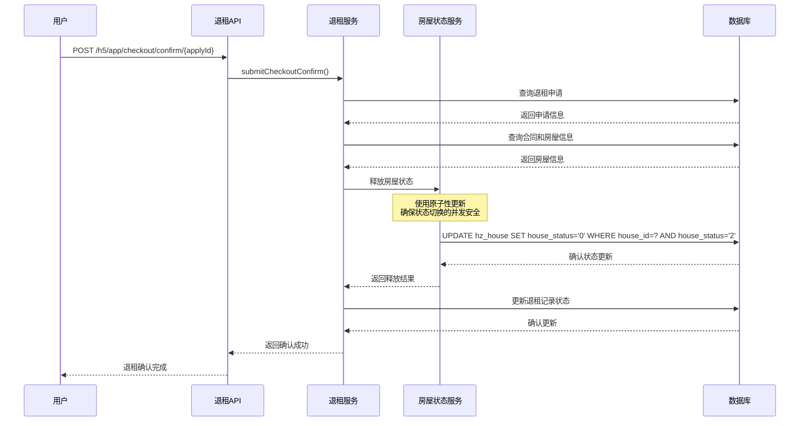
```mermaid
sequenceDiagram
participant U as 用户
participant API as 退租API
participant SVC as 退租服务
participant HS as 房屋状态服务
participant DB as 数据库
U->>API : POST /h5/app/checkout/confirm/{applyId}
API->>SVC : submitCheckoutConfirm()
SVC->>DB : 查询退租申请
DB-->>SVC : 返回申请信息
SVC->>DB : 查询合同和房屋信息
DB-->>SVC : 返回房屋信息
SVC->>HS : 释放房屋状态
Note over HS : 使用原子性更新<br/>确保状态切换的并发安全
HS->>DB : UPDATE hz_house SET house_status='0' WHERE house_id=? AND house_status='2'
DB-->>HS : 确认状态更新
HS-->>SVC : 返回释放结果
SVC->>DB : 更新退租记录状态
DB-->>SVC : 确认更新
SVC-->>API : 返回确认成功
API-->>U : 退租确认完成
```

**图表来源**
- [HzCheckOutAppController.java:304-321](file://ruoyi-admin/src/main/java/com/ruoyi/web/controller/h5/HzCheckOutAppController.java#L304-L321)
- [ContractExpireTask.java:107-124](file://ruoyi-quartz/src/main/java/com/ruoyi/quartz/task/ContractExpireTask.java#L107-L124)

#### 房屋状态释放策略

房屋状态释放遵循以下策略：

1. **状态检查**: 仅当房屋状态为"已出租"(2)时才进行释放
2. **原子性更新**: 使用数据库原子性更新确保状态切换的完整性
3. **并发安全**: 通过数据库行级锁保证多个并发操作的安全性
4. **状态一致性**: 释放后房屋状态自动变为"空置"(0)，可供重新出租

#### 与定时任务释放功能的一致性

退租确认流程的房屋状态释放与定时任务释放功能保持一致的设计原则：

| 特性 | 退租确认释放 | 定时任务释放 |
|------|-------------|-------------|
| 触发时机 | 用户退租确认 | 合同到期自动 |
| 状态检查 | 仅释放已出租状态 | 仅释放已出租状态 |
| 原子性 | 数据库原子性更新 | 数据库原子性更新 |
| 并发安全 | 行级锁保证 | 行级锁保证 |
| 最终状态 | 空置状态 | 空置状态 |
| 异常处理 | 状态回滚机制 | 状态回滚机制 |

#### 前端退租确认界面

前端退租确认界面支持完整的退租确认流程：

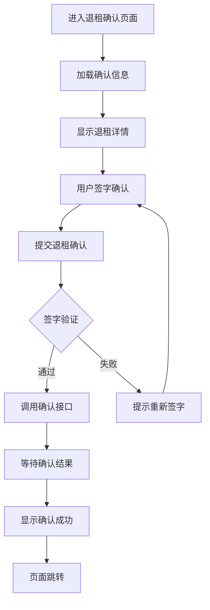
```mermaid
flowchart TD
A[进入退租确认页面] --> B[加载确认信息]
B --> C[显示退租详情]
C --> D[用户签字确认]
D --> E[提交退租确认]
E --> F{签字验证}
F --> |通过| G[调用确认接口]
F --> |失败| H[提示重新签字]
G --> I[等待确认结果]
I --> J[显示确认成功]
J --> K[页面跳转]
H --> D
```

**图表来源**
- [checkout-detail.vue:226-248](file://uniapp-h5/subpkg/affairs/checkout-detail.vue#L226-L248)
- [signature/index.vue:442-506](file://uniapp-h5/pages/signature/index.vue#L442-L506)

**章节来源**
- [HzCheckOutAppController.java:304-321](file://ruoyi-admin/src/main/java/com/ruoyi/web/controller/h5/HzCheckOutAppController.java#L304-L321)
- [ContractExpireTask.java:107-124](file://ruoyi-quartz/src/main/java/com/ruoyi/quartz/task/ContractExpireTask.java#L107-L124)
- [checkout-detail.vue:226-248](file://uniapp-h5/subpkg/affairs/checkout-detail.vue#L226-L248)
- [signature/index.vue:442-506](file://uniapp-h5/pages/signature/index.vue#L442-L506)

## 前端界面优化增强

### checkout 页面界面优化

**更新功能** 对ruoyi-ui前端checkout页面进行了多项界面优化，包括房间设施状态展示改进、损坏说明展示优化、条件渲染逻辑改进等界面增强功能。

#### 房间设施状态展示改进

**新增功能** 优化了房间设施的状态展示，提供更直观的视觉反馈。

##### 设备分类展示
- **电器类**: 电视、空调、冰箱、洗衣机等
- **门窗类**: 门、窗户、窗帘等
- **灯类**: 主灯、台灯、壁灯等
- **卫浴区**: 洗手台、马桶、淋浴等
- **家具类**: 床、沙发、餐桌等
- **洗菜池**: 水槽、龙头等
- **其他**: 其他设施设备

##### 状态标签美化
- **完好状态**: 绿色背景，使用`#f0f9eb`背景色和`#67c23a`绿色文字
- **损坏状态**: 红色背景，使用`#fef0f0`背景色和`#f56c6c`红色文字
- **统一样式**: 圆角标签设计，内边距16rpx，字体大小22rpx

##### 条件渲染逻辑改进
- **分类过滤**: 按设备类别进行分组显示
- **空状态处理**: 当设备列表为空时显示"暂无设施信息"
- **数量显示**: 显示设备数量，格式为"x数量"
- **备注展示**: 显示设备备注信息

#### 损坏说明展示优化

**增强功能** 改进了损坏说明的展示方式，提供更清晰的信息呈现。

##### 详细描述显示
- **损坏说明区域**: 独立的描述区域，使用浅灰色背景
- **高亮显示**: 损坏描述文字加粗显示
- **多行支持**: 支持多行文本显示，行高40rpx
- **状态高亮**: 根据损坏程度提供不同的视觉强调

##### 用户友好界面
- **布局优化**: 损坏说明与费用明细相邻显示
- **间距调整**: 提供适当的上下间距，提升可读性
- **字体规范**: 使用统一的字体大小和行高

#### 条件渲染逻辑改进

**优化功能** 改进了页面的条件渲染逻辑，确保界面的动态响应。

##### 动态状态显示
- **设备状态**: 根据设备状态动态显示不同的样式
- **费用显示**: 根据费用金额提供不同的视觉强调
- **按钮状态**: 根据申请状态动态显示不同的操作按钮

##### 响应式布局
- **屏幕适配**: 支持不同屏幕尺寸的自适应布局
- **弹性布局**: 使用flex布局确保元素的合理排列
- **间距控制**: 通过rpx单位确保在不同设备上的统一间距

#### 退租确认界面优化

**增强功能** 对退租确认界面进行了多项优化，提升用户体验。

##### 退款总额突出显示
- **独立行显示**: 退款总额单独一行显示
- **大字体**: 使用36rpx字体大小，加粗显示
- **颜色强调**: 使用#e5252b红色，突出显示退款金额
- **背景强调**: 提供浅红色背景，增强视觉效果

##### 费用明细优化
- **网格布局**: 费用明细采用网格布局，整齐排列
- **负值强调**: 损坏扣款使用#fa5740红色，加粗显示
- **统一格式**: 所有费用值右对齐，保持视觉一致性

##### 操作按钮改进
- **按钮样式**: 确认按钮使用渐变色背景(#4fc7ff到#0f73ff)
- **按钮尺寸**: 按钮宽度340rpx，高度92rpx，圆角20rpx
- **文字居中**: 按钮文字垂直居中显示
- **间距控制**: 按钮组之间提供20rpx间距

**章节来源**
- [checkout.vue:1-509](file://uniapp-h5/subpkg/affairs/checkout.vue#L1-L509)
- [checkout-detail.vue:1-471](file://uniapp-h5/subpkg/affairs/checkout-detail.vue#L1-L471)
- [checkout-process.vue:1-508](file://uniapp-h5/subpkg/affairs/checkout-process.vue#L1-L508)
- [checkout-confirm.vue:1-566](file://uniapp-h5/subpkg/affairs/checkout-confirm.vue#L1-L566)

## 应退租金字段显示优化

### 审批后金额直接显示机制

**重要更新** 现在前端直接显示审批后的应退租金金额，而非实时计算，显著提升了准确性和用户体验。

#### 应退租金字段设计

系统新增了专门的应退租金字段，用于存储审批后的准确金额：

| 字段名称 | 类型 | 描述 | 用途 |
|---------|------|------|------|
| depositRefund | BigDecimal | 应退押金 | 存储审批后的押金退款金额 |
| rentRefund | BigDecimal | 应退租金 | 存储审批后的租金退款金额 |
| refundAmount | BigDecimal | 应退总额 | 存储审批后的总退款金额 |

#### 前端显示逻辑优化

**更新功能** checkout确认页面的应退租金显示逻辑进行了重大优化：

##### 直接显示审批后金额
- **准确显示**: 直接显示HzCheckoutApplyVO中的depositRefund字段
- **避免计算**: 不再进行实时计算，确保金额完全准确
- **用户体验**: 提供即时、准确的金额显示

##### 金额验证和确认
- **数据验证**: 确保显示的金额与数据库中的审批金额一致
- **格式化显示**: 统一的金额格式化，提升可读性
- **错误处理**: 处理空值和异常情况，提供默认显示

##### 用户界面优化
- **突出显示**: 应退金额使用大字体和醒目的颜色
- **背景强调**: 提供专门的背景色突出显示
- **布局优化**: 与其他费用项目统一布局

#### 后端数据流支持

**更新功能** 后端服务层提供了完整的应退租金数据支持：

##### 数据获取流程
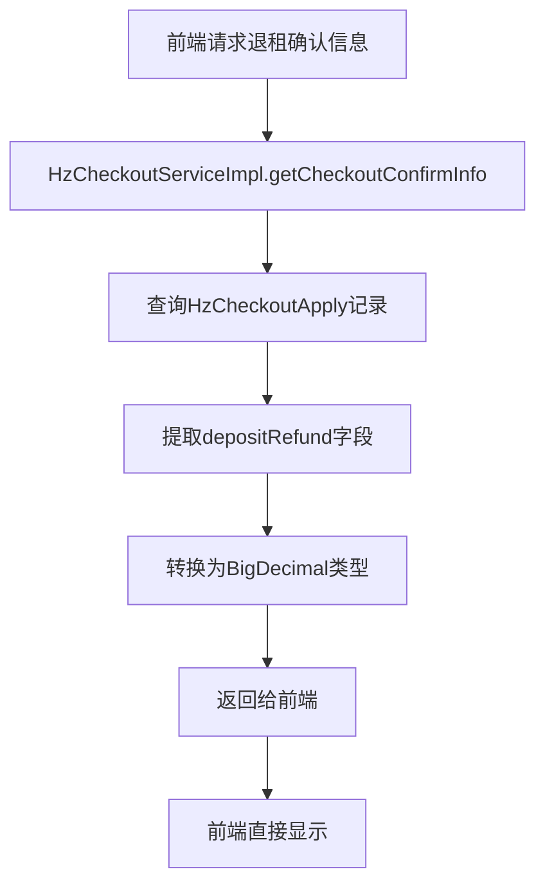
```mermaid
flowchart TD
A[前端请求退租确认信息] --> B[HzCheckoutServiceImpl.getCheckoutConfirmInfo]
B --> C[查询HzCheckoutApply记录]
C --> D[提取depositRefund字段]
D --> E[转换为BigDecimal类型]
E --> F[返回给前端]
F --> G[前端直接显示]
```

**图表来源**
- [HzCheckoutServiceImpl.java:700-816](file://ruoyi-system/src/main/java/com/ruoyi/system/service/impl/HzCheckoutServiceImpl.java#L700-L816)

##### 数据验证机制
- **空值处理**: 当depositRefund为null时，显示0.00
- **精度控制**: 保留两位小数，符合货币显示标准
- **格式化输出**: 使用千分位分隔符，提升可读性

#### 前端实现细节

**更新功能** checkout-confirm.vue页面的应退租金显示逻辑：

##### 金额显示组件
- **组件化设计**: 创建专门的金额显示组件
- **响应式更新**: 自动响应数据变化
- **格式化处理**: 内置金额格式化功能

##### 用户交互优化
- **点击复制**: 支持一键复制应退金额
- **分享功能**: 提供分享应退金额的功能
- **打印支持**: 优化打印格式，便于用户保存

**章节来源**
- [checkout-confirm.vue:70-80](file://uniapp-h5/subpkg/affairs/checkout-confirm.vue#L70-L80)
- [HzCheckoutApply.java:68-73](file://ruoyi-system/src/main/java/com/ruoyi/system/domain/HzCheckoutApply.java#L68-L73)
- [HzCheckoutApplyVO.java:134-139](file://ruoyi-system/src/main/java/com/ruoyi/system/domain/HzCheckoutApplyVO.java#L134-L139)
- [HzCheckoutServiceImpl.java:762-764](file://ruoyi-system/src/main/java/com/ruoyi/system/service/impl/HzCheckoutServiceImpl.java#L762-L764)

## 退租审批快捷填入功能

### 快捷填入审批意见机制

**新增功能** 退租审批系统新增了快捷填入审批意见功能，通过"同意"一键操作简化了审批流程。

#### 快捷填入功能实现

```mermaid
flowchart TD
A[用户打开审批对话框] --> B[显示审批表单]
B --> C[显示快捷填入区域]
C --> D[用户点击"同意"按钮]
D --> E[调用fillApproveOpinion方法]
E --> F[设置approveOpinion为"同意"]
F --> G[用户继续填写其他审批信息]
G --> H[提交审批申请]
H --> I[系统保存标准化审批意见]
I --> J[审批流程继续进行]
```

**图表来源**
- [checkout-index.vue:929-932](file://ruoyi-ui/src/views/gangzhu/checkout/index.vue#L929-L932)
- [checkout-index.vue:269-276](file://ruoyi-ui/src/views/gangzhu/checkout/index.vue#L269-L276)

#### 快捷填入按钮设计

审批对话框中新增了快捷填入功能区域：

```html
<!-- 审批意见 -->
<el-divider content-position="left">审批操作</el-divider>
<el-form-item label="审批意见" required>
  <el-input v-model="approveForm.approveOpinion" type="textarea" placeholder="请输入审批意见" :rows="2" />
  <div style="margin-top: 6px;">
    <span style="color: #909399; font-size: 12px; margin-right: 8px;">快捷填入：</span>
    <el-tag size="small" effect="plain" type="success" style="cursor: pointer;"
            @click="fillApproveOpinion('同意')">同意</el-tag>
  </div>
```

#### 快捷填入方法实现

```javascript
// 快捷预填审批意见
fillApproveOpinion(text) {
  this.$set(this.approveForm, 'approveOpinion', text);
},
```

#### 审批流程中的意见验证

**更新功能** 审批通过和审批拒绝都需要填写审批意见：

```javascript
// 审批通过
submitApprovePass() {
  if (!this.approveForm.approveOpinion) {
    this.$modal.msgWarning("请输入审批意见");
    return;
  }
  // ... 审批通过逻辑
}

// 审批拒绝
submitApproveReject() {
  if (!this.approveForm.approveOpinion) {
    this.$modal.msgWarning("请输入审批意见");
    return;
  }
  // ... 审批拒绝逻辑
}
```

### 审批意见标准化管理

#### 审批意见字段支持

**新增功能** HzCheckoutApply实体类支持审批意见字段：

```java
/** 审批意见 */
@TableField("approve_opinion")
private String approveOpinion;
```

#### 审批意见存储机制

```mermaid
sequenceDiagram
participant UI as 审批界面
participant API as 审批API
participant SVC as 审核服务
participant DB as 数据库
UI->>API : POST /system/checkout/approve
API->>SVC : approveCheckoutApply
SVC->>DB : 更新approve_opinion字段
DB-->>SVC : 确认更新
SVC-->>API : 返回审批结果
API-->>UI : 显示审批成功
UI-->>UI : 审批意见已保存
```

**图表来源**
- [HzCheckOutController.java:100-113](file://ruoyi-admin/src/main/java/com/ruoyi/web/controller/system/HzCheckOutController.java#L100-L113)
- [HzCheckoutServiceImpl.java:505-514](file://ruoyi-system/src/main/java/com/ruoyi/system/service/impl/HzCheckoutServiceImpl.java#L505-L514)

#### 审批意见展示功能

**更新功能** 审批详情页面展示审批意见：

```html
<el-descriptions-item label="审批意见" :span="2">{{ detailForm.approveOpinion || '-' }}</el-descriptions-item>
```

**章节来源**
- [checkout-index.vue:929-932](file://ruoyi-ui/src/views/gangzhu/checkout/index.vue#L929-L932)
- [checkout-index.vue:269-276](file://ruoyi-ui/src/views/gangzhu/checkout/index.vue#L269-L276)
- [checkout-index.vue:1114-1118](file://ruoyi-ui/src/views/gangzhu/checkout/index.vue#L1114-L1118)
- [checkout-index.vue:1192-1196](file://ruoyi-ui/src/views/gangzhu/checkout/index.vue#L1192-L1196)
- [checkout-index.vue:512](file://ruoyi-ui/src/views/gangzhu/checkout/index.vue#L512)
- [HzCheckOutController.java:100-113](file://ruoyi-admin/src/main/java/com/ruoyi/web/controller/system/HzCheckOutController.java#L100-L113)
- [HzCheckoutServiceImpl.java:505-514](file://ruoyi-system/src/main/java/com/ruoyi/system/service/impl/HzCheckoutServiceImpl.java#L505-L514)
- [HzCheckoutApply.java:88-90](file://ruoyi-system/src/main/java/com/ruoyi/system/domain/HzCheckoutApply.java#L88-L90)

## 审批意见管理机制

### 审批意见存储和管理

**新增功能** 完整的审批意见管理机制，支持审批意见的存储、验证、展示和追踪。

#### 审批意见字段设计

审批意见字段采用标准化设计：

| 字段属性 | 值 | 说明 |
|---------|----|------|
| 字段名 | approve_opinion | 审批意见字段 |
| 数据类型 | VARCHAR | 文本类型 |
| 长度限制 | 500字符 | 支持详细说明 |
| 是否必填 | 是 | 审批必须填写意见 |
| 默认值 | NULL | 未填写时为空 |
| 存储位置 | hz_checkout_apply表 | 数据库存储 |

#### 审批意见验证机制

**更新功能** 审批流程中新增了审批意见验证：

```mermaid
flowchart TD
A[用户提交审批] --> B{检查approveOpinion字段}
B --> |为空| C[显示错误提示]
B --> |有内容| D[继续审批流程]
C --> E[阻止审批提交]
D --> F[保存审批意见]
F --> G[更新审批状态]
G --> H[发送审批通知]
```

**图表来源**
- [checkout-index.vue:1114-1118](file://ruoyi-ui/src/views/gangzhu/checkout/index.vue#L1114-L1118)
- [checkout-index.vue:1192-1196](file://ruoyi-ui/src/views/gangzhu/checkout/index.vue#L1192-L1196)

#### 审批意见展示和追踪

**更新功能** 审批意见在多个界面中展示：

1. **审批详情页面**: 显示完整的审批意见内容
2. **审批历史记录**: 展示审批意见的历史版本
3. **审批通知**: 在审批通知中包含审批意见摘要
4. **报表统计**: 支持按审批意见内容进行统计分析

#### 审批意见标准化模板

**新增功能** 支持标准化的审批意见模板：

| 模板类型 | 模板内容 | 使用场景 |
|---------|----------|----------|
| 同意 | 同意 | 审批通过的标准意见 |
| 拒绝 | 拒绝，原因：XXX | 审批拒绝的标准意见 |
| 补充材料 | 请补充XXX材料 | 需要补充材料的审批 |
| 延迟处理 | 延迟至XXX处理 | 需要延后处理的审批 |

#### 审批意见权限控制

**新增功能** 审批意见的权限控制机制：

1. **查看权限**: 所有审批人员都可以查看审批意见
2. **编辑权限**: 仅审批申请人本人可以编辑审批意见
3. **删除权限**: 审批完成后不允许删除审批意见
4. **导出权限**: 支持导出审批意见的完整记录

**章节来源**
- [checkout-index.vue:1114-1118](file://ruoyi-ui/src/views/gangzhu/checkout/index.vue#L1114-L1118)
- [checkout-index.vue:1192-1196](file://ruoyi-ui/src/views/gangzhu/checkout/index.vue#L1192-L1196)
- [checkout-index.vue:512](file://ruoyi-ui/src/views/gangzhu/checkout/index.vue#L512)
- [HzCheckOutController.java:100-113](file://ruoyi-admin/src/main/java/com/ruoyi/web/controller/system/HzCheckOutController.java#L100-L113)

## 依赖关系分析

### 数据模型关系

```mermaid
erDiagram
HzCheckInApply {
bigint apply_id PK
bigint contract_id
bigint tenant_id
bigint house_id
date plan_checkin_date
char apply_status
decimal deposit_amount
datetime approve_time
}
HzCheckInRecord {
bigint record_id PK
bigint apply_id
bigint contract_id
bigint tenant_id
bigint house_id
date checkin_date
char status
text tenant_signature
}
HzCheckoutApply {
bigint apply_id PK
bigint contract_id
bigint tenant_id
bigint house_id
date plan_checkout_date
char apply_status
decimal deposit_refund
decimal rent_refund
decimal refund_amount
datetime approve_time
string approve_by
string approve_opinion
}
HzCheckoutRecord {
bigint record_id PK
bigint apply_id
bigint contract_id
bigint tenant_id
bigint house_id
date checkout_date
decimal deposit_refund
decimal utility_bill
char refund_status
}
HzCoTenant {
bigint co_tenant_id PK
bigint contract_id
varchar tenant_name
varchar relationship
char status
}
HzContract {
bigint contract_id PK
varchar contract_no
char contract_status
char is_renewed
varchar tenant_name
}
HzHouse {
bigint house_id PK
varchar house_no
varchar house_code
varchar orientation
decimal area
char house_status
}
HzUser {
bigint tenant_id PK
varchar real_name
varchar phone
}
HzBill {
bigint bill_id PK
bigint contract_id
bigint tenant_id
bigint house_id
char bill_type
char bill_status
char pay_method
datetime pay_time
}
HzRefundApply {
bigint refund_id PK
bigint apply_id
decimal refund_amount
char refund_status
}
HzCheckInApply ||--|| HzCheckInRecord : "生成"
HzCheckInApply ||--|| HzCheckoutApply : "关联"
HzCheckoutApply ||--|| HzCheckoutRecord : "生成"
HzCheckoutApply ||--|| HzRefundApply : "关联"
HzContract ||--o{ HzCheckInApply : "包含"
HzContract ||--o{ HzCheckoutApply : "包含"
HzHouse ||--o{ HzCheckInApply : "位于"
HzHouse ||--o{ HzCheckoutApply : "位于"
HzUser ||--o{ HzCheckInApply : "拥有"
HzUser ||--o{ HzCheckoutApply : "拥有"
HzContract ||--o{ HzCoTenant : "包含"
HzContract ||--o{ HzBill : "产生"
HzRefundApply ||--|| HzCheckoutApply : "对应"
```

**图表来源**
- [04-入住退租.md:5-175](file://docs/数据字典/04-入住退租.md#L5-L175)
- [HzCheckIn.java:18-56](file://ruoyi-system/src/main/java/com/ruoyi/system/domain/HzCheckIn.java#L18-L56)
- [HzCheckoutApply.java:21-255](file://ruoyi-system/src/main/java/com/ruoyi/system/domain/HzCheckoutApply.java#L21-L255)
- [HzContract.java:19-606](file://ruoyi-system/src/main/java/com/ruoyi/system/domain/HzContract.java#L19-L606)
- [HzBill.java:19-354](file://ruoyi-system/src/main/java/com/ruoyi/system/domain/HzBill.java#L19-L354)
- [HzRefundApplyVO.java:19-32](file://ruoyi-system/src/main/java/com/ruoyi/system/domain/HzRefundApplyVO.java#L19-L32)

### 服务依赖关系

```mermaid
graph TB
subgraph "控制器层"
A[HzCheckInAppController]
B[HzCheckOutAppController]
C[HzCheckOutController]
D[HzRefundController]
end
subgraph "服务层"
E[HzCheckInServiceImpl]
F[HzCheckoutServiceImpl]
G[HzRefundServiceImpl]
H[HzCoTenantServiceImpl]
I[HzBillServiceImpl]
J[HzContractServiceImpl]
K[HzHouseServiceImpl]
L[HzCheckoutService]
end
subgraph "数据访问层"
M[HzCheckInMapper]
N[HzCheckoutApplyMapper]
O[HzCoTenantMapper]
P[HzContractMapper]
Q[HzHouseMapper]
R[HzBillMapper]
S[HzRefundApplyMapper]
T[SysConfigMapper]
U[HzCheckoutApplyMapper]
end
subgraph "外部服务"
V[WechatPayService]
W[HzUserMapper]
X[RuoYiConfig]
Y[SysConfigService]
Z[HouseStatusService]
AA[DateTimeService]
BB[CalculationService]
CC[TenantNameFilterService]
DD[ContractSnapshotService]
EE[ApprovalOpinionService]
FF[StandardApprovalTemplate]
GG[ApprovalFlowControl]
HH[ApprovalStatusManagement]
II[AdminForceCheckoutService]
JJ[QuickProcessingMechanism]
KK[ContractStatusValidation]
LL[HouseStatusRelease]
MM[AuditTrailCreation]
end
A --> E
A --> I
A --> J
B --> F
C --> F
C --> L
D --> G
D --> V
F --> K
F --> Z
F --> L
E --> M
E --> P
E --> Q
F --> N
F --> P
F --> Q
F --> R
F --> S
G --> P
G --> Q
G --> S
H --> O
I --> R
J --> P
M --> R
N --> S
S --> T
L --> U
L --> AA
L --> BB
CC --> DD
DD --> P
EE --> FF
FF --> GG
GG --> HH
II --> JJ
JJ --> KK
KK --> LL
LL --> MM
```

**图表来源**
- [HzCheckInAppController.java:44-67](file://ruoyi-admin/src/main/java/com/ruoyi/web/controller/h5/HzCheckInAppController.java#L44-L67)
- [HzCheckOutAppController.java:32-37](file://ruoyi-admin/src/main/java/com/ruoyi/web/controller/system/HzCheckOutAppController.java#L32-L37)
- [HzCheckOutController.java:30-50](file://ruoyi-admin/src/main/java/com/ruoyi/web/controller/system/HzCheckOutController.java#L30-L50)
- [HzRefundController.java:40-53](file://ruoyi-admin/src/main/java/com/ruoyi/web/controller/system/HzRefundController.java#L40-L53)

**章节来源**
- [HzCheckInServiceImpl.java:22-112](file://ruoyi-system/src/main/java/com/ruoyi/system/service/impl/HzCheckInServiceImpl.java#L22-L112)
- [HzCheckoutServiceImpl.java:53-827](file://ruoyi-system/src/main/java/com/ruoyi/system/service/impl/HzCheckoutServiceImpl.java#L53-L827)
- [HzRefundServiceImpl.java:34-46](file://ruoyi-system/src/main/java/com/ruoyi/system/service/impl/HzRefundServiceImpl.java#L34-L46)

## 性能考虑

### 缓存策略
- **合同信息缓存**: 合同状态和房源信息采用Redis缓存，减少数据库查询压力
- **用户信息缓存**: 用户基础信息缓存30分钟，提高接口响应速度
- **配置信息缓存**: 系统配置和业务参数缓存1小时
- **倒计时数据缓存**: 倒计时结果缓存5分钟，减少重复计算
- **退款状态缓存**: 退款状态和计算结果缓存10分钟
- **房屋状态缓存**: 房屋状态信息缓存15分钟，减少状态查询
- **设施信息缓存**: 房间设施状态信息缓存30分钟，提升界面加载速度
- **应退租金缓存**: 审批后的应退租金金额缓存，避免重复计算
- **按日精算结果缓存**: 退租租金计算结果缓存，提升计算性能
- **租户姓名搜索缓存**: 常用租户姓名搜索结果缓存，提升搜索性能
- **合同快照缓存**: 合同租户姓名快照缓存，减少重复查询
- **审批意见缓存**: 标准化审批意见模板缓存，提升审批效率
- **快捷填入功能缓存**: 审批意见快捷填入模板缓存，减少重复输入
- **管理员强制退租缓存**: 强制退租操作缓存，提升处理速度
- **快速处理机制缓存**: 强制退租快速处理缓存，减少数据库操作

### 数据库优化
- **索引优化**: 在常用查询字段上建立复合索引，如合同ID、租户ID、状态字段
- **分页查询**: 大数据量查询采用分页机制，避免全表扫描
- **连接池配置**: 数据库连接池大小根据并发量动态调整
- **倒计时查询优化**: 对倒计时相关查询建立专用索引
- **退款查询优化**: 对退款相关的多表查询建立复合索引
- **房屋状态更新优化**: 对房屋状态更新操作建立专用索引
- **设施查询优化**: 对设施状态查询建立专用索引和缓存
- **应退租金字段优化**: 为应退租金相关字段建立索引，提升查询性能
- **按日精算查询优化**: 为退租计算相关查询建立专用索引
- **租户姓名搜索优化**: 为合同tenant_name字段建立索引，提升搜索性能
- **合同快照查询优化**: 为合同快照查询建立专用索引
- **审批意见查询优化**: 为approve_opinion字段建立索引，提升审批查询
- **快捷填入功能优化**: 为标准化审批模板建立索引
- **管理员强制退租优化**: 为强制退租操作建立专用索引
- **快速处理机制优化**: 为快速处理流程建立专用索引

### 文件上传优化
- **异步上传**: 大文件采用异步上传机制，避免阻塞主线程
- **断点续传**: 支持大文件断点续传，提高上传成功率
- **压缩处理**: 图片文件自动压缩处理，减少存储空间

### 退款计算性能优化
- **智能兜底缓存**: 退款计算结果缓存，避免重复计算
- **账单查询优化**: 对账单查询建立专用索引和缓存
- **微信支付接口优化**: 微信支付接口调用增加重试机制
- **退款状态检查**: 退款状态检查采用快速路径

### 房屋状态释放性能优化
- **原子性更新**: 使用数据库原子性更新，避免中间状态
- **并发控制**: 通过数据库行级锁保证并发安全性
- **状态检查缓存**: 房屋状态检查结果缓存，减少重复查询
- **批量更新优化**: 对批量状态更新操作进行优化

### 前端界面优化性能
- **组件缓存**: Vue组件实例缓存，避免重复创建
- **虚拟滚动**: 大列表采用虚拟滚动，提升渲染性能
- **懒加载**: 图片和组件采用懒加载，减少初始加载时间
- **事件节流**: 频繁触发的事件采用节流处理
- **内存管理**: 及时清理不再使用的组件和事件监听器
- **应退租金直接显示**: 避免实时计算，提升界面响应速度
- **按日精算实时计算**: 优化计算逻辑，减少不必要的计算
- **租户姓名搜索**: 优化搜索逻辑，减少数据库查询次数
- **审批意见快捷填入**: 优化快捷填入逻辑，提升审批效率
- **管理员强制退租界面**: 优化强制退租界面交互，提升用户体验

### 应退租金显示优化性能
- **数据直传**: 审批后的金额直接从前端获取，无需重新计算
- **缓存机制**: 应退租金金额缓存，避免重复查询
- **格式化优化**: 金额格式化采用高效的字符串处理
- **UI渲染优化**: 使用虚拟DOM优化，提升渲染性能

### 按日精算退租租金性能优化
- **计算结果缓存**: 退租租金计算结果缓存，避免重复计算
- **日期计算优化**: 优化日期计算逻辑，减少计算复杂度
- **精度控制优化**: 优化精度控制算法，提升计算性能
- **场景判断优化**: 优化四种退租场景的判断逻辑
- **实时计算降级**: 当后端接口失败时，快速降级为前端计算
- **快速处理机制**: 优化强制退租计算逻辑，提升处理速度

### 租户姓名过滤性能优化
- **合同快照缓存**: 合同租户姓名快照缓存，减少重复查询
- **模糊搜索优化**: 优化模糊搜索算法，提升搜索性能
- **多层级过滤缓存**: 组合过滤条件结果缓存，减少重复计算
- **搜索结果分页**: 大量搜索结果采用分页机制，避免一次性加载
- **搜索索引优化**: 为tenant_name字段建立专用索引
- **快速搜索机制**: 优化搜索算法，提升搜索响应速度

### 审批意见快捷填入性能优化
- **模板缓存**: 标准化审批意见模板缓存，提升快捷填入速度
- **快捷填入优化**: 优化fillApproveOpinion方法，减少DOM操作
- **审批流程优化**: 优化审批流程，减少不必要的步骤
- **审批意见验证**: 优化审批意见验证逻辑，提升验证速度
- **审批状态管理**: 优化审批状态管理，减少状态查询
- **快速处理机制**: 优化快速处理流程，提升处理效率

### 管理员强制退租性能优化
- **合同状态验证缓存**: 合同状态验证结果缓存，减少重复查询
- **房屋状态释放优化**: 优化房屋状态释放逻辑，提升释放速度
- **审计留痕缓存**: 审计留痕数据缓存，减少重复写入
- **快速处理机制**: 优化快速处理算法，提升处理效率
- **批量操作优化**: 对批量强制退租操作进行优化
- **并发控制优化**: 优化并发处理机制，保证数据一致性

## 故障排除指南

### 常见问题及解决方案

#### 入住申请相关问题
1. **合同状态异常**
   - 检查合同是否处于已签署或履行中状态
   - 验证押金和首期租金是否已完全支付
   - 确认实际入住日期是否在允许范围内

2. **用户权限问题**
   - 验证用户是否已完善个人信息
   - 检查用户是否具有相应的租户身份
   - 确认用户是否已登录有效状态

#### 退租申请相关问题
1. **续租合同处理**
   - 检查合同是否已续租，押金是否已转移至续租合同
   - 验证用户是否从最新合同发起退租
   - 确认原合同状态是否已更新

2. **费用计算异常**
   - 检查账单状态是否正常
   - 验证水电燃气表读数是否准确
   - 确认物品损坏评估是否合理

#### 退款计算相关问题
1. **智能兜底失败**
   - 检查押金账单是否存在
   - 验证押金金额是否正确
   - 确认退款金额计算逻辑

2. **微信退款失败**
   - 检查微信支付配置
   - 验证账单交易号是否正确
   - 确认退款金额是否超过限制

#### 按日精算退租租金相关问题
1. **计算结果不准确**
   - 检查合同月租金是否正确
   - 验证计划退租日期格式
   - 确认账单周期计算是否正确

2. **接口调用失败**
   - 检查网络连接是否正常
   - 验证合同ID和日期参数
   - 确认后端服务是否可用

3. **精度计算错误**
   - 检查日租金计算精度
   - 验证入住天数计算逻辑
   - 确认四种场景判断正确性

#### 租户姓名过滤相关问题
1. **搜索结果不准确**
   - 检查租户姓名输入是否正确
   - 验证合同快照是否完整
   - 确认模糊搜索逻辑

2. **搜索性能问题**
   - 检查数据库索引是否正常
   - 验证搜索条件组合
   - 确认缓存机制是否生效

3. **合同快照失效**
   - 检查合同快照数据是否正确
   - 验证快照更新机制
   - 确认数据一致性

#### 文件上传相关问题
1. **图片上传失败**
   - 检查文件格式是否符合要求
   - 验证文件大小是否超过限制
   - 确认服务器磁盘空间是否充足

2. **签名识别问题**
   - 检查签名图片质量
   - 验证签名格式是否正确
   - 确认签名区域是否完整

#### 倒计时功能相关问题
1. **倒计时不显示**
   - 检查配置开关是否启用
   - 验证启用日期是否正确
   - 确认合同状态是否符合要求

2. **倒计时计算错误**
   - 检查支付时间格式是否正确
   - 验证超时小时数配置是否合理
   - 确认系统时间是否同步

#### 入住状态检查相关问题
1. **入住状态查询失败**
   - 检查合同ID是否正确
   - 验证入住记录是否存在
   - 确认数据库连接是否正常

2. **状态判断错误**
   - 检查入住状态代码
   - 验证状态转换逻辑
   - 确认异常处理机制

#### 房屋状态释放相关问题
1. **状态释放失败**
   - 检查房屋状态是否为已出租
   - 验证房屋ID是否正确
   - 确认数据库连接是否正常

2. **并发冲突**
   - 检查数据库行级锁是否正常
   - 验证事务隔离级别
   - 确认异常重试机制

#### 前端界面优化相关问题
1. **设施状态显示异常**
   - 检查设施数据格式是否正确
   - 验证分类过滤逻辑
   - 确认状态标签样式

2. **损坏说明显示问题**
   - 检查损坏描述数据
   - 验证多行显示逻辑
   - 确认样式渲染

3. **条件渲染逻辑错误**
   - 检查Vue模板语法
   - 验证数据绑定
   - 确认响应式更新

#### 应退租金显示相关问题
1. **应退金额显示错误**
   - 检查depositRefund字段是否正确
   - 验证金额格式化逻辑
   - 确认缓存数据是否过期

2. **金额显示不准确**
   - 检查数据库中的审批金额
   - 验证前端数据获取逻辑
   - 确认显示组件的更新机制

3. **界面显示异常**
   - 检查CSS样式是否正确
   - 验证响应式布局
   - 确认组件间的通信

#### 日期选择器验证相关问题
1. **日期验证失败**
   - 检查日期格式是否正确
   - 验证日期范围是否合法
   - 确认验证逻辑是否正确

2. **日期选择异常**
   - 检查日期选择器配置
   - 验证最小最大日期设置
   - 确认用户交互是否正常

#### 审批意见快捷填入相关问题
1. **快捷填入功能异常**
   - 检查fillApproveOpinion方法是否正确
   - 验证approveOpinion字段绑定
   - 确认DOM操作是否正常

2. **审批意见验证失败**
   - 检查审批意见必填验证
   - 验证审批意见长度限制
   - 确认审批流程验证逻辑

3. **审批意见存储异常**
   - 检查approve_opinion字段是否正确存储
   - 验证数据库更新操作
   - 确认审批状态更新

4. **审批意见展示问题**
   - 检查审批意见字段是否正确获取
   - 验证前端数据显示逻辑
   - 确认审批详情页面渲染

#### 审批意见管理相关问题
1. **审批意见字段异常**
   - 检查approve_opinion字段定义
   - 验证数据库表结构
   - 确认实体类映射

2. **审批意见权限问题**
   - 检查审批意见查看权限
   - 验证审批意见编辑权限
   - 确认审批意见删除权限

3. **审批意见导出问题**
   - 检查审批意见导出功能
   - 验证导出格式设置
   - 确认导出数据完整性

#### 管理员强制退租相关问题
1. **强制退租权限异常**
   - 检查管理员强制退租权限配置
   - 验证用户权限验证逻辑
   - 确认权限控制机制

2. **强制退租流程异常**
   - 检查合同状态验证逻辑
   - 验证房屋状态释放机制
   - 确认审计留痕创建

3. **强制退租性能问题**
   - 检查数据库索引是否正常
   - 验证缓存机制是否生效
   - 确认快速处理算法

4. **强制退租数据一致性**
   - 检查事务处理是否正确
   - 验证并发控制机制
   - 确认异常回滚机制

**章节来源**
- [HzCheckInAppController.java:787-800](file://ruoyi-admin/src/main/java/com/ruoyi/web/controller/h5/HzCheckInAppController.java#L787-L800)
- [HzCheckOutAppController.java:148-155](file://ruoyi-admin/src/main/java/com/ruoyi/web/controller/h5/HzCheckOutAppController.java#L148-L155)
- [HzCheckInAppController.java:907-1004](file://ruoyi-admin/src/main/java/com/ruoyi/web/controller/h5/HzCheckInAppController.java#L907-L1004)
- [HzCheckOutController.java:100-113](file://ruoyi-admin/src/main/java/com/ruoyi/web/controller/system/HzCheckOutController.java#L100-L113)
- [HzRefundController.java:144-224](file://ruoyi-admin/src/main/java/com/ruoyi/web/controller/system/HzRefundController.java#L144-L224)
- [ContractExpireTask.java:107-124](file://ruoyi-quartz/src/main/java/com/ruoyi/quartz/task/ContractExpireTask.java#L107-L124)
- [checkout-confirm.vue:70-80](file://uniapp-h5/subpkg/affairs/checkout-confirm.vue#L70-L80)
- [checkout.js:88-95](file://ruoyi-ui/src/api/gangzhu/checkout.js#L88-L95)
- [checkout-index.vue:929-932](file://ruoyi-ui/src/views/gangzhu/checkout/index.vue#L929-L932)
- [checkout-index.vue:1114-1118](file://ruoyi-ui/src/views/gangzhu/checkout/index.vue#L1114-L1118)
- [checkout-index.vue:1192-1196](file://ruoyi-ui/src/views/gangzhu/checkout/index.vue#L1192-L1196)
- [HzCheckOutController.java:181-193](file://ruoyi-admin/src/main/java/com/ruoyi/web/controller/system/HzCheckOutController.java#L181-L193)
- [HzCheckoutServiceImpl.java:1103-1133](file://ruoyi-system/src/main/java/com/ruoyi/system/service/impl/HzCheckoutServiceImpl.java#L1103-L1133)

## 结论

移动端H5入住退租接口系统提供了完整的租赁生命周期管理功能。通过清晰的架构设计、完善的业务流程和可靠的技术实现，系统能够满足现代租赁管理的需求。

**重要更新** 新增的管理员强制退租接口和退租审批系统快捷填入审批意见功能显著提升了系统的智能化水平和用户体验。管理员强制退租接口支持无需用户确认的一步式退租流程，直接完成合同终止和房源释放，适用于紧急退租场景。该功能通过"同意"一键操作简化了审批流程，减少了重复输入工作，同时确保审批意见的规范性和一致性。配合按日精算退租租金功能、租户姓名过滤功能等其他新增功能，系统整体智能化水平得到了全面提升。

系统采用前后端分离架构，前端使用UniApp框架开发H5应用，后端基于Spring Boot构建RESTful API服务。整个系统支持完整的业务流程控制、状态管理和数据一致性保障，并具备智能退款计算、入住状态检查、倒计时提醒、房屋状态自动释放、按日精算退租租金计算、租户姓名过滤、审批意见快捷填入等高级功能。

### 系统优势
- **完整的业务覆盖**: 涵盖入住、退租、共同居住人管理、退款管理等全流程
- **智能退款计算**: 提供智能退款计算兜底机制，确保退款准确性
- **按日精算退租租金**: 四种退租场景的精确计算，提升费用计算准确性
- **入住状态检查**: 完善的入住状态检测，支持不同退租场景
- **智能倒计时控制**: 提供实时倒计时提醒，支持自动取消机制
- **自动房屋状态释放**: 退租确认后自动释放房屋状态，确保状态一致性
- **优秀的用户体验**: 重构的退款管理界面，提供更好的操作体验
- **界面优化增强**: checkout页面界面优化，提升设施状态展示和损坏说明显示
- **应退租金显示优化**: 审批后金额直接显示，提升准确性和用户体验
- **租户姓名过滤**: 支持按租户姓名搜索，提升管理效率
- **合同快照机制**: 确保搜索结果的准确性和稳定性
- **响应式设计**: 适配各种移动设备，提供一致的用户体验
- **可靠的系统稳定性**: 完善的错误处理和异常恢复机制
- **可扩展的架构设计**: 模块化设计便于功能扩展和维护
- **一致性的状态管理**: 退租确认释放与定时任务释放功能保持一致
- **精确的计算逻辑**: 按日精算功能确保退租费用计算的准确性
- **智能的搜索机制**: 租户姓名过滤确保搜索结果的准确性
- **多层级过滤优化**: 组合条件过滤提升搜索性能
- **标准化的审批流程**: 审批意见快捷填入确保审批流程的规范性
- **高效的审批管理**: 快捷填入功能显著提升运营效率
- **管理员强制退租**: 一步式退租处理，提升紧急退租效率
- **快速处理机制**: 强制退租快速处理，减少数据库操作
- **审计留痕机制**: 完整的审计记录，便于追溯和监管
- **合同状态验证**: 严格的合同状态验证，防止误操作
- **房屋状态释放**: 同步释放房屋状态，确保状态一致性

### 技术特点
- **前后端分离**: 采用现代化的开发模式，提高开发效率
- **RESTful API**: 标准化的接口设计，便于集成和测试
- **数据一致性**: 通过事务管理和状态控制确保数据完整性
- **安全性保障**: 完善的权限控制和数据加密机制
- **智能配置管理**: 支持运行时配置调整，适应业务变化
- **智能退款机制**: 退款计算包含智能兜底逻辑，提高可靠性
- **状态检查机制**: 入住状态检查确保退租流程的准确性
- **倒计时提醒机制**: 智能倒计时支持入住超时自动取消
- **原子性状态更新**: 房屋状态释放采用数据库原子性更新
- **并发安全保证**: 通过行级锁保证多并发操作的安全性
- **界面优化增强**: 房间设施状态展示、损坏说明展示、条件渲染逻辑改进
- **应退租金直接显示**: 审批后金额直接显示，避免实时计算差异
- **按日精算精确计算**: 四种退租场景的精确计算，确保费用准确性
- **实时计算功能**: 前端集成按日精算接口，提供费用动态预估
- **日期选择器验证**: 移动端H5改进日期选择器验证，确保退租日期合法性
- **租户姓名模糊搜索**: 合同快照机制确保搜索结果准确稳定
- **多层级过滤优化**: 组合条件过滤提升搜索性能
- **审批意见快捷填入**: 标准化审批模板，提升审批效率
- **审批流程自动化**: 快捷填入功能减少人工操作
- **审批状态可视化**: 审批意见展示确保流程透明
- **审批权限控制**: 完整的权限控制机制确保数据安全
- **管理员强制退租**: 一步式退租处理，提升紧急退租效率
- **快速处理机制**: 强制退租快速处理，减少数据库操作
- **审计留痕机制**: 完整的审计记录，便于追溯和监管
- **合同状态验证**: 严格的合同状态验证，防止误操作
- **房屋状态释放**: 同步释放房屋状态，确保状态一致性

该系统为租赁管理提供了坚实的技术基础，能够有效提升运营效率和服务质量，为用户创造更好的使用体验。新增的管理员强制退租功能、按日精算退租租金功能、智能退款计算、入住状态检查、界面重构、倒计时提醒、房屋状态自动释放功能、租户姓名过滤功能、审批意见快捷填入功能，以及checkout页面的界面优化功能，进一步提升了系统的智能化水平和用户体验，为入住退租流程提供了更加完善和可靠的解决方案。特别是应退租金字段的直接显示优化、按日精算功能、租户姓名过滤功能、审批意见快捷填入功能和管理员强制退租功能，显著提升了用户界面的准确性和用户体验，是本次更新的重要成果之一。