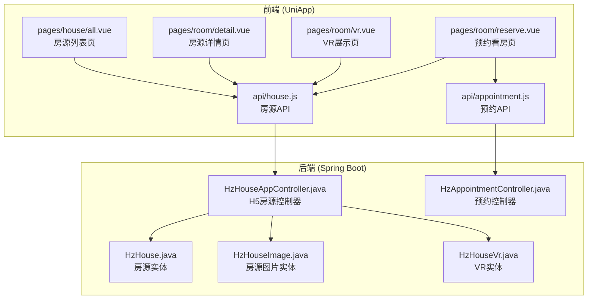
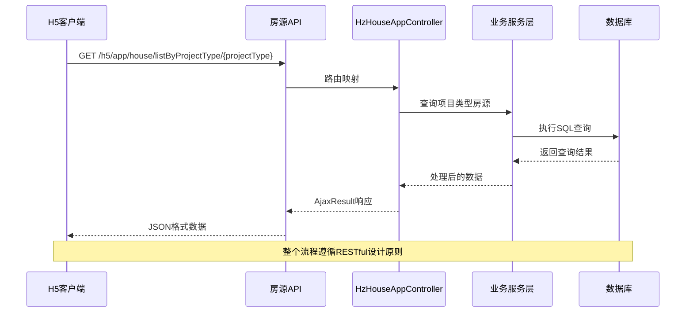
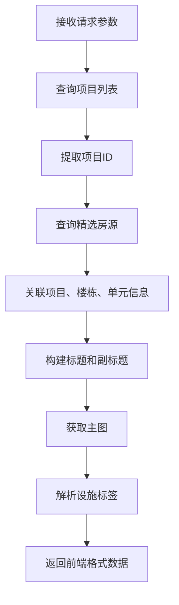
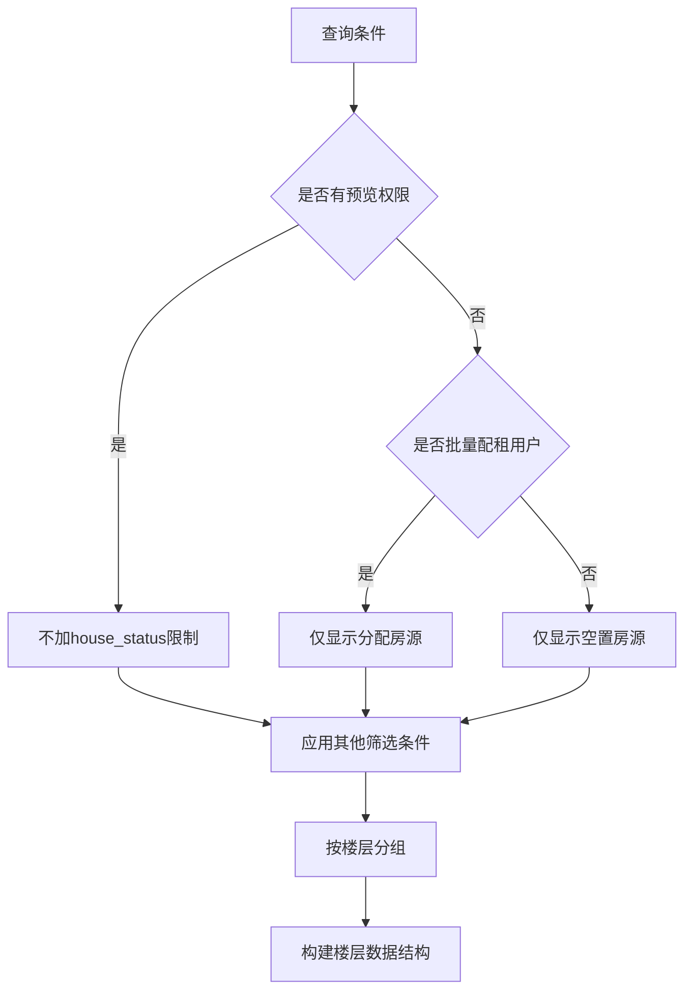
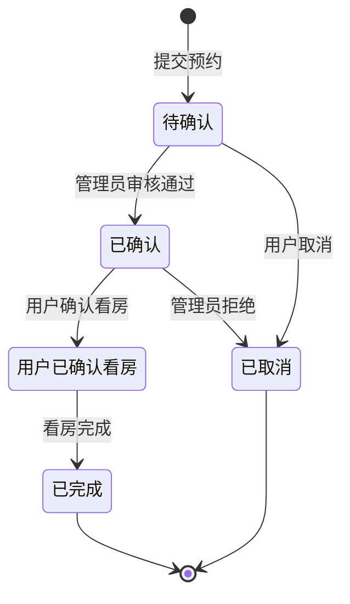
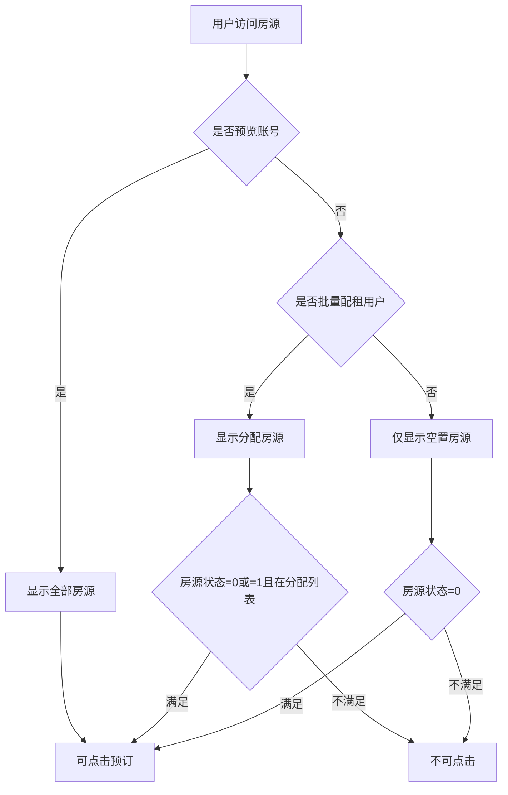
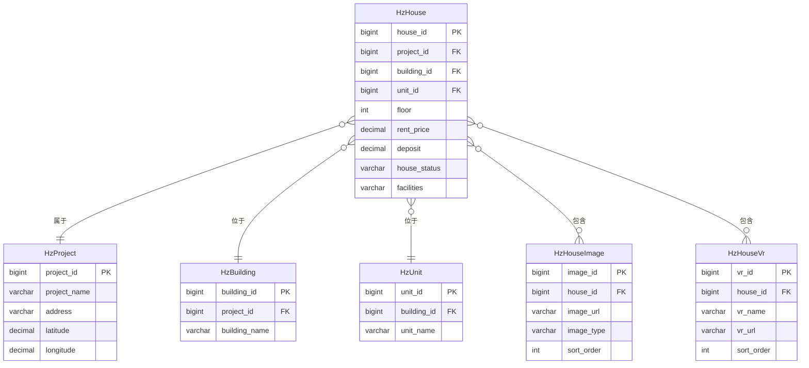
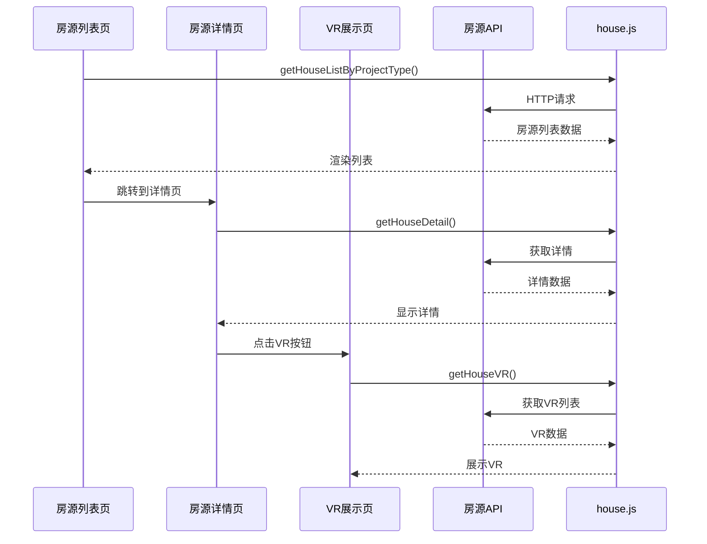

# 房源管理接口

<cite>
**本文档引用的文件**
- [HzHouseAppController.java](file://ruoyi-admin/src/main/java/com/ruoyi/web/controller/h5/HzHouseAppController.java)
- [house.js](file://uniapp-h5/api/house.js)
- [all.vue](file://uniapp-h5/pages/house/all.vue)
- [detail.vue](file://uniapp-h5/pages/room/detail.vue)
- [vr.vue](file://uniapp-h5/pages/room/vr.vue)
- [reserve.vue](file://uniapp-h5/pages/room/reserve.vue)
- [HzHouse.java](file://ruoyi-system/src/main/java/com/ruoyi/system/domain/HzHouse.java)
- [HzHouseImage.java](file://ruoyi-system/src/main/java/com/ruoyi/system/domain/HzHouseImage.java)
- [HzHouseVr.java](file://ruoyi-system/src/main/java/com/ruoyi/system/domain/HzHouseVr.java)
- [07-预约看房.md](file://docs/数据字典/07-预约看房.md)
- [IHzAppointmentService.java](file://ruoyi-system/src/main/java/com/ruoyi/system/service/IHzAppointmentService.java)
- [HzAppointmentController.java](file://ruoyi-admin/src/main/java/com/ruoyi/web/controller/h5/HzAppointmentController.java)
- [appointment.js](file://uniapp-h5/api/appointment.js)
</cite>

## 目录
1. [简介](#简介)
2. [项目结构](#项目结构)
3. [核心组件](#核心组件)
4. [架构概览](#架构概览)
5. [详细组件分析](#详细组件分析)
6. [依赖分析](#依赖分析)
7. [性能考虑](#性能考虑)
8. [故障排除指南](#故障排除指南)
9. [结论](#结论)

## 简介

本文档详细记录了移动端H5房源管理接口，涵盖房源浏览、搜索、筛选、详情查看、预约看房等核心功能。系统采用前后端分离架构，前端使用UniApp框架开发，后端基于Spring Boot构建，提供完整的房源展示和预约功能。

## 项目结构



**图表来源**
- [house.js:1-58](file://uniapp-h5/api/house.js#L1-L58)
- [HzHouseAppController.java:1-632](file://ruoyi-admin/src/main/java/com/ruoyi/web/controller/h5/HzHouseAppController.java#L1-L632)

**章节来源**
- [house.js:1-58](file://uniapp-h5/api/house.js#L1-L58)
- [HzHouseAppController.java:1-632](file://ruoyi-admin/src/main/java/com/ruoyi/web/controller/h5/HzHouseAppController.java#L1-L632)

## 核心组件

### 房源管理控制器

HzHouseAppController是H5端房源管理的核心控制器，提供以下主要功能：

- **房源列表查询**：支持按项目类型、楼层分组、户型筛选等功能
- **房源详情获取**：提供完整的房源信息展示
- **图片和VR资源管理**：支持按分类获取房源图片和VR资源
- **预约看房处理**：提供预约申请和状态管理功能

### 前端API封装

前端通过house.js统一管理所有房源相关的API调用，包括：
- 按项目类型获取房源列表
- 获取房源列表（按楼层分组）
- 获取房源详情
- 获取VR列表
- 获取房源图片

**章节来源**
- [HzHouseAppController.java:107-196](file://ruoyi-admin/src/main/java/com/ruoyi/web/controller/h5/HzHouseAppController.java#L107-L196)
- [house.js:1-58](file://uniapp-h5/api/house.js#L1-L58)

## 架构概览



**图表来源**
- [HzHouseAppController.java:107-196](file://ruoyi-admin/src/main/java/com/ruoyi/web/controller/h5/HzHouseAppController.java#L107-L196)
- [house.js:12-14](file://uniapp-h5/api/house.js#L12-L14)

## 详细组件分析

### 房源列表查询接口

#### 按项目类型获取房源列表

**接口定义**
- 方法：GET
- 路径：`/h5/app/house/listByProjectType/{projectType}`
- 参数：
  - `projectType`：项目类型（1:人才公寓 2:保租房 3:市场租赁）
  - `limit`：限制返回数量，默认10条

**功能特性**
- 支持三种项目类型的房源筛选
- 仅返回精选房源（is_featured=1）
- 按创建时间倒序排列
- 自动过滤下架房源

**数据转换逻辑**


**图表来源**
- [HzHouseAppController.java:107-196](file://ruoyi-admin/src/main/java/com/ruoyi/web/controller/h5/HzHouseAppController.java#L107-L196)

**接口调用示例**
```javascript
// 获取人才公寓房源列表
getHouseListByProjectType('1', 10)

// 获取保租房房源列表  
getHouseListByProjectType('2', 10)

// 获取市场租赁房源列表
getHouseListByProjectType('3', 10)
```

**章节来源**
- [HzHouseAppController.java:107-196](file://ruoyi-admin/src/main/java/com/ruoyi/web/controller/h5/HzHouseAppController.java#L107-L196)
- [house.js:12-14](file://uniapp-h5/api/house.js#L12-L14)

#### 按楼层分组获取房源列表

**接口定义**
- 方法：GET
- 路径：`/h5/app/house/list`
- 查询参数：
  - `projectId`：项目ID（必填）
  - `buildingId`：楼栋ID（必填）
  - `unitId`：单元ID（必填）
  - `houseType`：户型（可选）
  - `floorMin`：最小楼层（可选）
  - `floorMax`：最大楼层（可选）
  - `orientation`：朝向（可选）

**筛选规则**
- **房源可见性控制**：
  - 预览账号（白名单）：显示全部房源
  - 普通用户：仅显示空置房源（house_status='0'）
  - 批量配租用户：仅显示分配给自己的房源
- **户型筛选**：支持数字和中文格式（如"2"或"两室"）
- **楼层范围**：支持最小和最大楼层同时设置
- **朝向筛选**：支持多种朝向格式的转换

**分组逻辑**


**图表来源**
- [HzHouseAppController.java:202-324](file://ruoyi-admin/src/main/java/com/ruoyi/web/controller/h5/HzHouseAppController.java#L202-L324)

**章节来源**
- [HzHouseAppController.java:202-324](file://ruoyi-admin/src/main/java/com/ruoyi/web/controller/h5/HzHouseAppController.java#L202-L324)

### 房源详情接口

**接口定义**
- 方法：GET
- 路径：`/h5/app/house/{houseId}`

**返回数据结构**
```json
{
  "houseId": 1,
  "buildingNo": "1号楼",
  "unitNo": "1单元", 
  "roomNo": "101",
  "floor": 3,
  "price": 3500,
  "deposit": 3500,
  "area": 60.5,
  "layout": "一室一厅",
  "orientation": "南",
  "decoration": "精装修",
  "remark": "房源简介",
  "facilities": ["空调", "冰箱", "洗衣机"],
  "projectId": 1,
  "projectName": "航南新城专家公寓",
  "address": "地址信息",
  "latitude": 34.749302,
  "longitude": 113.665412,
  "contactPhone": "13800138000",
  "houseStatus": "0",
  "houseStatusText": "空置"
}
```

**数据关联逻辑**
- 关联查询项目、楼栋、单元信息
- 解析房源设施字符串为数组格式
- 提供房源状态的中文描述

**章节来源**
- [HzHouseAppController.java:329-380](file://ruoyi-admin/src/main/java/com/ruoyi/web/controller/h5/HzHouseAppController.java#L329-L380)

### 图片和VR资源接口

#### 获取房源图片列表

**接口定义**
- 方法：GET
- 路径：`/h5/app/house/{houseId}/images`

**图片分类**
- 主图 (main)：1
- 户型图 (layout)：2  
- 卧室 (bedroom)：3
- 卫生间 (bathroom)：4
- 室内 (indoor)：5
- 室外 (outdoor)：6

**返回格式**
```json
[
  {
    "key": "main",
    "name": "主图",
    "images": ["image1.jpg", "image2.jpg"]
  },
  {
    "key": "layout", 
    "name": "户型图",
    "images": ["layout1.jpg"]
  }
]
```

#### 获取VR列表

**接口定义**
- 方法：GET
- 路径：`/h5/app/house/{houseId}/vr`

**返回格式**
```json
[
  {
    "vrId": 1,
    "vrName": "VR样板间",
    "vrUrl": "vr_image.jpg"
  }
]
```

**章节来源**
- [HzHouseAppController.java:385-453](file://ruoyi-admin/src/main/java/com/ruoyi/web/controller/h5/HzHouseAppController.java#L385-L453)

### 预约看房接口

#### 提交预约申请

**接口定义**
- 方法：POST
- 路径：`/h5/app/house/{houseId}/appointment`

**请求参数**
```json
{
  "visitorName": "张三",
  "visitorPhone": "13800138000", 
  "appointmentDate": "2026-01-15",
  "appointmentTime": "10:00"
}
```

**状态管理**
- 预约状态：0=待确认
- 预约来源：H5
- 自动设置租户ID（从Token解析）

**章节来源**
- [HzHouseAppController.java:517-553](file://ruoyi-admin/src/main/java/com/ruoyi/web/controller/h5/HzHouseAppController.java#L517-L553)

#### 预约看房数据字典

根据数据字典文档，预约看房表包含以下关键字段：

| 字段名 | 类型 | 描述 | 状态流转 |
|--------|------|------|----------|
| appointment_id | bigint | 预约ID | 主键 |
| appointment_status | char(1) | 预约状态 | 0:待确认 → 1:已确认 → 2:用户已确认看房 → 3:已完成 → 4:已取消 |
| visitor_name | varchar(50) | 看房人姓名 | 必填 |
| visitor_phone | varchar(20) | 看房人电话 | 必填 |
| appointment_date | date | 预约日期 | 必填 |
| appointment_time | varchar(20) | 预约时间段 | 必填 |

**状态流转图**


**图表来源**
- [07-预约看房.md:1-34](file://docs/数据字典/07-预约看房.md#L1-L34)

**章节来源**
- [07-预约看房.md:1-34](file://docs/数据字典/07-预约看房.md#L1-L34)

### 房源状态管理

系统支持五种房源状态：
- 0=空置：可正常租赁
- 1=已预订：已被预定
- 2=已出租：正在使用中  
- 3=维修中：暂时不可用
- 4=下架：已移除展示

**状态判断逻辑**


**图表来源**
- [HzHouseAppController.java:254-313](file://ruoyi-admin/src/main/java/com/ruoyi/web/controller/h5/HzHouseAppController.java#L254-L313)

**章节来源**
- [HzHouseAppController.java:502-512](file://ruoyi-admin/src/main/java/com/ruoyi/web/controller/h5/HzHouseAppController.java#L502-L512)

## 依赖分析

### 数据模型关系



**图表来源**
- [HzHouse.java:20-441](file://ruoyi-system/src/main/java/com/ruoyi/system/domain/HzHouse.java#L20-L441)
- [HzHouseImage.java:17-137](file://ruoyi-system/src/main/java/com/ruoyi/system/domain/HzHouseImage.java#L17-L137)
- [HzHouseVr.java:17-123](file://ruoyi-system/src/main/java/com/ruoyi/system/domain/HzHouseVr.java#L17-L123)

### 前端组件交互



**图表来源**
- [all.vue:91-129](file://uniapp-h5/pages/house/all.vue#L91-L129)
- [detail.vue:369-425](file://uniapp-h5/pages/room/detail.vue#L369-L425)
- [vr.vue:21-55](file://uniapp-h5/pages/room/vr.vue#L21-L55)

**章节来源**
- [all.vue:1-498](file://uniapp-h5/pages/house/all.vue#L1-L498)
- [detail.vue:1-800](file://uniapp-h5/pages/room/detail.vue#L1-L800)
- [vr.vue:1-102](file://uniapp-h5/pages/room/vr.vue#L1-L102)

## 性能考虑

### 缓存策略

1. **图片缓存**：前端对已加载的图片进行缓存，避免重复请求
2. **列表缓存**：房源列表数据在页面停留期间保持缓存
3. **VR资源缓存**：VR图片和视频资源进行本地缓存

### 数据优化

1. **分页查询**：后端支持分页查询，避免一次性加载大量数据
2. **条件筛选**：前端提供多种筛选条件，减少不必要的数据传输
3. **懒加载**：图片和VR资源采用懒加载方式

### 网络优化

1. **CDN加速**：静态资源通过CDN分发
2. **压缩传输**：启用Gzip压缩减少传输体积
3. **连接复用**：HTTP/2连接复用提高并发性能

## 故障排除指南

### 常见问题及解决方案

**房源列表为空**
- 检查项目类型参数是否正确
- 确认项目状态为正常
- 验证房源是否为精选房源

**图片加载失败**
- 检查图片URL是否完整
- 确认图片服务器可访问
- 验证CDN配置是否正确

**预约失败**
- 检查用户登录状态
- 验证手机号格式
- 确认房源状态是否允许预约

**VR展示异常**
- 检查VR资源URL
- 确认web-view组件可用性
- 验证跨域配置

**章节来源**
- [HzHouseAppController.java:522-526](file://ruoyi-admin/src/main/java/com/ruoyi/web/controller/h5/HzHouseAppController.java#L522-L526)

## 结论

本文档全面介绍了移动端H5房源管理接口的设计与实现，涵盖了从房源浏览、筛选到预约看房的完整业务流程。系统采用清晰的分层架构，前后端职责明确，数据模型设计合理，能够满足实际业务需求。

关键特性包括：
- 完整的房源信息展示功能
- 灵活的筛选和排序机制  
- 支持VR全景展示
- 规范的预约看房流程
- 完善的状态管理和权限控制

开发者可以根据本文档提供的接口规范和实现细节，快速集成和扩展房源管理功能。