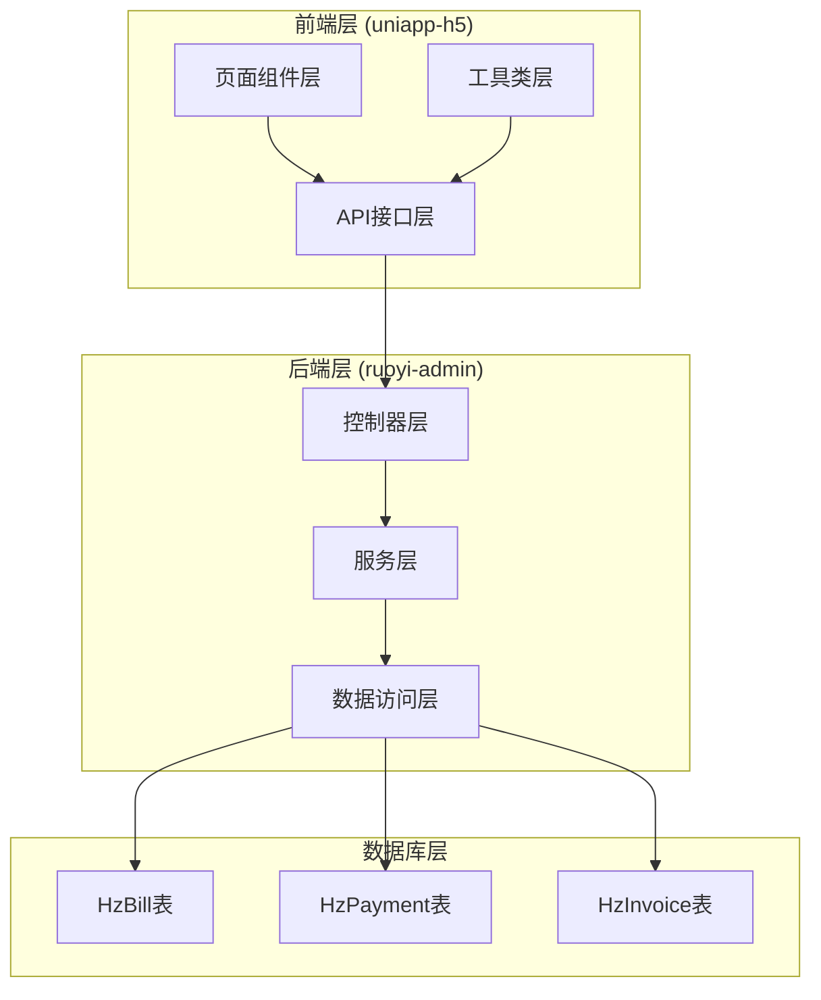
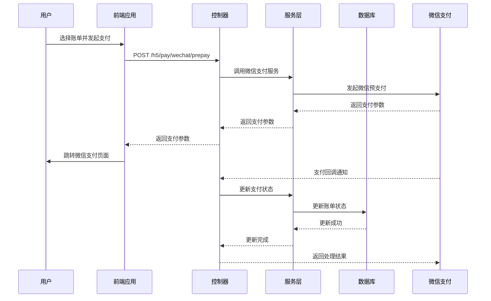
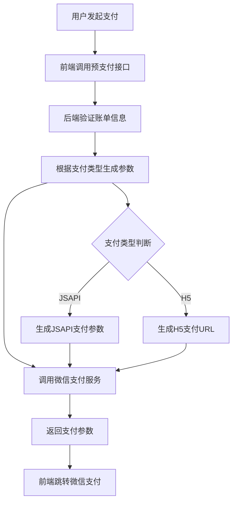
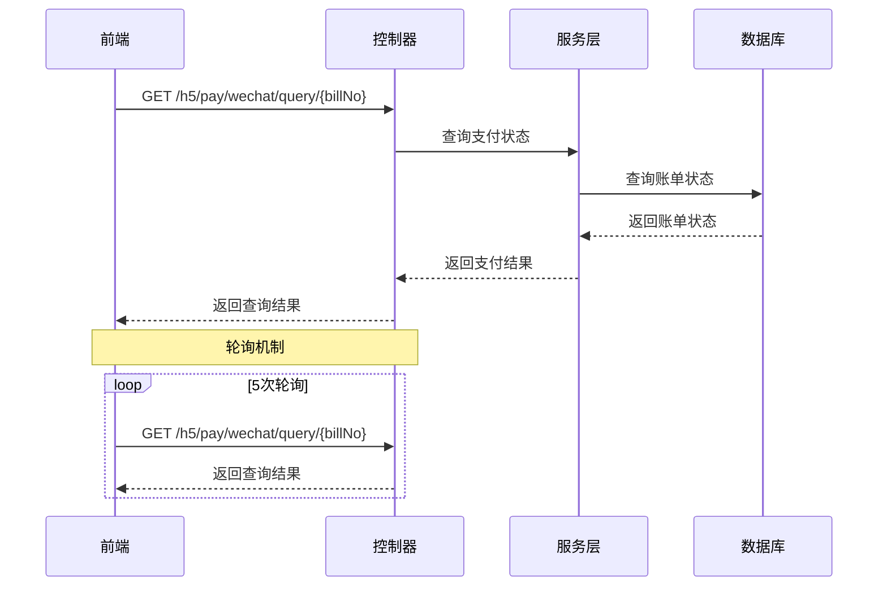
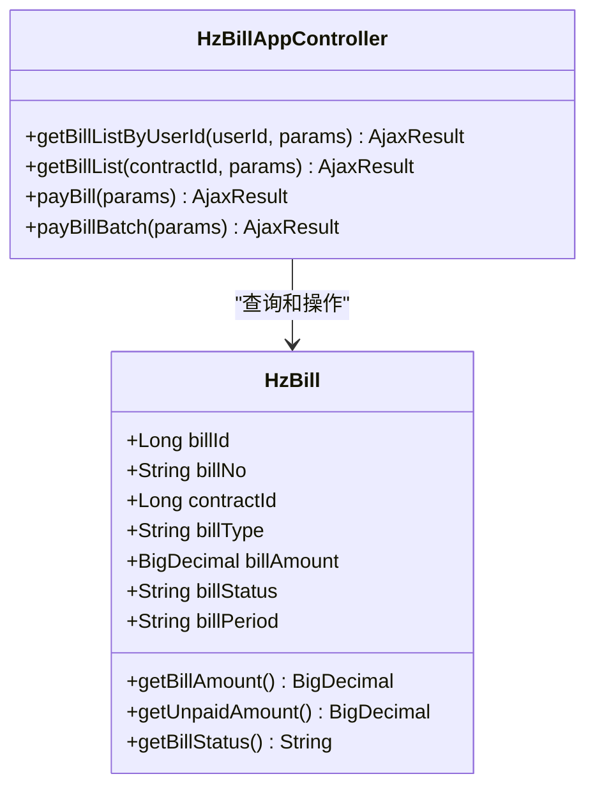
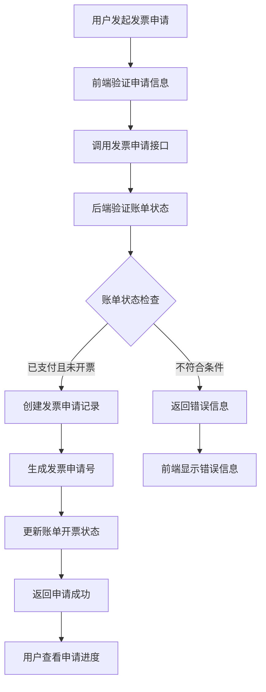
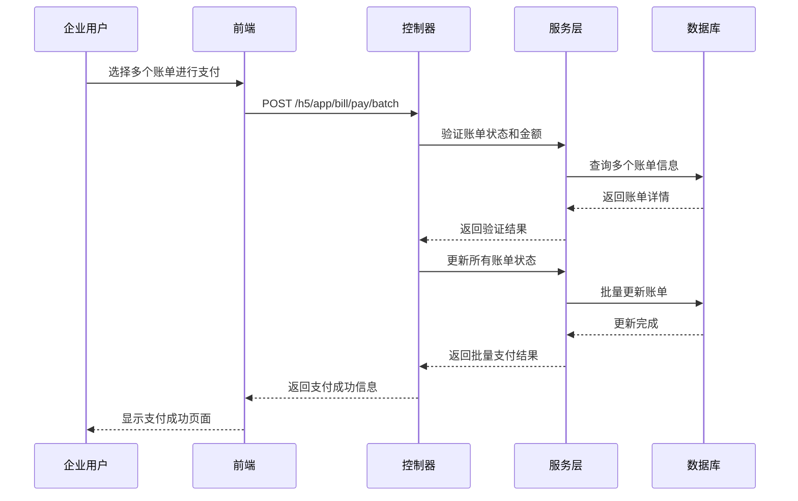
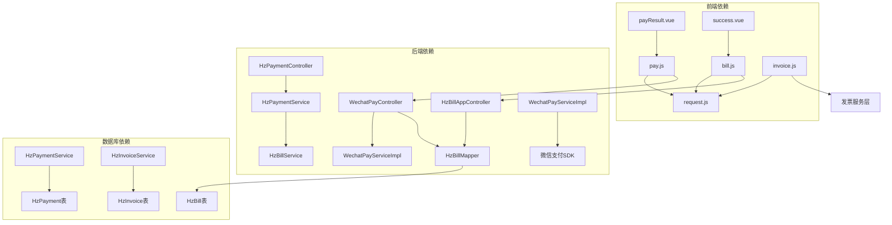

# 支付账单接口

<cite>
**本文档引用的文件**
- [pay.js](file://uniapp-h5/api/pay.js)
- [bill.js](file://uniapp-h5/api/bill.js)
- [invoice.js](file://uniapp-h5/api/invoice.js)
- [HzBillAppController.java](file://ruoyi-admin/src/main/java/com/ruoyi/web/controller/h5/HzBillAppController.java)
- [HzPaymentController.java](file://ruoyi-admin/src/main/java/com/ruoyi/web/controller/h5/HzPaymentController.java)
- [WechatPayController.java](file://ruoyi-admin/src/main/java/com/ruoyi/web/controller/h5/WechatPayController.java)
- [WechatPayServiceImpl.java](file://ruoyi-system/src/main/java/com/ruoyi/system/service/impl/WechatPayServiceImpl.java)
- [HzBill.java](file://ruoyi-system/src/main/java/com/ruoyi/system/domain/HzBill.java)
- [HzPayment.java](file://ruoyi-system/src/main/java/com/ruoyi/system/domain/HzPayment.java)
- [HzInvoice.java](file://ruoyi-system/src/main/java/com/ruoyi/system/domain/HzInvoice.java)
- [payResult.vue](file://uniapp-h5/pages/room/payResult.vue)
- [success.vue](file://uniapp-h5/pages/room/success.vue)
</cite>

## 目录
1. [简介](#简介)
2. [项目结构](#项目结构)
3. [核心组件](#核心组件)
4. [架构概览](#架构概览)
5. [详细组件分析](#详细组件分析)
6. [依赖关系分析](#依赖关系分析)
7. [性能考虑](#性能考虑)
8. [故障排除指南](#故障排除指南)
9. [结论](#结论)

## 简介

本项目是一个基于UniApp的移动端H5支付账单系统，提供了完整的财务相关API接口，包括账单查询、在线支付、企业缴费、发票申请等功能。系统集成了微信支付，实现了账单生成规则、支付状态管理、退款处理流程等核心功能。

该系统采用前后端分离架构，前端使用Vue.js框架，后端使用Spring Boot框架，数据库采用MySQL。系统支持单个账单支付、批量支付、企业批量缴费等多种支付场景，并提供了完善的发票管理功能。

## 项目结构

系统主要由以下几部分组成：

**图表来源**
- [pay.js:1-18](file://uniapp-h5/api/pay.js#L1-L18)
- [bill.js:1-61](file://uniapp-h5/api/bill.js#L1-L61)
- [HzBillAppController.java:1-250](file://ruoyi-admin/src/main/java/com/ruoyi/web/controller/h5/HzBillAppController.java#L1-L250)

**章节来源**
- [pay.js:1-18](file://uniapp-h5/api/pay.js#L1-L18)
- [bill.js:1-61](file://uniapp-h5/api/bill.js#L1-L61)
- [HzBillAppController.java:1-250](file://ruoyi-admin/src/main/java/com/ruoyi/web/controller/h5/HzBillAppController.java#L1-L250)

## 核心组件

### 前端API接口

系统提供了三个主要的API接口模块：

1. **支付接口模块** (`uniapp-h5/api/pay.js`)
   - 微信预支付接口
   - 支付结果查询接口

2. **账单接口模块** (`uniapp-h5/api/bill.js`)
   - 账单列表查询
   - 押金账单查询
   - 单个账单支付
   - 批量账单支付

3. **发票接口模块** (`uniapp-h5/api/invoice.js`)
   - 发票申请列表
   - 可开票账单查询
   - 发票申请提交
   - 发票详情查询

### 后端控制器

系统采用RESTful API设计，主要控制器包括：

1. **账单控制器** (`HzBillAppController.java`)
   - 处理账单查询和支付逻辑
   - 支持单个和批量支付

2. **支付控制器** (`HzPaymentController.java`)
   - 创建支付订单
   - 处理支付回调
   - 查询支付记录

3. **微信支付控制器** (`WechatPayController.java`)
   - 微信预支付处理
   - 支付结果回调
   - 支付状态查询

**章节来源**
- [pay.js:1-18](file://uniapp-h5/api/pay.js#L1-L18)
- [bill.js:1-61](file://uniapp-h5/api/bill.js#L1-L61)
- [invoice.js:1-63](file://uniapp-h5/api/invoice.js#L1-L63)
- [HzBillAppController.java:1-250](file://ruoyi-admin/src/main/java/com/ruoyi/web/controller/h5/HzBillAppController.java#L1-L250)
- [HzPaymentController.java:1-167](file://ruoyi-admin/src/main/java/com/ruoyi/web/controller/h5/HzPaymentController.java#L1-L167)

## 架构概览

系统采用分层架构设计，实现了清晰的职责分离：

**图表来源**
- [WechatPayController.java:63-135](file://ruoyi-admin/src/main/java/com/ruoyi/web/controller/h5/WechatPayController.java#L63-L135)
- [WechatPayServiceImpl.java:92-120](file://ruoyi-system/src/main/java/com/ruoyi/system/service/impl/WechatPayServiceImpl.java#L92-L120)

系统架构特点：

1. **前后端分离**：前端负责用户界面和交互，后端提供RESTful API
2. **微服务化**：各功能模块相对独立，便于维护和扩展
3. **异步处理**：支付回调采用异步处理机制
4. **安全性**：实现了支付参数验证和状态管理

**章节来源**
- [WechatPayController.java:1-167](file://ruoyi-admin/src/main/java/com/ruoyi/web/controller/h5/WechatPayController.java#L1-L167)
- [WechatPayServiceImpl.java:1-209](file://ruoyi-system/src/main/java/com/ruoyi/system/service/impl/WechatPayServiceImpl.java#L1-L209)

## 详细组件分析

### 支付接口组件

#### 微信预支付功能

微信预支付是整个支付流程的核心环节，负责生成支付所需的必要参数。

**图表来源**
- [pay.js:7-8](file://uniapp-h5/api/pay.js#L7-L8)
- [WechatPayController.java:63-135](file://ruoyi-admin/src/main/java/com/ruoyi/web/controller/h5/WechatPayController.java#L63-L135)

#### 支付结果查询功能

系统提供了两种支付结果查询方式：

1. **轮询查询**：前端定期查询支付状态
2. **回调查询**：通过微信支付回调通知

**图表来源**
- [pay.js:15-16](file://uniapp-h5/api/pay.js#L15-L16)
- [payResult.vue:40-57](file://uniapp-h5/pages/room/payResult.vue#L40-L57)

**章节来源**
- [pay.js:1-18](file://uniapp-h5/api/pay.js#L1-L18)
- [payResult.vue:1-73](file://uniapp-h5/pages/room/payResult.vue#L1-L73)

### 账单管理组件

#### 账单查询功能

系统支持多种账单查询方式：

**图表来源**
- [HzBill.java:19-354](file://ruoyi-system/src/main/java/com/ruoyi/system/domain/HzBill.java#L19-L354)
- [HzBillAppController.java:148-250](file://ruoyi-admin/src/main/java/com/ruoyi/web/controller/h5/HzBillAppController.java#L148-L250)

#### 支付状态管理

账单支付状态采用数字编码表示：

| 状态码 | 状态描述 | 说明 |
|--------|----------|------|
| 0 | 待支付 | 账单已生成但未支付 |
| 1 | 已支付 | 账单已完成支付 |
| 2 | 部分支付 | 账单部分金额已支付 |
| 3 | 已逾期 | 超过应支付日期未支付 |
| 4 | 已关闭 | 账单被管理员关闭 |

**章节来源**
- [HzBill.java:96-99](file://ruoyi-system/src/main/java/com/ruoyi/system/domain/HzBill.java#L96-L99)
- [HzBillAppController.java:238-248](file://ruoyi-admin/src/main/java/com/ruoyi/web/controller/h5/HzBillAppController.java#L238-L248)

### 发票管理组件

#### 发票申请流程

**图表来源**
- [invoice.js:50-51](file://uniapp-h5/api/invoice.js#L50-L51)
- [HzInvoice.java:16-223](file://ruoyi-system/src/main/java/com/ruoyi/system/domain/HzInvoice.java#L16-L223)

#### 发票状态管理

发票状态采用数字编码管理：

| 状态码 | 状态描述 | 说明 |
|--------|----------|------|
| 0 | 未开票 | 发票申请已提交但未开票 |
| 1 | 开票中 | 正在开具发票 |
| 2 | 已开票 | 发票已成功开具 |

**章节来源**
- [invoice.js:1-63](file://uniapp-h5/api/invoice.js#L1-L63)
- [HzInvoice.java:65-67](file://ruoyi-system/src/main/java/com/ruoyi/system/domain/HzInvoice.java#L65-L67)

### 企业缴费组件

#### 企业批量缴费功能

系统支持企业用户的批量缴费功能，主要特性包括：

1. **批量账单选择**：支持多账单同时支付
2. **自动金额计算**：自动计算总应付金额
3. **统一支付处理**：使用同一笔交易流水号
4. **批量状态更新**：一次性更新多个账单状态

**图表来源**
- [HzBillAppController.java:162-234](file://ruoyi-admin/src/main/java/com/ruoyi/web/controller/h5/HzBillAppController.java#L162-L234)

**章节来源**
- [HzBillAppController.java:158-234](file://ruoyi-admin/src/main/java/com/ruoyi/web/controller/h5/HzBillAppController.java#L158-L234)

## 依赖关系分析

系统各组件之间的依赖关系如下：

**图表来源**
- [pay.js:1-1](file://uniapp-h5/api/pay.js#L1-L1)
- [bill.js:4-4](file://uniapp-h5/api/bill.js#L4-L4)
- [invoice.js:4-4](file://uniapp-h5/api/invoice.js#L4-L4)
- [WechatPayController.java:41-42](file://ruoyi-admin/src/main/java/com/ruoyi/web/controller/h5/WechatPayController.java#L41-L42)

系统依赖特点：

1. **低耦合高内聚**：各模块职责明确，相互依赖关系清晰
2. **接口抽象**：通过接口定义模块间的契约
3. **配置驱动**：支付相关配置通过外部配置文件管理
4. **异常处理**：统一的异常处理机制保证系统稳定性

**章节来源**
- [WechatPayController.java:1-167](file://ruoyi-admin/src/main/java/com/ruoyi/web/controller/h5/WechatPayController.java#L1-L167)
- [WechatPayServiceImpl.java:1-209](file://ruoyi-system/src/main/java/com/ruoyi/system/service/impl/WechatPayServiceImpl.java#L1-L209)

## 性能考虑

### 缓存策略

1. **账单查询缓存**：对常用账单查询结果进行缓存
2. **支付状态缓存**：缓存最近的支付状态以减少数据库查询
3. **配置信息缓存**：缓存支付配置信息避免重复读取

### 异步处理

1. **支付回调异步化**：支付完成后立即返回，回调异步处理
2. **批量操作优化**：批量支付使用事务批量更新
3. **图片资源优化**：发票图片采用懒加载策略

### 数据库优化

1. **索引优化**：在常用查询字段上建立索引
2. **分页查询**：大量数据采用分页查询避免全表扫描
3. **连接池配置**：合理配置数据库连接池参数

## 故障排除指南

### 常见问题及解决方案

#### 支付失败问题

**问题现象**：用户支付后状态未更新

**可能原因**：
1. 微信回调未到达
2. 网络异常导致请求失败
3. 账单状态冲突

**解决步骤**：
1. 检查微信支付回调日志
2. 手动调用支付结果查询接口
3. 验证账单状态一致性

#### 账单状态异常

**问题现象**：账单状态显示不正确

**排查方法**：
1. 检查支付记录状态
2. 验证交易流水号
3. 确认数据库事务完整性

#### 发票申请失败

**问题现象**：发票申请提交后状态不变

**解决方法**：
1. 检查账单是否已支付且未开票
2. 验证发票申请信息完整性
3. 确认发票服务可用性

**章节来源**
- [HzPaymentController.java:101-147](file://ruoyi-admin/src/main/java/com/ruoyi/web/controller/h5/HzPaymentController.java#L101-L147)
- [WechatPayServiceImpl.java:124-140](file://ruoyi-system/src/main/java/com/ruoyi/system/service/impl/WechatPayServiceImpl.java#L124-L140)

## 结论

本支付账单系统实现了完整的移动端H5支付功能，具有以下特点：

1. **功能完整**：涵盖了账单查询、在线支付、企业缴费、发票申请等核心功能
2. **架构清晰**：采用分层架构设计，职责分离明确
3. **扩展性强**：模块化设计便于功能扩展和维护
4. **安全性高**：实现了支付参数验证、状态管理和异常处理
5. **用户体验好**：提供了流畅的支付体验和完善的错误处理

系统通过微信支付集成，实现了安全可靠的在线支付功能，为企业和个人用户提供了一站式的财务管理解决方案。未来可以进一步优化性能，增加更多支付渠道支持，并完善报表统计功能。