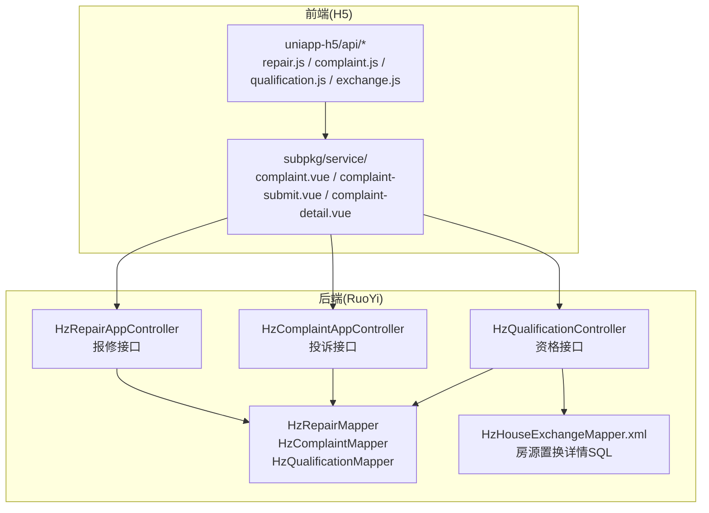
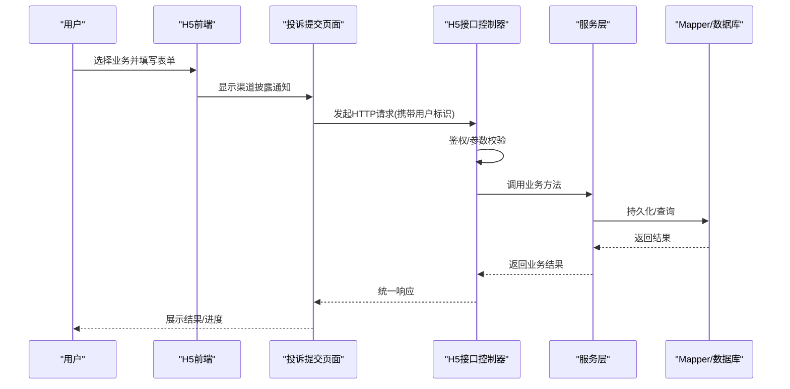
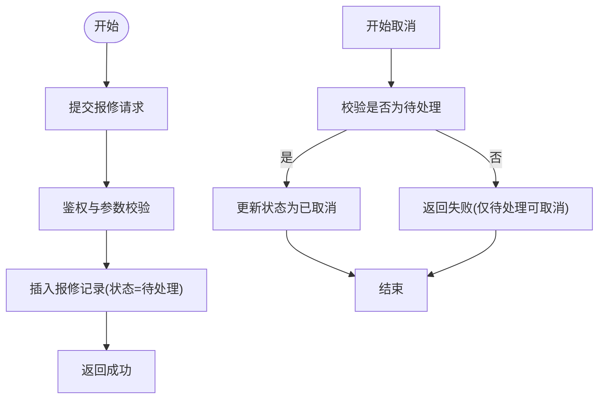
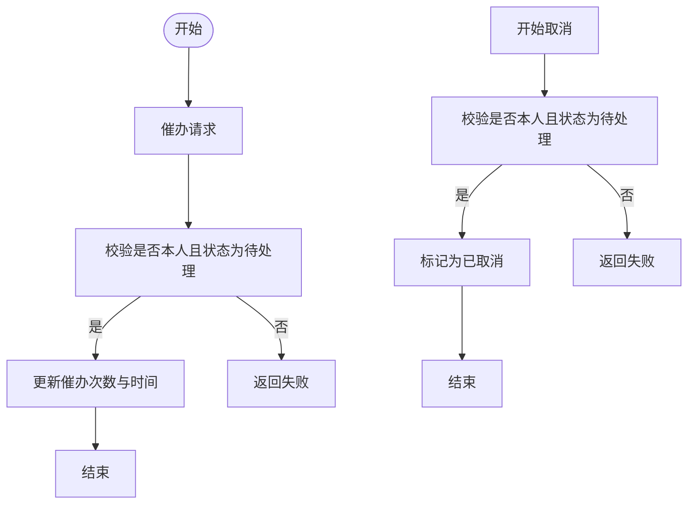
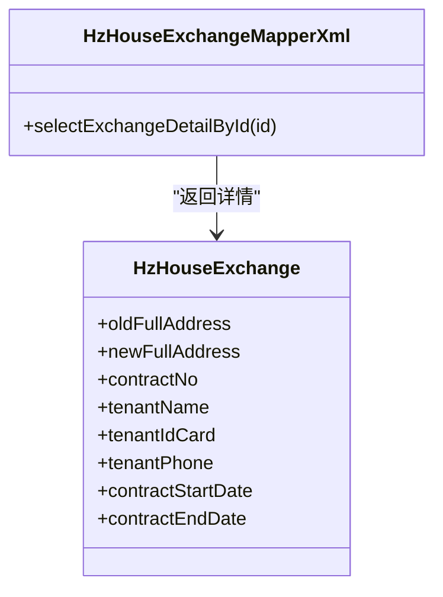
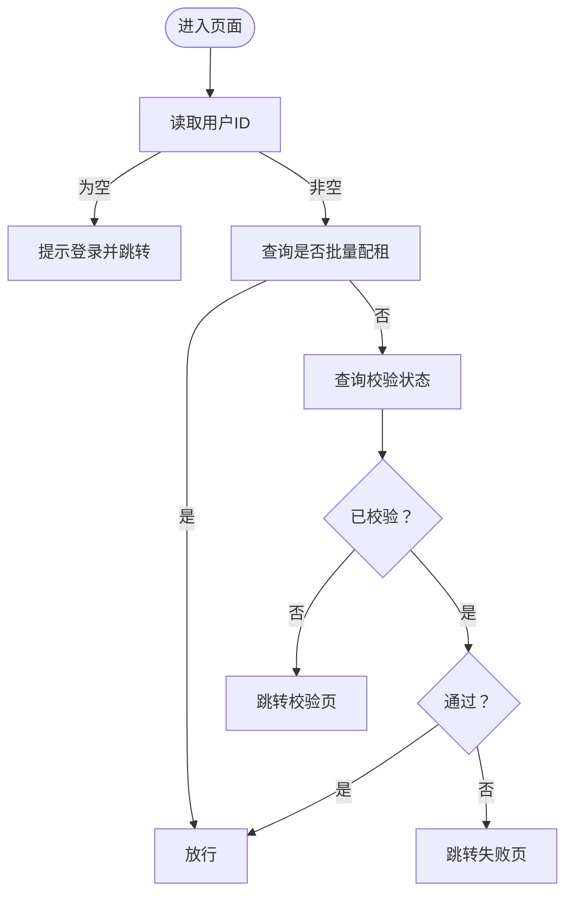
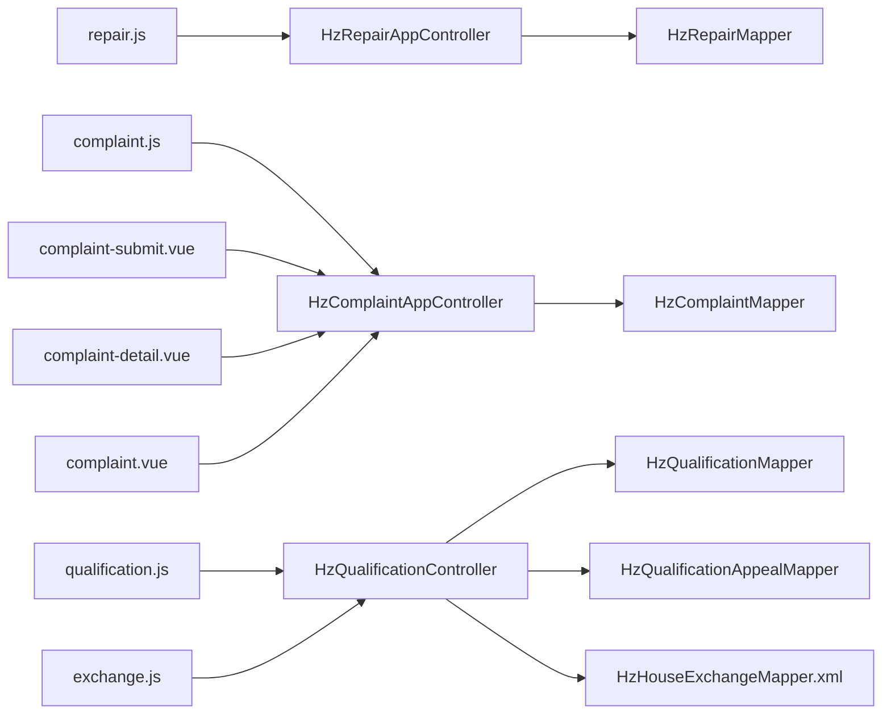

# 服务申请接口

<cite>
**本文引用的文件**
- [HzRepairAppController.java](file://ruoyi-admin/src/main/java/com/ruoyi/web/controller/h5/HzRepairAppController.java)
- [HzComplaintAppController.java](file://ruoyi-admin/src/main/java/com/ruoyi/web/controller/h5/HzComplaintAppController.java)
- [HzQualificationController.java](file://ruoyi-admin/src/main/java/com/ruoyi/web/controller/h5/HzQualificationController.java)
- [repair.js](file://uniapp-h5/api/repair.js)
- [complaint.js](file://uniapp-h5/api/complaint.js)
- [qualification.js](file://uniapp-h5/api/qualification.js)
- [exchange.js](file://uniapp-h5/api/exchange.js)
- [HzRepair.java](file://ruoyi-system/src/main/java/com/ruoyi/system/domain/HzRepair.java)
- [HzComplaint.java](file://ruoyi-system/src/main/java/com/ruoyi/system/domain/HzComplaint.java)
- [HzQualification.java](file://ruoyi-system/src/main/java/com/ruoyi/system/domain/HzQualification.java)
- [HzHouseExchangeMapper.xml](file://ruoyi-system/src/main/resources/mapper/system/HzHouseExchangeMapper.xml)
- [complaint-submit.vue](file://uniapp-h5/subpkg/service/complaint-submit.vue)
- [complaint-detail.vue](file://uniapp-h5/subpkg/service/complaint-detail.vue)
- [complaint.vue](file://uniapp-h5/subpkg/service/complaint.vue)
- [03-合同管理.md](file://docs/数据字典/03-合同管理.md)
- [PAGINATION_REPAIR_REPORT.txt](file://PAGINATION_REPAIR_REPORT.txt)
- [PAGINATION_CHECKLIST.csv](file://PAGINATION_CHECKLIST.csv)
</cite>

## 更新摘要
**变更内容**
- 在投诉提交组件中新增渠道披露通知系统，明确告知用户投诉通过小程序渠道而非官方微信渠道提交
- 更新投诉提交页面的UI设计，添加置顶通知栏显示渠道说明
- 完善投诉详情页面的用户提示功能

## 目录
1. [简介](#简介)
2. [项目结构](#项目结构)
3. [核心组件](#核心组件)
4. [架构总览](#架构总览)
5. [详细组件分析](#详细组件分析)
6. [依赖关系分析](#依赖关系分析)
7. [性能考虑](#性能考虑)
8. [故障排查指南](#故障排查指南)
9. [结论](#结论)
10. [附录](#附录)

## 简介
本文件面向移动端H5端的服务申请能力，覆盖以下核心业务场景：
- 报修申请：提交故障描述、查询处理进度、取消申请
- 投诉举报：提交投诉内容与证据、查询处理状态、催办与取消
- 房源置换：提交换房申请、查询可换房源、查看申请进度
- 资格申请：提交资格申请、查看校验状态、发起申诉、签署承诺书

文档提供接口定义、调用示例、数据模型、审核流程、状态更新机制与用户反馈处理方案，帮助开发者快速实现并保障服务质量。

**更新** 新增投诉渠道披露通知系统，确保用户清楚了解投诉提交的具体渠道信息。

## 项目结构
移动端H5服务申请相关的核心代码分布在以下模块：
- 控制器层（后端）：H5端控制器负责接收前端请求、鉴权与调用服务层
- 接口层（前端）：uniapp-h5封装各业务API，统一请求方法
- 领域模型：对应数据库表的实体类，承载字段与业务语义
- 映射文件：复杂查询（如房源置换详情）通过XML映射实现
- UI组件：各业务页面的Vue组件，提供用户交互界面

**图表来源**
- [repair.js:1-49](file://uniapp-h5/api/repair.js#L1-L49)
- [complaint.js:1-53](file://uniapp-h5/api/complaint.js#L1-L53)
- [qualification.js:1-161](file://uniapp-h5/api/qualification.js#L1-L161)
- [exchange.js:1-47](file://uniapp-h5/api/exchange.js#L1-L47)
- [HzRepairAppController.java:1-133](file://ruoyi-admin/src/main/java/com/ruoyi/web/controller/h5/HzRepairAppController.java#L1-L133)
- [HzComplaintAppController.java:1-156](file://ruoyi-admin/src/main/java/com/ruoyi/web/controller/h5/HzComplaintAppController.java#L1-L156)
- [HzQualificationController.java:1-276](file://ruoyi-admin/src/main/java/com/ruoyi/web/controller/h5/HzQualificationController.java#L1-L276)

**章节来源**
- [repair.js:1-49](file://uniapp-h5/api/repair.js#L1-L49)
- [complaint.js:1-53](file://uniapp-h5/api/complaint.js#L1-L53)
- [qualification.js:1-161](file://uniapp-h5/api/qualification.js#L1-L161)
- [exchange.js:1-47](file://uniapp-h5/api/exchange.js#L1-L47)

## 核心组件
- 报修申请组件：提供提交、查询列表、详情、取消等能力
- 投诉举报组件：提供提交、查询列表、详情、催办、取消等能力，包含渠道披露通知系统
- 房源置换组件：提供申请提交、可换房源查询、申请详情查询
- 资格申请组件：提供校验状态查询、触发校验、申请提交、申诉、承诺书签署

**更新** 投诉举报组件新增渠道披露通知系统，确保用户在提交投诉前了解具体的投诉渠道信息。

**章节来源**
- [HzRepairAppController.java:1-133](file://ruoyi-admin/src/main/java/com/ruoyi/web/controller/h5/HzRepairAppController.java#L1-L133)
- [HzComplaintAppController.java:1-156](file://ruoyi-admin/src/main/java/com/ruoyi/web/controller/h5/HzComplaintAppController.java#L1-L156)
- [HzQualificationController.java:1-276](file://ruoyi-admin/src/main/java/com/ruoyi/web/controller/h5/HzQualificationController.java#L1-L276)

## 架构总览
整体采用前后端分离架构，H5端通过HTTP接口与后端交互，后端控制器负责鉴权、参数校验与业务编排，服务层与持久层分别承担领域逻辑与数据访问。

**图表来源**
- [HzRepairAppController.java:33-51](file://ruoyi-admin/src/main/java/com/ruoyi/web/controller/h5/HzRepairAppController.java#L33-L51)
- [HzComplaintAppController.java:33-51](file://ruoyi-admin/src/main/java/com/ruoyi/web/controller/h5/HzComplaintAppController.java#L33-L51)
- [HzQualificationController.java:133-146](file://ruoyi-admin/src/main/java/com/ruoyi/web/controller/h5/HzQualificationController.java#L133-L146)

## 详细组件分析

### 报修申请组件
- 接口能力
  - 提交报修：支持位置、房间号、联系方式、问题描述、期望维修时间、图片等
  - 查询我的报修列表
  - 查看报修详情（仅本人可见）
  - 取消报修（仅待处理可取消）

- 关键字段（HzRepair）
  - 主键、报修编号、用户ID、项目/楼栋/单元、所在位置、房间号、联系方式、问题描述、图片、期望维修时间、状态、处理结果、处理时间、处理人、删除标志

- 前端调用示例
  - 提交报修：POST /h5/app/repair/submit
  - 我的列表：GET /h5/app/repair/myList?userId=...
  - 详情：GET /h5/app/repair/{repairId}?userId=...
  - 取消：PUT /h5/app/repair/cancel/{repairId}?userId=...

- 流程图（提交与取消）

**图表来源**
- [HzRepairAppController.java:33-51](file://ruoyi-admin/src/main/java/com/ruoyi/web/controller/h5/HzRepairAppController.java#L33-L51)
- [HzRepairAppController.java:93-105](file://ruoyi-admin/src/main/java/com/ruoyi/web/controller/h5/HzRepairAppController.java#L93-L105)
- [repair.js:20-48](file://uniapp-h5/api/repair.js#L20-L48)

**章节来源**
- [HzRepairAppController.java:1-133](file://ruoyi-admin/src/main/java/com/ruoyi/web/controller/h5/HzRepairAppController.java#L1-L133)
- [HzRepair.java:1-278](file://ruoyi-system/src/main/java/com/ruoyi/system/domain/HzRepair.java#L1-L278)
- [repair.js:1-49](file://uniapp-h5/api/repair.js#L1-L49)

### 投诉举报组件
- 接口能力
  - 提交投诉：支持标题、内容、联系方式、图片等
  - 查询我的投诉列表
  - 查看投诉详情（仅本人可见）
  - 催办投诉（仅待处理可催办）
  - 取消投诉（仅待处理可取消）

- 关键字段（HzComplaint）
  - 主键、用户ID、标题、内容、联系方式、图片、状态、是否已催办、催办次数、最后催办时间、处理结果、处理时间、处理人、删除标志

- 前端调用示例
  - 提交：POST /h5/app/complaint/submit
  - 我的列表：GET /h5/app/complaint/myList?userId=...
  - 详情：GET /h5/app/complaint/{complaintId}?userId=...
  - 催办：PUT /h5/app/complaint/urge/{complaintId}?userId=...
  - 取消：PUT /h5/app/complaint/cancel/{complaintId}?userId=...

- 流程图（催办与取消）

**更新** 新增渠道披露通知系统，在投诉提交页面顶部显示"此投诉为本小程序自有投诉渠道，非微信官方投诉渠道"的置顶提示，确保用户清楚了解投诉提交的具体渠道信息。

**图表来源**
- [HzComplaintAppController.java:93-111](file://ruoyi-admin/src/main/java/com/ruoyi/web/controller/h5/HzComplaintAppController.java#L93-L111)
- [HzComplaintAppController.java:116-128](file://ruoyi-admin/src/main/java/com/ruoyi/web/controller/h5/HzComplaintAppController.java#L116-L128)
- [complaint.js:36-52](file://uniapp-h5/api/complaint.js#L36-L52)

**章节来源**
- [HzComplaintAppController.java:1-156](file://ruoyi-admin/src/main/java/com/ruoyi/web/controller/h5/HzComplaintAppController.java#L1-L156)
- [HzComplaint.java:1-233](file://ruoyi-system/src/main/java/com/ruoyi/system/domain/HzComplaint.java#L1-L233)
- [complaint.js:1-53](file://uniapp-h5/api/complaint.js#L1-L53)

### 房源置换组件
- 接口能力
  - 提交换房申请：指定原合同、申请日期、换房原因
  - 查询我的换房申请列表
  - 查看换房申请详情（含原/新房源完整地址）
  - 查询可换房源（已确认合同列表）

- 数据模型与查询
  - 申请记录表：hz_house_exchange，包含申请时间、审批结果、审批意见、审批人、审批时间、换房时间、状态等
  - 详情查询通过HzHouseExchangeMapper.xml联表查询，拼装原/新房源完整地址

- 前端调用示例
  - 申请列表：GET /h5/app/exchange/list/{tenantId}
  - 详情：GET /h5/app/exchange/{exchangeId}
  - 可换房源：GET /h5/app/exchange/confirmed/{tenantId}
  - 提交：POST /h5/app/exchange

- 类图（申请详情查询）

**图表来源**
- [HzHouseExchangeMapper.xml:100-128](file://ruoyi-system/src/main/resources/mapper/system/HzHouseExchangeMapper.xml#L100-L128)
- [03-合同管理.md:137-165](file://docs/数据字典/03-合同管理.md#L137-L165)
- [exchange.js:6-39](file://uniapp-h5/api/exchange.js#L6-L39)

**章节来源**
- [exchange.js:1-47](file://uniapp-h5/api/exchange.js#L1-L47)
- [HzHouseExchangeMapper.xml:100-128](file://ruoyi-system/src/main/resources/mapper/system/HzHouseExchangeMapper.xml#L100-L128)
- [03-合同管理.md:137-165](file://docs/数据字典/03-合同管理.md#L137-L165)

### 资格申请组件
- 接口能力
  - 查询资格校验状态：是否已校验、是否通过、各项明细、失败原因、最近校验时间
  - 触发一次同步校验：并发调用政务接口，返回结果
  - 判断是否为"批量配租"用户：命中即豁免校验
  - 提交资格申请：按类型提交，避免重复提交
  - 提交学历申诉：不关联资格记录，直接使用用户ID
  - 查询申诉列表与详情
  - 签署承诺书：记录IP与设备信息

- 前端调用示例
  - 校验状态：GET /h5/qualification/status?userId=...
  - 触发校验：POST /h5/qualification/check?userId=...
  - 是否批量配租：GET /h5/qualification/is-batch-tenant?userId=...
  - 资格申请：POST /h5/qualification/apply
  - 学历申诉：POST /h5/qualification/appeal
  - 申诉列表：GET /h5/qualification/appeal/list?userId=...
  - 申诉详情：GET /h5/qualification/appeal/{appealId}
  - 承诺书：POST /h5/qualification/commitment

- 前置守卫与路由跳转
  - ensureQualified：根据是否批量配租、是否已通过、是否已校验，决定放行或跳转至校验/失败页
  - guardOrRedirect：轻量兜底守卫，仅在必要时重定向至失败页

- 流程图（资格校验前置守卫）

**图表来源**
- [qualification.js:60-101](file://uniapp-h5/api/qualification.js#L60-L101)
- [qualification.js:131-151](file://uniapp-h5/api/qualification.js#L131-L151)

**章节来源**
- [HzQualificationController.java:1-276](file://ruoyi-admin/src/main/java/com/ruoyi/web/controller/h5/HzQualificationController.java#L1-L276)
- [HzQualification.java:1-377](file://ruoyi-system/src/main/java/com/ruoyi/system/domain/HzQualification.java#L1-L377)
- [qualification.js:1-161](file://uniapp-h5/api/qualification.js#L1-L161)

## 依赖关系分析
- 控制器与服务层解耦：H5控制器仅负责参数解析与鉴权，具体业务逻辑下沉至服务层
- Mapper与XML映射：复杂查询（如房源置换详情）通过XML映射实现，提升可维护性
- 前端SDK封装：统一的请求方法封装，便于复用与调试
- UI组件与业务逻辑分离：各业务页面组件独立管理状态和交互逻辑

**图表来源**
- [repair.js:1-49](file://uniapp-h5/api/repair.js#L1-L49)
- [complaint.js:1-53](file://uniapp-h5/api/complaint.js#L1-L53)
- [qualification.js:1-161](file://uniapp-h5/api/qualification.js#L1-L161)
- [exchange.js:1-47](file://uniapp-h5/api/exchange.js#L1-L47)
- [HzRepairAppController.java:1-133](file://ruoyi-admin/src/main/java/com/ruoyi/web/controller/h5/HzRepairAppController.java#L1-L133)
- [HzComplaintAppController.java:1-156](file://ruoyi-admin/src/main/java/com/ruoyi/web/controller/h5/HzComplaintAppController.java#L1-L156)
- [HzQualificationController.java:1-276](file://ruoyi-admin/src/main/java/com/ruoyi/web/controller/h5/HzQualificationController.java#L1-L276)

**章节来源**
- [PAGINATION_REPAIR_REPORT.txt:33-46](file://PAGINATION_REPAIR_REPORT.txt#L33-L46)
- [PAGINATION_CHECKLIST.csv:9-16](file://PAGINATION_CHECKLIST.csv#L9-L16)

## 性能考虑
- 分页优化：针对多处列表接口（如报修、投诉、换房、资格申诉）建议使用分页查询，避免一次性加载大量数据
- 缓存策略：对"批量配租"豁免判断可引入短期缓存，降低数据库压力
- 并发控制：资格校验为同步接口，建议在前端增加防抖与加载提示，避免重复触发
- 图片上传：建议前端压缩与懒加载，后端限制大小与格式，防止资源浪费
- UI渲染优化：投诉提交页面的渠道披露通知采用固定布局，避免频繁重排

## 故障排查指南
- 用户未登录
  - 现象：接口返回"用户未登录"
  - 处理：确保请求参数或请求头携带userId；H5控制器提供临时兜底解析
- 无权查看
  - 现象：查看详情时返回"无权查看"
  - 处理：仅允许本人查看，确认userId与记录所属一致
- 仅待处理可操作
  - 现象：催办/取消失败
  - 处理：确认状态为"待处理"，否则不可操作
- 校验异常
  - 现象：触发校验失败或返回模糊原因
  - 处理：捕获异常并提示稍后重试；检查政务接口连通性
- 渠道披露通知显示异常
  - 现象：投诉提交页面未显示渠道说明
  - 处理：检查complaint-submit.vue中的notice-bar样式和文本内容，确认CSS类名正确

**章节来源**
- [HzRepairAppController.java:44-47](file://ruoyi-admin/src/main/java/com/ruoyi/web/controller/h5/HzRepairAppController.java#L44-L47)
- [HzComplaintAppController.java:77-85](file://ruoyi-admin/src/main/java/com/ruoyi/web/controller/h5/HzComplaintAppController.java#L77-L85)
- [HzQualificationController.java:133-146](file://ruoyi-admin/src/main/java/com/ruoyi/web/controller/h5/HzQualificationController.java#L133-L146)

## 结论
本文档梳理了移动端H5服务申请的四大核心能力：报修、投诉、房源置换与资格申请。通过清晰的接口定义、数据模型与流程图，开发者可以快速实现并集成相应功能。建议在生产环境中结合分页、缓存与并发控制等手段持续优化性能，并完善异常处理与用户体验。

**更新** 新增的渠道披露通知系统提升了用户透明度，确保用户清楚了解投诉提交的具体渠道，有助于建立用户信任并减少后续沟通成本。

## 附录

### 接口一览（H5端）
- 报修
  - 提交：POST /h5/app/repair/submit
  - 我的列表：GET /h5/app/repair/myList?userId=...
  - 详情：GET /h5/app/repair/{repairId}?userId=...
  - 取消：PUT /h5/app/repair/cancel/{repairId}?userId=...
- 投诉
  - 提交：POST /h5/app/complaint/submit
  - 我的列表：GET /h5/app/complaint/myList?userId=...
  - 详情：GET /h5/app/complaint/{complaintId}?userId=...
  - 催办：PUT /h5/app/complaint/urge/{complaintId}?userId=...
  - 取消：PUT /h5/app/complaint/cancel/{complaintId}?userId=...
- 房源置换
  - 申请列表：GET /h5/app/exchange/list/{tenantId}
  - 详情：GET /h5/app/exchange/{exchangeId}
  - 可换房源：GET /h5/app/exchange/confirmed/{tenantId}
  - 提交：POST /h5/app/exchange
- 资格
  - 校验状态：GET /h5/qualification/status?userId=...
  - 触发校验：POST /h5/qualification/check?userId=...
  - 是否批量配租：GET /h5/qualification/is-batch-tenant?userId=...
  - 资格申请：POST /h5/qualification/apply
  - 学历申诉：POST /h5/qualification/appeal
  - 申诉列表：GET /h5/qualification/appeal/list?userId=...
  - 申诉详情：GET /h5/qualification/appeal/{appealId}
  - 承诺书：POST /h5/qualification/commitment

### 申请模板设计要点
- 报修：必填位置/房间号、联系方式、问题描述；选填期望维修时间与图片
- 投诉：必填标题、内容、联系方式；支持图片上传；包含渠道披露通知
- 房源置换：必填原合同、申请日期、换房原因；展示原/新房源完整地址
- 资格申请：按类型收集身份、社保、住房、学历、婚姻、家庭人数、工作单位、月收入等字段

### 审核流程配置与状态更新机制
- 报修：默认状态=待处理；完成后更新处理结果与时间；取消仅限待处理
- 投诉：默认状态=待处理；支持催办计数与时间；完成后更新处理结果与时间；取消仅限待处理
- 房源置换：状态=待审批/已批准/已驳回/已完成；审批通过后生成新合同并更新换房时间
- 资格：自动/人工审核结果与最终结果；申诉流程与承诺书签署

### 渠道披露通知系统
- **功能描述**：在投诉提交页面顶部显示置顶通知，明确告知用户投诉通过小程序渠道而非官方微信渠道提交
- **UI设计**：采用黄色警示样式的通知栏，包含感叹号图标和醒目的文字提示
- **技术实现**：通过complaint-submit.vue中的notice-bar组件实现，使用CSS样式设置背景色、边框和文字颜色
- **用户体验**：确保用户在提交投诉前就能清楚了解投诉渠道信息，提升透明度和用户信任

**章节来源**
- [complaint-submit.vue:4-8](file://uniapp-h5/subpkg/service/complaint-submit.vue#L4-L8)
- [complaint-submit.vue:312-345](file://uniapp-h5/subpkg/service/complaint-submit.vue#L312-L345)