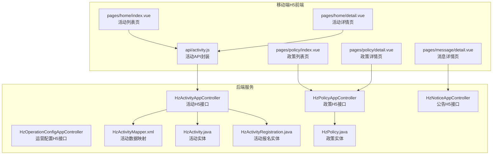
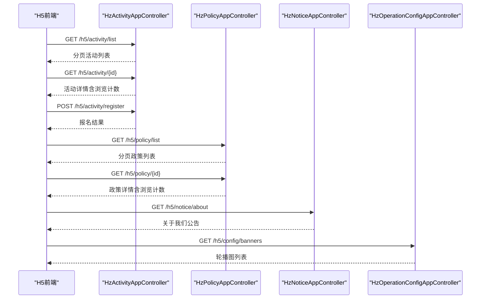
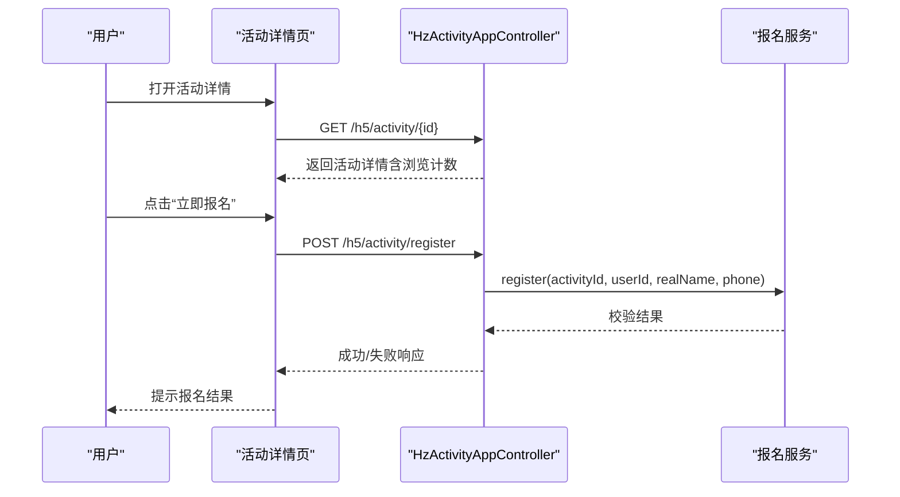
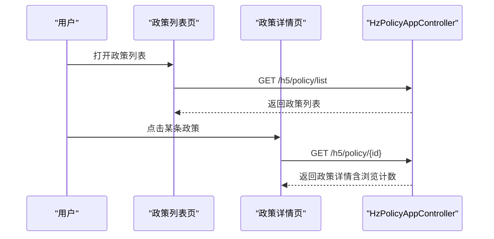
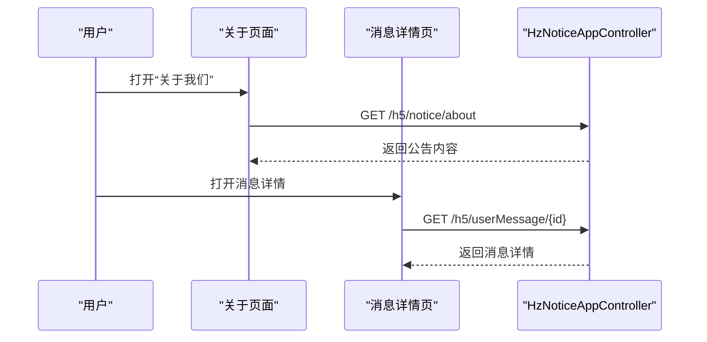
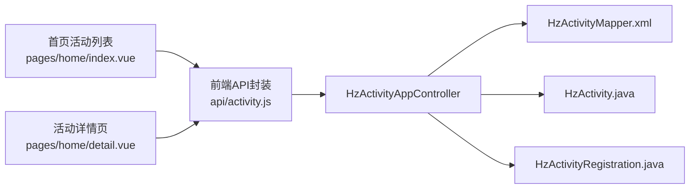

# 活动政策接口

<cite>
**本文档引用的文件**
- [HzActivityAppController.java](file://ruoyi-admin/src/main/java/com/ruoyi/web/controller/h5/HzActivityAppController.java)
- [HzPolicyAppController.java](file://ruoyi-admin/src/main/java/com/ruoyi/web/controller/h5/HzPolicyAppController.java)
- [HzNoticeAppController.java](file://ruoyi-admin/src/main/java/com/ruoyi/web/controller/h5/HzNoticeAppController.java)
- [HzOperationConfigAppController.java](file://ruoyi-admin/src/main/java/com/ruoyi/web/controller/h5/HzOperationConfigAppController.java)
- [activity.js](file://uniapp-h5/api/activity.js)
- [index.vue（首页活动列表）](file://uniapp-h5/pages/home/index.vue)
- [detail.vue（活动详情）](file://uniapp-h5/pages/home/detail.vue)
- [index.vue（政策列表）](file://uniapp-h5/pages/policy/index.vue)
- [detail.vue（政策详情）](file://uniapp-h5/pages/policy/detail.vue)
- [detail.vue（消息详情）](file://uniapp-h5/pages/message/detail.vue)
- [HzActivityMapper.xml](file://ruoyi-admin/src/main/resources/mapper/gangzhu/HzActivityMapper.xml)
- [HzActivity.java](file://ruoyi-admin/src/main/java/com/ruoyi/gangzhu/activity/domain/HzActivity.java)
- [HzActivityRegistration.java](file://ruoyi-admin/src/main/java/com/ruoyi/gangzhu/activity/domain/HzActivityRegistration.java)
- [HzPolicy.java](file://ruoyi-admin/src/main/java/com/ruoyi/gangzhu/policy/domain/HzPolicy.java)
</cite>

## 目录
1. [简介](#简介)
2. [项目结构](#项目结构)
3. [核心组件](#核心组件)
4. [架构总览](#架构总览)
5. [详细组件分析](#详细组件分析)
6. [依赖关系分析](#依赖关系分析)
7. [性能考虑](#性能考虑)
8. [故障排查指南](#故障排查指南)
9. [结论](#结论)
10. [附录](#附录)

## 简介
本文件面向移动端H5端“活动政策接口”的完整技术文档，覆盖活动报名、政策查询、公告通知等信息展示相关API。重点说明以下能力：
- 活动信息展示与报名流程管理
- 政策解读查询与浏览统计
- 系统公告发布与分级推送
- 内容管理机制、推送策略配置、用户订阅与个性化展示方案

目标是帮助开发者正确实现信息展示功能，并保证内容的及时性与准确性。

## 项目结构
移动端H5前端采用UniApp框架，后端基于Spring Boot + MyBatis Plus，控制器位于H5端命名空间下，分别处理活动、政策、公告与运营配置等业务。

图表来源
- [HzActivityAppController.java:25-109](file://ruoyi-admin/src/main/java/com/ruoyi/web/controller/h5/HzActivityAppController.java#L25-L109)
- [HzPolicyAppController.java:22-65](file://ruoyi-admin/src/main/java/com/ruoyi/web/controller/h5/HzPolicyAppController.java#L22-L65)
- [HzNoticeAppController.java:14-62](file://ruoyi-admin/src/main/java/com/ruoyi/web/controller/h5/HzNoticeAppController.java#L14-L62)
- [HzOperationConfigAppController.java:21-42](file://ruoyi-admin/src/main/java/com/ruoyi/web/controller/h5/HzOperationConfigAppController.java#L21-L42)
- [activity.js:1-55](file://uniapp-h5/api/activity.js#L1-L55)
- [index.vue（首页活动列表）:48-96](file://uniapp-h5/pages/home/index.vue#L48-L96)
- [detail.vue（活动详情）:124-202](file://uniapp-h5/pages/home/detail.vue#L124-L202)
- [index.vue（政策列表）:42-71](file://uniapp-h5/pages/policy/index.vue#L42-L71)
- [detail.vue（政策详情）:54-90](file://uniapp-h5/pages/policy/detail.vue#L54-L90)
- [HzActivityMapper.xml:1-34](file://ruoyi-admin/src/main/resources/mapper/gangzhu/HzActivityMapper.xml#L1-L34)

章节来源
- [HzActivityAppController.java:25-109](file://ruoyi-admin/src/main/java/com/ruoyi/web/controller/h5/HzActivityAppController.java#L25-L109)
- [HzPolicyAppController.java:22-65](file://ruoyi-admin/src/main/java/com/ruoyi/web/controller/h5/HzPolicyAppController.java#L22-L65)
- [HzNoticeAppController.java:14-62](file://ruoyi-admin/src/main/java/com/ruoyi/web/controller/h5/HzNoticeAppController.java#L14-L62)
- [HzOperationConfigAppController.java:21-42](file://ruoyi-admin/src/main/java/com/ruoyi/web/controller/h5/HzOperationConfigAppController.java#L21-L42)
- [activity.js:1-55](file://uniapp-h5/api/activity.js#L1-L55)
- [index.vue（首页活动列表）:48-96](file://uniapp-h5/pages/home/index.vue#L48-L96)
- [detail.vue（活动详情）:124-202](file://uniapp-h5/pages/home/detail.vue#L124-L202)
- [index.vue（政策列表）:42-71](file://uniapp-h5/pages/policy/index.vue#L42-L71)
- [detail.vue（政策详情）:54-90](file://uniapp-h5/pages/policy/detail.vue#L54-L90)

## 核心组件
- 活动H5接口控制器：提供活动列表、详情、报名、报名状态查询、我的报名记录等接口。
- 政策H5接口控制器：提供政策列表、详情、浏览计数增加等接口。
- 公告H5接口控制器：提供“关于我们”公告与按ID查询公告详情。
- 运营配置H5接口控制器：提供轮播图等运营配置查询。
- 前端API封装与页面：提供活动与政策的数据拉取、格式化与交互逻辑。

章节来源
- [HzActivityAppController.java:25-109](file://ruoyi-admin/src/main/java/com/ruoyi/web/controller/h5/HzActivityAppController.java#L25-L109)
- [HzPolicyAppController.java:22-65](file://ruoyi-admin/src/main/java/com/ruoyi/web/controller/h5/HzPolicyAppController.java#L22-L65)
- [HzNoticeAppController.java:14-62](file://ruoyi-admin/src/main/java/com/ruoyi/web/controller/h5/HzNoticeAppController.java#L14-L62)
- [HzOperationConfigAppController.java:21-42](file://ruoyi-admin/src/main/java/com/ruoyi/web/controller/h5/HzOperationConfigAppController.java#L21-L42)
- [activity.js:1-55](file://uniapp-h5/api/activity.js#L1-L55)

## 架构总览
前后端通过REST接口通信，前端负责UI渲染与交互，后端负责业务逻辑与数据持久化。活动与政策均支持分页查询与状态过滤；报名流程包含范围校验、时间校验与人数上限控制；政策详情包含浏览计数更新。

图表来源
- [HzActivityAppController.java:39-68](file://ruoyi-admin/src/main/java/com/ruoyi/web/controller/h5/HzActivityAppController.java#L39-L68)
- [HzPolicyAppController.java:33-63](file://ruoyi-admin/src/main/java/com/ruoyi/web/controller/h5/HzPolicyAppController.java#L33-L63)
- [HzNoticeAppController.java:24-61](file://ruoyi-admin/src/main/java/com/ruoyi/web/controller/h5/HzNoticeAppController.java#L24-L61)
- [HzOperationConfigAppController.java:34-42](file://ruoyi-admin/src/main/java/com/ruoyi/web/controller/h5/HzOperationConfigAppController.java#L34-L42)

## 详细组件分析

### 活动信息展示与报名流程
- 列表查询：仅返回状态正常的活动，支持分页。
- 详情展示：返回活动详情并增加浏览计数；前端对时间与内容进行格式化。
- 报名流程：
  - 参数：活动ID、用户ID、可选真实姓名与手机号。
  - 校验：报名范围（指定项目租户）、报名时间、人数上限。
  - 结果：成功返回报名成功，失败返回错误信息。
- 我的报名：根据用户ID查询其报名记录。

图表来源
- [HzActivityAppController.java:56-86](file://ruoyi-admin/src/main/java/com/ruoyi/web/controller/h5/HzActivityAppController.java#L56-L86)
- [detail.vue（活动详情）:246-288](file://uniapp-h5/pages/home/detail.vue#L246-L288)

章节来源
- [HzActivityAppController.java:39-107](file://ruoyi-admin/src/main/java/com/ruoyi/web/controller/h5/HzActivityAppController.java#L39-L107)
- [HzActivity.java:229-268](file://ruoyi-admin/src/main/java/com/ruoyi/gangzhu/activity/domain/HzActivity.java#L229-L268)
- [HzActivityRegistration.java:113-135](file://ruoyi-admin/src/main/java/com/ruoyi/gangzhu/activity/domain/HzActivityRegistration.java#L113-L135)
- [HzActivityMapper.xml:7-31](file://ruoyi-admin/src/main/resources/mapper/gangzhu/HzActivityMapper.xml#L7-L31)
- [detail.vue（活动详情）:90-123](file://uniapp-h5/pages/home/detail.vue#L90-L123)
- [detail.vue（活动详情）:204-244](file://uniapp-h5/pages/home/detail.vue#L204-L244)
- [detail.vue（活动详情）:246-288](file://uniapp-h5/pages/home/detail.vue#L246-L288)

### 政策解读查询与浏览统计
- 列表查询：仅返回状态正常的政策，支持分页。
- 详情展示：返回政策详情并增加浏览计数；前端对发布时间与内容进行格式化。
- 图片处理：自动拼接静态资源URL并适配移动端图片显示。

图表来源
- [HzPolicyAppController.java:33-63](file://ruoyi-admin/src/main/java/com/ruoyi/web/controller/h5/HzPolicyAppController.java#L33-L63)
- [index.vue（政策列表）:42-71](file://uniapp-h5/pages/policy/index.vue#L42-L71)
- [detail.vue（政策详情）:54-90](file://uniapp-h5/pages/policy/detail.vue#L54-L90)

章节来源
- [HzPolicyAppController.java:33-63](file://ruoyi-admin/src/main/java/com/ruoyi/web/controller/h5/HzPolicyAppController.java#L33-L63)
- [HzPolicy.java:126-184](file://ruoyi-admin/src/main/java/com/ruoyi/gangzhu/policy/domain/HzPolicy.java#L126-L184)
- [index.vue（政策列表）:74-88](file://uniapp-h5/pages/policy/index.vue#L74-L88)
- [detail.vue（政策详情）:106-118](file://uniapp-h5/pages/policy/detail.vue#L106-L118)

### 公告通知发布与分级推送
- “关于我们”公告：固定ID查询，便于在H5端常驻展示。
- 按ID查询公告详情：通用接口，支持多类型公告。
- 消息详情：支持消息标题、内容与创建时间的展示，包含登录欢迎语的时间追加逻辑。

图表来源
- [HzNoticeAppController.java:24-61](file://ruoyi-admin/src/main/java/com/ruoyi/web/controller/h5/HzNoticeAppController.java#L24-L61)
- [detail.vue（消息详情）:45-76](file://uniapp-h5/pages/message/detail.vue#L45-L76)

章节来源
- [HzNoticeAppController.java:24-61](file://ruoyi-admin/src/main/java/com/ruoyi/web/controller/h5/HzNoticeAppController.java#L24-L61)
- [detail.vue（消息详情）:45-76](file://uniapp-h5/pages/message/detail.vue#L45-L76)

### 运营配置与轮播图
- 轮播图查询：按配置类型与状态筛选，用于首页头部轮播展示。
- 与H5前端页面配合，实现首页信息流与活动入口的统一管理。

章节来源
- [HzOperationConfigAppController.java:34-42](file://ruoyi-admin/src/main/java/com/ruoyi/web/controller/h5/HzOperationConfigAppController.java#L34-L42)

### 前端API封装与页面交互
- 活动API封装：提供列表、详情、报名、报名状态检查、我的报名等方法。
- 页面交互：列表页分页加载，详情页格式化时间与内容，报名按钮根据状态动态切换。

章节来源
- [activity.js:11-54](file://uniapp-h5/api/activity.js#L11-L54)
- [index.vue（首页活动列表）:62-86](file://uniapp-h5/pages/home/index.vue#L62-L86)
- [detail.vue（活动详情）:133-202](file://uniapp-h5/pages/home/detail.vue#L133-L202)

## 依赖关系分析
- 控制器依赖服务层完成业务处理，服务层依赖Mapper进行数据持久化。
- 前端通过统一的API封装调用后端接口，页面负责数据格式化与用户体验。

图表来源
- [activity.js:1-55](file://uniapp-h5/api/activity.js#L1-L55)
- [HzActivityAppController.java:25-109](file://ruoyi-admin/src/main/java/com/ruoyi/web/controller/h5/HzActivityAppController.java#L25-L109)
- [HzActivityMapper.xml:1-34](file://ruoyi-admin/src/main/resources/mapper/gangzhu/HzActivityMapper.xml#L1-L34)
- [HzActivity.java:229-268](file://ruoyi-admin/src/main/java/com/ruoyi/gangzhu/activity/domain/HzActivity.java#L229-L268)
- [HzActivityRegistration.java:113-135](file://ruoyi-admin/src/main/java/com/ruoyi/gangzhu/activity/domain/HzActivityRegistration.java#L113-L135)
- [index.vue（首页活动列表）:48-96](file://uniapp-h5/pages/home/index.vue#L48-L96)
- [detail.vue（活动详情）:124-202](file://uniapp-h5/pages/home/detail.vue#L124-L202)

## 性能考虑
- 列表分页：默认每页100条，建议根据实际数据量调整pageSize以平衡加载速度与交互体验。
- 浏览计数：政策与活动详情在返回前增加浏览计数，注意并发场景下的计数一致性。
- 图片处理：前端自动拼接静态资源URL并适配移动端图片显示，减少跨域与加载失败风险。
- 报名校验：前端在本地进行报名范围、时间与人数的快速判断，降低无效请求。

## 故障排查指南
- 活动/政策不存在或已停用：接口会返回相应错误信息，前端需提示用户并引导至其他页面。
- 报名失败：检查用户登录状态、报名范围与时间限制；查看后端日志定位具体原因。
- 图片无法显示：确认静态资源URL拼接逻辑与服务器配置；检查图片路径是否以http/https开头。
- 公告内容为空：确认公告ID是否存在且状态正常。

章节来源
- [HzActivityAppController.java:58-68](file://ruoyi-admin/src/main/java/com/ruoyi/web/controller/h5/HzActivityAppController.java#L58-L68)
- [HzPolicyAppController.java:52-62](file://ruoyi-admin/src/main/java/com/ruoyi/web/controller/h5/HzPolicyAppController.java#L52-L62)
- [HzNoticeAppController.java:27-43](file://ruoyi-admin/src/main/java/com/ruoyi/web/controller/h5/HzNoticeAppController.java#L27-L43)
- [detail.vue（活动详情）:272-281](file://uniapp-h5/pages/home/detail.vue#L272-L281)

## 结论
本接口体系围绕移动端H5端的活动、政策与公告三大信息展示场景构建，前后端职责清晰、接口规范明确。通过分页查询、状态过滤、报名校验与浏览计数等机制，保障了内容的准确性与时效性。建议在生产环境中结合监控与日志，持续优化加载性能与用户体验。

## 附录

### 接口定义概览
- 活动
  - GET /h5/activity/list：分页查询活动列表（仅状态正常）
  - GET /h5/activity/{id}：获取活动详情（含浏览计数）
  - POST /h5/activity/register：提交报名
  - GET /h5/activity/check-registered/{activityId}：检查报名状态
  - GET /h5/activity/my-registrations：查询我的报名记录
- 政策
  - GET /h5/policy/list：分页查询政策列表（仅状态正常）
  - GET /h5/policy/{id}：获取政策详情（含浏览计数）
- 公告
  - GET /h5/notice/about：获取“关于我们”公告
  - GET /h5/notice/{noticeId}：按ID获取公告详情
- 运营配置
  - GET /h5/config/banners：获取轮播图列表

章节来源
- [HzActivityAppController.java:39-107](file://ruoyi-admin/src/main/java/com/ruoyi/web/controller/h5/HzActivityAppController.java#L39-L107)
- [HzPolicyAppController.java:33-63](file://ruoyi-admin/src/main/java/com/ruoyi/web/controller/h5/HzPolicyAppController.java#L33-L63)
- [HzNoticeAppController.java:24-61](file://ruoyi-admin/src/main/java/com/ruoyi/web/controller/h5/HzNoticeAppController.java#L24-L61)
- [HzOperationConfigAppController.java:34-42](file://ruoyi-admin/src/main/java/com/ruoyi/web/controller/h5/HzOperationConfigAppController.java#L34-L42)