# 用户认证接口

<cite>
**本文档引用的文件**
- [HzAuthController.java](file://ruoyi-admin/src/main/java/com/ruoyi/web/controller/system/HzAuthController.java)
- [IHzUserService.java](file://ruoyi-system/src/main/java/com/ruoyi/system/service/IHzUserService.java)
- [HzUserServiceImpl.java](file://ruoyi-system/src/main/java/com/ruoyi/system/service/impl/HzUserServiceImpl.java)
- [auth.js](file://uniapp-h5/api/auth.js)
- [index.vue](file://uniapp-h5/pages/login/index.vue)
- [authCheck.js](file://uniapp-h5/mixins/authCheck.js)
- [HzUserMessage.java](file://ruoyi-system/src/main/java/com/ruoyi/system/domain/HzUserMessage.java)
- [IHzUserMessageService.java](file://ruoyi-system/src/main/java/com/ruoyi/system/service/IHzUserMessageService.java)
- [HzUserMessageServiceImpl.java](file://ruoyi-system/src/main/java/com/ruoyi/system/service/impl/HzUserMessageServiceImpl.java)
- [JwtAuthenticationTokenFilter.java](file://ruoyi-framework/src/main/java/com/ruoyi/framework/security/filter/JwtAuthenticationTokenFilter.java)
- [SecurityConfig.java](file://ruoyi-framework/src/main/java/com/ruoyi/framework/config/SecurityConfig.java)
- [WechatMiniappService.java](file://ruoyi-admin/src/main/java/com/ruoyi/web/service/WechatMiniappService.java)
- [CaptchaController.java](file://ruoyi-admin/src/main/java/com/ruoyi/web/controller/common/CaptchaController.java)
- [KaptchaTextCreator.java](file://ruoyi-framework/src/main/java/com/ruoyi/framework/config/KaptchaTextCreator.java)
- [EsignController.java](file://ruoyi-admin/src/main/java/com/ruoyi/web/controller/h5/EsignController.java)
- [EsignServiceImpl.java](file://ruoyi-system/src/main/java/com/ruoyi/system/service/impl/EsignServiceImpl.java)
</cite>

## 更新摘要
**所做更改**
- 新增身份证账号自动合并功能章节
- 更新用户实名认证流程说明
- 添加 mergeUserByIdCard 接口技术实现细节
- 完善用户信息管理的安全策略

## 目录
1. [简介](#简介)
2. [项目结构](#项目结构)
3. [核心组件](#核心组件)
4. [架构概览](#架构概览)
5. [详细组件分析](#详细组件分析)
6. [依赖关系分析](#依赖关系分析)
7. [性能考虑](#性能考虑)
8. [故障排除指南](#故障排除指南)
9. [结论](#结论)

## 简介
本文件详细记录了移动端H5用户认证接口的完整实现，包括用户登录、注册、个人信息管理、消息通知等认证相关API接口。文档全面说明了用户身份验证机制、JWT令牌处理、手机号验证码验证、用户信息修改等功能接口的技术实现，并提供了完整的接口调用示例、参数说明、错误处理方案和安全考虑。

**更新** 新增身份证账号自动合并功能，支持基于身份证号的智能账号合并，确保用户数据的一致性和完整性。

## 项目结构
该项目采用前后端分离架构，主要分为以下层次：

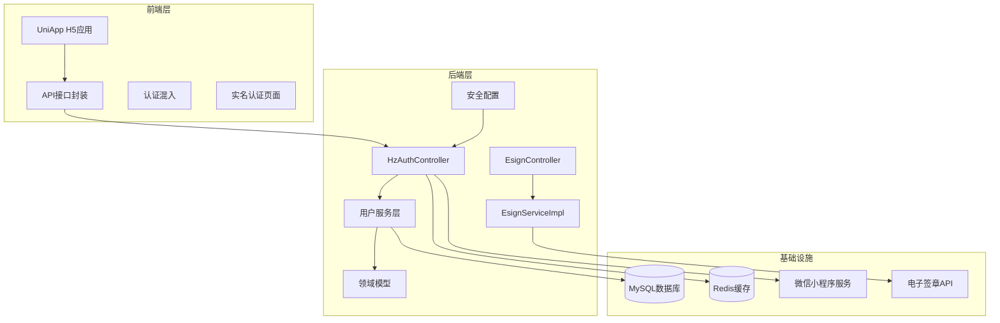

**图表来源**
- [HzAuthController.java:23-25](file://ruoyi-admin/src/main/java/com/ruoyi/web/controller/system/HzAuthController.java#L23-L25)
- [SecurityConfig.java:29-124](file://ruoyi-framework/src/main/java/com/ruoyi/framework/config/SecurityConfig.java#L29-L124)
- [EsignController.java:1-120](file://ruoyi-admin/src/main/java/com/ruoyi/web/controller/h5/EsignController.java#L1-L120)

**章节来源**
- [HzAuthController.java:1-292](file://ruoyi-admin/src/main/java/com/ruoyi/web/controller/system/HzAuthController.java#L1-L292)
- [SecurityConfig.java:1-135](file://ruoyi-framework/src/main/java/com/ruoyi/framework/config/SecurityConfig.java#L1-L135)
- [EsignController.java:1-120](file://ruoyi-admin/src/main/java/com/ruoyi/web/controller/h5/EsignController.java#L1-L120)

## 核心组件
本系统的核心认证组件包括：

### 用户认证控制器
- **HzAuthController**: 提供用户登录、注册、信息更新、退出登录等接口
- **IHzUserService**: 用户服务接口定义
- **HzUserServiceImpl**: 用户业务逻辑实现

### 实名认证组件
- **EsignController**: 实名认证控制器，处理电子签章认证流程
- **EsignServiceImpl**: 实名认证服务实现，集成电子签章API
- **mergeUserByIdCard**: 身份证账号自动合并功能

### 安全框架
- **JwtAuthenticationTokenFilter**: JWT令牌过滤器
- **SecurityConfig**: Spring Security安全配置
- **BCryptPasswordEncoder**: 密码加密器

### 消息通知系统
- **HzUserMessage**: 用户消息实体
- **IHzUserMessageService**: 消息服务接口
- **HzUserMessageServiceImpl**: 消息业务实现

**章节来源**
- [HzAuthController.java:23-38](file://ruoyi-admin/src/main/java/com/ruoyi/web/controller/system/HzAuthController.java#L23-L38)
- [IHzUserService.java:14-118](file://ruoyi-system/src/main/java/com/ruoyi/system/service/IHzUserService.java#L14-L118)
- [SecurityConfig.java:27-134](file://ruoyi-framework/src/main/java/com/ruoyi/framework/config/SecurityConfig.java#L27-L134)
- [EsignController.java:53-88](file://ruoyi-admin/src/main/java/com/ruoyi/web/controller/h5/EsignController.java#L53-L88)

## 架构概览

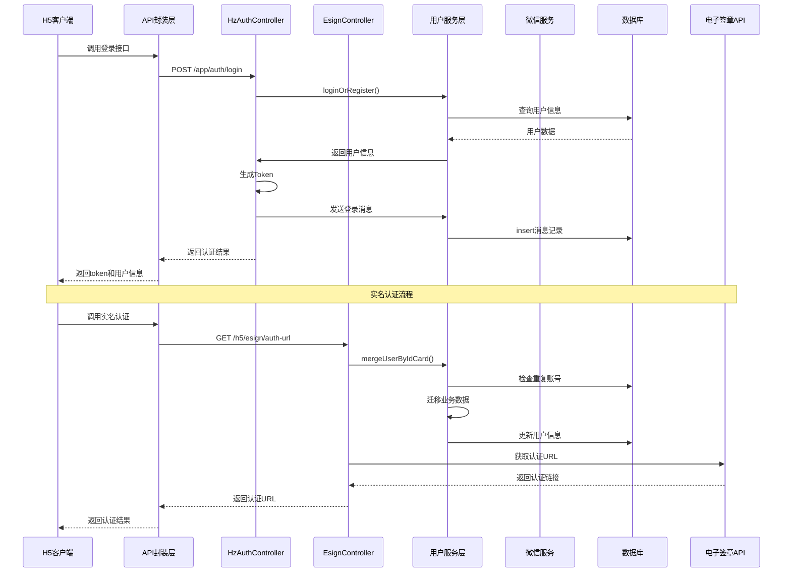

**图表来源**
- [HzAuthController.java:42-84](file://ruoyi-admin/src/main/java/com/ruoyi/web/controller/system/HzAuthController.java#L42-L84)
- [HzUserServiceImpl.java:142-184](file://ruoyi-system/src/main/java/com/ruoyi/system/service/impl/HzUserServiceImpl.java#L142-L184)
- [EsignController.java:53-88](file://ruoyi-admin/src/main/java/com/ruoyi/web/controller/h5/EsignController.java#L53-L88)

## 详细组件分析

### 用户登录接口

#### 接口定义
系统支持多种登录方式：

1. **普通手机号登录**
2. **微信小程序登录**
3. **郑好办授权登录**

#### 登录流程分析

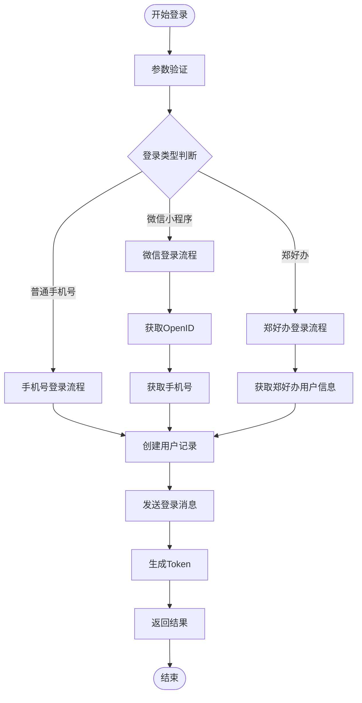

**图表来源**
- [HzAuthController.java:42-209](file://ruoyi-admin/src/main/java/com/ruoyi/web/controller/system/HzAuthController.java#L42-L209)
- [HzUserServiceImpl.java:142-345](file://ruoyi-system/src/main/java/com/ruoyi/system/service/impl/HzUserServiceImpl.java#L142-L345)

#### 登录接口参数说明

| 接口名称 | 请求URL | 方法 | 参数说明 |
|---------|---------|------|----------|
| 普通登录 | `/app/auth/login` | POST | loginType: 登录类型 phone: 手机号 openId: 第三方标识 nickname: 昵称 |
| 微信登录 | `/app/auth/wxLogin` | POST | code: 微信登录code phoneCode: 手机号授权code |
| 郑好办登录 | `/app/auth/zhbLogin` | POST | authCode: 授权码 |

**章节来源**
- [HzAuthController.java:42-150](file://ruoyi-admin/src/main/java/com/ruoyi/web/controller/system/HzAuthController.java#L42-L150)
- [auth.js:11-54](file://uniapp-h5/api/auth.js#L11-L54)

### 用户信息服务

#### 用户信息管理

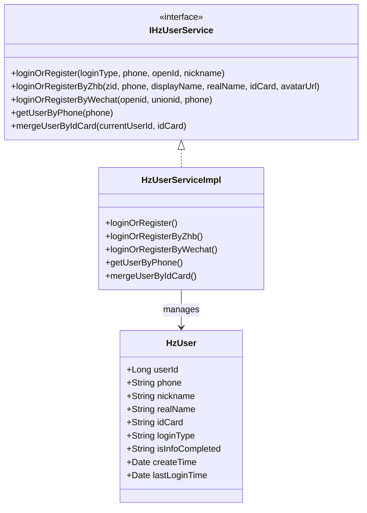

**图表来源**
- [IHzUserService.java:14-118](file://ruoyi-system/src/main/java/com/ruoyi/system/service/IHzUserService.java#L14-L118)
- [HzUserServiceImpl.java:24-447](file://ruoyi-system/src/main/java/com/ruoyi/system/service/impl/HzUserServiceImpl.java#L24-L447)

#### 用户信息更新流程

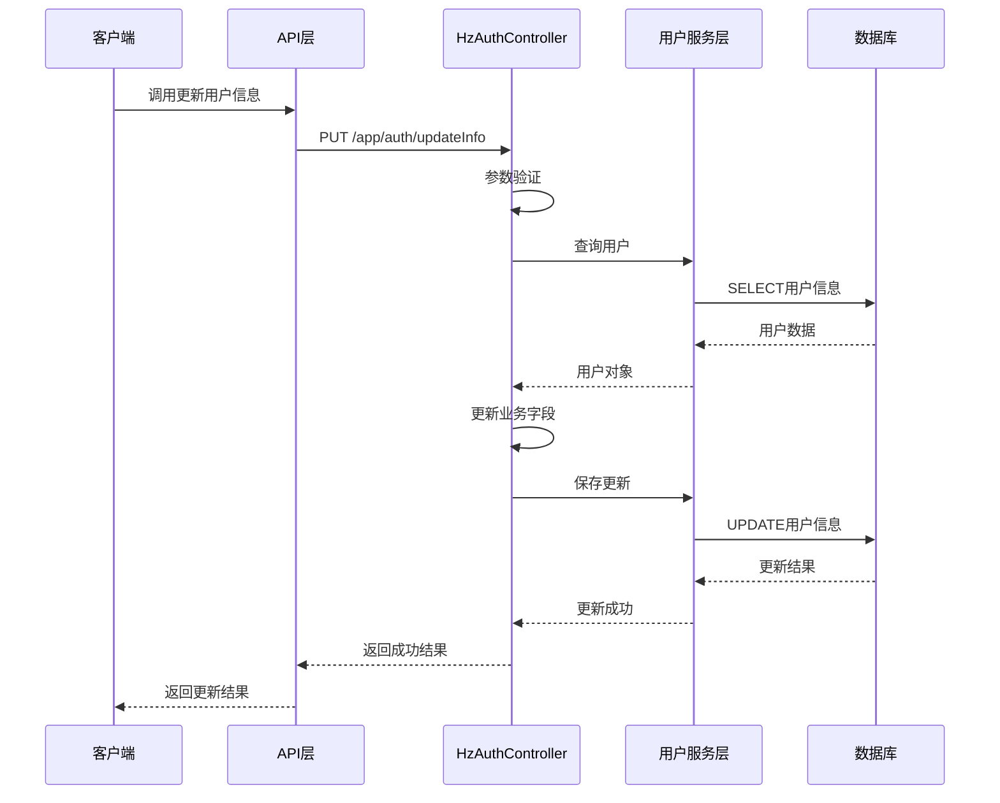

**图表来源**
- [HzAuthController.java:242-282](file://ruoyi-admin/src/main/java/com/ruoyi/web/controller/system/HzAuthController.java#L242-L282)
- [HzUserServiceImpl.java:255-282](file://ruoyi-system/src/main/java/com/ruoyi/system/service/impl/HzUserServiceImpl.java#L255-L282)

**章节来源**
- [HzAuthController.java:242-282](file://ruoyi-admin/src/main/java/com/ruoyi/web/controller/system/HzAuthController.java#L242-L282)
- [HzUserServiceImpl.java:255-345](file://ruoyi-system/src/main/java/com/ruoyi/system/service/impl/HzUserServiceImpl.java#L255-L345)

### 身份证账号自动合并功能

#### 功能概述
系统提供智能的身份证账号合并功能，用于处理用户重复注册或数据迁移场景。当用户实名认证时发现相同身份证号已存在于其他账号中，系统会自动将旧账号的业务数据迁移到当前账号。

#### 合并流程分析

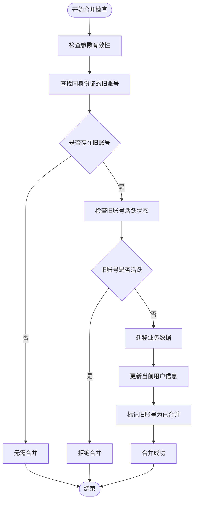

**图表来源**
- [HzUserServiceImpl.java:364-447](file://ruoyi-system/src/main/java/com/ruoyi/system/service/impl/HzUserServiceImpl.java#L364-L447)

#### 合并安全策略

系统采用严格的安全策略确保合并操作的安全性：

1. **活跃状态检查**: 仅合并从未登录过的旧账号
2. **数据完整性**: 迁移所有关联的业务数据
3. **字段继承**: 从旧账号继承有用的空字段信息
4. **软删除标记**: 旧账号标记为已合并状态

#### 合并涉及的数据表

| 数据表 | 迁移字段 | 说明 |
|--------|----------|------|
| HzContract | tenantId | 合同承租人信息 |
| HzBill | tenantId | 账单承租人信息 |
| HzHouseOrder | tenantId | 房屋订单承租人信息 |
| HzCheckIn | tenantId | 入住记录承租人信息 |

**章节来源**
- [HzUserServiceImpl.java:364-447](file://ruoyi-system/src/main/java/com/ruoyi/system/service/impl/HzUserServiceImpl.java#L364-L447)
- [IHzUserService.java:108-118](file://ruoyi-system/src/main/java/com/ruoyi/system/service/IHzUserService.java#L108-L118)

### 实名认证系统

#### 实名认证流程

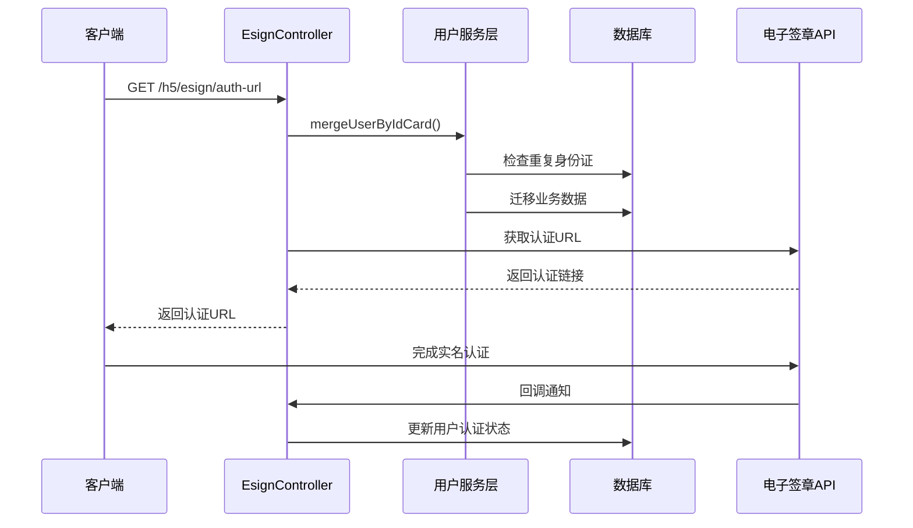

**图表来源**
- [EsignController.java:53-88](file://ruoyi-admin/src/main/java/com/ruoyi/web/controller/h5/EsignController.java#L53-L88)
- [EsignServiceImpl.java:80-111](file://ruoyi-system/src/main/java/com/ruoyi/system/service/impl/EsignServiceImpl.java#L80-L111)

#### 实名认证接口参数

| 接口名称 | 请求URL | 方法 | 参数说明 |
|---------|---------|------|----------|
| 获取认证URL | `/h5/esign/auth-url` | GET | userId: 用户ID realName: 真实姓名 idCard: 身份证号 redirectUrl: 回调地址 |
| 查询认证状态 | `/h5/esign/auth-status/{userId}` | GET | userId: 用户ID |

**章节来源**
- [EsignController.java:53-88](file://ruoyi-admin/src/main/java/com/ruoyi/web/controller/h5/EsignController.java#L53-L88)
- [EsignServiceImpl.java:80-111](file://ruoyi-system/src/main/java/com/ruoyi/system/service/impl/EsignServiceImpl.java#L80-L111)

### 消息通知系统

#### 消息类型定义

系统支持多种消息类型：

| 消息类型 | 用途 | 标题示例 |
|---------|------|---------|
| login | 登录提醒 | 欢迎登录 |
| system | 系统通知 | 系统维护通知 |
| bill | 账单提醒 | 账单到期提醒 |
| contract | 合同提醒 | 合同即将到期 |

#### 消息发送流程

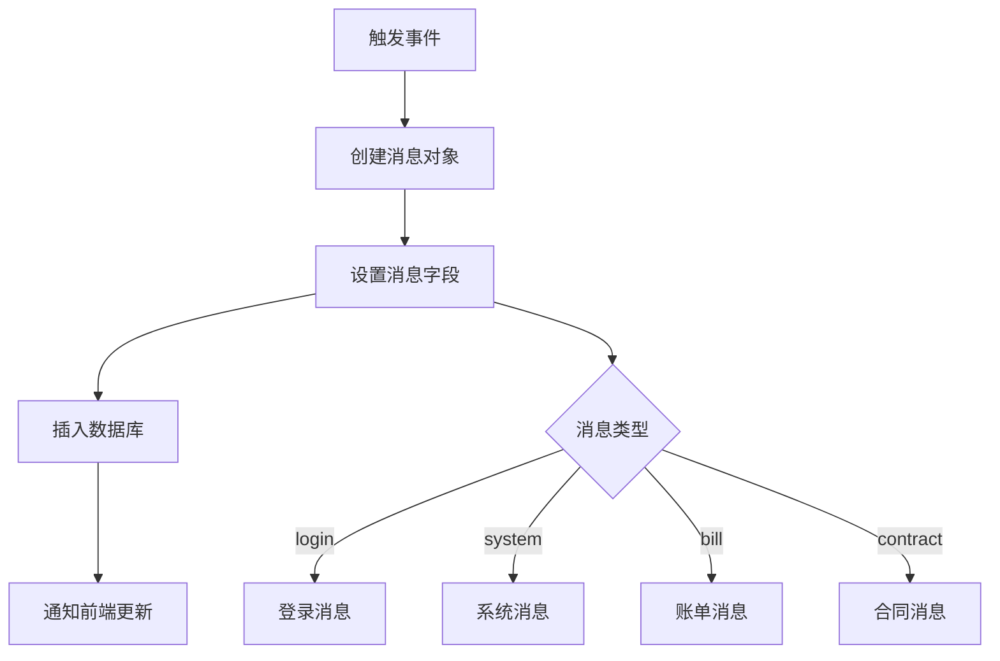

**图表来源**
- [HzUserMessageServiceImpl.java:129-147](file://ruoyi-system/src/main/java/com/ruoyi/system/service/impl/HzUserMessageServiceImpl.java#L129-L147)
- [HzAuthController.java:214-227](file://ruoyi-admin/src/main/java/com/ruoyi/web/controller/system/HzAuthController.java#L214-L227)

**章节来源**
- [HzUserMessage.java:24-46](file://ruoyi-system/src/main/java/com/ruoyi/system/domain/HzUserMessage.java#L24-L46)
- [IHzUserMessageService.java:98-106](file://ruoyi-system/src/main/java/com/ruoyi/system/service/IHzUserMessageService.java#L98-L106)
- [HzUserMessageServiceImpl.java:129-147](file://ruoyi-system/src/main/java/com/ruoyi/system/service/impl/HzUserMessageServiceImpl.java#L129-L147)

### 安全机制

#### JWT令牌处理

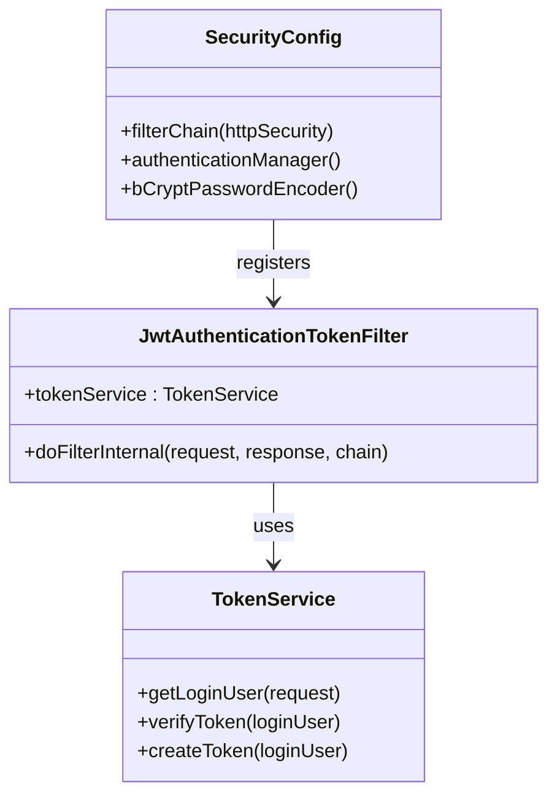

**图表来源**
- [JwtAuthenticationTokenFilter.java:25-44](file://ruoyi-framework/src/main/java/com/ruoyi/framework/security/filter/JwtAuthenticationTokenFilter.java#L25-L44)
- [SecurityConfig.java:86-124](file://ruoyi-framework/src/main/java/com/ruoyi/framework/config/SecurityConfig.java#L86-L124)

#### 前端认证流程

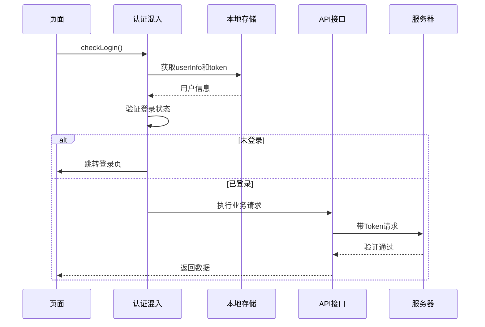

**图表来源**
- [authCheck.js:16-47](file://uniapp-h5/mixins/authCheck.js#L16-L47)

**章节来源**
- [JwtAuthenticationTokenFilter.java:31-43](file://ruoyi-framework/src/main/java/com/ruoyi/framework/security/filter/JwtAuthenticationTokenFilter.java#L31-L43)
- [authCheck.js:16-47](file://uniapp-h5/mixins/authCheck.js#L16-L47)

### 微信小程序集成

#### 手机号授权流程

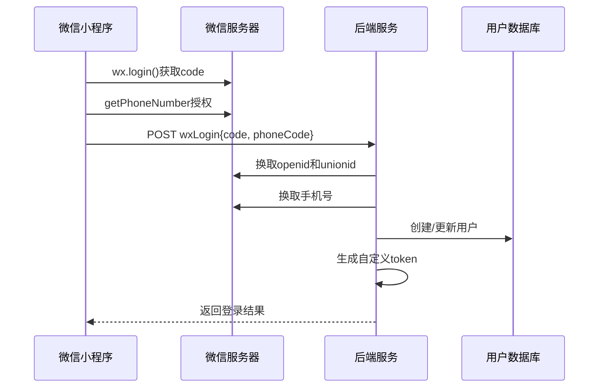

**图表来源**
- [HzAuthController.java:156-209](file://ruoyi-admin/src/main/java/com/ruoyi/web/controller/system/HzAuthController.java#L156-L209)
- [WechatMiniappService.java:129-172](file://ruoyi-admin/src/main/java/com/ruoyi/web/service/WechatMiniappService.java#L129-L172)

**章节来源**
- [WechatMiniappService.java:129-172](file://ruoyi-admin/src/main/java/com/ruoyi/web/service/WechatMiniappService.java#L129-L172)

## 依赖关系分析

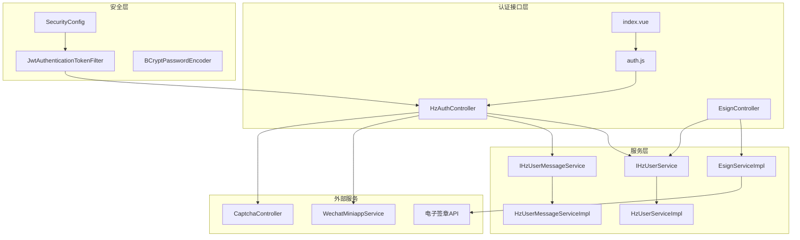

**图表来源**
- [HzAuthController.java:27-37](file://ruoyi-admin/src/main/java/com/ruoyi/web/controller/system/HzAuthController.java#L27-L37)
- [SecurityConfig.java:46-53](file://ruoyi-framework/src/main/java/com/ruoyi/framework/config/SecurityConfig.java#L46-L53)
- [EsignController.java:1-120](file://ruoyi-admin/src/main/java/com/ruoyi/web/controller/h5/EsignController.java#L1-L120)

**章节来源**
- [HzAuthController.java:27-37](file://ruoyi-admin/src/main/java/com/ruoyi/web/controller/system/HzAuthController.java#L27-L37)
- [SecurityConfig.java:46-53](file://ruoyi-framework/src/main/java/com/ruoyi/framework/config/SecurityConfig.java#L46-L53)
- [EsignController.java:1-120](file://ruoyi-admin/src/main/java/com/ruoyi/web/controller/h5/EsignController.java#L1-L120)

## 性能考虑

### 缓存策略
- **用户信息缓存**: 使用Redis缓存用户登录状态
- **验证码缓存**: 验证码存储在Redis中，设置合理过期时间
- **Token缓存**: JWT令牌验证结果可缓存以提升性能

### 数据库优化
- **索引优化**: 为手机号、OpenID、身份证号等常用查询字段建立索引
- **分页查询**: 用户列表查询使用数据库分页，避免全表扫描
- **批量操作**: 支持批量删除用户信息操作
- **事务处理**: 合并操作使用数据库事务保证数据一致性

### 并发控制
- **重复登录**: 防止同一用户同时多处登录
- **并发注册**: 使用数据库约束防止重复注册
- **事务处理**: 关键业务操作使用数据库事务保证一致性
- **合并锁**: 合并操作使用行级锁防止并发冲突

## 故障排除指南

### 常见错误及解决方案

#### 登录失败
**问题**: 用户无法登录
**可能原因**:
- 参数验证失败
- 用户不存在
- 第三方服务异常

**解决方案**:
1. 检查请求参数格式
2. 验证第三方服务可用性
3. 查看服务器日志

#### Token验证失败
**问题**: Token无效或过期
**解决步骤**:
1. 检查Token格式
2. 验证Token签名
3. 重新登录获取新Token

#### 微信授权失败
**问题**: 微信手机号授权失败
**排查要点**:
1. 检查微信AppID和AppSecret配置
2. 验证授权码有效性
3. 确认用户授权状态

#### 身份证合并失败
**问题**: 身份证账号合并失败
**可能原因**:
- 旧账号有活跃登录记录
- 数据库连接异常
- 业务数据迁移失败

**解决方案**:
1. 检查旧账号的活跃状态
2. 验证数据库连接
3. 查看合并日志
4. 手动执行数据迁移

**章节来源**
- [HzAuthController.java:80-83](file://ruoyi-admin/src/main/java/com/ruoyi/web/controller/system/HzAuthController.java#L80-L83)
- [WechatMiniappService.java:131-145](file://ruoyi-admin/src/main/java/com/ruoyi/web/service/WechatMiniappService.java#L131-L145)
- [HzUserServiceImpl.java:388-394](file://ruoyi-system/src/main/java/com/ruoyi/system/service/impl/HzUserServiceImpl.java#L388-L394)

### 日志监控
系统提供详细的日志记录：
- **登录日志**: 记录每次登录尝试
- **错误日志**: 捕获异常和错误信息
- **审计日志**: 记录重要操作
- **合并日志**: 记录身份证合并操作详情

## 结论
本用户认证系统提供了完整的移动端H5认证解决方案，具有以下特点：

1. **多渠道登录**: 支持手机号、微信小程序、郑好办等多种登录方式
2. **智能数据合并**: 提供身份证账号自动合并功能，确保数据一致性
3. **安全可靠**: 采用JWT令牌机制和Spring Security安全框架
4. **扩展性强**: 模块化设计便于功能扩展和维护
5. **用户体验**: 简洁的前端界面和流畅的交互体验
6. **数据安全**: 完善的消息通知和用户信息管理机制

**更新** 新增的身份证账号自动合并功能进一步增强了系统的数据完整性保护，通过严格的安全策略和完整的数据迁移机制，有效避免了用户重复注册和数据分散的问题。

系统通过合理的架构设计和安全机制，为移动端H5应用提供了稳定可靠的用户认证基础。开发者可以根据具体需求进行二次开发和定制。