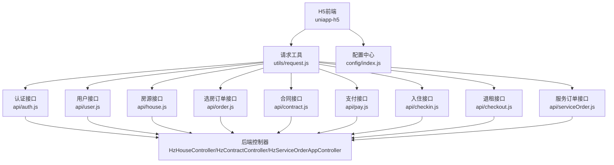
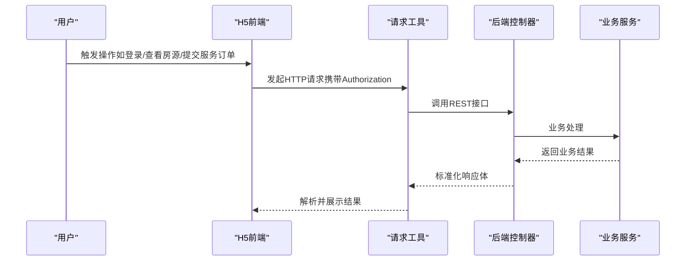
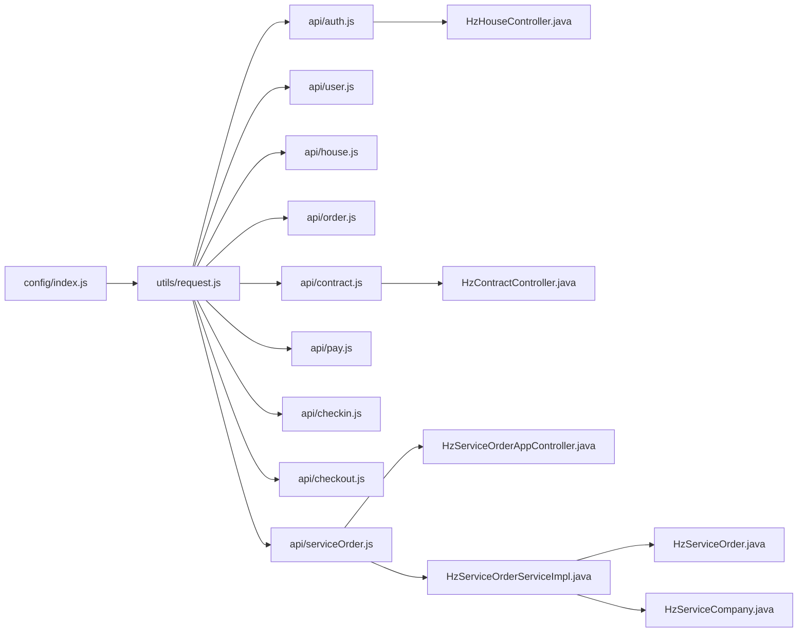

# 移动端H5接口

<cite>
**本文引用的文件**
- [uniapp-h5/api/auth.js](file://uniapp-h5/api/auth.js)
- [uniapp-h5/api/user.js](file://uniapp-h5/api/user.js)
- [uniapp-h5/api/house.js](file://uniapp-h5/api/house.js)
- [uniapp-h5/api/order.js](file://uniapp-h5/api/order.js)
- [uniapp-h5/api/contract.js](file://uniapp-h5/api/contract.js)
- [uniapp-h5/api/pay.js](file://uniapp-h5/api/pay.js)
- [uniapp-h5/api/checkin.js](file://uniapp-h5/api/checkin.js)
- [uniapp-h5/api/checkout.js](file://uniapp-h5/api/checkout.js)
- [uniapp-h5/api/serviceOrder.js](file://uniapp-h5/api/serviceOrder.js)
- [uniapp-h5/utils/request.js](file://uniapp-h5/utils/request.js)
- [uniapp-h5/config/index.js](file://uniapp-h5/config/index.js)
- [ruoyi-admin/src/main/java/com/ruoyi/web/controller/h5/HzHouseController.java](file://ruoyi-admin/src/main/java/com/ruoyi/web/controller/h5/HzHouseController.java)
- [ruoyi-admin/src/main/java/com/ruoyi/web/controller/h5/HzContractController.java](file://ruoyi-admin/src/main/java/com/ruoyi/web/controller/h5/HzContractController.java)
- [ruoyi-admin/src/main/java/com/ruoyi/web/controller/h5/HzServiceOrderAppController.java](file://ruoyi-admin/src/main/java/com/ruoyi/web/controller/h5/HzServiceOrderAppController.java)
- [ruoyi-system/src/main/java/com/ruoyi/system/domain/HzServiceOrder.java](file://ruoyi-system/src/main/java/com/ruoyi/system/domain/HzServiceOrder.java)
- [ruoyi-system/src/main/java/com/ruoyi/system/domain/HzServiceCompany.java](file://ruoyi-system/src/main/java/com/ruoyi/system/domain/HzServiceCompany.java)
- [ruoyi-system/src/main/java/com/ruoyi/system/service/impl/HzServiceOrderServiceImpl.java](file://ruoyi-system/src/main/java/com/ruoyi/system/service/impl/HzServiceOrderServiceImpl.java)
- [ruoyi-system/src/main/java/com/ruoyi/system/service/IHzServiceOrderService.java](file://ruoyi-system/src/main/java/com/ruoyi/system/service/IHzServiceOrderService.java)
- [uniapp-h5/subpkg/service/service-order.vue](file://uniapp-h5/subpkg/service/service-order.vue)
- [uniapp-h5/subpkg/service/service-order-detail.vue](file://uniapp-h5/subpkg/service/service-order-detail.vue)
- [uniapp-h5/subpkg/service/cleaning-submit.vue](file://uniapp-h5/subpkg/service/cleaning-submit.vue)
- [uniapp-h5/subpkg/service/moving-submit.vue](file://uniapp-h5/subpkg/service/moving-submit.vue)
</cite>

## 目录
1. [简介](#简介)
2. [项目结构](#项目结构)
3. [核心组件](#核心组件)
4. [架构总览](#架构总览)
5. [详细组件分析](#详细组件分析)
6. [依赖分析](#依赖分析)
7. [性能考虑](#性能考虑)
8. [故障排查指南](#故障排查指南)
9. [结论](#结论)
10. [附录](#附录)

## 简介
本文件面向移动端H5应用的前端开发者与后端工程师，系统性梳理移动端专用的RESTful API接口，覆盖用户认证、房源浏览、在线选房、合同签署、支付流程、入住退租、服务申请等核心业务场景。文档以"移动端H5接口"为主题，提供接口规范、调用示例、错误处理、性能优化与最佳实践，帮助团队快速理解与稳定集成。

**更新** 新增服务订单相关API接口文档，包括保洁和搬家服务的订单创建、查询、取消、评价等功能。

## 项目结构
移动端H5前端通过统一请求工具发起HTTP请求，后端采用Spring Boot控制器暴露REST接口，遵循若依框架的标准响应格式。前端配置文件支持多环境切换，便于开发、测试与生产部署。

**图表来源**
- [uniapp-h5/utils/request.js:1-135](file://uniapp-h5/utils/request.js#L1-L135)
- [uniapp-h5/config/index.js:1-64](file://uniapp-h5/config/index.js#L1-L64)
- [uniapp-h5/api/auth.js:1-55](file://uniapp-h5/api/auth.js#L1-L55)
- [uniapp-h5/api/user.js:1-209](file://uniapp-h5/api/user.js#L1-L209)
- [uniapp-h5/api/house.js:1-58](file://uniapp-h5/api/house.js#L1-L58)
- [uniapp-h5/api/order.js:1-28](file://uniapp-h5/api/order.js#L1-L28)
- [uniapp-h5/api/contract.js:1-86](file://uniapp-h5/api/contract.js#L1-L86)
- [uniapp-h5/api/pay.js:1-18](file://uniapp-h5/api/pay.js#L1-L18)
- [uniapp-h5/api/checkin.js:1-102](file://uniapp-h5/api/checkin.js#L1-L102)
- [uniapp-h5/api/checkout.js:1-79](file://uniapp-h5/api/checkout.js#L1-L79)
- [uniapp-h5/api/serviceOrder.js:1-73](file://uniapp-h5/api/serviceOrder.js#L1-L73)
- [ruoyi-admin/src/main/java/com/ruoyi/web/controller/h5/HzHouseController.java:1-84](file://ruoyi-admin/src/main/java/com/ruoyi/web/controller/h5/HzHouseController.java#L1-L84)
- [ruoyi-admin/src/main/java/com/ruoyi/web/controller/h5/HzContractController.java:1-66](file://ruoyi-admin/src/main/java/com/ruoyi/web/controller/h5/HzContractController.java#L1-L66)
- [ruoyi-admin/src/main/java/com/ruoyi/web/controller/h5/HzServiceOrderAppController.java:1-124](file://ruoyi-admin/src/main/java/com/ruoyi/web/controller/h5/HzServiceOrderAppController.java#L1-L124)

**章节来源**
- [uniapp-h5/utils/request.js:1-135](file://uniapp-h5/utils/request.js#L1-L135)
- [uniapp-h5/config/index.js:1-64](file://uniapp-h5/config/index.js#L1-L64)

## 核心组件
- 统一请求工具：封装GET/POST/PUT/DELETE，自动注入Authorization头，标准化响应与错误提示。
- 配置中心：按环境切换baseUrl、uploadUrl、静态资源地址与超时时间。
- API模块：按业务域拆分，如认证、用户、房源、订单、合同、支付、入住、退租、服务订单等。
- 后端控制器：提供H5端专用REST接口，返回统一AjaxResult结构。

**章节来源**
- [uniapp-h5/utils/request.js:20-122](file://uniapp-h5/utils/request.js#L20-L122)
- [uniapp-h5/config/index.js:53-63](file://uniapp-h5/config/index.js#L53-L63)

## 架构总览
移动端H5接口采用前后端分离架构，前端通过统一请求工具调用后端控制器，后端控制器返回标准响应体，前端负责渲染与交互。

**图表来源**
- [uniapp-h5/utils/request.js:20-71](file://uniapp-h5/utils/request.js#L20-L71)
- [ruoyi-admin/src/main/java/com/ruoyi/web/controller/h5/HzHouseController.java:27-50](file://ruoyi-admin/src/main/java/com/ruoyi/web/controller/h5/HzHouseController.java#L27-L50)
- [ruoyi-admin/src/main/java/com/ruoyi/web/controller/h5/HzContractController.java:29-52](file://ruoyi-admin/src/main/java/com/ruoyi/web/controller/h5/HzContractController.java#L29-L52)
- [ruoyi-admin/src/main/java/com/ruoyi/web/controller/h5/HzServiceOrderAppController.java:37-46](file://ruoyi-admin/src/main/java/com/ruoyi/web/controller/h5/HzServiceOrderAppController.java#L37-L46)

## 详细组件分析

### 用户认证接口
- 登录方式
  - 微信/郑好办登录
  - 小程序登录
- 关键点
  - 自动在请求头注入Authorization
  - 失败时前端Toast提示
  - 支持退出登录

**章节来源**
- [uniapp-h5/api/auth.js:11-54](file://uniapp-h5/api/auth.js#L11-L54)
- [uniapp-h5/utils/request.js:20-71](file://uniapp-h5/utils/request.js#L20-L71)

### 用户资料与认证状态
- 获取/更新用户信息
- 上传头像与工作证明（独立上传通道）
- 认证状态查询
- 数据脱敏与字典映射（性别、学历）

**章节来源**
- [uniapp-h5/api/user.js:11-134](file://uniapp-h5/api/user.js#L11-L134)
- [uniapp-h5/api/user.js:192-194](file://uniapp-h5/api/user.js#L192-L194)

### 房源浏览接口
- 按项目类型获取精选房源
- 按条件分页查询房源
- 获取房源详情、VR列表、图片分类
- H5端控制器对状态与房源状态进行过滤

**章节来源**
- [uniapp-h5/api/house.js:12-57](file://uniapp-h5/api/house.js#L12-L57)
- [ruoyi-admin/src/main/java/com/ruoyi/web/controller/h5/HzHouseController.java:27-82](file://ruoyi-admin/src/main/java/com/ruoyi/web/controller/h5/HzHouseController.java#L27-L82)

### 在线选房与订单
- 创建选房预订单
- 查询订单状态与剩余时间
- 取消预订单
- 待上传资料的订单列表
- 入住前置检查

**章节来源**
- [uniapp-h5/api/order.js:5-27](file://uniapp-h5/api/order.js#L5-L27)

### 合同签署与支付
- 获取我的合同列表
- 生成合同预览
- 签署合同
- 续租合同
- 押金账单与支付
- 合同详情与PDF下载链接刷新
- 人才公寓月租预览

**章节来源**
- [uniapp-h5/api/contract.js:11-85](file://uniapp-h5/api/contract.js#L11-L85)
- [ruoyi-admin/src/main/java/com/ruoyi/web/controller/h5/HzContractController.java:29-64](file://ruoyi-admin/src/main/java/com/ruoyi/web/controller/h5/HzContractController.java#L29-L64)

### 支付流程
- 微信预支付
- 查询支付结果

**章节来源**
- [uniapp-h5/api/pay.js:7-17](file://uniapp-h5/api/pay.js#L7-L17)

### 入住管理
- 入住单列表与详情
- 已确认入住单列表（续租/退租）
- 入住确认信息与提交
- 提交入住办理信息
- 根据合同ID获取入住单
- 取消入住申请
- 我的房源列表

**章节来源**
- [uniapp-h5/api/checkin.js:10-89](file://uniapp-h5/api/checkin.js#L10-L89)

### 退租管理
- 退租申请列表与详情
- 提交/修改/取消退租申请
- 退租确认信息与提交

**章节来源**
- [uniapp-h5/api/checkout.js:10-68](file://uniapp-h5/api/checkout.js#L10-L68)

### 服务订单管理

#### 服务订单概述
服务订单模块提供保洁和搬家两类服务的在线申请、管理和评价功能。系统支持订单创建、状态跟踪、服务公司分配、订单取消和用户评价等完整业务流程。

#### 订单类型与状态
- 订单类型：1=保洁服务，2=搬家服务
- 订单状态：0=待处理，1=已分配，2=服务中，3=已完成，4=已取消

#### 核心功能接口

##### 我的订单列表
- 功能：按手机号查询用户的订单列表，支持按类型、状态、关键字筛选
- 请求方式：GET
- 路径：/h5/app/serviceOrder/myOrders
- 参数：
  - phone (必填)：手机号
  - orderType (可选)：订单类型（1=保洁，2=搬家）
  - status (可选)：订单状态
  - keyword (可选)：搜索关键字（订单号/地址/公司名）

##### 订单详情
- 功能：获取指定订单的详细信息
- 请求方式：GET
- 路径：/h5/app/serviceOrder/detail/{orderId}

##### 保洁订单提交
- 功能：提交保洁服务订单
- 请求方式：POST
- 路径：/h5/app/serviceOrder/submitClean
- 参数：订单对象（包含申请人信息、服务地址、期望时间等）

##### 搬家订单提交
- 功能：提交搬家服务订单
- 请求方式：POST
- 路径：/h5/app/serviceOrder/submitMove
- 参数：订单对象（包含起运地址、目的地址、物品描述等）

##### 订单取消
- 功能：取消待处理状态的订单
- 请求方式：POST
- 路径：/h5/app/serviceOrder/cancel
- 参数：{orderId, phone, cancelReason}

##### 订单评价
- 功能：对已完成的订单进行5分制评价
- 请求方式：POST
- 路径：/h5/app/serviceOrder/rate
- 参数：{orderId, phone, rateScore, rateContent}

##### 服务公司列表
- 功能：获取已启用的服务公司列表
- 请求方式：GET
- 路径：/h5/app/serviceOrder/companies
- 参数：orderType (可选)：1=保洁，2=搬家

**章节来源**
- [uniapp-h5/api/serviceOrder.js:15-72](file://uniapp-h5/api/serviceOrder.js#L15-L72)
- [ruoyi-admin/src/main/java/com/ruoyi/web/controller/h5/HzServiceOrderAppController.java:37-122](file://ruoyi-admin/src/main/java/com/ruoyi/web/controller/h5/HzServiceOrderAppController.java#L37-L122)
- [ruoyi-system/src/main/java/com/ruoyi/system/service/impl/HzServiceOrderServiceImpl.java:58-218](file://ruoyi-system/src/main/java/com/ruoyi/system/service/impl/HzServiceOrderServiceImpl.java#L58-L218)

## 依赖分析
- 前端依赖
  - 统一请求工具依赖配置中心
  - API模块依赖请求工具
- 后端依赖
  - 控制器依赖业务服务
  - 返回值遵循统一AjaxResult
  - 服务订单模块依赖HzServiceOrder和HzServiceCompany实体

**图表来源**
- [uniapp-h5/config/index.js:1-64](file://uniapp-h5/config/index.js#L1-L64)
- [uniapp-h5/utils/request.js:1-135](file://uniapp-h5/utils/request.js#L1-L135)
- [uniapp-h5/api/auth.js:1-55](file://uniapp-h5/api/auth.js#L1-L55)
- [uniapp-h5/api/user.js:1-209](file://uniapp-h5/api/user.js#L1-L209)
- [uniapp-h5/api/house.js:1-58](file://uniapp-h5/api/house.js#L1-L58)
- [uniapp-h5/api/order.js:1-28](file://uniapp-h5/api/order.js#L1-L28)
- [uniapp-h5/api/contract.js:1-86](file://uniapp-h5/api/contract.js#L1-L86)
- [uniapp-h5/api/pay.js:1-18](file://uniapp-h5/api/pay.js#L1-L18)
- [uniapp-h5/api/checkin.js:1-102](file://uniapp-h5/api/checkin.js#L1-L102)
- [uniapp-h5/api/checkout.js:1-79](file://uniapp-h5/api/checkout.js#L1-L79)
- [uniapp-h5/api/serviceOrder.js:1-73](file://uniapp-h5/api/serviceOrder.js#L1-L73)
- [ruoyi-admin/src/main/java/com/ruoyi/web/controller/h5/HzHouseController.java:1-84](file://ruoyi-admin/src/main/java/com/ruoyi/web/controller/h5/HzHouseController.java#L1-L84)
- [ruoyi-admin/src/main/java/com/ruoyi/web/controller/h5/HzContractController.java:1-66](file://ruoyi-admin/src/main/java/com/ruoyi/web/controller/h5/HzContractController.java#L1-L66)
- [ruoyi-admin/src/main/java/com/ruoyi/web/controller/h5/HzServiceOrderAppController.java:1-124](file://ruoyi-admin/src/main/java/com/ruoyi/web/controller/h5/HzServiceOrderAppController.java#L1-L124)
- [ruoyi-system/src/main/java/com/ruoyi/system/service/impl/HzServiceOrderServiceImpl.java:1-200](file://ruoyi-system/src/main/java/com/ruoyi/system/service/impl/HzServiceOrderServiceImpl.java#L1-L200)
- [ruoyi-system/src/main/java/com/ruoyi/system/domain/HzServiceOrder.java:16-230](file://ruoyi-system/src/main/java/com/ruoyi/system/domain/HzServiceOrder.java#L16-L230)
- [ruoyi-system/src/main/java/com/ruoyi/system/domain/HzServiceCompany.java:12-101](file://ruoyi-system/src/main/java/com/ruoyi/system/domain/HzServiceCompany.java#L12-L101)

## 性能考虑
- 网络适配
  - 统一设置Content-Type为application/json
  - 自动注入Authorization，减少重复头设置
  - 支持环境级超时配置
- 数据格式优化
  - GET参数自动编码与过滤空值
  - 标准化响应体，前端统一处理
  - 服务订单列表支持分页查询
- 缓存策略
  - 前端可结合业务场景对列表与详情做内存缓存
  - 图片与静态资源由后端静态地址统一管理
  - 订单状态变更时及时更新本地缓存
- 离线处理
  - 对上传类接口（头像/证明）建议在网络恢复后重试
  - 支付结果建议轮询查询，避免弱网丢失回调
  - 服务订单状态变化建议使用轮询或WebSocket推送

## 故障排查指南
- 常见错误
  - HTTP状态非200：前端Toast提示错误码
  - 业务错误：响应体中code非200时统一提示msg
  - 网络异常：fail回调提示网络连接失败
- 定位步骤
  - 检查Authorization是否正确注入
  - 核对baseUrl与环境配置
  - 查看后端控制器返回的AjaxResult结构
  - 验证服务订单状态转换逻辑
- 建议
  - 增加重试与降级策略
  - 记录关键请求日志以便定位
  - 服务订单状态变更时触发本地状态同步

**章节来源**
- [uniapp-h5/utils/request.js:34-68](file://uniapp-h5/utils/request.js#L34-L68)

## 结论
本文档系统梳理了移动端H5应用的核心接口，明确了前后端协作方式与错误处理机制，并提供了性能优化与排障建议。新增的服务订单模块为用户提供了完整的保洁和搬家服务申请体验，包括订单创建、状态跟踪、服务管理和评价反馈等全流程功能。建议在联调阶段严格遵循接口规范，结合配置中心与统一请求工具，确保跨环境一致性与稳定性。

## 附录

### 接口规范总览（按模块）
- 认证
  - 登录/退出/微信/郑好办登录
  - 方法与路径：参见[uniapp-h5/api/auth.js:11-54](file://uniapp-h5/api/auth.js#L11-L54)
- 用户
  - 获取/更新信息、上传头像/工作证明、认证状态
  - 方法与路径：参见[uniapp-h5/api/user.js:11-194](file://uniapp-h5/api/user.js#L11-L194)
- 房源
  - 列表/详情/VR/图片
  - 方法与路径：参见[uniapp-h5/api/house.js:12-57](file://uniapp-h5/api/house.js#L12-L57)
- 订单
  - 创建/查询/取消/待上传/入住前置检查
  - 方法与路径：参见[uniapp-h5/api/order.js:5-27](file://uniapp-h5/api/order.js#L5-L27)
- 合同
  - 列表/详情/PDF/预览/签署/续租/押金支付/月租预览
  - 方法与路径：参见[uniapp-h5/api/contract.js:11-85](file://uniapp-h5/api/contract.js#L11-L85)
- 支付
  - 微信预支付/查询结果
  - 方法与路径：参见[uniapp-h5/api/pay.js:7-17](file://uniapp-h5/api/pay.js#L7-L17)
- 入住
  - 列表/详情/确认信息/提交/根据合同查询/取消/我的房源
  - 方法与路径：参见[uniapp-h5/api/checkin.js:10-89](file://uniapp-h5/api/checkin.js#L10-L89)
- 退租
  - 列表/详情/申请/修改/取消/确认信息/提交
  - 方法与路径：参见[uniapp-h5/api/checkout.js:10-68](file://uniapp-h5/api/checkout.js#L10-L68)
- **服务订单**（新增）
  - 我的订单列表/订单详情/提交保洁/提交搬家/取消订单/评价/服务公司列表
  - 方法与路径：参见[uniapp-h5/api/serviceOrder.js:15-72](file://uniapp-h5/api/serviceOrder.js#L15-L72)

### 调用示例（路径与参数）
- 登录
  - POST /app/auth/login
  - 参数：loginType、phone、openId、nickname（可选）
  - 参考：[uniapp-h5/api/auth.js:11-13](file://uniapp-h5/api/auth.js#L11-L13)
- 获取房源列表（按项目类型）
  - GET /h5/app/house/listByProjectType/{projectType}?limit=...
  - 参考：[uniapp-h5/api/house.js:12-14](file://uniapp-h5/api/house.js#L12-L14)
- 创建选房订单
  - POST /h5/order/create
  - 参数：tenantId、houseId
  - 参考：[uniapp-h5/api/order.js:5-7](file://uniapp-h5/api/order.js#L5-L7)
- 签署合同
  - POST /h5/app/contract/sign
  - 参数：见接口定义
  - 参考：[uniapp-h5/api/contract.js:29-31](file://uniapp-h5/api/contract.js#L29-L31)
- 微信预支付
  - POST /h5/pay/wechat/prepay
  - 参数：billNo、payType、openid（可选）、clientIp（可选）
  - 参考：[uniapp-h5/api/pay.js:7-9](file://uniapp-h5/api/pay.js#L7-L9)
- 入住确认提交
  - POST /h5/app/checkin/confirm
  - 参数：recordId、signature、selectedFacilities
  - 参考：[uniapp-h5/api/checkin.js:63-65](file://uniapp-h5/api/checkin.js#L63-L65)
- 退租确认提交
  - POST /h5/app/checkout/confirm/{applyId}
  - 参数：tenantSignature
  - 参考：[uniapp-h5/api/checkout.js:66-68](file://uniapp-h5/api/checkout.js#L66-L68)
- **服务订单调用示例**（新增）
  - 获取我的订单列表
    - GET /h5/app/serviceOrder/myOrders?phone=13800000000&orderType=1&status=0
    - 参考：[uniapp-h5/api/serviceOrder.js:15-23](file://uniapp-h5/api/serviceOrder.js#L15-L23)
  - 提交保洁订单
    - POST /h5/app/serviceOrder/submitClean
    - 参数：{orderType:"1", applicantName:"张三", applicantPhone:"13800000000", cleanType:"daily", houseAddress:"XX小区XX栋XX室", expectTime:"2024-01-01 14:00"}
    - 参考：[uniapp-h5/api/serviceOrder.js:37-39](file://uniapp-h5/api/serviceOrder.js#L37-L39)
  - 取消订单
    - POST /h5/app/serviceOrder/cancel
    - 参数：{orderId:1001, phone:"13800000000", cancelReason:"用户主动取消"}
    - 参考：[uniapp-h5/api/serviceOrder.js:53-55](file://uniapp-h5/api/serviceOrder.js#L53-L55)

### 错误处理与状态码
- HTTP状态码
  - 200：请求成功
  - 非200：前端Toast提示状态码
- 业务状态码
  - 响应体中code为200表示成功；非200时以msg提示
  - 服务订单状态：0=待处理，1=已分配，2=服务中，3=已完成，4=已取消
- 网络错误
  - fail回调统一提示"网络连接失败"

**章节来源**
- [uniapp-h5/utils/request.js:34-68](file://uniapp-h5/utils/request.js#L34-L68)

### 服务订单数据模型

#### HzServiceOrder 实体属性
- 订单ID：orderId
- 订单号：orderNo
- 订单类型：orderType (1=保洁, 2=搬家)
- 申请人姓名：applicantName
- 申请人手机号：applicantPhone
- 期望服务时间：expectTime
- 订单状态：status (0=待处理, 1=已分配, 2=服务中, 3=已完成, 4=已取消)
- 服务公司ID：companyId
- 服务公司名称：companyName
- 评分：rateScore (1-5)
- 评价内容：rateContent
- 评价时间：rateTime
- 保洁类型：cleanType (daily/deep/rough/checkout)
- 房间数：roomCount
- 起运地址：fromAddress
- 目的地址：toAddress
- 物品描述：moveItemDesc
- 是否需要拆装：needDisassembly (Y/N)

#### HzServiceCompany 实体属性
- 公司ID：companyId
- 公司名称：companyName
- 服务类型：companyType (1=保洁, 2=搬家, 3=综合)
- 联系人：contactPerson
- 联系电话：contactPhone
- 公司地址：address
- 服务区域：serviceArea
- 状态：status (0=启用, 1=停用)

**章节来源**
- [ruoyi-system/src/main/java/com/ruoyi/system/domain/HzServiceOrder.java:16-230](file://ruoyi-system/src/main/java/com/ruoyi/system/domain/HzServiceOrder.java#L16-L230)
- [ruoyi-system/src/main/java/com/ruoyi/system/domain/HzServiceCompany.java:12-101](file://ruoyi-system/src/main/java/com/ruoyi/system/domain/HzServiceCompany.java#L12-L101)