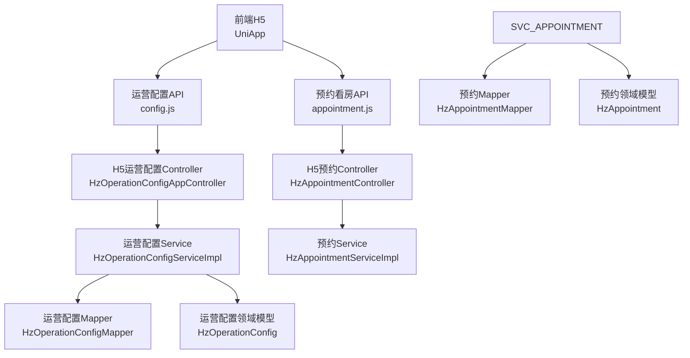
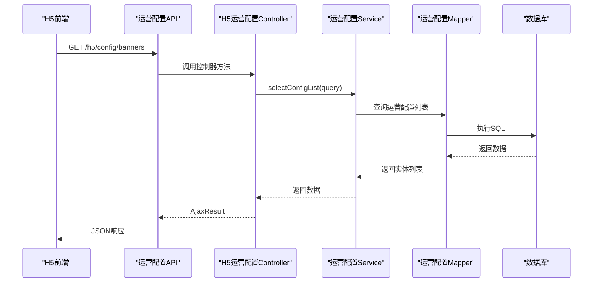
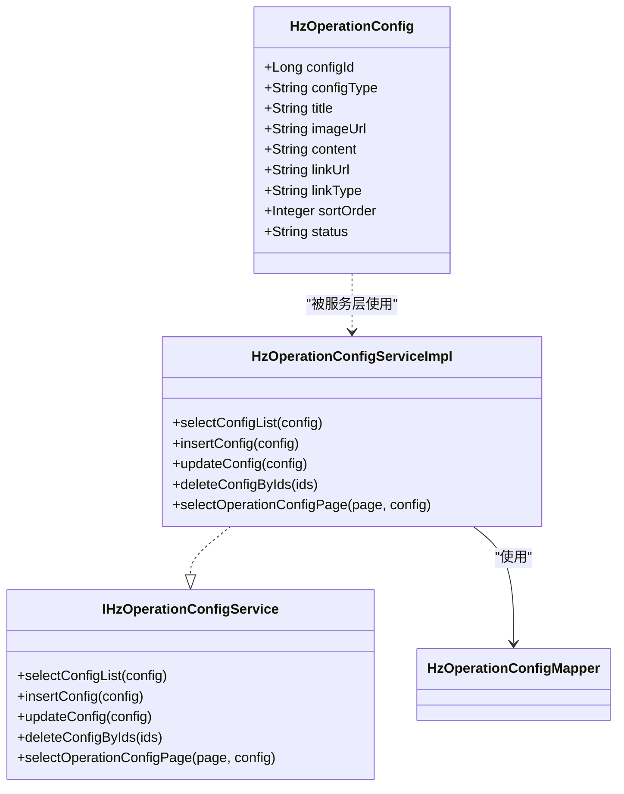
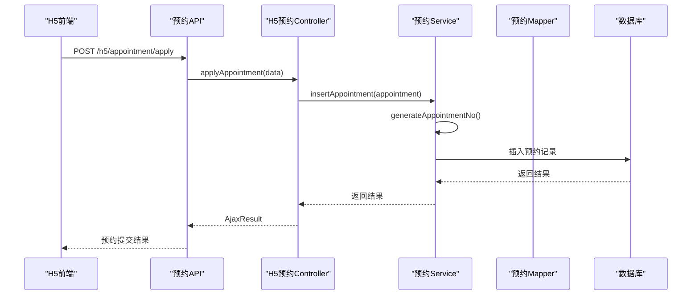
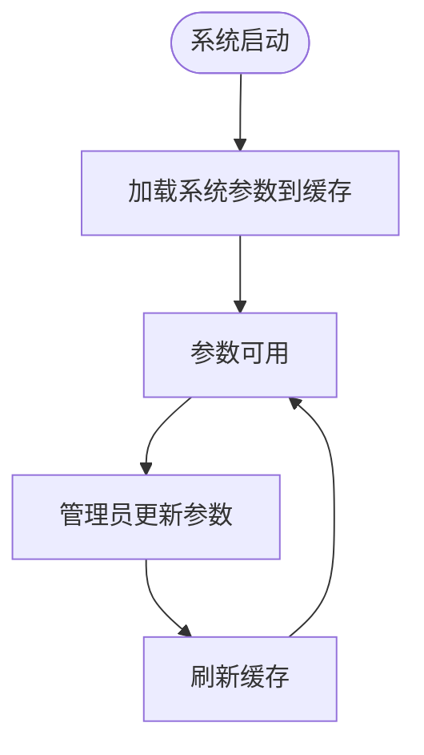
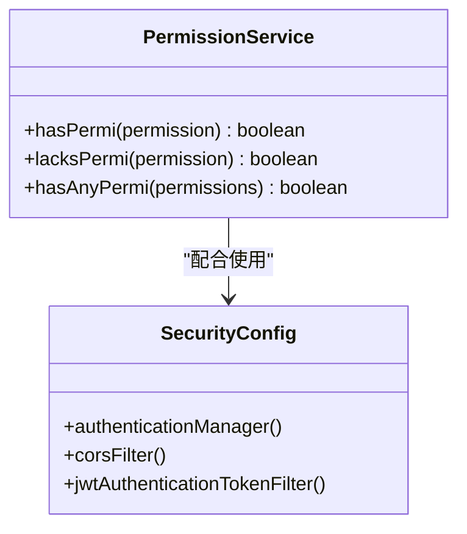
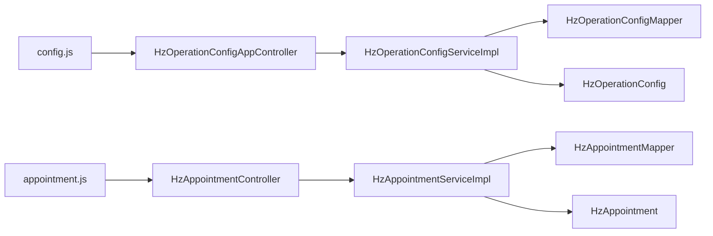

# 运营配置接口

<cite>
**本文档引用的文件**
- [HzOperationConfigAppController.java](file://ruoyi-admin/src/main/java/com/ruoyi/web/controller/h5/HzOperationConfigAppController.java)
- [config.js](file://uniapp-h5/api/config.js)
- [HzOperationConfig.java](file://ruoyi-system/src/main/java/com/ruoyi/system/domain/HzOperationConfig.java)
- [IHzOperationConfigService.java](file://ruoyi-system/src/main/java/com/ruoyi/system/service/IHzOperationConfigService.java)
- [HzOperationConfigServiceImpl.java](file://ruoyi-system/src/main/java/com/ruoyi/system/service/impl/HzOperationConfigServiceImpl.java)
- [HzOperationConfigMapper.java](file://ruoyi-system/src/main/java/com/ruoyi/system/mapper/HzOperationConfigMapper.java)
- [HzOperationConfigController.java](file://ruoyi-admin/src/main/java/com/ruoyi/web/controller/system/HzOperationConfigController.java)
- [index.vue](file://ruoyi-ui/src/views/gangzhu/config/operation/index.vue)
- [SysNotice.java](file://ruoyi-system/src/main/java/com/ruoyi/system/domain/SysNotice.java)
- [ISysNoticeService.java](file://ruoyi-system/src/main/java/com/ruoyi/system/service/ISysNoticeService.java)
- [SysNoticeServiceImpl.java](file://ruoyi-system/src/main/java/com/ruoyi/system/service/impl/SysNoticeServiceImpl.java)
- [SysNoticeController.java](file://ruoyi-admin/src/main/java/com/ruoyi/web/controller/system/SysNoticeController.java)
- [notice.js](file://ruoyi-ui/src/api/system/notice.js)
- [index.vue](file://ruoyi-ui/src/views/system/notice/index.vue)
- [HzAppointment.java](file://ruoyi-system/src/main/java/com/ruoyi/system/domain/HzAppointment.java)
- [IHzAppointmentService.java](file://ruoyi-system/src/main/java/com/ruoyi/system/service/IHzAppointmentService.java)
- [HzAppointmentServiceImpl.java](file://ruoyi-system/src/main/java/com/ruoyi/system/service/impl/HzAppointmentServiceImpl.java)
- [HzAppointmentController.java](file://ruoyi-admin/src/main/java/com/ruoyi/web/controller/h5/HzAppointmentController.java)
- [appointment.js](file://uniapp-h5/api/appointment.js)
- [appointment.vue](file://uniapp-h5/subpkg/affairs/appointment.vue)
- [SysConfig.java](file://ruoyi-system/src/main/java/com/ruoyi/system/domain/SysConfig.java)
- [SysConfigServiceImpl.java](file://ruoyi-system/src/main/java/com/ruoyi/system/service/impl/SysConfigServiceImpl.java)
- [SysConfigController.java](file://ruoyi-admin/src/main/java/com/ruoyi/web/controller/system/SysConfigController.java)
- [PermissionService.java](file://ruoyi-framework/src/main/java/com/ruoyi/framework/web/service/PermissionService.java)
- [SecurityConfig.java](file://ruoyi-framework/src/main/java/com/ruoyi/framework/config/SecurityConfig.java)
</cite>

## 目录
1. [简介](#简介)
2. [项目结构](#项目结构)
3. [核心组件](#核心组件)
4. [架构总览](#架构总览)
5. [详细组件分析](#详细组件分析)
6. [依赖关系分析](#依赖关系分析)
7. [性能考虑](#性能考虑)
8. [故障排查指南](#故障排查指南)
9. [结论](#结论)
10. [附录](#附录)

## 简介
本文件面向移动端H5运营配置接口，系统性梳理运营参数配置、预约管理、系统设置等运营支撑相关API。重点覆盖以下能力：
- 运营配置的动态调整：轮播图、通知公告、功能图标等运营素材的查询与管理
- 预约规则管理：预约时间设置、预约状态流转、自动过期处理
- 系统参数控制：系统配置参数的查询与缓存机制
- 权限控制策略：基于注解的权限校验与安全配置
- 参数验证规则：前后端参数校验与数据约束
- 系统监控方案：日志记录与异常处理

## 项目结构
移动端H5运营配置涉及三层：
- 前端UniApp-H5：负责UI交互与API调用
- 后端Admin：提供REST接口与业务逻辑
- 系统服务层：封装数据访问与业务规则

图表来源
- [config.js:1-36](file://uniapp-h5/api/config.js#L1-L36)
- [appointment.js:1-48](file://uniapp-h5/api/appointment.js#L1-L48)
- [HzOperationConfigAppController.java:1-42](file://ruoyi-admin/src/main/java/com/ruoyi/web/controller/h5/HzOperationConfigAppController.java#L1-L42)
- [HzAppointmentController.java:1-46](file://ruoyi-admin/src/main/java/com/ruoyi/web/controller/h5/HzAppointmentController.java#L1-L46)
- [HzOperationConfigServiceImpl.java:1-62](file://ruoyi-system/src/main/java/com/ruoyi/system/service/impl/HzOperationConfigServiceImpl.java#L1-L62)
- [HzAppointmentServiceImpl.java:1-215](file://ruoyi-system/src/main/java/com/ruoyi/system/service/impl/HzAppointmentServiceImpl.java#L1-L215)
- [HzOperationConfig.java:1-118](file://ruoyi-system/src/main/java/com/ruoyi/system/domain/HzOperationConfig.java#L1-L118)
- [HzAppointment.java:108-234](file://ruoyi-system/src/main/java/com/ruoyi/system/domain/HzAppointment.java#L108-L234)

章节来源
- [config.js:1-36](file://uniapp-h5/api/config.js#L1-L36)
- [appointment.js:1-48](file://uniapp-h5/api/appointment.js#L1-L48)
- [HzOperationConfigAppController.java:1-42](file://ruoyi-admin/src/main/java/com/ruoyi/web/controller/h5/HzOperationConfigAppController.java#L1-L42)
- [HzAppointmentController.java:1-46](file://ruoyi-admin/src/main/java/com/ruoyi/web/controller/h5/HzAppointmentController.java#L1-L46)

## 核心组件
- 运营配置模块：提供轮播图、通知公告、功能图标等运营素材的查询与管理
- 预约管理模块：提供预约看房的申请、确认、取消、完成及自动过期处理
- 系统配置模块：提供系统参数的查询与缓存机制
- 权限控制模块：基于注解的权限校验与安全配置

章节来源
- [HzOperationConfigAppController.java:1-42](file://ruoyi-admin/src/main/java/com/ruoyi/web/controller/h5/HzOperationConfigAppController.java#L1-L42)
- [HzOperationConfig.java:1-118](file://ruoyi-system/src/main/java/com/ruoyi/system/domain/HzOperationConfig.java#L1-L118)
- [IHzOperationConfigService.java:1-57](file://ruoyi-system/src/main/java/com/ruoyi/system/service/IHzOperationConfigService.java#L1-L57)
- [HzOperationConfigServiceImpl.java:1-62](file://ruoyi-system/src/main/java/com/ruoyi/system/service/impl/HzOperationConfigServiceImpl.java#L1-L62)
- [HzOperationConfigMapper.java:1-17](file://ruoyi-system/src/main/java/com/ruoyi/system/mapper/HzOperationConfigMapper.java#L1-L17)
- [HzAppointment.java:108-234](file://ruoyi-system/src/main/java/com/ruoyi/system/domain/HzAppointment.java#L108-L234)
- [IHzAppointmentService.java:109-175](file://ruoyi-system/src/main/java/com/ruoyi/system/service/IHzAppointmentService.java#L109-L175)
- [HzAppointmentServiceImpl.java:1-215](file://ruoyi-system/src/main/java/com/ruoyi/system/service/impl/HzAppointmentServiceImpl.java#L1-L215)
- [SysConfig.java:1-55](file://ruoyi-system/src/main/java/com/ruoyi/system/domain/SysConfig.java#L1-L55)
- [SysConfigServiceImpl.java:1-43](file://ruoyi-system/src/main/java/com/ruoyi/system/service/impl/SysConfigServiceImpl.java#L1-L43)

## 架构总览
移动端H5运营配置采用前后端分离架构，前端通过API调用后端接口，后端通过Service层封装业务逻辑，Mapper层访问数据库。

图表来源
- [config.js:1-36](file://uniapp-h5/api/config.js#L1-L36)
- [HzOperationConfigAppController.java:34-42](file://ruoyi-admin/src/main/java/com/ruoyi/web/controller/h5/HzOperationConfigAppController.java#L34-L42)
- [IHzOperationConfigService.java:18-23](file://ruoyi-system/src/main/java/com/ruoyi/system/service/IHzOperationConfigService.java#L18-L23)
- [HzOperationConfigMapper.java:1-17](file://ruoyi-system/src/main/java/com/ruoyi/system/mapper/HzOperationConfigMapper.java#L1-L17)

## 详细组件分析

### 运营配置接口
- 接口目标：提供移动端H5运营素材的查询能力，包括轮播图、通知公告、功能图标等
- 关键实现：
  - 控制器：提供/banners等查询接口
  - Service：封装查询逻辑，支持按类型、状态、标题等条件筛选
  - Mapper：基于MyBatis Plus实现数据访问
  - 前端API：封装HTTP请求，便于H5页面调用

图表来源
- [HzOperationConfig.java:1-118](file://ruoyi-system/src/main/java/com/ruoyi/system/domain/HzOperationConfig.java#L1-L118)
- [IHzOperationConfigService.java:1-57](file://ruoyi-system/src/main/java/com/ruoyi/system/service/IHzOperationConfigService.java#L1-L57)
- [HzOperationConfigServiceImpl.java:1-62](file://ruoyi-system/src/main/java/com/ruoyi/system/service/impl/HzOperationConfigServiceImpl.java#L1-L62)
- [HzOperationConfigMapper.java:1-17](file://ruoyi-system/src/main/java/com/ruoyi/system/mapper/HzOperationConfigMapper.java#L1-L17)

章节来源
- [HzOperationConfigAppController.java:34-42](file://ruoyi-admin/src/main/java/com/ruoyi/web/controller/h5/HzOperationConfigAppController.java#L34-L42)
- [config.js:10-12](file://uniapp-h5/api/config.js#L10-L12)
- [HzOperationConfigServiceImpl.java:32-40](file://ruoyi-system/src/main/java/com/ruoyi/system/service/impl/HzOperationConfigServiceImpl.java#L32-L40)
- [HzOperationConfig.java:22-44](file://ruoyi-system/src/main/java/com/ruoyi/system/domain/HzOperationConfig.java#L22-L44)

### 预约管理接口
- 接口目标：提供预约看房的全生命周期管理，包括申请、确认、取消、完成及自动过期
- 关键实现：
  - 控制器：提供用户预约列表、详情、申请、确认、取消等接口
  - Service：封装预约状态流转、时间槽校验、自动过期处理等业务逻辑
  - Mapper：支持复杂查询与分页
  - 前端API：封装H5页面的预约操作

图表来源
- [appointment.js:26-28](file://uniapp-h5/api/appointment.js#L26-L28)
- [HzAppointmentController.java:528-553](file://ruoyi-admin/src/main/java/com/ruoyi/web/controller/h5/HzAppointmentController.java#L528-L553)
- [HzAppointmentServiceImpl.java:109-116](file://ruoyi-system/src/main/java/com/ruoyi/system/service/impl/HzAppointmentServiceImpl.java#L109-L116)

章节来源
- [HzAppointmentController.java:33-46](file://ruoyi-admin/src/main/java/com/ruoyi/web/controller/h5/HzAppointmentController.java#L33-L46)
- [appointment.js:10-12](file://uniapp-h5/api/appointment.js#L10-L12)
- [HzAppointmentServiceImpl.java:69-79](file://ruoyi-system/src/main/java/com/ruoyi/system/service/impl/HzAppointmentServiceImpl.java#L69-L79)

### 系统配置接口
- 接口目标：提供系统参数的查询与缓存机制，支持运行时参数调整
- 关键实现：
  - Service：启动时加载参数到缓存，支持刷新缓存
  - Controller：提供参数的增删改查接口
  - 前端：提供参数配置界面与操作

图表来源
- [SysConfigServiceImpl.java:39-43](file://ruoyi-system/src/main/java/com/ruoyi/system/service/impl/SysConfigServiceImpl.java#L39-L43)
- [SysConfigController.java:1-27](file://ruoyi-admin/src/main/java/com/ruoyi/web/controller/system/SysConfigController.java#L1-L27)

章节来源
- [SysConfig.java:24-38](file://ruoyi-system/src/main/java/com/ruoyi/system/domain/SysConfig.java#L24-L38)
- [SysConfigServiceImpl.java:30-43](file://ruoyi-system/src/main/java/com/ruoyi/system/service/impl/SysConfigServiceImpl.java#L30-L43)

### 权限控制与安全
- 权限控制：基于注解的权限校验，支持hasPermi、hasAnyPermi等
- 安全配置：启用方法级安全，配置跨域过滤器与认证过滤器

图表来源
- [PermissionService.java:27-80](file://ruoyi-framework/src/main/java/com/ruoyi/framework/web/service/PermissionService.java#L27-L80)
- [SecurityConfig.java:64-68](file://ruoyi-framework/src/main/java/com/ruoyi/framework/config/SecurityConfig.java#L64-L68)

章节来源
- [PermissionService.java:27-80](file://ruoyi-framework/src/main/java/com/ruoyi/framework/web/service/PermissionService.java#L27-L80)
- [SecurityConfig.java:27-68](file://ruoyi-framework/src/main/java/com/ruoyi/framework/config/SecurityConfig.java#L27-L68)

## 依赖关系分析
- 前端API依赖后端控制器提供的REST接口
- 控制器依赖Service层封装的业务逻辑
- Service层依赖Mapper层进行数据访问
- 领域模型承载业务属性与约束

图表来源
- [config.js:1-36](file://uniapp-h5/api/config.js#L1-L36)
- [appointment.js:1-48](file://uniapp-h5/api/appointment.js#L1-L48)
- [HzOperationConfigAppController.java:1-42](file://ruoyi-admin/src/main/java/com/ruoyi/web/controller/h5/HzOperationConfigAppController.java#L1-L42)
- [HzAppointmentController.java:1-46](file://ruoyi-admin/src/main/java/com/ruoyi/web/controller/h5/HzAppointmentController.java#L1-L46)
- [HzOperationConfigServiceImpl.java:1-62](file://ruoyi-system/src/main/java/com/ruoyi/system/service/impl/HzOperationConfigServiceImpl.java#L1-L62)
- [HzAppointmentServiceImpl.java:1-215](file://ruoyi-system/src/main/java/com/ruoyi/system/service/impl/HzAppointmentServiceImpl.java#L1-L215)

## 性能考虑
- 缓存策略：系统参数在启动时加载至缓存，减少数据库访问压力
- 分页查询：运营配置与预约列表均支持分页，避免一次性加载大量数据
- 状态索引：运营配置按状态、排序号排序，预约按状态、时间等维度查询
- 并发控制：预约时间槽限制每个时间段最多3个预约，防止超卖

## 故障排查指南
- 接口返回错误：检查控制器返回的AjaxResult状态码与消息
- 权限不足：确认用户是否具备相应权限，如"gangzhu:config:add"
- 参数校验失败：检查前端表单校验与后端参数约束
- 预约冲突：确认同一时间段内预约数量是否超过限制
- 自动过期：检查定时任务是否正常执行，预约状态是否正确更新

章节来源
- [HzOperationConfigAppController.java:34-42](file://ruoyi-admin/src/main/java/com/ruoyi/web/controller/h5/HzOperationConfigAppController.java#L34-L42)
- [HzAppointmentServiceImpl.java:195-203](file://ruoyi-system/src/main/java/com/ruoyi/system/service/impl/HzAppointmentServiceImpl.java#L195-L203)

## 结论
移动端H5运营配置接口通过清晰的分层设计与完善的权限控制，实现了运营素材的动态管理、预约流程的规范化以及系统参数的灵活控制。建议在生产环境中结合缓存与分页策略，持续优化查询性能，并完善异常监控与日志记录，确保系统的稳定性与可维护性。

## 附录
- 接口调用示例（路径引用）
  - 获取轮播图列表：[getBannerList:10-12](file://uniapp-h5/api/config.js#L10-L12)
  - 获取我的预约列表：[getMyAppointments:10-12](file://uniapp-h5/api/appointment.js#L10-L12)
  - 提交预约申请：[applyAppointment:26-28](file://uniapp-h5/api/appointment.js#L26-L28)
  - 用户确认看房：[confirmViewing:34-36](file://uniapp-h5/api/appointment.js#L34-L36)
  - 取消预约：[cancelAppointment:43-48](file://uniapp-h5/api/appointment.js#L43-L48)
- 配置管理机制（路径引用）
  - 运营配置查询：[selectConfigList:32-40](file://ruoyi-system/src/main/java/com/ruoyi/system/service/impl/HzOperationConfigServiceImpl.java#L32-L40)
  - 预约状态更新：[updateAppointmentStatus:138-146](file://ruoyi-system/src/main/java/com/ruoyi/system/service/impl/HzAppointmentServiceImpl.java#L138-L146)
  - 自动过期处理：[autoExpireAppointments:195-203](file://ruoyi-system/src/main/java/com/ruoyi/system/service/impl/HzAppointmentServiceImpl.java#L195-L203)
- 权限控制策略（路径引用）
  - 权限校验：[hasPermi:27-40](file://ruoyi-framework/src/main/java/com/ruoyi/framework/web/service/PermissionService.java#L27-L40)
  - 方法级安全：[SecurityConfig:27-28](file://ruoyi-framework/src/main/java/com/ruoyi/framework/config/SecurityConfig.java#L27-L28)
- 参数验证规则（路径引用）
  - 运营配置字段约束：[HzOperationConfig:22-44](file://ruoyi-system/src/main/java/com/ruoyi/system/domain/HzOperationConfig.java#L22-L44)
  - 公告字段约束：[SysNotice:49-52](file://ruoyi-system/src/main/java/com/ruoyi/system/domain/SysNotice.java#L49-L52)
  - 系统参数字段约束：[SysConfig:50-52](file://ruoyi-system/src/main/java/com/ruoyi/system/domain/SysConfig.java#L50-L52)