# 系统管理接口

<cite>
**本文引用的文件**
- [SysUserController.java](file://ruoyi-admin/src/main/java/com/ruoyi/web/controller/system/SysUserController.java)
- [SysRoleController.java](file://ruoyi-admin/src/main/java/com/ruoyi/web/controller/system/SysRoleController.java)
- [SysMenuController.java](file://ruoyi-admin/src/main/java/com/ruoyi/web/controller/system/SysMenuController.java)
- [SysDeptController.java](file://ruoyi-admin/src/main/java/com/ruoyi/web/controller/system/SysDeptController.java)
- [SysConfigController.java](file://ruoyi-admin/src/main/java/com/ruoyi/web/controller/system/SysConfigController.java)
- [SysDictDataController.java](file://ruoyi-admin/src/main/java/com/ruoyi/web/controller/system/SysDictDataController.java)
- [SysNoticeController.java](file://ruoyi-admin/src/main/java/com/ruoyi/web/controller/system/SysNoticeController.java)
- [SysPostController.java](file://ruoyi-admin/src/main/java/com/ruoyi/web/controller/system/SysPostController.java)
- [SysLogininforController.java](file://ruoyi-admin/src/main/java/com/ruoyi/web/controller/monitor/SysLogininforController.java)
- [SysOperlogController.java](file://ruoyi-admin/src/main/java/com/ruoyi/web/controller/monitor/SysOperlogController.java)
- [SecurityConfig.java](file://ruoyi-framework/src/main/java/com/ruoyi/framework/config/SecurityConfig.java)
- [JwtAuthenticationTokenFilter.java](file://ruoyi-framework/src/main/java/com/ruoyi/framework/security/filter/JwtAuthenticationTokenFilter.java)
- [PermissionService.java](file://ruoyi-framework/src/main/java/com/ruoyi/framework/web/service/PermissionService.java)
- [SysPermissionService.java](file://ruoyi-framework/src/main/java/com/ruoyi/framework/web/service/SysPermissionService.java)
- [TokenService.java](file://ruoyi-framework/src/main/java/com/ruoyi/framework/web/service/TokenService.java)
- [DataScopeAspect.java](file://ruoyi-framework/src/main/java/com/ruoyi/framework/aspectj/DataScopeAspect.java)
- [LogAspect.java](file://ruoyi-framework/src/main/java/com/ruoyi/framework/aspectj/LogAspect.java)
- [SysUser.java](file://ruoyi-common/src/main/java/com/ruoyi/common/core/domain/entity/SysUser.java)
- [SysRole.java](file://ruoyi-common/src/main/java/com/ruoyi/common/core/domain/entity/SysRole.java)
- [SysMenu.java](file://ruoyi-common/src/main/java/com/ruoyi/common/core/domain/entity/SysMenu.java)
- [SysDept.java](file://ruoyi-common/src/main/java/com/ruoyi/common/core/domain/entity/SysDept.java)
- [SysConfig.java](file://ruoyi-system/src/main/java/com/ruoyi/system/domain/SysConfig.java)
- [SysDictData.java](file://ruoyi-common/src/main/java/com/ruoyi/common/core/domain/entity/SysDictData.java)
- [SysNotice.java](file://ruoyi-system/src/main/java/com/ruoyi/system/domain/SysNotice.java)
- [SysPost.java](file://ruoyi-system/src/main/java/com/ruoyi/system/domain/SysPost.java)
- [ISysUserService.java](file://ruoyi-system/src/main/java/com/ruoyi/system/service/ISysUserService.java)
- [ISysRoleService.java](file://ruoyi-system/src/main/java/com/ruoyi/system/service/ISysRoleService.java)
- [ISysMenuService.java](file://ruoyi-system/src/main/java/com/ruoyi/system/service/ISysMenuService.java)
- [ISysDeptService.java](file://ruoyi-system/src/main/java/com/ruoyi/system/service/ISysDeptService.java)
- [ISysConfigService.java](file://ruoyi-system/src/main/java/com/ruoyi/system/service/ISysConfigService.java)
- [ISysDictDataService.java](file://ruoyi-system/src/main/java/com/ruoyi/system/service/ISysDictDataService.java)
- [ISysNoticeService.java](file://ruoyi-system/src/main/java/com/ruoyi/system/service/ISysNoticeService.java)
- [ISysPostService.java](file://ruoyi-system/src/main/java/com/ruoyi/system/service/ISysPostService.java)
</cite>

## 目录
1. [简介](#简介)
2. [项目结构](#项目结构)
3. [核心组件](#核心组件)
4. [架构总览](#架构总览)
5. [详细组件分析](#详细组件分析)
6. [依赖分析](#依赖分析)
7. [性能考虑](#性能考虑)
8. [故障排查指南](#故障排查指南)
9. [结论](#结论)
10. [附录](#附录)

## 简介
本文件面向系统管理员与后端开发者，系统性梳理港好住系统的“系统管理”相关接口，覆盖用户管理、角色权限、菜单管理、部门管理、系统配置、数据字典、通知公告、岗位管理等基础能力，并深入解析其技术规范：用户认证、权限验证、数据校验、操作日志、审计追踪、RBAC 权限模型、数据隔离与缓存更新策略等。同时提供接口调用示例路径、参数说明、权限控制规则与最佳实践，帮助管理员正确配置与高效运维系统。

## 项目结构
系统管理接口主要位于 ruoyi-admin 模块的 system 包控制器中，配合 ruoyi-framework 提供的安全与切面能力，以及 ruoyi-system 的业务服务层完成具体的数据持久化与业务逻辑。

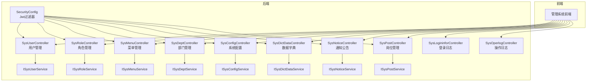

图表来源
- [SysUserController.java:46-266](file://ruoyi-admin/src/main/java/com/ruoyi/web/controller/system/SysUserController.java#L46-L266)
- [SysRoleController.java:45-282](file://ruoyi-admin/src/main/java/com/ruoyi/web/controller/system/SysRoleController.java#L45-L282)
- [SysMenuController.java:31-142](file://ruoyi-admin/src/main/java/com/ruoyi/web/controller/system/SysMenuController.java#L31-L142)
- [SysDeptController.java:32-133](file://ruoyi-admin/src/main/java/com/ruoyi/web/controller/system/SysDeptController.java#L32-L133)
- [SysConfigController.java:36-143](file://ruoyi-admin/src/main/java/com/ruoyi/web/controller/system/SysConfigController.java#L36-L143)
- [SysDictDataController.java:39-131](file://ruoyi-admin/src/main/java/com/ruoyi/web/controller/system/SysDictDataController.java#L39-L131)
- [SysNoticeController.java:34-101](file://ruoyi-admin/src/main/java/com/ruoyi/web/controller/system/SysNoticeController.java#L34-L101)
- [SysPostController.java:35-139](file://ruoyi-admin/src/main/java/com/ruoyi/web/controller/system/SysPostController.java#L35-L139)
- [SysLogininforController.java](file://ruoyi-admin/src/main/java/com/ruoyi/web/controller/monitor/SysLogininforController.java)
- [SysOperlogController.java](file://ruoyi-admin/src/main/java/com/ruoyi/web/controller/monitor/SysOperlogController.java)
- [SecurityConfig.java](file://ruoyi-framework/src/main/java/com/ruoyi/framework/config/SecurityConfig.java)
- [JwtAuthenticationTokenFilter.java](file://ruoyi-framework/src/main/java/com/ruoyi/framework/security/filter/JwtAuthenticationTokenFilter.java)

章节来源
- [SysUserController.java:46-266](file://ruoyi-admin/src/main/java/com/ruoyi/web/controller/system/SysUserController.java#L46-L266)
- [SysRoleController.java:45-282](file://ruoyi-admin/src/main/java/com/ruoyi/web/controller/system/SysRoleController.java#L45-L282)
- [SysMenuController.java:31-142](file://ruoyi-admin/src/main/java/com/ruoyi/web/controller/system/SysMenuController.java#L31-L142)
- [SysDeptController.java:32-133](file://ruoyi-admin/src/main/java/com/ruoyi/web/controller/system/SysDeptController.java#L32-L133)
- [SysConfigController.java:36-143](file://ruoyi-admin/src/main/java/com/ruoyi/web/controller/system/SysConfigController.java#L36-L143)
- [SysDictDataController.java:39-131](file://ruoyi-admin/src/main/java/com/ruoyi/web/controller/system/SysDictDataController.java#L39-L131)
- [SysNoticeController.java:34-101](file://ruoyi-admin/src/main/java/com/ruoyi/web/controller/system/SysNoticeController.java#L34-L101)
- [SysPostController.java:35-139](file://ruoyi-admin/src/main/java/com/ruoyi/web/controller/system/SysPostController.java#L35-L139)

## 核心组件
- 控制器层：各模块控制器统一继承 BaseController，使用注解进行权限校验与日志记录，返回 AjaxResult 统一响应结构。
- 服务层：ISysXxxService 定义业务契约，实现类负责具体数据访问与业务处理。
- 安全与切面：SecurityConfig 配置全局安全策略；JwtAuthenticationTokenFilter 进行 JWT 认证；LogAspect 记录业务日志；DataScopeAspect 实现数据范围控制。
- 统一响应：AjaxResult 封装状态码、消息与数据；TableDataInfo 用于分页列表返回。

章节来源
- [SysUserController.java:21-37](file://ruoyi-admin/src/main/java/com/ruoyi/web/controller/system/SysUserController.java#L21-L37)
- [SysRoleController.java:18-36](file://ruoyi-admin/src/main/java/com/ruoyi/web/controller/system/SysRoleController.java#L18-L36)
- [SysMenuController.java:15-22](file://ruoyi-admin/src/main/java/com/ruoyi/web/controller/system/SysMenuController.java#L15-L22)
- [SysDeptController.java:16-23](file://ruoyi-admin/src/main/java/com/ruoyi/web/controller/system/SysDeptController.java#L16-L23)
- [SysConfigController.java:16-27](file://ruoyi-admin/src/main/java/com/ruoyi/web/controller/system/SysConfigController.java#L16-L27)
- [SysDictDataController.java:17-30](file://ruoyi-admin/src/main/java/com/ruoyi/web/controller/system/SysDictDataController.java#L17-L30)
- [SysNoticeController.java:15-25](file://ruoyi-admin/src/main/java/com/ruoyi/web/controller/system/SysNoticeController.java#L15-L25)
- [SysPostController.java:16-27](file://ruoyi-admin/src/main/java/com/ruoyi/web/controller/system/SysPostController.java#L16-L27)
- [SecurityConfig.java](file://ruoyi-framework/src/main/java/com/ruoyi/framework/config/SecurityConfig.java)
- [JwtAuthenticationTokenFilter.java](file://ruoyi-framework/src/main/java/com/ruoyi/framework/security/filter/JwtAuthenticationTokenFilter.java)
- [LogAspect.java](file://ruoyi-framework/src/main/java/com/ruoyi/framework/aspectj/LogAspect.java)
- [DataScopeAspect.java](file://ruoyi-framework/src/main/java/com/ruoyi/framework/aspectj/DataScopeAspect.java)

## 架构总览
系统采用前后端分离，前端通过 REST 接口调用后端控制器，控制器经由服务层访问数据库，安全框架负责认证与授权，切面层负责日志与数据范围控制。

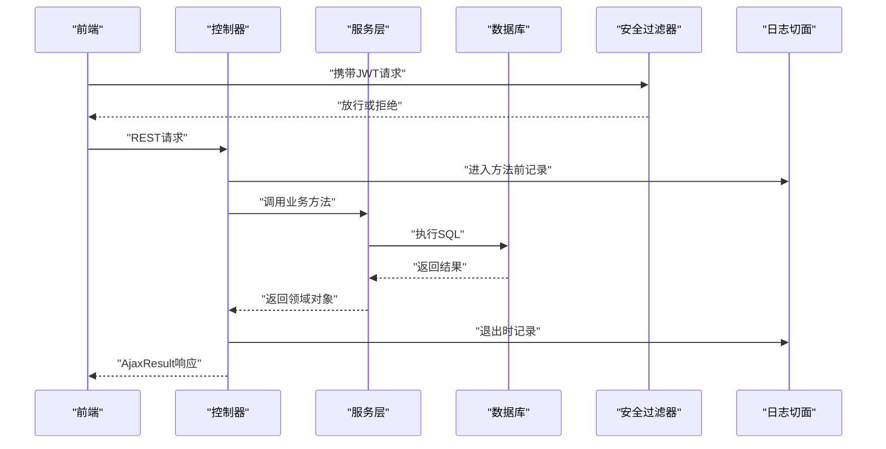

图表来源
- [JwtAuthenticationTokenFilter.java](file://ruoyi-framework/src/main/java/com/ruoyi/framework/security/filter/JwtAuthenticationTokenFilter.java)
- [LogAspect.java](file://ruoyi-framework/src/main/java/com/ruoyi/framework/aspectj/LogAspect.java)
- [SysUserController.java:63-75](file://ruoyi-admin/src/main/java/com/ruoyi/web/controller/system/SysUserController.java#L63-L75)

## 详细组件分析

### 用户管理接口
- 接口概览
  - 列表查询：GET /system/user/list（分页）
  - 导出：POST /system/user/export
  - 导入模板：POST /system/user/importTemplate
  - 导入数据：POST /system/user/importData
  - 详情：GET /system/user 或 /system/user/{userId}
  - 新增：POST /system/user
  - 修改：PUT /system/user
  - 删除：DELETE /system/user/{userIds}
  - 重置密码：PUT /system/user/resetPwd
  - 状态变更：PUT /system/user/changeStatus
  - 授权角色-查看：GET /system/user/authRole/{userId}
  - 授权角色-保存：PUT /system/user/authRole
  - 部门树：GET /system/user/deptTree

- 权限与校验
  - 使用 @PreAuthorize 结合权限表达式，如 system:user:list、system:user:add、system:user:edit、system:user:remove、system:user:resetPwd、system:user:export、system:user:import 等。
  - 新增/修改时对用户名、手机号、邮箱唯一性校验。
  - 数据范围校验：新增用户时校验部门与角色数据范围；编辑/删除/状态变更前校验目标用户数据范围。
  - 自身不可删除保护：删除时禁止删除当前登录用户。

- 审计与日志
  - 使用 @Log 注解记录业务类型（新增、修改、删除、导入、导出、授权、重置密码等）。

- 关键流程示意

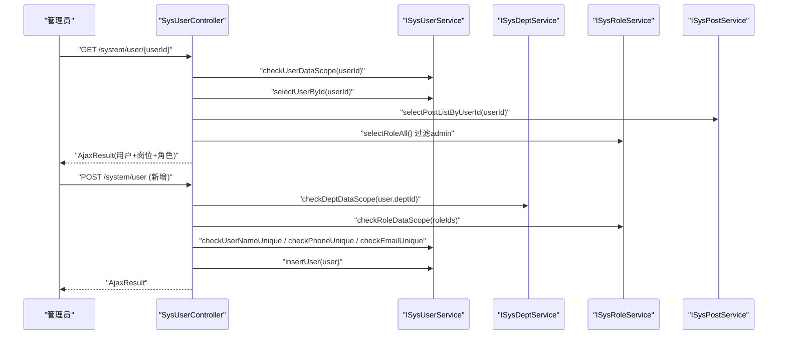

图表来源
- [SysUserController.java:109-153](file://ruoyi-admin/src/main/java/com/ruoyi/web/controller/system/SysUserController.java#L109-L153)
- [SysUserController.java:131-153](file://ruoyi-admin/src/main/java/com/ruoyi/web/controller/system/SysUserController.java#L131-L153)
- [ISysUserService.java](file://ruoyi-system/src/main/java/com/ruoyi/system/service/ISysUserService.java)
- [ISysDeptService.java](file://ruoyi-system/src/main/java/com/ruoyi/system/service/ISysDeptService.java)
- [ISysRoleService.java](file://ruoyi-system/src/main/java/com/ruoyi/system/service/ISysRoleService.java)
- [ISysPostService.java](file://ruoyi-system/src/main/java/com/ruoyi/system/service/ISysPostService.java)

章节来源
- [SysUserController.java:63-266](file://ruoyi-admin/src/main/java/com/ruoyi/web/controller/system/SysUserController.java#L63-L266)
- [SysUser.java](file://ruoyi-common/src/main/java/com/ruoyi/common/core/domain/entity/SysUser.java)
- [SysRole.java](file://ruoyi-common/src/main/java/com/ruoyi/common/core/domain/entity/SysRole.java)
- [SysDept.java](file://ruoyi-common/src/main/java/com/ruoyi/common/core/domain/entity/SysDept.java)

### 角色管理接口
- 接口概览
  - 列表查询：GET /system/role/list（分页）
  - 导出：POST /system/role/export
  - 详情：GET /system/role/{roleId}
  - 新增：POST /system/role
  - 修改：PUT /system/role
  - 数据范围修改：PUT /system/role/dataScope
  - 状态变更：PUT /system/role/changeStatus
  - 删除：DELETE /system/role/{roleIds}
  - 角色选择框：GET /system/role/optionselect
  - 已分配用户：GET /system/role/authUser/allocatedList
  - 未分配用户：GET /system/role/authUser/unallocatedList
  - 取消授权：PUT /system/role/authUser/cancel
  - 批量取消授权：PUT /system/role/authUser/cancelAll
  - 批量授权：PUT /system/role/authUser/selectAll
  - 对应角色部门树：GET /system/role/deptTree/{roleId}

- 权限与校验
  - 权限表达式：system:role:list、system:role:add、system:role:edit、system:role:remove 等。
  - 名称与权限键唯一性校验。
  - 修改角色后，若非超级管理员，会刷新当前登录用户的权限缓存（通过 TokenService 与 PermissionService）。

- 审计与日志
  - 使用 @Log 记录业务类型（新增、修改、删除、授权、数据范围变更等）。

- 关键流程示意

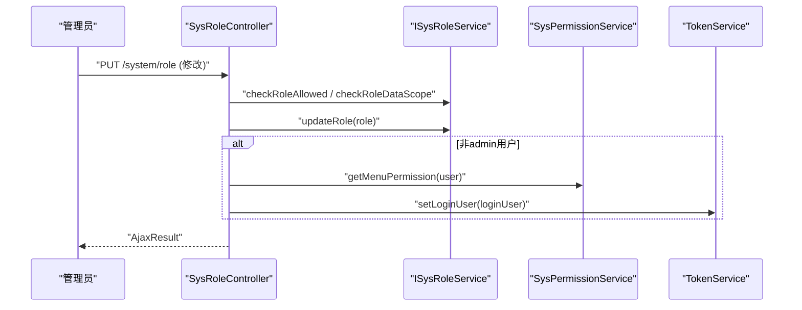

图表来源
- [SysRoleController.java:121-151](file://ruoyi-admin/src/main/java/com/ruoyi/web/controller/system/SysRoleController.java#L121-L151)
- [SysPermissionService.java](file://ruoyi-framework/src/main/java/com/ruoyi/framework/web/service/SysPermissionService.java)
- [TokenService.java](file://ruoyi-framework/src/main/java/com/ruoyi/framework/web/service/TokenService.java)

章节来源
- [SysRoleController.java:62-282](file://ruoyi-admin/src/main/java/com/ruoyi/web/controller/system/SysRoleController.java#L62-L282)
- [SysRole.java](file://ruoyi-common/src/main/java/com/ruoyi/common/core/domain/entity/SysRole.java)

### 菜单管理接口
- 接口概览
  - 列表查询：GET /system/menu/list
  - 详情：GET /system/menu/{menuId}
  - 下拉树：GET /system/menu/treeselect
  - 角色菜单树：GET /system/menu/roleMenuTreeselect/{roleId}
  - 新增：POST /system/menu
  - 修改：PUT /system/menu
  - 删除：DELETE /system/menu/{menuId}

- 权限与校验
  - 权限表达式：system:menu:list、system:menu:query、system:menu:add、system:menu:edit、system:menu:remove。
  - 校验菜单名称唯一性；外链菜单必须以 http(s) 开头；上级菜单不能选择自己；存在子菜单或已分配角色时禁止删除。

- 审计与日志
  - 使用 @Log 记录业务类型（新增、修改、删除）。

- 关键流程示意

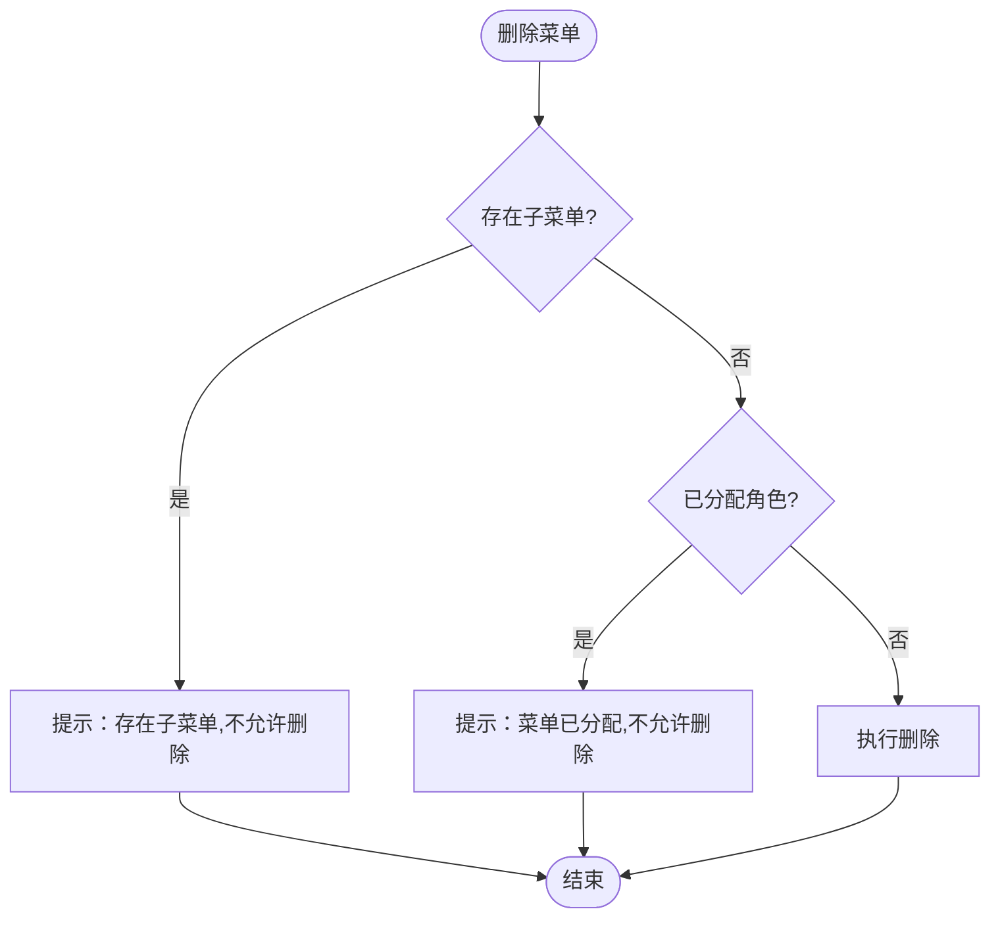

图表来源
- [SysMenuController.java:124-141](file://ruoyi-admin/src/main/java/com/ruoyi/web/controller/system/SysMenuController.java#L124-L141)
- [SysMenu.java](file://ruoyi-common/src/main/java/com/ruoyi/common/core/domain/entity/SysMenu.java)

章节来源
- [SysMenuController.java:39-142](file://ruoyi-admin/src/main/java/com/ruoyi/web/controller/system/SysMenuController.java#L39-L142)
- [ISysMenuService.java](file://ruoyi-system/src/main/java/com/ruoyi/system/service/ISysMenuService.java)

### 部门管理接口
- 接口概览
  - 列表查询：GET /system/dept/list
  - 排除节点列表：GET /system/dept/list/exclude/{deptId}
  - 详情：GET /system/dept/{deptId}
  - 新增：POST /system/dept
  - 修改：PUT /system/dept
  - 删除：DELETE /system/dept/{deptId}

- 权限与校验
  - 权限表达式：system:dept:list、system:dept:query、system:dept:add、system:dept:edit、system:dept:remove。
  - 校验部门名称唯一性；上级部门不能是自己；停用状态且存在未停用子部门时禁止修改；删除前检查是否存在下级部门与用户。

- 审计与日志
  - 使用 @Log 记录业务类型（新增、修改、删除）。

- 关键流程示意

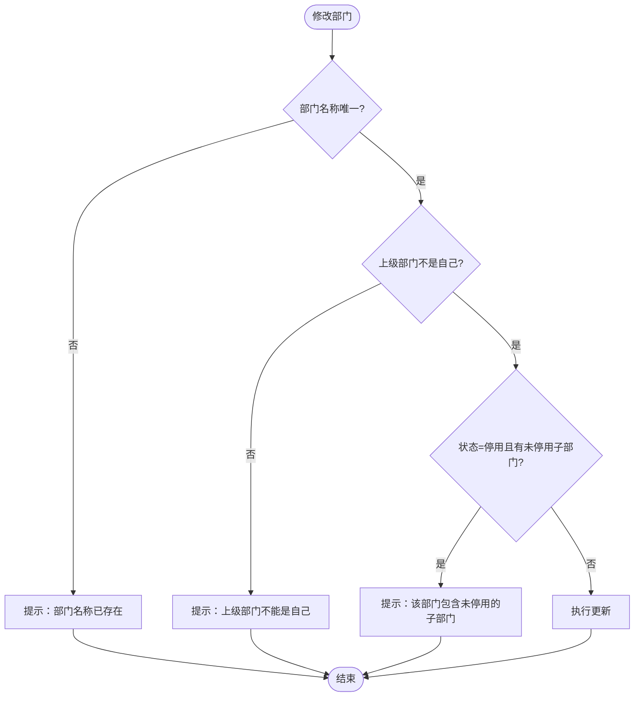

图表来源
- [SysDeptController.java:87-111](file://ruoyi-admin/src/main/java/com/ruoyi/web/controller/system/SysDeptController.java#L87-L111)

章节来源
- [SysDeptController.java:37-133](file://ruoyi-admin/src/main/java/com/ruoyi/web/controller/system/SysDeptController.java#L37-L133)
- [SysDept.java](file://ruoyi-common/src/main/java/com/ruoyi/common/core/domain/entity/SysDept.java)

### 系统配置接口
- 接口概览
  - 列表查询：GET /system/config/list（分页）
  - 导出：POST /system/config/export
  - 详情：GET /system/config/{configId}
  - 键名查询：GET /system/config/configKey/{configKey}
  - 新增：POST /system/config
  - 修改：PUT /system/config
  - 删除：DELETE /system/config/{configIds}
  - 刷新缓存：DELETE /system/config/refreshCache

- 权限与校验
  - 权限表达式：system:config:list、system:config:query、system:config:add、system:config:edit、system:config:remove、system:config:export。
  - 参数键名唯一性校验；删除后刷新缓存。

- 审计与日志
  - 使用 @Log 记录业务类型（新增、修改、删除、导出、清理缓存）。

- 关键流程示意

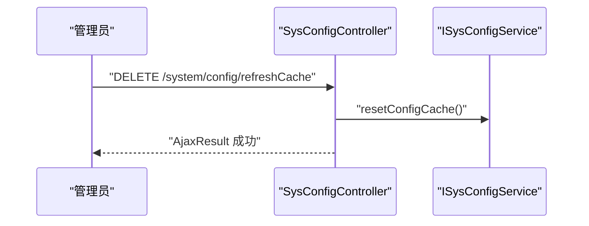

图表来源
- [SysConfigController.java:134-141](file://ruoyi-admin/src/main/java/com/ruoyi/web/controller/system/SysConfigController.java#L134-L141)
- [SysConfig.java](file://ruoyi-system/src/main/java/com/ruoyi/system/domain/SysConfig.java)

章节来源
- [SysConfigController.java:42-143](file://ruoyi-admin/src/main/java/com/ruoyi/web/controller/system/SysConfigController.java#L42-L143)
- [ISysConfigService.java](file://ruoyi-system/src/main/java/com/ruoyi/system/service/ISysConfigService.java)

### 数据字典接口
- 接口概览
  - 列表查询：GET /system/dict/data/list（分页）
  - 导出：POST /system/dict/data/export
  - 详情：GET /system/dict/data/{dictCode}
  - 类型查询：GET /system/dict/data/type/{dictType}
  - 新增：POST /system/dict/data
  - 修改：PUT /system/dict/data
  - 删除：DELETE /system/dict/data/{dictCodes}

- 权限与校验
  - 权限表达式：system:dict:list、system:dict:query、system:dict:add、system:dict:edit、system:dict:remove、system:dict:export。
  - 新增/修改时设置创建人/更新人。

- 审计与日志
  - 使用 @Log 记录业务类型（新增、修改、删除、导出）。

- 关键流程示意

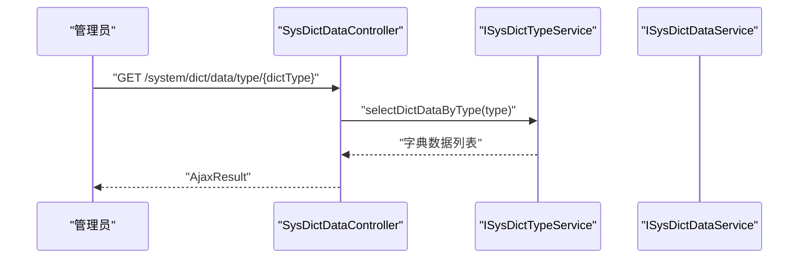

图表来源
- [SysDictDataController.java:82-93](file://ruoyi-admin/src/main/java/com/ruoyi/web/controller/system/SysDictDataController.java#L82-L93)

章节来源
- [SysDictDataController.java:47-131](file://ruoyi-admin/src/main/java/com/ruoyi/web/controller/system/SysDictDataController.java#L47-L131)
- [SysDictData.java](file://ruoyi-common/src/main/java/com/ruoyi/common/core/domain/entity/SysDictData.java)

### 通知公告接口
- 接口概览
  - 列表查询：GET /system/notice/list（分页）
  - 详情：GET /system/notice/{noticeId}
  - 新增：POST /system/notice
  - 修改：PUT /system/notice
  - 删除：DELETE /system/notice/{noticeIds}

- 权限与校验
  - 权限表达式：system:notice:list、system:notice:query、system:notice:add、system:notice:edit、system:notice:remove。
  - 新增/修改时设置创建人/更新人。

- 审计与日志
  - 使用 @Log 记录业务类型（新增、修改、删除）。

- 关键流程示意

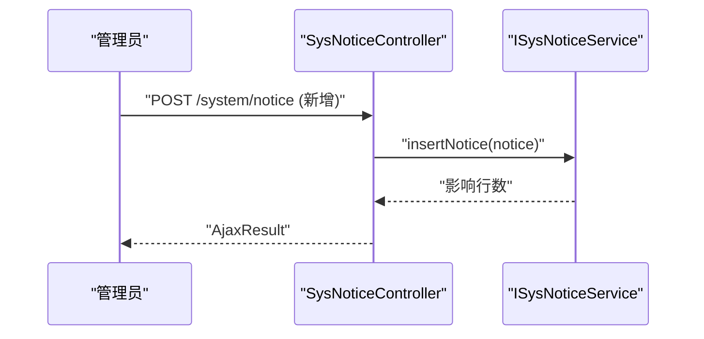

图表来源
- [SysNoticeController.java:67-76](file://ruoyi-admin/src/main/java/com/ruoyi/web/controller/system/SysNoticeController.java#L67-L76)
- [SysNotice.java](file://ruoyi-system/src/main/java/com/ruoyi/system/domain/SysNotice.java)

章节来源
- [SysNoticeController.java:39-101](file://ruoyi-admin/src/main/java/com/ruoyi/web/controller/system/SysNoticeController.java#L39-L101)
- [ISysNoticeService.java](file://ruoyi-system/src/main/java/com/ruoyi/system/service/ISysNoticeService.java)

### 岗位管理接口
- 接口概览
  - 列表查询：GET /system/post/list（分页）
  - 导出：POST /system/post/export
  - 详情：GET /system/post/{postId}
  - 新增：POST /system/post
  - 修改：PUT /system/post
  - 删除：DELETE /system/post/{postIds}
  - 岗位选择框：GET /system/post/optionselect

- 权限与校验
  - 权限表达式：system:post:list、system:post:query、system:post:add、system:post:edit、system:post:remove、system:post:export。
  - 岗位名称与编码唯一性校验。

- 审计与日志
  - 使用 @Log 记录业务类型（新增、修改、删除、导出）。

- 关键流程示意

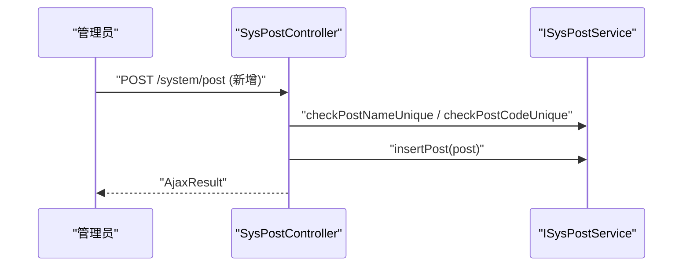

图表来源
- [SysPostController.java:78-96](file://ruoyi-admin/src/main/java/com/ruoyi/web/controller/system/SysPostController.java#L78-L96)
- [SysPost.java](file://ruoyi-system/src/main/java/com/ruoyi/system/domain/SysPost.java)

章节来源
- [SysPostController.java:41-139](file://ruoyi-admin/src/main/java/com/ruoyi/web/controller/system/SysPostController.java#L41-L139)
- [ISysPostService.java](file://ruoyi-system/src/main/java/com/ruoyi/system/service/ISysPostService.java)

### 登录日志与操作日志
- 登录日志
  - 接口：GET /monitor/logininfor/list（分页）
  - 权限：monitor:logininfor:list
  - 用途：审计登录行为，定位异常登录

- 操作日志
  - 接口：GET /monitor/operlog/list（分页）
  - 权限：monitor:operlog:list
  - 用途：审计关键业务操作，支持回溯与取证

- 审计与日志
  - 使用 @LogAspect 统一记录操作日志；支持业务类型、操作人、IP、时间等字段。

章节来源
- [SysLogininforController.java](file://ruoyi-admin/src/main/java/com/ruoyi/web/controller/monitor/SysLogininforController.java)
- [SysOperlogController.java](file://ruoyi-admin/src/main/java/com/ruoyi/web/controller/monitor/SysOperlogController.java)
- [LogAspect.java](file://ruoyi-framework/src/main/java/com/ruoyi/framework/aspectj/LogAspect.java)

## 依赖分析
- 控制器到服务层：各控制器通过@Autowired 注入对应 ISysXxxService，遵循单一职责与依赖倒置。
- 安全与权限：SecurityConfig + JwtAuthenticationTokenFilter 提供认证；@PreAuthorize + PermissionService/TokenService 提供授权与权限刷新。
- 数据范围：DataScopeAspect 在用户/角色/部门等接口前置校验数据范围，避免越权访问。
- 日志：LogAspect 在方法前后织入日志记录，统一格式与业务类型。

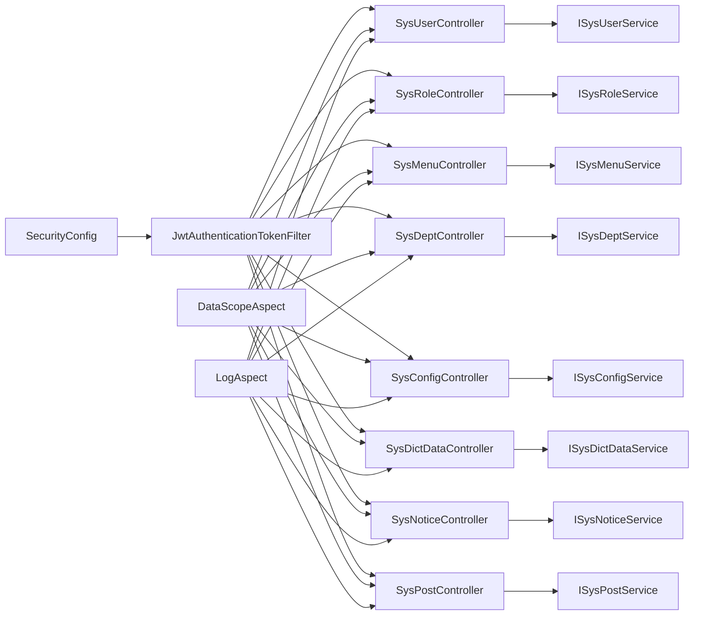

图表来源
- [SysUserController.java:48-58](file://ruoyi-admin/src/main/java/com/ruoyi/web/controller/system/SysUserController.java#L48-L58)
- [SysRoleController.java:47-54](file://ruoyi-admin/src/main/java/com/ruoyi/web/controller/system/SysRoleController.java#L47-L54)
- [SysMenuController.java:33-34](file://ruoyi-admin/src/main/java/com/ruoyi/web/controller/system/SysMenuController.java#L33-L34)
- [SysDeptController.java:34-35](file://ruoyi-admin/src/main/java/com/ruoyi/web/controller/system/SysDeptController.java#L34-L35)
- [SysConfigController.java:38-39](file://ruoyi-admin/src/main/java/com/ruoyi/web/controller/system/SysConfigController.java#L38-L39)
- [SysDictDataController.java:41-45](file://ruoyi-admin/src/main/java/com/ruoyi/web/controller/system/SysDictDataController.java#L41-L45)
- [SysNoticeController.java:36-37](file://ruoyi-admin/src/main/java/com/ruoyi/web/controller/system/SysNoticeController.java#L36-L37)
- [SysPostController.java:38-39](file://ruoyi-admin/src/main/java/com/ruoyi/web/controller/system/SysPostController.java#L38-L39)
- [SecurityConfig.java](file://ruoyi-framework/src/main/java/com/ruoyi/framework/config/SecurityConfig.java)
- [JwtAuthenticationTokenFilter.java](file://ruoyi-framework/src/main/java/com/ruoyi/framework/security/filter/JwtAuthenticationTokenFilter.java)
- [DataScopeAspect.java](file://ruoyi-framework/src/main/java/com/ruoyi/framework/aspectj/DataScopeAspect.java)
- [LogAspect.java](file://ruoyi-framework/src/main/java/com/ruoyi/framework/aspectj/LogAspect.java)

章节来源
- [SysUserController.java:48-58](file://ruoyi-admin/src/main/java/com/ruoyi/web/controller/system/SysUserController.java#L48-L58)
- [SysRoleController.java:47-54](file://ruoyi-admin/src/main/java/com/ruoyi/web/controller/system/SysRoleController.java#L47-L54)
- [SysMenuController.java:33-34](file://ruoyi-admin/src/main/java/com/ruoyi/web/controller/system/SysMenuController.java#L33-L34)
- [SysDeptController.java:34-35](file://ruoyi-admin/src/main/java/com/ruoyi/web/controller/system/SysDeptController.java#L34-L35)
- [SysConfigController.java:38-39](file://ruoyi-admin/src/main/java/com/ruoyi/web/controller/system/SysConfigController.java#L38-L39)
- [SysDictDataController.java:41-45](file://ruoyi-admin/src/main/java/com/ruoyi/web/controller/system/SysDictDataController.java#L41-L45)
- [SysNoticeController.java:36-37](file://ruoyi-admin/src/main/java/com/ruoyi/web/controller/system/SysNoticeController.java#L36-L37)
- [SysPostController.java:38-39](file://ruoyi-admin/src/main/java/com/ruoyi/web/controller/system/SysPostController.java#L38-L39)

## 性能考虑
- 分页查询：所有列表接口均使用 Page 分页，建议前端合理设置每页大小并启用懒加载，避免一次性加载大量数据。
- 缓存刷新：角色修改后对非超级管理员用户自动刷新权限缓存，减少重复登录成本。
- 导入导出：Excel 导出/导入使用工具类批量处理，建议在后台任务中异步执行大批量导入，避免阻塞主线程。
- 数据范围：通过 DataScopeAspect 在接口层快速拦截越权请求，减少无效数据库访问。
- 日志落库：操作日志按需开启，生产环境建议配置合理的日志保留周期与归档策略。

## 故障排查指南
- 权限不足
  - 现象：返回权限不足或被拒绝。
  - 排查：确认当前用户是否具备 system:* 权限；角色是否正确授权；是否触发了数据范围限制。
  - 参考：控制器中的 @PreAuthorize 表达式与 DataScopeAspect。

- 唯一性冲突
  - 现象：新增/修改时报用户名、手机号、邮箱或参数键名重复。
  - 排查：检查唯一性校验逻辑；确认是否误用旧数据。
  - 参考：用户与配置接口的唯一性校验。

- 删除受限
  - 现象：删除菜单/部门时报存在子项或已分配。
  - 排查：先清理子项或解除关联后再删除。
  - 参考：菜单与部门接口的删除前置校验。

- 权限缓存未更新
  - 现象：角色修改后权限未生效。
  - 排查：确认是否为非超级管理员用户；检查角色修改后的缓存刷新逻辑。
  - 参考：角色控制器的权限缓存刷新流程。

- 登录/操作审计缺失
  - 现象：无法查看登录或操作记录。
  - 排查：确认日志切面是否生效；监控接口权限是否正确；数据库日志表是否存在。
  - 参考：登录日志与操作日志接口及日志切面。

章节来源
- [SysMenuController.java:124-141](file://ruoyi-admin/src/main/java/com/ruoyi/web/controller/system/SysMenuController.java#L124-L141)
- [SysDeptController.java:114-131](file://ruoyi-admin/src/main/java/com/ruoyi/web/controller/system/SysDeptController.java#L114-L131)
- [SysRoleController.java:121-151](file://ruoyi-admin/src/main/java/com/ruoyi/web/controller/system/SysRoleController.java#L121-L151)
- [SysLogininforController.java](file://ruoyi-admin/src/main/java/com/ruoyi/web/controller/monitor/SysLogininforController.java)
- [SysOperlogController.java](file://ruoyi-admin/src/main/java/com/ruoyi/web/controller/monitor/SysOperlogController.java)
- [LogAspect.java](file://ruoyi-framework/src/main/java/com/ruoyi/framework/aspectj/LogAspect.java)

## 结论
港好住系统的“系统管理”接口以 RBAC 权限模型为核心，结合 JWT 认证、数据范围控制、统一日志与缓存刷新机制，实现了用户、角色、菜单、部门、配置、字典、公告、岗位等基础能力的标准化管理。通过严格的权限表达式与前置校验，有效保障了系统安全与数据隔离；通过分页与缓存策略提升了性能与可维护性。建议管理员在日常运维中关注权限配置、日志审计与缓存刷新，确保系统稳定运行。

## 附录
- 接口调用示例路径（示例，不展示具体代码内容）
  - 用户管理
    - 列表查询：[SysUserController.java:63-75](file://ruoyi-admin/src/main/java/com/ruoyi/web/controller/system/SysUserController.java#L63-L75)
    - 新增用户：[SysUserController.java:131-153](file://ruoyi-admin/src/main/java/com/ruoyi/web/controller/system/SysUserController.java#L131-L153)
    - 修改用户：[SysUserController.java:155-181](file://ruoyi-admin/src/main/java/com/ruoyi/web/controller/system/SysUserController.java#L155-L181)
    - 删除用户：[SysUserController.java:183-196](file://ruoyi-admin/src/main/java/com/ruoyi/web/controller/system/SysUserController.java#L183-L196)
    - 重置密码：[SysUserController.java:198-211](file://ruoyi-admin/src/main/java/com/ruoyi/web/controller/system/SysUserController.java#L198-L211)
    - 状态变更：[SysUserController.java:213-225](file://ruoyi-admin/src/main/java/com/ruoyi/web/controller/system/SysUserController.java#L213-L225)
    - 授权角色：[SysUserController.java:227-254](file://ruoyi-admin/src/main/java/com/ruoyi/web/controller/system/SysUserController.java#L227-L254)
  - 角色管理
    - 列表查询：[SysRoleController.java:62-74](file://ruoyi-admin/src/main/java/com/ruoyi/web/controller/system/SysRoleController.java#L62-L74)
    - 新增角色：[SysRoleController.java:97-116](file://ruoyi-admin/src/main/java/com/ruoyi/web/controller/system/SysRoleController.java#L97-L116)
    - 修改角色：[SysRoleController.java:118-151](file://ruoyi-admin/src/main/java/com/ruoyi/web/controller/system/SysRoleController.java#L118-L151)
    - 数据范围：[SysRoleController.java:153-164](file://ruoyi-admin/src/main/java/com/ruoyi/web/controller/system/SysRoleController.java#L153-L164)
    - 状态变更：[SysRoleController.java:166-178](file://ruoyi-admin/src/main/java/com/ruoyi/web/controller/system/SysRoleController.java#L166-L178)
    - 删除角色：[SysRoleController.java:180-189](file://ruoyi-admin/src/main/java/com/ruoyi/web/controller/system/SysRoleController.java#L180-L189)
    - 已分配/未分配用户：[SysRoleController.java:202-233](file://ruoyi-admin/src/main/java/com/ruoyi/web/controller/system/SysRoleController.java#L202-L233)
    - 批量授权/取消授权：[SysRoleController.java:235-267](file://ruoyi-admin/src/main/java/com/ruoyi/web/controller/system/SysRoleController.java#L235-L267)
  - 菜单管理
    - 列表查询：[SysMenuController.java:36-45](file://ruoyi-admin/src/main/java/com/ruoyi/web/controller/system/SysMenuController.java#L36-L45)
    - 新增菜单：[SysMenuController.java:80-98](file://ruoyi-admin/src/main/java/com/ruoyi/web/controller/system/SysMenuController.java#L80-L98)
    - 修改菜单：[SysMenuController.java:100-122](file://ruoyi-admin/src/main/java/com/ruoyi/web/controller/system/SysMenuController.java#L100-L122)
    - 删除菜单：[SysMenuController.java:124-141](file://ruoyi-admin/src/main/java/com/ruoyi/web/controller/system/SysMenuController.java#L124-L141)
  - 部门管理
    - 列表查询：[SysDeptController.java:37-46](file://ruoyi-admin/src/main/java/com/ruoyi/web/controller/system/SysDeptController.java#L37-L46)
    - 新增部门：[SysDeptController.java:71-85](file://ruoyi-admin/src/main/java/com/ruoyi/web/controller/system/SysDeptController.java#L71-L85)
    - 修改部门：[SysDeptController.java:87-111](file://ruoyi-admin/src/main/java/com/ruoyi/web/controller/system/SysDeptController.java#L87-L111)
    - 删除部门：[SysDeptController.java:113-131](file://ruoyi-admin/src/main/java/com/ruoyi/web/controller/system/SysDeptController.java#L113-L131)
  - 系统配置
    - 列表查询：[SysConfigController.java:41-56](file://ruoyi-admin/src/main/java/com/ruoyi/web/controller/system/SysConfigController.java#L41-L56)
    - 新增配置：[SysConfigController.java:87-101](file://ruoyi-admin/src/main/java/com/ruoyi/web/controller/system/SysConfigController.java#L87-L101)
    - 修改配置：[SysConfigController.java:103-117](file://ruoyi-admin/src/main/java/com/ruoyi/web/controller/system/SysConfigController.java#L103-L117)
    - 删除配置：[SysConfigController.java:119-129](file://ruoyi-admin/src/main/java/com/ruoyi/web/controller/system/SysConfigController.java#L119-L129)
    - 刷新缓存：[SysConfigController.java:131-141](file://ruoyi-admin/src/main/java/com/ruoyi/web/controller/system/SysConfigController.java#L131-L141)
  - 数据字典
    - 列表查询：[SysDictDataController.java:47-59](file://ruoyi-admin/src/main/java/com/ruoyi/web/controller/system/SysDictDataController.java#L47-L59)
    - 新增字典：[SysDictDataController.java:95-105](file://ruoyi-admin/src/main/java/com/ruoyi/web/controller/system/SysDictDataController.java#L95-L105)
    - 修改字典：[SysDictDataController.java:107-117](file://ruoyi-admin/src/main/java/com/ruoyi/web/controller/system/SysDictDataController.java#L107-L117)
    - 删除字典：[SysDictDataController.java:119-129](file://ruoyi-admin/src/main/java/com/ruoyi/web/controller/system/SysDictDataController.java#L119-L129)
  - 通知公告
    - 列表查询：[SysNoticeController.java:39-54](file://ruoyi-admin/src/main/java/com/ruoyi/web/controller/system/SysNoticeController.java#L39-L54)
    - 新增公告：[SysNoticeController.java:66-76](file://ruoyi-admin/src/main/java/com/ruoyi/web/controller/system/SysNoticeController.java#L66-L76)
    - 修改公告：[SysNoticeController.java:78-88](file://ruoyi-admin/src/main/java/com/ruoyi/web/controller/system/SysNoticeController.java#L78-L88)
    - 删除公告：[SysNoticeController.java:90-99](file://ruoyi-admin/src/main/java/com/ruoyi/web/controller/system/SysNoticeController.java#L90-L99)
  - 岗位管理
    - 列表查询：[SysPostController.java:41-56](file://ruoyi-admin/src/main/java/com/ruoyi/web/controller/system/SysPostController.java#L41-L56)
    - 新增岗位：[SysPostController.java:78-96](file://ruoyi-admin/src/main/java/com/ruoyi/web/controller/system/SysPostController.java#L78-L96)
    - 修改岗位：[SysPostController.java:98-116](file://ruoyi-admin/src/main/java/com/ruoyi/web/controller/system/SysPostController.java#L98-L116)
    - 删除岗位：[SysPostController.java:118-127](file://ruoyi-admin/src/main/java/com/ruoyi/web/controller/system/SysPostController.java#L118-L127)
  - 登录日志与操作日志
    - 登录日志：[SysLogininforController.java](file://ruoyi-admin/src/main/java/com/ruoyi/web/controller/monitor/SysLogininforController.java)
    - 操作日志：[SysOperlogController.java](file://ruoyi-admin/src/main/java/com/ruoyi/web/controller/monitor/SysOperlogController.java)