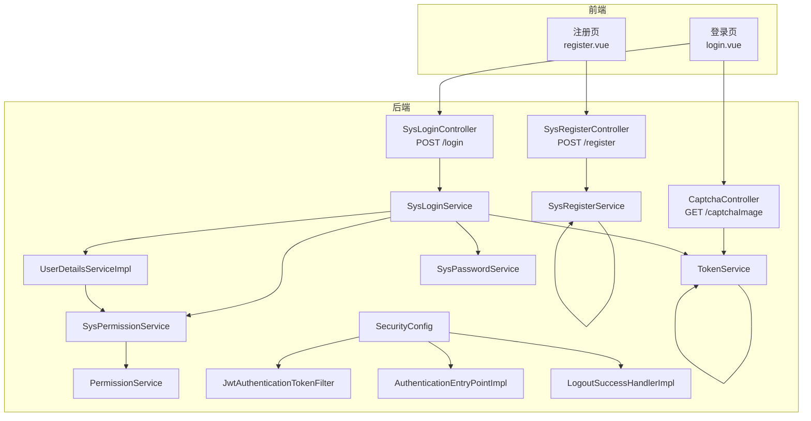
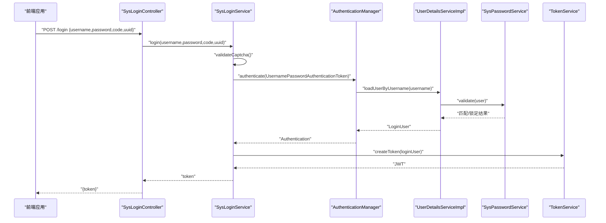
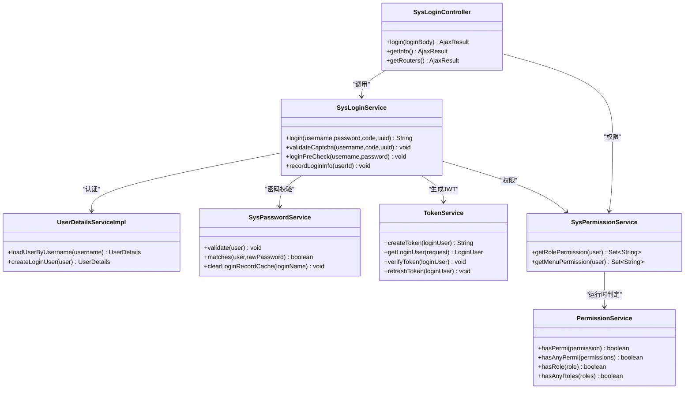
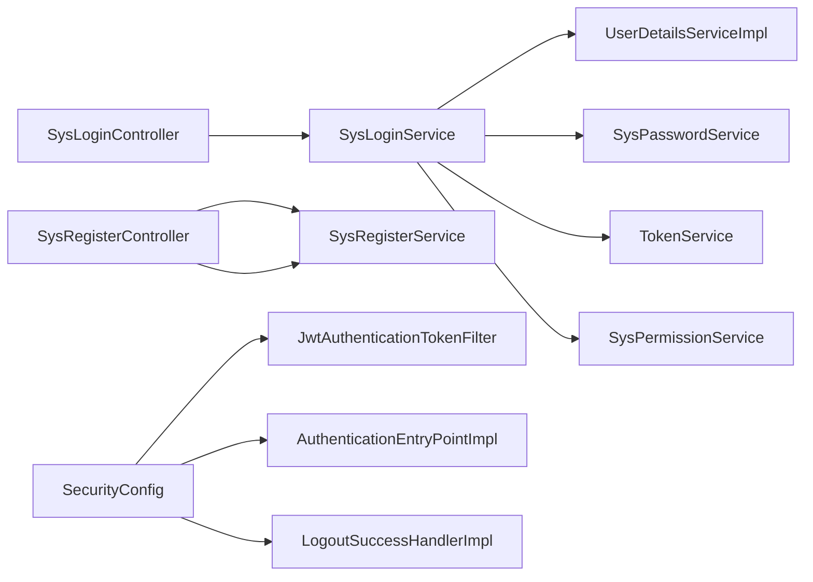

# 认证授权接口

<cite>
**本文引用的文件**
- [ruoyi-admin/src/main/java/com/ruoyi/web/controller/system/SysLoginController.java](file://ruoyi-admin/src/main/java/com/ruoyi/web/controller/system/SysLoginController.java)
- [ruoyi-admin/src/main/java/com/ruoyi/web/controller/system/SysRegisterController.java](file://ruoyi-admin/src/main/java/com/ruoyi/web/controller/system/SysRegisterController.java)
- [ruoyi-admin/src/main/java/com/ruoyi/web/controller/common/CaptchaController.java](file://ruoyi-admin/src/main/java/com/ruoyi/web/controller/common/CaptchaController.java)
- [ruoyi-framework/src/main/java/com/ruoyi/framework/web/service/SysLoginService.java](file://ruoyi-framework/src/main/java/com/ruoyi/framework/web/service/SysLoginService.java)
- [ruoyi-framework/src/main/java/com/ruoyi/framework/web/service/SysRegisterService.java](file://ruoyi-framework/src/main/java/com/ruoyi/framework/web/service/SysRegisterService.java)
- [ruoyi-framework/src/main/java/com/ruoyi/framework/web/service/TokenService.java](file://ruoyi-framework/src/main/java/com/ruoyi/framework/web/service/TokenService.java)
- [ruoyi-framework/src/main/java/com/ruoyi/framework/web/service/UserDetailsServiceImpl.java](file://ruoyi-framework/src/main/java/com/ruoyi/framework/web/service/UserDetailsServiceImpl.java)
- [ruoyi-framework/src/main/java/com/ruoyi/framework/web/service/SysPasswordService.java](file://ruoyi-framework/src/main/java/com/ruoyi/framework/web/service/SysPasswordService.java)
- [ruoyi-framework/src/main/java/com/ruoyi/framework/web/service/SysPermissionService.java](file://ruoyi-framework/src/main/java/com/ruoyi/framework/web/service/SysPermissionService.java)
- [ruoyi-framework/src/main/java/com/ruoyi/framework/web/service/PermissionService.java](file://ruoyi-framework/src/main/java/com/ruoyi/framework/web/service/PermissionService.java)
- [ruoyi-framework/src/main/java/com/ruoyi/framework/security/filter/JwtAuthenticationTokenFilter.java](file://ruoyi-framework/src/main/java/com/ruoyi/framework/security/filter/JwtAuthenticationTokenFilter.java)
- [ruoyi-framework/src/main/java/com/ruoyi/framework/config/SecurityConfig.java](file://ruoyi-framework/src/main/java/com/ruoyi/framework/config/SecurityConfig.java)
- [ruoyi-framework/src/main/java/com/ruoyi/framework/security/handle/AuthenticationEntryPointImpl.java](file://ruoyi-framework/src/main/java/com/ruoyi/framework/security/handle/AuthenticationEntryPointImpl.java)
- [ruoyi-framework/src/main/java/com/ruoyi/framework/security/handle/LogoutSuccessHandlerImpl.java](file://ruoyi-framework/src/main/java/com/ruoyi/framework/security/handle/LogoutSuccessHandlerImpl.java)
- [ruoyi-common/src/main/java/com/ruoyi/common/exception/user/CaptchaException.java](file://ruoyi-common/src/main/java/com/ruoyi/common/exception/user/CaptchaException.java)
- [ruoyi-common/src/main/java/com/ruoyi/common/exception/user/CaptchaExpireException.java](file://ruoyi-common/src/main/java/com/ruoyi/common/exception/user/CaptchaExpireException.java)
- [ruoyi-ui/src/views/login.vue](file://ruoyi-ui/src/views/login.vue)
- [ruoyi-ui/src/views/register.vue](file://ruoyi-ui/src/views/register.vue)
</cite>

## 目录
1. [简介](#简介)
2. [项目结构](#项目结构)
3. [核心组件](#核心组件)
4. [架构总览](#架构总览)
5. [详细组件分析](#详细组件分析)
6. [依赖分析](#依赖分析)
7. [性能考虑](#性能考虑)
8. [故障排查指南](#故障排查指南)
9. [结论](#结论)
10. [附录](#附录)

## 简介
本文件面向港好住系统的认证授权接口，系统性梳理用户登录、权限验证、验证码、注册与公共接口等安全相关API的功能与规范。重点覆盖：
- 登录认证流程与JWT令牌生成
- 权限验证机制与权限分离设计
- 验证码生成与校验
- 无状态认证、安全防护与会话控制策略
- 完整的接口调用示例、认证流程图与错误处理方案
- 安全配置、令牌管理与会话控制的最佳实践

## 项目结构
认证授权相关代码主要分布在以下模块：
- 控制层：登录、注册、验证码接口
- 业务服务层：登录校验、注册校验、令牌服务、用户详情加载、密码校验、权限服务
- 安全框架层：Spring Security配置、JWT过滤器、认证入口点、登出处理器
- 前端页面：登录页、注册页与验证码交互

**图表来源**
- [ruoyi-admin/src/main/java/com/ruoyi/web/controller/system/SysLoginController.java:56-65](file://ruoyi-admin/src/main/java/com/ruoyi/web/controller/system/SysLoginController.java#L56-L65)
- [ruoyi-admin/src/main/java/com/ruoyi/web/controller/system/SysRegisterController.java:28-37](file://ruoyi-admin/src/main/java/com/ruoyi/web/controller/system/SysRegisterController.java#L28-L37)
- [ruoyi-admin/src/main/java/com/ruoyi/web/controller/common/CaptchaController.java:45-93](file://ruoyi-admin/src/main/java/com/ruoyi/web/controller/common/CaptchaController.java#L45-L93)
- [ruoyi-framework/src/main/java/com/ruoyi/framework/web/service/SysLoginService.java:63-100](file://ruoyi-framework/src/main/java/com/ruoyi/framework/web/service/SysLoginService.java#L63-L100)
- [ruoyi-framework/src/main/java/com/ruoyi/framework/web/service/SysRegisterService.java:42-93](file://ruoyi-framework/src/main/java/com/ruoyi/framework/web/service/SysRegisterService.java#L42-L93)
- [ruoyi-framework/src/main/java/com/ruoyi/framework/web/service/TokenService.java:114-125](file://ruoyi-framework/src/main/java/com/ruoyi/framework/web/service/TokenService.java#L114-L125)
- [ruoyi-framework/src/main/java/com/ruoyi/framework/web/service/UserDetailsServiceImpl.java:38-65](file://ruoyi-framework/src/main/java/com/ruoyi/framework/web/service/UserDetailsServiceImpl.java#L38-L65)
- [ruoyi-framework/src/main/java/com/ruoyi/framework/web/service/SysPasswordService.java:44-77](file://ruoyi-framework/src/main/java/com/ruoyi/framework/web/service/SysPasswordService.java#L44-L77)
- [ruoyi-framework/src/main/java/com/ruoyi/framework/web/service/SysPermissionService.java:36-87](file://ruoyi-framework/src/main/java/com/ruoyi/framework/web/service/SysPermissionService.java#L36-L87)
- [ruoyi-framework/src/main/java/com/ruoyi/framework/web/service/PermissionService.java:27-80](file://ruoyi-framework/src/main/java/com/ruoyi/framework/web/service/PermissionService.java#L27-L80)
- [ruoyi-framework/src/main/java/com/ruoyi/framework/security/filter/JwtAuthenticationTokenFilter.java:31-43](file://ruoyi-framework/src/main/java/com/ruoyi/framework/security/filter/JwtAuthenticationTokenFilter.java#L31-L43)
- [ruoyi-framework/src/main/java/com/ruoyi/framework/config/SecurityConfig.java:109-123](file://ruoyi-framework/src/main/java/com/ruoyi/framework/config/SecurityConfig.java#L109-L123)
- [ruoyi-framework/src/main/java/com/ruoyi/framework/security/handle/AuthenticationEntryPointImpl.java:26-33](file://ruoyi-framework/src/main/java/com/ruoyi/framework/security/handle/AuthenticationEntryPointImpl.java#L26-L33)
- [ruoyi-framework/src/main/java/com/ruoyi/framework/security/handle/LogoutSuccessHandlerImpl.java:28-31](file://ruoyi-framework/src/main/java/com/ruoyi/framework/security/handle/LogoutSuccessHandlerImpl.java#L28-L31)

**章节来源**
- [ruoyi-admin/src/main/java/com/ruoyi/web/controller/system/SysLoginController.java:56-65](file://ruoyi-admin/src/main/java/com/ruoyi/web/controller/system/SysLoginController.java#L56-L65)
- [ruoyi-admin/src/main/java/com/ruoyi/web/controller/system/SysRegisterController.java:28-37](file://ruoyi-admin/src/main/java/com/ruoyi/web/controller/system/SysRegisterController.java#L28-L37)
- [ruoyi-admin/src/main/java/com/ruoyi/web/controller/common/CaptchaController.java:45-93](file://ruoyi-admin/src/main/java/com/ruoyi/web/controller/common/CaptchaController.java#L45-L93)
- [ruoyi-framework/src/main/java/com/ruoyi/framework/config/SecurityConfig.java:109-123](file://ruoyi-framework/src/main/java/com/ruoyi/framework/config/SecurityConfig.java#L109-L123)

## 核心组件
- 登录控制器：负责接收登录参数、调用登录服务并返回JWT令牌
- 注册控制器：负责注册参数校验与验证码校验
- 验证码控制器：生成图形验证码与数学验证码，返回uuid与图片
- 登录服务：验证码校验、前置校验、认证、记录登录日志、生成JWT
- 注册服务：注册参数校验、验证码校验、密码加密与入库
- 令牌服务：JWT签发、解析、刷新、用户代理与登录地点信息写入
- 用户详情服务：按用户名加载用户、校验状态、构建LoginUser
- 密码服务：密码匹配、重试次数限制与锁定
- 权限服务：基于角色与菜单的权限判定
- Spring Security配置：过滤链、匿名放行、跨域、JWT过滤器、认证入口点、登出处理器
- JWT过滤器：从请求头提取令牌、解析并注入认证上下文
- 认证入口点：未认证统一返回
- 登出处理器：统一登出响应

**章节来源**
- [ruoyi-framework/src/main/java/com/ruoyi/framework/web/service/SysLoginService.java:63-100](file://ruoyi-framework/src/main/java/com/ruoyi/framework/web/service/SysLoginService.java#L63-L100)
- [ruoyi-framework/src/main/java/com/ruoyi/framework/web/service/SysRegisterService.java:42-93](file://ruoyi-framework/src/main/java/com/ruoyi/framework/web/service/SysRegisterService.java#L42-L93)
- [ruoyi-framework/src/main/java/com/ruoyi/framework/web/service/TokenService.java:114-125](file://ruoyi-framework/src/main/java/com/ruoyi/framework/web/service/TokenService.java#L114-L125)
- [ruoyi-framework/src/main/java/com/ruoyi/framework/web/service/UserDetailsServiceImpl.java:38-65](file://ruoyi-framework/src/main/java/com/ruoyi/framework/web/service/UserDetailsServiceImpl.java#L38-L65)
- [ruoyi-framework/src/main/java/com/ruoyi/framework/web/service/SysPasswordService.java:44-77](file://ruoyi-framework/src/main/java/com/ruoyi/framework/web/service/SysPasswordService.java#L44-L77)
- [ruoyi-framework/src/main/java/com/ruoyi/framework/web/service/SysPermissionService.java:36-87](file://ruoyi-framework/src/main/java/com/ruoyi/framework/web/service/SysPermissionService.java#L36-L87)
- [ruoyi-framework/src/main/java/com/ruoyi/framework/web/service/PermissionService.java:27-80](file://ruoyi-framework/src/main/java/com/ruoyi/framework/web/service/PermissionService.java#L27-L80)
- [ruoyi-framework/src/main/java/com/ruoyi/framework/security/filter/JwtAuthenticationTokenFilter.java:31-43](file://ruoyi-framework/src/main/java/com/ruoyi/framework/security/filter/JwtAuthenticationTokenFilter.java#L31-L43)
- [ruoyi-framework/src/main/java/com/ruoyi/framework/config/SecurityConfig.java:109-123](file://ruoyi-framework/src/main/java/com/ruoyi/framework/config/SecurityConfig.java#L109-L123)
- [ruoyi-framework/src/main/java/com/ruoyi/framework/security/handle/AuthenticationEntryPointImpl.java:26-33](file://ruoyi-framework/src/main/java/com/ruoyi/framework/security/handle/AuthenticationEntryPointImpl.java#L26-L33)
- [ruoyi-framework/src/main/java/com/ruoyi/framework/security/handle/LogoutSuccessHandlerImpl.java:28-31](file://ruoyi-framework/src/main/java/com/ruoyi/framework/security/handle/LogoutSuccessHandlerImpl.java#L28-L31)

## 架构总览
认证授权采用无状态JWT模式，结合Spring Security过滤链进行统一拦截与鉴权。

**图表来源**
- [ruoyi-admin/src/main/java/com/ruoyi/web/controller/system/SysLoginController.java:56-65](file://ruoyi-admin/src/main/java/com/ruoyi/web/controller/system/SysLoginController.java#L56-L65)
- [ruoyi-framework/src/main/java/com/ruoyi/framework/web/service/SysLoginService.java:63-100](file://ruoyi-framework/src/main/java/com/ruoyi/framework/web/service/SysLoginService.java#L63-L100)
- [ruoyi-framework/src/main/java/com/ruoyi/framework/web/service/UserDetailsServiceImpl.java:38-65](file://ruoyi-framework/src/main/java/com/ruoyi/framework/web/service/UserDetailsServiceImpl.java#L38-L65)
- [ruoyi-framework/src/main/java/com/ruoyi/framework/web/service/SysPasswordService.java:44-77](file://ruoyi-framework/src/main/java/com/ruoyi/framework/web/service/SysPasswordService.java#L44-L77)
- [ruoyi-framework/src/main/java/com/ruoyi/framework/web/service/TokenService.java:114-125](file://ruoyi-framework/src/main/java/com/ruoyi/framework/web/service/TokenService.java#L114-L125)

## 详细组件分析

### 登录接口
- 接口路径：POST /login
- 请求体字段：username、password、code、uuid
- 返回值：包含token的对象
- 流程要点：
  - 调用SysLoginService.login完成验证码校验、前置校验、认证、记录日志与生成JWT
  - SysLoginController仅负责组装返回值

**章节来源**
- [ruoyi-admin/src/main/java/com/ruoyi/web/controller/system/SysLoginController.java:56-65](file://ruoyi-admin/src/main/java/com/ruoyi/web/controller/system/SysLoginController.java#L56-L65)
- [ruoyi-framework/src/main/java/com/ruoyi/framework/web/service/SysLoginService.java:63-100](file://ruoyi-framework/src/main/java/com/ruoyi/framework/web/service/SysLoginService.java#L63-L100)

### 注册接口
- 接口路径：POST /register
- 请求体字段：username、password、code、uuid
- 返回值：注册结果消息
- 流程要点：
  - SysRegisterController先检查注册开关
  - SysRegisterService完成参数校验、验证码校验与入库

**章节来源**
- [ruoyi-admin/src/main/java/com/ruoyi/web/controller/system/SysRegisterController.java:28-37](file://ruoyi-admin/src/main/java/com/ruoyi/web/controller/system/SysRegisterController.java#L28-L37)
- [ruoyi-framework/src/main/java/com/ruoyi/framework/web/service/SysRegisterService.java:42-93](file://ruoyi-framework/src/main/java/com/ruoyi/framework/web/service/SysRegisterService.java#L42-L93)

### 验证码接口
- 接口路径：GET /captchaImage
- 返回值：captchaEnabled、uuid、img（Base64）
- 生成策略：
  - 读取配置决定是否启用验证码
  - 生成uuid与验证码，写入Redis并设置过期时间
  - 将验证码图片转为Base64返回

**章节来源**
- [ruoyi-admin/src/main/java/com/ruoyi/web/controller/common/CaptchaController.java:45-93](file://ruoyi-admin/src/main/java/com/ruoyi/web/controller/common/CaptchaController.java#L45-L93)

### JWT令牌生成与刷新
- 令牌签发：TokenService.createToken
- 令牌解析：TokenService.getLoginUser/getUsernameFromToken
- 令牌刷新：TokenService.verifyToken在即将过期时刷新缓存
- 令牌存储：以uuid为key，将LoginUser对象缓存至Redis

**章节来源**
- [ruoyi-framework/src/main/java/com/ruoyi/framework/web/service/TokenService.java:62-83](file://ruoyi-framework/src/main/java/com/ruoyi/framework/web/service/TokenService.java#L62-L83)
- [ruoyi-framework/src/main/java/com/ruoyi/framework/web/service/TokenService.java:114-125](file://ruoyi-framework/src/main/java/com/ruoyi/framework/web/service/TokenService.java#L114-L125)
- [ruoyi-framework/src/main/java/com/ruoyi/framework/web/service/TokenService.java:133-141](file://ruoyi-framework/src/main/java/com/ruoyi/framework/web/service/TokenService.java#L133-L141)
- [ruoyi-framework/src/main/java/com/ruoyi/framework/web/service/TokenService.java:148-155](file://ruoyi-framework/src/main/java/com/ruoyi/framework/web/service/TokenService.java#L148-L155)

### 权限验证机制
- 角色权限：SysPermissionService.getRolePermission
- 菜单权限：SysPermissionService.getMenuPermission
- 运行时权限判定：PermissionService.hasPermi/hasAnyPermi/hasRole/hasAnyRoles
- 登录后动态刷新权限：SysLoginController.getInfo在权限变化时刷新令牌

**章节来源**
- [ruoyi-framework/src/main/java/com/ruoyi/framework/web/service/SysPermissionService.java:36-87](file://ruoyi-framework/src/main/java/com/ruoyi/framework/web/service/SysPermissionService.java#L36-L87)
- [ruoyi-framework/src/main/java/com/ruoyi/framework/web/service/PermissionService.java:27-80](file://ruoyi-framework/src/main/java/com/ruoyi/framework/web/service/PermissionService.java#L27-L80)
- [ruoyi-admin/src/main/java/com/ruoyi/web/controller/system/SysLoginController.java:72-93](file://ruoyi-admin/src/main/java/com/ruoyi/web/controller/system/SysLoginController.java#L72-L93)

### Spring Security与JWT过滤链
- 过滤链配置：SecurityConfig中添加JWT过滤器、跨域过滤器与登出处理器
- 匿名放行：静态资源、上传、Swagger等路径
- 未认证处理：AuthenticationEntryPointImpl统一返回未授权
- JWT过滤器：JwtAuthenticationTokenFilter从请求头提取令牌并注入认证上下文

**章节来源**
- [ruoyi-framework/src/main/java/com/ruoyi/framework/config/SecurityConfig.java:109-123](file://ruoyi-framework/src/main/java/com/ruoyi/framework/config/SecurityConfig.java#L109-L123)
- [ruoyi-framework/src/main/java/com/ruoyi/framework/security/handle/AuthenticationEntryPointImpl.java:26-33](file://ruoyi-framework/src/main/java/com/ruoyi/framework/security/handle/AuthenticationEntryPointImpl.java#L26-L33)
- [ruoyi-framework/src/main/java/com/ruoyi/framework/security/filter/JwtAuthenticationTokenFilter.java:31-43](file://ruoyi-framework/src/main/java/com/ruoyi/framework/security/filter/JwtAuthenticationTokenFilter.java#L31-L43)

### 登录流程类图

**图表来源**
- [ruoyi-admin/src/main/java/com/ruoyi/web/controller/system/SysLoginController.java:56-93](file://ruoyi-admin/src/main/java/com/ruoyi/web/controller/system/SysLoginController.java#L56-L93)
- [ruoyi-framework/src/main/java/com/ruoyi/framework/web/service/SysLoginService.java:63-100](file://ruoyi-framework/src/main/java/com/ruoyi/framework/web/service/SysLoginService.java#L63-L100)
- [ruoyi-framework/src/main/java/com/ruoyi/framework/web/service/UserDetailsServiceImpl.java:38-65](file://ruoyi-framework/src/main/java/com/ruoyi/framework/web/service/UserDetailsServiceImpl.java#L38-L65)
- [ruoyi-framework/src/main/java/com/ruoyi/framework/web/service/SysPasswordService.java:44-77](file://ruoyi-framework/src/main/java/com/ruoyi/framework/web/service/SysPasswordService.java#L44-L77)
- [ruoyi-framework/src/main/java/com/ruoyi/framework/web/service/TokenService.java:114-125](file://ruoyi-framework/src/main/java/com/ruoyi/framework/web/service/TokenService.java#L114-L125)
- [ruoyi-framework/src/main/java/com/ruoyi/framework/web/service/SysPermissionService.java:36-87](file://ruoyi-framework/src/main/java/com/ruoyi/framework/web/service/SysPermissionService.java#L36-L87)
- [ruoyi-framework/src/main/java/com/ruoyi/framework/web/service/PermissionService.java:27-80](file://ruoyi-framework/src/main/java/com/ruoyi/framework/web/service/PermissionService.java#L27-L80)

## 依赖分析
- 控制器依赖服务：SysLoginController依赖SysLoginService、TokenService、SysPermissionService；SysRegisterController依赖SysRegisterService
- 服务间依赖：SysLoginService依赖UserDetailsServiceImpl、SysPasswordService、TokenService、SysPermissionService；SysRegisterService依赖SysRegisterService自身逻辑
- 安全过滤链：SecurityConfig装配JwtAuthenticationTokenFilter、AuthenticationEntryPointImpl、LogoutSuccessHandlerImpl与CorsFilter

**图表来源**
- [ruoyi-admin/src/main/java/com/ruoyi/web/controller/system/SysLoginController.java:35-48](file://ruoyi-admin/src/main/java/com/ruoyi/web/controller/system/SysLoginController.java#L35-L48)
- [ruoyi-admin/src/main/java/com/ruoyi/web/controller/system/SysRegisterController.java:22-26](file://ruoyi-admin/src/main/java/com/ruoyi/web/controller/system/SysRegisterController.java#L22-L26)
- [ruoyi-framework/src/main/java/com/ruoyi/framework/config/SecurityConfig.java:109-123](file://ruoyi-framework/src/main/java/com/ruoyi/framework/config/SecurityConfig.java#L109-L123)

**章节来源**
- [ruoyi-admin/src/main/java/com/ruoyi/web/controller/system/SysLoginController.java:35-48](file://ruoyi-admin/src/main/java/com/ruoyi/web/controller/system/SysLoginController.java#L35-L48)
- [ruoyi-admin/src/main/java/com/ruoyi/web/controller/system/SysRegisterController.java:22-26](file://ruoyi-admin/src/main/java/com/ruoyi/web/controller/system/SysRegisterController.java#L22-L26)
- [ruoyi-framework/src/main/java/com/ruoyi/framework/config/SecurityConfig.java:109-123](file://ruoyi-framework/src/main/java/com/ruoyi/framework/config/SecurityConfig.java#L109-L123)

## 性能考虑
- 令牌有效期与自动刷新：当剩余有效期小于阈值时刷新Redis缓存，避免频繁重建JWT
- 密码重试限制：通过Redis计数与锁定时间控制暴力破解
- 验证码时效：验证码写入Redis并设置过期时间，防止重复使用与内存膨胀
- 无状态设计：JWT不依赖服务器会话，便于横向扩展与多实例部署

[本节为通用建议，不直接分析具体文件]

## 故障排查指南
- 验证码错误/过期
  - 现象：登录/注册时报验证码错误或过期
  - 可能原因：验证码未生成、uuid不匹配、Redis中验证码已过期
  - 处理：确认/captchaImage返回uuid与前端一致；检查验证码开关与Redis过期时间
- 密码错误过多
  - 现象：提示密码错误超过最大重试次数并被锁定
  - 可能原因：连续错误输入；锁定时间未到
  - 处理：等待锁定时间结束或联系管理员重置
- 未认证访问
  - 现象：返回未授权错误
  - 可能原因：缺少有效token或token无效
  - 处理：重新登录获取token；确认JWT过滤器生效
- 登录成功但权限异常
  - 现象：登录成功但权限列表不正确
  - 可能原因：权限缓存未刷新
  - 处理：调用获取用户信息接口触发权限刷新

**章节来源**
- [ruoyi-common/src/main/java/com/ruoyi/common/exception/user/CaptchaException.java:12-15](file://ruoyi-common/src/main/java/com/ruoyi/common/exception/user/CaptchaException.java#L12-L15)
- [ruoyi-common/src/main/java/com/ruoyi/common/exception/user/CaptchaExpireException.java:12-15](file://ruoyi-common/src/main/java/com/ruoyi/common/exception/user/CaptchaExpireException.java#L12-L15)
- [ruoyi-framework/src/main/java/com/ruoyi/framework/web/service/SysPasswordService.java:57-60](file://ruoyi-framework/src/main/java/com/ruoyi/framework/web/service/SysPasswordService.java#L57-L60)
- [ruoyi-framework/src/main/java/com/ruoyi/framework/security/handle/AuthenticationEntryPointImpl.java:26-33](file://ruoyi-framework/src/main/java/com/ruoyi/framework/security/handle/AuthenticationEntryPointImpl.java#L26-L33)
- [ruoyi-framework/src/main/java/com/ruoyi/framework/web/service/TokenService.java:133-141](file://ruoyi-framework/src/main/java/com/ruoyi/framework/web/service/TokenService.java#L133-L141)
- [ruoyi-admin/src/main/java/com/ruoyi/web/controller/system/SysLoginController.java:72-93](file://ruoyi-admin/src/main/java/com/ruoyi/web/controller/system/SysLoginController.java#L72-L93)

## 结论
港好住系统的认证授权体系以无状态JWT为核心，结合Spring Security过滤链实现统一的认证与权限控制。通过验证码、密码重试限制与权限动态刷新等机制，保障系统安全性与可用性。开发者可依据本文档的接口规范与最佳实践，正确实现与集成认证授权功能。

[本节为总结性内容，不直接分析具体文件]

## 附录

### 接口调用示例（步骤说明）
- 获取验证码
  - 请求：GET /captchaImage
  - 返回：{ captchaEnabled, uuid, img(Base64) }
  - 前端：展示图片并将uuid保存到表单
- 用户登录
  - 请求：POST /login { username, password, code, uuid }
  - 返回：{ token }
  - 前端：将token保存于本地并随后续请求携带
- 获取用户信息
  - 请求：GET /system/getInfo
  - 返回：{ user, roles, permissions, isDefaultModifyPwd, isPasswordExpired }
- 获取路由
  - 请求：GET /system/getRouters
  - 返回：路由树结构
- 注册
  - 请求：POST /register { username, password, code, uuid }
  - 返回：注册结果消息

**章节来源**
- [ruoyi-admin/src/main/java/com/ruoyi/web/controller/common/CaptchaController.java:45-93](file://ruoyi-admin/src/main/java/com/ruoyi/web/controller/common/CaptchaController.java#L45-L93)
- [ruoyi-admin/src/main/java/com/ruoyi/web/controller/system/SysLoginController.java:56-93](file://ruoyi-admin/src/main/java/com/ruoyi/web/controller/system/SysLoginController.java#L56-L93)
- [ruoyi-admin/src/main/java/com/ruoyi/web/controller/system/SysRegisterController.java:28-37](file://ruoyi-admin/src/main/java/com/ruoyi/web/controller/system/SysRegisterController.java#L28-L37)
- [ruoyi-ui/src/views/login.vue:126-168](file://ruoyi-ui/src/views/login.vue#L126-L168)
- [ruoyi-ui/src/views/register.vue:116-146](file://ruoyi-ui/src/views/register.vue#L116-L146)

### 安全配置要点
- 令牌配置项
  - token.header：请求头中携带令牌的键名
  - token.secret：JWT签名密钥
  - token.expireTime：令牌有效期（分钟）
- 验证码配置
  - captcha.enabled：是否启用验证码
  - captcha.type：验证码类型（字符/数学）
- 密码策略
  - user.password.maxRetryCount：最大重试次数
  - user.password.lockTime：锁定时间（分钟）
- 注册开关
  - sys.account.registerUser：是否开放注册

**章节来源**
- [ruoyi-framework/src/main/java/com/ruoyi/framework/web/service/TokenService.java:37-46](file://ruoyi-framework/src/main/java/com/ruoyi/framework/web/service/TokenService.java#L37-L46)
- [ruoyi-framework/src/main/java/com/ruoyi/framework/web/service/SysPasswordService.java:27-31](file://ruoyi-framework/src/main/java/com/ruoyi/framework/web/service/SysPasswordService.java#L27-L31)
- [ruoyi-admin/src/main/java/com/ruoyi/web/controller/system/SysRegisterController.java:31-34](file://ruoyi-admin/src/main/java/com/ruoyi/web/controller/system/SysRegisterController.java#L31-L34)