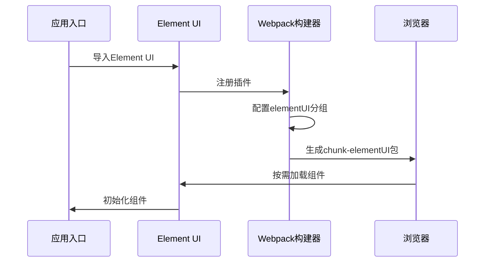
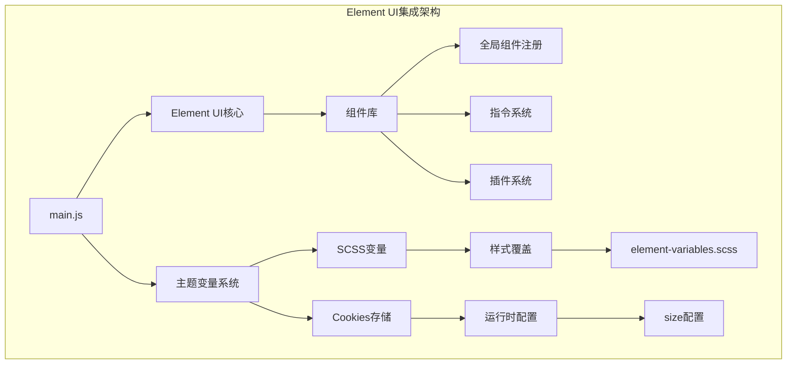
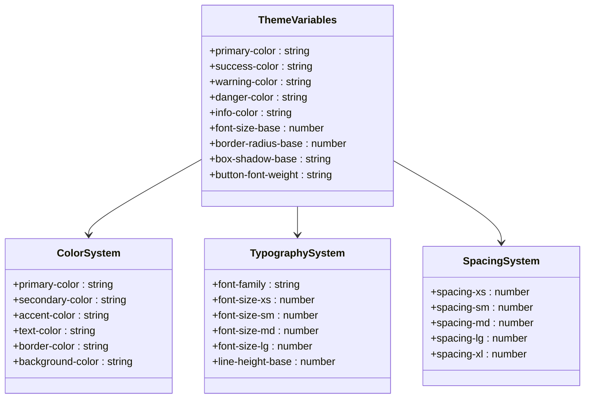
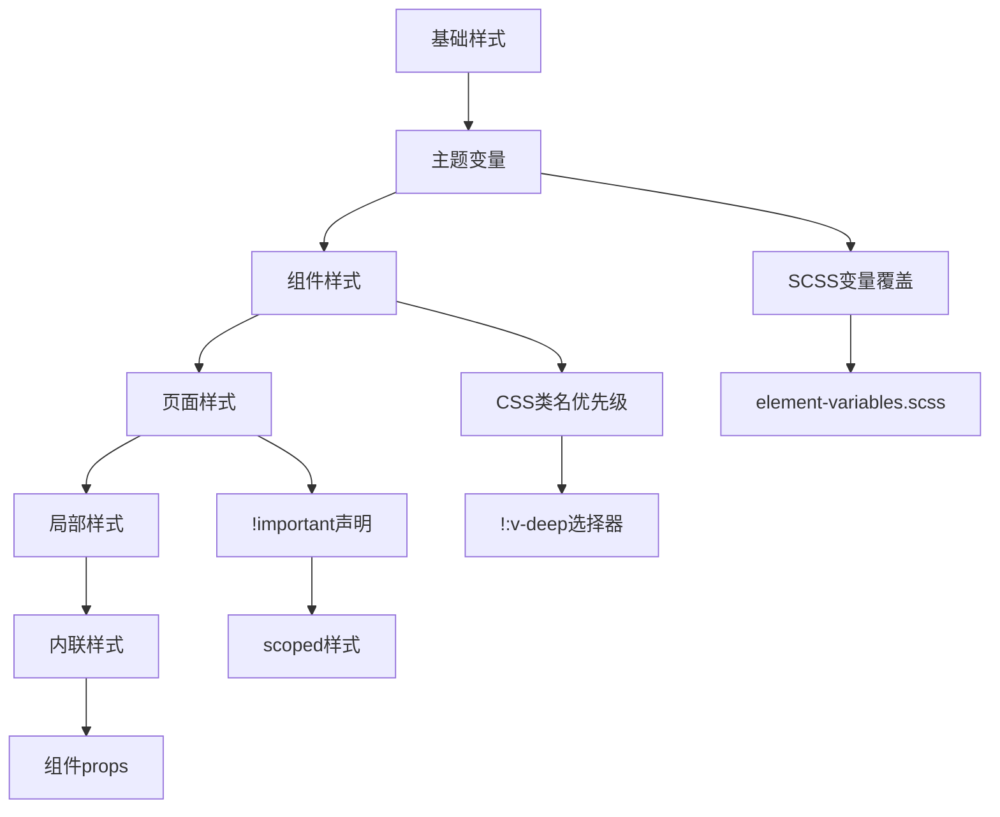
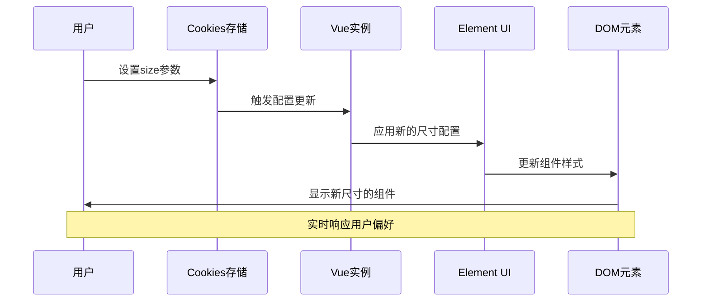
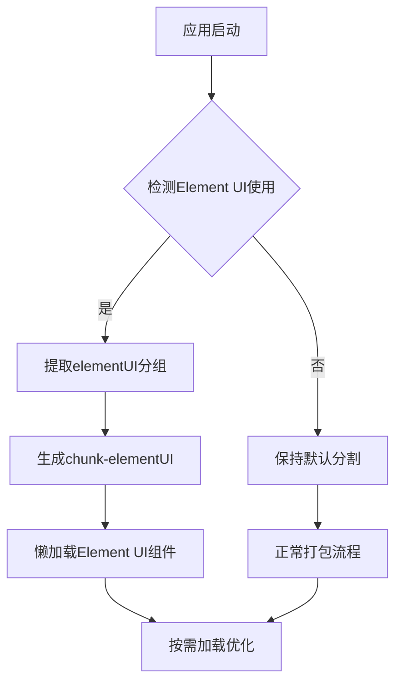

# Element UI集成

<cite>
**本文档引用的文件**
- [package.json](file://ruoyi-ui/package.json)
- [vue.config.js](file://ruoyi-ui/vue.config.js)
- [babel.config.js](file://ruoyi-ui/babel.config.js)
- [main.js](file://ruoyi-ui/src/main.js)
- [settings.js](file://ruoyi-ui/src/settings.js)
- [element-variables.scss](file://ruoyi-ui/src/assets/styles/element-variables.scss)
- [index.scss](file://ruoyi-ui/src/assets/styles/index.scss)
- [ruoyi.scss](file://ruoyi-ui/src/assets/styles/ruoyi.scss)
- [element-ui.scss](file://ruoyi-ui/src/assets/styles/element-ui.scss)
- [variables.scss](file://ruoyi-ui/src/assets/styles/variables.scss)
- [mixin.scss](file://ruoyi-ui/src/assets/styles/mixin.scss)
- [transition.scss](file://ruoyi-ui/src/assets/styles/transition.scss)
- [sidebar.scss](file://ruoyi-ui/src/assets/styles/sidebar.scss)
- [btn.scss](file://ruoyi-ui/src/assets/styles/btn.scss)
- [ruoyi.js](file://ruoyi-ui/src/utils/ruoyi.js)
</cite>

## 目录
1. [简介](#简介)
2. [项目结构](#项目结构)
3. [核心组件](#核心组件)
4. [架构概览](#架构概览)
5. [详细组件分析](#详细组件分析)
6. [依赖分析](#依赖分析)
7. [性能考虑](#性能考虑)
8. [故障排除指南](#故障排除指南)
9. [结论](#结论)

## 简介

本项目基于Vue.js 2.6.12和Element UI 2.15.14构建的企业级管理系统前端界面。Element UI作为主要的UI组件库，提供了丰富的交互组件和统一的设计规范。本文档深入分析了Element UI在项目中的集成配置，包括按需引入、主题定制、样式覆盖等技术实现，并详细说明了组件库的全局配置、自定义主题变量使用以及组件样式的覆盖策略。

该项目采用现代化的前端开发技术栈，结合若依框架的成熟经验，为企业级应用提供了完整的前端解决方案。通过合理的组件化设计和模块化配置，实现了高度可维护性和可扩展性的前端架构。

## 项目结构

项目采用标准的Vue CLI项目结构，重点关注Element UI集成的相关配置和样式文件组织：

```mermaid
graph TB
subgraph "前端项目结构"
A[ruoyi-ui/] --> B[src/]
A --> C[public/]
A --> D[node_modules/]
B --> E[assets/styles/]
B --> F[components/]
B --> G[utils/]
B --> H[views/]
E --> I[element-variables.scss]
E --> J[index.scss]
E --> K[ruoyi.scss]
E --> L[variables.scss]
A --> M[package.json]
A --> N[vue.config.js]
A --> O[babel.config.js]
end
```



**图表来源**
- [package.json:1-74](file://ruoyi-ui/package.json#L1-L74)
- [vue.config.js:1-138](file://ruoyi-ui/vue.config.js#L1-L138)

项目的核心特点包括：
- **依赖管理**：明确的Element UI版本控制和按需引入策略
- **构建配置**：针对Element UI的代码分割和优化配置
- **样式体系**：完整的SCSS变量系统和主题定制机制
- **全局配置**：统一的组件尺寸和国际化配置

**章节来源**
- [package.json:26-51](file://ruoyi-ui/package.json#L26-L51)
- [vue.config.js:120-124](file://ruoyi-ui/vue.config.js#L120-L124)

## 核心组件

### Element UI集成配置

Element UI在项目中的集成采用了按需引入的方式，通过webpack的代码分割功能实现优化加载：



**图表来源**
- [main.js:5-74](file://ruoyi-ui/src/main.js#L5-L74)
- [vue.config.js:120-124](file://ruoyi-ui/vue.config.js#L120-L124)

### 全局配置管理

项目实现了统一的全局配置管理，包括组件尺寸设置、国际化配置等：

| 配置项 | 类型 | 默认值 | 描述 |
|--------|------|--------|------|
| size | String | 'medium' | 组件尺寸设置（small/medium/large） |
| title | String | '港好住管理系统' | 网页标题 |
| sideTheme | String | 'theme-dark' | 侧边栏主题（theme-dark/theme-light） |
| topNav | Boolean | false | 是否显示顶部导航 |
| tagsView | Boolean | true | 是否显示tags视图 |
| fixedHeader | Boolean | false | 是否固定头部 |
| sidebarLogo | Boolean | true | 是否显示logo |

**章节来源**
- [main.js:72-74](file://ruoyi-ui/src/main.js#L72-L74)
- [settings.js:1-57](file://ruoyi-ui/src/settings.js#L1-L57)

## 架构概览

Element UI在项目中的整体架构采用模块化设计，通过多个层次的配置实现灵活的主题定制和样式覆盖：



**图表来源**
- [main.js:1-84](file://ruoyi-ui/src/main.js#L1-L84)
- [element-variables.scss:1-50](file://ruoyi-ui/src/assets/styles/element-variables.scss#L1-L50)

架构特点包括：
- **模块化导入**：通过独立的导入语句实现按需加载
- **主题系统**：基于SCSS变量的完整主题定制机制
- **配置中心**：统一的全局配置管理和运行时调整
- **样式隔离**：清晰的样式层次结构和作用域管理

## 详细组件分析

### 主题变量系统

Element UI的主题定制通过SCSS变量系统实现，提供了完整的颜色、字体、间距等设计规范：



**图表来源**
- [element-variables.scss:1-50](file://ruoyi-ui/src/assets/styles/element-variables.scss#L1-L50)
- [variables.scss:1-50](file://ruoyi-ui/src/assets/styles/variables.scss#L1-L50)

### 样式覆盖策略

项目采用多层样式覆盖策略，确保Element UI组件的样式能够灵活定制：



**图表来源**
- [index.scss:1-50](file://ruoyi-ui/src/assets/styles/index.scss#L1-L50)
- [element-ui.scss:1-50](file://ruoyi-ui/src/assets/styles/element-ui.scss#L1-L50)

### 组件尺寸配置流程

组件尺寸的动态配置通过Cookies存储实现，支持用户个性化设置：



**图表来源**
- [main.js:72-74](file://ruoyi-ui/src/main.js#L72-L74)

**章节来源**
- [main.js:6-8](file://ruoyi-ui/src/main.js#L6-L8)
- [element-variables.scss:1-50](file://ruoyi-ui/src/assets/styles/element-variables.scss#L1-L50)

### 构建优化配置

Webpack配置针对Element UI进行了专门的优化，通过代码分割提升加载性能：

| 配置项 | 值 | 说明 |
|--------|-----|------|
| chunk-elementUI | 包含element-ui | 单独打包Element UI组件 |
| libs | node_modules | 第三方库打包 |
| commons | src/components | 公共组件提取 |
| runtimeChunk | single | 运行时代码单独提取 |

**章节来源**
- [vue.config.js:120-134](file://ruoyi-ui/vue.config.js#L120-L134)

## 依赖分析

Element UI在项目中的依赖关系和版本控制体现了项目的稳定性和兼容性考虑：

```mermaid
graph LR
subgraph "项目依赖"
A[ruoyi-ui] --> B[Vue 2.6.12]
A --> C[Element UI 2.15.14]
A --> D[Axios 0.28.1]
A --> E[Vue Router 3.4.9]
end
subgraph "构建工具"
F[@vue/cli-service] --> G[Webpack]
F --> H[Babel]
F --> I[Sass Loader]
end
subgraph "开发依赖"
J[Vue CLI 4.4.6] --> F
K[Sass 1.32.13] --> I
L[Compression Plugin] --> G
end
A --> F
A --> J
```

**图表来源**
- [package.json:26-63](file://ruoyi-ui/package.json#L26-L63)

依赖管理特点：
- **版本锁定**：明确的依赖版本控制，确保构建稳定性
- **按需加载**：Element UI采用按需引入，减少打包体积
- **构建优化**：集成多种优化插件提升开发体验

**章节来源**
- [package.json:1-74](file://ruoyi-ui/package.json#L1-L74)

## 性能考虑

### 代码分割策略

项目通过Webpack的SplitChunksPlugin实现了智能的代码分割：



**图表来源**
- [vue.config.js:120-134](file://ruoyi-ui/vue.config.js#L120-L134)

### 缓存策略

项目集成了Gzip压缩插件，通过CompressionPlugin实现静态资源压缩：

| 配置参数 | 值 | 说明 |
|----------|----|------|
| test | /\.(js\|css\|html\|jpe?g\|png\|gif\|svg)?$/i | 压缩文件类型 |
| algorithm | gzip | 压缩算法 |
| minRatio | 0.8 | 最小压缩比 |
| deleteOriginalAssets | false | 保留原始文件 |

**章节来源**
- [vue.config.js:68-78](file://ruoyi-ui/vue.config.js#L68-L78)

## 故障排除指南

### 常见问题及解决方案

| 问题类型 | 症状 | 解决方案 |
|----------|------|----------|
| 组件样式冲突 | Element UI样式被覆盖 | 检查scoped样式和!:v-deep使用 |
| 主题变量不生效 | 自定义颜色未应用 | 确认SCSS变量编译顺序 |
| 组件尺寸异常 | 组件大小不符合预期 | 验证Cookies存储和配置优先级 |
| 构建错误 | Element UI导入失败 | 检查package.json依赖版本 |

### 调试建议

1. **样式调试**：使用浏览器开发者工具检查Element UI组件的实际样式应用
2. **配置验证**：通过控制台输出验证全局配置的正确性
3. **构建检查**：确认chunk-elementUI包是否正确生成
4. **缓存清理**：清除浏览器缓存确保最新样式生效

**章节来源**
- [main.js:72-74](file://ruoyi-ui/src/main.js#L72-L74)
- [vue.config.js:120-134](file://ruoyi-ui/vue.config.js#L120-L134)

## 结论

本项目成功实现了Element UI与Vue.js的深度集成，通过以下关键特性提供了优秀的用户体验：

1. **灵活的主题定制**：基于SCSS变量的完整主题系统，支持颜色、字体、间距等全方位定制
2. **高效的按需加载**：通过Webpack代码分割实现Element UI的按需引入，显著提升加载性能
3. **统一的配置管理**：集中化的全局配置系统，支持运行时动态调整
4. **完善的样式覆盖**：多层次的样式覆盖策略，确保主题定制的灵活性和稳定性

项目采用的最佳实践包括：
- 明确的依赖版本控制和按需引入策略
- 完善的构建优化配置和缓存策略
- 清晰的样式层次结构和作用域管理
- 统一的组件尺寸和国际化配置

这些特性共同构成了一个可维护、可扩展、高性能的企业级前端解决方案，为后续的功能扩展和主题定制奠定了坚实的基础。