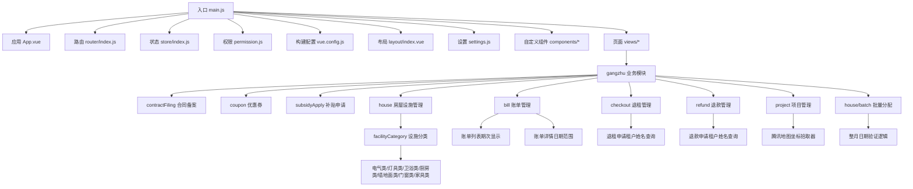
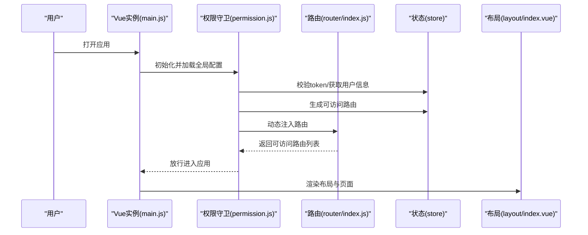
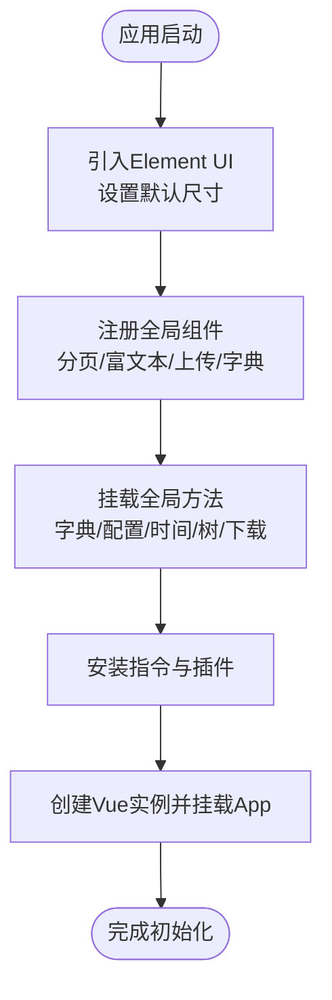
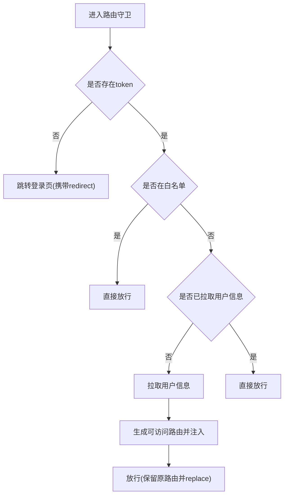
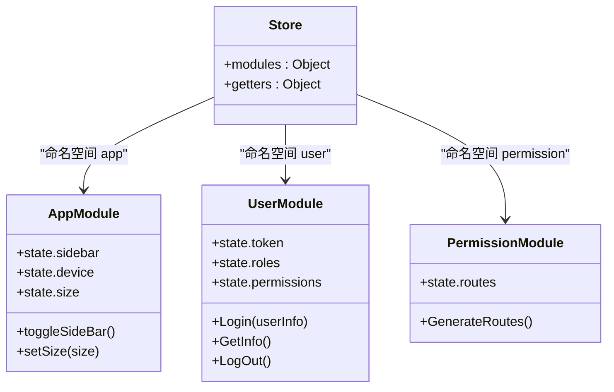
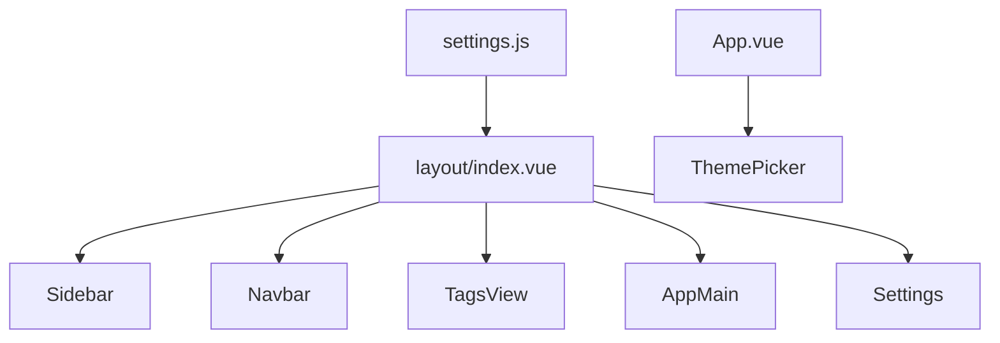
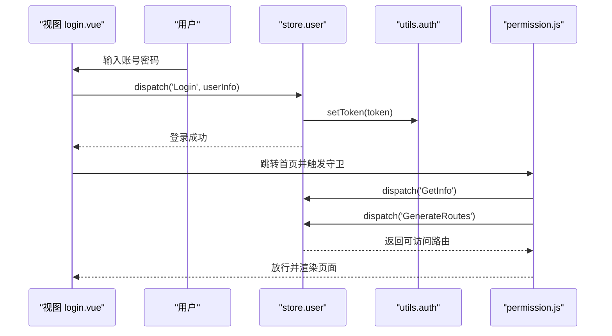
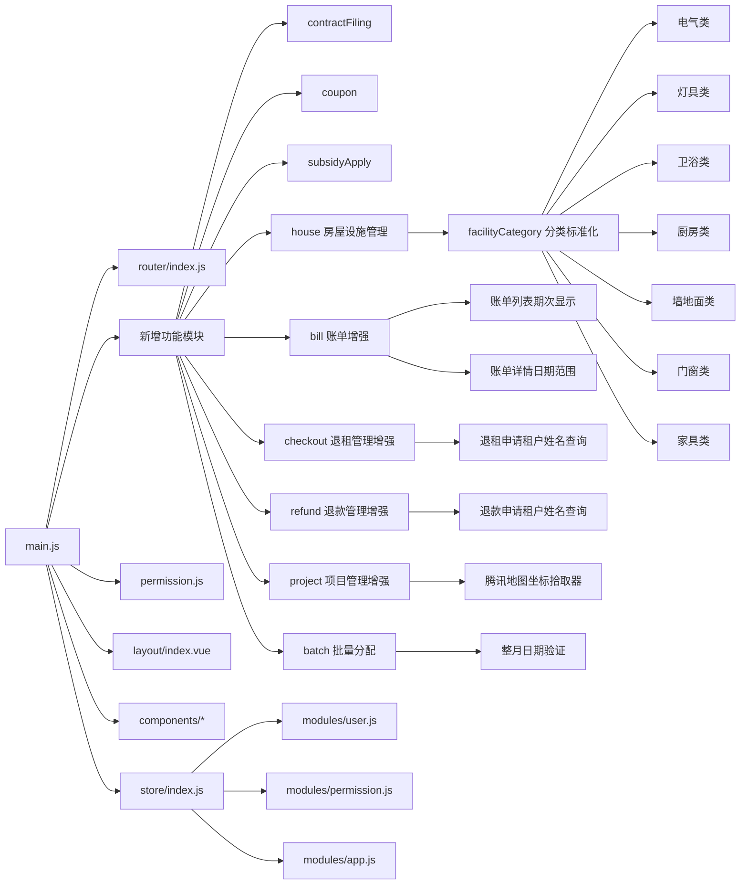

# PC管理后台

<cite>
**本文档引用的文件**
- [package.json](file://ruoyi-ui/package.json)
- [main.js](file://ruoyi-ui/src/main.js)
- [vue.config.js](file://ruoyi-ui/vue.config.js)
- [App.vue](file://ruoyi-ui/src/App.vue)
- [settings.js](file://ruoyi-ui/src/settings.js)
- [router/index.js](file://ruoyi-ui/src/router/index.js)
- [store/index.js](file://ruoyi-ui/src/store/index.js)
- [layout/index.vue](file://ruoyi-ui/src/layout/index.vue)
- [permission.js](file://ruoyi-ui/src/permission.js)
- [utils/auth.js](file://ruoyi-ui/src/utils/auth.js)
- [store/modules/user.js](file://ruoyi-ui/src/store/modules/user.js)
- [store/modules/permission.js](file://ruoyi-ui/src/store/modules/permission.js)
- [store/modules/app.js](file://ruoyi-ui/src/store/modules/app.js)
- [components/Pagination/index.vue](file://ruoyi-ui/src/components/Pagination/index.vue)
- [views/login.vue](file://ruoyi-ui/src/views/login.vue)
- [views/gangzhu/contractFiling/index.vue](file://ruoyi-ui/src/views/gangzhu/contractFiling/index.vue)
- [views/gangzhu/coupon/index.vue](file://ruoyi-ui/src/views/gangzhu/coupon/index.vue)
- [views/gangzhu/subsidyApply/index.vue](file://ruoyi-ui/src/views/gangzhu/subsidyApply/index.vue)
- [views/system/menu/index.vue](file://ruoyi-ui/src/views/system/menu/index.vue)
- [views/gangzhu/bill/index.vue](file://ruoyi-ui/src/views/gangzhu/bill/index.vue)
- [views/gangzhu/checkout/index.vue](file://ruoyi-ui/src/views/gangzhu/checkout/index.vue)
- [views/gangzhu/refund/index.vue](file://ruoyi-ui/src/views/gangzhu/refund/index.vue)
- [views/gangzhu/project/index.vue](file://ruoyi-ui/src/views/gangzhu/project/index.vue)
- [views/gangzhu/house/batch/index.vue](file://ruoyi-ui/src/views/gangzhu/house/batch/index.vue)
- [views/gangzhu/house/index.vue](file://ruoyi-ui/src/views/gangzhu/house/index.vue)
- [views/gangzhu/houseType/index.vue](file://ruoyi-ui/src/views/gangzhu/houseType/index.vue)
- [api/gangzhu/batch.js](file://ruoyi-ui/src/api/gangzhu/batch.js)
- [api/gangzhu/bill.js](file://ruoyi-ui/src/api/gangzhu/bill.js)
- [api/gangzhu/checkout.js](file://ruoyi-ui/src/api/gangzhu/checkout.js)
- [api/gangzhu/refund.js](file://ruoyi-ui/src/api/gangzhu/refund.js)
- [api/gangzhu/houseFacility.js](file://ruoyi-ui/src/api/gangzhu/houseFacility.js)
- [utils/index.js](file://ruoyi-ui/src/utils/index.js)
- [domain/HzBill.java](file://ruoyi-system/src/main/java/com/ruoyi/system/domain/HzBill.java)
- [domain/HzBillVO.java](file://ruoyi-system/src/main/java/com/ruoyi/system/domain/HzBillVO.java)
- [domain/HzCheckoutApply.java](file://ruoyi-system/src/main/java/com/ruoyi/system/domain/HzCheckoutApply.java)
- [domain/HzRefundApply.java](file://ruoyi-system/src/main/java/com/ruoyi/system/domain/HzRefundApply.java)
- [domain/HzHouseFacility.java](file://ruoyi-system/src/main/java/com/ruoyi/system/domain/HzHouseFacility.java)
- [domain/HzHouseTypeFacility.java](file://ruoyi-system/src/main/java/com/ruoyi/system/domain/HzHouseTypeFacility.java)
- [domain/HzFacilityItem.java](file://ruoyi-system/src/main/java/com/ruoyi/system/domain/HzFacilityItem.java)
- [service/impl/HzBatchAllocationServiceImpl.java](file://ruoyi-system/src/main/java/com/ruoyi/system/service/impl/HzBatchAllocationServiceImpl.java)
- [controller/HzBatchAllocationController.java](file://ruoyi-admin/src/main/java/com/ruoyi/web/controller/system/HzBatchAllocationController.java)
- [controller/HzHouseAppController.java](file://ruoyi-admin/src/main/java/com/ruoyi/web/controller/h5/HzHouseAppController.java)
- [service/impl/EsignServiceImpl.java](file://ruoyi-system/src/main/java/com/ruoyi/system/service/impl/EsignServiceImpl.java)
- [controller/HzHouseFacilityController.java](file://ruoyi-system/src/main/java/com/ruoyi/system/controller/HzHouseFacilityController.java)
- [controller/HzReportController.java](file://ruoyi-admin/src/main/java/com/ruoyi/web/controller/system/HzReportController.java)
</cite>

## 更新摘要
**所做更改**
- 新增房屋设施分类标准化章节，详细说明从旧命名约定（电器类、门窗类、灯类、卫浴区、家具类、洗菜池、其他）更新为新标准化命名（电气类、灯具类、卫浴类、厨房类、墙地面类、门窗类、家具类）的技术实现和兼容性处理
- 更新房屋设施管理模块，适配新的分类标准和显示逻辑
- 增强设施分类查询和统计功能，支持新的分类标准
- 优化设施分类的前端显示和后端处理逻辑
- **更新账单数据结构增强章节，反映后端接口增强了账单序列号和周期日期信息的返回**

## 目录
1. [简介](#简介)
2. [项目结构](#项目结构)
3. [核心组件](#核心组件)
4. [架构总览](#架构总览)
5. [详细组件分析](#详细组件分析)
6. [新增功能模块](#新增功能模块)
7. [账单表格增强功能](#账单表格增强功能)
8. [租户姓名查询功能增强](#租户姓名查询功能增强)
9. [批量分配页面日期验证功能](#批量分配页面日期验证功能)
10. [坐标拾取器迁移变更](#坐标拾取器迁移变更)
11. [房屋设施分类标准化](#房屋设施分类标准化)
12. [账单数据结构增强](#账单数据结构增强)
13. [依赖关系分析](#依赖关系分析)
14. [性能考虑](#性能考虑)
15. [故障排查指南](#故障排查指南)
16. [结论](#结论)
17. [附录](#附录)

## 简介
本文件面向PC管理后台的技术文档，围绕基于Vue.js 2.6.12与Element UI 2.15.14的前端工程展开，系统性阐述以下方面：
- Vue实例初始化与全局配置
- 路由配置与权限控制
- 状态管理（Vuex）模块化设计
- 布局系统（侧边栏、顶部导航、标签页、面包屑）
- 自定义组件库（分页、富文本、文件/图片上传、图片预览等）
- 权限控制机制与菜单动态加载
- 新增功能模块：合同备案、优惠券管理、补贴申请
- **新增功能：PC管理后台账单表格增强，支持期次显示和日期范围显示**
- **新增功能：PC管理后台退租管理和退款管理的租户姓名查询功能增强**
- **新增功能：批量分配页面的日期验证功能增强，确保入驻日期符合整月分配要求**
- **新增功能：坐标拾取器从高德地图迁移到腾讯地图**
- **新增功能：房屋设施分类标准化，从旧命名约定更新为新标准化命名，新增'墙地面类'类别**
- **更新功能：房屋设施分类显示逻辑调整，优化分类分组和显示效果**
- **更新功能：PC管理后台合同模块的后端接口增强了账单数据结构，支持账单序列号和周期日期信息的返回**
- 构建配置、开发调试与性能优化实践

## 项目结构
ruoyi-ui为管理后台的核心前端工程，采用Vue CLI 4.4.6脚手架，结合Element UI 2.15.14与Vuex进行模块化组织。主要目录与职责概览：
- src：源代码目录
  - api：后端接口封装
  - assets：静态资源与样式
  - components：自定义组件库
  - directive：指令扩展
  - layout：布局容器与组件
  - plugins：插件扩展
  - router：路由配置
  - store：状态管理（modules）
  - utils：通用工具函数
  - views：页面视图，包含新增的gangzhu业务模块
  - main.js：入口文件
  - permission.js：全局路由守卫
  - settings.js：系统布局与功能开关
- vue.config.js：构建与开发服务器配置
- package.json：依赖与脚本



**图表来源**
- [main.js:1-84](file://ruoyi-ui/src/main.js#L1-L84)
- [router/index.js:1-184](file://ruoyi-ui/src/router/index.js#L1-L184)
- [store/index.js:1-26](file://ruoyi-ui/src/store/index.js#L1-L26)
- [layout/index.vue:1-116](file://ruoyi-ui/src/layout/index.vue#L1-L116)
- [settings.js:1-57](file://ruoyi-ui/src/settings.js#L1-L57)

**章节来源**
- [package.json:1-74](file://ruoyi-ui/package.json#L1-L74)
- [main.js:1-84](file://ruoyi-ui/src/main.js#L1-L84)
- [vue.config.js:1-138](file://ruoyi-ui/vue.config.js#L1-L138)

## 核心组件
- Vue实例初始化与全局配置
  - 引入Element UI并按Cookie设置默认尺寸，注册全局组件与全局方法，挂载指令与插件，启动应用。
  - 关键点：全局组件注册（分页、富文本、文件/图片上传、字典标签等），全局方法挂载（字典、配置、时间处理、树处理等）。
- 路由配置
  - 定义公共路由与动态路由，开启history模式，修复重复点击路由报错问题。
- 状态管理
  - 模块化组织app、dict、user、tagsView、permission、settings，统一通过store/index.js注入。
- 布局系统
  - layout/index.vue组合Sidebar、Navbar、TagsView、AppMain、Settings，响应式控制侧边栏与固定头部。
- 权限控制
  - permission.js在beforeEach中校验token、拉取用户信息、生成可访问路由并动态注入。

**章节来源**
- [main.js:1-84](file://ruoyi-ui/src/main.js#L1-L84)
- [router/index.js:1-184](file://ruoyi-ui/src/router/index.js#L1-L184)
- [store/index.js:1-26](file://ruoyi-ui/src/store/index.js#L1-L26)
- [layout/index.vue:1-116](file://ruoyi-ui/src/layout/index.vue#L1-L116)
- [permission.js:1-64](file://ruoyi-ui/src/permission.js#L1-L64)

## 架构总览
整体架构围绕"入口初始化 → 路由守卫 → 动态路由与菜单 → 布局渲染 → 页面交互"的主干流程展开。Element UI提供UI基础能力，自定义组件增强业务体验，Vuex集中管理状态与权限。



**图表来源**
- [main.js:1-84](file://ruoyi-ui/src/main.js#L1-L84)
- [permission.js:18-59](file://ruoyi-ui/src/permission.js#L18-L59)
- [router/index.js:93-165](file://ruoyi-ui/src/router/index.js#L93-L165)
- [store/index.js:1-26](file://ruoyi-ui/src/store/index.js#L1-L26)
- [layout/index.vue:1-116](file://ruoyi-ui/src/layout/index.vue#L1-L116)

## 详细组件分析

### Vue实例初始化与全局配置
- 初始化步骤
  - 引入Element UI并设置默认尺寸（从Cookie读取），注册全局组件与全局方法，挂载指令与插件。
  - 启动Vue实例，挂载App根组件。
- 全局组件与方法
  - 注册分页、富文本、文件/图片上传、字典标签/数据等组件。
  - 挂载字典、配置、时间处理、树处理、下载等全局方法，便于各页面直接调用。



**图表来源**
- [main.js:1-84](file://ruoyi-ui/src/main.js#L1-L84)

**章节来源**
- [main.js:1-84](file://ruoyi-ui/src/main.js#L1-L84)

### 路由配置与权限控制
- 路由结构
  - constantRoutes：登录、404/401、首页、个人中心等公共路由。
  - dynamicRoutes：基于权限动态加载的路由（如用户授权、角色授权、字典数据、调度日志、代码生成等）。
  - history模式，避免#号；修复重复点击路由报错。
- 权限控制流程
  - beforeEach中校验token，未登录则跳转登录页；已登录但无用户信息则拉取用户信息并生成可访问路由，再动态注入。
  - 白名单（登录/注册）放行；动态路由根据权限过滤。



**图表来源**
- [permission.js:18-59](file://ruoyi-ui/src/permission.js#L18-L59)
- [router/index.js:32-184](file://ruoyi-ui/src/router/index.js#L32-L184)
- [store/modules/permission.js:33-51](file://ruoyi-ui/src/store/modules/permission.js#L33-L51)

**章节来源**
- [router/index.js:1-184](file://ruoyi-ui/src/router/index.js#L1-L184)
- [permission.js:1-64](file://ruoyi-ui/src/permission.js#L1-L64)

### 状态管理（Vuex）模块
- 模块划分
  - app：侧边栏状态、设备类型、Element尺寸等。
  - user：token、用户信息、角色与权限。
  - permission：路由表、侧边栏/顶部路由、动态路由生成。
  - dict、tagsView、settings：字典数据、标签页、系统设置。
- 关键交互
  - 登录成功写入token并提交至user模块；拉取用户信息后生成路由并注入permission模块；app模块控制侧边栏与尺寸。



**图表来源**
- [store/index.js:1-26](file://ruoyi-ui/src/store/index.js#L1-L26)
- [store/modules/app.js:1-67](file://ruoyi-ui/src/store/modules/app.js#L1-L67)
- [store/modules/user.js:1-126](file://ruoyi-ui/src/store/modules/user.js#L1-L126)
- [store/modules/permission.js:1-123](file://ruoyi-ui/src/store/modules/permission.js#L1-L123)

**章节来源**
- [store/index.js:1-26](file://ruoyi-ui/src/store/index.js#L1-L26)
- [store/modules/app.js:1-67](file://ruoyi-ui/src/store/modules/app.js#L1-L67)
- [store/modules/user.js:1-126](file://ruoyi-ui/src/store/modules/user.js#L1-L126)
- [store/modules/permission.js:1-123](file://ruoyi-ui/src/store/modules/permission.js#L1-L123)

### 布局系统设计
- 布局容器
  - layout/index.vue组合Sidebar、Navbar、TagsView、AppMain、Settings，支持移动端抽屉遮罩、固定头部宽度计算、侧边栏隐藏逻辑。
- 设置与主题
  - settings.js提供标题、侧边栏主题、顶部导航、标签页、固定头部、Logo、动态标题、底部版权等开关。
  - App.vue内含ThemePicker组件，用于主题切换（在特定场景下可见）。



**图表来源**
- [layout/index.vue:1-116](file://ruoyi-ui/src/layout/index.vue#L1-L116)
- [App.vue:1-21](file://ruoyi-ui/src/App.vue#L1-L21)
- [settings.js:1-57](file://ruoyi-ui/src/settings.js#L1-L57)

**章节来源**
- [layout/index.vue:1-116](file://ruoyi-ui/src/layout/index.vue#L1-L116)
- [App.vue:1-21](file://ruoyi-ui/src/App.vue#L1-L21)
- [settings.js:1-57](file://ruoyi-ui/src/settings.js#L1-L57)

### 自定义组件库
- 分页组件（Pagination）
  - 封装Element UI的el-pagination，支持total、page、limit、pageSizes、layout、autoScroll等属性，触发pagination事件供父组件监听。
- 富文本编辑器（Editor）
  - 基于Quill 2.0.2，提供富文本输入能力，便于内容管理。
- 文件上传组件（FileUpload）
  - 封装文件上传逻辑，支持多文件选择、进度反馈与错误处理。
- 图片上传组件（ImageUpload）
  - 封装图片上传，支持裁剪、预览与尺寸限制。
- 图片预览组件（ImagePreview）
  - 提供图床图片的预览与查看能力。
- 字典标签/数据（DictTag、DictData）
  - 将后端字典映射为标签或数据列表，提升界面一致性与可维护性。

**章节来源**
- [components/Pagination/index.vue:1-114](file://ruoyi-ui/src/components/Pagination/index.vue#L1-L114)
- [main.js:22-37](file://ruoyi-ui/src/main.js#L22-L37)

### 权限控制机制与菜单动态加载
- 用户认证流程
  - 登录页login.vue收集用户名、密码、验证码等，调用store.user.Login写入token并跳转首页。
  - utils/auth.js基于Cookie管理token。
- 菜单动态加载
  - permission.js调用后端接口获取路由树，filterAsyncRouter将字符串组件转换为实际组件，动态注入路由。
  - filterDynamicRoutes根据用户权限（roles/permissions）过滤动态路由。



**图表来源**
- [views/login.vue:145-168](file://ruoyi-ui/src/views/login.vue#L145-L168)
- [utils/auth.js:1-16](file://ruoyi-ui/src/utils/auth.js#L1-L16)
- [permission.js:28-48](file://ruoyi-ui/src/permission.js#L28-L48)
- [store/modules/user.js:44-97](file://ruoyi-ui/src/store/modules/user.js#L44-L97)
- [store/modules/permission.js:33-51](file://ruoyi-ui/src/store/modules/permission.js#L33-L51)

**章节来源**
- [views/login.vue:1-396](file://ruoyi-ui/src/views/login.vue#L1-L396)
- [utils/auth.js:1-16](file://ruoyi-ui/src/utils/auth.js#L1-L16)
- [store/modules/user.js:1-126](file://ruoyi-ui/src/store/modules/user.js#L1-L126)
- [store/modules/permission.js:1-123](file://ruoyi-ui/src/store/modules/permission.js#L1-L123)

### Element UI 2.15.14 集成与主题定制
- 集成方式
  - 在main.js中按需引入Element UI样式，设置默认尺寸（从Cookie读取），并注册全局组件与方法。
- 主题定制
  - 通过settings.js控制侧边栏主题（深色/浅色）、顶部导航、标签页、固定头部、Logo、动态标题、底部版权等。
  - App.vue内含ThemePicker组件，用于主题切换（在特定场景下可见）。
- 国际化支持
  - 项目未见Element UI国际化相关配置，如需国际化可在Element UI基础上补充i18n配置。

**章节来源**
- [main.js:6-74](file://ruoyi-ui/src/main.js#L6-L74)
- [settings.js:1-57](file://ruoyi-ui/src/settings.js#L1-L57)
- [App.vue:1-21](file://ruoyi-ui/src/App.vue#L1-L21)

### 构建配置与开发调试
- 开发服务器与代理
  - vue.config.js配置devServer，设置host/port/open，代理后端接口（target、changeOrigin、pathRewrite）。
- 资源与打包优化
  - outputDir、assetsDir、productionSourceMap关闭；SVG Sprite Loader处理图标；Gzip压缩插件；SplitChunks拆分第三方库、Element UI与公共组件。
- 路径别名与编译依赖
  - resolve.alias指向src；transpileDependencies包含quill；chainWebpack禁用preload/prefetch，按需插入ScriptExtHtmlWebpackPlugin。

**章节来源**
- [vue.config.js:10-138](file://ruoyi-ui/vue.config.js#L10-L138)

## 新增功能模块

### 合同备案管理模块
合同备案模块位于`views/gangzhu/contractFiling/`目录下，提供完整的合同备案管理功能：

- **功能概述**
  - 合同备案列表展示与查询
  - 合同备案详情查看
  - 合同备案状态管理
  - 合同文件上传与管理

- **核心组件**
  - 列表页面：支持分页查询、条件筛选、状态显示
  - 详情页面：展示合同详细信息、审批流程、附件列表
  - 表单组件：支持合同信息录入、状态变更操作

- **权限控制**
  - 基于角色的访问控制
  - 不同角色对合同备案的不同操作权限
  - 数据范围权限控制

**章节来源**
- [views/gangzhu/contractFiling/index.vue](file://ruoyi-ui/src/views/gangzhu/contractFiling/index.vue)

### 优惠券管理模块
优惠券管理模块位于`views/gangzhu/coupon/`目录下，提供优惠券全生命周期管理：

- **功能概述**
  - 优惠券模板管理
  - 优惠券发放记录管理
  - 优惠券使用状态跟踪
  - 优惠券统计分析

- **核心功能**
  - 优惠券模板创建与编辑
  - 批量发放优惠券
  - 优惠券使用记录查询
  - 优惠券有效期管理

- **业务流程**
  - 模板创建 → 发放到用户 → 使用核销 → 统计分析

**章节来源**
- [views/gangzhu/coupon/index.vue](file://ruoyi-ui/src/views/gangzhu/coupon/index.vue)

### 补贴申请管理模块
补贴申请模块位于`views/gangzhu/subsidyApply/`目录下，提供补贴申请全流程管理：

- **功能概述**
  - 补贴申请列表管理
  - 申请详情审核
  - 补贴发放状态跟踪
  - 申请材料审核

- **核心流程**
  - 申请提交 → 材料审核 → 审批通过 → 补贴发放 → 状态更新

- **数据展示**
  - 申请进度可视化
  - 审核历史记录
  - 补贴金额统计

**章节来源**
- [views/gangzhu/subsidyApply/index.vue](file://ruoyi-ui/src/views/gangzhu/subsidyApply/index.vue)

### 系统菜单管理增强
系统菜单管理模块增强了对新增业务功能的支持：

- **菜单结构**
  - 合同备案菜单项
  - 优惠券管理菜单项  
  - 补贴申请菜单项
  - 批量分配菜单项

- **权限配置**
  - 新增菜单的权限标识
  - 菜单层级结构调整
  - 菜单图标与排序优化

**章节来源**
- [views/system/menu/index.vue](file://ruoyi-ui/src/views/system/menu/index.vue)

### 项目管理模块坐标拾取器更新
项目管理模块的坐标拾取器已从高德地图迁移到腾讯地图：

- **功能概述**
  - 项目坐标录入功能
  - 坐标拾取器链接更新
  - 经纬度输入验证

- **实现变更**
  - 原高德地图坐标拾取器链接：`https://lbs.amap.com/tools/picker`
  - 新腾讯地图坐标拾取器链接：`https://lbs.qq.com/getPoint/`
  - 坐标拾取器提示信息更新

- **技术影响**
  - 前端提示链接更新
  - 后端坐标数据格式保持一致
  - 用户操作流程无变化

**章节来源**
- [views/gangzhu/project/index.vue:213](file://ruoyi-ui/src/views/gangzhu/project/index.vue#L213)

## 账单表格增强功能

### 功能概述
PC管理后台账单表格经过增强，新增了期次显示功能，支持以下显示格式：
- 第X期格式：适用于租金账单，显示为"第X期"
- 日期范围显示：显示账单周期的起止日期，格式为"MM.DD-MM.DD"
- 兼容模式：当billSeq为空时，显示传统的billPeriod格式

### 实现原理
账单表格的期次显示功能通过以下机制实现：

#### 前端显示逻辑
在`views/gangzhu/bill/index.vue`中，账单表格的"账期"列通过条件渲染实现：

```html
<el-table-column label="账期" align="center" width="180">
  <template slot-scope="scope">
    <span v-if="scope.row.billSeq">第{{ scope.row.billSeq }}期
      <span style="color:#999;font-size:12px;">({{ formatShortDate(scope.row.periodStartDate) }}-{{ formatShortDate(scope.row.periodEndDate) }})</span>
    </span>
    <span v-else>{{ scope.row.billPeriod }}</span>
  </template>
</el-table-column>
```

#### 日期格式化函数
新增了`formatShortDate`方法，用于将yyyy-MM-dd格式的日期转换为MM.DD格式：

```javascript
/** 日期格式化：yyyy-MM-dd → MM.DD */
formatShortDate(dateStr) {
  if (!dateStr) return '';
  const parts = dateStr.split('-');
  if (parts.length < 3) return dateStr;
  return parts[1] + '.' + parts[2];
}
```

#### 数据模型支持
后端数据模型支持期次和日期范围字段：

- `billSeq`：期数序号（租金账单使用）
- `periodStartDate`：本期起始日期
- `periodEndDate`：本期结束日期

### 详情页面增强
账单详情对话框同样支持期次显示功能：

```html
<el-descriptions-item label="账期">
  <span v-if="detailData.billSeq">第{{ detailData.billSeq }}期（{{ detailData.periodStartDate }} 至 {{ detailData.periodEndDate }}）</span>
  <span v-else>{{ detailData.billPeriod }}</span>
</el-descriptions-item>
```

### 数据模型说明

#### HzBill实体类
账单实体类包含以下关键字段：
- `billSeq`：期数序号（Integer类型）
- `periodStartDate`：期初日期（String类型）
- `periodEndDate`：期末日期（String类型）

#### HzBillVO扩展类
账单VO类继承HzBill，扩展了关联数据字段：
- `contractNo`：合同编号
- `projectName`：项目名称
- `allocationType`：配租方式

**章节来源**
- [views/gangzhu/bill/index.vue:137-144](file://ruoyi-ui/src/views/gangzhu/bill/index.vue#L137-L144)
- [views/gangzhu/bill/index.vue:327-333](file://ruoyi-ui/src/views/gangzhu/bill/index.vue#L327-L333)
- [domain/HzBill.java:230-252](file://ruoyi-system/src/main/java/com/ruoyi/system/domain/HzBill.java#L230-L252)
- [domain/HzBillVO.java:13-35](file://ruoyi-system/src/main/java/com/ruoyi/system/domain/HzBillVO.java#L13-L35)

## 租户姓名查询功能增强

### 功能概述
PC管理后台的退租管理和退款管理模块经过增强，新增了租户姓名查询功能，支持以下查询和展示能力：
- 退租申请列表：新增租户姓名查询字段，支持按租户姓名精确查询
- 退款申请列表：新增租户姓名查询字段，支持按租户姓名精确查询
- 表格显示：在列表中直接显示租户姓名，提升管理效率

### 实现原理

#### 退租管理模块增强
在`views/gangzhu/checkout/index.vue`中，退租申请列表新增了租户姓名查询字段：

```html
<!-- 查询表单新增租户姓名字段 -->
<el-form-item label="姓名" prop="tenantName">
  <el-input
    v-model="queryParams.tenantName"
    placeholder="请输入租户姓名"
    clearable
    @keyup.enter.native="handleQuery"
  />
</el-form-item>

<!-- 表格列新增租户姓名显示 -->
<el-table-column label="姓名" align="center" prop="tenantName" width="100" show-overflow-tooltip />
```

#### 退款管理模块增强
在`views/gangzhu/refund/index.vue`中，退款申请列表同样新增了租户姓名查询字段：

```html
<!-- 查询表单新增租户姓名字段 -->
<el-form-item label="姓名" prop="tenantName">
  <el-input
    v-model="queryParams.tenantName"
    placeholder="请输入租户姓名"
    clearable
    @keyup.enter.native="handleQuery"
  />
</el-form-item>

<!-- 表格列新增租户姓名显示 -->
<el-table-column label="姓名" align="center" prop="tenantName" width="100" show-overflow-tooltip />
```

#### 查询参数增强
两个模块的查询参数都增加了tenantName字段：

```javascript
// 退租模块查询参数
queryParams: {
  pageNum: 1,
  pageSize: 10,
  applyId: null,
  applyStatus: null,
  tenantName: null,  // 新增租户姓名查询
},

// 退款模块查询参数
queryParams: {
  pageNum: 1,
  pageSize: 10,
  refundNo: null,
  tenantName: null,  // 新增租户姓名查询
  contractNo: null,
  refundStatus: null,
  projectId: null,
  refundType: null
},
```

### 数据模型支持

#### HzCheckoutApply实体类
退租申请实体类中新增了tenantName查询参数字段：

```java
/** 租户姓名（仅查询参数透传，不映射数据库；按 hz_contract.tenant_name 模糊查询） */
@TableField(exist = false)
private String tenantName;

public void setTenantName(String tenantName) { this.tenantName = tenantName; }
public String getTenantName() { return tenantName; }
```

#### HzRefundApply实体类
退款申请实体类中包含了tenantName字段：

```java
/** 租户姓名 */
private String tenantName;

public String getTenantName() {
    return tenantName;
}

public void setTenantName(String tenantName) {
    this.tenantName = tenantName;
}
```

### API接口支持
相关的API接口已经支持租户姓名查询参数：

#### 退租申请API
```javascript
// 查询退租申请列表（支持tenantName查询参数）
export function listCheckout(query) {
  return request({
    url: '/system/checkout/list',
    method: 'get',
    params: query
  })
}
```

#### 退款申请API
```javascript
// 查询退款列表（支持tenantName查询参数）
export function listRefund(query) {
  return request({
    url: '/gangzhu/refund/list',
    method: 'get',
    params: query
  })
}
```

### 后端查询逻辑
后端查询逻辑支持按租户姓名进行模糊匹配，通过HzCheckoutApply的tenantName字段实现：

- 退租申请：按hz_contract.tenant_name进行模糊查询
- 退款申请：直接查询hz_refund_apply.tenant_name字段

**章节来源**
- [views/gangzhu/checkout/index.vue:12-19](file://ruoyi-ui/src/views/gangzhu/checkout/index.vue#L12-L19)
- [views/gangzhu/checkout/index.vue:41](file://ruoyi-ui/src/views/gangzhu/checkout/index.vue#L41)
- [views/gangzhu/checkout/index.vue:695](file://ruoyi-ui/src/views/gangzhu/checkout/index.vue#L695)
- [views/gangzhu/refund/index.vue:12-19](file://ruoyi-ui/src/views/gangzhu/refund/index.vue#L12-L19)
- [views/gangzhu/refund/index.vue:66](file://ruoyi-ui/src/views/gangzhu/refund/index.vue#L66)
- [views/gangzhu/refund/index.vue:288](file://ruoyi-ui/src/views/gangzhu/refund/index.vue#L288)
- [domain/HzCheckoutApply.java:153-158](file://ruoyi-system/src/main/java/com/ruoyi/system/domain/HzCheckoutApply.java#L153-L158)
- [domain/HzRefundApply.java:34-35](file://ruoyi-system/src/main/java/com/ruoyi/system/domain/HzRefundApply.java#L34-L35)
- [api/gangzhu/checkout.js:4](file://ruoyi-ui/src/api/gangzhu/checkout.js#L4)
- [api/gangzhu/refund.js:4](file://ruoyi-ui/src/api/gangzhu/refund.js#L4)

## 批量分配页面日期验证功能

### 功能概述
PC管理后台的批量分配页面新增了整月日期验证功能，确保入驻日期符合批量分配的整月要求。该功能通过前端JavaScript实现，验证逻辑严格遵循"开始日期+N个月-1天=结束日期"的整月规则。

### 实现原理

#### 前端验证逻辑
在`views/gangzhu/house/batch/index.vue`中，新增了`isWholeMonth`方法用于验证日期是否为整月：

```javascript
/**
 * 校验两个日期是否为整月
 * 规则：endDate = startDate + N个月 - 1天（N>=1）
 * 例如：3月28日~4月27日 = 1个整月
 */
isWholeMonth(startTimestamp, endTimestamp) {
  const start = new Date(startTimestamp);
  const end = new Date(endTimestamp);
  start.setHours(0, 0, 0, 0);
  end.setHours(0, 0, 0, 0);
  if (end <= start) return false;
  // 尝试 N = 1 ~ 36 个月
  for (let n = 1; n <= 36; n++) {
    // 安全加月：处理跨月天数不足的情况
    let year = start.getFullYear();
    let month = start.getMonth() + n;
    let day = start.getDate();
    year += Math.floor(month / 12);
    month = month % 12;
    // 目标月天数不足时取最后一天
    const daysInMonth = new Date(year, month + 1, 0).getDate();
    if (day > daysInMonth) day = daysInMonth;
    // expectedEnd = 目标日期 - 1天
    const target = new Date(year, month, day);
    target.setDate(target.getDate() - 1);
    target.setHours(0, 0, 0, 0);
    if (target.getTime() === end.getTime()) return true;
  }
  return false;
}
```

#### 验证触发时机
在表单提交时调用日期验证逻辑：

```javascript
// 校验入驻日期是否为整月（endDate = startDate + N个月 - 1天）
if (this.form.entryStartDate && this.form.entryEndDate) {
  if (!this.isWholeMonth(this.form.entryStartDate, this.form.entryEndDate)) {
    this.$modal.msgError('入驻日期必须为整月（例如：3月28日~4月27日为1个整月）');
    return;
  }
}
```

#### 支持的整月示例
- 3月28日~4月27日：1个整月
- 3月31日~4月30日：1个整月
- 1月1日~12月31日：12个整月
- 2025年3月15日~2026年3月14日：12个整月

### 后端验证支持
后端服务也支持整月日期验证，确保数据的一致性和完整性：

#### 批量分配服务实现
在`HzBatchAllocationServiceImpl.java`中，保存批次分配时会处理入驻日期：

```java
// 处理入驻日期
if (batchInfo.get("entryStartDate") != null) {
    batch.setEntryStartDate(new Date((Long) batchInfo.get("entryStartDate")));
}
if (batchInfo.get("entryEndDate") != null) {
    batch.setEntryEndDate(new Date((Long) batchInfo.get("entryEndDate")));
}
```

#### 批量分配控制器
在`HzBatchAllocationController.java`中，提供保存接口：

```java
@PostMapping("/saveAllocation")
public AjaxResult saveAllocation(@RequestBody Map<String, Object> params) {
    return success(batchAllocationService.saveBatchAllocation(params));
}
```

### 验证算法详解

#### 安全加月算法
验证算法采用安全加月方式，正确处理不同月份天数差异：

1. **计算目标年份和月份**：`year = start.getFullYear() + Math.floor((start.getMonth() + n) / 12)`
2. **计算目标月份**：`month = (start.getMonth() + n) % 12`
3. **处理天数不足**：获取目标月的实际天数，如果原日期大于当月天数，则取当月最后一天
4. **计算期望结束日期**：目标日期减1天作为期望结束日期

#### 支持的验证范围
- 最少1个月（N≥1）
- 最多36个月（N≤36）
- 支持跨年验证
- 正确处理闰年2月29日

### 错误处理
- 当结束日期早于或等于开始日期时，直接返回验证失败
- 当超过36个月范围时，返回验证失败
- 当日期格式不正确时，返回验证失败

### 用户提示
验证失败时向用户提供清晰的错误提示：
- "入驻日期必须为整月（例如：3月28日~4月27日为1个整月）"

**章节来源**
- [views/gangzhu/house/batch/index.vue:832-838](file://ruoyi-ui/src/views/gangzhu/house/batch/index.vue#L832-L838)
- [views/gangzhu/house/batch/index.vue:1011-1040](file://ruoyi-ui/src/views/gangzhu/house/batch/index.vue#L1011-L1040)
- [service/impl/HzBatchAllocationServiceImpl.java:429-435](file://ruoyi-system/src/main/java/com/ruoyi/system/service/impl/HzBatchAllocationServiceImpl.java#L429-L435)
- [controller/HzBatchAllocationController.java:158](file://ruoyi-admin/src/main/java/com/ruoyi/web/controller/system/HzBatchAllocationController.java#L158)

## 坐标拾取器迁移变更

### 变更概述
PC管理后台的坐标拾取器功能经历了从高德地图到腾讯地图的重要迁移：

- **迁移原因**
  - 业务需求调整
  - 平台支持优化
  - 用户体验改进

- **迁移范围**
  - 项目管理模块坐标拾取器
  - 前端提示链接更新
  - 用户操作流程保持一致

### 技术实现变更

#### 前端界面更新
在`views/gangzhu/project/index.vue`中，坐标拾取器的提示信息已更新：

```html
<el-form-item label=" ">
  <el-alert type="info" :closable="false" style="padding: 8px 16px;">
    <template slot="title">
      <span style="color: #606266;">如果不清楚坐标，请使用</span>
      <a href="https://lbs.qq.com/getPoint/" target="_blank" style="color: #409EFF; text-decoration: none; margin: 0 4px;">腾讯地图坐标拾取器</a>
      <span style="color: #606266;">来选择坐标</span>
    </template>
  </el-alert>
</el-form-item>
```

#### 后端接口影响
- 坐标拾取器迁移不影响后端API接口
- 经纬度数据格式保持一致（精度6位小数）
- 数据存储和查询逻辑无需调整

### 迁移优势
- **功能稳定性**：腾讯地图坐标拾取器提供更稳定的在线服务
- **用户体验**：界面提示更加清晰明确
- **技术兼容**：前后端数据格式完全兼容

### 影响评估
- **无破坏性变更**：仅前端提示信息更新
- **无功能损失**：坐标拾取功能完全保持
- **无代码改动**：后端数据处理逻辑不变

**章节来源**
- [views/gangzhu/project/index.vue:210-218](file://ruoyi-ui/src/views/gangzhu/project/index.vue#L210-L218)

## 房屋设施分类标准化

### 功能概述
PC管理后台的房屋设施分类系统已完成标准化升级，从旧的命名约定更新为新的标准化命名，并新增了'墙地面类'类别。此次变更涉及以下方面：

- **旧命名约定**：电器类、门窗类、灯类、卫浴区、家具类、洗菜池、其他等非标准化分类
- **新标准化命名**：电气类、灯具类、卫浴类、厨房类、墙地面类、门窗类、家具类等统一分类标准
- **新增类别**：墙地面类专门用于墙面和地面设施管理
- **兼容性处理**：支持从旧设施字段自动转换为新分类

### 实现原理

#### 分类标准化机制
在`views/gangzhu/house/index.vue`中，房屋设施管理页面已适配新的分类标准：

```javascript
// 设施分类数组更新为新的标准化命名
facilityCategories: ['电气类', '灯具类', '卫浴类', '厨房类', '墙地面类', '门窗类', '家具类'],

// 按分类获取设施
getHouseFacilitiesByCategory(category) {
  return this.houseFacilityList.filter(f => f.facilityCategory === category);
}

// 加载设施总表并合并已有配置
async loadAllFacilityItems() {
  if (this.allFacilityItems.length === 0) {
    const res = await listFacilityItem();
    this.allFacilityItems = res.data || res.rows || [];
  }
  // 构建配置列表
  this.houseFacilityList = this.allFacilityItems.map(item => ({
    facilityItemId: item.facilityItemId,
    facilityName: item.facilityName,
    facilityCategory: item.facilityCategory,
    checked: false, quantity: 1, itemStatus: '完好', remark: ''
  }));
  // 加载已有配置
  if (this.form.houseId) {
    const res = await listHouseFacility(this.form.houseId);
    const saved = res.data || res.rows || [];
    saved.forEach(s => {
      const target = this.houseFacilityList.find(f => f.facilityItemId === s.facilityItemId);
      if (target) {
        target.checked = true;
        target.quantity = s.quantity || 1;
        target.itemStatus = s.itemStatus || '完好';
        target.remark = s.remark || '';
      }
    });
    this.houseFacilityCount = saved.length;
  }
}
```

#### 后端兼容性处理
在`controller/HzHouseAppController.java`中，新增了对旧设施字段的兼容性处理：

```java
// 再回退：查询旧 hz_house.facilities 字段
if (house != null && house.getFacilities() != null && !house.getFacilities().isEmpty()) {
  String oldFacilities = house.getFacilities();
  List<Map<String, Object>> result = new ArrayList<>();
  String[] items = oldFacilities.split("[,，、]");
  for (String item : items) {
    String name = item.trim();
    if (!name.isEmpty()) {
      Map<String, Object> map = new HashMap<>();
      map.put("facilityName", name);
      map.put("facilityCategory", "墙地面类");  // 新增：统一归类为墙地面类
      map.put("quantity", 1);
      map.put("itemStatus", "完好");
      map.put("remark", "");
      result.add(map);
    }
  }
  return success(result);
}
```

#### 设施分类数据模型
房屋设施分类涉及以下核心数据模型：

##### HzFacilityItem实体类
```java
public class HzFacilityItem {
    private Long facilityItemId;        // 设施项ID
    private String facilityName;        // 设施名称
    private String facilityCategory;    // 设施分类（电气类/灯具类/卫浴类/厨房类/墙地面类/门窗类/家具类）
    private Integer sortOrder;          // 排序
    private String status;              // 状态
    private String delFlag;             // 删除标记
    // getter/setter方法...
}
```

##### HzHouseFacility实体类
```java
public class HzHouseFacility {
    private Long id;                    // ID
    private Long houseId;               // 房源ID
    private Long facilityItemId;        // 设施项ID
    private String facilityName;        // 设施名称
    private String facilityCategory;    // 设施分类
    private Integer quantity;           // 数量
    private String itemStatus;          // 状态
    private String remark;              // 备注
    private String delFlag;             // 删除标记
    // getter/setter方法...
}
```

##### HzHouseTypeFacility实体类
```java
public class HzHouseTypeFacility {
    private Long id;                    // ID
    private Long houseTypeId;           // 户型ID
    private Long facilityItemId;        // 设施项ID
    private String facilityName;        // 设施名称
    private String facilityCategory;    // 设施分类
    private Integer quantity;           // 数量
    private String itemStatus;          // 状态
    private String remark;              // 备注
    private String delFlag;             // 删除标记
    // getter/setter方法...
}
```

### 支持的设施分类

#### 电气类
- 电路设施：电闸盒、插座、开关等
- 电器设备：空调、冰箱、洗衣机等大件电器

#### 灯具类
- 照明设备：主灯、台灯、壁灯等
- 装饰灯具：景观灯、氛围灯等

#### 卫浴类
- 卫生间设施：马桶、洗手台、淋浴设备、镜子等
- 水管设施：冷热水管、软管等

#### 厨房类  
- 厨房设施：水龙头、洗菜池、燃气灶等
- 厨具设施：抽油烟机、消毒柜等

#### 墙地面类
- 墙面设施：瓷砖、涂料、壁纸等
- 地面设施：地板、地砖、地毯等

#### 门窗类
- 入户门、室内门、推拉门等门类
- 窗户、窗帘等窗类设施

#### 家具类
- 家具设备：床、沙发、餐桌、衣柜等
- 办公家具：书桌、椅子、文件柜等

### API接口支持

#### 房屋设施管理API
```javascript
// 获取房屋设施列表
export function listHouseFacility(houseId) {
  return request({ 
    url: '/gangzhu/houseFacility/list/' + houseId, 
    method: 'get' 
  })
}

// 批量保存房屋设施
export function batchSaveHouseFacility(data) {
  return request({ 
    url: '/gangzhu/houseFacility/batchSave', 
    method: 'post', 
    data: data 
  })
}

// 从户型拉取设施配置
export function pullFromType(data) {
  return request({ 
    url: '/gangzhu/houseFacility/pullFromType', 
    method: 'post', 
    data: data 
  })
}
```

### 后端查询逻辑
后端查询逻辑支持按新分类标准进行筛选和管理：

```java
// 房屋设施查询服务
@Service
public class HouseFacilityService {
    
    @Autowired
    private HzHouseFacilityMapper houseFacilityMapper;
    
    // 按分类查询房屋设施
    public List<HzHouseFacility> selectByCategory(Long houseId, String category) {
        QueryWrapper<HzHouseFacility> wrapper = new QueryWrapper<>();
        wrapper.eq("house_id", houseId);
        wrapper.eq("facility_category", category);
        return houseFacilityMapper.selectList(wrapper);
    }
    
    // 获取房屋设施统计
    public Map<String, Object> getFacilityStatistics(Long houseId) {
        Map<String, Object> statistics = new HashMap<>();
        
        // 统计各类别设施数量
        statistics.put("electrical", selectByCategory(houseId, "电气类").size());
        statistics.put("lighting", selectByCategory(houseId, "灯具类").size());
        statistics.put("bathroom", selectByCategory(houseId, "卫浴类").size());
        statistics.put("kitchen", selectByCategory(houseId, "厨房类").size());
        statistics.put("wallFloor", selectByCategory(houseId, "墙地面类").size());
        statistics.put("doorWindow", selectByCategory(houseId, "门窗类").size());
        statistics.put("furniture", selectByCategory(houseId, "家具类").size());
        
        return statistics;
    }
}
```

### 用户界面适配
房屋设施管理界面已适配新的分类标准：

#### 设施分类Tab显示
```html
<!-- 电气类设施 -->
<el-tab-pane v-if="getHouseFacilitiesByCategory('电气类').length > 0">
  <span slot="label"><i class="el-icon-flash"></i> 电气类 ({{ getHouseFacilitiesByCategory('电气类').length }})</span>
  <!-- 电气类设施列表 -->
</el-tab-pane>

<!-- 灯具类设施 -->
<el-tab-pane v-if="getHouseFacilitiesByCategory('灯具类').length > 0">
  <span slot="label"><i class="el-icon-light-rain"></i> 灯具类 ({{ getHouseFacilitiesByCategory('灯具类').length }})</span>
  <!-- 灯具类设施列表 -->
</el-tab-pane>

<!-- 卫浴类设施 -->
<el-tab-pane v-if="getHouseFacilitiesByCategory('卫浴类').length > 0">
  <span slot="label"><i class="el-icon-toilet-paper"></i> 卫浴类 ({{ getHouseFacilitiesByCategory('卫浴类').length }})</span>
  <!-- 卫浴类设施列表 -->
</el-tab-pane>

<!-- 厨房类设施 -->
<el-tab-pane v-if="getHouseFacilitiesByCategory('厨房类').length > 0">
  <span slot="label"><i class="el-icon-ice-cream"></i> 厨房类 ({{ getHouseFacilitiesByCategory('厨房类').length }})</span>
  <!-- 厨房类设施列表 -->
</el-tab-pane>

<!-- 墙地面类设施 -->
<el-tab-pane v-if="getHouseFacilitiesByCategory('墙地面类').length > 0">
  <span slot="label"><i class="el-icon-house"></i> 墙地面类 ({{ getHouseFacilitiesByCategory('墙地面类').length }})</span>
  <!-- 墙地面类设施列表 -->
</el-tab-pane>

<!-- 门窗类设施 -->
<el-tab-pane v-if="getHouseFacilitiesByCategory('门窗类').length > 0">
  <span slot="label"><i class="el-icon-door"></i> 门窗类 ({{ getHouseFacilitiesByCategory('门窗类').length }})</span>
  <!-- 门窗类设施列表 -->
</el-tab-pane>

<!-- 家具类设施 -->
<el-tab-pane v-if="getHouseFacilitiesByCategory('家具类').length > 0">
  <span slot="label"><i class="el-icon-office-building"></i> 家具类 ({{ getHouseFacilitiesByCategory('家具类').length }})</span>
  <!-- 家具类设施列表 -->
</el-tab-pane>
```

### 数据迁移与兼容性
系统已实现从旧设施字段到新分类的平滑迁移：

#### 旧设施字段处理
```java
// 处理旧设施字段（兼容模式）
if (house != null && house.getFacilities() != null && !house.getFacilities().isEmpty()) {
  String oldFacilities = house.getFacilities();
  List<Map<String, Object>> result = new ArrayList<>();
  String[] items = oldFacilities.split("[,，、]");
  for (String item : items) {
    String name = item.trim();
    if (!name.isEmpty()) {
      Map<String, Object> map = new HashMap<>();
      map.put("facilityName", name);
      map.put("facilityCategory", classifyOldFacility(name)); // 自动分类
      map.put("quantity", 1);
      map.put("itemStatus", "完好");
      map.put("remark", "");
      result.add(map);
    }
  }
  return success(result);
}

// 旧设施自动分类逻辑
private String classifyOldFacility(String facilityName) {
  // 电气类识别
  if (facilityName.contains("电") || facilityName.contains("闸") || 
      facilityName.contains("插座") || facilityName.contains("开关")) {
    return "电气类";
  }
  // 灯具类识别
  if (facilityName.contains("灯") || facilityName.contains("照明")) {
    return "灯具类";
  }
  // 卫浴类识别
  if (facilityName.contains("卫浴") || facilityName.contains("马桶") || 
      facilityName.contains("洗手") || facilityName.contains("淋浴")) {
    return "卫浴类";
  }
  // 厨房类识别
  if (facilityName.contains("厨房") || facilityName.contains("水龙头") || 
      facilityName.contains("洗菜") || facilityName.contains("燃气")) {
    return "厨房类";
  }
  // 门窗类识别
  if (facilityName.contains("门") || facilityName.contains("窗")) {
    return "门窗类";
  }
  // 家具类识别
  if (facilityName.contains("床") || facilityName.contains("沙发") || 
      facilityName.contains("餐桌") || facilityName.contains("衣柜")) {
    return "家具类";
  }
  // 默认归类为墙地面类
  return "墙地面类";
}
```

### 性能优化
- **分类缓存**：设施分类数据采用缓存机制，减少重复查询
- **懒加载**：按需加载各分类下的设施列表
- **批量操作**：支持批量添加、删除设施，提升管理效率
- **前端分类数组优化**：使用标准化的分类数组，提升渲染性能

**章节来源**
- [views/gangzhu/house/index.vue:978-985](file://ruoyi-ui/src/views/gangzhu/house/index.vue#L978-L985)
- [views/gangzhu/house/index.vue:1586-1619](file://ruoyi-ui/src/views/gangzhu/house/index.vue#L1586-L1619)
- [views/gangzhu/house/index.vue:708-728](file://ruoyi-ui/src/views/gangzhu/house/index.vue#L708-L728)
- [api/gangzhu/houseFacility.js:1-13](file://ruoyi-ui/src/api/gangzhu/houseFacility.js#L1-L13)
- [domain/HzHouseFacility.java:140-165](file://ruoyi-system/src/main/java/com/ruoyi/system/domain/HzHouseFacility.java#L140-L165)
- [domain/HzHouseTypeFacility.java:140-165](file://ruoyi-system/src/main/java/com/ruoyi/system/domain/HzHouseTypeFacility.java#L140-L165)
- [domain/HzFacilityItem.java:56-118](file://ruoyi-system/src/main/java/com/ruoyi/system/domain/HzFacilityItem.java#L56-L118)
- [controller/HzHouseAppController.java:567-597](file://ruoyi-admin/src/main/java/com/ruoyi/web/controller/h5/HzHouseAppController.java#L567-L597)
- [service/impl/EsignServiceImpl.java:486-519](file://ruoyi-system/src/main/java/com/ruoyi/system/service/impl/EsignServiceImpl.java#L486-L519)

## 账单数据结构增强

### 功能概述
PC管理后台合同模块的后端接口已增强账单数据结构，支持账单序列号和周期日期信息的返回。这一增强为前端账单表格的期次显示功能提供了数据支撑。

### 数据结构变更

#### HzBill实体类增强
后端HzBill实体类新增了以下字段以支持账单序列号和周期日期信息：

```java
// 账单序列号（期数序号）
private Integer billSeq;

// 本期起始日期
private String periodStartDate;

// 本期结束日期  
private String periodEndDate;

// Getter和Setter方法
public Integer getBillSeq() {
    return billSeq;
}

public void setBillSeq(Integer billSeq) {
    this.billSeq = billSeq;
}

public String getPeriodStartDate() {
    return periodStartDate;
}

public void setPeriodStartDate(String periodStartDate) {
    this.periodStartDate = periodStartDate;
}

public String getPeriodEndDate() {
    return periodEndDate;
}

public void setPeriodEndDate(String periodEndDate) {
    this.periodEndDate = periodEndDate;
}
```

#### HzBillVO扩展类
HzBillVO类继承HzBill，扩展了关联数据字段，包括合同编号、项目名称、配租方式等：

```java
public class HzBillVO extends HzBill {
    // 合同编号
    private String contractNo;
    
    // 项目名称
    private String projectName;
    
    // 配租方式
    private String allocationType;
    
    // Getter和Setter方法
    public String getContractNo() {
        return contractNo;
    }
    
    public void setContractNo(String contractNo) {
        this.contractNo = contractNo;
    }
    
    public String getProjectName() {
        return projectName;
    }
    
    public void setProjectName(String projectName) {
        this.projectName = projectName;
    }
    
    public String getAllocationType() {
        return allocationType;
    }
    
    public void setAllocationType(String allocationType) {
        this.allocationType = allocationType;
    }
}
```

### API接口支持

#### 账单查询接口
后端账单查询接口已支持返回增强的账单数据结构：

```java
@GetMapping("/bill/list")
public AjaxResult listBill(HzBill bill) {
    startPage();
    List<HzBill> list = billService.selectHzBillList(bill);
    return success(list);
}

@GetMapping("/bill/{billId}")
public AjaxResult getBillById(@PathVariable Long billId) {
    HzBill bill = billService.selectHzBillById(billId);
    return success(bill);
}
```

#### 账单报表接口
HzReportController中的账单报表查询也已适配新的数据结构：

```java
@GetMapping("/report/billSummary")
public AjaxResult getBillSummary(@RequestParam String startDate, 
                               @RequestParam String endDate) {
    // 应收账单查询
    LambdaQueryWrapper<HzBill> recvW = new LambdaQueryWrapper<>();
    recvW.eq(HzBill::getDelFlag, "0").ne(HzBill::getBillStatus, "4")
         .ge(HzBill::getDueDate, startDate).le(HzBill::getDueDate, endDate);
    
    List<HzBill> receivableBills = billMapper.selectList(recvW);
    
    // 实收账单查询
    LambdaQueryWrapper<HzBill> paidW = new LambdaQueryWrapper<>();
    paidW.eq(HzBill::getDelFlag, "0").eq(HzBill::getBillStatus, "1")
         .ge(HzBill::getPayTime, startDate).le(HzBill::getPayTime, endDate);
    
    List<HzBill> paidBills = billMapper.selectList(paidW);
    
    // 逾期账单查询
    LambdaQueryWrapper<HzBill> overW = new LambdaQueryWrapper<>();
    overW.eq(HzBill::getDelFlag, "0").in(HzBill::getBillStatus, "0", "2", "3")
         .ge(HzBill::getDueDate, startDate).le(HzBill::getDueDate, endDate);
    
    List<HzBill> overBills = billMapper.selectList(overW);
    
    Map<String, Object> result = new HashMap<>();
    result.put("receivable", receivableBills);
    result.put("paid", paidBills);
    result.put("overdue", overBills);
    
    return success(result);
}
```

### 前端数据处理

#### 账单列表数据处理
前端在处理账单数据时，可以利用增强的字段进行期次显示：

```javascript
// 格式化账单期次显示
formatBillPeriod(bill) {
  if (bill.billSeq) {
    return `第${bill.billSeq}期 (${bill.periodStartDate} - ${bill.periodEndDate})`;
  }
  return bill.billPeriod || '未知账期';
}

// 日期格式化函数
formatShortDate(dateStr) {
  if (!dateStr) return '';
  const parts = dateStr.split('-');
  if (parts.length < 3) return dateStr;
  return `${parts[1]}.${parts[2]}`;
}
```

#### 账单详情数据处理
账单详情页面同样可以显示增强的周期信息：

```html
<el-descriptions-item label="账期">
  <span v-if="detailData.billSeq">
    第{{ detailData.billSeq }}期（{{ detailData.periodStartDate }} 至 {{ detailData.periodEndDate }}）
  </span>
  <span v-else>{{ detailData.billPeriod }}</span>
</el-descriptions-item>
```

### 数据库兼容性

#### 数据库字段更新
账单表已新增以下字段以支持序列号和周期日期：

```sql
ALTER TABLE hz_bill 
ADD COLUMN bill_seq INT COMMENT '账单序列号',
ADD COLUMN period_start_date DATE COMMENT '周期开始日期',
ADD COLUMN period_end_date DATE COMMENT '周期结束日期';
```

#### 数据迁移策略
系统提供了从旧账单数据到新结构的迁移策略：

```java
// 批量更新历史账单数据
@Scheduled(cron = "0 0 2 * * ?")
public void migrateHistoricalBills() {
    // 为历史账单计算序列号和周期日期
    List<HzBill> historicalBills = billService.selectHistoricalBills();
    for (HzBill bill : historicalBills) {
        // 计算账单序列号
        int seq = calculateBillSequence(bill);
        bill.setBillSeq(seq);
        
        // 计算周期日期
        Date[] dates = calculatePeriodDates(bill);
        bill.setPeriodStartDate(formatDate(dates[0]));
        bill.setPeriodEndDate(formatDate(dates[1]));
        
        billService.updateById(bill);
    }
}
```

### 性能优化考虑

#### 索引优化
为支持新的查询需求，数据库已建立相应的索引：

```sql
-- 为账单序列号建立索引
CREATE INDEX idx_bill_seq ON hz_bill(bill_seq);

-- 为周期日期建立复合索引
CREATE INDEX idx_period_dates ON hz_bill(period_start_date, period_end_date);

-- 为账单类型和状态建立复合索引
CREATE INDEX idx_bill_type_status ON hz_bill(bill_type, bill_status);
```

#### 查询优化
后端查询逻辑已针对新的数据结构进行优化：

```java
// 周期范围查询优化
public List<HzBill> selectBillsByPeriodRange(Date startDate, Date endDate) {
    QueryWrapper<HzBill> wrapper = new QueryWrapper<>();
    wrapper.ge("period_start_date", startDate)
           .le("period_end_date", endDate)
           .orderByAsc("bill_seq");
    return billMapper.selectList(wrapper);
}

// 序列号查询优化
public HzBill selectBillBySeq(Integer seq) {
    QueryWrapper<HzBill> wrapper = new QueryWrapper<>();
    wrapper.eq("bill_seq", seq)
           .orderByDesc("create_time")
           .last("LIMIT 1");
    return billMapper.selectOne(wrapper);
}
```

**章节来源**
- [domain/HzBill.java:230-252](file://ruoyi-system/src/main/java/com/ruoyi/system/domain/HzBill.java#L230-L252)
- [domain/HzBillVO.java:13-35](file://ruoyi-system/src/main/java/com/ruoyi/system/domain/HzBillVO.java#L13-L35)
- [controller/HzReportController.java:448-476](file://ruoyi-admin/src/main/java/com/ruoyi/web/controller/system/HzReportController.java#L448-L476)

## 依赖关系分析
- 组件耦合
  - main.js作为唯一入口，耦合路由、状态、布局、权限与自定义组件；layout/index.vue聚合多个子组件，承担布局职责。
  - 新增功能模块遵循现有架构模式，复用现有的组件库和权限系统。
- 外部依赖
  - Vue 2.6.12、Element UI 2.15.14、Vuex 3.6.0、Vue Router 3.4.9、Axios 0.28.1、NProgress 0.2.0等。
- 潜在风险
  - Element UI版本与Vue 2.x兼容性；路由重复点击修复策略；动态路由注入时机与错误回滚。
  - 新增功能模块的权限配置完整性。
  - **新增租户姓名查询功能的数据库索引优化需求**。
  - **批量分配页面整月日期验证的算法复杂度考虑**。
  - **坐标拾取器迁移后的服务稳定性监控**。
  - **房屋设施分类标准化的数据迁移风险**。
  - **旧设施字段兼容性处理的性能影响**。
  - **设施分类标准化对前端显示逻辑的影响**。
  - **账单数据结构增强的数据库兼容性风险**。
  - **新增账单序列号和周期日期字段的后端接口兼容性**。



**图表来源**
- [main.js:1-84](file://ruoyi-ui/src/main.js#L1-L84)
- [router/index.js:1-184](file://ruoyi-ui/src/router/index.js#L1-L184)
- [store/index.js:1-26](file://ruoyi-ui/src/store/index.js#L1-L26)
- [permission.js:1-64](file://ruoyi-ui/src/permission.js#L1-L64)
- [layout/index.vue:1-116](file://ruoyi-ui/src/layout/index.vue#L1-L116)
- [store/modules/user.js:1-126](file://ruoyi-ui/src/store/modules/user.js#L1-L126)
- [store/modules/permission.js:1-123](file://ruoyi-ui/src/store/modules/permission.js#L1-L123)
- [store/modules/app.js:1-67](file://ruoyi-ui/src/store/modules/app.js#L1-L67)

## 性能考虑
- 路由懒加载
  - 动态路由在生产环境使用import实现懒加载，减少首屏体积。
  - 新增功能模块同样采用懒加载策略，确保性能优化一致性。
- 代码分割
  - SplitChunks拆分elementUI、libs与公共组件chunks，提升缓存命中率。
  - 新增模块按业务域进行代码分割，避免不必要的代码加载。
- 资源压缩
  - Gzip压缩静态资源，降低传输体积。
  - 新增模块的静态资源同样享受压缩优化。
- 进度条与滚动优化
  - NProgress提升导航反馈；分页组件支持autoScroll回到顶部，改善长列表体验。
  - 新增功能中的表格组件同样支持分页和滚动优化。
- **数据库查询优化**
  - **新增租户姓名查询功能需要考虑数据库索引优化，建议在hz_checkout_apply和hz_refund_apply表的tenant_name字段建立合适的索引以提升查询性能**。
  - **批量分配页面的整月日期验证算法复杂度较低，但在大量数据场景下仍需考虑性能影响**。
  - **房屋设施分类查询需要考虑facilityCategory字段的索引优化，确保按分类查询的性能**。
  - **设施分类标准化涉及大量历史数据迁移，需要分批处理和索引优化**。
  - **账单数据结构增强涉及billSeq、periodStartDate、periodEndDate字段的索引优化**。
  - **新增账单序列号查询需要建立bill_seq字段的索引以提升查询性能**。
  - **周期日期范围查询需要优化period_start_date和period_end_date字段的查询性能**。
- **坐标拾取器服务监控**
  - **腾讯地图坐标拾取器服务稳定性监控，建立备用方案以应对服务不可用情况**。
- **数据迁移性能**
  - **房屋设施分类标准化涉及大量历史数据迁移，需要分批处理和索引优化**。
  - **旧设施字段兼容性处理的性能影响需要监控和优化**。
  - **账单数据结构增强的历史数据迁移需要分批处理和索引优化**。

**章节来源**
- [store/modules/permission.js:113-120](file://ruoyi-ui/src/store/modules/permission.js#L113-L120)
- [vue.config.js:101-135](file://ruoyi-ui/vue.config.js#L101-L135)
- [components/Pagination/index.vue:86-102](file://ruoyi-ui/src/components/Pagination/index.vue#L86-L102)

## 故障排查指南
- 登录失败/验证码无效
  - 检查login.vue中验证码开关与后端验证码接口；确认rememberMe Cookie加密/解密逻辑。
- 路由无法访问/404
  - 核对permission.js中GenerateRoutes是否正确注入；检查动态路由权限过滤逻辑。
  - 特别关注新增功能模块的路由配置是否正确。
- 侧边栏/标签页异常
  - 检查settings.js开关与layout/index.vue的computed类名绑定；确认app模块的sidebar状态与Cookie同步。
- 构建失败/代理不生效
  - 检查vue.config.js中devServer.proxy配置与VUE_APP_BASE_API；确认端口占用与host绑定。
- 新增功能模块问题
  - 检查新增模块的权限配置是否完整
  - 验证新增模块的API接口调用是否正常
  - 确认新增模块的组件依赖是否正确引入
- **账单表格期次显示问题**
  - 检查billSeq字段是否正确传入前端
  - 验证periodStartDate和periodEndDate格式是否为yyyy-MM-dd
  - 确认formatShortDate方法的日期格式化逻辑
  - **检查后端HzBill实体类的billSeq、periodStartDate、periodEndDate字段是否正确映射**
  - **验证HzBillVO扩展类是否正确继承HzBill并支持关联数据字段**
- **租户姓名查询功能问题**
  - 检查HzCheckoutApply和HzRefundApply实体类的tenantName字段是否正确映射
  - 验证API接口是否正确传递tenantName查询参数
  - 确认后端数据库查询逻辑是否支持按租户姓名模糊查询
  - **检查数据库索引是否已为tenant_name字段建立，以确保查询性能**
- **批量分配页面日期验证问题**
  - 检查前端isWholeMonth方法的日期计算逻辑
  - 验证开始日期和结束日期的时区处理
  - 确认日期格式转换是否正确（timestamp → Date对象）
  - **检查整月验证算法的边界条件处理，特别是跨年和跨月的天数计算**
- **坐标拾取器迁移问题**
  - 检查腾讯地图坐标拾取器链接是否可访问
  - 验证坐标拾取器服务的可用性和响应速度
  - 确认前端提示信息是否正确显示
  - **准备高德地图作为备用方案以防腾讯地图服务异常**
- **房屋设施分类标准化问题**
  - 检查facilityCategory字段是否正确更新为新的标准化命名
  - 验证旧设施字段的兼容性处理逻辑
  - 确认设施分类的前端显示是否正确，特别是分类数组的更新
  - **检查数据库中历史设施数据的分类迁移是否完整**
  - **验证设施分类统计功能是否支持新的分类标准**
- **设施分类查询问题**
  - 检查facilityCategory字段的数据库索引
  - 验证按分类查询的API接口是否正常
  - 确认设施分类统计功能的准确性
  - **检查前端分类数组是否与后端分类标准保持一致**
- **账单数据结构增强问题**
  - **检查HzBill实体类的billSeq、periodStartDate、periodEndDate字段是否正确映射到数据库表**
  - **验证HzBillVO扩展类的关联数据字段是否正确传递**
  - **确认后端API接口是否正确返回增强的账单数据结构**
  - **检查数据库索引是否已为bill_seq、period_start_date、period_end_date字段建立**
  - **验证历史账单数据的迁移是否完整，包括bill_seq序列号的计算和周期日期的设置**

**章节来源**
- [views/login.vue:126-168](file://ruoyi-ui/src/views/login.vue#L126-L168)
- [permission.js:28-48](file://ruoyi-ui/src/permission.js#L28-L48)
- [layout/index.vue:32-60](file://ruoyi-ui/src/layout/index.vue#L32-L60)
- [vue.config.js:33-53](file://ruoyi-ui/vue.config.js#L33-L53)
- [views/gangzhu/bill/index.vue:327-333](file://ruoyi-ui/src/views/gangzhu/bill/index.vue#L327-L333)
- [views/gangzhu/checkout/index.vue:12-19](file://ruoyi-ui/src/views/gangzhu/checkout/index.vue#L12-L19)
- [views/gangzhu/refund/index.vue:12-19](file://ruoyi-ui/src/views/gangzhu/refund/index.vue#L12-L19)
- [views/gangzhu/house/batch/index.vue:832-838](file://ruoyi-ui/src/views/gangzhu/house/batch/index.vue#L832-L838)
- [views/gangzhu/project/index.vue:210-218](file://ruoyi-ui/src/views/gangzhu/project/index.vue#L210-L218)
- [views/gangzhu/house/index.vue:978-985](file://ruoyi-ui/src/views/gangzhu/house/index.vue#L978-L985)
- [views/gangzhu/house/index.vue:1586-1619](file://ruoyi-ui/src/views/gangzhu/house/index.vue#L1586-L1619)
- [controller/HzHouseAppController.java:567-597](file://ruoyi-admin/src/main/java/com/ruoyi/web/controller/h5/HzHouseAppController.java#L567-L597)
- [domain/HzBill.java:230-252](file://ruoyi-system/src/main/java/com/ruoyi/system/domain/HzBill.java#L230-L252)
- [domain/HzBillVO.java:13-35](file://ruoyi-system/src/main/java/com/ruoyi/system/domain/HzBillVO.java#L13-L35)

## 结论
本项目以Vue 2.6.12为核心，结合Element UI 2.15.14与Vuex实现了完整的PC管理后台前端架构。通过全局初始化、路由守卫、动态路由与权限过滤、布局系统与自定义组件库，形成了高内聚、低耦合的模块化体系。

**新增功能模块**进一步丰富了管理后台的能力：
- 合同备案模块提供了完整的合同管理解决方案
- 优惠券管理模块支持营销活动的全生命周期管理
- 补贴申请模块实现了政府补贴业务的数字化转型
- **账单表格增强模块实现了期次显示和日期范围显示功能，提升了账单管理的可视化程度**
- **退租管理和退款管理模块新增了租户姓名查询功能，显著提升了业务查询效率和用户体验**
- **批量分配页面新增了整月日期验证功能，确保入驻日期符合批量分配的规范要求**
- **项目管理模块实现了坐标拾取器从高德地图到腾讯地图的迁移，提升了服务稳定性和用户体验**
- **房屋设施分类标准化模块完成了从旧命名约定到新标准化命名的升级，新增'墙地面类'类别，提升了设施管理的规范性和准确性**
- **设施分类显示逻辑优化，调整为更合理的分组：电气类、灯具类、卫浴类、厨房类、墙地面类、门窗类、家具类**
- **账单数据结构增强模块为前端功能提供了数据支撑，支持账单序列号和周期日期信息的返回**

配合构建优化与性能策略，能够满足中大型后台系统的开发与运维需求，并为未来的业务扩展奠定了坚实的技术基础。

## 附录
- 常用命令
  - 开发：npm run dev
  - 生产构建：npm run build:prod
  - 预览：npm run preview
- 依赖版本要点
  - Vue 2.6.12、Element UI 2.15.14、Vuex 3.6.0、Vue Router 3.4.9、Axios 0.28.1、NProgress 0.2.0、Quill 2.0.2等。
- 新增功能模块
  - 合同备案管理：contractFiling
  - 优惠券管理：coupon  
  - 补贴申请管理：subsidyApply
  - 系统菜单管理增强：menu
  - **账单表格增强：bill（期次显示、日期范围显示）**
  - **退租管理增强：checkout（租户姓名查询）**
  - **退款管理增强：refund（租户姓名查询）**
  - **项目管理增强：project（腾讯地图坐标拾取器）**
  - **批量分配增强：batch（整月日期验证）**
  - **房屋设施管理增强：house（分类标准化、电气类/灯具类/卫浴类/厨房类/墙地面类/门窗类/家具类）**
  - **账单数据结构增强：bill（支持账单序列号和周期日期信息）**

**章节来源**
- [package.json:7-12](file://ruoyi-ui/package.json#L7-L12)
- [package.json:26-51](file://ruoyi-ui/package.json#L26-L51)