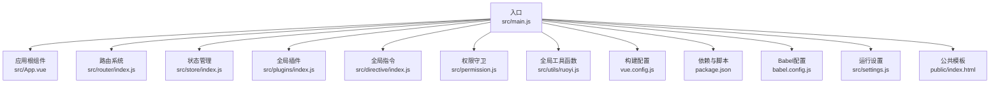
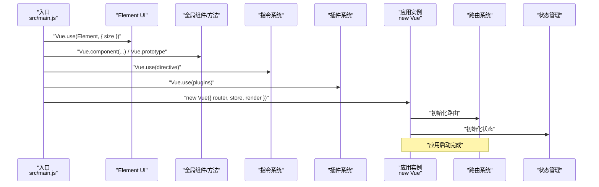
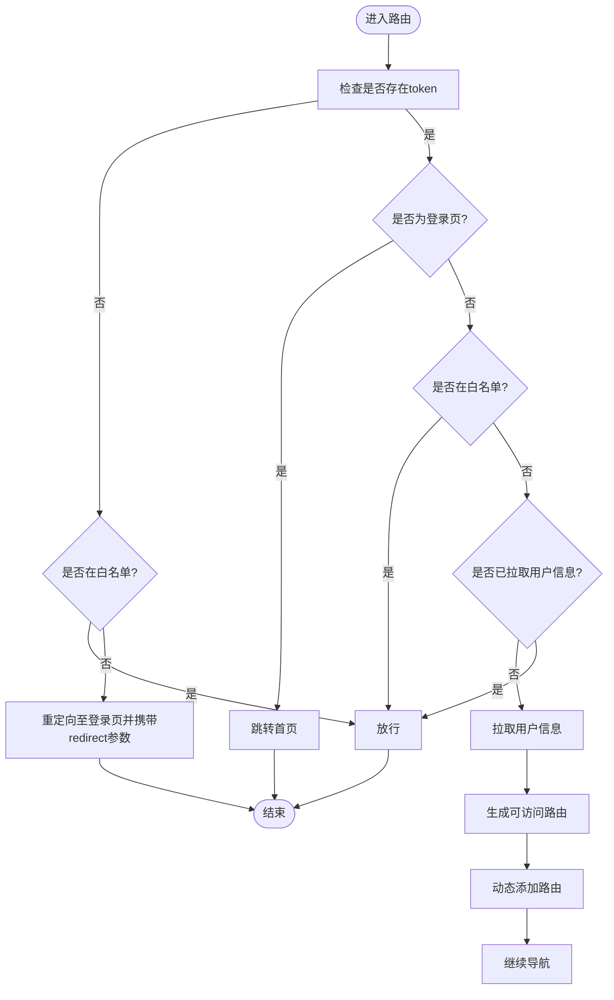
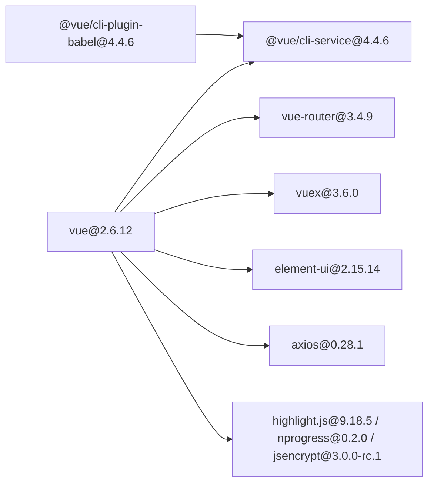

# Vue.js框架配置

<cite>
**本文引用的文件**
- [package.json](file://ruoyi-ui/package.json)
- [vue.config.js](file://ruoyi-ui/vue.config.js)
- [main.js](file://ruoyi-ui/src/main.js)
- [settings.js](file://ruoyi-ui/src/settings.js)
- [babel.config.js](file://ruoyi-ui/babel.config.js)
- [index.js](file://ruoyi-ui/src/store/index.js)
- [index.js](file://ruoyi-ui/src/router/index.js)
- [index.js](file://ruoyi-ui/src/plugins/index.js)
- [index.js](file://ruoyi-ui/src/directive/index.js)
- [App.vue](file://ruoyi-ui/src/App.vue)
- [index.js](file://ruoyi-ui/src/store/modules/app.js)
- [ruoyi.js](file://ruoyi-ui/src/utils/ruoyi.js)
- [permission.js](file://ruoyi-ui/src/permission.js)
- [index.html](file://ruoyi-ui/public/index.html)
</cite>

## 目录
1. [简介](#简介)
2. [项目结构](#项目结构)
3. [核心组件](#核心组件)
4. [架构总览](#架构总览)
5. [详细组件分析](#详细组件分析)
6. [依赖关系分析](#依赖关系分析)
7. [性能考虑](#性能考虑)
8. [故障排查指南](#故障排查指南)
9. [结论](#结论)
10. [附录](#附录)

## 简介
本文件面向Vue.js前端工程的配置与实现，围绕ruoyi-ui子项目的Vue实例初始化、全局配置、插件与指令系统、组件注册机制、全局方法挂载、生命周期管理、路由与状态管理、开发与生产环境配置、热重载与Gzip优化、以及第三方库版本兼容性进行系统化梳理，并提供最佳实践与性能优化建议。

## 项目结构
ruoyi-ui采用Vue CLI 4.x脚手架，核心入口为src/main.js，路由与状态管理分别位于src/router与src/store，全局样式、图标、权限守卫、构建配置位于src与根目录。public/index.html提供基础HTML骨架与加载动画。

图表来源
- [main.js:1-84](file://ruoyi-ui/src/main.js#L1-L84)
- [App.vue:1-21](file://ruoyi-ui/src/App.vue#L1-L21)
- [index.js:1-184](file://ruoyi-ui/src/router/index.js#L1-L184)
- [index.js:1-26](file://ruoyi-ui/src/store/index.js#L1-L26)
- [index.js:1-21](file://ruoyi-ui/src/plugins/index.js#L1-L21)
- [index.js:1-24](file://ruoyi-ui/src/directive/index.js#L1-L24)
- [permission.js:1-64](file://ruoyi-ui/src/permission.js#L1-L64)
- [vue.config.js:1-138](file://ruoyi-ui/vue.config.js#L1-L138)
- [package.json:1-74](file://ruoyi-ui/package.json#L1-L74)
- [babel.config.js:1-13](file://ruoyi-ui/babel.config.js#L1-L13)
- [settings.js:1-57](file://ruoyi-ui/src/settings.js#L1-L57)
- [index.html:1-209](file://ruoyi-ui/public/index.html#L1-L209)

章节来源
- [main.js:1-84](file://ruoyi-ui/src/main.js#L1-L84)
- [vue.config.js:1-138](file://ruoyi-ui/vue.config.js#L1-L138)
- [package.json:1-74](file://ruoyi-ui/package.json#L1-L74)

## 核心组件
- Vue实例初始化：在main.js中完成Element UI、全局组件、全局指令、全局插件、全局方法的注册，并创建Vue实例。
- 路由系统：基于vue-router，定义常量路由与动态路由，支持权限控制与历史模式。
- 状态管理：基于Vuex，模块化组织app、dict、user、tagsView、permission、settings等。
- 权限守卫：在router.beforeEach中实现登录态校验、角色权限判断与动态路由注入。
- 构建配置：通过vue.config.js统一管理别名、代理、SVG图标、Gzip压缩、分包策略与运行时优化。
- 插件系统：通过plugins/index.js向Vue原型挂载$tab、$auth、$cache、$modal、$download等工具对象。
- 指令系统：通过directive/index.js集中注册hasRole、hasPermi、clipboard、dialogDrag系列等指令。
- 全局方法：通过main.js挂载getDicts、getConfigKey、parseTime、resetForm、selectDictLabel、handleTree等常用工具。
- 设置与主题：settings.js提供标题、侧边栏主题、标签页、固定头部、Logo、动态标题等系统布局配置。

章节来源
- [main.js:1-84](file://ruoyi-ui/src/main.js#L1-L84)
- [index.js:1-184](file://ruoyi-ui/src/router/index.js#L1-L184)
- [index.js:1-26](file://ruoyi-ui/src/store/index.js#L1-L26)
- [permission.js:1-64](file://ruoyi-ui/src/permission.js#L1-L64)
- [index.js:1-21](file://ruoyi-ui/src/plugins/index.js#L1-L21)
- [index.js:1-24](file://ruoyi-ui/src/directive/index.js#L1-L24)
- [settings.js:1-57](file://ruoyi-ui/src/settings.js#L1-L57)

## 架构总览
Vue应用启动流程从main.js开始，依次完成全局配置、插件与指令注册、全局组件与方法挂载，随后创建Vue实例并挂载到DOM。路由与状态管理在应用初始化阶段即被引入，权限守卫在路由层面拦截请求，确保访问安全与动态路由注入。

图表来源
- [main.js:1-84](file://ruoyi-ui/src/main.js#L1-L84)
- [index.js:1-184](file://ruoyi-ui/src/router/index.js#L1-L184)
- [index.js:1-26](file://ruoyi-ui/src/store/index.js#L1-L26)

## 详细组件分析

### Vue实例初始化与全局配置
- Element UI集成：通过Vue.use(Element, { size: Cookie读取的size })设置全局组件尺寸。
- 全局组件：注册Pagination、RightToolbar、Editor、FileUpload、ImageUpload、ImagePreview、DictTag、DictData等。
- 全局方法：挂载字典、配置、时间格式化、表单重置、日期范围、字典回显、下载、树形数据处理等工具方法。
- 插件与指令：统一注册plugins与directive模块。
- 开发提示关闭：Vue.config.productionTip=false。
- 实例创建：通过render函数渲染App根组件，并挂载到#app。

章节来源
- [main.js:1-84](file://ruoyi-ui/src/main.js#L1-L84)

### 路由系统与权限管理
- 路由模式：history模式，去除URL中的#。
- 常量路由：包含登录、注册、404/401错误页、首页等基础路由。
- 动态路由：基于用户权限动态加载，如用户授权、角色授权、字典数据、调度日志、代码生成等。
- 路由防抖：对Router.prototype.push/replace进行封装，避免重复点击导致的路由错误。
- 权限守卫：beforeEach中实现token校验、白名单放行、用户信息拉取、动态路由注入、进度条控制。

图表来源
- [permission.js:1-64](file://ruoyi-ui/src/permission.js#L1-L64)
- [index.js:1-184](file://ruoyi-ui/src/router/index.js#L1-L184)

章节来源
- [index.js:1-184](file://ruoyi-ui/src/router/index.js#L1-L184)
- [permission.js:1-64](file://ruoyi-ui/src/permission.js#L1-L64)

### 状态管理（Vuex）
- 模块化：app、dict、user、tagsView、permission、settings等模块按功能划分。
- app模块：维护侧边栏开关、设备类型、尺寸等UI状态，并持久化到Cookie。
- getters：提供派生状态供视图使用。

章节来源
- [index.js:1-26](file://ruoyi-ui/src/store/index.js#L1-L26)
- [app.js:1-67](file://ruoyi-ui/src/store/modules/app.js#L1-L67)

### 插件系统
- 插件安装：install函数向Vue原型挂载$tab、$auth、$cache、$modal、$download等工具对象。
- 使用场景：统一的页签操作、认证对象、缓存对象、模态框对象、文件下载等。

章节来源
- [index.js:1-21](file://ruoyi-ui/src/plugins/index.js#L1-L21)

### 指令系统
- 指令注册：hasRole、hasPermi、clipboard、dialogDrag系列等指令集中注册。
- 浏览器环境兼容：在window存在Vue时导出指令并自动安装。

章节来源
- [index.js:1-24](file://ruoyi-ui/src/directive/index.js#L1-L24)

### 全局方法与工具
- 时间格式化：parseTime支持多种输入类型与自定义格式。
- 表单重置：resetForm通过ref调用Element表单resetFields。
- 日期范围：addDateRange将日期范围注入params。
- 字典回显：selectDictLabel与selectDictLabels支持单值与多值回显。
- 树形数据：handleTree将扁平数据转换为树结构。
- 参数序列化：tansParams将对象参数序列化为URL查询串。
- 其他：字符串处理、blob校验、路径规范化等。

章节来源
- [ruoyi.js:1-229](file://ruoyi-ui/src/utils/ruoyi.js#L1-L229)

### 构建与开发配置
- 路径与输出：publicPath、outputDir、assetsDir、productionSourceMap。
- 本地开发：host、port、open、proxy（后端接口与文档代理）、disableHostCheck。
- 样式：Sass配置与loaderOptions。
- Webpack增强：configureWebpack与chainWebpack中配置别名、Gzip压缩、SVG图标加载、分包策略、runtimeChunk。
- 依赖与脚本：dev、build:prod、build:stage、preview等脚本。

章节来源
- [vue.config.js:1-138](file://ruoyi-ui/vue.config.js#L1-L138)
- [package.json:1-74](file://ruoyi-ui/package.json#L1-L74)

### Babel与开发体验
- Preset：@vue/cli-plugin-babel/preset。
- 环境插件：development环境下启用dynamic-import-node以提升热更新速度。

章节来源
- [babel.config.js:1-13](file://ruoyi-ui/babel.config.js#L1-L13)

### 运行设置与主题
- settings.js：标题、侧边栏主题、顶部导航、标签页、固定头部、Logo、动态标题、版权等布局配置。

章节来源
- [settings.js:1-57](file://ruoyi-ui/src/settings.js#L1-L57)

### HTML骨架与加载动画
- public/index.html：基础HTML骨架、IE兼容跳转、全局样式、加载动画与CSS动画。

章节来源
- [index.html:1-209](file://ruoyi-ui/public/index.html#L1-L209)

## 依赖关系分析
- 版本与兼容性要点
  - Vue 2.6.12：与vue-cli-service 4.4.6配合稳定运行。
  - Element UI 2.15.14：与Vue 2兼容，需注意其对Vue 3不兼容。
  - Vue Router 3.4.9：与Vue 2匹配，history模式无问题。
  - Vuex 3.6.0：与Vue 2匹配。
  - Axios 0.28.1：HTTP客户端，注意跨域与CORS配置。
  - 第三方组件：如vue-cropper、vuedraggable、echarts、quill等，需关注与Vue 2的兼容性。
- 开发依赖：@vue/cli-service 4.4.6、babel插件等，保证构建与编译能力。
- 浏览器支持：browserslist配置为“> 1% last 2 versions”。

图表来源
- [package.json:26-63](file://ruoyi-ui/package.json#L26-L63)

章节来源
- [package.json:1-74](file://ruoyi-ui/package.json#L1-L74)

## 性能考虑
- 代码分割与分包
  - 将第三方库、Element UI、通用组件分别拆分为独立chunk，减少重复依赖。
  - runtimeChunk单独提取，提升缓存命中率。
- Gzip压缩
  - 生产环境启用compression-webpack-plugin，对JS/CSS/HTML/JPEG/PNG/SVG等进行gzip压缩。
- SVG图标
  - 使用svg-sprite-loader统一管理图标，减少HTTP请求数。
- 开发体验
  - development环境启用dynamic-import-node，显著提升热更新速度。
- 资源优化
  - 关闭生产环境source map，减小包体积。
  - 删除preload/prefetch插件，按需控制资源预加载。
- 路由与组件
  - keep-alive结合tagsView可缓存活跃路由，减少重复渲染。
  - 大组件按需加载，避免首屏阻塞。

章节来源
- [vue.config.js:61-136](file://ruoyi-ui/vue.config.js#L61-L136)
- [babel.config.js:1-13](file://ruoyi-ui/babel.config.js#L1-L13)

## 故障排查指南
- 登录后无法进入受控页面
  - 检查权限守卫逻辑与动态路由注入是否成功。
  - 确认用户信息拉取与角色权限是否正确。
- 跨域问题
  - 检查devServer.proxy配置与后端接口地址baseUrl。
- 打包体积过大
  - 检查分包策略与Gzip是否生效，确认未引入冗余依赖。
- IE兼容
  - public/index.html包含IE跳转逻辑，需确保兼容页可用。
- 热更新缓慢
  - 确认development环境已启用dynamic-import-node。

章节来源
- [permission.js:1-64](file://ruoyi-ui/src/permission.js#L1-L64)
- [vue.config.js:33-53](file://ruoyi-ui/vue.config.js#L33-L53)
- [index.html:10-10](file://ruoyi-ui/public/index.html#L10-L10)

## 结论
该Vue项目通过清晰的模块化设计与完善的构建配置，实现了稳定的开发与生产环境支持。Element UI与第三方组件的合理使用、指令与插件系统的扩展能力、路由与状态管理的安全与可维护性，共同构成了可扩展的企业级前端框架。建议持续关注Vue 2生态的兼容性与安全更新，逐步评估升级至Vue 3的可行性。

## 附录
- 最佳实践
  - 组件命名规范与目录结构保持一致。
  - 工具函数集中管理，避免重复实现。
  - 动态路由与权限模型清晰分离，便于维护。
  - 生产环境开启Gzip与分包策略，关注首屏加载。
  - 开发环境启用按需导入与热更新优化。
- 升级建议
  - Vue 2 → Vue 3：优先评估Element UI 2.x的Vue 3替代方案或迁移路径。
  - 依赖升级：遵循语义化版本，先在开发环境验证兼容性。