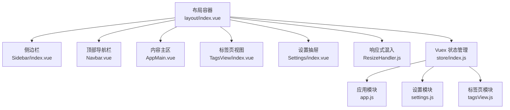
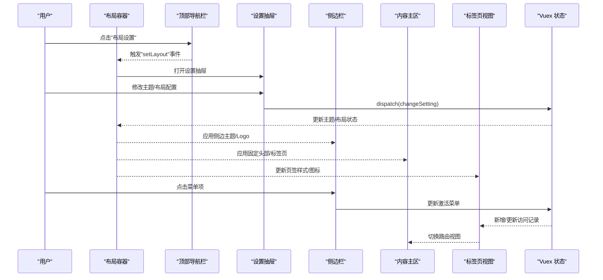
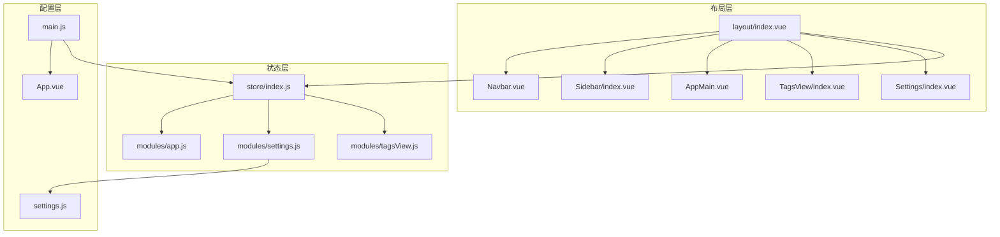

# 布局系统设计

<cite>
**本文档引用的文件**
- [ruoyi-ui/src/layout/index.vue](file://ruoyi-ui/src/layout/index.vue)
- [ruoyi-ui/src/layout/components/Sidebar/index.vue](file://ruoyi-ui/src/layout/components/Sidebar/index.vue)
- [ruoyi-ui/src/layout/components/Navbar.vue](file://ruoyi-ui/src/layout/components/Navbar.vue)
- [ruoyi-ui/src/layout/components/AppMain.vue](file://ruoyi-ui/src/layout/components/AppMain.vue)
- [ruoyi-ui/src/layout/components/TagsView/index.vue](file://ruoyi-ui/src/layout/components/TagsView/index.vue)
- [ruoyi-ui/src/layout/components/Settings/index.vue](file://ruoyi-ui/src/layout/components/Settings/index.vue)
- [ruoyi-ui/src/layout/mixin/ResizeHandler.js](file://ruoyi-ui/src/layout/mixin/ResizeHandler.js)
- [ruoyi-ui/src/store/index.js](file://ruoyi-ui/src/store/index.js)
- [ruoyi-ui/src/store/modules/app.js](file://ruoyi-ui/src/store/modules/app.js)
- [ruoyi-ui/src/store/modules/settings.js](file://ruoyi-ui/src/store/modules/settings.js)
- [ruoyi-ui/src/store/modules/tagsView.js](file://ruoyi-ui/src/store/modules/tagsView.js)
- [ruoyi-ui/src/settings.js](file://ruoyi-ui/src/settings.js)
- [ruoyi-ui/src/App.vue](file://ruoyi-ui/src/App.vue)
- [ruoyi-ui/src/main.js](file://ruoyi-ui/src/main.js)
</cite>

## 目录
1. [引言](#引言)
2. [项目结构](#项目结构)
3. [核心组件](#核心组件)
4. [架构概览](#架构概览)
5. [详细组件分析](#详细组件分析)
6. [依赖关系分析](#依赖关系分析)
7. [性能考虑](#性能考虑)
8. [故障排除指南](#故障排除指南)
9. [结论](#结论)
10. [附录](#附录)

## 引言

本文件详细阐述了基于 Vue.js 的 PC 端布局系统设计与实现。该布局系统采用经典的「主容器 + 侧边栏导航 + 顶部导航栏 + 内容区域」架构，结合标签页（TabsView）管理和响应式适配，实现了高度可定制化的后台管理系统界面。系统通过 Vuex 进行状态管理，支持主题切换、暗色模式、个性化配置等特性，并提供了完善的扩展与定制指南。

## 项目结构

布局系统位于 ruoyi-ui/src/layout 目录下，采用「按功能分层 + 组件化」的组织方式：

- 主布局容器：负责整体布局结构、设备检测、样式变量注入
- 侧边栏导航：支持折叠/展开、主题切换、Logo 展示
- 顶部导航栏：包含面包屑/顶部菜单切换、用户操作、全屏/尺寸选择等
- 标签页视图：多页签管理、右键菜单、刷新/关闭控制
- 内容主区：路由视图渲染、iframe 支持、版权信息
- 设置抽屉：主题风格、布局配置、动态标题、本地持久化
- 响应式混入：移动端自适应、窗口尺寸变化处理
- 状态管理：应用状态、设置状态、标签页状态

**图表来源**
- [ruoyi-ui/src/layout/index.vue:1-116](file://ruoyi-ui/src/layout/index.vue#L1-L116)
- [ruoyi-ui/src/layout/components/Sidebar/index.vue:1-58](file://ruoyi-ui/src/layout/components/Sidebar/index.vue#L1-L58)
- [ruoyi-ui/src/layout/components/Navbar.vue:1-198](file://ruoyi-ui/src/layout/components/Navbar.vue#L1-L198)
- [ruoyi-ui/src/layout/components/AppMain.vue:1-100](file://ruoyi-ui/src/layout/components/AppMain.vue#L1-L100)
- [ruoyi-ui/src/layout/components/TagsView/index.vue:1-338](file://ruoyi-ui/src/layout/components/TagsView/index.vue#L1-L338)
- [ruoyi-ui/src/layout/components/Settings/index.vue:1-299](file://ruoyi-ui/src/layout/components/Settings/index.vue#L1-L299)
- [ruoyi-ui/src/layout/mixin/ResizeHandler.js:1-46](file://ruoyi-ui/src/layout/mixin/ResizeHandler.js#L1-L46)
- [ruoyi-ui/src/store/index.js:1-26](file://ruoyi-ui/src/store/index.js#L1-L26)

**章节来源**
- [ruoyi-ui/src/layout/index.vue:1-116](file://ruoyi-ui/src/layout/index.vue#L1-L116)
- [ruoyi-ui/src/layout/mixin/ResizeHandler.js:1-46](file://ruoyi-ui/src/layout/mixin/ResizeHandler.js#L1-L46)
- [ruoyi-ui/src/store/index.js:1-26](file://ruoyi-ui/src/store/index.js#L1-L26)

## 核心组件

本节从架构视角概述各核心组件职责与交互关系：

- 布局容器（Layout）
  - 负责整体布局类名计算、移动端遮罩、主题变量注入、固定头部宽度计算
  - 通过 Vuex 计算属性读取主题、侧边主题、侧边栏状态、设备类型、标签页开关、固定头部开关
  - 提供打开设置抽屉的方法

- 侧边栏（Sidebar）
  - 基于 Element UI Menu 实现，支持垂直菜单、折叠状态、唯一展开、激活项高亮
  - 根据侧边主题动态设置背景色、文字色、激活色
  - 支持 Logo 展示与菜单项递归渲染

- 顶部导航栏（Navbar）
  - 包含汉堡菜单、面包屑或顶部菜单切换、搜索、全屏、尺寸选择
  - 用户下拉菜单提供「个人中心」「布局设置」「退出登录」
  - 通过事件向上抛出「setLayout」以打开设置抽屉

- 内容主区（AppMain）
  - 使用过渡动画与 keep-alive 缓存路由组件
  - 支持 iframe 视图注册与版权信息展示
  - 根据是否启用固定头部调整滚动区域高度

- 标签页视图（TagsView）
  - 多页签渲染、右键上下文菜单、刷新/关闭控制
  - 支持固定页签（affix）、图标显示、滚动定位
  - 与标签页模块协作维护 visitedViews、cachedViews、iframeViews

- 设置抽屉（Settings）
  - 主题风格（明/暗）、主题色选择、布局配置（TopNav、TagsView、FixedHeader、SidebarLogo、DynamicTitle、Footer）
  - 支持保存到本地存储与重置
  - 通过 Vuex 动态修改设置并同步到本地缓存

**章节来源**
- [ruoyi-ui/src/layout/index.vue:16-61](file://ruoyi-ui/src/layout/index.vue#L16-L61)
- [ruoyi-ui/src/layout/components/Sidebar/index.vue:26-56](file://ruoyi-ui/src/layout/components/Sidebar/index.vue#L26-L56)
- [ruoyi-ui/src/layout/components/Navbar.vue:42-97](file://ruoyi-ui/src/layout/components/Navbar.vue#L42-L97)
- [ruoyi-ui/src/layout/components/AppMain.vue:13-44](file://ruoyi-ui/src/layout/components/AppMain.vue#L13-L44)
- [ruoyi-ui/src/layout/components/TagsView/index.vue:32-237](file://ruoyi-ui/src/layout/components/TagsView/index.vue#L32-L237)
- [ruoyi-ui/src/layout/components/Settings/index.vue:86-228](file://ruoyi-ui/src/layout/components/Settings/index.vue#L86-L228)

## 架构概览

布局系统采用「容器组件 + 多功能子组件 + 状态管理」的分层架构，配合响应式混入实现跨设备适配。整体交互流程如下：

**图表来源**
- [ruoyi-ui/src/layout/components/Navbar.vue:78-84](file://ruoyi-ui/src/layout/components/Navbar.vue#L78-L84)
- [ruoyi-ui/src/layout/index.vue:53-60](file://ruoyi-ui/src/layout/index.vue#L53-L60)
- [ruoyi-ui/src/layout/components/Settings/index.vue:183-227](file://ruoyi-ui/src/layout/components/Settings/index.vue#L183-L227)
- [ruoyi-ui/src/store/modules/settings.js:29-38](file://ruoyi-ui/src/store/modules/settings.js#L29-L38)

## 详细组件分析

### 布局容器（Layout）

- 结构与样式
  - 通过 classObj 计算器根据侧边栏展开/收起、是否无动画、设备类型生成类名
  - 固定头部宽度随侧边栏状态与隐藏状态动态调整
  - 移动端点击遮罩关闭侧边栏
  - 注入 CSS 变量 --current-color 用于主题色传递

- 响应式与设备检测
  - 依赖 ResizeHandler 混入监听窗口尺寸变化
  - 在路由切换时自动关闭移动端侧边栏
  - 初始化时判断移动端并设置设备类型

- 与设置抽屉通信
  - 通过事件回调打开设置抽屉，实现「布局设置」入口

**章节来源**
- [ruoyi-ui/src/layout/index.vue:32-60](file://ruoyi-ui/src/layout/index.vue#L32-L60)
- [ruoyi-ui/src/layout/mixin/ResizeHandler.js:6-44](file://ruoyi-ui/src/layout/mixin/ResizeHandler.js#L6-L44)

### 侧边栏导航（Sidebar）

- 菜单渲染
  - 基于 sidebarRouters 与 SidebarItem 递归渲染菜单树
  - 支持菜单激活高亮（优先使用 route.meta.activeMenu，否则使用当前路径）
  - 折叠状态下禁用过渡动画，保持视觉一致性

- 主题与样式
  - 根据 sideTheme 切换菜单背景色与文字色
  - 激活项文字色使用全局主题色
  - Logo 展示由 settings.sidebarLogo 控制

- 与状态管理
  - 通过 mapState/mapGetters 读取 settings、sidebarRouters、sidebar
  - isCollapse 基于 sidebar.opened 取反

**章节来源**
- [ruoyi-ui/src/layout/components/Sidebar/index.vue:26-56](file://ruoyi-ui/src/layout/components/Sidebar/index.vue#L26-L56)

### 顶部导航栏（Navbar）

- 功能组件
  - 面包屑与顶部菜单二选一（由 settings.topNav 控制）
  - 搜索、全屏、尺寸选择在非移动端显示
  - 用户头像与昵称、下拉菜单（个人中心、布局设置、退出登录）

- 事件与动作
  - toggleSideBar：切换侧边栏
  - setLayout：向上抛出事件以打开设置抽屉
  - logout：确认对话框后调用登出动作并跳转首页

**章节来源**
- [ruoyi-ui/src/layout/components/Navbar.vue:42-97](file://ruoyi-ui/src/layout/components/Navbar.vue#L42-L97)

### 内容主区（AppMain）

- 视图渲染
  - 使用 transition + keep-alive 缓存路由组件，避免重复渲染
  - 支持通过 route.meta.link 注册 iframe 视图

- 高度与滚动
  - 根据是否启用固定头部与标签页决定最小高度与滚动区域
  - 固定头部时内容区高度为 100vh 减去头部高度

**章节来源**
- [ruoyi-ui/src/layout/components/AppMain.vue:13-44](file://ruoyi-ui/src/layout/components/AppMain.vue#L13-L44)

### 标签页视图（TagsView）

- 页签管理
  - visitedViews：已访问路由集合
  - cachedViews：需要缓存的组件名称集合
  - iframeViews：iframe 视图集合

- 交互能力
  - 中键关闭、右键菜单（刷新、关闭当前、关闭其他、关闭左右侧、全部关闭）
  - 自动滚动到当前页签，支持不同 query 的更新
  - 固定页签（affix）不可关闭，作为系统常驻页签

- 与状态管理
  - 通过 tagsView 模块维护页签状态
  - 与 AppMain 协作实现 iframe 视图注册

**章节来源**
- [ruoyi-ui/src/layout/components/TagsView/index.vue:32-237](file://ruoyi-ui/src/layout/components/TagsView/index.vue#L32-L237)
- [ruoyi-ui/src/store/modules/tagsView.js:1-229](file://ruoyi-ui/src/store/modules/tagsView.js#L1-L229)

### 设置抽屉（Settings）

- 主题与布局配置
  - 主题风格：明/暗主题切换
  - 主题色：通过 ThemePicker 选择并写入 Vuex
  - 布局选项：TopNav、TagsView、TagsIcon、FixedHeader、SidebarLogo、DynamicTitle、Footer
  - 动态标题：结合 useDynamicTitle 实现页面标题联动

- 本地持久化
  - 保存到 localStorage，键名为 layout-setting
  - 重置时清除缓存并刷新页面

**章节来源**
- [ruoyi-ui/src/layout/components/Settings/index.vue:86-228](file://ruoyi-ui/src/layout/components/Settings/index.vue#L86-L228)
- [ruoyi-ui/src/store/modules/settings.js:29-38](file://ruoyi-ui/src/store/modules/settings.js#L29-L38)

### 响应式混入（ResizeHandler）

- 设备检测
  - 宽度阈值参考 Bootstrap 响应式设计，小于阈值判定为移动端
  - 初始化时根据设备类型设置侧边栏状态与尺寸

- 窗口变化处理
  - 监听 resize 事件，动态切换设备类型并关闭移动端侧边栏
  - 避免页面隐藏时的无效计算

**章节来源**
- [ruoyi-ui/src/layout/mixin/ResizeHandler.js:1-46](file://ruoyi-ui/src/layout/mixin/ResizeHandler.js#L1-L46)

### 状态管理（Vuex）

- 模块划分
  - app：侧边栏状态、设备类型、尺寸
  - settings：主题、侧边主题、布局配置、动态标题、版权信息
  - tagsView：访问记录、缓存列表、iframe 视图

- 默认配置
  - settings.js 从 settings.js 默认值与本地缓存中合并初始状态
  - 支持运行时修改并通过 CHANGE_SETTING 动作更新

**章节来源**
- [ruoyi-ui/src/store/index.js:1-26](file://ruoyi-ui/src/store/index.js#L1-L26)
- [ruoyi-ui/src/store/modules/app.js:1-67](file://ruoyi-ui/src/store/modules/app.js#L1-L67)
- [ruoyi-ui/src/store/modules/settings.js:1-48](file://ruoyi-ui/src/store/modules/settings.js#L1-L48)
- [ruoyi-ui/src/store/modules/tagsView.js:1-229](file://ruoyi-ui/src/store/modules/tagsView.js#L1-L229)
- [ruoyi-ui/src/settings.js:1-57](file://ruoyi-ui/src/settings.js#L1-L57)

## 依赖关系分析

布局系统的核心依赖关系如下：

**图表来源**
- [ruoyi-ui/src/layout/index.vue:16-30](file://ruoyi-ui/src/layout/index.vue#L16-L30)
- [ruoyi-ui/src/store/index.js:3-21](file://ruoyi-ui/src/store/index.js#L3-L21)
- [ruoyi-ui/src/settings.js:1-57](file://ruoyi-ui/src/settings.js#L1-L57)
- [ruoyi-ui/src/main.js:10-18](file://ruoyi-ui/src/main.js#L10-L18)
- [ruoyi-ui/src/App.vue:1-21](file://ruoyi-ui/src/App.vue#L1-L21)

**章节来源**
- [ruoyi-ui/src/layout/index.vue:16-30](file://ruoyi-ui/src/layout/index.vue#L16-L30)
- [ruoyi-ui/src/store/index.js:3-21](file://ruoyi-ui/src/store/index.js#L3-L21)

## 性能考虑

- 组件缓存
  - AppMain 使用 keep-alive 缓存路由组件，减少重复渲染成本
  - 标签页模块维护 cachedViews，避免频繁加载

- 滚动优化
  - 固定头部时将内容区设为滚动容器，提升滚动性能
  - 标签页滚动采用局部滚动面板，避免全局滚动条冲突

- 响应式处理
  - ResizeHandler 在页面隐藏时不进行计算，降低无效开销
  - 移动端侧边栏折叠时禁用过渡动画，减少渲染压力

- 主题与样式
  - 通过 CSS 变量传递主题色，避免频繁样式重排
  - 侧边栏主题切换仅影响菜单背景与文字色，不触发大范围重绘

[本节为通用性能建议，无需特定文件引用]

## 故障排除指南

- 侧边栏无法关闭
  - 检查 app 模块中的 sidebar.hide 状态是否被意外置为 true
  - 确认 ResizeHandler 是否在移动端正确关闭侧边栏

- 标签页不显示或异常
  - 确认 route.name 是否存在，未命名路由不会加入标签页
  - 检查 tagsView 模块中 cachedViews 是否包含对应组件名

- 设置抽屉不生效
  - 检查 settings 模块 CHANGE_SETTING 是否被正确触发
  - 确认本地缓存键名 layout-setting 是否存在且格式正确

- 主题色不生效
  - 确认 --current-color CSS 变量是否注入到根节点
  - 检查 ThemePicker 的颜色值是否写入 settings.theme

**章节来源**
- [ruoyi-ui/src/store/modules/app.js:13-40](file://ruoyi-ui/src/store/modules/app.js#L13-L40)
- [ruoyi-ui/src/store/modules/tagsView.js:120-221](file://ruoyi-ui/src/store/modules/tagsView.js#L120-L221)
- [ruoyi-ui/src/layout/components/Settings/index.vue:183-227](file://ruoyi-ui/src/layout/components/Settings/index.vue#L183-L227)

## 结论

该布局系统通过清晰的组件边界、完善的 Vuex 状态管理与响应式适配机制，构建了一个可扩展、可定制的 PC 端后台管理界面。其核心优势在于：

- 模块化设计：各组件职责明确，便于独立维护与扩展
- 状态集中：统一通过 Vuex 管理布局与主题状态，保证一致性
- 交互完善：标签页、设置抽屉、响应式适配覆盖主流使用场景
- 易于定制：提供丰富的配置项与主题切换能力，满足个性化需求

## 附录

### 布局组件通信机制

- 父子组件通信
  - Layout 与 Navbar：通过事件回调（setLayout）实现父向子触发
  - Sidebar 与 Settings：通过 Vuex 状态驱动样式与行为变更

- 事件总线
  - Navbar 向上抛出「setLayout」事件，Layout 监听并打开设置抽屉

- Vuex 状态共享
  - app：设备类型、侧边栏状态、尺寸
  - settings：主题、布局配置、动态标题、版权信息
  - tagsView：访问记录、缓存列表、iframe 视图

**章节来源**
- [ruoyi-ui/src/layout/components/Navbar.vue:50-84](file://ruoyi-ui/src/layout/components/Navbar.vue#L50-L84)
- [ruoyi-ui/src/layout/index.vue:53-60](file://ruoyi-ui/src/layout/index.vue#L53-L60)
- [ruoyi-ui/src/store/index.js:3-21](file://ruoyi-ui/src/store/index.js#L3-L21)

### 响应式设计实现

- 屏幕适配
  - 以 992px 为阈值区分移动端与桌面端
  - 移动端自动关闭侧边栏并启用遮罩层

- 菜单折叠
  - 通过 sidebar.opened 控制菜单折叠状态
  - 折叠时禁用过渡动画，提升交互流畅度

- 标签页管理
  - 标签页滚动面板支持左右滚动，右键菜单提供批量关闭能力
  - 固定页签（affix）不可关闭，确保关键页面稳定访问

**章节来源**
- [ruoyi-ui/src/layout/mixin/ResizeHandler.js:3-44](file://ruoyi-ui/src/layout/mixin/ResizeHandler.js#L3-L44)
- [ruoyi-ui/src/layout/components/TagsView/index.vue:213-236](file://ruoyi-ui/src/layout/components/TagsView/index.vue#L213-L236)

### 布局样式定制化

- 主题切换
  - 支持明/暗两种侧边主题，菜单背景与文字色随主题切换
  - 主题色通过 CSS 变量传递，支持动态修改

- 暗色模式
  - sideTheme 为 'theme-dark' 时启用深色菜单样式
  - 与全局主题色协同工作，保持视觉一致性

- 个性化配置
  - 通过 Settings 抽屉配置 TopNav、TagsView、FixedHeader、SidebarLogo、DynamicTitle、Footer 等
  - 配置项持久化到本地存储，刷新后仍保持

**章节来源**
- [ruoyi-ui/src/layout/components/Sidebar/index.vue:2-23](file://ruoyi-ui/src/layout/components/Sidebar/index.vue#L2-L23)
- [ruoyi-ui/src/layout/components/Settings/index.vue:183-227](file://ruoyi-ui/src/layout/components/Settings/index.vue#L183-L227)
- [ruoyi-ui/src/store/modules/settings.js:6-20](file://ruoyi-ui/src/store/modules/settings.js#L6-L20)

### 布局组件扩展与定制指南

- 新增侧边栏菜单
  - 在权限路由中添加新路由项，确保包含 meta 字段（title、icon、affix 等）
  - Sidebar 将自动递归渲染新增菜单

- 自定义标签页行为
  - 通过 route.meta.noCache 控制是否缓存组件
  - 通过 route.meta.link 控制是否注册 iframe 视图

- 扩展设置项
  - 在 settings.js 默认配置中添加新字段
  - 在 Settings 组件中添加对应的开关与绑定逻辑
  - 在 settings 模块中处理 CHANGE_SETTING 动作

- 响应式适配
  - 如需调整移动端阈值，修改 ResizeHandler 中的 WIDTH 常量
  - 根据业务需要调整移动端交互策略（如强制隐藏侧边栏）

**章节来源**
- [ruoyi-ui/src/layout/components/Sidebar/index.vue:15-21](file://ruoyi-ui/src/layout/components/Sidebar/index.vue#L15-L21)
- [ruoyi-ui/src/layout/components/TagsView/index.vue:136-141](file://ruoyi-ui/src/layout/components/TagsView/index.vue#L136-L141)
- [ruoyi-ui/src/layout/components/Settings/index.vue:100-182](file://ruoyi-ui/src/layout/components/Settings/index.vue#L100-L182)
- [ruoyi-ui/src/layout/mixin/ResizeHandler.js:4-33](file://ruoyi-ui/src/layout/mixin/ResizeHandler.js#L4-L33)