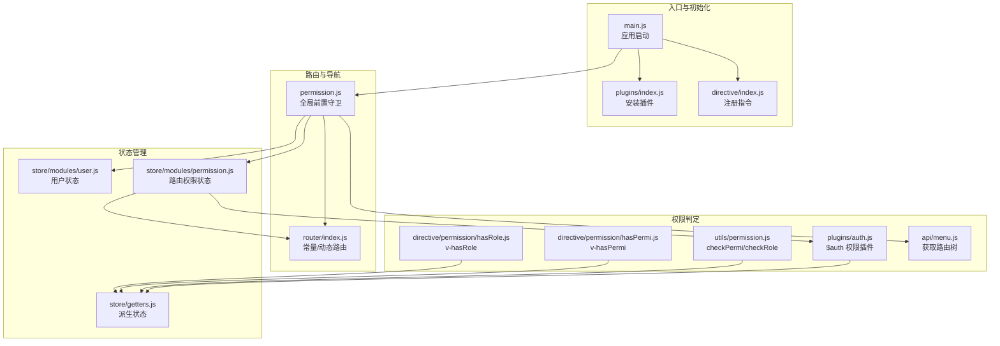
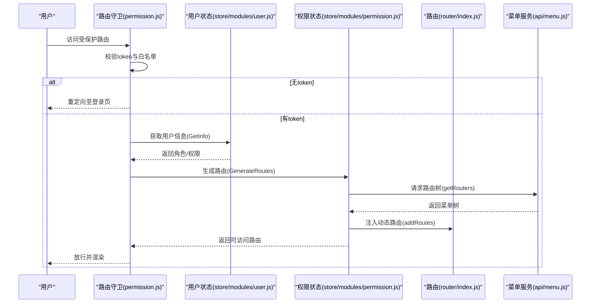
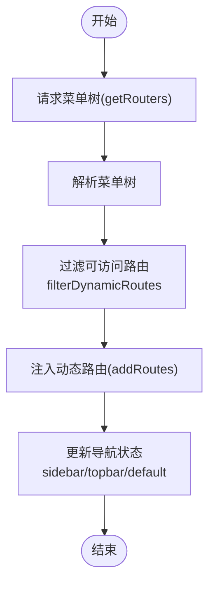
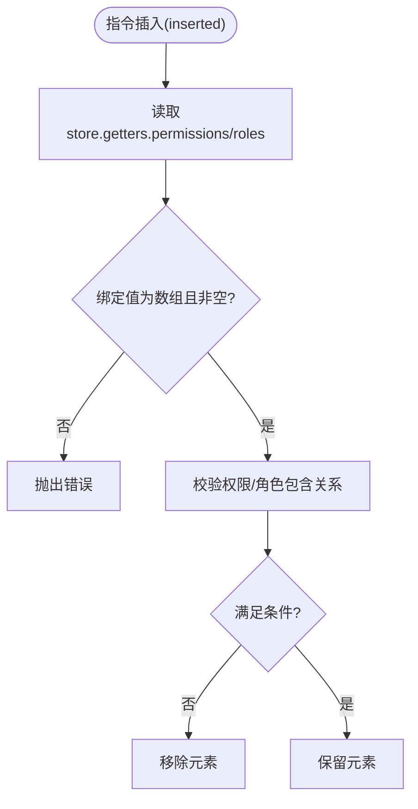
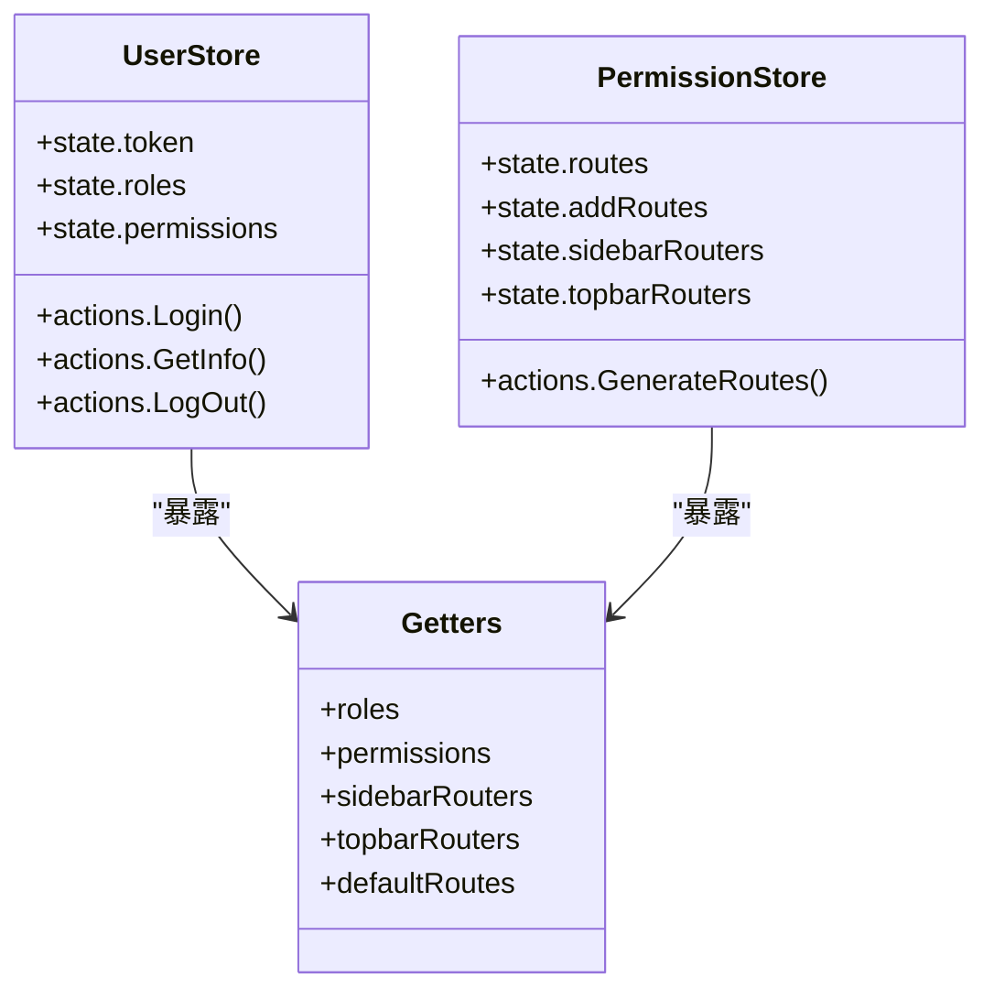
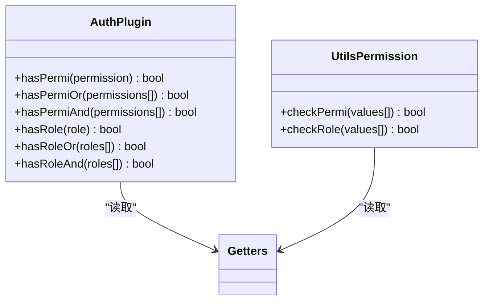
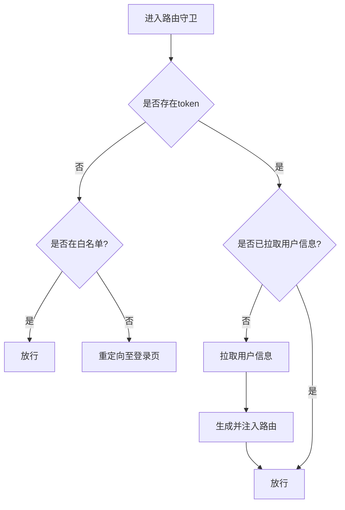
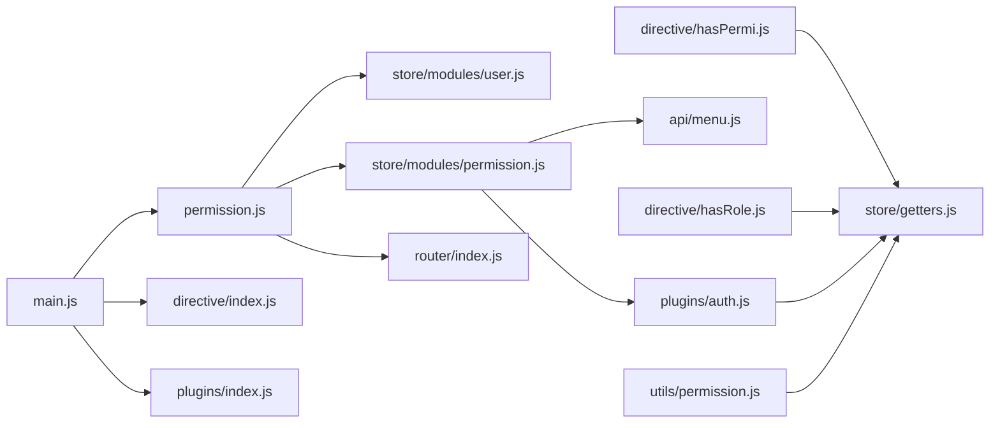

# 权限控制系统

<cite>
**本文引用的文件**
- [permission.js](file://ruoyi-ui/src/permission.js)
- [router/index.js](file://ruoyi-ui/src/router/index.js)
- [store/modules/permission.js](file://ruoyi-ui/src/store/modules/permission.js)
- [store/modules/user.js](file://ruoyi-ui/src/store/modules/user.js)
- [store/getters.js](file://ruoyi-ui/src/store/getters.js)
- [plugins/auth.js](file://ruoyi-ui/src/plugins/auth.js)
- [utils/permission.js](file://ruoyi-ui/src/utils/permission.js)
- [directive/permission/hasPermi.js](file://ruoyi-ui/src/directive/permission/hasPermi.js)
- [directive/permission/hasRole.js](file://ruoyi-ui/src/directive/permission/hasRole.js)
- [directive/index.js](file://ruoyi-ui/src/directive/index.js)
- [api/menu.js](file://ruoyi-ui/src/api/menu.js)
- [main.js](file://ruoyi-ui/src/main.js)
- [plugins/index.js](file://ruoyi-ui/src/plugins/index.js)
</cite>

## 目录
1. [简介](#简介)
2. [项目结构](#项目结构)
3. [核心组件](#核心组件)
4. [架构总览](#架构总览)
5. [详细组件分析](#详细组件分析)
6. [依赖关系分析](#依赖关系分析)
7. [性能考虑](#性能考虑)
8. [故障排查指南](#故障排查指南)
9. [结论](#结论)
10. [附录](#附录)

## 简介
本文件系统性梳理前端权限控制体系，覆盖路由权限、按钮权限与数据权限的多层机制；阐述权限状态管理（用户信息、角色权限、菜单权限、操作权限）的数据结构与流转；详解自定义指令 hasPermi、hasRole 的实现与用法；说明权限路由的动态加载流程（菜单生成、路由配置、权限验证）；并给出最佳实践与安全建议。

## 项目结构
权限控制相关代码主要集中在 ruoyi-ui 前端工程中，采用“路由 + 状态 + 指令 + 插件”的分层设计：
- 路由层：定义公共路由与动态路由模板，结合后端返回的菜单树进行动态组装
- 状态层：通过 Vuex 管理用户信息、角色与权限集合，以及最终可访问的路由集合
- 指令层：提供 v-hasPermi、v-hasRole 等指令，用于页面元素级的按钮/功能显隐
- 插件层：提供 $auth 对象，封装权限/角色的便捷判断方法
- 控制层：全局前置守卫负责登录态校验、用户信息拉取与动态路由注入

图表来源
- [main.js:1-84](file://ruoyi-ui/src/main.js#L1-L84)
- [plugins/index.js:1-21](file://ruoyi-ui/src/plugins/index.js#L1-L21)
- [directive/index.js:1-24](file://ruoyi-ui/src/directive/index.js#L1-L24)
- [permission.js:1-64](file://ruoyi-ui/src/permission.js#L1-L64)
- [router/index.js:1-184](file://ruoyi-ui/src/router/index.js#L1-L184)
- [store/modules/user.js:1-126](file://ruoyi-ui/src/store/modules/user.js#L1-L126)
- [store/getters.js:1-22](file://ruoyi-ui/src/store/getters.js#L1-L22)
- [store/modules/permission.js:1-123](file://ruoyi-ui/src/store/modules/permission.js#L1-L123)
- [plugins/auth.js:1-61](file://ruoyi-ui/src/plugins/auth.js#L1-L61)
- [utils/permission.js:1-47](file://ruoyi-ui/src/utils/permission.js#L1-L47)
- [directive/permission/hasPermi.js:1-29](file://ruoyi-ui/src/directive/permission/hasPermi.js#L1-L29)
- [directive/permission/hasRole.js:1-29](file://ruoyi-ui/src/directive/permission/hasRole.js#L1-L29)
- [api/menu.js:1-9](file://ruoyi-ui/src/api/menu.js#L1-L9)

章节来源
- [main.js:1-84](file://ruoyi-ui/src/main.js#L1-L84)
- [router/index.js:1-184](file://ruoyi-ui/src/router/index.js#L1-L184)

## 核心组件
- 用户状态模块：负责登录、获取用户信息（含角色与权限）、登出等，维护 token、角色列表、权限列表等
- 权限状态模块：负责根据后端返回的菜单树过滤生成可访问路由，维护最终路由集合与侧边/顶部导航数据
- 权限插件：提供 $auth 对象，封装 hasPermi/hasRole 等方法，支持或/且逻辑组合
- 工具函数：提供 checkPermi/checkRole 方法，供业务代码调用
- 自定义指令：提供 v-hasPermi、v-hasRole 指令，用于页面元素级权限控制
- 全局前置守卫：统一处理登录态、用户信息拉取、动态路由注入

章节来源
- [store/modules/user.js:1-126](file://ruoyi-ui/src/store/modules/user.js#L1-L126)
- [store/modules/permission.js:1-123](file://ruoyi-ui/src/store/modules/permission.js#L1-L123)
- [plugins/auth.js:1-61](file://ruoyi-ui/src/plugins/auth.js#L1-L61)
- [utils/permission.js:1-47](file://ruoyi-ui/src/utils/permission.js#L1-L47)
- [directive/permission/hasPermi.js:1-29](file://ruoyi-ui/src/directive/permission/hasPermi.js#L1-L29)
- [directive/permission/hasRole.js:1-29](file://ruoyi-ui/src/directive/permission/hasRole.js#L1-L29)
- [permission.js:1-64](file://ruoyi-ui/src/permission.js#L1-L64)

## 架构总览
权限控制采用“后端菜单树 + 前端动态路由 + 指令/插件/工具函数”的组合：
- 登录成功后，前端保存 token 并在首次访问受保护路由时拉取用户信息
- 拉取用户信息后，前端向后端请求路由树，按权限过滤生成可访问路由
- 将可访问路由注入到路由表，同时更新侧边/顶部导航数据
- 页面通过 $auth 或 v-hasPermi/v-hasRole 指令进行按钮级权限控制

图表来源
- [permission.js:18-58](file://ruoyi-ui/src/permission.js#L18-L58)
- [store/modules/user.js:62-96](file://ruoyi-ui/src/store/modules/user.js#L62-L96)
- [store/modules/permission.js:33-51](file://ruoyi-ui/src/store/modules/permission.js#L33-L51)
- [router/index.js:32-165](file://ruoyi-ui/src/router/index.js#L32-L165)
- [api/menu.js:4-9](file://ruoyi-ui/src/api/menu.js#L4-L9)

## 详细组件分析

### 路由权限与动态加载
- 常量路由：登录、404、首页等公共路由
- 动态路由：以模板形式定义，包含权限标识与组件映射
- 菜单树到路由的转换：后端返回菜单树，前端过滤组装为可访问路由
- 权限过滤：对动态路由进行 hasPermiOr/hasRoleOr 过滤
- 路由注入：addRoutes 动态注入，同时更新侧边/顶部导航

图表来源
- [store/modules/permission.js:33-51](file://ruoyi-ui/src/store/modules/permission.js#L33-L51)
- [store/modules/permission.js:97-111](file://ruoyi-ui/src/store/modules/permission.js#L97-L111)
- [router/index.js:32-165](file://ruoyi-ui/src/router/index.js#L32-L165)

章节来源
- [store/modules/permission.js:1-123](file://ruoyi-ui/src/store/modules/permission.js#L1-L123)
- [router/index.js:1-184](file://ruoyi-ui/src/router/index.js#L1-L184)
- [api/menu.js:1-9](file://ruoyi-ui/src/api/menu.js#L1-L9)

### 按钮权限与指令实现
- v-hasPermi：在 inserted 生命周期内读取当前用户权限，若不满足则移除DOM节点
- v-hasRole：同上，但针对角色集合
- 两者均要求绑定值为数组，否则抛出错误
- 与 $auth.hasPermi/hasRole 配合，实现页面级与组件级的权限控制

图表来源
- [directive/permission/hasPermi.js:9-28](file://ruoyi-ui/src/directive/permission/hasPermi.js#L9-L28)
- [directive/permission/hasRole.js:9-28](file://ruoyi-ui/src/directive/permission/hasRole.js#L9-L28)
- [store/getters.js:14-15](file://ruoyi-ui/src/store/getters.js#L14-L15)

章节来源
- [directive/permission/hasPermi.js:1-29](file://ruoyi-ui/src/directive/permission/hasPermi.js#L1-L29)
- [directive/permission/hasRole.js:1-29](file://ruoyi-ui/src/directive/permission/hasRole.js#L1-L29)
- [directive/index.js:1-24](file://ruoyi-ui/src/directive/index.js#L1-L24)

### 权限状态管理
- 用户状态：token、id、name、nickName、avatar、roles、permissions
- 权限状态：routes、addRoutes、defaultRoutes、topbarRouters、sidebarRouters
- 派生状态：通过 getters 暴露 roles、permissions、导航数据等

图表来源
- [store/modules/user.js:9-126](file://ruoyi-ui/src/store/modules/user.js#L9-L126)
- [store/modules/permission.js:9-52](file://ruoyi-ui/src/store/modules/permission.js#L9-L52)
- [store/getters.js:1-22](file://ruoyi-ui/src/store/getters.js#L1-L22)

章节来源
- [store/modules/user.js:1-126](file://ruoyi-ui/src/store/modules/user.js#L1-L126)
- [store/modules/permission.js:1-123](file://ruoyi-ui/src/store/modules/permission.js#L1-L123)
- [store/getters.js:1-22](file://ruoyi-ui/src/store/getters.js#L1-L22)

### 权限插件与工具函数
- $auth 对象：hasPermi、hasPermiOr、hasPermiAnd、hasRole、hasRoleOr、hasRoleAnd
- 工具函数：checkPermi、checkRole，用于业务代码中的权限判断
- 两者均基于 store.getters.roles 与 store.getters.permissions 进行判断

图表来源
- [plugins/auth.js:27-60](file://ruoyi-ui/src/plugins/auth.js#L27-L60)
- [utils/permission.js:8-46](file://ruoyi-ui/src/utils/permission.js#L8-L46)
- [store/getters.js:14-15](file://ruoyi-ui/src/store/getters.js#L14-L15)

章节来源
- [plugins/auth.js:1-61](file://ruoyi-ui/src/plugins/auth.js#L1-L61)
- [utils/permission.js:1-47](file://ruoyi-ui/src/utils/permission.js#L1-L47)
- [plugins/index.js:1-21](file://ruoyi-ui/src/plugins/index.js#L1-L21)

### 全局前置守卫与导航控制
- 白名单：登录、注册等无需登录即可访问
- 登录态：存在 token 时才允许访问受保护路由
- 首次访问：拉取用户信息后，生成可访问路由并注入
- 未登录：重定向至登录页并携带 redirect 参数

图表来源
- [permission.js:18-58](file://ruoyi-ui/src/permission.js#L18-L58)

章节来源
- [permission.js:1-64](file://ruoyi-ui/src/permission.js#L1-L64)

## 依赖关系分析
- main.js 安装插件与指令，并引入全局权限控制入口
- permission.js 依赖 store 与 router，负责导航拦截与路由注入
- store/modules/permission.js 依赖 plugins/auth.js 与 api/menu.js
- 指令依赖 store/getters.js 提供的权限/角色集合
- $auth 插件依赖 getters 提供的权限/角色集合

图表来源
- [main.js:13-19](file://ruoyi-ui/src/main.js#L13-L19)
- [permission.js:1-10](file://ruoyi-ui/src/permission.js#L1-L10)
- [store/modules/permission.js:1-6](file://ruoyi-ui/src/store/modules/permission.js#L1-L6)
- [directive/permission/hasPermi.js:6](file://ruoyi-ui/src/directive/permission/hasPermi.js#L6)
- [directive/permission/hasRole.js:6](file://ruoyi-ui/src/directive/permission/hasRole.js#L6)
- [plugins/auth.js:1-2](file://ruoyi-ui/src/plugins/auth.js#L1-L2)
- [store/getters.js:1-22](file://ruoyi-ui/src/store/getters.js#L1-L22)

章节来源
- [main.js:1-84](file://ruoyi-ui/src/main.js#L1-L84)
- [store/modules/permission.js:1-123](file://ruoyi-ui/src/store/modules/permission.js#L1-L123)

## 性能考虑
- 路由懒加载：生产环境使用 import 实现按需加载，减少首屏体积
- 权限判断缓存：$auth 与工具函数基于 store.getters，避免重复计算
- 动态路由注入时机：仅在首次拉取用户信息后注入一次，后续复用
- 指令移除 DOM：v-hasPermi/v-hasRole 在不满足条件时直接移除元素，避免无效渲染

## 故障排查指南
- 指令报错“请设置操作权限标签值”或“请设置角色权限标签值”
  - 检查 v-hasPermi/v-hasRole 绑定值是否为数组且非空
  - 参考：[hasPermi.js:24-26](file://ruoyi-ui/src/directive/permission/hasPermi.js#L24-L26)、[hasRole.js:24-26](file://ruoyi-ui/src/directive/permission/hasRole.js#L24-L26)
- 页面按钮不显示或显示异常
  - 确认用户权限/角色集合是否正确写入 store
  - 检查 $auth.hasPermi/hasRole 的调用方式与权限字符串是否一致
  - 参考：[$auth 对象:27-60](file://ruoyi-ui/src/plugins/auth.js#L27-L60)、[store/getters.js:14-15](file://ruoyi-ui/src/store/getters.js#L14-L15)
- 登录后无法进入受保护路由
  - 检查 token 是否存在与白名单匹配
  - 确认首次访问时是否成功拉取用户信息并生成路由
  - 参考：[permission.js:18-58](file://ruoyi-ui/src/permission.js#L18-L58)
- 动态路由未生效
  - 检查后端菜单树返回结构与前端过滤逻辑
  - 确认 filterDynamicRoutes 中的权限/角色字段与 $auth 判断一致
  - 参考：[store/modules/permission.js:97-111](file://ruoyi-ui/src/store/modules/permission.js#L97-L111)

章节来源
- [directive/permission/hasPermi.js:1-29](file://ruoyi-ui/src/directive/permission/hasPermi.js#L1-L29)
- [directive/permission/hasRole.js:1-29](file://ruoyi-ui/src/directive/permission/hasRole.js#L1-L29)
- [plugins/auth.js:1-61](file://ruoyi-ui/src/plugins/auth.js#L1-L61)
- [store/getters.js:1-22](file://ruoyi-ui/src/store/getters.js#L1-L22)
- [permission.js:1-64](file://ruoyi-ui/src/permission.js#L1-L64)
- [store/modules/permission.js:97-111](file://ruoyi-ui/src/store/modules/permission.js#L97-L111)

## 结论
该权限控制系统通过“后端菜单树 + 前端动态路由 + 指令/插件/工具函数”的组合，实现了从路由到按钮再到数据的多层级权限控制。其核心优势在于：
- 路由层面：基于权限标识动态注入，确保导航与访问边界清晰
- 指令层面：v-hasPermi/v-hasRole 提供声明式权限控制，降低样板代码
- 状态层面：统一的用户与权限状态管理，便于扩展与维护
建议在实际项目中结合业务场景完善权限字符串规范、指令使用约束与路由模板设计，持续提升安全性与可维护性。

## 附录
- 最佳实践
  - 权限字符串命名规范：建议采用“模块:功能:操作”的三层结构，如 system:user:add
  - 指令使用：优先使用 v-hasPermi/v-hasRole，避免在组件中重复编写权限判断
  - 动态路由模板：将权限标识与组件映射集中管理，便于维护
  - 安全建议：后端同样需要进行权限校验，前端仅作为 UI 层辅助
- 安全建议
  - 不要将敏感权限信息存储在客户端本地
  - 对关键操作增加二次确认与审计日志
  - 定期审查权限字符串与路由模板，避免权限漂移