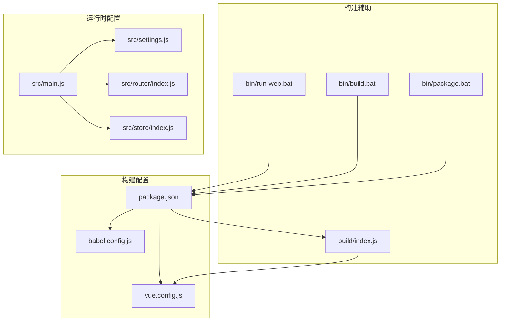
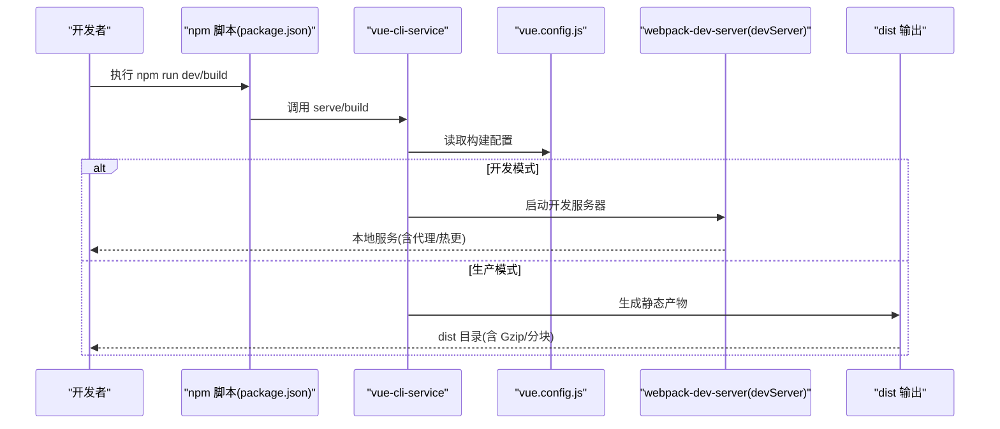
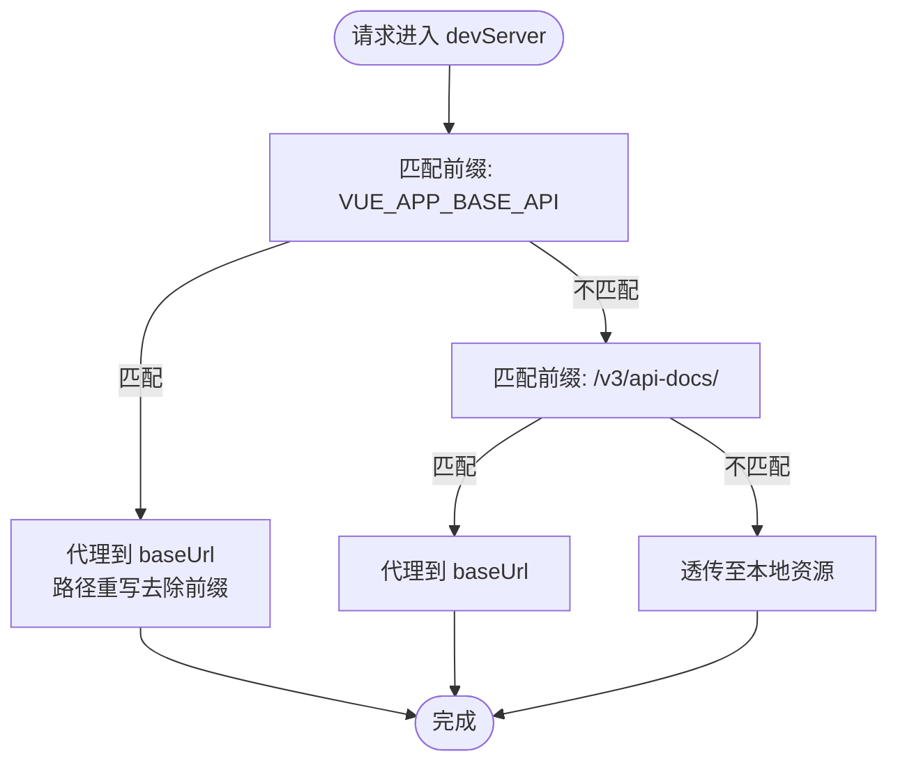
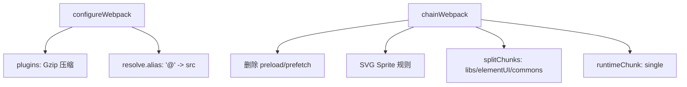
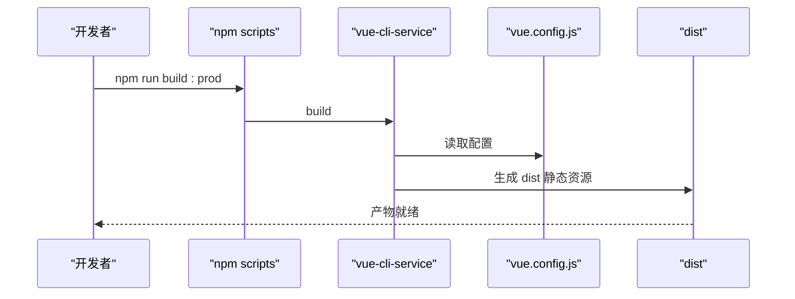
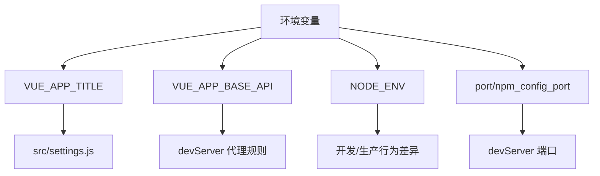
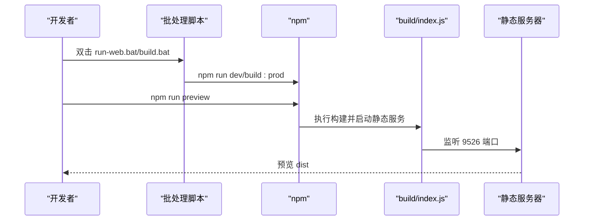
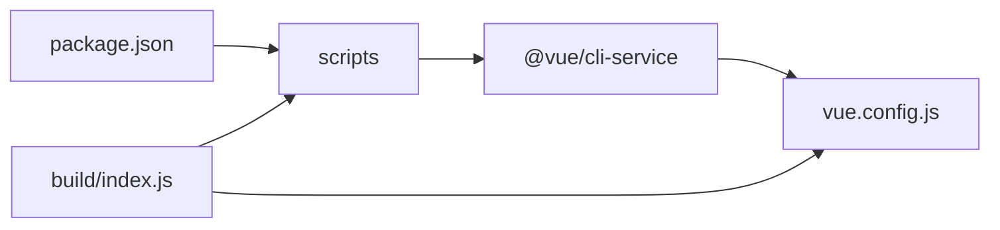

# 构建配置管理

<cite>
**本文引用的文件**
- [vue.config.js](file://ruoyi-ui/vue.config.js)
- [package.json](file://ruoyi-ui/package.json)
- [babel.config.js](file://ruoyi-ui/babel.config.js)
- [build/index.js](file://ruoyi-ui/build/index.js)
- [bin/run-web.bat](file://ruoyi-ui/bin/run-web.bat)
- [bin/build.bat](file://ruoyi-ui/bin/build.bat)
- [bin/package.bat](file://ruoyi-ui/bin/package.bat)
- [settings.js](file://ruoyi-ui/src/settings.js)
- [main.js](file://ruoyi-ui/src/main.js)
- [router/index.js](file://ruoyi-ui/src/router/index.js)
- [store/index.js](file://ruoyi-ui/src/store/index.js)
</cite>

## 目录
1. [简介](#简介)
2. [项目结构](#项目结构)
3. [核心组件](#核心组件)
4. [架构总览](#架构总览)
5. [详细组件分析](#详细组件分析)
6. [依赖关系分析](#依赖关系分析)
7. [性能考虑](#性能考虑)
8. [故障排查指南](#故障排查指南)
9. [结论](#结论)
10. [附录](#附录)

## 简介
本文件面向构建配置管理，围绕 Vue CLI 项目 ruoyi-ui 的构建与开发配置进行系统化梳理，重点覆盖以下方面：
- 开发服务器配置：主机、端口、热更新、跨域代理与调试工具
- 构建优化：产物目录、资源目录、Source Map、Gzip 压缩、SVG Sprite、代码分割与运行时分块
- 资源处理：Sass 编译、SVG 处理、静态资源目录
- 打包配置：入口文件、输出目录、构建脚本与部署预览
- 环境差异：开发与生产环境差异、环境变量与 API 代理
- 构建脚本：启动命令、打包命令、部署脚本与本地预览
- 性能优化与故障排查：按需加载、分块策略、代理与网络问题定位

## 项目结构
ruoyi-ui 为 Vue CLI 2.x 项目，采用标准的前端工程组织方式，关键构建相关文件集中在 ruoyi-ui 根目录：
- 构建配置：vue.config.js、babel.config.js
- 包管理与脚本：package.json
- 构建辅助：build/index.js、bin/*.bat
- 运行时配置：src/settings.js
- 应用入口：src/main.js、src/router/index.js、src/store/index.js

图表来源
- [vue.config.js:1-138](file://ruoyi-ui/vue.config.js#L1-L138)
- [babel.config.js:1-13](file://ruoyi-ui/babel.config.js#L1-L13)
- [package.json:1-74](file://ruoyi-ui/package.json#L1-L74)
- [build/index.js:1-36](file://ruoyi-ui/build/index.js#L1-L36)
- [bin/run-web.bat:1-12](file://ruoyi-ui/bin/run-web.bat#L1-L12)
- [bin/build.bat:1-12](file://ruoyi-ui/bin/build.bat#L1-L12)
- [bin/package.bat:1-12](file://ruoyi-ui/bin/package.bat#L1-L12)
- [settings.js:1-57](file://ruoyi-ui/src/settings.js#L1-L57)
- [main.js:1-84](file://ruoyi-ui/src/main.js#L1-L84)
- [router/index.js:1-184](file://ruoyi-ui/src/router/index.js#L1-L184)
- [store/index.js:1-26](file://ruoyi-ui/src/store/index.js#L1-L26)

章节来源
- [vue.config.js:1-138](file://ruoyi-ui/vue.config.js#L1-L138)
- [package.json:1-74](file://ruoyi-ui/package.json#L1-L74)

## 核心组件
- 构建配置中心：vue.config.js 提供开发服务器、CSS 加载器、Webpack 配置扩展、链式配置与生产优化
- 构建脚本与别名：package.json 定义 npm scripts，babel.config.js 控制 Babel 环境与插件
- 构建辅助：build/index.js 提供本地预览与静态资源服务
- 运行时配置：src/settings.js 提供系统布局与界面配置，src/main.js 组织应用初始化

章节来源
- [vue.config.js:20-138](file://ruoyi-ui/vue.config.js#L20-L138)
- [package.json:7-12](file://ruoyi-ui/package.json#L7-L12)
- [babel.config.js:1-13](file://ruoyi-ui/babel.config.js#L1-L13)
- [build/index.js:1-36](file://ruoyi-ui/build/index.js#L1-L36)
- [settings.js:1-57](file://ruoyi-ui/src/settings.js#L1-L57)
- [main.js:1-84](file://ruoyi-ui/src/main.js#L1-L84)

## 架构总览
Vue CLI 构建流程从 npm scripts 入手，经由 @vue/cli-service 调用 vue.config.js 中的配置，最终产出 dist 目录。开发阶段通过 devServer 提供代理与热更新；生产阶段启用 Gzip 压缩、代码分割与运行时分块。

图表来源
- [package.json:7-12](file://ruoyi-ui/package.json#L7-L12)
- [vue.config.js:33-53](file://ruoyi-ui/vue.config.js#L33-L53)
- [vue.config.js:61-138](file://ruoyi-ui/vue.config.js#L61-L138)

## 详细组件分析

### 开发服务器与代理配置
- 主机与端口：host 与 port 来源于环境变量或 npm_config_port，默认 80
- 代理规则：
  - 基于 VUE_APP_BASE_API 前缀的后端接口代理，目标地址为 baseUrl，支持路径重写
  - SpringDoc 文档代理，转发 /v3/api-docs/ 下的请求
- 其他：开启自动打开浏览器、禁用 Host 校验

图表来源
- [vue.config.js:33-53](file://ruoyi-ui/vue.config.js#L33-L53)

章节来源
- [vue.config.js:10-15](file://ruoyi-ui/vue.config.js#L10-L15)
- [vue.config.js:33-53](file://ruoyi-ui/vue.config.js#L33-L53)

### 构建优化与资源处理
- 产物与静态资源：
  - outputDir: dist
  - assetsDir: static
  - publicPath: 生产环境为 "/"，开发环境为 "/"
- Source Map：生产环境关闭
- 依赖编译：transpileDependencies 包含 quill
- CSS：Sass 编译选项 expanded
- SVG 处理：自定义 svg-sprite-loader 规则，仅对 src/assets/icons 目录生效
- Gzip 压缩：compression-webpack-plugin，按配置测试文件类型、算法与压缩比
- 代码分割与运行时：
  - 删除 preload/prefetch 插件
  - splitChunks：libs、elementUI、commons 三组缓存组，优先级与复用策略明确
  - runtimeChunk 单独提取

图表来源
- [vue.config.js:61-79](file://ruoyi-ui/vue.config.js#L61-L79)
- [vue.config.js:80-136](file://ruoyi-ui/vue.config.js#L80-L136)

章节来源
- [vue.config.js:24-30](file://ruoyi-ui/vue.config.js#L24-L30)
- [vue.config.js:54-60](file://ruoyi-ui/vue.config.js#L54-L60)
- [vue.config.js:84-99](file://ruoyi-ui/vue.config.js#L84-L99)
- [vue.config.js:111-135](file://ruoyi-ui/vue.config.js#L111-L135)

### 打包配置与入口/输出
- 入口文件：src/main.js
- 输出目录：dist（与 outputDir 对齐）
- 构建脚本：
  - dev：vue-cli-service serve
  - build:prod：vue-cli-service build
  - build:stage：带 staging 模式的构建
  - preview：本地预览 dist 目录（内置静态服务器）

图表来源
- [package.json:7-12](file://ruoyi-ui/package.json#L7-L12)
- [vue.config.js:26](file://ruoyi-ui/vue.config.js#L26)

章节来源
- [package.json:7-12](file://ruoyi-ui/package.json#L7-L12)
- [vue.config.js:26](file://ruoyi-ui/vue.config.js#L26)

### 环境差异与环境变量
- 环境变量：
  - VUE_APP_TITLE：网页标题
  - VUE_APP_BASE_API：API 代理前缀
  - NODE_ENV：生产/开发环境
  - port/npm_config_port：开发服务器端口
- 运行时配置：
  - src/settings.js 读取 VUE_APP_TITLE 并提供系统布局与界面配置
  - src/main.js 引入 Element UI、全局样式与组件，并设置页面标题

图表来源
- [vue.config.js:10](file://ruoyi-ui/vue.config.js#L10)
- [vue.config.js:13](file://ruoyi-ui/vue.config.js#L13)
- [vue.config.js:15](file://ruoyi-ui/vue.config.js#L15)
- [vue.config.js:39-44](file://ruoyi-ui/vue.config.js#L39-L44)
- [settings.js:5](file://ruoyi-ui/src/settings.js#L5)
- [main.js:6,74](file://ruoyi-ui/src/main.js#L6,L74)

章节来源
- [vue.config.js:10-15](file://ruoyi-ui/vue.config.js#L10-L15)
- [vue.config.js:39-44](file://ruoyi-ui/vue.config.js#L39-L44)
- [settings.js:5](file://ruoyi-ui/src/settings.js#L5)
- [main.js:6,74](file://ruoyi-ui/src/main.js#L6,L74)

### 构建脚本与部署预览
- Windows 批处理：
  - run-web.bat：执行 npm run dev
  - build.bat：执行 npm run build:prod
  - package.bat：安装依赖（使用国内镜像源）
- 本地预览：
  - npm run preview：调用 build/index.js，构建后在 9526 端口提供静态服务，支持 --report 参数生成报告

图表来源
- [bin/run-web.bat:1-12](file://ruoyi-ui/bin/run-web.bat#L1-L12)
- [bin/build.bat:1-12](file://ruoyi-ui/bin/build.bat#L1-L12)
- [bin/package.bat:1-12](file://ruoyi-ui/bin/package.bat#L1-L12)
- [build/index.js:7-35](file://ruoyi-ui/build/index.js#L7-L35)

章节来源
- [bin/run-web.bat:1-12](file://ruoyi-ui/bin/run-web.bat#L1-L12)
- [bin/build.bat:1-12](file://ruoyi-ui/bin/build.bat#L1-L12)
- [bin/package.bat:1-12](file://ruoyi-ui/bin/package.bat#L1-L12)
- [build/index.js:7-35](file://ruoyi-ui/build/index.js#L7-L35)

### Babel 与按需加载优化
- preset：@vue/cli-plugin-babel/preset
- development 环境启用 dynamic-import-node 插件，提升大量页面场景下的热更新速度

章节来源
- [babel.config.js:1-13](file://ruoyi-ui/babel.config.js#L1-L13)

### 应用初始化与路由/状态
- main.js：引入 Element UI、全局样式与组件，挂载全局方法与组件，初始化应用实例
- router/index.js：定义公共路由与动态路由，设置 history 模式与滚动行为
- store/index.js：聚合模块并导出 store 实例

章节来源
- [main.js:1-84](file://ruoyi-ui/src/main.js#L1-L84)
- [router/index.js:1-184](file://ruoyi-ui/src/router/index.js#L1-L184)
- [store/index.js:1-26](file://ruoyi-ui/src/store/index.js#L1-L26)

## 依赖关系分析
- npm scripts 依赖 @vue/cli-service 与相关插件
- vue.config.js 作为构建配置入口，影响 devServer、configureWebpack、chainWebpack
- build/index.js 作为预览脚本，间接依赖 vue.config.js 的 publicPath

图表来源
- [package.json:7-12](file://ruoyi-ui/package.json#L7-L12)
- [vue.config.js:20-138](file://ruoyi-ui/vue.config.js#L20-L138)
- [build/index.js:1-36](file://ruoyi-ui/build/index.js#L1-L36)

章节来源
- [package.json:7-12](file://ruoyi-ui/package.json#L7-L12)
- [vue.config.js:20-138](file://ruoyi-ui/vue.config.js#L20-L138)
- [build/index.js:1-36](file://ruoyi-ui/build/index.js#L1-L36)

## 性能考虑
- 代码分割：
  - libs：第三方库统一抽离
  - elementUI：独立拆分，优先级高于 libs
  - commons：组件目录满足最小引用次数后抽取
- 运行时分块：runtimeChunk 单独提取，有利于缓存与长连接
- 资源压缩：Gzip 压缩，按阈值与算法控制
- SVG 处理：通过 svg-sprite-loader 减少请求与体积
- 热更新优化：development 环境启用 dynamic-import-node 插件

章节来源
- [vue.config.js:111-135](file://ruoyi-ui/vue.config.js#L111-L135)
- [vue.config.js:68-78](file://ruoyi-ui/vue.config.js#L68-L78)
- [vue.config.js:84-99](file://ruoyi-ui/vue.config.js#L84-L99)
- [babel.config.js:6-12](file://ruoyi-ui/babel.config.js#L6-L12)

## 故障排查指南
- 代理失败
  - 检查 VUE_APP_BASE_API 与 devServer.proxy 配置是否一致
  - 确认 changeOrigin 与 pathRewrite 设置
- 端口占用
  - 修改 port 或 npm_config_port 环境变量
- 预览无法访问
  - 确认 publicPath 与静态服务器路径映射一致
  - 检查 9526 端口占用情况
- 构建体积过大
  - 检查 splitChunks 缓存组与复用策略
  - 确认 Gzip 是否生效
- 热更新缓慢
  - development 环境已启用 dynamic-import-node 插件
  - 检查页面数量与动态导入使用情况

章节来源
- [vue.config.js:33-53](file://ruoyi-ui/vue.config.js#L33-L53)
- [vue.config.js:15](file://ruoyi-ui/vue.config.js#L15)
- [build/index.js:12-32](file://ruoyi-ui/build/index.js#L12-L32)
- [vue.config.js:111-135](file://ruoyi-ui/vue.config.js#L111-L135)
- [babel.config.js:6-12](file://ruoyi-ui/babel.config.js#L6-L12)

## 结论
本项目基于 Vue CLI 的标准配置与扩展，实现了清晰的开发与生产差异、完善的代理与资源处理、以及可落地的性能优化策略。通过 npm scripts、vue.config.js 与 build/index.js 的协同，既能满足日常开发效率，也能保障生产构建质量与上线体验。

## 附录
- 关键配置速览
  - 开发服务器：host、port、open、proxy、disableHostCheck
  - 构建产物：outputDir、assetsDir、publicPath、productionSourceMap
  - 优化策略：Gzip、SVG Sprite、splitChunks、runtimeChunk
  - 环境变量：VUE_APP_TITLE、VUE_APP_BASE_API、NODE_ENV、port/npm_config_port
  - 构建脚本：dev、build:prod、build:stage、preview

章节来源
- [vue.config.js:24-53](file://ruoyi-ui/vue.config.js#L24-L53)
- [vue.config.js:61-138](file://ruoyi-ui/vue.config.js#L61-L138)
- [package.json:7-12](file://ruoyi-ui/package.json#L7-L12)
- [settings.js:5](file://ruoyi-ui/src/settings.js#L5)