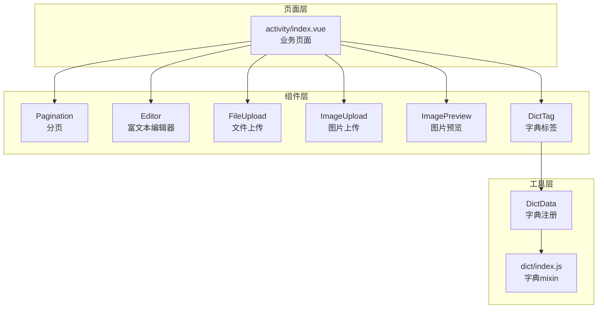
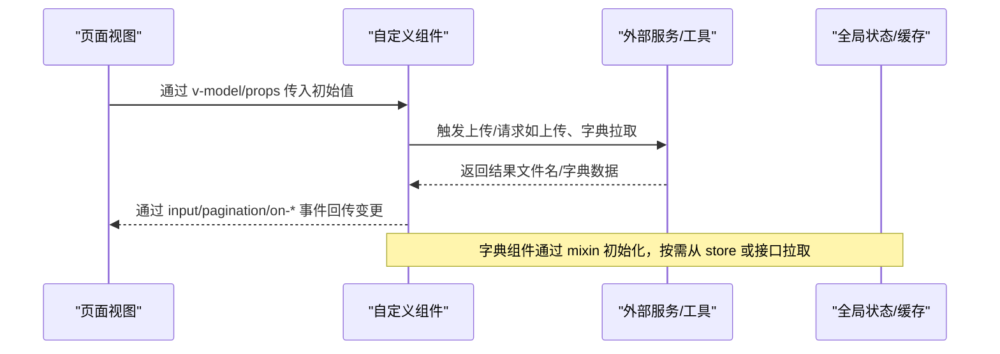
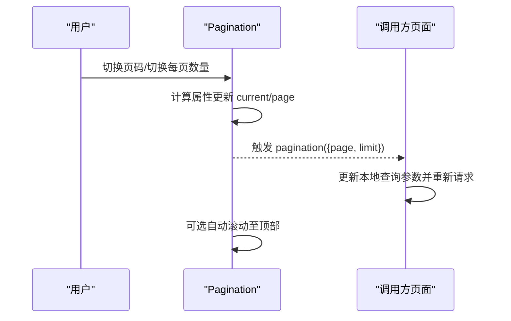
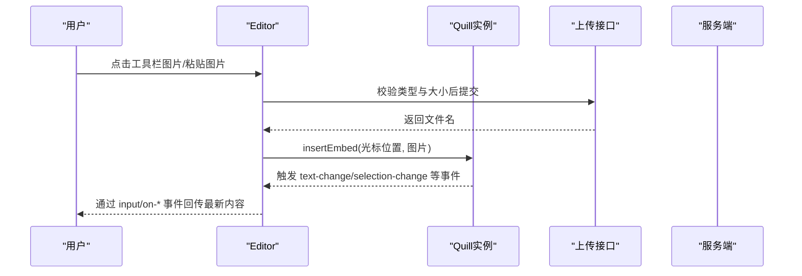
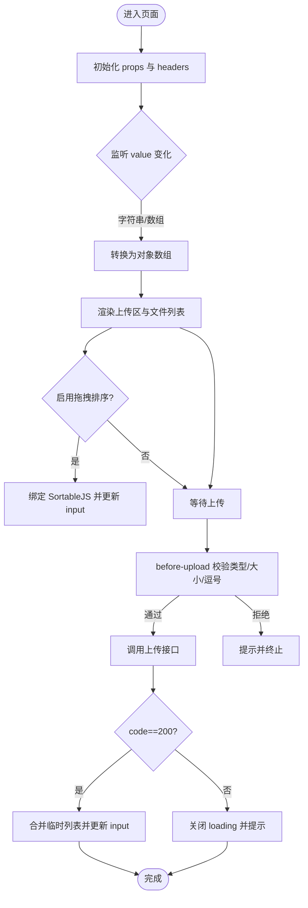
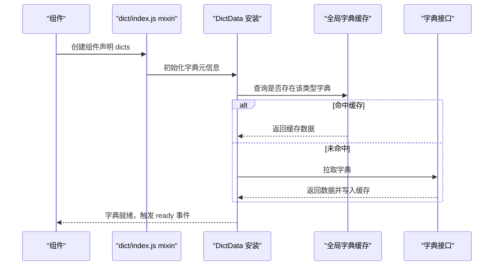
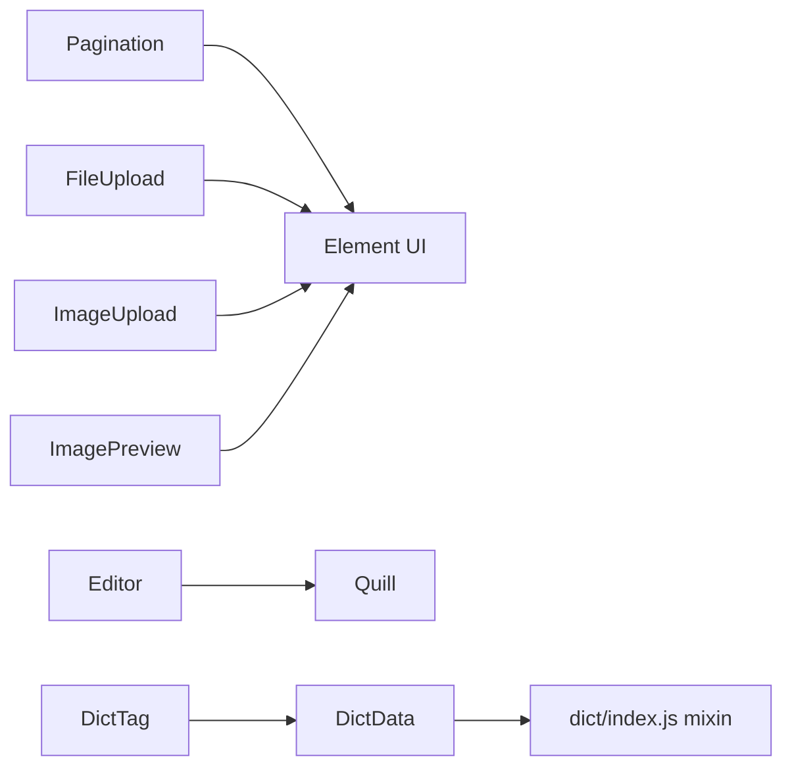

# 自定义组件开发

<cite>
**本文引用的文件**
- [Pagination/index.vue](file://ruoyi-ui/src/components/Pagination/index.vue)
- [Editor/index.vue](file://ruoyi-ui/src/components/Editor/index.vue)
- [FileUpload/index.vue](file://ruoyi-ui/src/components/FileUpload/index.vue)
- [ImageUpload/index.vue](file://ruoyi-ui/src/components/ImageUpload/index.vue)
- [ImagePreview/index.vue](file://ruoyi-ui/src/components/ImagePreview/index.vue)
- [DictTag/index.vue](file://ruoyi-ui/src/components/DictTag/index.vue)
- [DictData/index.js](file://ruoyi-ui/src/components/DictData/index.js)
- [dict/index.js](file://ruoyi-ui/src/utils/dict/index.js)
- [activity/index.vue](file://ruoyi-ui/src/views/gangzhu/activity/index.vue)
</cite>

## 目录
1. [简介](#简介)
2. [项目结构](#项目结构)
3. [核心组件](#核心组件)
4. [架构总览](#架构总览)
5. [组件详解](#组件详解)
6. [依赖关系分析](#依赖关系分析)
7. [性能考量](#性能考量)
8. [故障排查指南](#故障排查指南)
9. [结论](#结论)
10. [附录](#附录)

## 简介
本文件面向前端开发者与产品同学，系统化梳理本仓库中自定义组件的设计理念与实现方式，重点覆盖分页组件、富文本编辑器、文件上传组件、图片上传与预览组件、字典标签组件等。文档从API设计（props、事件、插槽、样式）、状态管理（内部状态、外部传入、数据流）、复用与扩展（配置项、回调、插件机制）等方面进行深入解析，并提供使用示例与最佳实践。

## 项目结构
自定义组件主要位于 ruoyi-ui/src/components 目录下，围绕“表单输入”“展示与预览”“数据字典”三大类场景构建，配合 ruoyi-ui/src/utils/dict 提供字典能力，页面通过 v-model 或事件驱动与组件交互。

图表来源
- [Pagination/index.vue:1-114](file://ruoyi-ui/src/components/Pagination/index.vue#L1-L114)
- [Editor/index.vue:1-297](file://ruoyi-ui/src/components/Editor/index.vue#L1-L297)
- [FileUpload/index.vue:1-263](file://ruoyi-ui/src/components/FileUpload/index.vue#L1-L263)
- [ImageUpload/index.vue:1-273](file://ruoyi-ui/src/components/ImageUpload/index.vue#L1-L273)
- [ImagePreview/index.vue:1-91](file://ruoyi-ui/src/components/ImagePreview/index.vue#L1-L91)
- [DictTag/index.vue:1-90](file://ruoyi-ui/src/components/DictTag/index.vue#L1-L90)
- [DictData/index.js:1-49](file://ruoyi-ui/src/components/DictData/index.js#L1-L49)
- [dict/index.js:1-34](file://ruoyi-ui/src/utils/dict/index.js#L1-L34)
- [activity/index.vue:120-369](file://ruoyi-ui/src/views/gangzhu/activity/index.vue#L120-L369)

章节来源
- [Pagination/index.vue:1-114](file://ruoyi-ui/src/components/Pagination/index.vue#L1-L114)
- [Editor/index.vue:1-297](file://ruoyi-ui/src/components/Editor/index.vue#L1-L297)
- [FileUpload/index.vue:1-263](file://ruoyi-ui/src/components/FileUpload/index.vue#L1-L263)
- [ImageUpload/index.vue:1-273](file://ruoyi-ui/src/components/ImageUpload/index.vue#L1-L273)
- [ImagePreview/index.vue:1-91](file://ruoyi-ui/src/components/ImagePreview/index.vue#L1-L91)
- [DictTag/index.vue:1-90](file://ruoyi-ui/src/components/DictTag/index.vue#L1-L90)
- [DictData/index.js:1-49](file://ruoyi-ui/src/components/DictData/index.js#L1-L49)
- [dict/index.js:1-34](file://ruoyi-ui/src/utils/dict/index.js#L1-L34)
- [activity/index.vue:120-369](file://ruoyi-ui/src/views/gangzhu/activity/index.vue#L120-L369)

## 核心组件
- 分页组件：基于 Element UI 的 el-pagination 封装，支持双向绑定、自动滚动、布局与尺寸配置。
- 富文本编辑器：基于 Quill，集成图片上传、粘贴插入、只读模式、尺寸控制与事件透传。
- 文件上传组件：通用文件上传，支持类型/大小/数量限制、拖拽排序、批量展示与删除。
- 图片上传组件：图片专用上传，支持预览弹窗、拖拽排序、禁用态、批量管理。
- 图片预览组件：统一图片预览入口，自动拼接基础路径、外链识别、多图预览。
- 字典标签组件：将字典值渲染为标签或纯文本，支持未匹配值展示与分隔符配置；字典注册通过 DictData 与 dict mixin 实现。

章节来源
- [Pagination/index.vue:22-63](file://ruoyi-ui/src/components/Pagination/index.vue#L22-L63)
- [Editor/index.vue:29-61](file://ruoyi-ui/src/components/Editor/index.vue#L29-L61)
- [FileUpload/index.vue:48-92](file://ruoyi-ui/src/components/FileUpload/index.vue#L48-L92)
- [ImageUpload/index.vue:52-94](file://ruoyi-ui/src/components/ImageUpload/index.vue#L52-L94)
- [ImagePreview/index.vue:17-32](file://ruoyi-ui/src/components/ImagePreview/index.vue#L17-L32)
- [DictTag/index.vue:31-48](file://ruoyi-ui/src/components/DictTag/index.vue#L31-L48)
- [DictData/index.js:21-44](file://ruoyi-ui/src/components/DictData/index.js#L21-L44)
- [dict/index.js:4-33](file://ruoyi-ui/src/utils/dict/index.js#L4-L33)

## 架构总览
组件与页面、工具之间的交互关系如下：

图表来源
- [activity/index.vue:178-185](file://ruoyi-ui/src/views/gangzhu/activity/index.vue#L178-L185)
- [Editor/index.vue:161-217](file://ruoyi-ui/src/components/Editor/index.vue#L161-L217)
- [FileUpload/index.vue:151-216](file://ruoyi-ui/src/components/FileUpload/index.vue#L151-L216)
- [ImageUpload/index.vue:157-247](file://ruoyi-ui/src/components/ImageUpload/index.vue#L157-L247)
- [DictData/index.js:27-44](file://ruoyi-ui/src/components/DictData/index.js#L27-L44)
- [dict/index.js:17-31](file://ruoyi-ui/src/utils/dict/index.js#L17-L31)

## 组件详解

### 分页组件（Pagination）
- 设计目标：简化分页逻辑，统一滚动行为与布局配置，支持移动端适配。
- 关键 props
  - total：总数
  - page：当前页（支持 .sync）
  - limit：每页条数（支持 .sync）
  - pageSizes/layout/background/pagerCount/autoScroll/hidden：布局与行为控制
- 事件
  - update:page/update:limit：用于 .sync
  - pagination：返回 {page, limit}
- 内部状态与数据流
  - 通过计算属性将外部 page/limit 映射到内部双向绑定，事件向外派发，结合滚动工具实现自动回到顶部。
- 使用示例（页面）
  - 在表格上方放置，绑定 total、queryParams.pageNum、queryParams.pageSize，并监听 @pagination 调用列表方法。

图表来源
- [Pagination/index.vue:68-102](file://ruoyi-ui/src/components/Pagination/index.vue#L68-L102)
- [activity/index.vue:178-185](file://ruoyi-ui/src/views/gangzhu/activity/index.vue#L178-L185)

章节来源
- [Pagination/index.vue:22-102](file://ruoyi-ui/src/components/Pagination/index.vue#L22-L102)
- [activity/index.vue:178-185](file://ruoyi-ui/src/views/gangzhu/activity/index.vue#L178-L185)

### 富文本编辑器（Editor）
- 设计目标：在 Quill 基础上提供便捷的图片上传、粘贴插入、只读模式与尺寸控制。
- 关键 props
  - value：内容（v-model）
  - height/minHeight/readOnly：尺寸与只读
  - fileSize/type：文件大小限制与上传类型（base64/url）
- 事件
  - input：同步 HTML
  - on-change/on-text-change/on-selection-change/on-editor-change：编辑器事件透传
- 内部状态与数据流
  - 初始化 Quill，注册图片工具栏与粘贴事件；上传成功后插入图片并维护光标位置；watch 同步外部 value。
- 上传流程
  - 选择图片或粘贴图片触发上传，成功后插入到光标位置。

图表来源
- [Editor/index.vue:126-217](file://ruoyi-ui/src/components/Editor/index.vue#L126-L217)

章节来源
- [Editor/index.vue:29-217](file://ruoyi-ui/src/components/Editor/index.vue#L29-L217)
- [activity/index.vue:368-369](file://ruoyi-ui/src/views/gangzhu/activity/index.vue#L368-L369)

### 文件上传组件（FileUpload）
- 设计目标：通用文件上传，支持类型/大小/数量限制、拖拽排序、批量展示与删除。
- 关键 props
  - value：支持字符串、对象、数组（内部统一处理）
  - action/data/limit/fileSize/fileType/isShowTip/disabled/drag：上传与展示配置
- 事件
  - input：回传逗号分隔的文件名列表
- 内部状态与数据流
  - watch 监听 value，转换为对象数组并渲染列表；拖拽排序通过 SortableJS 实现；上传成功后合并临时列表并回写。
- 使用注意
  - 文件名禁止包含逗号；超出数量/大小会拦截并提示。

图表来源
- [FileUpload/index.vue:93-235](file://ruoyi-ui/src/components/FileUpload/index.vue#L93-L235)

章节来源
- [FileUpload/index.vue:48-235](file://ruoyi-ui/src/components/FileUpload/index.vue#L48-L235)

### 图片上传组件（ImageUpload）
- 设计目标：图片专用上传，支持预览弹窗、拖拽排序、禁用态、批量管理。
- 关键 props
  - value：支持字符串、对象、数组
  - action/data/limit/fileSize/fileType/isShowTip/disabled/drag：上传与展示配置
- 事件
  - input：回传逗号分隔的 URL 列表
- 内部状态与数据流
  - 与 FileUpload 类似，但针对图片类型做额外校验；支持点击图片卡片预览大图。
- 使用注意
  - 未匹配外链时自动拼接基础路径；拖拽排序后回写顺序。

章节来源
- [ImageUpload/index.vue:52-247](file://ruoyi-ui/src/components/ImageUpload/index.vue#L52-L247)

### 图片预览组件（ImagePreview）
- 设计目标：统一图片预览入口，自动处理外链与本地路径拼接。
- 关键 props
  - src：支持单张或多张（逗号分隔），自动切分
  - width/height：支持数值或字符串
- 行为特性
  - 外链直接使用；内链自动拼接基础路径；支持多图预览；异常占位图标。

章节来源
- [ImagePreview/index.vue:17-64](file://ruoyi-ui/src/components/ImagePreview/index.vue#L17-L64)

### 字典标签组件（DictTag）与字典注册（DictData、dict mixin）
- 设计目标：将字典值渲染为标签或纯文本，支持未匹配值展示与分隔符配置；字典注册通过 mixin 自动注入。
- 关键 props
  - options：字典项数组（含 label/value/raw 等）
  - value：支持单值、数组、字符串（逗号分隔）
  - showValue：未匹配值是否显示
  - separator：分隔符
- 事件与插槽
  - 无事件；通过插槽可自定义未匹配值展示（过滤器 handleArray）
- 内部状态与数据流
  - 计算 values 并与 options 匹配，未匹配项记录在 unmatchArray；根据 raw.cssClass/listClass 决定样式。
- 字典注册机制
  - 通过安装函数注册 DictData，使用 mixin 在组件生命周期中初始化字典，优先从 store 获取，否则从接口拉取并缓存。

图表来源
- [DictData/index.js:21-44](file://ruoyi-ui/src/components/DictData/index.js#L21-L44)
- [dict/index.js:4-33](file://ruoyi-ui/src/utils/dict/index.js#L4-L33)

章节来源
- [DictTag/index.vue:31-82](file://ruoyi-ui/src/components/DictTag/index.vue#L31-L82)
- [DictData/index.js:21-44](file://ruoyi-ui/src/components/DictData/index.js#L21-L44)
- [dict/index.js:4-33](file://ruoyi-ui/src/utils/dict/index.js#L4-L33)
- [activity/index.vue:123-141](file://ruoyi-ui/src/views/gangzhu/activity/index.vue#L123-L141)

## 依赖关系分析
- 组件间耦合
  - 分页组件与页面交互简单，低耦合
  - 富文本/文件/图片上传组件均依赖上传接口与鉴权头，耦合于上传服务
  - 图片预览组件对路径拼接与外链识别有少量耦合
  - 字典标签组件依赖字典注册与全局缓存
- 外部依赖
  - Quill（富文本）
  - SortableJS（拖拽排序）
  - Element UI（上传、分页、标签、弹窗等）

图表来源
- [Pagination/index.vue:1-16](file://ruoyi-ui/src/components/Pagination/index.vue#L1-L16)
- [Editor/index.vue:21-25](file://ruoyi-ui/src/components/Editor/index.vue#L21-L25)
- [FileUpload/index.vue:1-42](file://ruoyi-ui/src/components/FileUpload/index.vue#L1-L42)
- [ImageUpload/index.vue:1-44](file://ruoyi-ui/src/components/ImageUpload/index.vue#L1-L44)
- [ImagePreview/index.vue:1-12](file://ruoyi-ui/src/components/ImagePreview/index.vue#L1-L12)
- [DictTag/index.vue:1-28](file://ruoyi-ui/src/components/DictTag/index.vue#L1-L28)
- [DictData/index.js:1-49](file://ruoyi-ui/src/components/DictData/index.js#L1-L49)
- [dict/index.js:1-34](file://ruoyi-ui/src/utils/dict/index.js#L1-L34)

## 性能考量
- 分页
  - 通过 .sync 与事件解耦，避免频繁重渲染；autoScroll 可按需开启。
- 富文本
  - 仅在必要时触发 text-change 事件；图片上传采用异步，避免阻塞主线程。
- 上传组件
  - before-upload 中尽早校验类型/大小/数量，减少无效请求；使用 loading 提示。
  - FileUpload/ImageUpload 通过临时列表与合并策略降低多次 input 回写成本。
- 图片预览
  - 外链直连，减少本地拼接与二次请求；多图预览由 Element UI 组件处理。
- 字典
  - 优先使用 store 缓存，减少重复请求；按需初始化，避免全局一次性拉取。

## 故障排查指南
- 上传失败
  - 检查 before-upload 校验（类型/大小/逗号），确认 headers 中的鉴权信息；查看上传接口返回码与提示。
- 图片粘贴不生效
  - 确认浏览器允许剪贴板权限；检查 handlePasteCapture 是否被阻止；确保上传接口可用。
- 拖拽排序无效
  - 确认 drag 开关与 DOM 结构；检查 SortableJS 初始化时机（mounted 后）。
- 字典不显示或为空
  - 检查字典类型是否正确；确认 store 中是否存在对应缓存；查看接口是否返回数据。
- 分页跳页异常
  - 检查 total 与当前页/每页数的乘积关系；确认 autoScroll 是否导致滚动抖动。

章节来源
- [Editor/index.vue:161-217](file://ruoyi-ui/src/components/Editor/index.vue#L161-L217)
- [FileUpload/index.vue:151-216](file://ruoyi-ui/src/components/FileUpload/index.vue#L151-L216)
- [ImageUpload/index.vue:157-247](file://ruoyi-ui/src/components/ImageUpload/index.vue#L157-L247)
- [DictData/index.js:27-44](file://ruoyi-ui/src/components/DictData/index.js#L27-L44)
- [Pagination/index.vue:87-101](file://ruoyi-ui/src/components/Pagination/index.vue#L87-L101)

## 结论
本项目的自定义组件围绕“易用、可复用、可扩展”的目标设计：通过 props 与事件清晰界定边界，借助工具层（上传、字典）提升通用性，页面以 v-model 与事件驱动实现低耦合交互。建议在新业务中优先复用现有组件，并遵循统一的配置与回调约定，以保证一致的用户体验与开发效率。

## 附录
- 组件开发规范（建议）
  - Props 命名与类型明确，提供合理默认值
  - 事件命名语义化，尽量透传底层事件
  - 插槽仅暴露必要节点，避免过度开放
  - 内部状态最小化，优先通过 props 与事件与外部协作
  - 提供必要的 loading/错误提示与可访问性支持
- 使用示例参考
  - 分页：在表格上方引入，绑定 total 与查询参数，监听 @pagination
  - 富文本：在表单中使用 v-model，设置最小高度
  - 文件/图片上传：设置类型、大小、数量限制，启用拖拽排序
  - 字典标签：传入 options 与 value，必要时开启 showValue

章节来源
- [activity/index.vue:178-369](file://ruoyi-ui/src/views/gangzhu/activity/index.vue#L178-L369)
- [DictTag/index.vue:31-82](file://ruoyi-ui/src/components/DictTag/index.vue#L31-L82)
- [Editor/index.vue:29-61](file://ruoyi-ui/src/components/Editor/index.vue#L29-L61)
- [FileUpload/index.vue:48-92](file://ruoyi-ui/src/components/FileUpload/index.vue#L48-L92)
- [ImageUpload/index.vue:52-94](file://ruoyi-ui/src/components/ImageUpload/index.vue#L52-L94)
- [Pagination/index.vue:22-63](file://ruoyi-ui/src/components/Pagination/index.vue#L22-L63)