# 前端系统设计

<cite>
**本文引用的文件**
- [ruoyi-ui/package.json](file://ruoyi-ui/package.json)
- [ruoyi-ui/vue.config.js](file://ruoyi-ui/vue.config.js)
- [ruoyi-ui/src/main.js](file://ruoyi-ui/src/main.js)
- [ruoyi-ui/src/App.vue](file://ruoyi-ui/src/App.vue)
- [ruoyi-ui/src/router/index.js](file://ruoyi-ui/src/router/index.js)
- [ruoyi-ui/src/store/index.js](file://ruoyi-ui/src/store/index.js)
- [ruoyi-ui/src/settings.js](file://ruoyi-ui/src/settings.js)
- [ruoyi-ui/src/layout/index.vue](file://ruoyi-ui/src/layout/index.vue)
- [ruoyi-ui/src/utils/request.js](file://ruoyi-ui/src/utils/request.js)
- [ruoyi-ui/src/utils/index.js](file://ruoyi-ui/src/utils/index.js)
- [ruoyi-ui/src/views/gangzhu/checkout/index.vue](file://ruoyi-ui/src/views/gangzhu/checkout/index.vue)
- [uniapp-h5/package.json](file://uniapp-h5/package.json)
- [uniapp-h5/manifest.json](file://uniapp-h5/manifest.json)
- [uniapp-h5/pages.json](file://uniapp-h5/pages.json)
- [uniapp-h5/main.js](file://uniapp-h5/main.js)
- [uniapp-h5/config/feature-flags.js](file://uniapp-h5/config/feature-flags.js)
- [uniapp-h5/mixins/authCheck.js](file://uniapp-h5/mixins/authCheck.js)
- [uniapp-h5/components/notice-popup/notice-popup.vue](file://uniapp-h5/components/notice-popup/notice-popup.vue)
</cite>

## 更新摘要
**所做更改**
- 新增货币格式化统一改进章节，详细说明价格显示格式化功能
- 更新PC管理后台货币格式化实现，包括全局格式化函数和各页面价格显示
- 新增移动端H5货币格式化相关组件说明
- 完善性能考量章节，增加货币格式化对性能的影响分析

## 目录
1. [引言](#引言)
2. [项目结构](#项目结构)
3. [核心组件](#核心组件)
4. [架构总览](#架构总览)
5. [详细组件分析](#详细组件分析)
6. [货币格式化统一改进](#货币格式化统一改进)
7. [依赖关系分析](#依赖关系分析)
8. [性能考量](#性能考量)
9. [故障排查指南](#故障排查指南)
10. [结论](#结论)
11. [附录](#附录)

## 引言
本文件面向港好住信息系统前端体系，系统性梳理 PC 管理后台（基于 Vue.js 的若依框架）与移动端 H5 应用（基于 uni-app）的架构设计与实现要点。重点覆盖组件化开发、路由管理、状态管理、UI 组件库集成、跨平台页面路由与组件封装、平台适配与性能优化、响应式与触摸交互、构建配置与开发调试、货币格式化统一改进、以及组件开发规范与最佳实践。

## 项目结构
- PC 管理后台（ruoyi-ui）
  - 基于 Vue 2.x + Element UI，采用若依管理后台模板，提供布局、权限、国际化、主题、分页、富文本、上传等通用能力。
  - 关键目录：src/main.js、src/router、src/store、src/layout、src/components、src/utils、public。
- 移动端 H5（uniapp-h5）
  - 基于 uni-app，统一开发多端（H5/小程序/APP），通过 pages.json 管理页面与分包，通过 manifest.json 配置平台能力与代理。
  - 关键目录：pages、subpkg、components、mixins、config、api、utils。

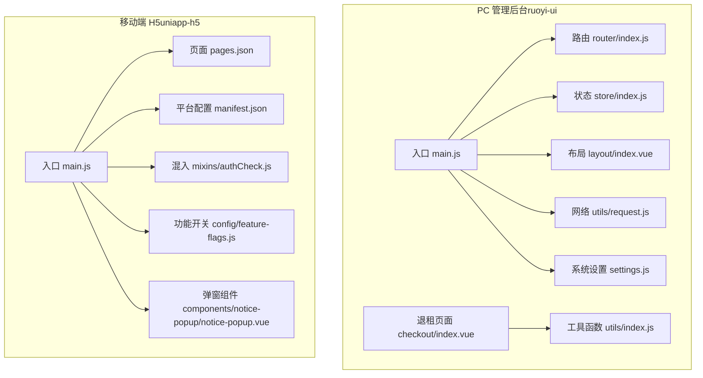

**图表来源**
- [ruoyi-ui/src/main.js:1-84](file://ruoyi-ui/src/main.js#L1-L84)
- [ruoyi-ui/src/router/index.js:1-184](file://ruoyi-ui/src/router/index.js#L1-L184)
- [ruoyi-ui/src/store/index.js:1-26](file://ruoyi-ui/src/store/index.js#L1-L26)
- [ruoyi-ui/src/layout/index.vue:1-116](file://ruoyi-ui/src/layout/index.vue#L1-L116)
- [ruoyi-ui/src/utils/request.js:1-161](file://ruoyi-ui/src/utils/request.js#L1-L161)
- [ruoyi-ui/src/views/gangzhu/checkout/index.vue:730-736](file://ruoyi-ui/src/views/gangzhu/checkout/index.vue#L730-L736)
- [ruoyi-ui/src/utils/index.js:1-32](file://ruoyi-ui/src/utils/index.js#L1-L32)
- [uniapp-h5/main.js:1-30](file://uniapp-h5/main.js#L1-L30)
- [uniapp-h5/pages.json:1-324](file://uniapp-h5/pages.json#L1-L324)
- [uniapp-h5/manifest.json:1-107](file://uniapp-h5/manifest.json#L1-L107)
- [uniapp-h5/mixins/authCheck.js:1-49](file://uniapp-h5/mixins/authCheck.js#L1-L49)
- [uniapp-h5/config/feature-flags.js:1-13](file://uniapp-h5/config/feature-flags.js#L1-L13)
- [uniapp-h5/components/notice-popup/notice-popup.vue:1-166](file://uniapp-h5/components/notice-popup/notice-popup.vue#L1-L166)

**章节来源**
- [ruoyi-ui/package.json:1-74](file://ruoyi-ui/package.json#L1-L74)
- [ruoyi-ui/vue.config.js:1-138](file://ruoyi-ui/vue.config.js#L1-L138)
- [uniapp-h5/package.json:1-6](file://uniapp-h5/package.json#L1-L6)
- [uniapp-h5/manifest.json:1-107](file://uniapp-h5/manifest.json#L1-L107)
- [uniapp-h5/pages.json:1-324](file://uniapp-h5/pages.json#L1-L324)

## 核心组件
- PC 管理后台核心
  - 入口与插件：在入口文件中注册 Element UI、全局组件、指令与插件，并挂载全局方法与下载工具。
  - 路由：定义常量路由与动态路由，支持权限控制与重复跳转防护。
  - 状态：Vuex 模块化管理应用、字典、用户、标签页、权限与系统设置。
  - 布局：响应式布局、侧边栏、顶部导航、标签页、主题设置面板。
  - 网络：Axios 拦截器统一处理 Token、重复提交、错误提示与下载。
  - 构建：webpack 插件与分包策略，SVG 图标加载器，Gzip 压缩。
  - 货币格式化：统一的价格显示格式化功能，确保用户体验一致性。
- 移动端 H5 核心
  - 入口：兼容 Vue2/Vue3 挂载方式，全局注入配置对象。
  - 页面与分包：pages.json 统一声明页面与分包，支持 tabBar、导航栏样式与标题。
  - 平台配置：manifest.json 定义 H5 代理、权限、版本与平台特性。
  - 组件：通用弹窗组件，支持富文本渲染、图片样式注入与遮罩点击。
  - 功能开关：通过 feature-flags 控制业务入口显隐。
  - 登录校验：authCheck 混入统一处理登录态检查与跳转。

**章节来源**
- [ruoyi-ui/src/main.js:1-84](file://ruoyi-ui/src/main.js#L1-L84)
- [ruoyi-ui/src/router/index.js:1-184](file://ruoyi-ui/src/router/index.js#L1-L184)
- [ruoyi-ui/src/store/index.js:1-26](file://ruoyi-ui/src/store/index.js#L1-L26)
- [ruoyi-ui/src/layout/index.vue:1-116](file://ruoyi-ui/src/layout/index.vue#L1-L116)
- [ruoyi-ui/src/utils/request.js:1-161](file://ruoyi-ui/src/utils/request.js#L1-L161)
- [ruoyi-ui/vue.config.js:1-138](file://ruoyi-ui/vue.config.js#L1-L138)
- [uniapp-h5/main.js:1-30](file://uniapp-h5/main.js#L1-L30)
- [uniapp-h5/pages.json:1-324](file://uniapp-h5/pages.json#L1-L324)
- [uniapp-h5/manifest.json:1-107](file://uniapp-h5/manifest.json#L1-L107)
- [uniapp-h5/components/notice-popup/notice-popup.vue:1-166](file://uniapp-h5/components/notice-popup/notice-popup.vue#L1-L166)
- [uniapp-h5/config/feature-flags.js:1-13](file://uniapp-h5/config/feature-flags.js#L1-L13)
- [uniapp-h5/mixins/authCheck.js:1-49](file://uniapp-h5/mixins/authCheck.js#L1-L49)

## 架构总览
- PC 管理后台采用"入口 -> 路由 -> 布局 -> 视图"的标准 MVC 流程，结合 Vuex 进行状态集中管理，Element UI 提供丰富的 UI 组件与主题能力。
- 移动端 H5 采用 uni-app 多端统一开发，通过 pages.json 与 manifest.json 实现页面路由与平台能力配置，组件化封装提升复用性与一致性。
- 货币格式化统一改进：所有价格显示（月租金、押金、账单金额、已付金额、未付金额、退款计算）都增加了两位小数格式化功能，提升了用户体验的一致性。

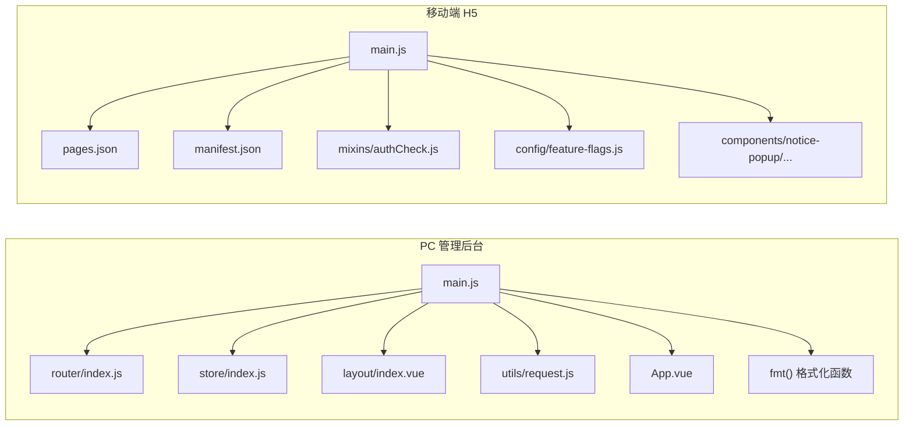

**图表来源**
- [ruoyi-ui/src/main.js:1-84](file://ruoyi-ui/src/main.js#L1-L84)
- [ruoyi-ui/src/router/index.js:1-184](file://ruoyi-ui/src/router/index.js#L1-L184)
- [ruoyi-ui/src/store/index.js:1-26](file://ruoyi-ui/src/store/index.js#L1-L26)
- [ruoyi-ui/src/layout/index.vue:1-116](file://ruoyi-ui/src/layout/index.vue#L1-L116)
- [ruoyi-ui/src/utils/request.js:1-161](file://ruoyi-ui/src/utils/request.js#L1-L161)
- [ruoyi-ui/src/App.vue:1-21](file://ruoyi-ui/src/App.vue#L1-L21)
- [ruoyi-ui/src/views/gangzhu/checkout/index.vue:730-736](file://ruoyi-ui/src/views/gangzhu/checkout/index.vue#L730-L736)
- [uniapp-h5/main.js:1-30](file://uniapp-h5/main.js#L1-L30)
- [uniapp-h5/pages.json:1-324](file://uniapp-h5/pages.json#L1-L324)
- [uniapp-h5/manifest.json:1-107](file://uniapp-h5/manifest.json#L1-L107)
- [uniapp-h5/mixins/authCheck.js:1-49](file://uniapp-h5/mixins/authCheck.js#L1-L49)
- [uniapp-h5/config/feature-flags.js:1-13](file://uniapp-h5/config/feature-flags.js#L1-L13)
- [uniapp-h5/components/notice-popup/notice-popup.vue:1-166](file://uniapp-h5/components/notice-popup/notice-popup.vue#L1-L166)

## 详细组件分析

### PC 管理后台：路由与权限控制
- 路由设计
  - 常量路由：登录、重定向、401/404、首页、个人资料等。
  - 动态路由：按权限加载的编辑/查看类页面，支持 activeMenu 高亮侧边栏。
  - 防重复跳转：对 push/replace 进行包装，避免重复点击报错。
- 权限控制
  - 结合动态路由与权限标识，配合后端菜单/权限数据动态装配。
- 开发体验
  - history 模式，去掉 URL 中的 #，需后端配合。

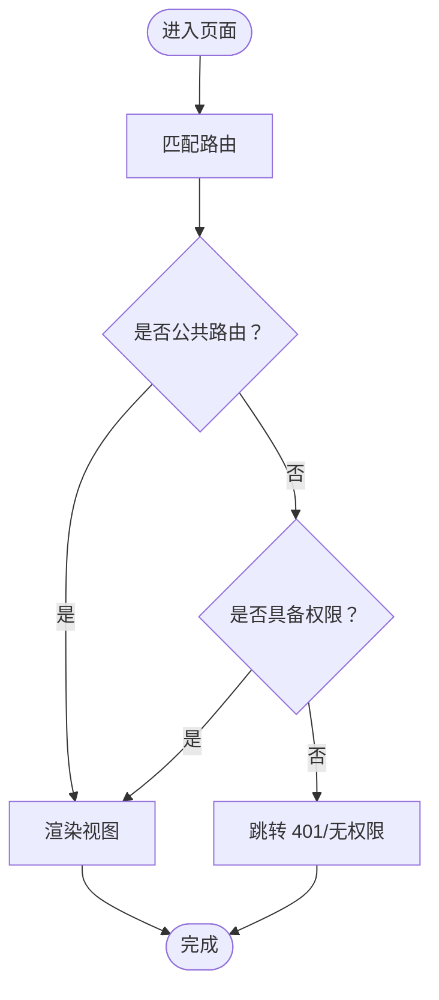

**图表来源**
- [ruoyi-ui/src/router/index.js:32-165](file://ruoyi-ui/src/router/index.js#L32-L165)

**章节来源**
- [ruoyi-ui/src/router/index.js:1-184](file://ruoyi-ui/src/router/index.js#L1-L184)

### PC 管理后台：状态管理（Vuex）
- 模块划分
  - app、dict、user、tagsView、permission、settings 等模块职责清晰。
- Getter 与派生状态
  - 通过 getters 提供主题、设备、侧边栏状态等派生数据。
- 与布局联动
  - 布局组件通过 mapState 读取状态，驱动 UI 行为。

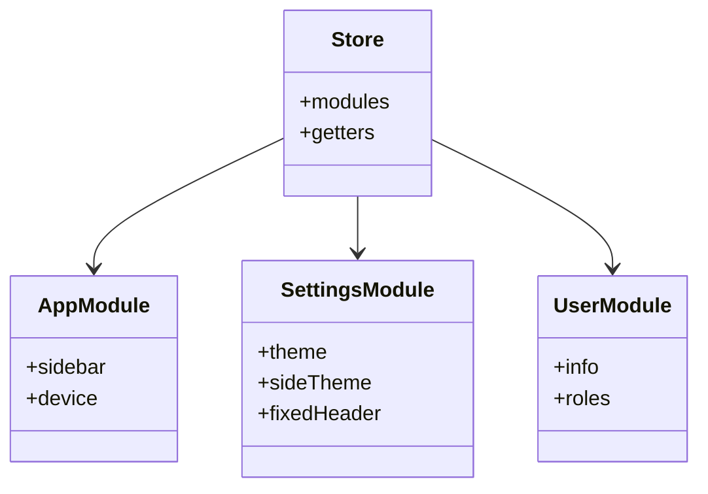

**图表来源**
- [ruoyi-ui/src/store/index.js:1-26](file://ruoyi-ui/src/store/index.js#L1-L26)
- [ruoyi-ui/src/settings.js:1-57](file://ruoyi-ui/src/settings.js#L1-L57)

**章节来源**
- [ruoyi-ui/src/store/index.js:1-26](file://ruoyi-ui/src/store/index.js#L1-L26)
- [ruoyi-ui/src/settings.js:1-57](file://ruoyi-ui/src/settings.js#L1-L57)

### PC 管理后台：布局与主题
- 布局组件
  - 侧边栏、顶部导航、标签页、设置面板、主内容区域。
  - 响应式处理：移动端抽屉、侧边栏开关、固定头部宽度计算。
- 主题与设置
  - 通过 settings.js 控制主题、侧边栏、标签页、固定头等。
  - App.vue 中挂载主题选择器，运行时可切换。

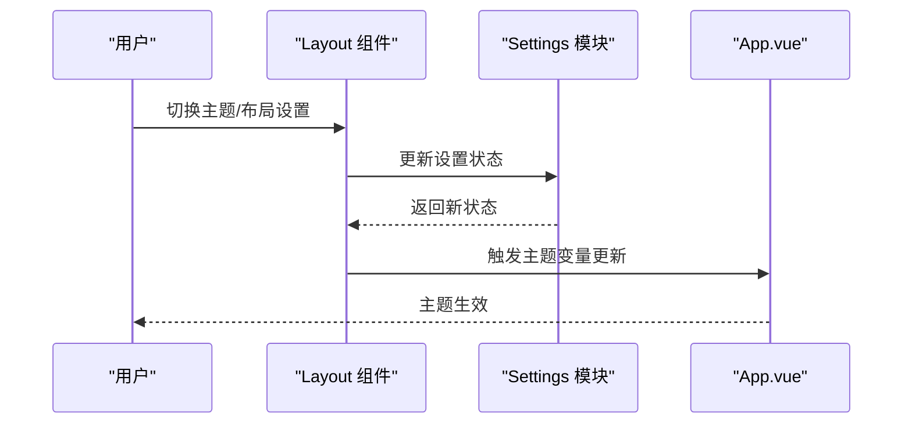

**图表来源**
- [ruoyi-ui/src/layout/index.vue:1-116](file://ruoyi-ui/src/layout/index.vue#L1-L116)
- [ruoyi-ui/src/settings.js:1-57](file://ruoyi-ui/src/settings.js#L1-L57)
- [ruoyi-ui/src/App.vue:1-21](file://ruoyi-ui/src/App.vue#L1-L21)

**章节来源**
- [ruoyi-ui/src/layout/index.vue:1-116](file://ruoyi-ui/src/layout/index.vue#L1-L116)
- [ruoyi-ui/src/App.vue:1-21](file://ruoyi-ui/src/App.vue#L1-L21)

### PC 管理后台：网络层与错误处理
- Axios 拦截器
  - 请求：自动设置 Authorization、处理 FormData、GET 参数序列化、防重复提交。
  - 响应：统一错误码映射、401 重新登录弹窗、500/601 提示、二进制流下载。
- 下载工具
  - download 方法封装 Blob 保存与错误提示。

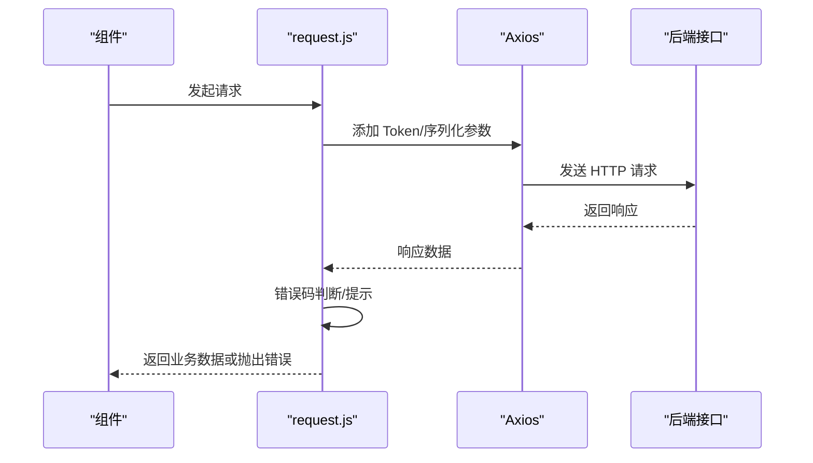

**图表来源**
- [ruoyi-ui/src/utils/request.js:1-161](file://ruoyi-ui/src/utils/request.js#L1-L161)

**章节来源**
- [ruoyi-ui/src/utils/request.js:1-161](file://ruoyi-ui/src/utils/request.js#L1-L161)

### 移动端 H5：页面路由与分包
- 页面声明
  - pages.json 统一声明主包与多个 subPackages，支持 tabBar、导航栏样式与标题。
- 分包策略
  - 将高频但非首屏使用的页面拆分为子包，降低首屏体积。
- H5 代理
  - manifest.json 的 h5.devServer.proxy 将 /app、/h5、/profile 等前缀转发至后端。

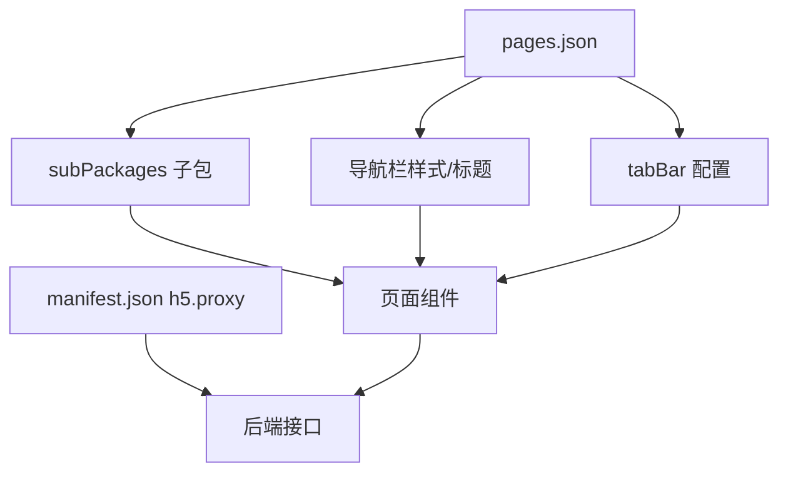

**图表来源**
- [uniapp-h5/pages.json:1-324](file://uniapp-h5/pages.json#L1-L324)
- [uniapp-h5/manifest.json:81-104](file://uniapp-h5/manifest.json#L81-L104)

**章节来源**
- [uniapp-h5/pages.json:1-324](file://uniapp-h5/pages.json#L1-L324)
- [uniapp-h5/manifest.json:1-107](file://uniapp-h5/manifest.json#L1-L107)

### 移动端 H5：登录校验与功能开关
- 登录校验
  - authCheck 混入提供 checkLogin，统一从本地存储读取用户信息与 token，未登录则跳转登录页。
- 功能开关
  - feature-flags 控制业务入口显隐，便于灰度与快速上线。

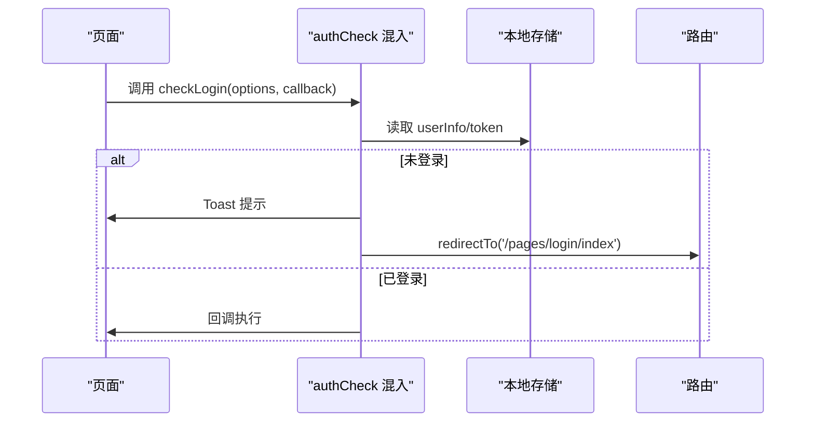

**图表来源**
- [uniapp-h5/mixins/authCheck.js:16-47](file://uniapp-h5/mixins/authCheck.js#L16-L47)

**章节来源**
- [uniapp-h5/mixins/authCheck.js:1-49](file://uniapp-h5/mixins/authCheck.js#L1-L49)
- [uniapp-h5/config/feature-flags.js:1-13](file://uniapp-h5/config/feature-flags.js#L1-L13)

### 移动端 H5：通用弹窗组件
- 能力
  - 支持标题、内容、遮罩点击关闭；富文本渲染并自动注入图片行内样式，保证在小程序环境下显示正确。
- 交互
  - 点击遮罩可配置是否关闭；底部按钮统一样式与文案。

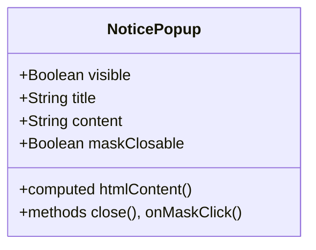

**图表来源**
- [uniapp-h5/components/notice-popup/notice-popup.vue:28-67](file://uniapp-h5/components/notice-popup/notice-popup.vue#L28-L67)

**章节来源**
- [uniapp-h5/components/notice-popup/notice-popup.vue:1-166](file://uniapp-h5/components/notice-popup/notice-popup.vue#L1-L166)

## 货币格式化统一改进

### 全局货币格式化函数
PC 管理后台在退租页面实现了统一的货币格式化函数，确保所有价格显示的一致性：

- **函数实现**：在 `checkout/index.vue` 中定义了 `fmt()` 方法，专门用于格式化价格显示
- **格式化规则**：所有价格强制保留两位小数，使用 `toFixed(2)` 方法
- **输入验证**：对空值、null、undefined 和无效数字进行处理，统一返回 '0.00'

### 价格显示应用场景
货币格式化功能广泛应用于以下场景：

- **月租金显示**：`¥{{ fmt(currentForm.rentPrice) }}`
- **押金显示**：`¥{{ fmt(currentForm.deposit) }}`
- **账单金额**：`¥{{ fmt(scope.row.billAmount) }}`
- **已付金额**：`¥{{ fmt(scope.row.paidAmount) }}`
- **未付金额**：`¥{{ fmt(scope.row.unpaidAmount) }}`
- **退款金额**：`¥{{ fmt(detailForm.refundAmount) }}`

### 计算精度优化
除了格式化显示外，系统还在多个计算场景中使用 `toFixed(2)` 确保计算结果的精度：

- **总已付金额**：`return sum.toFixed(2)`
- **总未付金额**：`return sum.toFixed(2)`
- **应退租金**：`return sum.toFixed(2)`
- **初始应退总额**：`return Math.max(0, deposit + refundableRent - penalty - damage - water - electric - gas - heating - property - unpaid)`

### 移动端货币格式化
移动端 H5 应用同样遵循统一的货币格式化标准，在页面中使用类似的方法确保价格显示的一致性。

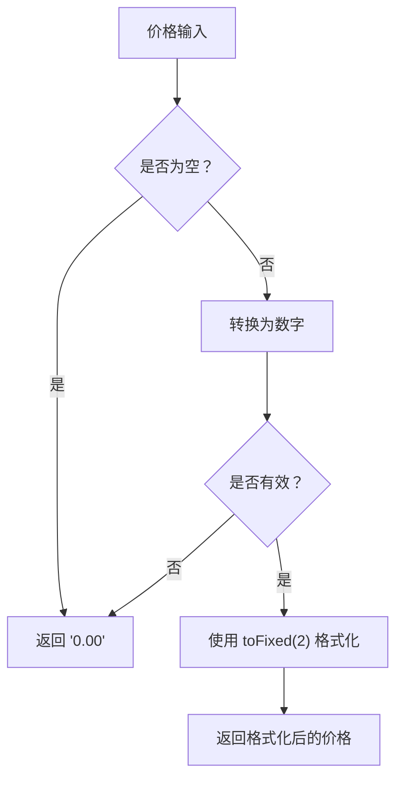

**图表来源**
- [ruoyi-ui/src/views/gangzhu/checkout/index.vue:730-736](file://ruoyi-ui/src/views/gangzhu/checkout/index.vue#L730-L736)

**章节来源**
- [ruoyi-ui/src/views/gangzhu/checkout/index.vue:720-736](file://ruoyi-ui/src/views/gangzhu/checkout/index.vue#L720-L736)
- [ruoyi-ui/src/views/gangzhu/checkout/index.vue:730-736](file://ruoyi-ui/src/views/gangzhu/checkout/index.vue#L730-L736)

## 依赖关系分析
- PC 管理后台
  - 依赖：Vue、Element UI、Axios、Vuex、Vue Router、ECharts、SortableJS、Photo-Sphere Viewer 等。
  - 构建：webpack-chain 配置 SVG 加载、Gzip 压缩、SplitChunks、runtimeChunk 单独提取。
  - 货币格式化：通过全局方法和局部方法实现统一的价格显示格式化。
- 移动端 H5
  - 依赖：smooth-signature（签名场景）等。
  - 平台：manifest.json 配置 Android/iOS 权限、H5 代理、小程序权限等。

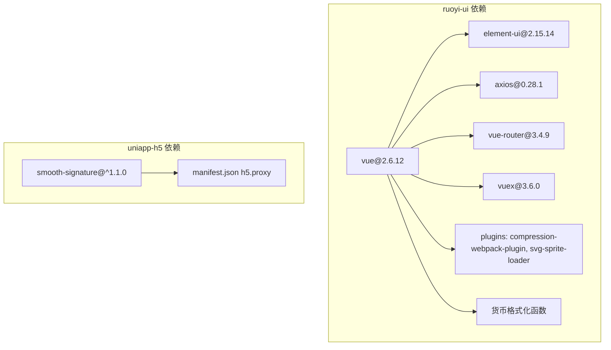

**图表来源**
- [ruoyi-ui/package.json:26-51](file://ruoyi-ui/package.json#L26-L51)
- [ruoyi-ui/vue.config.js:80-136](file://ruoyi-ui/vue.config.js#L80-L136)
- [uniapp-h5/package.json:2-4](file://uniapp-h5/package.json#L2-L4)
- [uniapp-h5/manifest.json:81-104](file://uniapp-h5/manifest.json#L81-L104)

**章节来源**
- [ruoyi-ui/package.json:1-74](file://ruoyi-ui/package.json#L1-L74)
- [ruoyi-ui/vue.config.js:1-138](file://ruoyi-ui/vue.config.js#L1-L138)
- [uniapp-h5/package.json:1-6](file://uniapp-h5/package.json#L1-L6)
- [uniapp-h5/manifest.json:1-107](file://uniapp-h5/manifest.json#L1-L107)

## 性能考量
- PC 管理后台
  - Gzip 压缩与 SplitChunks：对第三方库、Element UI、公共组件进行分包，减少初始包体。
  - runtimeChunk 单独提取，提升缓存命中率。
  - SVG 图标按需加载，避免全局引入导致体积膨胀。
  - 生产环境关闭 source map，减少构建体积。
  - 货币格式化性能优化：`toFixed(2)` 方法性能稳定，适用于大量价格显示场景。
- 移动端 H5
  - 分包策略：将非首屏页面拆分，降低首屏加载时间。
  - H5 代理：开发阶段直连后端，减少跨域与额外网关成本。
  - 组件按需：富文本图片注入行内样式，避免外部样式解析开销。

**章节来源**
- [ruoyi-ui/vue.config.js:61-136](file://ruoyi-ui/vue.config.js#L61-L136)
- [uniapp-h5/pages.json:47-283](file://uniapp-h5/pages.json#L47-L283)
- [uniapp-h5/manifest.json:87-103](file://uniapp-h5/manifest.json#L87-L103)
- [uniapp-h5/components/notice-popup/notice-popup.vue:40-54](file://uniapp-h5/components/notice-popup/notice-popup.vue#L40-L54)

## 故障排查指南
- PC 管理后台
  - 登录失效：响应拦截器检测 401，弹出重新登录确认，确认后清空状态并跳转首页。
  - 重复提交：POST/PUT 请求在一定时间内相同数据会被拦截，避免重复操作。
  - 网络异常：统一错误提示，包含超时、连接异常等。
  - 货币格式化问题：检查 `fmt()` 函数的输入参数，确保传入有效的数字或可转换为数字的字符串。
- 移动端 H5
  - 登录态缺失：authCheck 混入统一拦截，Toast 提示并跳转登录页。
  - 页面白屏：检查 pages.json 页面路径与分包 root 是否正确。
  - H5 代理失败：确认 manifest.json h5.devServer.proxy 配置与后端接口一致。

**章节来源**
- [ruoyi-ui/src/utils/request.js:82-131](file://ruoyi-ui/src/utils/request.js#L82-L131)
- [uniapp-h5/mixins/authCheck.js:16-47](file://uniapp-h5/mixins/authCheck.js#L16-L47)
- [uniapp-h5/pages.json:1-324](file://uniapp-h5/pages.json#L1-L324)
- [uniapp-h5/manifest.json:87-103](file://uniapp-h5/manifest.json#L87-L103)

## 结论
港好住前端体系在 PC 端依托 Vue/Element 的成熟生态与若依模板，形成标准化的路由、状态、布局与网络层；在移动端采用 uni-app 实现多端统一，通过 pages.json 与 manifest.json 精细控制页面与平台能力。通过实施货币格式化统一改进，所有价格显示都保持两位小数格式，显著提升了用户体验的一致性和专业性。整体架构清晰、组件复用度高、性能优化策略明确，适合在复杂业务场景下持续演进。

## 附录
- 组件开发规范与最佳实践
  - 组件命名：语义化、可读性强；目录按功能聚合。
  - Props/Events：明确类型与默认值；事件命名采用 onXxx。
  - 样式管理：优先使用 scoped 与 CSS Modules；避免全局污染。
  - 资源优化：图片懒加载、SVG 图标按需引入、组件按需加载。
  - 调试与测试：统一错误提示、埋点上报、性能指标采集。
  - 货币格式化：统一使用 `fmt()` 函数进行价格格式化，确保两位小数显示。
- 构建与发布
  - PC 端：使用 npm scripts 启动 dev/build/stage；生产构建开启 Gzip 与分包。
  - H5 端：开发使用 H5 代理直连后端；发布前核对 pages.json 与 manifest.json。
- 货币格式化最佳实践
  - 在所有涉及价格显示的场景中统一使用格式化函数
  - 对于计算结果，及时使用 `toFixed(2)` 保持精度一致
  - 处理边界情况：空值、null、undefined 和无效数字的统一处理
  - 确保前后端数据格式一致，避免格式化冲突