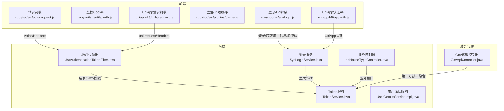
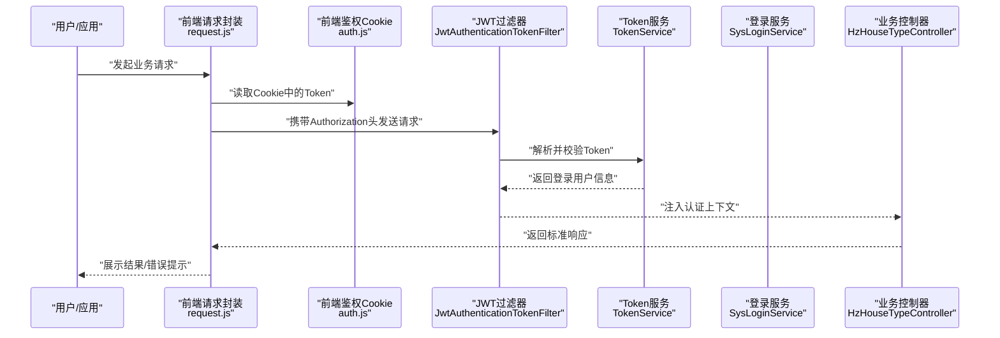
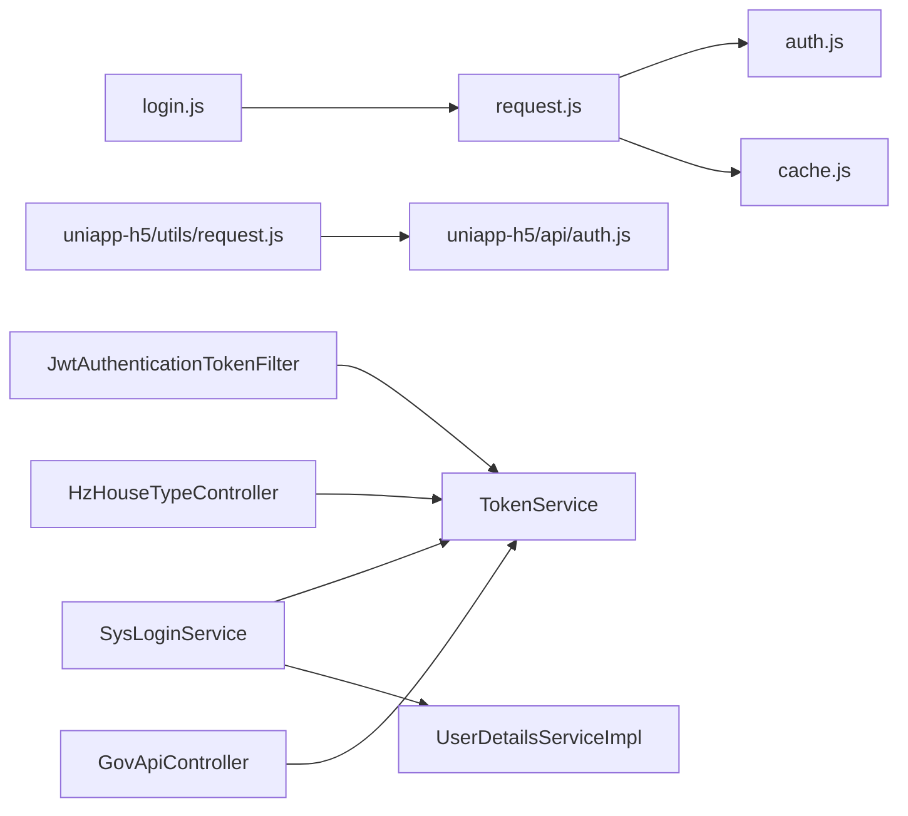

# API接口集成

<cite>
**本文引用的文件**
- [ruoyi-ui/src/utils/request.js](file://ruoyi-ui/src/utils/request.js)
- [ruoyi-ui/src/utils/auth.js](file://ruoyi-ui/src/utils/auth.js)
- [ruoyi-ui/src/api/login.js](file://ruoyi-ui/src/api/login.js)
- [ruoyi-ui/src/plugins/cache.js](file://ruoyi-ui/src/plugins/cache.js)
- [ruoyi-framework/src/main/java/com/ruoyi/framework/security/filter/JwtAuthenticationTokenFilter.java](file://ruoyi-framework/src/main/java/com/ruoyi/framework/security/filter/JwtAuthenticationTokenFilter.java)
- [ruoyi-framework/src/main/java/com/ruoyi/framework/web/service/TokenService.java](file://ruoyi-framework/src/main/java/com/ruoyi/framework/web/service/TokenService.java)
- [ruoyi-framework/src/main/java/com/ruoyi/framework/web/service/SysLoginService.java](file://ruoyi-framework/src/main/java/com/ruoyi/framework/web/service/SysLoginService.java)
- [ruoyi-framework/src/main/java/com/ruoyi/framework/web/service/UserDetailsServiceImpl.java](file://ruoyi-framework/src/main/java/com/ruoyi/framework/web/service/UserDetailsServiceImpl.java)
- [ruoyi-system/src/main/java/com/ruoyi/system/controller/HzHouseTypeController.java](file://ruoyi-system/src/main/java/com/ruoyi/system/controller/HzHouseTypeController.java)
- [ghz-gov-proxy/src/main/java/com/ghz/gov/controller/GovApiController.java](file://ghz-gov-proxy/src/main/java/com/ghz/gov/controller/GovApiController.java)
- [uniapp-h5/utils/request.js](file://uniapp-h5/utils/request.js)
- [uniapp-h5/api/auth.js](file://uniapp-h5/api/auth.js)
</cite>

## 目录
1. [引言](#引言)
2. [项目结构](#项目结构)
3. [核心组件](#核心组件)
4. [架构总览](#架构总览)
5. [详细组件分析](#详细组件分析)
6. [依赖分析](#依赖分析)
7. [性能考虑](#性能考虑)
8. [故障排查指南](#故障排查指南)
9. [结论](#结论)
10. [附录](#附录)

## 引言
本文件面向API接口集成场景，系统性梳理前后端对接方案，涵盖请求封装、响应处理、错误管理、数据缓存、接口分类（业务接口、系统接口、第三方接口）、认证机制（token管理、权限验证、自动刷新、登出处理）、数据处理流程（转换、格式化、本地存储、状态同步），并给出最佳实践与性能优化建议。文档以仓库中的真实代码为依据，配合可视化图示帮助读者快速理解与落地。

## 项目结构
本项目由三部分构成：
- 前端（Vue 2 + Element UI）：统一请求封装、鉴权Cookie、会话/本地缓存、业务API封装
- 后端（Spring Boot + Spring Security + JWT）：统一拦截器、Token服务、登录服务、业务控制器
- 政务数据代理（Gov Proxy）：对外暴露REST接口，内部聚合第三方政务数据

图表来源
- [ruoyi-ui/src/utils/request.js:1-161](file://ruoyi-ui/src/utils/request.js#L1-L161)
- [ruoyi-ui/src/utils/auth.js:1-16](file://ruoyi-ui/src/utils/auth.js#L1-L16)
- [ruoyi-ui/src/api/login.js:1-60](file://ruoyi-ui/src/api/login.js#L1-L60)
- [ruoyi-ui/src/plugins/cache.js:1-80](file://ruoyi-ui/src/plugins/cache.js#L1-L80)
- [ruoyi-framework/src/main/java/com/ruoyi/framework/security/filter/JwtAuthenticationTokenFilter.java:1-45](file://ruoyi-framework/src/main/java/com/ruoyi/framework/security/filter/JwtAuthenticationTokenFilter.java#L1-L45)
- [ruoyi-framework/src/main/java/com/ruoyi/framework/web/service/TokenService.java:1-233](file://ruoyi-framework/src/main/java/com/ruoyi/framework/web/service/TokenService.java#L1-L233)
- [ruoyi-framework/src/main/java/com/ruoyi/framework/web/service/SysLoginService.java:1-177](file://ruoyi-framework/src/main/java/com/ruoyi/framework/web/service/SysLoginService.java#L1-L177)
- [ruoyi-framework/src/main/java/com/ruoyi/framework/web/service/UserDetailsServiceImpl.java:1-67](file://ruoyi-framework/src/main/java/com/ruoyi/framework/web/service/UserDetailsServiceImpl.java#L1-L67)
- [ruoyi-system/src/main/java/com/ruoyi/system/controller/HzHouseTypeController.java:1-209](file://ruoyi-system/src/main/java/com/ruoyi/system/controller/HzHouseTypeController.java#L1-L209)
- [ghz-gov-proxy/src/main/java/com/ghz/gov/controller/GovApiController.java:1-149](file://ghz-gov-proxy/src/main/java/com/ghz/gov/controller/GovApiController.java#L1-L149)
- [uniapp-h5/utils/request.js:1-135](file://uniapp-h5/utils/request.js#L1-L135)
- [uniapp-h5/api/auth.js:1-55](file://uniapp-h5/api/auth.js#L1-L55)

章节来源
- [ruoyi-ui/src/utils/request.js:1-161](file://ruoyi-ui/src/utils/request.js#L1-L161)
- [ruoyi-framework/src/main/java/com/ruoyi/framework/security/filter/JwtAuthenticationTokenFilter.java:1-45](file://ruoyi-framework/src/main/java/com/ruoyi/framework/security/filter/JwtAuthenticationTokenFilter.java#L1-L45)
- [ghz-gov-proxy/src/main/java/com/ghz/gov/controller/GovApiController.java:1-149](file://ghz-gov-proxy/src/main/java/com/ghz/gov/controller/GovApiController.java#L1-L149)

## 核心组件
- 前端请求封装与拦截
  - Axios实例、请求/响应拦截器、重复提交拦截、下载处理、错误提示与重定向登录
  - 参考路径：[ruoyi-ui/src/utils/request.js:1-161](file://ruoyi-ui/src/utils/request.js#L1-L161)
- 前端鉴权与缓存
  - Cookie存储Token、会话/本地缓存工具
  - 参考路径：[ruoyi-ui/src/utils/auth.js:1-16](file://ruoyi-ui/src/utils/auth.js#L1-L16)、[ruoyi-ui/src/plugins/cache.js:1-80](file://ruoyi-ui/src/plugins/cache.js#L1-L80)
- 登录API封装
  - 登录、注册、获取用户信息、退出、验证码
  - 参考路径：[ruoyi-ui/src/api/login.js:1-60](file://ruoyi-ui/src/api/login.js#L1-L60)
- 后端JWT过滤器与Token服务
  - 过滤器解析请求中的Token并注入认证上下文；Token服务负责签发、刷新、校验、Redis缓存
  - 参考路径：[ruoyi-framework/src/main/java/com/ruoyi/framework/security/filter/JwtAuthenticationTokenFilter.java:1-45](file://ruoyi-framework/src/main/java/com/ruoyi/framework/security/filter/JwtAuthenticationTokenFilter.java#L1-L45)、[ruoyi-framework/src/main/java/com/ruoyi/framework/web/service/TokenService.java:1-233](file://ruoyi-framework/src/main/java/com/ruoyi/framework/web/service/TokenService.java#L1-L233)
- 登录与用户服务
  - 登录校验、验证码、前置校验、记录登录日志、生成Token
  - 参考路径：[ruoyi-framework/src/main/java/com/ruoyi/framework/web/service/SysLoginService.java:1-177](file://ruoyi-framework/src/main/java/com/ruoyi/framework/web/service/SysLoginService.java#L1-L177)、[ruoyi-framework/src/main/java/com/ruoyi/framework/web/service/UserDetailsServiceImpl.java:1-67](file://ruoyi-framework/src/main/java/com/ruoyi/framework/web/service/UserDetailsServiceImpl.java#L1-L67)
- 业务接口示例
  - 户型管理REST接口，包含分页、导出、CRUD、图片管理、批量下发等
  - 参考路径：[ruoyi-system/src/main/java/com/ruoyi/system/controller/HzHouseTypeController.java:1-209](file://ruoyi-system/src/main/java/com/ruoyi/system/controller/HzHouseTypeController.java#L1-L209)
- 政务代理接口
  - 对外提供健康检查、婚姻/社保/公租房/不动产查询、Token状态、API Key鉴权
  - 参考路径：[ghz-gov-proxy/src/main/java/com/ghz/gov/controller/GovApiController.java:1-149](file://ghz-gov-proxy/src/main/java/com/ghz/gov/controller/GovApiController.java#L1-L149)
- UniApp请求与认证
  - 基于uni.request的统一请求封装、GET/POST/PUT/DELETE、Authorization头、业务错误提示
  - 参考路径：[uniapp-h5/utils/request.js:1-135](file://uniapp-h5/utils/request.js#L1-L135)、[uniapp-h5/api/auth.js:1-55](file://uniapp-h5/api/auth.js#L1-L55)

章节来源
- [ruoyi-ui/src/utils/request.js:1-161](file://ruoyi-ui/src/utils/request.js#L1-L161)
- [ruoyi-ui/src/utils/auth.js:1-16](file://ruoyi-ui/src/utils/auth.js#L1-L16)
- [ruoyi-ui/src/api/login.js:1-60](file://ruoyi-ui/src/api/login.js#L1-L60)
- [ruoyi-ui/src/plugins/cache.js:1-80](file://ruoyi-ui/src/plugins/cache.js#L1-L80)
- [ruoyi-framework/src/main/java/com/ruoyi/framework/security/filter/JwtAuthenticationTokenFilter.java:1-45](file://ruoyi-framework/src/main/java/com/ruoyi/framework/security/filter/JwtAuthenticationTokenFilter.java#L1-L45)
- [ruoyi-framework/src/main/java/com/ruoyi/framework/web/service/TokenService.java:1-233](file://ruoyi-framework/src/main/java/com/ruoyi/framework/web/service/TokenService.java#L1-L233)
- [ruoyi-framework/src/main/java/com/ruoyi/framework/web/service/SysLoginService.java:1-177](file://ruoyi-framework/src/main/java/com/ruoyi/framework/web/service/SysLoginService.java#L1-L177)
- [ruoyi-framework/src/main/java/com/ruoyi/framework/web/service/UserDetailsServiceImpl.java:1-67](file://ruoyi-framework/src/main/java/com/ruoyi/framework/web/service/UserDetailsServiceImpl.java#L1-L67)
- [ruoyi-system/src/main/java/com/ruoyi/system/controller/HzHouseTypeController.java:1-209](file://ruoyi-system/src/main/java/com/ruoyi/system/controller/HzHouseTypeController.java#L1-L209)
- [ghz-gov-proxy/src/main/java/com/ghz/gov/controller/GovApiController.java:1-149](file://ghz-gov-proxy/src/main/java/com/ghz/gov/controller/GovApiController.java#L1-L149)
- [uniapp-h5/utils/request.js:1-135](file://uniapp-h5/utils/request.js#L1-L135)
- [uniapp-h5/api/auth.js:1-55](file://uniapp-h5/api/auth.js#L1-L55)

## 架构总览
从前端到后端的典型调用链路如下：

图表来源
- [ruoyi-ui/src/utils/request.js:1-161](file://ruoyi-ui/src/utils/request.js#L1-L161)
- [ruoyi-ui/src/utils/auth.js:1-16](file://ruoyi-ui/src/utils/auth.js#L1-L16)
- [ruoyi-framework/src/main/java/com/ruoyi/framework/security/filter/JwtAuthenticationTokenFilter.java:1-45](file://ruoyi-framework/src/main/java/com/ruoyi/framework/security/filter/JwtAuthenticationTokenFilter.java#L1-L45)
- [ruoyi-framework/src/main/java/com/ruoyi/framework/web/service/TokenService.java:1-233](file://ruoyi-framework/src/main/java/com/ruoyi/framework/web/service/TokenService.java#L1-L233)
- [ruoyi-framework/src/main/java/com/ruoyi/framework/web/service/SysLoginService.java:1-177](file://ruoyi-framework/src/main/java/com/ruoyi/framework/web/service/SysLoginService.java#L1-L177)
- [ruoyi-system/src/main/java/com/ruoyi/system/controller/HzHouseTypeController.java:1-209](file://ruoyi-system/src/main/java/com/ruoyi/system/controller/HzHouseTypeController.java#L1-L209)

## 详细组件分析

### 前端请求封装与拦截（ruoyi-ui）
- 请求拦截
  - 自动移除FormData的Content-Type以支持multipart上传
  - 自动附加Authorization头（若存在Token且未显式禁用）
  - GET请求将params拼接至URL
  - 防重复提交：对POST/PUT请求在会话缓存中对比上次请求的URL、数据与时间窗口，避免短时间内的重复提交
- 响应拦截
  - 二进制数据直接透传
  - 401：弹窗提示并触发登出逻辑
  - 500/601：错误提示
  - 其他非200：错误提示并拒绝Promise
- 下载方法
  - 支持Blob下载与错误提示，关闭加载遮罩
- 参考路径
  - [ruoyi-ui/src/utils/request.js:1-161](file://ruoyi-ui/src/utils/request.js#L1-L161)

章节来源
- [ruoyi-ui/src/utils/request.js:1-161](file://ruoyi-ui/src/utils/request.js#L1-L161)

### 前端鉴权与缓存（ruoyi-ui）
- TokenKey使用Cookie存储，提供获取/设置/移除方法
- 会话/本地缓存工具：支持JSON序列化与反序列化
- 参考路径
  - [ruoyi-ui/src/utils/auth.js:1-16](file://ruoyi-ui/src/utils/auth.js#L1-L16)
  - [ruoyi-ui/src/plugins/cache.js:1-80](file://ruoyi-ui/src/plugins/cache.js#L1-L80)

章节来源
- [ruoyi-ui/src/utils/auth.js:1-16](file://ruoyi-ui/src/utils/auth.js#L1-L16)
- [ruoyi-ui/src/plugins/cache.js:1-80](file://ruoyi-ui/src/plugins/cache.js#L1-L80)

### 登录API封装（ruoyi-ui）
- 提供登录、注册、获取用户信息、退出、验证码接口
- 通过headers控制是否携带Token与是否启用重复提交拦截
- 参考路径
  - [ruoyi-ui/src/api/login.js:1-60](file://ruoyi-ui/src/api/login.js#L1-L60)

章节来源
- [ruoyi-ui/src/api/login.js:1-60](file://ruoyi-ui/src/api/login.js#L1-L60)

### 后端JWT过滤器与Token服务
- JWT过滤器
  - 从请求中提取Token，解析登录用户，注入认证上下文
  - 参考路径：[ruoyi-framework/src/main/java/com/ruoyi/framework/security/filter/JwtAuthenticationTokenFilter.java:1-45](file://ruoyi-framework/src/main/java/com/ruoyi/framework/security/filter/JwtAuthenticationTokenFilter.java#L1-L45)
- Token服务
  - 生成/刷新Token有效期，自动在到期前20分钟刷新
  - Redis缓存用户信息，按uuid键管理
  - 解析/签发JWT，提取用户名
  - 参考路径：[ruoyi-framework/src/main/java/com/ruoyi/framework/web/service/TokenService.java:1-233](file://ruoyi-framework/src/main/java/com/ruoyi/framework/web/service/TokenService.java#L1-L233)

章节来源
- [ruoyi-framework/src/main/java/com/ruoyi/framework/security/filter/JwtAuthenticationTokenFilter.java:1-45](file://ruoyi-framework/src/main/java/com/ruoyi/framework/security/filter/JwtAuthenticationTokenFilter.java#L1-L45)
- [ruoyi-framework/src/main/java/com/ruoyi/framework/web/service/TokenService.java:1-233](file://ruoyi-framework/src/main/java/com/ruoyi/framework/web/service/TokenService.java#L1-L233)

### 登录与用户服务
- 登录服务
  - 验证码校验、前置校验、调用AuthenticationManager认证、记录登录日志、生成Token
  - 参考路径：[ruoyi-framework/src/main/java/com/ruoyi/framework/web/service/SysLoginService.java:1-177](file://ruoyi-framework/src/main/java/com/ruoyi/framework/web/service/SysLoginService.java#L1-L177)
- 用户详情服务
  - 加载用户、校验状态、构建LoginUser并注入权限
  - 参考路径：[ruoyi-framework/src/main/java/com/ruoyi/framework/web/service/UserDetailsServiceImpl.java:1-67](file://ruoyi-framework/src/main/java/com/ruoyi/framework/web/service/UserDetailsServiceImpl.java#L1-L67)

章节来源
- [ruoyi-framework/src/main/java/com/ruoyi/framework/web/service/SysLoginService.java:1-177](file://ruoyi-framework/src/main/java/com/ruoyi/framework/web/service/SysLoginService.java#L1-L177)
- [ruoyi-framework/src/main/java/com/ruoyi/framework/web/service/UserDetailsServiceImpl.java:1-67](file://ruoyi-framework/src/main/java/com/ruoyi/framework/web/service/UserDetailsServiceImpl.java#L1-L67)

### 业务接口示例（户型管理）
- 接口范围
  - 分页查询、导出、详情、新增、修改、删除、图片列表、批量保存图片、删除图片、批量下发图片与VR
- 权限注解
  - 使用@PreAuthorize控制具体操作权限
- 参考路径
  - [ruoyi-system/src/main/java/com/ruoyi/system/controller/HzHouseTypeController.java:1-209](file://ruoyi-system/src/main/java/com/ruoyi/system/controller/HzHouseTypeController.java#L1-L209)

章节来源
- [ruoyi-system/src/main/java/com/ruoyi/system/controller/HzHouseTypeController.java:1-209](file://ruoyi-system/src/main/java/com/ruoyi/system/controller/HzHouseTypeController.java#L1-L209)

### 政务代理接口
- 对外接口
  - 健康检查、婚姻/社保/公租房/不动产查询、Token状态
- 认证方式
  - X-Api-Key头部校验
- 参考路径
  - [ghz-gov-proxy/src/main/java/com/ghz/gov/controller/GovApiController.java:1-149](file://ghz-gov-proxy/src/main/java/com/ghz/gov/controller/GovApiController.java#L1-L149)

章节来源
- [ghz-gov-proxy/src/main/java/com/ghz/gov/controller/GovApiController.java:1-149](file://ghz-gov-proxy/src/main/java/com/ghz/gov/controller/GovApiController.java#L1-L149)

### UniApp请求与认证
- 统一封装
  - 基于uni.request，自动拼接BASE_URL、添加Authorization头
  - 标准响应格式：{ code, msg, data }，200或未定义表示成功
- 认证API
  - 登录、获取用户信息、更新信息、退出、郑好办/微信登录
- 参考路径
  - [uniapp-h5/utils/request.js:1-135](file://uniapp-h5/utils/request.js#L1-L135)
  - [uniapp-h5/api/auth.js:1-55](file://uniapp-h5/api/auth.js#L1-L55)

章节来源
- [uniapp-h5/utils/request.js:1-135](file://uniapp-h5/utils/request.js#L1-L135)
- [uniapp-h5/api/auth.js:1-55](file://uniapp-h5/api/auth.js#L1-L55)

## 依赖分析
- 前端
  - request.js依赖auth.js提供的Token、Element UI组件、cache插件、ruoyi工具函数
  - login.js依赖request.js
  - uniapp-h5的auth.js依赖uniapp-h5/utils/request.js
- 后端
  - JwtAuthenticationTokenFilter依赖TokenService
  - SysLoginService依赖AuthenticationManager、RedisCache、用户/配置服务、异步日志
  - UserDetailsServiceImpl依赖用户服务、密码服务、权限服务
  - 业务控制器依赖服务层与权限注解

图表来源
- [ruoyi-ui/src/utils/request.js:1-161](file://ruoyi-ui/src/utils/request.js#L1-L161)
- [ruoyi-ui/src/utils/auth.js:1-16](file://ruoyi-ui/src/utils/auth.js#L1-L16)
- [ruoyi-ui/src/plugins/cache.js:1-80](file://ruoyi-ui/src/plugins/cache.js#L1-L80)
- [ruoyi-ui/src/api/login.js:1-60](file://ruoyi-ui/src/api/login.js#L1-L60)
- [uniapp-h5/utils/request.js:1-135](file://uniapp-h5/utils/request.js#L1-L135)
- [uniapp-h5/api/auth.js:1-55](file://uniapp-h5/api/auth.js#L1-L55)
- [ruoyi-framework/src/main/java/com/ruoyi/framework/security/filter/JwtAuthenticationTokenFilter.java:1-45](file://ruoyi-framework/src/main/java/com/ruoyi/framework/security/filter/JwtAuthenticationTokenFilter.java#L1-L45)
- [ruoyi-framework/src/main/java/com/ruoyi/framework/web/service/TokenService.java:1-233](file://ruoyi-framework/src/main/java/com/ruoyi/framework/web/service/TokenService.java#L1-L233)
- [ruoyi-framework/src/main/java/com/ruoyi/framework/web/service/SysLoginService.java:1-177](file://ruoyi-framework/src/main/java/com/ruoyi/framework/web/service/SysLoginService.java#L1-L177)
- [ruoyi-framework/src/main/java/com/ruoyi/framework/web/service/UserDetailsServiceImpl.java:1-67](file://ruoyi-framework/src/main/java/com/ruoyi/framework/web/service/UserDetailsServiceImpl.java#L1-L67)
- [ruoyi-system/src/main/java/com/ruoyi/system/controller/HzHouseTypeController.java:1-209](file://ruoyi-system/src/main/java/com/ruoyi/system/controller/HzHouseTypeController.java#L1-L209)
- [ghz-gov-proxy/src/main/java/com/ghz/gov/controller/GovApiController.java:1-149](file://ghz-gov-proxy/src/main/java/com/ghz/gov/controller/GovApiController.java#L1-L149)

## 性能考虑
- 请求层面
  - 大体积POST数据跳过重复提交检测，避免Session缓存压力
  - GET请求参数拼接URL，减少不必要的请求体
- 响应层面
  - 二进制数据直接透传，避免额外序列化
  - 401统一登出，避免无效请求堆积
- 缓存层面
  - 会话缓存用于防重复提交，本地缓存用于轻量数据持久化
- Token层面
  - 到期前20分钟自动刷新，降低频繁登录成本
- 并发与降级
  - 建议对高频接口增加限流与熔断策略（结合网关/过滤器）

## 故障排查指南
- 前端常见问题
  - 401未登录/会话过期：弹窗提示并触发登出，检查Cookie与后端Token状态
  - 500/601：查看后端日志与错误码映射
  - 网络超时/连接异常：检查后端接口可用性与跨域配置
  - 重复提交：确认请求体与时间窗口，必要时禁用重复提交
  - 参考路径：[ruoyi-ui/src/utils/request.js:82-131](file://ruoyi-ui/src/utils/request.js#L82-L131)
- 后端常见问题
  - JWT解析失败：核对签名密钥与头部字段
  - 用户不存在/被停用：核对用户状态与权限
  - 登录失败：验证码/密码/白名单校验
  - 参考路径：[ruoyi-framework/src/main/java/com/ruoyi/framework/web/service/TokenService.java:62-83](file://ruoyi-framework/src/main/java/com/ruoyi/framework/web/service/TokenService.java#L62-L83)、[ruoyi-framework/src/main/java/com/ruoyi/framework/web/service/UserDetailsServiceImpl.java:37-60](file://ruoyi-framework/src/main/java/com/ruoyi/framework/web/service/UserDetailsServiceImpl.java#L37-L60)、[ruoyi-framework/src/main/java/com/ruoyi/framework/web/service/SysLoginService.java:63-100](file://ruoyi-framework/src/main/java/com/ruoyi/framework/web/service/SysLoginService.java#L63-L100)
- 政务代理问题
  - API Key缺失/错误：检查X-Api-Key头部
  - 参数缺失：确认必填字段
  - 参考路径：[ghz-gov-proxy/src/main/java/com/ghz/gov/controller/GovApiController.java:139-147](file://ghz-gov-proxy/src/main/java/com/ghz/gov/controller/GovApiController.java#L139-L147)

章节来源
- [ruoyi-ui/src/utils/request.js:82-131](file://ruoyi-ui/src/utils/request.js#L82-L131)
- [ruoyi-framework/src/main/java/com/ruoyi/framework/web/service/TokenService.java:62-83](file://ruoyi-framework/src/main/java/com/ruoyi/framework/web/service/TokenService.java#L62-L83)
- [ruoyi-framework/src/main/java/com/ruoyi/framework/web/service/UserDetailsServiceImpl.java:37-60](file://ruoyi-framework/src/main/java/com/ruoyi/framework/web/service/UserDetailsServiceImpl.java#L37-L60)
- [ruoyi-framework/src/main/java/com/ruoyi/framework/web/service/SysLoginService.java:63-100](file://ruoyi-framework/src/main/java/com/ruoyi/framework/web/service/SysLoginService.java#L63-L100)
- [ghz-gov-proxy/src/main/java/com/ghz/gov/controller/GovApiController.java:139-147](file://ghz-gov-proxy/src/main/java/com/ghz/gov/controller/GovApiController.java#L139-L147)

## 结论
本项目在前后端分别实现了统一的请求封装、鉴权与错误处理机制，并通过JWT实现无状态认证与自动刷新。业务接口采用细粒度权限控制，政务代理提供标准化第三方接口接入。建议在生产环境中进一步完善限流、熔断、缓存与监控体系，确保高并发下的稳定性与可观测性。

## 附录

### 接口分类与调用规范
- 业务接口
  - 示例：户型管理REST接口，支持分页、导出、CRUD、图片管理、批量下发
  - 参考路径：[ruoyi-system/src/main/java/com/ruoyi/system/controller/HzHouseTypeController.java:1-209](file://ruoyi-system/src/main/java/com/ruoyi/system/controller/HzHouseTypeController.java#L1-L209)
- 系统接口
  - 登录、用户信息、验证码、退出等
  - 参考路径：[ruoyi-ui/src/api/login.js:1-60](file://ruoyi-ui/src/api/login.js#L1-L60)、[ruoyi-framework/src/main/java/com/ruoyi/framework/web/service/SysLoginService.java:1-177](file://ruoyi-framework/src/main/java/com/ruoyi/framework/web/service/SysLoginService.java#L1-L177)
- 第三方接口
  - 政务代理：婚姻/社保/公租房/不动产查询，需API Key
  - 参考路径：[ghz-gov-proxy/src/main/java/com/ghz/gov/controller/GovApiController.java:1-149](file://ghz-gov-proxy/src/main/java/com/ghz/gov/controller/GovApiController.java#L1-L149)

### 认证机制与最佳实践
- Token管理
  - 前端：Cookie存储Token，请求头携带Authorization
  - 后端：JWT解析与Redis缓存，到期前自动刷新
  - 参考路径：[ruoyi-ui/src/utils/auth.js:1-16](file://ruoyi-ui/src/utils/auth.js#L1-L16)、[ruoyi-framework/src/main/java/com/ruoyi/framework/web/service/TokenService.java:133-141](file://ruoyi-framework/src/main/java/com/ruoyi/framework/web/service/TokenService.java#L133-L141)
- 权限验证
  - 使用@PreAuthorize注解控制接口权限
  - 参考路径：[ruoyi-system/src/main/java/com/ruoyi/system/controller/HzHouseTypeController.java:42-111](file://ruoyi-system/src/main/java/com/ruoyi/system/controller/HzHouseTypeController.java#L42-L111)
- 自动刷新与登出
  - 到期前20分钟刷新；401统一登出
  - 参考路径：[ruoyi-framework/src/main/java/com/ruoyi/framework/web/service/TokenService.java:133-141](file://ruoyi-framework/src/main/java/com/ruoyi/framework/web/service/TokenService.java#L133-L141)、[ruoyi-ui/src/utils/request.js:92-104](file://ruoyi-ui/src/utils/request.js#L92-L104)

### 数据处理流程与缓存
- 数据转换与格式化
  - 前端：GET参数拼接、二进制数据透传、标准响应格式
  - 后端：统一AjaxResult/表格数据结构
  - 参考路径：[ruoyi-ui/src/utils/request.js:37-43](file://ruoyi-ui/src/utils/request.js#L37-L43)、[ruoyi-system/src/main/java/com/ruoyi/system/controller/HzHouseTypeController.java:49-54](file://ruoyi-system/src/main/java/com/ruoyi/system/controller/HzHouseTypeController.java#L49-L54)
- 本地存储与状态同步
  - Cookie存储Token；会话/本地缓存用于防重复提交与轻量数据
  - 参考路径：[ruoyi-ui/src/utils/auth.js:1-16](file://ruoyi-ui/src/utils/auth.js#L1-L16)、[ruoyi-ui/src/plugins/cache.js:1-80](file://ruoyi-ui/src/plugins/cache.js#L1-L80)