# uni-app框架架构

<cite>
**本文档引用的文件**
- [App.vue](file://uniapp-h5/App.vue)
- [main.js](file://uniapp-h5/main.js)
- [pages.json](file://uniapp-h5/pages.json)
- [manifest.json](file://uniapp-h5/manifest.json)
- [config/index.js](file://uniapp-h5/config/index.js)
- [config/feature-flags.js](file://uniapp-h5/config/feature-flags.js)
- [mixins/authCheck.js](file://uniapp-h5/mixins/authCheck.js)
- [utils/request.js](file://uniapp-h5/utils/request.js)
- [components/notice-popup/notice-popup.vue](file://uniapp-h5/components/notice-popup/notice-popup.vue)
- [pages/index/index.vue](file://uniapp-h5/pages/index/index.vue)
- [pages/login/index.vue](file://uniapp-h5/pages/login/index.vue)
- [subpkg/my/profile.vue](file://uniapp-h5/subpkg/my/profile.vue)
- [api/auth.js](file://uniapp-h5/api/auth.js)
- [package.json](file://uniapp-h5/package.json)
</cite>

## 目录
1. [简介](#简介)
2. [项目结构](#项目结构)
3. [核心组件](#核心组件)
4. [架构概览](#架构概览)
5. [详细组件分析](#详细组件分析)
6. [依赖关系分析](#依赖关系分析)
7. [性能考虑](#性能考虑)
8. [故障排除指南](#故障排除指南)
9. [结论](#结论)

## 简介

本项目是一个基于uni-app框架开发的跨平台应用，支持H5、微信小程序等多种平台。该应用主要面向郑州航空港区的人才公寓服务平台，提供房源展示、在线申请、实名认证等功能。

uni-app作为跨平台开发框架，通过一套代码实现多端编译，支持Vue语法在不同平台间的统一运行。本项目展示了完整的uni-app架构设计，包括应用配置、页面路由、组件化开发、平台适配等核心技术。

## 项目结构

该项目采用标准的uni-app项目结构，主要目录组织如下：

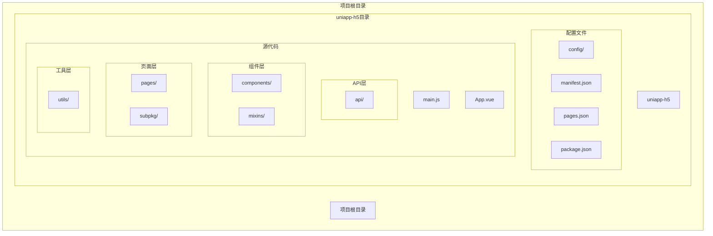

**图表来源**
- [main.js:1-30](file://uniapp-h5/main.js#L1-L30)
- [App.vue:1-98](file://uniapp-h5/App.vue#L1-L98)
- [pages.json:1-324](file://uniapp-h5/pages.json#L1-L324)

### 目录结构说明

- **config/**: 应用配置文件，包含环境配置和功能开关
- **api/**: API接口封装，按功能模块组织
- **components/**: 可复用的业务组件
- **mixins/**: 混入模块，提供通用功能
- **pages/**: 主包页面，包含应用的主要功能页面
- **subpkg/**: 分包页面，按功能模块拆分的子包
- **utils/**: 工具函数库，包括HTTP请求、数据处理等
- **static/**: 静态资源文件

**章节来源**
- [main.js:1-30](file://uniapp-h5/main.js#L1-L30)
- [App.vue:1-98](file://uniapp-h5/App.vue#L1-L98)
- [pages.json:1-324](file://uniapp-h5/pages.json#L1-L324)

## 核心组件

### 应用入口组件

应用的入口组件负责全局初始化和生命周期管理：

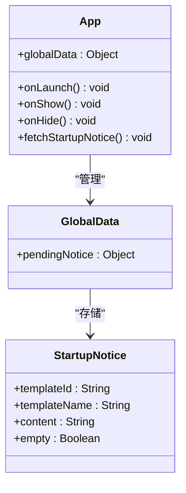

**图表来源**
- [App.vue:4-40](file://uniapp-h5/App.vue#L4-L40)

### 页面路由配置

应用采用pages.json进行页面路由配置，支持主包和分包结构：

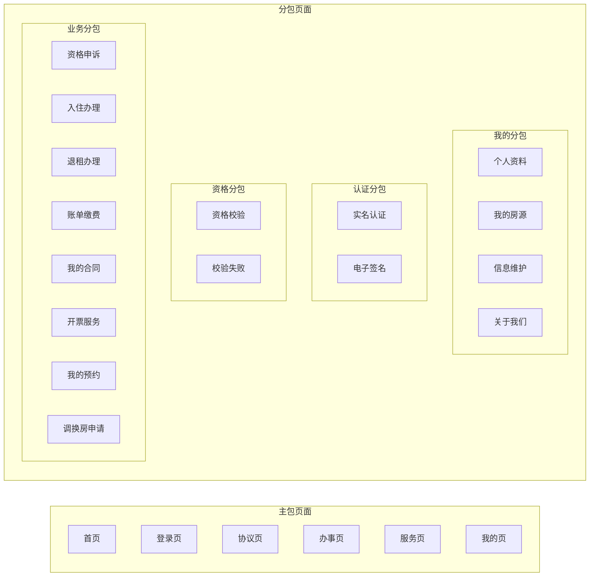

**图表来源**
- [pages.json:2-324](file://uniapp-h5/pages.json#L2-L324)

### HTTP请求封装

统一的HTTP请求工具提供了完整的API调用能力：

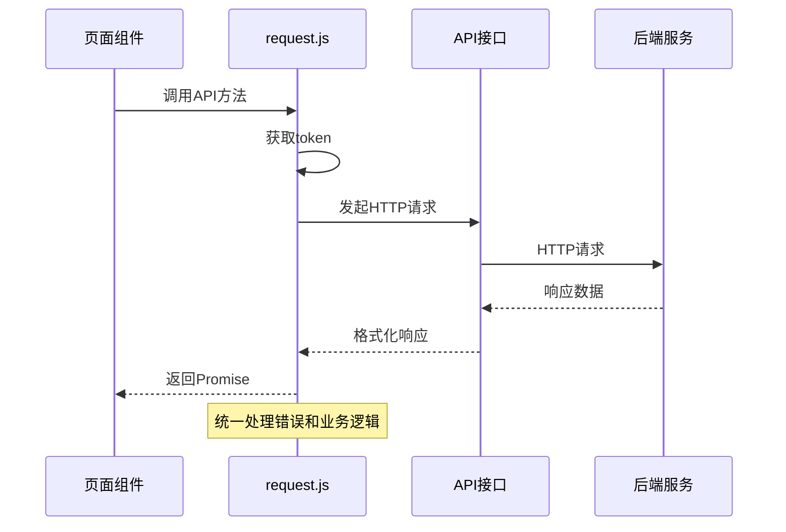

**图表来源**
- [utils/request.js:20-71](file://uniapp-h5/utils/request.js#L20-L71)

**章节来源**
- [App.vue:1-98](file://uniapp-h5/App.vue#L1-L98)
- [pages.json:1-324](file://uniapp-h5/pages.json#L1-L324)
- [utils/request.js:1-135](file://uniapp-h5/utils/request.js#L1-L135)

## 架构概览

### 整体架构设计

该uni-app应用采用分层架构设计，实现了清晰的关注点分离：

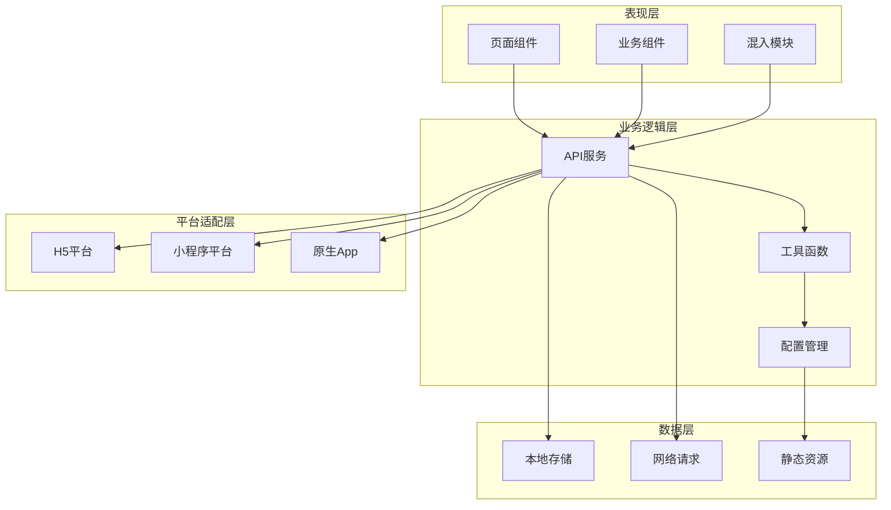

### 生命周期管理

应用采用Vue的生命周期钩子进行管理，支持多端统一：

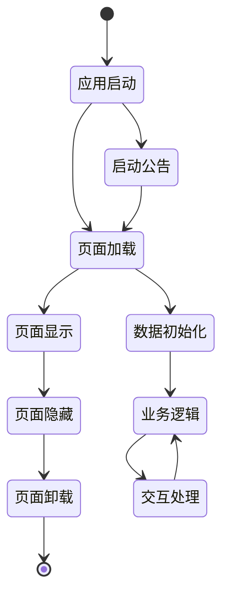

**图表来源**
- [App.vue:9-19](file://uniapp-h5/App.vue#L9-L19)
- [pages/index/index.vue:302-330](file://uniapp-h5/pages/index/index.vue#L302-L330)

**章节来源**
- [App.vue:1-98](file://uniapp-h5/App.vue#L1-L98)
- [pages/index/index.vue:302-330](file://uniapp-h5/pages/index/index.vue#L302-L330)

## 详细组件分析

### 登录页面组件

登录页面实现了多平台适配的登录逻辑：

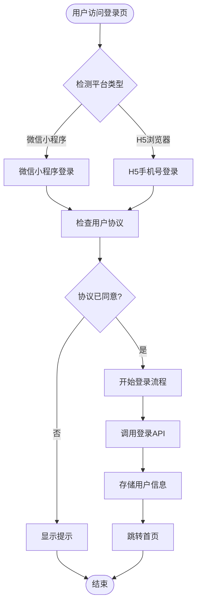

**图表来源**
- [pages/login/index.vue:115-182](file://uniapp-h5/pages/login/index.vue#L115-L182)
- [pages/login/index.vue:184-230](file://uniapp-h5/pages/login/index.vue#L184-L230)

#### 登录流程实现要点

1. **平台差异化处理**: 通过条件编译指令实现不同平台的差异化逻辑
2. **协议检查**: 强制用户同意服务协议才能进行登录
3. **用户信息存储**: 统一存储token、用户ID和用户信息
4. **页面跳转**: 成功登录后跳转到首页

**章节来源**
- [pages/login/index.vue:1-443](file://uniapp-h5/pages/login/index.vue#L1-L443)

### 首页组件

首页是应用的核心页面，集成了多种功能模块：

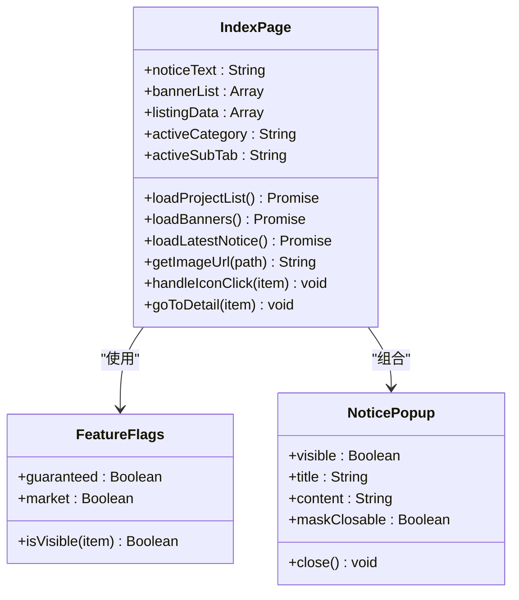

**图表来源**
- [pages/index/index.vue:224-772](file://uniapp-h5/pages/index/index.vue#L224-L772)
- [config/feature-flags.js:6-12](file://uniapp-h5/config/feature-flags.js#L6-L12)

#### 首页功能特性

1. **功能开关控制**: 通过配置文件控制功能模块的显示/隐藏
2. **动态数据加载**: 支持项目列表和房源列表的异步加载
3. **轮播图展示**: 提供动态轮播图展示功能
4. **通知公告**: 集成启动公告和最新通知功能
5. **分类筛选**: 支持不同类型房源的分类展示

**章节来源**
- [pages/index/index.vue:1-800](file://uniapp-h5/pages/index/index.vue#L1-L800)
- [config/feature-flags.js:1-13](file://uniapp-h5/config/feature-flags.js#L1-L13)

### 个人资料页面

个人资料页面展示了用户信息管理和编辑功能：

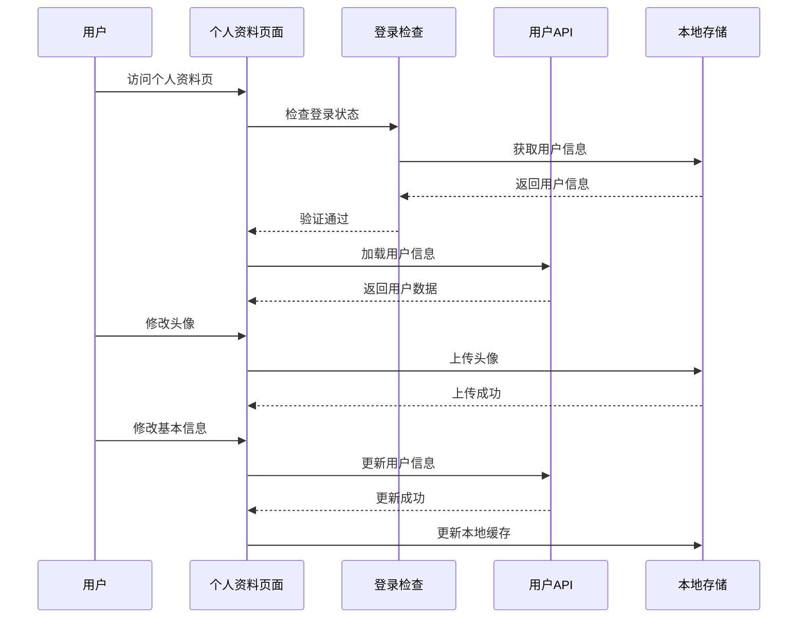

**图表来源**
- [subpkg/my/profile.vue:144-154](file://uniapp-h5/subpkg/my/profile.vue#L144-L154)
- [subpkg/my/profile.vue:156-166](file://uniapp-h5/subpkg/my/profile.vue#L156-L166)

#### 页面核心功能

1. **登录状态检查**: 通过混入模块统一处理登录验证
2. **用户信息展示**: 展示和编辑用户的基本信息
3. **头像上传**: 支持本地图片上传和头像更换
4. **实名认证**: 集成实名认证功能
5. **退出登录**: 提供安全的退出登录机制

**章节来源**
- [subpkg/my/profile.vue:1-421](file://uniapp-h5/subpkg/my/profile.vue#L1-L421)
- [mixins/authCheck.js:1-49](file://uniapp-h5/mixins/authCheck.js#L1-L49)

### 公告弹窗组件

公告弹窗组件提供了统一的通知展示功能：

```mermaid
classDiagram
class NoticePopup {
+visible : Boolean
+title : String
+content : String
+maskClosable : Boolean
+htmlContent : String
+close() void
+onMaskClick() void
}
class RichTextProcessor {
+processHTML(html) String
+injectStyles(html) String
+removeNullStrings(str) String
}
NoticePopup --> RichTextProcessor : "使用"
note for NoticePopup : "支持HTML内容渲染\n自适应图片样式\n可配置遮罩行为"
```

**图表来源**
- [components/notice-popup/notice-popup.vue:28-67](file://uniapp-h5/components/notice-popup/notice-popup.vue#L28-L67)

#### 组件特性

1. **HTML内容渲染**: 支持富文本内容的展示
2. **图片样式处理**: 自动为图片注入合适的样式
3. **遮罩控制**: 支持点击遮罩关闭或禁止关闭
4. **响应式设计**: 适配不同屏幕尺寸

**章节来源**
- [components/notice-popup/notice-popup.vue:1-166](file://uniapp-h5/components/notice-popup/notice-popup.vue#L1-L166)

## 依赖关系分析

### 平台配置管理

应用通过manifest.json进行多平台配置管理：

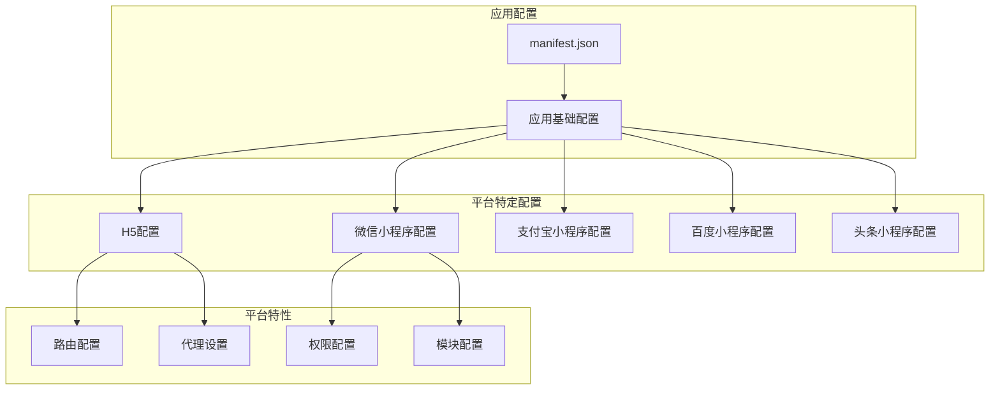

**图表来源**
- [manifest.json:1-107](file://uniapp-h5/manifest.json#L1-L107)

### 环境配置策略

应用采用集中式的环境配置管理：

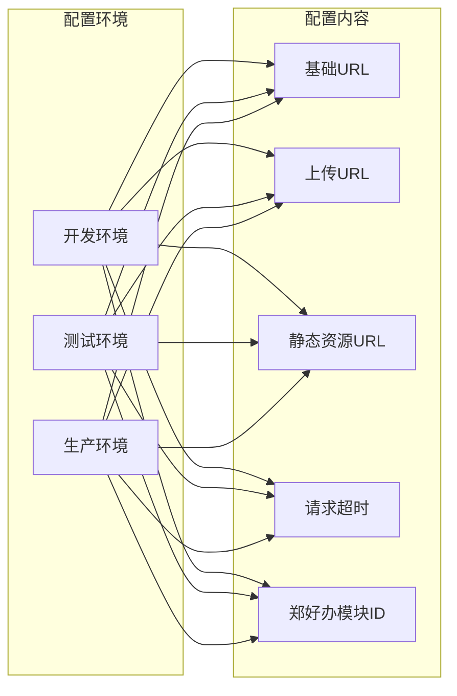

**图表来源**
- [config/index.js:6-63](file://uniapp-h5/config/index.js#L6-L63)

**章节来源**
- [manifest.json:1-107](file://uniapp-h5/manifest.json#L1-L107)
- [config/index.js:1-64](file://uniapp-h5/config/index.js#L1-L64)

## 性能考虑

### 代码分割策略

应用采用了合理的代码分割策略来优化加载性能：

1. **分包加载**: 将不常用的页面放入分包，减少首屏加载体积
2. **按需加载**: 页面组件按需加载，避免不必要的资源传输
3. **静态资源优化**: 图片资源采用适当的压缩和格式优化

### 缓存策略

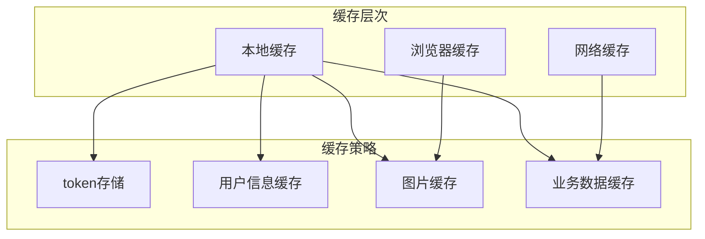

### 性能优化建议

1. **图片优化**: 使用适当的图片格式和尺寸，启用懒加载
2. **请求优化**: 合并请求，设置合理的超时时间
3. **组件优化**: 使用虚拟滚动处理大量数据，避免不必要的重渲染
4. **内存管理**: 及时清理事件监听器和定时器

## 故障排除指南

### 常见问题诊断

#### 登录问题排查

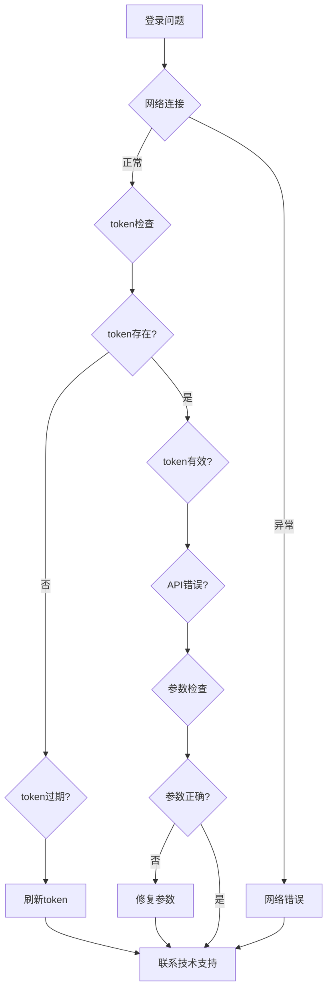

#### 页面加载问题

1. **检查网络连接**: 确认网络请求是否成功
2. **验证token状态**: 检查用户登录状态
3. **查看控制台错误**: 分析JavaScript错误信息
4. **检查API响应**: 验证后端接口返回的数据格式

**章节来源**
- [utils/request.js:34-71](file://uniapp-h5/utils/request.js#L34-L71)
- [pages/login/index.vue:115-182](file://uniapp-h5/pages/login/index.vue#L115-L182)

## 结论

本uni-app项目展示了现代跨平台应用开发的最佳实践。通过合理的架构设计、清晰的组件划分和完善的平台适配机制，实现了高质量的多端应用。

### 主要优势

1. **架构清晰**: 采用分层架构，职责分离明确
2. **扩展性强**: 支持功能开关和模块化开发
3. **平台适配**: 通过条件编译实现多平台统一开发
4. **开发效率**: 统一的工具链和规范提高了开发效率

### 技术亮点

1. **组件化开发**: 通过可复用组件提高代码复用率
2. **状态管理**: 合理的全局状态和局部状态管理
3. **错误处理**: 完善的错误处理和用户反馈机制
4. **性能优化**: 多层次的性能优化策略

该架构为类似的企业级应用开发提供了良好的参考模板，具有较强的可移植性和可维护性。