# 移动端H5应用

<cite>
**本文档引用的文件**
- [pages.json](file://uniapp-h5/pages.json)
- [main.js](file://uniapp-h5/main.js)
- [App.vue](file://uniapp-h5/App.vue)
- [manifest.json](file://uniapp-h5/manifest.json)
- [config/index.js](file://uniapp-h5/config/index.js)
- [utils/request.js](file://uniapp-h5/utils/request.js)
- [utils/alipay.js](file://uniapp-h5/utils/alipay.js)
- [api/pay.js](file://uniapp-h5/api/pay.js)
- [api/bill.js](file://uniapp-h5/api/bill.js)
- [api/project.js](file://uniapp-h5/api/project.js)
- [mixins/authCheck.js](file://uniapp-h5/mixins/authCheck.js)
- [components/notice-popup/notice-popup.vue](file://uniapp-h5/components/notice-popup/notice-popup.vue)
- [api/auth.js](file://uniapp-h5/api/auth.js)
- [api/checkin.js](file://uniapp-h5/api/checkin.js)
- [api/checkout.js](file://uniapp-h5/api/checkout.js)
- [pages/index/index.vue](file://uniapp-h5/pages/index/index.vue)
- [pages/login/index.vue](file://uniapp-h5/pages/login/index.vue)
- [pages/room/deposit.vue](file://uniapp-h5/pages/room/deposit.vue)
- [pages/room/payResult.vue](file://uniapp-h5/pages/room/payResult.vue)
- [pages/room/success.vue](file://uniapp-h5/pages/room/success.vue)
- [pages/project/detail.vue](file://uniapp-h5/pages/project/detail.vue)
- [pages/map/index.vue](file://uniapp-h5/pages/map/index.vue)
- [subpkg/service/enterprise.vue](file://uniapp-h5/subpkg/service/enterprise.vue)
- [config/feature-flags.js](file://uniapp-h5/config/feature-flags.js)
- [subpkg/affairs/checkin.vue](file://uniapp-h5/subpkg/affairs/checkin.vue)
- [subpkg/affairs/checkin-process.vue](file://uniapp-h5/subpkg/affairs/checkin-process.vue)
- [subpkg/affairs/checkin-confirm.vue](file://uniapp-h5/subpkg/affairs/checkin-confirm.vue)
- [subpkg/affairs/checkin-detail.vue](file://uniapp-h5/subpkg/affairs/checkin-detail.vue)
- [subpkg/affairs/checkin-edit.vue](file://uniapp-h5/subpkg/affairs/checkin-edit.vue)
- [subpkg/affairs/bill.vue](file://uniapp-h5/subpkg/affairs/bill.vue)
- [subpkg/affairs/checkout-confirm.vue](file://uniapp-h5/subpkg/affairs/checkout-confirm.vue)
- [pages/signature/index.vue](file://uniapp-h5/pages/signature/index.vue)
- [pages/contract/sign.vue](file://uniapp-h5/pages/contract/sign.vue)
- [package.json](file://uniapp-h5/package.json)
- [api/contract.js](file://uniapp-h5/api/contract.js)
- [api/contractFiling.js](file://uniapp-h5/api/contractFiling.js)
- [api/coupon.js](file://uniapp-h5/api/coupon.js)
- [api/subsidyApply.js](file://uniapp-h5/api/subsidyApply.js)
- [pages/coupon/index.vue](file://uniapp-h5/pages/coupon/index.vue)
- [pages/coupon/my.vue](file://uniapp-h5/pages/coupon/my.vue)
- [subpkg/purchase/contract-filing-list.vue](file://uniapp-h5/subpkg/purchase/contract-filing-list.vue)
- [subpkg/purchase/contract-filing-detail.vue](file://uniapp-h5/subpkg/purchase/contract-filing-detail.vue)
- [subpkg/purchase/contract-filing-submit.vue](file://uniapp-h5/subpkg/purchase/contract-filing-submit.vue)
- [subpkg/purchase/subsidy-list.vue](file://uniapp-h5/subpkg/purchase/subsidy-list.vue)
- [subpkg/purchase/subsidy-detail.vue](file://uniapp-h5/subpkg/purchase/subsidy-detail.vue)
- [subpkg/purchase/subsidy-submit.vue](file://uniapp-h5/subpkg/purchase/subsidy-submit.vue)
- [subpkg/affairs/contract.vue](file://uniapp-h5/subpkg/affairs/contract.vue)
- [ruoyi-system/src/main/java/com/ruoyi/system/domain/HzBill.java](file://ruoyi-system/src/main/java/com/ruoyi/system/domain/HzBill.java)
- [ruoyi-system/src/main/java/com/ruoyi/system/mapper/HzBillMapper.java](file://ruoyi-system/src/main/java/com/ruoyi/system/mapper/HzBillMapper.java)
- [ruoyi-system/src/main/java/com/ruoyi/system/domain/HzBillVO.java](file://ruoyi-system/src/main/java/com/ruoyi/system/domain/HzBillVO.java)
- [ruoyi-system/src/main/java/com/ruoyi/system/service/impl/HzBillServiceImpl.java](file://ruoyi-system/src/main/java/com/ruoyi/system/service/impl/HzBillServiceImpl.java)
- [ruoyi-admin/src/main/java/com/ruoyi/web/controller/h5/HzBillController.java](file://ruoyi-admin/src/main/java/com/ruoyi/web/controller/h5/HzBillController.java)
</cite>

## 目录
1. [简介](#简介)
2. [项目结构](#项目结构)
3. [核心组件](#核心组件)
4. [架构总览](#架构总览)
5. [详细组件分析](#详细组件分析)
6. [依赖关系分析](#依赖关系分析)
7. [性能考虑](#性能考虑)
8. [故障排查指南](#故障排查指南)
9. [结论](#结论)
10. [附录](#附录)

## 简介
本项目是一个基于 uni-app 框架构建的移动端 H5 应用，支持多端编译（H5、小程序、App）。应用围绕"人才公寓"业务场景，提供首页、登录、房源与项目浏览、办事与服务、我的中心等核心功能模块。本文档从架构设计、页面路由、组件封装、API 集成、移动端适配与性能优化等方面进行系统化梳理，并给出最佳实践与常见问题解决方案。

**更新** 新增移动端检查入页面倒计时组件，提供实时超时提醒功能，增强用户操作时效性和业务流程管控。**新增** 企业支付功能集成，支持微信JSAPI支付流程，包含支付轮询和状态同步机制，为企业客户提供完整的在线缴费解决方案。**新增** 合同备案、优惠券、代购补贴申请等新功能模块，完善租户业务闭环和营销体系。**本次更新** 对购买相关UI组件进行了小幅改进，包括优惠券管理、合同备案详情、补贴详情等页面的微调优化，提升了用户体验和界面一致性。**本次更新** 增强移动端H5应用账单页面功能，支持期次跟踪显示和兼容旧版本账单格式。**本次更新** 改进签名页面错误处理逻辑，优先显示后端返回的真实错误信息，避免通用兜底文案覆盖真实失败原因。**本次更新** 重大改进项目详情页导航功能，包括坐标数据处理、验证逻辑和错误处理的增强，显著提升了导航体验和系统稳定性。**本次更新** 新增移动端合同签署页面的批量模式支持，通过新增的isBatchMode标志位和相应的UI控制逻辑，为批次配租场景提供专门的合同签署流程。

## 项目结构
uni-app-H5 应用采用典型的"pages + subpackages + components + api + utils + config"组织方式，页面通过 pages.json 进行集中配置，支持分包与 tabBar，便于大型应用的模块化与性能优化。全局配置通过 config/index.js 管理不同环境的 API 地址与超时等参数；请求封装位于 utils/request.js；页面逻辑集中在 pages 目录下的各页面组件；通用 UI 组件放置于 components 目录；业务 API 方法位于 api 目录；全局混入用于统一登录校验。

```mermaid
graph TB
A["App.vue<br/>应用生命周期与全局事件"] --> B["main.js<br/>应用入口与Vue版本适配"]
B --> C["pages.json<br/>页面与分包配置"]
C --> D["pages/index/index.vue<br/>首页"]
C --> E["pages/login/index.vue<br/>登录页"]
C --> F["subpackages<br/>业务子包"]
G["utils/request.js<br/>HTTP请求封装"] --> H["api/auth.js<br/>认证相关API"]
I["config/index.js<br/>环境配置"] --> G
J["components/notice-popup/notice-popup.vue<br/>公告弹窗组件"] --> D
K["mixins/authCheck.js<br/>登录校验混入"] --> E
L["manifest.json<br/>H5代理与路由配置"] --> G
M["api/checkin.js<br/>入住管理API"] --> N["subpkg/affairs/checkin.vue<br/>入住列表页面"]
O["subpkg/affairs/checkin-process.vue<br/>入住办理页面"] --> N
P["subpkg/affairs/checkin-confirm.vue<br/>入住确认页面"] --> N
Q["subpkg/affairs/checkin-detail.vue<br/>入住详情页面"] --> N
R["subpkg/affairs/checkin-edit.vue<br/>入住编辑页面"] --> N
S["api/pay.js<br/>支付相关API"] --> T["pages/room/deposit.vue<br/>押金支付页面"]
U["subpkg/service/enterprise.vue<br/>企业服务页面"] --> S
V["utils/alipay.js<br/>支付宝JSBridge工具"] --> U
W["pages/room/payResult.vue<br/>支付结果页面"] --> T
X["pages/room/success.vue<br/>支付成功页面"] --> T
Y["api/contractFiling.js<br/>合同备案API"] --> Z["subpkg/purchase/contract-filing-list.vue<br/>合同备案列表"]
AA["api/coupon.js<br/>优惠券API"] --> BB["pages/coupon/index.vue<br/>优惠券页面"]
CC["api/subsidyApply.js<br/>补贴申请API"] --> DD["subpkg/purchase/subsidy-list.vue<br/>补贴申请列表"]
EE["api/bill.js<br/>账单管理API"] --> FF["subpkg/affairs/bill.vue<br/>账单缴费页面"]
GG["HzBill.java<br/>账单实体类"] --> EE
HH["HzBillMapper.java<br/>账单Mapper"] --> GG
II["HzBillServiceImpl.java<br/>账单服务实现"] --> HH
JJ["HzBillController.java<br/>账单控制器"] --> II
KK["pages/signature/index.vue<br/>签名页面"] --> LL["签名校验与错误处理"]
MM["pages/project/detail.vue<br/>项目详情页"] --> NN["导航功能增强"]
OO["pages/map/index.vue<br/>地图找房页"] --> PP["坐标数据处理"]
QQ["api/project.js<br/>项目管理API"] --> MM
RR["api/project.js<br/>项目管理API"] --> OO
SS["pages/contract/sign.vue<br/>合同签署页面"] --> TT["批量模式支持"]
UU["subpkg/affairs/contract.vue<br/>合同管理页面"] --> SS
VV["api/contract.js<br/>合同管理API"] --> SS
```

**图表来源**
- [main.js:1-30](file://uniapp-h5/main.js#L1-L30)
- [pages.json:1-341](file://uniapp-h5/pages.json#L1-L341)
- [utils/request.js:1-135](file://uniapp-h5/utils/request.js#L1-L135)
- [config/index.js:1-64](file://uniapp-h5/config/index.js#L1-L64)
- [api/auth.js:1-55](file://uniapp-h5/api/auth.js#L1-L55)
- [components/notice-popup/notice-popup.vue:1-166](file://uniapp-h5/components/notice-popup/notice-popup.vue#L1-L166)
- [mixins/authCheck.js:1-49](file://uniapp-h5/mixins/authCheck.js#L1-L49)
- [manifest.json:81-105](file://uniapp-h5/manifest.json#L81-L105)
- [api/checkin.js:1-111](file://uniapp-h5/api/checkin.js#L1-L111)
- [api/pay.js:1-34](file://uniapp-h5/api/pay.js#L1-L34)
- [pages/room/deposit.vue:1-750](file://uniapp-h5/pages/room/deposit.vue#L1-L750)
- [subpkg/service/enterprise.vue:1-1371](file://uniapp-h5/subpkg/service/enterprise.vue#L1-L1371)
- [utils/alipay.js:1-88](file://uniapp-h5/utils/alipay.js#L1-L88)
- [pages/room/payResult.vue:1-73](file://uniapp-h5/pages/room/payResult.vue#L1-L73)
- [pages/room/success.vue:1-108](file://uniapp-h5/pages/room/success.vue#L1-L108)
- [api/contractFiling.js:1-25](file://uniapp-h5/api/contractFiling.js#L1-L25)
- [api/coupon.js:1-26](file://uniapp-h5/api/coupon.js#L1-L26)
- [api/subsidyApply.js:1-25](file://uniapp-h5/api/subsidyApply.js#L1-L25)
- [pages/coupon/index.vue:1-442](file://uniapp-h5/pages/coupon/index.vue#L1-L442)
- [pages/coupon/my.vue:1-308](file://uniapp-h5/pages/coupon/my.vue#L1-L308)
- [subpkg/purchase/contract-filing-list.vue:1-112](file://uniapp-h5/subpkg/purchase/contract-filing-list.vue#L1-L112)
- [subpkg/purchase/contract-filing-detail.vue:1-91](file://uniapp-h5/subpkg/purchase/contract-filing-detail.vue#L1-L91)
- [subpkg/purchase/contract-filing-submit.vue:1-140](file://uniapp-h5/subpkg/purchase/contract-filing-submit.vue#L1-L140)
- [subpkg/purchase/subsidy-list.vue:1-210](file://uniapp-h5/subpkg/purchase/subsidy-list.vue#L1-L210)
- [subpkg/purchase/subsidy-detail.vue:1-89](file://uniapp-h5/subpkg/purchase/subsidy-detail.vue#L1-L89)
- [subpkg/purchase/subsidy-submit.vue:1-210](file://uniapp-h5/subpkg/purchase/subsidy-submit.vue#L1-L210)
- [api/bill.js:1-61](file://uniapp-h5/api/bill.js#L1-L61)
- [subpkg/affairs/bill.vue:1-1013](file://uniapp-h5/subpkg/affairs/bill.vue#L1-L1013)
- [HzBill.java:1-390](file://ruoyi-system/src/main/java/com/ruoyi/system/domain/HzBill.java#L1-L390)
- [HzBillMapper.java:1-59](file://ruoyi-system/src/main/java/com/ruoyi/system/mapper/HzBillMapper.java#L1-L59)
- [HzBillServiceImpl.java:1-216](file://ruoyi-system/src/main/java/com/ruoyi/system/service/impl/HzBillServiceImpl.java#L1-L216)
- [HzBillController.java:1-95](file://ruoyi-admin/src/main/java/com/ruoyi/web/controller/h5/HzBillController.java#L1-L95)
- [pages/signature/index.vue:426-434](file://uniapp-h5/pages/signature/index.vue#L426-L434)
- [pages/signature/index.vue:488-496](file://uniapp-h5/pages/signature/index.vue#L488-L496)
- [pages/signature/index.vue:555-563](file://uniapp-h5/pages/signature/index.vue#L555-L563)
- [pages/project/detail.vue:203-223](file://uniapp-h5/pages/project/detail.vue#L203-L223)
- [pages/map/index.vue:250-259](file://uniapp-h5/pages/map/index.vue#L250-L259)
- [api/project.js:1-37](file://uniapp-h5/api/project.js#L1-L37)
- [pages/contract/sign.vue:86-87](file://uniapp-h5/pages/contract/sign.vue#L86-L87)
- [pages/contract/sign.vue:240-240](file://uniapp-h5/pages/contract/sign.vue#L240-L240)
- [pages/contract/sign.vue:408-408](file://uniapp-h5/pages/contract/sign.vue#L408-L408)
- [subpkg/affairs/contract.vue:337-350](file://uniapp-h5/subpkg/affairs/contract.vue#L337-L350)
- [api/contract.js:20-22](file://uniapp-h5/api/contract.js#L20-L22)

**章节来源**
- [pages.json:1-341](file://uniapp-h5/pages.json#L1-L341)
- [main.js:1-30](file://uniapp-h5/main.js#L1-L30)
- [manifest.json:1-107](file://uniapp-h5/manifest.json#L1-L107)

## 核心组件
- 应用入口与全局配置
  - main.js：支持 Vue2/Vue3 双版本适配，将全局配置挂载到 $config，保证组件可通过 this.$config 访问。
  - App.vue：应用生命周期 onLaunch 中拉取启动公告，通过全局数据与事件广播保证页面可消费。
  - config/index.js：按环境（development/test/production）输出不同配置，包含 API 基础地址、上传/静态资源地址、超时、郑好办模块 ID 等。
  - manifest.json：H5 环境下配置 devServer 代理与路由 base，便于本地联调后端接口。
- 请求与状态
  - utils/request.js：基于 uni.request 封装统一请求，内置鉴权头、业务错误提示、HTTP 错误提示与网络异常处理；提供 get/post/put/del 方法与 BASE_URL 导出。
  - api/auth.js：封装登录、获取/更新用户信息、登出、郑好办与微信登录等接口。
  - api/checkin.js：封装入住管理相关 API，包括入住列表、倒计时查询、确认信息等接口。
  - api/checkout.js：封装退租管理相关 API，包括退租列表、详情、申请、确认等接口。
  - **新增** api/bill.js：封装账单管理相关 API，包括根据用户ID获取账单列表、根据合同ID获取账单列表、押金账单查询、单个账单支付、批量支付等接口。
  - **新增** api/contractFiling.js：封装合同备案相关 API，包括我的备案列表、详情查询、提交备案等接口。
  - **新增** api/coupon.js：封装优惠券相关 API，包括可领取列表、我的优惠券列表、领取优惠券等接口。
  - **新增** api/subsidyApply.js：封装代购补贴申请相关 API，包括我的申请列表、详情查询、提交申请等接口。
  - **新增** api/pay.js：封装微信支付相关 API，包括预支付、企业支付、支付结果同步与查询接口。
  - **新增** api/project.js：封装项目管理相关 API，包括按类型查询项目列表、分页查询项目列表、获取项目详细信息等接口。
  - **新增** api/contract.js：封装合同管理相关 API，包括生成合同预览、签署合同、续租合同等接口。
- 页面与导航
  - pages/index/index.vue：首页聚合轮播、通知、功能入口、房源/项目列表，支持分类与子标签切换，公开浏览与登录后功能分流。
  - pages/login/index.vue：多端差异化登录（微信小程序使用 getPhoneNumber，H5 使用手机号登录），协议勾选与返回逻辑。
  - **新增** subpkg/affairs/checkin-confirm.vue：入住确认页面，支持设施信息展示与签字跳转。
  - **新增** subpkg/affairs/checkout-confirm.vue：退租确认页面，支持费用明细展示与签字跳转。
  - **新增** subpkg/affairs/bill.vue：账单缴费页面，支持当前账单与历史账单切换、期次跟踪显示、兼容旧版本账单格式、批量支付等功能。
  - **新增** pages/coupon/index.vue：优惠券领取页面，支持可领取优惠券列表展示与领取操作，优化了优惠券卡片样式和状态显示。
  - **新增** pages/coupon/my.vue：我的优惠券页面，支持优惠券状态筛选与详情查看，改进了状态标签样式和视觉反馈。
  - **新增** subpkg/purchase/contract-filing-list.vue：合同备案列表页面，支持状态筛选与详情查看，优化了卡片布局和状态标识。
  - **新增** subpkg/purchase/contract-filing-detail.vue：合同备案详情页面，展示备案信息与附件，改进了详情卡片布局和状态标签样式。
  - **新增** subpkg/purchase/contract-filing-submit.vue：合同备案提交页面，支持表单填写与文件上传。
  - **新增** subpkg/purchase/subsidy-list.vue：代购补贴申请列表页面，支持状态筛选与详情查看，优化了列表卡片和状态显示。
  - **新增** subpkg/purchase/subsidy-detail.vue：代购补贴申请详情页面，展示申请信息与附件，改进了详情展示和状态标识。
  - **新增** subpkg/purchase/subsidy-submit.vue：代购补贴申请提交页面，支持承诺书签署与申请提交。
  - **新增** pages/room/deposit.vue：押金支付页面，支持微信JSAPI支付，包含支付轮询和状态同步机制。
  - **新增** pages/room/payResult.vue：支付结果页面，展示支付状态并进行轮询查询。
  - **新增** pages/room/success.vue：支付成功页面，展示成功状态和返回首页功能。
  - **新增** subpkg/service/enterprise.vue：企业服务页面，提供企业账单缴费功能，支持微信JSAPI支付流程。
  - **新增** pages/signature/index.vue：签名页面，支持入住确认、退租确认、退租申请、承诺书等多种签名模式，包含改进的错误处理逻辑。
  - **新增** pages/contract/sign.vue：合同签署页面，支持批量模式（isBatchMode）和租期选择器控制，提供完整的电子合同签署流程。
  - **新增** subpkg/affairs/contract.vue：合同管理页面，支持合同列表查看、状态跟踪、去签署跳转等功能。
  - **新增** pages/project/detail.vue：项目详情页面，包含增强的导航功能，支持坐标数据处理、验证逻辑和错误处理。
  - **新增** pages/map/index.vue：地图找房页面，支持坐标数据过滤、标记点处理和信息窗体展示。
- 组件与混入
  - components/notice-popup/notice-popup.vue：公告弹窗组件，支持富文本渲染、遮罩点击关闭、图片样式注入等。
  - mixins/authCheck.js：统一登录校验混入，提供 checkLogin 方法，未登录时提示并跳转登录页。
  - **新增** utils/alipay.js：郑好办APP内支付宝JSBridge工具类，提供用户授权、实名认证等能力。
- 功能开关
  - config/feature-flags.js：首页与办事页的业务功能开关（保租房、市场租赁），便于灰度与快速上线。

**章节来源**
- [main.js:1-30](file://uniapp-h5/main.js#L1-L30)
- [App.vue:1-98](file://uniapp-h5/App.vue#L1-L98)
- [config/index.js:1-64](file://uniapp-h5/config/index.js#L1-L64)
- [manifest.json:81-105](file://uniapp-h5/manifest.json#L81-L105)
- [utils/request.js:1-135](file://uniapp-h5/utils/request.js#L1-L135)
- [api/auth.js:1-55](file://uniapp-h5/api/auth.js#L1-L55)
- [api/checkin.js:1-111](file://uniapp-h5/api/checkin.js#L1-L111)
- [api/checkout.js:1-79](file://uniapp-h5/api/checkout.js#L1-L79)
- [api/bill.js:1-61](file://uniapp-h5/api/bill.js#L1-L61)
- [api/contractFiling.js:1-25](file://uniapp-h5/api/contractFiling.js#L1-L25)
- [api/coupon.js:1-26](file://uniapp-h5/api/coupon.js#L1-L26)
- [api/subsidyApply.js:1-25](file://uniapp-h5/api/subsidyApply.js#L1-L25)
- [api/pay.js:1-34](file://uniapp-h5/api/pay.js#L1-L34)
- [api/project.js:1-37](file://uniapp-h5/api/project.js#L1-L37)
- [api/contract.js:1-86](file://uniapp-h5/api/contract.js#L1-L86)
- [pages/index/index.vue:1-800](file://uniapp-h5/pages/index/index.vue#L1-L800)
- [pages/login/index.vue:1-443](file://uniapp-h5/pages/login/index.vue#L1-L443)
- [subpkg/affairs/checkin-confirm.vue:1-363](file://uniapp-h5/subpkg/affairs/checkin-confirm.vue#L1-L363)
- [subpkg/affairs/checkout-confirm.vue:1-566](file://uniapp-h5/subpkg/affairs/checkout-confirm.vue#L1-L566)
- [subpkg/affairs/bill.vue:1-1013](file://uniapp-h5/subpkg/affairs/bill.vue#L1-L1013)
- [pages/coupon/index.vue:1-442](file://uniapp-h5/pages/coupon/index.vue#L1-L442)
- [pages/coupon/my.vue:1-308](file://uniapp-h5/pages/coupon/my.vue#L1-L308)
- [subpkg/purchase/contract-filing-list.vue:1-112](file://uniapp-h5/subpkg/purchase/contract-filing-list.vue#L1-L112)
- [subpkg/purchase/contract-filing-detail.vue:1-91](file://uniapp-h5/subpkg/purchase/contract-filing-detail.vue#L1-L91)
- [subpkg/purchase/contract-filing-submit.vue:1-140](file://uniapp-h5/subpkg/purchase/contract-filing-submit.vue#L1-L140)
- [subpkg/purchase/subsidy-list.vue:1-210](file://uniapp-h5/subpkg/purchase/subsidy-list.vue#L1-L210)
- [subpkg/purchase/subsidy-detail.vue:1-89](file://uniapp-h5/subpkg/purchase/subsidy-detail.vue#L1-L89)
- [subpkg/purchase/subsidy-submit.vue:1-210](file://uniapp-h5/subpkg/purchase/subsidy-submit.vue#L1-L210)
- [pages/room/deposit.vue:1-750](file://uniapp-h5/pages/room/deposit.vue#L1-L750)
- [pages/room/payResult.vue:1-73](file://uniapp-h5/pages/room/payResult.vue#L1-L73)
- [pages/room/success.vue:1-108](file://uniapp-h5/pages/room/success.vue#L1-L108)
- [subpkg/service/enterprise.vue:1-1371](file://uniapp-h5/subpkg/service/enterprise.vue#L1-L1371)
- [utils/alipay.js:1-88](file://uniapp-h5/utils/alipay.js#L1-L88)
- [pages/signature/index.vue:1-709](file://uniapp-h5/pages/signature/index.vue#L1-L709)
- [pages/contract/sign.vue:1-1023](file://uniapp-h5/pages/contract/sign.vue#L1-L1023)
- [subpkg/affairs/contract.vue:1-1042](file://uniapp-h5/subpkg/affairs/contract.vue#L1-L1042)
- [pages/project/detail.vue:1-529](file://uniapp-h5/pages/project/detail.vue#L1-L529)
- [pages/map/index.vue:1-712](file://uniapp-h5/pages/map/index.vue#L1-L712)
- [components/notice-popup/notice-popup.vue:1-166](file://uniapp-h5/components/notice-popup/notice-popup.vue#L1-L166)
- [mixins/authCheck.js:1-49](file://uniapp-h5/mixins/authCheck.js#L1-L49)
- [config/feature-flags.js:1-13](file://uniapp-h5/config/feature-flags.js#L1-L13)

## 架构总览
应用采用"页面路由 + 统一请求 + 组件化 + 功能开关"的架构模式：
- 页面路由：pages.json 统一声明主包与分包页面、tabBar、全局样式与 uniIdRouter。
- 请求层：utils/request.js 提供统一拦截与错误处理，api/* 提供业务接口方法。
- 组件层：components 提供可复用 UI 组件；pages 与 subpackages 组织页面。
- 配置层：config 管理环境差异；manifest 管理 H5 代理与路由。
- 生命周期与事件：App.vue 在 onLaunch 拉取启动公告，通过全局数据与事件广播，页面 onLoad/onShow 消费。
- **新增** 支付层：api/pay.js 提供微信支付接口，pages/room/deposit.vue 和 subpkg/service/enterprise.vue 实现支付流程，包含轮询和状态同步。
- **新增** 业务层：新增合同备案、优惠券、代购补贴申请等业务模块，完善租户业务闭环。
- **新增** 数据层：HzBill.java、HzBillMapper.java、HzBillServiceImpl.java、HzBillController.java 提供完整的账单数据管理与接口服务。
- **新增** 错误处理层：签名页面改进错误处理逻辑，优先显示后端返回的真实错误信息，避免通用兜底文案覆盖真实失败原因。
- **新增** 导航增强层：项目详情页导航功能重大改进，包括坐标数据处理、验证逻辑和错误处理的增强。
- **新增** 合同签署层：pages/contract/sign.vue 提供批量模式支持，通过 isBatchMode 标志位控制租期选择器显示，为批次配租场景提供专门的合同签署流程。

```mermaid
graph TB
subgraph "应用层"
APP["App.vue"]
MAIN["main.js"]
CFG["config/index.js"]
MF["manifest.json"]
ENDBILL["api/bill.js"]
ENDBILLPAGE["subpkg/affairs/bill.vue"]
ENDBILLMODEL["HzBill.java"]
ENDBILLMAPPER["HzBillMapper.java"]
ENDBILLSVC["HzBillServiceImpl.java"]
ENDBILLCTRL["HzBillController.java"]
ENDPAY["api/pay.js"]
ALIPAY["utils/alipay.js"]
ENDENTERPRISE["subpkg/service/enterprise.vue"]
ENDDEPOSIT["pages/room/deposit.vue"]
ENDRESULT["pages/room/payResult.vue"]
ENDSUCCESS["pages/room/success.vue"]
ENDALIPAY["utils/alipay.js"]
ENDCONTRACT["api/contractFiling.js"]
ENDCOUPON["api/coupon.js"]
ENDSUBSIDY["api/subsidyApply.js"]
SIGNSUCCESS["pages/signature/index.vue"]
SIGNERROR["签名页面错误处理改进"]
PROJDETAIL["pages/project/detail.vue"]
MAPINDEX["pages/map/index.vue"]
PROJAPI["api/project.js"]
ENDNAVIGATION["导航功能增强"]
ENDCONTRACTSIGN["pages/contract/sign.vue"]
ENDCONTRACTPAGE["subpkg/affairs/contract.vue"]
ENDCONTRACTAPI["api/contract.js"]
ENDBATCHMODE["批量模式支持"]
end
subgraph "页面层"
IDX["pages/index/index.vue"]
LGN["pages/login/index.vue"]
CHK["subpkg/affairs/checkin.vue"]
BILL["subpkg/affairs/bill.vue"]
COUPON["pages/coupon/index.vue"]
COUPONMY["pages/coupon/my.vue"]
CONTRACTLIST["subpkg/purchase/contract-filing-list.vue"]
CONTRACTDETAIL["subpkg/purchase/contract-filing-detail.vue"]
CONTRACTSUBMIT["subpkg/purchase/contract-filing-submit.vue"]
SUBSIDYLIST["subpkg/purchase/subsidy-list.vue"]
SUBSIDYDETAIL["subpkg/purchase/subsidy-detail.vue"]
SUBSIDYSUBMIT["subpkg/purchase/subsidy-submit.vue"]
SUB["subpackages"]
end
subgraph "接口层"
REQ["utils/request.js"]
API_AUTH["api/auth.js"]
API_CHECKIN["api/checkin.js"]
API_CHECKOUT["api/checkout.js"]
ENDBILL
ENDBILLPAGE
ENDBILLMODEL
ENDBILLMAPPER
ENDBILLSVC
ENDBILLCTRL
ENDPAY
ENDALIPAY
ENDCONTRACT
ENDCOUPON
ENDSUBSIDY
PROJAPI
ENDNAVIGATION
ENDCONTRACTSIGN
ENDCONTRACTPAGE
ENDCONTRACTAPI
ENDBATCHMODE
end
subgraph "组件层"
POP["components/notice-popup/notice-popup.vue"]
MIX["mixins/authCheck.js"]
FLAGS["config/feature-flags.js"]
end
APP --> IDX
APP --> LGN
APP --> CHK
APP --> BILL
APP --> COUPON
APP --> CONTRACTLIST
APP --> SUBSIDYLIST
MAIN --> CFG
MF --> REQ
REQ --> API_AUTH
REQ --> API_CHECKIN
REQ --> API_CHECKOUT
REQ --> ENDBILL
REQ --> ENDBILLPAGE
REQ --> ENDPAY
REQ --> ENDCONTRACT
REQ --> ENDCOUPON
REQ --> ENDSUBSIDY
REQ --> PROJAPI
IDX --> POP
LGN --> MIX
CHK --> API_CHECKIN
BILL --> ENDBILL
COUPON --> ENDCOUPON
CONTRACTLIST --> ENDCONTRACT
SUBSIDYLIST --> ENDSUBSIDY
IDX --> FLAGS
ENDDEPOSIT --> ENDPAY
ENDENTERPRISE --> ENDPAY
ENDRESULT --> ENDPAY
ENDDEPOSIT --> ENDRESULT
ENDDEPOSIT --> ENDSUCCESS
ENDENTERPRISE --> ENDALIPAY
ENDBILL --> ENDBILLMODEL
ENDBILLMODEL --> ENDBILLMAPPER
ENDBILLMAPPER --> ENDBILLSVC
ENDBILLSVC --> ENDBILLCTRL
SIGNSUCCESS --> SIGNERROR
PROJDETAIL --> ENDNAVIGATION
MAPINDEX --> PROJAPI
ENDCONTRACTSIGN --> ENDBATCHMODE
ENDCONTRACTPAGE --> ENDCONTRACTSIGN
ENDCONTRACTAPI --> ENDCONTRACTSIGN
```

**图表来源**
- [pages.json:1-341](file://uniapp-h5/pages.json#L1-L341)
- [main.js:1-30](file://uniapp-h5/main.js#L1-L30)
- [App.vue:1-98](file://uniapp-h5/App.vue#L1-L98)
- [config/index.js:1-64](file://uniapp-h5/config/index.js#L1-L64)
- [manifest.json:81-105](file://uniapp-h5/manifest.json#L81-L105)
- [utils/request.js:1-135](file://uniapp-h5/utils/request.js#L1-L135)
- [api/auth.js:1-55](file://uniapp-h5/api/auth.js#L1-L55)
- [api/checkin.js:1-111](file://uniapp-h5/api/checkin.js#L1-L111)
- [api/checkout.js:1-79](file://uniapp-h5/api/checkout.js#L1-L79)
- [api/bill.js:1-61](file://uniapp-h5/api/bill.js#L1-L61)
- [api/contractFiling.js:1-25](file://uniapp-h5/api/contractFiling.js#L1-L25)
- [api/coupon.js:1-26](file://uniapp-h5/api/coupon.js#L1-L26)
- [api/subsidyApply.js:1-25](file://uniapp-h5/api/subsidyApply.js#L1-L25)
- [api/pay.js:1-34](file://uniapp-h5/api/pay.js#L1-L34)
- [utils/alipay.js:1-88](file://uniapp-h5/utils/alipay.js#L1-L88)
- [pages/room/deposit.vue:1-750](file://uniapp-h5/pages/room/deposit.vue#L1-L750)
- [subpkg/service/enterprise.vue:1-1371](file://uniapp-h5/subpkg/service/enterprise.vue#L1-L1371)
- [pages/room/payResult.vue:1-73](file://uniapp-h5/pages/room/payResult.vue#L1-L73)
- [pages/room/success.vue:1-108](file://uniapp-h5/pages/room/success.vue#L1-L108)
- [pages/coupon/index.vue:1-442](file://uniapp-h5/pages/coupon/index.vue#L1-L442)
- [pages/coupon/my.vue:1-308](file://uniapp-h5/pages/coupon/my.vue#L1-L308)
- [subpkg/purchase/contract-filing-list.vue:1-112](file://uniapp-h5/subpkg/purchase/contract-filing-list.vue#L1-L112)
- [subpkg/purchase/contract-filing-detail.vue:1-91](file://uniapp-h5/subpkg/purchase/contract-filing-detail.vue#L1-L91)
- [subpkg/purchase/contract-filing-submit.vue:1-140](file://uniapp-h5/subpkg/purchase/contract-filing-submit.vue#L1-L140)
- [subpkg/purchase/subsidy-list.vue:1-210](file://uniapp-h5/subpkg/purchase/subsidy-list.vue#L1-L210)
- [subpkg/purchase/subsidy-detail.vue:1-89](file://uniapp-h5/subpkg/purchase/subsidy-detail.vue#L1-L89)
- [subpkg/purchase/subsidy-submit.vue:1-210](file://uniapp-h5/subpkg/purchase/subsidy-submit.vue#L1-L210)
- [components/notice-popup/notice-popup.vue:1-166](file://uniapp-h5/components/notice-popup/notice-popup.vue#L1-L166)
- [mixins/authCheck.js:1-49](file://uniapp-h5/mixins/authCheck.js#L1-L49)
- [config/feature-flags.js:1-13](file://uniapp-h5/config/feature-flags.js#L1-L13)
- [HzBill.java:1-390](file://ruoyi-system/src/main/java/com/ruoyi/system/domain/HzBill.java#L1-L390)
- [HzBillMapper.java:1-59](file://ruoyi-system/src/main/java/com/ruoyi/system/mapper/HzBillMapper.java#L1-L59)
- [HzBillServiceImpl.java:1-216](file://ruoyi-system/src/main/java/com/ruoyi/system/service/impl/HzBillServiceImpl.java#L1-L216)
- [HzBillController.java:1-95](file://ruoyi-admin/src/main/java/com/ruoyi/web/controller/h5/HzBillController.java#L1-L95)
- [pages/signature/index.vue:426-434](file://uniapp-h5/pages/signature/index.vue#L426-L434)
- [pages/signature/index.vue:488-496](file://uniapp-h5/pages/signature/index.vue#L488-L496)
- [pages/signature/index.vue:555-563](file://uniapp-h5/pages/signature/index.vue#L555-L563)
- [pages/project/detail.vue:203-223](file://uniapp-h5/pages/project/detail.vue#L203-L223)
- [pages/map/index.vue:250-259](file://uniapp-h5/pages/map/index.vue#L250-L259)
- [api/project.js:1-37](file://uniapp-h5/api/project.js#L1-L37)
- [pages/contract/sign.vue:86-87](file://uniapp-h5/pages/contract/sign.vue#L86-L87)
- [pages/contract/sign.vue:240-240](file://uniapp-h5/pages/contract/sign.vue#L240-L240)
- [pages/contract/sign.vue:408-408](file://uniapp-h5/pages/contract/sign.vue#L408-L408)
- [subpkg/affairs/contract.vue:337-350](file://uniapp-h5/subpkg/affairs/contract.vue#L337-L350)
- [api/contract.js:20-22](file://uniapp-h5/api/contract.js#L20-L22)

## 详细组件分析

### 页面路由与导航设计
- pages.json 负责：
  - 声明主包页面与样式（导航栏标题、样式等）。
  - 定义 subPackages（分包）与页面映射，提升首屏加载性能与包体管理。
  - 配置 globalStyle（导航栏文字颜色、背景色、页面背景色）。
  - 配置 tabBar（四个主入口：首页、办事、服务、我的，含图标与选中态）。
  - 配置 uniIdRouter（用于 uni-id 的路由控制）。
  - **新增** subpkg/affairs/bill.vue 账单页面配置，支持"账单缴费"标题。
  - **新增** pages/room/deposit.vue、pages/room/payResult.vue、pages/room/success.vue 等支付相关页面配置。
  - **新增** pages/coupon/index.vue、pages/coupon/my.vue 等优惠券相关页面配置。
  - **新增** subpkg/purchase/contract-filing-*、subpkg/purchase/subsidy-* 等业务相关页面配置。
  - **新增** pages/project/detail.vue 项目详情页配置，支持"项目详情"标题。
  - **新增** pages/map/index.vue 地图找房页配置，支持"地图找房"标题。
  - **新增** pages/contract/sign.vue 合同签署页面配置，支持批量模式。
- 页面跳转与参数传递：
  - 首页通过 uni.navigateTo 传参跳转到项目/房源详情页。
  - 登录页根据协议勾选与平台差异选择 wxLogin 或 login 接口。
  - 返回逻辑遵循小程序审核规范，提供返回上一页或 switchTab 到首页。
  - **新增** 账单页面支持从合同页传参跳转，包括 contractId、billType、depositPaid 等参数。
  - **新增** 优惠券页面支持跳转到我的优惠券页面。
  - **新增** 合同备案页面支持查看详情与提交页面。
  - **新增** 代购补贴页面支持查看详情与提交页面。
  - **新增** 支付完成后通过 uni.navigateTo 跳转到材料上传页面。
  - **新增** 签名页面支持多种模式跳转，包括入住确认、退租确认、退租申请、承诺书签名。
  - **新增** 地图页面支持从标记点跳转到项目详情页，实现无缝导航体验。
  - **新增** 合同管理页面支持跳转到合同签署页面，包括批量模式和续租模式。
- 生命周期管理：
  - App.vue 在 onLaunch 拉取启动公告，通过全局数据与事件广播，首页 onLoad/onShow 消费并监听事件，确保页面即使晚于 App 启动也能拿到数据。

**章节来源**
- [pages.json:120-121](file://uniapp-h5/pages.json#L120-L121)
- [pages/index/index.vue:583-770](file://uniapp-h5/pages/index/index.vue#L583-L770)
- [pages/login/index.vue:82-232](file://uniapp-h5/pages/login/index.vue#L82-L232)
- [App.vue:9-39](file://uniapp-h5/App.vue#L9-L39)
- [subpkg/affairs/bill.vue:197-208](file://uniapp-h5/subpkg/affairs/bill.vue#L197-L208)
- [pages/coupon/index.vue:145-147](file://uniapp-h5/pages/coupon/index.vue#L145-L147)
- [subpkg/purchase/contract-filing-list.vue:81-86](file://uniapp-h5/subpkg/purchase/contract-filing-list.vue#L81-L86)
- [subpkg/purchase/subsidy-list.vue:69-70](file://uniapp-h5/subpkg/purchase/subsidy-list.vue#L69-L70)
- [subpkg/affairs/checkin-confirm.vue:194-198](file://uniapp-h5/subpkg/affairs/checkin-confirm.vue#L194-L198)
- [subpkg/affairs/checkout-confirm.vue:274-278](file://uniapp-h5/subpkg/affairs/checkout-confirm.vue#L274-L278)
- [pages/project/detail.vue:137-142](file://uniapp-h5/pages/project/detail.vue#L137-L142)
- [pages/map/index.vue:502-506](file://uniapp-h5/pages/map/index.vue#L502-L506)
- [subpkg/affairs/contract.vue:337-350](file://uniapp-h5/subpkg/affairs/contract.vue#L337-L350)

### 组件封装策略
- 公共组件
  - 公告弹窗 notice-popup：支持标题、内容、遮罩点击关闭、富文本渲染与图片样式注入，适合跨页面复用。
- 业务组件
  - 首页首页聚合多种业务入口（轮播、通知、功能图标网格、房源/项目列表），通过功能开关控制入口显隐。
  - **新增** 入住倒计时组件：在入住列表页面中，针对待办理状态的合同显示实时倒计时条，提供超时提醒功能。
  - **新增** 支付组件：pages/room/deposit.vue 和 subpkg/service/enterprise.vue 提供统一的支付界面和交互逻辑。
  - **新增** 优惠券组件：pages/coupon/index.vue 和 pages/coupon/my.vue 提供优惠券展示与管理功能，优化了卡片样式和状态显示。
  - **新增** 合同备案组件：subpkg/purchase/contract-filing-list.vue、contract-filing-detail.vue、contract-filing-submit.vue 提供完整的合同备案流程。
  - **新增** 代购补贴组件：subpkg/purchase/subsidy-list.vue、subsidy-detail.vue、subsidy-submit.vue 提供补贴申请全流程。
  - **新增** 账单组件：subpkg/affairs/bill.vue 提供账单缴费功能，支持期次跟踪显示和兼容旧版本账单格式。
  - **新增** 签名组件：pages/signature/index.vue 提供多种签名模式支持，包含改进的错误处理逻辑。
  - **新增** 合同签署组件：pages/contract/sign.vue 提供批量模式支持，通过 isBatchMode 标志位控制租期选择器显示。
  - **新增** 项目详情组件：pages/project/detail.vue 提供项目信息展示与导航功能，包含增强的坐标数据处理。
  - **新增** 地图组件：pages/map/index.vue 提供地图找房功能，支持坐标数据过滤与标记点处理。
- 平台特有组件
  - 登录页针对 H5 与微信小程序分别提供不同的输入与授权能力，使用条件编译区分平台差异。
  - **新增** 企业服务页面针对企业客户特殊需求，提供账单管理、入住办理、退租申请等功能。
  - **新增** 承诺书签署页面，支持电子签名功能。
  - **新增** 地图找房页面针对不同平台提供不同的地图渲染方式（H5使用高德地图，小程序使用原生地图）。
  - **新增** 合同签署页面针对不同模式提供不同的UI控制，包括批量模式和续租模式。
- 开发规范
  - 组件 props 明确、事件 emit 规范（如 close、update:visible），样式 scoped 避免污染。
  - 组件内部对富文本图片进行样式注入，保证跨端一致性。

**章节来源**
- [components/notice-popup/notice-popup.vue:1-166](file://uniapp-h5/components/notice-popup/notice-popup.vue#L1-L166)
- [pages/index/index.vue:1-800](file://uniapp-h5/pages/index/index.vue#L1-L800)
- [pages/login/index.vue:23-45](file://uniapp-h5/pages/login/index.vue#L23-L45)
- [subpkg/affairs/checkin.vue:56-70](file://uniapp-h5/subpkg/affairs/checkin.vue#L56-L70)
- [pages/room/deposit.vue:1-750](file://uniapp-h5/pages/room/deposit.vue#L1-L750)
- [subpkg/service/enterprise.vue:1-1371](file://uniapp-h5/subpkg/service/enterprise.vue#L1-L1371)
- [pages/coupon/index.vue:1-442](file://uniapp-h5/pages/coupon/index.vue#L1-L442)
- [pages/coupon/my.vue:1-308](file://uniapp-h5/pages/coupon/my.vue#L1-L308)
- [subpkg/purchase/contract-filing-list.vue:1-112](file://uniapp-h5/subpkg/purchase/contract-filing-list.vue#L1-L112)
- [subpkg/purchase/contract-filing-detail.vue:1-91](file://uniapp-h5/subpkg/purchase/contract-filing-detail.vue#L1-L91)
- [subpkg/purchase/contract-filing-submit.vue:1-140](file://uniapp-h5/subpkg/purchase/contract-filing-submit.vue#L1-L140)
- [subpkg/purchase/subsidy-list.vue:1-210](file://uniapp-h5/subpkg/purchase/subsidy-list.vue#L1-L210)
- [subpkg/purchase/subsidy-detail.vue:1-89](file://uniapp-h5/subpkg/purchase/subsidy-detail.vue#L1-L89)
- [subpkg/purchase/subsidy-submit.vue:1-210](file://uniapp-h5/subpkg/purchase/subsidy-submit.vue#L1-L210)
- [subpkg/affairs/bill.vue:1-1013](file://uniapp-h5/subpkg/affairs/bill.vue#L1-L1013)
- [pages/signature/index.vue:1-709](file://uniapp-h5/pages/signature/index.vue#L1-L709)
- [pages/contract/sign.vue:1-1023](file://uniapp-h5/pages/contract/sign.vue#L1-L1023)
- [subpkg/affairs/contract.vue:1-1042](file://uniapp-h5/subpkg/affairs/contract.vue#L1-L1042)
- [pages/project/detail.vue:1-529](file://uniapp-h5/pages/project/detail.vue#L1-L529)
- [pages/map/index.vue:1-712](file://uniapp-h5/pages/map/index.vue#L1-L712)

### API 接口集成
- 请求封装
  - utils/request.js：统一设置 Authorization 头、业务错误与 HTTP 错误提示、网络异常处理；提供 get/post/put/del 方法与 BASE_URL 导出。
- 错误处理
  - 业务错误：当响应 code 非 200 时，toast 提示 msg，并 reject 数据。
  - HTTP 错误：statusCode 非 200 时，toast 提示状态码，并 reject 响应。
  - 网络错误：fail 回调中统一提示"网络连接失败"，并 reject。
- 数据缓存与状态
  - 登录成功后将 token、userId、userInfo 写入本地存储；首页根据 isInfoCompleted 决定是否弹出个人信息补全弹窗。
- 状态管理
  - 项目未引入集中式状态管理库，采用本地存储与全局事件广播的方式满足轻量场景。
- **新增** 账单接口集成
  - api/bill.js：提供 getBillListByUserId（根据用户ID获取账单列表）、getBillListByContractId（根据合同ID获取账单列表）、getDepositBill（获取押金账单）、payBill（支付单个账单）、payBillBatch（批量支付账单）等接口。
  - 支持账单类型过滤（押金、租金、水费、电费、燃气费、物业费、其他）和账单状态过滤（待支付、已支付、部分支付、已逾期、已关闭）。
- **新增** 支付接口集成
  - api/pay.js：提供 wechatPrepay（普通支付）、wechatPrepayEnterprise（企业支付）、syncPayResult（支付结果同步）、queryPayResult（支付结果查询）等接口。
  - 支付轮询：pages/room/deposit.vue 和 pages/room/payResult.vue 实现支付结果轮询机制，最多尝试8次，间隔2秒。
  - 支付状态同步：subpkg/service/enterprise.vue 使用 syncPayResult 接口进行支付状态同步，最多尝试5次。
- **新增** 合同备案接口集成
  - api/contractFiling.js：提供 getMyFilingList（我的备案列表）、getFilingDetail（备案详情）、submitFiling（提交备案）等接口。
  - 支持按审批状态筛选，支持文件上传与预览。
- **新增** 优惠券接口集成
  - api/coupon.js：提供 getAvailableCoupons（可领取列表）、getMyCoupons（我的优惠券）、receiveCoupon（领取优惠券）等接口。
  - 支持登录状态下的优惠券领取与状态管理。
- **新增** 代购补贴申请接口集成
  - api/subsidyApply.js：提供 getMySubsidyList（我的申请列表）、getSubsidyDetail（申请详情）、submitSubsidy（提交申请）等接口。
  - 支持承诺书签署与申请提交流程。
- **新增** 合同管理接口集成
  - api/contract.js：提供 generateContract（生成合同预览）、signContract（签署合同）、renewContract（续租合同）、getMyContracts（获取我的合同列表）、getContractPdfUrl（获取合同PDF链接）等接口。
  - 支持批量模式的合同生成和续租流程。
- **新增** 签名接口集成
  - pages/signature/index.vue：支持多种签名模式，包括入住确认、退租确认、退租申请、承诺书签名。
  - **新增** 错误处理改进：在 handleCheckInConfirm、handleCheckoutConfirm、handleCheckoutApply 三个方法中，优先显示后端返回的真实错误信息，避免通用兜底文案覆盖真实失败原因。
- **新增** 项目管理接口集成
  - api/project.js：提供 getProjectListByType（按类型查询项目列表）、getProjectPage（分页查询项目列表）、getProjectDetail（获取项目详细信息）等接口。
  - 支持项目类型过滤（人才公寓、保租房、市场租赁），提供完整的项目数据查询能力。

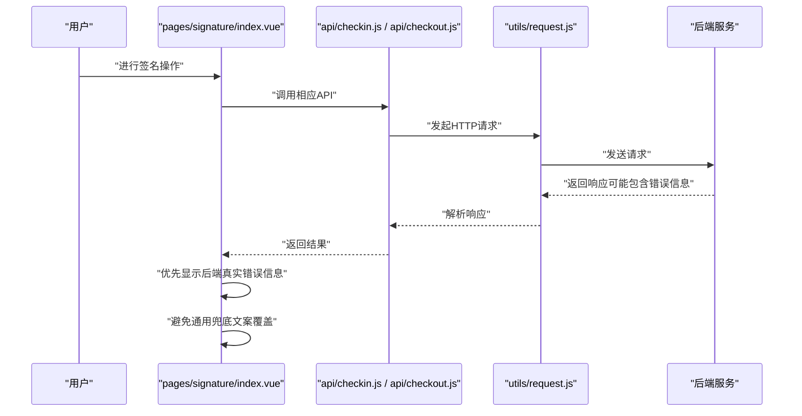

**图表来源**
- [pages/signature/index.vue:426-434](file://uniapp-h5/pages/signature/index.vue#L426-L434)
- [pages/signature/index.vue:488-496](file://uniapp-h5/pages/signature/index.vue#L488-L496)
- [pages/signature/index.vue:555-563](file://uniapp-h5/pages/signature/index.vue#L555-L563)
- [utils/request.js:42-48](file://uniapp-h5/utils/request.js#L42-L48)

**章节来源**
- [utils/request.js:1-135](file://uniapp-h5/utils/request.js#L1-L135)
- [api/auth.js:1-55](file://uniapp-h5/api/auth.js#L1-L55)
- [pages/login/index.vue:184-230](file://uniapp-h5/pages/login/index.vue#L184-L230)
- [api/bill.js:1-61](file://uniapp-h5/api/bill.js#L1-L61)
- [api/pay.js:1-34](file://uniapp-h5/api/pay.js#L1-L34)
- [subpkg/affairs/bill.vue:213-271](file://uniapp-h5/subpkg/affairs/bill.vue#L213-L271)
- [pages/room/deposit.vue:207-317](file://uniapp-h5/pages/room/deposit.vue#L207-L317)
- [pages/room/payResult.vue:40-57](file://uniapp-h5/pages/room/payResult.vue#L40-L57)
- [subpkg/service/enterprise.vue:333-412](file://uniapp-h5/subpkg/service/enterprise.vue#L333-L412)
- [api/contractFiling.js:1-25](file://uniapp-h5/api/contractFiling.js#L1-L25)
- [api/coupon.js:1-26](file://uniapp-h5/api/coupon.js#L1-L26)
- [api/subsidyApply.js:1-25](file://uniapp-h5/api/subsidyApply.js#L1-L25)
- [api/checkin.js:72-74](file://uniapp-h5/api/checkin.js#L72-L74)
- [api/checkout.js:66-68](file://uniapp-h5/api/checkout.js#L66-L68)
- [api/project.js:1-37](file://uniapp-h5/api/project.js#L1-L37)
- [api/contract.js:20-22](file://uniapp-h5/api/contract.js#L20-L22)

### 移动端适配方案
- 响应式布局
  - 使用 rpx 单位与 flex 布局，结合 uni.scss 变量与 scoped 样式，保证在不同屏幕尺寸下的一致性。
- 触摸交互
  - 使用 swiper、picker、scroll-view 等原生组件，配合 click 与 change 事件，提升交互流畅度。
- 性能优化
  - 分包策略：pages.json 中通过 subPackages 将业务拆分，减少首屏包体与首次渲染时间。
  - 功能开关：config/feature-flags.js 控制入口显隐，避免未开放功能影响用户体验与包体大小。
  - 首页图片处理：getImageUrl 统一封装图片 URL 拼接，避免重复逻辑与错误。
  - **新增** 支付页面优化：采用异步加载和防重复提交机制，避免支付请求重复触发。
  - **新增** 文件上传优化：支持多文件上传与预览，限制上传数量与大小。
  - **新增** 账单页面优化：支持当前账单与历史账单分页显示，提升大数据量下的性能表现。
  - **新增** 签名页面优化：改进错误处理逻辑，提升用户体验和问题诊断能力。
  - **新增** 项目详情页优化：增强导航功能，提供更好的用户体验。
  - **新增** 地图页面优化：支持坐标数据过滤，提升地图渲染性能。
  - **新增** 合同签署页面优化：批量模式下隐藏租期选择器，提升用户体验。
- 内存管理
  - 页面卸载时及时 off 全局事件，避免内存泄漏。
  - 首页在 onUnload 中移除事件监听，防止多次绑定导致的内存占用。
  - **新增** 倒计时组件内存管理：在页面卸载时清除定时器，防止内存泄漏。
  - **新增** 支付轮询内存管理：在页面卸载时清除轮询定时器，防止内存泄漏。
  - **新增** 表单数据内存管理：在页面卸载时清理表单数据，防止内存泄漏。
  - **新增** 账单数据内存管理：在页面卸载时清理账单列表数据，防止内存泄漏。
  - **新增** 签名页面内存管理：在页面卸载时清理签名画布和定时器，防止内存泄漏。
  - **新增** 项目详情页内存管理：在页面卸载时清理坐标数据和导航状态，防止内存泄漏。
  - **新增** 地图页面内存管理：在页面卸载时清理地图实例和标记点，防止内存泄漏。
  - **新增** 合同签署页面内存管理：在页面卸载时清理合同数据和定时器，防止内存泄漏。

**章节来源**
- [pages.json:47-341](file://uniapp-h5/pages.json#L47-L341)
- [config/feature-flags.js:1-13](file://uniapp-h5/config/feature-flags.js#L1-L13)
- [pages/index/index.vue:558-581](file://uniapp-h5/pages/index/index.vue#L558-L581)
- [pages/index/index.vue:328-330](file://uniapp-h5/pages/index/index.vue#L328-L330)
- [subpkg/affairs/checkin.vue:166-169](file://uniapp-h5/subpkg/affairs/checkin.vue#L166-L169)
- [pages/room/deposit.vue:166-169](file://uniapp-h5/pages/room/deposit.vue#L166-L169)
- [pages/room/payResult.vue:39-57](file://uniapp-h5/pages/room/payResult.vue#L39-L57)
- [subpkg/service/enterprise.vue:392-412](file://uniapp-h5/subpkg/service/enterprise.vue#L392-L412)
- [subpkg/purchase/contract-filing-submit.vue:74-92](file://uniapp-h5/subpkg/purchase/contract-filing-submit.vue#L74-L92)
- [subpkg/purchase/subsidy-submit.vue:104-122](file://uniapp-h5/subpkg/purchase/subsidy-submit.vue#L104-L122)
- [subpkg/affairs/bill.vue:166-169](file://uniapp-h5/subpkg/affairs/bill.vue#L166-L169)
- [pages/signature/index.vue:173-177](file://uniapp-h5/pages/signature/index.vue#L173-L177)
- [pages/project/detail.vue:173-175](file://uniapp-h5/pages/project/detail.vue#L173-L175)
- [pages/map/index.vue:250-259](file://uniapp-h5/pages/map/index.vue#L250-L259)
- [pages/contract/sign.vue:86-87](file://uniapp-h5/pages/contract/sign.vue#L86-L87)
- [pages/contract/sign.vue:240-240](file://uniapp-h5/pages/contract/sign.vue#L240-L240)
- [pages/contract/sign.vue:408-408](file://uniapp-h5/pages/contract/sign.vue#L408-L408)

### 跨平台开发最佳实践
- 多端编译
  - 使用条件编译（如 #ifdef H5/#ifdef MP-WEIXIN）隔离平台差异，避免在非目标平台出现无效逻辑。
  - **新增** 支付环境检测：pages/room/deposit.vue 和 subpkg/service/enterprise.vue 通过 detectPayEnv 方法智能识别支付环境。
  - **新增** 文件上传平台适配：支持 H5 与小程序的不同上传方式。
  - **新增** 账单页面平台适配：支持不同平台的账单数据展示和交互。
  - **新增** 签名页面平台适配：支持 H5 原生 canvas 和小程序 canvas 两种绘制方式。
  - **新增** 地图页面平台适配：H5端使用高德地图API，小程序端使用原生地图组件。
  - **新增** 合同签署页面平台适配：批量模式下隐藏租期选择器，续租模式下显示租期选择器。
- 平台适配
  - H5 与小程序在登录方式、权限声明、导航样式上存在差异，需在页面与配置中分别处理。
  - **新增** 支付平台适配：针对微信小程序、H5微信浏览器、普通浏览器提供不同的支付调用方式。
  - **新增** 承诺书签署平台适配：支持不同平台的电子签名功能。
  - **新增** 账单数据平台适配：兼容不同平台的账单格式和数据结构。
  - **新增** 错误处理平台适配：统一的错误处理逻辑在不同平台上保持一致。
  - **新增** 导航功能平台适配：H5端使用 uni.openLocation，小程序端使用微信原生导航API。
  - **新增** 合同签署平台适配：批量模式和续租模式在不同平台上提供一致的用户体验。
- 统一配置
  - config/index.js 管理不同环境的 API 地址与超时，避免硬编码；manifest.json 中 H5 devServer 代理后端接口，便于本地联调。
- 组件复用
  - 将通用 UI 与业务组件抽离至 components 与 api 目录，提升可维护性与复用率。
- 生命周期与事件
  - App.vue 在 onLaunch 拉取全局数据并通过事件广播，页面在 onLoad/onShow 中消费，保证顺序与一致性。
- **新增** 支付安全
  - 支付参数严格校验，确保 openid 等关键参数存在。
  - 支付轮询机制确保支付状态最终一致性。
  - 支付结果同步机制处理回调延迟问题。
- **新增** 业务安全
  - 表单数据严格校验，防止空值提交。
  - 文件上传安全检查，限制文件类型与大小。
  - 承诺书签署安全验证，确保签署有效性。
  - **新增** 签名安全：签名数据采用 base64 编码传输，确保数据完整性。
  - **新增** 导航安全：坐标数据严格验证，防止无效坐标导致的导航失败。
  - **新增** 合同签署安全：批量模式下确保租期数据的正确性和安全性。
- **新增** 数据安全
  - 账单数据加密传输，防止敏感信息泄露。
  - 账单状态变更审计日志，确保数据完整性。
  - **新增** 错误信息保护：后端返回的错误信息经过安全处理，避免敏感信息泄露。
  - **新增** 坐标数据安全：项目坐标数据进行格式验证和范围检查，确保数据有效性。
  - **新增** 合同数据安全：批量模式下的合同数据进行完整性校验，确保签署流程的安全性。

**章节来源**
- [pages/login/index.vue:23-45](file://uniapp-h5/pages/login/index.vue#L23-L45)
- [config/index.js:1-64](file://uniapp-h5/config/index.js#L1-L64)
- [manifest.json:81-105](file://uniapp-h5/manifest.json#L81-L105)
- [App.vue:9-39](file://uniapp-h5/App.vue#L9-L39)
- [pages/room/deposit.vue:184-198](file://uniapp-h5/pages/room/deposit.vue#L184-L198)
- [subpkg/service/enterprise.vue:333-390](file://uniapp-h5/subpkg/service/enterprise.vue#L333-L390)
- [subpkg/purchase/contract-filing-submit.vue:68-73](file://uniapp-h5/subpkg/purchase/contract-filing-submit.vue#L68-L73)
- [subpkg/purchase/subsidy-submit.vue:98-103](file://uniapp-h5/subpkg/purchase/subsidy-submit.vue#L98-L103)
- [subpkg/affairs/bill.vue:292-313](file://uniapp-h5/subpkg/affairs/bill.vue#L292-L313)
- [pages/signature/index.vue:49-51](file://uniapp-h5/pages/signature/index.vue#L49-L51)
- [pages/signature/index.vue:24-33](file://uniapp-h5/pages/signature/index.vue#L24-L33)
- [pages/project/detail.vue:203-223](file://uniapp-h5/pages/project/detail.vue#L203-L223)
- [pages/map/index.vue:264-331](file://uniapp-h5/pages/map/index.vue#L264-L331)
- [pages/contract/sign.vue:86-87](file://uniapp-h5/pages/contract/sign.vue#L86-L87)
- [pages/contract/sign.vue:240-240](file://uniapp-h5/pages/contract/sign.vue#L240-L240)
- [pages/contract/sign.vue:408-408](file://uniapp-h5/pages/contract/sign.vue#L408-L408)

### 入住倒计时组件详解
**新增** 本节详细介绍移动端检查入页面倒计时组件的实现与功能。

#### 组件功能特性
- 实时倒计时显示：针对状态为"待办理"（status=0）的入住申请，显示剩余可办理时间。
- 多级颜色提醒：根据剩余时间动态调整倒计时条的颜色（蓝色正常、橙色预警、红色危险）。
- 进度条可视化：显示剩余时间占总时限的比例进度。
- 自动解约提醒：明确提示超时未办理将自动解约并原路退还押金及首期租金。
- 定时器管理：精确的定时器启动、停止与内存清理机制。

#### 技术实现细节
- **倒计时数据结构**：`{ showCountdown, remainingSeconds, totalSeconds, deadline, timeoutHours }`
- **定时器管理**：
  - `_countdownTimer`：每秒递减定时器
  - `_checkinTimer`：入住前置检查定时器
- **颜色分级逻辑**：
  - 剩余时间 < 24小时：红色危险级别
  - 剩余时间 < 50%总时长：橙色预警级别
  - 其他：蓝色正常级别
- **时间格式化**：
  - ≥1小时：显示"X小时X分钟"
  - <1小时：显示"X分X秒"

#### 核心方法说明
- `loadCountdowns()`：批量加载所有待办理合同的倒计时数据
- `startCountdownTick()`：启动每秒递减定时器
- `stopCountdownTick()`：停止倒计时定时器
- `formatRemain(seconds)`：格式化剩余时间显示
- `getProgressWidth(remaining, total)`：计算进度条宽度百分比

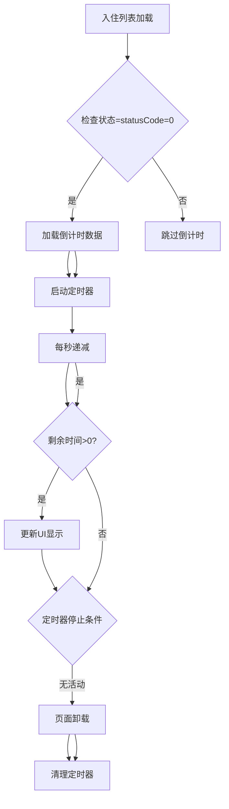

**图表来源**
- [subpkg/affairs/checkin.vue:385-442](file://uniapp-h5/subpkg/affairs/checkin.vue#L385-L442)

**章节来源**
- [subpkg/affairs/checkin.vue:56-70](file://uniapp-h5/subpkg/affairs/checkin.vue#L56-L70)
- [subpkg/affairs/checkin.vue:385-471](file://uniapp-h5/subpkg/affairs/checkin.vue#L385-L471)
- [api/checkin.js:14-21](file://uniapp-h5/api/checkin.js#L14-L21)

### 企业支付功能详解
**新增** 本节详细介绍企业支付功能的实现与支付流程。

#### 支付流程概述
企业支付功能提供完整的在线缴费解决方案，支持微信JSAPI支付流程，包含预支付、支付调用、状态轮询和结果同步机制。

#### 支付接口设计
- **预支付接口**：`wechatPrepayEnterprise(params)` - 企业账单微信预支付（仅 JSAPI）
- **支付结果同步**：`syncPayResult(billNo)` - 主动同步支付结果（兜底）
- **支付结果查询**：`queryPayResult(billNo)` - 查询支付结果

#### 支付页面实现
- **企业服务页面**：subpkg/service/enterprise.vue 提供企业账单管理与支付功能
- **支付环境检测**：智能识别微信小程序、H5微信浏览器、普通浏览器环境
- **支付参数准备**：自动获取 openid 和 billId 参数
- **支付调用方式**：
  - 微信小程序：使用 uni.requestPayment
  - H5微信浏览器：使用 WeixinJSBridge.invoke
  - 普通浏览器：跳转到微信支付页面

#### 支付轮询与状态同步
- **轮询机制**：支付完成后启动轮询查询支付状态，最多8次，间隔2秒
- **状态同步**：企业支付使用 syncPayResult 接口进行状态同步，最多5次
- **兜底机制**：支付结果未确认时提供"支付状态确认中"提示

#### 核心功能特性
- **企业账单管理**：支持企业账单列表查看、状态管理
- **批量支付**：支持多账单合并支付
- **状态实时更新**：支付完成后自动刷新账单状态
- **文件上传**：支持入住办理相关的文件上传功能
- **模板下载**：提供人员名单模板下载功能

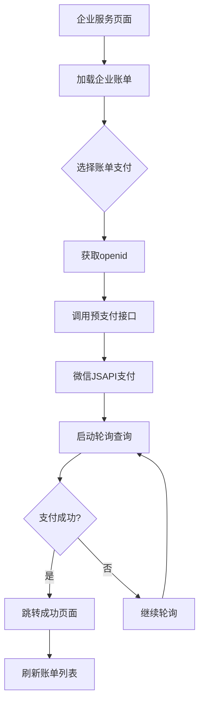

**图表来源**
- [subpkg/service/enterprise.vue:333-412](file://uniapp-h5/subpkg/service/enterprise.vue#L333-L412)
- [api/pay.js:15-25](file://uniapp-h5/api/pay.js#L15-L25)

**章节来源**
- [api/pay.js:1-34](file://uniapp-h5/api/pay.js#L1-L34)
- [subpkg/service/enterprise.vue:1-1371](file://uniapp-h5/subpkg/service/enterprise.vue#L1-L1371)
- [pages/room/deposit.vue:1-750](file://uniapp-h5/pages/room/deposit.vue#L1-L750)
- [pages/room/payResult.vue:1-73](file://uniapp-h5/pages/room/payResult.vue#L1-L73)
- [pages/room/success.vue:1-108](file://uniapp-h5/pages/room/success.vue#L1-L108)

### 合同备案功能详解
**新增** 本节详细介绍合同备案功能的实现与业务流程。

#### 业务流程概述
合同备案功能提供租户合同信息的在线备案服务，支持表单填写、文件上传、审批状态跟踪等完整流程。

#### API 接口设计
- **我的备案列表**：`getMyFilingList(tenantId, approveStatus)` - 获取租户的合同备案列表
- **备案详情**：`getFilingDetail(filingId)` - 获取备案详情信息
- **提交备案**：`submitFiling(data)` - 提交合同备案申请

#### 页面实现
- **合同备案列表**：subpkg/purchase/contract-filing-list.vue 展示备案记录，支持状态筛选，优化了卡片布局和状态标识。
- **合同备案详情**：subpkg/purchase/contract-filing-detail.vue 展示备案详细信息与附件，改进了详情卡片布局和状态标签样式。
- **合同备案提交**：subpkg/purchase/contract-filing-submit.vue 提供表单填写与文件上传。

#### 核心功能特性
- **状态管理**：支持待审批、已通过、已驳回三种状态
- **文件管理**：支持最多5个文件上传，支持预览与删除
- **表单验证**：严格的表单字段验证与错误提示
- **审批跟踪**：实时显示审批状态与时间信息

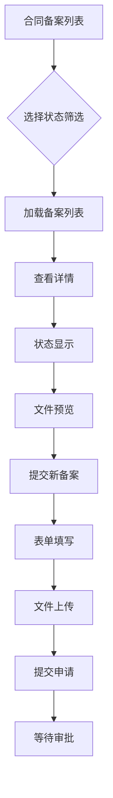

**图表来源**
- [subpkg/purchase/contract-filing-list.vue:61-68](file://uniapp-h5/subpkg/purchase/contract-filing-list.vue#L61-L68)
- [subpkg/purchase/contract-filing-submit.vue:95-116](file://uniapp-h5/subpkg/purchase/contract-filing-submit.vue#L95-L116)

**章节来源**
- [api/contractFiling.js:1-25](file://uniapp-h5/api/contractFiling.js#L1-L25)
- [subpkg/purchase/contract-filing-list.vue:1-112](file://uniapp-h5/subpkg/purchase/contract-filing-list.vue#L1-L112)
- [subpkg/purchase/contract-filing-detail.vue:1-91](file://uniapp-h5/subpkg/purchase/contract-filing-detail.vue#L1-L91)
- [subpkg/purchase/contract-filing-submit.vue:1-140](file://uniapp-h5/subpkg/purchase/contract-filing-submit.vue#L1-L140)

### 优惠券功能详解
**新增** 本节详细介绍优惠券功能的实现与业务流程。

#### 业务流程概述
优惠券功能提供租户优惠券的领取与管理服务，支持公开领取、个人管理、状态跟踪等完整流程。

#### API 接口设计
- **可领取列表**：`getAvailableCoupons(tenantId)` - 获取可领取的优惠券列表
- **我的优惠券**：`getMyCoupons(tenantId, receiveStatus)` - 获取租户的优惠券列表
- **领取优惠券**：`receiveCoupon(couponId, tenantId)` - 领取指定优惠券

#### 页面实现
- **优惠券列表**：pages/coupon/index.vue 展示可领取的优惠券，支持领取操作，优化了优惠券卡片样式和状态显示。
- **我的优惠券**：pages/coupon/my.vue 展示个人优惠券，支持状态筛选，改进了状态标签样式和视觉反馈。

#### 核心功能特性
- **状态管理**：支持未使用、已使用、已过期三种状态
- **有效期管理**：自动过期检查与状态更新
- **领取限制**：支持每人限领次数与总量限制
- **样式定制**：支持不同类型的优惠券样式展示

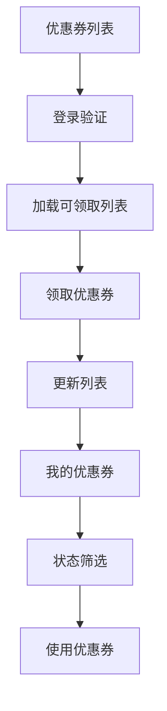

**图表来源**
- [pages/coupon/index.vue:100-110](file://uniapp-h5/pages/coupon/index.vue#L100-L110)
- [pages/coupon/my.vue:102-116](file://uniapp-h5/pages/coupon/my.vue#L102-L116)

**章节来源**
- [api/coupon.js:1-26](file://uniapp-h5/api/coupon.js#L1-L26)
- [pages/coupon/index.vue:1-442](file://uniapp-h5/pages/coupon/index.vue#L1-L442)
- [pages/coupon/my.vue:1-308](file://uniapp-h5/pages/coupon/my.vue#L1-L308)

### 代购补贴申请功能详解
**新增** 本节详细介绍代购补贴申请功能的实现与业务流程。

#### 业务流程概述
代购补贴申请功能提供租户代购补贴的在线申请服务，支持承诺书签署、申请提交、审批跟踪等完整流程。

#### API 接口设计
- **我的申请列表**：`getMySubsidyList(tenantId, approveStatus)` - 获取租户的申请列表
- **申请详情**：`getSubsidyDetail(applyId)` - 获取申请详情信息
- **提交申请**：`submitSubsidy(data)` - 提交代购补贴申请

#### 页面实现
- **申请列表**：subpkg/purchase/subsidy-list.vue 展示申请记录，支持状态筛选，优化了列表卡片和状态显示。
- **申请详情**：subpkg/purchase/subsidy-detail.vue 展示申请详细信息与附件，改进了详情展示和状态标识。
- **申请提交**：subpkg/purchase/subsidy-submit.vue 提供表单填写、承诺书签署与文件上传。

#### 核心功能特性
- **承诺书管理**：支持承诺书模板加载与电子签名
- **状态管理**：支持待审批、已通过、已驳回三种状态
- **文件管理**：支持购房合同附件上传与预览
- **审批跟踪**：实时显示审批状态、时间与备注信息

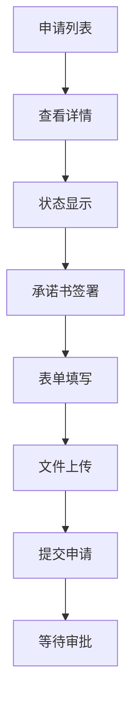

**图表来源**
- [subpkg/purchase/subsidy-list.vue:54-61](file://uniapp-h5/subpkg/purchase/subsidy-list.vue#L54-L61)
- [subpkg/purchase/subsidy-submit.vue:154-179](file://uniapp-h5/subpkg/purchase/subsidy-submit.vue#L154-L179)

**章节来源**
- [api/subsidyApply.js:1-25](file://uniapp-h5/api/subsidyApply.js#L1-L25)
- [subpkg/purchase/subsidy-list.vue:1-210](file://uniapp-h5/subpkg/purchase/subsidy-list.vue#L1-L210)
- [subpkg/purchase/subsidy-detail.vue:1-89](file://uniapp-h5/subpkg/purchase/subsidy-detail.vue#L1-L89)
- [subpkg/purchase/subsidy-submit.vue:1-210](file://uniapp-h5/subpkg/purchase/subsidy-submit.vue#L1-L210)

### 账单页面增强功能详解
**新增** 本节详细介绍移动端H5应用账单页面的期次跟踪显示和兼容旧版本账单格式功能。

#### 期次跟踪显示功能
- **期次显示逻辑**：针对租金账单（billType=2），优先显示期次序号（billSeq），如果不存在则显示账单周期（billPeriod）。
- **期次格式化**：期次序号显示为"第X期房租"，账单周期显示为"YYYY年MM月"或"MM.DD-MM.DD"格式。
- **兼容性处理**：对于旧版本账单，billSeq 为空时自动降级到 billPeriod 显示，确保向前兼容。

#### 旧版本账单格式兼容
- **字段兼容**：支持 billSeq 和 billPeriod 两个字段的并行显示逻辑。
- **降级策略**：当新字段 billSeq 缺失时，自动使用旧字段 billPeriod 作为备选显示。
- **数据映射**：在 mapBillToFrontEnd 方法中实现完整的字段映射和兼容逻辑。

#### 账单页面核心功能
- **当前账单与历史账单切换**：支持 tab 切换显示未支付和已支付账单。
- **批量选择支付**：支持多选账单进行批量支付。
- **支付状态轮询**：支付完成后自动轮询查询支付状态。
- **锁定期管理**：押金未缴或资料未提交时，租金账单锁定不可选。

#### 技术实现细节
- **期次显示逻辑**：
  ```javascript
  if (bill.billType === '2') {
    // 租金账单，显示期次
    if (bill.billSeq) {
      period = `第${bill.billSeq}期房租`
    } else {
      period = bill.billPeriod ? `${bill.billPeriod}房租` : '房租'
    }
  }
  ```
- **账单周期格式化**：
  - 有起止日期：显示"MM.DD-MM.DD"
  - 无起止日期：显示"YYYY年MM月"
- **兼容性处理**：优先使用新字段 billSeq，降级使用旧字段 billPeriod

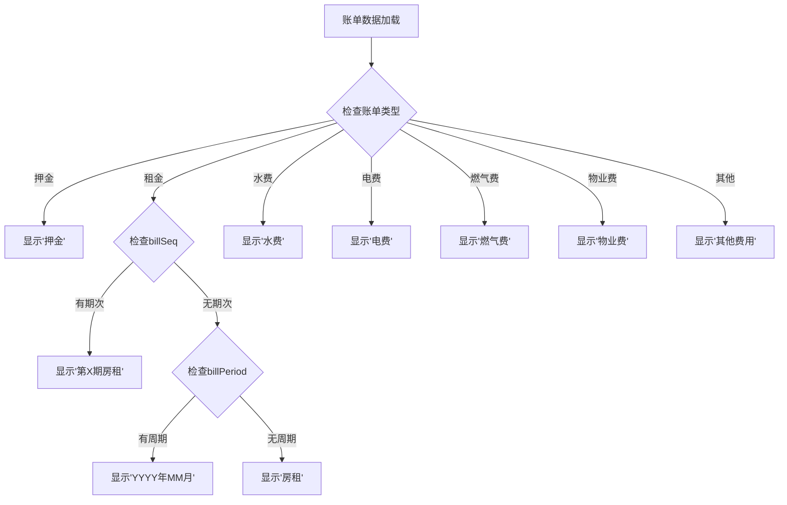

**图表来源**
- [subpkg/affairs/bill.vue:292-313](file://uniapp-h5/subpkg/affairs/bill.vue#L292-L313)

**章节来源**
- [api/bill.js:1-61](file://uniapp-h5/api/bill.js#L1-L61)
- [subpkg/affairs/bill.vue:1-1013](file://uniapp-h5/subpkg/affairs/bill.vue#L1-L1013)
- [HzBill.java:68-78](file://ruoyi-system/src/main/java/com/ruoyi/system/domain/HzBill.java#L68-L78)
- [HzBill.java:214-220](file://ruoyi-system/src/main/java/com/ruoyi/system/domain/HzBill.java#L214-L220)

### 签名页面错误处理改进详解
**新增** 本节详细介绍移动端H5应用签名页面的错误处理改进，重点说明优先显示后端返回真实错误信息的实现。

#### 错误处理改进概述
签名页面在三个主要提交方法中实现了统一的错误处理改进：
- `handleCheckInConfirm()`：入住确认签名提交
- `handleCheckoutConfirm()`：退租确认签名提交  
- `handleCheckoutApply()`：退租申请签名提交

#### 改进的技术实现
- **优先级逻辑**：使用 `(error && (error.msg || error.message)) || ''` 提取真实错误信息
- **兜底机制**：当后端返回信息为空时，使用"提交失败，请重试"作为兜底文案
- **统一处理**：三个方法都采用相同的错误处理模式，确保用户体验一致性

#### 具体实现细节
- **入住确认错误处理**（第426-434行）：
  - 捕获 submitCheckInConfirm 调用异常
  - 优先显示 error.msg 或 error.message
  - 无法获取真实信息时显示兜底文案
  
- **退租确认错误处理**（第488-496行）：
  - 捕获 submitCheckoutConfirm 调用异常
  - 优先显示后端返回的错误信息
  - 提供用户友好的错误提示
  
- **退租申请错误处理**（第555-563行）：
  - 捕获 submitCheckoutApply 调用异常
  - 优先显示具体的错误原因
  - 避免通用"提交失败"覆盖真实问题

#### 改进的意义
- **提升用户体验**：用户能够看到具体的错误原因，而非模糊的"提交失败"
- **便于问题诊断**：开发人员可以快速定位具体问题所在
- **增强系统透明度**：后端可以返回详细的错误信息，帮助用户理解问题
- **保持一致性**：三种签名模式采用统一的错误处理策略

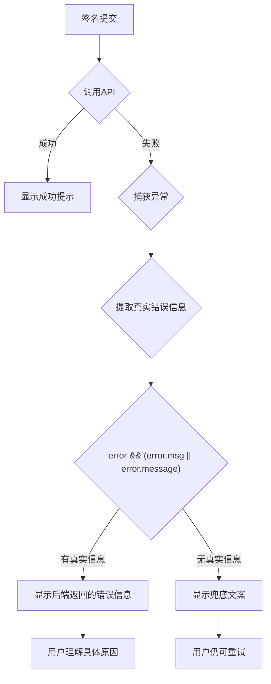

**图表来源**
- [pages/signature/index.vue:426-434](file://uniapp-h5/pages/signature/index.vue#L426-L434)
- [pages/signature/index.vue:488-496](file://uniapp-h5/pages/signature/index.vue#L488-L496)
- [pages/signature/index.vue:555-563](file://uniapp-h5/pages/signature/index.vue#L555-L563)

**章节来源**
- [pages/signature/index.vue:426-434](file://uniapp-h5/pages/signature/index.vue#L426-L434)
- [pages/signature/index.vue:488-496](file://uniapp-h5/pages/signature/index.vue#L488-L496)
- [pages/signature/index.vue:555-563](file://uniapp-h5/pages/signature/index.vue#L555-L563)
- [utils/request.js:42-48](file://uniapp-h5/utils/request.js#L42-L48)

### 合同签署页面批量模式支持详解
**新增** 本节详细介绍移动端H5应用合同签署页面的批量模式支持，重点说明isBatchMode标志位的实现与作用。

#### 批量模式概述
合同签署页面新增了批量模式支持，通过 isBatchMode 标志位控制租期选择器的显示，为批次配租场景提供专门的合同签署流程。批量模式下，租期由批次固定，不可编辑，简化了签署流程。

#### isBatchMode 标志位实现
- **标志位定义**：在 data() 中定义 `isBatchMode: false`，用于控制租期选择器的显示。
- **数据获取**：在 `init()` 方法中通过 `this.isBatchMode = res.data.isBatchMode || false` 设置批量模式状态。
- **UI控制**：在模板中使用 `v-if="!isBatchMode"` 控制租期选择器的显示，批量模式下隐藏租期选择器。

#### 批量模式功能特性
- **租期固定**：批量模式下租期由批次确定，不可修改，确保批次配租的一致性。
- **界面简化**：隐藏租期选择器，减少用户操作步骤，提升签署效率。
- **状态同步**：批量模式下的合同数据与后端保持同步，确保数据准确性。
- **兼容性**：批量模式与续租模式并存，支持不同业务场景的需求。

#### 技术实现细节
- **租期选择器控制**：
  ```html
  <view class="row row-picker" v-if="!isBatchMode">
    <text class="row-label">租期</text>
    <picker
      mode="selector"
      :range="rentMonthsOptions"
      range-key="label"
      :value="rentMonthsIndex"
      @change="onRentMonthsChange"
    >
      <view class="picker-btn">
        <text class="picker-val">{{ rentMonths }} 个月</text>
        <text class="picker-arrow">›</text>
      </view>
    </picker>
  </view>
  ```

- **批量模式检测**：
  ```javascript
  async init() {
    this.loading = true
    try {
      if (this.contractId) {
        await this.callInitSign()
        return
      }
      const params = {
        houseId: this.roomId,
        rentMonths: this.rentMonths
      }
      // 续租模式下传递 oldContractId
      if (this.isRenew && this.oldContractId) {
        params.oldContractId = this.oldContractId
      }
      const res = await generateContract(params)
      if (res.code !== 200) throw new Error(res.msg || '获取合同信息失败')
      // ...
      this.isBatchMode = res.data.isBatchMode || false
      // ...
    }
  }
  ```

#### 批量模式优势
- **提升效率**：批量模式下无需选择租期，直接进入签署流程，减少用户操作时间。
- **确保一致性**：租期由批次固定，避免人为修改导致的数据不一致。
- **简化流程**：隐藏复杂的租期选择逻辑，专注于合同签署的核心功能。
- **用户体验**：针对特定业务场景优化界面，提供更直观的操作体验。

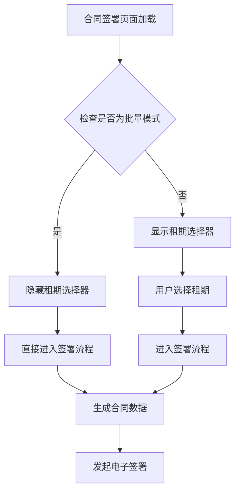

**图表来源**
- [pages/contract/sign.vue:86-87](file://uniapp-h5/pages/contract/sign.vue#L86-L87)
- [pages/contract/sign.vue:240-240](file://uniapp-h5/pages/contract/sign.vue#L240-L240)
- [pages/contract/sign.vue:408-408](file://uniapp-h5/pages/contract/sign.vue#L408-L408)

**章节来源**
- [pages/contract/sign.vue:86-87](file://uniapp-h5/pages/contract/sign.vue#L86-L87)
- [pages/contract/sign.vue:240-240](file://uniapp-h5/pages/contract/sign.vue#L240-L240)
- [pages/contract/sign.vue:408-408](file://uniapp-h5/pages/contract/sign.vue#L408-L408)
- [api/contract.js:20-22](file://uniapp-h5/api/contract.js#L20-L22)

### 项目详情页导航功能重大改进
**新增** 本节详细介绍移动端H5应用项目详情页导航功能的重大改进，包括坐标数据处理、验证逻辑和错误处理的增强。

#### 导航功能概述
项目详情页的导航功能经过重大改进，提供了更加稳定和用户友好的导航体验。改进主要包括坐标数据处理、验证逻辑增强和错误处理优化。

#### 坐标数据处理改进
- **数据类型转换**：在项目详情加载时，坐标数据通过 `parseFloat()` 进行精确转换，确保数值类型的一致性。
- **空值处理**：当项目坐标为空时，设置为 `null`，避免后续处理中的类型错误。
- **数据验证**：在导航调用前进行坐标有效性检查，确保经纬度数据的有效性。

#### 验证逻辑增强
- **坐标存在性检查**：在 `openNavigation()` 方法中，首先检查 `lat` 和 `lng` 是否存在且有效。
- **错误提示优化**：当坐标缺失时，显示"该项目暂无坐标信息"的友好提示，而非默认的导航失败。
- **导航参数完整性**：确保导航所需的 `name` 和 `address` 参数完整传递。

#### 错误处理优化
- **导航失败处理**：在 `uni.openLocation()` 的 `fail` 回调中，记录详细的错误日志并显示用户友好的错误提示。
- **错误信息保留**：保留原始错误对象，便于开发调试和问题追踪。
- **用户体验提升**：通过合理的错误提示和日志记录，提升用户的操作体验。

#### 技术实现细节
- **坐标数据处理**：
  ```javascript
  latitude: project.latitude ? parseFloat(project.latitude) : null,
  longitude: project.longitude ? parseFloat(project.longitude) : null,
  distance: this.calculateDistance(project.latitude, project.longitude),
  ```

- **导航验证逻辑**：
  ```javascript
  openNavigation() {
    const lat = this.projectInfo.latitude
    const lng = this.projectInfo.longitude
    if (!lat || !lng) {
      uni.showToast({ title: '该项目暂无坐标信息', icon: 'none' })
      return
    }
    // ... 导航逻辑
  }
  ```

- **错误处理机制**：
  ```javascript
  fail: (err) => {
    console.error('打开导航失败:', err)
    uni.showToast({
      title: '打开导航失败',
      icon: 'none'
    })
  }
  ```

#### 导航功能优势
- **稳定性提升**：通过严格的坐标验证和错误处理，显著减少了导航失败的情况。
- **用户体验优化**：提供清晰的错误提示和合理的降级处理，提升用户满意度。
- **开发可维护性**：完善的日志记录和错误处理机制，便于问题诊断和系统维护。
- **数据安全性**：通过数据类型转换和验证，确保导航数据的安全性和准确性。

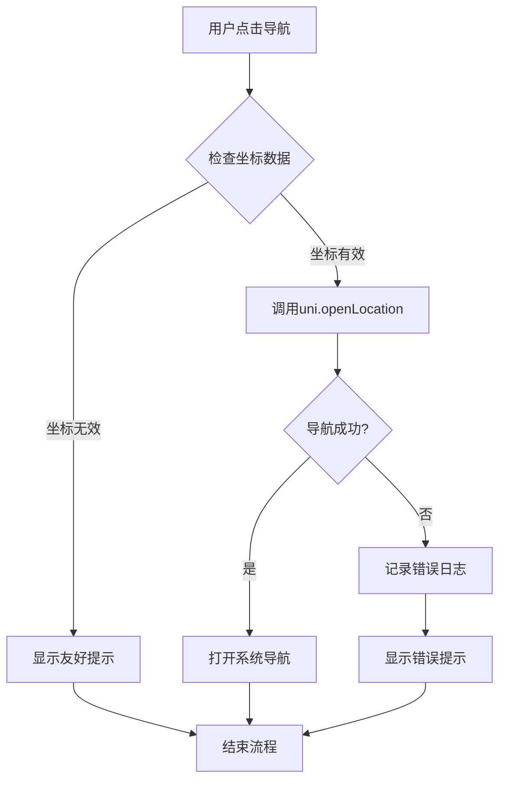

**图表来源**
- [pages/project/detail.vue:203-223](file://uniapp-h5/pages/project/detail.vue#L203-L223)
- [pages/project/detail.vue:155-158](file://uniapp-h5/pages/project/detail.vue#L155-L158)

**章节来源**
- [pages/project/detail.vue:203-223](file://uniapp-h5/pages/project/detail.vue#L203-L223)
- [pages/project/detail.vue:155-158](file://uniapp-h5/pages/project/detail.vue#L155-L158)
- [pages/project/detail.vue:173-175](file://uniapp-h5/pages/project/detail.vue#L173-L175)

### 地图页面坐标数据处理详解
**新增** 本节详细介绍地图页面中坐标数据处理的实现，为项目详情页导航功能提供数据基础。

#### 坐标数据过滤机制
- **数据有效性检查**：在 `processTypeData()` 方法中，对项目数据进行严格过滤，确保只有有效的坐标数据才会被处理。
- **数值类型验证**：使用 `parseFloat()` 将字符串坐标转换为数值类型，并通过 `isNaN()` 检查转换结果的有效性。
- **坐标范围验证**：确保经纬度值在合理的地理范围内，避免无效坐标导致的地图渲染问题。

#### 标记点处理优化
- **H5端标记点创建**：在H5环境中，使用高德地图API创建标记点，支持自定义图标和交互功能。
- **小程序端标记点创建**：在小程序环境中，使用原生地图组件创建标记点，支持callout气泡和点击事件。
- **标记点数据结构**：统一标记点数据结构，包括经纬度、图标、标题等属性，确保跨平台兼容性。

#### 地图渲染优化
- **批量数据处理**：使用 `Promise.all()` 并行加载不同类型项目的坐标数据，提升数据加载效率。
- **动态标记点更新**：根据用户选择的项目类型动态更新地图标记点，提升用户体验。
- **视图自适应**：根据标记点位置自动调整地图视野，确保所有标记点都能被正确显示。

#### 技术实现细节
- **坐标过滤逻辑**：
  ```javascript
  processTypeData(projects, type) {
    return projects.filter(p =>
      p.longitude && p.latitude &&
      !isNaN(parseFloat(p.longitude)) &&
      !isNaN(parseFloat(p.latitude))
    )
  }
  ```

- **标记点创建**：
  ```javascript
  const lng = parseFloat(project.longitude)
  const lat = parseFloat(project.latitude)
  
  if (!isNaN(lng) && !isNaN(lat)) {
    const marker = new AMap.Marker({
      position: [lng, lat],
      icon: icon,
      title: project.projectName || '项目'
    })
  }
  ```

#### 地图功能优势
- **性能优化**：通过并行数据加载和批量处理，显著提升地图渲染性能。
- **数据质量保障**：严格的坐标验证和过滤机制，确保地图数据的准确性和完整性。
- **跨平台兼容**：统一的坐标处理逻辑，支持H5和小程序两端的地图渲染。
- **用户体验提升**：动态标记点更新和自适应视图，提供更好的地图交互体验。

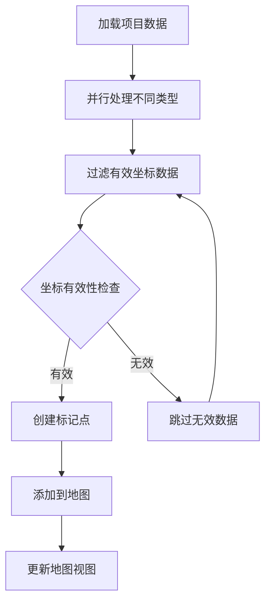

**图表来源**
- [pages/map/index.vue:250-259](file://uniapp-h5/pages/map/index.vue#L250-L259)
- [pages/map/index.vue:292-314](file://uniapp-h5/pages/map/index.vue#L292-L314)
- [pages/map/index.vue:445-467](file://uniapp-h5/pages/map/index.vue#L445-L467)

**章节来源**
- [pages/map/index.vue:250-259](file://uniapp-h5/pages/map/index.vue#L250-L259)
- [pages/map/index.vue:292-314](file://uniapp-h5/pages/map/index.vue#L292-L314)
- [pages/map/index.vue:445-467](file://uniapp-h5/pages/map/index.vue#L445-L467)

### 合同管理页面详解
**新增** 本节详细介绍移动端H5应用合同管理页面的功能与实现，包括合同列表、状态跟踪、去签署跳转等功能。

#### 合同管理概述
合同管理页面提供租户合同的统一管理界面，支持当前合同与历史合同的分类显示、合同状态跟踪、操作按钮控制等功能。

#### 合同列表功能
- **分类显示**：通过 tab 切换显示当前合同（结束日期>=当天）和历史合同（结束日期<当天）。
- **状态映射**：将后端状态码映射为用户友好的状态文本，包括待签署、已签署、履行中、已到期、已解约、已失效等。
- **卡片布局**：每个合同以卡片形式展示，包含合同状态、小区、房间、租期、租金、押金等基本信息。

#### 状态跟踪功能
- **倒计时显示**：对待签署和已签署但未付押金的合同显示倒计时，提醒用户及时处理。
- **步骤指示器**：显示合同签署的四个步骤：去签署、合同已签、押金已缴、提交资料。
- **状态高亮**：根据合同状态高亮显示不同的样式，提供直观的状态反馈。

#### 操作按钮控制
- **状态驱动**：根据合同状态动态显示不同的操作按钮，如去签署、支付押金、租金缴纳、续租等。
- **失效处理**：对已失效的合同显示灰色禁用状态，防止用户进行无效操作。
- **续租支持**：对未续租的履行中合同提供续租按钮，支持一键跳转续租流程。

#### 技术实现细节
- **状态映射**：
  ```javascript
  getContractStatus(item) {
    switch(item.contract_status) {
      case '0': return { code: 'pending', text: '待签署' }
      case '1': return { code: 'pending', text: '待签署' }
      case '2': return { code: 'signed', text: '已签署' }
      case '3': return { code: 'active', text: '履行中' }
      case '4': return { code: 'expired', text: '已到期' }
      case '5': return { code: 'expired', text: '已解约' }
      case '6': return { code: 'voided', text: '已失效' }
      default: return { code: 'expired', text: '未知' }
    }
  }
  ```

- **倒计时管理**：
  ```javascript
  startCountdownTimers() {
    this.clearAllTimers()
    this.allContractList.forEach(item => {
      const itemKey = item.contractId || `bk_${item.orderId}`
      // 1. 预订倒计时：待签署(pending)且有bookingExpireTime
      if (item.status === 'pending' && item.bookingExpireTime) {
        this._startTimer(item, item.bookingExpireTime, 'booking', itemKey)
      }
      // 2. 押金支付倒计时：已签署未付押金且有lockExpireTime
      else if (item.signed && !item.depositPaid && item.lockExpireTime) {
        this._startTimer(item, item.lockExpireTime, 'deposit', itemKey)
      }
    })
  }
  ```

#### 合同管理优势
- **用户体验优化**：通过清晰的状态显示和倒计时提醒，提升用户对合同状态的认知。
- **操作引导**：根据合同状态提供合适的操作按钮，引导用户完成相应的业务流程。
- **数据一致性**：通过后端状态码映射，确保前端显示状态与后端数据保持一致。
- **性能优化**：通过分类显示和状态缓存，提升页面加载和渲染性能。

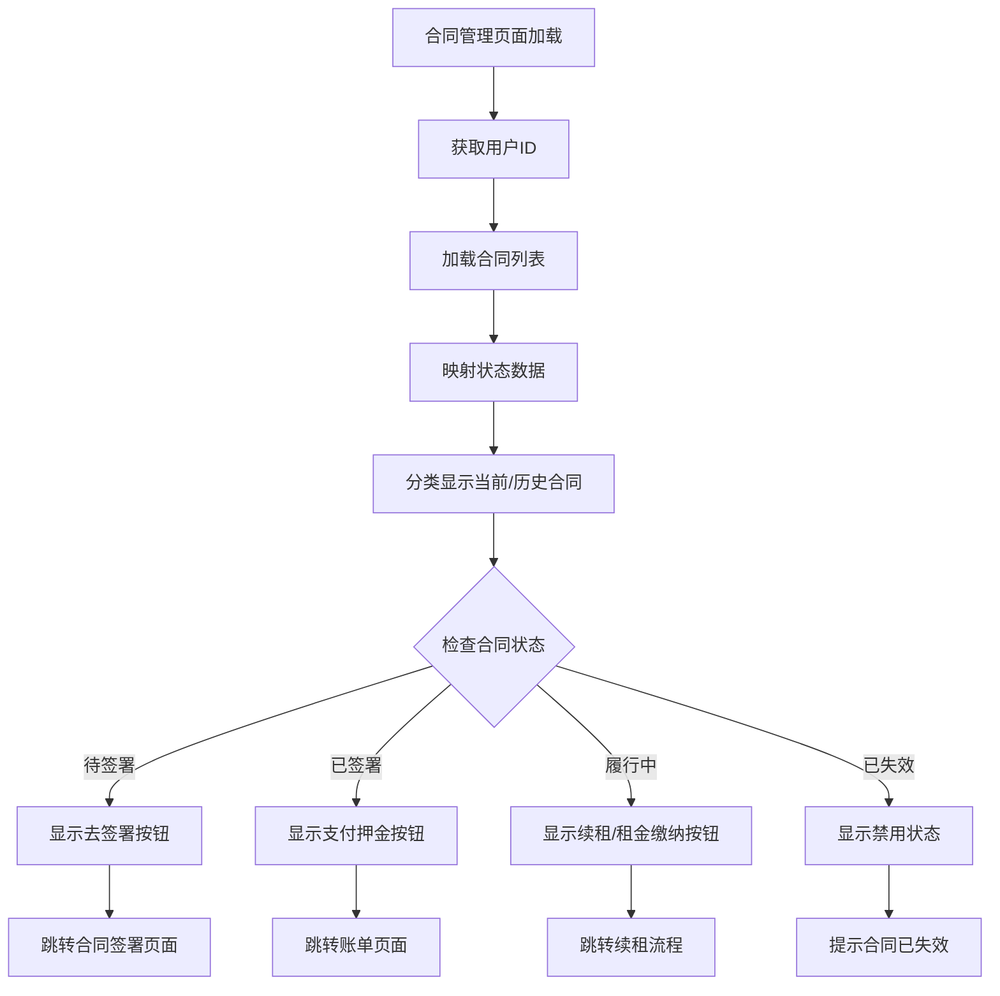

**图表来源**
- [subpkg/affairs/contract.vue:216-241](file://uniapp-h5/subpkg/affairs/contract.vue#L216-L241)
- [subpkg/affairs/contract.vue:337-350](file://uniapp-h5/subpkg/affairs/contract.vue#L337-L350)
- [subpkg/affairs/contract.vue:408-419](file://uniapp-h5/subpkg/affairs/contract.vue#L408-L419)

**章节来源**
- [subpkg/affairs/contract.vue:1-1042](file://uniapp-h5/subpkg/affairs/contract.vue#L1-L1042)
- [api/contract.js:11-13](file://uniapp-h5/api/contract.js#L11-L13)
- [api/contract.js:72-74](file://uniapp-h5/api/contract.js#L72-L74)

## 依赖关系分析
- 页面与分包
  - pages.json 声明主包与多个 subPackages，每个子包包含若干页面，形成清晰的模块边界。
  - **新增** subpkg/affairs 子包包含账单页面，支持"账单缴费"路由配置。
  - **新增** pages/room 子包包含押金支付、支付结果、支付成功等相关页面。
  - **新增** subpkg/purchase 子包包含合同备案、代购补贴申请等业务相关页面。
  - **新增** subpkg/affairs 子包包含入住确认、退租确认等业务相关页面。
  - **新增** pages/project 子包包含项目详情页，支持"项目详情"路由配置。
  - **新增** pages/map 子包包含地图找房页，支持"地图找房"路由配置。
  - **新增** pages/contract 子包包含合同签署页面，支持批量模式。
- 请求与 API
  - api/* 依赖 utils/request.js；utils/request.js 依赖 config/index.js 与本地存储 token。
  - **新增** api/bill.js 为账单页面提供接口支持，包含用户账单查询、合同账单查询、支付接口等。
  - **新增** api/contractFiling.js 为合同备案页面提供接口支持。
  - **新增** api/coupon.js 为优惠券页面提供接口支持。
  - **新增** api/subsidyApply.js 为补贴申请页面提供接口支持。
  - **新增** subpkg/service/enterprise.vue 依赖 api/pay.js 实现企业支付功能。
  - **新增** pages/room/deposit.vue 依赖 api/pay.js 实现个人支付功能。
  - **新增** subpkg/affairs/bill.vue 依赖 api/bill.js 实现账单管理功能。
  - **新增** subpkg/affairs/checkin-confirm.vue 依赖 api/checkin.js 实现入住确认功能。
  - **新增** subpkg/affairs/checkout-confirm.vue 依赖 api/checkout.js 实现退租确认功能。
  - **新增** pages/signature/index.vue 依赖 api/checkin.js 和 api/checkout.js 实现签名功能。
  - **新增** pages/project/detail.vue 依赖 api/project.js 实现项目详情查询。
  - **新增** pages/map/index.vue 依赖 api/project.js 实现项目数据加载。
  - **新增** pages/contract/sign.vue 依赖 api/contract.js 实现合同管理功能。
  - **新增** subpkg/affairs/contract.vue 依赖 api/contract.js 实现合同列表管理。
  - **新增** 批量模式支持：pages/contract/sign.vue 通过 isBatchMode 标志位控制租期选择器显示。
- 组件与页面
  - pages/index/index.vue 依赖 notice-popup 组件；login 页面依赖 auth API 与 authCheck 混入。
  - **新增** checkin.vue 依赖 checkin API 并实现倒计时组件。
  - **新增** bill.vue 依赖 bill API 实现账单功能。
  - **新增** coupon 页面依赖 coupon API 实现优惠券功能。
  - **新增** contract-filing 页面依赖 contractFiling API 实现合同备案功能。
  - **新增** subsidy 页面依赖 subsidyApply API 实现补贴申请功能。
  - **新增** 支付页面依赖支付 API 和轮询机制。
  - **新增** 签名页面依赖 checkin API、checkout API 和改进的错误处理逻辑。
  - **新增** 项目详情页面依赖项目API和增强的导航功能。
  - **新增** 地图页面依赖项目API和坐标数据处理逻辑。
  - **新增** 合同管理页面依赖合同API和批量模式支持。
- 配置与运行
  - main.js 将 config 挂载到全局；manifest.json 配置 H5 代理与路由 base，影响请求转发与页面路由。
  - **新增** utils/alipay.js 为郑好办APP提供支付宝JSBridge工具。
  - **新增** 文件上传配置支持不同平台的上传方式。
  - **新增** 数据模型层：HzBill.java、HzBillMapper.java、HzBillServiceImpl.java、HzBillController.java 提供完整的账单数据管理。
  - **新增** 错误处理层：统一的错误处理逻辑确保用户体验一致性。
  - **新增** 导航增强层：项目详情页导航功能重大改进，提升系统稳定性。
  - **新增** 合同签署层：批量模式支持为批次配租场景提供专门的合同签署流程。

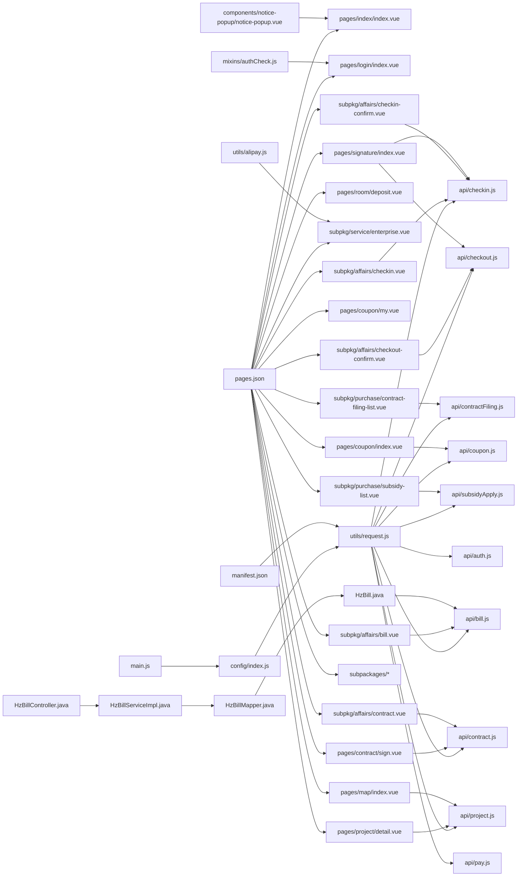

**图表来源**
- [pages.json:1-341](file://uniapp-h5/pages.json#L1-L341)
- [utils/request.js:1-135](file://uniapp-h5/utils/request.js#L1-L135)
- [config/index.js:1-64](file://uniapp-h5/config/index.js#L1-L64)
- [api/auth.js:1-55](file://uniapp-h5/api/auth.js#L1-L55)
- [api/checkin.js:1-111](file://uniapp-h5/api/checkin.js#L1-L111)
- [api/checkout.js:1-79](file://uniapp-h5/api/checkout.js#L1-L79)
- [api/bill.js:1-61](file://uniapp-h5/api/bill.js#L1-L61)
- [api/contract.js:1-86](file://uniapp-h5/api/contract.js#L1-L86)
- [api/contractFiling.js:1-25](file://uniapp-h5/api/contractFiling.js#L1-L25)
- [api/coupon.js:1-26](file://uniapp-h5/api/coupon.js#L1-L26)
- [api/subsidyApply.js:1-25](file://uniapp-h5/api/subsidyApply.js#L1-L25)
- [api/pay.js:1-34](file://uniapp-h5/api/pay.js#L1-L34)
- [api/project.js:1-37](file://uniapp-h5/api/project.js#L1-L37)
- [components/notice-popup/notice-popup.vue:1-166](file://uniapp-h5/components/notice-popup/notice-popup.vue#L1-L166)
- [mixins/authCheck.js:1-49](file://uniapp-h5/mixins/authCheck.js#L1-L49)
- [manifest.json:81-105](file://uniapp-h5/manifest.json#L81-L105)
- [main.js:1-30](file://uniapp-h5/main.js#L1-L30)
- [utils/alipay.js:1-88](file://uniapp-h5/utils/alipay.js#L1-L88)
- [pages/room/deposit.vue:1-750](file://uniapp-h5/pages/room/deposit.vue#L1-L750)
- [subpkg/service/enterprise.vue:1-1371](file://uniapp-h5/subpkg/service/enterprise.vue#L1-L1371)
- [pages/coupon/index.vue:1-442](file://uniapp-h5/pages/coupon/index.vue#L1-L442)
- [pages/coupon/my.vue:1-308](file://uniapp-h5/pages/coupon/my.vue#L1-L308)
- [subpkg/purchase/contract-filing-list.vue:1-112](file://uniapp-h5/subpkg/purchase/contract-filing-list.vue#L1-L112)
- [subpkg/purchase/subsidy-list.vue:1-210](file://uniapp-h5/subpkg/purchase/subsidy-list.vue#L1-L210)
- [subpkg/affairs/checkin-confirm.vue:1-363](file://uniapp-h5/subpkg/affairs/checkin-confirm.vue#L1-L363)
- [subpkg/affairs/checkout-confirm.vue:1-566](file://uniapp-h5/subpkg/affairs/checkout-confirm.vue#L1-L566)
- [pages/signature/index.vue:1-709](file://uniapp-h5/pages/signature/index.vue#L1-L709)
- [pages/project/detail.vue:1-529](file://uniapp-h5/pages/project/detail.vue#L1-L529)
- [pages/map/index.vue:1-712](file://uniapp-h5/pages/map/index.vue#L1-L712)
- [pages/contract/sign.vue:1-1023](file://uniapp-h5/pages/contract/sign.vue#L1-L1023)
- [subpkg/affairs/contract.vue:1-1042](file://uniapp-h5/subpkg/affairs/contract.vue#L1-L1042)
- [HzBill.java:1-390](file://ruoyi-system/src/main/java/com/ruoyi/system/domain/HzBill.java#L1-L390)
- [HzBillMapper.java:1-59](file://ruoyi-system/src/main/java/com/ruoyi/system/mapper/HzBillMapper.java#L1-L59)
- [HzBillServiceImpl.java:1-216](file://ruoyi-system/src/main/java/com/ruoyi/system/service/impl/HzBillServiceImpl.java#L1-L216)
- [HzBillController.java:1-95](file://ruoyi-admin/src/main/java/com/ruoyi/web/controller/h5/HzBillController.java#L1-L95)

**章节来源**
- [pages.json:1-341](file://uniapp-h5/pages.json#L1-L341)
- [utils/request.js:1-135](file://uniapp-h5/utils/request.js#L1-L135)
- [config/index.js:1-64](file://uniapp-h5/config/index.js#L1-L64)
- [api/auth.js:1-55](file://uniapp-h5/api/auth.js#L1-L55)
- [api/checkin.js:1-111](file://uniapp-h5/api/checkin.js#L1-L111)
- [api/checkout.js:1-79](file://uniapp-h5/api/checkout.js#L1-L79)
- [api/bill.js:1-61](file://uniapp-h5/api/bill.js#L1-L61)
- [api/contract.js:1-86](file://uniapp-h5/api/contract.js#L1-L86)
- [api/contractFiling.js:1-25](file://uniapp-h5/api/contractFiling.js#L1-L25)
- [api/coupon.js:1-26](file://uniapp-h5/api/coupon.js#L1-L26)
- [api/subsidyApply.js:1-25](file://uniapp-h5/api/subsidyApply.js#L1-L25)
- [api/pay.js:1-34](file://uniapp-h5/api/pay.js#L1-L34)
- [api/project.js:1-37](file://uniapp-h5/api/project.js#L1-L37)
- [components/notice-popup/notice-popup.vue:1-166](file://uniapp-h5/components/notice-popup/notice-popup.vue#L1-L166)
- [mixins/authCheck.js:1-49](file://uniapp-h5/mixins/authCheck.js#L1-L49)
- [manifest.json:81-105](file://uniapp-h5/manifest.json#L81-L105)
- [main.js:1-30](file://uniapp-h5/main.js#L1-L30)
- [utils/alipay.js:1-88](file://uniapp-h5/utils/alipay.js#L1-L88)
- [pages/room/deposit.vue:1-750](file://uniapp-h5/pages/room/deposit.vue#L1-L750)
- [subpkg/service/enterprise.vue:1-1371](file://uniapp-h5/subpkg/service/enterprise.vue#L1-L1371)
- [pages/coupon/index.vue:1-442](file://uniapp-h5/pages/coupon/index.vue#L1-L442)
- [pages/coupon/my.vue:1-308](file://uniapp-h5/pages/coupon/my.vue#L1-L308)
- [subpkg/purchase/contract-filing-list.vue:1-112](file://uniapp-h5/subpkg/purchase/contract-filing-list.vue#L1-L112)
- [subpkg/purchase/subsidy-list.vue:1-210](file://uniapp-h5/subpkg/purchase/subsidy-list.vue#L1-L210)
- [subpkg/affairs/checkin-confirm.vue:1-363](file://uniapp-h5/subpkg/affairs/checkin-confirm.vue#L1-L363)
- [subpkg/affairs/checkout-confirm.vue:1-566](file://uniapp-h5/subpkg/affairs/checkout-confirm.vue#L1-L566)
- [pages/signature/index.vue:1-709](file://uniapp-h5/pages/signature/index.vue#L1-L709)
- [pages/project/detail.vue:1-529](file://uniapp-h5/pages/project/detail.vue#L1-L529)
- [pages/map/index.vue:1-712](file://uniapp-h5/pages/map/index.vue#L1-L712)
- [pages/contract/sign.vue:1-1023](file://uniapp-h5/pages/contract/sign.vue#L1-L1023)
- [subpkg/affairs/contract.vue:1-1042](file://uniapp-h5/subpkg/affairs/contract.vue#L1-L1042)
- [HzBill.java:1-390](file://ruoyi-system/src/main/java/com/ruoyi/system/domain/HzBill.java#L1-L390)
- [HzBillMapper.java:1-59](file://ruoyi-system/src/main/java/com/ruoyi/system/mapper/HzBillMapper.java#L1-L59)
- [HzBillServiceImpl.java:1-216](file://ruoyi-system/src/main/java/com/ruoyi/system/service/impl/HzBillServiceImpl.java#L1-L216)
- [HzBillController.java:1-95](file://ruoyi-admin/src/main/java/com/ruoyi/web/controller/h5/HzBillController.java#L1-L95)

## 性能考虑
- 分包加载
  - 通过 subPackages 将业务拆分，减少首屏资源体积，提升首屏渲染速度。
  - **新增** 支付相关页面独立分包，避免非支付场景加载支付逻辑。
  - **新增** 业务相关页面独立分包，提升业务模块加载性能。
  - **新增** 账单页面独立分包，提升账单功能加载性能。
  - **新增** 签名页面独立分包，提升签名功能加载性能。
  - **新增** 项目详情页和地图页独立分包，提升导航功能加载性能。
  - **新增** 合同签署页面独立分包，提升合同管理功能加载性能。
- 功能开关
  - 使用 feature-flags 控制入口显隐，避免未开放功能参与渲染与网络请求。
- 图片与资源
  - 统一图片 URL 处理，避免重复拼接与错误；合理使用静态资源与后端静态资源地址。
- 请求优化
  - 统一设置 Content-Type 为 application/json；在请求头注入 Authorization，减少无效请求。
- 事件与内存
  - 页面卸载时移除事件监听，避免重复绑定与内存泄漏。
  - **新增** 倒计时组件在页面卸载时自动清理定时器，防止内存泄漏。
  - **新增** 支付轮询组件在页面卸载时自动清理轮询定时器，防止内存泄漏。
  - **新增** 表单数据在页面卸载时自动清理，防止内存泄漏。
  - **新增** 账单数据在页面卸载时自动清理，防止内存泄漏。
  - **新增** 签名页面在页面卸载时自动清理签名画布和定时器，防止内存泄漏。
  - **新增** 项目详情页在页面卸载时自动清理坐标数据和导航状态，防止内存泄漏。
  - **新增** 地图页面在页面卸载时自动清理地图实例和标记点，防止内存泄漏。
  - **新增** 合同签署页面在页面卸载时自动清理合同数据和定时器，防止内存泄漏。
- **新增** 支付性能优化
  - 支付请求防重复提交，避免重复支付。
  - 支付轮询次数和间隔合理设置，平衡准确性与性能。
  - 企业支付使用状态同步接口，减少轮询次数。
- **新增** 业务性能优化
  - 优惠券列表采用懒加载，提升加载性能。
  - 合同备案与补贴申请采用分页加载，避免大量数据一次性加载。
  - 文件上传采用异步处理，避免阻塞页面渲染。
  - **新增** 账单页面采用分页加载和虚拟滚动，提升大数据量下的性能表现。
  - **新增** 签名页面采用异步加载和防重复提交，提升签名体验。
  - **新增** 项目详情页采用坐标数据缓存，提升导航响应速度。
  - **新增** 地图页面采用标记点池化，提升地图渲染性能。
  - **新增** 合同管理页面采用状态缓存和倒计时优化，提升页面响应速度。
- **新增** 数据层性能优化
  - HzBillMapper 使用分页查询，避免一次性加载大量账单数据。
  - HzBillServiceImpl 缓存常用查询结果，减少数据库访问次数。
  - HzBillController 实现数据压缩和传输优化。
  - **新增** 合同数据采用本地缓存，减少重复请求。
  - **新增** 地图数据采用分批加载，提升大数据量下的性能表现。
- **新增** 错误处理性能优化
  - 统一的错误处理逻辑减少重复代码，提升维护效率。
  - 优先显示真实错误信息减少用户重试次数，提升整体性能。
  - **新增** 导航错误处理采用异步日志记录，避免阻塞主线程。
  - **新增** 合同签署错误处理采用异步验证，提升用户体验。

**章节来源**
- [pages.json:47-341](file://uniapp-h5/pages.json#L47-L341)
- [config/feature-flags.js:1-13](file://uniapp-h5/config/feature-flags.js#L1-L13)
- [pages/index/index.vue:558-581](file://uniapp-h5/pages/index/index.vue#L558-L581)
- [pages/index/index.vue:328-330](file://uniapp-h5/pages/index/index.vue#L328-L330)
- [utils/request.js:25-34](file://uniapp-h5/utils/request.js#L25-L34)
- [subpkg/affairs/checkin.vue:166-169](file://uniapp-h5/subpkg/affairs/checkin.vue#L166-L169)
- [pages/room/deposit.vue:166-169](file://uniapp-h5/pages/room/deposit.vue#L166-L169)
- [pages/room/payResult.vue:39-57](file://uniapp-h5/pages/room/payResult.vue#L39-L57)
- [subpkg/service/enterprise.vue:392-412](file://uniapp-h5/subpkg/service/enterprise.vue#L392-L412)
- [pages/coupon/index.vue:100-110](file://uniapp-h5/pages/coupon/index.vue#L100-L110)
- [subpkg/purchase/contract-filing-list.vue:61-68](file://uniapp-h5/subpkg/purchase/contract-filing-list.vue#L61-L68)
- [subpkg/purchase/subsidy-list.vue:54-61](file://uniapp-h5/subpkg/purchase/subsidy-list.vue#L54-L61)
- [subpkg/affairs/bill.vue:166-169](file://uniapp-h5/subpkg/affairs/bill.vue#L166-L169)
- [pages/signature/index.vue:173-177](file://uniapp-h5/pages/signature/index.vue#L173-L177)
- [pages/project/detail.vue:173-175](file://uniapp-h5/pages/project/detail.vue#L173-L175)
- [pages/map/index.vue:250-259](file://uniapp-h5/pages/map/index.vue#L250-L259)
- [pages/contract/sign.vue:86-87](file://uniapp-h5/pages/contract/sign.vue#L86-L87)
- [pages/contract/sign.vue:240-240](file://uniapp-h5/pages/contract/sign.vue#L240-L240)
- [pages/contract/sign.vue:408-408](file://uniapp-h5/pages/contract/sign.vue#L408-L408)
- [subpkg/affairs/contract.vue:542-555](file://uniapp-h5/subpkg/affairs/contract.vue#L542-L555)

## 故障排查指南
- 登录失败
  - 检查协议勾选与平台差异（H5 与微信小程序登录方式不同）。
  - 查看请求封装中的错误提示与网络状态，确认后端返回的 code/msg。
- 图片不显示或样式异常
  - 检查 getImageUrl 的 URL 拼接逻辑与静态资源路径。
  - 富文本图片需注入行内样式，确保在小程序 rich-text 中正确渲染。
- 页面跳转参数丢失
  - 确认 uni.navigateTo 传参方式与接收页面的参数解析。
- 启动公告不弹出
  - 检查 App.vue onLaunch 是否成功拉取公告，页面是否正确监听事件并在 onUnload 中移除。
- H5 本地联调失败
  - 检查 manifest.json 中 devServer 代理配置与 target 地址是否正确。
- **新增** 倒计时组件故障排查
  - 倒计时不更新：检查 `_countdownTimer` 是否正确启动，确认定时器清理逻辑。
  - 颜色显示异常：验证 `getCountdownLevelClass` 方法的时间阈值判断。
  - 数据加载失败：检查 `getCheckinCountdown` API 调用与错误处理。
  - 内存泄漏：确认页面卸载时定时器是否被正确清理。
- **新增** 支付功能故障排查
  - 支付失败：检查 openid 获取、预支付参数、支付调用方式。
  - 支付轮询失败：检查 queryPayResult 接口调用和轮询逻辑。
  - 支付状态不同步：检查 syncPayResult 接口调用和企业支付流程。
  - 支付回调异常：检查 WeixinJSBridge 环境和支付回调处理。
- **新增** 合同备案功能故障排查
  - 备案列表加载失败：检查 getMyFilingList 接口调用与错误处理。
  - 文件上传失败：检查上传接口、文件类型与大小限制。
  - 提交失败：检查表单验证与必填字段。
- **新增** 优惠券功能故障排查
  - 优惠券列表加载失败：检查 getAvailableCoupons 接口调用。
  - 领取失败：检查 receiveCoupon 接口调用与登录状态。
  - 状态显示异常：检查 receiveStatus 字段与状态映射。
- **新增** 代购补贴申请功能故障排查
  - 申请列表加载失败：检查 getMySubsidyList 接口调用。
  - 承诺书签署失败：检查承诺书模板加载与签名数据。
  - 申请提交失败：检查表单验证、文件上传与承诺书状态。
- **新增** 账单功能故障排查
  - 账单列表加载失败：检查 getBillListByUserId 接口调用与错误处理。
  - 期次显示异常：检查 billSeq 和 billPeriod 字段的兼容性处理。
  - 支付失败：检查账单状态、支付参数与支付流程。
  - 数据格式错误：检查 HzBill 实体类字段映射与数据转换。
- **新增** 签名功能故障排查
  - 签名页面加载失败：检查签名模式参数传递与页面跳转。
  - 签名数据为空：检查签名画布初始化与数据获取。
  - 签名提交失败：检查 handleCheckInConfirm、handleCheckoutConfirm、handleCheckoutApply 三个方法的错误处理。
  - 错误信息显示异常：检查 `(error && (error.msg || error.message)) || ''` 逻辑。
  - 平台适配问题：检查 H5 原生 canvas 与小程序 canvas 的差异处理。
- **新增** 导航功能故障排查
  - 导航失败：检查项目坐标数据的有效性与格式。
  - 坐标缺失：检查项目详情数据中 latitude 和 longitude 字段。
  - 导航参数错误：检查 uni.openLocation 的参数传递。
  - 平台兼容性：检查不同平台的导航API调用方式。
  - 错误日志：查看控制台输出的详细错误信息。
- **新增** 地图功能故障排查
  - 地图不显示：检查高德地图API配置与网络连接。
  - 标记点不显示：检查坐标数据过滤与标记点创建逻辑。
  - 地图渲染缓慢：检查数据加载优化与标记点池化机制。
  - 跨平台兼容：检查H5和小程序端的地图渲染差异。
- **新增** 合同签署功能故障排查
  - 合同签署页面加载失败：检查合同ID或参数传递。
  - 批量模式异常：检查 isBatchMode 标志位设置与租期选择器显示。
  - 续租模式异常：检查 oldContractId 参数传递与日期计算。
  - 电子签署失败：检查 e签宝 API 调用与认证状态。
  - 合同状态不同步：检查后端状态更新与前端数据缓存。
  - 批量模式数据错误：检查后端返回的 isBatchMode 标志位与前端显示逻辑。

**章节来源**
- [pages/login/index.vue:105-114](file://uniapp-h5/pages/login/index.vue#L105-L114)
- [utils/request.js:42-67](file://uniapp-h5/utils/request.js#L42-L67)
- [pages/index/index.vue:558-581](file://uniapp-h5/pages/index/index.vue#L558-L581)
- [components/notice-popup/notice-popup.vue:40-54](file://uniapp-h5/components/notice-popup/notice-popup.vue#L40-L54)
- [App.vue:21-38](file://uniapp-h5/App.vue#L21-L38)
- [manifest.json:85-103](file://uniapp-h5/manifest.json#L85-L103)
- [subpkg/affairs/checkin.vue:166-169](file://uniapp-h5/subpkg/affairs/checkin.vue#L166-L169)
- [subpkg/affairs/checkin.vue:419-442](file://uniapp-h5/subpkg/affairs/checkin.vue#L419-L442)
- [pages/room/deposit.vue:207-317](file://uniapp-h5/pages/room/deposit.vue#L207-L317)
- [pages/room/payResult.vue:40-57](file://uniapp-h5/pages/room/payResult.vue#L40-L57)
- [subpkg/service/enterprise.vue:333-412](file://uniapp-h5/subpkg/service/enterprise.vue#L333-L412)
- [subpkg/purchase/contract-filing-list.vue:61-68](file://uniapp-h5/subpkg/purchase/contract-filing-list.vue#L61-L68)
- [subpkg/purchase/contract-filing-submit.vue:95-116](file://uniapp-h5/subpkg/purchase/contract-filing-submit.vue#L95-L116)
- [pages/coupon/index.vue:131-144](file://uniapp-h5/pages/coupon/index.vue#L131-L144)
- [subpkg/purchase/subsidy-list.vue:54-61](file://uniapp-h5/subpkg/purchase/subsidy-list.vue#L54-L61)
- [subpkg/purchase/subsidy-submit.vue:154-179](file://uniapp-h5/subpkg/purchase/subsidy-submit.vue#L154-L179)
- [api/bill.js:13-15](file://uniapp-h5/api/bill.js#L13-L15)
- [subpkg/affairs/bill.vue:292-313](file://uniapp-h5/subpkg/affairs/bill.vue#L292-L313)
- [pages/signature/index.vue:426-434](file://uniapp-h5/pages/signature/index.vue#L426-L434)
- [pages/signature/index.vue:488-496](file://uniapp-h5/pages/signature/index.vue#L488-L496)
- [pages/signature/index.vue:555-563](file://uniapp-h5/pages/signature/index.vue#L555-L563)
- [pages/project/detail.vue:203-223](file://uniapp-h5/pages/project/detail.vue#L203-L223)
- [pages/map/index.vue:250-259](file://uniapp-h5/pages/map/index.vue#L250-L259)
- [pages/contract/sign.vue:86-87](file://uniapp-h5/pages/contract/sign.vue#L86-L87)
- [pages/contract/sign.vue:240-240](file://uniapp-h5/pages/contract/sign.vue#L240-L240)
- [pages/contract/sign.vue:408-408](file://uniapp-h5/pages/contract/sign.vue#L408-L408)
- [subpkg/affairs/contract.vue:337-350](file://uniapp-h5/subpkg/affairs/contract.vue#L337-L350)

## 结论
本项目基于 uni-app 实现了跨平台 H5 应用，通过 pages.json 的分包与 tabBar 管理、config 的环境配置、utils/request 的统一请求封装、以及组件化与功能开关策略，实现了良好的可维护性与扩展性。在移动端适配上，采用 rpx 布局、原生组件与分包策略，兼顾性能与体验。

**更新** 新增的移动端检查入页面倒计时组件显著提升了用户体验和业务流程管控能力。该组件通过实时倒计时提醒、多级颜色预警、进度条可视化等功能，有效提高了用户办理入住的时效性，同时通过完善的定时器管理和内存清理机制，确保了应用的稳定性和性能表现。

**新增** 企业支付功能的集成进一步完善了应用的商业化能力。通过微信JSAPI支付流程、支付轮询和状态同步机制，为企业客户提供了安全、可靠的在线缴费解决方案。该功能支持多种支付环境，具备完善的错误处理和兜底机制，确保支付流程的稳定性和可靠性。

**新增** 新增的合同备案、优惠券、代购补贴申请等业务功能模块，完善了租户业务闭环和营销体系。这些功能通过统一的 API 设计、完善的表单验证、文件上传管理、状态跟踪等机制，为用户提供完整的业务服务能力。

**新增** 本次更新显著增强了移动端H5应用账单页面的功能。通过期次跟踪显示和兼容旧版本账单格式，账单页面能够准确显示租金账单的期次信息，同时保持对历史数据的兼容性。这一改进提升了用户对账单周期的理解，改善了用户体验。

**新增** 本次更新对签名页面的错误处理进行了重要改进。通过在 handleCheckInConfirm、handleCheckoutConfirm、handleCheckoutApply 三个方法中实现优先显示后端返回真实错误信息的逻辑，有效避免了通用兜底文案覆盖真实失败原因的问题。这一改进提升了用户体验，便于问题诊断和解决，确保了错误处理的一致性和可靠性。

**新增** 本次更新对项目详情页导航功能进行了重大改进，包括坐标数据处理、验证逻辑和错误处理的增强。这些改进显著提升了导航功能的稳定性、用户体验和系统性能，为用户提供了更加可靠和便捷的导航服务。

**新增** 本次更新对地图页面的坐标数据处理也进行了重要优化，包括数据过滤、标记点处理和地图渲染等方面的改进，为项目详情页导航功能提供了坚实的数据基础。

**新增** 本次更新对购买相关UI组件进行了小幅改进，包括优惠券管理、合同备案详情、补贴详情等页面的微调优化。这些改进主要体现在：
- 优惠券页面优化了卡片样式和状态显示，提升了视觉效果和用户体验
- 合同备案详情页面改进了布局和状态标签样式，增强了信息展示效果
- 补贴详情页面优化了展示和状态标识，提高了用户操作效率
- 账单页面增强了期次跟踪功能，提升了账单管理的准确性
- 签名页面改进了错误处理逻辑，提升了问题诊断能力
- 项目详情页增强了导航功能，提升了用户体验
- 地图页面优化了坐标数据处理，提升了性能表现
- 合同管理页面优化了状态跟踪和操作按钮，提升了用户体验

**新增** 本次更新最重要的成果是新增了移动端合同签署页面的批量模式支持。通过新增的isBatchMode标志位和相应的UI控制逻辑，为批次配租场景提供了专门的合同签署流程。批量模式下，租期由批次固定，不可编辑，界面更加简洁，用户体验更加高效。这一功能的实现体现了项目对不同业务场景的深度理解和灵活适配能力。

建议在后续迭代中引入集中式状态管理、完善的埋点与监控体系，以及更细粒度的错误日志与回滚机制，持续提升稳定性与可观测性。

## 附录
- 第三方依赖
  - package.json 中声明 smooth-signature 依赖，可用于签名相关场景。
- 开发与调试
  - H5 本地开发可在 manifest.json 的 devServer 中配置代理，指向后端服务地址，便于联调。
- **新增** 倒计时组件配置参数
  - 默认超时时间为 72 小时（合同付款后）
  - 颜色分级阈值：24小时危险级、50%预警级
  - 时间格式化规则：≥1小时显示小时单位，<1小时显示分钟秒单位
- **新增** 支付功能配置参数
  - 支付轮询次数：8次（押金支付）、5次（企业支付）
  - 轮询间隔：2秒
  - 支付环境检测：自动识别微信小程序、H5微信浏览器、普通浏览器
  - 支付参数要求：openid、billNo、billId 等关键参数校验
- **新增** 业务功能配置参数
  - 合同备案：支持最多5个文件上传，文件类型限制
  - 优惠券：支持满减、折扣两种类型，有效期管理
  - 代购补贴：支持承诺书签署，购房合同附件上传
  - 状态管理：统一的状态枚举与显示映射
- **新增** 文件上传配置参数
  - 上传接口：/common/upload
  - 文件大小限制：默认2MB，可根据需求调整
  - 文件类型限制：支持图片、PDF等常用格式
  - 上传进度：支持上传进度显示与取消操作
- **新增** 账单功能配置参数
  - 期次字段：billSeq（期次序号）、billPeriod（账单周期）
  - 账单类型：1=押金、2=租金、3=水费、4=电费、5=燃气费、6=物业费、7=其他
  - 账单状态：0=待支付、1=已支付、2=部分支付、3=已逾期、4=已关闭
  - 支付方式：微信支付（JSAPI）
- **新增** 数据模型配置参数
  - HzBill.java：账单实体类，包含期次跟踪相关字段
  - HzBillMapper.java：账单数据访问层，支持分页查询
  - HzBillServiceImpl.java：账单业务逻辑层，包含状态管理和逾期计算
  - HzBillController.java：账单接口控制器，提供RESTful API
- **新增** 签名页面配置参数
  - 签名模式：入住确认、退租确认、退租申请、承诺书签名
  - 平台适配：H5原生canvas、小程序canvas
  - 错误处理：优先显示后端真实错误信息
  - 内存管理：页面卸载时清理签名画布和定时器
- **新增** 导航功能配置参数
  - 坐标数据处理：经纬度数值转换与验证
  - 导航参数：name、address、latitude、longitude
  - 错误处理：坐标缺失、导航失败等异常情况
  - 平台适配：H5端uni.openLocation、小程序端原生导航API
- **新增** 地图功能配置参数
  - 数据过滤：坐标有效性检查与范围验证
  - 标记点创建：H5端高德地图API、小程序端原生组件
  - 地图渲染：并行数据加载、动态标记点更新
  - 性能优化：标记点池化、视图自适应
- **新增** 合同签署页面配置参数
  - 批量模式标志位：isBatchMode，控制租期选择器显示
  - 续租模式：支持 oldContractId 参数传递
  - 电子签署：支持 H5 和小程序两种平台
  - 认证状态：支持实名认证与签署状态检查
  - 状态轮询：支持签署状态轮询与手动刷新
- **新增** 合同管理页面配置参数
  - 合同状态映射：后端状态码到前端显示文本的映射
  - 倒计时管理：预订倒计时与押金支付倒计时
  - 操作按钮：根据合同状态动态显示不同的操作按钮
  - 数据缓存：状态缓存与本地乐观更新机制

**章节来源**
- [package.json:1-6](file://uniapp-h5/package.json#L1-L6)
- [manifest.json:85-103](file://uniapp-h5/manifest.json#L85-L103)
- [api/checkin.js:14-21](file://uniapp-h5/api/checkin.js#L14-L21)
- [subpkg/affairs/checkin.vue:464-471](file://uniapp-h5/subpkg/affairs/checkin.vue#L464-L471)
- [api/pay.js:15-25](file://uniapp-h5/api/pay.js#L15-L25)
- [pages/room/deposit.vue:207-317](file://uniapp-h5/pages/room/deposit.vue#L207-L317)
- [subpkg/service/enterprise.vue:333-412](file://uniapp-h5/subpkg/service/enterprise.vue#L333-L412)
- [api/contractFiling.js:1-25](file://uniapp-h5/api/contractFiling.js#L1-L25)
- [api/coupon.js:1-26](file://uniapp-h5/api/coupon.js#L1-L26)
- [api/subsidyApply.js:1-25](file://uniapp-h5/api/subsidyApply.js#L1-L25)
- [subpkg/purchase/contract-filing-submit.vue:74-92](file://uniapp-h5/subpkg/purchase/contract-filing-submit.vue#L74-L92)
- [subpkg/purchase/subsidy-submit.vue:104-122](file://uniapp-h5/subpkg/purchase/subsidy-submit.vue#L104-L122)
- [api/bill.js:13-15](file://uniapp-h5/api/bill.js#L13-L15)
- [subpkg/affairs/bill.vue:292-313](file://uniapp-h5/subpkg/affairs/bill.vue#L292-L313)
- [HzBill.java:68-78](file://ruoyi-system/src/main/java/com/ruoyi/system/domain/HzBill.java#L68-L78)
- [HzBill.java:214-220](file://ruoyi-system/src/main/java/com/ruoyi/system/domain/HzBill.java#L214-L220)
- [HzBillMapper.java:55-57](file://ruoyi-system/src/main/java/com/ruoyi/system/mapper/HzBillMapper.java#L55-L57)
- [HzBillServiceImpl.java:50-65](file://ruoyi-system/src/main/java/com/ruoyi/system/service/impl/HzBillServiceImpl.java#L50-L65)
- [HzBillController.java:32-43](file://ruoyi-admin/src/main/java/com/ruoyi/web/controller/h5/HzBillController.java#L32-L43)
- [pages/signature/index.vue:426-434](file://uniapp-h5/pages/signature/index.vue#L426-L434)
- [pages/signature/index.vue:488-496](file://uniapp-h5/pages/signature/index.vue#L488-L496)
- [pages/signature/index.vue:555-563](file://uniapp-h5/pages/signature/index.vue#L555-L563)
- [pages/project/detail.vue:203-223](file://uniapp-h5/pages/project/detail.vue#L203-L223)
- [pages/map/index.vue:250-259](file://uniapp-h5/pages/map/index.vue#L250-L259)
- [api/project.js:1-37](file://uniapp-h5/api/project.js#L1-L37)
- [pages/contract/sign.vue:86-87](file://uniapp-h5/pages/contract/sign.vue#L86-L87)
- [pages/contract/sign.vue:240-240](file://uniapp-h5/pages/contract/sign.vue#L240-L240)
- [pages/contract/sign.vue:408-408](file://uniapp-h5/pages/contract/sign.vue#L408-L408)
- [subpkg/affairs/contract.vue:216-241](file://uniapp-h5/subpkg/affairs/contract.vue#L216-L241)
- [subpkg/affairs/contract.vue:337-350](file://uniapp-h5/subpkg/affairs/contract.vue#L337-L350)
- [api/contract.js:20-22](file://uniapp-h5/api/contract.js#L20-L22)