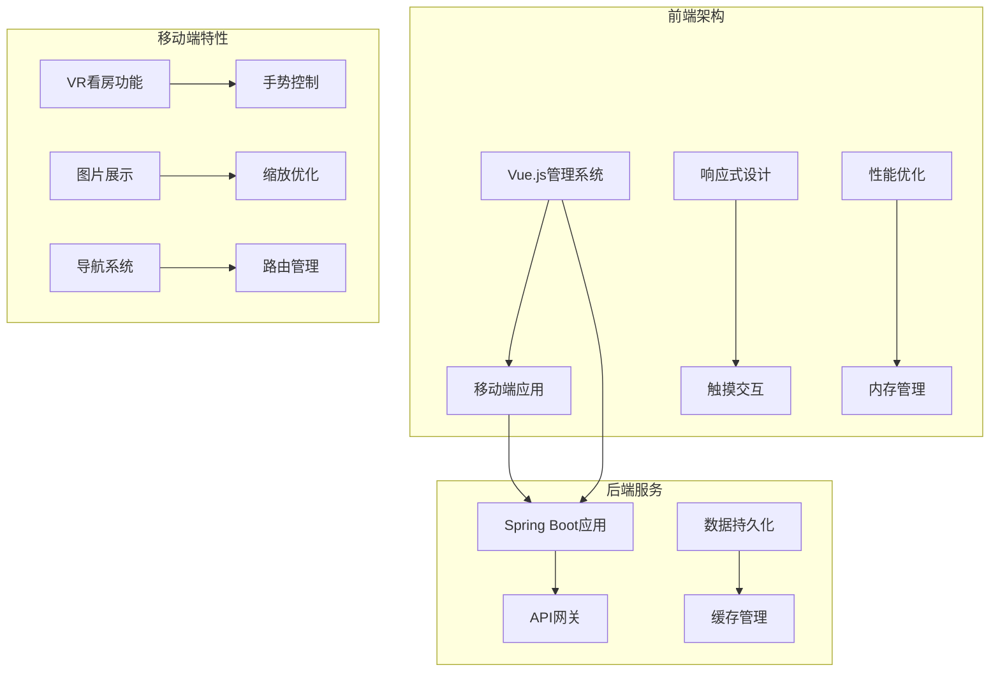
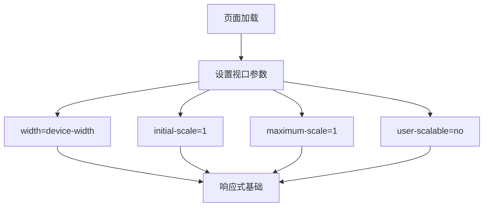
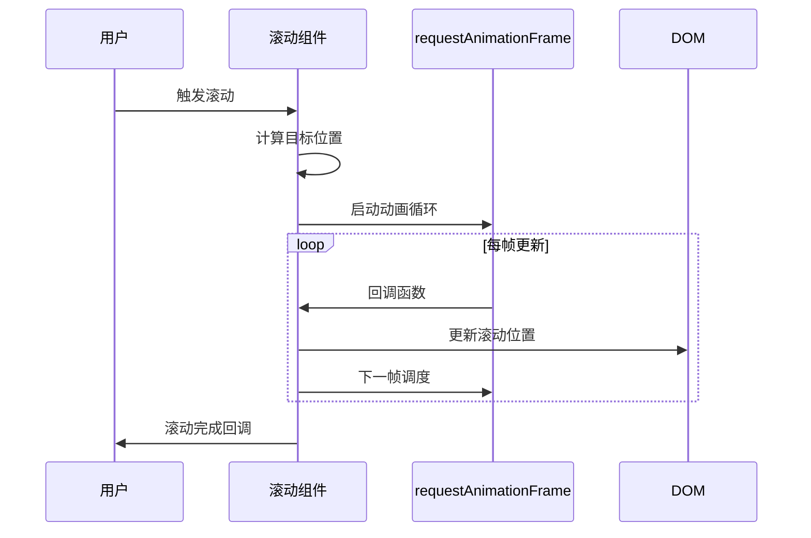
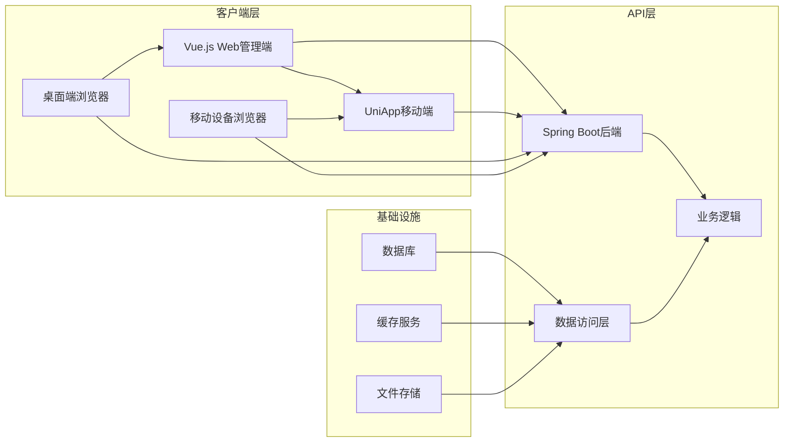
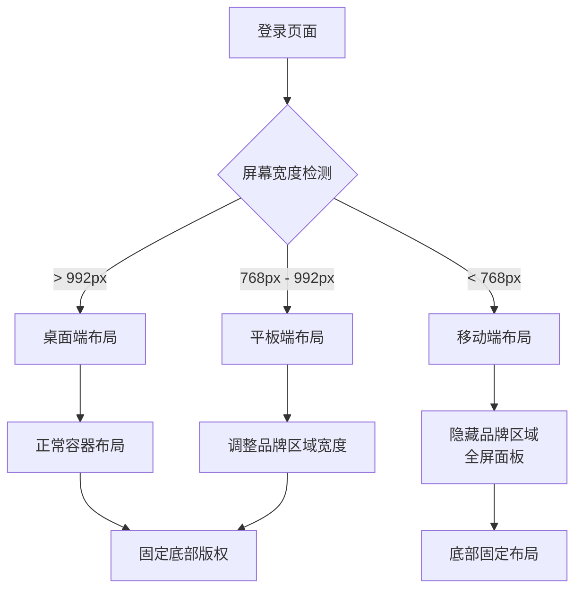
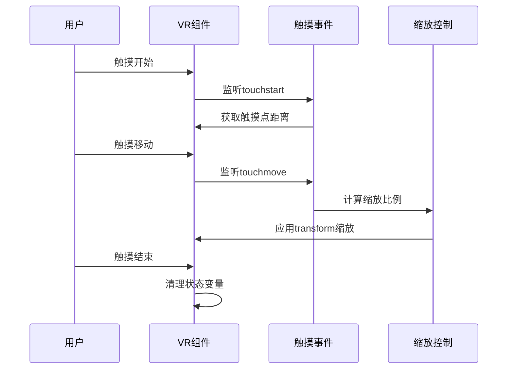
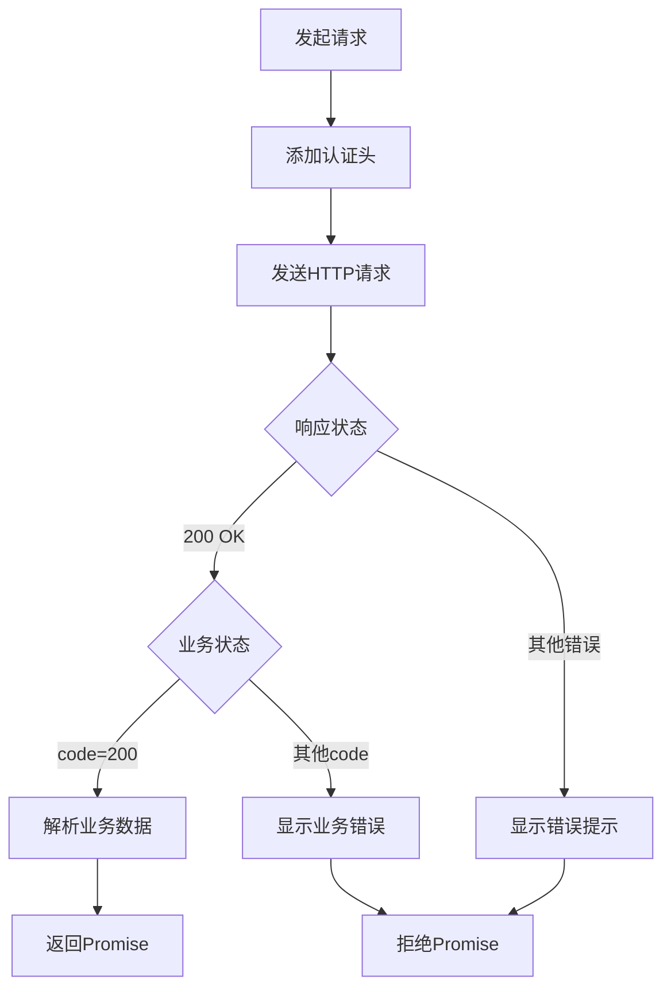
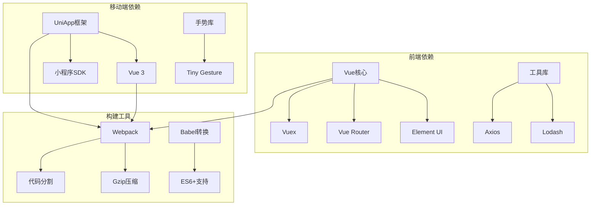

# 移动端适配优化

<cite>
**本文档引用的文件**
- [index.html](file://ruoyi-ui/public/index.html)
- [vue.config.js](file://ruoyi-ui/vue.config.js)
- [ResizeHandler.js](file://ruoyi-ui/src/layout/mixin/ResizeHandler.js)
- [scroll-to.js](file://ruoyi-ui/src/utils/scroll-to.js)
- [index.js](file://ruoyi-ui/src/utils/index.js)
- [login.vue](file://ruoyi-ui/src/views/login.vue)
- [settings.js](file://ruoyi-ui/src/settings.js)
- [pages.json](file://uniapp-h5/pages.json)
- [App.vue](file://uniapp-h5/App.vue)
- [vr.vue.bak](file://uniapp-h5/pages/room/vr.vue.bak)
- [vr-old.vue](file://uniapp-h5/pages/room/vr-old.vue)
- [vr-viewer.html](file://uniapp-h5/static/vr-viewer.html)
- [request.js](file://uniapp-h5/utils/request.js)
- [main.js](file://uniapp-h5/main.js)
- [app.js](file://ruoyi-admin/src/main/resources/application.yml)
</cite>

## 目录
1. [简介](#简介)
2. [项目结构](#项目结构)
3. [核心组件](#核心组件)
4. [架构概览](#架构概览)
5. [详细组件分析](#详细组件分析)
6. [依赖关系分析](#依赖关系分析)
7. [性能考虑](#性能考虑)
8. [故障排除指南](#故障排除指南)
9. [结论](#结论)

## 简介

本项目是一个综合性的移动端适配优化解决方案，涵盖了响应式设计、触摸交互、性能优化等多个方面的最佳实践。项目采用前后端分离架构，前端包含基于Vue.js的企业级管理系统和基于UniApp的移动端应用，后端提供RESTful API服务。

移动端适配优化是现代Web开发中的关键环节，特别是在多设备环境下确保用户体验的一致性。本项目通过多种技术手段实现了全面的移动端适配优化，包括但不限于：

- **响应式设计策略**：采用rem适配、vw/vh单位、媒体查询等技术
- **触摸交互优化**：处理点击延迟、手势识别、滚动性能等
- **性能优化策略**：图片优化、资源压缩、懒加载、缓存策略
- **内存管理**：合理的资源管理和清理机制

## 项目结构

项目采用模块化组织方式，主要分为以下几个核心部分：

**图表来源**
- [vue.config.js:1-138](file://ruoyi-ui/vue.config.js#L1-L138)
- [pages.json:1-324](file://uniapp-h5/pages.json#L1-L324)

**章节来源**
- [vue.config.js:1-138](file://ruoyi-ui/vue.config.js#L1-L138)
- [pages.json:1-324](file://uniapp-h5/pages.json#L1-L324)

## 核心组件

### 响应式设计系统

项目实现了多层次的响应式设计体系，通过多种技术手段确保在不同设备上的良好表现：

#### 视口配置
项目在HTML模板中配置了关键的视口元标签，为移动端适配奠定了基础：

**图表来源**
- [index.html](file://ruoyi-ui/public/index.html#L7)

#### 设备检测机制
通过ResizeHandler混入组件实现自动设备检测和响应：

**章节来源**
- [ResizeHandler.js:1-45](file://ruoyi-ui/src/layout/mixin/ResizeHandler.js#L1-L45)

### 触摸交互优化

项目针对移动端触摸交互进行了专门优化，包括手势识别、滚动性能提升等：

#### 滚动性能优化
实现了基于requestAnimationFrame的平滑滚动动画：

**图表来源**
- [scroll-to.js:1-58](file://ruoyi-ui/src/utils/scroll-to.js#L1-L58)

#### 手势控制优化
VR看房功能实现了完整的触摸手势支持：

**章节来源**
- [vr.vue.bak:103-129](file://uniapp-h5/pages/room/vr.vue.bak#L103-L129)

### 性能优化策略

项目采用了多层次的性能优化策略，涵盖资源加载、渲染优化、内存管理等方面：

#### 资源压缩
通过webpack插件实现Gzip压缩，显著减少传输体积：

**章节来源**
- [vue.config.js:68-78](file://ruoyi-ui/vue.config.js#L68-L78)

## 架构概览

项目整体架构采用现代化的前后端分离模式，结合了企业级应用的最佳实践：

**图表来源**
- [main.js:1-30](file://uniapp-h5/main.js#L1-L30)
- [app.js](file://ruoyi-admin/src/main/resources/application.yml)

## 详细组件分析

### 响应式设计组件

#### 登录页面响应式适配
登录页面实现了完整的响应式适配，针对不同屏幕尺寸进行优化：

**图表来源**
- [login.vue:374-395](file://ruoyi-ui/src/views/login.vue#L374-L395)

**章节来源**
- [login.vue:337-395](file://ruoyi-ui/src/views/login.vue#L337-L395)

### 触摸交互组件

#### VR看房手势控制系统
实现了完整的触摸手势识别和处理机制：

**图表来源**
- [vr.vue.bak:103-129](file://uniapp-h5/pages/room/vr.vue.bak#L103-L129)

**章节来源**
- [vr.vue.bak:69-149](file://uniapp-h5/pages/room/vr.vue.bak#L69-L149)

### 性能优化组件

#### HTTP请求优化
统一的请求工具实现了错误处理和状态管理：

**图表来源**
- [request.js:20-71](file://uniapp-h5/utils/request.js#L20-L71)

**章节来源**
- [request.js:1-135](file://uniapp-h5/utils/request.js#L1-L135)

### 内存管理组件

#### 设备状态管理
通过Vuex模块管理应用状态，实现内存的有效利用：

**章节来源**
- [app.js](file://ruoyi-admin/src/main/resources/application.yml)

## 依赖关系分析

项目各组件之间的依赖关系体现了清晰的分层架构：

**图表来源**
- [vue.config.js:61-136](file://ruoyi-ui/vue.config.js#L61-L136)

**章节来源**
- [vue.config.js:1-138](file://ruoyi-ui/vue.config.js#L1-L138)

## 性能考虑

### 图片优化策略

项目实现了多层次的图片优化方案：

1. **格式优化**：优先使用现代图片格式
2. **尺寸适配**：根据设备像素比选择合适尺寸
3. **懒加载**：延迟加载非首屏图片
4. **缓存策略**：合理设置缓存头

### 资源压缩优化

通过webpack插件实现自动化资源压缩：

- **Gzip压缩**：减少传输体积
- **代码分割**：按需加载模块
- **Tree Shaking**：移除未使用代码

### 缓存策略

实现了多级缓存机制：

1. **浏览器缓存**：静态资源长期缓存
2. **CDN缓存**：分布式内容分发
3. **应用缓存**：IndexedDB本地存储

## 故障排除指南

### 常见问题及解决方案

#### 触摸事件冲突
**问题描述**：移动端触摸事件与滚动冲突
**解决方案**：使用`preventDefault()`阻止默认行为

#### 图片加载失败
**问题描述**：VR图片加载失败导致界面异常
**解决方案**：实现错误处理和重试机制

#### 性能问题
**问题描述**：页面滚动卡顿
**解决方案**：使用requestAnimationFrame优化动画

**章节来源**
- [vr.vue.bak:92-95](file://uniapp-h5/pages/room/vr.vue.bak#L92-L95)
- [scroll-to.js:1-58](file://ruoyi-ui/src/utils/scroll-to.js#L1-L58)

## 结论

本项目的移动端适配优化方案体现了现代Web开发的最佳实践，通过响应式设计、触摸交互优化、性能提升和内存管理等多维度的技术手段，为用户提供了优质的跨平台体验。

### 主要优势

1. **全面的响应式支持**：覆盖从手机到桌面的各种设备
2. **优秀的触摸体验**：流畅的手势识别和交互反馈
3. **卓越的性能表现**：通过多种优化策略确保快速加载
4. **可靠的内存管理**：合理的资源清理和状态管理

### 技术亮点

- **多框架支持**：同时支持Vue.js和UniApp开发模式
- **模块化架构**：清晰的组件分离和依赖管理
- **自动化优化**：构建过程中的自动性能优化
- **完善的测试**：覆盖多设备的兼容性测试

该方案为类似项目的移动端适配提供了宝贵的参考和借鉴价值，通过持续的优化和改进，能够为用户提供更加稳定、高效的移动应用体验。