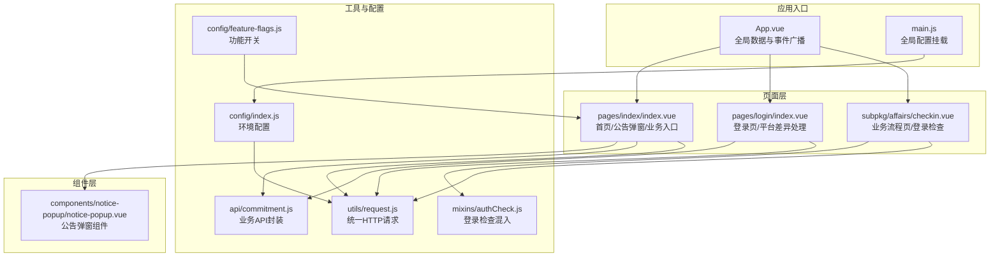
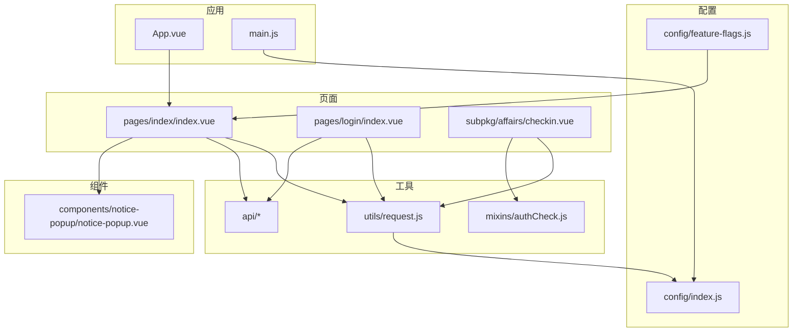
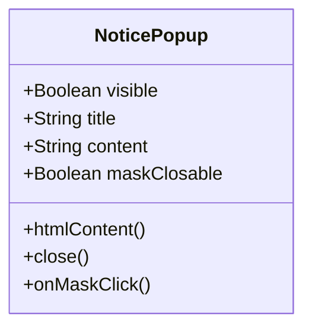
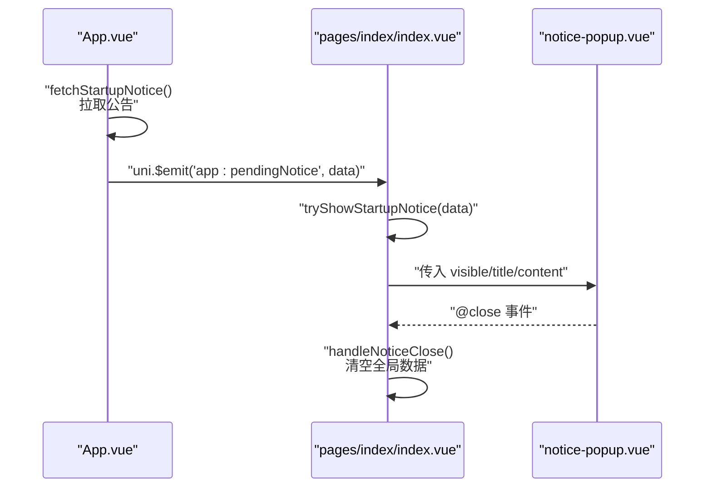
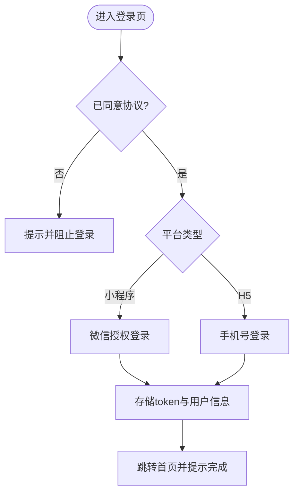
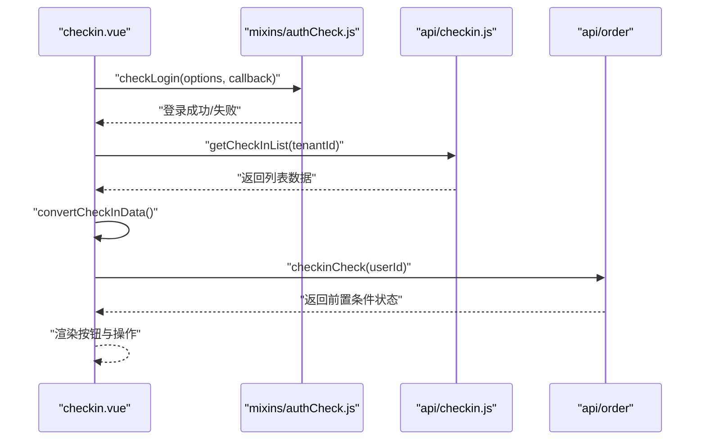
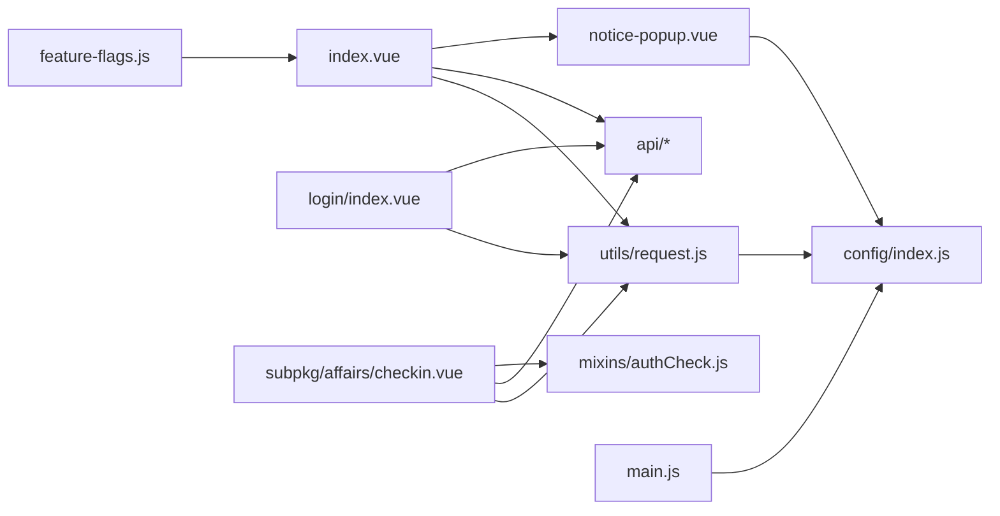

# 组件开发规范

<cite>
**本文档引用的文件**
- [App.vue](file://uniapp-h5/App.vue)
- [main.js](file://uniapp-h5/main.js)
- [pages.json](file://uniapp-h5/pages.json)
- [notice-popup.vue](file://uniapp-h5/components/notice-popup/notice-popup.vue)
- [index.vue](file://uniapp-h5/pages/index/index.vue)
- [login/index.vue](file://uniapp-h5/pages/login/index.vue)
- [checkin.vue](file://uniapp-h5/subpkg/affairs/checkin.vue)
- [request.js](file://uniapp-h5/utils/request.js)
- [commitment.js](file://uniapp-h5/api/commitment.js)
- [feature-flags.js](file://uniapp-h5/config/feature-flags.js)
- [authCheck.js](file://uniapp-h5/mixins/authCheck.js)
- [config/index.js](file://uniapp-h5/config/index.js)
</cite>

## 目录
1. [简介](#简介)
2. [项目结构](#项目结构)
3. [核心组件](#核心组件)
4. [架构总览](#架构总览)
5. [详细组件分析](#详细组件分析)
6. [依赖关系分析](#依赖关系分析)
7. [性能考量](#性能考量)
8. [故障排查指南](#故障排查指南)
9. [结论](#结论)
10. [附录](#附录)

## 简介
本规范面向 uni-app 项目中的组件开发，覆盖组件注册、props 定义、事件处理、插槽使用、组件通信、复用策略与最佳实践。结合仓库中的实际组件与页面，系统阐述公共组件（业务组件、工具组件、平台特有组件）的设计与实现方式，并给出可落地的代码组织与扩展建议。

## 项目结构
uni-app-H5 采用典型的页面-组件-工具分层结构：
- 页面层：pages 与 subpkg 下的页面，负责业务编排与交互
- 组件层：components 下的通用组件，如 notice-popup
- 工具层：utils 下的请求封装、配置、混入等
- API 层：api 下的业务接口封装
- 配置层：config 下的环境配置与功能开关

**图表来源**
- [App.vue:1-41](file://uniapp-h5/App.vue#L1-L41)
- [main.js:1-30](file://uniapp-h5/main.js#L1-L30)
- [pages.json:1-324](file://uniapp-h5/pages.json#L1-L324)
- [notice-popup.vue:1-166](file://uniapp-h5/components/notice-popup/notice-popup.vue#L1-L166)
- [index.vue:1-800](file://uniapp-h5/pages/index/index.vue#L1-L800)
- [login/index.vue:1-443](file://uniapp-h5/pages/login/index.vue#L1-L443)
- [checkin.vue:1-536](file://uniapp-h5/subpkg/affairs/checkin.vue#L1-L536)
- [request.js:1-135](file://uniapp-h5/utils/request.js#L1-L135)
- [commitment.js:1-35](file://uniapp-h5/api/commitment.js#L1-L35)
- [config/index.js:1-64](file://uniapp-h5/config/index.js#L1-L64)
- [feature-flags.js:1-13](file://uniapp-h5/config/feature-flags.js#L1-L13)
- [authCheck.js:1-49](file://uniapp-h5/mixins/authCheck.js#L1-L49)

**章节来源**
- [pages.json:1-324](file://uniapp-h5/pages.json#L1-L324)
- [main.js:1-30](file://uniapp-h5/main.js#L1-L30)
- [config/index.js:1-64](file://uniapp-h5/config/index.js#L1-L64)

## 核心组件
- 公告弹窗组件：提供可配置的可见性、标题、内容与遮罩点击行为，内部对富文本图片样式进行注入与保护，支持 close/update:visible 事件。
- 首页：集成公告弹窗、轮播图、通知栏、功能入口、房源/项目列表等，使用功能开关控制入口显隐。
- 登录页：针对 H5 与小程序平台差异提供不同的登录入口与交互。
- 业务流程页：通过混入统一处理登录检查，按状态渲染不同按钮与流程。

**章节来源**
- [notice-popup.vue:1-166](file://uniapp-h5/components/notice-popup/notice-popup.vue#L1-L166)
- [index.vue:1-800](file://uniapp-h5/pages/index/index.vue#L1-L800)
- [login/index.vue:1-443](file://uniapp-h5/pages/login/index.vue#L1-L443)
- [checkin.vue:1-536](file://uniapp-h5/subpkg/affairs/checkin.vue#L1-L536)

## 架构总览
整体采用“页面-组件-工具-配置”的分层架构，页面通过 API 层调用后端接口，工具层封装统一请求与环境配置，组件层提供可复用 UI 与交互能力。

**图表来源**
- [index.vue:1-800](file://uniapp-h5/pages/index/index.vue#L1-L800)
- [login/index.vue:1-443](file://uniapp-h5/pages/login/index.vue#L1-L443)
- [checkin.vue:1-536](file://uniapp-h5/subpkg/affairs/checkin.vue#L1-L536)
- [notice-popup.vue:1-166](file://uniapp-h5/components/notice-popup/notice-popup.vue#L1-L166)
- [request.js:1-135](file://uniapp-h5/utils/request.js#L1-L135)
- [commitment.js:1-35](file://uniapp-h5/api/commitment.js#L1-L35)
- [authCheck.js:1-49](file://uniapp-h5/mixins/authCheck.js#L1-L49)
- [config/index.js:1-64](file://uniapp-h5/config/index.js#L1-L64)
- [feature-flags.js:1-13](file://uniapp-h5/config/feature-flags.js#L1-L13)
- [App.vue:1-41](file://uniapp-h5/App.vue#L1-L41)
- [main.js:1-30](file://uniapp-h5/main.js#L1-L30)

## 详细组件分析

### 公告弹窗组件（notice-popup）
- 组件职责：承载公告弹窗的头部、内容区与底部按钮，支持富文本渲染与图片样式注入，提供遮罩点击关闭与事件回传。
- props 定义：visible、title、content、maskClosable，其中 content 通过 computed 进行富文本安全处理。
- 事件处理：close 与 update:visible，便于父组件受控显示。
- 插槽使用：当前未使用具名插槽，建议未来扩展时增加默认插槽以提升灵活性。
- 性能与可维护性：computed 中的正则替换仅在 content 变化时触发，避免频繁重排；建议将正则抽取为常量以减少重复创建。

**图表来源**
- [notice-popup.vue:28-67](file://uniapp-h5/components/notice-popup/notice-popup.vue#L28-L67)

**章节来源**
- [notice-popup.vue:1-166](file://uniapp-h5/components/notice-popup/notice-popup.vue#L1-L166)

### 首页（index.vue）与公告弹窗联动
- 组件注册：在页面中局部注册 notice-popup，并通过 props 传递 visible/title/content。
- 事件绑定：监听 close 事件以更新 visible；通过 uni.$on/$off 进行事件订阅与解绑，保证生命周期内正确收尾。
- 全局数据消费：在 onLoad 中尝试从 App.globalData 拉取启动公告，若存在则显示；关闭后清空全局 pendingNotice，避免重复弹出。
- 功能开关：通过 feature-flags 控制分类 Tab 与入口图标显隐，实现业务功能的快速开关。

**图表来源**
- [App.vue:20-39](file://uniapp-h5/App.vue#L20-L39)
- [index.vue:324-358](file://uniapp-h5/pages/index/index.vue#L324-L358)
- [notice-popup.vue:56-66](file://uniapp-h5/components/notice-popup/notice-popup.vue#L56-L66)

**章节来源**
- [index.vue:1-800](file://uniapp-h5/pages/index/index.vue#L1-L800)
- [App.vue:1-41](file://uniapp-h5/App.vue#L1-L41)
- [feature-flags.js:1-13](file://uniapp-h5/config/feature-flags.js#L1-L13)

### 登录页（login/index.vue）与平台差异
- 平台特有：微信小程序通过 open-type="getPhoneNumber" 获取手机号；H5 通过输入框与登录接口获取 token。
- 协议勾选：登录前必须同意用户协议与隐私政策，否则禁止登录。
- 返回逻辑：遵循小程序审核规范，提供返回上一页或跳转 tabBar 的兜底逻辑。

**图表来源**
- [login/index.vue:63-232](file://uniapp-h5/pages/login/index.vue#L63-L232)

**章节来源**
- [login/index.vue:1-443](file://uniapp-h5/pages/login/index.vue#L1-L443)

### 业务流程页（subpkg/affairs/checkin.vue）与登录检查
- 登录检查：通过混入 authCheck.checkLogin 统一处理登录态校验，失败时引导跳转登录。
- 数据加载：按租户 ID 获取入住申请列表，转换后端字段为前端展示格式。
- 状态渲染：根据状态码渲染不同按钮与操作，如“办理入住”“取消申请”“查看详情”等。
- 条件检查：前置检查三要素（押金、资料审核、首期房租），不满足时提示并引导前往缴费或上传。

**图表来源**
- [checkin.vue:107-362](file://uniapp-h5/subpkg/affairs/checkin.vue#L107-L362)
- [authCheck.js:10-48](file://uniapp-h5/mixins/authCheck.js#L10-L48)

**章节来源**
- [checkin.vue:1-536](file://uniapp-h5/subpkg/affairs/checkin.vue#L1-L536)
- [authCheck.js:1-49](file://uniapp-h5/mixins/authCheck.js#L1-L49)

## 依赖关系分析
- 页面依赖：index.vue 依赖 notice-popup.vue、API 封装与请求工具；login/index.vue 依赖 API 封装；checkin.vue 依赖混入与 API。
- 工具依赖：utils/request.js 依赖 config/index.js；API 封装基于 request.js；feature-flags.js 作用于 index.vue。
- 全局配置：main.js 将 config 挂载至 Vue 原型（Vue2）或 globalProperties（Vue3），页面通过 this.$config 或 app.config.globalProperties.$config 访问。

**图表来源**
- [index.vue:214-225](file://uniapp-h5/pages/index/index.vue#L214-L225)
- [notice-popup.vue:1-166](file://uniapp-h5/components/notice-popup/notice-popup.vue#L1-L166)
- [login/index.vue:63-71](file://uniapp-h5/pages/login/index.vue#L63-L71)
- [checkin.vue:107-111](file://uniapp-h5/subpkg/affairs/checkin.vue#L107-L111)
- [request.js:5-9](file://uniapp-h5/utils/request.js#L5-L9)
- [config/index.js:1-64](file://uniapp-h5/config/index.js#L1-L64)
- [feature-flags.js:1-13](file://uniapp-h5/config/feature-flags.js#L1-L13)
- [main.js:9-28](file://uniapp-h5/main.js#L9-L28)

**章节来源**
- [main.js:1-30](file://uniapp-h5/main.js#L1-L30)
- [config/index.js:1-64](file://uniapp-h5/config/index.js#L1-L64)

## 性能考量
- 组件渲染优化
  - notice-popup 的 htmlContent 通过 computed 缓存富文本处理结果，避免重复正则匹配。
  - index.vue 中对图片 URL 的拼接与判断逻辑简单明确，建议在图片较多场景引入懒加载策略。
- 网络请求优化
  - utils/request.js 统一封装请求头（Authorization）、错误提示与响应格式处理，减少重复代码。
  - 建议在高频请求场景引入缓存策略（如 GET 请求按参数缓存）与节流/防抖。
- 生命周期管理
  - index.vue 在 onUnload 中移除事件监听，防止内存泄漏；建议在其他订阅事件的页面同样遵循。
- 功能开关
  - feature-flags.js 通过布尔值控制入口显隐，避免在未开放阶段引入额外渲染成本。

[本节为通用指导，无需具体文件分析]

## 故障排查指南
- 登录相关
  - 登录页未同意协议：检查 toggleAgree 与 checkAgreement 的调用链路，确保提示与拦截逻辑生效。
  - 小程序授权失败：确认 getPhoneNumber 回调的 errMsg 与用户授权状态。
- 公告弹窗
  - 无法关闭：检查 maskClosable 与 close 事件是否正确触发 update:visible。
  - 富文本图片溢出：确认 htmlContent 的正则注入是否生效，必要时在外部样式补充 max-width。
- 请求与鉴权
  - 401/403：检查 utils/request.js 中 token 的读取与 Authorization 头是否正确拼接。
  - 响应格式异常：确认后端返回 code 字段与 toast 提示逻辑。
- 页面跳转
  - 登录后未回到首页：检查 reLaunch 与 redirectTo 的使用是否符合页面栈要求。

**章节来源**
- [login/index.vue:94-114](file://uniapp-h5/pages/login/index.vue#L94-L114)
- [notice-popup.vue:56-66](file://uniapp-h5/components/notice-popup/notice-popup.vue#L56-L66)
- [request.js:20-71](file://uniapp-h5/utils/request.js#L20-L71)
- [index.vue:324-358](file://uniapp-h5/pages/index/index.vue#L324-L358)

## 结论
本规范基于仓库现有组件与页面，总结了 uni-app 组件开发的关键实践：组件注册与 props 设计、事件与插槽使用、页面与组件通信、工具与配置的分层组织、以及登录与平台差异处理。建议在后续迭代中进一步标准化组件插槽、增强错误处理与日志上报、引入缓存与懒加载策略，持续提升可维护性与性能。

[本节为总结性内容，无需具体文件分析]

## 附录

### 组件开发规范要点
- 组件注册
  - 页面内局部注册：适合一次性使用的组件，如 notice-popup。
  - 全局注册：适用于高频复用的通用组件，需统一命名与目录结构。
- Props 定义
  - 明确类型与默认值；对复杂对象建议提供默认空对象，避免空引用。
  - 对富文本内容进行安全处理与样式注入，避免 XSS 与布局问题。
- 事件处理
  - 提供语义化事件名（如 close、update:visible），便于父组件受控。
  - 对外暴露受控属性与事件，避免内部状态与外部状态不一致。
- 插槽使用
  - 优先使用默认插槽承载内容，具名插槽用于复杂布局定制。
  - 插槽内容尽量保持最小耦合，避免强依赖父组件数据结构。
- 组件通信
  - 父子通信：通过 props 与事件；兄弟通信：通过父组件中转；跨层级：通过全局事件或集中式状态管理。
- 复用策略
  - 封装：将通用 UI 与交互抽离为独立组件。
  - 配置化：通过 props 与主题变量控制外观与行为。
  - 可扩展性：预留插槽与事件钩子，支持业务定制。
- 最佳实践
  - 统一请求封装与错误处理；合理使用功能开关；严格区分平台差异；关注生命周期与内存管理。

[本节为通用指导，无需具体文件分析]