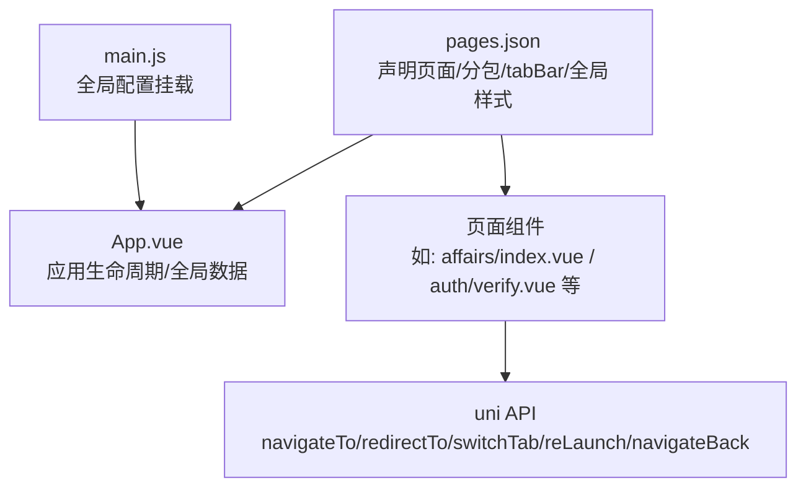
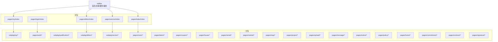
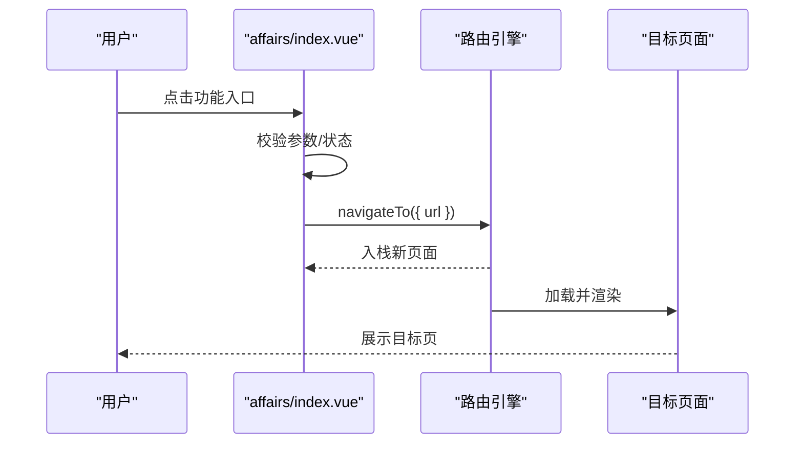
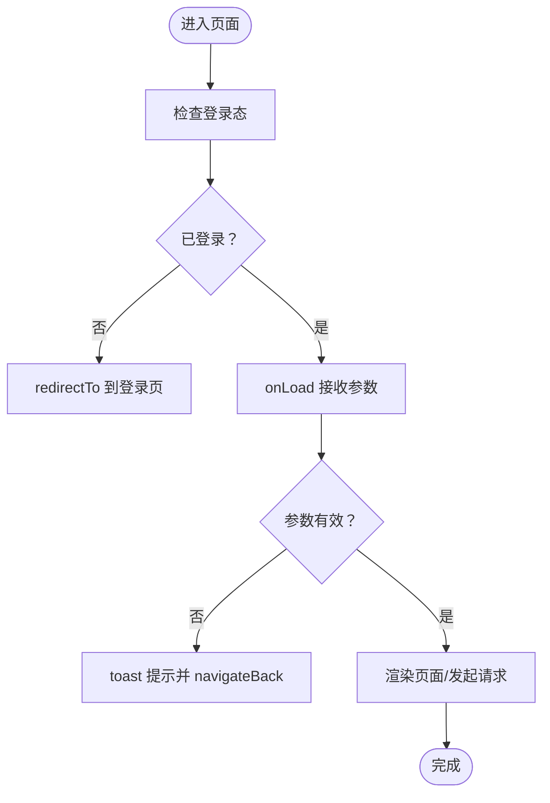
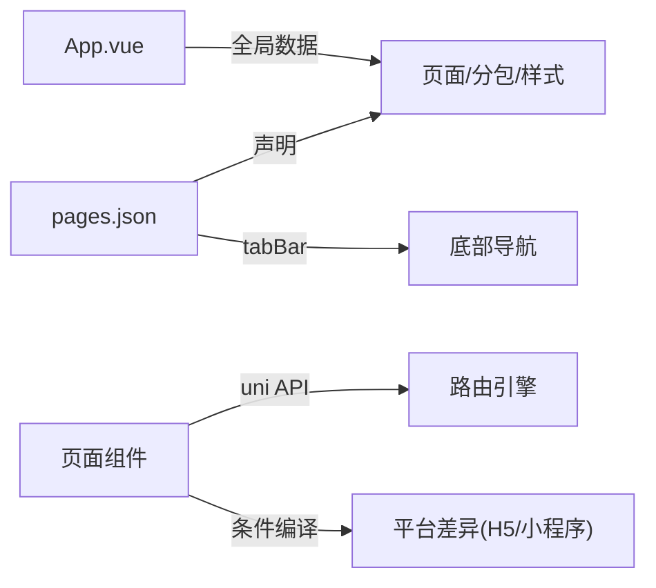

# 页面路由系统

<cite>
**本文引用的文件**
- [pages.json](file://uniapp-h5/pages.json)
- [main.js](file://uniapp-h5/main.js)
- [App.vue](file://uniapp-h5/App.vue)
- [affairs/index.vue](file://uniapp-h5/pages/affairs/index.vue)
- [auth/verify.vue](file://uniapp-h5/pages/auth/verify.vue)
- [auth/esign-webview.vue](file://uniapp-h5/pages/auth/esign-webview.vue)
- [commitment/sign.vue](file://uniapp-h5/pages/commitment/sign.vue)
- [contract/sign.vue](file://uniapp-h5/pages/contract/sign.vue)
- [signature/index.vue](file://uniapp-h5/pages/signature/index.vue)
- [room/select.vue](file://uniapp-h5/pages/room/select.vue)
</cite>

## 目录
1. [简介](#简介)
2. [项目结构](#项目结构)
3. [核心组件](#核心组件)
4. [架构总览](#架构总览)
5. [详细组件分析](#详细组件分析)
6. [依赖分析](#依赖分析)
7. [性能考虑](#性能考虑)
8. [故障排查指南](#故障排查指南)
9. [结论](#结论)
10. [附录](#附录)

## 简介
本文件系统性梳理 uni-app H5 版本的页面路由体系，围绕 pages.json 的配置项（页面路径、窗口表现、tabBar、分包策略）展开，并结合实际业务页面演示 navigateTo、redirectTo、switchTab、reLaunch、navigateBack 等 API 的使用场景与最佳实践。同时覆盖参数传递（query 参数）、路由拦截（登录态校验）、参数校验与分包加载策略（主包、分包、按需加载、缓存管理）及性能优化建议。

## 项目结构
uni-app 项目的页面路由由 pages.json 统一声明，配合各页面生命周期钩子与 uni API 实现导航控制。关键文件与职责如下：
- pages.json：统一声明页面、分包、全局样式与 tabBar。
- main.js：应用入口，挂载全局配置。
- App.vue：应用生命周期与全局数据，为页面提供启动期数据。
- 各页面组件：承载业务逻辑，使用 uni API 进行页面跳转与参数传递。

图表来源
- [pages.json](file://uniapp-h5/pages.json)
- [main.js](file://uniapp-h5/main.js)
- [App.vue](file://uniapp-h5/App.vue)

章节来源
- [pages.json](file://uniapp-h5/pages.json)
- [main.js](file://uniapp-h5/main.js)
- [App.vue](file://uniapp-h5/App.vue)

## 核心组件
- pages.json
  - pages：声明主包内的页面路径与窗口样式。
  - subPackages：声明分包，包含 root、name、pages 列表；用于拆分包体、按需加载。
  - globalStyle：全局导航栏与背景色等样式。
  - tabBar：底部导航配置，含 color、selectedColor、backgroundColor、borderStyle、list（每项含 pagePath、text、iconPath、selectedIconPath）。
  - uniIdRouter：预留路由扩展字段。
- main.js
  - 在 Vue 2/Vue 3 下分别挂载全局配置 $config，供组件通过 this.$config 访问。
- App.vue
  - 提供全局数据 pendingNotice 与应用生命周期方法，确保页面可获取启动期数据。

章节来源
- [pages.json](file://uniapp-h5/pages.json)
- [main.js](file://uniapp-h5/main.js)
- [App.vue](file://uniapp-h5/App.vue)

## 架构总览
下图展示从页面到分包、再到 tabBar 的路由关系与导航链路：

图表来源
- [pages.json](file://uniapp-h5/pages.json)

## 详细组件分析

### pages.json 配置详解
- 页面路径与窗口表现
  - 通过 pages[].path 指定页面路径，style 中可设置导航栏标题、自定义导航样式等。
  - 示例：登录页设置 navigationStyle 为 custom，首页设置导航栏标题。
- tabBar 配置
  - list 中的 pagePath 必须与 pages 或 subPackages 中某页面路径一致，否则无法切换。
  - 图标路径与选中态图标路径需正确指向静态资源。
- 分包策略
  - subPackages.root 定义分包根目录，name 为分包标识，pages 列表声明该分包内页面。
  - 分包页面可通过绝对路径访问，如 /subpkg/affairs/contract。
- 全局样式
  - globalStyle 控制导航栏文字颜色、标题、背景色与页面背景色。

章节来源
- [pages.json](file://uniapp-h5/pages.json)

### 页面跳转机制与使用场景
- navigateTo(url[, success/fail/complete])
  - 场景：在当前页栈上新增一条记录，常用于“进入详情/下一步”流程。
  - 示例：办事页根据功能键跳转到不同子功能页；承诺书签署成功后跳转到签名页。
- redirectTo(url[, success/fail/complete])
  - 场景：关闭当前页，打开目标页，常用于“认证完成后的页面跳转”或“回到列表页”。
  - 示例：合同签署完成后，redirectTo 到合同详情页；承诺书签署成功后，redirectTo 到选房页。
- switchTab(url[, success/fail/complete])
  - 场景：跳转至 tabBar 页面，要求 url 对应 tabBar.list 中的 pagePath。
  - 示例：认证成功后，若需要回到首页，可用 switchTab。
- reLaunch(url[, success/fail/complete])
  - 场景：关闭所有页面，打开到应用内的某个页面，常用于“登录后重启应用”或“初始化页面栈”。
  - 示例：认证页在无用户信息时，redirectTo 到登录页；若无历史页则 reLaunch 回首页。
- navigateBack([delta])
  - 场景：关闭当前页返回上一页或多页，常用于“取消/返回”。
  - 示例：多个审批/确认页完成后，navigateBack 返回上一层。

图表来源
- [affairs/index.vue](file://uniapp-h5/pages/affairs/index.vue)

章节来源
- [affairs/index.vue](file://uniapp-h5/pages/affairs/index.vue)
- [commitment/sign.vue](file://uniapp-h5/pages/commitment/sign.vue)
- [contract/sign.vue](file://uniapp-h5/pages/contract/sign.vue)
- [auth/verify.vue](file://uniapp-h5/pages/auth/verify.vue)

### 页面参数传递与路由拦截
- query 参数
  - 通过 navigateTo/redirectTo/switchTab/reLaunch 的 url 传参，如 /subpkg/affairs/contract?type=talent。
  - 目标页 onLoad(options) 接收参数，进行业务处理。
  - 示例：办事页根据 type 参数决定跳转到不同子功能页。
- 路由拦截与参数校验
  - 登录态校验：认证页 onLoad 中读取本地存储，若无用户信息则 redirectTo 到登录页。
  - 参数校验：承诺书页 onLoad 校验 projectId，缺失则 toast 并 navigateBack。
  - 示例：认证页在 onLoad 中检查用户信息，必要时 redirectTo 到登录页；承诺书页在 onLoad 中校验参数并提示或回退。
- 页面间通信
  - navigateTo 支持 events，目标页可监听并回传数据，实现“带回调”的页面交互。
  - 示例：承诺书页在 handleSign 中通过 events 监听签名页返回的数据，再自动提交。

图表来源
- [auth/verify.vue](file://uniapp-h5/pages/auth/verify.vue)
- [commitment/sign.vue](file://uniapp-h5/pages/commitment/sign.vue)

章节来源
- [auth/verify.vue](file://uniapp-h5/pages/auth/verify.vue)
- [commitment/sign.vue](file://uniapp-h5/pages/commitment/sign.vue)

### 分包加载策略与缓存管理
- 主包与分包
  - 主包包含基础页面（如首页、登录、办事、服务、我的），体积较小，首屏加载快。
  - 分包包含业务功能页面（如 subpkg/affairs、pages/room、pages/auth 等），按需加载，降低主包体积。
- 按需加载
  - 通过 subPackages 声明分包，首次进入分包页面时才下载对应分包资源。
  - 示例：进入“办事/合同”等功能时，才加载对应分包。
- 缓存管理
  - 使用 uni.setStorageSync/uni.getStorageSync 存储用户信息、认证状态等，避免重复请求。
  - 注意：在认证完成后及时清理临时存储，减少缓存污染。
- 页面栈与内存
  - navigateTo 会增加页面栈深度，过多页面可能导致内存压力；必要时使用 redirectTo 或 navigateBack 控制栈深度。
  - 示例：合同页在 goToBill 后清理临时存储并 redirectTo，避免页面栈过深。

章节来源
- [pages.json](file://uniapp-h5/pages.json)
- [auth/verify.vue](file://uniapp-h5/pages/auth/verify.vue)
- [contract/sign.vue](file://uniapp-h5/pages/contract/sign.vue)

### 关键页面与路由行为
- 办事页（pages/affairs/index.vue）
  - 根据功能键与类型参数，使用 navigateTo 跳转到不同子功能页（如资格申诉、入住/退租、合同、发票等）。
- 认证页（pages/auth/verify.vue）
  - onLoad 中检查用户信息，无则 redirectTo 到登录页；认证成功后根据页面栈长度决定 navigateBack 或 reLaunch。
  - 通过条件编译支持微信小程序与 H5 的不同跳转方式。
- 合同签署页（pages/contract/sign.vue）
  - 使用 navigateTo 跳转到认证/签名 WebView；完成后 redirectTo 到合同详情页。
  - 提供轮询与手动刷新机制，确保状态同步。
- 承诺书签署页（pages/commitment/sign.vue）
  - onLoad 校验参数，缺失则 navigateBack；签署成功后 redirectTo 到选房页。
- 签名页（pages/signature/index.vue）
  - 支持回调事件，返回签名数据给上一页，实现“带回调”的页面交互。
- 选房页（pages/room/select.vue）
  - 通过 onLoad 接收 projectId 等参数，进行后续业务处理。

章节来源
- [affairs/index.vue](file://uniapp-h5/pages/affairs/index.vue)
- [auth/verify.vue](file://uniapp-h5/pages/auth/verify.vue)
- [auth/esign-webview.vue](file://uniapp-h5/pages/auth/esign-webview.vue)
- [contract/sign.vue](file://uniapp-h5/pages/contract/sign.vue)
- [commitment/sign.vue](file://uniapp-h5/pages/commitment/sign.vue)
- [signature/index.vue](file://uniapp-h5/pages/signature/index.vue)
- [room/select.vue](file://uniapp-h5/pages/room/select.vue)

## 依赖分析
- pages.json 与页面组件的耦合
  - tabBar 的 pagePath 必须与 pages 或 subPackages 中的页面路径一致，否则无法切换。
  - 分包页面的绝对路径必须与 subPackages.root + path 匹配。
- 生命周期与路由的关系
  - App.vue 的 onLaunch 为全局数据注入时机，页面可在 onLoad 之后获取。
  - 页面栈变化影响 navigateBack 的行为，需谨慎控制页面栈深度。
- 条件编译与平台差异
  - 认证页对微信小程序与 H5 采用不同的跳转策略，需在构建时启用相应编译指令。

图表来源
- [pages.json](file://uniapp-h5/pages.json)
- [App.vue](file://uniapp-h5/App.vue)
- [auth/verify.vue](file://uniapp-h5/pages/auth/verify.vue)

章节来源
- [pages.json](file://uniapp-h5/pages.json)
- [App.vue](file://uniapp-h5/App.vue)
- [auth/verify.vue](file://uniapp-h5/pages/auth/verify.vue)

## 性能考虑
- 减少主包体积
  - 将非首屏功能放入分包，利用按需加载降低首屏时间。
- 控制页面栈深度
  - 避免连续 navigateTo 导致页面栈过深；在合适场景使用 redirectTo 或 navigateBack。
- 缓存与网络
  - 合理使用本地缓存，减少重复请求；对关键数据设置过期策略。
- 图标与静态资源
  - tabBar 图标与页面静态资源尽量复用，避免重复下载。

## 故障排查指南
- tabBar 无法切换
  - 检查 tabBar.list 中的 pagePath 是否存在于 pages 或 subPackages 中。
- 分包页面 404
  - 确认 subPackages.root 与页面路径拼接正确，且 pages.json 中已声明该分包。
- 登录态异常
  - 在认证页 onLoad 中检查本地存储；若无用户信息，redirectTo 到登录页。
- 页面参数缺失
  - 在目标页 onLoad 中校验参数，缺失时 toast 并 navigateBack。
- 认证/签名后未返回
  - 确认 WebView 返回后触发了状态查询与页面栈处理；必要时使用 navigateBack 或 reLaunch。

章节来源
- [pages.json](file://uniapp-h5/pages.json)
- [auth/verify.vue](file://uniapp-h5/pages/auth/verify.vue)
- [contract/sign.vue](file://uniapp-h5/pages/contract/sign.vue)

## 结论
本路由体系以 pages.json 为核心，结合分包策略实现主包轻量化与功能模块化；通过统一的 uni API 实现页面跳转与参数传递，并在关键页面加入登录态校验与参数校验，保障用户体验与安全性。建议在实际开发中遵循“按需加载、控制栈深、合理缓存”的原则，持续优化首屏性能与交互体验。

## 附录
- 常用 API 速查
  - navigateTo：新增页面记录
  - redirectTo：关闭当前页打开目标页
  - switchTab：跳转至 tabBar 页面
  - reLaunch：关闭所有页面打开目标页
  - navigateBack：返回上一页或多页
- 最佳实践清单
  - 将高频入口置于主包，非首屏功能放入分包
  - 在页面 onLoad 中进行参数与登录态校验
  - 使用 events 实现带回调的页面交互
  - 合理使用缓存，避免重复请求
  - 控制页面栈深度，避免内存压力