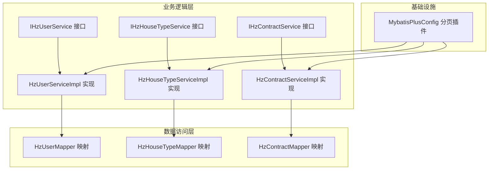
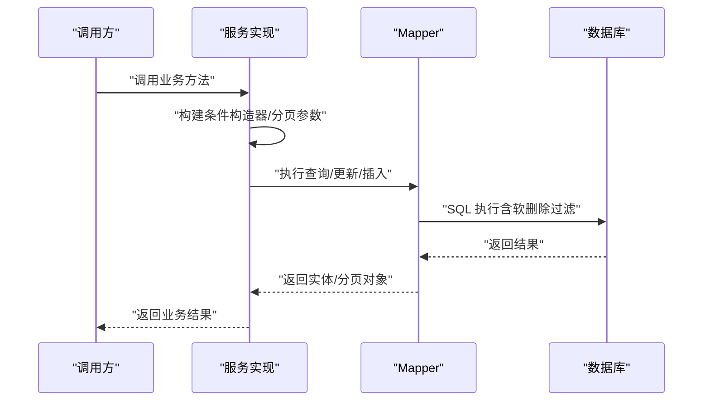
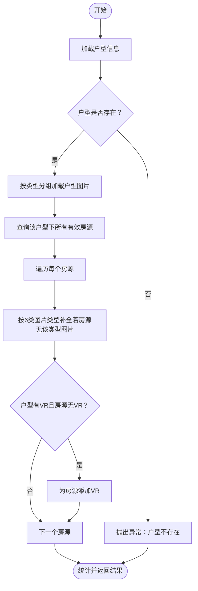
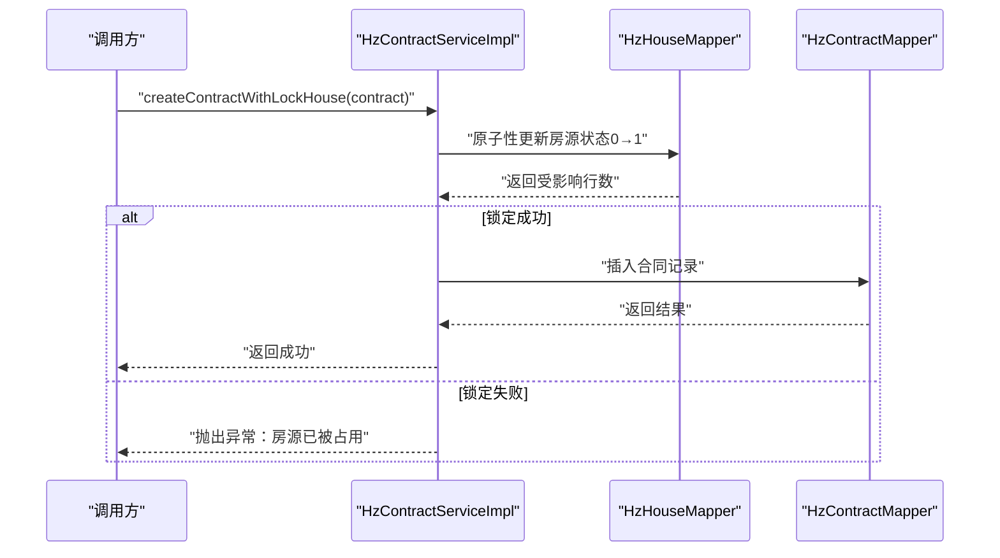
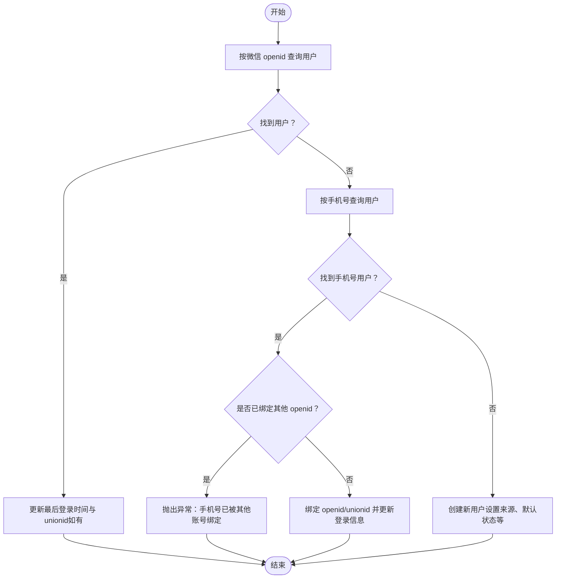
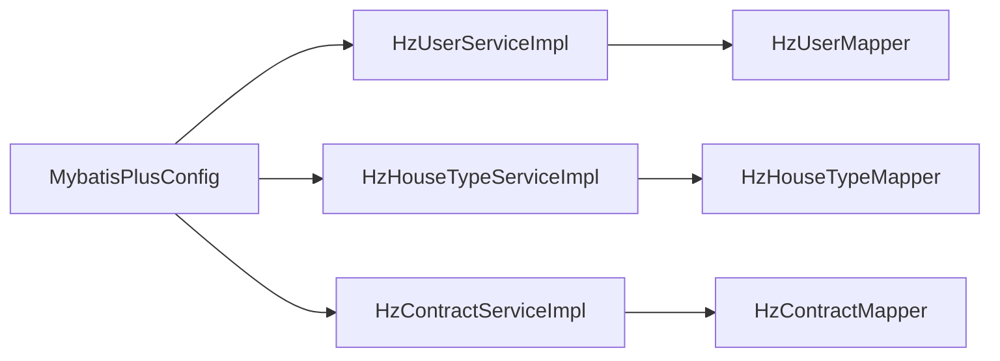

# 业务逻辑层设计

<cite>
**本文引用的文件**
- [HzUserServiceImpl.java](file://ruoyi-system/src/main/java/com/ruoyi/system/service/impl/HzUserServiceImpl.java)
- [IHzUserService.java](file://ruoyi-system/src/main/java/com/ruoyi/system/service/IHzUserService.java)
- [HzUserMapper.java](file://ruoyi-system/src/main/java/com/ruoyi/system/mapper/HzUserMapper.java)
- [HzHouseTypeServiceImpl.java](file://ruoyi-system/src/main/java/com/ruoyi/system/service/impl/HzHouseTypeServiceImpl.java)
- [IHzHouseTypeService.java](file://ruoyi-system/src/main/java/com/ruoyi/system/service/IHzHouseTypeService.java)
- [HzHouseTypeMapper.java](file://ruoyi-system/src/main/java/com/ruoyi/system/mapper/HzHouseTypeMapper.java)
- [HzContractServiceImpl.java](file://ruoyi-system/src/main/java/com/ruoyi/system/service/impl/HzContractServiceImpl.java)
- [IHzContractService.java](file://ruoyi-system/src/main/java/com/ruoyi/system/service/IHzContractService.java)
- [HzContractMapper.java](file://ruoyi-system/src/main/java/com/ruoyi/system/mapper/HzContractMapper.java)
- [MybatisPlusConfig.java](file://ruoyi-framework/src/main/java/com/ruoyi/framework/config/MybatisPlusConfig.java)
</cite>

## 目录
1. [简介](#简介)
2. [项目结构](#项目结构)
3. [核心组件](#核心组件)
4. [架构总览](#架构总览)
5. [详细组件分析](#详细组件分析)
6. [依赖分析](#依赖分析)
7. [性能考量](#性能考量)
8. [故障排查指南](#故障排查指南)
9. [结论](#结论)
10. [附录](#附录)

## 简介
本文件面向港好住信息系统业务逻辑层，聚焦服务层设计与业务流程编排，重点解析以下核心服务接口及其实现策略：
- HzHouseTypeService：负责户型数据的查询、维护与“向该户型下所有房源下发图片与VR”的批量补全能力
- HzContractService：负责合同生命周期管理，包括合同查询、分页、新增、原子性锁定房源并创建合同、合同失效与释放房源等
- HzUserService：负责用户信息的查询、分页、状态变更、登录/注册（含微信与郑好办渠道）、物理删除等

同时，文档深入分析MyBatis-Plus在服务层的应用，包括条件构造器、分页插件、批量操作、软删除过滤等特性，并结合事务管理、异常处理与服务间协调机制，给出业务规则验证、数据一致性保证与性能优化策略的设计考虑。

## 项目结构
业务逻辑层位于 ruoyi-system 模块，采用“接口 + 实现 + Mapper”的分层组织方式：
- 接口层：IHzUserService、IHzHouseTypeService、IHzContractService
- 实现层：HzUserServiceImpl、HzHouseTypeServiceImpl、HzContractServiceImpl
- 映射层：HzUserMapper、HzHouseTypeMapper、HzContractMapper
- MyBatis-Plus 配置：MybatisPlusConfig（全局分页插件）

**图表来源**
- [IHzUserService.java:14-108](file://ruoyi-system/src/main/java/com/ruoyi/system/service/IHzUserService.java#L14-L108)
- [IHzHouseTypeService.java:16-85](file://ruoyi-system/src/main/java/com/ruoyi/system/service/IHzHouseTypeService.java#L16-L85)
- [IHzContractService.java:13-119](file://ruoyi-system/src/main/java/com/ruoyi/system/service/IHzContractService.java#L13-L119)
- [HzUserServiceImpl.java:25-347](file://ruoyi-system/src/main/java/com/ruoyi/system/service/impl/HzUserServiceImpl.java#L25-L347)
- [HzHouseTypeServiceImpl.java:38-283](file://ruoyi-system/src/main/java/com/ruoyi/system/service/impl/HzHouseTypeServiceImpl.java#L38-L283)
- [HzContractServiceImpl.java:36-333](file://ruoyi-system/src/main/java/com/ruoyi/system/service/impl/HzContractServiceImpl.java#L36-L333)
- [HzUserMapper.java:18-41](file://ruoyi-system/src/main/java/com/ruoyi/system/mapper/HzUserMapper.java#L18-L41)
- [HzHouseTypeMapper.java:19-37](file://ruoyi-system/src/main/java/com/ruoyi/system/mapper/HzHouseTypeMapper.java#L19-L37)
- [HzContractMapper.java:18-35](file://ruoyi-system/src/main/java/com/ruoyi/system/mapper/HzContractMapper.java#L18-L35)
- [MybatisPlusConfig.java:15-27](file://ruoyi-framework/src/main/java/com/ruoyi/framework/config/MybatisPlusConfig.java#L15-L27)

**章节来源**
- [IHzUserService.java:14-108](file://ruoyi-system/src/main/java/com/ruoyi/system/service/IHzUserService.java#L14-L108)
- [IHzHouseTypeService.java:16-85](file://ruoyi-system/src/main/java/com/ruoyi/system/service/IHzHouseTypeService.java#L16-L85)
- [IHzContractService.java:13-119](file://ruoyi-system/src/main/java/com/ruoyi/system/service/IHzContractService.java#L13-L119)
- [HzUserServiceImpl.java:25-347](file://ruoyi-system/src/main/java/com/ruoyi/system/service/impl/HzUserServiceImpl.java#L25-L347)
- [HzHouseTypeServiceImpl.java:38-283](file://ruoyi-system/src/main/java/com/ruoyi/system/service/impl/HzHouseTypeServiceImpl.java#L38-L283)
- [HzContractServiceImpl.java:36-333](file://ruoyi-system/src/main/java/com/ruoyi/system/service/impl/HzContractServiceImpl.java#L36-L333)
- [HzUserMapper.java:18-41](file://ruoyi-system/src/main/java/com/ruoyi/system/mapper/HzUserMapper.java#L18-L41)
- [HzHouseTypeMapper.java:19-37](file://ruoyi-system/src/main/java/com/ruoyi/system/mapper/HzHouseTypeMapper.java#L19-L37)
- [HzContractMapper.java:18-35](file://ruoyi-system/src/main/java/com/ruoyi/system/mapper/HzContractMapper.java#L18-L35)
- [MybatisPlusConfig.java:15-27](file://ruoyi-framework/src/main/java/com/ruoyi/framework/config/MybatisPlusConfig.java#L15-L27)

## 核心组件
本节对三个核心服务接口及其职责进行概述：
- HzHouseTypeService：提供户型的增删改查、分页、唯一性校验、以及“向该户型下所有房源下发图片与VR”的批量补全能力
- HzContractService：提供合同的查询、分页、新增、唯一性校验、原子性锁定房源并创建合同、合同失效与释放房源等
- HzUserService：提供用户信息的查询、分页、状态变更、登录/注册（含微信与郑好办渠道）、物理删除等

上述接口均基于 MyBatis-Plus 的 IService 扩展，实现类继承 ServiceImpl 并注入对应的 Mapper，遵循“接口定义 + 实现类 + XML/注解映射”的标准分层。

**章节来源**
- [IHzHouseTypeService.java:16-85](file://ruoyi-system/src/main/java/com/ruoyi/system/service/IHzHouseTypeService.java#L16-L85)
- [IHzContractService.java:13-119](file://ruoyi-system/src/main/java/com/ruoyi/system/service/IHzContractService.java#L13-L119)
- [IHzUserService.java:14-108](file://ruoyi-system/src/main/java/com/ruoyi/system/service/IHzUserService.java#L14-L108)

## 架构总览
业务逻辑层围绕 MyBatis-Plus 的条件构造器、分页插件与软删除过滤展开，形成统一的数据访问模式：
- 条件构造器：LambdaQueryWrapper/LambdaUpdateWrapper 用于构建动态查询与更新条件
- 分页插件：MybatisPlusInterceptor + PaginationInnerInterceptor 提供全局分页支持
- 软删除过滤：通过 @TableLogic 注解自动追加 del_flag 过滤，避免误读历史数据
- 批量操作：在服务层聚合多个 Mapper 操作，确保事务边界内的原子性

**图表来源**
- [HzUserServiceImpl.java:66-79](file://ruoyi-system/src/main/java/com/ruoyi/system/service/impl/HzUserServiceImpl.java#L66-L79)
- [HzHouseTypeServiceImpl.java:104-108](file://ruoyi-system/src/main/java/com/ruoyi/system/service/impl/HzHouseTypeServiceImpl.java#L104-L108)
- [HzContractServiceImpl.java:187-231](file://ruoyi-system/src/main/java/com/ruoyi/system/service/impl/HzContractServiceImpl.java#L187-L231)
- [MybatisPlusConfig.java:20-26](file://ruoyi-framework/src/main/java/com/ruoyi/framework/config/MybatisPlusConfig.java#L20-L26)

## 详细组件分析

### HzHouseTypeService 设计与实现
- 设计理念
  - 单一职责：专注于户型数据的查询、维护与批量补全
  - 数据一致性：通过唯一性校验与事务控制保障业务规则
  - 可扩展性：支持按项目维度的唯一性约束与图片/VR补全策略
- 关键实现要点
  - 唯一性校验：在同一项目下校验户型编码唯一，编辑时排除自身
  - 分页查询：使用自定义 XML 分页查询，返回带项目名称的结果集
  - 批量补全：遍历该户型下的所有有效房源，仅在房源缺失时补全图片与VR
  - 事务控制：补全流程使用 @Transactional 保证原子性
- 业务流程图（批量补全）

**图表来源**
- [HzHouseTypeServiceImpl.java:184-282](file://ruoyi-system/src/main/java/com/ruoyi/system/service/impl/HzHouseTypeServiceImpl.java#L184-L282)

**章节来源**
- [IHzHouseTypeService.java:16-85](file://ruoyi-system/src/main/java/com/ruoyi/system/service/IHzHouseTypeService.java#L16-L85)
- [HzHouseTypeServiceImpl.java:38-283](file://ruoyi-system/src/main/java/com/ruoyi/system/service/impl/HzHouseTypeServiceImpl.java#L38-L283)
- [HzHouseTypeMapper.java:19-37](file://ruoyi-system/src/main/java/com/ruoyi/system/mapper/HzHouseTypeMapper.java#L19-L37)

### HzContractService 设计与实现
- 设计理念
  - 合同生命周期管理：从草稿到签署、履行、到期、失效与释放房源
  - 原子性保障：通过事务控制保证“锁定房源 + 创建合同”或“失效 + 释放房源”的一致性
  - 查询灵活性：支持多维条件、时间范围、数据权限表达式与分页
- 关键实现要点
  - 查询与分页：动态拼装条件，支持签约时间范围、配租方式筛选、数据权限表达式
  - 原子性操作：createContractWithLockHouse 先尝试原子性锁定房源再创建合同
  - 失效与释放：expireContractAndReleaseHouse 在事务内更新合同状态并释放房源
  - 导出兼容：在查询列表时回填项目名称与配租方式等虚拟字段
- 业务流程图（原子性锁定房源并创建合同）

**图表来源**
- [HzContractServiceImpl.java:304-316](file://ruoyi-system/src/main/java/com/ruoyi/system/service/impl/HzContractServiceImpl.java#L304-L316)

**章节来源**
- [IHzContractService.java:13-119](file://ruoyi-system/src/main/java/com/ruoyi/system/service/IHzContractService.java#L13-L119)
- [HzContractServiceImpl.java:36-333](file://ruoyi-system/src/main/java/com/ruoyi/system/service/impl/HzContractServiceImpl.java#L36-L333)
- [HzContractMapper.java:18-35](file://ruoyi-system/src/main/java/com/ruoyi/system/mapper/HzContractMapper.java#L18-L35)

### HzUserService 设计与实现
- 设计理念
  - 多渠道登录：支持微信与郑好办两种登录/注册路径，统一用户模型
  - 数据一致性：手机号唯一性约束，软删除与物理删除策略明确
  - 分页与导出：提供全量导出与分页查询，筛选条件与导出语义保持一致
- 关键实现要点
  - 登录/注册：根据登录类型设置 openId/unionid/sourceType 等字段，首次创建默认状态与来源
  - 微信登录：支持 openid → 手机号回填，手机号未绑定时绑定 openid/unionid，重复手机号时复活软删除记录
  - 郑好办登录：优先按 zhaohao_user_id 匹配，缺失信息时回填并标记信息完成状态
  - 物理删除：提供绕过软删除过滤的物理删除接口，用于彻底清理
- 业务流程图（微信登录/注册）

**图表来源**
- [HzUserServiceImpl.java:268-344](file://ruoyi-system/src/main/java/com/ruoyi/system/service/impl/HzUserServiceImpl.java#L268-L344)

**章节来源**
- [IHzUserService.java:14-108](file://ruoyi-system/src/main/java/com/ruoyi/system/service/IHzUserService.java#L14-L108)
- [HzUserServiceImpl.java:25-347](file://ruoyi-system/src/main/java/com/ruoyi/system/service/impl/HzUserServiceImpl.java#L25-L347)
- [HzUserMapper.java:18-41](file://ruoyi-system/src/main/java/com/ruoyi/system/mapper/HzUserMapper.java#L18-L41)

## 依赖分析
- 服务层与 Mapper 的依赖关系清晰：每个实现类注入对应 Mapper，遵循单一职责与依赖倒置原则
- 事务边界：HzHouseTypeServiceImpl.pushImagesAndVrToHouses、HzContractServiceImpl.createContractWithLockHouse、HzContractServiceImpl.expireContractAndReleaseHouse 使用 @Transactional 确保业务原子性
- MyBatis-Plus 配置：全局分页插件对所有分页查询生效，无需在每个实现中重复配置

**图表来源**
- [HzUserServiceImpl.java:25-347](file://ruoyi-system/src/main/java/com/ruoyi/system/service/impl/HzUserServiceImpl.java#L25-L347)
- [HzHouseTypeServiceImpl.java:38-283](file://ruoyi-system/src/main/java/com/ruoyi/system/service/impl/HzHouseTypeServiceImpl.java#L38-L283)
- [HzContractServiceImpl.java:36-333](file://ruoyi-system/src/main/java/com/ruoyi/system/service/impl/HzContractServiceImpl.java#L36-L333)
- [MybatisPlusConfig.java:15-27](file://ruoyi-framework/src/main/java/com/ruoyi/framework/config/MybatisPlusConfig.java#L15-L27)

**章节来源**
- [HzUserServiceImpl.java:25-347](file://ruoyi-system/src/main/java/com/ruoyi/system/service/impl/HzUserServiceImpl.java#L25-L347)
- [HzHouseTypeServiceImpl.java:38-283](file://ruoyi-system/src/main/java/com/ruoyi/system/service/impl/HzHouseTypeServiceImpl.java#L38-L283)
- [HzContractServiceImpl.java:36-333](file://ruoyi-system/src/main/java/com/ruoyi/system/service/impl/HzContractServiceImpl.java#L36-L333)
- [MybatisPlusConfig.java:15-27](file://ruoyi-framework/src/main/java/com/ruoyi/framework/config/MybatisPlusConfig.java#L15-L27)

## 性能考量
- 分页查询
  - 使用 MyBatis-Plus 分页插件，服务层传入 Page 对象即可获得数据库级分页，避免一次性加载大量数据
  - 列表与导出的筛选条件保持一致，减少重复 SQL 逻辑
- 条件构造器
  - 使用 LambdaQueryWrapper/LambdaUpdateWrapper 构建动态条件，避免手写 SQL 字符串拼接，提升可维护性与可读性
- 批量操作
  - 在 HzHouseTypeServiceImpl.pushImagesAndVrToHouses 中，按类型分组图片并逐个房源补全，减少不必要的写入
- 软删除与索引
  - MyBatis-Plus 全局软删除过滤自动生效，配合合适的索引（如手机号、创建时间）可提升查询性能
- 事务边界
  - 将原子性要求高的操作置于同一事务内，减少并发冲突与数据不一致风险

[本节为通用性能建议，不直接分析具体文件]

## 故障排查指南
- 用户登录/注册异常
  - 微信登录手机号已被绑定：检查手机号与 openid 的绑定关系，确认是否需要强制解绑或提示用户
  - 重复手机号导致保存异常：服务层捕获重复键异常后尝试复活软删除记录，若仍失败需检查数据库状态
- 合同创建失败
  - 原子性锁定房源失败：通常表示房源已被他人占用，提示用户重新选择
  - 合同编号生成冲突：系统自动生成编号，若出现冲突需检查随机数生成与时间戳精度
- 户型补全未生效
  - 户型图片为空或类型缺失：确认户型图片是否正确上传与分类
  - 房源已有图片/VR：补全策略不会覆盖已有数据，属预期行为
- 分页查询结果异常
  - 筛选条件与导出语义不一致：核对服务层筛选条件与 Mapper 自定义 SQL 是否同步

**章节来源**
- [HzUserServiceImpl.java:292-341](file://ruoyi-system/src/main/java/com/ruoyi/system/service/impl/HzUserServiceImpl.java#L292-L341)
- [HzContractServiceImpl.java:311-313](file://ruoyi-system/src/main/java/com/ruoyi/system/service/impl/HzContractServiceImpl.java#L311-L313)
- [HzHouseTypeServiceImpl.java:194-200](file://ruoyi-system/src/main/java/com/ruoyi/system/service/impl/HzHouseTypeServiceImpl.java#L194-L200)

## 结论
港好住信息系统业务逻辑层通过清晰的接口划分与实现类封装，结合 MyBatis-Plus 的条件构造器、分页插件与软删除过滤，实现了高内聚、低耦合的服务架构。核心服务在事务边界内完成关键业务动作，确保数据一致性；通过唯一性校验与批量补全策略，提升了业务规则的可执行性与可维护性。未来可在以下方面持续优化：
- 对高频查询建立更完善的索引策略
- 对批量补全流程引入异步化与重试机制
- 对复杂查询增加缓存与结果集去重策略

[本节为总结性内容，不直接分析具体文件]

## 附录
- MyBatis-Plus 分页插件配置：全局启用 MySQL 分页拦截器，服务层无需关心分页细节
- Mapper 自定义 SQL：用户与户型服务提供自定义查询方法，满足导出与列表展示需求
- 事务注解：核心业务方法使用 @Transactional，确保原子性与一致性

**章节来源**
- [MybatisPlusConfig.java:15-27](file://ruoyi-framework/src/main/java/com/ruoyi/framework/config/MybatisPlusConfig.java#L15-L27)
- [HzUserMapper.java:18-41](file://ruoyi-system/src/main/java/com/ruoyi/system/mapper/HzUserMapper.java#L18-L41)
- [HzHouseTypeMapper.java:19-37](file://ruoyi-system/src/main/java/com/ruoyi/system/mapper/HzHouseTypeMapper.java#L19-L37)
- [HzContractMapper.java:18-35](file://ruoyi-system/src/main/java/com/ruoyi/system/mapper/HzContractMapper.java#L18-L35)