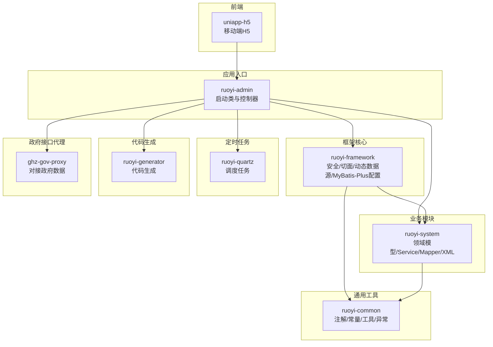
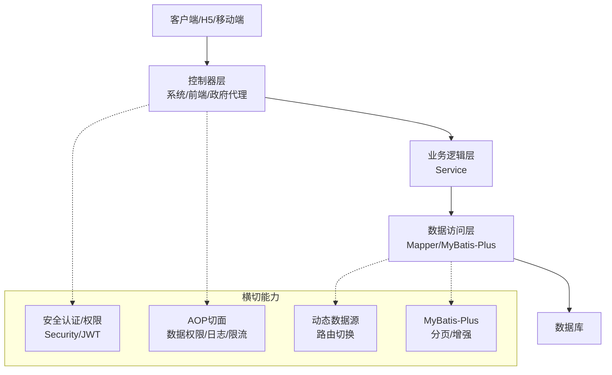
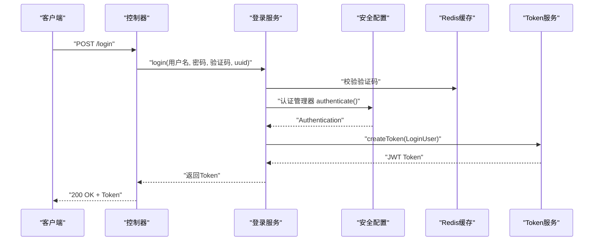
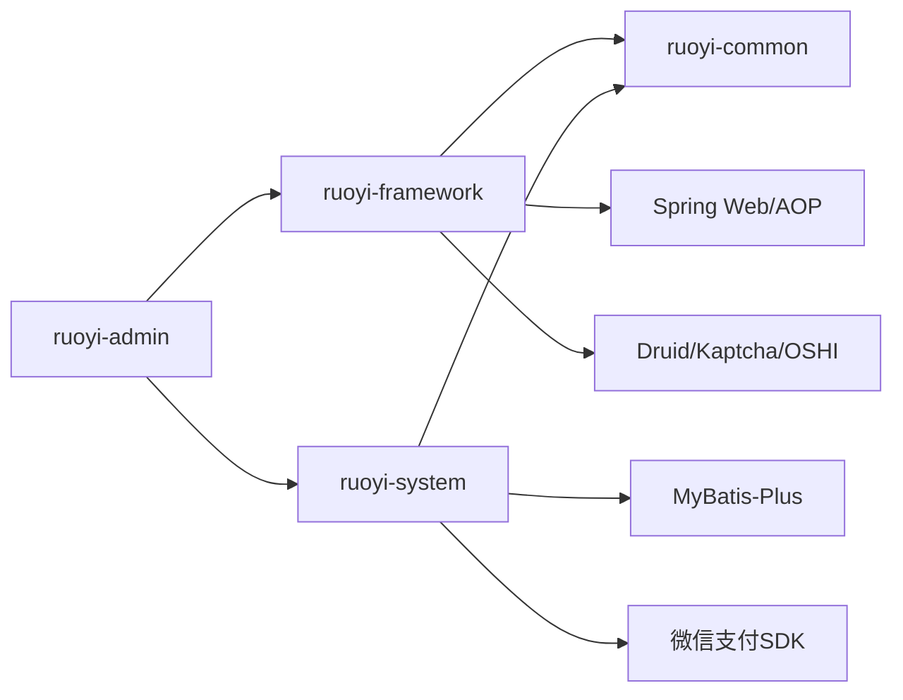

# 后端系统设计

<cite>
**本文引用的文件**
- [RuoYiApplication.java](file://ruoyi-admin/src/main/java/com/ruoyi/RuoYiApplication.java)
- [SecurityConfig.java](file://ruoyi-framework/src/main/java/com/ruoyi/framework/config/SecurityConfig.java)
- [MybatisPlusConfig.java](file://ruoyi-framework/src/main/java/com/ruoyi/framework/config/MybatisPlusConfig.java)
- [SysLoginService.java](file://ruoyi-framework/src/main/java/com/ruoyi/framework/web/service/SysLoginService.java)
- [DataScopeAspect.java](file://ruoyi-framework/src/main/java/com/ruoyi/framework/aspectj/DataScopeAspect.java)
- [DynamicDataSource.java](file://ruoyi-framework/src/main/java/com/ruoyi/framework/datasource/DynamicDataSource.java)
- [SecurityUtils.java](file://ruoyi-common/src/main/java/com/ruoyi/common/utils/SecurityUtils.java)
- [pom.xml（ruoyi-system）](file://ruoyi-system/pom.xml)
- [pom.xml（ruoyi-framework）](file://ruoyi-framework/pom.xml)
- [HzHouseController.java](file://ruoyi-admin/src/main/java/com/ruoyi/web/controller/h5/HzHouseController.java)
- [HzTenantController.java](file://ruoyi-admin/src/main/java/com/ruoyi/web/controller/system/HzTenantController.java)
- [HzContractController.java](file://ruoyi-admin/src/main/java/com/ruoyi/web/controller/system/HzContractController.java)
- [HzPaymentController.java](file://ruoyi-admin/src/main/java/com/ruoyi/web/controller/h5/HzPaymentController.java)
- [HzBillController.java](file://ruoyi-admin/src/main/java/com/ruoyi/web/controller/h5/HzBillController.java)
- [HzCheckInController.java](file://ruoyi-admin/src/main/java/com/ruoyi/web/controller/h5/HzCheckInController.java)
- [HzCheckOutController.java](file://ruoyi-admin/src/main/java/com/ruoyi/web/controller/h5/HzCheckOutController.java)
- [HzAppointmentController.java](file://ruoyi-admin/src/main/java/com/ruoyi/web/controller/h5/HzAppointmentController.java)
- [HzComplaintController.java](file://ruoyi-admin/src/main/java/com/ruoyi/web/controller/h5/HzComplaintController.java)
- [HzInvoiceController.java](file://ruoyi-admin/src/main/java/com/ruoyi/web/controller/h5/HzInvoiceController.java)
- [HzBatchAllocationController.java](file://ruoyi-admin/src/main/java/com/ruoyi/web/controller/system/HzBatchAllocationController.java)
- [HzEnterpriseController.java](file://ruoyi-admin/src/main/java/com/ruoyi/web/controller/system/HzEnterpriseController.java)
- [HzOperationConfigController.java](file://ruoyi-admin/src/main/java/com/ruoyi/web/controller/system/HzOperationConfigController.java)
- [HzProjectController.java](file://ruoyi-admin/src/main/java/com/ruoyi/web/controller/system/HzProjectController.java)
- [HzBuildingController.java](file://ruoyi-admin/src/main/java/com/ruoyi/web/controller/system/HzBuildingController.java)
- [HzUnitController.java](file://ruoyi-admin/src/main/java/com/ruoyi/web/controller/system/HzUnitController.java)
- [HzHouseTypeController.java](file://ruoyi-admin/src/main/java/com/ruoyi/web/controller/system/HzHouseTypeController.java)
- [HzHouseFacilityController.java](file://ruoyi-admin/src/main/java/com/ruoyi/web/controller/system/HzHouseFacilityController.java)
- [HzHouseTypeFacilityController.java](file://ruoyi-admin/src/main/java/com/ruoyi/web/controller/system/HzHouseTypeFacilityController.java)
- [HzFacilityItemController.java](file://ruoyi-admin/src/main/java/com/ruoyi/web/controller/system/HzFacilityItemController.java)
- [HzAnnouncementController.java](file://ruoyi-admin/src/main/java/com/ruoyi/web/controller/h5/HzAnnouncementController.java)
- [HzMessageController.java](file://ruoyi-admin/src/main/java/com/ruoyi/web/controller/h5/HzMessageController.java)
- [HzQualificationController.java](file://ruoyi-admin/src/main/java/com/ruoyi/web/controller/h5/HzQualificationController.java)
- [HzQualificationAppealController.java](file://ruoyi-admin/src/main/java/com/ruoyi/web/controller/h5/HzQualificationAppealController.java)
- [HzCommitmentController.java](file://ruoyi-admin/src/main/java/com/ruoyi/web/controller/h5/HzCommitmentController.java)
- [HzCommitmentTemplateController.java](file://ruoyi-admin/src/main/java/com/ruoyi/web/controller/h5/HzCommitmentTemplateController.java)
- [HzDocumentController.java](file://ruoyi-admin/src/main/java/com/ruoyi/web/controller/h5/HzDocumentController.java)
- [HzBlacklistController.java](file://ruoyi-admin/src/main/java/com/ruoyi/web/controller/system/HzBlacklistController.java)
- [HzUserMapper.xml](file://ruoyi-system/src/main/resources/mapper/system/HzUserMapper.xml)
- [HzHouseMapper.xml](file://ruoyi-system/src/main/resources/mapper/system/HzHouseMapper.xml)
- [HzContractMapper.xml](file://ruoyi-system/src/main/resources/mapper/system/HzContractMapper.xml)
- [HzPaymentMapper.xml](file://ruoyi-system/src/main/resources/mapper/system/HzPaymentMapper.xml)
- [HzBillMapper.xml](file://ruoyi-system/src/main/resources/mapper/system/HzBillMapper.xml)
- [HzCheckInMapper.xml](file://ruoyi-system/src/main/resources/mapper/system/HzCheckInMapper.xml)
- [HzCheckOutMapper.xml](file://ruoyi-system/src/main/resources/mapper/system/HzCheckOutMapper.xml)
- [HzAppointmentMapper.xml](file://ruoyi-system/src/main/resources/mapper/system/HzAppointmentMapper.xml)
- [HzComplaintMapper.xml](file://ruoyi-system/src/main/resources/mapper/system/HzComplaintMapper.xml)
- [HzInvoiceMapper.xml](file://ruoyi-system/src/main/resources/mapper/system/HzInvoiceMapper.xml)
- [HzBatchAllocationMapper.xml](file://ruoyi-system/src/main/resources/mapper/system/HzBatchAllocationMapper.xml)
- [HzEnterpriseMapper.xml](file://ruoyi-system/src/main/resources/mapper/system/HzEnterpriseMapper.xml)
- [HzOperationConfigMapper.xml](file://ruoyi-system/src/main/resources/mapper/system/HzOperationConfigMapper.xml)
- [HzProjectMapper.xml](file://ruoyi-system/src/main/resources/mapper/system/HzProjectMapper.xml)
- [HzBuildingMapper.xml](file://ruoyi-system/src/main/resources/mapper/system/HzBuildingMapper.xml)
- [HzUnitMapper.xml](file://ruoyi-system/src/main/resources/mapper/system/HzUnitMapper.xml)
- [HzHouseTypeMapper.xml](file://ruoyi-system/src/main/resources/mapper/system/HzHouseTypeMapper.xml)
- [HzHouseFacilityMapper.xml](file://ruoyi-system/src/main/resources/mapper/system/HzHouseFacilityMapper.xml)
- [HzHouseTypeFacilityMapper.xml](file://ruoyi-system/src/main/resources/mapper/system/HzHouseTypeFacilityMapper.xml)
- [HzFacilityItemMapper.xml](file://ruoyi-system/src/main/resources/mapper/system/HzFacilityItemMapper.xml)
- [HzAnnouncementMapper.xml](file://ruoyi-system/src/main/resources/mapper/system/HzAnnouncementMapper.xml)
- [HzMessageMapper.xml](file://ruoyi-system/src/main/resources/mapper/system/HzMessageMapper.xml)
- [HzQualificationMapper.xml](file://ruoyi-system/src/main/resources/mapper/system/HzQualificationMapper.xml)
- [HzQualificationAppealMapper.xml](file://ruoyi-system/src/main/resources/mapper/system/HzQualificationAppealMapper.xml)
- [HzCommitmentMapper.xml](file://ruoyi-system/src/main/resources/mapper/system/HzCommitmentMapper.xml)
- [HzCommitmentTemplateMapper.xml](file://ruoyi-system/src/main/resources/mapper/system/HzCommitmentTemplateMapper.xml)
- [HzDocumentMapper.xml](file://ruoyi-system/src/main/resources/mapper/system/HzDocumentMapper.xml)
- [HzBlacklistMapper.xml](file://ruoyi-system/src/main/resources/mapper/system/HzBlacklistMapper.xml)
</cite>

## 目录
1. [引言](#引言)
2. [项目结构](#项目结构)
3. [核心组件](#核心组件)
4. [架构总览](#架构总览)
5. [详细组件分析](#详细组件分析)
6. [依赖分析](#依赖分析)
7. [性能考虑](#性能考虑)
8. [故障排查指南](#故障排查指南)
9. [结论](#结论)
10. [附录](#附录)

## 引言
本文件面向港好住信息系统后端，基于 RuoYi 框架构建的模块化系统，围绕“控制器层-业务逻辑层-数据访问层”的职责划分与交互关系进行系统性梳理；重点覆盖房源管理、租户管理、合同管理、支付管理、业务流程管理等核心模块；同时阐述 Spring Boot 自动配置、依赖注入、AOP 切面编程、MyBatis-Plus ORM 与动态数据源、分页查询等关键技术在系统中的落地方式；并总结安全认证、权限控制、异常处理、日志记录等横切关注点的设计与实现。

## 项目结构
系统采用多模块 Maven 组织方式，核心模块包括：
- ruoyi-admin：应用入口与前端交互控制器
- ruoyi-framework：安全、AOP、动态数据源、MyBatis-Plus 配置、拦截器等框架核心
- ruoyi-system：业务领域模型、Mapper/XML、Service 实现
- ruoyi-common：通用注解、常量、工具类、异常体系
- ruoyi-quartz：定时任务调度
- ruoyi-generator：代码生成器
- ghz-gov-proxy：政府接口代理模块
- uniapp-h5：移动端前端（与后端交互）

图表来源
- [RuoYiApplication.java:12-18](file://ruoyi-admin/src/main/java/com/ruoyi/RuoYiApplication.java#L12-L18)
- [pom.xml（ruoyi-framework）:67-70](file://ruoyi-framework/pom.xml#L67-L70)
- [pom.xml（ruoyi-system）:21-24](file://ruoyi-system/pom.xml#L21-L24)

章节来源
- [RuoYiApplication.java:12-18](file://ruoyi-admin/src/main/java/com/ruoyi/RuoYiApplication.java#L12-L18)
- [pom.xml（ruoyi-framework）:67-70](file://ruoyi-framework/pom.xml#L67-L70)
- [pom.xml（ruoyi-system）:21-24](file://ruoyi-system/pom.xml#L21-L24)

## 核心组件
- 启动与自动装配
  - 应用启动类排除数据源自动配置，便于集中管理数据源与动态路由
  - 参考：[RuoYiApplication.java:12-18](file://ruoyi-admin/src/main/java/com/ruoyi/RuoYiApplication.java#L12-L18)
- 安全与认证
  - 基于 Spring Security 的无状态 JWT 过滤链，支持匿名访问白名单、跨域、登出处理
  - 参考：[SecurityConfig.java:86-123](file://ruoyi-framework/src/main/java/com/ruoyi/framework/config/SecurityConfig.java#L86-L123)
- 登录与鉴权服务
  - 登录校验、验证码校验、前置校验、异步记录登录日志、生成 Token
  - 参考：[SysLoginService.java:63-100](file://ruoyi-framework/src/main/java/com/ruoyi/framework/web/service/SysLoginService.java#L63-L100)
- AOP 切面
  - 数据权限切面：按角色数据范围动态拼接 SQL 条件
  - 参考：[DataScopeAspect.java:66-170](file://ruoyi-framework/src/main/java/com/ruoyi/framework/aspectj/DataScopeAspect.java#L66-L170)
- 动态数据源
  - 基于线程上下文路由切换数据源，支持主从/多数据源
  - 参考：[DynamicDataSource.java:21-25](file://ruoyi-framework/src/main/java/com/ruoyi/framework/datasource/DynamicDataSource.java#L21-L25)
- ORM 与分页
  - MyBatis-Plus 分页插件，MySQL 内置分页增强
  - 参考：[MybatisPlusConfig.java:20-26](file://ruoyi-framework/src/main/java/com/ruoyi/framework/config/MybatisPlusConfig.java#L20-L26)
- 工具与常量
  - 安全工具类：获取用户、角色、权限判断、密码加密/匹配
  - 参考：[SecurityUtils.java:72-176](file://ruoyi-common/src/main/java/com/ruoyi/common/utils/SecurityUtils.java#L72-L176)

章节来源
- [RuoYiApplication.java:12-18](file://ruoyi-admin/src/main/java/com/ruoyi/RuoYiApplication.java#L12-L18)
- [SecurityConfig.java:86-123](file://ruoyi-framework/src/main/java/com/ruoyi/framework/config/SecurityConfig.java#L86-L123)
- [SysLoginService.java:63-100](file://ruoyi-framework/src/main/java/com/ruoyi/framework/web/service/SysLoginService.java#L63-L100)
- [DataScopeAspect.java:66-170](file://ruoyi-framework/src/main/java/com/ruoyi/framework/aspectj/DataScopeAspect.java#L66-L170)
- [DynamicDataSource.java:21-25](file://ruoyi-framework/src/main/java/com/ruoyi/framework/datasource/DynamicDataSource.java#L21-L25)
- [MybatisPlusConfig.java:20-26](file://ruoyi-framework/src/main/java/com/ruoyi/framework/config/MybatisPlusConfig.java#L20-L26)
- [SecurityUtils.java:72-176](file://ruoyi-common/src/main/java/com/ruoyi/common/utils/SecurityUtils.java#L72-L176)

## 架构总览
系统采用“控制器-服务-持久层”三层架构，配合 Spring Security 无状态认证、AOP 数据权限、MyBatis-Plus 分页与动态数据源，形成高内聚低耦合的模块化设计。

图表来源
- [SecurityConfig.java:86-123](file://ruoyi-framework/src/main/java/com/ruoyi/framework/config/SecurityConfig.java#L86-L123)
- [DataScopeAspect.java:66-170](file://ruoyi-framework/src/main/java/com/ruoyi/framework/aspectj/DataScopeAspect.java#L66-L170)
- [DynamicDataSource.java:21-25](file://ruoyi-framework/src/main/java/com/ruoyi/framework/datasource/DynamicDataSource.java#L21-L25)
- [MybatisPlusConfig.java:20-26](file://ruoyi-framework/src/main/java/com/ruoyi/framework/config/MybatisPlusConfig.java#L20-L26)

## 详细组件分析

### 控制器层
- 系统控制器：负责系统管理相关接口，如租户、合同、项目、楼宇、单元、户型、设施、公告、消息、企业、运营配置、黑名单等
  - 示例：[HzTenantController.java](file://ruoyi-admin/src/main/java/com/ruoyi/web/controller/system/HzTenantController.java)
  - 示例：[HzContractController.java](file://ruoyi-admin/src/main/java/com/ruoyi/web/controller/system/HzContractController.java)
  - 示例：[HzProjectController.java](file://ruoyi-admin/src/main/java/com/ruoyi/web/controller/system/HzProjectController.java)
  - 示例：[HzBuildingController.java](file://ruoyi-admin/src/main/java/com/ruoyi/web/controller/system/HzBuildingController.java)
  - 示例：[HzUnitController.java](file://ruoyi-admin/src/main/java/com/ruoyi/web/controller/system/HzUnitController.java)
  - 示例：[HzHouseTypeController.java](file://ruoyi-admin/src/main/java/com/ruoyi/web/controller/system/HzHouseTypeController.java)
  - 示例：[HzHouseFacilityController.java](file://ruoyi-admin/src/main/java/com/ruoyi/web/controller/system/HzHouseFacilityController.java)
  - 示例：[HzHouseTypeFacilityController.java](file://ruoyi-admin/src/main/java/com/ruoyi/web/controller/system/HzHouseTypeFacilityController.java)
  - 示例：[HzFacilityItemController.java](file://ruoyi-admin/src/main/java/com/ruoyi/web/controller/system/HzFacilityItemController.java)
  - 示例：[HzEnterpriseController.java](file://ruoyi-admin/src/main/java/com/ruoyi/web/controller/system/HzEnterpriseController.java)
  - 示例：[HzOperationConfigController.java](file://ruoyi-admin/src/main/java/com/ruoyi/web/controller/system/HzOperationConfigController.java)
  - 示例：[HzBatchAllocationController.java](file://ruoyi-admin/src/main/java/com/ruoyi/web/controller/system/HzBatchAllocationController.java)
  - 示例：[HzBlacklistController.java](file://ruoyi-admin/src/main/java/com/ruoyi/web/controller/system/HzBlacklistController.java)
- H5/前端控制器：负责移动端与前端交互接口，如房源、预约、入住/退租、账单、支付、投诉、发票、承诺书、资格审核、公告、消息、文档等
  - 示例：[HzHouseController.java](file://ruoyi-admin/src/main/java/com/ruoyi/web/controller/h5/HzHouseController.java)
  - 示例：[HzAppointmentController.java](file://ruoyi-admin/src/main/java/com/ruoyi/web/controller/h5/HzAppointmentController.java)
  - 示例：[HzCheckInController.java](file://ruoyi-admin/src/main/java/com/ruoyi/web/controller/h5/HzCheckInController.java)
  - 示例：[HzCheckOutController.java](file://ruoyi-admin/src/main/java/com/ruoyi/web/controller/h5/HzCheckOutController.java)
  - 示例：[HzBillController.java](file://ruoyi-admin/src/main/java/com/ruoyi/web/controller/h5/HzBillController.java)
  - 示例：[HzPaymentController.java](file://ruoyi-admin/src/main/java/com/ruoyi/web/controller/h5/HzPaymentController.java)
  - 示例：[HzComplaintController.java](file://ruoyi-admin/src/main/java/com/ruoyi/web/controller/h5/HzComplaintController.java)
  - 示例：[HzInvoiceController.java](file://ruoyi-admin/src/main/java/com/ruoyi/web/controller/h5/HzInvoiceController.java)
  - 示例：[HzCommitmentController.java](file://ruoyi-admin/src/main/java/com/ruoyi/web/controller/h5/HzCommitmentController.java)
  - 示例：[HzCommitmentTemplateController.java](file://ruoyi-admin/src/main/java/com/ruoyi/web/controller/h5/HzCommitmentTemplateController.java)
  - 示例：[HzDocumentController.java](file://ruoyi-admin/src/main/java/com/ruoyi/web/controller/h5/HzDocumentController.java)
  - 示例：[HzQualificationController.java](file://ruoyi-admin/src/main/java/com/ruoyi/web/controller/h5/HzQualificationController.java)
  - 示例：[HzQualificationAppealController.java](file://ruoyi-admin/src/main/java/com/ruoyi/web/controller/h5/HzQualificationAppealController.java)
  - 示例：[HzAnnouncementController.java](file://ruoyi-admin/src/main/java/com/ruoyi/web/controller/h5/HzAnnouncementController.java)
  - 示例：[HzMessageController.java](file://ruoyi-admin/src/main/java/com/ruoyi/web/controller/h5/HzMessageController.java)

章节来源
- [HzTenantController.java](file://ruoyi-admin/src/main/java/com/ruoyi/web/controller/system/HzTenantController.java)
- [HzContractController.java](file://ruoyi-admin/src/main/java/com/ruoyi/web/controller/system/HzContractController.java)
- [HzProjectController.java](file://ruoyi-admin/src/main/java/com/ruoyi/web/controller/system/HzProjectController.java)
- [HzBuildingController.java](file://ruoyi-admin/src/main/java/com/ruoyi/web/controller/system/HzBuildingController.java)
- [HzUnitController.java](file://ruoyi-admin/src/main/java/com/ruoyi/web/controller/system/HzUnitController.java)
- [HzHouseTypeController.java](file://ruoyi-admin/src/main/java/com/ruoyi/web/controller/system/HzHouseTypeController.java)
- [HzHouseFacilityController.java](file://ruoyi-admin/src/main/java/com/ruoyi/web/controller/system/HzHouseFacilityController.java)
- [HzHouseTypeFacilityController.java](file://ruoyi-admin/src/main/java/com/ruoyi/web/controller/system/HzHouseTypeFacilityController.java)
- [HzFacilityItemController.java](file://ruoyi-admin/src/main/java/com/ruoyi/web/controller/system/HzFacilityItemController.java)
- [HzEnterpriseController.java](file://ruoyi-admin/src/main/java/com/ruoyi/web/controller/system/HzEnterpriseController.java)
- [HzOperationConfigController.java](file://ruoyi-admin/src/main/java/com/ruoyi/web/controller/system/HzOperationConfigController.java)
- [HzBatchAllocationController.java](file://ruoyi-admin/src/main/java/com/ruoyi/web/controller/system/HzBatchAllocationController.java)
- [HzBlacklistController.java](file://ruoyi-admin/src/main/java/com/ruoyi/web/controller/system/HzBlacklistController.java)
- [HzHouseController.java](file://ruoyi-admin/src/main/java/com/ruoyi/web/controller/h5/HzHouseController.java)
- [HzAppointmentController.java](file://ruoyi-admin/src/main/java/com/ruoyi/web/controller/h5/HzAppointmentController.java)
- [HzCheckInController.java](file://ruoyi-admin/src/main/java/com/ruoyi/web/controller/h5/HzCheckInController.java)
- [HzCheckOutController.java](file://ruoyi-admin/src/main/java/com/ruoyi/web/controller/h5/HzCheckOutController.java)
- [HzBillController.java](file://ruoyi-admin/src/main/java/com/ruoyi/web/controller/h5/HzBillController.java)
- [HzPaymentController.java](file://ruoyi-admin/src/main/java/com/ruoyi/web/controller/h5/HzPaymentController.java)
- [HzComplaintController.java](file://ruoyi-admin/src/main/java/com/ruoyi/web/controller/h5/HzComplaintController.java)
- [HzInvoiceController.java](file://ruoyi-admin/src/main/java/com/ruoyi/web/controller/h5/HzInvoiceController.java)
- [HzCommitmentController.java](file://ruoyi-admin/src/main/java/com/ruoyi/web/controller/h5/HzCommitmentController.java)
- [HzCommitmentTemplateController.java](file://ruoyi-admin/src/main/java/com/ruoyi/web/controller/h5/HzCommitmentTemplateController.java)
- [HzDocumentController.java](file://ruoyi-admin/src/main/java/com/ruoyi/web/controller/h5/HzDocumentController.java)
- [HzQualificationController.java](file://ruoyi-admin/src/main/java/com/ruoyi/web/controller/h5/HzQualificationController.java)
- [HzQualificationAppealController.java](file://ruoyi-admin/src/main/java/com/ruoyi/web/controller/h5/HzQualificationAppealController.java)
- [HzAnnouncementController.java](file://ruoyi-admin/src/main/java/com/ruoyi/web/controller/h5/HzAnnouncementController.java)
- [HzMessageController.java](file://ruoyi-admin/src/main/java/com/ruoyi/web/controller/h5/HzMessageController.java)

### 业务逻辑层（Service）
- 以“系统/前端/H5”控制器对应的服务为例，业务层负责：
  - 参数校验与前置检查
  - 调用 Mapper 执行数据库操作
  - 组装返回对象（含 VO/DTO）
  - 触发异步任务（如日志、通知）
- 典型流程参考登录服务：验证码校验 → 前置校验 → 身份认证 → 记录登录信息 → 生成 Token
  - 参考：[SysLoginService.java:63-100](file://ruoyi-framework/src/main/java/com/ruoyi/framework/web/service/SysLoginService.java#L63-L100)

章节来源
- [SysLoginService.java:63-100](file://ruoyi-framework/src/main/java/com/ruoyi/framework/web/service/SysLoginService.java#L63-L100)

### 数据访问层（Mapper/MyBatis-Plus）
- 使用 MyBatis-Plus 提供的通用 CRUD 能力，结合 XML 自定义 SQL
- 分页查询通过 MyBatis-Plus 分页插件实现
- 示例 Mapper/XML：
  - 用户：[HzUserMapper.xml](file://ruoyi-system/src/main/resources/mapper/system/HzUserMapper.xml)
  - 房源：[HzHouseMapper.xml](file://ruoyi-system/src/main/resources/mapper/system/HzHouseMapper.xml)
  - 合同：[HzContractMapper.xml](file://ruoyi-system/src/main/resources/mapper/system/HzContractMapper.xml)
  - 支付：[HzPaymentMapper.xml](file://ruoyi-system/src/main/resources/mapper/system/HzPaymentMapper.xml)
  - 账单：[HzBillMapper.xml](file://ruoyi-system/src/main/resources/mapper/system/HzBillMapper.xml)
  - 入住/退租：[HzCheckInMapper.xml](file://ruoyi-system/src/main/resources/mapper/system/HzCheckInMapper.xml), [HzCheckOutMapper.xml](file://ruoyi-system/src/main/resources/mapper/system/HzCheckOutMapper.xml)
  - 预约：[HzAppointmentMapper.xml](file://ruoyi-system/src/main/resources/mapper/system/HzAppointmentMapper.xml)
  - 投诉：[HzComplaintMapper.xml](file://ruoyi-system/src/main/resources/mapper/system/HzComplaintMapper.xml)
  - 发票：[HzInvoiceMapper.xml](file://ruoyi-system/src/main/resources/mapper/system/HzInvoiceMapper.xml)
  - 批量分配：[HzBatchAllocationMapper.xml](file://ruoyi-system/src/main/resources/mapper/system/HzBatchAllocationMapper.xml)
  - 企业：[HzEnterpriseMapper.xml](file://ruoyi-system/src/main/resources/mapper/system/HzEnterpriseMapper.xml)
  - 运营配置：[HzOperationConfigMapper.xml](file://ruoyi-system/src/main/resources/mapper/system/HzOperationConfigMapper.xml)
  - 项目/楼宇/单元/户型/设施：[HzProjectMapper.xml](file://ruoyi-system/src/main/resources/mapper/system/HzProjectMapper.xml), [HzBuildingMapper.xml](file://ruoyi-system/src/main/resources/mapper/system/HzBuildingMapper.xml), [HzUnitMapper.xml](file://ruoyi-system/src/main/resources/mapper/system/HzUnitMapper.xml), [HzHouseTypeMapper.xml](file://ruoyi-system/src/main/resources/mapper/system/HzHouseTypeMapper.xml), [HzHouseFacilityMapper.xml](file://ruoyi-system/src/main/resources/mapper/system/HzHouseFacilityMapper.xml), [HzHouseTypeFacilityMapper.xml](file://ruoyi-system/src/main/resources/mapper/system/HzHouseTypeFacilityMapper.xml), [HzFacilityItemMapper.xml](file://ruoyi-system/src/main/resources/mapper/system/HzFacilityItemMapper.xml)
  - 公告/消息/资格/承诺/文档/黑名单：[HzAnnouncementMapper.xml](file://ruoyi-system/src/main/resources/mapper/system/HzAnnouncementMapper.xml), [HzMessageMapper.xml](file://ruoyi-system/src/main/resources/mapper/system/HzMessageMapper.xml), [HzQualificationMapper.xml](file://ruoyi-system/src/main/resources/mapper/system/HzQualificationMapper.xml), [HzQualificationAppealMapper.xml](file://ruoyi-system/src/main/resources/mapper/system/HzQualificationAppealMapper.xml), [HzCommitmentMapper.xml](file://ruoyi-system/src/main/resources/mapper/system/HzCommitmentMapper.xml), [HzCommitmentTemplateMapper.xml](file://ruoyi-system/src/main/resources/mapper/system/HzCommitmentTemplateMapper.xml), [HzDocumentMapper.xml](file://ruoyi-system/src/main/resources/mapper/system/HzDocumentMapper.xml), [HzBlacklistMapper.xml](file://ruoyi-system/src/main/resources/mapper/system/HzBlacklistMapper.xml)

章节来源
- [MybatisPlusConfig.java:20-26](file://ruoyi-framework/src/main/java/com/ruoyi/framework/config/MybatisPlusConfig.java#L20-L26)
- [HzUserMapper.xml](file://ruoyi-system/src/main/resources/mapper/system/HzUserMapper.xml)
- [HzHouseMapper.xml](file://ruoyi-system/src/main/resources/mapper/system/HzHouseMapper.xml)
- [HzContractMapper.xml](file://ruoyi-system/src/main/resources/mapper/system/HzContractMapper.xml)
- [HzPaymentMapper.xml](file://ruoyi-system/src/main/resources/mapper/system/HzPaymentMapper.xml)
- [HzBillMapper.xml](file://ruoyi-system/src/main/resources/mapper/system/HzBillMapper.xml)
- [HzCheckInMapper.xml](file://ruoyi-system/src/main/resources/mapper/system/HzCheckInMapper.xml)
- [HzCheckOutMapper.xml](file://ruoyi-system/src/main/resources/mapper/system/HzCheckOutMapper.xml)
- [HzAppointmentMapper.xml](file://ruoyi-system/src/main/resources/mapper/system/HzAppointmentMapper.xml)
- [HzComplaintMapper.xml](file://ruoyi-system/src/main/resources/mapper/system/HzComplaintMapper.xml)
- [HzInvoiceMapper.xml](file://ruoyi-system/src/main/resources/mapper/system/HzInvoiceMapper.xml)
- [HzBatchAllocationMapper.xml](file://ruoyi-system/src/main/resources/mapper/system/HzBatchAllocationMapper.xml)
- [HzEnterpriseMapper.xml](file://ruoyi-system/src/main/resources/mapper/system/HzEnterpriseMapper.xml)
- [HzOperationConfigMapper.xml](file://ruoyi-system/src/main/resources/mapper/system/HzOperationConfigMapper.xml)
- [HzProjectMapper.xml](file://ruoyi-system/src/main/resources/mapper/system/HzProjectMapper.xml)
- [HzBuildingMapper.xml](file://ruoyi-system/src/main/resources/mapper/system/HzBuildingMapper.xml)
- [HzUnitMapper.xml](file://ruoyi-system/src/main/resources/mapper/system/HzUnitMapper.xml)
- [HzHouseTypeMapper.xml](file://ruoyi-system/src/main/resources/mapper/system/HzHouseTypeMapper.xml)
- [HzHouseFacilityMapper.xml](file://ruoyi-system/src/main/resources/mapper/system/HzHouseFacilityMapper.xml)
- [HzHouseTypeFacilityMapper.xml](file://ruoyi-system/src/main/resources/mapper/system/HzHouseTypeFacilityMapper.xml)
- [HzFacilityItemMapper.xml](file://ruoyi-system/src/main/resources/mapper/system/HzFacilityItemMapper.xml)
- [HzAnnouncementMapper.xml](file://ruoyi-system/src/main/resources/mapper/system/HzAnnouncementMapper.xml)
- [HzMessageMapper.xml](file://ruoyi-system/src/main/resources/mapper/system/HzMessageMapper.xml)
- [HzQualificationMapper.xml](file://ruoyi-system/src/main/resources/mapper/system/HzQualificationMapper.xml)
- [HzQualificationAppealMapper.xml](file://ruoyi-system/src/main/resources/mapper/system/HzQualificationAppealMapper.xml)
- [HzCommitmentMapper.xml](file://ruoyi-system/src/main/resources/mapper/system/HzCommitmentMapper.xml)
- [HzCommitmentTemplateMapper.xml](file://ruoyi-system/src/main/resources/mapper/system/HzCommitmentTemplateMapper.xml)
- [HzDocumentMapper.xml](file://ruoyi-system/src/main/resources/mapper/system/HzDocumentMapper.xml)
- [HzBlacklistMapper.xml](file://ruoyi-system/src/main/resources/mapper/system/HzBlacklistMapper.xml)

### 核心业务模块设计

#### 房源管理
- 职责：房源信息维护、图片/VR/户型关联、设施配置、状态流转
- 关键实体与映射：[HzHouseMapper.xml](file://ruoyi-system/src/main/resources/mapper/system/HzHouseMapper.xml), [HzHouseTypeMapper.xml](file://ruoyi-system/src/main/resources/mapper/system/HzHouseTypeMapper.xml), [HzHouseFacilityMapper.xml](file://ruoyi-system/src/main/resources/mapper/system/HzHouseFacilityMapper.xml), [HzHouseTypeFacilityMapper.xml](file://ruoyi-system/src/main/resources/mapper/system/HzHouseTypeFacilityMapper.xml), [HzHouseTypeImageMapper.xml](file://ruoyi-system/src/main/resources/mapper/system/HzHouseTypeImageMapper.xml), [HzHouseImageMapper.xml](file://ruoyi-system/src/main/resources/mapper/system/HzHouseImageMapper.xml), [HzHouseVrMapper.xml](file://ruoyi-system/src/main/resources/mapper/system/HzHouseVrMapper.xml)
- 控制器：[HzHouseController.java](file://ruoyi-admin/src/main/java/com/ruoyi/web/controller/h5/HzHouseController.java)

章节来源
- [HzHouseMapper.xml](file://ruoyi-system/src/main/resources/mapper/system/HzHouseMapper.xml)
- [HzHouseTypeMapper.xml](file://ruoyi-system/src/main/resources/mapper/system/HzHouseTypeMapper.xml)
- [HzHouseFacilityMapper.xml](file://ruoyi-system/src/main/resources/mapper/system/HzHouseFacilityMapper.xml)
- [HzHouseTypeFacilityMapper.xml](file://ruoyi-system/src/main/resources/mapper/system/HzHouseTypeFacilityMapper.xml)
- [HzHouseTypeImageMapper.xml](file://ruoyi-system/src/main/resources/mapper/system/HzHouseTypeImageMapper.xml)
- [HzHouseImageMapper.xml](file://ruoyi-system/src/main/resources/mapper/system/HzHouseImageMapper.xml)
- [HzHouseVrMapper.xml](file://ruoyi-system/src/main/resources/mapper/system/HzHouseVrMapper.xml)
- [HzHouseController.java](file://ruoyi-admin/src/main/java/com/ruoyi/web/controller/h5/HzHouseController.java)

#### 租户管理
- 职责：租户注册、信息维护、共同承租人、黑名单管理
- 关键实体与映射：[HzUserMapper.xml](file://ruoyi-system/src/main/resources/mapper/system/HzUserMapper.xml), [HzTenantMapper.xml](file://ruoyi-system/src/main/resources/mapper/system/HzTenantMapper.xml), [HzCoTenantMapper.xml](file://ruoyi-system/src/main/resources/mapper/system/HzCoTenantMapper.xml), [HzBlacklistMapper.xml](file://ruoyi-system/src/main/resources/mapper/system/HzBlacklistMapper.xml)
- 控制器：[HzTenantController.java](file://ruoyi-admin/src/main/java/com/ruoyi/web/controller/system/HzTenantController.java)

章节来源
- [HzUserMapper.xml](file://ruoyi-system/src/main/resources/mapper/system/HzUserMapper.xml)
- [HzTenantMapper.xml](file://ruoyi-system/src/main/resources/mapper/system/HzTenantMapper.xml)
- [HzCoTenantMapper.xml](file://ruoyi-system/src/main/resources/mapper/system/HzCoTenantMapper.xml)
- [HzBlacklistMapper.xml](file://ruoyi-system/src/main/resources/mapper/system/HzBlacklistMapper.xml)
- [HzTenantController.java](file://ruoyi-admin/src/main/java/com/ruoyi/web/controller/system/HzTenantController.java)

#### 合同管理
- 职责：合同模板、签署流程、电子签名集成、合同归档
- 关键实体与映射：[HzContractMapper.xml](file://ruoyi-system/src/main/resources/mapper/system/HzContractMapper.xml), [HzContractTemplateMapper.xml](file://ruoyi-system/src/main/resources/mapper/system/HzContractTemplateMapper.xml), [HzContractSignatureMapper.xml](file://ruoyi-system/src/main/resources/mapper/system/HzContractSignatureMapper.xml)
- 控制器：[HzContractController.java](file://ruoyi-admin/src/main/java/com/ruoyi/web/controller/system/HzContractController.java)

章节来源
- [HzContractMapper.xml](file://ruoyi-system/src/main/resources/mapper/system/HzContractMapper.xml)
- [HzContractTemplateMapper.xml](file://ruoyi-system/src/main/resources/mapper/system/HzContractTemplateMapper.xml)
- [HzContractSignatureMapper.xml](file://ruoyi-system/src/main/resources/mapper/system/HzContractSignatureMapper.xml)
- [HzContractController.java](file://ruoyi-admin/src/main/java/com/ruoyi/web/controller/system/HzContractController.java)

#### 支付管理
- 职责：账单支付、微信支付对接、支付流水、退款申请
- 关键实体与映射：[HzBillMapper.xml](file://ruoyi-system/src/main/resources/mapper/system/HzBillMapper.xml), [HzPaymentMapper.xml](file://ruoyi-system/src/main/resources/mapper/system/HzPaymentMapper.xml), [HzRefundApplyMapper.xml](file://ruoyi-system/src/main/resources/mapper/system/HzRefundApplyMapper.xml)
- 控制器：[HzPaymentController.java](file://ruoyi-admin/src/main/java/com/ruoyi/web/controller/h5/HzPaymentController.java)

章节来源
- [HzBillMapper.xml](file://ruoyi-system/src/main/resources/mapper/system/HzBillMapper.xml)
- [HzPaymentMapper.xml](file://ruoyi-system/src/main/resources/mapper/system/HzPaymentMapper.xml)
- [HzRefundApplyMapper.xml](file://ruoyi-system/src/main/resources/mapper/system/HzRefundApplyMapper.xml)
- [HzPaymentController.java](file://ruoyi-admin/src/main/java/com/ruoyi/web/controller/h5/HzPaymentController.java)

#### 业务流程管理
- 入住/退租：预约看房、入住登记、退租申请与审批、记录存档
  - 预约：[HzAppointmentMapper.xml](file://ruoyi-system/src/main/resources/mapper/system/HzAppointmentMapper.xml), [HzAppointmentController.java](file://ruoyi-admin/src/main/java/com/ruoyi/web/controller/h5/HzAppointmentController.java)
  - 入住：[HzCheckInMapper.xml](file://ruoyi-system/src/main/resources/mapper/system/HzCheckInMapper.xml), [HzCheckInController.java](file://ruoyi-admin/src/main/java/com/ruoyi/web/controller/h5/HzCheckInController.java)
  - 退租：[HzCheckoutApplyMapper.xml](file://ruoyi-system/src/main/resources/mapper/system/HzCheckoutApplyMapper.xml), [HzCheckoutApplyMapper.xml](file://ruoyi-system/src/main/resources/mapper/system/HzCheckoutApplyMapper.xml), [HzCheckOutController.java](file://ruoyi-admin/src/main/java/com/ruoyi/web/controller/h5/HzCheckOutController.java)
- 账单与缴费：账单生成、缴费记录、发票申请与开具
  - 账单：[HzBillMapper.xml](file://ruoyi-system/src/main/resources/mapper/system/HzBillMapper.xml), [HzBillController.java](file://ruoyi-admin/src/main/java/com/ruoyi/web/controller/h5/HzBillController.java)
  - 发票：[HzInvoiceMapper.xml](file://ruoyi-system/src/main/resources/mapper/system/HzInvoiceMapper.xml), [HzInvoiceController.java](file://ruoyi-admin/src/main/java/com/ruoyi/web/controller/h5/HzInvoiceController.java)
- 投诉与公告：用户反馈、内部公告发布
  - 投诉：[HzComplaintMapper.xml](file://ruoyi-system/src/main/resources/mapper/system/HzComplaintMapper.xml), [HzComplaintController.java](file://ruoyi-admin/src/main/java/com/ruoyi/web/controller/h5/HzComplaintController.java)
  - 公告：[HzAnnouncementMapper.xml](file://ruoyi-system/src/main/resources/mapper/system/HzAnnouncementMapper.xml), [HzAnnouncementController.java](file://ruoyi-admin/src/main/java/com/ruoyi/web/controller/h5/HzAnnouncementController.java)
- 资质与承诺：资格审核、承诺书签署
  - 资质：[HzQualificationMapper.xml](file://ruoyi-system/src/main/resources/mapper/system/HzQualificationMapper.xml), [HzQualificationController.java](file://ruoyi-admin/src/main/java/com/ruoyi/web/controller/h5/HzQualificationController.java), [HzQualificationAppealMapper.xml](file://ruoyi-system/src/main/resources/mapper/system/HzQualificationAppealMapper.xml), [HzQualificationAppealController.java](file://ruoyi-admin/src/main/java/com/ruoyi/web/controller/h5/HzQualificationAppealController.java)
  - 承诺：[HzCommitmentMapper.xml](file://ruoyi-system/src/main/resources/mapper/system/HzCommitmentMapper.xml), [HzCommitmentController.java](file://ruoyi-admin/src/main/java/com/ruoyi/web/controller/h5/HzCommitmentController.java), [HzCommitmentTemplateMapper.xml](file://ruoyi-system/src/main/resources/mapper/system/HzCommitmentTemplateMapper.xml), [HzCommitmentTemplateController.java](file://ruoyi-admin/src/main/java/com/ruoyi/web/controller/h5/HzCommitmentTemplateController.java)
- 文档与消息：合同/资质/承诺等文档归档与消息推送
  - 文档：[HzDocumentMapper.xml](file://ruoyi-system/src/main/resources/mapper/system/HzDocumentMapper.xml), [HzDocumentController.java](file://ruoyi-admin/src/main/java/com/ruoyi/web/controller/h5/HzDocumentController.java)
  - 消息：[HzMessageMapper.xml](file://ruoyi-system/src/main/resources/mapper/system/HzMessageMapper.xml), [HzMessageController.java](file://ruoyi-admin/src/main/java/com/ruoyi/web/controller/h5/HzMessageController.java)

章节来源
- [HzAppointmentMapper.xml](file://ruoyi-system/src/main/resources/mapper/system/HzAppointmentMapper.xml)
- [HzCheckInMapper.xml](file://ruoyi-system/src/main/resources/mapper/system/HzCheckInMapper.xml)
- [HzCheckoutApplyMapper.xml](file://ruoyi-system/src/main/resources/mapper/system/HzCheckoutApplyMapper.xml)
- [HzCheckOutMapper.xml](file://ruoyi-system/src/main/resources/mapper/system/HzCheckOutMapper.xml)
- [HzBillMapper.xml](file://ruoyi-system/src/main/resources/mapper/system/HzBillMapper.xml)
- [HzInvoiceMapper.xml](file://ruoyi-system/src/main/resources/mapper/system/HzInvoiceMapper.xml)
- [HzComplaintMapper.xml](file://ruoyi-system/src/main/resources/mapper/system/HzComplaintMapper.xml)
- [HzAnnouncementMapper.xml](file://ruoyi-system/src/main/resources/mapper/system/HzAnnouncementMapper.xml)
- [HzQualificationMapper.xml](file://ruoyi-system/src/main/resources/mapper/system/HzQualificationMapper.xml)
- [HzQualificationAppealMapper.xml](file://ruoyi-system/src/main/resources/mapper/system/HzQualificationAppealMapper.xml)
- [HzCommitmentMapper.xml](file://ruoyi-system/src/main/resources/mapper/system/HzCommitmentMapper.xml)
- [HzCommitmentTemplateMapper.xml](file://ruoyi-system/src/main/resources/mapper/system/HzCommitmentTemplateMapper.xml)
- [HzDocumentMapper.xml](file://ruoyi-system/src/main/resources/mapper/system/HzDocumentMapper.xml)
- [HzMessageMapper.xml](file://ruoyi-system/src/main/resources/mapper/system/HzMessageMapper.xml)
- [HzAppointmentController.java](file://ruoyi-admin/src/main/java/com/ruoyi/web/controller/h5/HzAppointmentController.java)
- [HzCheckInController.java](file://ruoyi-admin/src/main/java/com/ruoyi/web/controller/h5/HzCheckInController.java)
- [HzCheckOutController.java](file://ruoyi-admin/src/main/java/com/ruoyi/web/controller/h5/HzCheckOutController.java)
- [HzBillController.java](file://ruoyi-admin/src/main/java/com/ruoyi/web/controller/h5/HzBillController.java)
- [HzInvoiceController.java](file://ruoyi-admin/src/main/java/com/ruoyi/web/controller/h5/HzInvoiceController.java)
- [HzComplaintController.java](file://ruoyi-admin/src/main/java/com/ruoyi/web/controller/h5/HzComplaintController.java)
- [HzAnnouncementController.java](file://ruoyi-admin/src/main/java/com/ruoyi/web/controller/h5/HzAnnouncementController.java)
- [HzQualificationController.java](file://ruoyi-admin/src/main/java/com/ruoyi/web/controller/h5/HzQualificationController.java)
- [HzQualificationAppealController.java](file://ruoyi-admin/src/main/java/com/ruoyi/web/controller/h5/HzQualificationAppealController.java)
- [HzCommitmentController.java](file://ruoyi-admin/src/main/java/com/ruoyi/web/controller/h5/HzCommitmentController.java)
- [HzCommitmentTemplateController.java](file://ruoyi-admin/src/main/java/com/ruoyi/web/controller/h5/HzCommitmentTemplateController.java)
- [HzDocumentController.java](file://ruoyi-admin/src/main/java/com/ruoyi/web/controller/h5/HzDocumentController.java)
- [HzMessageController.java](file://ruoyi-admin/src/main/java/com/ruoyi/web/controller/h5/HzMessageController.java)

### 安全认证与权限控制
- 认证：基于 JWT 的无状态认证，登录接口返回 Token，后续请求携带 Token
  - 参考：[SecurityConfig.java:86-123](file://ruoyi-framework/src/main/java/com/ruoyi/framework/config/SecurityConfig.java#L86-L123), [SysLoginService.java:63-100](file://ruoyi-framework/src/main/java/com/ruoyi/framework/web/service/SysLoginService.java#L63-L100)
- 授权：基于注解与 URL 白名单控制访问，支持匿名访问、静态资源放行、Swagger/Druid 等
  - 参考：[SecurityConfig.java:100-114](file://ruoyi-framework/src/main/java/com/ruoyi/framework/config/SecurityConfig.java#L100-L114)
- 数据权限：AOP 切面根据用户角色数据范围动态拼接 SQL 条件，避免越权查询
  - 参考：[DataScopeAspect.java:66-170](file://ruoyi-framework/src/main/java/com/ruoyi/framework/aspectj/DataScopeAspect.java#L66-L170)
- 安全工具：统一获取用户信息、角色/权限判断、密码加密/匹配
  - 参考：[SecurityUtils.java:72-176](file://ruoyi-common/src/main/java/com/ruoyi/common/utils/SecurityUtils.java#L72-L176)

图表来源
- [SysLoginService.java:63-100](file://ruoyi-framework/src/main/java/com/ruoyi/framework/web/service/SysLoginService.java#L63-L100)
- [SecurityConfig.java:86-123](file://ruoyi-framework/src/main/java/com/ruoyi/framework/config/SecurityConfig.java#L86-L123)

章节来源
- [SecurityConfig.java:86-123](file://ruoyi-framework/src/main/java/com/ruoyi/framework/config/SecurityConfig.java#L86-L123)
- [SysLoginService.java:63-100](file://ruoyi-framework/src/main/java/com/ruoyi/framework/web/service/SysLoginService.java#L63-L100)
- [DataScopeAspect.java:66-170](file://ruoyi-framework/src/main/java/com/ruoyi/framework/aspectj/DataScopeAspect.java#L66-L170)
- [SecurityUtils.java:72-176](file://ruoyi-common/src/main/java/com/ruoyi/common/utils/SecurityUtils.java#L72-L176)

### 异常处理与日志记录
- 全局异常：统一捕获业务异常、参数异常、权限异常等，返回标准化错误响应
  - 参考：[GlobalExceptionHandler.java](file://ruoyi-framework/src/main/java/com/ruoyi/framework/web/exception/GlobalExceptionHandler.java)
- 登录日志：登录成功/失败异步记录，便于审计与风控
  - 参考：[SysLoginService.java:82-95](file://ruoyi-framework/src/main/java/com/ruoyi/framework/web/service/SysLoginService.java#L82-L95)
- 日志切面：统一记录操作日志、审计日志
  - 参考：[LogAspect.java](file://ruoyi-framework/src/main/java/com/ruoyi/framework/aspectj/LogAspect.java)

章节来源
- [SysLoginService.java:82-95](file://ruoyi-framework/src/main/java/com/ruoyi/framework/web/service/SysLoginService.java#L82-L95)

### MyBatis-Plus ORM、动态数据源与分页
- ORM 设计：基于实体类与注解，结合 XML 自定义 SQL，实现复杂查询与聚合统计
- 动态数据源：通过线程上下文切换数据源，支持读写分离与多数据源场景
  - 参考：[DynamicDataSource.java:21-25](file://ruoyi-framework/src/main/java/com/ruoyi/framework/datasource/DynamicDataSource.java#L21-L25)
- 分页查询：全局分页插件，自动拦截分页请求，注入分页参数
  - 参考：[MybatisPlusConfig.java:20-26](file://ruoyi-framework/src/main/java/com/ruoyi/framework/config/MybatisPlusConfig.java#L20-L26)

章节来源
- [DynamicDataSource.java:21-25](file://ruoyi-framework/src/main/java/com/ruoyi/framework/datasource/DynamicDataSource.java#L21-L25)
- [MybatisPlusConfig.java:20-26](file://ruoyi-framework/src/main/java/com/ruoyi/framework/config/MybatisPlusConfig.java#L20-L26)

### 设计模式与最佳实践
- 控制器-服务-持久层分层：清晰职责边界，便于测试与扩展
- AOP 切面：横切关注点（权限、日志、限流、数据权限）与业务逻辑解耦
- 工厂/建造者：异步任务工厂、任务参数封装
  - 参考：[AsyncFactory.java](file://ruoyi-framework/src/main/java/com/ruoyi/framework/manager/factory/AsyncFactory.java)
- 依赖注入：通过注解自动装配，降低耦合度
- 配置中心：通过 Spring Boot 配置文件与环境变量管理开关（如验证码、黑名单、跨域等）
  - 参考：[SecurityConfig.java:100-114](file://ruoyi-framework/src/main/java/com/ruoyi/framework/config/SecurityConfig.java#L100-L114)

章节来源
- [AsyncFactory.java](file://ruoyi-framework/src/main/java/com/ruoyi/framework/manager/factory/AsyncFactory.java)
- [SecurityConfig.java:100-114](file://ruoyi-framework/src/main/java/com/ruoyi/framework/config/SecurityConfig.java#L100-L114)

## 依赖分析
- ruoyi-framework 依赖 ruoyi-common、Web 容器、AOP、MyBatis-Plus、Druid、Kaptcha、OSHI 等
- ruoyi-system 依赖 ruoyi-common、MyBatis-Plus、微信支付 SDK、HTTP 客户端、Gson、Codec 等
- 应用入口模块引入框架与系统模块，形成完整的运行时依赖树

图表来源
- [pom.xml（ruoyi-framework）:18-70](file://ruoyi-framework/pom.xml#L18-L70)
- [pom.xml（ruoyi-system）:18-58](file://ruoyi-system/pom.xml#L18-L58)

章节来源
- [pom.xml（ruoyi-framework）:18-70](file://ruoyi-framework/pom.xml#L18-L70)
- [pom.xml（ruoyi-system）:18-58](file://ruoyi-system/pom.xml#L18-L58)

## 性能考虑
- 分页优化：合理设置分页大小，避免一次性加载大量数据；对高频查询建立合适索引
- 缓存策略：验证码、登录信息、字典等使用 Redis 缓存，降低数据库压力
- 数据权限：尽量减少动态拼接 SQL 的复杂度，避免 N+1 查询
- 并发控制：接口限流、重复提交拦截、幂等设计
- 数据源：读写分离、热点数据就近访问

## 故障排查指南
- 登录失败
  - 检查验证码是否过期或不匹配、密码长度与格式、黑名单校验
  - 参考：[SysLoginService.java:110-129](file://ruoyi-framework/src/main/java/com/ruoyi/framework/web/service/SysLoginService.java#L110-L129)
- 权限不足
  - 检查用户角色与数据范围配置，确认数据权限切面是否正确注入条件
  - 参考：[DataScopeAspect.java:91-170](file://ruoyi-framework/src/main/java/com/ruoyi/framework/aspectj/DataScopeAspect.java#L91-L170)
- 认证失败
  - 检查 JWT 过滤链配置、Token 是否有效、跨域与静态资源放行规则
  - 参考：[SecurityConfig.java:86-123](file://ruoyi-framework/src/main/java/com/ruoyi/framework/config/SecurityConfig.java#L86-L123)
- 分页异常
  - 检查分页插件是否生效、请求参数是否正确
  - 参考：[MybatisPlusConfig.java:20-26](file://ruoyi-framework/src/main/java/com/ruoyi/framework/config/MybatisPlusConfig.java#L20-L26)
- 动态数据源
  - 检查线程上下文数据源类型设置与目标数据源配置
  - 参考：[DynamicDataSource.java:21-25](file://ruoyi-framework/src/main/java/com/ruoyi/framework/datasource/DynamicDataSource.java#L21-L25)

章节来源
- [SysLoginService.java:110-129](file://ruoyi-framework/src/main/java/com/ruoyi/framework/web/service/SysLoginService.java#L110-L129)
- [DataScopeAspect.java:91-170](file://ruoyi-framework/src/main/java/com/ruoyi/framework/aspectj/DataScopeAspect.java#L91-L170)
- [SecurityConfig.java:86-123](file://ruoyi-framework/src/main/java/com/ruoyi/framework/config/SecurityConfig.java#L86-L123)
- [MybatisPlusConfig.java:20-26](file://ruoyi-framework/src/main/java/com/ruoyi/framework/config/MybatisPlusConfig.java#L20-L26)
- [DynamicDataSource.java:21-25](file://ruoyi-framework/src/main/java/com/ruoyi/framework/datasource/DynamicDataSource.java#L21-L25)

## 结论
港好住信息系统基于 RuoYi 框架实现了模块化、可扩展的后端架构。通过清晰的分层设计、完善的安全部署、AOP 切面与 MyBatis-Plus ORM 的结合，系统在保证安全性与可维护性的同时，兼顾了性能与扩展性。建议在后续迭代中持续完善监控与可观测性、灰度发布与容量规划，确保系统稳定支撑业务发展。

## 附录
- 启动类与自动配置
  - [RuoYiApplication.java:12-18](file://ruoyi-admin/src/main/java/com/ruoyi/RuoYiApplication.java#L12-L18)
- 安全与认证配置
  - [SecurityConfig.java:86-123](file://ruoyi-framework/src/main/java/com/ruoyi/framework/config/SecurityConfig.java#L86-L123)
- 登录服务
  - [SysLoginService.java:63-100](file://ruoyi-framework/src/main/java/com/ruoyi/framework/web/service/SysLoginService.java#L63-L100)
- 数据权限切面
  - [DataScopeAspect.java:66-170](file://ruoyi-framework/src/main/java/com/ruoyi/framework/aspectj/DataScopeAspect.java#L66-L170)
- 动态数据源
  - [DynamicDataSource.java:21-25](file://ruoyi-framework/src/main/java/com/ruoyi/framework/datasource/DynamicDataSource.java#L21-L25)
- MyBatis-Plus 分页
  - [MybatisPlusConfig.java:20-26](file://ruoyi-framework/src/main/java/com/ruoyi/framework/config/MybatisPlusConfig.java#L20-L26)
- 安全工具类
  - [SecurityUtils.java:72-176](file://ruoyi-common/src/main/java/com/ruoyi/common/utils/SecurityUtils.java#L72-L176)
- 业务模块示例
  - 房源：[HzHouseController.java](file://ruoyi-admin/src/main/java/com/ruoyi/web/controller/h5/HzHouseController.java)
  - 租户：[HzTenantController.java](file://ruoyi-admin/src/main/java/com/ruoyi/web/controller/system/HzTenantController.java)
  - 合同：[HzContractController.java](file://ruoyi-admin/src/main/java/com/ruoyi/web/controller/system/HzContractController.java)
  - 支付：[HzPaymentController.java](file://ruoyi-admin/src/main/java/com/ruoyi/web/controller/h5/HzPaymentController.java)
  - 账单：[HzBillController.java](file://ruoyi-admin/src/main/java/com/ruoyi/web/controller/h5/HzBillController.java)
  - 入住/退租：[HzCheckInController.java](file://ruoyi-admin/src/main/java/com/ruoyi/web/controller/h5/HzCheckInController.java), [HzCheckOutController.java](file://ruoyi-admin/src/main/java/com/ruoyi/web/controller/h5/HzCheckOutController.java)
  - 预约：[HzAppointmentController.java](file://ruoyi-admin/src/main/java/com/ruoyi/web/controller/h5/HzAppointmentController.java)
  - 投诉：[HzComplaintController.java](file://ruoyi-admin/src/main/java/com/ruoyi/web/controller/h5/HzComplaintController.java)
  - 发票：[HzInvoiceController.java](file://ruoyi-admin/src/main/java/com/ruoyi/web/controller/h5/HzInvoiceController.java)
  - 企业/运营配置/项目/楼宇/单元/户型/设施：[HzEnterpriseController.java](file://ruoyi-admin/src/main/java/com/ruoyi/web/controller/system/HzEnterpriseController.java), [HzOperationConfigController.java](file://ruoyi-admin/src/main/java/com/ruoyi/web/controller/system/HzOperationConfigController.java), [HzProjectController.java](file://ruoyi-admin/src/main/java/com/ruoyi/web/controller/system/HzProjectController.java), [HzBuildingController.java](file://ruoyi-admin/src/main/java/com/ruoyi/web/controller/system/HzBuildingController.java), [HzUnitController.java](file://ruoyi-admin/src/main/java/com/ruoyi/web/controller/system/HzUnitController.java), [HzHouseTypeController.java](file://ruoyi-admin/src/main/java/com/ruoyi/web/controller/system/HzHouseTypeController.java), [HzHouseFacilityController.java](file://ruoyi-admin/src/main/java/com/ruoyi/web/controller/system/HzHouseFacilityController.java), [HzHouseTypeFacilityController.java](file://ruoyi-admin/src/main/java/com/ruoyi/web/controller/system/HzHouseTypeFacilityController.java), [HzFacilityItemController.java](file://ruoyi-admin/src/main/java/com/ruoyi/web/controller/system/HzFacilityItemController.java)
  - 公告/消息/文档：[HzAnnouncementController.java](file://ruoyi-admin/src/main/java/com/ruoyi/web/controller/h5/HzAnnouncementController.java), [HzMessageController.java](file://ruoyi-admin/src/main/java/com/ruoyi/web/controller/h5/HzMessageController.java), [HzDocumentController.java](file://ruoyi-admin/src/main/java/com/ruoyi/web/controller/h5/HzDocumentController.java)
  - 资质/承诺/申诉：[HzQualificationController.java](file://ruoyi-admin/src/main/java/com/ruoyi/web/controller/h5/HzQualificationController.java), [HzQualificationAppealController.java](file://ruoyi-admin/src/main/java/com/ruoyi/web/controller/h5/HzQualificationAppealController.java), [HzCommitmentController.java](file://ruoyi-admin/src/main/java/com/ruoyi/web/controller/h5/HzCommitmentController.java), [HzCommitmentTemplateController.java](file://ruoyi-admin/src/main/java/com/ruoyi/web/controller/h5/HzCommitmentTemplateController.java)
  - 批量分配/黑名单：[HzBatchAllocationController.java](file://ruoyi-admin/src/main/java/com/ruoyi/web/controller/system/HzBatchAllocationController.java), [HzBlacklistController.java](file://ruoyi-admin/src/main/java/com/ruoyi/web/controller/system/HzBlacklistController.java)
- Mapper/XML
  - 参考各模块 Mapper/XML 文件路径（见上文“数据访问层（Mapper/MyBatis-Plus）”）