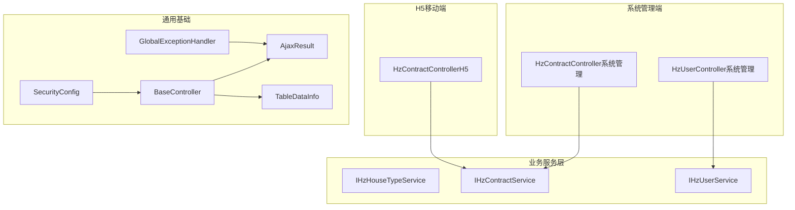
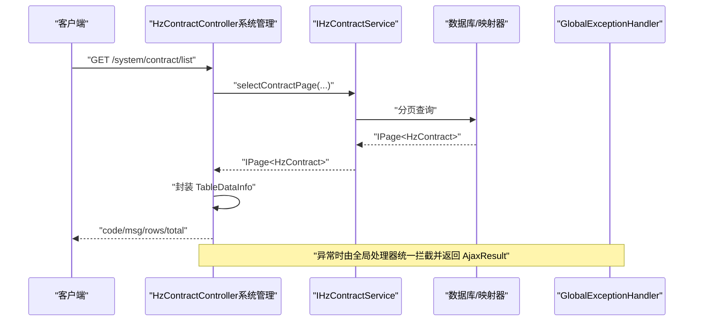
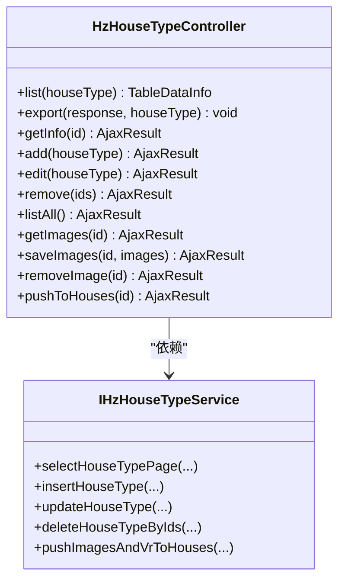
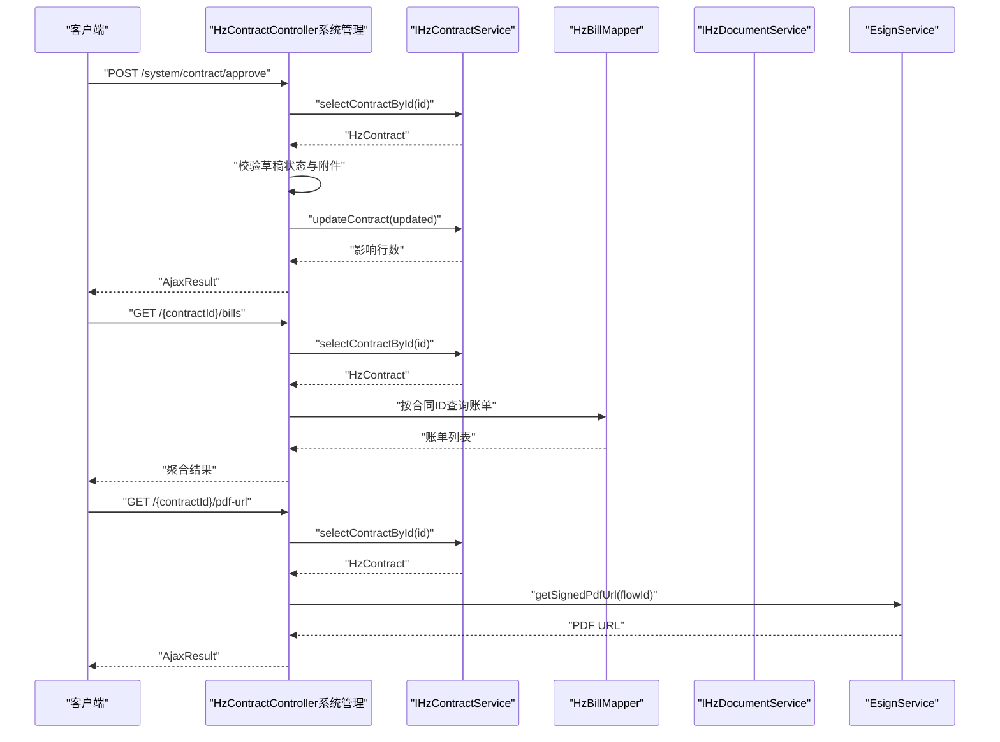
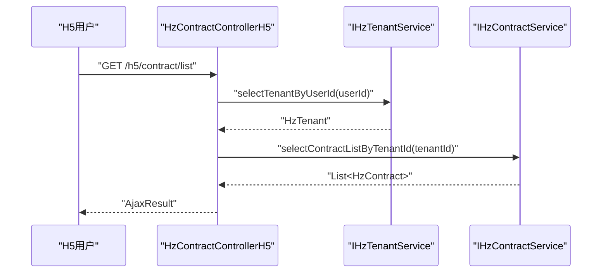
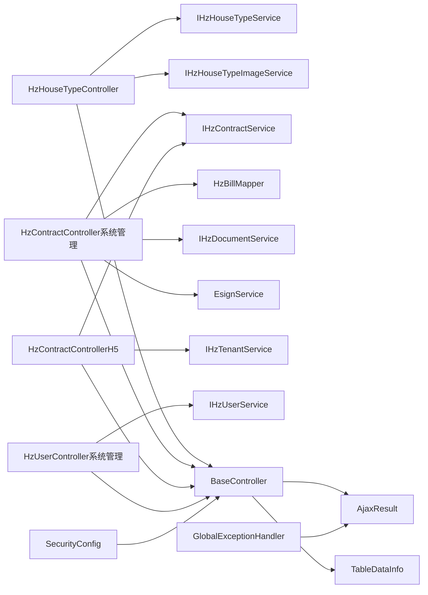

# 控制器层设计

<cite>
**本文引用的文件**   
- [HzHouseTypeController.java](file://ruoyi-system/src/main/java/com/ruoyi/system/controller/HzHouseTypeController.java)
- [HzContractController.java（系统管理）](file://ruoyi-admin/src/main/java/com/ruoyi/web/controller/system/HzContractController.java)
- [HzUserController.java（系统管理）](file://ruoyi-admin/src/main/java/com/ruoyi/web/controller/system/HzUserController.java)
- [HzContractController.java（H5移动端）](file://ruoyi-admin/src/main/java/com/ruoyi/web/controller/h5/HzContractController.java)
- [BaseController.java](file://ruoyi-common/src/main/java/com/ruoyi/common/core/controller/BaseController.java)
- [AjaxResult.java](file://ruoyi-common/src/main/java/com/ruoyi/common/core/domain/AjaxResult.java)
- [TableDataInfo.java](file://ruoyi-common/src/main/java/com/ruoyi/common/core/page/TableDataInfo.java)
- [GlobalExceptionHandler.java](file://ruoyi-framework/src/main/java/com/ruoyi/framework/web/exception/GlobalExceptionHandler.java)
- [SecurityConfig.java](file://ruoyi-framework/src/main/java/com/ruoyi/framework/config/SecurityConfig.java)
- [IHzHouseTypeService.java](file://ruoyi-system/src/main/java/com/ruoyi/system/service/IHzHouseTypeService.java)
- [IHzContractService.java](file://ruoyi-system/src/main/java/com/ruoyi/system/service/IHzContractService.java)
- [IHzUserService.java](file://ruoyi-system/src/main/java/com/ruoyi/system/service/IHzUserService.java)
</cite>

## 目录
1. [引言](#引言)
2. [项目结构](#项目结构)
3. [核心组件](#核心组件)
4. [架构总览](#架构总览)
5. [详细组件分析](#详细组件分析)
6. [依赖分析](#依赖分析)
7. [性能考虑](#性能考虑)
8. [故障排查指南](#故障排查指南)
9. [结论](#结论)
10. [附录](#附录)

## 引言
本文件聚焦港好住信息系统控制器层设计，围绕核心控制器 HzHouseTypeController、HzContractController（系统管理/H5移动端）、HzUserController 的接口设计与实现模式展开，系统性阐述 RESTful 接口设计原则、请求参数验证、响应数据封装、异常处理机制、跨域配置等横切关注点，并对比 H5 移动端与系统管理端控制器的差异与适配策略。同时给出接口文档规范、参数传递方式、返回值格式标准化建议，以及控制器层与业务层的交互模式。

## 项目结构
控制器层位于后端工程的多模块结构中，分别承担系统管理端与 H5 移动端两类不同入口：
- 系统管理端控制器：位于 ruoyi-admin 模块，提供面向运营与管理的完整功能，如合同审核、导出、PDF 预览等。
- H5 移动端控制器：位于 ruoyi-admin 模块的 h5 包，提供移动端轻量化接口，如合同列表、详情、PDF 获取等。
- 通用基础能力：ruoyi-common 提供统一响应体、分页封装、基础控制器；ruoyi-framework 提供安全与全局异常处理、跨域配置等。

图表来源
- [HzContractController.java（系统管理）:36-300](file://ruoyi-admin/src/main/java/com/ruoyi/web/controller/system/HzContractController.java#L36-L300)
- [HzUserController.java（系统管理）:26-106](file://ruoyi-admin/src/main/java/com/ruoyi/web/controller/system/HzUserController.java#L26-L106)
- [HzContractController.java（H5移动端）:19-66](file://ruoyi-admin/src/main/java/com/ruoyi/web/controller/h5/HzContractController.java#L19-L66)
- [BaseController.java:28-209](file://ruoyi-common/src/main/java/com/ruoyi/common/core/controller/BaseController.java#L28-L209)
- [AjaxResult.java:13-217](file://ruoyi-common/src/main/java/com/ruoyi/common/core/domain/AjaxResult.java#L13-L217)
- [TableDataInfo.java:11-86](file://ruoyi-common/src/main/java/com/ruoyi/common/core/page/TableDataInfo.java#L11-L86)
- [GlobalExceptionHandler.java:27-146](file://ruoyi-framework/src/main/java/com/ruoyi/framework/web/exception/GlobalExceptionHandler.java#L27-L146)
- [SecurityConfig.java:27-135](file://ruoyi-framework/src/main/java/com/ruoyi/framework/config/SecurityConfig.java#L27-L135)

章节来源
- [HzHouseTypeController.java:29-209](file://ruoyi-system/src/main/java/com/ruoyi/system/controller/HzHouseTypeController.java#L29-L209)
- [HzContractController.java（系统管理）:36-300](file://ruoyi-admin/src/main/java/com/ruoyi/web/controller/system/HzContractController.java#L36-L300)
- [HzUserController.java（系统管理）:26-106](file://ruoyi-admin/src/main/java/com/ruoyi/web/controller/system/HzUserController.java#L26-L106)
- [HzContractController.java（H5移动端）:19-66](file://ruoyi-admin/src/main/java/com/ruoyi/web/controller/h5/HzContractController.java#L19-L66)
- [BaseController.java:28-209](file://ruoyi-common/src/main/java/com/ruoyi/common/core/controller/BaseController.java#L28-L209)
- [AjaxResult.java:13-217](file://ruoyi-common/src/main/java/com/ruoyi/common/core/domain/AjaxResult.java#L13-L217)
- [TableDataInfo.java:11-86](file://ruoyi-common/src/main/java/com/ruoyi/common/core/page/TableDataInfo.java#L11-L86)
- [GlobalExceptionHandler.java:27-146](file://ruoyi-framework/src/main/java/com/ruoyi/framework/web/exception/GlobalExceptionHandler.java#L27-L146)
- [SecurityConfig.java:27-135](file://ruoyi-framework/src/main/java/com/ruoyi/framework/config/SecurityConfig.java#L27-L135)

## 核心组件
- HzHouseTypeController：负责户型的增删改查、导出、图片管理、批量下发至房源等功能，统一返回 TableDataInfo 或 AjaxResult。
- HzContractController（系统管理）：提供合同列表、导出、详情扩展（账单、资料、PDF 链接）、审核等管理端专属能力。
- HzContractController（H5移动端）：提供移动端用户视角的合同列表、详情、PDF 获取等轻量接口。
- HzUserController（系统管理）：提供用户列表、导出、状态变更、修改、删除等管理端能力。
- BaseController：统一参数绑定、分页、登录用户信息获取、AjaxResult/DataTable 封装等。
- AjaxResult/ TableDataInfo：标准化响应结构，统一 code/msg/data 字段。
- GlobalExceptionHandler：全局异常处理，覆盖权限、参数、业务、未知异常等。
- SecurityConfig：基于方法级鉴权与跨域配置，开放 /h5/** 与 /app/** 等匿名访问路径。

章节来源
- [HzHouseTypeController.java:29-209](file://ruoyi-system/src/main/java/com/ruoyi/system/controller/HzHouseTypeController.java#L29-L209)
- [HzContractController.java（系统管理）:36-300](file://ruoyi-admin/src/main/java/com/ruoyi/web/controller/system/HzContractController.java#L36-L300)
- [HzContractController.java（H5移动端）:19-66](file://ruoyi-admin/src/main/java/com/ruoyi/web/controller/h5/HzContractController.java#L19-L66)
- [HzUserController.java（系统管理）:26-106](file://ruoyi-admin/src/main/java/com/ruoyi/web/controller/system/HzUserController.java#L26-L106)
- [BaseController.java:28-209](file://ruoyi-common/src/main/java/com/ruoyi/common/core/controller/BaseController.java#L28-L209)
- [AjaxResult.java:13-217](file://ruoyi-common/src/main/java/com/ruoyi/common/core/domain/AjaxResult.java#L13-L217)
- [TableDataInfo.java:11-86](file://ruoyi-common/src/main/java/com/ruoyi/common/core/page/TableDataInfo.java#L11-L86)
- [GlobalExceptionHandler.java:27-146](file://ruoyi-framework/src/main/java/com/ruoyi/framework/web/exception/GlobalExceptionHandler.java#L27-L146)
- [SecurityConfig.java:27-135](file://ruoyi-framework/src/main/java/com/ruoyi/framework/config/SecurityConfig.java#L27-L135)

## 架构总览
控制器层遵循“控制器-服务层-数据访问层”的分层设计，控制器仅负责接口编排、参数校验、响应封装与异常兜底，业务逻辑由服务层承担。安全与跨域通过框架配置集中处理，异常通过全局处理器统一返回标准响应。

图表来源
- [HzContractController.java（系统管理）:55-80](file://ruoyi-admin/src/main/java/com/ruoyi/web/controller/system/HzContractController.java#L55-L80)
- [IHzContractService.java:64-71](file://ruoyi-system/src/main/java/com/ruoyi/system/service/IHzContractService.java#L64-L71)
- [GlobalExceptionHandler.java:58-64](file://ruoyi-framework/src/main/java/com/ruoyi/framework/web/exception/GlobalExceptionHandler.java#L58-L64)

## 详细组件分析

### HzHouseTypeController（户型控制器）
- 设计要点
  - RESTful 资源路径：/gangzhu/houseType
  - 支持列表查询、导出、详情、新增、修改、删除、图片列表、批量保存图片、删除图片、批量下发图片与VR至房源等。
  - 分页采用 PageUtils 获取当前页与大小，返回 TableDataInfo；成功/失败统一使用 AjaxResult.success/error。
  - 图片管理与户型主数据分离，通过 IHzHouseTypeImageService 协作。
- 参数与返回
  - GET /list：查询条件对象作为路径参数，返回 TableDataInfo。
  - POST /export：导出 Excel，无返回体。
  - GET /{houseTypeId}：返回 AjaxResult。
  - POST/PUT/DELETE：新增/修改/删除，返回 AjaxResult。
  - GET /listAll：返回 AjaxResult，remark 临时拼接详情描述。
  - GET /{houseTypeId}/images、POST /{houseTypeId}/images、DELETE /images/{imageId}：图片管理。
  - POST /{houseTypeId}/pushToHouses：批量下发统计结果。
- 横切关注点
  - 权限注解：@PreAuthorize 标注各接口所需权限。
  - 日志注解：@Log 记录业务类型。
  - 响应封装：success()/toAjax() 统一返回 AjaxResult。
- 与服务层交互
  - IHzHouseTypeService：分页查询、CRUD、批量下发。
  - IHzHouseTypeImageService：图片查询、批量保存、删除。

图表来源
- [HzHouseTypeController.java:29-209](file://ruoyi-system/src/main/java/com/ruoyi/system/controller/HzHouseTypeController.java#L29-L209)
- [IHzHouseTypeService.java:16-86](file://ruoyi-system/src/main/java/com/ruoyi/system/service/IHzHouseTypeService.java#L16-L86)

章节来源
- [HzHouseTypeController.java:39-208](file://ruoyi-system/src/main/java/com/ruoyi/system/controller/HzHouseTypeController.java#L39-L208)
- [IHzHouseTypeService.java:16-86](file://ruoyi-system/src/main/java/com/ruoyi/system/service/IHzHouseTypeService.java#L16-L86)

### HzContractController（系统管理）——合同管理
- 设计要点
  - RESTful 资源路径：/system/contract
  - 支持列表、导出、详情、新增、修改、删除、审核、e签宝模板组件查询、合同账单与资料查询、PDF 链接获取等。
  - 审核流程包含前置校验（草稿状态、存在性），更新状态与附件。
  - PDF 链接支持实时刷新 e签宝临时链接，兼容旧数据直接为 URL 的情况。
- 参数与返回
  - GET /list：TableSupport 构建分页，返回 TableDataInfo。
  - POST /export：导出 Excel。
  - GET /{contractId}：返回 AjaxResult。
  - POST /approve：审核接口，返回 AjaxResult。
  - GET /{contractId}/bills：返回账单明细聚合。
  - GET /{contractId}/documents：返回资料列表。
  - GET /{contractId}/pdf-url：返回 PDF 链接或错误提示。
- 横切关注点
  - 权限注解：@PreAuthorize 标注各接口所需权限。
  - 日志注解：@Log 记录业务类型。
  - 全局异常：由 GlobalExceptionHandler 统一处理。
- 与服务层交互
  - IHzContractService：合同 CRUD、分页、生成编号、原子锁定创建、失效释放。
  - HzBillMapper：账单查询。
  - IHzDocumentService：资料查询。
  - EsignService：e签宝模板与PDF链接。

图表来源
- [HzContractController.java（系统管理）:144-298](file://ruoyi-admin/src/main/java/com/ruoyi/web/controller/system/HzContractController.java#L144-L298)
- [IHzContractService.java:13-120](file://ruoyi-system/src/main/java/com/ruoyi/system/service/IHzContractService.java#L13-L120)

章节来源
- [HzContractController.java（系统管理）:55-298](file://ruoyi-admin/src/main/java/com/ruoyi/web/controller/system/HzContractController.java#L55-L298)
- [IHzContractService.java:13-120](file://ruoyi-system/src/main/java/com/ruoyi/system/service/IHzContractService.java#L13-L120)

### HzContractController（H5移动端）——合同管理
- 设计要点
  - RESTful 资源路径：/h5/contract
  - 面向移动端用户，提供合同列表、详情、PDF 获取等轻量接口。
  - 通过租户维度查询合同列表，需先完善租户信息。
- 参数与返回
  - GET /list：根据登录用户对应的租户查询合同列表。
  - GET /{contractId}：合同详情。
  - GET /pdf/{contractId}：返回合同文件URL。
- 与服务层交互
  - IHzContractService：合同查询。
  - IHzTenantService：租户查询。

图表来源
- [HzContractController.java（H5移动端）:32-43](file://ruoyi-admin/src/main/java/com/ruoyi/web/controller/h5/HzContractController.java#L32-L43)

章节来源
- [HzContractController.java（H5移动端）:32-64](file://ruoyi-admin/src/main/java/com/ruoyi/web/controller/h5/HzContractController.java#L32-L64)

### HzUserController（系统管理）——用户管理
- 设计要点
  - RESTful 资源路径：/gangzhu/user
  - 支持用户列表（真正数据库分页）、导出、详情、状态变更、修改、删除。
  - 严格校验用户ID，避免误操作。
- 参数与返回
  - GET /list：分页查询，返回 TableDataInfo。
  - POST /export：导出 Excel。
  - GET /{userId}：详情。
  - PUT /changeStatus：状态变更。
  - PUT：修改用户信息。
  - DELETE /{userIds}：批量删除。
- 与服务层交互
  - IHzUserService：用户 CRUD、分页、登录/注册、按手机号查询等。

章节来源
- [HzUserController.java（系统管理）:36-103](file://ruoyi-admin/src/main/java/com/ruoyi/web/controller/system/HzUserController.java#L36-L103)
- [IHzUserService.java:14-109](file://ruoyi-system/src/main/java/com/ruoyi/system/service/IHzUserService.java#L14-L109)

### BaseController、AjaxResult、TableDataInfo 与全局异常处理
- BaseController
  - 提供日期类型绑定、分页工具、登录用户信息获取、统一 success/error/toAjax 封装。
  - 通过继承 BaseController，控制器可直接使用统一的响应与分页能力。
- AjaxResult
  - 统一响应结构：code/msg/data，支持 success/warn/error 多种工厂方法。
- TableDataInfo
  - 分页响应载体：total/rows/code/msg，便于表格渲染。
- GlobalExceptionHandler
  - 覆盖权限不足、请求方式不支持、业务异常、参数缺失、类型不匹配、运行时异常、未知异常、参数绑定与校验异常、演示模式等。
  - 返回统一 AjaxResult，确保前后端一致的错误提示。

章节来源
- [BaseController.java:28-209](file://ruoyi-common/src/main/java/com/ruoyi/common/core/controller/BaseController.java#L28-L209)
- [AjaxResult.java:13-217](file://ruoyi-common/src/main/java/com/ruoyi/common/core/domain/AjaxResult.java#L13-L217)
- [TableDataInfo.java:11-86](file://ruoyi-common/src/main/java/com/ruoyi/common/core/page/TableDataInfo.java#L11-L86)
- [GlobalExceptionHandler.java:27-146](file://ruoyi-framework/src/main/java/com/ruoyi/framework/web/exception/GlobalExceptionHandler.java#L27-L146)

### 安全与跨域配置
- SecurityConfig
  - 方法级鉴权启用：@PreAuthorize/@Secured。
  - 开放匿名访问路径：/h5/**、/app/**、/common/upload、静态资源、Swagger/Druid 等。
  - JWT 过滤器与 CORS 过滤器顺序：先 CORS 再 JWT，确保跨域与鉴权正确叠加。
  - Session 策略：STATELESS，配合 JWT。
- 横切关注点
  - 权限注解与安全链路结合，确保接口访问受控。
  - 跨域配置与 H5 移动端直连场景适配。

章节来源
- [SecurityConfig.java:27-135](file://ruoyi-framework/src/main/java/com/ruoyi/framework/config/SecurityConfig.java#L27-L135)

## 依赖分析
- 控制器与服务层
  - HzHouseTypeController 依赖 IHzHouseTypeService 与 IHzHouseTypeImageService。
  - HzContractController（系统管理）依赖 IHzContractService、HzBillMapper、IHzDocumentService、EsignService。
  - HzContractController（H5）依赖 IHzContractService、IHzTenantService。
  - HzUserController 依赖 IHzUserService。
- 控制器与基础层
  - 继承 BaseController，复用 AjaxResult/ TableDataInfo/ 分页工具。
- 全局异常与安全
  - GlobalExceptionHandler 统一拦截异常，SecurityConfig 统一鉴权与跨域。

图表来源
- [HzHouseTypeController.java:33-37](file://ruoyi-system/src/main/java/com/ruoyi/system/controller/HzHouseTypeController.java#L33-L37)
- [HzContractController.java（系统管理）:40-50](file://ruoyi-admin/src/main/java/com/ruoyi/web/controller/system/HzContractController.java#L40-L50)
- [HzContractController.java（H5移动端）:23-27](file://ruoyi-admin/src/main/java/com/ruoyi/web/controller/h5/HzContractController.java#L23-L27)
- [HzUserController.java（系统管理）:30-31](file://ruoyi-admin/src/main/java/com/ruoyi/web/controller/system/HzUserController.java#L30-L31)
- [BaseController.java:28](file://ruoyi-common/src/main/java/com/ruoyi/common/core/controller/BaseController.java#L28)
- [AjaxResult.java:13](file://ruoyi-common/src/main/java/com/ruoyi/common/core/domain/AjaxResult.java#L13)
- [TableDataInfo.java:11](file://ruoyi-common/src/main/java/com/ruoyi/common/core/page/TableDataInfo.java#L11)
- [SecurityConfig.java:27](file://ruoyi-framework/src/main/java/com/ruoyi/framework/config/SecurityConfig.java#L27)
- [GlobalExceptionHandler.java:27](file://ruoyi-framework/src/main/java/com/ruoyi/framework/web/exception/GlobalExceptionHandler.java#L27)

章节来源
- [HzHouseTypeController.java:33-37](file://ruoyi-system/src/main/java/com/ruoyi/system/controller/HzHouseTypeController.java#L33-L37)
- [HzContractController.java（系统管理）:40-50](file://ruoyi-admin/src/main/java/com/ruoyi/web/controller/system/HzContractController.java#L40-L50)
- [HzContractController.java（H5移动端）:23-27](file://ruoyi-admin/src/main/java/com/ruoyi/web/controller/h5/HzContractController.java#L23-L27)
- [HzUserController.java（系统管理）:30-31](file://ruoyi-admin/src/main/java/com/ruoyi/web/controller/system/HzUserController.java#L30-L31)
- [BaseController.java:28](file://ruoyi-common/src/main/java/com/ruoyi/common/core/controller/BaseController.java#L28)
- [AjaxResult.java:13](file://ruoyi-common/src/main/java/com/ruoyi/common/core/domain/AjaxResult.java#L13)
- [TableDataInfo.java:11](file://ruoyi-common/src/main/java/com/ruoyi/common/core/page/TableDataInfo.java#L11)
- [SecurityConfig.java:27](file://ruoyi-framework/src/main/java/com/ruoyi/framework/config/SecurityConfig.java#L27)
- [GlobalExceptionHandler.java:27](file://ruoyi-framework/src/main/java/com/ruoyi/framework/web/exception/GlobalExceptionHandler.java#L27)

## 性能考虑
- 分页查询
  - 管理端列表页使用 PageUtils/ TableSupport 真正走数据库分页，避免全表扫描导致前端超时。
- 响应封装
  - AjaxResult/ TableDataInfo 统一封装，减少重复序列化与字段遗漏。
- 业务优化
  - HzHouseTypeController 的 listAll 接口在内存中拼接 remark 描述，注意数据量较大时的性能影响，必要时改为数据库侧拼接或缓存。
- 异常处理
  - 全局异常处理器统一拦截，避免异常穿透导致的响应不一致与日志丢失。

## 故障排查指南
- 权限不足
  - 现象：返回 403 并提示“没有权限，请联系管理员授权”。
  - 排查：确认接口权限注解与用户角色/菜单配置。
- 参数缺失或类型不匹配
  - 现象：返回参数缺失或类型不匹配提示。
  - 排查：检查路径变量、请求体类型与必填字段。
- 业务异常
  - 现象：抛出 ServiceException，返回自定义错误码与消息。
  - 排查：查看服务层业务规则与数据状态。
- 未知异常
  - 现象：返回通用错误消息。
  - 排查：查看全局异常日志定位具体异常栈。

章节来源
- [GlobalExceptionHandler.java:35-144](file://ruoyi-framework/src/main/java/com/ruoyi/framework/web/exception/GlobalExceptionHandler.java#L35-L144)

## 结论
港好住信息系统控制器层遵循清晰的分层与契约设计，通过 BaseController 统一响应与分页，AjaxResult/ TableDataInfo 规范化输出，结合 SecurityConfig 与 GlobalExceptionHandler 实现安全与异常治理。HzHouseTypeController、HzContractController（系统管理/H5移动端）、HzUserController 在职责边界、参数校验、响应封装与权限控制上保持一致的实现风格，既满足系统管理端的复杂业务，又兼顾 H5 移动端的轻量化需求。

## 附录

### 接口文档规范与参数传递方式
- 路径与方法
  - 系统管理端：/system/contract、/gangzhu/user、/gangzhu/houseType
  - H5 移动端：/h5/contract
- 参数传递
  - 查询参数：GET 路径参数或表单参数。
  - 分页参数：page、limit 或 pageNum/pageSize（依据 TableSupport/ PageUtils）。
  - 请求体：POST/PUT 请求体 JSON。
- 返回值格式
  - 成功：AjaxResult.success(data)/success("msg", data) 或 TableDataInfo（分页）。
  - 失败：AjaxResult.error("msg")。
  - 警告：AjaxResult.warn("msg")。
- 权限与日志
  - 使用 @PreAuthorize 标注权限。
  - 使用 @Log 标注业务类型与标题。

章节来源
- [HzContractController.java（系统管理）:55-80](file://ruoyi-admin/src/main/java/com/ruoyi/web/controller/system/HzContractController.java#L55-L80)
- [HzUserController.java（系统管理）:36-49](file://ruoyi-admin/src/main/java/com/ruoyi/web/controller/system/HzUserController.java#L36-L49)
- [HzHouseTypeController.java:42-55](file://ruoyi-system/src/main/java/com/ruoyi/system/controller/HzHouseTypeController.java#L42-L55)
- [AjaxResult.java:67-103](file://ruoyi-common/src/main/java/com/ruoyi/common/core/domain/AjaxResult.java#L67-L103)
- [TableDataInfo.java:40-44](file://ruoyi-common/src/main/java/com/ruoyi/common/core/page/TableDataInfo.java#L40-L44)