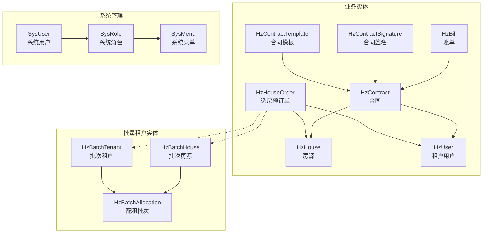
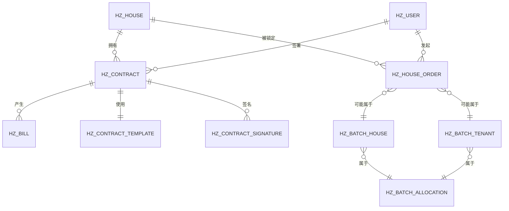
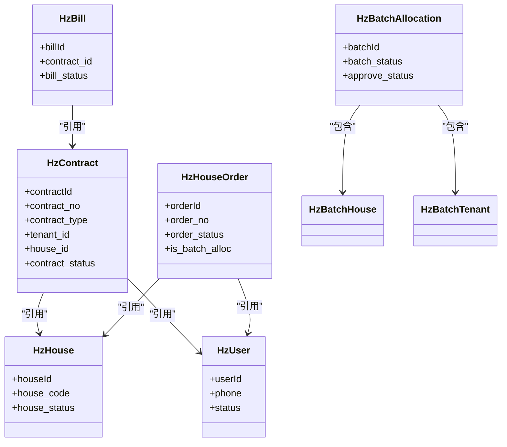

# 数据模型设计

<cite>
**本文引用的文件**
- [HzHouse.java](file://ruoyi-system/src/main/java/com/ruoyi/system/domain/HzHouse.java)
- [HzContract.java](file://ruoyi-system/src/main/java/com/ruoyi/system/domain/HzContract.java)
- [HzUser.java](file://ruoyi-system/src/main/java/com/ruoyi/system/domain/HzUser.java)
- [HzBill.java](file://ruoyi-system/src/main/java/com/ruoyi/system/domain/HzBill.java)
- [HzHouseOrder.java](file://ruoyi-system/src/main/java/com/ruoyi/system/domain/HzHouseOrder.java)
- [HzContractSignature.java](file://ruoyi-system/src/main/java/com/ruoyi/system/domain/HzContractSignature.java)
- [HzContractTemplate.java](file://ruoyi-system/src/main/java/com/ruoyi/system/domain/HzContractTemplate.java)
- [HzBatchAllocation.java](file://ruoyi-system/src/main/java/com/ruoyi/system/domain/HzBatchAllocation.java)
- [HzBatchHouse.java](file://ruoyi-system/src/main/java/com/ruoyi/system/domain/HzBatchHouse.java)
- [HzBatchTenant.java](file://ruoyi-system/src/main/java/com/ruoyi/system/domain/HzBatchTenant.java)
- [SysUser.java](file://ruoyi-common/src/main/java/com/ruoyi/common/core/domain/entity/SysUser.java)
- [SysRole.java](file://ruoyi-common/src/main/java/com/ruoyi/common/core/domain/entity/SysRole.java)
- [SysMenu.java](file://ruoyi-common/src/main/java/com/ruoyi/common/core/domain/entity/SysMenu.java)
</cite>

## 目录
1. [引言](#引言)
2. [项目结构](#项目结构)
3. [核心业务实体](#核心业务实体)
4. [架构总览](#架构总览)
5. [详细组件分析](#详细组件分析)
6. [依赖关系分析](#依赖关系分析)
7. [性能与扩展性考量](#性能与扩展性考量)
8. [故障排查与运维建议](#故障排查与运维建议)
9. [结论](#结论)
10. [附录：字段与约束对照表](#附录字段与约束对照表)

## 引言
本文件面向港好住信息系统，系统化梳理并阐释数据模型设计，重点覆盖核心业务实体（房源、合同、用户、账单等）与系统管理实体（用户、角色、菜单等）的字段定义、数据类型、约束条件、业务规则、关系映射、主键生成策略、数据校验与枚举使用、以及实体生命周期管理。文档旨在帮助开发者与产品/运营人员快速理解与落地实现。

## 项目结构
围绕"业务实体 + 系统管理 + 权限控制"的分层组织，数据模型主要分布在：
- 业务域：ruoyi-system 模块下的 domain 包，承载 Hz* 实体
- 系统域：ruoyi-common 模块下的 entity 包，承载 Sys* 实体
- 权限控制：基于 SysUser/SysRole/SysMenu 的角色-菜单-权限矩阵

**更新** 新增批量租户相关实体，支持企业批量租户分配场景

图表来源
- [HzHouse.java:1-441](file://ruoyi-system/src/main/java/com/ruoyi/system/domain/HzHouse.java#L1-L441)
- [HzContract.java:1-606](file://ruoyi-system/src/main/java/com/ruoyi/system/domain/HzContract.java#L1-L606)
- [HzUser.java:1-375](file://ruoyi-system/src/main/java/com/ruoyi/system/domain/HzUser.java#L1-L375)
- [HzBill.java:1-354](file://ruoyi-system/src/main/java/com/ruoyi/system/domain/HzBill.java#L1-L354)
- [HzHouseOrder.java:1-144](file://ruoyi-system/src/main/java/com/ruoyi/system/domain/HzHouseOrder.java#L1-L144)
- [HzContractSignature.java:1-174](file://ruoyi-system/src/main/java/com/ruoyi/system/domain/HzContractSignature.java#L1-L174)
- [HzContractTemplate.java:1-228](file://ruoyi-system/src/main/java/com/ruoyi/system/domain/HzContractTemplate.java#L1-L228)
- [HzBatchAllocation.java:1-332](file://ruoyi-system/src/main/java/com/ruoyi/system/domain/HzBatchAllocation.java#L1-L332)
- [HzBatchHouse.java:1-121](file://ruoyi-system/src/main/java/com/ruoyi/system/domain/HzBatchHouse.java#L1-L121)
- [HzBatchTenant.java:1-157](file://ruoyi-system/src/main/java/com/ruoyi/system/domain/HzBatchTenant.java#L1-L157)
- [SysUser.java:1-339](file://ruoyi-common/src/main/java/com/ruoyi/common/core/domain/entity/SysUser.java#L1-L339)
- [SysRole.java:1-242](file://ruoyi-common/src/main/java/com/ruoyi/common/core/domain/entity/SysRole.java#L1-L242)
- [SysMenu.java:1-275](file://ruoyi-common/src/main/java/com/ruoyi/common/core/domain/entity/SysMenu.java#L1-L275)

章节来源
- [HzHouse.java:1-441](file://ruoyi-system/src/main/java/com/ruoyi/system/domain/HzHouse.java#L1-L441)
- [HzContract.java:1-606](file://ruoyi-system/src/main/java/com/ruoyi/system/domain/HzContract.java#L1-L606)
- [HzUser.java:1-375](file://ruoyi-system/src/main/java/com/ruoyi/system/domain/HzUser.java#L1-L375)
- [HzBill.java:1-354](file://ruoyi-system/src/main/java/com/ruoyi/system/domain/HzBill.java#L1-L354)
- [HzHouseOrder.java:1-144](file://ruoyi-system/src/main/java/com/ruoyi/system/domain/HzHouseOrder.java#L1-L144)
- [HzContractSignature.java:1-174](file://ruoyi-system/src/main/java/com/ruoyi/system/domain/HzContractSignature.java#L1-L174)
- [HzContractTemplate.java:1-228](file://ruoyi-system/src/main/java/com/ruoyi/system/domain/HzContractTemplate.java#L1-L228)
- [HzBatchAllocation.java:1-332](file://ruoyi-system/src/main/java/com/ruoyi/system/domain/HzBatchAllocation.java#L1-L332)
- [HzBatchHouse.java:1-121](file://ruoyi-system/src/main/java/com/ruoyi/system/domain/HzBatchHouse.java#L1-L121)
- [HzBatchTenant.java:1-157](file://ruoyi-system/src/main/java/com/ruoyi/system/domain/HzBatchTenant.java#L1-L157)
- [SysUser.java:1-339](file://ruoyi-common/src/main/java/com/ruoyi/common/core/domain/entity/SysUser.java#L1-L339)
- [SysRole.java:1-242](file://ruoyi-common/src/main/java/com/ruoyi/common/core/domain/entity/SysRole.java#L1-L242)
- [SysMenu.java:1-275](file://ruoyi-common/src/main/java/com/ruoyi/common/core/domain/entity/SysMenu.java#L1-L275)

## 核心业务实体
本节聚焦 Hz* 实体的字段、类型、约束与业务规则，帮助快速掌握数据模型。

- 房源（HzHouse）
  - 主键：houseId（自增）
  - 关键字段：project_id/building_id/unit_id、house_code/house_no、house_type_id/name、area/rent_price/deposit、house_status/is_featured/allocation_type/is_fresh_graduate、manager_phone/status 等
  - 业务规则：house_status 取值映射到"空置/已预订/已出租/维修中/下架"；allocation_type 表示分配类型；is_fresh_graduate 标识应届生房源
  - 字段类型：Long/Integer/BigDecimal/String；部分字段标注 Excel 导入提示
  - 生命周期：通过 status 控制启用/停用；导入导出通过注解驱动

- 合同（HzContract）
  - 主键：contractId（自增）
  - 关联字段：tenant_id、house_id、project_id、batch_id、template_id
  - 关键字段：contract_no、contract_type、rent_price/deposit、start_date/end_date、rent_months、payment_cycle/payment_day、contract_status/is_renewed/renewed_contract_id、esign_flow_id、del_flag
  - 业务规则：contract_status 映射"草稿/待签署/已签署/履行中/已到期/已解约"；支持续租与换房；含来自房源的派生字段（项目/楼栋/单元/房间号/面积等）
  - 字段类型：Long/Integer/BigDecimal/String；大量 Excel 注解用于导入导出

- 租户用户（HzUser）
  - 主键：userId（自增）
  - 关键字段：phone/contactPhone/sourceType/wechatOpenid/wechatUnionid/zhaohaoUserId、realName/gender/idCard、education/identityType/workUnit、unitContact/unitNature/spouseName、workProofAttachment、status、lastLoginTime/lastLoginIp、delFlag、loginType/isInfoCompleted、esignPsnId/authStatus/authTime
  - 业务规则：身份类型/单位性质等通过字典映射；认证状态与实名时间记录；登录类型区分来源渠道
  - 字段类型：String/Date/Long；部分字段带字典类型注解

- 账单（HzBill）
  - 主键：billId（自增）
  - 关联字段：contract_id/tenant_id/house_id/order_no
  - 关键字段：bill_no/bill_type/bill_period/bill_amount/paid_amount/unpaid_amount、bill_date/due_date、late_fee、bill_status/invoice_status、pay_time/pay_method/transaction_no、is_overdue/overdue_days、del_flag
  - 业务规则：bill_status 映射"待支付/已支付/部分支付/已逾期/已关闭"；is_overdue/overdue_days 记录逾期状态；order_no 用于支付回调反查
  - 字段类型：Long/Integer/BigDecimal/String；大量 Excel 注解

- 选房预订单（HzHouseOrder）
  - 主键：orderId（自增）
  - 关联字段：tenant_id/house_id/project_id/contract_id/deposit_bill_id/batch_id
  - 关键字段：order_no、deposit_amount、rent_price、lock_expire_time、doc_upload_expire_time、order_status、esign_flow_id、is_batch_alloc、del_flag
  - 业务规则：order_status 映射"待签约/待付押金/待上传资料/已完成/已过期/已取消"；支持逻辑删除；提供 remainSeconds/docRemainSeconds 等派生字段；**新增批量租户标识字段 is_batch_alloc**
  - 字段类型：Long/BigDecimal/Date/String；逻辑删除注解

- 合同签名（HzContractSignature）
  - 主键：signatureId（自增）
  - 关联字段：contract_id/signer_id
  - 关键字段：signer_name/signer_type/signature_image/sign_time/ip_address/device_info/sign_status/del_flag
  - 业务规则：signer_type 映射"租户/房东/管理员"；sign_status 记录签署状态
  - 字段类型：Long/String

- 合同模板（HzContractTemplate）
  - 主键：templateId（自增）
  - 关键字段：template_name/template_code、contract_type、template_content、payment_cycle、contract_duration、deposit_months/deposit_amount、penalty_rate/penalty_amount、version、is_default/status/del_flag
  - 业务规则：按合同类型分类；支持默认模板；版本号管理
  - 字段类型：Long/Integer/BigDecimal/String

**更新** 新增批量租户相关实体，支持企业批量租户分配场景

- 批配租批次（HzBatchAllocation）
  - 主键：batchId（自增）
  - 关键字段：batch_no/batch_name、enterprise_id/enterprise_name、contact_person/contact_phone、project_id/project_ids、talent_type、entry_start_date/entry_end_date、approve_status/batch_status、house_count/allocated_count、preferential_type/free_rent_periods
  - 业务规则：支持普通人才和定向人才两类；包含审批状态和批次状态管理；支持优惠策略配置
  - 字段类型：Long/String/Date/Integer

- 批次房源（HzBatchHouse）
  - 主键：id（自增）
  - 关联字段：batchId/houseId、houseCode
  - 关键字段：allocationStatus、tenantId、allocationTime、delFlag
  - 业务规则：管理批次与房源的分配关系；支持分配状态跟踪
  - 字段类型：Long/String/Date

- 批次租户（HzBatchTenant）
  - 主键：id（自增）
  - 关联字段：batchId、houseId
  - 关键字段：tenantName/idCard/phone/workNo/deptName、allocationStatus、allocationTime、delFlag
  - 业务规则：管理批次与租户的分配关系；包含基本信息和分配状态
  - 字段类型：Long/String/Date

章节来源
- [HzHouse.java:1-441](file://ruoyi-system/src/main/java/com/ruoyi/system/domain/HzHouse.java#L1-L441)
- [HzContract.java:1-606](file://ruoyi-system/src/main/java/com/ruoyi/system/domain/HzContract.java#L1-L606)
- [HzUser.java:1-375](file://ruoyi-system/src/main/java/com/ruoyi/system/domain/HzUser.java#L1-L375)
- [HzBill.java:1-354](file://ruoyi-system/src/main/java/com/ruoyi/system/domain/HzBill.java#L1-L354)
- [HzHouseOrder.java:1-144](file://ruoyi-system/src/main/java/com/ruoyi/system/domain/HzHouseOrder.java#L1-L144)
- [HzContractSignature.java:1-174](file://ruoyi-system/src/main/java/com/ruoyi/system/domain/HzContractSignature.java#L1-L174)
- [HzContractTemplate.java:1-228](file://ruoyi-system/src/main/java/com/ruoyi/system/domain/HzContractTemplate.java#L1-L228)
- [HzBatchAllocation.java:1-332](file://ruoyi-system/src/main/java/com/ruoyi/system/domain/HzBatchAllocation.java#L1-L332)
- [HzBatchHouse.java:1-121](file://ruoyi-system/src/main/java/com/ruoyi/system/domain/HzBatchHouse.java#L1-L121)
- [HzBatchTenant.java:1-157](file://ruoyi-system/src/main/java/com/ruoyi/system/domain/HzBatchTenant.java#L1-L157)

## 架构总览
从实体关系角度，系统采用"订单-合同-账单-用户-房源"的闭环设计，配合"模板-签名-批次"的支撑能力，形成完整的租住生命周期数据流。**新增批量租户分配机制，支持企业批量租户的统一管理和分配**。

**更新** 新增批量租户实体关系，支持企业批量租户分配场景

图表来源
- [HzHouse.java:1-441](file://ruoyi-system/src/main/java/com/ruoyi/system/domain/HzHouse.java#L1-L441)
- [HzContract.java:1-606](file://ruoyi-system/src/main/java/com/ruoyi/system/domain/HzContract.java#L1-L606)
- [HzUser.java:1-375](file://ruoyi-system/src/main/java/com/ruoyi/system/domain/HzUser.java#L1-L375)
- [HzBill.java:1-354](file://ruoyi-system/src/main/java/com/ruoyi/system/domain/HzBill.java#L1-L354)
- [HzHouseOrder.java:1-144](file://ruoyi-system/src/main/java/com/ruoyi/system/domain/HzHouseOrder.java#L1-L144)
- [HzContractSignature.java:1-174](file://ruoyi-system/src/main/java/com/ruoyi/system/domain/HzContractSignature.java#L1-L174)
- [HzContractTemplate.java:1-228](file://ruoyi-system/src/main/java/com/ruoyi/system/domain/HzContractTemplate.java#L1-L228)
- [HzBatchAllocation.java:1-332](file://ruoyi-system/src/main/java/com/ruoyi/system/domain/HzBatchAllocation.java#L1-L332)
- [HzBatchHouse.java:1-121](file://ruoyi-system/src/main/java/com/ruoyi/system/domain/HzBatchHouse.java#L1-L121)
- [HzBatchTenant.java:1-157](file://ruoyi-system/src/main/java/com/ruoyi/system/domain/HzBatchTenant.java#L1-L157)

## 详细组件分析

### 房源（HzHouse）设计要点
- 主键生成：自增 ID（IdType.AUTO）
- 关键字段与业务含义
  - 项目/楼栋/单元维度：project_id/building_id/unit_id
  - 房源标识：house_code/house_no
  - 户型与面积：house_type_id/name、area
  - 价格与押金：rent_price/deposit
  - 状态与展示：house_status/is_featured/allocation_type/is_fresh_graduate
  - 其他：floor/orientation/decoration/facilities/manager_phone/status/view_count
- 导入导出：Excel 注解用于导入提示与读取转换
- 业务规则
  - house_status 与 allocation_type 作为业务开关与状态机
  - is_fresh_graduate 用于政策倾斜或营销策略
- 复杂度与性能
  - 查询常以项目/楼栋/单元/状态过滤，建议在上述字段建立索引
  - 导入流程可利用注解进行字段校验与转换

章节来源
- [HzHouse.java:1-441](file://ruoyi-system/src/main/java/com/ruoyi/system/domain/HzHouse.java#L1-L441)

### 合同（HzContract）设计要点
- 主键生成：自增 ID（IdType.AUTO）
- 关联与派生
  - 关联：tenant_id/house_id/project_id/batch_id/template_id
  - 派生：来自房源/批次的项目/楼栋/单元/房间号/面积等字段（非持久化）
- 关键字段与业务含义
  - 合同编号/类型/模板/批次
  - 租户信息：tenant_name/tenant_id_card/tenant_phone
  - 房源信息：house_code/house_address
  - 价格与周期：rent_price/deposit/start_date/end_date/rent_months/payment_cycle/payment_day/free_rent_periods
  - 签署与状态：contract_content/contract_file/tenant_signature/landlord_signature/sign_time/contract_status/is_renewed/renewed_contract_id/esign_flow_id/del_flag
- 业务规则
  - contract_status 作为合同全生命周期状态机
  - 支持续租与换房场景
  - 电子签集成（esign_flow_id）
- 复杂度与性能
  - 多表派生字段减少重复存储，但查询时需注意跨表关联成本
  - 建议在 tenant_id/house_id/project_id 上建立索引

章节来源
- [HzContract.java:1-606](file://ruoyi-system/src/main/java/com/ruoyi/system/domain/HzContract.java#L1-L606)

### 租户用户（HzUser）设计要点
- 主键生成：自增 ID（IdType.AUTO）
- 关键字段与业务含义
  - 登录与来源：phone/sourceType/wechatOpenid/wechatUnionid/zhaohaoUserId/loginType
  - 基本信息：realName/gender/idCard/nickname/avatar
  - 教育与身份：education/identityType/workUnit/unitContact/unitNature/spouseName
  - 认证与状态：workProofAttachment/status/authStatus/authTime
  - 登录行为：lastLoginTime/lastLoginIp/delFlag/isInfoCompleted/esignPsnId
- 业务规则
  - 身份类型/单位性质通过字典映射
  - 认证状态与实名时间记录，便于合规审计
- 复杂度与性能
  - 字段较多，建议按登录/认证/基础信息分组查询
  - 唯一性可通过登录账号/第三方 OpenID 维护

章节来源
- [HzUser.java:1-375](file://ruoyi-system/src/main/java/com/ruoyi/system/domain/HzUser.java#L1-L375)

### 账单（HzBill）设计要点
- 主键生成：自增 ID（IdType.AUTO）
- 关联与派生
  - 关联：contract_id/tenant_id/house_id/order_no
  - 派生：tenant_name/house_code（非持久化）
- 关键字段与业务含义
  - 类型与周期：bill_type/bill_period
  - 金额：bill_amount/paid_amount/unpaid_amount/late_fee
  - 时间：bill_date/due_date/pay_time
  - 状态：bill_status/invoice_status/is_overdue/overdue_days
  - 支付：pay_method/transaction_no/del_flag
- 业务规则
  - bill_status 作为账单生命周期状态机
  - is_overdue/overdue_days 用于逾期管理
  - order_no 用于支付回调反查
- 复杂度与性能
  - 与合同强关联，查询时建议按合同维度聚合
  - 逾期统计可基于 is_overdue/overdue_days 聚合

章节来源
- [HzBill.java:1-354](file://ruoyi-system/src/main/java/com/ruoyi/system/domain/HzBill.java#L1-L354)

### 选房预订单（HzHouseOrder）设计要点
- 主键生成：自增 ID（IdType.AUTO）
- 关联与派生
  - 关联：tenant_id/house_id/project_id/contract_id/deposit_bill_id/batch_id
  - 派生：remainSeconds/docRemainSeconds（非持久化）
- 关键字段与业务含义
  - 订单号/金额：order_no/deposit_amount/rent_price
  - 过期时间：lock_expire_time/doc_upload_expire_time
  - 状态：order_status/is_batch_alloc/del_flag
  - 电子签：esign_flow_id
- 业务规则
  - order_status 作为订单生命周期状态机
  - 支持逻辑删除（del_flag）
  - 提供剩余秒数派生字段辅助前端交互
  - **新增批量租户标识字段 is_batch_alloc，用于区分批量租户订单**
- 复杂度与性能
  - 过期时间字段用于定时任务清理
  - 建议在 tenant_id/house_id/order_status 上建立索引

**更新** 新增批量租户标识字段 is_batch_alloc，用于区分批量租户订单

章节来源
- [HzHouseOrder.java:1-144](file://ruoyi-system/src/main/java/com/ruoyi/system/domain/HzHouseOrder.java#L1-L144)

### 合同签名（HzContractSignature）设计要点
- 主键生成：自增 ID（IdType.AUTO）
- 关联与派生
  - 关联：contract_id/signer_id
- 关键字段与业务含义
  - 签名人：signer_name/signer_type
  - 签名材料：signature_image
  - 行为记录：sign_time/ip_address/device_info/sign_status/del_flag
- 业务规则
  - sign_status 记录签署完成状态
  - 支持多角色签名（租户/房东/管理员）

章节来源
- [HzContractSignature.java:1-174](file://ruoyi-system/src/main/java/com/ruoyi/system/domain/HzContractSignature.java#L1-L174)

### 合同模板（HzContractTemplate）设计要点
- 主键生成：自增 ID（IdType.AUTO）
- 关键字段与业务含义
  - 基础信息：template_name/template_code
  - 合同要素：contract_type/template_content/payment_cycle/contract_duration
  - 金额与违约：deposit_months/deposit_amount/penalty_rate/penalty_amount
  - 版本与状态：version/is_default/status/del_flag
- 业务规则
  - 按合同类型分类模板
  - 默认模板用于新合同生成
  - 版本号用于变更追踪

章节来源
- [HzContractTemplate.java:1-228](file://ruoyi-system/src/main/java/com/ruoyi/system/domain/HzContractTemplate.java#L1-L228)

### 批配租批次（HzBatchAllocation）设计要点
- 主键生成：自增 ID（IdType.AUTO）
- 关键字段与业务含义
  - 批次标识：batch_no/batch_name
  - 企业信息：enterprise_id/enterprise_name、contact_person/contact_phone
  - 项目范围：project_id/project_ids
  - 人才类型：talent_type（普通人才/定向人才）
  - 时间范围：entry_start_date/entry_end_date
  - 审批状态：approve_status（待审批/已通过/已拒绝）
  - 批次状态：batch_status（进行中/已完成/已作废）
  - 数量统计：house_count/allocated_count
  - 优惠策略：preferential_type（免租期数）/free_rent_periods
- 业务规则
  - 支持不同类型的人才分配策略
  - 审批流程控制批次执行
  - 优惠策略支持灵活配置
- 复杂度与性能
  - 批次管理涉及多个项目和房源
  - 需要定期同步分配状态

章节来源
- [HzBatchAllocation.java:1-332](file://ruoyi-system/src/main/java/com/ruoyi/system/domain/HzBatchAllocation.java#L1-L332)

### 批次房源（HzBatchHouse）设计要点
- 主键生成：自增 ID（IdType.AUTO）
- 关联与派生
  - 关联：batchId/houseId、houseCode
- 关键字段与业务含义
  - 分配状态：allocationStatus（未分配/已分配）
  - 关联信息：tenantId、allocationTime、delFlag
- 业务规则
  - 管理批次与房源的分配关系
  - 跟踪分配状态和时间
  - 支持逻辑删除

章节来源
- [HzBatchHouse.java:1-121](file://ruoyi-system/src/main/java/com/ruoyi/system/domain/HzBatchHouse.java#L1-L121)

### 批次租户（HzBatchTenant）设计要点
- 主键生成：自增 ID（IdType.AUTO）
- 关联与派生
  - 关联：batchId、houseId
- 关键字段与业务含义
  - 基本信息：tenantName/idCard/phone/workNo/deptName
  - 分配状态：allocationStatus（未分配/已分配）
  - 关联信息：allocationTime、delFlag
- 业务规则
  - 管理批次与租户的分配关系
  - 维护租户基本信息
  - 跟踪分配状态和时间

章节来源
- [HzBatchTenant.java:1-157](file://ruoyi-system/src/main/java/com/ruoyi/system/domain/HzBatchTenant.java#L1-L157)

### 系统管理实体（SysUser/SysRole/SysMenu）
- 主键生成：自增 ID（IdType.AUTO）
- 关键字段与业务含义
  - SysUser：用户名/昵称/邮箱/手机号/性别/头像/密码/状态/删除标志/最后登录IP/时间/密码更新时间/部门/角色/岗位
  - SysRole：角色名/角色权限/角色排序/数据范围/菜单/部门勾选策略/状态/删除标志/权限集合
  - SysMenu：菜单名/父菜单/显示顺序/路由/组件/参数/名称/外链/缓存/类型/可见/状态/权限/图标/子菜单
- 业务规则
  - 角色-菜单-权限矩阵控制功能访问
  - 数据范围控制数据可见性（全部/自定义/本部门/本部门及以下/仅本人）
- 复杂度与性能
  - 角色与菜单多对多关系通过中间表维护
  - 建议在菜单权限字符串上建立索引以加速鉴权

章节来源
- [SysUser.java:1-339](file://ruoyi-common/src/main/java/com/ruoyi/common/core/domain/entity/SysUser.java#L1-L339)
- [SysRole.java:1-242](file://ruoyi-common/src/main/java/com/ruoyi/common/core/domain/entity/SysRole.java#L1-L242)
- [SysMenu.java:1-275](file://ruoyi-common/src/main/java/com/ruoyi/common/core/domain/entity/SysMenu.java#L1-L275)

## 依赖关系分析
- 实体耦合
  - HzContract 依赖 HzHouse/HZ_USER/HZ_CONTRACT_TEMPLATE/HZ_CONTRACT_SIGNATURE
  - HzBill 依赖 HzContract
  - HzHouseOrder 依赖 HzHouse/HZ_USER
  - **新增：HzBatchHouse 和 HzBatchTenant 依赖 HzBatchAllocation**
  - **新增：HzHouseOrder 与 HzBatchHouse/HzBatchTenant 存在潜在关联关系**
- 外键与逻辑关系
  - 通过外键字段（如 house_id/tenant_id/contract_id 等）建立实体间引用
  - HzHouseOrder 使用逻辑删除（del_flag）替代物理删除
  - **新增：批量租户订单排除逻辑，通过 is_batch_alloc 字段区分**
- 循环依赖
  - 当前模型未见循环依赖；若引入更多派生字段，需谨慎评估

**更新** 新增批量租户实体关系，支持企业批量租户分配场景

图表来源
- [HzContract.java:1-606](file://ruoyi-system/src/main/java/com/ruoyi/system/domain/HzContract.java#L1-L606)
- [HzHouse.java:1-441](file://ruoyi-system/src/main/java/com/ruoyi/system/domain/HzHouse.java#L1-L441)
- [HzUser.java:1-375](file://ruoyi-system/src/main/java/com/ruoyi/system/domain/HzUser.java#L1-L375)
- [HzBill.java:1-354](file://ruoyi-system/src/main/java/com/ruoyi/system/domain/HzBill.java#L1-L354)
- [HzHouseOrder.java:1-144](file://ruoyi-system/src/main/java/com/ruoyi/system/domain/HzHouseOrder.java#L1-L144)
- [HzBatchAllocation.java:1-332](file://ruoyi-system/src/main/java/com/ruoyi/system/domain/HzBatchAllocation.java#L1-L332)

## 性能与扩展性考量
- 索引策略
  - HzHouse：house_status、allocation_type、project_id/building_id/unit_id
  - HzContract：tenant_id、house_id、contract_status、template_id
  - HzBill：contract_id、bill_status、bill_type
  - HzHouseOrder：tenant_id、house_id、order_status、contract_id、**新增：is_batch_alloc**
  - **新增：HzBatchAllocation：batch_status、approve_status、talent_type**
  - **新增：HzBatchHouse：batchId、allocationStatus**
  - **新增：HzBatchTenant：batchId、allocationStatus**
- 分页与查询
  - 导入导出通过 Excel 注解驱动，建议分批处理
  - 大字段（如合同模板内容）建议延迟加载或单独表拆分
  - **新增：批量租户查询需考虑 is_batch_alloc 排除逻辑**
- 电子签与异步
  - 通过 esign_flow_id 异步跟踪签署进度，避免阻塞主流程
- 逻辑删除
  - HzHouseOrder 使用逻辑删除，便于审计与恢复
  - **新增：批量租户实体同样支持逻辑删除**

**更新** 新增批量租户相关索引策略和查询优化建议

## 故障排查与运维建议
- 常见问题定位
  - 合同状态异常：核对 contract_status 与续租/换房字段（is_renewed/renewed_contract_id）
  - 账单逾期：检查 bill_status/is_overdue/overdue_days 与 due_date
  - 订单过期：核对 lock_expire_time/doc_upload_expire_time 与 order_status
  - 签名缺失：确认 HzContractSignature 中 signer_type 与 sign_status
  - **新增：批量租户订单排除：检查 is_batch_alloc 字段是否正确设置**
- 审计与合规
  - HzUser 的 authStatus/authTime 与 HzContractSignature 的签名信息可用于审计
  - **新增：批量租户分配记录可用于企业合规审计**
- 运维建议
  - 对高频查询字段建立索引
  - 定期清理过期订单与逻辑删除数据
  - 电子签流程监控与重试机制
  - **新增：批量租户分配状态监控与异常处理**

**更新** 新增批量租户相关故障排查和运维建议

章节来源
- [HzContract.java:1-606](file://ruoyi-system/src/main/java/com/ruoyi/system/domain/HzContract.java#L1-L606)
- [HzBill.java:1-354](file://ruoyi-system/src/main/java/com/ruoyi/system/domain/HzBill.java#L1-L354)
- [HzHouseOrder.java:1-144](file://ruoyi-system/src/main/java/com/ruoyi/system/domain/HzHouseOrder.java#L1-L144)
- [HzContractSignature.java:1-174](file://ruoyi-system/src/main/java/com/ruoyi/system/domain/HzContractSignature.java#L1-L174)
- [HzUser.java:1-375](file://ruoyi-system/src/main/java/com/ruoyi/system/domain/HzUser.java#L1-L375)

## 结论
港好住信息系统数据模型以 Hz* 为核心，围绕"房源-合同-账单-用户-订单-模板-签名"构建了完整的租住生命周期闭环，并通过 Sys* 实现精细化权限与数据范围控制。**新增批量租户分配机制，支持企业批量租户的统一管理和分配，提升了系统的扩展性和服务能力**。模型具备良好的扩展性与可维护性，建议在生产环境中结合索引策略、异步流程与审计机制，持续优化性能与稳定性。

**更新** 新增批量租户相关结论说明

## 附录：字段与约束对照表
- HzHouse
  - houseId（主键）、house_code、house_no、house_status、allocation_type、is_fresh_graduate、status
  - 关键约束：house_code 唯一性（导入提示）、house_status/allocation_type 的枚举映射
- HzContract
  - contractId（主键）、contract_no、contract_type、contract_status、tenant_id、house_id、template_id
  - 关键约束：contract_status 枚举映射、续租/换房标识
- HzUser
  - userId（主键）、phone、sourceType、wechatOpenid、wechatUnionid、zhaohaoUserId、status
  - 关键约束：登录来源与认证状态
- HzBill
  - billId（主键）、bill_no、bill_type、bill_status、contract_id、due_date、is_overdue
  - 关键约束：bill_status 枚举映射、逾期计算
- HzHouseOrder
  - orderId（主键）、order_no、order_status、tenant_id、house_id、contract_id、del_flag、**新增：is_batch_alloc**
  - 关键约束：过期时间与状态机、**批量租户标识字段**
- HzContractSignature
  - signatureId（主键）、contract_id、signer_type、sign_status
  - 关键约束：签名角色与状态
- HzContractTemplate
  - templateId（主键）、contract_type、is_default、status
  - 关键约束：模板分类与默认策略
- **新增：HzBatchAllocation**
  - batchId（主键）、batch_no、batch_status、approve_status、talent_type、project_ids、house_count/allocated_count
  - 关键约束：批次状态与审批状态、人才类型分类
- **新增：HzBatchHouse**
  - id（主键）、batchId、houseId、allocationStatus、tenantId、allocationTime
  - 关键约束：分配状态跟踪、批次关联
- **新增：HzBatchTenant**
  - id（主键）、batchId、tenantName、idCard、allocationStatus、allocationTime
  - 关键约束：租户信息维护、分配状态跟踪
- SysUser/SysRole/SysMenu
  - 用户/角色/菜单的权限与数据范围控制

**更新** 新增批量租户相关实体字段与约束对照

章节来源
- [HzHouse.java:1-441](file://ruoyi-system/src/main/java/com/ruoyi/system/domain/HzHouse.java#L1-L441)
- [HzContract.java:1-606](file://ruoyi-system/src/main/java/com/ruoyi/system/domain/HzContract.java#L1-L606)
- [HzUser.java:1-375](file://ruoyi-system/src/main/java/com/ruoyi/system/domain/HzUser.java#L1-L375)
- [HzBill.java:1-354](file://ruoyi-system/src/main/java/com/ruoyi/system/domain/HzBill.java#L1-L354)
- [HzHouseOrder.java:1-144](file://ruoyi-system/src/main/java/com/ruoyi/system/domain/HzHouseOrder.java#L1-L144)
- [HzContractSignature.java:1-174](file://ruoyi-system/src/main/java/com/ruoyi/system/domain/HzContractSignature.java#L1-L174)
- [HzContractTemplate.java:1-228](file://ruoyi-system/src/main/java/com/ruoyi/system/domain/HzContractTemplate.java#L1-L228)
- [HzBatchAllocation.java:1-332](file://ruoyi-system/src/main/java/com/ruoyi/system/domain/HzBatchAllocation.java#L1-L332)
- [HzBatchHouse.java:1-121](file://ruoyi-system/src/main/java/com/ruoyi/system/domain/HzBatchHouse.java#L1-L121)
- [HzBatchTenant.java:1-157](file://ruoyi-system/src/main/java/com/ruoyi/system/domain/HzBatchTenant.java#L1-L157)
- [SysUser.java:1-339](file://ruoyi-common/src/main/java/com/ruoyi/common/core/domain/entity/SysUser.java#L1-L339)
- [SysRole.java:1-242](file://ruoyi-common/src/main/java/com/ruoyi/common/core/domain/entity/SysRole.java#L1-L242)
- [SysMenu.java:1-275](file://ruoyi-common/src/main/java/com/ruoyi/common/core/domain/entity/SysMenu.java#L1-L275)