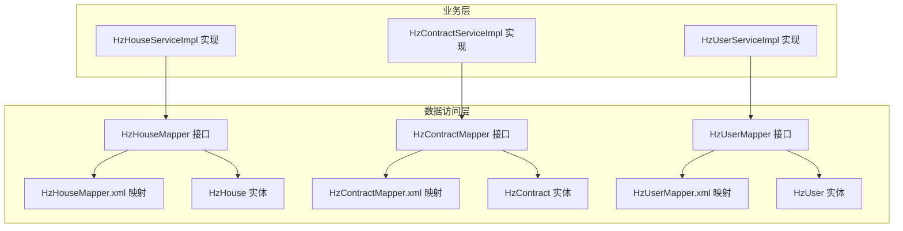
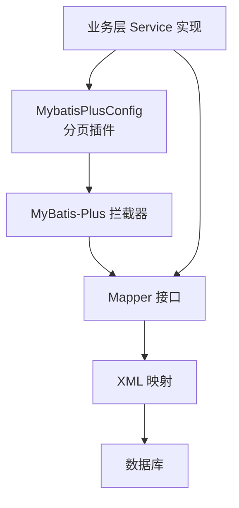
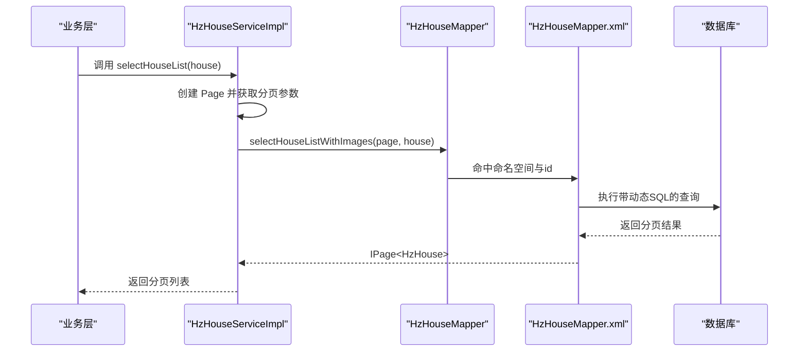
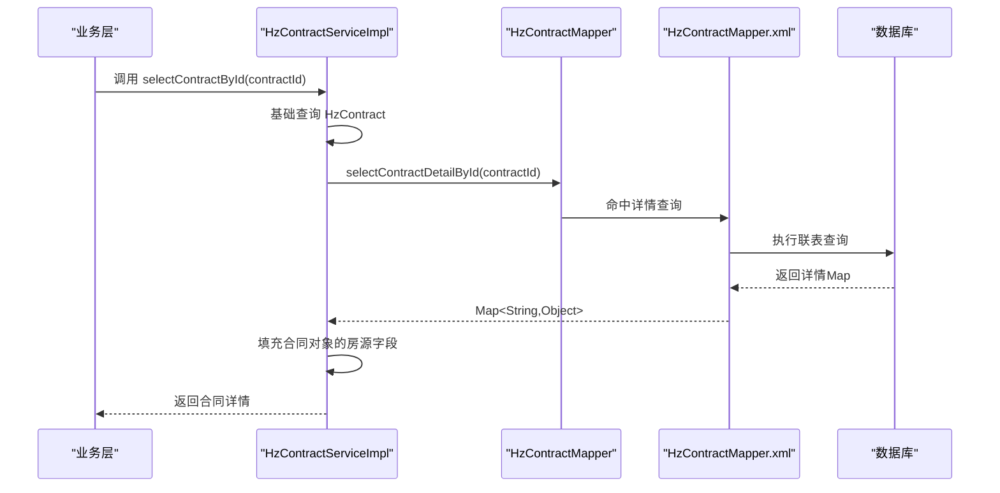
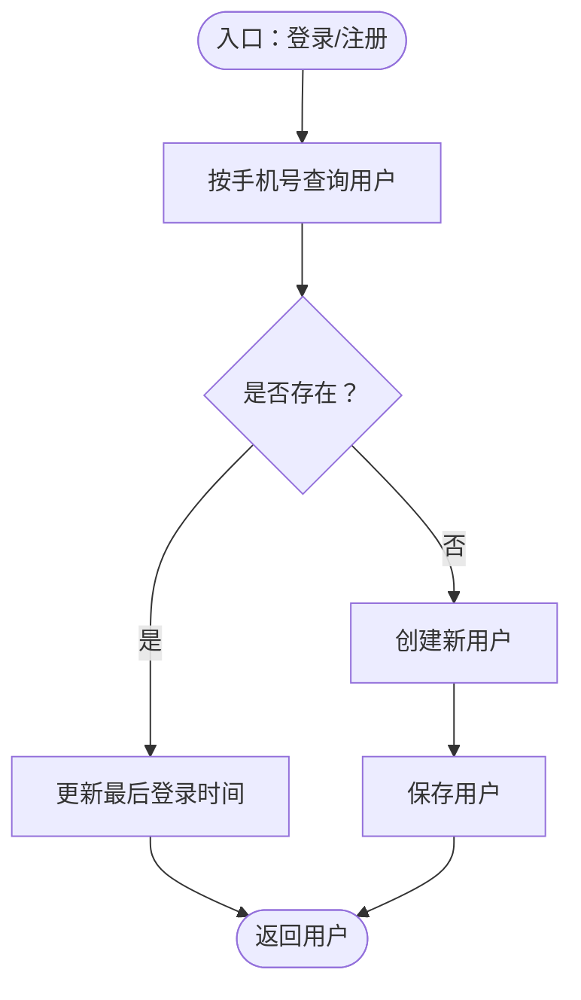
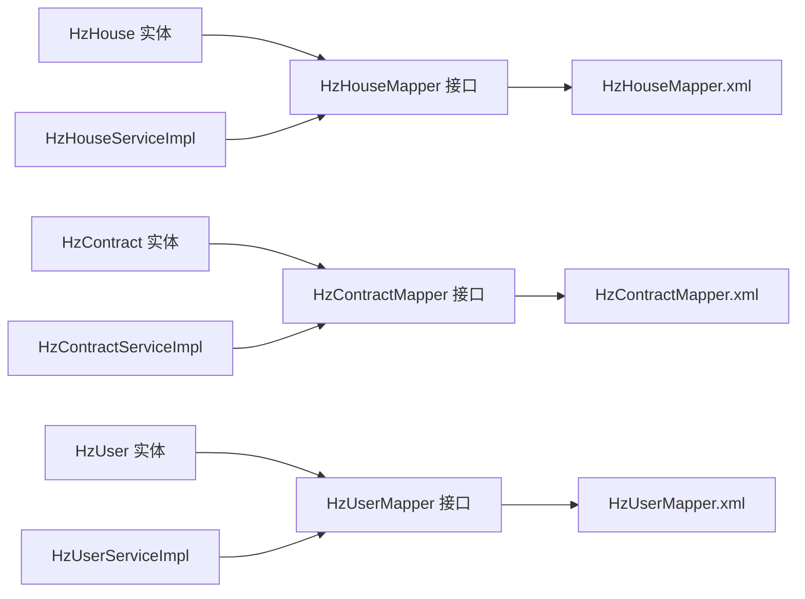

# 数据访问层设计

<cite>
**本文档引用的文件**
- [HzHouseMapper.java](file://ruoyi-system/src/main/java/com/ruoyi/system/mapper/HzHouseMapper.java)
- [HzContractMapper.java](file://ruoyi-system/src/main/java/com/ruoyi/system/mapper/HzContractMapper.java)
- [HzUserMapper.java](file://ruoyi-system/src/main/java/com/ruoyi/system/mapper/HzUserMapper.java)
- [HzHouseMapper.xml](file://ruoyi-system/src/main/resources/mapper/system/HzHouseMapper.xml)
- [HzContractMapper.xml](file://ruoyi-system/src/main/resources/mapper/system/HzContractMapper.xml)
- [HzUserMapper.xml](file://ruoyi-system/src/main/resources/mapper/system/HzUserMapper.xml)
- [MybatisPlusConfig.java](file://ruoyi-framework/src/main/java/com/ruoyi/framework/config/MybatisPlusConfig.java)
- [HzHouse.java](file://ruoyi-system/src/main/java/com/ruoyi/system/domain/HzHouse.java)
- [HzContract.java](file://ruoyi-system/src/main/java/com/ruoyi/system/domain/HzContract.java)
- [HzUser.java](file://ruoyi-system/src/main/java/com/ruoyi/system/domain/HzUser.java)
- [HzHouseServiceImpl.java](file://ruoyi-system/src/main/java/com/ruoyi/system/service/impl/HzHouseServiceImpl.java)
- [HzContractServiceImpl.java](file://ruoyi-system/src/main/java/com/ruoyi/system/service/impl/HzContractServiceImpl.java)
- [HzUserServiceImpl.java](file://ruoyi-system/src/main/java/com/ruoyi/system/service/impl/HzUserServiceImpl.java)
</cite>

## 目录
1. [简介](#简介)
2. [项目结构](#项目结构)
3. [核心组件](#核心组件)
4. [架构总览](#架构总览)
5. [详细组件分析](#详细组件分析)
6. [依赖分析](#依赖分析)
7. [性能考量](#性能考量)
8. [故障排查指南](#故障排查指南)
9. [结论](#结论)

## 简介
本文件面向港好住信息系统，系统性梳理数据访问层（Mapper）的设计原则与MyBatis-Plus使用策略，重点覆盖HzHouseMapper、HzContractMapper、HzUserMapper等核心数据访问接口，以及对应的XML映射文件、SQL优化、动态SQL构建、批量操作与事务边界控制。同时阐述数据访问层与业务层的交互协议、缓存策略设计建议及常见问题排查方法。

## 项目结构
数据访问层位于ruoyi-system模块，采用“接口 + XML映射”的MyBatis-Plus标准结构：
- Mapper接口：定义DAO契约，继承BaseMapper或扩展能力
- XML映射：定义SQL、动态SQL片段、结果映射
- Domain实体：与数据库表字段映射，标注注解
- Service实现：组合Mapper，封装业务逻辑、事务与分页

图表来源
- [HzHouseMapper.java:1-29](file://ruoyi-system/src/main/java/com/ruoyi/system/mapper/HzHouseMapper.java#L1-L29)
- [HzContractMapper.java:1-36](file://ruoyi-system/src/main/java/com/ruoyi/system/mapper/HzContractMapper.java#L1-L36)
- [HzUserMapper.java:1-42](file://ruoyi-system/src/main/java/com/ruoyi/system/mapper/HzUserMapper.java#L1-L42)
- [HzHouseMapper.xml:1-58](file://ruoyi-system/src/main/resources/mapper/system/HzHouseMapper.xml#L1-L58)
- [HzContractMapper.xml:1-66](file://ruoyi-system/src/main/resources/mapper/system/HzContractMapper.xml#L1-L66)
- [HzUserMapper.xml:1-84](file://ruoyi-system/src/main/resources/mapper/system/HzUserMapper.xml#L1-L84)
- [HzHouse.java:1-441](file://ruoyi-system/src/main/java/com/ruoyi/system/domain/HzHouse.java#L1-L441)
- [HzContract.java:1-606](file://ruoyi-system/src/main/java/com/ruoyi/system/domain/HzContract.java#L1-L606)
- [HzUser.java:1-375](file://ruoyi-system/src/main/java/com/ruoyi/system/domain/HzUser.java#L1-L375)
- [HzHouseServiceImpl.java:1-630](file://ruoyi-system/src/main/java/com/ruoyi/system/service/impl/HzHouseServiceImpl.java#L1-L630)
- [HzContractServiceImpl.java:1-334](file://ruoyi-system/src/main/java/com/ruoyi/system/service/impl/HzContractServiceImpl.java#L1-L334)
- [HzUserServiceImpl.java:1-348](file://ruoyi-system/src/main/java/com/ruoyi/system/service/impl/HzUserServiceImpl.java#L1-L348)

章节来源
- [HzHouseMapper.java:1-29](file://ruoyi-system/src/main/java/com/ruoyi/system/mapper/HzHouseMapper.java#L1-L29)
- [HzContractMapper.java:1-36](file://ruoyi-system/src/main/java/com/ruoyi/system/mapper/HzContractMapper.java#L1-L36)
- [HzUserMapper.java:1-42](file://ruoyi-system/src/main/java/com/ruoyi/system/mapper/HzUserMapper.java#L1-L42)
- [HzHouseMapper.xml:1-58](file://ruoyi-system/src/main/resources/mapper/system/HzHouseMapper.xml#L1-L58)
- [HzContractMapper.xml:1-66](file://ruoyi-system/src/main/resources/mapper/system/HzContractMapper.xml#L1-L66)
- [HzUserMapper.xml:1-84](file://ruoyi-system/src/main/resources/mapper/system/HzUserMapper.xml#L1-L84)
- [HzHouse.java:1-441](file://ruoyi-system/src/main/java/com/ruoyi/system/domain/HzHouse.java#L1-L441)
- [HzContract.java:1-606](file://ruoyi-system/src/main/java/com/ruoyi/system/domain/HzContract.java#L1-L606)
- [HzUser.java:1-375](file://ruoyi-system/src/main/java/com/ruoyi/system/domain/HzUser.java#L1-L375)
- [HzHouseServiceImpl.java:1-630](file://ruoyi-system/src/main/java/com/ruoyi/system/service/impl/HzHouseServiceImpl.java#L1-L630)
- [HzContractServiceImpl.java:1-334](file://ruoyi-system/src/main/java/com/ruoyi/system/service/impl/HzContractServiceImpl.java#L1-L334)
- [HzUserServiceImpl.java:1-348](file://ruoyi-system/src/main/java/com/ruoyi/system/service/impl/HzUserServiceImpl.java#L1-L348)

## 核心组件
- HzHouseMapper：继承BaseMapper，扩展带图片的分页查询
- HzContractMapper：提供合同列表与详情的联表查询
- HzUserMapper：提供用户列表查询、按手机号忽略逻辑删除查询、物理删除

章节来源
- [HzHouseMapper.java:17-28](file://ruoyi-system/src/main/java/com/ruoyi/system/mapper/HzHouseMapper.java#L17-L28)
- [HzContractMapper.java:17-35](file://ruoyi-system/src/main/java/com/ruoyi/system/mapper/HzContractMapper.java#L17-L35)
- [HzUserMapper.java:17-41](file://ruoyi-system/src/main/java/com/ruoyi/system/mapper/HzUserMapper.java#L17-L41)

## 架构总览
MyBatis-Plus全局配置启用分页插件，业务层通过Service实现类调用Mapper完成数据访问，XML映射文件承担SQL与动态SQL构建。

图表来源
- [MybatisPlusConfig.java:14-27](file://ruoyi-framework/src/main/java/com/ruoyi/framework/config/MybatisPlusConfig.java#L14-L27)
- [HzHouseServiceImpl.java:70-78](file://ruoyi-system/src/main/java/com/ruoyi/system/service/impl/HzHouseServiceImpl.java#L70-L78)
- [HzContractServiceImpl.java:48-72](file://ruoyi-system/src/main/java/com/ruoyi/system/service/impl/HzContractServiceImpl.java#L48-L72)
- [HzUserServiceImpl.java:36-40](file://ruoyi-system/src/main/java/com/ruoyi/system/service/impl/HzUserServiceImpl.java#L36-L40)

## 详细组件分析

### HzHouseMapper 设计与实现
- 设计原则
  - 继承BaseMapper，复用通用CRUD能力
  - 自定义扩展：selectHouseListWithImages，实现带项目/楼栋/单元信息的分页查询
- XML映射要点
  - 定义可复用SQL片段，包含LEFT JOIN项目/楼栋/单元表
  - 动态WHERE条件：支持项目、楼栋、单元、房源编码/房间号、户型名称、状态、精选标记等多维过滤
  - 使用LIKE与字符串拼接实现模糊匹配
- 业务层交互
  - 通过HzHouseServiceImpl.selectHouseList调用XML分页查询
  - 另提供LambdaQueryWrapper版本用于灵活条件与排序

图表来源
- [HzHouseServiceImpl.java:70-78](file://ruoyi-system/src/main/java/com/ruoyi/system/service/impl/HzHouseServiceImpl.java#L70-L78)
- [HzHouseMapper.java:27-27](file://ruoyi-system/src/main/java/com/ruoyi/system/mapper/HzHouseMapper.java#L27-L27)
- [HzHouseMapper.xml:21-55](file://ruoyi-system/src/main/resources/mapper/system/HzHouseMapper.xml#L21-L55)

章节来源
- [HzHouseMapper.java:17-28](file://ruoyi-system/src/main/java/com/ruoyi/system/mapper/HzHouseMapper.java#L17-L28)
- [HzHouseMapper.xml:7-55](file://ruoyi-system/src/main/resources/mapper/system/HzHouseMapper.xml#L7-L55)
- [HzHouseServiceImpl.java:70-116](file://ruoyi-system/src/main/java/com/ruoyi/system/service/impl/HzHouseServiceImpl.java#L70-L116)

### HzContractMapper 设计与实现
- 设计原则
  - 提供两类自定义查询：按用户ID查询合同列表、按合同ID查询详情（含房源/楼栋/单元信息）
- XML映射要点
  - 使用LEFT JOIN连接项目、房源、楼栋、单元表，返回详情所需字段
  - 动态条件：租户ID、合同ID、状态、类型、签约时间范围等
  - 通过params传递高级筛选（如dataScope）
- 业务层交互
  - 详情查询：先基础查询，再调用XML详情查询并回填房源字段
  - 列表查询：支持分页与配租方式（集中/常规）推断

图表来源
- [HzContractServiceImpl.java:48-72](file://ruoyi-system/src/main/java/com/ruoyi/system/service/impl/HzContractServiceImpl.java#L48-L72)
- [HzContractMapper.java:34-34](file://ruoyi-system/src/main/java/com/ruoyi/system/mapper/HzContractMapper.java#L34-L34)
- [HzContractMapper.xml:40-63](file://ruoyi-system/src/main/resources/mapper/system/HzContractMapper.xml#L40-L63)

章节来源
- [HzContractMapper.java:17-35](file://ruoyi-system/src/main/java/com/ruoyi/system/mapper/HzContractMapper.java#L17-L35)
- [HzContractMapper.xml:7-63](file://ruoyi-system/src/main/resources/mapper/system/HzContractMapper.xml#L7-L63)
- [HzContractServiceImpl.java:48-183](file://ruoyi-system/src/main/java/com/ruoyi/system/service/impl/HzContractServiceImpl.java#L48-L183)

### HzUserMapper 设计与实现
- 设计原则
  - 提供用户列表查询、按手机号忽略逻辑删除查询、物理删除
- XML映射要点
  - 定义resultMap映射完整字段
  - 动态WHERE条件：手机号、真实姓名、昵称、来源类型、性别、学历、状态、创建时间范围
- 业务层交互
  - 分页查询严格对齐筛选条件，确保导出与列表一致性
  - 登录/注册流程中，手机号冲突时使用原生SQL复活软删除用户

图表来源
- [HzUserServiceImpl.java:141-184](file://ruoyi-system/src/main/java/com/ruoyi/system/service/impl/HzUserServiceImpl.java#L141-L184)
- [HzUserMapper.java:32-39](file://ruoyi-system/src/main/java/com/ruoyi/system/mapper/HzUserMapper.java#L32-L39)
- [HzUserMapper.xml:39-81](file://ruoyi-system/src/main/resources/mapper/system/HzUserMapper.xml#L39-L81)

章节来源
- [HzUserMapper.java:17-41](file://ruoyi-system/src/main/java/com/ruoyi/system/mapper/HzUserMapper.java#L17-L41)
- [HzUserMapper.xml:7-81](file://ruoyi-system/src/main/resources/mapper/system/HzUserMapper.xml#L7-L81)
- [HzUserServiceImpl.java:36-80](file://ruoyi-system/src/main/java/com/ruoyi/system/service/impl/HzUserServiceImpl.java#L36-L80)

## 依赖分析
- Mapper与Domain
  - HzHouseMapper ↔ HzHouse：字段映射、注解驱动的自动CRUD
  - HzContractMapper ↔ HzContract：字段映射、非持久化字段用于展示
  - HzUserMapper ↔ HzUser：字段映射、登录/注册相关字段
- Mapper与XML
  - 命名空间与id一一对应，XML承载动态SQL与联表查询
- Service与Mapper
  - 业务层通过注入Mapper执行查询、更新、删除
  - 业务层负责事务边界与批量操作协调

图表来源
- [HzHouse.java:20-441](file://ruoyi-system/src/main/java/com/ruoyi/system/domain/HzHouse.java#L20-L441)
- [HzContract.java:19-606](file://ruoyi-system/src/main/java/com/ruoyi/system/domain/HzContract.java#L19-L606)
- [HzUser.java:19-375](file://ruoyi-system/src/main/java/com/ruoyi/system/domain/HzUser.java#L19-L375)
- [HzHouseMapper.java:17-28](file://ruoyi-system/src/main/java/com/ruoyi/system/mapper/HzHouseMapper.java#L17-L28)
- [HzContractMapper.java:17-35](file://ruoyi-system/src/main/java/com/ruoyi/system/mapper/HzContractMapper.java#L17-L35)
- [HzUserMapper.java:17-41](file://ruoyi-system/src/main/java/com/ruoyi/system/mapper/HzUserMapper.java#L17-L41)
- [HzHouseMapper.xml:5-58](file://ruoyi-system/src/main/resources/mapper/system/HzHouseMapper.xml#L5-L58)
- [HzContractMapper.xml:5-66](file://ruoyi-system/src/main/resources/mapper/system/HzContractMapper.xml#L5-L66)
- [HzUserMapper.xml:5-84](file://ruoyi-system/src/main/resources/mapper/system/HzUserMapper.xml#L5-L84)
- [HzHouseServiceImpl.java:44-630](file://ruoyi-system/src/main/java/com/ruoyi/system/service/impl/HzHouseServiceImpl.java#L44-L630)
- [HzContractServiceImpl.java:35-334](file://ruoyi-system/src/main/java/com/ruoyi/system/service/impl/HzContractServiceImpl.java#L35-L334)
- [HzUserServiceImpl.java:24-348](file://ruoyi-system/src/main/java/com/ruoyi/system/service/impl/HzUserServiceImpl.java#L24-L348)

章节来源
- [HzHouse.java:20-441](file://ruoyi-system/src/main/java/com/ruoyi/system/domain/HzHouse.java#L20-L441)
- [HzContract.java:19-606](file://ruoyi-system/src/main/java/com/ruoyi/system/domain/HzContract.java#L19-L606)
- [HzUser.java:19-375](file://ruoyi-system/src/main/java/com/ruoyi/system/domain/HzUser.java#L19-L375)
- [HzHouseMapper.java:17-28](file://ruoyi-system/src/main/java/com/ruoyi/system/mapper/HzHouseMapper.java#L17-L28)
- [HzContractMapper.java:17-35](file://ruoyi-system/src/main/java/com/ruoyi/system/mapper/HzContractMapper.java#L17-L35)
- [HzUserMapper.java:17-41](file://ruoyi-system/src/main/java/com/ruoyi/system/mapper/HzUserMapper.java#L17-L41)
- [HzHouseMapper.xml:5-58](file://ruoyi-system/src/main/resources/mapper/system/HzHouseMapper.xml#L5-L58)
- [HzContractMapper.xml:5-66](file://ruoyi-system/src/main/resources/mapper/system/HzContractMapper.xml#L5-L66)
- [HzUserMapper.xml:5-84](file://ruoyi-system/src/main/resources/mapper/system/HzUserMapper.xml#L5-L84)
- [HzHouseServiceImpl.java:44-630](file://ruoyi-system/src/main/java/com/ruoyi/system/service/impl/HzHouseServiceImpl.java#L44-L630)
- [HzContractServiceImpl.java:35-334](file://ruoyi-system/src/main/java/com/ruoyi/system/service/impl/HzContractServiceImpl.java#L35-L334)
- [HzUserServiceImpl.java:24-348](file://ruoyi-system/src/main/java/com/ruoyi/system/service/impl/HzUserServiceImpl.java#L24-L348)

## 性能考量
- 分页与拦截器
  - MyBatis-Plus全局配置启用分页插件，业务层无需重复实现分页逻辑
- 动态SQL与索引
  - HzUserMapper.xml中日期范围使用精确到秒的时间拼接，避免函数包裹导致索引失效
  - HzHouseMapper.xml中LIKE使用前后缀匹配，建议在高频字段建立合适索引
- 关联查询
  - HzContractMapper.xml通过LEFT JOIN返回详情，注意字段去重与结果集大小控制
- 批量操作
  - HzHouseServiceImpl提供批量更新状态接口，使用LambdaUpdateWrapper减少无效字段更新
- 缓存策略
  - 建议：读多写少的静态数据（如字典、项目/楼栋/单元基础信息）引入Redis缓存；用户敏感信息不缓存明文
  - 写操作采用本地缓存失效策略，避免脏读

## 故障排查指南
- 分页不生效
  - 检查MyBatis-Plus分页插件是否启用
  - 确认业务层传入Page对象并使用Mapper的分页方法
- 动态SQL条件不生效
  - 核对XML中test表达式与参数命名是否一致
  - 确认params键值与业务层传参一致（如beginTime/endTime、beginSignTime/endSignTime）
- 登录/注册手机号冲突
  - HzUserServiceImpl在捕获唯一约束异常后，调用HzUserMapper的原生SQL复活软删除用户
  - 若复活失败，提示联系管理员
- 合同详情字段缺失
  - HzContractServiceImpl在基础查询后调用XML详情查询并回填房源字段，确认contractId有效且未软删除

章节来源
- [MybatisPlusConfig.java:14-27](file://ruoyi-framework/src/main/java/com/ruoyi/framework/config/MybatisPlusConfig.java#L14-L27)
- [HzUserServiceImpl.java:325-342](file://ruoyi-system/src/main/java/com/ruoyi/system/service/impl/HzUserServiceImpl.java#L325-L342)
- [HzContractServiceImpl.java:48-72](file://ruoyi-system/src/main/java/com/ruoyi/system/service/impl/HzContractServiceImpl.java#L48-L72)

## 结论
本数据访问层遵循MyBatis-Plus最佳实践，通过清晰的Mapper接口、可复用的XML动态SQL与严谨的业务层封装，实现了条件查询、分页、联表详情、批量更新与事务控制。建议在生产环境中进一步完善索引策略、缓存与监控，持续优化复杂查询性能与稳定性。