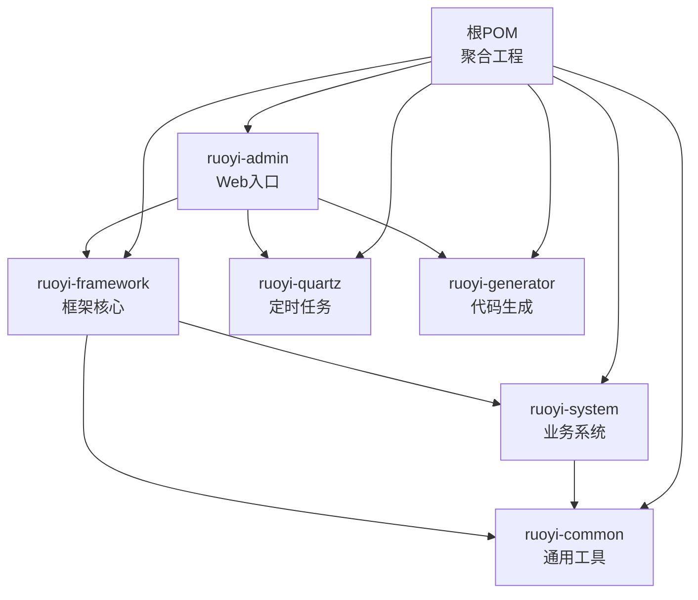
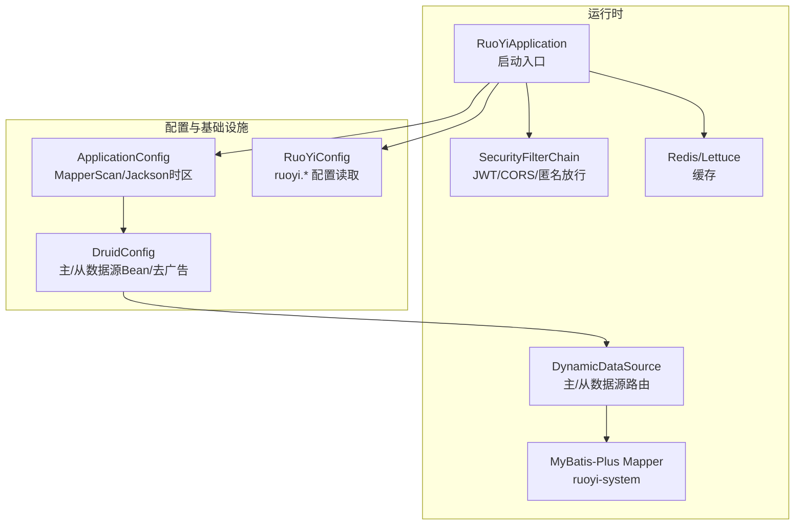
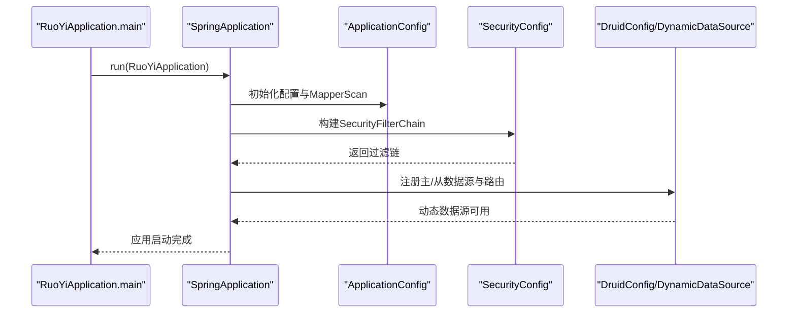
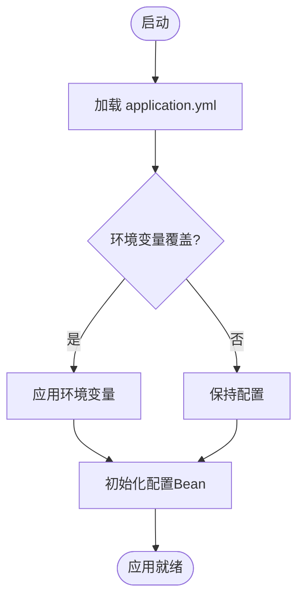
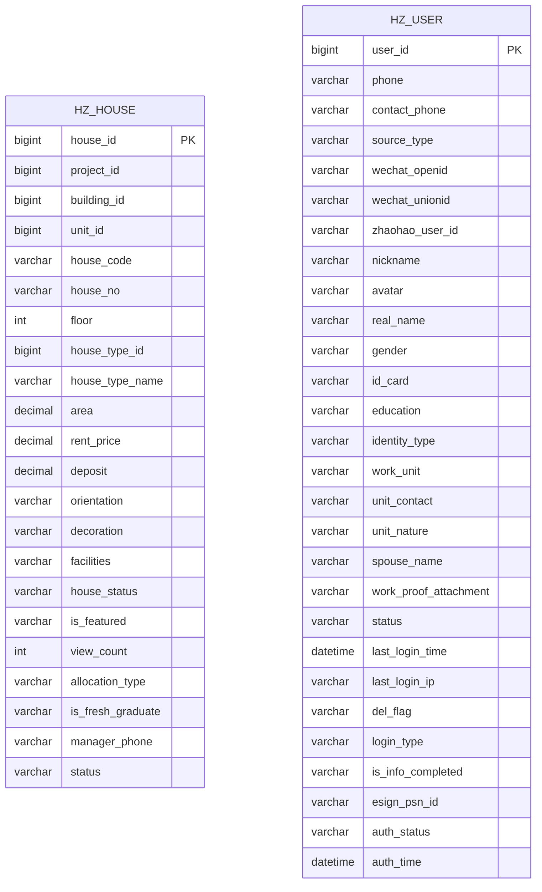
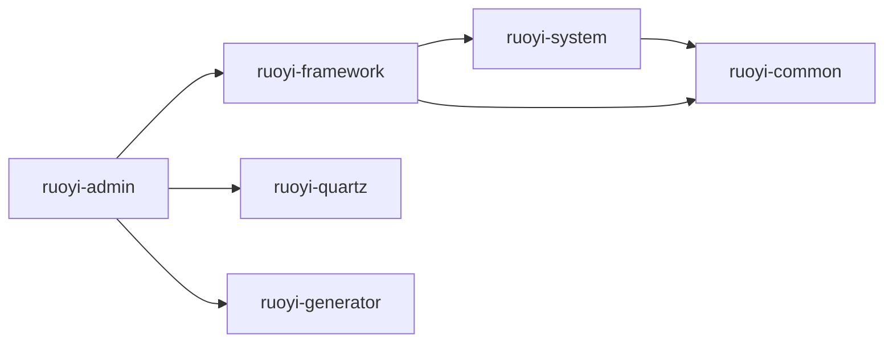

# 核心模块架构

<cite>
**本文引用的文件**
- [根POM（聚合工程）](file://pom.xml)
- [ruoyi-admin 模块POM](file://ruoyi-admin/pom.xml)
- [ruoyi-framework 模块POM](file://ruoyi-framework/pom.xml)
- [ruoyi-system 模块POM](file://ruoyi-system/pom.xml)
- [ruoyi-common 模块POM](file://ruoyi-common/pom.xml)
- [RuoYiApplication 启动类](file://ruoyi-admin/src/main/java/com/ruoyi/RuoYiApplication.java)
- [application.yml 配置文件](file://ruoyi-admin/src/main/resources/application.yml)
- [ApplicationConfig 应用配置](file://ruoyi-framework/src/main/java/com/ruoyi/framework/config/ApplicationConfig.java)
- [DruidConfig 数据源配置](file://ruoyi-framework/src/main/java/com/ruoyi/framework/config/DruidConfig.java)
- [SecurityConfig 安全配置](file://ruoyi-framework/src/main/java/com/ruoyi/framework/config/SecurityConfig.java)
- [DynamicDataSource 动态数据源](file://ruoyi-framework/src/main/java/com/ruoyi/framework/datasource/DynamicDataSource.java)
- [DynamicDataSourceContextHolder 数据源上下文](file://ruoyi-framework/src/main/java/com/ruoyi/framework/datasource/DynamicDataSourceContextHolder.java)
- [RuoYiConfig 项目配置读取](file://ruoyi-common/src/main/java/com/ruoyi/common/config/RuoYiConfig.java)
- [HzHouse 房源实体](file://ruoyi-system/src/main/java/com/ruoyi/system/domain/HzHouse.java)
- [HzUser 用户实体](file://ruoyi-system/src/main/java/com/ruoyi/system/domain/HzUser.java)
</cite>

## 目录
1. [简介](#简介)
2. [项目结构](#项目结构)
3. [核心组件](#核心组件)
4. [架构总览](#架构总览)
5. [详细组件分析](#详细组件分析)
6. [依赖关系分析](#依赖关系分析)
7. [性能考虑](#性能考虑)
8. [故障排查指南](#故障排查指南)
9. [结论](#结论)
10. [附录](#附录)

## 简介
本文件面向港好住信息系统，系统基于 RuoYi 框架的模块化设计思想，围绕 ruoyi-admin、ruoyi-system、ruoyi-framework、ruoyi-common 等核心模块展开，阐述模块职责、依赖关系、Spring Boot 启动与自动装配、exclude 数据源自动配置的设计考量、模块间通信机制、接口定义规范、Maven 多模块构建与打包策略，并给出配置文件管理、环境变量处理及模块化开发最佳实践。

## 项目结构
本项目采用 Maven 聚合工程组织，顶层 POM 声明版本与依赖管理，子模块按功能拆分：
- ruoyi-admin：Web 服务入口，负责对外 HTTP 接口、资源与打包。
- ruoyi-framework：框架核心，提供安全、数据源、拦截器、异步、定时任务等基础设施。
- ruoyi-system：业务系统模块，承载业务领域模型与 Mapper/XML。
- ruoyi-common：通用工具与基础能力，提供注解、常量、异常、工具类、XSS/重复提交过滤等。
- ruoyi-quartz、ruoyi-generator：定时任务与代码生成模块（作为聚合成员存在）。

图表来源
- [根POM（聚合工程）:184-191](file://pom.xml#L184-L191)
- [ruoyi-admin 模块POM:18-56](file://ruoyi-admin/pom.xml#L18-L56)
- [ruoyi-framework 模块POM:67-70](file://ruoyi-framework/pom.xml#L67-L70)
- [ruoyi-system 模块POM:20-24](file://ruoyi-system/pom.xml#L20-L24)
- [ruoyi-common 模块POM:18-24](file://ruoyi-common/pom.xml#L18-L24)

章节来源
- [根POM（聚合工程）:184-191](file://pom.xml#L184-L191)
- [ruoyi-admin 模块POM:18-56](file://ruoyi-admin/pom.xml#L18-L56)
- [ruoyi-framework 模块POM:67-70](file://ruoyi-framework/pom.xml#L67-L70)
- [ruoyi-system 模块POM:20-24](file://ruoyi-system/pom.xml#L20-L24)
- [ruoyi-common 模块POM:18-24](file://ruoyi-common/pom.xml#L18-L24)

## 核心组件
- ruoyi-admin：应用启动入口，排除数据源自动装配，集成 SpringDoc、Druid、定时任务与代码生成模块，负责打包与运行。
- ruoyi-framework：提供安全过滤链、动态数据源、MyBatis-Plus 扫描、Jackson 时区配置、Redis、线程池等基础设施。
- ruoyi-system：业务域模型与 Mapper/XML，承载业务实体与持久化映射。
- ruoyi-common：通用注解、常量、异常体系、工具类、XSS/重复提交过滤、国际化、缓存序列化等。

章节来源
- [RuoYiApplication 启动类:12-21](file://ruoyi-admin/src/main/java/com/ruoyi/RuoYiApplication.java#L12-L21)
- [ruoyi-admin 模块POM:18-56](file://ruoyi-admin/pom.xml#L18-L56)
- [ruoyi-framework 模块POM:18-70](file://ruoyi-framework/pom.xml#L18-L70)
- [ruoyi-system 模块POM:18-24](file://ruoyi-system/pom.xml#L18-L24)
- [ruoyi-common 模块POM:18-124](file://ruoyi-common/pom.xml#L18-L124)

## 架构总览
系统采用“入口模块 + 框架模块 + 业务模块 + 通用模块”的分层架构。ruoyi-admin 作为 Spring Boot 启动入口，排除数据源自动装配，由 ruoyi-framework 提供动态数据源与 Druid 监控；ruoyi-system 负责业务模型与持久化；ruoyi-common 提供横切能力与工具。

图表来源
- [RuoYiApplication 启动类:12-21](file://ruoyi-admin/src/main/java/com/ruoyi/RuoYiApplication.java#L12-L21)
- [SecurityConfig 安全配置:86-124](file://ruoyi-framework/src/main/java/com/ruoyi/framework/config/SecurityConfig.java#L86-L124)
- [ApplicationConfig 应用配置:21-36](file://ruoyi-framework/src/main/java/com/ruoyi/framework/config/ApplicationConfig.java#L21-L36)
- [DruidConfig 数据源配置:35-60](file://ruoyi-framework/src/main/java/com/ruoyi/framework/config/DruidConfig.java#L35-L60)
- [DynamicDataSource 动态数据源:12-26](file://ruoyi-framework/src/main/java/com/ruoyi/framework/datasource/DynamicDataSource.java#L12-L26)
- [RuoYiConfig 项目配置读取:11-123](file://ruoyi-common/src/main/java/com/ruoyi/common/config/RuoYiConfig.java#L11-L123)

## 详细组件分析

### Spring Boot 启动与自动装配
- 启动类位于 ruoyi-admin，使用 @SpringBootApplication 并显式排除 DataSourceAutoConfiguration，避免在未配置数据源时启动失败。
- 通过 ruoyi-framework 提供的 DruidConfig 注入主/从数据源 Bean，并由 DynamicDataSource 统一路由。
- ApplicationConfig 负责 MyBatis-Plus Mapper 扫描路径与 Jackson 时区设置。
- SecurityConfig 定义基于 JWT 的无状态认证链路，开放匿名访问路径，添加 CORS 与登出处理。

图表来源
- [RuoYiApplication 启动类:12-21](file://ruoyi-admin/src/main/java/com/ruoyi/RuoYiApplication.java#L12-L21)
- [ApplicationConfig 应用配置:21-36](file://ruoyi-framework/src/main/java/com/ruoyi/framework/config/ApplicationConfig.java#L21-L36)
- [SecurityConfig 安全配置:86-124](file://ruoyi-framework/src/main/java/com/ruoyi/framework/config/SecurityConfig.java#L86-L124)
- [DruidConfig 数据源配置:35-60](file://ruoyi-framework/src/main/java/com/ruoyi/framework/config/DruidConfig.java#L35-L60)
- [DynamicDataSource 动态数据源:12-26](file://ruoyi-framework/src/main/java/com/ruoyi/framework/datasource/DynamicDataSource.java#L12-L26)

章节来源
- [RuoYiApplication 启动类:12-21](file://ruoyi-admin/src/main/java/com/ruoyi/RuoYiApplication.java#L12-L21)
- [ApplicationConfig 应用配置:21-36](file://ruoyi-framework/src/main/java/com/ruoyi/framework/config/ApplicationConfig.java#L21-L36)
- [SecurityConfig 安全配置:86-124](file://ruoyi-framework/src/main/java/com/ruoyi/framework/config/SecurityConfig.java#L86-L124)
- [DruidConfig 数据源配置:35-60](file://ruoyi-framework/src/main/java/com/ruoyi/framework/config/DruidConfig.java#L35-L60)
- [DynamicDataSource 动态数据源:12-26](file://ruoyi-framework/src/main/java/com/ruoyi/framework/datasource/DynamicDataSource.java#L12-L26)

### exclude 数据源自动配置的设计考量
- 在启动类显式排除 DataSourceAutoConfiguration，确保在未配置数据源时应用仍可启动，便于开发与测试环境快速运行。
- 数据源由 ruoyi-framework 的 DruidConfig 与 DynamicDataSource 提供，支持主/从分离与运行期切换，满足业务对读写分离与监控的需求。
- 该设计避免了 Spring Boot 默认自动装配带来的启动失败风险，同时保留了灵活的数据源管理能力。

章节来源
- [RuoYiApplication 启动类:12-21](file://ruoyi-admin/src/main/java/com/ruoyi/RuoYiApplication.java#L12-L21)
- [DruidConfig 数据源配置:35-60](file://ruoyi-framework/src/main/java/com/ruoyi/framework/config/DruidConfig.java#L35-L60)
- [DynamicDataSource 动态数据源:12-26](file://ruoyi-framework/src/main/java/com/ruoyi/framework/datasource/DynamicDataSource.java#L12-L26)

### 模块间通信机制与接口定义规范
- 控制器层：ruoyi-admin 作为入口，提供对外 HTTP 接口；业务逻辑主要在 ruoyi-system 的 Service 层实现。
- 数据访问层：ruoyi-system 通过 MyBatis-Plus Mapper 访问数据库；ruoyi-framework 提供动态数据源路由。
- 通用能力：ruoyi-common 提供统一注解、异常、工具类与过滤器，跨模块复用。
- 接口规范建议：
  - 统一使用 RESTful 风格，路径前缀区分模块（如 /system、/tool）。
  - 参数校验使用 @Validated 与自定义注解，返回体遵循统一响应结构。
  - 业务异常抛出 ServiceException，全局异常由 GlobalExceptionHandler 统一处理。

章节来源
- [ruoyi-admin 模块POM:18-56](file://ruoyi-admin/pom.xml#L18-L56)
- [ruoyi-system 模块POM:18-24](file://ruoyi-system/pom.xml#L18-L24)
- [ruoyi-common 模块POM:18-124](file://ruoyi-common/pom.xml#L18-L124)

### 配置文件管理与环境变量处理
- ruoyi-admin 的 application.yml 管理项目、服务器、日志、Redis、MyBatis-Plus、SpringDoc、XSS、郑好办、微信、e签宝、政务代理等配置。
- 支持环境变量覆盖，如 ZHB_*、GOV_PROXY_*、GHZ_PREVIEW_PHONES 等，便于 CI/CD 与多环境部署。
- ruoyi-common 的 RuoYiConfig 读取 ruoyi.* 前缀配置，提供上传路径、验证码类型等静态访问能力。

图表来源
- [application.yml 配置文件:1-238](file://ruoyi-admin/src/main/resources/application.yml#L1-L238)
- [RuoYiConfig 项目配置读取:11-123](file://ruoyi-common/src/main/java/com/ruoyi/common/config/RuoYiConfig.java#L11-L123)

章节来源
- [application.yml 配置文件:1-238](file://ruoyi-admin/src/main/resources/application.yml#L1-L238)
- [RuoYiConfig 项目配置读取:11-123](file://ruoyi-common/src/main/java/com/ruoyi/common/config/RuoYiConfig.java#L11-L123)

### 数据模型与持久化
- HzHouse、HzUser 等业务实体采用 MyBatis-Plus 注解映射表结构，支持自动填充、逻辑删除、枚举转换等特性。
- Mapper XML 位于 ruoyi-system 的 resources/mapper 下，配合 MyBatis-Plus 全局配置生效。

图表来源
- [HzHouse 房源实体:20-441](file://ruoyi-system/src/main/java/com/ruoyi/system/domain/HzHouse.java#L20-L441)
- [HzUser 用户实体:19-375](file://ruoyi-system/src/main/java/com/ruoyi/system/domain/HzUser.java#L19-L375)

章节来源
- [HzHouse 房源实体:20-441](file://ruoyi-system/src/main/java/com/ruoyi/system/domain/HzHouse.java#L20-L441)
- [HzUser 用户实体:19-375](file://ruoyi-system/src/main/java/com/ruoyi/system/domain/HzUser.java#L19-L375)

## 依赖关系分析
- ruoyi-admin 依赖 ruoyi-framework、ruoyi-quartz、ruoyi-generator，同时引入 MySQL 驱动与第三方 SDK。
- ruoyi-framework 依赖 ruoyi-system 与 ruoyi-common，提供 Web、AOP、Druid、MyBatis-Plus、Redis、安全等能力。
- ruoyi-system 依赖 ruoyi-common，并引入 MyBatis-Plus 与 e签宝/微信支付相关依赖。
- ruoyi-common 为最底层模块，提供横切能力与工具类，被上层模块广泛依赖。

图表来源
- [根POM（聚合工程）:184-191](file://pom.xml#L184-L191)
- [ruoyi-admin 模块POM:18-56](file://ruoyi-admin/pom.xml#L18-L56)
- [ruoyi-framework 模块POM:67-70](file://ruoyi-framework/pom.xml#L67-L70)
- [ruoyi-system 模块POM:20-24](file://ruoyi-system/pom.xml#L20-L24)
- [ruoyi-common 模块POM:18-24](file://ruoyi-common/pom.xml#L18-L24)

章节来源
- [根POM（聚合工程）:184-191](file://pom.xml#L184-L191)
- [ruoyi-admin 模块POM:18-56](file://ruoyi-admin/pom.xml#L18-L56)
- [ruoyi-framework 模块POM:67-70](file://ruoyi-framework/pom.xml#L67-L70)
- [ruoyi-system 模块POM:20-24](file://ruoyi-system/pom.xml#L20-L24)
- [ruoyi-common 模块POM:18-24](file://ruoyi-common/pom.xml#L18-L24)

## 性能考虑
- 动态数据源：通过 DynamicDataSource 与 ThreadLocal 上下文实现主/从切换，结合 Druid 监控与连接池参数优化吞吐与延迟。
- MyBatis-Plus：启用驼峰映射、逻辑删除、Banner 控制与日志实现，减少 ORM 层开销。
- 缓存：Redis 配置支持连接池与超时控制，结合业务热点数据缓存提升响应速度。
- 文件上传：针对 VR 全景图/大图场景提高单文件与总上传大小限制，平衡存储与网络带宽。
- 安全过滤：CORS 与 XSS 过滤在请求早期拦截，降低后续处理成本。

## 故障排查指南
- 启动失败（数据源相关）：确认 ruoyi-admin 启动类已排除数据源自动装配；检查 ruoyi-framework 的 DruidConfig 是否正确注册主/从数据源 Bean。
- 认证失败或跨域问题：检查 SecurityConfig 的匿名放行路径与 CORS 过滤顺序；确认 JWT 过滤器位置正确。
- Mapper 扫描不到：确认 ApplicationConfig 的 MapperScan 路径包含 ruoyi-system 的 mapper 包。
- 配置覆盖无效：检查环境变量命名与 application.yml 中占位符是否一致，确认运行时是否注入了对应环境变量。
- Druid 监控广告：DruidConfig 提供移除监控页底部广告的过滤器，确认 statViewServlet 开关与 URL 模式配置正确。

章节来源
- [RuoYiApplication 启动类:12-21](file://ruoyi-admin/src/main/java/com/ruoyi/RuoYiApplication.java#L12-L21)
- [DruidConfig 数据源配置:84-125](file://ruoyi-framework/src/main/java/com/ruoyi/framework/config/DruidConfig.java#L84-L125)
- [ApplicationConfig 应用配置:21-36](file://ruoyi-framework/src/main/java/com/ruoyi/framework/config/ApplicationConfig.java#L21-L36)
- [SecurityConfig 安全配置:86-124](file://ruoyi-framework/src/main/java/com/ruoyi/framework/config/SecurityConfig.java#L86-L124)
- [application.yml 配置文件:1-238](file://ruoyi-admin/src/main/resources/application.yml#L1-L238)

## 结论
本系统以 RuoYi 为基础，采用清晰的模块化分层：ruoyi-admin 负责入口与打包，ruoyi-framework 提供基础设施，ruoyi-system 承载业务模型，ruoyi-common 提供横切能力。通过排除数据源自动装配、动态数据源与安全过滤链、统一配置与环境变量覆盖，系统具备良好的扩展性、可维护性与可运维性。建议在后续迭代中持续完善接口契约、异常处理与监控告警，保障生产环境稳定运行。

## 附录
- Maven 多模块构建与打包：顶层 POM 统一版本与插件，各模块按需引入依赖；ruoyi-admin 使用 spring-boot-maven-plugin 与 war 插件，支持可执行 jar 与传统 war 两种产物。
- 配置文件建议：将敏感配置放入环境变量，非敏感配置放入 application.yml；通过 profiles 切换不同环境；使用 ruoyi.common.config.RuoYiConfig 统一读取 ruoyi.* 前缀配置。