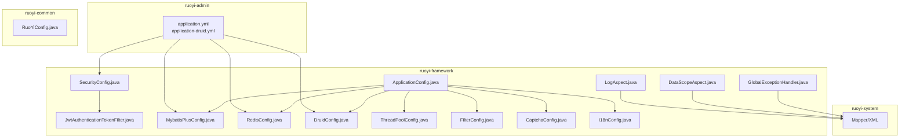
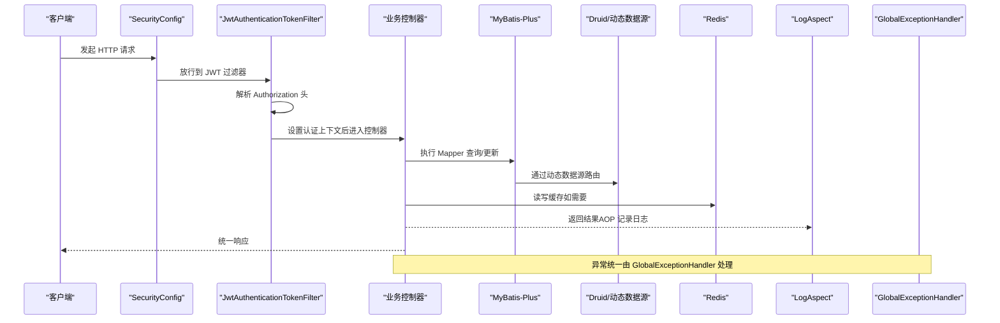
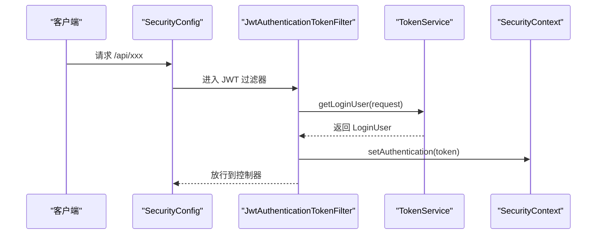
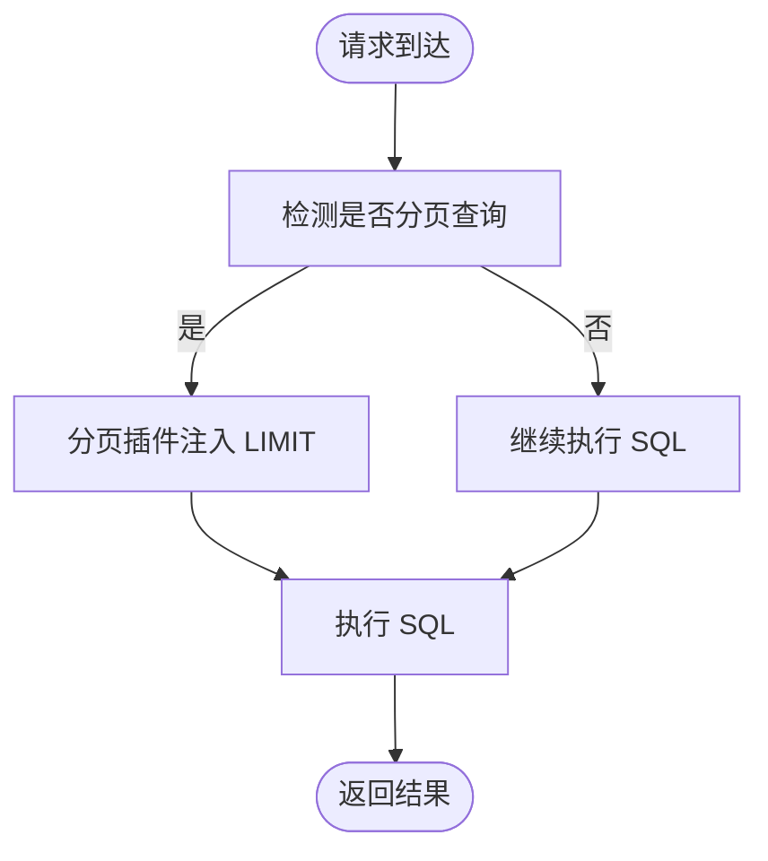
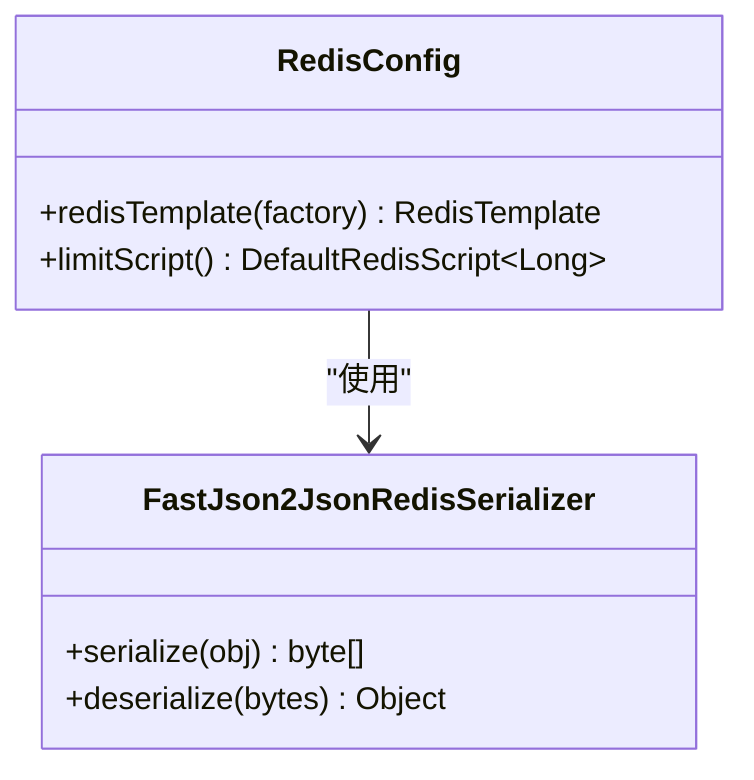
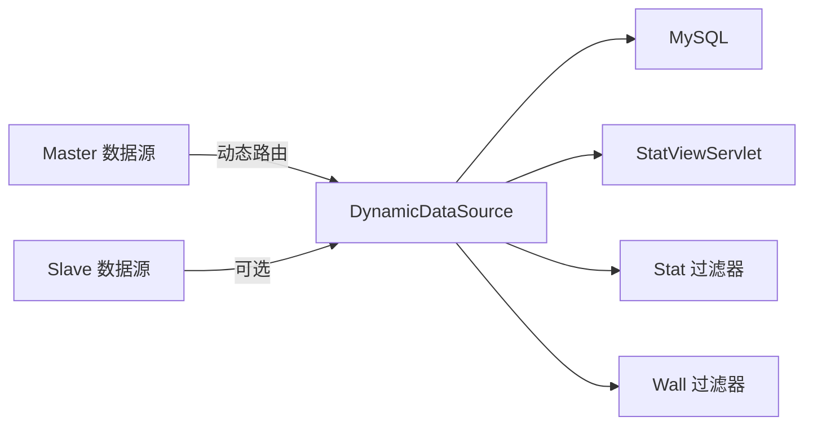
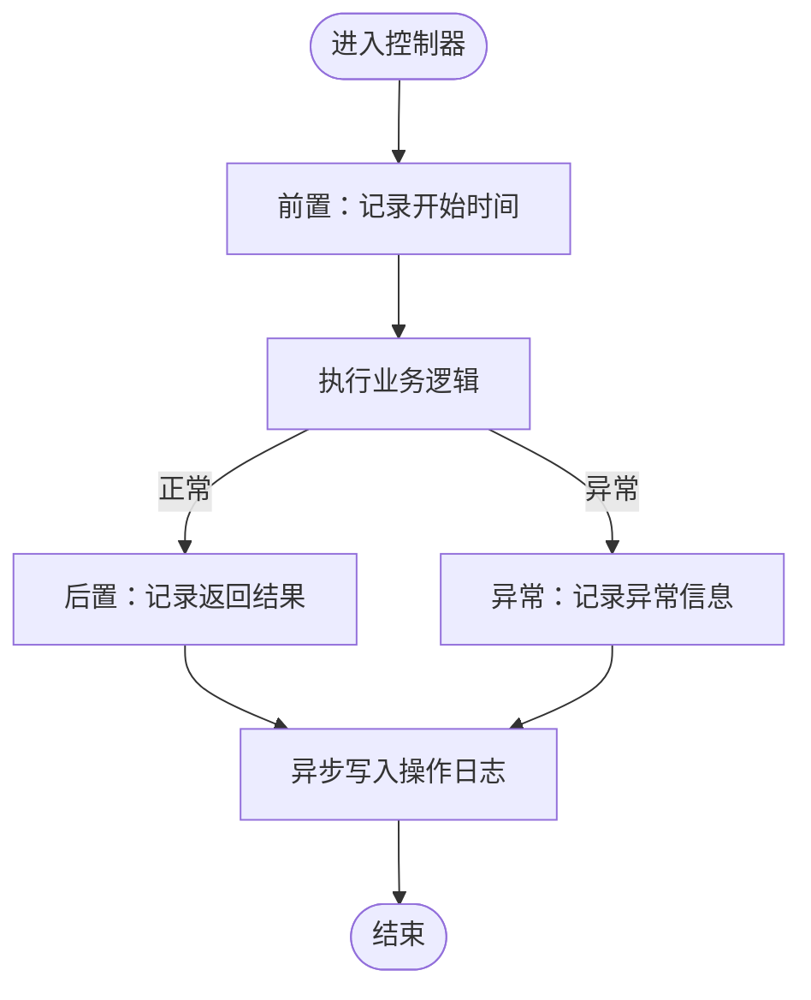
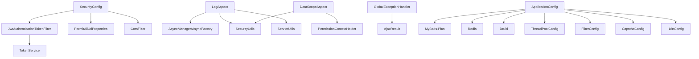

# 框架集成与配置

<cite>
**本文引用的文件**
- [application.yml](file://ruoyi-admin/src/main/resources/application.yml)
- [application-druid.yml](file://ruoyi-admin/src/main/resources/application-druid.yml)
- [SecurityConfig.java](file://ruoyi-framework/src/main/java/com/ruoyi/framework/config/SecurityConfig.java)
- [JwtAuthenticationTokenFilter.java](file://ruoyi-framework/src/main/java/com/ruoyi/framework/security/filter/JwtAuthenticationTokenFilter.java)
- [MybatisPlusConfig.java](file://ruoyi-framework/src/main/java/com/ruoyi/framework/config/MybatisPlusConfig.java)
- [RedisConfig.java](file://ruoyi-framework/src/main/java/com/ruoyi/framework/config/RedisConfig.java)
- [DruidConfig.java](file://ruoyi-framework/src/main/java/com/ruoyi/framework/config/DruidConfig.java)
- [DruidProperties.java](file://ruoyi-framework/src/main/java/com/ruoyi/framework/config/properties/DruidProperties.java)
- [PermitAllUrlProperties.java](file://ruoyi-framework/src/main/java/com/ruoyi/framework/config/properties/PermitAllUrlProperties.java)
- [LogAspect.java](file://ruoyi-framework/src/main/java/com/ruoyi/framework/aspectj/LogAspect.java)
- [DataScopeAspect.java](file://ruoyi-framework/src/main/java/com/ruoyi/framework/aspectj/DataScopeAspect.java)
- [GlobalExceptionHandler.java](file://ruoyi-framework/src/main/java/com/ruoyi/framework/web/exception/GlobalExceptionHandler.java)
- [ApplicationConfig.java](file://ruoyi-framework/src/main/java/com/ruoyi/framework/config/ApplicationConfig.java)
- [ThreadPoolConfig.java](file://ruoyi-framework/src/main/java/com/ruoyi/framework/config/ThreadPoolConfig.java)
- [FilterConfig.java](file://ruoyi-framework/src/main/java/com/ruoyi/framework/config/FilterConfig.java)
- [CaptchaConfig.java](file://ruoyi-framework/src/main/java/com/ruoyi/framework/config/CaptchaConfig.java)
- [I18nConfig.java](file://ruoyi-framework/src/main/java/com/ruoyi/framework/config/I18nConfig.java)
- [RuoYiConfig.java](file://ruoyi-common/src/main/java/com/ruoyi/common/config/RuoYiConfig.java)
</cite>

## 目录
1. [简介](#简介)
2. [项目结构](#项目结构)
3. [核心组件](#核心组件)
4. [架构总览](#架构总览)
5. [详细组件分析](#详细组件分析)
6. [依赖分析](#依赖分析)
7. [性能考虑](#性能考虑)
8. [故障排查指南](#故障排查指南)
9. [结论](#结论)
10. [附录](#附录)

## 简介
本文件面向港好住信息系统，系统性梳理并说明后端框架集成与配置，重点覆盖：
- Spring Boot、MyBatis-Plus、Redis、Druid 的集成与配置策略
- 安全配置（安全配置、JWT 认证、权限控制）
- MyBatis-Plus 配置（分页插件、性能分析、自动填充）
- Redis 配置（缓存策略、序列化、连接池）
- Druid 配置（监控、统计、SQL 防火墙）
- AOP 切面编程（日志切面、数据权限切面、全局异常处理）
- 配置文件管理、环境差异化配置与性能调优最佳实践

## 项目结构
后端采用多模块结构，核心模块包括：
- ruoyi-admin：应用入口与配置中心
- ruoyi-framework：框架配置、安全、AOP、异步、线程池等基础设施
- ruoyi-common：公共常量、工具、异常体系、注解等
- ruoyi-system：业务模块与 Mapper/XML
- ruoyi-quartz：定时任务
- ruoyi-generator：代码生成
- ruoyi-ui：前端工程
- ghz-gov-proxy：政务接口代理
- jiekou-sdk：外部接口 SDK

**图表来源**
- [application.yml:1-238](file://ruoyi-admin/src/main/resources/application.yml#L1-L238)
- [application-druid.yml:1-64](file://ruoyi-admin/src/main/resources/application-druid.yml#L1-L64)
- [SecurityConfig.java:1-135](file://ruoyi-framework/src/main/java/com/ruoyi/framework/config/SecurityConfig.java#L1-L135)
- [JwtAuthenticationTokenFilter.java:1-45](file://ruoyi-framework/src/main/java/com/ruoyi/framework/security/filter/JwtAuthenticationTokenFilter.java#L1-L45)
- [MybatisPlusConfig.java:1-28](file://ruoyi-framework/src/main/java/com/ruoyi/framework/config/MybatisPlusConfig.java#L1-L28)
- [RedisConfig.java:1-71](file://ruoyi-framework/src/main/java/com/ruoyi/framework/config/RedisConfig.java#L1-L71)
- [DruidConfig.java:1-127](file://ruoyi-framework/src/main/java/com/ruoyi/framework/config/DruidConfig.java#L1-L127)
- [LogAspect.java:1-257](file://ruoyi-framework/src/main/java/com/ruoyi/framework/aspectj/LogAspect.java#L1-L257)
- [DataScopeAspect.java:1-185](file://ruoyi-framework/src/main/java/com/ruoyi/framework/aspectj/DataScopeAspect.java#L1-L185)
- [GlobalExceptionHandler.java:1-146](file://ruoyi-framework/src/main/java/com/ruoyi/framework/web/exception/GlobalExceptionHandler.java#L1-L146)
- [ApplicationConfig.java:1-38](file://ruoyi-framework/src/main/java/com/ruoyi/framework/config/ApplicationConfig.java#L1-L38)
- [ThreadPoolConfig.java:1-64](file://ruoyi-framework/src/main/java/com/ruoyi/framework/config/ThreadPoolConfig.java#L1-L64)
- [FilterConfig.java:1-81](file://ruoyi-framework/src/main/java/com/ruoyi/framework/config/FilterConfig.java#L1-L81)
- [CaptchaConfig.java:1-84](file://ruoyi-framework/src/main/java/com/ruoyi/framework/config/CaptchaConfig.java#L1-L84)
- [I18nConfig.java:1-44](file://ruoyi-framework/src/main/java/com/ruoyi/framework/config/I18nConfig.java#L1-L44)
- [RuoYiConfig.java:1-123](file://ruoyi-common/src/main/java/com/ruoyi/common/config/RuoYiConfig.java#L1-L123)

**章节来源**
- [application.yml:1-238](file://ruoyi-admin/src/main/resources/application.yml#L1-L238)
- [application-druid.yml:1-64](file://ruoyi-admin/src/main/resources/application-druid.yml#L1-L64)
- [ApplicationConfig.java:1-38](file://ruoyi-framework/src/main/java/com/ruoyi/framework/config/ApplicationConfig.java#L1-L38)

## 核心组件
- 配置中心与环境差异化
  - application.yml：项目元信息、服务器、日志、国际化、Spring、MyBatis-Plus、Redis、token、XSS/防盗链、微信/电子签等配置
  - application-druid.yml：Druid 多数据源、监控、慢 SQL、SQL 防火墙等
  - profiles.active: druid 切换至 Druid 配置
- 安全与认证
  - SecurityConfig：基于 Web 的安全链路、匿名放行、跨域、登出、异常处理
  - JwtAuthenticationTokenFilter：从请求中解析 JWT，构建认证上下文
  - PermitAllUrlProperties：扫描控制器/方法上的匿名注解，动态收集放行 URL
- ORM 与缓存
  - MybatisPlusConfig：分页插件（MySQL）
  - RedisConfig：RedisTemplate 序列化策略、限流 Lua 脚本
- 数据源与监控
  - DruidConfig：主从数据源装配、动态数据源、移除监控页广告
  - DruidProperties：集中读取 Druid 参数并注入数据源
- AOP 与异常
  - LogAspect：统一记录操作日志（含请求/响应、耗时、异常）
  - DataScopeAspect：按角色数据权限动态拼接 SQL 条件
  - GlobalExceptionHandler：统一异常处理，标准化返回
- 基础设施
  - ApplicationConfig：Mapper 扫描、AOP 暴露代理、时区配置
  - ThreadPoolConfig：线程池与调度线程池
  - FilterConfig：XSS、Referer、重复可读过滤
  - CaptchaConfig：验证码组件
  - I18nConfig：国际化拦截器与默认语言
  - RuoYiConfig：ruoyi 前缀配置读取

**章节来源**
- [application.yml:52-238](file://ruoyi-admin/src/main/resources/application.yml#L52-L238)
- [application-druid.yml:1-64](file://ruoyi-admin/src/main/resources/application-druid.yml#L1-L64)
- [SecurityConfig.java:1-135](file://ruoyi-framework/src/main/java/com/ruoyi/framework/config/SecurityConfig.java#L1-L135)
- [JwtAuthenticationTokenFilter.java:1-45](file://ruoyi-framework/src/main/java/com/ruoyi/framework/security/filter/JwtAuthenticationTokenFilter.java#L1-L45)
- [MybatisPlusConfig.java:1-28](file://ruoyi-framework/src/main/java/com/ruoyi/framework/config/MybatisPlusConfig.java#L1-L28)
- [RedisConfig.java:1-71](file://ruoyi-framework/src/main/java/com/ruoyi/framework/config/RedisConfig.java#L1-L71)
- [DruidConfig.java:1-127](file://ruoyi-framework/src/main/java/com/ruoyi/framework/config/DruidConfig.java#L1-L127)
- [DruidProperties.java:1-90](file://ruoyi-framework/src/main/java/com/ruoyi/framework/config/properties/DruidProperties.java#L1-L90)
- [LogAspect.java:1-257](file://ruoyi-framework/src/main/java/com/ruoyi/framework/aspectj/LogAspect.java#L1-L257)
- [DataScopeAspect.java:1-185](file://ruoyi-framework/src/main/java/com/ruoyi/framework/aspectj/DataScopeAspect.java#L1-L185)
- [GlobalExceptionHandler.java:1-146](file://ruoyi-framework/src/main/java/com/ruoyi/framework/web/exception/GlobalExceptionHandler.java#L1-L146)
- [ApplicationConfig.java:1-38](file://ruoyi-framework/src/main/java/com/ruoyi/framework/config/ApplicationConfig.java#L1-L38)
- [ThreadPoolConfig.java:1-64](file://ruoyi-framework/src/main/java/com/ruoyi/framework/config/ThreadPoolConfig.java#L1-L64)
- [FilterConfig.java:1-81](file://ruoyi-framework/src/main/java/com/ruoyi/framework/config/FilterConfig.java#L1-L81)
- [CaptchaConfig.java:1-84](file://ruoyi-framework/src/main/java/com/ruoyi/framework/config/CaptchaConfig.java#L1-L84)
- [I18nConfig.java:1-44](file://ruoyi-framework/src/main/java/com/ruoyi/framework/config/I18nConfig.java#L1-L44)
- [RuoYiConfig.java:1-123](file://ruoyi-common/src/main/java/com/ruoyi/common/config/RuoYiConfig.java#L1-L123)

## 架构总览
系统采用“配置中心 + 安全 + ORM + 缓存 + 数据源 + AOP + 异常 + 基础设施”的分层设计，核心交互如下：

**图表来源**
- [SecurityConfig.java:85-124](file://ruoyi-framework/src/main/java/com/ruoyi/framework/config/SecurityConfig.java#L85-L124)
- [JwtAuthenticationTokenFilter.java:30-43](file://ruoyi-framework/src/main/java/com/ruoyi/framework/security/filter/JwtAuthenticationTokenFilter.java#L30-L43)
- [LogAspect.java:67-83](file://ruoyi-framework/src/main/java/com/ruoyi/framework/aspectj/LogAspect.java#L67-L83)
- [GlobalExceptionHandler.java:27-146](file://ruoyi-framework/src/main/java/com/ruoyi/framework/web/exception/GlobalExceptionHandler.java#L27-L146)

## 详细组件分析

### 安全配置与 JWT 认证
- 安全链路
  - 禁用 CSRF、禁用缓存头、无状态 Session（STATELESS）
  - 异常统一交给 AuthenticationEntryPointImpl
  - 登出使用 LogoutSuccessHandlerImpl
  - CORS 放置于 JWT 之前，避免跨域导致的认证失败
- 匿名放行
  - 静态资源、Swagger、Druid、登录/注册/验证码、H5/App 接口、通用上传接口均匿名放行
  - 动态收集：PermitAllUrlProperties 扫描控制器/方法上的匿名注解，生成放行列表
- JWT 认证
  - JwtAuthenticationTokenFilter 从请求头提取令牌，解析并校验，注入认证上下文
  - 与 TokenService 协作完成用户信息获取与令牌校验

**图表来源**
- [SecurityConfig.java:85-124](file://ruoyi-framework/src/main/java/com/ruoyi/framework/config/SecurityConfig.java#L85-L124)
- [JwtAuthenticationTokenFilter.java:30-43](file://ruoyi-framework/src/main/java/com/ruoyi/framework/security/filter/JwtAuthenticationTokenFilter.java#L30-L43)

**章节来源**
- [SecurityConfig.java:1-135](file://ruoyi-framework/src/main/java/com/ruoyi/framework/config/SecurityConfig.java#L1-L135)
- [PermitAllUrlProperties.java:1-74](file://ruoyi-framework/src/main/java/com/ruoyi/framework/config/properties/PermitAllUrlProperties.java#L1-L74)
- [JwtAuthenticationTokenFilter.java:1-45](file://ruoyi-framework/src/main/java/com/ruoyi/framework/security/filter/JwtAuthenticationTokenFilter.java#L1-L45)

### MyBatis-Plus 配置
- 分页插件
  - 在拦截器中添加 MySQL 的分页内核，自动为分页查询注入 LIMIT
- 全局配置
  - 类型别名包扫描、XML 映射路径、Banner 关闭
  - 数据库配置：主键策略、逻辑删除字段与值
  - MyBatis 原生配置：驼峰映射、缓存/延迟加载、日志实现

**图表来源**
- [MybatisPlusConfig.java:20-26](file://ruoyi-framework/src/main/java/com/ruoyi/framework/config/MybatisPlusConfig.java#L20-L26)

**章节来源**
- [MybatisPlusConfig.java:1-28](file://ruoyi-framework/src/main/java/com/ruoyi/framework/config/MybatisPlusConfig.java#L1-L28)
- [application.yml:104-134](file://ruoyi-admin/src/main/resources/application.yml#L104-L134)

### Redis 配置
- 序列化策略
  - Key 使用 StringRedisSerializer，Value 使用 FastJson2JsonRedisSerializer
  - Hash 的 Key/Value 采用相同策略
- 限流脚本
  - 提供默认 Lua 脚本 Bean，支持基于 key 的计数与过期时间控制
- 缓存策略建议
  - 业务热点数据短时强一致场景使用短 TTL + 写后读一致性
  - 非敏感配置可使用长 TTL，结合失效策略

**图表来源**
- [RedisConfig.java:22-71](file://ruoyi-framework/src/main/java/com/ruoyi/framework/config/RedisConfig.java#L22-L71)

**章节来源**
- [RedisConfig.java:1-71](file://ruoyi-framework/src/main/java/com/ruoyi/framework/config/RedisConfig.java#L1-L71)
- [application.yml:72-94](file://ruoyi-admin/src/main/resources/application.yml#L72-L94)

### Druid 配置与监控
- 多数据源
  - 主库 master 与可选从库 slave，通过 DynamicDataSource 动态路由
  - 从库启用开关由配置项控制
- 连接池参数
  - 初始连接、最小/最大空闲、最大活跃、等待超时、连接/套接字超时、空闲检测周期、验证 SQL
- 监控与统计
  - StatViewServlet 白名单、登录凭据、URL 模式
  - Stat 过滤器：慢 SQL 记录、合并 SQL、慢 SQL 阈值
  - Wall 过滤器：多语句允许
- 广告移除
  - 通过 FilterRegistrationBean 拦截 common.js 输出，去除底部广告

**图表来源**
- [DruidConfig.java:52-80](file://ruoyi-framework/src/main/java/com/ruoyi/framework/config/DruidConfig.java#L52-L80)
- [DruidConfig.java:84-125](file://ruoyi-framework/src/main/java/com/ruoyi/framework/config/DruidConfig.java#L84-L125)
- [application-druid.yml:1-64](file://ruoyi-admin/src/main/resources/application-druid.yml#L1-L64)

**章节来源**
- [DruidConfig.java:1-127](file://ruoyi-framework/src/main/java/com/ruoyi/framework/config/DruidConfig.java#L1-L127)
- [DruidProperties.java:1-90](file://ruoyi-framework/src/main/java/com/ruoyi/framework/config/properties/DruidProperties.java#L1-L90)
- [application-druid.yml:1-64](file://ruoyi-admin/src/main/resources/application-druid.yml#L1-L64)

### AOP 切面编程
- 日志切面（LogAspect）
  - 前置记录开始时间，后置/异常分别记录返回结果或异常信息
  - 支持保存请求参数与响应 JSON，敏感字段排除
  - 异步记录操作日志，避免阻塞主线程
- 数据权限切面（DataScopeAspect）
  - 基于用户角色的数据范围（全部/自定义/部门/部门及子/仅本人）
  - 动态拼接 SQL 条件，写入 BaseEntity.params.dataScope
  - 防注入：先清空再写入，确保条件安全
- 全局异常处理（GlobalExceptionHandler）
  - 统一捕获权限不足、请求方式不支持、业务异常、参数类型不匹配、运行时异常、未知异常等
  - 返回 AjaxResult 标准格式，便于前端统一处理

**图表来源**
- [LogAspect.java:56-83](file://ruoyi-framework/src/main/java/com/ruoyi/framework/aspectj/LogAspect.java#L56-L83)

**章节来源**
- [LogAspect.java:1-257](file://ruoyi-framework/src/main/java/com/ruoyi/framework/aspectj/LogAspect.java#L1-L257)
- [DataScopeAspect.java:1-185](file://ruoyi-framework/src/main/java/com/ruoyi/framework/aspectj/DataScopeAspect.java#L1-L185)
- [GlobalExceptionHandler.java:1-146](file://ruoyi-framework/src/main/java/com/ruoyi/framework/web/exception/GlobalExceptionHandler.java#L1-L146)

### 配置文件管理与环境差异化
- 环境选择
  - application.yml 中 profiles.active: druid 切换到 Druid 配置
- 关键配置项
  - 服务器端口、Tomcat 线程与排队数
  - 日志级别、国际化资源
  - Redis 连接参数（host/port/database/password/timeout）、连接池
  - MyBatis-Plus 类型别名、Mapper XML、全局配置（主键策略、逻辑删除）
  - token 头、密钥、过期时间
  - XSS/防盗链开关与白名单
  - 微信/电子签/政务代理等第三方对接参数（支持环境变量覆盖）
- 读取与封装
  - RuoYiConfig 读取 ruoyi 前缀配置，提供静态访问
  - 各模块通过 @ConfigurationProperties 或直接读取 application.yml

**章节来源**
- [application.yml:1-238](file://ruoyi-admin/src/main/resources/application.yml#L1-L238)
- [RuoYiConfig.java:1-123](file://ruoyi-common/src/main/java/com/ruoyi/common/config/RuoYiConfig.java#L1-L123)

## 依赖分析
- 组件耦合
  - SecurityConfig 依赖 JwtAuthenticationTokenFilter、CorsFilter、PermitAllUrlProperties
  - JwtAuthenticationTokenFilter 依赖 TokenService
  - LogAspect 依赖 AsyncManager/AsyncFactory、SecurityUtils、ServletUtils
  - DataScopeAspect 依赖 SecurityUtils、PermissionContextHolder、BaseEntity
  - GlobalExceptionHandler 作为全局 RestControllerAdvice，无业务依赖
  - ApplicationConfig 统一开启 AOP、Mapper 扫描、Jackson 时区
  - ThreadPoolConfig、FilterConfig、CaptchaConfig、I18nConfig 为基础设施
- 外部依赖
  - Spring Security、AOP、Web MVC、MyBatis-Plus、Redis、Druid
- 潜在风险
  - 数据权限切面依赖 BaseEntity.params.dataScope，需确保业务层正确传递参数对象
  - XSS/防盗链配置需与实际域名一致，避免误拦截

**图表来源**
- [SecurityConfig.java:1-135](file://ruoyi-framework/src/main/java/com/ruoyi/framework/config/SecurityConfig.java#L1-L135)
- [JwtAuthenticationTokenFilter.java:1-45](file://ruoyi-framework/src/main/java/com/ruoyi/framework/security/filter/JwtAuthenticationTokenFilter.java#L1-L45)
- [LogAspect.java:1-257](file://ruoyi-framework/src/main/java/com/ruoyi/framework/aspectj/LogAspect.java#L1-L257)
- [DataScopeAspect.java:1-185](file://ruoyi-framework/src/main/java/com/ruoyi/framework/aspectj/DataScopeAspect.java#L1-L185)
- [GlobalExceptionHandler.java:1-146](file://ruoyi-framework/src/main/java/com/ruoyi/framework/web/exception/GlobalExceptionHandler.java#L1-L146)
- [ApplicationConfig.java:1-38](file://ruoyi-framework/src/main/java/com/ruoyi/framework/config/ApplicationConfig.java#L1-L38)
- [ThreadPoolConfig.java:1-64](file://ruoyi-framework/src/main/java/com/ruoyi/framework/config/ThreadPoolConfig.java#L1-L64)
- [FilterConfig.java:1-81](file://ruoyi-framework/src/main/java/com/ruoyi/framework/config/FilterConfig.java#L1-L81)
- [CaptchaConfig.java:1-84](file://ruoyi-framework/src/main/java/com/ruoyi/framework/config/CaptchaConfig.java#L1-L84)
- [I18nConfig.java:1-44](file://ruoyi-framework/src/main/java/com/ruoyi/framework/config/I18nConfig.java#L1-L44)

**章节来源**
- [SecurityConfig.java:1-135](file://ruoyi-framework/src/main/java/com/ruoyi/framework/config/SecurityConfig.java#L1-L135)
- [LogAspect.java:1-257](file://ruoyi-framework/src/main/java/com/ruoyi/framework/aspectj/LogAspect.java#L1-L257)
- [DataScopeAspect.java:1-185](file://ruoyi-framework/src/main/java/com/ruoyi/framework/aspectj/DataScopeAspect.java#L1-L185)
- [GlobalExceptionHandler.java:1-146](file://ruoyi-framework/src/main/java/com/ruoyi/framework/web/exception/GlobalExceptionHandler.java#L1-L146)
- [ApplicationConfig.java:1-38](file://ruoyi-framework/src/main/java/com/ruoyi/framework/config/ApplicationConfig.java#L1-L38)

## 性能考虑
- 线程与连接
  - Tomcat 线程池：max 与 min-spare、accept-count 调整以适配并发峰值
  - Redis 连接池：max-active、max-wait、max-idle、min-idle，结合业务 QPS 评估
  - Druid 连接池：maxActive、maxWait、validationQuery、testWhileIdle，保障连接健康
- ORM 与缓存
  - 分页插件合理使用，避免一次性拉取超大数据集
  - Redis 缓存命中率优先，TTL 设计避免雪崩
- 监控与诊断
  - Druid StatViewServlet 白名单与登录凭据，慢 SQL 开启阈值
  - 日志切面仅在必要场景保存请求/响应，避免大对象序列化开销
- 异步与批处理
  - 操作日志异步落库，避免阻塞请求
  - 大批量写入使用批处理或队列

[本节为通用性能建议，无需特定文件引用]

## 故障排查指南
- 认证失败/未登录
  - 检查 Authorization 头是否携带、token 是否过期
  - 查看 SecurityConfig 放行规则与匿名注解是否生效
- 权限不足
  - 检查用户角色与数据权限范围，确认 DataScopeAspect 是否正确拼接条件
- 数据库连接异常
  - 检查 Druid 连接池参数、验证 SQL、超时设置
  - 确认 StatViewServlet 登录凭据与白名单
- Redis 读写异常
  - 检查序列化策略是否一致、Key 命名规范、TTL 设置
- 日志未记录
  - 检查 LogAspect 注解使用、异步线程池状态
- 全局异常未捕获
  - 确认异常类型是否在 GlobalExceptionHandler 中覆盖，返回体是否符合前端约定

**章节来源**
- [SecurityConfig.java:85-124](file://ruoyi-framework/src/main/java/com/ruoyi/framework/config/SecurityConfig.java#L85-L124)
- [DataScopeAspect.java:66-170](file://ruoyi-framework/src/main/java/com/ruoyi/framework/aspectj/DataScopeAspect.java#L66-L170)
- [DruidConfig.java:84-125](file://ruoyi-framework/src/main/java/com/ruoyi/framework/config/DruidConfig.java#L84-L125)
- [RedisConfig.java:22-41](file://ruoyi-framework/src/main/java/com/ruoyi/framework/config/RedisConfig.java#L22-L41)
- [LogAspect.java:85-137](file://ruoyi-framework/src/main/java/com/ruoyi/framework/aspectj/LogAspect.java#L85-L137)
- [GlobalExceptionHandler.java:27-146](file://ruoyi-framework/src/main/java/com/ruoyi/framework/web/exception/GlobalExceptionHandler.java#L27-L146)

## 结论
本系统通过清晰的模块划分与完善的基础设施配置，实现了：
- 安全可控的无状态认证与细粒度权限控制
- 高效稳定的 ORM 与缓存策略
- 可观测的数据库连接池与慢 SQL 监控
- 可扩展的 AOP 切面与全局异常处理
配合合理的环境差异化配置与性能调优策略，可在港好住信息系统中稳定支撑业务发展。

[本节为总结性内容，无需特定文件引用]

## 附录
- 配置项速查
  - 服务器与日志：server.port、logging.level.*
  - Redis：spring.data.redis.*、lettuce.pool.*
  - MyBatis-Plus：mybatis-plus.*、type-aliases-package、mapper-locations、global-config.db-config.*
  - Druid：spring.datasource.druid.*、statViewServlet、stat、wall
  - 安全与 JWT：security、token.header、token.secret、token.expireTime
  - XSS/防盗链：xss.*、referer.*

**章节来源**
- [application.yml:19-238](file://ruoyi-admin/src/main/resources/application.yml#L19-L238)
- [application-druid.yml:1-64](file://ruoyi-admin/src/main/resources/application-druid.yml#L1-L64)