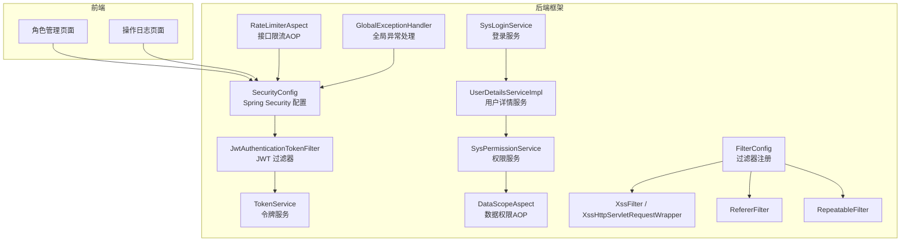
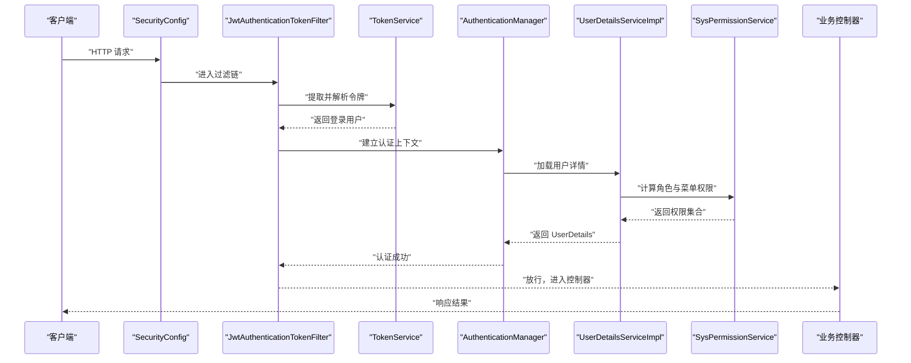
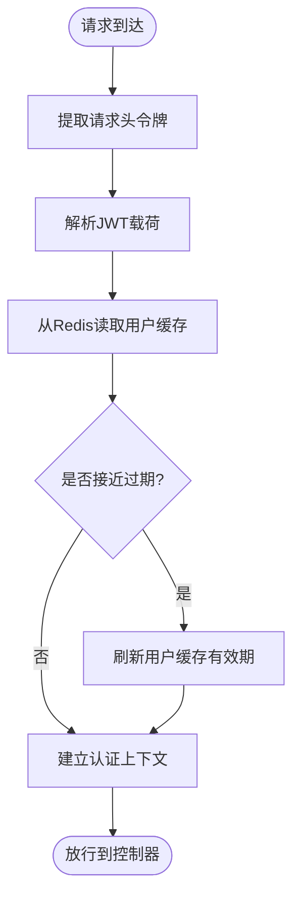
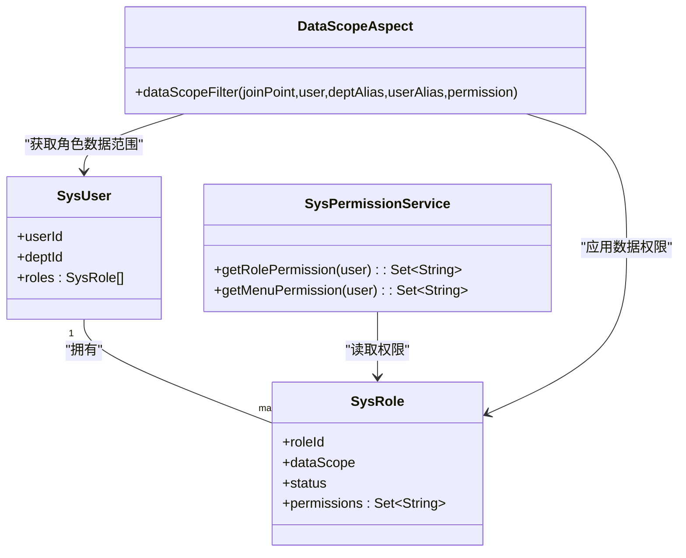
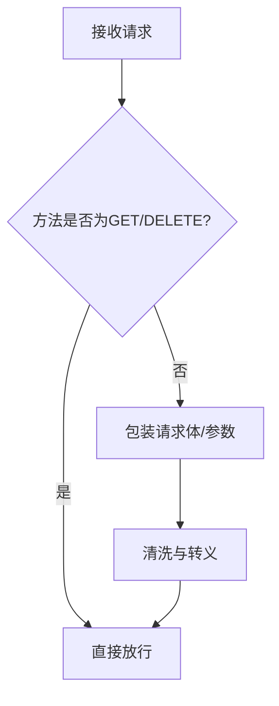
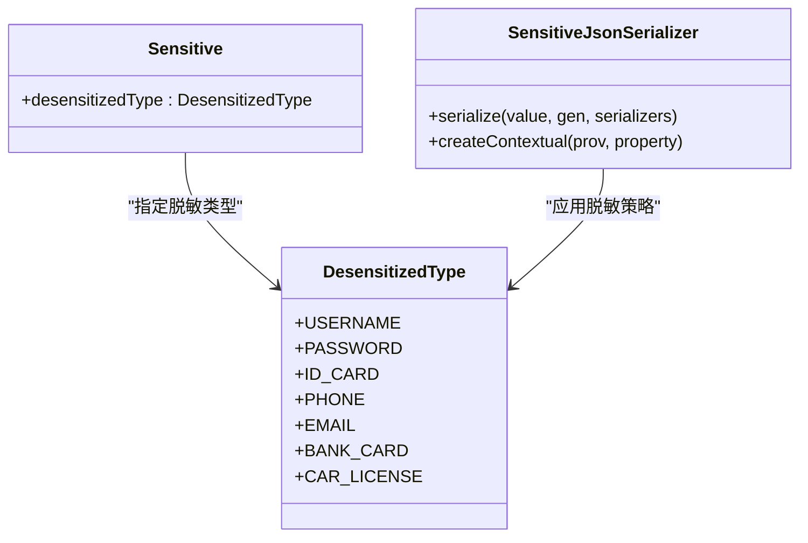
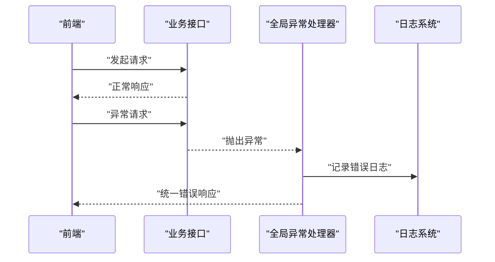
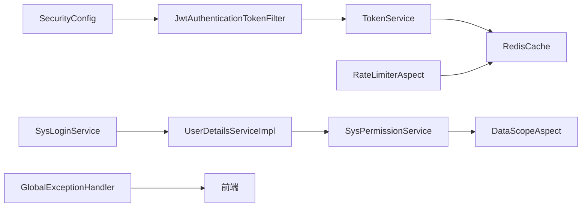

# 安全与权限

<cite>
**本文引用的文件**   
- [ruoyi-framework/src/main/java/com/ruoyi/framework/security/filter/JwtAuthenticationTokenFilter.java](file://ruoyi-framework/src/main/java/com/ruoyi/framework/security/filter/JwtAuthenticationTokenFilter.java)
- [ruoyi-framework/src/main/java/com/ruoyi/framework/web/service/TokenService.java](file://ruoyi-framework/src/main/java/com/ruoyi/framework/web/service/TokenService.java)
- [ruoyi-framework/src/main/java/com/ruoyi/framework/web/service/SysLoginService.java](file://ruoyi-framework/src/main/java/com/ruoyi/framework/web/service/SysLoginService.java)
- [ruoyi-framework/src/main/java/com/ruoyi/framework/web/service/UserDetailsServiceImpl.java](file://ruoyi-framework/src/main/java/com/ruoyi/framework/web/service/UserDetailsServiceImpl.java)
- [ruoyi-framework/src/main/java/com/ruoyi/framework/web/service/SysPermissionService.java](file://ruoyi-framework/src/main/java/com/ruoyi/framework/web/service/SysPermissionService.java)
- [ruoyi-framework/src/main/java/com/ruoyi/framework/aspectj/DataScopeAspect.java](file://ruoyi-framework/src/main/java/com/ruoyi/framework/aspectj/DataScopeAspect.java)
- [ruoyi-framework/src/main/java/com/ruoyi/framework/aspectj/RateLimiterAspect.java](file://ruoyi-framework/src/main/java/com/ruoyi/framework/aspectj/RateLimiterAspect.java)
- [ruoyi-framework/src/main/java/com/ruoyi/framework/web/exception/GlobalExceptionHandler.java](file://ruoyi-framework/src/main/java/com/ruoyi/framework/web/exception/GlobalExceptionHandler.java)
- [ruoyi-framework/src/main/java/com/ruoyi/framework/config/SecurityConfig.java](file://ruoyi-framework/src/main/java/com/ruoyi/framework/config/SecurityConfig.java)
- [ruoyi-framework/src/main/java/com/ruoyi/framework/config/FilterConfig.java](file://ruoyi-framework/src/main/java/com/ruoyi/framework/config/FilterConfig.java)
- [ruoyi-common/src/main/java/com/ruoyi/common/filter/XssFilter.java](file://ruoyi-common/src/main/java/com/ruoyi/common/filter/XssFilter.java)
- [ruoyi-common/src/main/java/com/ruoyi/common/filter/XssHttpServletRequestWrapper.java](file://ruoyi-common/src/main/java/com/ruoyi/common/filter/XssHttpServletRequestWrapper.java)
- [ruoyi-common/src/main/java/com/ruoyi/common/filter/RefererFilter.java](file://ruoyi-common/src/main/java/com/ruoyi/common/filter/RefererFilter.java)
- [ruoyi-common/src/main/java/com/ruoyi/common/filter/RepeatableFilter.java](file://ruoyi-common/src/main/java/com/ruoyi/common/filter/RepeatableFilter.java)
- [ruoyi-common/src/main/java/com/ruoyi/common/annotation/RepeatSubmit.java](file://ruoyi-common/src/main/java/com/ruoyi/common/annotation/RepeatSubmit.java)
- [ruoyi-framework/src/main/java/com/ruoyi/framework/interceptor/RepeatSubmitInterceptor.java](file://ruoyi-framework/src/main/java/com/ruoyi/framework/interceptor/RepeatSubmitInterceptor.java)
- [ruoyi-framework/src/main/java/com/ruoyi/framework/interceptor/impl/SameUrlDataInterceptor.java](file://ruoyi-framework/src/main/java/com/ruoyi/framework/interceptor/impl/SameUrlDataInterceptor.java)
- [ruoyi-common/src/main/java/com/ruoyi/common/annotation/Sensitive.java](file://ruoyi-common/src/main/java/com/ruoyi/common/annotation/Sensitive.java)
- [ruoyi-common/src/main/java/com/ruoyi/common/config/serializer/SensitiveJsonSerializer.java](file://ruoyi-common/src/main/java/com/ruoyi/common/config/serializer/SensitiveJsonSerializer.java)
- [ruoyi-common/src/main/java/com/ruoyi/common/enums/DesensitizedType.java](file://ruoyi-common/src/main/java/com/ruoyi/common/enums/DesensitizedType.java)
- [ruoyi-common/src/main/java/com/ruoyi/common/utils/DesensitizedUtil.java](file://ruoyi-common/src/main/java/com/ruoyi/common/utils/DesensitizedUtil.java)
- [ruoyi-ui/src/views/system/role/index.vue](file://ruoyi-ui/src/views/system/role/index.vue)
- [ruoyi-ui/src/views/monitor/operlog/index.vue](file://ruoyi-ui/src/views/monitor/operlog/index.vue)
</cite>

## 目录
1. [引言](#引言)
2. [项目结构](#项目结构)
3. [核心组件](#核心组件)
4. [架构总览](#架构总览)
5. [详细组件分析](#详细组件分析)
6. [依赖分析](#依赖分析)
7. [性能考虑](#性能考虑)
8. [故障排查指南](#故障排查指南)
9. [结论](#结论)
10. [附录](#附录)

## 引言
本文件面向港好住信息系统，系统性梳理其“安全与权限”主题，覆盖基于 JWT 的认证授权机制（令牌生成、验证、刷新、失效处理）、RBAC 权限体系（菜单权限、按钮权限、数据权限）、安全防护（XSS、SQL 注入、CSRF、重复提交、接口限流）、敏感数据处理（字段脱敏、密码加密存储、日志脱敏）、安全审计（操作日志、审计追踪、异常监控）以及安全管理实践（安全配置、漏洞扫描、应急响应）。文档以代码为依据，配合可视化图示帮助读者快速理解与落地。

## 项目结构
围绕“安全与权限”的关键模块分布于框架层与通用工具层：
- 框架层（ruoyi-framework）：Spring Security 配置、JWT 过滤器、登录/权限服务、AOP 限流与数据权限、全局异常处理、拦截器与过滤器注册。
- 通用工具层（ruoyi-common）：XSS 过滤、Referer 防盗链、重复读取包装、脱敏注解与序列化器、异常基类等。
- 控制台前端（ruoyi-ui）：角色管理界面（菜单/数据权限配置）、操作日志界面（审计展示）。

**图表来源**
- [ruoyi-framework/src/main/java/com/ruoyi/framework/config/SecurityConfig.java:1-68](file://ruoyi-framework/src/main/java/com/ruoyi/framework/config/SecurityConfig.java#L1-L68)
- [ruoyi-framework/src/main/java/com/ruoyi/framework/security/filter/JwtAuthenticationTokenFilter.java:1-45](file://ruoyi-framework/src/main/java/com/ruoyi/framework/security/filter/JwtAuthenticationTokenFilter.java#L1-L45)
- [ruoyi-framework/src/main/java/com/ruoyi/framework/web/service/TokenService.java:1-233](file://ruoyi-framework/src/main/java/com/ruoyi/framework/web/service/TokenService.java#L1-L233)
- [ruoyi-framework/src/main/java/com/ruoyi/framework/web/service/SysLoginService.java:1-177](file://ruoyi-framework/src/main/java/com/ruoyi/framework/web/service/SysLoginService.java#L1-L177)
- [ruoyi-framework/src/main/java/com/ruoyi/framework/web/service/UserDetailsServiceImpl.java:1-67](file://ruoyi-framework/src/main/java/com/ruoyi/framework/web/service/UserDetailsServiceImpl.java#L1-L67)
- [ruoyi-framework/src/main/java/com/ruoyi/framework/web/service/SysPermissionService.java:1-89](file://ruoyi-framework/src/main/java/com/ruoyi/framework/web/service/SysPermissionService.java#L1-L89)
- [ruoyi-framework/src/main/java/com/ruoyi/framework/aspectj/DataScopeAspect.java:1-185](file://ruoyi-framework/src/main/java/com/ruoyi/framework/aspectj/DataScopeAspect.java#L1-L185)
- [ruoyi-framework/src/main/java/com/ruoyi/framework/aspectj/RateLimiterAspect.java:1-90](file://ruoyi-framework/src/main/java/com/ruoyi/framework/aspectj/RateLimiterAspect.java#L1-L90)
- [ruoyi-framework/src/main/java/com/ruoyi/framework/web/exception/GlobalExceptionHandler.java:1-146](file://ruoyi-framework/src/main/java/com/ruoyi/framework/web/exception/GlobalExceptionHandler.java#L1-L146)
- [ruoyi-framework/src/main/java/com/ruoyi/framework/config/FilterConfig.java:1-80](file://ruoyi-framework/src/main/java/com/ruoyi/framework/config/FilterConfig.java#L1-L80)
- [ruoyi-common/src/main/java/com/ruoyi/common/filter/XssFilter.java:1-75](file://ruoyi-common/src/main/java/com/ruoyi/common/filter/XssFilter.java#L1-L75)
- [ruoyi-common/src/main/java/com/ruoyi/common/filter/XssHttpServletRequestWrapper.java:1-46](file://ruoyi-common/src/main/java/com/ruoyi/common/filter/XssHttpServletRequestWrapper.java#L1-L46)
- [ruoyi-common/src/main/java/com/ruoyi/common/filter/RefererFilter.java:1-48](file://ruoyi-common/src/main/java/com/ruoyi/common/filter/RefererFilter.java#L1-L48)
- [ruoyi-common/src/main/java/com/ruoyi/common/filter/RepeatableFilter.java:1-52](file://ruoyi-common/src/main/java/com/ruoyi/common/filter/RepeatableFilter.java#L1-L52)

**章节来源**
- [ruoyi-framework/src/main/java/com/ruoyi/framework/config/SecurityConfig.java:1-68](file://ruoyi-framework/src/main/java/com/ruoyi/framework/config/SecurityConfig.java#L1-L68)
- [ruoyi-framework/src/main/java/com/ruoyi/framework/config/FilterConfig.java:1-80](file://ruoyi-framework/src/main/java/com/ruoyi/framework/config/FilterConfig.java#L1-L80)

## 核心组件
- 认证授权核心
  - Spring Security 配置：启用方法级安全、跨域、匿名放行路径、JWT 过滤器与登出处理。
  - JWT 过滤器：解析请求头中的令牌，加载用户上下文，完成认证。
  - 令牌服务：生成、解析、刷新、失效、持久化到 Redis。
  - 登录服务：验证码校验、前置校验、认证、生成令牌、异步记录登录日志。
  - 用户详情服务：按用户名加载用户、状态校验、构建登录用户对象。
  - 权限服务：角色权限与菜单权限聚合，管理员拥有最高权限。
- 权限控制
  - RBAC：角色-权限-菜单映射；按钮权限通过权限字符串控制。
  - 数据权限：基于角色数据范围（全部、自定义、部门、部门及子级、仅本人）的 SQL 过滤。
- 安全防护
  - XSS：对 POST/PUT 等非安全方法进行请求体与参数清洗。
  - CSRF：通过 Referer 白名单防盗链。
  - 重复提交：基于 Redis 的同 URL+消息头+请求体/参数的幂等校验。
  - 接口限流：Lua 脚本原子计数限流。
- 敏感数据处理
  - 字段脱敏：注解驱动的 JSON 序列化脱敏，管理员不脱敏。
  - 密码加密：BCrypt 存储。
  - 日志脱敏：统一转义输出。
- 审计与异常
  - 全局异常处理：统一返回结构与日志记录。
  - 操作日志：前端可查看与清理。

**章节来源**
- [ruoyi-framework/src/main/java/com/ruoyi/framework/security/filter/JwtAuthenticationTokenFilter.java:1-45](file://ruoyi-framework/src/main/java/com/ruoyi/framework/security/filter/JwtAuthenticationTokenFilter.java#L1-L45)
- [ruoyi-framework/src/main/java/com/ruoyi/framework/web/service/TokenService.java:1-233](file://ruoyi-framework/src/main/java/com/ruoyi/framework/web/service/TokenService.java#L1-L233)
- [ruoyi-framework/src/main/java/com/ruoyi/framework/web/service/SysLoginService.java:1-177](file://ruoyi-framework/src/main/java/com/ruoyi/framework/web/service/SysLoginService.java#L1-L177)
- [ruoyi-framework/src/main/java/com/ruoyi/framework/web/service/UserDetailsServiceImpl.java:1-67](file://ruoyi-framework/src/main/java/com/ruoyi/framework/web/service/UserDetailsServiceImpl.java#L1-L67)
- [ruoyi-framework/src/main/java/com/ruoyi/framework/web/service/SysPermissionService.java:1-89](file://ruoyi-framework/src/main/java/com/ruoyi/framework/web/service/SysPermissionService.java#L1-L89)
- [ruoyi-framework/src/main/java/com/ruoyi/framework/aspectj/DataScopeAspect.java:1-185](file://ruoyi-framework/src/main/java/com/ruoyi/framework/aspectj/DataScopeAspect.java#L1-L185)
- [ruoyi-framework/src/main/java/com/ruoyi/framework/aspectj/RateLimiterAspect.java:1-90](file://ruoyi-framework/src/main/java/com/ruoyi/framework/aspectj/RateLimiterAspect.java#L1-L90)
- [ruoyi-framework/src/main/java/com/ruoyi/framework/web/exception/GlobalExceptionHandler.java:1-146](file://ruoyi-framework/src/main/java/com/ruoyi/framework/web/exception/GlobalExceptionHandler.java#L1-L146)
- [ruoyi-common/src/main/java/com/ruoyi/common/filter/XssFilter.java:1-75](file://ruoyi-common/src/main/java/com/ruoyi/common/filter/XssFilter.java#L1-L75)
- [ruoyi-common/src/main/java/com/ruoyi/common/filter/RefererFilter.java:1-48](file://ruoyi-common/src/main/java/com/ruoyi/common/filter/RefererFilter.java#L1-L48)
- [ruoyi-common/src/main/java/com/ruoyi/common/filter/RepeatableFilter.java:1-52](file://ruoyi-common/src/main/java/com/ruoyi/common/filter/RepeatableFilter.java#L1-L52)
- [ruoyi-common/src/main/java/com/ruoyi/common/annotation/RepeatSubmit.java:1-31](file://ruoyi-common/src/main/java/com/ruoyi/common/annotation/RepeatSubmit.java#L1-L31)
- [ruoyi-framework/src/main/java/com/ruoyi/framework/interceptor/RepeatSubmitInterceptor.java:1-56](file://ruoyi-framework/src/main/java/com/ruoyi/framework/interceptor/RepeatSubmitInterceptor.java#L1-L56)
- [ruoyi-framework/src/main/java/com/ruoyi/framework/interceptor/impl/SameUrlDataInterceptor.java:1-66](file://ruoyi-framework/src/main/java/com/ruoyi/framework/interceptor/impl/SameUrlDataInterceptor.java#L1-L66)
- [ruoyi-common/src/main/java/com/ruoyi/common/annotation/Sensitive.java:1-24](file://ruoyi-common/src/main/java/com/ruoyi/common/annotation/Sensitive.java#L1-L24)
- [ruoyi-common/src/main/java/com/ruoyi/common/config/serializer/SensitiveJsonSerializer.java:1-67](file://ruoyi-common/src/main/java/com/ruoyi/common/config/serializer/SensitiveJsonSerializer.java#L1-L67)
- [ruoyi-common/src/main/java/com/ruoyi/common/enums/DesensitizedType.java:1-59](file://ruoyi-common/src/main/java/com/ruoyi/common/enums/DesensitizedType.java#L1-L59)
- [ruoyi-common/src/main/java/com/ruoyi/common/utils/DesensitizedUtil.java:1-49](file://ruoyi-common/src/main/java/com/ruoyi/common/utils/DesensitizedUtil.java#L1-L49)

## 架构总览
下图展示了“认证—授权—权限控制—安全防护—审计”的整体流程与关键组件交互。

**图表来源**
- [ruoyi-framework/src/main/java/com/ruoyi/framework/config/SecurityConfig.java:1-68](file://ruoyi-framework/src/main/java/com/ruoyi/framework/config/SecurityConfig.java#L1-L68)
- [ruoyi-framework/src/main/java/com/ruoyi/framework/security/filter/JwtAuthenticationTokenFilter.java:1-45](file://ruoyi-framework/src/main/java/com/ruoyi/framework/security/filter/JwtAuthenticationTokenFilter.java#L1-L45)
- [ruoyi-framework/src/main/java/com/ruoyi/framework/web/service/TokenService.java:1-233](file://ruoyi-framework/src/main/java/com/ruoyi/framework/web/service/TokenService.java#L1-L233)
- [ruoyi-framework/src/main/java/com/ruoyi/framework/web/service/UserDetailsServiceImpl.java:1-67](file://ruoyi-framework/src/main/java/com/ruoyi/framework/web/service/UserDetailsServiceImpl.java#L1-L67)
- [ruoyi-framework/src/main/java/com/ruoyi/framework/web/service/SysPermissionService.java:1-89](file://ruoyi-framework/src/main/java/com/ruoyi/framework/web/service/SysPermissionService.java#L1-L89)

## 详细组件分析

### JWT 认证授权机制
- 令牌生成
  - 登录成功后，系统生成唯一 UUID 作为令牌标识，写入用户对象，设置 UA、IP、位置、浏览器与操作系统信息，随后缓存到 Redis 并签发 JWT。
- 令牌验证
  - 过滤器在每次请求时提取请求头中的令牌，解析载荷，从 Redis 读取用户缓存，若距离过期时间小于阈值则刷新缓存有效期。
- 令牌刷新
  - 当用户即将过期时自动刷新，延长有效期，保证连续会话体验。
- 令牌失效
  - 登出或服务端主动删除 Redis 中的用户缓存即刻失效；也可结合黑名单策略扩展。

**图表来源**
- [ruoyi-framework/src/main/java/com/ruoyi/framework/security/filter/JwtAuthenticationTokenFilter.java:1-45](file://ruoyi-framework/src/main/java/com/ruoyi/framework/security/filter/JwtAuthenticationTokenFilter.java#L1-L45)
- [ruoyi-framework/src/main/java/com/ruoyi/framework/web/service/TokenService.java:1-233](file://ruoyi-framework/src/main/java/com/ruoyi/framework/web/service/TokenService.java#L1-L233)

**章节来源**
- [ruoyi-framework/src/main/java/com/ruoyi/framework/web/service/SysLoginService.java:1-177](file://ruoyi-framework/src/main/java/com/ruoyi/framework/web/service/SysLoginService.java#L1-L177)
- [ruoyi-framework/src/main/java/com/ruoyi/framework/web/service/TokenService.java:1-233](file://ruoyi-framework/src/main/java/com/ruoyi/framework/web/service/TokenService.java#L1-L233)

### RBAC 权限体系
- 角色与权限
  - 管理员拥有所有权限；普通用户通过角色继承权限集合。
- 菜单权限
  - 通过权限字符串控制菜单与按钮可见性与可操作性。
- 数据权限
  - 基于角色数据范围（全部、自定义、部门、部门及子级、仅本人）动态拼接 SQL 条件，确保查询范围受限。

**图表来源**
- [ruoyi-framework/src/main/java/com/ruoyi/framework/web/service/SysPermissionService.java:1-89](file://ruoyi-framework/src/main/java/com/ruoyi/framework/web/service/SysPermissionService.java#L1-L89)
- [ruoyi-framework/src/main/java/com/ruoyi/framework/aspectj/DataScopeAspect.java:1-185](file://ruoyi-framework/src/main/java/com/ruoyi/framework/aspectj/DataScopeAspect.java#L1-L185)

**章节来源**
- [ruoyi-framework/src/main/java/com/ruoyi/framework/web/service/SysPermissionService.java:1-89](file://ruoyi-framework/src/main/java/com/ruoyi/framework/web/service/SysPermissionService.java#L1-L89)
- [ruoyi-framework/src/main/java/com/ruoyi/framework/aspectj/DataScopeAspect.java:1-185](file://ruoyi-framework/src/main/java/com/ruoyi/framework/aspectj/DataScopeAspect.java#L1-L185)
- [ruoyi-ui/src/views/system/role/index.vue:400-577](file://ruoyi-ui/src/views/system/role/index.vue#L400-L577)

### 安全防护措施
- XSS 防护
  - 对非 GET/DELETE 方法的请求进行包装，清洗参数与请求体，避免脚本注入。
- CSRF 防护
  - 通过 Referer 白名单过滤器，拒绝无来源或非允许域名的请求。
- 重复提交防护
  - 基于 Redis 缓存请求 URL+消息头+请求体/参数，设定时间窗口，超过阈值直接返回错误。
- 接口限流
  - 使用 Lua 脚本在 Redis 中原子计数，超限抛出业务异常。

**图表来源**
- [ruoyi-common/src/main/java/com/ruoyi/common/filter/XssFilter.java:1-75](file://ruoyi-common/src/main/java/com/ruoyi/common/filter/XssFilter.java#L1-L75)
- [ruoyi-common/src/main/java/com/ruoyi/common/filter/XssHttpServletRequestWrapper.java:1-46](file://ruoyi-common/src/main/java/com/ruoyi/common/filter/XssHttpServletRequestWrapper.java#L1-L46)
- [ruoyi-common/src/main/java/com/ruoyi/common/filter/RefererFilter.java:1-48](file://ruoyi-common/src/main/java/com/ruoyi/common/filter/RefererFilter.java#L1-L48)
- [ruoyi-common/src/main/java/com/ruoyi/common/filter/RepeatableFilter.java:1-52](file://ruoyi-common/src/main/java/com/ruoyi/common/filter/RepeatableFilter.java#L1-L52)
- [ruoyi-framework/src/main/java/com/ruoyi/framework/interceptor/impl/SameUrlDataInterceptor.java:1-66](file://ruoyi-framework/src/main/java/com/ruoyi/framework/interceptor/impl/SameUrlDataInterceptor.java#L1-L66)
- [ruoyi-framework/src/main/java/com/ruoyi/framework/aspectj/RateLimiterAspect.java:1-90](file://ruoyi-framework/src/main/java/com/ruoyi/framework/aspectj/RateLimiterAspect.java#L1-L90)

**章节来源**
- [ruoyi-framework/src/main/java/com/ruoyi/framework/config/FilterConfig.java:1-80](file://ruoyi-framework/src/main/java/com/ruoyi/framework/config/FilterConfig.java#L1-L80)
- [ruoyi-common/src/main/java/com/ruoyi/common/annotation/RepeatSubmit.java:1-31](file://ruoyi-common/src/main/java/com/ruoyi/common/annotation/RepeatSubmit.java#L1-L31)
- [ruoyi-framework/src/main/java/com/ruoyi/framework/interceptor/RepeatSubmitInterceptor.java:1-56](file://ruoyi-framework/src/main/java/com/ruoyi/framework/interceptor/RepeatSubmitInterceptor.java#L1-L56)

### 敏感数据处理
- 字段脱敏
  - 通过注解与 Jackson 序列化器，在返回给前端前对敏感字段进行脱敏；管理员不脱敏。
- 密码加密
  - 使用 BCrypt 进行密码加密存储，登录时进行比对。
- 日志脱敏
  - 统一进行 HTML 转义，避免日志中出现可执行脚本。

**图表来源**
- [ruoyi-common/src/main/java/com/ruoyi/common/annotation/Sensitive.java:1-24](file://ruoyi-common/src/main/java/com/ruoyi/common/annotation/Sensitive.java#L1-L24)
- [ruoyi-common/src/main/java/com/ruoyi/common/enums/DesensitizedType.java:1-59](file://ruoyi-common/src/main/java/com/ruoyi/common/enums/DesensitizedType.java#L1-L59)
- [ruoyi-common/src/main/java/com/ruoyi/common/config/serializer/SensitiveJsonSerializer.java:1-67](file://ruoyi-common/src/main/java/com/ruoyi/common/config/serializer/SensitiveJsonSerializer.java#L1-L67)
- [ruoyi-common/src/main/java/com/ruoyi/common/utils/DesensitizedUtil.java:1-49](file://ruoyi-common/src/main/java/com/ruoyi/common/utils/DesensitizedUtil.java#L1-L49)

**章节来源**
- [ruoyi-common/src/main/java/com/ruoyi/common/config/serializer/SensitiveJsonSerializer.java:1-67](file://ruoyi-common/src/main/java/com/ruoyi/common/config/serializer/SensitiveJsonSerializer.java#L1-L67)
- [ruoyi-framework/src/main/java/com/ruoyi/framework/config/SecurityConfig.java:1-68](file://ruoyi-framework/src/main/java/com/ruoyi/framework/config/SecurityConfig.java#L1-L68)

### 安全审计与异常监控
- 操作日志
  - 前端提供操作日志列表、删除与清空功能，便于审计追踪。
- 全局异常处理
  - 统一捕获各类异常，记录错误日志并返回标准化响应，避免敏感信息泄露。

**图表来源**
- [ruoyi-framework/src/main/java/com/ruoyi/framework/web/exception/GlobalExceptionHandler.java:1-146](file://ruoyi-framework/src/main/java/com/ruoyi/framework/web/exception/GlobalExceptionHandler.java#L1-L146)
- [ruoyi-ui/src/views/monitor/operlog/index.vue:188-210](file://ruoyi-ui/src/views/monitor/operlog/index.vue#L188-L210)

**章节来源**
- [ruoyi-framework/src/main/java/com/ruoyi/framework/web/exception/GlobalExceptionHandler.java:1-146](file://ruoyi-framework/src/main/java/com/ruoyi/framework/web/exception/GlobalExceptionHandler.java#L1-L146)
- [ruoyi-ui/src/views/monitor/operlog/index.vue:188-210](file://ruoyi-ui/src/views/monitor/operlog/index.vue#L188-L210)

## 依赖分析
- 组件耦合
  - SecurityConfig 与 JwtAuthenticationTokenFilter 耦合紧密，前者负责装配后者。
  - TokenService 与 RedisCache 耦合，用于令牌与用户缓存。
  - UserDetailsServiceImpl 依赖 SysPermissionService 与 ISysUserService。
  - DataScopeAspect 依赖 SecurityUtils 与权限上下文，动态拼接 SQL。
  - RateLimiterAspect 依赖 RedisTemplate 与 Lua 脚本。
- 外部依赖
  - Spring Security、Redis、JWT、BCrypt。

**图表来源**
- [ruoyi-framework/src/main/java/com/ruoyi/framework/config/SecurityConfig.java:1-68](file://ruoyi-framework/src/main/java/com/ruoyi/framework/config/SecurityConfig.java#L1-L68)
- [ruoyi-framework/src/main/java/com/ruoyi/framework/security/filter/JwtAuthenticationTokenFilter.java:1-45](file://ruoyi-framework/src/main/java/com/ruoyi/framework/security/filter/JwtAuthenticationTokenFilter.java#L1-L45)
- [ruoyi-framework/src/main/java/com/ruoyi/framework/web/service/TokenService.java:1-233](file://ruoyi-framework/src/main/java/com/ruoyi/framework/web/service/TokenService.java#L1-L233)
- [ruoyi-framework/src/main/java/com/ruoyi/framework/web/service/SysLoginService.java:1-177](file://ruoyi-framework/src/main/java/com/ruoyi/framework/web/service/SysLoginService.java#L1-L177)
- [ruoyi-framework/src/main/java/com/ruoyi/framework/web/service/UserDetailsServiceImpl.java:1-67](file://ruoyi-framework/src/main/java/com/ruoyi/framework/web/service/UserDetailsServiceImpl.java#L1-L67)
- [ruoyi-framework/src/main/java/com/ruoyi/framework/web/service/SysPermissionService.java:1-89](file://ruoyi-framework/src/main/java/com/ruoyi/framework/web/service/SysPermissionService.java#L1-L89)
- [ruoyi-framework/src/main/java/com/ruoyi/framework/aspectj/DataScopeAspect.java:1-185](file://ruoyi-framework/src/main/java/com/ruoyi/framework/aspectj/DataScopeAspect.java#L1-L185)
- [ruoyi-framework/src/main/java/com/ruoyi/framework/aspectj/RateLimiterAspect.java:1-90](file://ruoyi-framework/src/main/java/com/ruoyi/framework/aspectj/RateLimiterAspect.java#L1-L90)
- [ruoyi-framework/src/main/java/com/ruoyi/framework/web/exception/GlobalExceptionHandler.java:1-146](file://ruoyi-framework/src/main/java/com/ruoyi/framework/web/exception/GlobalExceptionHandler.java#L1-L146)

## 性能考虑
- 令牌与用户缓存
  - 将用户对象缓存在 Redis，减少数据库与复杂权限计算的开销；合理设置过期时间与刷新阈值。
- 权限计算
  - 角色与菜单权限在登录时一次性计算并注入 UserDetails，后续请求无需重复计算。
- 数据权限
  - SQL 条件拼接在 AOP 中完成，注意避免过度复杂的 IN 查询；必要时优化角色数据范围配置。
- 限流与重复提交
  - Redis 原子计数与幂等键设计降低并发冲突成本；合理设置窗口与阈值平衡用户体验与安全。

## 故障排查指南
- 登录失败
  - 检查验证码开关与缓存键、前置校验（用户名/密码长度、黑名单 IP）。
- 令牌无效
  - 确认请求头携带令牌、签名密钥一致、Redis 中用户缓存是否存在。
- 权限不足
  - 核对角色权限字符串与菜单配置；确认数据权限范围是否正确。
- XSS/CSRF 生效
  - 检查过滤器注册顺序与 URL 匹配；Referer 白名单是否包含前端域名。
- 重复提交/限流
  - 查看 Redis 中幂等键与计数；调整注解参数或限流策略。

**章节来源**
- [ruoyi-framework/src/main/java/com/ruoyi/framework/web/service/SysLoginService.java:1-177](file://ruoyi-framework/src/main/java/com/ruoyi/framework/web/service/SysLoginService.java#L1-L177)
- [ruoyi-framework/src/main/java/com/ruoyi/framework/web/service/TokenService.java:1-233](file://ruoyi-framework/src/main/java/com/ruoyi/framework/web/service/TokenService.java#L1-L233)
- [ruoyi-framework/src/main/java/com/ruoyi/framework/web/service/SysPermissionService.java:1-89](file://ruoyi-framework/src/main/java/com/ruoyi/framework/web/service/SysPermissionService.java#L1-L89)
- [ruoyi-framework/src/main/java/com/ruoyi/framework/config/FilterConfig.java:1-80](file://ruoyi-framework/src/main/java/com/ruoyi/framework/config/FilterConfig.java#L1-L80)
- [ruoyi-framework/src/main/java/com/ruoyi/framework/interceptor/impl/SameUrlDataInterceptor.java:1-66](file://ruoyi-framework/src/main/java/com/ruoyi/framework/interceptor/impl/SameUrlDataInterceptor.java#L1-L66)
- [ruoyi-framework/src/main/java/com/ruoyi/framework/aspectj/RateLimiterAspect.java:1-90](file://ruoyi-framework/src/main/java/com/ruoyi/framework/aspectj/RateLimiterAspect.java#L1-L90)

## 结论
港好住信息系统采用“Spring Security + JWT + RBAC + AOP 数据权限 + 多维安全防护”的安全架构，具备完善的认证授权、细粒度权限控制、敏感数据保护与审计能力。通过 Redis 缓存与限流、XSS/CSRF 防护、重复提交与全局异常处理，系统在保障安全性的同时兼顾性能与可用性。建议持续完善安全配置、定期进行漏洞扫描与应急演练，确保生产环境稳定可靠。

## 附录
- 安全配置要点
  - 开启并合理配置 XSS、Referer、重复读取过滤器。
  - 设置合理的令牌有效期与刷新阈值，启用 Redis 缓存。
  - 明确匿名放行路径与权限白名单。
- 漏洞扫描方法
  - 使用自动化工具（如 OWASP ZAP、SonarQube）扫描常见漏洞；定期进行渗透测试。
- 应急响应预案
  - 快速定位异常日志与操作日志；临时封禁高风险接口；回滚可疑变更；恢复 Redis 缓存与数据库备份。