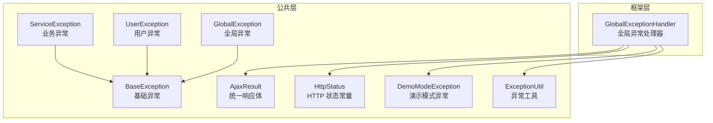
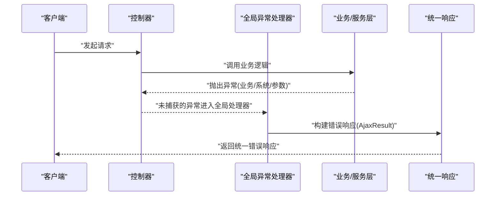
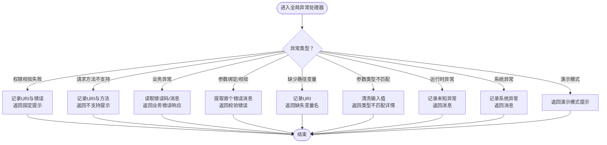
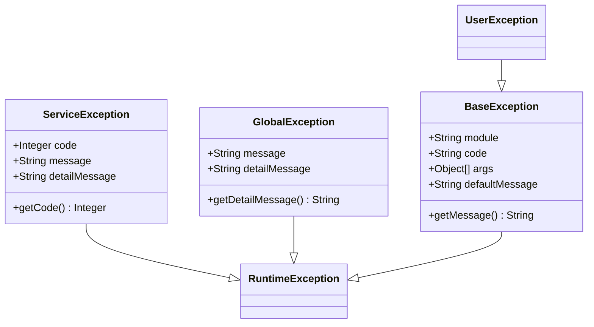
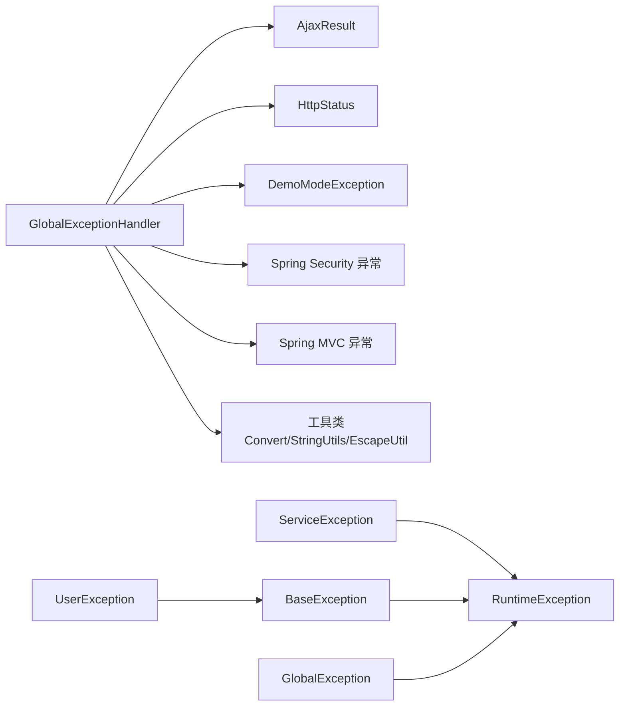

# 全局异常处理

<cite>
**本文引用的文件**
- [GlobalExceptionHandler.java](file://ruoyi-framework/src/main/java/com/ruoyi/framework/web/exception/GlobalExceptionHandler.java)
- [GlobalException.java](file://ruoyi-common/src/main/java/com/ruoyi/common/exception/GlobalException.java)
- [BaseException.java](file://ruoyi-common/src/main/java/com/ruoyi/common/exception/base/BaseException.java)
- [ServiceException.java](file://ruoyi-common/src/main/java/com/ruoyi/common/exception/ServiceException.java)
- [UserException.java](file://ruoyi-common/src/main/java/com/ruoyi/common/exception/user/UserException.java)
- [AjaxResult.java](file://ruoyi-common/src/main/java/com/ruoyi/common/core/domain/AjaxResult.java)
- [HttpStatus.java](file://ruoyi-common/src/main/java/com/ruoyi/common/constant/HttpStatus.java)
- [DemoModeException.java](file://ruoyi-common/src/main/java/com/ruoyi/common/exception/DemoModeException.java)
- [ExceptionUtil.java](file://ruoyi-common/src/main/java/com/ruoyi/common/utils/ExceptionUtil.java)
</cite>

## 目录
1. [简介](#简介)
2. [项目结构](#项目结构)
3. [核心组件](#核心组件)
4. [架构总览](#架构总览)
5. [详细组件分析](#详细组件分析)
6. [依赖分析](#依赖分析)
7. [性能考量](#性能考量)
8. [故障排查指南](#故障排查指南)
9. [结论](#结论)
10. [附录](#附录)

## 简介
本文件系统性梳理港好住信息系统中的全局异常处理机制，围绕以下目标展开：
- 全局异常处理器：异常类型识别、异常分类处理、错误响应生成、异常信息屏蔽等核心能力
- 异常体系设计：基础异常、全局异常、用户异常、服务异常等多层架构
- 处理策略：业务异常、系统异常、参数异常、权限异常等场景的差异化处理
- 安全处理：敏感信息过滤、错误码标准化、异常日志记录、用户体验优化
- 配置与扩展：异常映射规则、自定义异常定义、异常处理扩展点、调试模式配置

## 项目结构
全局异常处理相关代码主要分布在两个模块：
- framework 层：提供统一的全局异常处理器，面向 Spring MVC/WebFlux 的@RestControllerAdvice
- common 层：提供异常基类与常用异常类型，以及统一响应体与状态常量

图表来源
- [GlobalExceptionHandler.java:1-146](file://ruoyi-framework/src/main/java/com/ruoyi/framework/web/exception/GlobalExceptionHandler.java#L1-146)
- [AjaxResult.java](file://ruoyi-common/src/main/java/com/ruoyi/common/core/domain/AjaxResult.java)
- [HttpStatus.java](file://ruoyi-common/src/main/java/com/ruoyi/common/constant/HttpStatus.java)
- [BaseException.java:1-98](file://ruoyi-common/src/main/java/com/ruoyi/common/exception/base/BaseException.java#L1-98)
- [ServiceException.java:1-74](file://ruoyi-common/src/main/java/com/ruoyi/common/exception/ServiceException.java#L1-74)
- [UserException.java:1-19](file://ruoyi-common/src/main/java/com/ruoyi/common/exception/user/UserException.java#L1-19)
- [GlobalException.java:1-58](file://ruoyi-common/src/main/java/com/ruoyi/common/exception/GlobalException.java#L1-58)
- [DemoModeException.java](file://ruoyi-common/src/main/java/com/ruoyi/common/exception/DemoModeException.java)
- [ExceptionUtil.java](file://ruoyi-common/src/main/java/com/ruoyi/common/utils/ExceptionUtil.java)

章节来源
- [GlobalExceptionHandler.java:1-146](file://ruoyi-framework/src/main/java/com/ruoyi/framework/web/exception/GlobalExceptionHandler.java#L1-146)
- [AjaxResult.java](file://ruoyi-common/src/main/java/com/ruoyi/common/core/domain/AjaxResult.java)
- [HttpStatus.java](file://ruoyi-common/src/main/java/com/ruoyi/common/constant/HttpStatus.java)
- [BaseException.java:1-98](file://ruoyi-common/src/main/java/com/ruoyi/common/exception/base/BaseException.java#L1-98)
- [ServiceException.java:1-74](file://ruoyi-common/src/main/java/com/ruoyi/common/exception/ServiceException.java#L1-74)
- [UserException.java:1-19](file://ruoyi-common/src/main/java/com/ruoyi/common/exception/user/UserException.java#L1-19)
- [GlobalException.java:1-58](file://ruoyi-common/src/main/java/com/ruoyi/common/exception/GlobalException.java#L1-58)
- [DemoModeException.java](file://ruoyi-common/src/main/java/com/ruoyi/common/exception/DemoModeException.java)
- [ExceptionUtil.java](file://ruoyi-common/src/main/java/com/ruoyi/common/utils/ExceptionUtil.java)

## 核心组件
- 全局异常处理器（GlobalExceptionHandler）
  - 使用@RestControllerAdvice对控制器层进行切面增强，集中捕获各类异常并返回统一响应
  - 对权限校验失败、请求方法不支持、业务异常、参数绑定与校验异常、运行时异常、系统异常、演示模式异常等进行分类处理
  - 统一通过AjaxResult输出错误响应，必要时使用HttpStatus进行状态码标注
- 异常基类与派生类
  - BaseException：提供模块化、可本地化的消息解析能力，支持错误码与默认消息
  - ServiceException：业务异常，携带业务错误码与消息
  - UserException：用户域异常，继承BaseException并限定模块域
  - GlobalException：全局异常，用于跨模块通用异常场景
- 统一响应与状态
  - AjaxResult：封装统一的响应结构（含状态码、消息、数据等）
  - HttpStatus：提供标准HTTP状态常量，便于在权限拒绝等场景返回明确状态码

章节来源
- [GlobalExceptionHandler.java:22-146](file://ruoyi-framework/src/main/java/com/ruoyi/framework/web/exception/GlobalExceptionHandler.java#L22-146)
- [BaseException.java:11-97](file://ruoyi-common/src/main/java/com/ruoyi/common/exception/base/BaseException.java#L11-97)
- [ServiceException.java:8-74](file://ruoyi-common/src/main/java/com/ruoyi/common/exception/ServiceException.java#L8-74)
- [UserException.java:10-18](file://ruoyi-common/src/main/java/com/ruoyi/common/exception/user/UserException.java#L10-18)
- [GlobalException.java:8-58](file://ruoyi-common/src/main/java/com/ruoyi/common/exception/GlobalException.java#L8-58)
- [AjaxResult.java](file://ruoyi-common/src/main/java/com/ruoyi/common/core/domain/AjaxResult.java)
- [HttpStatus.java](file://ruoyi-common/src/main/java/com/ruoyi/common/constant/HttpStatus.java)

## 架构总览
全局异常处理采用“分层分类”的设计思路：
- 分层：framework 层负责异常捕获与响应生成；common 层提供异常模型与统一响应
- 分类：按异常来源分为业务异常、系统异常、参数异常、权限异常、演示模式异常等
- 统一：所有异常最终以AjaxResult形式返回，确保前后端交互一致性

图表来源
- [GlobalExceptionHandler.java:35-144](file://ruoyi-framework/src/main/java/com/ruoyi/framework/web/exception/GlobalExceptionHandler.java#L35-144)
- [AjaxResult.java](file://ruoyi-common/src/main/java/com/ruoyi/common/core/domain/AjaxResult.java)

## 详细组件分析

### 全局异常处理器（GlobalExceptionHandler）
- 异常类型识别与分类
  - 权限校验失败：拦截Spring Security的AccessDeniedException，记录请求URI与错误信息，返回固定提示
  - 请求方法不支持：拦截HttpRequestMethodNotSupportedException，返回不支持的请求方法
  - 业务异常：拦截ServiceException，优先使用异常内嵌错误码，否则回退到消息
  - 参数绑定与校验异常：拦截BindException与MethodArgumentNotValidException，提取首个错误消息
  - 缺少路径变量：拦截MissingPathVariableException，返回缺失变量名
  - 参数类型不匹配：拦截MethodArgumentTypeMismatchException，清洗并返回类型不匹配详情
  - 运行时异常：拦截RuntimeException，记录未知异常并返回消息
  - 系统异常：拦截Exception，作为兜底处理，记录异常并返回消息
  - 演示模式：拦截DemoModeException，返回演示模式禁止操作提示
- 错误响应生成
  - 统一使用AjaxResult.error(...)生成错误响应
  - 在权限拒绝场景使用HttpStatus.FORBIDDEN
- 异常信息屏蔽
  - 对参数类型不匹配时的输入值进行清洗，避免敏感信息泄露
  - 日志记录仅保留必要的上下文信息，不暴露堆栈细节给前端

图表来源
- [GlobalExceptionHandler.java:35-144](file://ruoyi-framework/src/main/java/com/ruoyi/framework/web/exception/GlobalExceptionHandler.java#L35-144)

章节来源
- [GlobalExceptionHandler.java:32-144](file://ruoyi-framework/src/main/java/com/ruoyi/framework/web/exception/GlobalExceptionHandler.java#L32-144)

### 异常体系设计
- 基础异常（BaseException）
  - 提供模块化消息解析能力，支持错误码与默认消息的优先级选择
  - 适用于需要本地化与模块隔离的异常场景
- 业务异常（ServiceException）
  - 携带业务错误码与消息，便于前端根据错误码做精准提示
- 用户异常（UserException）
  - 继承BaseException并限定模块域为"user"，用于用户域相关异常
- 全局异常（GlobalException）
  - 通用异常类型，适合跨模块的异常场景

图表来源
- [BaseException.java:11-97](file://ruoyi-common/src/main/java/com/ruoyi/common/exception/base/BaseException.java#L11-97)
- [ServiceException.java:8-74](file://ruoyi-common/src/main/java/com/ruoyi/common/exception/ServiceException.java#L8-74)
- [UserException.java:10-18](file://ruoyi-common/src/main/java/com/ruoyi/common/exception/user/UserException.java#L10-18)
- [GlobalException.java:8-58](file://ruoyi-common/src/main/java/com/ruoyi/common/exception/GlobalException.java#L8-58)

章节来源
- [BaseException.java:35-97](file://ruoyi-common/src/main/java/com/ruoyi/common/exception/base/BaseException.java#L35-97)
- [ServiceException.java:36-74](file://ruoyi-common/src/main/java/com/ruoyi/common/exception/ServiceException.java#L36-74)
- [UserException.java:14-18](file://ruoyi-common/src/main/java/com/ruoyi/common/exception/user/UserException.java#L14-18)
- [GlobalException.java:31-58](file://ruoyi-common/src/main/java/com/ruoyi/common/exception/GlobalException.java#L31-58)

### 异常处理策略
- 业务异常处理
  - 从ServiceException读取错误码与消息，优先使用错误码，提升前端提示的可维护性
- 系统异常处理
  - 捕获RuntimeException与Exception作为兜底，记录异常并返回通用错误消息
- 参数异常处理
  - 对参数绑定与校验异常提取首个错误消息，避免一次性返回过多错误导致体验差
  - 对参数类型不匹配进行输入值清洗，防止敏感信息外泄
- 权限异常处理
  - 对权限校验失败返回明确的HTTP 403与提示，便于前端引导用户联系管理员

章节来源
- [GlobalExceptionHandler.java:35-144](file://ruoyi-framework/src/main/java/com/ruoyi/framework/web/exception/GlobalExceptionHandler.java#L35-144)
- [ServiceException.java:41-61](file://ruoyi-common/src/main/java/com/ruoyi/common/exception/ServiceException.java#L41-61)

### 异常安全处理
- 敏感信息过滤
  - 在参数类型不匹配场景对输入值进行清洗，避免将原始输入直接暴露
- 错误码标准化
  - 业务异常优先使用错误码，便于统一管理与国际化
- 异常日志记录
  - 记录请求URI与异常摘要，便于定位问题；避免记录完整的堆栈到日志中
- 用户体验优化
  - 返回简洁明确的错误提示，避免技术性术语；对权限异常提供明确的后续指引

章节来源
- [GlobalExceptionHandler.java:79-91](file://ruoyi-framework/src/main/java/com/ruoyi/framework/web/exception/GlobalExceptionHandler.java#L79-91)
- [ServiceException.java:41-56](file://ruoyi-common/src/main/java/com/ruoyi/common/exception/ServiceException.java#L41-56)

### 异常配置管理
- 异常映射规则
  - 通过@RestControllerAdvice的@ExceptionHandler注解实现异常类型到处理方法的映射
- 自定义异常定义
  - 可基于BaseException或ServiceException扩展新的异常类型，保持与现有体系一致
- 异常处理扩展
  - 可在GlobalExceptionHandler中新增@ExceptionHandler，覆盖特定异常或调整处理策略
- 调试模式配置
  - 可结合DemoModeException在演示环境中禁用写操作并返回明确提示

章节来源
- [GlobalExceptionHandler.java:27-28](file://ruoyi-framework/src/main/java/com/ruoyi/framework/web/exception/GlobalExceptionHandler.java#L27-28)
- [DemoModeException.java](file://ruoyi-common/src/main/java/com/ruoyi/common/exception/DemoModeException.java)

## 依赖分析
- GlobalExceptionHandler依赖
  - AjaxResult：统一错误响应
  - HttpStatus：权限拒绝时的状态码
  - DemoModeException：演示模式异常处理
  - Spring Security异常类型：权限校验失败
  - Spring MVC异常类型：请求方法不支持、参数绑定与校验、路径变量缺失、参数类型不匹配
  - 工具类：Convert、StringUtils、EscapeUtil（用于参数清洗与格式化）
- 异常类之间的依赖
  - ServiceException与UserException均继承自RuntimeException
  - UserException继承BaseException，具备模块化消息能力
  - GlobalException独立于BaseException，用于跨模块场景

图表来源
- [GlobalExceptionHandler.java:3-21](file://ruoyi-framework/src/main/java/com/ruoyi/framework/web/exception/GlobalExceptionHandler.java#L3-21)
- [AjaxResult.java](file://ruoyi-common/src/main/java/com/ruoyi/common/core/domain/AjaxResult.java)
- [HttpStatus.java](file://ruoyi-common/src/main/java/com/ruoyi/common/constant/HttpStatus.java)
- [ServiceException.java:8-10](file://ruoyi-common/src/main/java/com/ruoyi/common/exception/ServiceException.java#L8-10)
- [UserException.java:10-12](file://ruoyi-common/src/main/java/com/ruoyi/common/exception/user/UserException.java#L10-12)
- [BaseException.java:11-13](file://ruoyi-common/src/main/java/com/ruoyi/common/exception/base/BaseException.java#L11-13)
- [GlobalException.java:8-10](file://ruoyi-common/src/main/java/com/ruoyi/common/exception/GlobalException.java#L8-10)

章节来源
- [GlobalExceptionHandler.java:3-21](file://ruoyi-framework/src/main/java/com/ruoyi/framework/web/exception/GlobalExceptionHandler.java#L3-21)
- [ServiceException.java:8-10](file://ruoyi-common/src/main/java/com/ruoyi/common/exception/ServiceException.java#L8-10)
- [UserException.java:10-12](file://ruoyi-common/src/main/java/com/ruoyi/common/exception/user/UserException.java#L10-12)
- [BaseException.java:11-13](file://ruoyi-common/src/main/java/com/ruoyi/common/exception/base/BaseException.java#L11-13)
- [GlobalException.java:8-10](file://ruoyi-common/src/main/java/com/ruoyi/common/exception/GlobalException.java#L8-10)

## 性能考量
- 异常处理的性能开销主要来自日志记录与响应封装，建议：
  - 在高并发场景下避免在异常处理中执行重逻辑（如复杂计算、远程调用）
  - 对频繁发生的参数异常，优先在控制器层进行快速校验，减少异常传播
  - 统一日志级别与采样策略，避免日志风暴影响系统稳定性

## 故障排查指南
- 常见问题定位
  - 权限异常：确认Security配置与用户权限是否正确
  - 参数异常：检查请求参数与控制器入参类型是否匹配
  - 业务异常：查看ServiceException的错误码与消息，核对业务逻辑分支
- 日志与追踪
  - 关注GlobalExceptionHandler的日志输出，定位请求URI与异常类型
  - 使用ExceptionUtil辅助异常信息收集与格式化（如需扩展）

章节来源
- [GlobalExceptionHandler.java:35-144](file://ruoyi-framework/src/main/java/com/ruoyi/framework/web/exception/GlobalExceptionHandler.java#L35-144)
- [ExceptionUtil.java](file://ruoyi-common/src/main/java/com/ruoyi/common/utils/ExceptionUtil.java)

## 结论
港好住信息系统的全局异常处理机制通过“框架层统一捕获 + 公共层异常模型”的设计，实现了对多种异常类型的分类处理与统一响应输出。该机制在保障安全性（敏感信息过滤、错误码标准化）的同时，提升了用户体验与可维护性。建议在实际使用中遵循错误码优先、日志最小化披露的原则，并结合业务场景持续完善异常映射与处理策略。

## 附录
- 统一响应体（AjaxResult）：用于封装错误码、消息与数据
- HTTP状态常量（HttpStatus）：用于权限拒绝等场景的标准状态码
- 异常工具（ExceptionUtil）：辅助异常信息的采集与格式化

章节来源
- [AjaxResult.java](file://ruoyi-common/src/main/java/com/ruoyi/common/core/domain/AjaxResult.java)
- [HttpStatus.java](file://ruoyi-common/src/main/java/com/ruoyi/common/constant/HttpStatus.java)
- [ExceptionUtil.java](file://ruoyi-common/src/main/java/com/ruoyi/common/utils/ExceptionUtil.java)