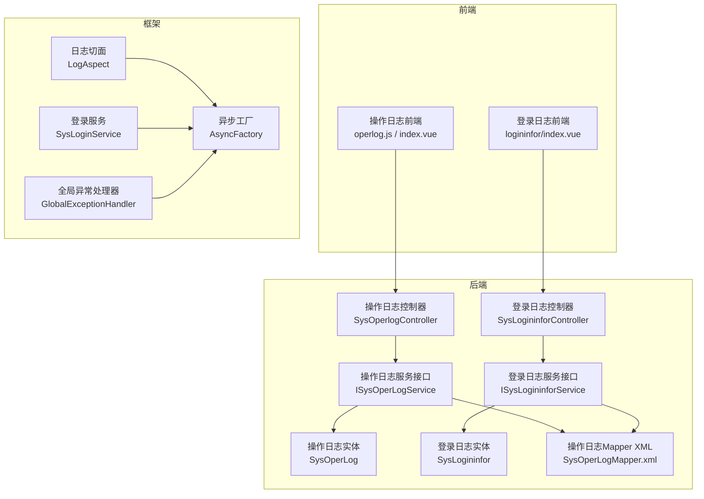
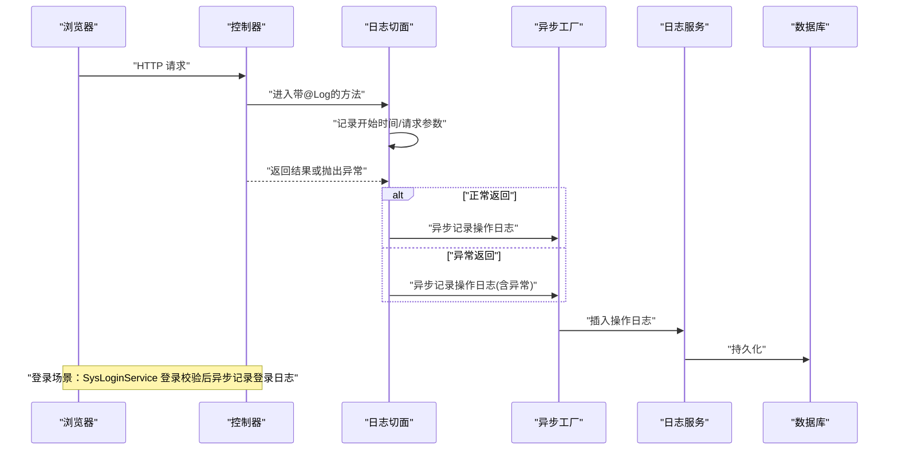
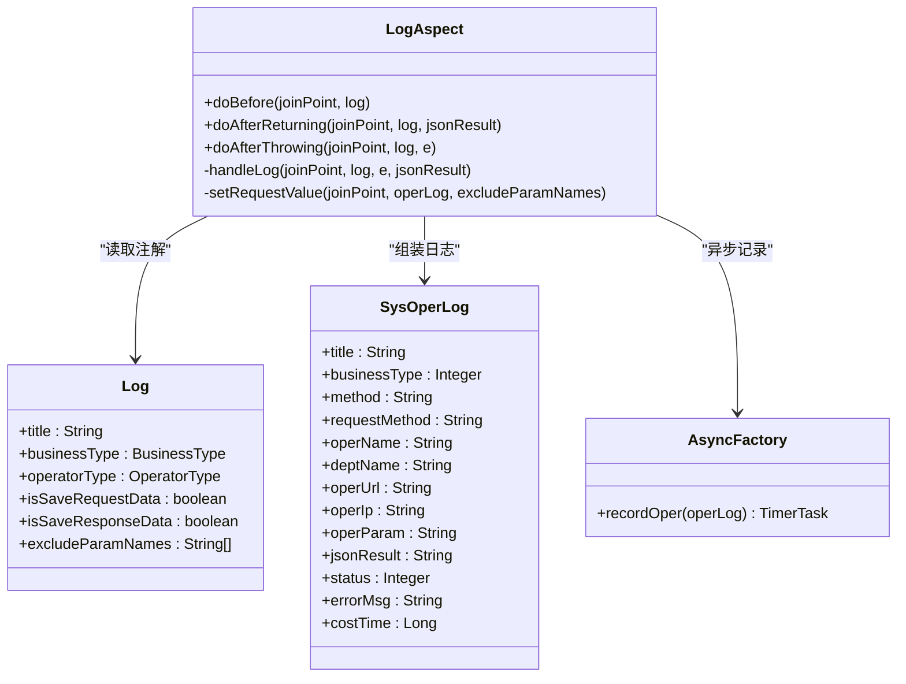
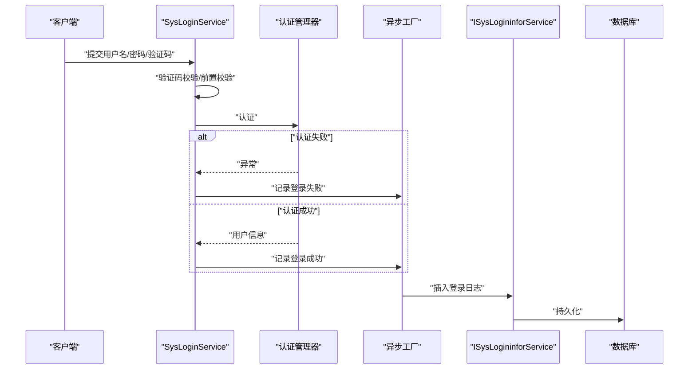
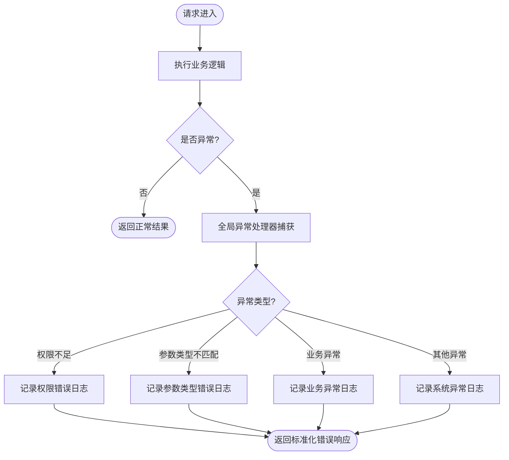
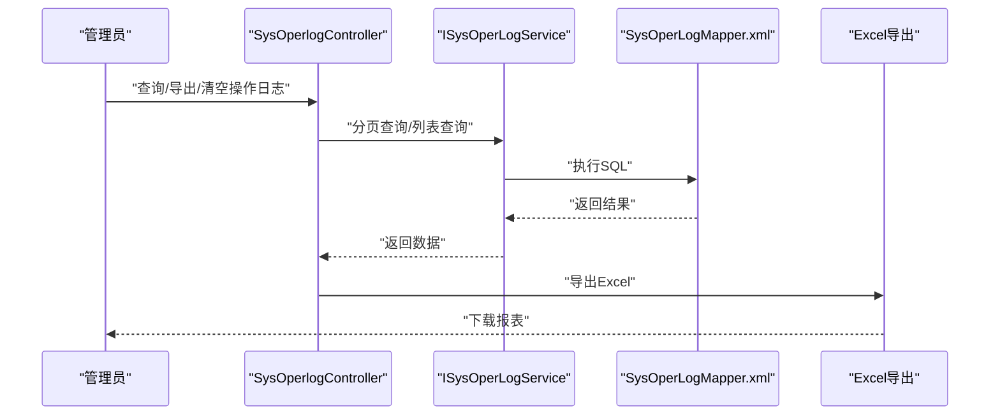
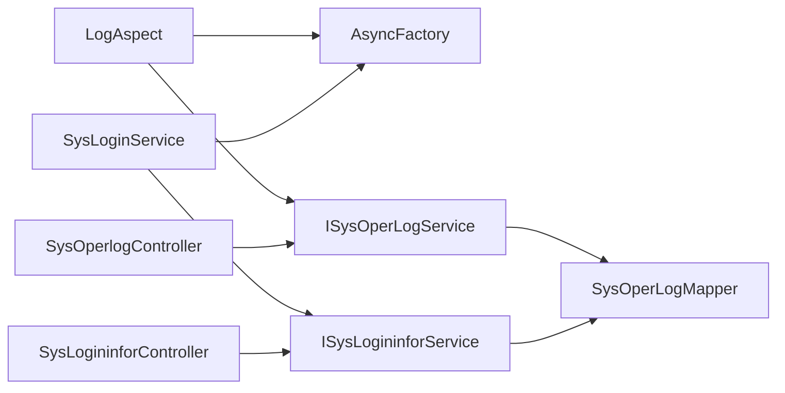

# 安全审计

<cite>
**本文引用的文件**   
- [ruoyi-framework/src/main/java/com/ruoyi/framework/aspectj/LogAspect.java](file://ruoyi-framework/src/main/java/com/ruoyi/framework/aspectj/LogAspect.java)
- [ruoyi-common/src/main/java/com/ruoyi/common/annotation/Log.java](file://ruoyi-common/src/main/java/com/ruoyi/common/annotation/Log.java)
- [ruoyi-common/src/main/java/com/ruoyi/common/enums/BusinessType.java](file://ruoyi-common/src/main/java/com/ruoyi/common/enums/BusinessType.java)
- [ruoyi-common/src/main/java/com/ruoyi/common/enums/OperatorType.java](file://ruoyi-common/src/main/java/com/ruoyi/common/enums/OperatorType.java)
- [ruoyi-framework/src/main/java/com/ruoyi/framework/manager/factory/AsyncFactory.java](file://ruoyi-framework/src/main/java/com/ruoyi/framework/manager/factory/AsyncFactory.java)
- [ruoyi-framework/src/main/java/com/ruoyi/framework/web/exception/GlobalExceptionHandler.java](file://ruoyi-framework/src/main/java/com/ruoyi/framework/web/exception/GlobalExceptionHandler.java)
- [ruoyi-common/src/main/java/com/ruoyi/common/exception/GlobalException.java](file://ruoyi-common/src/main/java/com/ruoyi/common/exception/GlobalException.java)
- [ruoyi-common/src/main/java/com/ruoyi/common/utils/ExceptionUtil.java](file://ruoyi-common/src/main/java/com/ruoyi/common/utils/ExceptionUtil.java)
- [ruoyi-system/src/main/java/com/ruoyi/system/domain/SysOperLog.java](file://ruoyi-system/src/main/java/com/ruoyi/system/domain/SysOperLog.java)
- [ruoyi-system/src/main/java/com/ruoyi/system/domain/SysLogininfor.java](file://ruoyi-system/src/main/java/com/ruoyi/system/domain/SysLogininfor.java)
- [ruoyi-system/src/main/java/com/ruoyi/system/service/ISysOperLogService.java](file://ruoyi-system/src/main/java/com/ruoyi/system/service/ISysOperLogService.java)
- [ruoyi-system/src/main/java/com/ruoyi/system/service/ISysLogininforService.java](file://ruoyi-system/src/main/java/com/ruoyi/system/service/ISysLogininforService.java)
- [ruoyi-system/src/main/resources/mapper/system/SysOperLogMapper.xml](file://ruoyi-system/src/main/resources/mapper/system/SysOperLogMapper.xml)
- [ruoyi-admin/src/main/java/com/ruoyi/web/controller/monitor/SysOperlogController.java](file://ruoyi-admin/src/main/java/com/ruoyi/web/controller/monitor/SysOperlogController.java)
- [ruoyi-admin/src/main/java/com/ruoyi/web/controller/monitor/SysLogininforController.java](file://ruoyi-admin/src/main/java/com/ruoyi/web/controller/monitor/SysLogininforController.java)
- [ruoyi-framework/src/main/java/com/ruoyi/framework/web/service/SysLoginService.java](file://ruoyi-framework/src/main/java/com/ruoyi/framework/web/service/SysLoginService.java)
- [ruoyi-admin/src/main/resources/logback.xml](file://ruoyi-admin/src/main/resources/logback.xml)
- [ruoyi-admin/src/main/resources/application.yml](file://ruoyi-admin/src/main/resources/application.yml)
- [ruoyi-ui/src/api/monitor/operlog.js](file://ruoyi-ui/src/api/monitor/operlog.js)
- [ruoyi-ui/src/views/monitor/operlog/index.vue](file://ruoyi-ui/src/views/monitor/operlog/index.vue)
- [ruoyi-ui/src/views/monitor/logininfor/index.vue](file://ruoyi-ui/src/views/monitor/logininfor/index.vue)
</cite>

## 目录
1. [简介](#简介)
2. [项目结构](#项目结构)
3. [核心组件](#核心组件)
4. [架构总览](#架构总览)
5. [详细组件分析](#详细组件分析)
6. [依赖分析](#依赖分析)
7. [性能考虑](#性能考虑)
8. [故障排查指南](#故障排查指南)
9. [结论](#结论)
10. [附录](#附录)

## 简介
本文件面向港好住信息系统，构建“安全审计与监控机制”的综合文档，围绕以下目标展开：
- 操作日志记录：日志切面实现、操作类型分类、日志数据采集、异步日志处理的完整流程
- 登录日志管理：登录尝试记录、登录成功/失败处理、异常登录检测、登录统计分析
- 全局异常处理：异常捕获机制、异常分类处理、错误信息屏蔽、安全日志记录
- 审计追踪功能：操作轨迹记录、关键操作审计、合规性检查、审计报表生成
- 日志配置管理、日志轮转策略、日志存储优化、日志查询分析等运维实践
- 安全事件响应、异常监控告警、日志分析工具等安全管理指南

## 项目结构
系统采用前后端分离架构，安全审计相关能力主要分布在框架层（切面与异常）、业务层（登录与操作日志服务）、控制器层（监控接口）以及前端界面（日志查询与导出）。

图表来源
- [ruoyi-ui/src/views/monitor/operlog/index.vue:188-322](file://ruoyi-ui/src/views/monitor/operlog/index.vue#L188-L322)
- [ruoyi-ui/src/api/monitor/operlog.js:1-26](file://ruoyi-ui/src/api/monitor/operlog.js#L1-L26)
- [ruoyi-admin/src/main/java/com/ruoyi/web/controller/monitor/SysOperlogController.java:1-74](file://ruoyi-admin/src/main/java/com/ruoyi/web/controller/monitor/SysOperlogController.java#L1-L74)
- [ruoyi-admin/src/main/java/com/ruoyi/web/controller/monitor/SysLogininforController.java:62-87](file://ruoyi-admin/src/main/java/com/ruoyi/web/controller/monitor/SysLogininforController.java#L62-L87)
- [ruoyi-system/src/main/java/com/ruoyi/system/service/ISysOperLogService.java:1-56](file://ruoyi-system/src/main/java/com/ruoyi/system/service/ISysOperLogService.java#L1-L56)
- [ruoyi-system/src/main/java/com/ruoyi/system/service/ISysLogininforService.java:1-48](file://ruoyi-system/src/main/java/com/ruoyi/system/service/ISysLogininforService.java#L1-L48)
- [ruoyi-system/src/main/resources/mapper/system/SysOperLogMapper.xml:50-121](file://ruoyi-system/src/main/resources/mapper/system/SysOperLogMapper.xml#L50-L121)
- [ruoyi-framework/src/main/java/com/ruoyi/framework/aspectj/LogAspect.java:1-257](file://ruoyi-framework/src/main/java/com/ruoyi/framework/aspectj/LogAspect.java#L1-L257)
- [ruoyi-framework/src/main/java/com/ruoyi/framework/manager/factory/AsyncFactory.java:1-103](file://ruoyi-framework/src/main/java/com/ruoyi/framework/manager/factory/AsyncFactory.java#L1-L103)
- [ruoyi-framework/src/main/java/com/ruoyi/framework/web/exception/GlobalExceptionHandler.java:32-145](file://ruoyi-framework/src/main/java/com/ruoyi/framework/web/exception/GlobalExceptionHandler.java#L32-L145)
- [ruoyi-framework/src/main/java/com/ruoyi/framework/web/service/SysLoginService.java:1-177](file://ruoyi-framework/src/main/java/com/ruoyi/framework/web/service/SysLoginService.java#L1-L177)

章节来源
- [ruoyi-admin/src/main/resources/application.yml:37-42](file://ruoyi-admin/src/main/resources/application.yml#L37-L42)
- [ruoyi-admin/src/main/resources/logback.xml:1-77](file://ruoyi-admin/src/main/resources/logback.xml#L1-L77)

## 核心组件
- 操作日志切面与注解：通过注解标注控制器方法，切面在请求前后拦截，采集请求/响应、参数、异常等信息，并异步写入数据库
- 登录日志服务：登录成功/失败、验证码校验、黑名单拦截等均记录到登录日志并异步入库
- 全局异常处理：统一捕获各类异常，记录错误信息与请求上下文，保障安全日志与用户体验
- 日志实体与服务接口：定义日志结构、提供分页查询、导出、清理等能力
- 前端监控界面：提供操作日志与登录日志的查询、导出、清空、解锁等管理能力

章节来源
- [ruoyi-framework/src/main/java/com/ruoyi/framework/aspectj/LogAspect.java:41-137](file://ruoyi-framework/src/main/java/com/ruoyi/framework/aspectj/LogAspect.java#L41-L137)
- [ruoyi-common/src/main/java/com/ruoyi/common/annotation/Log.java:17-51](file://ruoyi-common/src/main/java/com/ruoyi/common/annotation/Log.java#L17-L51)
- [ruoyi-framework/src/main/java/com/ruoyi/framework/manager/factory/AsyncFactory.java:24-101](file://ruoyi-framework/src/main/java/com/ruoyi/framework/manager/factory/AsyncFactory.java#L24-L101)
- [ruoyi-framework/src/main/java/com/ruoyi/framework/web/service/SysLoginService.java:63-100](file://ruoyi-framework/src/main/java/com/ruoyi/framework/web/service/SysLoginService.java#L63-L100)
- [ruoyi-framework/src/main/java/com/ruoyi/framework/web/exception/GlobalExceptionHandler.java:32-145](file://ruoyi-framework/src/main/java/com/ruoyi/framework/web/exception/GlobalExceptionHandler.java#L32-L145)
- [ruoyi-system/src/main/java/com/ruoyi/system/domain/SysOperLog.java:14-270](file://ruoyi-system/src/main/java/com/ruoyi/system/domain/SysOperLog.java#L14-L270)
- [ruoyi-system/src/main/java/com/ruoyi/system/domain/SysLogininfor.java:14-145](file://ruoyi-system/src/main/java/com/ruoyi/system/domain/SysLogininfor.java#L14-L145)
- [ruoyi-system/src/main/java/com/ruoyi/system/service/ISysOperLogService.java:13-55](file://ruoyi-system/src/main/java/com/ruoyi/system/service/ISysOperLogService.java#L13-L55)
- [ruoyi-system/src/main/java/com/ruoyi/system/service/ISysLogininforService.java:13-47](file://ruoyi-system/src/main/java/com/ruoyi/system/service/ISysLogininforService.java#L13-L47)

## 架构总览
下图展示从请求进入系统到日志落库的关键交互路径，包括操作日志切面、登录日志异步记录、全局异常处理与前端监控界面。

图表来源
- [ruoyi-framework/src/main/java/com/ruoyi/framework/aspectj/LogAspect.java:56-137](file://ruoyi-framework/src/main/java/com/ruoyi/framework/aspectj/LogAspect.java#L56-L137)
- [ruoyi-framework/src/main/java/com/ruoyi/framework/manager/factory/AsyncFactory.java:89-101](file://ruoyi-framework/src/main/java/com/ruoyi/framework/manager/factory/AsyncFactory.java#L89-L101)
- [ruoyi-framework/src/main/java/com/ruoyi/framework/web/service/SysLoginService.java:82-99](file://ruoyi-framework/src/main/java/com/ruoyi/framework/web/service/SysLoginService.java#L82-L99)

## 详细组件分析

### 操作日志记录与切面实现
- 注解驱动：通过自定义注解标注控制器方法，声明模块、业务类型、操作人类别、是否保存请求/响应参数等
- 切面拦截：在方法执行前记录开始时间，在返回或异常后统一处理，组装日志对象
- 数据采集：采集IP、URL、方法签名、请求方式、参数、响应JSON、异常信息、耗时等
- 敏感信息屏蔽：内置敏感字段排除策略，支持扩展排除参数名
- 异步落库：通过异步工厂封装TimerTask，异步写入数据库，降低同步阻塞

图表来源
- [ruoyi-common/src/main/java/com/ruoyi/common/annotation/Log.java:17-51](file://ruoyi-common/src/main/java/com/ruoyi/common/annotation/Log.java#L17-L51)
- [ruoyi-framework/src/main/java/com/ruoyi/framework/aspectj/LogAspect.java:41-257](file://ruoyi-framework/src/main/java/com/ruoyi/framework/aspectj/LogAspect.java#L41-L257)
- [ruoyi-framework/src/main/java/com/ruoyi/framework/manager/factory/AsyncFactory.java:89-101](file://ruoyi-framework/src/main/java/com/ruoyi/framework/manager/factory/AsyncFactory.java#L89-L101)
- [ruoyi-system/src/main/java/com/ruoyi/system/domain/SysOperLog.java:14-270](file://ruoyi-system/src/main/java/com/ruoyi/system/domain/SysOperLog.java#L14-L270)

章节来源
- [ruoyi-common/src/main/java/com/ruoyi/common/enums/BusinessType.java:8-59](file://ruoyi-common/src/main/java/com/ruoyi/common/enums/BusinessType.java#L8-L59)
- [ruoyi-common/src/main/java/com/ruoyi/common/enums/OperatorType.java:8-24](file://ruoyi-common/src/main/java/com/ruoyi/common/enums/OperatorType.java#L8-L24)
- [ruoyi-framework/src/main/java/com/ruoyi/framework/aspectj/LogAspect.java:85-165](file://ruoyi-framework/src/main/java/com/ruoyi/framework/aspectj/LogAspect.java#L85-L165)

### 登录日志管理
- 登录流程：验证码校验、前置校验（用户名/密码长度、黑名单）、认证通过后生成Token并记录登录信息
- 登录日志记录：成功/失败/验证码过期/验证码错误/用户不存在/密码不匹配/黑名单拦截等均异步记录
- 登录统计：前端提供按时间、状态、IP、用户名筛选，支持导出与清空

图表来源
- [ruoyi-framework/src/main/java/com/ruoyi/framework/web/service/SysLoginService.java:63-100](file://ruoyi-framework/src/main/java/com/ruoyi/framework/web/service/SysLoginService.java#L63-L100)
- [ruoyi-framework/src/main/java/com/ruoyi/framework/manager/factory/AsyncFactory.java:37-81](file://ruoyi-framework/src/main/java/com/ruoyi/framework/manager/factory/AsyncFactory.java#L37-L81)
- [ruoyi-system/src/main/java/com/ruoyi/system/service/ISysLogininforService.java:13-47](file://ruoyi-system/src/main/java/com/ruoyi/system/service/ISysLogininforService.java#L13-L47)

章节来源
- [ruoyi-admin/src/main/java/com/ruoyi/web/controller/monitor/SysLogininforController.java:62-87](file://ruoyi-admin/src/main/java/com/ruoyi/web/controller/monitor/SysLogininforController.java#L62-L87)
- [ruoyi-ui/src/views/monitor/logininfor/index.vue:122-193](file://ruoyi-ui/src/views/monitor/logininfor/index.vue#L122-L193)

### 全局异常处理与安全日志
- 异常分类：权限不足、请求方式不支持、业务异常、参数类型不匹配、未知运行时异常、系统异常、参数绑定异常、演示模式等
- 处理策略：记录错误日志、返回标准化AjaxResult、对敏感信息进行清洗与脱敏
- 安全日志：异常发生时记录请求URI、异常根因、参数清洗后的值，便于审计与溯源

图表来源
- [ruoyi-framework/src/main/java/com/ruoyi/framework/web/exception/GlobalExceptionHandler.java:32-145](file://ruoyi-framework/src/main/java/com/ruoyi/framework/web/exception/GlobalExceptionHandler.java#L32-L145)
- [ruoyi-common/src/main/java/com/ruoyi/common/utils/ExceptionUtil.java:12-39](file://ruoyi-common/src/main/java/com/ruoyi/common/utils/ExceptionUtil.java#L12-L39)
- [ruoyi-common/src/main/java/com/ruoyi/common/exception/GlobalException.java:8-58](file://ruoyi-common/src/main/java/com/ruoyi/common/exception/GlobalException.java#L8-L58)

章节来源
- [ruoyi-framework/src/main/java/com/ruoyi/framework/web/exception/GlobalExceptionHandler.java:32-145](file://ruoyi-framework/src/main/java/com/ruoyi/framework/web/exception/GlobalExceptionHandler.java#L32-L145)
- [ruoyi-common/src/main/java/com/ruoyi/common/utils/ExceptionUtil.java:12-39](file://ruoyi-common/src/main/java/com/ruoyi/common/utils/ExceptionUtil.java#L12-L39)

### 审计追踪与报表
- 操作轨迹：通过SysOperLog记录每次操作的模块、业务类型、方法、参数、耗时、状态、异常等
- 关键操作审计：结合业务类型枚举（新增/修改/删除/授权/导入/导出/清空等）识别高风险操作
- 合规性检查：通过日志查询与导出接口，支持按时间范围、操作人、模块、状态等维度检索
- 审计报表：前端提供导出Excel能力，便于生成月度/季度审计报告

图表来源
- [ruoyi-admin/src/main/java/com/ruoyi/web/controller/monitor/SysOperlogController.java:31-74](file://ruoyi-admin/src/main/java/com/ruoyi/web/controller/monitor/SysOperlogController.java#L31-L74)
- [ruoyi-system/src/main/java/com/ruoyi/system/service/ISysOperLogService.java:13-55](file://ruoyi-system/src/main/java/com/ruoyi/system/service/ISysOperLogService.java#L13-L55)
- [ruoyi-system/src/main/resources/mapper/system/SysOperLogMapper.xml:50-121](file://ruoyi-system/src/main/resources/mapper/system/SysOperLogMapper.xml#L50-L121)
- [ruoyi-ui/src/api/monitor/operlog.js:1-26](file://ruoyi-ui/src/api/monitor/operlog.js#L1-L26)
- [ruoyi-ui/src/views/monitor/operlog/index.vue:265-322](file://ruoyi-ui/src/views/monitor/operlog/index.vue#L265-L322)

章节来源
- [ruoyi-common/src/main/java/com/ruoyi/common/enums/BusinessType.java:8-59](file://ruoyi-common/src/main/java/com/ruoyi/common/enums/BusinessType.java#L8-L59)
- [ruoyi-system/src/main/java/com/ruoyi/system/domain/SysOperLog.java:14-270](file://ruoyi-system/src/main/java/com/ruoyi/system/domain/SysOperLog.java#L14-L270)

### 日志配置管理与轮转策略
- 日志级别：系统模块与Spring框架日志级别分别控制
- 日志输出：控制台、系统信息/错误文件、用户访问日志文件
- 轮转策略：基于时间的滚动策略，保留60天的历史日志
- 用户访问日志：独立logger，便于区分系统日志与用户行为日志

章节来源
- [ruoyi-admin/src/main/resources/logback.xml:1-77](file://ruoyi-admin/src/main/resources/logback.xml#L1-L77)
- [ruoyi-admin/src/main/resources/application.yml:37-42](file://ruoyi-admin/src/main/resources/application.yml#L37-L42)

## 依赖分析
- 组件耦合
  - LogAspect依赖注解、安全工具、IP工具、异步管理器与服务接口
  - AsyncFactory依赖服务接口与IP/地址解析工具，负责异步落库
  - SysLoginService依赖认证管理器、Redis缓存、配置服务与异步工厂
  - 控制器依赖服务接口与分页工具
- 外部依赖
  - 日志系统：Logback（轮转、级别、输出位置）
  - 数据库：MyBatis-Plus（分页、XML映射）

图表来源
- [ruoyi-framework/src/main/java/com/ruoyi/framework/aspectj/LogAspect.java:32-34](file://ruoyi-framework/src/main/java/com/ruoyi/framework/aspectj/LogAspect.java#L32-L34)
- [ruoyi-framework/src/main/java/com/ruoyi/framework/manager/factory/AsyncFactory.java:14-17](file://ruoyi-framework/src/main/java/com/ruoyi/framework/manager/factory/AsyncFactory.java#L14-L17)
- [ruoyi-framework/src/main/java/com/ruoyi/framework/web/service/SysLoginService.java:39-52](file://ruoyi-framework/src/main/java/com/ruoyi/framework/web/service/SysLoginService.java#L39-L52)
- [ruoyi-admin/src/main/java/com/ruoyi/web/controller/monitor/SysOperlogController.java:31-33](file://ruoyi-admin/src/main/java/com/ruoyi/web/controller/monitor/SysOperlogController.java#L31-L33)
- [ruoyi-admin/src/main/java/com/ruoyi/web/controller/monitor/SysLogininforController.java:62-64](file://ruoyi-admin/src/main/java/com/ruoyi/web/controller/monitor/SysLogininforController.java#L62-L64)

## 性能考虑
- 异步落库：操作日志与登录日志均通过异步任务写入，避免阻塞主线程
- 参数裁剪：请求参数与响应JSON均限制最大长度，防止超大数据写入
- 敏感字段排除：默认排除密码等字段，减少敏感信息泄露风险
- 日志轮转：按天滚动并设置历史保留天数，平衡存储与查询成本
- 建议
  - 对高频操作接口谨慎开启保存响应参数
  - 合理设置日志级别，避免INFO/DEBUG过多影响I/O
  - 使用索引优化SysOperLog与SysLogininfor的常用查询字段（如oper_time、oper_name、login_time、status）

## 故障排查指南
- 操作日志未记录
  - 检查控制器方法是否添加@Log注解
  - 确认切面是否生效（AOP启用、包扫描路径）
  - 查看异步队列是否堆积，关注AsyncManager执行状态
- 登录日志异常
  - 核对验证码开关与Redis缓存键配置
  - 检查黑名单配置与IP匹配规则
  - 关注异常处理器是否正确记录登录失败原因
- 全局异常未捕获
  - 确认异常处理器是否注册
  - 检查异常类型分支是否覆盖
- 日志文件未生成/轮转异常
  - 检查logback配置与日志目录权限
  - 确认轮转策略与保留天数设置

章节来源
- [ruoyi-framework/src/main/java/com/ruoyi/framework/aspectj/LogAspect.java:85-137](file://ruoyi-framework/src/main/java/com/ruoyi/framework/aspectj/LogAspect.java#L85-L137)
- [ruoyi-framework/src/main/java/com/ruoyi/framework/web/exception/GlobalExceptionHandler.java:32-145](file://ruoyi-framework/src/main/java/com/ruoyi/framework/web/exception/GlobalExceptionHandler.java#L32-L145)
- [ruoyi-admin/src/main/resources/logback.xml:15-72](file://ruoyi-admin/src/main/resources/logback.xml#L15-L72)

## 结论
港好住信息系统通过“注解+切面+异步+服务”的组合，实现了全面的操作日志与登录日志记录；配合全局异常处理与完善的前端监控界面，形成闭环的安全审计体系。建议在生产环境中持续优化日志级别与轮转策略，强化高风险操作的审计与告警联动，确保系统安全与合规。

## 附录
- 前端监控接口
  - 操作日志：查询、导出、删除、清空
  - 登录日志：查询、删除、清空、解锁账户
- 数据模型
  - SysOperLog：操作日志表
  - SysLogininfor：登录日志表

章节来源
- [ruoyi-ui/src/api/monitor/operlog.js:1-26](file://ruoyi-ui/src/api/monitor/operlog.js#L1-L26)
- [ruoyi-ui/src/views/monitor/operlog/index.vue:265-322](file://ruoyi-ui/src/views/monitor/operlog/index.vue#L265-L322)
- [ruoyi-ui/src/views/monitor/logininfor/index.vue:122-193](file://ruoyi-ui/src/views/monitor/logininfor/index.vue#L122-L193)
- [ruoyi-system/src/main/java/com/ruoyi/system/domain/SysOperLog.java:14-270](file://ruoyi-system/src/main/java/com/ruoyi/system/domain/SysOperLog.java#L14-L270)
- [ruoyi-system/src/main/java/com/ruoyi/system/domain/SysLogininfor.java:14-145](file://ruoyi-system/src/main/java/com/ruoyi/system/domain/SysLogininfor.java#L14-L145)