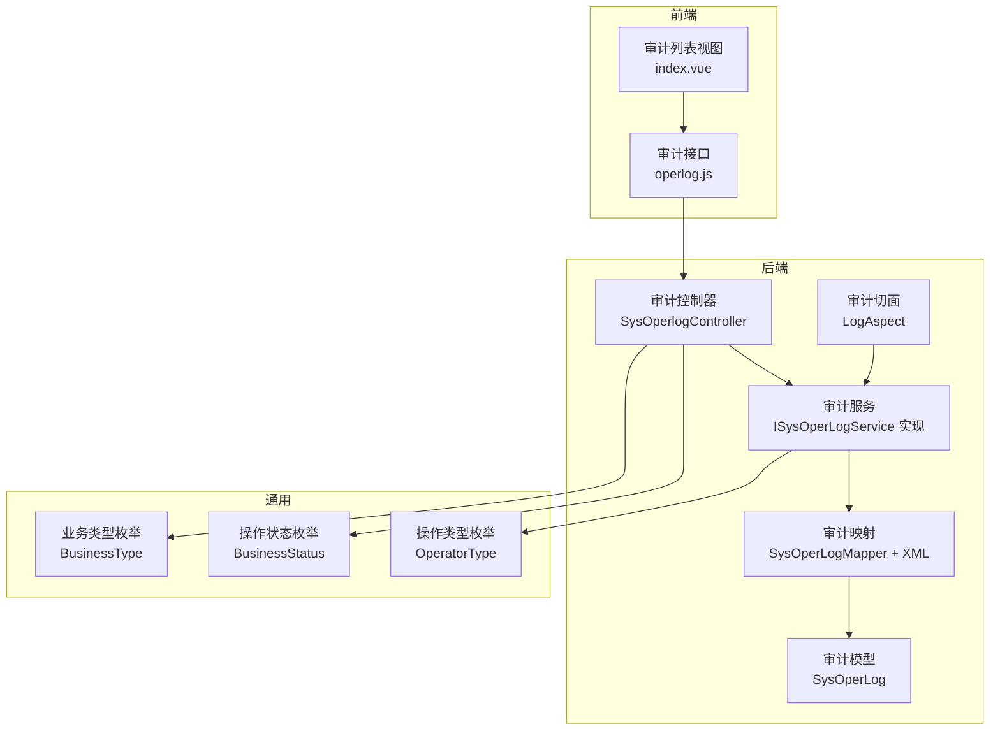
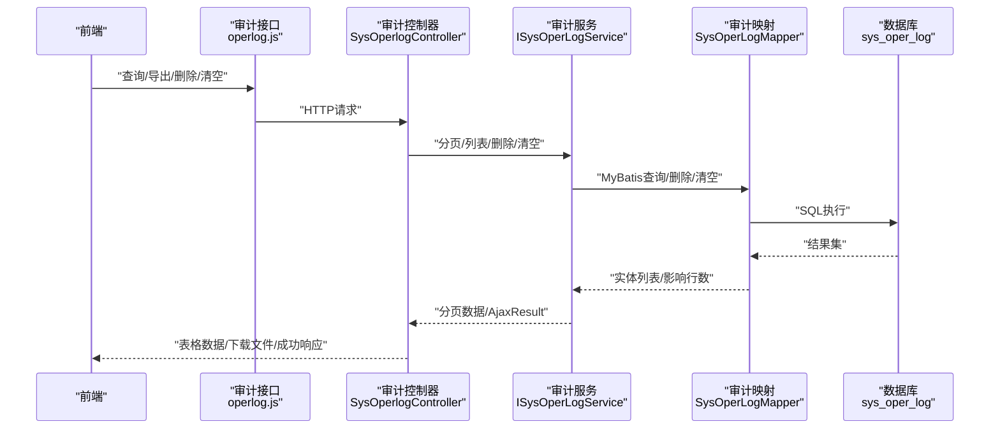
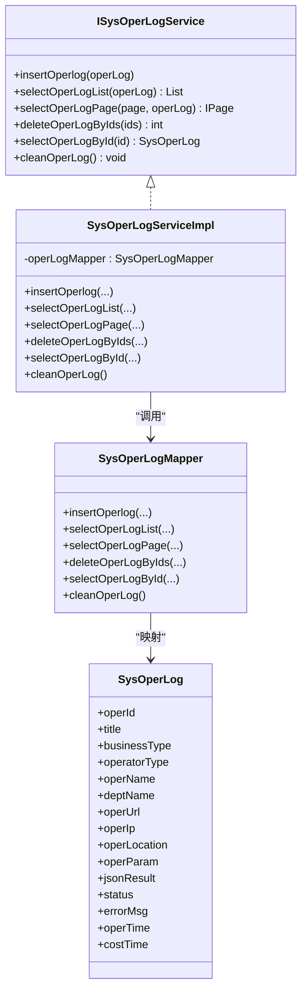
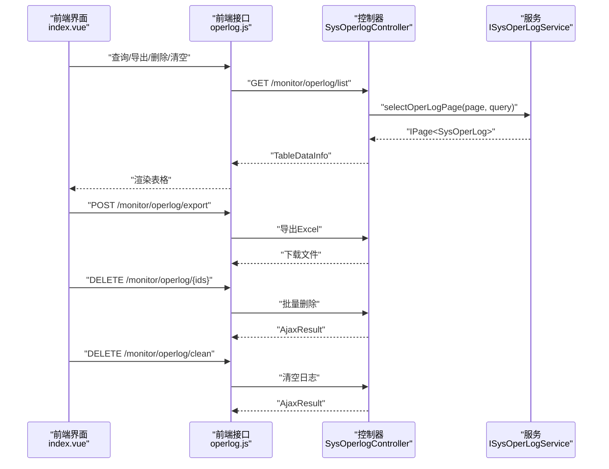
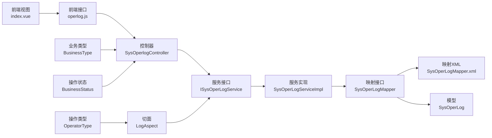

# 审计追踪功能

<cite>
**本文引用的文件**
- [SysOperLogServiceImpl.java](file://ruoyi-system/src/main/java/com/ruoyi/system/service/impl/SysOperLogServiceImpl.java)
- [ISysOperLogService.java](file://ruoyi-system/src/main/java/com/ruoyi/system/service/ISysOperLogService.java)
- [SysOperLogMapper.java](file://ruoyi-system/src/main/java/com/ruoyi/system/mapper/SysOperLogMapper.java)
- [SysOperLogMapper.xml](file://ruoyi-system/src/main/resources/mapper/system/SysOperLogMapper.xml)
- [SysOperLog.java](file://ruoyi-system/src/main/java/com/ruoyi/system/domain/SysOperLog.java)
- [SysOperlogController.java](file://ruoyi-admin/src/main/java/com/ruoyi/web/controller/monitor/SysOperlogController.java)
- [LogAspect.java](file://ruoyi-framework/src/main/java/com/ruoyi/framework/aspectj/LogAspect.java)
- [BusinessType.java](file://ruoyi-common/src/main/java/com/ruoyi/common/enums/BusinessType.java)
- [BusinessStatus.java](file://ruoyi-common/src/main/java/com/ruoyi/common/enums/BusinessStatus.java)
- [OperatorType.java](file://ruoyi-common/src/main/java/com/ruoyi/common/enums/OperatorType.java)
- [operlog.js](file://ruoyi-ui/src/api/monitor/operlog.js)
- [index.vue](file://ruoyi-ui/src/views/monitor/operlog/index.vue)
- [HzDocument.java](file://ruoyi-system/src/main/java/com/ruoyi/system/domain/HzDocument.java)
- [HzDocumentController.java](file://ruoyi-admin/src/main/java/com/ruoyi/web/controller/h5/HzDocumentController.java)
- [HzDocumentServiceImpl.java](file://ruoyi-system/src/main/java/com/ruoyi/system/service/impl/HzDocumentServiceImpl.java)
- [logback.xml](file://ruoyi-admin/src/main/resources/logback.xml)
</cite>

## 目录
1. [简介](#简介)
2. [项目结构](#项目结构)
3. [核心组件](#核心组件)
4. [架构总览](#架构总览)
5. [详细组件分析](#详细组件分析)
6. [依赖关系分析](#依赖关系分析)
7. [性能考量](#性能考量)
8. [故障排查指南](#故障排查指南)
9. [结论](#结论)
10. [附录](#附录)

## 简介
本文件面向港好住信息系统“审计追踪”能力，围绕操作日志审计、关键业务审计、合规性检查与审计轨迹记录等核心功能进行系统化梳理，并重点解析以下模块：
- 审计服务层：日志查询接口、审计数据统计、审计报表生成、审计数据导出
- 审计控制器：审计控制、审计数据展示、审计条件筛选、审计结果导出
- 审计数据模型：业务类型枚举、操作类型枚举、操作状态枚举、审计字段定义
- 审计配置管理：审计策略设置、审计范围控制、审计周期配置、审计数据保留
- 审计分析工具：审计趋势分析、异常操作识别、合规性报告、审计可视化

## 项目结构
审计追踪功能主要分布在如下模块：
- ruoyi-system：领域模型、持久层、服务层与业务配置
- ruoyi-framework：切面拦截与异步记录
- ruoyi-admin：管理端控制器与权限控制
- ruoyi-ui：前端审计列表、筛选、导出与可视化
- ruoyi-common：通用枚举与注解

图表来源
- [SysOperlogController.java:27-74](file://ruoyi-admin/src/main/java/com/ruoyi/web/controller/monitor/SysOperlogController.java#L27-L74)
- [ISysOperLogService.java:13-55](file://ruoyi-system/src/main/java/com/ruoyi/system/service/ISysOperLogService.java#L13-L55)
- [SysOperLogMapper.java:16-58](file://ruoyi-system/src/main/java/com/ruoyi/system/mapper/SysOperLogMapper.java#L16-L58)
- [SysOperLogMapper.xml:5-121](file://ruoyi-system/src/main/resources/mapper/system/SysOperLogMapper.xml#L5-L121)
- [SysOperLog.java:14-270](file://ruoyi-system/src/main/java/com/ruoyi/system/domain/SysOperLog.java#L14-L270)
- [LogAspect.java:41-257](file://ruoyi-framework/src/main/java/com/ruoyi/framework/aspectj/LogAspect.java#L41-L257)
- [BusinessType.java:8-59](file://ruoyi-common/src/main/java/com/ruoyi/common/enums/BusinessType.java#L8-L59)
- [BusinessStatus.java:9-20](file://ruoyi-common/src/main/java/com/ruoyi/common/enums/BusinessStatus.java#L9-L20)
- [OperatorType.java:8-24](file://ruoyi-common/src/main/java/com/ruoyi/common/enums/OperatorType.java#L8-L24)

章节来源
- [SysOperlogController.java:27-74](file://ruoyi-admin/src/main/java/com/ruoyi/web/controller/monitor/SysOperlogController.java#L27-L74)
- [SysOperLogServiceImpl.java:18-84](file://ruoyi-system/src/main/java/com/ruoyi/system/service/impl/SysOperLogServiceImpl.java#L18-L84)
- [SysOperLogMapper.java:16-58](file://ruoyi-system/src/main/java/com/ruoyi/system/mapper/SysOperLogMapper.java#L16-L58)
- [SysOperLogMapper.xml:5-121](file://ruoyi-system/src/main/resources/mapper/system/SysOperLogMapper.xml#L5-L121)
- [SysOperLog.java:14-270](file://ruoyi-system/src/main/java/com/ruoyi/system/domain/SysOperLog.java#L14-L270)
- [LogAspect.java:41-257](file://ruoyi-framework/src/main/java/com/ruoyi/framework/aspectj/LogAspect.java#L41-L257)
- [BusinessType.java:8-59](file://ruoyi-common/src/main/java/com/ruoyi/common/enums/BusinessType.java#L8-L59)
- [BusinessStatus.java:9-20](file://ruoyi-common/src/main/java/com/ruoyi/common/enums/BusinessStatus.java#L9-L20)
- [OperatorType.java:8-24](file://ruoyi-common/src/main/java/com/ruoyi/common/enums/OperatorType.java#L8-L24)

## 核心组件
- 审计服务层：提供新增、查询、分页、删除、清空等能力，支撑管理端审计功能
- 审计控制器：提供列表、导出、删除、清空等HTTP接口，配合权限注解与日志注解
- 审计模型：定义操作日志字段，包括业务类型、操作类型、状态、耗时、IP、地址、参数、结果、错误等
- 审计切面：统一拦截标注了日志注解的控制器方法，自动采集请求上下文并异步落库
- 通用枚举：业务类型、操作状态、操作类型，用于标准化审计维度

章节来源
- [ISysOperLogService.java:13-55](file://ruoyi-system/src/main/java/com/ruoyi/system/service/ISysOperLogService.java#L13-L55)
- [SysOperLogServiceImpl.java:18-84](file://ruoyi-system/src/main/java/com/ruoyi/system/service/impl/SysOperLogServiceImpl.java#L18-L84)
- [SysOperLog.java:14-270](file://ruoyi-system/src/main/java/com/ruoyi/system/domain/SysOperLog.java#L14-L270)
- [LogAspect.java:85-137](file://ruoyi-framework/src/main/java/com/ruoyi/framework/aspectj/LogAspect.java#L85-L137)
- [BusinessType.java:8-59](file://ruoyi-common/src/main/java/com/ruoyi/common/enums/BusinessType.java#L8-L59)
- [BusinessStatus.java:9-20](file://ruoyi-common/src/main/java/com/ruoyi/common/enums/BusinessStatus.java#L9-L20)
- [OperatorType.java:8-24](file://ruoyi-common/src/main/java/com/ruoyi/common/enums/OperatorType.java#L8-L24)

## 架构总览
审计追踪采用“切面自动采集 + 服务层持久化 + 控制器对外暴露”的分层设计，确保对业务零侵入地记录操作轨迹。

图表来源
- [operlog.js:1-26](file://ruoyi-ui/src/api/monitor/operlog.js#L1-L26)
- [SysOperlogController.java:34-74](file://ruoyi-admin/src/main/java/com/ruoyi/web/controller/monitor/SysOperlogController.java#L34-L74)
- [ISysOperLogService.java:13-55](file://ruoyi-system/src/main/java/com/ruoyi/system/service/ISysOperLogService.java#L13-L55)
- [SysOperLogMapper.java:16-58](file://ruoyi-system/src/main/java/com/ruoyi/system/mapper/SysOperLogMapper.java#L16-L58)
- [SysOperLogMapper.xml:37-121](file://ruoyi-system/src/main/resources/mapper/system/SysOperLogMapper.xml#L37-L121)

## 详细组件分析

### 审计服务：SysOperLogService
- 新增操作日志：由切面在请求完成后异步写入
- 查询与分页：支持多维筛选（IP、模块、操作人、业务类型、状态、时间区间）
- 删除与清空：支持批量删除与一键清空
- 统计与报表：通过分页查询聚合维度（可扩展）
- 导出：将筛选结果导出为Excel

图表来源
- [ISysOperLogService.java:13-55](file://ruoyi-system/src/main/java/com/ruoyi/system/service/ISysOperLogService.java#L13-L55)
- [SysOperLogServiceImpl.java:18-84](file://ruoyi-system/src/main/java/com/ruoyi/system/service/impl/SysOperLogServiceImpl.java#L18-L84)
- [SysOperLogMapper.java:16-58](file://ruoyi-system/src/main/java/com/ruoyi/system/mapper/SysOperLogMapper.java#L16-L58)
- [SysOperLog.java:14-270](file://ruoyi-system/src/main/java/com/ruoyi/system/domain/SysOperLog.java#L14-L270)

章节来源
- [SysOperLogServiceImpl.java:18-84](file://ruoyi-system/src/main/java/com/ruoyi/system/service/impl/SysOperLogServiceImpl.java#L18-L84)
- [SysOperLogMapper.java:16-58](file://ruoyi-system/src/main/java/com/ruoyi/system/mapper/SysOperLogMapper.java#L16-L58)
- [SysOperLogMapper.xml:37-121](file://ruoyi-system/src/main/resources/mapper/system/SysOperLogMapper.xml#L37-L121)

### 审计控制器：SysOperlogController
- 列表查询：分页返回操作日志，支持排序与筛选
- 导出功能：将筛选结果导出为Excel
- 删除与清空：支持单个/批量删除与一键清空
- 权限控制：基于注解校验菜单权限

图表来源
- [index.vue:254-320](file://ruoyi-ui/src/views/monitor/operlog/index.vue#L254-L320)
- [operlog.js:1-26](file://ruoyi-ui/src/api/monitor/operlog.js#L1-L26)
- [SysOperlogController.java:34-74](file://ruoyi-admin/src/main/java/com/ruoyi/web/controller/monitor/SysOperlogController.java#L34-L74)
- [ISysOperLogService.java:13-55](file://ruoyi-system/src/main/java/com/ruoyi/system/service/ISysOperLogService.java#L13-L55)

章节来源
- [SysOperlogController.java:27-74](file://ruoyi-admin/src/main/java/com/ruoyi/web/controller/monitor/SysOperlogController.java#L27-L74)
- [index.vue:254-320](file://ruoyi-ui/src/views/monitor/operlog/index.vue#L254-L320)
- [operlog.js:1-26](file://ruoyi-ui/src/api/monitor/operlog.js#L1-L26)

### 审计数据模型：SysOperLog
- 字段覆盖：模块、方法、请求方式、操作人、部门、URL、IP、地点、请求参数、返回参数、状态、错误、时间、耗时等
- 导出注解：用于Excel导出字段映射
- 业务类型：支持多种业务类型（新增、修改、删除、授权、导出、导入、强制登出、生成代码、清空）

章节来源
- [SysOperLog.java:14-270](file://ruoyi-system/src/main/java/com/ruoyi/system/domain/SysOperLog.java#L14-L270)
- [SysOperLogMapper.xml:7-25](file://ruoyi-system/src/main/resources/mapper/system/SysOperLogMapper.xml#L7-L25)

### 审计切面：LogAspect
- 自动采集：在方法前后织入，计算耗时，采集IP、URL、方法签名、请求方式、登录用户、部门、请求参数、响应结果、异常信息
- 异步落库：通过异步线程池将操作日志写入数据库，避免阻塞主线程
- 注解驱动：通过@Log注解声明业务类型、标题、操作类型、是否保存请求/响应数据等

章节来源
- [LogAspect.java:85-137](file://ruoyi-framework/src/main/java/com/ruoyi/framework/aspectj/LogAspect.java#L85-L137)
- [BusinessType.java:8-59](file://ruoyi-common/src/main/java/com/ruoyi/common/enums/BusinessType.java#L8-L59)
- [BusinessStatus.java:9-20](file://ruoyi-common/src/main/java/com/ruoyi/common/enums/BusinessStatus.java#L9-L20)
- [OperatorType.java:8-24](file://ruoyi-common/src/main/java/com/ruoyi/common/enums/OperatorType.java#L8-L24)

### 关键业务审计：资料审核审计
- 管理端接口：提供资料审核与违规标记接口，记录审核状态变更与意见
- 审计字段：在资料模型中包含审核状态、审核人、审核时间、审核意见等字段，便于审计追溯
- 业务联动：审核通过后可能触发订单流程推进，便于审计与业务一致性核对

章节来源
- [HzDocument.java:136-166](file://ruoyi-system/src/main/java/com/ruoyi/system/domain/HzDocument.java#L136-L166)
- [HzDocumentController.java:230-264](file://ruoyi-admin/src/main/java/com/ruoyi/web/controller/h5/HzDocumentController.java#L230-L264)
- [HzDocumentServiceImpl.java:58-85](file://ruoyi-system/src/main/java/com/ruoyi/system/service/impl/HzDocumentServiceImpl.java#L58-L85)

### 审计配置管理
- 审计策略：通过@Log注解在控制器方法上声明审计维度（业务类型、标题、操作类型、是否保存请求/响应）
- 审计范围：可针对特定控制器或方法开启审计，避免全量埋点带来的性能压力
- 审计周期：日志按天滚动存储，便于定期清理与归档
- 审计数据保留：提供清空接口，支持运维在合规要求下清理历史数据

章节来源
- [LogAspect.java:146-165](file://ruoyi-framework/src/main/java/com/ruoyi/framework/aspectj/LogAspect.java#L146-L165)
- [SysOperlogController.java:48-73](file://ruoyi-admin/src/main/java/com/ruoyi/web/controller/monitor/SysOperlogController.java#L48-L73)
- [logback.xml:40-77](file://ruoyi-admin/src/main/resources/logback.xml#L40-L77)

### 审计分析工具
- 审计趋势分析：基于时间维度（日/周/月）统计操作次数、异常占比、平均耗时
- 异常操作识别：通过状态字段筛选失败日志，结合错误信息定位问题
- 合规性报告：导出指定时间段内的审计数据，满足合规审查
- 审计可视化：前端支持按业务类型、状态、操作人等维度筛选与排序，辅助快速定位

章节来源
- [index.vue:264-320](file://ruoyi-ui/src/views/monitor/operlog/index.vue#L264-L320)
- [SysOperLogMapper.xml:37-121](file://ruoyi-system/src/main/resources/mapper/system/SysOperLogMapper.xml#L37-L121)

## 依赖关系分析
审计追踪模块内部依赖清晰，遵循“控制器 → 服务 → 持久层 → 数据库”的单向依赖，避免循环依赖。

图表来源
- [index.vue:254-320](file://ruoyi-ui/src/views/monitor/operlog/index.vue#L254-L320)
- [operlog.js:1-26](file://ruoyi-ui/src/api/monitor/operlog.js#L1-L26)
- [SysOperlogController.java:27-74](file://ruoyi-admin/src/main/java/com/ruoyi/web/controller/monitor/SysOperlogController.java#L27-L74)
- [ISysOperLogService.java:13-55](file://ruoyi-system/src/main/java/com/ruoyi/system/service/ISysOperLogService.java#L13-L55)
- [SysOperLogServiceImpl.java:18-84](file://ruoyi-system/src/main/java/com/ruoyi/system/service/impl/SysOperLogServiceImpl.java#L18-L84)
- [SysOperLogMapper.java:16-58](file://ruoyi-system/src/main/java/com/ruoyi/system/mapper/SysOperLogMapper.java#L16-L58)
- [SysOperLogMapper.xml:5-121](file://ruoyi-system/src/main/resources/mapper/system/SysOperLogMapper.xml#L5-L121)
- [SysOperLog.java:14-270](file://ruoyi-system/src/main/java/com/ruoyi/system/domain/SysOperLog.java#L14-L270)
- [LogAspect.java:41-257](file://ruoyi-framework/src/main/java/com/ruoyi/framework/aspectj/LogAspect.java#L41-L257)
- [BusinessType.java:8-59](file://ruoyi-common/src/main/java/com/ruoyi/common/enums/BusinessType.java#L8-L59)
- [BusinessStatus.java:9-20](file://ruoyi-common/src/main/java/com/ruoyi/common/enums/BusinessStatus.java#L9-L20)
- [OperatorType.java:8-24](file://ruoyi-common/src/main/java/com/ruoyi/common/enums/OperatorType.java#L8-L24)

章节来源
- [SysOperLogServiceImpl.java:18-84](file://ruoyi-system/src/main/java/com/ruoyi/system/service/impl/SysOperLogServiceImpl.java#L18-L84)
- [SysOperLogMapper.java:16-58](file://ruoyi-system/src/main/java/com/ruoyi/system/mapper/SysOperLogMapper.java#L16-L58)
- [SysOperLogMapper.xml:5-121](file://ruoyi-system/src/main/resources/mapper/system/SysOperLogMapper.xml#L5-L121)
- [LogAspect.java:41-257](file://ruoyi-framework/src/main/java/com/ruoyi/framework/aspectj/LogAspect.java#L41-L257)

## 性能考量
- 异步记录：审计日志通过异步线程池写入，避免阻塞请求主线程
- 分页查询：列表查询采用分页，减少一次性加载大量数据
- 索引与筛选：建议在常用筛选字段（如oper_time、oper_name、business_type、status）建立索引以提升查询性能
- 导出优化：导出时建议限制导出时间范围与条数，防止大表导出导致内存压力
- 日志滚动：应用日志按天滚动，避免单文件过大影响IO性能

## 故障排查指南
- 审计日志缺失
  - 检查控制器方法是否添加@Log注解
  - 确认切面是否生效（@EnableAspectJAutoProxy）
  - 核对异步线程池是否正常运行
- 查询结果为空
  - 检查筛选条件（时间范围、业务类型、状态、IP、模块、操作人）
  - 确认数据库中是否存在对应记录
- 导出失败
  - 检查导出接口权限与Excel工具类可用性
  - 确认导出数据量是否超出限制
- 清空失败
  - 检查数据库权限与truncate语句执行情况

章节来源
- [LogAspect.java:85-137](file://ruoyi-framework/src/main/java/com/ruoyi/framework/aspectj/LogAspect.java#L85-L137)
- [SysOperlogController.java:48-73](file://ruoyi-admin/src/main/java/com/ruoyi/web/controller/monitor/SysOperlogController.java#L48-L73)
- [SysOperLogMapper.xml:37-121](file://ruoyi-system/src/main/resources/mapper/system/SysOperLogMapper.xml#L37-L121)

## 结论
港好住信息系统的审计追踪功能通过“切面自动采集 + 服务层持久化 + 控制器对外暴露”的架构实现了对关键业务与系统操作的全面记录。依托完善的模型、枚举与前端交互，系统能够高效完成日志查询、筛选、导出与清空等管理功能，并为合规性检查与异常识别提供了可靠的数据基础。建议在生产环境中结合索引优化与合理的审计周期配置，持续保障审计能力的稳定性与性能表现。

## 附录
- 审计字段定义（节选）
  - 模块：title
  - 方法：method
  - 请求方式：requestMethod
  - 操作人：operName
  - 部门：deptName
  - URL：operUrl
  - IP：operIp
  - 地点：operLocation
  - 请求参数：operParam
  - 返回参数：jsonResult
  - 状态：status
  - 错误信息：errorMsg
  - 操作时间：operTime
  - 耗时：costTime
- 业务类型枚举（节选）
  - 其它、新增、修改、删除、授权、导出、导入、强制登出、生成代码、清空
- 操作状态枚举（节选）
  - 成功、失败
- 操作类型枚举（节选）
  - 其它、后台用户、手机端用户

章节来源
- [SysOperLog.java:14-270](file://ruoyi-system/src/main/java/com/ruoyi/system/domain/SysOperLog.java#L14-L270)
- [BusinessType.java:8-59](file://ruoyi-common/src/main/java/com/ruoyi/common/enums/BusinessType.java#L8-L59)
- [BusinessStatus.java:9-20](file://ruoyi-common/src/main/java/com/ruoyi/common/enums/BusinessStatus.java#L9-L20)
- [OperatorType.java:8-24](file://ruoyi-common/src/main/java/com/ruoyi/common/enums/OperatorType.java#L8-L24)