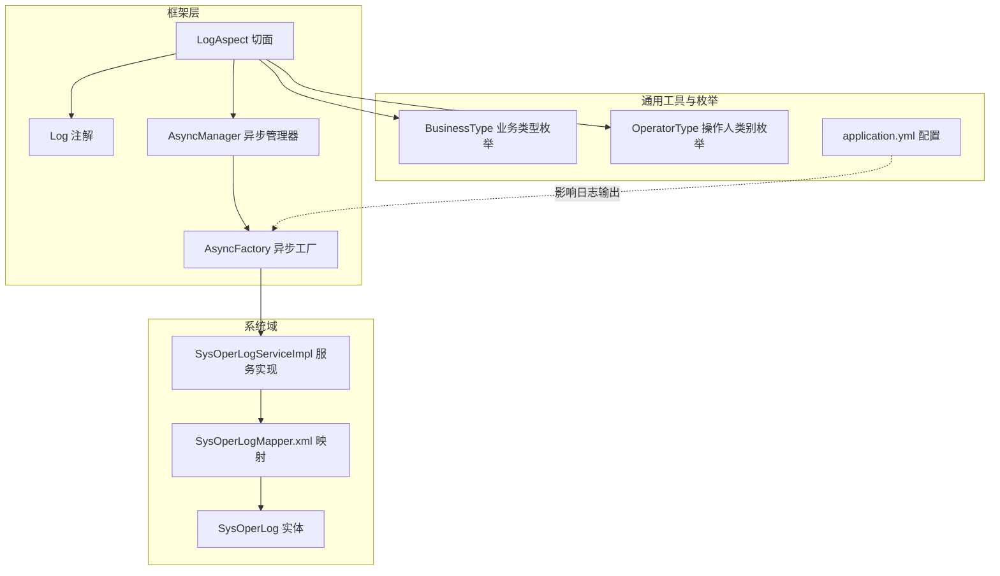
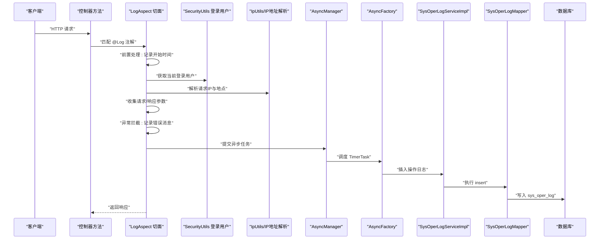
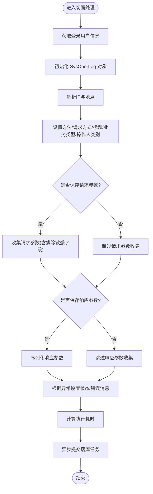
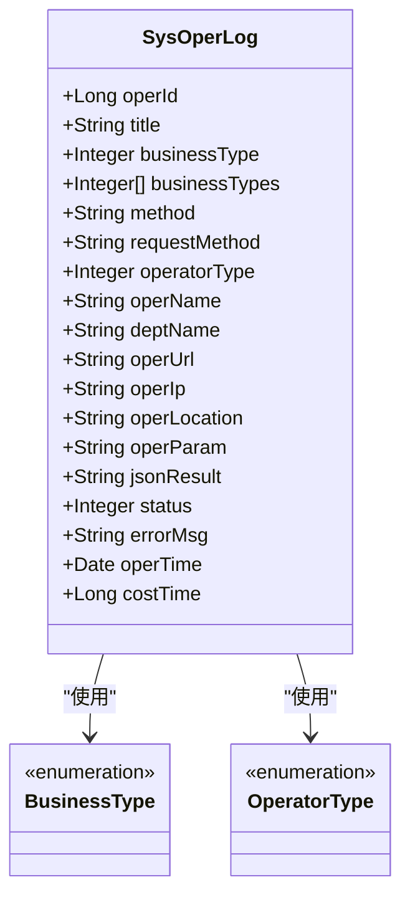
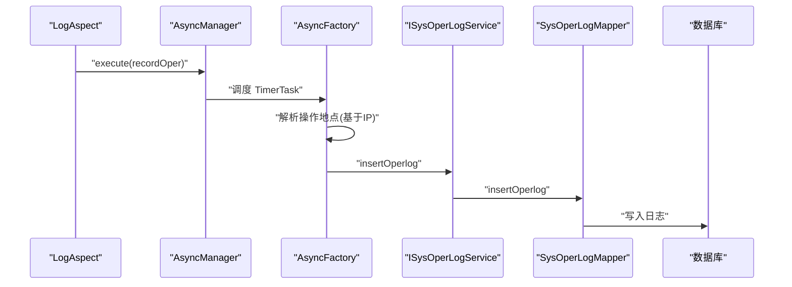
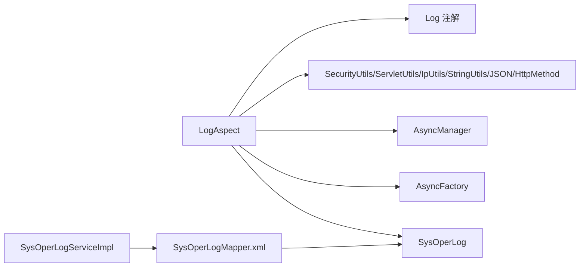

# 操作日志管理

<cite>
**本文引用的文件**
- [LogAspect.java](file://ruoyi-framework/src/main/java/com/ruoyi/framework/aspectj/LogAspect.java)
- [Log.java](file://ruoyi-common/src/main/java/com/ruoyi/common/annotation/Log.java)
- [SysOperLog.java](file://ruoyi-system/src/main/java/com/ruoyi/system/domain/SysOperLog.java)
- [AsyncManager.java](file://ruoyi-framework/src/main/java/com/ruoyi/framework/manager/AsyncManager.java)
- [AsyncFactory.java](file://ruoyi-framework/src/main/java/com/ruoyi/framework/manager/factory/AsyncFactory.java)
- [SysOperLogMapper.xml](file://ruoyi-system/src/main/resources/mapper/system/SysOperLogMapper.xml)
- [BusinessType.java](file://ruoyi-common/src/main/java/com/ruoyi/common/enums/BusinessType.java)
- [OperatorType.java](file://ruoyi-common/src/main/java/com/ruoyi/common/enums/OperatorType.java)
- [application.yml](file://ruoyi-admin/src/main/resources/application.yml)
- [SysOperLogServiceImpl.java](file://ruoyi-system/src/main/java/com/ruoyi/system/service/impl/SysOperLogServiceImpl.java)
</cite>

## 目录
1. [简介](#简介)
2. [项目结构](#项目结构)
3. [核心组件](#核心组件)
4. [架构总览](#架构总览)
5. [详细组件分析](#详细组件分析)
6. [依赖关系分析](#依赖关系分析)
7. [性能考量](#性能考量)
8. [故障排查指南](#故障排查指南)
9. [结论](#结论)
10. [附录](#附录)

## 简介
本文件面向港好住信息系统“操作日志管理”主题，系统性阐述基于 AOP 的日志切面实现、注解驱动的日志记录机制、请求前置处理与异常拦截处理流程，并完整梳理日志数据模型、异步日志处理机制以及日志配置项（请求/响应参数保存、敏感信息过滤等）。文档同时提供多类可视化图示，帮助读者从整体到细节全面理解该子系统的实现与使用。

## 项目结构
围绕操作日志管理的关键代码分布在以下模块与文件：
- 切面与注解：framework 模块的 LogAspect 切面与 common 模块的 Log 注解
- 数据模型：system 模块的 SysOperLog 实体及 MyBatis 映射
- 异步处理：framework 模块的 AsyncManager 与 AsyncFactory
- 配置与枚举：common 模块的业务类型与操作人类别枚举，admin 模块的 application.yml
- 服务实现：system 模块的 SysOperLogServiceImpl

图表来源
- [LogAspect.java:41-137](file://ruoyi-framework/src/main/java/com/ruoyi/framework/aspectj/LogAspect.java#L41-L137)
- [Log.java:17-51](file://ruoyi-common/src/main/java/com/ruoyi/common/annotation/Log.java#L17-L51)
- [AsyncManager.java:14-56](file://ruoyi-framework/src/main/java/com/ruoyi/framework/manager/AsyncManager.java#L14-L56)
- [AsyncFactory.java:24-103](file://ruoyi-framework/src/main/java/com/ruoyi/framework/manager/factory/AsyncFactory.java#L24-L103)
- [SysOperLog.java:14-270](file://ruoyi-system/src/main/java/com/ruoyi/system/domain/SysOperLog.java#L14-L270)
- [SysOperLogMapper.xml:5-121](file://ruoyi-system/src/main/resources/mapper/system/SysOperLogMapper.xml#L5-L121)
- [BusinessType.java:8-60](file://ruoyi-common/src/main/java/com/ruoyi/common/enums/BusinessType.java#L8-L60)
- [OperatorType.java:8-25](file://ruoyi-common/src/main/java/com/ruoyi/common/enums/OperatorType.java#L8-L25)
- [application.yml:37-42](file://ruoyi-admin/src/main/resources/application.yml#L37-L42)

章节来源
- [LogAspect.java:41-137](file://ruoyi-framework/src/main/java/com/ruoyi/framework/aspectj/LogAspect.java#L41-L137)
- [Log.java:17-51](file://ruoyi-common/src/main/java/com/ruoyi/common/annotation/Log.java#L17-L51)
- [SysOperLog.java:14-270](file://ruoyi-system/src/main/java/com/ruoyi/system/domain/SysOperLog.java#L14-L270)
- [SysOperLogMapper.xml:5-121](file://ruoyi-system/src/main/resources/mapper/system/SysOperLogMapper.xml#L5-L121)
- [AsyncManager.java:14-56](file://ruoyi-framework/src/main/java/com/ruoyi/framework/manager/AsyncManager.java#L14-L56)
- [AsyncFactory.java:24-103](file://ruoyi-framework/src/main/java/com/ruoyi/framework/manager/factory/AsyncFactory.java#L24-L103)
- [BusinessType.java:8-60](file://ruoyi-common/src/main/java/com/ruoyi/common/enums/BusinessType.java#L8-L60)
- [OperatorType.java:8-25](file://ruoyi-common/src/main/java/com/ruoyi/common/enums/OperatorType.java#L8-L25)
- [application.yml:37-42](file://ruoyi-admin/src/main/resources/application.yml#L37-L42)

## 核心组件
- LogAspect 切面：通过注解驱动，在控制器方法执行前后织入日志采集逻辑，包括用户信息、IP 地址、请求参数、响应结果、异常信息、执行耗时等，并异步写入数据库。
- Log 注解：用于声明式标注在控制器方法上，定义模块标题、业务类型、操作人类别，以及是否保存请求/响应参数、排除参数名等。
- SysOperLog 实体：承载一次操作日志的所有字段，包括业务类型、请求方式、操作人员、请求地址、参数、结果、状态、错误消息、时间与耗时等。
- AsyncManager/AsyncFactory：异步日志处理框架，负责将日志持久化任务提交到线程池，延时执行并远程解析操作地点，降低请求主线程阻塞。
- SysOperLogMapper/SysOperLogServiceImpl：MyBatis 映射与服务实现，提供插入、查询、分页、删除、清空等操作日志管理能力。

章节来源
- [LogAspect.java:41-137](file://ruoyi-framework/src/main/java/com/ruoyi/framework/aspectj/LogAspect.java#L41-L137)
- [Log.java:17-51](file://ruoyi-common/src/main/java/com/ruoyi/common/annotation/Log.java#L17-L51)
- [SysOperLog.java:14-270](file://ruoyi-system/src/main/java/com/ruoyi/system/domain/SysOperLog.java#L14-L270)
- [AsyncManager.java:14-56](file://ruoyi-framework/src/main/java/com/ruoyi/framework/manager/AsyncManager.java#L14-L56)
- [AsyncFactory.java:89-101](file://ruoyi-framework/src/main/java/com/ruoyi/framework/manager/factory/AsyncFactory.java#L89-L101)
- [SysOperLogMapper.xml:5-121](file://ruoyi-system/src/main/resources/mapper/system/SysOperLogMapper.xml#L5-L121)
- [SysOperLogServiceImpl.java:18-84](file://ruoyi-system/src/main/java/com/ruoyi/system/service/impl/SysOperLogServiceImpl.java#L18-L84)

## 架构总览
下图展示从请求进入控制器，到日志切面采集、异步落库的全链路：

图表来源
- [LogAspect.java:56-137](file://ruoyi-framework/src/main/java/com/ruoyi/framework/aspectj/LogAspect.java#L56-L137)
- [AsyncManager.java:43-46](file://ruoyi-framework/src/main/java/com/ruoyi/framework/manager/AsyncManager.java#L43-L46)
- [AsyncFactory.java:89-101](file://ruoyi-framework/src/main/java/com/ruoyi/framework/manager/factory/AsyncFactory.java#L89-L101)
- [SysOperLogMapper.xml:32-35](file://ruoyi-system/src/main/resources/mapper/system/SysOperLogMapper.xml#L32-L35)
- [SysOperLogServiceImpl.java:28-32](file://ruoyi-system/src/main/java/com/ruoyi/system/service/impl/SysOperLogServiceImpl.java#L28-L32)

## 详细组件分析

### LogAspect 切面实现
- AOP 切面编程：通过 @Aspect 定义切面，使用 @Before/@AfterReturning/@AfterThrowing 在目标方法执行前、返回后、异常时织入逻辑。
- 注解驱动：以 @annotation(controllerLog) 匹配带 @Log 注解的方法，确保仅对标注了日志注解的控制器生效。
- 请求前置处理：在前置通知中记录当前时间，作为后续执行耗时计算的基础。
- 异常拦截处理：在异常通知中将状态标记为失败，并提取异常消息，避免影响业务返回。
- 日志装配：组装 SysOperLog 对象，填充用户信息、IP、URL、方法、请求方式、业务类型、操作人类别、请求/响应参数、状态、错误消息、耗时等。
- 异步落库：通过 AsyncManager 提交 AsyncFactory 产生的 TimerTask，延时执行，减少同步阻塞。

图表来源
- [LogAspect.java:85-137](file://ruoyi-framework/src/main/java/com/ruoyi/framework/aspectj/LogAspect.java#L85-L137)
- [LogAspect.java:146-165](file://ruoyi-framework/src/main/java/com/ruoyi/framework/aspectj/LogAspect.java#L146-L165)
- [LogAspect.java:173-186](file://ruoyi-framework/src/main/java/com/ruoyi/framework/aspectj/LogAspect.java#L173-L186)
- [LogAspect.java:217-220](file://ruoyi-framework/src/main/java/com/ruoyi/framework/aspectj/LogAspect.java#L217-L220)

章节来源
- [LogAspect.java:56-137](file://ruoyi-framework/src/main/java/com/ruoyi/framework/aspectj/LogAspect.java#L56-L137)
- [LogAspect.java:146-186](file://ruoyi-framework/src/main/java/com/ruoyi/framework/aspectj/LogAspect.java#L146-L186)
- [LogAspect.java:217-255](file://ruoyi-framework/src/main/java/com/ruoyi/framework/aspectj/LogAspect.java#L217-L255)

### Log 注解与日志切片配置
- 标题与业务类型：title 与 businessType 决定日志的模块与业务分类，便于检索与统计。
- 操作人类别：operatorType 区分后台用户与移动端用户，便于区分不同来源的操作行为。
- 保存策略：isSaveRequestData 与 isSaveResponseData 控制是否记录请求/响应参数，避免冗余或敏感信息泄露。
- 排除参数：excludeParamNames 支持排除特定参数名，结合内置敏感字段过滤，保障隐私与安全。

章节来源
- [Log.java:25-51](file://ruoyi-common/src/main/java/com/ruoyi/common/annotation/Log.java#L25-L51)

### 日志数据模型：SysOperLog
- 字段概览：包含主键、模块标题、业务类型、请求方法、请求方式、操作人类别、操作人员、部门名称、请求URL、IP、地点、请求参数、响应结果、状态、错误消息、操作时间、耗时等。
- 业务类型分类：来源于枚举 BusinessType，涵盖其他、新增、修改、删除、授权、导出、导入、强退、生成代码、清空数据等。
- 操作人类别：来源于枚举 OperatorType，涵盖其他、后台用户、手机端用户。
- 数据持久化：通过 SysOperLogMapper.xml 的 insert/select/delete/clean 等语句完成，支持条件查询与分页。

图表来源
- [SysOperLog.java:14-270](file://ruoyi-system/src/main/java/com/ruoyi/system/domain/SysOperLog.java#L14-L270)
- [BusinessType.java:8-60](file://ruoyi-common/src/main/java/com/ruoyi/common/enums/BusinessType.java#L8-L60)
- [OperatorType.java:8-25](file://ruoyi-common/src/main/java/com/ruoyi/common/enums/OperatorType.java#L8-L25)

章节来源
- [SysOperLog.java:18-88](file://ruoyi-system/src/main/java/com/ruoyi/system/domain/SysOperLog.java#L18-L88)
- [BusinessType.java:8-60](file://ruoyi-common/src/main/java/com/ruoyi/common/enums/BusinessType.java#L8-L60)
- [OperatorType.java:8-25](file://ruoyi-common/src/main/java/com/ruoyi/common/enums/OperatorType.java#L8-L25)

### 异步日志处理：AsyncManager 与 AsyncFactory
- AsyncManager：单例管理器，持有 ScheduledExecutorService 线程池，提供 execute 方法将任务延时调度（默认 10ms），并提供优雅关闭能力。
- AsyncFactory：工厂类，封装具体异步任务。其中 recordOper 任务在执行时远程解析操作地点（基于 IP），随后通过 SpringUtils 获取 ISysOperLogService 并插入日志。
- 性能优化：通过异步与延时调度，避免日志写入阻塞请求主线程；通过线程池复用与固定延迟，平衡吞吐与实时性。

图表来源
- [AsyncManager.java:43-46](file://ruoyi-framework/src/main/java/com/ruoyi/framework/manager/AsyncManager.java#L43-L46)
- [AsyncFactory.java:89-101](file://ruoyi-framework/src/main/java/com/ruoyi/framework/manager/factory/AsyncFactory.java#L89-L101)
- [SysOperLogMapper.xml:32-35](file://ruoyi-system/src/main/resources/mapper/system/SysOperLogMapper.xml#L32-L35)

章节来源
- [AsyncManager.java:14-56](file://ruoyi-framework/src/main/java/com/ruoyi/framework/manager/AsyncManager.java#L14-L56)
- [AsyncFactory.java:89-101](file://ruoyi-framework/src/main/java/com/ruoyi/framework/manager/factory/AsyncFactory.java#L89-L101)
- [SysOperLogServiceImpl.java:28-32](file://ruoyi-system/src/main/java/com/ruoyi/system/service/impl/SysOperLogServiceImpl.java#L28-L32)

### 日志记录流程详解
- 日志切片配置：通过 @Log 注解声明，决定标题、业务类型、操作人类别、是否保存请求/响应参数、排除参数名等。
- 用户信息获取：通过 SecurityUtils 获取当前登录用户，填充操作人员与部门名称。
- IP 地址解析：通过 IpUtils 获取请求 IP，并在异步任务中通过 AddressUtils 解析实际地理地点。
- 请求参数收集：优先从 Servlet 参数映射中获取；对于 PUT/POST/DELETE 且无表单参数时，从方法参数对象序列化收集；均支持敏感字段与指定参数名过滤。
- 响应结果记录：当 isSaveResponseData 为真且响应非空时，序列化响应结果并限制长度。
- 执行时间计算：基于 ThreadLocal 存储的起始时间与当前时间差计算。
- 异常拦截：捕获异常，设置状态为失败并记录异常消息，保证日志完整性。

章节来源
- [LogAspect.java:85-137](file://ruoyi-framework/src/main/java/com/ruoyi/framework/aspectj/LogAspect.java#L85-L137)
- [LogAspect.java:146-186](file://ruoyi-framework/src/main/java/com/ruoyi/framework/aspectj/LogAspect.java#L146-L186)
- [LogAspect.java:217-255](file://ruoyi-framework/src/main/java/com/ruoyi/framework/aspectj/LogAspect.java#L217-L255)

### 日志配置选项
- 保存请求参数：isSaveRequestData 默认开启，用于记录请求参数；可通过 excludeParamNames 排除特定参数名。
- 保存响应结果：isSaveResponseData 默认开启，记录响应结果；注意对敏感信息进行过滤。
- 敏感信息过滤：内置敏感字段（如密码相关）与自定义排除参数共同作用，使用 PropertyPreExcludeFilter 进行序列化前过滤。
- 日志输出级别：application.yml 中 logging.level 配置可调整日志输出级别，便于调试与生产观察。

章节来源
- [Log.java:39-51](file://ruoyi-common/src/main/java/com/ruoyi/common/annotation/Log.java#L39-L51)
- [LogAspect.java:217-220](file://ruoyi-framework/src/main/java/com/ruoyi/framework/aspectj/LogAspect.java#L217-L220)
- [application.yml:37-42](file://ruoyi-admin/src/main/resources/application.yml#L37-L42)

## 依赖关系分析
- LogAspect 依赖：
  - 注解：Log
  - 工具：SecurityUtils、ServletUtils、IpUtils、StringUtils、JSON、ExceptionUtil、HttpMethod
  - 异步：AsyncManager、AsyncFactory
  - 模型：SysOperLog
- SysOperLogMapper 依赖：
  - 实体：SysOperLog
  - 服务：ISysOperLogService（由实现类 SysOperLogServiceImpl 提供）

图表来源
- [LogAspect.java:19-34](file://ruoyi-framework/src/main/java/com/ruoyi/framework/aspectj/LogAspect.java#L19-L34)
- [SysOperLogMapper.xml:5-25](file://ruoyi-system/src/main/resources/mapper/system/SysOperLogMapper.xml#L5-L25)
- [SysOperLogServiceImpl.java:20-21](file://ruoyi-system/src/main/java/com/ruoyi/system/service/impl/SysOperLogServiceImpl.java#L20-L21)

章节来源
- [LogAspect.java:19-34](file://ruoyi-framework/src/main/java/com/ruoyi/framework/aspectj/LogAspect.java#L19-L34)
- [SysOperLogMapper.xml:5-25](file://ruoyi-system/src/main/resources/mapper/system/SysOperLogMapper.xml#L5-L25)
- [SysOperLogServiceImpl.java:20-21](file://ruoyi-system/src/main/java/com/ruoyi/system/service/impl/SysOperLogServiceImpl.java#L20-L21)

## 性能考量
- 异步与延时：通过 AsyncManager 的延时调度（默认 10ms）与线程池复用，降低日志写入对请求时延的影响。
- 参数序列化与长度限制：请求/响应参数在序列化时进行敏感字段过滤，并限制最大长度，避免过大日志影响存储与查询性能。
- 条件保存：isSaveRequestData/isSaveResponseData 可按需关闭，减少不必要的序列化与存储。
- 地点解析：地点解析在异步任务中执行，避免阻塞请求主线程。

## 故障排查指南
- 日志未入库：
  - 检查 @Log 注解是否正确标注于控制器方法
  - 确认 AsyncManager 线程池是否正常运行与未被提前关闭
  - 核对 ISysOperLogService Bean 是否注入成功
- 参数缺失或异常：
  - 检查 isSaveRequestData/isSaveResponseData 配置
  - 确认 excludeParamNames 是否误排除必要参数
  - 关注 isFilterObject 过滤逻辑，确认是否错误过滤了请求对象
- 异常未记录：
  - 确认异常是否被捕获并进入 AfterThrowing 流程
  - 检查异常消息长度限制与字符串截断
- 地点解析为空：
  - 确认 IP 地址解析服务可用，AddressUtils 可正常解析

章节来源
- [LogAspect.java:79-83](file://ruoyi-framework/src/main/java/com/ruoyi/framework/aspectj/LogAspect.java#L79-L83)
- [LogAspect.java:155-164](file://ruoyi-framework/src/main/java/com/ruoyi/framework/aspectj/LogAspect.java#L155-L164)
- [AsyncManager.java:43-54](file://ruoyi-framework/src/main/java/com/ruoyi/framework/manager/AsyncManager.java#L43-L54)
- [AsyncFactory.java:96-98](file://ruoyi-framework/src/main/java/com/ruoyi/framework/manager/factory/AsyncFactory.java#L96-L98)

## 结论
港好住信息系统通过 LogAspect 切面与 @Log 注解实现了统一、可配置、可扩展的操作日志采集；借助 AsyncManager/AsyncFactory 的异步落库机制，有效降低了日志写入对业务性能的影响；SysOperLog 实体与 MyBatis 映射提供了完善的日志存储与查询能力。配合请求/响应参数保存策略与敏感信息过滤配置，既满足审计与合规要求，又兼顾性能与安全。

## 附录
- 使用示例参考：在控制器方法上添加 @Log 注解，设置 title、businessType、operatorType，并根据需要开启/关闭请求/响应参数保存与排除参数名。
- 配置参考：application.yml 中 logging.level 可用于调整日志输出级别，便于开发与生产环境的差异化管理。